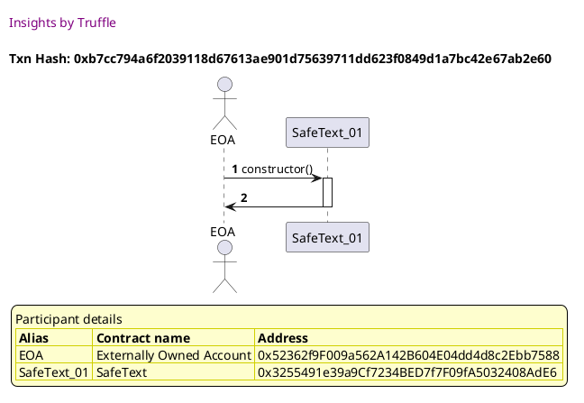
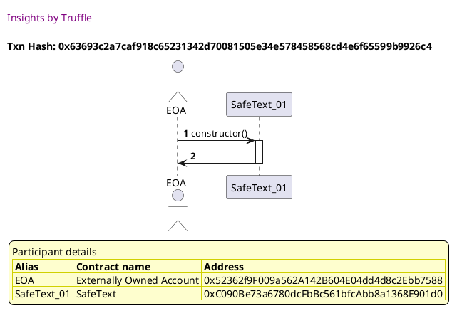

Test date: 2021 Mar 11

## returns true for supported characters
[link to test...](http://github.com/thedarkjester/ConsensysAssignment/blob/7c5b2f21f354ab6c2adcbc9e6ca114bc570081db/test/Library/test_safetext.js#L9)

##### d1, tx: 0xb7cc794a6f2039118d67613ae901d75639711dd623f0849d1a7bc42e67ab2e60

[SVG :telescope:](https://www.planttext.com/api/plantuml/svg/LLBVRzem47xtNt6YBvkwQhRZn0bYg062kgTMAk-J4piGrJZ8SJJQTV_xZX0nyCFPTz_Tv_j5o6CNb0_ztXAY-j2wVbyQJxgtnXsKLtkmPckSNgZgRUlRtkbbQriFT-jYNImBGcPTUBTcJc0uEwEqyV1dL06UMjzyj2ueczjcw_R61MIimyLXZU2Pyj3xWpKtm6lpOO29Y-r5QTsuBJ0wcluEz-pxc0GP___fkcQx2nsKxx3nVLqZBmbDi0OsHmTFgjjDWHvBMLKo4ogfEOqonbATo8H5ocIKQHadKIOPqphXKKrJaMccP5a9RXAfIfIKOCkgWAaNppce3YPuJmYsBJHLSr1OwgkgpSOSmo_A1eShVKB8u0yFyrixtDzFeMfT5tn_Ol_obTpYfu1pvCCK23aFYBnSVQjDK8tjo6mSqxUx5LrHIkUVFm3dW9dWOuaDzfW_EBKt9qEkjJSTOfUu-UTG6ifZCDufQz_X-RSp6lAgmcK82D5ZpAE4rzcQqap52S-Pu8k4Ye8AhOLEArwKfOpJz9RukZN_jO4mud4iCcQYJ6NBMl98B8gLhEMQPdKUquWBckQwI90GAn_h9uyeSOt_0G00)

## returns false for unsupported characters
[link to test...](http://github.com/thedarkjester/ConsensysAssignment/blob/7c5b2f21f354ab6c2adcbc9e6ca114bc570081db/test/Library/test_safetext.js#L17)

##### d1, tx: 0x63693c2a7caf918c65231342d70081505e34e578458568cd4e6f65599b9926c4

[SVG :telescope:](https://www.planttext.com/api/plantuml/svg/LL9DRzim3BthLn3fPKDNJFwGB0TPK2Trq9rQeBaFiYGdHXKva6KiwRh_FiOniaG7IUGZdyX74VBO1Ub3lxE4o3wqhjzLnfFklN5xwUKEhDaOfnTIlMzyspkzR6thuMvLhifbISYi2qThvWI6jJLI6mz_HXFWkVNDH-k2j8LjDcvdN436Ebm2LWYUAVUztrjp0xmr7mQYzE9xbLetRWCH7Lr_XtFsVIo2ZE__T5spsOOEgYEiVL_No4j24wo1zS71i-osKw07dl0yKR7CbAppI2ZEuYHAqbXdb8g8KMQIrB1Cf4mmBfHE3QyvOtbUvNdCLKfGCXMmzFAb0Dd11Cy9GTb2evgzn5RVP6tMvX1-qMW8kB8dX0pny32_zSFz_HHKwxhW-nFxbw_a5Zybd3CVfa38UK3azUfPRO9iR4TcuvY-tJtH9qhf_FC7u1om4hmiKM2FzOEJEtDo55fxqo5soPj_3gtXVWZ6Esdj4Lv-EwEXK0e_Gq287b0r7jVvYj9SCXuNKHelE4rBccgTQg7Yigeo9iGjyRKq_ws1S4bpkZ1P8dacg5QhQg4OZwfQ5LKbP9HmKUOqqXG9iVEnV_A8EtxZVm00)

