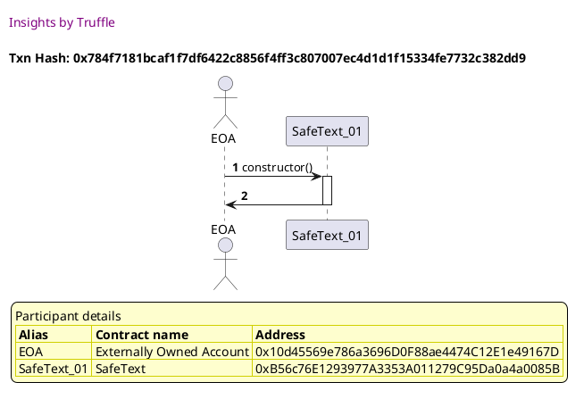

Test date: 2021 Mar 02

## returns true for supported characters
[link to test...](http://github.com/thedarkjester/ConsensysAssignment/blob/4fdae3d04e4addcce97e88f438735f476fc16bb5/test/Library/test_safetext.js#L9)

##### d1, tx: 0x784f7181bcaf1f7df6422c8856f4ff3c807007ec4d1d1f15334fe7732c382dd9

[SVG :telescope:](https://www.planttext.com/api/plantuml/svg/LL9DR-8m4BtxLupePLVTgdRYn0cYg062kgTMAlULiSSGDJZ8SRJGxVxtDI5YmGUFPzxCcoyJyjnwwNotgmcHdMzijrkZ8-r7PVVIoHtKk46hPr9zR5pJMJrlwiR1tR9SblEIa4dhZpLE2VHdYrAZWp-32l3IkEgpiLxMHLrjx0wj3up6NnoM0JnJxZkth_46UAy-4HY_sDwarfNT0AE3wMyl9uz34MJ8_zEsrMRhMrWVOUKwOm8lyPMl4LO72o-otOw17aJ6ZM0PMojfc17Qf3oAL9ObgU76n2gZWbA1YckccM5977E3GiIHYhD8wvo4aIaVIYzV2v0jZ88SaJ0sNwbgBqEhxzBW2W_-5sMzmvK-8gJtXuVfhHtkxyUW6jjwrvtOltqdj_Wfu1pvC0P2pWiYRrTfDNfPrIsP36lwSRUW2qhfzEi9mXv29U4n3mDseNwmSeSdGw6rmpPWbxZfLzzQk0yUdPLrVOJNtnOr54g5p-03H0-CQfuaQOuYIsMSvkc2BhDC8kU2prbKCkGvIyNYblXwDF-rdd2Mf4ga9OloE1UYYECaBYXZaSZdURAGL799QPRC0c7eVEYVF8SxVED_)

## returns false for unsupported characters
[link to test...](http://github.com/thedarkjester/ConsensysAssignment/blob/4fdae3d04e4addcce97e88f438735f476fc16bb5/test/Library/test_safetext.js#L17)

##### d1, tx: 0x7013648185b6f8d48c515ecbefca367bc1cea605555f852c5993cc47d7ca1da3

[SVG :telescope:](https://www.planttext.com/api/plantuml/svg/LL9HRzem47xthpZHbqrTDPiuSO8OAeD4tLChbVV9s1U86XpaE1fqxN_V4I86Vh1zzzrzlllEZ3ssGVlGxMh6T1SQr-tMw5dxLhczzde7DMxGsP_Ql6ryqpcxQEh6mrsH5_aYPspQXcEDCmRzsgAswE7lO08yDRvwRrpGzRokDcw7BX1Z6Iu11O5dodtdzpNU0A_LEuAG5z-BjhPo6n1yS7tsv_JxK0GRtl_bscgp3IsiZx3oNLaIBmjLg15M1mTFkjrEW1yK5r4YKv76wwHChKnDB68qQooDZXArDiAWJdXCgqpZiOcpB396AgkC5bP7Z2GpWKhFd-UWMnZHEM8aMwXCjTVKwgikSOM7y9kBFk3A7Z7MnyF3xDOFz_SJC8rhW-zEx5--iblyb73EV9W0O-S1iPUhPoq6NTKjcmvZ-dQtv4lE-UpZ1z0Sg1AwB4XWJ_M3qpiyEURMUcm9k-JDFlhMQ3y4z4xNzH6U_pYqC3U6FaCWY1y4jpAEamnLcf1kMRBaHPfgb5B9XHZd0cKc4hMy9RwMvh_L4nekuaWjbJ7PUAnI6IMnJDB4AZN6gD0spuGGYx8WGkfyw9yzqaxV-1y0)

