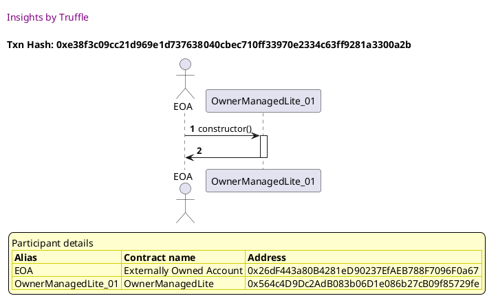
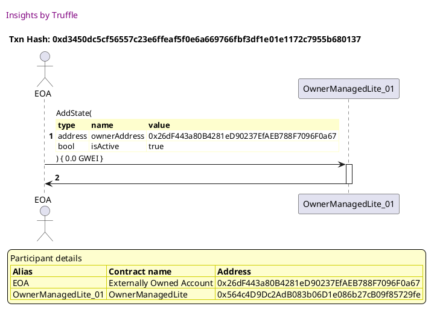
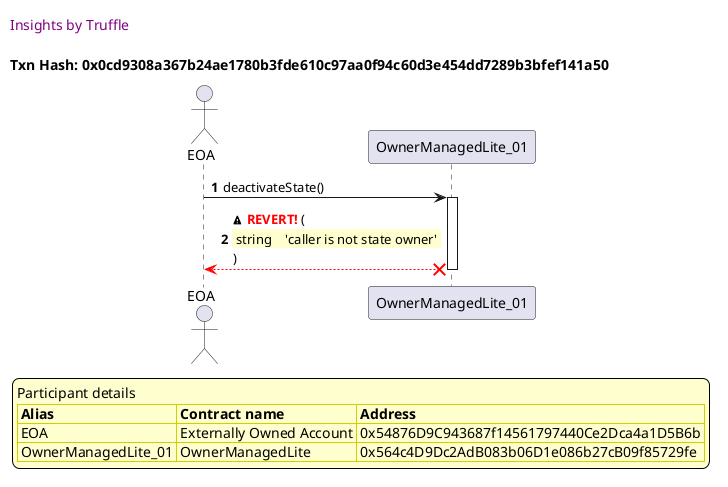
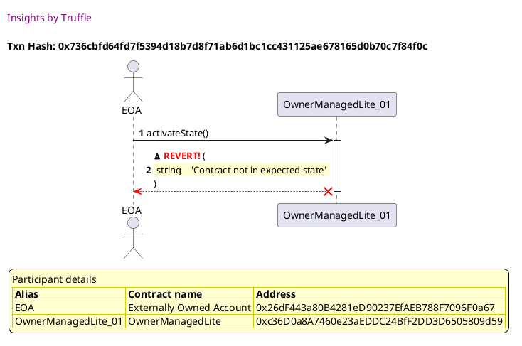
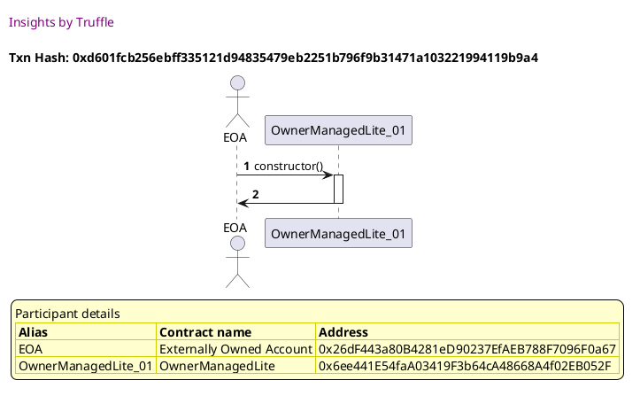
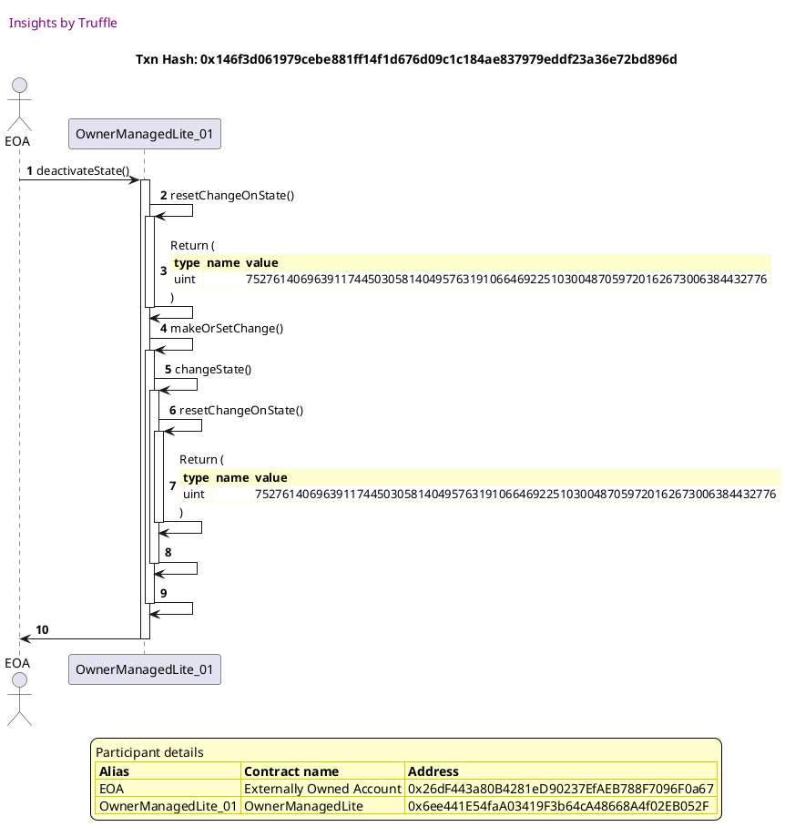
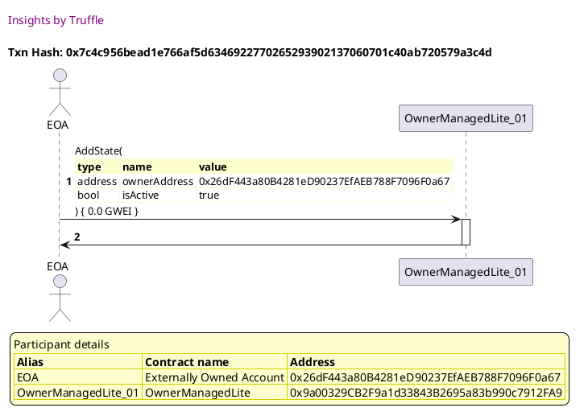
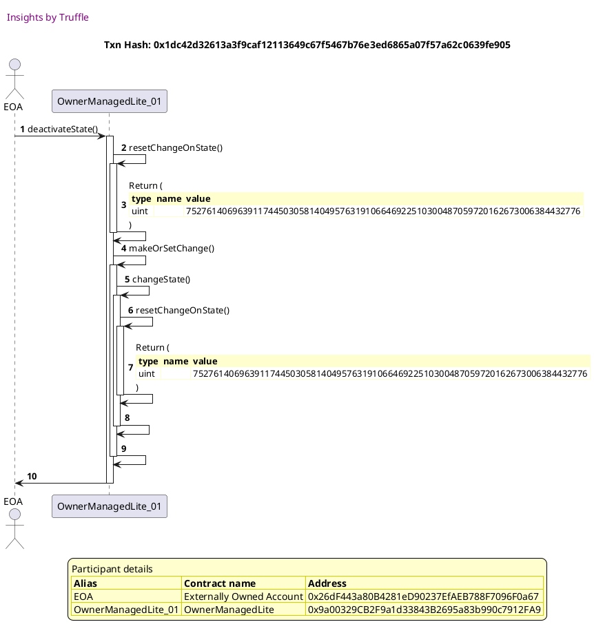

Test date: 2021 Mar 02

## Fails activateState when the caller is not an owner
[link to test...](http://github.com/thedarkjester/ConsensysAssignment/blob/4fdae3d04e4addcce97e88f438735f476fc16bb5/test/OwnerManagedLite/test_activate_deactivate_dapp.js#L24)

##### d1, tx: 0x82b0ab928c6cdc801cc0d1eab10522ca172b1d08cffa1bfebbb6b779b3de477d

[SVG :telescope:](https://www.planttext.com/api/plantuml/svg/RLBBRjim4BppAnREfKKQb9GLaJPS8tv8I8442T3SY-L3CX6PCYWAjTFqtqlBWj6Wre6aPfQpkxCavAuDw4EthGd1BZIksqhZIVjgtGuzRg4sbN5wYUgryatdzAgf6mzNHLxagvoGMHiEjPaJwB-DGMqy_1v-0UuRRzyQ5x1UrBPoM-D2L2p3EQ28v4bor_bTRJuGF-oR0PQUiMVKsheA61sWF_q--peKGORytrrhgqreGHxWnNTb6NL9iA4syB9tS8_jPWfqBn99KKuIeJAbbQ1CAQgPGSdeRP8eP3oHJ5EXoXAPB8sKCfESJ-HOcvHpJQ9bAiJIywS5O0kZk8z8j2rOPNSOMttwvOn_H8ULqGysc9-KzO4Ny14X_NsucL_cuVfw2gfnRV3TCUkdp-Hot57Wf7Gp1K9E0oJF_vIbJK1RjsGsZF7BrPgkAQNpzsyGvnGhZ8TL782F_O73hJa22wszQIDtlZT_xrkFwpuOxx2k3ttB6XPAnSSI8aNtIQQBD1sZeCiq4Soi9pGPyxnSv4ikHC7f92iePloZy2Nh_aVx17oTOSRqRSgEYPOyfIcLLB0icPGo5sCX11yRNiO4qOd13t8Nr_Zi_m80)

##### d2, tx: 0xfafe0b1243c9ee8d15929919d3ad911f591ff5af0bbf188d44fd2dd2a09e6c29

[SVG :telescope:](https://www.planttext.com/api/plantuml/svg/bLFVRzem47xtNt5YBvkwRdO8-O4OQe2mLjhKIgsqbqhJ9RR1gd6GutJGilzz9gI8QRmi3pxxV7UVl-ykX5pL3grhLfeGR5nbcbKXBAcVb5cZnHLeiH26Jx1yMjYgCNnQwSh2kta-pwSv8QFQRRKO4sY_fK0kBBnsHu3hoggNoZZKcLOBinB6-OhI7GFc_l9GSjtOjHP_NToh5m4iFFhka7Db5i1ev_hTsj7dxX6amxynjLeiNGt55Xvi8wMlIvnoMi33ni0rriiXq8r4AMZ1Wh1Vfa8ad0tI84rPoll8KyRa86LI3b3Ief0iINWOIXvm7Y1DHLG6AV6IbSu_FR_D06leUTiZNZQdIhL6J_Nsbn7sEnfS2FvDEV6JiZRmZBz7I9iFb-Fpzt1nCOICytk7Jhn_D8zar7NXOsV7ko_Wjci1tXfSjVOPTUCt-_0TUFcig6lOGRK7o8v7kWaYFW_3FYPq4WO94xEK1lqubra-YPDa7jCqcbECuhTIHLLfdwZgh7JgsIE0isz07-0Lw2SANt_aDxv5vzdiQHxuNWw1aCEOaRiJyRXmg7HzGdD6PvJIFKq_JLv7lvdwCR6-2qV2HrB7lF6kRP1VDqvOWrflsyPmoChIZxJxJm5E2vzhyB_U5Y2UHHWnFWZP7cWIXpIa1KrO5AIoo9D-aYHnNyJI0tWbEZt8bL_zp_a7)

##### d3, tx: 0x957af2b94b2985d13b04fbb9eb903ac0403e62167dd604b664f1d73eae179963

[SVG :telescope:](https://www.planttext.com/api/plantuml/svg/TLDXRzem4FtkNt6ZqjhIeJh4E0bYKIa4TTAcLYtQbtMQdDW1gy51ZbcXO_zzHyXGgx4eyYLtvtVFxyw4N5LEMBTQ58I8bIlDQf4gIwedRPR2YWKKQgQCl1RPqyoMAoD7PL5QE9aaasIK43AetAPGCO7wcIiXbOLVpI_0JMdrIscSA8Q5dfc5CWuHStT8c61m3xbSsMMXtWGUz8i2ZnryTq9ARMRWqSRrkxQ3ouO4QUf_CfMUpLq5wGQcTfNdY4kSTeM2wTh0ZQZcVQ3hg1U8l9j6BEr6OKzwVafPdgQHIYFgYumowYlUzNWW9QSivPpbdWny9PGNH17t2KgMEQIUt0v1LD12so8eczEPNWeywkspKVQBC6Acv6Vjr0_grOb7_2r2wltGYO_7uUAY3rXF_nHEFJXSpix9ySnrvzk9LVBx3cgFsUd3uFspi0RbYs6GxPk8EN6xVPzyJUwdxzhjmMNjZ-7iqJoIGTFZ3usDjr0vkvD_2_YUPg8eK6jTWIaTXf0Gb3isfx3TxJydKlsb-xyJxuUBtBsIJ2edT56zAZ-cOqfflFq8E4Ee7dwCS3WiWeCH2xLp3AMqgiBOOH_ItRK5rxLJrY3PJTqE2SCimq5s6ABh7Wi3Fev64VDv6EGUwt7iRS0O7QdkE1DCUEFUDK_V0Xzhwx_Uka0mve9xiiSyEM7iEc0uLIaDFTwDyZG9_J0CSQA270kW4eqUv0fNl99_0000)

## Fails deactivateState when the caller is not an owner
[link to test...](http://github.com/thedarkjester/ConsensysAssignment/blob/4fdae3d04e4addcce97e88f438735f476fc16bb5/test/OwnerManagedLite/test_activate_deactivate_dapp.js#L28)

##### d1, tx: 0xe38f3c09cc21d969e1d737638040cbec710ff33970e2334c63ff9281a3300a2b

[SVG :telescope:](https://www.planttext.com/api/plantuml/svg/RLBBRjim4BppAmZdqY8DkX8LFGpNY6n9I8442T3S2ufSoKHeog0er4xJVoyj2qQ3MWUIcbdExiwIaBlUSUk6hIQ43wupmxP6I_fNPNRSyYtLsAAHAovUMziDHguxtLbwLPLLkIu9MVJke759wFXja4kqzFVqI-bzPzLRPnpNkLQjsQ9nNh5nvu3AaoV9tM1t6ZyGFzGRqY0wOyzSIcLQ6i04_HdtnTUf23Bb_svwrMvSJ-i3VR53qtXTufJJI5_sXjxpVZEdi4UMDan09aGOo2pEC909IsAMGWIYHf44q3ICPGbWo5WaOjOqMPW6d3407jR4MoQSBxryoYdlwSplC-9jSqge7VUjFlqoQ1-vuItA1-Nm9mHZu0LyHiXudzuiB_Fq-dfEHMTwPuTZra-VoUMuey19wMPE2JaDa3p_KvP4nvNkoM8QuvUh0We0MBv_etvEla9_MFi1MDyVDNoBHo2NqcBlkVEzvVlOkb_t3gtXMX_6bYNDXV2FnNaAzc4igoXYF8LLvDt38eEG9MMJbwiaJQi4ihW27YSVXIzPzpyw9hYD8n4LMI72NAuWPJN4HO2GndMOY1LaJNgRX5dZWubtOlA3tFdLF_k_)

##### d2, tx: 0xd3450dc5cf56557c23e6ffeaf5f0e6a669766fbf3df1e01e1172c7955b680137

[SVG :telescope:](https://www.planttext.com/api/plantuml/svg/bLF9Rjim4BtpAmRkfKMQbjeeAN2DoB7S16YH00dGIu22uk88eIc3eb8xSV-zOqKnNDINwi0XXxFmlJSYvBprtFbkQGZXdMzijwoK8-rZRLVSyIKOjL1MJhbuNBYci_AYCOs3T_DoNbwKX8nRlp5gGg3_7XINoi7BS0IuR5pzt5ZFJM7gXLqgwx6Yzlk0ELw-bbnrRcNKNnUtzRE28DxxRhYKjLr0G0VNxzwEFm-F84F_AzlMYmVVGhM1EzTfZNM9hxrHSBUsSCdRXpEWQnd52PKY4JfXIPAAC59CQyLregbYdB4yPKnNEf8wK3HGGP268isJf68P3QAK86N2uzFBwm9u2oEq8uAq-LhKAuvGhtzPvRvponTAVgkz-ac3Fl28VqH8dm-da-FtS79o1eMKjvvxzVxUtfFneCB7mKwsNy1lLWhGMhxixHCt7MvsuLj0-fngMzX2isjGx8zq7J8vZ-E8PtGQXrcWPZaDexJKHJbDisoUqfpDAMVfMwcgQGmcrcqXVFs47S2xjqOVu0Ne9mfVVvHNAD5nD3kOhtXFpu2Grp4ZDmVaIULvRTe3c3CwevJkOE8q8O-ukS0nSQZ27l0Ur3vlikq5mdNjbRFSc4qlZ8H221nf_vy471O-9l2_thv1mc8Hp_AP20ivfLbKKJR3iSfO5QPYIdET9McOQmmcoCJ01pd75N_EFm00)

##### d3, tx: 0x0cd9308a367b24ae1780b3fde610c97aa0f94c60d3e454dd7289b3bfef141a50

[SVG :telescope:](https://www.planttext.com/api/plantuml/svg/TLFlJzim4Ftkl-86qe0oXDEu-O6wYBPfnQHD843xCgR9iI_58dKgnns5TV_xhct4GEkYo4xkpkzUthimTjvuwVnYLZ4c5xwsYrc1ZZKFniwbapEeS8fM3wLwcBfwOVMehce7-vFnP3mQCzPl_5E56OFDTOzIeuDVxIl0HUtCSsszh0QLcTePMa-8fNyfc51o2pbVk7c5Rn8tvXaX42-nAwcriLC8U1lwlTdxfoq9rlR_P1iplVSD54zmwnPbIRZC6ryXt2ujNCZc_WpuaYkTXZoHOHGNNI4nY1DUXAN6AE0gZQNaPIfKn7M8eYUqZhj9MeH5YMKW0jdZZ2HJdgYFBmSW6zYZVO-HRDueCvVqgPUF5jqNQUKKzMVZyGSFDeKxudkCRSx3IROx3yV7Pw2HEfgVqkEDf-NmYEskNPvystUelw_1jgWdPz1__oYT9G4pwAkjZLIJTJhNuw_ZwzjtdKx_T1FFuF3Eth5-w_A7TizMq7YtDc05T1yeMLMajcd0rfvIH0ZgDPi3MAtF7x6_TF_tpTlnObUlHDFefQcQL-rpddFEizL7e2aY_UXXHEFX21oidE4wCD3QOKEvbtD4TsqChKkFpXBPfuqX6WPAqIXxIl5bJoHnbAUZL8HH4fEplIY8qrW8Fi9khgIGGTuRHiLRu5t6_XlTDeY44dcQg-v03taI5ZpA0-H9L7HZDUHfcVJYRbfICICbMZtOEQtqK_u1)

## Fails activateState when contract is already active
[link to test...](http://github.com/thedarkjester/ConsensysAssignment/blob/4fdae3d04e4addcce97e88f438735f476fc16bb5/test/OwnerManagedLite/test_activate_deactivate_dapp.js#L32)

##### d1, tx: 0xbbdfb1d4b69677c82e6366c4a1f469324bd5ed2fc9ba42c7114643cb1bd559d5

[SVG :telescope:](https://www.planttext.com/api/plantuml/svg/RL9HRvim47xthpYbBvkwQWOS0r4MbGHG9srgfVLzChOXg8w9ZD6Ihlllkn0KhLfuiCttdR-x-yw4tFTUE3_i325Yy9qTTfLsf7zfxLuuiGEZ6stLMiYNndM3LPlET0vkog8iDWKXozuVZLuH6B-j5aex-3tz0Znqhdtjh1ScCsrZTzfwLApz9Q14yYov7zpUw7V4Z_PLGy0ks9DGghKD17I2_epxylDK19doVxLzssnz3zKHdjrGrwXBVEkDXkU3XGVHRnT03rMbwYfGhE8fZsEPX9f7d4icWfhnD0fPfUPQXRLCAy526GS1uooILO3uF5LpWfP9ZwKNZnc87cQupmZQvblPxWMs-lZBQlTTMD5ezQtr-YSDni0h-8oGyJxShQxpS7kx0DdPthlXbFN3Ht8zxYHmLhfR027d0PAdVyfIselMz6GvZV7JJKvpIkdgxGlWdB12F6nm00xx0ojs-WHaIZdT8tUvjteRMyVruBMpmfZZsBA2J4fyB1ufUWYvAXcBH4BNB4m2dQSqZEAYpefrd2HbJ5DUKi7ZzyBNhFiV7HF8YETK95dCEDLX98eytuHiNPTXdaSvdzDvGd5SAIP09oO_o3sk-Ep_0W00)

##### d2, tx: 0x93d54051b3618cbbc3b239e044ed049715b3620100cd6a79a7737e00633d6be1

[SVG :telescope:](https://www.planttext.com/api/plantuml/svg/bLDDRzim3BthLn3TPKFNZVw8Fu8ig1FRQu4DBT02knGOP4j9XIfo8CjTqcR_VOph1XsMotmG9L8azTwZ6Jjl7RUkMsd6UESQqwqgQLdxeCoQMxu2BPVIY1cl7vQswOoODxgnyAuioc9UC3PftLRBAOF-kvTSI0lFmn7Weh7ggJ6EwqohfLb9uwZYmXqkb1HyARdkx5hBlm8twac25nvyrrm8PPRWuU3wtTl9v-4HREX_QLgrl7SjL5kujTrYGNMPKqvBkDqOkE3j_HXmamPY5EB8guB8I-gggeFA3rA9OIW5XcdiZIZYeuTOYuZ7AO_Z89Q8KH28g98U8yfgHqylhZBWBPoGFM54crErMdE2UlNBIFkT6xwKufjoyYTw_SKZ_XF6-dmucnwFm-df638XRXntylsTkMEJGOMFWvtkle3RhYMGDNpLsqUkEzhih--0wBEoRM47pRv1TZZYnez46OO1Jt0M-eadynJz82uMMJ6BawICCOrAv57yMgfg6as9girgfnwf0pZxskW3F0D-GlZwexWaYOwZsSDymNis1iPUnenTlo5FICULRj_0p357n3rCcYRYaJPp6XDBAXm07q0TygQxNY1QDqvQmxNUzi88oEgQHjhz9m5l2nyJ-5zltw0EeXnvaiLXXD8FU97dSp-SBKe_puCy6k4emLICKcf0J0nyi7DQwUVy0m00)

##### d3, tx: 0x736cbfd64fd7f5394d18b7d8f71ab6d1bc1cc431125ae678165d0b70c7f84f0c

[SVG :telescope:](https://www.planttext.com/api/plantuml/svg/TLDjJzim4FxkNt43QK0Pmdbfag8kecqICMaJ2D2-Z6box4k9I9tASQ5btN_VDSqOQ5qK-PAxytEFdpipTjvOOUnYLZ4c5hRMYrcEXZKFfPuB8sPGuHIr6WlvC3NrGgj9NTK6zhCqIoSfOyF6hYgC6RJFFGg51dvslm0NjIcVQsr5DQhAgPwXjeHOs9U4Z89RoFd2p2jy4xWfdn4S_yLt9PGgzHGSthb-jNPusf5WNVrFkYcdzxQ1V0MtPb4KXCjiQIk4swM62z7Sdm5VXbuWyq85Vg72ekyDVEL4UQYY8dH47YWdbuwKlkSuRbzW44PEq5Sy3xaCYyWlk6GacRH4FRqSWMXWZ-mU8zbiASkveADUFcaqNuGMKrIVIui_kDCcxl3lCTRkXvDuTnoEZy-0wfMFmkADfUNmYEtEN9vyspUelc-WjfWdPp1y_oIC9lbY6Cfj4oadxlMkqw_fzUsxNczuslfZEBpJTspOzVX3P-CrDDPiv5y3lGSJQf0XFg1h2wK6NCvHMbIKHTmEOBq1EM8A_t3-tx6t4yQkNkccq8goQbvnI7Z2EO_N7u46YIIaZxy4n0mtZf5I1XkAlUmZpflUqBgqQBIegbNR4mKZAMcQBONuqWrKvlkUYFZOToC7am5tlJ0jHkauZA8iv8CWuo88tmBlwks_thQ0z8A4YsWK-W57rnDfaanSVrnaRf9uIT3d_OWFL7z01KY9JWzsJYlTozy0)

## Deactivates the state
[link to test...](http://github.com/thedarkjester/ConsensysAssignment/blob/4fdae3d04e4addcce97e88f438735f476fc16bb5/test/OwnerManagedLite/test_activate_deactivate_dapp.js#L36)

##### d1, tx: 0xd601fcb256ebff335121d94835479eb2251b796f9b31471a103221994119b9a4

[SVG :telescope:](https://www.planttext.com/api/plantuml/svg/RL9TRziW57tdLw3qPLDN3J3-8CgYEecjJjhKIklxXCsrWqfmXB6MTDr_7t6iQDNY1y3dNCwzzrmGkk-zT7xO6OJau3ixx2fmg7_HTY-Tt643BLYralLBwxh1gdLdEeTlog8irWL2YzuV3ImH7hyjI0KE_vv-CNxed7xjh9ScDxgrEx0-A3R-4b06yYov7zpUm3lYXtu5JFa5Uv9AQTjYIYRepxWlFaz5e2d_LzlhTkjxN1tninkQ9kWYhxq1_7om-47sspac1vKGsjGLYnEecYQAOige4ZoBOfuAg1YBQPMAf15LH7bA9IKHOrG8JgceXEGeM5RxK7hnc6FPurdOPoZOvdMjzpAq-lZBWlikhMn1VTCUVX8w1bx1PmYDz_7TyZgFRs_dkEvixzrmolhX8xeUTn8uAztDCKBd0QAdVyfIuAKsFLfCO_nqio4RGiZoxGiESmeLXiCw3C25_h2LEpW1kL8E-i1TxYtVnjR3Ul3Wh3JcEBQiS5xNuR7uG943IrJ9UIGpik8iex0HX4LfqUJ5AisoCYKYAObCqlV2rwpx7nqJ902SqoBcZSn9nAaeeohXTSwp9CbotX1Mh4ZCof0WE37vWUx36fxzNm00)

##### d2, tx: 0x9382cea9c31db99cc01558ffe2c0846e7e4de799c5a4fb2f1ac9d4bcbab12d01

[SVG :telescope:](https://www.planttext.com/api/plantuml/svg/bLDHJzim47xthpYnbqsCpKdTD46i8eLa86q22QIz84sEVIaMhbCv3ckX---xXb0nhI_BWy--yztv-xuBOwTja3vq2ykOx4BZkaM5dhKFnYsbbmkmE4UdPr8zp7tJENtMsCR3kx8eYxE2iPCsh2rE6VJVFKgD7fw78y15uyrJuuAqkJLpjq0Ng68TTXTA2hwKN7P-QV6lm8rvGeZ4pdSjjJPk3X4VNBzxU_9vU0GR-b-wriplGmlL6cvzLzTKbmKJBCBjoi65RE-FWQ-oKHehb9aQHRhACgLuD1wdTOsnugb8S892uuG2OodgAguZgJ8jAbN9AeerZnXHfW8zlRZAGRPmGFQ04Mt1ABEK1FNgbqF_NJevH_tD1Fp9e_xY7ly1Otq-74ttn-7my1XohM-23FZ-pjsnaq65ZuETRhv0M2yHo3gvwEsZj1rjjjStGFHvR5lOGBDjaE-EV1KdkXHY95C-4t4QuNd6uz6agFDYDadJSiApfEGocRoMgfh6Kg9fSnNC8tM0u5yRVO1du9yuVFrHN994-z5iORxWFJe6nbx6Z5s_8KzZaCQsRs2UytFE-HOcJHFnI9ip6XDFAkm0xq3jygQRNY1QLm6zazQkUs4qv4hHI8V_9E1juNq2_-lj6oI8GaJ5MDGovoCHPUMeIeJAHPeaQIvg7XSpFevBQa1C37omKrhfv_m3)

##### d3, tx: 0x146f3d061979cebe881ff14f1d676d09c1c184ae837979eddf23a36e72bd896d

[SVG :telescope:](https://www.planttext.com/api/plantuml/svg/xLLTQzim57tNhn3TIqTN9jcoP9Skr4bjEjX8MVfO68frdPWwIf3bBkco_xuRnmij2tieVPmnklBzb8vqZmcvQhnslbtKXEZMBssxc88ZpKDbLzhf1QrX1jOCTV4mSylMcj6oNZhwBi_oR9GHSjduJGq3Ghjd3jg0ep_xJqflbgvwMbglwxIkPdO1rcF6qXySSZJkKwvQjwhXXM5IFG7bug2xrSPKTaOvwrM_EddviLy4wUj_jaqrc_k6JZVqphLbYNc9htmDz6vjwOrkvXUKhRcGPMYOv8bA2fX27FEovABaHYffM5BmWiT2Gnmgz01ZoY3KeGGLJ4sSI4CGiiBZqhDnIdL3Jr2U48JDLqMrqhZLyGyBxgksUWRcI-NXE-ETun7z2I5TF3qV7BVJixCBQW0hLe_QmyJZSFgU7FVzPn873VZHNDiPZEqhyvoVNz1lu5jdwUczlIUN_OtuqCl1zXFrcnLGb5OlElcewnOdE_SjRIl4PqlnLL6W91TC9Z9CE5T2H2naKOmgaKHAXZpXJ4eXao28E9gOY1MB4XKmBWEfK273M8WmK4hkqxyAbeL-WB6R_87cTTWMNUp_mtdBmzbjvurZzfssyo5xWYEtpzhMWDTLtJp3xPfTCyPsk26FOGVZP8G4vR0R3mYcnk3XeUqGDzXsr83ZseEpkgut7IKOcXO5akaEOxOEfCaH81speGXY3jS92qALbMasL76SAvR8d6cfNYO-HYr_Qxi24a08daMYr2aB1K_oS2f5aOfOoZWL9Gko8Ok270iW4ZqUv0f7_2ty1W00)

## Fails activateState when contract is already deactivated
[link to test...](http://github.com/thedarkjester/ConsensysAssignment/blob/4fdae3d04e4addcce97e88f438735f476fc16bb5/test/OwnerManagedLite/test_activate_deactivate_dapp.js#L45)

##### d1, tx: 0x289db1462de446e144165bde92eb48a6d9f8db1c8266a09e1540d9eee2e84b8e

[SVG :telescope:](https://www.planttext.com/api/plantuml/svg/RL9HRvim47xthx3IbqrTDGCEiQCiAab0dRIfbTRtwS07GIKcCaPBkkw_xq9Gj6hXmJRVT_xkxZipTjzvSBxVDOn1xrlRxt9qh7kfxHuSx7Y35LgpWkAbScrlpRfjMiTliZHBrobZYyuV6rmoFdnR18EE_nv_ENzeNVtQMWzDqjILtQ7rf5ZwIq16v5botxjzW--87_Khya1Ui2SmfhOL3yG8_HdsnUUn23Rc_sgxkjhwZkT7_kpwiYHTvclV87y-MFu0tNREnI5KskI1Z4E3KiOOI1d4qzoW3Z6N2cAZIqK1XGhZ68J6O2g5qOWOefAv8aq6XQVIqyU4GySdj4yOsURheju3jVhuowBx3XOgDDzgZpz5C0HUmIUC3VVvtV8wpszlvxneRUTTVyhwuIEx7dSIE2lTpJbZvm6oft_ACkYXRZgs6CVuwMOZDaA8vTiNJdEY2kcmfW4uwezRsE49I8nns15tkRTy6rgdzU3HMMYQuz2ouKbHq6FnH97DiScaZ429bGnLW1ijmcYMbacwcYcLpOIECm7nxBtmDUl-HuS46eI8GhrUXPc6m4IHaj4gZFKKL9HhBOgP3i8iqPI0d1ZzOFUqqhF_2m00)

##### d2, tx: 0x7c4c956bead1e766af5d6346922770265293902137060701c40ab720579a3c4d

[SVG :telescope:](https://www.planttext.com/api/plantuml/svg/bLDTJzim57tthxXYBviOc_FHk4Qi8Yt9GDe44aXxGPfkOxTOk4xbEAo5xh_lDeIgq_goFFZQr_V3vvmRniwRW3wq2yiOjg5sxMAgFMiUZLkYnmLOFTTEZR5wdFkwTMfIszh3kx8eYqd1s5aJrbQF67JVWqQbFRpqHu3BsfldsWMqkJLpjz0kKCLPs0MKTFbQSjdwfTL_NToQPmrHklFTe5B6pI7YlUjtPyy-zuzWVVyhrvZvGsXWkeOxtyvcL9S54wo6kvM3IsmUJe6lH9LMSf1DAIdI8ijmDb1PacOoZeNWSJQ8PI9v72M2Prpmg4evJaNC1q9YKgMA4MLLeASNrpbW0qTaZnZH5anbbaXGhtyvxR-ZmxbMtqpGFtdK1Hxm7p7MvSF9wF0z71-VGgxKRS2Wtz-xUtRMg_2njwFD5mZhfGQo3XUTVKBRqcORlW6Yp-kcWGtKsmRvxiXNSQRAD4rmoCTfF8pq1G5FH37BYx4O3al1PLPopCHRgMbTMqeqJLu5yqGT8FYtHX_W1VWd3bz_55SaqM4qMvYlU4zEWR7NCMCtU-Gf7T3OPW_c1R_Wd6zXqZGHZxIPq9XuKc47U0TgbpVQT0BHkWhQExHstGcZ8Ayg6kdmdmJi5puayB_Uhe54pfDOJiPnAJ5IIJ9Cat6SoG4EawcKl18oYijSKWDYekU3dTDAF-SV)

##### d3, tx: 0x1dc42d32613a3f9caf12113649c67f5467b76e3ed6865a07f57a62c0639fe905

[SVG :telescope:](https://www.planttext.com/api/plantuml/svg/xLLRJzim57xthx3O2nD3yoMnOyGgsjA8IPkA1ez8qsdib8ZKhHo7jQpxxpjDkmgqQW-8nqMHZtEkpdTolX1oqKG8iPtLX40RvxwTJLmWpKFb5n1WHcitTTuEe7YOXddhxN1UpmDzbu_oqN14o7aJLxNh4TfTzmwi2_Jdxf7IgtcedkO-GjslgwcVEHynOndt3ZaQjoaNRLZKxeNXfdfob2TxtJLOM_afvMod-jN9yu-xGv1T_S--gQRtiQ6J5RqDRLbYNXAhM3jwk_Jq2fhxCygMt1Q9i58eBa6Mfe2I2ywbIaoXT9acIa-qSj9PbQaK6AeqA54m9Ktf34i9GbP4FFfetAVGq2EKHmHXYrLHBG1VTVp3k_0LF4oT_L95zvtnpl60_eYGBfwUzWxRwSd96RKEArQF4DrDnENuFJdi-yyamJKk3k_1JztOlpBFwUaP_UPY6pmzllDtv7ptHNpOoTxw4ushXQCeFSmw-GXrYvkD-vgs5UApfdZhL6Z54wOC0ikvJfAKIPPcg4fCgfNaXZEb4cM4I3cQM99fbXej65T2QLGecIM955ghRVfNmJA31pSEDt-WUHssHHVxlpblsPpDwxnnp7RIDZvaIt3a-jdOMXUXgfjdk5soIyRO1ZVaCPnWt0oHe09Eunx1lhNOFBJjuthhZXfmNKONFDJrggC4I_j5WMIwmPWjXR8v0WGP6oGYu-xIC27rgEoF1ZhBSisCoXae_JBn8MhvMziLCC2O56Ou4Ba1RYNsGmw4CYbaSc8CAxJX8kyRB818xF0W5xZYR-4t)

##### d4, tx: 0x10cee2c107c19f472fd7f7f3f345173e2a52d5c4b9ebeadffa04e450ae0d1e41

[SVG :telescope:](https://www.planttext.com/api/plantuml/svg/TLDjJzim4FxkNt43QK0Pmdbfqw0keYs9cBG916XVnZHTuqknI9tASQ6mxh_lcaQyQ5qKsSdT-Rd7psCBSLexj6unAuN0XQlCOZOXA-fxRUPeSGObJSce4URtKrijZ1fNPMLXDqkpT9mACQZTKqc9WEQv8rHauNVx2t1UMVrS6OVbiDHJCoFZ6B5mBmKP9pUGyuMTb_GkSQsV2Rpm9NQ9Icap1K-seJ_DF3XkIOYs_nTJw-cTgs7o13TsKHICAvns9S7Dqi0vrdSd89UUp8dyt9DHxiL56Fc5Yege28eWx7fHG3vsVTNDmqbC4mOk2fGXXLs999L7eITOijmnzVHY25Z33iyxWcLpEjTpvArUF1gotz3WbDHNxUYNz9h2BV4T8PhrS9HipyFXuGaeuexw0HrTEnxs3yJsskNHZrrBwkSQR8DwT0A3Zuze3GkOm23VsCWrIQTpbNvFhsu-T3g3uoQUmFwjkHM3rkLFxPoie7PsRS0A-DqRiqMM-O2f76W3j9nJxaXn5NFRWzKQv42ySlxVnZTdJ5o-KKwHGrtMRpYSoJCfPRBw37oKM4J-U2M0Cre7XafPgZdtieuvhztXSUd86YpBfyOL1SCyv_FiE2MNVazbOHXWNuv2l-_HMIpz84gBOJgA-lqiad4lazYBtWDlS_VVQDCWHYa3FnwF_2n6JmL1Fmn6VY_kOZ-OnB7CezZpis7C3LY9LWznoYFVpBy0)

