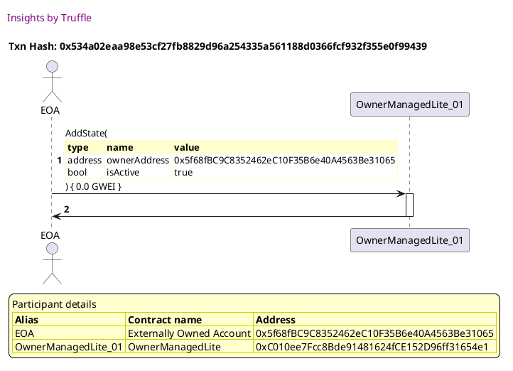
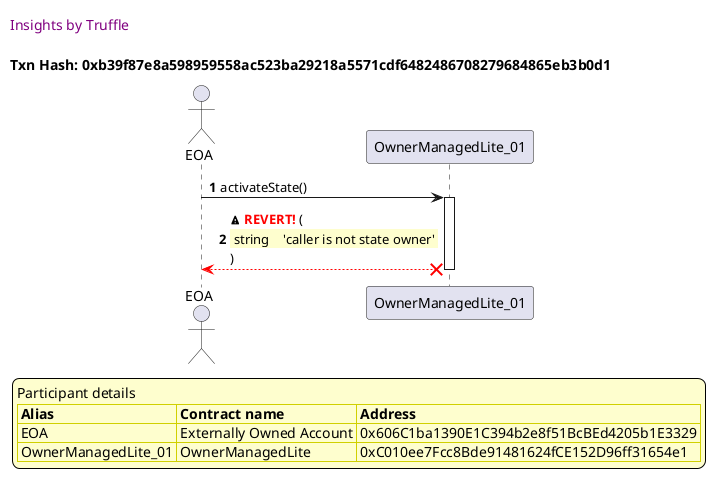
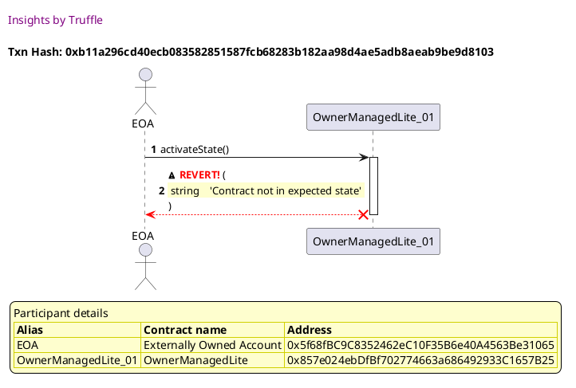
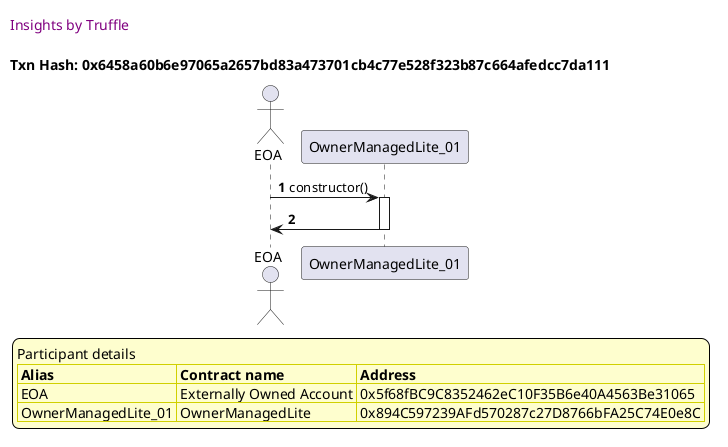
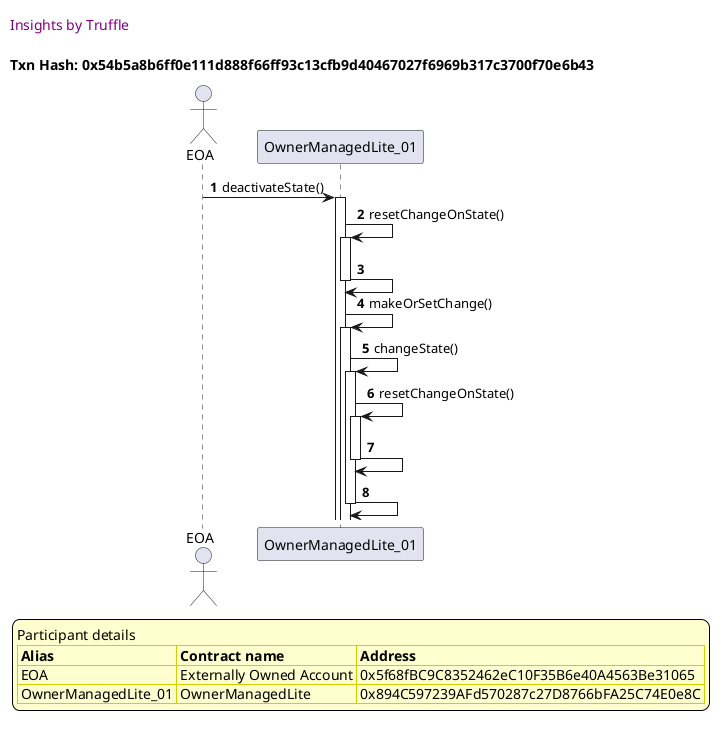
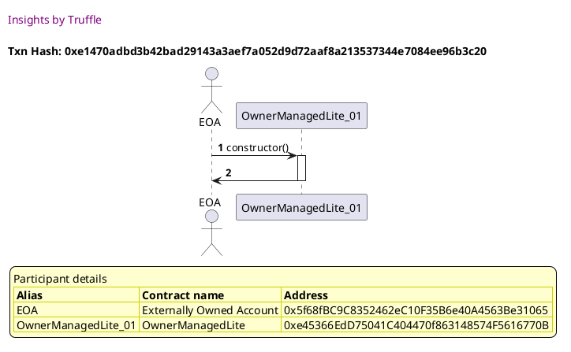
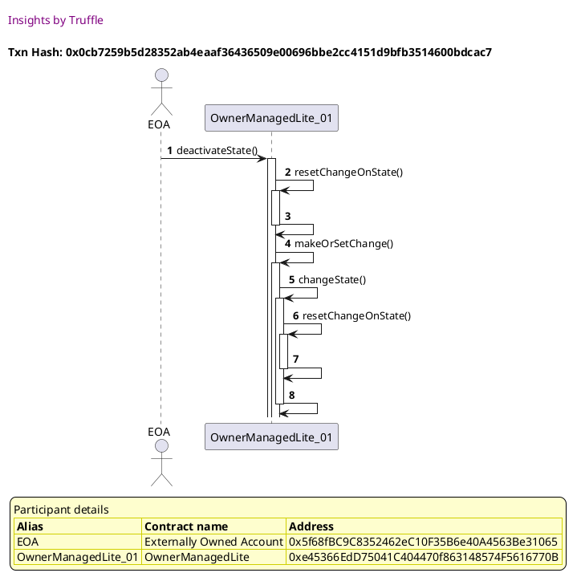

Test date: 2021 Mar 11

## Fails activateState when the caller is not an owner
[link to test...](http://github.com/thedarkjester/ConsensysAssignment/blob/7c5b2f21f354ab6c2adcbc9e6ca114bc570081db/test/OwnerManagedLite/test_activate_deactivate_dapp.js#L24)

##### d1, tx: 0x1846b747e5b85e2d37287386c60007056ec96049a9731a669540058c3dc6d103

[SVG :telescope:](https://www.planttext.com/api/plantuml/svg/RLBVRziW47xdhq3fowQk6jY0xIYBcZYEEcbJAwtl4u6pWqfmXB6MTDt_Fk9OqQg51txST_VTtNSWTDy5wKE_imZ9FhIktst0e-x5kBtqSeSjDE3qKggNnhUzqsLhMuzlrjMwAYk4PbquMfWZFAmjI0qU_nwV63-qthosBaYxiAPnEt0XCjRXuh2Eu9bot_kzXNV03_CAcBABxKbgRLo3AHbDVuPpzdai0etvlxhEDDlGuSqHF_k-hYCl2YPOmCy7XnzajvrYSg0v4vkCPS0tEOT4frcIPsakb224P8GBK8KWh915bb8fHC4P8JnNgLP2KvAYA9aAiVJgSO5bXoVndA0eMp3Ax6LizV6N0_zTEjc0_cO2_2HqSBnYdo0qnEEx-NKStzvEiMfT5tn_olhX8xhkTo8uCzrDCKBd0QAdVyhI4AIn7PgDO_nqioAhsFFyxGkESueLnaiP1-1ZVzZ97PmC2wqzT16xnCtVXjRZVWZWdRJsEBIiyKAf-5b2XCY1roAlbsLHvYbFc4YWf6ITygK0HXQCYtG9AIM2loU-9jt_rY51IIW1oDPAvKiD1MKv5GchouhoP5M8kawfu0nYF8fAZ7gW-xZ7R_yN)

##### d2, tx: 0x534a02eaa98e53cf27fb8829d96a254335a561188d0366fcf932f355e0f99439

[SVG :telescope:](https://www.planttext.com/api/plantuml/svg/bLDTJzim57tthxXYBviOc_FXa21MaOPs86q22QIz84rkV5qiNATo7DP2zzzt6qB5jBui3xxszVtmEUU6iRCsI1-wXMLCTg5ntMA6dhKFnYsbbmkmE4Udnh9-cFkcSwfgREFXtNGodLGJnaxRiBOuOj1_zoWLUdWUZW0NZJTFZGlIbjRCtG9Te8ewx0AcTFbISjdvfSM_BcxC4qAKxdpNKYdZvX3nmVMxjwUVXqUmeV-bQytyFhGmMyEjxxIckYoOO15kLmukP7j_0dmbabJo6AKiSXH9hUDZFSlpk5159cEH9ecG8ekYF5SyoJ9TwoA9TI84SbqKQL8megmEzFJ9LGcoXGEo1une2wOsIqbGhtuvzD-batDKtqp0dppg0_Vu3nZhy-5ejFyU3WzFe5Jg9iY0x-_S7JiTLFWusD7c2uJr4e6iaulUFahRqMORlW6YpsFRmWQQRODoToGkT9RhSLLKUIBYD8knYlWq4UCCKrwc8al6c4Gy4w-bParZAT6qPHtC8tM0u5yRVO1du9yuVFqnkII9zgFPmdp1UtG2ZBsC6Rj-Gvx288rjty0yv-USyorCcYRYaJOLZOad5NQ0Tw1sUQDDBn2jgu3UIMlNlJ0AohgcaGx_IS3Rmli4_jVRDwXun16FftMTZnKMKPf7MPpgQXA9-Bp8j4wYJAH8-OoO6FXWPxJIp_a7)

##### d3, tx: 0xb39f87e8a598959558ac523ba29218a5571cdf6482486708279684865eb3b0d1

[SVG :telescope:](https://www.planttext.com/api/plantuml/svg/TLDjJzim4FxkNt43QK1PXPst9bKNqQQfcBG916XVnZGvyQL4f4xbkAEmxh_lccO8j2wAREUvjyVFNHWxRwmqThMe69ChM-lL8aF3ceTIBwMH2wXmZbfDPFumD_LAgwIkQWE7itIM9YbZeyO-LHWpQ9zxb0eD_Ee-0IvgKpxNsifgN9LplK1jAMDXNnncPDobNAxCii8tXflo6K5uBzYLLAhKSn2yWtwt--Yi8y6w-fzqKyxlRGFP4zoQLL5GNcPBMo7ShZLSoEP-27oTkL4H3Z2KVXH6VkJxeSnznysa4pc2K7yWSbK4NkXuOJ3WeJE8Wf2EFcPknfLW95bkYNfwEGRPm07j1unaisLUBYLTzV9He_aYjPoZ-bnQ_C55wxW7Fs2iZOT-lDyEfwT3e7hbJsdnnj9oVCBsUwxxtmuDgk_RLBkS_I6CtZzAeqc-64Rvheda4_Twr-dNzFhsNQytEcln68xlz1qRTJt-qEtn1Xfhjl9lWDwZN5OLQLqse6jB9Y84zPRD4MosyITCuL-w_xlnRhZOrIl955fPLishybC-vPp7cuz0CqJgqI6XuJ2K7BHSu1OOAsMm8TjB7D7TjeNMjKMZYUnJsmu5upodGRPaukk01ud8f70Zdeh4ZRpCmR3mnIIVfCfpk9-9r7MTw6tYVMtz5sqB95nmnC4ipyE9maXueGWShqXIuJlJA2WALmI-XnJFI8bE3tPEA_sIVm00)

## Fails deactivateState when the caller is not an owner
[link to test...](http://github.com/thedarkjester/ConsensysAssignment/blob/7c5b2f21f354ab6c2adcbc9e6ca114bc570081db/test/OwnerManagedLite/test_activate_deactivate_dapp.js#L28)

##### d1, tx: 0x81c133d1e1b10e871a27760504d5ebb97675fa0b4324e0834aca4d49dcda7010

[SVG :telescope:](https://www.planttext.com/api/plantuml/svg/RL9TRziW57tdLw3qPLDN3GBOIPH5ZTr4dTIgbTRt2SErW-hW26CjwRh_lXl7YbOjVW1ypkNSZmCXjstK8NRRcX3TnSPtsm82QL-Tt-cWjxI62hpDj7cjGjDvcpTr4-ZLUhLUvIj2vcqyrB0WjFyse2q4-dlufVI-2UwjyL7NozfLVWi-ec8Ppm5h94-IkoxiQlX0_71lGBayOy_QMkShoja0_Udt-TUX23Ba_-vRLsrYIui3VGbTMQ8kYIxMG5_sdjxhTZEZR3_XXWjXEV22CvYaN8_JD66AIQkWAAPfagfIiqAAiGGs4L8RBQsSMcDroh0879c9MFhgQKbrIqUuZmYEBJhZTXfRVVhb8Jnghokm3ox2JyRxm0luY93-FhrPNERfzVMCciQtCNJ7h9y-ayjnHu6JqisC4d8oa3p_KvQ5g5tTalbWuvUhEtR765kyVwFe4rQ8XnmD2DWVzNeBHs1fRO0MkVEznNlVEgxx2C7hkZxqBLkwD0OVIqIAxLMPJCeid-OJeSOo6KFEsLgeB079bb8b8WF1MQ8-2byQtVzedm05KfCMKvMkq1oPfC8OoOgooAGKSggK0IKoSKo0anZcGMvnnMV_5m00)

##### d2, tx: 0xa6b163776b4107f01eca538fede4f349e7829e99ee0a6caf48e8fbf79070c33e

[SVG :telescope:](https://www.planttext.com/api/plantuml/svg/bLDHRzem47xthpYnbqrTDwTn4e8OQg2mLjhKIgsqbqgJurp0gd6GutJGil--8wI8QRmi3pxxVFUTl-ykZ5tMNZhVB0rZil6LRPOvEbO_QRkIJYx1u1njCPRgQUwgnXQJobGEtisci-baojYmzXk38mRjjq1Pe8FNxWXmNJdzKbalJMRqt2xHUa8i_I5WHfTxo5NZLWR_khZNBmY1EFZkP55eEuU0TwxVhHr-xXx1kletjjRpXQyXty23QygIS9dNtY0yh2rSoten0BwMSHx4OPB4kGXuKl80bOp2Vea5YZ8KAIRzYnJJ597BMCbIzB5VvcMIyeIhC2HC9fMdfqzlCv0rzCZs6CdcjT8hILHlVrbqtwMLSoo-QOy_UT06dl3t66lpuNnq-XxEpWQG5SMzbnxVFzf7DkowyB6pe-qNy9iL0bahbwrzbgQXpIvy2oIVmxg6BLIx0jdXoDTH6VVByIITzCFeGiGNE0duB8p6CGgUYIWEnnW6F8xUeFAgCfIewqnv_KmLmBktGX_W5VWd3bz_J6-eHQVPx6Zk-PuFWB7zcB6x8_4Az5AR-eZc5R_YdEzeqZIHZhIPq9WuwiA1y87K8M-qRHj4wzgZizAOJTkO0ZAbQAJzVmfm37ogmVzwsm84aAWaJwDaAj92n4cebE1vcO-5e66B8eLHE0vt1KY9JWzsIIlzd7y0)

##### d3, tx: 0x5570e2a01e9811c2393233c271597a206352ff5203fda31cf3bf856cd066bbe0

[SVG :telescope:](https://www.planttext.com/api/plantuml/svg/TLDjJzim4FxkNt4hqe0oX1tdXQ0keYsfcBG91DM-Z6boRATOf4xbkAEmxh_lcaOCj2wAVCdT-Rd7pvq9EM-yS7uvhmWHIr_RvRpGZZGFnYw44tEez4nRDHBoOURgfLNZkgeTx4toIJxE2Haq_gdI6O7skTT2QGU_kb-0ozgPvzfwKGqhCxDpRJqYblubOOB1BUHYwHQLVXEuDSyQMFZYknPA6Ji3HZlNxzOEJZeIfAl_oJPcTkyRA9vWwfPbYRZ46rzfcAuiN8hc_WpeAeeIgWD1cKvF6PC1Jtd0kGmI5gM926ZCew0ieu3oKWdEPCcByZIAfQ9nN1IQ4fHCUgIUNmr1DD13soCecpVIB0GUzUhHQlT5M37JwhFn-WTbRU8EVu-GTZySPxlZS7Hq1afZHVDJU7thSJau9BjpLyVVzfnMtpTWMzJZCnYyVnJEee0P3EIsZPYJzVit-TVyPlgktn-SjFuC3kxi7HbqNVxGsMmDZNUR1gm1ttqfgWhLDWtOscC82K6zORCFwyt-G_ANxl_El1qlSlrADAMzC5Npglm5lQ2KPkkFW5E4-k776CV38JXOCTSRnr0ffnkClUn3kfl6uBhosbaa-zGsHC5GIXnbZo6wYcayPeLWFAKv6_CqB09zMaPi94Uv2WCQ5IpdF4ZV0kzgxB_UjW0VwKGcHHebUPYgC4wub24joc8KXZnCeqZgY8zuX0LGYKuFSeuhNie_)

## Fails activateState when contract is already active
[link to test...](http://github.com/thedarkjester/ConsensysAssignment/blob/7c5b2f21f354ab6c2adcbc9e6ca114bc570081db/test/OwnerManagedLite/test_activate_deactivate_dapp.js#L32)

##### d1, tx: 0xaf7dfb6867a3fce29f7100eb3c3e880aee48099c0dff1b135824a983d22bbf39

[SVG :telescope:](https://www.planttext.com/api/plantuml/svg/RLBBRjim4BppAnREfKKQb1BrD5mZbcmZ1LeaG7ClA74f4w4eWw9GEqt_lRGi60rg7KXgPZcxEqj2xdl7hHjQJGWVN6U6ja9B-XTbzjpo5ZGsQ4J1wvV6TeCHPQSx2pVRpNPJRWXPzEweSKbW_7R81LhuFVq2F7HMlNR6SRtIgZ4j6kSLfRi4R3rvbjmFTg_n7V53lI84qGLxua8eqq109-ZFk2y-JqMGAVzNqwjcvtgeZl1i1oczBd7AQOJdWu47tk_cG0zSfa9MIPQadCaQmroc0QLOiPfXbb6E66Kqpsigf0ogWCLP6F4yOo8Cgqgod7ZBQkTBtpokWFSmy_kCUDkSgjMU-rOVVncqtxdX3Oflok5F6eo1L_0P8UDzk5jUv-7sTWvrPtfdXrFM3n_9zRYJm5dfRWw4d0T8dlufIw3ZIlTaCOtnqysQhYcboxSluEVaA_I7qW_0-lx0y1PFm4e8YxtdBlUMRsFhVZquj8PhVHnR5h2gQ_zOdAVe8PP99eioBpCMXr4IOXdGBOkB12EwYkA45SW2ciJlXQzPzpyw9iZY56aOORMMXKnfcAPHaZ3k1nlbOSvO6IHnMeId1Dw9oGzoxrV_xFy2)

##### d2, tx: 0x597c07464f4d5db9fcf4ae51aac719939ed8a5a6246b8fd75a6d5cd9025cfd75

[SVG :telescope:](https://www.planttext.com/api/plantuml/svg/bLDBRzf04BxlhnZHIwiqxVgD4KKn1ff8hH8faNg9L2tUCQoohD5wdK92_ti7uo2gSgaFEu-TntxVZ1cxgfsmhbbfnaJZAjEivcXP_QJCMbYn0eqBD78iYgU5hHeZyqfN5jxDfhDfFcLiMBkjnX63zbkYa6ZXjJC1hYkhNYhZXCwqMfWL6aSLItSCcD7beUIwiMkDVrtSgnS4BppwxeIKoYp0uvthTok7dxj7iAx_ZQdLOkbgc6_XmJPbINMPKquZF6mCN8jwEG2-YTAau4aOXsKe8pbFow8C1KQU44NYfMcGekoBICH-6C_xfKn8bL4XK-v7nTvaH5dXwEdJsmn43JsIFKQqELMejI2ejxyCsk_2Y0NARyhXJ-wrWMVyFSRQVBWSdR-7Yui1P5BUE-7m_QDvPCDk2XyxETfz0RTT8v0qOjNAPw4RKlRXEo3wBDOrxA3QDyYE9d5HnlrodATvFuW8hu-vnsT1D8unv5aOnS4O0u_7qLkfULLfIbHrLZZrJ1t0sRT67-0L-2SENtzCRsX4vz7iOHxmNWw0iSEQiRiJyYGweNHz0dF29vppFKpQ9kAHb9pMnD8KZe2Fe8vverqx83et3gqHMc_RmKZ8Ye9Mslqd0QU5pmtuNs_Re1yboFqGvvDoN2RSJsZpua34_JXC_JG8SY-Eah6_Rq1CT7omAphfv_m3)

##### d3, tx: 0xb11a296cd40ecb083582851587fcb68283b182aa98d4ae5adb8aeab9be9d8103

[SVG :telescope:](https://www.planttext.com/api/plantuml/svg/TLDjJzj03Fv-ly83QK0PulBQ17KHRMZ5f4qWGFiofid9EIKYlLINAnJM_VUvQSP0wwBeVB5zZvzxx0XnsbWqTZ6hXC25hVLYbf4HpNsfvsXm1XLDIQiHvlTJKo-qIkkgDh0x6K_6wLY8GMEVAae4jCyTeI83FxjFWFFQbC-rjbWDgtAgPwGj8nRs9M72mGtaV67c5Rq9N9VF18x_uhj4fKez1KTshb-j7Hnt94HN_vDkokcTRI1xWXkpA0h65RQq5S7DKiCvDdSd89UPuw0RXxdo9UMPZBmWSgF02Q9-aMSXxxtCYLp4E58-Ke0gYv0mYpEALUH8Jx1akMNguuiXO0CxR7S4osRBl9mZN_NYKPFvWXgdf3wNbdv8fqtSujyHeZqFHydsE1mUdW3NAn_GqhNbPVz0RCzS7dtRDQI-hw4sc4SdC7Z_Y4QpV0aCyaqJEIVfzQx6NyTND-zwlS5nwqzW_rRVYa7Num-TJLRGMBEMVmNyxgNS8CDyGDSMIWsqd5DkIN4MSzk3rHhaG2Zwm_b_rzvCcBXyfPiYYsNLlE9m9i-abCdg8_0WiOIy-Ki0PxHs39Kor73ivHnpNlU6rwKbex6gdjgUA1ZcEK-pvP1S1aKO5QCqJda2N3zqANNan0j68Vbow0UXDoBFaM7m5dXRR__rjWMYe4_IzIaxAqP5NxhzlX-67ePHwCTkx7cf4mRzaRikm4fqUeXJNlc__0q0)

## Deactivates the state
[link to test...](http://github.com/thedarkjester/ConsensysAssignment/blob/7c5b2f21f354ab6c2adcbc9e6ca114bc570081db/test/OwnerManagedLite/test_activate_deactivate_dapp.js#L36)

##### d1, tx: 0x6458a60b6e97065a2657bd83a473701cb4c77e528f323b87c664afedcc7da111

[SVG :telescope:](https://www.planttext.com/api/plantuml/svg/RLBBRjim4BppAmZdqY8DIhr8oN2DoBA556YH0CszeCILJ8Ic38f2xJJzzwvbmMXGwq1ICylPtLaISjzxwVomCuJ8mNTss5NWIF-YxLuwkQC6Mh1g9UkNrdM3LKLdEaTloasvAJQ4B7f_DB0aTFos81Ku-dlwfVIXS_grirwQtEZMxi1wL6py9Q14yYov7zpUm3lYXtu56iGNx4agfMrB0pP1VyPzyNagWapvlzfUjrlVq-f8dztGDAXBlFO6wFF1qWVPR-UK7NYSf9ApYaCc64zao1DHgJIIiOW42-egheM094oRA8ogLDISnx81LTT2oI0825fMUonzyvXJsTCPxZE2jdbTwxt4LXz_MN3VfPKjg6_QmqyMZ85Ny1aXutrwjxpEqzlREQqxstitdB9--4Yknvq4paftSqh8UO3awP-o57YfJKyMqnW_tQpPcZ6sVFj2SKvO8HuA7833_gYLEpW1kL8EUkGkzvPlO-ku7ZmuAuqvZYqhcjSrFXQF53ia3K-RLP4LQPI4CG-X25WP9IiECSlZX4ShY0Bq_xtmDUl-HyS4QHONIIR2ACjBbGWMugX2iKu5vrMPXqaXuWs3jC04wCJa1xd75P_zNm00)

##### d2, tx: 0x11154a1e1f41aca14f53c688681eecee11b563496b6d44326f748b8f9793bd52

[SVG :telescope:](https://www.planttext.com/api/plantuml/svg/bLDTJzim57tthxZgNZOnDZjnlb1NaOPs86q22QIz84rEV5CiNATo7DP2zz_dXb1rMb-M1r_x-dxud7D3o7dhX7NTKXCYEjUORbcY9UsZCYjXnH8qBj38gQWU5xRfZ2mQtLXuDv_DPyMCa77hDXed1Fhl0OL42o_34U2oiUgvCKxeNAk5MQ9nlcBjzW5pV_bQSjNPbSQ_BcxLCmBZUz-Da5AP1J0wk7xtTlnvU0GP-b-PLYqUN0lb1kviLzU-Bd7AQOIxjO5BqJwS0LqpnY8k6BAQCr49nkiehE8qZLE6M24oLaPnoBEuZ2NdOH3N2K_BjCwIB2nb511FMUNyqsVNEOWMHjwEYAVDgKgjX8Tw_SkW_IwCMA3yfXp-fAmFFE8V4TBdm-da-3sSd9n1BkMj4mxVtvjxCXvK-3ZOoVOBkCqAmLiZbhrz4hhpcrtu5Znz5jiMjj3i6kJx8rr7TPpMqo8hqZ0AU1nWmUWyZAOnSffpJyCKGqRZwArKsJJQ9weshvnwyXt0sRT67-05w2SANt_Chhn4nz7iOBxYFJq3Gbx7ZDmSa2VH2QNR0vWNz89IkeFffydpw3U57nFhLTW3teFQvqsslK1-NJkqHcYzwOMHa5UL7sdtdmGS5ZucyB_Ula6QyIBAaY3CyhcC4XgaIHKa5saIn-Ky3w8YuJEAQU4RU2O6FiYvN_tF-GS0)

##### d3, tx: 0x54b5a8b6ff0e111d888f66ff93c13cfb9d40467027f6969b317c3700f70e6b43

[SVG :telescope:](https://www.planttext.com/api/plantuml/svg/rLHDZvim4BtxLrZPIwjjLFDb84gZ9IHeAxNAIjbxPV10h829Z6cJxVQ_TyhIgAj6FUHM3cCy7s_iuJq8kUkiCBPlQa94RrlTDpaOqksLFWWZ6bf31LekHR6lJDjhcRPrQ-XDjixMwPgGUMTFDIm87PuT20c6VX-tbDwtHZsrseewgLMb6z0M4KjxJiWm-09vwCsXXbU1hNe2wlXdtuEGKkcAEcnq_HZM-Vln46Ji_r5tgjhPZkOd-cZwiaHSOfMjWJuUDRqNtMv6sJ7myq14EIzB1exZo2YAIewxs2iShoZpMFhCvo5pmvB7FCuz9ooyaB4oPC1ptoCuiiBYqTURX8gEJd2T41oRLOKw2Bpgvfi6yrbeKO7yf2nyOSwGUC4_8MIefzF5vJYzlPrH2TXHVHKMjXRDcxVaSku_GGnqODETq1Liz9Kuq-cCNjEx4NlOcEtl_jTTe1Xg_yC933NaHLBauG-YIB12rHsPZy9wTxDYAyROula3HUKWP_0bHKaO_FvKYmP-EH8fyIOOEzSjdWSoeZrQC5hKzMaWeQH9KQ1yBOQG-2MFocKQfv4Nk3vt8NLOvWLB3ZvB_81xI_0SneFNm9V8_BTtQ135VXh4eUl5IIO3L50K5cwuYaBEyonnWpJqrmoY51lW9CPva3kq-2Fw2G00)

## Fails activateState when contract is already deactivated
[link to test...](http://github.com/thedarkjester/ConsensysAssignment/blob/7c5b2f21f354ab6c2adcbc9e6ca114bc570081db/test/OwnerManagedLite/test_activate_deactivate_dapp.js#L45)

##### d1, tx: 0xe1470adbd3b42bad29143a3aef7a052d9d72aaf8a213537344e7084ee96b3c20

[SVG :telescope:](https://www.planttext.com/api/plantuml/svg/RL9HRziW47xdLw3qPLDN3HkCdIYBcZYEEcbJAwtlqzcS7LI28uorfEl--uXZHQiMFm3-lkExk-yWvBxpu7o_CuH0xrlRxqfqf7lHTWyETjHWWrQje7ffNDjRbRUcTVHcKsoAl21atlcZmGMXmxT5KEZex_6NqeVMwTVMUZ1BenkxG-k3Okql0Pj0dYNtlTiRV4VyqAz88t71da0fRHiQiH7wC-pppsCHPCp_rNQwsVgEbaVwxFgw3hh4Qs-GFXyiVO1kEwFiW9586QXIyLB49QXu6WaE7B1EWIMncgeq1gWpY2EUy9GBWIdB1E9KbhoA6GcMLJwKNZmkANHq4lO92RPvNUazX5OVVrbqty52W-gRzlYJHKFW5Nn2o72VtYsky_JsTaQhrdRUzQUi7pwIwt4dWRFItOmISXuWUVgdB8KUjEd8V1pZfvirMpF65czVQ9XJg30SyZ005_gZ5dPu0fPAEUm2TxctU1jQ3-l1exDWp75eMT5bLON7uWF53aajitgLJ_EC9x6GCUOHs_1a9L6mfKWaNo6Fc4pU2r-pxdzqI80YuL8MQfqcJ4IvO2BCjSuaZqIMf6AJo4YcALk51C69qGzo7zRmxFy2)

##### d2, tx: 0xf2ba959e4482a5ce3977be158404b6eeb2ff36b202ae390f64fe494354e89535

[SVG :telescope:](https://www.planttext.com/api/plantuml/svg/bLDHJzim47xthpYnbqsCpKbi9qMi8WtjGDe44aXxGPgSv58YNATo7DP2zzzt3Q7gjBui3pxxpdVdx_ikZ9stNZlVBGnZklEDxHOvEjO-rdQfdLw0mJdQSgABnxbhEbjcZMaSl9jDPzDiojXPwzS6nmpwxm5rYGvUXYF0PUFgvyPwRL9Jp-q2hQUAbTzTc57mjUIoSqk3VmLkwsU4GEnyDxeiQpk7W0-ktxqz-pmyWWtzhsnRpnzy2_aQxbnNLLIN-TeRXBkLXKlTFfm2NrLXhaToX48aePO5HgCupZ6GYU0YLuXvM5MHoaCUQehnIeaAnKX4Kc0oaf5aH5dXwUdJwnHq2qTaZnZHvkkYNcg2UltBelkkhPvZ-Qts-9C7_SK3_YF6-dmu6H-Em_7nAQHbUUkrn_VtzfwT3Ify7EnuymNyUeb0rkf5Rv-qwMYplRu1eizXsy86ccs3T7VaArcff9faeoo9P2XKY5d0Pv6SA1Gy5L954um2hkHRgRnf32NMRLhu-eawW7TlZJx02_1F7Bx-c5wHH8VHR66-uZqv1SPUnupTx95NejUrQVTWNl0BplaM9aqJyKYRZCR4aGexm3jGkxpnfXU8rfL7PxKnwrwO4jAYe97s_qd0Vk530l_hxHkWa95Iq_8Ybbm46SsOY7cLg2WGYOp5JAf0nJ6VK0DYOk23dTDAF-SV)

##### d3, tx: 0x0cb7259b5d28352ab4eaaf36436509e00696bbe2cc4151d9bfb3514600bdcac7

[SVG :telescope:](https://www.planttext.com/api/plantuml/svg/rLHTRzem57tthx3eowOMpI6s0uYXGW1rqYegqVV9YM-2HU8WnzcWxVxxRjCChHhQ0s_BmtLoFywnRyur8RUrLyutPK68Qdnbcp81H-gTiNlbL4aBoC7gkKftkQiQg-Egg1ozMYrNotX9oAJsnmAcXBRF5fG6Hv-xJqhlAcUUAkjLCIjCRakm7X4pVqfOOV0DSj-uVG7l0Xlp13JW9z-3qjhOd0QiS_rirycdRXEau_zYQvDlVKsJ8trqJPOXBl765q0V3vRUgNexfkp0qYGQY54Yz60OYe5AE2YLXPA7Kh0HC2P7CabWaAOy484U9LaIYe1BnXATgZGYsBBKuzQNwnbLDUtXsYFODczIirTurFKF2-vUMPM3_ceyV6D1ctZ6toEahQVzwVaulRuUKmt8QBuh3nkFviD7SZxtdo0EQl3nLjaSrlP2d7v_J2_XBjKErcxpc_-o0wHjxN_OWRQ6l8qKUVX3A1gyCaLD9jrWtLmjs88nDdtvJ75oK3Fu4kD8EFp_rAeINXqphV4a63lLJLzQCQ8zU71M5SMn5Q6cipJ5yVKOOWUHoM4sZqVng-ov740Si5KevX8uct4Xmpc40PFYFV0vCV_jRGc0Yr3AfLv4Wl4WveppY6L36GPyA2A-4ZAGKSJcI82TwFf1Rj7YHVGB)

##### d4, tx: 0xcc9fc5ecd0a4cb92fd22df51f51110ed5488b067c99a04c7428c8fcc0d4bb466

[SVG :telescope:](https://www.planttext.com/api/plantuml/svg/TLDjJzim4FxkNt43QK0PmccTbw8keWsfcBG916XVnZIvzgLOf4xbk51OzzztJIDUj2woxEJk_DpZvt4OEwszT7unAncJ2r_PnMo2ZjNtniwbapCeSOfMZwIwdxfgONLMbPM3tN4-phESiK7jdqfC6JJF7KgD3dwtdm3dbJFFbVMo79PcQcTeFI4M_gLWJCaDv7pXvYM-IroRPuH0lCGkfTR6JY7WRUXFimwEMnAixV_5rcPwvskOFC6DMnG5uJ9lV8bmixHmBkkx4-1BfVg52b5fBeMQzBk5xdPr4GOqWe2Z3aMIJ7WKgtvVSg5YqKrKKYZ5jPXCH1GnaanvefvV347Mi4Fh3YFPl55cBkce5uyMtJTfvHJrL-Fn5m-QmYtn7SQQ_N2KRi_3uU49QAIEva5wlFOqxH-mxRNBen-x3lNFDTW6zUW41XyVfRCaO0e3jR6HQj9Evoh_db_TVEXq1iTDF8NzMtlB1gtBdzerNK7jtTg05T3OoyWYHtp0LXwC1LpEKNdKL4NSzc2r1ZbWhvp_T_3D7MENRvJJwAKfwpSSplWPvpnTVGQwIYGYlRmIa3DS1uPQEwmfzxAFEA_TeNdfqLbPba-DAng6Ij5zzfJYox28acAKzREa5tP5rCKiuEDUE8fGyA48ezu8Um6FmlV0szpzDzeqG17seYZNPt78HP09BaJCYoJg1I89Op4Eeo2AOpwY1gH4gmSxfPd-pBy0)

