Test date: 2021 Mar 02


## Fails when owner address is empty
[link to test...](http://github.com/thedarkjester/ConsensysAssignment/blob/4fdae3d04e4addcce97e88f438735f476fc16bb5/test/OwnerManagedLite/test_remove_owner.js#L24)

##### d1, tx: 0xdc89aa2eed23e370633e2a096ae02a3f4ef8d18a2d70ee671835c1e2a9fb7c51

[SVG :telescope:](https://www.planttext.com/api/plantuml/svg/RL9TRzim37pNhn3IbmrTCVbBjeCig1Cxw80DBR2-3xH5Eq8TEP1bBEcw_px6CO8LYnya-KWToJinTjyxi6xOjOp1u3epx4gqh7_HPWyMThp51erQGVNIs6umQjsrdUKtcs9Jh0l65hqxjhXaVFos20ej_ptzSlxGMVtQ6GTjrkh6xD0uOgpT9M53mJFbVh3x5jy5VkXNv5vumPv0AMqQxea9-ZFkYyzJ4sog_zNqkjcwdfT7_co7kYPUvhHhaJyV37-0VZldug2g90Nm4PKVO10B6GJeWqWbeF0Xg4Ei4-KbuAjO8ChOIuAeyYWbhSkuYZn6abMEMYyUCmuzdz4-OoIRqvNU0utw-CkW_Gu66bJVjCEVmXiJh-0pniRx_6vvFSvlR-Uywaplx72g-k4Zkvvt8ZWptSqvOsS3sTC_RIbqeDkUBIORFzta8XT2BD--SFA9EgJ3cWomD1ytiCCJa2bbiQVOvTxoRHoTreD3Qw1jZ-F8YcTLHO_5KKWSAjArX2WGuEMXNCbLkYcJ9C-zV2LYNqeC0nacaBmdlYRT_-XOuEHOM1JWXL6uYcCPXs6Mnda9cGJVYmJ8EXL54b01KcBIWztJIi_-Bm00)


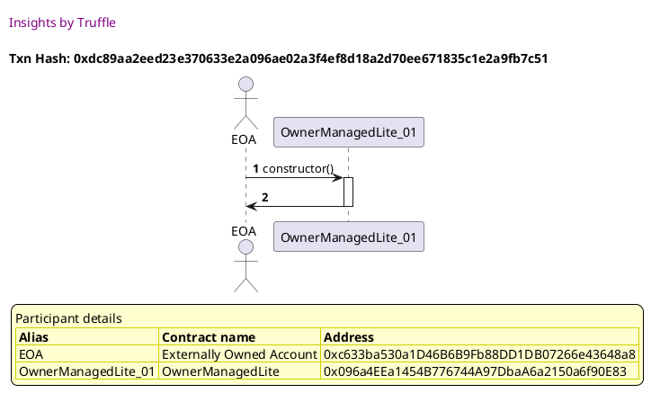

##### d2, tx: 0x9a5c4fadf04d67c2507aa899e546d4e0f54833ffa522718ceb152dc3a162db93

[SVG :telescope:](https://www.planttext.com/api/plantuml/svg/bLDTJzim57tthxXYBviOcvCuJe9OHKhIWRG9993sWZJTn4wnS9tASLWBtN-V6qBLQNrP7dpjw_lXSyuD8UUTG-lwXIO4UzUQVb59Ixf7PPPeSG5QpgKHKwmVvxRjZRXeTMlXtQoSbHSb8MUTMsiv8J1y3nA5jF0o7W4kMwkUM-DGvrhDpK8QvoisRXSmyvUl9PUzNMhvryMjUfOGi9tl1eLGPWu17Ls_1tlsUNm46VjVcKxD7rm7rHhkRDyqlYvnoca9Toi3bzWzd09TPHZNh47HK2PuKeSnJH3JB9Cnuu99siGiZQAcmJWCao2jPHN4eQWZ37WegYmYdhBQ-QUNrpbW1qVU7X5FcrErMgA7UltBIFiT3Swb-AQS_4c38V20_uYG8HzE9eVluVZu578XRXqw-VxUt9EpKOMFevrile1RBoLuQt0ns2VKlTzimpVWwREows03xRP1lZlILSsZgC8ueXWKZ4_vD9jLQLeKGJ6bISYvP15dAQPlfQgsrJvHTNdjr9Fl0Cw-DVe0Bq0_KVZwexpo4Xr6iuNvYlVa50Xv7JDoiqUUa0wLxlPW5hIWb6vX-cdoFFhDXHyJwrNO0Tw1skLDDeD0VbqvQGrglHw44P3NjHzfzvy4x1S-9F2_tg41pJYoiiI0nMoQ93nXBC-IeiASOnZ457cJqJADV0FFnCW7EVUh_pd_0000)


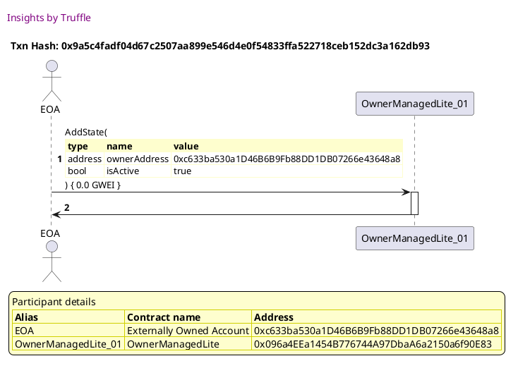

##### d3, tx: 0x369421aba9cafcadc64a0221ebdd594a42404d345bf16fc1c02a914e9fa666ec

[SVG :telescope:](https://www.planttext.com/api/plantuml/svg/ZLHXJzim4FtkNt43QMnb32TnqmPr5Ir91z8c4A3jmvYcI-oKYDIf70TQwFxxBcbMWLQaML7EFf-VxzwzXB7ZqgAnrInd32jRw6eMAyFAkqpFqU0CSZLLMeunkPkQejBofCWB0xkJQ1ATH8mDIhlCrP11CsuLIcNWgLq2d1OcUooqnNoKPrCzKzeIOcet0HFQN4FEApFFrOkDg-nHWICslWkKCjDJS7Zh-jtOmM6R16llFzDbDhsr9SHBk3PLcX8kivdD5LmlD9nYUNi4VE7vWN0TZ358C4rG9hv0xhgEYgNi1WA5AxYGdkZ6gUEdYPDm5mD7g215t_TLmeYon5BgqVa8i8GTiZkCQBDPaisHIZr_qCfyHOrJ9RzaLltYJXEunR_3M7CU3eRRzs5__mY8W2kBLZK1xsxq3HkqhVZGsk7g4zZbN05PZRF6tcDUqQGENzKGHfKbhA2eGKQR9L_m_nnhgFVm1FmZXy_VepFgnFQa5mS_TesIF-kgrkKT7C7WxGCQJPqSmY1PwubYXftEPVGjkhn-q-aC3Xl_45wf4KfhQYMiW9wzlpLa9KYLOfNRlJP59XMrABidobvZVIrmTl6iRL9PpFBosRqX3wdkcblICNMG9YSaK4FW6vOtJ6xEKPwrDEYziCfepFDb8ma9eoIXZyash2U-vyNOzJWweV37_ZYOnFr-63hXcFTS4fhmVD77_alWRTBwrxjkQ-2ZY29qH5UCUps_9yGew8KnZdnqdIv7FmrurFVe0cAYvOCTqvj-2ty0)


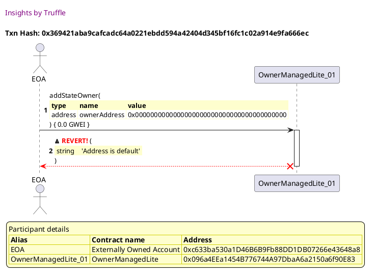


## Fails when the caller is not an owner
[link to test...](http://github.com/thedarkjester/ConsensysAssignment/blob/4fdae3d04e4addcce97e88f438735f476fc16bb5/test/OwnerManagedLite/test_required_owners_amount.js#L22)

##### d1, tx: 0x76100e0771f0abb2bcdc8b85c5b448b958301e0528848a441e267a5b4492a186

[SVG :telescope:](https://www.planttext.com/api/plantuml/svg/RLBBRjim4BppAmZdqY8DIkf96QuHsRAG0YqIeBaNAv6IYT2KGL6edQR_thKi60rg7KXgPZcxEqj2xdiFpWyxGmWClhF3hbAEz2_Qxi71ZXhLAYjNKB-qhXkiN7UcS_Ict9IRzOQGHU-FHYq97R-j0gaS_JtzKlhGEVtQMGycDxgrEsKzAZR-4b0YUPRS3svlr3lYXtvLb4SNx0carBQbd4tGdt5VV9wA85F-hxRNxTRtj3hIPpSq3UeIhxrHzFbWwGFqspbbXpJXZ2cMfhnXK5L1LSjQL2AkuogAH9N58cHSiJWG8X8GHLm5IGedCWk0YuIWPRN7qZUFEOMUpd2V4RJDwrhl0Ljz_6ML-muMMYM_QQz-CZu6Ni5dX8ptwTtoEazlR-UqxcpltN3A-k4ZkHvt4ZWhtSqf8US1agT_ofBAWpOzMKnZ_7HJi88njdpxGd5EM24UrZW0X_rH2pjr0d8fdUgHkznRlesjuthmobamvZYsB6bUr_XOF5BiK2TXM44SCk15bAoILLPMGXG5BrOi3P94HM62_ehtmjUi-nyT4mGyQveiZVWwIuj697aPb21OAC8qBf8uZ8AShOH8CG4wCVb1xd75P_yN)


##### d2, tx: 0x1547f927b9b4fc8fba2df727fb12491c99f6d14132d2b99593f9183fe77448a9

[SVG :telescope:](https://www.planttext.com/api/plantuml/svg/bLDTJzim57tthxXYBviOcvsaIOnOHTgq0saJI23j1MboOhjOk4xbEAo5xh_lDeIAQNrP7dpjw_lXSyuD8UTj43vqIqk8w4BZkcMbF6aVZ5i9BvPWrK8vEH7rmy8tdPFJnZOUtirdyzbqHiXP6pPMZGdqtxqIKdbu7eu05uqtJuqBmXRMBDnIkO0LTTW7pF7ofUIgyokh_hguCKyAMBBtNGifZLi0euFhTs_FFW-F84F_IzUQnNreeTh0hU-qnheac60LtAuTN8Zs_XJecesIJFCegtYLw3hNbOYapg9CLonAEAivrwba2OiZ6LMSZtYiESjZhR8iINB12L9M1tpwxAe0qS8HsYE2j0LJcvL0g5U_dFBVXHCB9R-Pe7vIrWSUy1yHqkV3oVZmFHmVdq8XvKqGGRs_StVaR53Xus37soyGDYi5Q9rOzlPHs0utk_0j87rUjIrieTarAFP7kgxJEAx4AAQ2bKawIITyNkLvMR9oGhCeJLKIfuWvVorLDOt5HDCMTJ2Fs062Vstq0Pw1VgBmzSVi4YKwZ6O7ymNloIaGyZ9cvFeDUL85OMpx1cP9Iqhf3YPE4_A8cocEYKSLze3teFPvusql4AxheBmJrcvwOIGKTOqZ7VwJWBU53mdyhxTl436kDSyIDkLPgVEqc4TpaTCuZxDHcOxY92he9CypR81C37oGSrpnv_m3)


##### d3, tx: 0x1ecf4d840a559a1cabd29d699ceb57869a9fe4651f4d47b45d5efcadfe4b7153

[SVG :telescope:](https://www.planttext.com/api/plantuml/svg/bLHjJzim4FxkNt4hqjZA64xpNdKLeKq6qYOGeEt3c2R7Taf4wbIE0orq_tsNDAewhNnO5Fdik_DpTyzTGiXfPPWszRmWXDMcLFKybPfK3xbQCCtcKCYPLEACyOUPBcib9cLHQZX8uYIUn8ICAhCgv9X0-znB9gI6b-u8S5xg_BbKXXLHaS_KN2g3Y9dPEYHet40kQhqev5-6c_nPWkLiTLTCY5pDmAATwdShHoTT4gIBVw6gV7PlAaXNSAlhB4DSOd9JIBXTAZXdrVqGwDAIF7D4u53ckY6pE4l581HU67APkdxWXIpCfEEv5devVkgumfKPPmALgM-vDa7AkC7Kuyi8M0Kzb3s2j9cSvmk6fLu-AQc_CiLcKdp9ZVn5hTPnZxv7I7iVZiVxxN1qD0GauCOm8rk7TtVgZeowLdpev7Zz2Sng8G6bOlDMFhAYnatZlcuWjAmgM4FPW4JR8rscNZ28VJl9k1rOF7HjnmfbC4YuboQkY0FFvdveHMm3zHvUW7wayFbxV86Ts9_qylZ7WPRYPrFLfhpZ8OpUFZ6ji9DZ6F7DFA7FkD-_Zh_5rxTl-ltHIQiVmoirGcLqCmbhmFUGiwB0jkSLgDAW2GdQ57VOPKg4n4xbZutX5V8tSqwkThedf65vKUs4dz8ffRIX6CSP6ucR2SwfHl0jsLj2j_SmtMP2S5qQgHKcksedGq34ENvJvZ_9tmNUDs7_Qji00olCij1th4deJxF0Yv91mW9g1xRlJZsCDuZeMH3u602PwFWWfxZYt-4F)


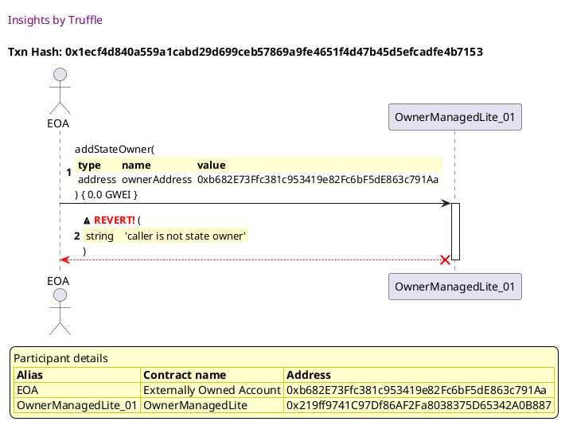


## Fails when the address to add is already an owner
[link to test...](http://github.com/thedarkjester/ConsensysAssignment/blob/4fdae3d04e4addcce97e88f438735f476fc16bb5/test/OwnerManagedLite/test_remove_owner.js#L36)

##### d1, tx: 0x4b25e139fba0ac31d9a81baef45bf166849a3e6085d46d37103b6cd0605bbe08

[SVG :telescope:](https://www.planttext.com/api/plantuml/svg/RLBBRjim4BppAmZdqY8DIkf1IuPhnB8af42B16ZknL9SoKHaog0er4xJVoyj2qQ3MWUIcbdExiwIaFlUWNN3hYK41jUPOIVHalv5cprOsD4M6pGgW-gbiTrWrAPhEqjlog8iDWKXozuTMrmHEdvR18MM_fv-ANteh7xjZ8DstUh6xD0uhrYxIq3foRFaVh3x5jyHF_GhKXvTi2TGIfk6SZP1VyPz-NagWapvlvfUDrlNKtcaptQeQwzBd7OjqkU3eG_GRnUK7I8PnCZ3j9R0e0gvIY7X4h2EObbp8P8eXH05Is8L2HNEEGkbg1GJB9OIMKAyPPNpfHUFQmezdVbzHhnjJbTw3xxLnry6xNSmqA3wfXt-P7mCl8BF21dlqxlLTPxUtYverPdUsU6KzSD7SZtk971MkbjGGiu394__bANGWMvxifp6-EacPpbZRFNsXVev-GhzOUC7O7r_rC0EJy1QAOkzvoxtLczZwtuzEBG6slOujgpekghyOt6UOeTAXA64E6J0yqXa8ajBcIHvplECpGCXC0f5b43oNlYQTV-ZOuAvua5S545HPaLS1xBOY7bQpzDGGRc1W46Sy3JAKf_0Ep7vGUxzwf_zNm00)


##### d2, tx: 0x60540e93316225462f2be8151e07cddf1be99e766799e3023ecae766dd6192be

[SVG :telescope:](https://www.planttext.com/api/plantuml/svg/bLDBRzim3BxhLn3TPKFNJNuc3hAWUJXhWGqjq0Ax51XeYqc5Ad8WortIPlzzZEi67PRBV135jxwFj13djKVdcvKH0XjVsMPLa1FrWxPhTBW2GqkoQeBbmz9LZLNJobGEtitpUJxDXHZMVcje9A3zxWaLENZkL82BokcdodeqOwENTaNMSyM5FmJCsVbISjsujQ6_73VwYI283xPhL4hR9GIoC_rkvV1pzmZHzR-qjLxU-ngABTowPh7Wki9hRmXkDnOkiBuVWDoaCeabPL4Kf66On6cu20lg1qb0ibSgjGWAoZBgfMcFHIJ3Y4hSgqgbGSQXWYahFJyzlne3rd32yaGmRLwNUeqCzUgN9VSTBIv9VTEUVigW3JnYFn6YpOUpqN4_d9uEOApKZKTFx-_idHXsK_ZOoT7k2_Zjce2bnLKh7z4qVDc7xu3fSrJNi8Dgts1yKEMcJAEem2II6CpYT99EiddHxyzcmMmYUs6QKXobSH_xhwMAgZASgEjnwVKZTm3lNXjzW6UGdoHy_P5VyeYEezd3VC5xDW0XNjPCNByXJv57RUetC6To9gNSm-HjOXxvCkKrSJo50-03g4FUQDSEYC-D9sVHc6qx60NZikILzlz9mDl2nmRyhxLjq5D1cEHvcCydUSARbazvhnQzB58uds8eCUa7MJp9k04pqV4Xpldad_CF)


##### d3, tx: 0x55e167a1cf9aa49b6ec10e76fde2a5beaa456ce293ebc487c475df264979975b

[SVG :telescope:](https://www.planttext.com/api/plantuml/svg/bLHjJzim4FxkNt43QMnbR4wQbmPr5Nr91z8c4A3jmvYcIt8f4QbJEGwqqFttNTAiObhvi2ZosUVpuxlddaI8azAWDjKy5m8hKwXg7f4MvLsc5gXn3ZdDI2KZZEzckgXKCYxoGiF-D9o6ur28VcbMEGq4DCyjOK8Qdjebm6cXiyT26So7UJPJSrA64LEp3PZovWPoKUb5JdzjN6MF19QpzLrWacHg1fPiNRyQs__G9Y7Q-yzKcSrkJGdH2gvrbQQCAqncSeBhfO9JB6-FGIvTbopFHojE0qGdY3oABKc-boPaeniHErql9ZleKXGxFJzsV3T9RSy9_23mtKWmPR7XrCFp8M09Uspt1DDciZXR89Tw_g18Vq65Cqe-PuP-Igi9tE7V4w8v3qU3tVjmU7WCJC2LGKDDm9iRTIFwRIlUjNQm_WXcjI1Wgt3Us7lCAvxKuUiQGbDPmXgA6cIuNSfbx7Mx4RfTYTR4yKRUA9X6lTvaOar6qhSzZvokv_Imju5w2qyWtqluz2qyuqxiJdfvz7rVK_AZhcfJtj4nz5y_e5RSoG7quusUE6RGwLo6NyFBwrUTJlz3un_02pL2QNIjX3NmU_2dXgm4L9ko3jeSHKBSe-oUENk9zet2nSMplYLaCClBPnTFv4HAMPFBGkOMycJC2jKClgLvI-Ns72TQQuF7fI6jCCzNZIOI6COnVqtcFsb_3hnBM_zwcmlynBBTCBJ3wIXqKpiAnvuVf7xGJN0wHbkYsxC2PnJm1Sn4ouSuuP7_2xy1)


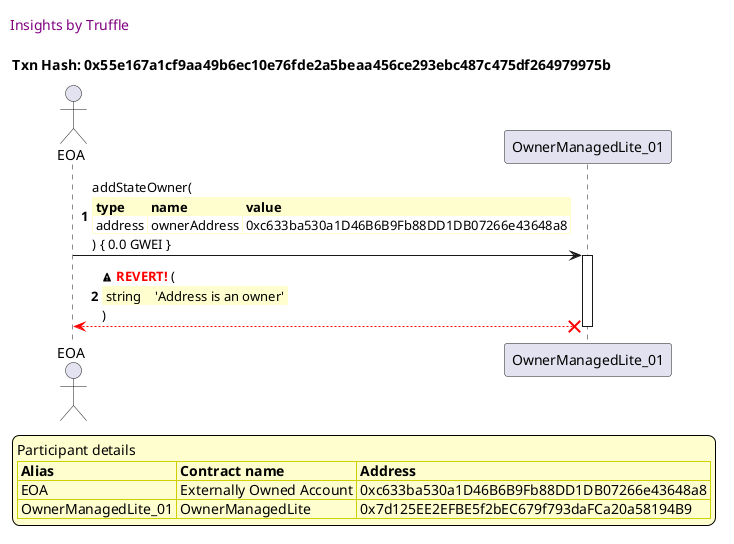


## Adds the owner and is retrievable
[link to test...](http://github.com/thedarkjester/ConsensysAssignment/blob/4fdae3d04e4addcce97e88f438735f476fc16bb5/test/OwnerManagedLite/test_add_owner.js#L34)

##### d1, tx: 0xb2a6d013beff247adc7c9dfffd1d7a1a988900831636244edd65a0c1b93f3758

[SVG :telescope:](https://www.planttext.com/api/plantuml/svg/RL9TRziW57tdLw3qPLDN3Om_S9H5TM97dRIfbTRtwHgmWqfmXB6MTDr_7t6iQDNY1y3dNCwzzrmGkkyzE3_i348m-CuEkrevrBzekmS7EsnKgwnSWNXfNJTOkUvCv_3DfjfKwmgXHU-FHYqH7h-j0gaS_ZtzOlpGEVtQMG-cCBgrEsLzK6py9M0JoBFaVd1xezuHF_IhmZI-O4yWfROjfcI2_epxulDK19hoVxMzRhU-n_KHFxkXQO8kyjeRXPyF5Zz0lvrZSgWZI2MXh5PD4yKPI969N3PD8wdCW4BEUKu8PpHbQHJ7Iieq0I9edRE6PGb7mJBXG-dLOu6XnxEmpr2mpMkXzn1QVVnbbViE5beblsclVX8w1bx1PmYDz_7TyZgFRs_dM7IszsuuPVtm4LsFEmcSbUxc6A7p0D7JFsL9vK6R7YscCNwwAKb925c-VS5XJg72S5Y70RZG7xQmKoUWaDAfFd2NUyktiVMm7hno5emvZYrBN0WH7eiF53c8bB4Q4aQ0bd6wIbVvfkQyB6cv8bcKfYfcQSo1lnU-Pjt_w9Y05OBdB2xhCfAI4ovvbHHHGXDQvatCipZAybK58HW59oO_q7rOmxF_2m00)


##### d2, tx: 0x471c350673c9e58df578852a67118674bf77f388104a2385d8a926d1df80842a

[SVG :telescope:](https://www.planttext.com/api/plantuml/svg/bLFBRjim4BppAnRkfKMQbdhJWMj4ZkGcG8i4I81U0XGhaNA4q9H1KQcTkF_UjQ8OBkfBTU2IotrmPbQCdRSEhUkMcZ7iN6EwPQ4iQnzhiqABIz1geOoSOVcui4rdv4MZ6mllvlaylyWPcxHkezMKGVyzA9JAmijm1BXiRFtS68SwrVN2B9LnLB5o-u0vNRwMN7LsfTLV5xVrim8ltFjkKChQBC3ZW-jtRoUVXqUmeV-LQUl5WskXsC2TxQgAwZ9NEwtWRctW4jk7C-3hCF7A8E9n4fHZ5GbPHOaGaOznudaYJiAYIf8g4CBZ8Vg1YAJ0iHzBJrQ2Yz17HfILZfwUNwU0BOp8ZXZHvkgoNY51lVvbbFsE1XTAVgkT-iczFl28VyHOdm-dq-FtS79o1gcKjmwTUdzlxjbaKE7ZOAVRB-0sAmLa3Ivx-uIweyqkV0j4drLj2rjeTWtI_P6lopW82em2ZbuMnhDuDfuNGcIPbyruuiUn2eCu52ZUIXLDeocnRjFIrK_K0PnzQ_G1Ne1_ul3rHtv54Xr7iuFvYlVq31Xx7JDsSq2UL0vhtHx0p7Z6ET_1f6aY7cbpGMDYIOKzu3seVTvqsmj4wzefQr3hJI-CXBGiQQJTVn9mMFYOmFzw-mP1Mefn46P5vaj90oH57gL-v4LUDgv2aOH-CfxbIC6Cc1ZuOEUqqi_v1m00)


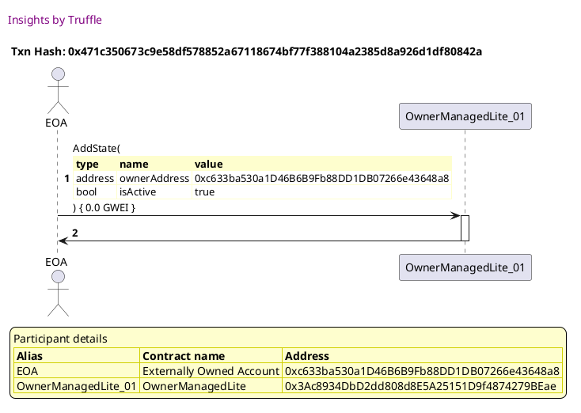

##### d3, tx: 0x1c5dc1253a074ba528f9a7e2a7730d8d4a0e8fd553860686b1d90d2edc4d29ab

[SVG :telescope:](https://www.planttext.com/api/plantuml/svg/xLLTRzCm57tthx36owOny5SSUnhLsYPbaq2Ts2HU9Y4dTjjegLib3hHR-U_SfgNQH46Yuf4eyhNllJwspurF4BgiWwb2CoqHCasO-MQQkGhL3uMVcyfCSUd6pjkUoH_6rQpnjZyhPnL-DKW7QJz5wA8Eoz9r46wVYJFMLVXfEyJuQbOLZpCVJDajYx6VEXy0SHHs2GC8RY3dJJKltOl0RV7eC1Kxtusnjl1ZJCdMzRsr5s-tcq3RzQzzNOmdeSRP4jzLpMW4k2WKeNJuRk7nbQadvvWiQ1xPdBA86nABp4HCZRI97JDnp8bLLXZYrCX64LUII2KpQZMnpDbSMAPDXe2oFC3Mqs4NcneVWJr2G5ieyc9kuAZ3RzvL7uqtOsS_5C5z8RHDtEC_GgYTZyyw--FuzFGS0m6tmGJN9XpV-tjqiIt5wwtjhDxXi9mx3DQRQMk_chA1pZfzjOQeN5tZ5PwjGRgx8LbaKh4qveDHpXNDTSG5rKwnGIwpGMHJ9NaUQzer6wWJ_8J96uBVVqwleHBxD_t7qy32BlGdne_TqBVdEZxvMvopitFyoOMcylWmFfe22hN2yCOHYoKLH6h9DQMn417X95BW4ZgA9QUQ4Yc5r8n55494g9X4EcQ4IYRXeo6IAo4uYsEvvUWGMgRcmGshsv_K71y4ahTp3oJrVt5-Uvn_F6TpvTSvQAEqwEQPVbWNJ57MptXBI488MVC6WWfI0fq-A6K5GhHZS7UbT_CwgrQZe5q4LtbJbijMcopkvZceUcYlVouv1ndanD14o9xiwK6cL9BGf4TY9gKJN0fbr4lWVHhtgxTTW7TpfRb8ieHPguYoAeswKAs89de4vH8irhtKG3829hPye4jeuV_q0m00)


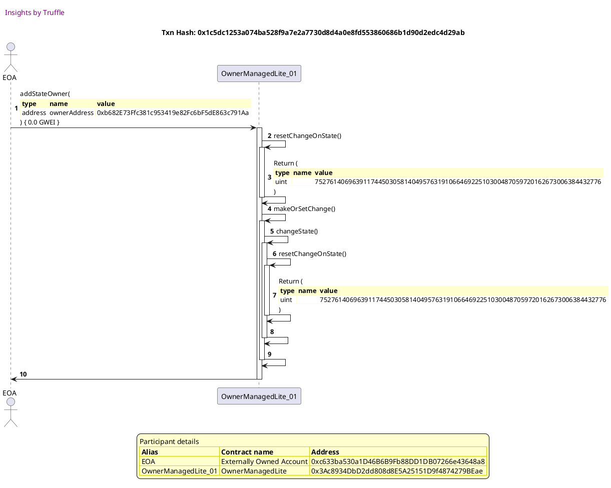


## Adds the owner and emits event
[link to test...](http://github.com/thedarkjester/ConsensysAssignment/blob/4fdae3d04e4addcce97e88f438735f476fc16bb5/test/OwnerManagedLite/test_agree_to_state_change.js#L64)

##### d1, tx: 0x907a8b4878dca1f74c70b3f193e72bb3e490bc9cc3c297406cc62274d2c2209f

[SVG :telescope:](https://www.planttext.com/api/plantuml/svg/RL9HRziW47xdLvpQbqrTDMnJ6w8iQX8dwgHDhRI-JnYmWqfmXB6MTDr_tyMnebMB7m3VTtpttNqGSjz56MA_TOJ8FhQ-trOcaEx5-fqCSWlEDCRhXLGlJMXxhvUjQmDShrVhrN95oBIB1sTc18PlOwGs0NwFlm0FRR2lhO_IpPrj_DRuY8nrF2Ui4JnHxlgmS-OTyCE-6aZOEVOajRQ-WOIEeJ_3FlqyYY1Z_Q--iyqcTb0Tu3dqTOsy9Dhe33plFJp8RZC1kXUqaBnYlE1QoQGkc2febTM9o4oHLbLccA2L4afbAXK5exbIUPeMJASgJQce2OvCHPI-Ufo3xE0Azok2OujMsPt4LXz_UHE-IoyRex_PQ7xIP4Yy4ByYPBWFjxFBEDpSJ42rlekXFrRzy95SpZiId9Xk9q38oK3oz8yiRQAqhYFJqSPFroKjAQMpjo-0Fg52F2pHW83zWPTRSmpCjGwcG-nyR_Osj8xhFfhWfNE7eMKDSwNmiKI4w5xbMLR9kupAf6Jv8b-8TSLvMIRbWXPfdXkMvOnB_fxuqkZ-Zmu5q0krv5aY1AzInlJTAbroLUfKb3GnUIaqpzcwGA449p7EWzpZYi_-Bm00)


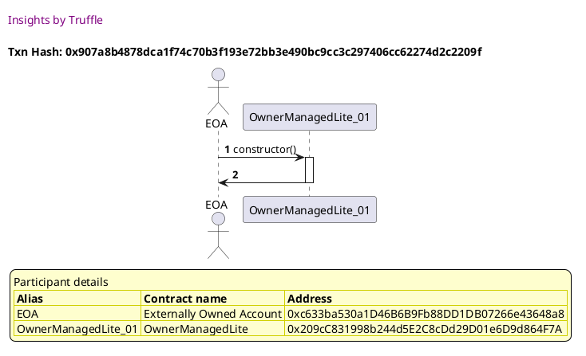

##### d2, tx: 0x061632c202d6a1d4b7a3b6bdaaa593c42ab6ae9ed65c63d777ab7e1229a1bc2e

[SVG :telescope:](https://www.planttext.com/api/plantuml/svg/bLFTJzim47_tNt7gNZOnDkUZJe9OHTkq0saJI23j1McwnAQrS9tASLWBtV--QmXHf_LbUV3Pz_txtOMnYzgZyytAC8QDhsopAfHZzQEsQtIu0gCMoie9beyBLpLMJYjJENWtdyrdqnbZvxNV6ZLYq7vBXL8vUEcU09ULqy-LzMZ6HY_iIbbF6Hzyxp0duslATUFMHlrbkDNF2eAurzsWbDek8E2TwdShppztJR2k_fMjzMBfQoYsSEUQXmVAoxpsHi7Tni8briipu1ik0X65PSX3AJ2GSP5WL8X28k8mYyeun4AWofGKmr94CaaIB18LX666GL66b9DXwQdrsVKOi8O1oG4ZshmkzHe9wlKlgzntjBXGyflswYSFMiSZ-W5ZRJoSZexRuUJa3CPItdhqwlszlMVdtHG-TdAq-m9-krP0qkAgbKze6hhitNT0z3bLrx23QbzWt3_vXW161GuZZa4UYucOPFCYJVCyo2Sy2OLGSIJY5DEtL4LL6GhKzRZq-eagW7TlXJx02_1F7Bx-c5tHY8wZsSDynNjw1eozhXcxEI1FAe_Qr0SmSvvpplSmQPk8HxfCQKqSJQ47t8FguqQxTa1qRhno5etPjeEHC2vBMcd_dmGS9Zusu7-rRO6GP-KqZO8iIuimZkLm5axJCfTXblD0YJoJgOZd2JNAY8cE3tP19_sSVm00)


##### d3, tx: 0xfdf163e263d4febf3a05de9709e97dc81c97f2b0a6cef82e87805d226e6818b3

[SVG :telescope:](https://www.planttext.com/api/plantuml/svg/xLLTQzim57tNhn3TIqlNJL_MH-b2apXU2nifQs4lXI5RScBgAC6MjwJD_liKnmijomOBUvmnklAzLqUwvw9Z02vhholVp4e0TEFdhfcbjWBrG-4Mkj8pMDg9TMQWiuT9DM-S6SxBUGLV9QDaD1m1S57xLMbx0BRFr6fZA_ZKVK9uDQ-AnxdpkkoNnSJDhFC1CVUxX2G4jv2BfbgKzaNWjdYq4BETxqORKxW9nAXpVM_jnTlk4A3R_zhLnMJgQvYku5tLv7d01RxmfOLtImUlT3qzXsYPcnnpQWcdXkKspQb6aR5A81K6aqcSAP6J56cUsLmIAuKC2OHmooMMAGM1iio7eu_6VQXhU1Ji4GYq-I8h5ZgKElxcRFLHEpsnvaFXxHU4syGz_YC0slNmhBS_3azFps4WuDPhRzk4utjt3owwLhpkR6_z3lhLmi9WdPwrzgikcp3PfAyt49MjQxY6ymr8V_U9bYcNP2HeacTqKtn46LPMaYJZQHAPaUGq4mhtzHRg13v1z0R1zvz7rw4J-m_znsh2njOFfzfDxDYrTHsV_2tEsTav_6HzKpbu61zD4HgrXk4L4H4SCyGLfmfZmLY4A8faS34L2KwnmeXpnXKX4GuXnAH0aH84OKwu20vE9MEK2C4xZWwXPQOVxBYw_KdDyK4WMRlsG5B_D-UtvVpZDTihlya1MwK5Dy_qmrYlYx9-nbkCOeJGXhSWg45AmcGObB8AGhHZS7UbT-jwwrQZmhZqjdAwB5UjDXdOpxAWwhwz_XcdDDKHHHh7Z0_uG2Mfb76Cum4IX7FBA6TIovV0-pJkLs-x0K4g6yhGAILJmfY9HcGeizWG5IDiUQoCv2mHuQ0WCD7n0Ix36FvFFm00)


## Creates change when more than one owner required
[link to test...](http://github.com/thedarkjester/ConsensysAssignment/blob/4fdae3d04e4addcce97e88f438735f476fc16bb5/test/OwnerManagedLite/test_required_owners_amount.js#L56)

##### d1, tx: 0x8cca2b96146ed62009a1bec65e1d3c47077f22a43b87dcc9c735f3b6f0e79a9c

[SVG :telescope:](https://www.planttext.com/api/plantuml/svg/RL9HRvim47xthx3IbqrTDOF1G9H53O6eapQrqle-7VP1h18J6QCbNVVVvn0KhLfuiCttdR-x-yw4tFSEh1jsBI4mkCuCkmejwL-qsOE57MsnGQDoa2-DxGQZrbtRMNgpAJVbkYHaqRjZYqj2ns-BeD3ItzClfG-TrQ-TST2kMjsO7Hhd5Mjt2TXuyYov7-o-nNV43_sAD8Wks1CefKr30pP1VyPzyNagWapvlvfUDrlNq-f8d-rGrrwNEErQfCy7Gn-WtyufEwHIGbXb8eW4AX4oba5GeHGn1ehBA659KeSXHBnA4oLb9XCUrxmIDSCaWqmIRvbqllJoSKMXfpE_puYtpMcfz-1RVVnbq7u70msgRzhXJnQCWLVm6I7ZVNgtlCxJszivbPtfdHrEMJzy9DVZJW9dfRiv9UGyGFBqJraA7UYs9ujfZ9zk2bOmnfPlNwYVaw_G7zP-0DRtHmtiy0IibBBOU-voR_asjkxNWqDhe6sFOykAhgJqZyLvYXsauBo2c3C8YaZa8iysLPeMHL3aB0c5m8YBA8NqlV0rw_v7nmHH8j8qoUj8f3oErmgvIF8eAr74uReM448ePCGBdy0xCVb1xltgd_rV)


##### d2, tx: 0xdcc13078849bafcdb8d2d0ec6dfcd5a9cd67d569a9e84eb2705bcd425dad1a7f

[SVG :telescope:](https://www.planttext.com/api/plantuml/svg/bLFTJzim47_tNt5YBviOc_Fbf5LNqJRjGDe44aXxGPekjbCYNATo7DP2zx_l6aB5jBui3pxVjt-_kp1stdXqlbqPnh3rjMrNXNQiUQZi6XskmEYbjcgAyc7fwjQgMMrg1-yMyyLyDcTirFYjqMC6tNUlKMa7pxqAS56xwgcs7it4L4kxqjPJnT8V0XRaV2cvRjtQwBySDzMJXY0-sAvHgSek8U2zwNSdHv_xHx2-_wLjgkMzRw3OmgrhovBgCbzve-5sO-42c_iXy8sICeXuccNneC1IgY9JeU9Q2aLAWWEfHAeICS21pc9TX2bF2gdYC56e0anBHfH9Jq-VNqq06pWXUSA8Db_9Qeq4zUgNrUuxMbngzQto-YSFki0ZzXF6kdmu6n_tm-df42PAtNZq-lsTlMEZVWeVUpdUVG6_NMiWQN7LoKSqBLtsuJiW-fnk6jX1lMymEQXy8qKK5PX478Cy5bCn7IoABClp89_oD1H2nv68CynUInLrRIYnQYRILu_K0RnxRVG1de5_ul3rn_oIHdGSpHxc2zwp8J3sicRi-WrvIdkiJFC6PivpplaU9cqJyKYN6Qs9eoaS01z07VB6ksv0T6wyTXQDsNQ3KJ2HabRQ_oS1RmiV6_2_rgv1d8eiIwTbBB8eIMPAHoATneEv5aauAmM660ePHpar82PwFjWvdVHp_W40)


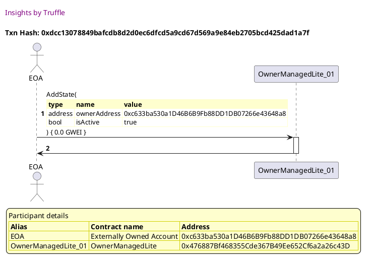

##### d3, tx: 0x0bad480f4994b67b4eebc9f1b067412aa07ea185dd1ec3a9df95b4313b251730

[SVG :telescope:](https://www.planttext.com/api/plantuml/svg/xLLTRzCm57tthx36owOni6F77zEere-4JG9rOfDucOHk4gUDbhfLua2xbV-EcuPg4mM9YaUYADU-llTS-zW-GUYoTb2vPbOY18sRssQMc0hL3uLTG0KpN9g9iTa0qeT9DMziDfoNymg_YgCu6aO8NTHkLPeUmkqpDP2P2ZzrNOolvbNnEBSEodvPJEpCMESHSxSBYFtW5dBHL8lIl1YuBHuDfdpdku4iA-m4KzAvlhVsucqt2TJLlxPrCPcw6YShV5SrUUvnaIjSQV3Tqk8hgAVdc2n90XbN9ETQyqJ8X1kJf3gd2H6Iqm20I0DKXLb6JSf0PxaE4yueIuAGIaQGfonrVkhHk8-XnaVU7Y5FcolIOW5-gUDlrbGVmSB4P1yAPxuGsWRkyHyXrERZizx-SNnwUeuz0RSEd6a3Zk_jFRhejk9rPtlhTzYj5WPxQs7MsgzGDhwn2Lzl82fJrtYDvnkG_gvBbebGGIHPdATCqLI7Z5DjL12d8ed3B5A2fLBJFcoXJl0J9cy8VlyvklOxiN_IVroDBspSS0fsOiQsNTVnoT_Yd9sTuq_6DPN5X_7H57wZrjY_CWoae9m8BPYcL78U4aP2vLrSXr8mgYaHWWiT-0FWXmXNaeHQ1eIAGFWJGGHJdBD0Ij5nT0WjCtWmu-hs9pN71u6aRUw1fFxVdDykvn_dRA_y9WPjbHRTFDEFp3WeolePRoCo8eHiUFE2wgN4DuPUAIilH3i6TrTwbzTRjnhblqjdAWjbkMgrASFzDFMgxjhhdmh64WWP0JhYOY06EawK6eteQ41a88JXJ705wYNmFetxrTiMu58e9GSv5ug5uJ0pJCW1rv4HOJ3C1GGGY9IpaI_WcUZuG9V-w_zFFm00)


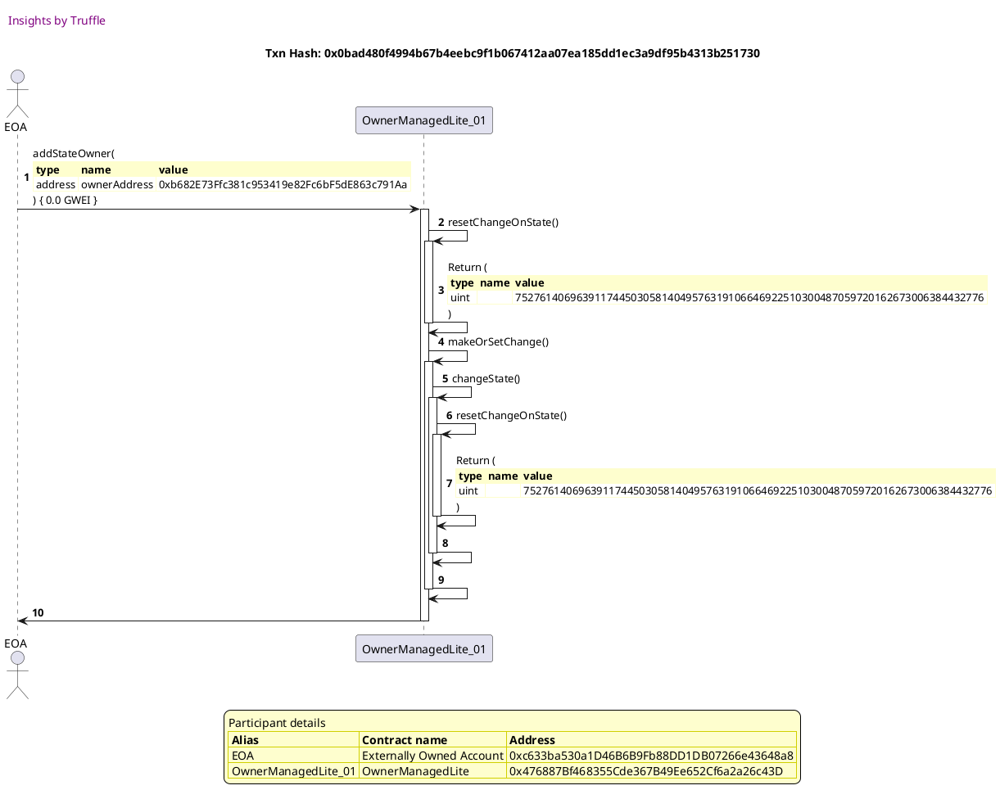

##### d4, tx: 0xaee3ac913f97c85a4762b5eb4aa665d360143897de2c13379b28d96c57b23b86

[SVG :telescope:](https://www.planttext.com/api/plantuml/svg/xLLTRzCm57tthx36owOnS6B7JgfHhPzi4gZJDecNISY9RzjegLiS1zgj_7TkqwpQH45Yy4WKvJhtu_ZwNEM4aBFIQ-UhMK68hlpSLhCK72dlShlGJize0HEmfgkpkucRLzRqviNSqLV3mN3G6n1oMlfL0Mr2wsiAse2Z3yqhfUTpbz_FhTT5fyWdTWRM8-BOxnA66Dn2BYgtAE1Pu3g_1ng8dUzI6vFR2GrOu_fUszEtJHEasV_2blbawakQhkYDgyPZn2K-zmNGcwMbvxgSjYXRQW2kioJWuqHbSQI5ac4QGIgqbZ8oNB90y3XH1i8iu5mbQHYRH6QHIaEUnf8WPPd7rWUZ3jKbFK1xG90sdsVvGkDHHzyik8_QwWcO3xc7pooe4_Vu3mYfw-b9Ut-S7X-tQ0d-2hvKkGDJvvIT6Gx57zxQMtBQ3ELrOzlhTzIl5a3HMZshxLTTLBZOfAzfbMEBQpglWHvXqH5k4uxe0sLl67t_QN21JEzlwhVTEi1-UrDj9p2orrvxE3pwKvoJanQz0byvI__gb7YhA5Go44mcaYT1e8I866THZ2wHH4ho80cOb48cOHW5668YLYnALCW26Kg53ibZ8NYeb6muUWajCtq78tVzICtXYq2oklQ5fFuVpY-Fyuzhjf_q9eTibPHSFj470rxdHVc4jpxhCyOslA5WebJWeeTAw51eTWnsZC7XOMnNrrxN6eJFfGTdTL6iQkqnj9Db6u7045jcalDKHvpfe2zaLtQJOHh7_NxGxp8LIWc2In7h-3dmFWtxsLjlW08Qnwex5ZBcKTGpmANgYcG0CWfxOwb37SfCy3vkW4mqV90pVEB_vmS0)


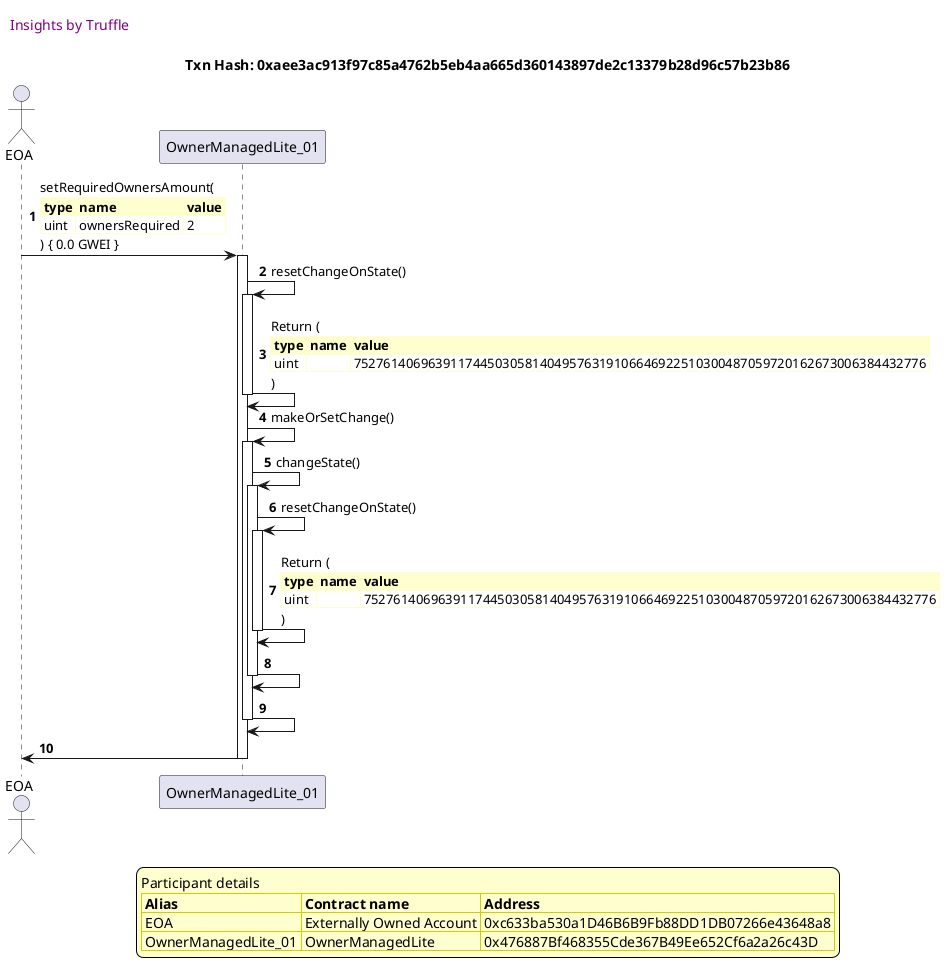

##### d5, tx: 0x2aee44555ee6b75d2e4bbf446f28d5a305035eb1447581c0e78995822e078d49

[SVG :telescope:](https://www.planttext.com/api/plantuml/svg/dLHjQzim4FwkNo6wBorTDrdMcqiNwiJ9MjX8MGlxKXYoVKbC7INOyfQqsN_VnV52oq9XDKOdtPqUIO-U4o6NjRULR-Ob8RRn2zVCKwX8_L2ufQtid9Om1PVtRVOmhHQDomUBSb7HTwFXQ3WO4d9H-tK9FKBRRmOsXue-TKDAhnPLyRXmtfPnMKpT79n7n8dV9ummk8DSDjMoX1U1s-8HQ23slXkRvuMRqe1rhj-jlVZORO9qwr-xkfZEV4tJDRshcia4SOalV0dqRkNebQrdvvIjk0KGGae9e58jSmuYJIT2g0atkRGXaooKa0P2Q6c2Z84sKIGDvy2qoKL4aBBCuzQ7uvZQcXwXFI98co-oOcdngEDV3gglrjafv5yA3pzOq2OUy1yHqiwdPxt3SNfwUawHW5jlFRG9n_VkdbnqL_6-ixtD9-hNIw1edPstzgSj6-niqpTRY0hgccxeOWiIxuTi9KOn3nCf6OIZ5E8WH5PC71iJcsGa8sFwN0vIa-sWJkWJPHyO_VnzU8qtSNZJhvu65mO_c5atXR5hptLyyhyuPsVdz1lufdBqRNmq1LxKXkAl9TSg44n5Aeo2GACs68h0e4j4KgimY0Acb50HvpB041D6CnbfpWB5bKQ72eqG8TTQTHozXPQvVO1nTVkNchTnyigSdSosEMHNtUJccMPpyBOewsT49YnXZ6s9n296-M9dWDLPeVZtbEvbj9_NsxHrWUtAG-LiMQxRUiXfd6NualXMSfaAmzJAaDaW4Qgl-j4eDIP9WgJFD5SAHAY4iUObyA6w-jUxqxHMnkZ-H2WJIZd88LIwBw8XACa74sMvvIeJOO8B81CT7-GIMtmJ_m00)


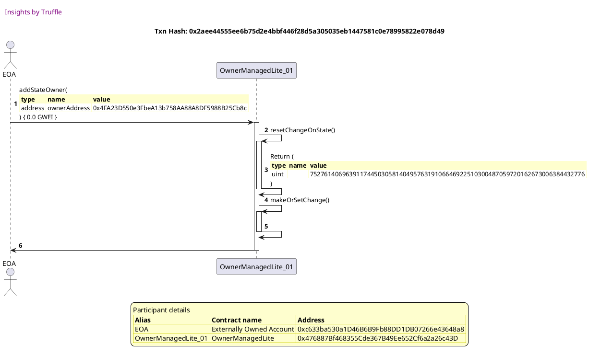


## Fails when there is a blocking transaction
[link to test...](http://github.com/thedarkjester/ConsensysAssignment/blob/4fdae3d04e4addcce97e88f438735f476fc16bb5/test/OwnerManagedLite/test_required_owners_amount.js#L76)

##### d1, tx: 0x507e01ba4d102c6281d0de24a0cc6c61624c7c646a6e0a05a7f5513344b40b03

[SVG :telescope:](https://www.planttext.com/api/plantuml/svg/RL9TQzim57tNhn3foqPN9jcAx8KiD8vZMkXeONqVLnzsH1Kvo39Bskw_Jt5CM5dy85ddN9rxxxb2wBOBu4E_jGX17rhNRuNsg7inRWSUjjZgHZjLW7nfVDixjMfjw_5LjQxMgpL2youSh5uWF7mR3Kfx_3OUCRvhlNbjNG2xjAPnM-r2LAp3EQ2Av4bor_kTrH-8d-PLOyhEs1CePLo3AHcXFyC-_peMWSRyzwuppIPqM1pmi-_hEkgYO8BL-7dly1rqcnac-od9DA42cA8aaJp9gI9A9mo8b5nooXCcCyaP1wu9a2bazNHAqvGnmOWWAOgMoH1BNpykCNHu4lS9YhO58yqEOgkFlvtsFy11ezM32VeNeKFW1No2q70Vtomky_ZwUePbwxhW-sFMJv_HvRYZm4dfPeOHEWqGFVrJbj81ZEtGV1pZbwkIb8IGnVjt7ESKAum_gpW07_l33hRw22oLyhgBtFdUudreFQxxeBq3Qmz3omelfOoF9KIAx2LFKm7Jb00j6IzuyQqIULwMj2n8bd2kMSfP3lb7uKlM_OyE2Q1AQv5a8ibJNlEie2nZD1waq50HKQH9IScgOZ51T6Bq0zt6DJxxlm00)


```plantuml


@startuml

autonumber
skinparam legendBackgroundColor #FEFECE

<style>
      header {
        HorizontalAlignment left
        FontColor purple
        FontSize 14
        Padding 10
      }
    </style>

header Insights by Truffle

title Txn Hash: 0x507e01ba4d102c6281d0de24a0cc6c61624c7c646a6e0a05a7f5513344b40b03


actor EOA as "EOA"
participant OwnerManagedLite_01 as "OwnerManagedLite_01"

"EOA" -> "OwnerManagedLite_01" ++: constructor()
"OwnerManagedLite_01" -> "EOA" --: 

legend
Participant details
<#FEFECE,#D0D000>|= Alias |= Contract name |= Address |
<#FEFECE>| EOA | Externally Owned Account | 0xc633ba530a1D46B6B9Fb88DD1DB07266e43648a8 |
<#FEFECE>| OwnerManagedLite_01 | OwnerManagedLite | 0xaF3fb27b2836f67B14741283cbeaF0bB32D10CF4 |
endlegend

@enduml
```

##### d2, tx: 0xa5afa774af6387c413f9bc7a1fdc427c840243e9a52723963be9d08100c134f9

[SVG :telescope:](https://www.planttext.com/api/plantuml/svg/bLFVJzim47xtNt5YBviOcvEuILfr5MtJ3AHD886q5wJfuZZ5mdKgns4jTF_xhY5KJElByk3p_VRttOMnyyQZy-tAC8QjhssxAfHZpOEsQtIu0gEMofOpb0zBLxUsdDUcTl0kN-IB-OAnSUEtHaqOTD-zmb8vUEvLW8lQwQVQUZHJevTsfQodYfK_1EJaV2cvRjtQgBySD_f9GI0EjciiIssN4F3UzBkJuy_z8rZV_z8sUddl6oYsSElQggAwp6jl5DnkB5nWSpy2li41LfWa0giuIXCfWgWQ5ZB1e2gb21EP2XwAI0rn42PXD8oZGWrBdWQSoo0IrP0HPTBJqnTNKy06JaYUCABDQwdNI52lVbdblgF5fIg_QQz-yg0BF68_OQpBXxF9SJ-SdevWMfOt7hrwVsVlsBYVmiTUJdPVm6_N2aXQN7No4KrBbttu3eW-fve6Tb3l6qmFAj_8E8eA74GSWqp4itWsp8iqpR8Wc_4aZ6CbebYacBwMAkhQKA9kfjBhH-e0thqs-W3Fm3zn-FfZSKaZEevc3_C5xza867jPCtRzXhnIUTIcUGCpunddV0-JjebufCkSriJH50w03w0EUPDTDo0wDruvYyPiky6KC9MILjh_9m5l2nyRyB_MhW7cKLM4IH6cKLp5oImGYGX8aON2d1UpACm2Fiy5DI0cUZxOEPtqS_u1)


```plantuml


@startuml

autonumber
skinparam legendBackgroundColor #FEFECE

<style>
      header {
        HorizontalAlignment left
        FontColor purple
        FontSize 14
        Padding 10
      }
    </style>

header Insights by Truffle

title Txn Hash: 0xa5afa774af6387c413f9bc7a1fdc427c840243e9a52723963be9d08100c134f9


actor EOA as "EOA"
participant OwnerManagedLite_01 as "OwnerManagedLite_01"

"EOA" -> "OwnerManagedLite_01" ++: AddState(\n\
<#FEFECE,#FEFECE>|= type |= name |= value |\n\
| address | ownerAddress | 0xc633ba530a1D46B6B9Fb88DD1DB07266e43648a8 |\n\
| bool | isActive | true |\n\
) { 0.0 GWEI }
"OwnerManagedLite_01" -> "EOA" --: 

legend
Participant details
<#FEFECE,#D0D000>|= Alias |= Contract name |= Address |
<#FEFECE>| EOA | Externally Owned Account | 0xc633ba530a1D46B6B9Fb88DD1DB07266e43648a8 |
<#FEFECE>| OwnerManagedLite_01 | OwnerManagedLite | 0xaF3fb27b2836f67B14741283cbeaF0bB32D10CF4 |
endlegend

@enduml
```

##### d3, tx: 0xb35252386fafa3fda40ddcd9cd039ce57cefdee5f7b7a9de06a98eff7cdf3987

[SVG :telescope:](https://www.planttext.com/api/plantuml/svg/xLNVQzim47xNNo6wbvQkcsJ9abMwqFpoMjX8MGjxAOop9AUcZX9iUMlQx7-VudYXPTbWOOypnYUTJj_flaEV4JglFLI-cPK8GUFdhfbbjaBrVU4MKC4CbtPgdHc0lfzMyyQPuRoSL_XLEax7mp52PxLVbhQ7SFlSMJ2sma_T5EEBULKypfs7ibyMKpUppWV4t6y3qh2uWLmqrQAqBnQkYqUBAT_whi2Omaqn9PthUslFtdQ7G5t-IrSNqpjVuso9RwecpmCkyeKlBRvvSFW2whjJJ1uo5aTnn1AHGmuiDy29CTeeRGXJsiPIsznO6-Soaw2C9G9KOlDSQfCpbKWKADC-77qywMEeyK6m1oZGvWjTB22KEldcRFKH74oj-L1u-uNGDd27_m2XTZy-wUrUnyV7fpWGSEt1spRWyDRTehEk5Qyxsrkzmtwvi3XO1xFMVeMo2ODr-6eDKTcwnYiyNuFqjzD0Y4YYiMHfhbb2jOePfyecKQf5biPcd0YcfQ9zs40TuITCtX3y_lFuCdHYzw7_M4r8RFtm3jpKJbnRr-7Ht-ASd9pYJzOtbSFxyT4KeL4h75uPHr9GJeGIJ54gEOy98t4IN5p5KZ2gA1622nL5CGrBX2UIn4f6X8f8oE0GBE6SHLAAZgDzQ9d1lPrKrp-fETmBHBTxzoJrVtD-Myu_thEvykiOj55QTFLCFuprK9JrCzv6P4G8MVCM13L8IHWCWr9MGOYs36wlz7PVRzLgLFW-U5ivACjbgqq6zxKEgkxRwwy5Ond4Z00TSJ4G0vLcIJ8QqT60o4W8ovdW2IGlWNTftA_UDW6aBCyYcKK94xcG0yebfs6YCmifoGOi6b4oJ7b849Ze-43duHl-Jpy0)


```plantuml


@startuml

autonumber
skinparam legendBackgroundColor #FEFECE

<style>
      header {
        HorizontalAlignment left
        FontColor purple
        FontSize 14
        Padding 10
      }
    </style>

header Insights by Truffle

title Txn Hash: 0xb35252386fafa3fda40ddcd9cd039ce57cefdee5f7b7a9de06a98eff7cdf3987


actor EOA as "EOA"
participant OwnerManagedLite_01 as "OwnerManagedLite_01"

"EOA" -> "OwnerManagedLite_01" ++: addStateOwner(\n\
<#FEFECE,#FEFECE>|= type |= name |= value |\n\
| address | ownerAddress | 0xb682E73Ffc381c953419e82Fc6bF5dE863c791Aa |\n\
) { 0.0 GWEI }
"OwnerManagedLite_01" -> "OwnerManagedLite_01" ++: resetChangeOnState()
"OwnerManagedLite_01" -> "OwnerManagedLite_01" --: Return (\n\
<#FEFECE,#FEFECE>|= type |= name |= value |\n\
| uint |  | 75276140696391174450305814049576319106646922510300487059720162673006384432776 |\n\
)
"OwnerManagedLite_01" -> "OwnerManagedLite_01" ++: makeOrSetChange()
"OwnerManagedLite_01" -> "OwnerManagedLite_01" ++: changeState()
"OwnerManagedLite_01" -> "OwnerManagedLite_01" ++: resetChangeOnState()
"OwnerManagedLite_01" -> "OwnerManagedLite_01" --: Return (\n\
<#FEFECE,#FEFECE>|= type |= name |= value |\n\
| uint |  | 75276140696391174450305814049576319106646922510300487059720162673006384432776 |\n\
)
"OwnerManagedLite_01" -> "OwnerManagedLite_01" --: 
"OwnerManagedLite_01" -> "OwnerManagedLite_01" --: 
"OwnerManagedLite_01" -> "EOA" --: 

legend
Participant details
<#FEFECE,#D0D000>|= Alias |= Contract name |= Address |
<#FEFECE>| EOA | Externally Owned Account | 0xc633ba530a1D46B6B9Fb88DD1DB07266e43648a8 |
<#FEFECE>| OwnerManagedLite_01 | OwnerManagedLite | 0xaF3fb27b2836f67B14741283cbeaF0bB32D10CF4 |
endlegend

@enduml
```

##### d4, tx: 0xf326e57827a72c8b7a98e5e5c976f88ba6642ea68134a64f0ed3e7238fa39f9a

[SVG :telescope:](https://www.planttext.com/api/plantuml/svg/xLNVJzim47xtNs6n5n1ZisF7JX2hwC-1jAa8aFQ2D5qIfqIaRkSuMmlT_xvh6YhGkabZUrmK-Uoxy-VpTyeNGauh3yxNqv8GgFtCrjF4E5BT5NOE3gQqD1DZinwaTnCtgstMdvKpHr-DXgDXVqZ8IUMNfUaGsZot1ZBZw4ExfFHivehxcVLGTijYOgV6UaJC_JPXXC4DvBnsyz8y2rmLzuPokVLTG9OLTa8vQrtV6tlojYs2jEUVswgOtFgA9ajwxUeyHrpY2ryQUhsmz0ogssFA5ha8b0br56ZGGHeb6kB8X2PCOwtoA4f0AHaOK14N4fJCcSc4qO68SX1n7WD1obAFfG_7NGeLtKExHv0sNwJ57F2gus_Mk8zWOMAo3uKtdnbl4dVuzmXfzjEZpkuuFJmyffNnb-PBNJYJDJbLTufDyVitzeQSj4rvtThEwXtroxcXQ2rC6_iLoXedw_GLhGiiSKLd3T0ZB3g2JS81VQ3i3QFlFmtFaUdTHVssMcUmtlujs8aPsoiFtkmV_2dEqT4nlJI-TfR-rItnrM6W5PTCnKh4d6ifGoPO6A5Bng5MWiUSOSzL70GXnn2JaMPXh0F6LQ0qEfI8f1I1rghbw2MqJE7EZDtL8pNxBm99cxql9FL_StvvdN-yP_D9htF8Had9nHDzo8o7egoUy3PW0yROcZSKJ9GAdFHH2HqApPR1RfPXyp2stTTPDHg4uy8RPw4ibutsPBIRfck1m11Rf4g814B1W0-awgbUF4gYQ33WWnxJWL962YKZY9u3xzAmdxtD0J0IUHBe98Y4ofNkSQabnqMQ61Ynf2U20MVzaSG3a8cM3tAA8_v_VW00)


```plantuml


@startuml

autonumber
skinparam legendBackgroundColor #FEFECE

<style>
      header {
        HorizontalAlignment left
        FontColor purple
        FontSize 14
        Padding 10
      }
    </style>

header Insights by Truffle

title Txn Hash: 0xf326e57827a72c8b7a98e5e5c976f88ba6642ea68134a64f0ed3e7238fa39f9a


actor EOA as "EOA"
participant OwnerManagedLite_01 as "OwnerManagedLite_01"

"EOA" -> "OwnerManagedLite_01" ++: setRequiredOwnersAmount(\n\
<#FEFECE,#FEFECE>|= type |= name |= value |\n\
| uint | ownersRequired | 2 |\n\
) { 0.0 GWEI }
"OwnerManagedLite_01" -> "OwnerManagedLite_01" ++: resetChangeOnState()
"OwnerManagedLite_01" -> "OwnerManagedLite_01" --: Return (\n\
<#FEFECE,#FEFECE>|= type |= name |= value |\n\
| uint |  | 75276140696391174450305814049576319106646922510300487059720162673006384432776 |\n\
)
"OwnerManagedLite_01" -> "OwnerManagedLite_01" ++: makeOrSetChange()
"OwnerManagedLite_01" -> "OwnerManagedLite_01" ++: changeState()
"OwnerManagedLite_01" -> "OwnerManagedLite_01" ++: resetChangeOnState()
"OwnerManagedLite_01" -> "OwnerManagedLite_01" --: Return (\n\
<#FEFECE,#FEFECE>|= type |= name |= value |\n\
| uint |  | 75276140696391174450305814049576319106646922510300487059720162673006384432776 |\n\
)
"OwnerManagedLite_01" -> "OwnerManagedLite_01" --: 
"OwnerManagedLite_01" -> "OwnerManagedLite_01" --: 
"OwnerManagedLite_01" -> "EOA" --: 

legend
Participant details
<#FEFECE,#D0D000>|= Alias |= Contract name |= Address |
<#FEFECE>| EOA | Externally Owned Account | 0xc633ba530a1D46B6B9Fb88DD1DB07266e43648a8 |
<#FEFECE>| OwnerManagedLite_01 | OwnerManagedLite | 0xaF3fb27b2836f67B14741283cbeaF0bB32D10CF4 |
endlegend

@enduml
```

##### d5, tx: 0x324ea0f5f8dd271dea2e96385b89e0d5fd2c4c1c3907af5418b9cebb7b5396c7

[SVG :telescope:](https://www.planttext.com/api/plantuml/svg/dLHTQzim57tNhn3TIqlNJT-IInVgnF5Qs4XP2tif3CcM4rD72RQy9MtstwSuNcXPAAp6w4htNXr9H-SAWCl6wzgtyme0tVg5Q-V6rg1vADrIrteEApkrBX_gx65QBrgNZnRLeeRlqd4w7eq1k6Zykh830BjlPdLkQ_ZK3o6yMjJbuy9vNSLLENLpwtn0BFm-8Gt17UIohPULVH6uBHyjn6plkz5vNhefnAXt_UxinST-4w1V_zervNJc6sZMyAvkYoBW0b_woiAxbODNkfcTGxIYX5cD2bweF2SIvrOJ6mcgk56HHJalSfAn36SqGb8Nd65beimQ8msdaSWa29HbFcnzF8cXRk1Hi4SWqERBh5pgSDJ9BsVhhzhfgSs_bDx-GBXBFE0_0g2R3yy6X-FmzFGS1W9klVQsIpY-T_VWeh-AzxqTR3v1lrvQ6ApJyyx-r5KREjlqpHQYjaq3Dt2n1OdtGxHYQKnemZcoD3KsnjH8hk9OgLWbAO-K6X8-CYhRGPt09uW-8FZv-_WwtCJXJRzwch2mzQEPTbCxSTsvZa_-5-Vix1n-ixwj7NmR7sqPBce3moyvaG8p98888embOnnHn5LmiOXBGN64aH1CH8Hm74A8AObu90d2WWWP744zZ54YfUWvUWijS_rW9_NjNshUniahStOos-Q0NNM3csUQpQtNPTKy8p912K9eIsGeuY3Vq1c5wgo3-FUKxcMqdpVOT7KHsfMtjTDLjUxg8OTnbeMNn7UIomIbHdEAD4wO68fXb1gbaWGdGoI949PHmPHMBu4FrTM_tcu1dTB246c8eg8GSeYPP3WCCcDrYioGaWIZKSh20e69dWzm6Thm9lu1)


```plantuml


@startuml

autonumber
skinparam legendBackgroundColor #FEFECE

<style>
      header {
        HorizontalAlignment left
        FontColor purple
        FontSize 14
        Padding 10
      }
    </style>

header Insights by Truffle

title Txn Hash: 0x324ea0f5f8dd271dea2e96385b89e0d5fd2c4c1c3907af5418b9cebb7b5396c7


actor EOA as "EOA"
participant OwnerManagedLite_01 as "OwnerManagedLite_01"

"EOA" -> "OwnerManagedLite_01" ++: addStateOwner(\n\
<#FEFECE,#FEFECE>|= type |= name |= value |\n\
| address | ownerAddress | 0x4FA23D550e3FbeA13b758AA88A8DF5988B25Cb8c |\n\
) { 0.0 GWEI }
"OwnerManagedLite_01" -> "OwnerManagedLite_01" ++: resetChangeOnState()
"OwnerManagedLite_01" -> "OwnerManagedLite_01" --: Return (\n\
<#FEFECE,#FEFECE>|= type |= name |= value |\n\
| uint |  | 75276140696391174450305814049576319106646922510300487059720162673006384432776 |\n\
)
"OwnerManagedLite_01" -> "OwnerManagedLite_01" ++: makeOrSetChange()
"OwnerManagedLite_01" -> "OwnerManagedLite_01" --: 
"OwnerManagedLite_01" -> "EOA" --: 

legend
Participant details
<#FEFECE,#D0D000>|= Alias |= Contract name |= Address |
<#FEFECE>| EOA | Externally Owned Account | 0xc633ba530a1D46B6B9Fb88DD1DB07266e43648a8 |
<#FEFECE>| OwnerManagedLite_01 | OwnerManagedLite | 0xaF3fb27b2836f67B14741283cbeaF0bB32D10CF4 |
endlegend

@enduml
```

##### d6, tx: 0x02600ffc4b1dc5a92af05f78c0e6812ba77836c0fdee6625272532a015fe9cd2

[SVG :telescope:](https://www.planttext.com/api/plantuml/svg/TLHjJzim4FxkNt43QMnb3ESzHLr5qYG3QHC8qFPXJ9EJECKYTIB7WHQw_xvB6bMWbIZosUVpuxlddeIGqqOpfTj5IGXhTINRHSeLQUw5h9bY2oZvdCiyPDdzN5Mjp6TLMIdOJ-8adiM4J1gzAlcKGF_SSPPp1S_34k2iKkAfafgLGIdcSi6bHiH2RmCItDn0rgsgI_vgureySJ3ihU-IvRcGSp3euFhRsydna0GPxZ-NZPZVwGRI5ToejYWGbsYXImutImbdhBax0RgafajfKMHsQkIPmyOcAwXJU7v6kUiRPieypxVSZ1OvvwvhEgPdEfR9gE4KV9pb9a7ACesfnnS1i0RsqEuHf4sBJDGCIxrub5nzPvBDUVvDQFw76dtW3lyU8VrvE9hkteV3mnD00gurqxmF-70hRybaQCMdmKxNNq2lQWve9Llqze6LBKwwy7K7eNZJm1gg3YJOBkdIJWBJYXo7SYj9UM1OgUVuGU3xWHybpjZtGzEPfNwsWVe8pq0_K_ZwCpx7JknEUddqQr_n_7TNrQQyenEOl7zaIc8dfp39Ddh2cEbeT1N_YAzkter6a-FUFuKtQeH6gqu9Qy3t85wAHdVBgkQAQL59419gLSsxqWw6T4dEiLtY0UbxgmCRiPFB5otCkMQYR5xa4D68KjhnZ9h6Rk9aXc9L2BvbVClgzXpctCa4nwNcIhAoNFNoo278ClomTD-1pBMib3aMPKPakw4RZfFKzwF8Y4BgcQxBRSkrVUQ_1jubi_-z_GKiiOhKz58JbLsuNcZOdctW8aivIsWQMcPaq5bYumN8nC07ESKHVn7_0000)


```plantuml


@startuml

autonumber
skinparam legendBackgroundColor #FEFECE

<style>
      header {
        HorizontalAlignment left
        FontColor purple
        FontSize 14
        Padding 10
      }
    </style>

header Insights by Truffle

title Txn Hash: 0x02600ffc4b1dc5a92af05f78c0e6812ba77836c0fdee6625272532a015fe9cd2


actor EOA as "EOA"
participant OwnerManagedLite_01 as "OwnerManagedLite_01"

"EOA" -> "OwnerManagedLite_01" ++: addStateOwner(\n\
<#FEFECE,#FEFECE>|= type |= name |= value |\n\
| address | ownerAddress | 0x4FA23D550e3FbeA13b758AA88A8DF5988B25Cb8c |\n\
) { 0.0 GWEI }
"OwnerManagedLite_01" x-[#red]-> "EOA" --: <&warning> <color #red>**REVERT!**</color> (\n\
<#FEFECE,#FEFECE>| string |  | 'Existing operation in progress' |\n\
)
deactivate "OwnerManagedLite_01"

legend
Participant details
<#FEFECE,#D0D000>|= Alias |= Contract name |= Address |
<#FEFECE>| EOA | Externally Owned Account | 0xc633ba530a1D46B6B9Fb88DD1DB07266e43648a8 |
<#FEFECE>| OwnerManagedLite_01 | OwnerManagedLite | 0xaF3fb27b2836f67B14741283cbeaF0bB32D10CF4 |
endlegend

@enduml
```

