Test date: 2021 Mar 11


## Fails when owner address is empty
[link to test...](http://github.com/thedarkjester/ConsensysAssignment/blob/7c5b2f21f354ab6c2adcbc9e6ca114bc570081db/test/OwnerManagedLite/test_remove_owner.js#L24)

##### d1, tx: 0x525f8d0855aab0983425631bda4ca971f41a5c5f2a3d6e66afd4d3da5ae7ac14

[SVG :telescope:](https://www.planttext.com/api/plantuml/svg/RL9TRzim37pNhn3IbmrTCVb3jXDaGRqaHWjqQ87rVQ0jsX6go84iOqdR_VSnZX6iMFmWoNVKaJoAiTlEW_FzrZ06lMzjlotHiUv5snqus7A33Lhr7QgNnhMzLSlMj8vV5UjYlLmpDk_ymU22yU7R82Xq_6tyvVokTVgrjHvCRdHZjsWzATR-750GUPBSzMvdy0FnKxyY3-8pzWHAQTlmG8pGds6VVnsBO6F-UzlfPkCxNXxui-lhcdIPrzuWVzvRVWVTPiR5NeQopfJ8f0GenJIBub0cKL0gY2kOfa4T1o0hMOSGgGIJ16eLgqY114oXehh8iifJwUl7d4F79xHF6DdcTQLtGAq-_hReVe251jM3zlXB14FW1Np2s72Vtomky_pwUiQhrdRUzSUidpwpot57WPFIpOmpTXeWU_gdB8KUjEdOV1pZbwkLM0aX5k_VECs9AgJ3aWRWg3zkOOj785VAOKVS-TxYVMYTrhr7Py6Omz2oudbLqMFnH8azMQVM2OGYpDKqmqn6OHw6IPh894_oC8spCf51MNmKlcJT_-YG81BfL6PnNPH57MHJZ32EWaYeLEHrc2wpB5YfLPekAG4vCVh1RccbP_yN)


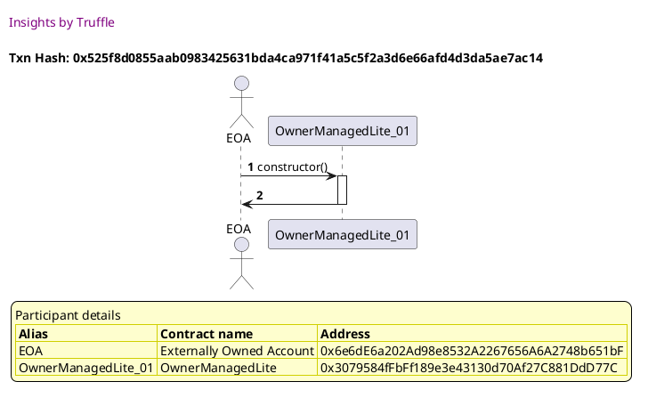

##### d2, tx: 0xf41ae4f004d192ef0f7c51dcb4f03973bfe7c533cdb4ded1af9c57e448a37bf7

[SVG :telescope:](https://www.planttext.com/api/plantuml/svg/bLDDRzim3BthLn3TPKFNJVw8xGHPK2yVQu4DBT02knGOP8jAX2fo8CjjqcR_VOpZ1XcMotmG9Ohaqtka6RkilN2-MHh6HEChsomBTAn-r7Obd5Y2mJbQ-LMKZtDNDLQEArCvU3URpgRZAMF3scyCZXYqtmA5H0UltH7WgdBwfR9UcDpekLsYzLHH-KF0Z2xt9LUDMndyw-9Elo04yS5tAwJKTWu1xro_Mplyt3s2TVZNjjRpXQ-XsC2zQvIYkinhRn3krnQkHBqO05-hE10OAyvZ6VH3L5obPI-GPK6-g9z6XK9oH54fYrYY38JgbxqKupWJKLgeb95afQUdJszo43MSaJrZ99lNfLu9edhpRD7z45RCKNxN7d_ne0qyuJzZhCs7Yz7fUpW_7q0kvPqN7jy_s0SsxBhmiREZxHVmcnK2MIkMhNqIfg7DBdmB99_3keOjL3k0_73awmGJEKr4oCDSzZFCUb6OXs6I9hqaJ_8mZRCYwGN5xArKKLM64dMTbru_4G9uzmRq0Lw1V-BmxUVqcbfqcisEvfxlnG0OsuyPkpqIJw8NsjH7D2TymZdVqQHf8XrfCwOnSTI50-43gKFUQDisYDQrHsU5CPksCHBoigIHzlyfm77XKmt-rzi2H3pjzx9OpOgP2h8-HXX7GSHbodCLfkCi2oPoagPZ0Y0bEZtO9QtqS_u1)


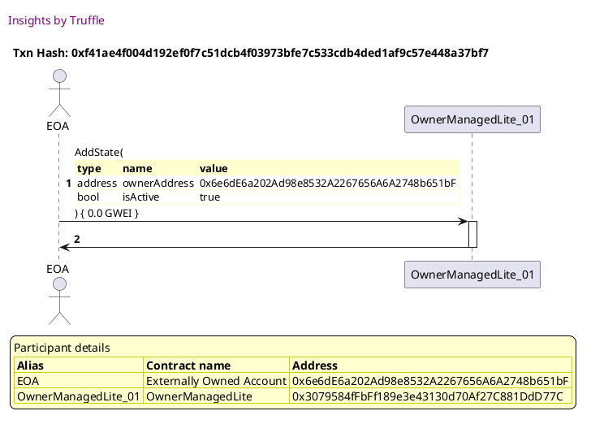

##### d3, tx: 0xa97f6a001413288768eec567e2fe9c26b1046f49a1c7359fe1cb596b4a19663e

[SVG :telescope:](https://www.planttext.com/api/plantuml/svg/ZLHjJzim4FxkNt43QMnb3EUbJeAwYj2c0saJ2D3sOKoJ4rzAHEfMZWCjTFzzrpIhG2lIh2Xddy-Fxvvx4iQEAokDhISbOxAsKrrFKZIikYlqJ1evWHB7gDM9pEx6PbfhDPYMKmExesIK31B6UfLTbDXdq8nRb0eDFBLBWDEfAHwdsieoBekndg2sX9ZRJS28DjUGizhCIdonSLKy8ZZ-ndSXbIhq61pUkdutjdVO9i7Q-yzqLOnlRGNf0gvDdUU4osnXIuJhkOPJMTqU0P_BACY5vDpn7SyDmq24Y5bN1EZc66MkI1tkYzoFf9C5NZVAqSdIRYHINpgH41vXCfbPIZqvZq5Mi4DsXn5jjiYAcQHIpnyqcgzIop6gBuN5Nznf0hVuTnXhpiD1V_i-xEyV0H5mPQN59k3TZRvXlROL7rhRNtu2kvWXaDLoqjXxMTOqMOKlLn06gmgMC5s1n9ibd_F_76kez_04_2E7pz-JC-h4zgJd1pzs3QgVgwhMvHqSGU_jWpIQEjc7NhRM4yNqEvtBv5joUVscq-aTDlu-l58ZLDQibB04UlR-rb1Ke32NTMdtsXIPGcfHSK-KlSRwMk3iubdR55fPbDMpUuTyI7Mlk2KTKmTfCY216WBViBnXSdEEybn9WzvpYqRBibmqab0GPnbzJBPXNQ1GYP0kTsCLXHXsFJTsNH68heX5x0P-c8gkauvU0c-Jrh_UvWAF1r4tzFDHEigTC48FVS_nk0fudBl180oTeHe6mO0k82PQFjWnlUcty0S0)


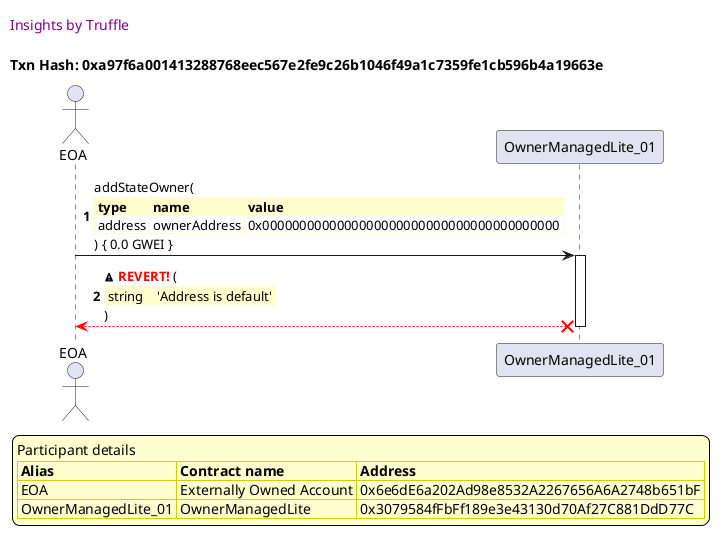


## Fails when the caller is not an owner
[link to test...](http://github.com/thedarkjester/ConsensysAssignment/blob/7c5b2f21f354ab6c2adcbc9e6ca114bc570081db/test/OwnerManagedLite/test_required_owners_amount.js#L22)

##### d1, tx: 0x1a0a5255738665fc102f62c694ad3356b4ebbd63a642edb36559eecdf84217de

[SVG :telescope:](https://www.planttext.com/api/plantuml/svg/RL9TRziW57tdLw3qPLDN3MD3d2YBolAXLkhKIklxT6sk7LI28uorfEt--uXZHQiMFm0-vtBknu6GspQ03ztM4W9TQ5otBT2JziMu7NZOKeirElqTofVQDvtJYyOsdbwjL-lLOaN8h0q7YtD2-s-3eD7Jj-6Nqhl6czV61R3AcjfjqOMeM8Lpm3gI9ybTvtSMFn0_pIlI93jZJw2rSJLDs03zwVVPrw48CkI_TwsfDw6bnO4--wwgeYu99bYaptj7xw3TJ2dR9y10S276QIwbgCg4yKhoKauoq6agP95XKMYPWimuwYALGamGIrtb6K_6EceIA4CiVVMeABHq5FSHYMCBfZGxYAq-_dReVu236lM32VYB9NtW1Nn4I7-Vtimly_JwUahBnhN1TyUidpwJot57WPFIpPGISZAGFFrJbiO0nhPaDjZuvMh9beon-Vit6dsA5SR38XhWOt_KmHQFWDBQOnkvyxtvUzzwNFS1lGDh3ttBcggoZ8ybH8hj9Kgzai0PLtgIOovIhZYNOocaaegFixoG8YdM7uKlZUv_z9I0yrHbgLeaoR9agPeKcE94I9wewAnQhFCyIyTGnGHn4iCyo6rSuxF_2m00)


##### d2, tx: 0x437c3281df179fb631ac30b1dbfa6a66ea3e318ba8acfa5d428872f6fca34536

[SVG :telescope:](https://www.planttext.com/api/plantuml/svg/bLFVJzim47xtNt5YBviOcnEtRefOXLVQWRG9993sWZHTOgTOk4xbED12zx_lceQgq_goFFZiy_tmztqNnixhY24sSySODh7opJmtWTMFrYymu1oScHcllsBnE0jLu_MuSbM0TzF9T3AUC7PMnvKp8mRjzs1Gcm2ltH7WiWhsfV8HdN9svkV6HwfOnbt0b2wt9HTDM3ZpryMjVJ6Gz7Q-6zJQ-Xaal7FzRktPv-uHhEj_vMixUuWrv2ku2qrPKbqMRNG6xfOUBh5-E0M-x8b18T8iqMKo69Qv50aMWkU9pakKAAL1OKIIvPXXKM9Vzz8i6wIbB0iKlRwGZ2Wh8ZrzSgq0QpWYUyI8jcWBkq22UltiJVY17cT6VxVH_E996tZ0VyHOcmydeyFtS7ny2ahhsuZHlB_tz-oiK-5ZPqVhBn1N2mDaFSvR-uIkeSqcV0r4Np1r3MkeDWtKxiYNqaWzaPZoLEbXPhA-I5MQoe7iIoLLEkXbkUmd-VIjL5vLZX9jhOfedwW3nF3Mw0Ey0l_4uTlFoHL9T1ZD1kOMxyafCBOTCtQpHvus4Qshzs1Uy0lE-GOcJHFnI9inZKaW5NQ0Tw1sUQDrAn2josY2H-TMhJ0QL57GICV_962_y261__Lk6wIfK3sXnaboKN2XXhaHPjYNQQ949jLuccKqa5XI0sAYuuETqqe_vny0)


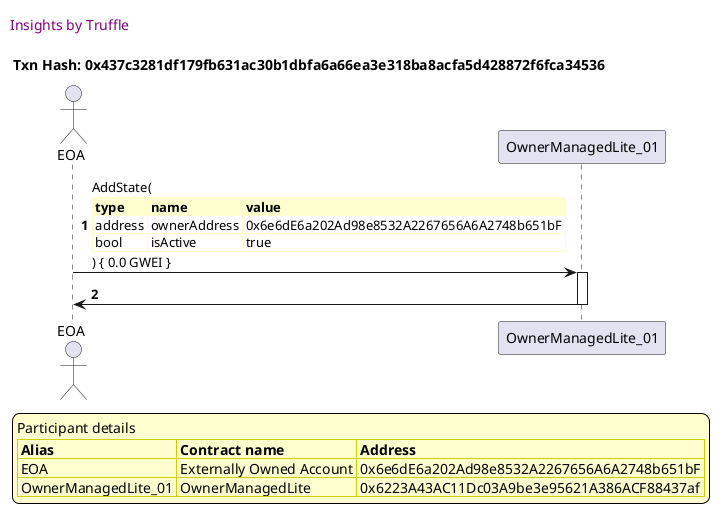

##### d3, tx: 0x489f4603d63178ec4ac5b62e160ce5893eee280a863b96a0926a599a1dcd57ab

[SVG :telescope:](https://www.planttext.com/api/plantuml/svg/bLHjJzj03Fv-ly83QMnbZCjh4zHLf6qwa3Q106qVnZGvkKk9I2_LvG8jTFzzJXfLJ2iV5aNdEzlts7xiXB7Jog0szRnW36jJgdgUICsg-rmjKECS2ZcJIemmlP_fibPYN1QbXlrfF8t7CME3ogmAEMJGFdSIXTJmt1q1pagTFvNAO14L-KpDfJA4c9cjmvIC6yX5hHU5_CjmdJz9iDojxXA5oDKCBDwfVhToSDmbmRhuvwhAPtUcWcG5DxhECi9b9ZU5X9kbWZEixaw0BzqWp5oVEy9th7uWKnTJB_5jQVaybLuGEb9AE-0O-4uI-iX3sqSl3D4IgV3wc32YB3MKUdmH0LQmHtAF4MqcJ_C5KgaNZqhghwXm9iMNtCXVt6eTT-Zt66llmz5mjnqE3q-02BWsQ6JhyEvMtR91rueFdHokFu5PBIIGL3XlvGCMDMqQztK3eMLLmHhA1YJQ7lbIk87dyooPZD2Ex77eUtuMz14zd3e9xqyYPsGHKwCDr7ju1lwHm-VlyJbrOdVIowCV-rgAdqrLc_AEJc3mzX6reauEOP1kvebyXhtULVmjlhfvq-iDZblz45wf4IgZcqbO0xq7AHO5jJslG9M6J4JGfhY3BbCc97KgVsWChv2_cNDs-Q9xGXhCY-f5-0cVSCuRYccSgP6q6TESQWBVahqbT7kFqcqcXDQbaLfHigjsCWH4QKhVbFbFyby2xvgmVxLj0D-sdSXreh5bJLBkH64Y7Hbwlcr5Jk17usaGk4uVCmf0J7Hyi5DQwU_m1m00)


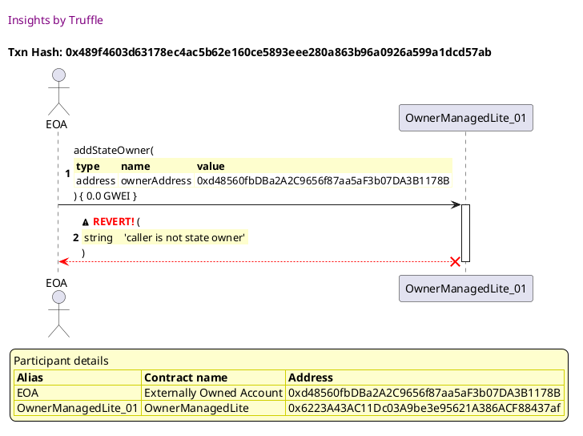


## Fails when the address to add is already an owner
[link to test...](http://github.com/thedarkjester/ConsensysAssignment/blob/7c5b2f21f354ab6c2adcbc9e6ca114bc570081db/test/OwnerManagedLite/test_remove_owner.js#L36)

##### d1, tx: 0x053888adac45f8f286d1a8d2df56e133380f313c5356ad13b86c8556664f2d8a

[SVG :telescope:](https://www.planttext.com/api/plantuml/svg/RL9HRziW47xdLw3qPLDN3MD3I9H5TL9RdTIgbTRtwMomW-hW26CjwRh_lejZHQiMFm3-lkExk-yWvBOBu4E_RGY1FhIktnR6a-xLkXrusDB6rCRf5PIljMzxfzTjqtfwbMTvjiu8MNJXq9WbeSEtCQ2Dfx_7NqhlMs_VMXUWIHjRkwrn0HMhS0x8aJn9xdg_Qym7ueTzCpHApjWpQ6rTJICsGd-6VV5rB8AC-R-xpjQRqD7YG5zyNrMeIu8DZQ4lUqVleTlCATip4IkbG4EPY4fLN4aTWT9SLqAQA8vZnQeuYaiH2mawYWibIoM4b3Afk5P0qB8oOEdPKqgXenFS9mHj2xQqEy1Mdtuvun_1GMtqWmtc9uk6m0luX93XFhrPNkRfzVMSbgthWk-FMJzz9fVZZW8dfPiv9UGqGFByJrdQ1B1DHnRZ6BzStR4xnjZo_Hl5EM65U5ZZ03psHnripH58jVQcG-vyR_a-j8xhFXZle6aEGykQfcM9ZoKWnVRII9r9u8odUgQC4Z5FEPTJAMGgKpvDL255LEGVXIzPzpyw94YqZ8hPL4iS56HyfHBKopbZKnO3psUpIWgJhGGcG2T6FyWjhlZi_m80)


##### d2, tx: 0x09d778f7271dcf9f8f128b2f1564a7a19ddfceb95d0bf905c28d4226b206a3f8

[SVG :telescope:](https://www.planttext.com/api/plantuml/svg/bLF1Rjim3BthAuZiig7h9YknR0TPKAUrrm8RMg05TYamo9QS25NaG9QxfCt-VOpZ1XcMotmG9Ohaqtka2Rbel72-NHf2HEjhsouBvKZpfErAEB44e-RAofaed-QkRgsyh4tju5sUvTbbHiYayHkZfWIwRw64L0vU-oF0TUtqIsszCAdHSxjKrcF5oXy2ShpSbrorRcNKNnVt-aL1C3huxeIKsiuXeBthTsSdd_j7a1x_nZPwll0D51juS6rLOLtYjJSA7jOMhaMp60DTqqH6KLn5B0faMILLN0KiBbWLX7ma8X4aKbQbAf9Gqg9AQ5YoM8uOumMZN0ohcA1afSUdPxSfY0O6Q0S4PVEwr2k1L6z_MUM-2olcIdxJNlsaGHTumZyWfCk7y-dfUpWx6qCgvRqNNhr_j8zaqdVXOs-dso_WDoi5QArOTlPPc1Otk_0je7nEDGrieTu1f8SZNNF5PSO5eooLIQpYSCXIf1hnaASyPT4eBdWO5FbRgQAk3IRg9YszVaO4yEuDw0Ey0lr4uUkFx0PRT9hDZkQUx_aO2DcF6Rax4aygBxHfZcXUqIjAwOucJXFgY9jB71E7NJWGFf0wv4stNODmNNlbh31cqpL6GbgMEDB-FmKuBdogmVzwEu2Hv46HH9A7mr1aR1QFi5xEA8teKB0yIIeUgcmM8W0gqUj1Bd35d_CF)


##### d3, tx: 0x802663b293249d74dd9b6fb5caba1bd2609bc92567966a87742f8454bdb53e5f

[SVG :telescope:](https://www.planttext.com/api/plantuml/svg/bLHHJzim47xthxY1D5WPmtKJ9q5THO1q86q20TeUnZJPiLCYKgTo76YX---xf5d5jFAmAFBPv_Fdk---X92ZoWdhwcb1YAXTQUgfr9PKzxcP2IkcKEY9DkfOfFSJMzP6dPH5QM5xd8oJauIGOUKMXHuHQ9yxBPIsyDmj0SvAcp-LneaYBlA9cMhZ435pwu0nRguWPxMT5VglZUlyIKFVM_ikXLAvcK2VTgvVhHqUT4cGxlvpK-MJErU1NC2DhRCCSOdBNQ7XPcxWJ5HtXq3d8MMS3oIB1ioBLE0f5KcUIJyLKlIbOfn6CesOpuE8Sn46WSUoqFCzgQG_q7v6aBBKOUh9HGoYWYsqMmHfStcQpmIMUl5ejFqYZ9XezJbt-YVjju4R_5k4jETXVxHv7_Rs3W49k7R2wJPWzzRSac7NYlUT7Iq_WblCDA0rOjhQ1r7KE6d2bms4rLK5IoWRa7Yzf7EkkKguO9J5AWfrw0zOp1WFkCzZ7hF02oNt-tAyWde7pq0_KFZqBJd7JcnEUhx_VTjgzQEfQbNU_Y4CtpuAQx2J8nYcAprXpAZNkqg-9bStRtgzuK7h7y4hDKBbRAE49U2xywU6l09XLcNjT3aIfR57-GDozXhjAuMJonTzKzg9lAXUN7nAJocb3RaeP6mXJavGeHR1rpIlgLoVmqGRRU0uTzeQKHIBLXCAuZJ5hydz9-qlWJTfwrzlUu6dU5z6WUB-m1S9Emuzn1ipIWCw46mSHHdtTNBiumN8HCS7ES8H_mk_0G00)


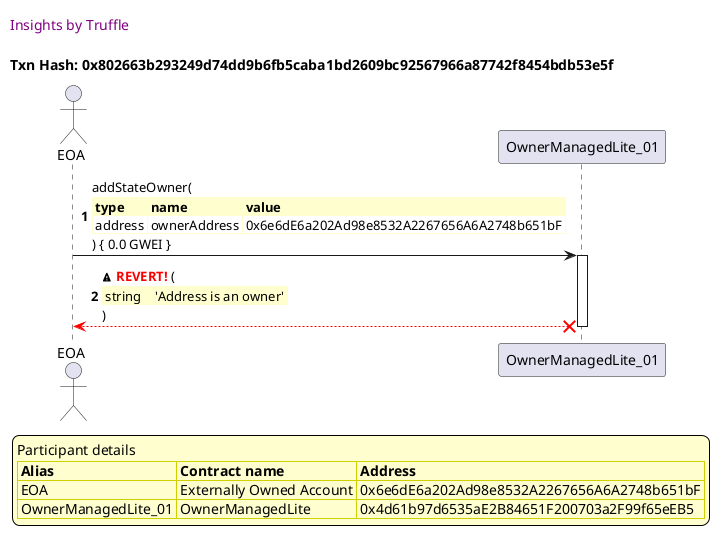


## Adds the owner and is retrievable
[link to test...](http://github.com/thedarkjester/ConsensysAssignment/blob/7c5b2f21f354ab6c2adcbc9e6ca114bc570081db/test/OwnerManagedLite/test_add_owner.js#L34)

##### d1, tx: 0xde2d2165d98f68d5b8ce585b3b3ecedfae2aa5a5fea22dcf85524f0bdfdc9eee

[SVG :telescope:](https://www.planttext.com/api/plantuml/svg/RL9TRziW57tdLw3qPLDN3UE0IPH5zVAXLkhKIklxT0qNnwg38uorfEt--uXZHQiMFm0-vtBklUT2o6qRm8TkMnC2NMXSjotGa_QbSZlmiAKrbkZCTz0lfMywPnPDtNXwjLwjLuiL8RCs76gS4zf_6mI3dhuDlvJUDRvwRLo0Eg-hqctHXQXempbW7ScJvAxpkne_43-hLwJ9-8mzWJ6LAsd21kXFly--3aMG8V-zQwjo4rfQ7EYpxwoDkYHKeKRwl7Vq3jhDbBAzGMvu8eMPA2kL4ONIA9GeqY95ZSO2SW01mY9mRhHLGl2nPOMnHayGeoO17MBfgyUSGaj7SH-HQ5keTBM3sEhZRuV-1pWeqJnK0N-nf0-yW8y8wU_Jc_bbdbvVJwbkN1jyTypwwJEv77SKE2dTJ2aXfm6Ift_ACXYWgbio6yRuvMh9beon-Vit6kSKAuo7HHo0Z_rH1riy0han7jl8dU_Dt_lMuxeFw1tKzQ5lsT1Sw_XOGgJONg8qAmcSyJmwZKgaFETSPbB8NEOy6wj2YgHOVnI-PDt_Q9-0gQJGQwPIAnC-uHctgSqWarmXJ5AJw6p9L2R6CK5qOl23tCOrFlk_)


##### d2, tx: 0x730d47bfc21927702390e8309e3fcfe3ef28cdbd0502934e42da1f21a5ab53b5

[SVG :telescope:](https://www.planttext.com/api/plantuml/svg/bLDTRzem57tthxXYBvkwRev3Fa0CDQEmLjhKIgsqbqgJ4z-0LUCWnscXPVzzbv0Yfl6oFFZQr_V3vvmRnYvgBvrlbeOnsVZADiiS7QiVjLr99vTWS8vMVPN5uznLZLMJobGEtisci-baojYezXk3OmRjjq2fqC5hTmIugfn-gQoN9ZDwRfTeFLKi_I5WHfVxagl6hGp-TN6dNn22_i5tAvNITWu1xro_Mplwt3s2TVslRQtd2rz3le5xrvGbrMLUUuDmlxPm9Ul54FWw2Rdg9tbPY60WaeIBSC0n3Va0mx8eCSHIf8NA5O-u68Hzx0ibWr84Cf9v5EOH8yeAJq-VtcGWQ-YHxJ6YpUj2hoH1lNcsw7v8A-UelckFltZG1fxmznXhy-5yVFeUpiw6a2brvwN7zm_sWOqw5JvsThpz0dwpGY1hvRArJz8qjDc5Ru7eSrZNi8Lgro0x7FawnbXDOocuoDGWnJGAHIP4dCHHdCMPIFff7aT1FdihbLULeKHTPuNNJzG1l7jhz05UWN_YyEtdz9eaEerc1tEFztm8ZEt7ZDqUaQVGIstg8vYN_99pleD9qqGyqcP2O-98XGFW0wX3tdZR2aJhsgEpqfXDAuo2h2XefFr_4d1S-9J0_thR1ZmDycB6qx2C0q7p9igmJ6GIYnJb85H1aLpoD8dwr82OwFXW5xJIp_a7)


##### d3, tx: 0xf023be30e74b7f0c9c7d70824c7099de3e287a52ba82ee4049bed089389c29ba

[SVG :telescope:](https://www.planttext.com/api/plantuml/svg/nLHBRzim3BxhLmZTfKNNJPOVaeikgFDQ2sn8WHJOfS10MxHZr943MTwIDlllKrmlQB5WG7kP3g94aHyfwgC8kMmi6DikAqAWjRLkboaQqjoNUWK6bhJ20hKQGdPVcBhLQbHNjQ7lffFfP3GXvAAncme7X7PZWQ3GqCT-I-bLRSg7Mbkeageiz1ArTOYvtHjCtU4JvAergmfV7CpB1wHUiDVTW5AbBgZ7UjMlJbvyx9CWVVnhtPJ5mZOqtT1Rq-QvmoMsj1NIsxMcLz0ipYbRvupxAVeCHP2Ad6Ln9fHWaWUPO76iq4Sk1OGy1SaH0nR4AIecOr_66OzJ8AvacNMfJsO9XOOUENb4NDbicPKhS5UT_THeleA60jMNqk9tvdM61_H7X7J-z6nm-9oUdfvJLu2v1OkTmV6TlYCN_LEyx-LW-udQpGgfangMdVm1LUiME_Fj3i9Wqz0jhNSWoNxBrYgGOSJoT3m4dl1H78LHxYe08Kpzb8bnuWyzJyZX4zG9VQJi0wEVlqsktKiSJlgVjt61qOuMe0kSwUvUnoUlnJaxEwTlYRs4UvoP-P_uhm-y0yawtpTc_ZyhqFcGfzucDyyOgz12MJNFQ3LcOyROZbQkXHrvtMBaUjCuwky9jYVHtc-mxRh2pMkBHaDLRRfkK3J9ClUFs8vm4KPg4W5dF56nH1dwZdSy4evuIPHm4SWq2hrq-XBuK5VzhUq2CEcbsPH9Fuyy7dF1SpyN828k4M9VUPaOCod2m0LmbUZhGIxTx7x4tm00)


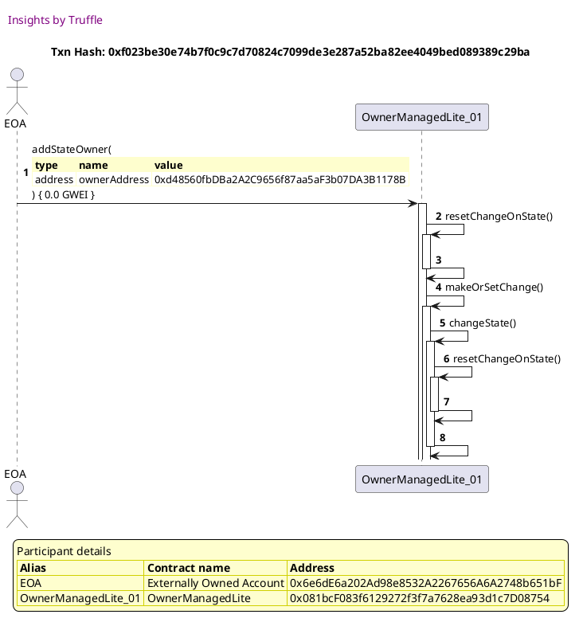


## Adds the owner and emits event
[link to test...](http://github.com/thedarkjester/ConsensysAssignment/blob/7c5b2f21f354ab6c2adcbc9e6ca114bc570081db/test/OwnerManagedLite/test_add_owner.js#L45)

##### d1, tx: 0x99a6ee563a292c8a30c3695b5178e15c87b0163aeb3214777cf9ccc40bb21eeb

[SVG :telescope:](https://www.planttext.com/api/plantuml/svg/RL9TRziW57tdLw3qPLDN3R31TfH5TH97dRIfbTRt2SEDWqfmXB6MTDr_7t6iQDN20n_dt7lk5mZTTq7wqEyiGh8FhUjtDNZKlHYtbrxki8K6d5v8zTBujdTwsThMuvjrjQwM5KApBXmjp14UrXQa1ez_Zq-C7rflNbiNf2sjQTmEN8YAct0nM4VoBBdl_Tx2E-A7UGLCqmls9BKshi6KZD2VuPnz7fD0O_olhZFDDdIuFk9dtsysKHS54opWvuF33xBRJZ4v58KK05maaXLCvJ8XAX45hpdDSg1SvLbDQ6IXJXXDionJcq8fbPAwPXIWHh5bAiJKgySIomvFuZb1iMt1ABENiTJ7NmxyT-ba0_gR2V2JqC7m2Zv1QF37T_FhFBwzdMBLkYxu_XJrmqTqtUuaS5QwcsA4pWD4J_-afI58Opiq6yVuwMP5LeIG-TiN7ESKCuoNPHo0Z_LX9tTm0agjFNIHk_ZDtuRIutu8u9sqzZYKh76fLFmi8LBa843eIaX6MAcB77AUi98naGakIb6oBCrhmMczVYzyhNN_eqE0DLECAxvSP4d98H6hdAORIlYICPg14Aai5fmdqH_5JepzGFTnZz_-Bm00)


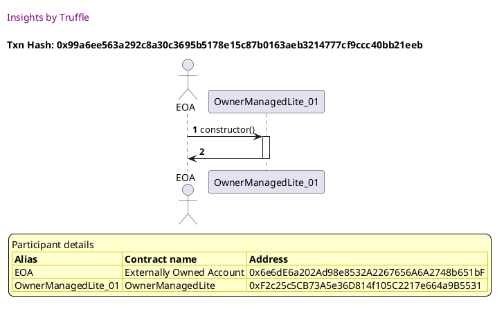

##### d2, tx: 0x9f59b81dee0125c113e1d0660e2794f327c2e1e620453851d46dd28b99798bb7

[SVG :telescope:](https://www.planttext.com/api/plantuml/svg/bLFVJzim47xtNt5YBviOc-qaJe9OHIZjGDe44aXxGPgS-5eYNATo7DP2zx_l6aB5jBui3pxxV3_yVT-5iTCsQ1-wXMLCTw5ntQ94pzg7sYsrrmkmE4TdpdJrCFTDvyouiOs7TzF9T3AUC7RIXhN54OF-kqTjqCFpS0IuQ7pzrBYWRM7hkLkW2rHn5dO1KxfyARdi_DBYNnStzHE2Y7U-QsrCxUOW-E3wtTkJpyCZsD3_qhNr_3wqKAxXrdUp6TLbeGuMuNRbu4AtzyV0L_aioSjC64GkP5894Q4mN2cECitZMIJJIg909NcSH5aYJAoCaLcPvscUbMNAYB8gqDCdLmNe5Wx87Z2YBTHLlTG4zUgNG_zTEpr7ywqE-9EBFd2F_u2nFX-EHllluV3m60fZRe8E-FxEtR6JGOMFWnrjla1OBn78EhtexQEs7MssuHiW-ZosBMoWsJOeTaU-KgZCH6d9PM7o3BCaaeMKAbM9AbGXqpWhLIBAwMkficai9TPjKONwaJf0yA-DFi0py4ySllwON994-z5iORxWFJe6nbx6Z5s_8SzWqBLjty0yv-USyorCcYRYaJPZ6XDFAkm0xq3jyaQRNY1QLm6zqzQkUs4C55L58nt-au2tXVS9_A-tRp2L5GrPCZvBeoB1I9rd8fu9deob52ag5UlyB4aYocV4nC07EwMLViu_)


##### d3, tx: 0x4ac136694ccd21409dec226a9a83cffa933a032590d596678022d840ab666dfe

[SVG :telescope:](https://www.planttext.com/api/plantuml/svg/nLHHQzim47xNhpYwbvQkcopRiXsoKCT9ri962YdifJ3EbkoOEdAGvIrfi_y-nVL2oyAWVPaUTDBfxhlJwJiHSjaOrAPTLOHWQshLhbAfINDVgZLgN44b2wd46BFxGjUj4abTrHhUpQQpQJ8bPDYORIL71Bgnb2YaXiT-2t1Lw_AXLWQhk2eBjPBAMCJS70nczl09SjtgTILV72pA1mcETz3Te12bAi2XlUfN9uSV-oH87_zQDMMnD0saMxZLRPvRN69AKqcutIYumcOv0BhnC7DSpYClomHpF1e9cJ76CSBGpV8S8zT5wZ8_eiAFE0z2ofW8FOefvrpa5fDWPcpgqtaCsC29bIV4bisKMRb6UzNvJoNrLrHOIF6bDF8xTJh38_eJGZf_k1WTFuVpym7O0YmC6jaPdDwfEpBid-9zBqUxJs2sQmbMAbnryWTMhLtipNTx22sR1dPGxq7YmvPkX1VwdERfP8miPad4VPw70QAFCpUbmIHsnuuJXECdg3Du1Fg1mkTlqslx4iUJ_kTjR61faYMgGivLTw_JizVYN5mCu2snLtWlvthn9_xh0-z1iixtZPd_pmfqFkIfjydDCyOAQR2iccUqcj09fNHFAzl2bhnsaTZUr9Rw1u8TI7Jm6-swhh3pnaYjiAgsNJS8YBFC_YEc8noNN4mvCifY4OKoz5tBEyO3IxoOnopmmfJxJZfx2Noig_xMTW5cB6D-vYVZm8rzwV99w7YvG_s4CIUGd7iOZNtVjVx4LgAl1xcqi_qHVmC0)


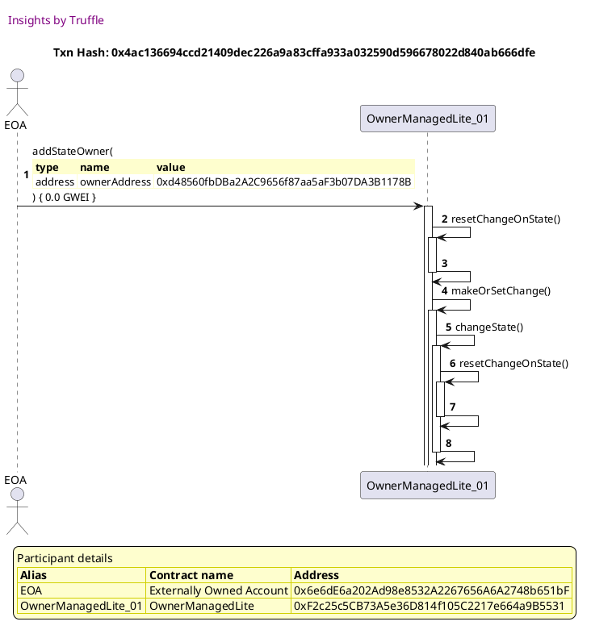


## Creates change when more than one owner required
[link to test...](http://github.com/thedarkjester/ConsensysAssignment/blob/7c5b2f21f354ab6c2adcbc9e6ca114bc570081db/test/OwnerManagedLite/test_activate_deactivate_dapp.js#L83)

##### d1, tx: 0x57c050b1e258e3f7109c3db82383b0ffcbfc6727a9910effc836af10a02304f4

[SVG :telescope:](https://www.planttext.com/api/plantuml/svg/RL9TQzim57tNhn3foqPN9ikn98Sir8jjMkXeONqViYKxeeeSP9abRVVVT-EOiBBeGH_dt7lkbn2wxOFqOTXQXEGGEZTiA-rH_sBSJdgvnLQtsgdlidvfVJSujUviv_5LMPJ5ka1esOU3rIk4nxNHKccFtwOdndUTDw-T2z9crhHkgrq0nIQS3KeWJvAxmU-i_a3yDAyQH_CpzYILCgx54PcWF-Ev_3ebWQRuzwutxIRqk3hWPpyq3UYYO8BL-7dly9tiDmjCzWclIKAgIDD4wBZX4KdhM5M2nYAkIDFKLLCpJhbCquXeU8kOoIOYaj2Op9ivWfRL0L8l7ZCiUpo3SuQWRS7KPYUXrCVVJliVqibMgmSJz2yIZOONy1b2ep--MLtcyVNr0jUTwuCVZb4_VKQNxOu29wMR1KReD43qz4zQIWTfR8-MqnY_NEKa9uIithzXc1Da29Sr3C13VTZ9hJu2cL9Uzy2T_LRlO-cmxuFsJbfx64jMEAjh-2m1AB9dcgc2IKfefbAXHHBJZ5B6MS8obb4-5nLBeghyA7ofTV-ZOm2ULX6DYbmbUSbJpkP2v8ho8ik50FcIy5XHaeC_WavC_K2tiCEt_mi0)


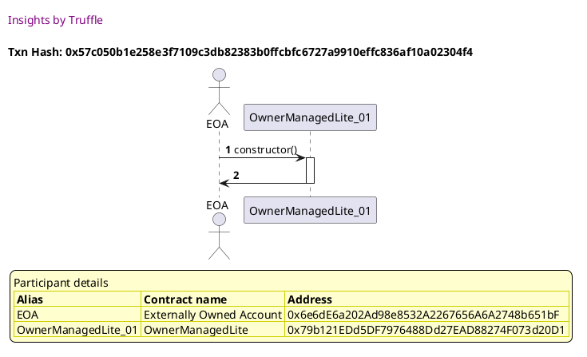

##### d2, tx: 0xddd75d4b31e9af655f4c10b4829691d6316a8441d4e2d52e07fd53226e0ac894

[SVG :telescope:](https://www.planttext.com/api/plantuml/svg/bLDHRvim47xthpXrBvkwReQ0WIYBoW9PAsrgfLRQIwN9O4EiEYOofatQxB_lGcYKQNaP3pxxVFUTl-yEGYvRnwthbfeGthd6TCj2Mj8-AhFYbYz1oreQyPMNZxLjEYDcZMuil9ldytoM4p9ftKRBAO7-MqWkf8NNuGXmrLZrqXZ7TQfLRPRIE4Iit25WZfTxo5LdLrh-TN6dNYHumS5touLGfWQF3gxVlPry7Xv1XlhNfbNrmhLGRE3UTbM5kCGffoNShmrSyNOn1heMGaIX28gH9nDUiJ2iWjAZHH3x2KiymKOUut4GU2AGlWXzIQDAX2FVPvBoCau2WfAL3f-UtwJ0MpX3UqPGDgTAjU98zURPIFk36rvByLqv-OjwVU09_naXVJvSJ4_Vm_dv658XxXntyls3UI2JeGiV1plTVW6tMKb0Q_YojqzSTxZPXMy1vREoRM4BpQv0UZZIDPDCv8pxr4z54iiOUQR8D68XIrdgHq5SiD0hvczGHTDeJ5HjMZhrX1N0sRT27-0Lw2SAttxcrzYYqsnsDFTyByP0o7xCoEsHU48whdHxH3EZ6QLqHnEd2NN4pGp7n68N3eGFf0vvqstV85pNJbh3jTxqZH6GbYMEjFjF0Ow1JpNuNszV84eAp_VoJ8JPF4eY5iHn9lmeJxCuHlWvZKR2fndc4rHYq8DSuee_vny0)


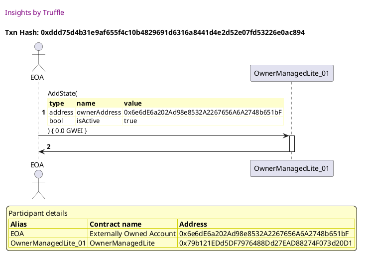

##### d3, tx: 0xa9369159eb886c03d46fd3c484d7c9ee4060052b88533ab522bc8dc2c3937003

[SVG :telescope:](https://www.planttext.com/api/plantuml/svg/nLJTJzim47_tNs6n5n1ZSxuS1x6Aj4a6qgOY5MalIDCbTjE8rAaSPskX-zzt3La5MZK9NfO7dtqVlpjVVcT2BbiBndRBcX3eRAExPQuCQUyhlG83IrghKcavXkA-D4sdvQIf6qFVPMcMJb92BbgxgTM8qFvRA93AqCVXIEbLOwg7HbkeuxegzL9fYuXpktV8qFW4kUhCgbOl3BFgGL77t-jkGCfAbzHXW-fNBoy-3aMG8V-rRgjoOLkQR-YjwUPpn2MsihMYjsjDhw1Td5EsXiZZaHD4AXU25yoJFfzBh_25ByCYKifddB70HMlWUP07hfiNGXPkuKLUo9X7i6M5nTBJQKoXfKSeZmYspLP5jGAywlIdLkOhQ2YL_59PzPqvlUC1_H4XVJmz6nssqzFJSueDc5cmgdSuljDtv6Bu5Uy7ETf-edQpKXIbXcKlVq3TuMRdljr16DMsT4kR7KYyFxArz4N0sJnFnk36xYJY0P-B4220pCjPcCJUs752CNw2Eg6Fb7rWzFEtz1h_nE6Y_taRJApiP06wL5FTt-luvBKuPsVdz2svbt2lfcRs9__h4-z0YZxsZPN_pmxqCUHfjidDCyPAPQ6gssUqIbZ26DlH2aSOoOkR2SwcGUhl2ROdqJvkjEsd0jUrLKP3NM_wQP0qBWfyHsnFEAwuJ3cup8rb91JE6VBEvI4IB-Qn6_eYvu6JPo-13qtLtze-GHZbZkkaYGoIB8n2xWkHI3TCuqG8XCzOw4cN9HXFi1D3FyWbhlWY_WO0)


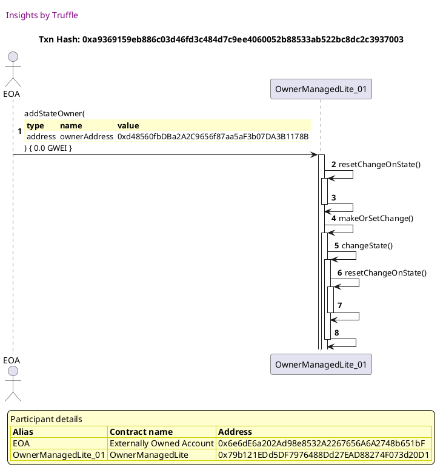

##### d4, tx: 0xb6a2545e8c6e64f0db10f42b9e5028ddad823487919aae63da45c4735213f9fc

[SVG :telescope:](https://www.planttext.com/api/plantuml/svg/nLJTJzim47_tNs6n5n3hvhZvHAmYQzA1jAbe8Eq5QNBYIsgHE9tZR2rq__kk8LIWLPFWPNdmEVVnk_FvToRahBN2sAwk216TRNHNPs18UwlqKXXHqmfAqFAZo6zBqtHQJfkgCVJDB9sbqvIGqzQkAvWGsdyB418ClHz-AJrlZBfhj1LLNAbIrw0j8XPsvp13umFaiZFB2fuPhjGTKCVTwIw5b4gNr663wdSlJzyFHP0X_uLkLRcmBStMzDfqHO6un2fR0RrUQNeksiK9PQlC5znpFGXp7totO39pME7oB0AFyL1A8KC-TiCWSY8Xm1zBuNgv6umzxeoBgCW9jYotM7ewZwbewG7A0u9jiofNIu57dV_IOBu8BKgGdvM5xypf7VVe3mZfu-beijzEZuzFQ0lsA_peb07P-xHnZPTY3s_q3JaTBkNj82UR3zIkbq1HQb7tygUeEjnitJUqKrZYXZOzq2CiAlY3mn6zf-mTev--fHVOwVr5_RDQ0rZlT25q2NDzPOM5mwENuen69_GrkMjn2tDpzPZ_vOct87aV-yhA_sS7-XZoCBlayWaZ9LYXglO9MHAMCCQsPC4HHNBYPegpPv3QEzh4Kk99qBQBcsnwrkEwic2qgAfrptP9uppVKX9DR8Lp9LESCiPZ6OKGUcCUS-u7lkV7Vim3Dynypybcpu7tJStVsZv146KETz94UiaiY0BV3SD4yY2Dap14-1aBnfAp1EC9TcBe1pd35L-yFm00)


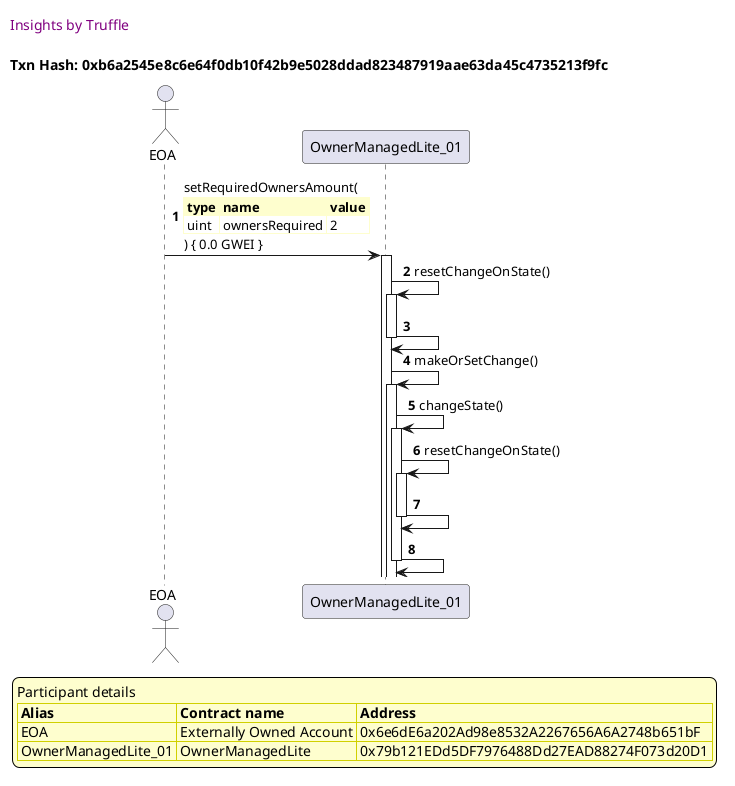

##### d5, tx: 0x1c80c5a528855cb164aed9ca8217cc317e07de99a19726d7f16bb4186490780a

[SVG :telescope:](https://www.planttext.com/api/plantuml/svg/hLHHQzim47xNhn3TIqlNJL9iIIvTg1lRQs4ZXHRsKXYoTN5C7Jd8yfQqsN-VudYXPM6mCJ_efDFTTwVxxepGPUkKTTsYHaXrhZ7T8WUBsiVAB9LL2rn32KPVgUAnj4rdzAIf6ulVP6cMJbA4Bbgthc6CSF_DGMcm-7auOdpTsEgfCKxLSLsLPW76USIPsnja_d87kUpiiePN5tVL4s0Qx7MtIklAb9YIGVMZbnVlXoJG4F_6j5KvTotEr_ZUThEPnqMkSZNW-vN1rwgTdsEoeeKaHQX29cKO5ZdbWG8T5KeoAefYH0KGeI6A58q4urhCAC_pW4eUH4H8ef0lMU5ywkaqngh5HruU8LysLnNLKlcdJhyRi9-LKINeJvM3huJsXWVqHmZr_lXiVFWUdvwUOr-0EwSSz0R73-O1NGnKl1taUFC1k_KIi9T6BNhvJTMTtspDDri82ssBDxZPWiJx8rd52QCX9vH9BI09KnAI6Oq8n26vWe232228WsoqWph1pvYy8_ZZb_J6Ct4uwJ--nWS6DvahKyBKzEywFlbRdBEpS_mliHVg4QRsxbVy_nvun-NM1kr62Ds-Q0mDJbLr-uAzX2I4a2rxVb9yZ_ZDn8-0zHssvt7FrTvllEcRpwyh1zQekbxtJQTnN1H-N5tFAmUkKwuOOR6E9CXmn6B6kE0XZtdCH21p7j8yUmryg7b_r_O1H9HJHjD4Xqac8i43AHFDH1edKdhuZ8YHPYJn_iXNOgW7klIh__7y1000)


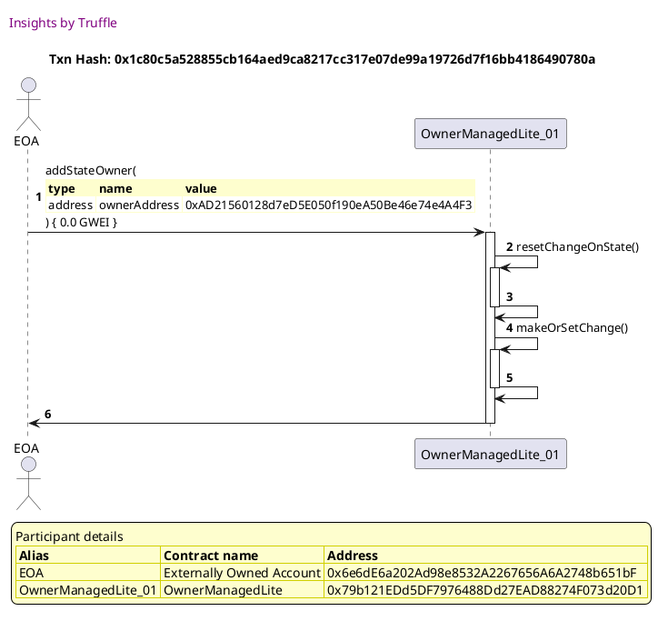


## Fails when there is a blocking transaction
[link to test...](http://github.com/thedarkjester/ConsensysAssignment/blob/7c5b2f21f354ab6c2adcbc9e6ca114bc570081db/test/OwnerManagedLite/test_required_owners_amount.js#L76)

##### d1, tx: 0x63caa512d2f3d4c126960f5b450b900609545b5104da1594a4e9372ccc2d4d18

[SVG :telescope:](https://www.planttext.com/api/plantuml/svg/RL9HRzem47xthx3eowQkccDiGn13pK9GAtLgfVLzSkmZH3KESXmDskw_xmWHMZNoO3lVT_xkxZiJSjj67MAtTOJeBZQ-svOGIFjI-vqEUaiTLE3jTsrUgj1qtkQDQmAzMXMh8Yy8cRVnu611QFzjG5i8z6tufVIk2VLhuwDscQihlmKVKN4Tpm4h94-Ikoxi77mWVjQlG1DnnfwqjRMlQC86w4-_pxyEHP0X_xrlwseJMreUw7FerclK9R6E3kZptjCxtMvcbEtLs6Wj4sxvUco5IRXA5LlBKaXMfemfbaeXIvamONKYKw45fEC9DyPmAsmo9MYPYLXwyPXHtT8HxYE2jiNQr3kDhJx-zX1-QAyhi0zrX5yiwGClu2D2-llqPd6PfzVNCseQtyRG7RD--amknnq5JaetCqh8QO3awP-oB4HTkvRCXp5-kLgo9MDiyVwDufomGZpaE820_L6ljt04Cci3jCYTxotU-zPntKS8NZjtw5ksD3C67qj42cq6PGkbEUEPJQSmbMEUSQucIgfCPNmYfgMIIRdwA7p9kl_HFe7aF2kaDK81cneDapINozGcIicLa1EXM2vpZC44wCJW1xd55P_zNm00)


```plantuml


@startuml

autonumber
skinparam legendBackgroundColor #FEFECE

<style>
      header {
        HorizontalAlignment left
        FontColor purple
        FontSize 14
        Padding 10
      }
    </style>

header Insights by Truffle

title Txn Hash: 0x63caa512d2f3d4c126960f5b450b900609545b5104da1594a4e9372ccc2d4d18


actor EOA as "EOA"
participant OwnerManagedLite_01 as "OwnerManagedLite_01"

"EOA" -> "OwnerManagedLite_01" ++: constructor()
"OwnerManagedLite_01" -> "EOA" --: 

legend
Participant details
<#FEFECE,#D0D000>|= Alias |= Contract name |= Address |
<#FEFECE>| EOA | Externally Owned Account | 0x6e6dE6a202Ad98e8532A2267656A6A2748b651bF |
<#FEFECE>| OwnerManagedLite_01 | OwnerManagedLite | 0x522AE5dc46e08cae79C5D9d1665F457460C5C22A |
endlegend

@enduml
```

##### d2, tx: 0x318f806804386594c46526ce32cc8599bbad86a4f954014f98b6f21cdcee30ae

[SVG :telescope:](https://www.planttext.com/api/plantuml/svg/bLDTRzem57tthxXYBvkwRaw8JO8OQaR3McbJAxNINYfDZct0gd6GuxJGil--IqWHqtXP7dpjw_lXSyuD8HTr43uqIqk8Q4BbccMfFQaVZLi9BvPWzLmxzLN8nxcl6gScbQqyl9iMqs9I43AgmyRgCO7sMsYXj8VNxWXmLNdpKhaWR6xDt2sr2rXn5Wu1KxpSbrmrVcNrNnTtvaL3b1nyjq8fu-OGqSxrkxMZpzqZIDV_sjLclWWrb1kuzyriXdL9CC5gk5yxk1BrOWXqtO_IMKfvIfD-obcMo8Ipc4lTZwLCMPQLfL0f5yaiOmcDqAGbdyMHL5BhFXLOamWPyEd5JGwYXXxQ7a7QWf5c9H3gpRFJ_eTmOgxLTnFqBngrWIVyFKBQV3WVdxw7ixCXv4hT1H7q-mVtG4QT2XyxEzv-WR1PQK3hnBArJy8skDc5Rm7fyxgkOGlLha5-ED8rrrmLNCGqpbMMwfJrupoE-O0pdlCy7YI8dKNbzArKMLKM4qsTos2Ui0C4_zRe0xm2_KJXsy_Y6YKwZMO7Su_tV0Y4xCUCt1wHftGGnjP7C2_f9QLq1nEd2Nd4pGJ7nACA1y07K8UyyROL2DTrqDu9QpUjC0foAN6amtyIS5pubC3_Uji6B8xpWYaSCarJAVGWcx3BJ4MSisd21Wcd4pR166o0J7Hya0jSyUVy0m00)


```plantuml


@startuml

autonumber
skinparam legendBackgroundColor #FEFECE

<style>
      header {
        HorizontalAlignment left
        FontColor purple
        FontSize 14
        Padding 10
      }
    </style>

header Insights by Truffle

title Txn Hash: 0x318f806804386594c46526ce32cc8599bbad86a4f954014f98b6f21cdcee30ae


actor EOA as "EOA"
participant OwnerManagedLite_01 as "OwnerManagedLite_01"

"EOA" -> "OwnerManagedLite_01" ++: AddState(\n\
<#FEFECE,#FEFECE>|= type |= name |= value |\n\
| address | ownerAddress | 0x6e6dE6a202Ad98e8532A2267656A6A2748b651bF |\n\
| bool | isActive | true |\n\
) { 0.0 GWEI }
"OwnerManagedLite_01" -> "EOA" --: 

legend
Participant details
<#FEFECE,#D0D000>|= Alias |= Contract name |= Address |
<#FEFECE>| EOA | Externally Owned Account | 0x6e6dE6a202Ad98e8532A2267656A6A2748b651bF |
<#FEFECE>| OwnerManagedLite_01 | OwnerManagedLite | 0x522AE5dc46e08cae79C5D9d1665F457460C5C22A |
endlegend

@enduml
```

##### d3, tx: 0x1d7d55210c8c3c5b887bd5fa8deaed048929796509ea4301f440db77e93dc4b9

[SVG :telescope:](https://www.planttext.com/api/plantuml/svg/nLJTQzim47_NNo6wbvQkc-nO_YXTgECaQs4ZXHJsKXXdw-oOEdAGvIrfi_zz5zSBBGk3zcL-q4cdkzzz-7TYxBAnO6oxh1Y3rjQwNQPeM7DVwXKOMF8A2zHg1DbzOUfMgwIkQiFVJIVJIJ9XxAAncmg7Z7VV0a6XuO_zaVEhsfGFjRPGnLLPw2LgIuYvtHjCwV89SjMQLOKlBkRb0tB7s-jkGAbI5zmHlUfN9oy-zacmFlwrRifYOHkURlYjQVESS9ajRONyTgtv5JIBSoxMZWgKbAuZiZ0RP38Dmo1LCeTG8Q0INXYvKH3vKaG8ta0ukUS9bGO1HWELUMd4g6MPfTGdivX3muz87Z5gcospSWLKwkodHlCLD1IelfGMlmkdCpoWFsAiy-TdmyFt_FJqd5C3vXOiTWR7T_gENVI_udqlXzjFt6vMo4bgM7Ro1rGjRNRcsns4mQRXMrxlGEBzKQoL5qfVvEbu16xi9bIwduS1W8Jf81N1E1wC72S8HqzG9_oHYm-2V_uskQO_SJZfVrP3WT4c2z05pdHNr_79Qt7EpixvMs8luHvdPlud_ki3xq2oplUDcV_F3dG-x6cssSqpnYgqK5RDCrgDnLW8iQCLZJ2HbpO9pQOXwky9jYVHtc-uxQQ2rhL5ew6gDjqqA1vd6RqZjYESZxwQ-E0ADrPHYA4S4EzSFo3YnNxi1bwO-j99fo-13qtLtzekW7JTU29fMdqKOGOOH8aSHyhnVJdrPE3v8f49sL00waJV3tP9Axs8lm40)


```plantuml


@startuml

autonumber
skinparam legendBackgroundColor #FEFECE

<style>
      header {
        HorizontalAlignment left
        FontColor purple
        FontSize 14
        Padding 10
      }
    </style>

header Insights by Truffle

title Txn Hash: 0x1d7d55210c8c3c5b887bd5fa8deaed048929796509ea4301f440db77e93dc4b9


actor EOA as "EOA"
participant OwnerManagedLite_01 as "OwnerManagedLite_01"

"EOA" -> "OwnerManagedLite_01" ++: addStateOwner(\n\
<#FEFECE,#FEFECE>|= type |= name |= value |\n\
| address | ownerAddress | 0xd48560fbDBa2A2C9656f87aa5aF3b07DA3B1178B |\n\
) { 0.0 GWEI }
"OwnerManagedLite_01" -> "OwnerManagedLite_01" ++: resetChangeOnState()
"OwnerManagedLite_01" -> "OwnerManagedLite_01" --: 
"OwnerManagedLite_01" -> "OwnerManagedLite_01" ++: makeOrSetChange()
"OwnerManagedLite_01" -> "OwnerManagedLite_01" ++: changeState()
"OwnerManagedLite_01" -> "OwnerManagedLite_01" ++: resetChangeOnState()
"OwnerManagedLite_01" -> "OwnerManagedLite_01" --: 
"OwnerManagedLite_01" -> "OwnerManagedLite_01" --: 

legend
Participant details
<#FEFECE,#D0D000>|= Alias |= Contract name |= Address |
<#FEFECE>| EOA | Externally Owned Account | 0x6e6dE6a202Ad98e8532A2267656A6A2748b651bF |
<#FEFECE>| OwnerManagedLite_01 | OwnerManagedLite | 0x522AE5dc46e08cae79C5D9d1665F457460C5C22A |
endlegend

@enduml
```

##### d4, tx: 0x0be75e9c1d44704807433ce4d65479815af716bf4580bfcfea2f0b64845f4fb8

[SVG :telescope:](https://www.planttext.com/api/plantuml/svg/nLJVJzim47xtNs6n5n3hvWJRIH6ho48wa3OL3QIz84rEV4aZ4gTpdAs5xd_VDOGAj6eIl2mFFkT-V7S-VsT2JbkdhElgYX3LkSPqTGgMjBUbMIYhQbf10KP_LDbjOPlEwBYf6alVJ9Df4YU4dBHkLS64qFwRWz9WwVtmI-bvOykxnZXLHLLPc1gCGyJSRHscQ7o0N7HsKS4pmrLv1zJZMzsbqheq1VNOeFhTovFtGn5ao7zXshAOkvQcAtfjkpn7NE9ALm6zNXfwhjhvCMLBba8WO9nvclE0yP05_EWe0wwbuC4uz8JA0q-cEHSXI_Ci1-NdB9Kyv2BdUHeIR5dciFHa5b7LqZsKUmJRvigiN2WywkoN0Vj56LM0_bmw-Cwytd67Ve-GFfwE9hljzF3mcBRWliAFhhIWUvysgl5ItFwDkI4dmwMy7UHa_O6wrG8eIgFgNlvKLOURZVkQTYMMkAPD3_G8Ymh_mU60tbFsZj5Ftv8BxFJkelvPhGMiDvuhKy3CN3dbOF_WfJYZqJ5zJUvQtSBCNZtcVtdY3KZMnxwoyl_PWJw6FCmkkNp2I0rEbLNxX2ndx8mnjY4BZYYI4pSnpfv5Qczf4scD9q7RDcwoxbcFwzA1DQggLZtRDOsoR4D9DB6b1AaJgNpcHteSGYYE_CZtPI25Z6Ja1pnCfV3IwNFWNLFpjxPF87m_IeJEk0GMPWg2SIpEnjgJKaov2BXaiOZH1nDW9uP-a5DSySNx0m00)


```plantuml


@startuml

autonumber
skinparam legendBackgroundColor #FEFECE

<style>
      header {
        HorizontalAlignment left
        FontColor purple
        FontSize 14
        Padding 10
      }
    </style>

header Insights by Truffle

title Txn Hash: 0x0be75e9c1d44704807433ce4d65479815af716bf4580bfcfea2f0b64845f4fb8


actor EOA as "EOA"
participant OwnerManagedLite_01 as "OwnerManagedLite_01"

"EOA" -> "OwnerManagedLite_01" ++: setRequiredOwnersAmount(\n\
<#FEFECE,#FEFECE>|= type |= name |= value |\n\
| uint | ownersRequired | 2 |\n\
) { 0.0 GWEI }
"OwnerManagedLite_01" -> "OwnerManagedLite_01" ++: resetChangeOnState()
"OwnerManagedLite_01" -> "OwnerManagedLite_01" --: 
"OwnerManagedLite_01" -> "OwnerManagedLite_01" ++: makeOrSetChange()
"OwnerManagedLite_01" -> "OwnerManagedLite_01" ++: changeState()
"OwnerManagedLite_01" -> "OwnerManagedLite_01" ++: resetChangeOnState()
"OwnerManagedLite_01" -> "OwnerManagedLite_01" --: 
"OwnerManagedLite_01" -> "OwnerManagedLite_01" --: 

legend
Participant details
<#FEFECE,#D0D000>|= Alias |= Contract name |= Address |
<#FEFECE>| EOA | Externally Owned Account | 0x6e6dE6a202Ad98e8532A2267656A6A2748b651bF |
<#FEFECE>| OwnerManagedLite_01 | OwnerManagedLite | 0x522AE5dc46e08cae79C5D9d1665F457460C5C22A |
endlegend

@enduml
```

##### d5, tx: 0x9001bb7a27efdaa9c5565f7748839a92d16e7dbdb4b3cbc446ec5f76f76d6a0e

[SVG :telescope:](https://www.planttext.com/api/plantuml/svg/hLHHQzim47xNhn3TIqlNJNOiEIvTgEiuQs4ZXHRsKXXdw-AOEdAGvIrfi_--Y-E5beN1nepnINUdxtJttPcnoyQ1TUsYOWnQLvjsaQ5bpMDfbc1XmIiiqEWho1yBMxT69tLLM_vcaaxI96Nied7h2aUCTyySGQFbp_sMy-lQba-rSL35LLcO1Hf7Y3EtTvYGSGUvREsombU6k_89kHViTRUWTMaAxebUzQEJ5-_xIx0-_erfocBk6fwj-RrjPpF2PQvq5VBxbU7NqCpFkLX5GdXP5e8Vuam3HBcKIix2C1WE1n54llOKXZhJMP0DyYmF0eKvsHMzMe4WJ0QvewkdqvX3muz87Z4gcolpSWcKwlIxGViP31IeFvKElmglSpoWFsAiEy_FHeVj_FJqd5C1xXmux1oE7ym3k-YfUDlBqUO3T-ibSf865fty1bLBYwtxPWjXiMduXjTRa7Y_5Qjux7jI2SyVwX37CXLIpBn8O2p55LBsOO1174m6EwWJ_ip5Ey4_VablY8d3b_vZDXGONJ87K-3KT7aTd_mjpjdPEV-Ns0junAcz-nN_lmVUSRdrORiHOhSl6aEZWx9gNh0t5cCXn9OzcXJg4LeaD0AMEcpFuvwh_RdHfci--guSMWDLjUwQJlCupsbSNSUhGgLJ1RxmOnqDSIW7VkpxAbHInIhsgU4p9RriyXhuKFF-hkq2ID-FKwbpwX4np073A97ZYEP7oKaWmq29H2RaGm6e4dqzs2LzwSVp4m00)


```plantuml


@startuml

autonumber
skinparam legendBackgroundColor #FEFECE

<style>
      header {
        HorizontalAlignment left
        FontColor purple
        FontSize 14
        Padding 10
      }
    </style>

header Insights by Truffle

title Txn Hash: 0x9001bb7a27efdaa9c5565f7748839a92d16e7dbdb4b3cbc446ec5f76f76d6a0e


actor EOA as "EOA"
participant OwnerManagedLite_01 as "OwnerManagedLite_01"

"EOA" -> "OwnerManagedLite_01" ++: addStateOwner(\n\
<#FEFECE,#FEFECE>|= type |= name |= value |\n\
| address | ownerAddress | 0xAD21560128d7eD5E050f190eA50Be46e74e4A4F3 |\n\
) { 0.0 GWEI }
"OwnerManagedLite_01" -> "OwnerManagedLite_01" ++: resetChangeOnState()
"OwnerManagedLite_01" -> "OwnerManagedLite_01" --: 
"OwnerManagedLite_01" -> "OwnerManagedLite_01" ++: makeOrSetChange()
"OwnerManagedLite_01" -> "OwnerManagedLite_01" --: 
"OwnerManagedLite_01" -> "EOA" --: 

legend
Participant details
<#FEFECE,#D0D000>|= Alias |= Contract name |= Address |
<#FEFECE>| EOA | Externally Owned Account | 0x6e6dE6a202Ad98e8532A2267656A6A2748b651bF |
<#FEFECE>| OwnerManagedLite_01 | OwnerManagedLite | 0x522AE5dc46e08cae79C5D9d1665F457460C5C22A |
endlegend

@enduml
```

##### d6, tx: 0x22c32843dd071443fc1f82630d750ab66e63d768ffb0fbfbd2639d385c2da5a3

[SVG :telescope:](https://www.planttext.com/api/plantuml/svg/TLHjJzim4FxkNt43QMnb3EV5JegwYj2c0saJ2D3sOKoJ4pl58dKgnuKMkl--InfLe44K-Upp-NptF4z2o77jX7MBMKc8MBZAB6QPigI-qsOkh9X1gQRAo1EHtqrjjJ1oL9MLXTr9Eab7AI63sgrADIJGFhTAI6NXgLi2d5PMFrR6YJ8fzTJCb76OiN3RW0bkRbBE5tPUgXSRL_fHWHTkVHT2IcscuD7EzRUrWyEk2DBTVsPgFRrrDMGhkBQBei2yn6bNAhXU6ZWLzUqHqANlvu4VXu6KDFB2C2XohuXz7b0PCIeopXKFPCJZeiXeaHMPnBs-36AM-r8m4H24B7TOUdgUWAXX1-qEGTYSplLSOAld3qRPxyA8gPBVj5D_gDS6lkBV8QGz3mV3r_TXV_y8480h9vng0pxSc1iowAZurDdX-WkurLm1MYDchRqNvG8dJVYwIM5LNSCQgYP9ibtIPJBsFSQfvySoKcEMKaOBhqzLmkY92hcAGXKcuIJOfFe8Jq0_K_ZwCpr39bulUddmQzSg-RlfQjFUmH4CtZy8Qv398GpoZPumPjZhNQO_qilhTxtUuB3r3-6D7g5sjb726l3TIvUwTisocYihdAuCQ0DpMqsRrlQwSebKI9U-H_ZUOc0ZTdBnZ4AfdD1b_Qo6CHrJIXkSKTF89av6A5QBoRU8Rr7TdiEQ6vdWk7JA6b6MgrOU4f8ynm_BjGoWv6JAXK_zHFPZ5RF0JtoVHvpnX2T-5COPPrusUPduDPdzxsqlOBwVf4pco2QDSw6Y_eYD-zBZd4r25eMSZjW8O_02HAB3WnpZYB-8Vm00)


```plantuml


@startuml

autonumber
skinparam legendBackgroundColor #FEFECE

<style>
      header {
        HorizontalAlignment left
        FontColor purple
        FontSize 14
        Padding 10
      }
    </style>

header Insights by Truffle

title Txn Hash: 0x22c32843dd071443fc1f82630d750ab66e63d768ffb0fbfbd2639d385c2da5a3


actor EOA as "EOA"
participant OwnerManagedLite_01 as "OwnerManagedLite_01"

"EOA" -> "OwnerManagedLite_01" ++: addStateOwner(\n\
<#FEFECE,#FEFECE>|= type |= name |= value |\n\
| address | ownerAddress | 0xAD21560128d7eD5E050f190eA50Be46e74e4A4F3 |\n\
) { 0.0 GWEI }
"OwnerManagedLite_01" x-[#red]-> "EOA" --: <&warning> <color #red>**REVERT!**</color> (\n\
<#FEFECE,#FEFECE>| string |  | 'Existing operation in progress' |\n\
)
deactivate "OwnerManagedLite_01"

legend
Participant details
<#FEFECE,#D0D000>|= Alias |= Contract name |= Address |
<#FEFECE>| EOA | Externally Owned Account | 0x6e6dE6a202Ad98e8532A2267656A6A2748b651bF |
<#FEFECE>| OwnerManagedLite_01 | OwnerManagedLite | 0x522AE5dc46e08cae79C5D9d1665F457460C5C22A |
endlegend

@enduml
```

