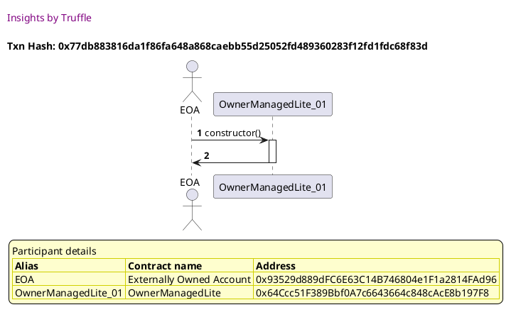
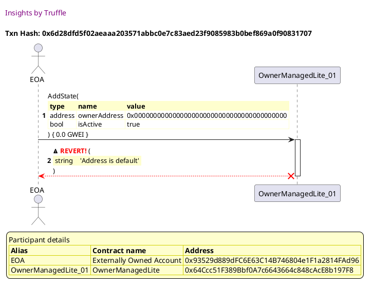
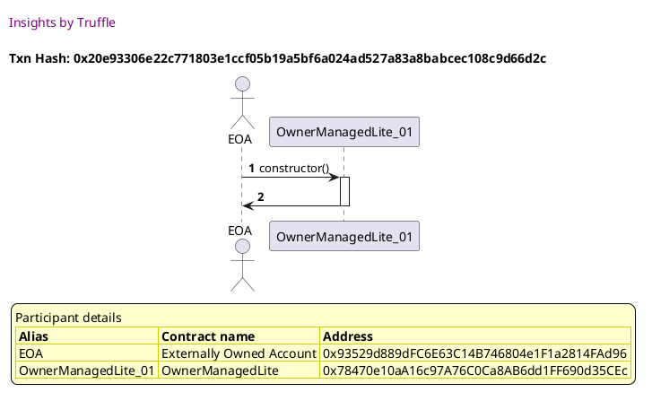
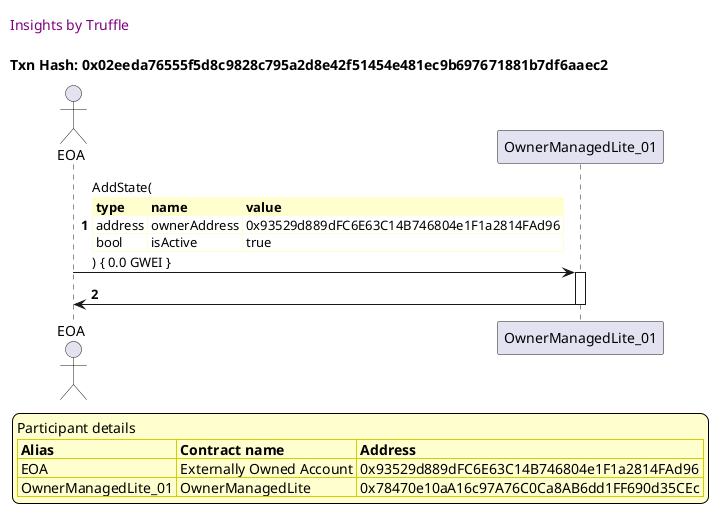
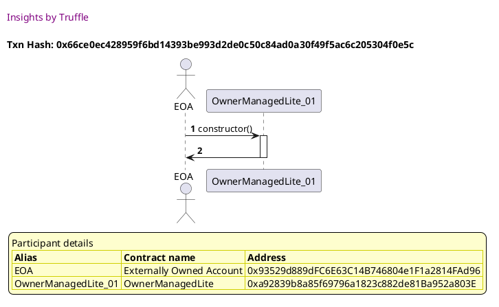
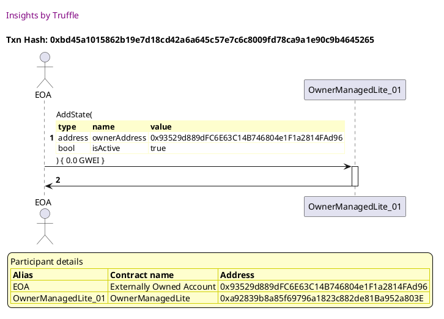

Test date: 2021 Mar 02

## Fails when the owner is empty
[link to test...](http://github.com/thedarkjester/ConsensysAssignment/blob/4fdae3d04e4addcce97e88f438735f476fc16bb5/test/OwnerManagedLite/test_add_state.js#L19)

##### d1, tx: 0x77db883816da1f86fa648a868caebb55d25052fd489360283f12fd1fdc68f83d

[SVG :telescope:](https://www.planttext.com/api/plantuml/svg/RL9jQzim4FwkNt6qNpQwCYcs5JbaeOvhqy562-lt8Kko8-h8GPPPqdN_VHV7X9L5eBTxJi_TFIT2xleWVHYsBI5o29qRjfNnf7-nRYUzt49h6kFqMggNndU3qtdNTXwkow8iyeAGPHyEhLaH6CV6I6qy_9wk00-Tjw-T2xBDMjkuhN416UjmTYWHF57k1hzhpJlWXtqrmEApxKbgRLq3Z4wcF-E-_3mbGQRuNrrlcqteeJh0in_g6db9iA4ryBnty23xpGBeVZxNbH2HO5nBLWjUInuBARXGqbHLakXPGfDPhMEHHfpEH5GplB5QAovg4Mc2agc0gHUF6SWUhd2_8YXRiChk99Rw-CiP_rqwsHZzpGRpaxBHyOBzYf3nFTokBkDmSxC0rRa--E4OzSD7SjdlI71Ykbq08QS6agT_qj8cIDlsP3cryTFrFRsdbAxUlW3s2JF4GuuDy5WVEBarHqEcjJSzOkTtgxUnT5ptmNWds_OmbgmXKme_Iq28xjCecQLQY5INEIzubBDuFO-veB5X9PCpmU8oqob_Jtn9kl-jOm0Uvqebh8n4kgvgciqLvt64KubOg4mLecBfl1GO09MOz21tkEAt_mi0)

##### d2, tx: 0x6d28dfd5f02aeaaa203571abbc0e7c83aed23f9085983b0bef869a0f90831707

[SVG :telescope:](https://www.planttext.com/api/plantuml/svg/ZLHjJzim4FxkNt43QMnbR4wJfWdgAa991j8c4A3jmvYcY-sKYDIf70TQwFxxBY5Ke1LfLkApp-TxUPvB63keB1fRpmh6iBQbhcUfCgowoVKS3SwWK5EbvI6AcwafQoqdPL4Qs4xY99x4Z8qgkopKc44xhXLAPU2Xsm8SboQ_BxN58YhogPufRSbZPjS62Hq-kfpNPbwe5mSN-Rq2nrlhpb3AN4_1uPtgJoj7dxeaM1V_H5VvzDfMa2xXqjHPHdwPpMsXu7AXuHYhwttW2r_s0vd9GSRxg12npzt1qC4q5LmDHU2Yadqt2tam20CtvQdA0Zz4tcXSPyY7Z20JbbAFJoF02hP8RZ62pUOYdoELUdgdbVc66gTAVisj-isTrd23VeknzZxiZJUVm-xkFaHINbYqwjsLlcAZZeKFdHolFeDTpXMGr3XhvIqMDIqQynKGV4PL5QoWR094worVyFySJwxIiYpeObv5mkQt506iUGhq7Xw0V-JmvKTyGXHjhcQnztFRAFchAVUnxhrz6BszGwE9uZ6Cn6EZaSsurpkFlyVdbszwlT6dLZ-6Ln20ofgcHLP0pyvJXNa5KcLO5tQdIv59XKtcXELhT3nsFZjxngTK5lEYUXRtY1yHAWtorE14BIqcrBc6dAyvMEEylaTvDZr3yy8gex4ebcslI8Y4eA_Cjfo4xg0VoY08PJBnOz-TEDxXqFC3xYadSR0VE5uIoT1_wNXJp_shRGFutaI8WPEuGNYOPZmQ2j_tN7f5u0KY4d6GEk4m2IW08T7XmGvefl_5Nm00)

## Fails when the state has already been created
[link to test...](http://github.com/thedarkjester/ConsensysAssignment/blob/4fdae3d04e4addcce97e88f438735f476fc16bb5/test/OwnerManagedLite/test_add_state.js#L26)

##### d1, tx: 0x1cb3a351227ef26c341973850df7fc05fc57cb6f1db9d4893649b3f6f72b5e36

[SVG :telescope:](https://www.planttext.com/api/plantuml/svg/RLBBRjim4BppAnR9fKKQb9H4FGpNYAn8I84M2T3S2ueFcGXD6HI5scdwxwLbmMXGwq1ICylPtLaYT3TuvlouDGYnqVTstBRIeU55snrpR0j6TjAADUCldUj7AwhUz0wkcxgfgngXvU0FHguGJDz6CY4T_9v_0HvwfrzxwvafZUxiLbeV59K_1pI1F4dkHhSpyXtnGxzA8CaPUs92QDi1mJFqPzgNd-SYq9p_gnrqj_43j0TuTgDIGHTvxOs4vxs51pPi5e3tXBSnYoc9eaogAELnGeeipYaMAbCSKyLfnjjK4T4M8icBE4sADbQfogAMoZX5mJBkG-drOmbiWAkmNw5WczTSxrXezV6NbUuxiwoJuflsyYScK-05_0gXwJxShYxpS7Ep0DxRmRlncFN3HtGvxYXmKhfT04Ad0QAdVyeIqZDj1hISn_Zf-XxVOunNRryWp2bK60vL680B_O5bMta4IY6S709tlhTwcreFwzvBPvanXwbb0INduR7uGE5z4TEe47bUYAPAwpIkIBBEaZJ7YIGDOL5EagOKHVfU-99r_wDJWgPCypZAMPlLZ8gcON7DCqpM3MdNAY8rfQgaj8f2Wk34x0Uw2sjuzdy1)

##### d2, tx: 0x6445f75dd1cfb79ce3b4f91283ede853d367fdacafd28e7559f92647c822186c

[SVG :telescope:](https://www.planttext.com/api/plantuml/svg/bLFBRjim4BppAnRkfKMQLjHRXcj4TgGcG8i4I81U0XIKI2b4QCgWgDHEt7_lMbO45_MbEd39vJuuCoj2BbhBZErMYX3MsKPtgq8OqZv9lMQ6hK29McY-OELJRPfEysMZ6WFlyYpFbXaXizPkbPWJwBz7mRWmy3eS0QuQ8ryQRPbAbQprIcYB5Iix1kHuUIYvxinQYRykxkIB0EgFlbl6kTGrK6Tm_UxjxFFm23BqlzQjh1zj2yKMxarNLLYNM6cLWFkDXYlMFax1sOI-7rHHm3ajgo9AIk4LVfLGD_O45t7WSI-CAivALd4t5b4G95NYXdvKngvBux0aI5bfyUdPJGgiXGdQ2K7Qh2pbcY7KcrzQcEzCirhmRzAAdmxj0q_u9uJq-N0-FtqFPsTJI3c_iyoAzm_wWSm65JuEThxx0dQx5e1MirLldvdgSBCFtm7IPqJRmWwQVODqF3gRn0lSXCTnmlDbc8NUalgBo0zZnnSqfyoDgP-dF0dVIXLDep1HjcbfvJDs06lU6ds0Lt0-EV3rHtQD4fr6iuTvm7i-1K8EOqPkZyZZmZAfsYEObywbupXxc3XDo2DkbZWc1bKO0O-WnhpvhXS8ruqLHZEbjhqm7DAon96s_qd0SU5J0l_hxHlaQHXxRioAA6C1ptFcPMNaq4LEYqNbqYm8gZG8bYusG2O6FiW5hlXp_W40)

##### d3, tx: 0x507143382de380db1a44590b626af3633c7b5b4ea7c23b9b4a34279df8bd4958

[SVG :telescope:](https://www.planttext.com/api/plantuml/svg/bLHjJzim4FxkNt43QMnb3ESzGLr5MfA1j0a4QFimfic9dHAHEfNjG0lTVzyb3HNJoeT5aSy-d-_Ep_CaX1nhmvHfPXKXh36rR6QPK4JVbNBE59j19QP2yZ7BxwQgRYIVr5MjO3TDqcII43BKPbc94O7kkHMC2mLF_HBWj5RbOoqDg-AgdCgPa0Op5cOJaEBcEkMyKVDA_BLnLJuAiDoDxu9nNiefMBHt_UxiyB1lWlJrpwGkfxT6GxQ4QzKK1UObfZILWEk5X5EcRu-0BZmQMAxZX3ONJaXvPZ7NzIAQ-RRF2iTtd3p8lCmLBCXj9uiobpck7KIy23FkHbv84BBSOEl9UGnCmmxQ7OAmcJ8lvmolUluWXVhA99iA_gKquXUrki0j_Xr2klDmCDg-3_lxHn1pVcMO4Uzkv0qPzYnywErezGdCSYu0hMIppjwpgi596xu2X4y9hM45TLiWtYpf8d8yE-9X6F5quYU-Cx7SSU3w8NM5bLhC3YqtZNdaFwVAwhh2WwMESrFUOmKmwhdGUtW2-f72v-_96LAq_JQBWn-xIl2VxNNNzpuuWk7R1wOaKZo2ORuM6iQC1eFBv5joUVrcC1WUTluHl880QADQYQm0tptTOWMiKgYB9OX5gOtUwviaNB2szpRY5KBMsYSNBnZbmh2oqYygdz0JIccBFKeSoSN91BMhCFc6XGtIctFOQQiQ71T6ACcgQjcfXKESv_YTcVzavMNYRQhxrziLI6C_TEoGPK72F9wcp4doW5hZrCh6XMqbdbV4dZUniG0YqUD1Zd74FyOV)

## Succeeds when all parameters are correct and is retrievable
[link to test...](http://github.com/thedarkjester/ConsensysAssignment/blob/4fdae3d04e4addcce97e88f438735f476fc16bb5/test/OwnerManagedLite/test_add_state.js#L35)

##### d1, tx: 0x20e93306e22c771803e1ccf05b19a5bf6a024ad527a83a8babcec108c9d66d2c

[SVG :telescope:](https://www.planttext.com/api/plantuml/svg/RL9HRvim47xthx3QbqrTDHk8WIYBIYYeapQrqle-7VQ5M7LCP8oMTDr_dqDGj6hXmJRVT_xkxZiJSjTxS7xO6a9Wy9qTjWqwqhzekmC7MsgmHQjM85zQrmrMbPtf7BskgxegAq8MlJyON18wVXi4XOx-ddufVUYSVksi1rCOtTejMXyKr_uSK0Vo9BaRtCxWE-A7VaNAapFs14ffsrBE9kZFk2y-JqMGAVzNs-jsutlQ7EYp6zRhe4kyzWRfyzxI1-WtSyhs4SCyZfd0A99foZCM8vTopMODps7Mh0MmA04rYrB8OiWQQ2HApZAPAo5K94cmJFfGUlLOKEZfLTYlIB3DQwbt45fz_6NHVGSBBQflskDFniV02_WL8UDzUhkypDERcpcLdUsz6uvPFtmab-EE0YUbspabv3H0ylHFMGezQDEJnJJ6JzVtx9unjdpxGiESGeNXK8O1kD0VjR358r0evR0FtFdUycriFQnxZyw2COUnPKKBASDZyO5Y-poUHRdAibpLfQX4NF9abIOYOmdocaEKyQGkL2xU2r-oxdzqJ91cISgGCoYua7bQfA9a9MJ5IYZ5wrhaJCMpif8XGN1YyeFSXJKy-xy0)

##### d2, tx: 0x02eeda76555f5d8c9828c795a2d8e42f51454e481ec9b697671881b7df6aaec2

[SVG :telescope:](https://www.planttext.com/api/plantuml/svg/bLDTRzem57tthxXYBvkwRdQQ3mSnr90cQwLDhTHAUwaqcVW2Les37AU3blttcP0Yfl6oFFZQr_V3vvmRGYuR9wnhbveGqRhQjCifMj8yARCILYn1unoDd8ZgQMxhriYyrhM5TsLH5db1oAXn6urZ0jstG27Hmcj_1BYkhNgfZHCwqsfkbcYShpXpXu3IN-vBhbgxqlZNnRrwGM3XmNSdf5Hc3epshj-T7Ntk7q7w_ZUcKVE5Qs2wWGVRpcQ-Bd7AQOI7jO5hqIo6GDSqG9GYYQCecaMILoaFU9MaaGWanp2OHIoCGWmvmogTncaI9unpDataB1O2gu1uoYhddrxSPY0Q67Wx89usfogr4XxgxI-3zhimOexoctBuax8ky8H_G4YN3-VZq_TmTZQ4JCfx9no-VpIFPDIhyB6tu-qNS9iLWhT6B3lxB7JhDxlmBNZwB3ODRA7UDSWEHxfEBw8WbPodiipZ8hx8MJX9mfZJ45d9HC1PM6OoZTzAJUjQ-qJLP9LJpxu3EFlMw0Ey0lr4uUkFuiPBT1hD3kOUx_aG2DcF6Rax8a-Y4qetHp2lw1MbT0VJJvFdqMzoFoRMgt00V01ro1jlEu7ykdPeZT1wqmaZ8QigFzBkFmauBdnAu7-zNOE4Xmb5HaN6uYfDiYJEQIvuDecbP6KPfrHUH7bH-GQUYPuFSkbN_tF-0G00)

## Event is emitted
[link to test...](http://github.com/thedarkjester/ConsensysAssignment/blob/4fdae3d04e4addcce97e88f438735f476fc16bb5/test/OwnerManagedLite/test_add_state.js#L57)

##### d1, tx: 0x66ce0ec428959f6bd14393be993d2de0c50c84ad0a30f49f5ac6c205304f0e5c

[SVG :telescope:](https://www.planttext.com/api/plantuml/svg/RL9TRzim37pNho3IbmrTCVcpKf05JL8R7R2X1TRtWP5enwWY1xAC9LtttwSuHh1YyOCatr57yYZ6xZgFplTRmnZslhNzTasETI-DtQ73BHYgoUebgfVQjRtLgzQq3gxAeYnM1MEppXyCpHaCtuPGauFVuo_0G-kQrzPwD0lJr7PBrWV5ofy3oa2U97UzsnbwH_neNWcYz8mzeTQDhI7Y8_Hds6UVnoBOcF-hxPfwupjO7-3PzLKLT9bll25utbjum6up1RxFSqMSL1eBcSagN-ieJMIo9YaJ7MlYAkDAfAWv9hnAPPMXobNCiuId5QTCiM2Pyg7qud41sC4ax1CMRFEDQdOOMdtyPSbzHuirwM-Dfvyy6W8lu1F6XljmCx_Cm_Nr55HhE-_wOzOF7zdbkAF0IUbc2eoT1iYU_YbBayV6T6msZl7JrJs_vvpFtxv0c5EeC1nMOG0kz0SMjtG45bexwW9tlZT_6reFwzwJisZCOMXPmqAfy5XyeFXU9baijH1Ibwkyo9DLb2vlqrpmbA8ombX4QRdGCdylVCcw_z4X0SfO978jK6HLBczbZf684oL46AA8bYYp60LFYf0WE37wmUx26fxzNm00)

##### d2, tx: 0xbd45a1015862b19e7d18cd42a6a645c57e7c6c8009fd78ca9a1e90c9b4645265

[SVG :telescope:](https://www.planttext.com/api/plantuml/svg/bLDHJzim47xthpYnbqsCpKwJrAwwYb3IWRG9993sWZHTRBTOk4xbEAo5xh_F3Q5YMb-M1vzzvxlpztqNGawRW3wqIqi8jg5sxRBIdZGFngtGunAiNcYdpb0-B7pTEZMjRUtXtQoSbTEIa74JDbPF27JVlKQbFJptHu2BsfkdsWMqXJKBjzGkn8hpiBymYy6NaglMhwp-At1ZdZImTE-xHgMCMm2ZlUjtPyUV-qUGll-bQypYFZHGRU3Mj_Dvh4k22LR3xTh11JRt8w3hIgKPCieodYSL4tge69SgJJ37FCraDjH3cKjEgPYh8PSea6b1fQZI64xoZ4JAP8XFBwyAm0QEeZqYaRPWf5bXX7hrosd_7HqkjFfcWlv9MNVnWF-8a2uVJYQ7ut1yF892gPk0GR-_StTatAlmiRUJxHS8cvM6Q1qkE_k8jesRtVKjHFgyRXhOGhrhKEoFT2q6MI8KvqBDfdcP3wOiFHkcEQUfPZE62MVfh50YVorLrRMDYQOfP32FiGC4_zhe0pm3_KJXwu_oCafq6CqEvWlUan4GyZ9cvFeDUKe7DBPv0_ESdbDATp3ZD4KUusOQnyH75VQ0zw3sUPDj9r1Srq5xXzPkEc4K55B6aGx_IS3RmeS4_jVRDK2Hy86eEF9idekXo97nP20vJvJcx0n5bY2dWp8sY4pqV93JkCQVymy0)

