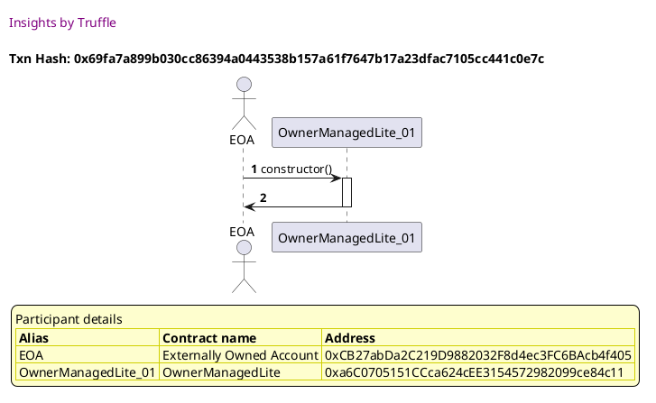
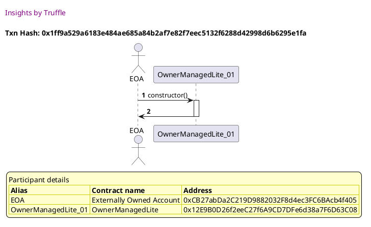
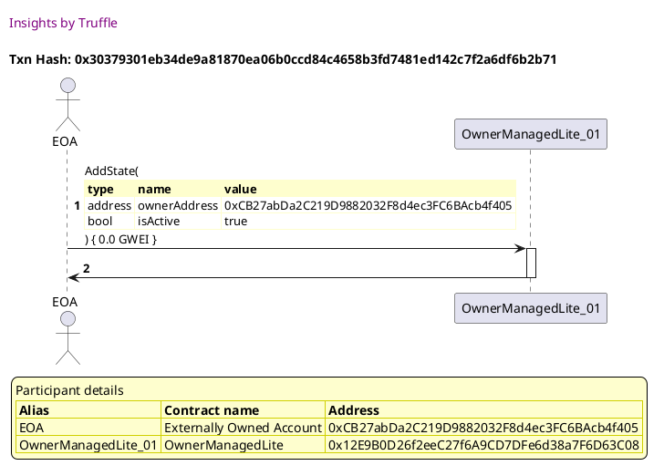

Test date: 2021 Mar 11

## Fails when the owner is empty
[link to test...](http://github.com/thedarkjester/ConsensysAssignment/blob/7c5b2f21f354ab6c2adcbc9e6ca114bc570081db/test/OwnerManagedLite/test_add_state.js#L19)

##### d1, tx: 0x69fa7a899b030cc86394a0443538b157a61f7647b17a23dfac7105cc441c0e7c

[SVG :telescope:](https://www.planttext.com/api/plantuml/svg/RL9RQzim57xNhpYaBnjTcMJBjv259evD1nijhE_ZM98TKKSEiioIhlllKnmJLXOzwF9zvtpd9aBkUuVM3RkM41nSPuPTfIpfNxJPeyKTjAfHHgvHl3Is6upCkxQpS5CMPP4NX2nwTspLai2ujWgbil1xUW8yT5Q_TiPXksfrOtRAEAzOkuj1wScpv7wm-rQz8txeLmMCNx0db5AR1XYTe3_ZkVWy9K6c-5zDhvkjww4wmhCTwjhh4gTTg-3vOE01--qSw27EQammpRAAXbI8D0upZfJpC0hJYaK9ngnEOfvKBC4Wb3MAXD582CwPe2eHnBTCE9zwyRW2x67cpndnRNDQw3twKXz_6MM_ey56oM_QgP-KZOPNy1aXep_SBQ_pS7ix1z6PtjdX5FN3HtBTxYHmLhgR0o7d0PAdVzAIog5kUxAOnlZfPaCtbDBbsnVmS_8P-alk1s1zVM1mfqx0IaghUizT_9PlO-b-FpXb3RRjSInPmae8_rcSf-WXNmS9LXiCye1bconD0ne6PIgv4c6Pn-kLg7ZDQVHU-5hh_aV701ZdDA4HYrYU2um3BeeYP16FaY3pmR9Cg9GBvls9xyJK3tBlT__j_m80)

##### d2, tx: 0x2c98648a59d1af97c77a40b8570a270789cbbb433da7910a743e9c13c8050a92

[SVG :telescope:](https://www.planttext.com/api/plantuml/svg/ZLHjJzim4FxkNt43QMnbRCvRaw2kegJfGDe40hHz6DDqiTqIaJgLuq0BtN_VDGqLQ4MQ5UNiyxq-zoIC7LKMZQsd1MDOsrBNqqmPLjtcUeO6fr2eYTBo6CNjn9IrbabPb0PsH-aeJLB6UfLT5AhFe5at2gKoyDWU0KvAap-Ksc8nAFA9dYfjAUBORWn6TBaEEQlDh50lBYxp1mMElz6TevIvde33MzMVHlO-jKMmDl-fhlB9ZQqWMy2LgSTZYijiRWi5LtCD9rZT70AVkoAEkdw4GImT7CUX24FqUHO58KStv64KYopBVC-J6COEnz3tL2mSJqGyu1YxZ20JbafFpmQ05UoGt644cyr5FaDgzUnUA_CDDKwK_9fRzPixZU4M_GvZZJySzBVVm_x-8GoalBHerRjhVSrwxHG-jBA__0nsCLD0KkEqaNTOrBHPcI-1u3Eggc09vIh1O7FaS_wVwobKLfO5EURLGDZyZZA0DK-9tiCZy8ySlln8Jsb4sxkP7_pSDKh-MhMxxllW47flxz5e6d4VUc9DDBBfTpeNwVVqukfDfzFxrEZxy0e2K5cpeiWIwDbxwZ2lGAenreNTQqjaKk6gSiBojN6icS_EdyrJAejvKJtBE-H3GcM5F16SHakRX9XhAFXc1XkSDtvKvuepz9vRPJGMnQBXYeI14FILsMOcoR4ROZP4Dt6TU1X7aSizTnH9Nmblb7IF1oBpnpuFNWRUnhb_jKq2x2Oyv84JE4aYiElw8aqz9_23q8qfMHmB5Vd28Nz6IBHui2Dwq__YBm00)

## Fails when the state has already been created
[link to test...](http://github.com/thedarkjester/ConsensysAssignment/blob/7c5b2f21f354ab6c2adcbc9e6ca114bc570081db/test/OwnerManagedLite/test_add_state.js#L26)

##### d1, tx: 0xf88f6dc29432e50ed73650b05e4e67c30158699def36e9cf78a371a34a3865d7

[SVG :telescope:](https://www.planttext.com/api/plantuml/svg/RLBBRjim4BppAmZdqY8DIhqfmpLYInPIe4K2DFTYHQva8ZHbK1Hgf-c_bvO5eq6j0qdDB6TtPqd8VU_0kc6d2O71TMROrMX9_wBC7YpigCOMZLo3U6bjDnXPTBgpzARQL9jYGyYYTqUDIqB7RuiWqTBVqo-b3vrLhvrne5TQjMQ7ndd5nbq2Aa-U9VU3tMjyH_nGhqY3-88zWPJAj3HW4_Hdt1UVfoB8bF-hwLMxTJsjZ_JP3atZTObJJYDzFXZw0FrsJjcXuRn9fGZpE0enOIYpA4rOpHACCSr4n8A4ftakiObIp4MJSOYo0A8O8fucCYFUCk5ywPl75OMUplm-8zusfuJQWs_ryPT1-nqCj2Y_AOS_MJ06Ni5dX8ptwTtoEazlR-TKTAPtTZXb_V2HN8yx2PoLxkQKaFC0oTC_PKbqe7HF5jCOFzsKh6ICBT--K3ydNw4_57u0rlT73Upm1AoajDXxxd9l-JQsxjU3Gsj0w-FOigGh8VnZSPvYXs8TPb2N41PXa9Svvo6BmehB64LK5Ubw9UguYLdoNlYQTV-ZOm9Svra6iepIcWUfY3Xh1F0QygoK8arucApp1Yhk4tWd9Z_8lL_zi_yB)

##### d2, tx: 0x161f04a3fce313b1f235e13e044479d798fd417dbb60566dcaaefa48b1660def

[SVG :telescope:](https://www.planttext.com/api/plantuml/svg/bLF9Rjim4BtpAmRffKMQbbginN2Do5iJe4K2940l0OeHIJb4QCgWgDHEt7_lM56C5FMbEd38uInyxuqOEsyyEj-k36FO-jgsgr8vrZnekqQ7Ap1ggQoSe7XOkhgrSbgRsi6xnNmndyuP6pL-QzIOGVVTAvJAmND_1BYedNwghKTJ6BsqAsKzLQpy8M11boybrwrR6_NNnOr-KX341zyrIgdj4WBUktvtTlIvVmJh-r_QHY_lVGFb5cvTMrLKbtdjZOBRZOKBREw7m3T14bGyngWIAWgYCgZ2QA22IF4uZjDSfdbMoJX8PLacV90aKY2g2kEi39A4IrKneanuUlhygW1iu8Ji2IFQl1PwZGJrwfTLxZjQN2hvJNlramTTu17_2MDTFfoDZz_3wUaG2YblF7hr_ixUiL6lmiVUZdTVm6_N2iXQN7Ns4KrBcttu3eW-fve6Tb3l6nI78zzC9s6AvGp3QHZaippBGXw5Yqp6IaIBQJ8fH1bNCH-ybYhhsb2YRWhXzIDr0EzU6ts0P-2VE7pzCRyaYOwZsSDymNis1CPUnenTlo5FAe_QD6zWplYCSxw7ITD4FD9cIcFYI8K3u0EeGzvurmb4wyOhPz6ORIUCX4886cd_dmIyBNnCu7-zNGCroTCKvInAoYn8H9JnIc1MOfxEf4W6MJYOv1KkCcf0JFHyi7DQwUVy0m00)

##### d3, tx: 0x1861290b7720cb6cc6f1c0ab733cc8bab1004f329634ec172868ba142bbf9a5c

[SVG :telescope:](https://www.planttext.com/api/plantuml/svg/bLHjJzim4FxkNt43QMnb32TfyuAwYhuEf4qWGDk7CKqNsoaHgLFPBhJG_VTTqb0n3JuiYdBE-Nmlp_CaZ1rRXyOjPWLZk72bNinIPPYzpVKS3SwWK5EbvG35xTIK2os7PL4Qs9sC9-FXcB6kTQj2zHZKrur2gGmyDgy09wN97qhjiEWN-LJFb7QKCNFRW0bjRbBE5sPUgBysBlC71Lvxwpj7ANCz1Oythj-rxHusJR2c_gcs-VJ6MKXNS6KMMKPvcSjTeU1ggU44xSqHyAKNXvwVy3IAV2xIK8WmymJ7D0e28U8KKu_pTXRuIHYqbV0YFmx9wxNzDCqIx0X6a0b7hO_F-e0MTiZkC8BDvIAV8urwTg-L-OeQfqf-oPtwnRqwy0N_3cFrUJZelRmF-_j7q9Voqg5JxwxrDUisB7neR6_z2Tnghe2inbbjxx1OqA8ANmF1PvIri8QoAj3VllBbSE17c8xG7_fUCahYsEU1Fuab3HvCXk6WBz9srkQTfrHfMHPqCBTzuV8xgW3EF1Lw3u_0FtBu_7ryIXIzFCtouCUkKV9dDUvcxeCZwBwzHwE9uXvqnKPe5DDhjIx6tyONLszQhUvXxU_1AmY0TQQIo1hethCLLe258LsiG2rpw-nUqoIJ2glUguXN2Dbedvq_OrGgXtbXdrKUyH7dlCAU94xaqc98sZMKVCl25kdjEUgqKWqzbquPZKMngjKYeIy4VMVkFrbvdlWbrVthhGkeGH95A4T1cCPUA8AOPm99v4aqaYBin7vda6GuYQa08T7WmOxfIN-CFm00)

## Succeeds when all parameters are correct and is retrievable
[link to test...](http://github.com/thedarkjester/ConsensysAssignment/blob/7c5b2f21f354ab6c2adcbc9e6ca114bc570081db/test/OwnerManagedLite/test_add_state.js#L35)

##### d1, tx: 0xd616295047edc819a73d15f7c7ff85502553939ae09c73963ce577dc8e326df1

[SVG :telescope:](https://www.planttext.com/api/plantuml/svg/RLBBRjim4BppAmZdqY8DIkf5oN2DoBA456YH0CszeCcLJ4Ic38f2xJJzzwvbmMXGwq1ICylPtLaISjzxwVomQmcHW-_iiDk08_sBiNlfv8wsq83LAwbU6jSDLXTTspbwKvLLMPI4B7f_R659wFXjGMfmzFVqI-b3vynhPxriyzOqTWVMesBjBm4LacV9_U3sBRmZVfXNe3owO4zIQsCRoja4_HdtnUUf23Bb_sfxqsnzJpT7-ko6kaPTuerlWJuVB7sG_NPEsK4dF0coc4K2j4fv9aMeULmB9UewZMCMn76OXPa4bYaHPace81O2Go4C4brpWfOfZwMNZpcLFPtXFYDecpVAx2Ms-lZBWlikhMn0VpCUVZ8-1bx1PuICz-dTyZfFRs_dL7MszsuuPVtmaLoFEmcSbUxcb93p0CdJFsLfyDAqFLbCO_nqisPhnjZoxGl5EM65U2Xm00xxerRku0JaMZleaRlSMxwDhUDwyE2iRDlZsBAckLBuM3nIx52i0Y4tQnaK0S_MMPe6B0ogL4UWmgf8LhdQH7N4ulV2rwpx7nqJyAfc5Iyh9ieyvb5U0y-gDAasCLy9cHPCQ0OiBp41EZ7vGUvnnMV_5m00)

##### d2, tx: 0xf25c22e51d49fd13752b5edb947b23be67c44632f978a6921c161594cc977b6d

[SVG :telescope:](https://www.planttext.com/api/plantuml/svg/bLDTJzim57tthxXYBviOcvtcewcwYZHD1j8ca43Q2zBas4wnS9tASLWBtN_VRGWLq_goFFZQr_V3vvmRGivRpvtlLeOGtld6TgjAET8-QBlcZg_0gAMoSix5mz8rdPLvOne7xygYBFA2a6dhjqRD2FJVlU9IENWUZW0NZTDFZVNSP4OlxKfPZnLhVmWeyVAbvBfpQwF-khZHJmfOUF1TSocrNGAZW-jtRwUVXqUGeV-bRVNothTGRU7MTNMDTOdNtYYutLYuuEtz1EYc3Y8H12fYCanhoKP955IHabKQ9bKmgbISY32CHq6T9cCUfm4JB6PH6WgH9aaLIuAK2OzFBwuou2sSe3qXI9lNGgyvGhtwPPNxpYrVAlbDU_MJiZxmYF-4a3uVpcR7x-7qT0APb3UUU_N-pjwHwQ32ny7ETb_0RzSAq5g-wkqZDnrkzk4xGFgSQblOGRDla1sET9FFWuHN2nxa0KiNwNWSq55GZcMenAZCutacgh0EQVHQgceQWucwpOJNZzW1l7jjz06UWNwYyFL7SOaI7KUpX_c2zsm2XBoC6Rb-GvvKdclJle6ve0jAwHucJXFoY9iSnyIX2WV01r27lDck5mZNZLVEScEslJ0ICY5mfFr_4l2sy361__Ns3LXPqv8L9KsAB69XLYkMbkEuh28sJ_WufucaYcO5Da0c1Zx8EQxuS_u1)

## Event is emitted
[link to test...](http://github.com/thedarkjester/ConsensysAssignment/blob/7c5b2f21f354ab6c2adcbc9e6ca114bc570081db/test/OwnerManagedLite/test_add_state.js#L57)

##### d1, tx: 0x1ff9a529a6183e484ae685a84b2af7e82f7eec5132f6288d42998d6b6295e1fa

[SVG :telescope:](https://www.planttext.com/api/plantuml/svg/RL9DRzim3BthLmZfPKDNJ9O_8WTPKCUEqG4RMc2z3xH5EqOTEP1bBEcw_px6CO8LYmwKz4WzaezYxBvtODsmQnc3mNLcs1LeMV_Ic3rOsF4MQpHw3ULBRRl1wBHhEyjlyas-IJUCBNjtR775-BYs21ej_prTEN_eRFFQ6GTjqZQrsQ5nn5YvIq1EpZFbVh3x5jyvVZIloBtWWZs1resfkIScwC-uBpzFHR0f_rVJD_NMzRmuycSxL1NnCjUu5ldpmV07wBSBBWvULSKGoXWYJ_aOg00mKY6ee91GpL59CbY6dY-hI2gb0nd7IaT59ECGlGeOILOwAdtpc73e-Ops6IFPN5CsUw1M7tyPjD_1G8twM-Fmf_36m2luZB7nFRzRNVVpszi5BplJEpkSidxuoAx7dGZEJ7SBpjXvWEpfdx8qEcZQdYsdCNwwoKGcX5YzVU4q9wgG3YaDm59_tC0EJq2YjSMUV9TtgxUnTR87XzP0snx7bZLFof8-YoENEAHhEOSY0vbAByvYfQJmPKvoOkddQRHEoYAe0X6-9xuctV_ecC2JctWjCXbL4Z6LyofAuZIRPpb6sbSmpwCiybEXA04fCUd1xidIj_yB)

##### d2, tx: 0x30379301eb34de9a81870ea06b0ccd84c4658b3fd7481ed142c7f2a6df6b2b71

[SVG :telescope:](https://www.planttext.com/api/plantuml/svg/bLFBRjim4BppAnRffKMQbdf4aetKY2nPJO0M2P00lGGeA77b4A4fWw9IEt7_lMjPCLpKb-h09PVxuCoi6BjidR2kMsZ6HESQqorAjAnzKcOfh5Y0nZaQEHNLqzmsdP5PeniBxufPCSjcZ5sqRgrnmg3_7b58jF0w706k6gjU6kE4JhMQcmKQHnLhjmyew79NSjdPfSQ_BkxK2u8NxdstGafbvk3nmVMxjnUVXqUmeV-rQTNyqRLGhk7UTdLDTPbJJYFShmnSYVPn37mLy20U1Tp3CWWbZaJY9J57mQEILvLCmYgCpfCog6KS9XvAB_IhkFP59EkezClOOqHPvUZfiviKH0idP4yOqUPKfPQ2eDxyCcY_2oFcAByfXp-vrmSUyPymrkV3sUJuFPoUZY6Lyiu9X-yVp0Ex65JuEDZ9vWkuzHA1h16BtZuBtT5c6xu1eizYsy86ccs3T7_agspgnwBCXP_vtYWV9OdF0xz8P8XLK6JHDAtAi0xv-Lkficaq9QeshPnwfWxWx5kZ3_0A_1E7hpzcroJHSJHRc3kyPsDWR3TcxFQ0F8bEADqUmCnvpZdVmgHf8Xvfaz6OM59X3tWFQfytsVG2qRfoQ8tGUjqB8o6jAXffzvy471O-9l2_thw1vyz6KvxxKUqZPdvSH-aeo-Eym4W6YOYBA8-2Z2VKW9WO-62NjDBF-GS0)

