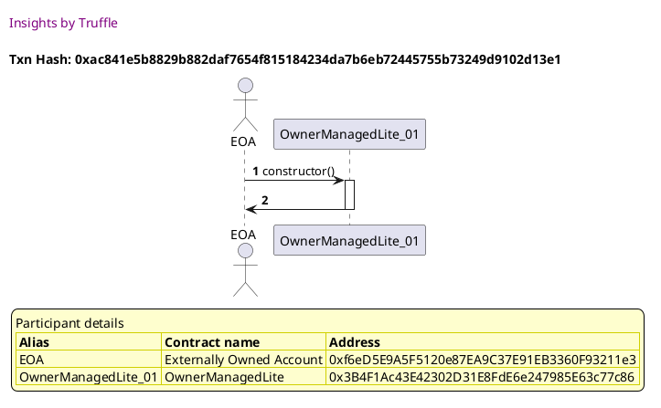
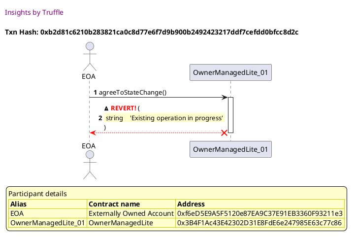
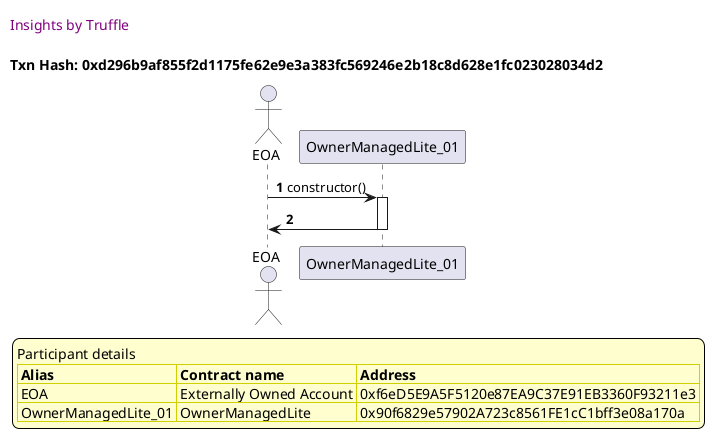
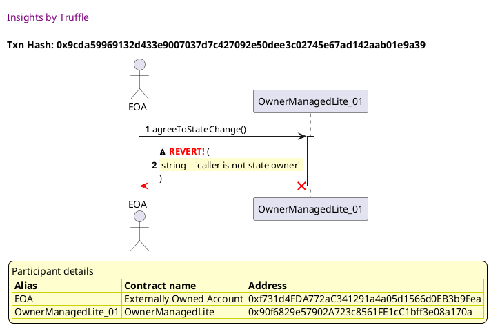
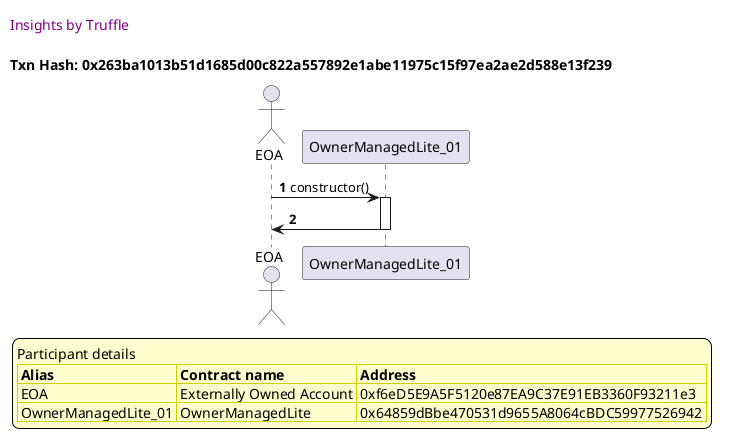
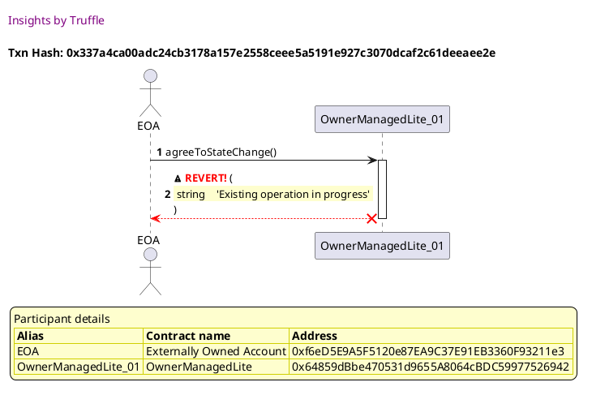
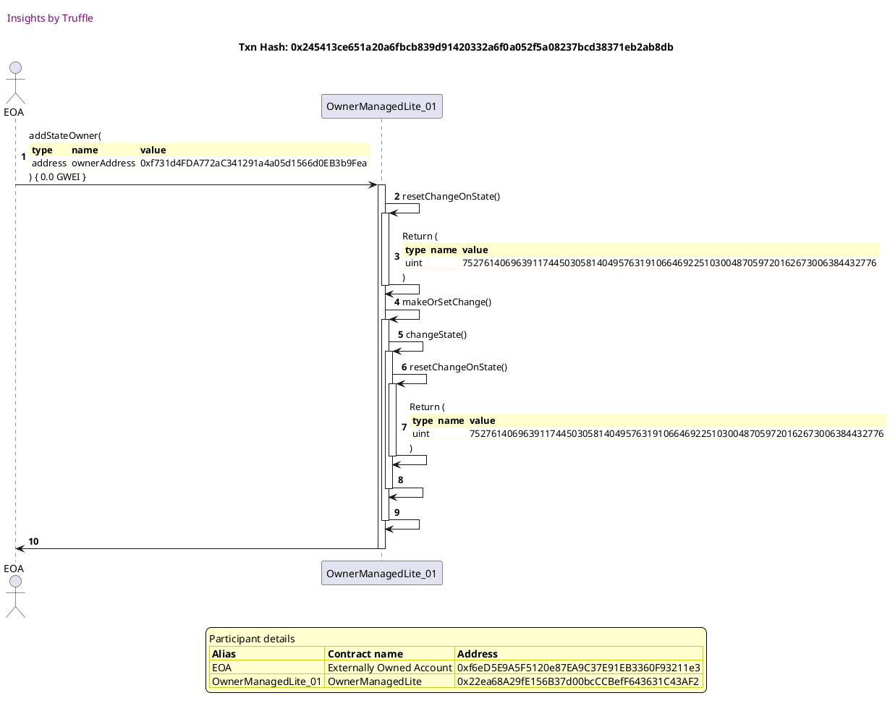
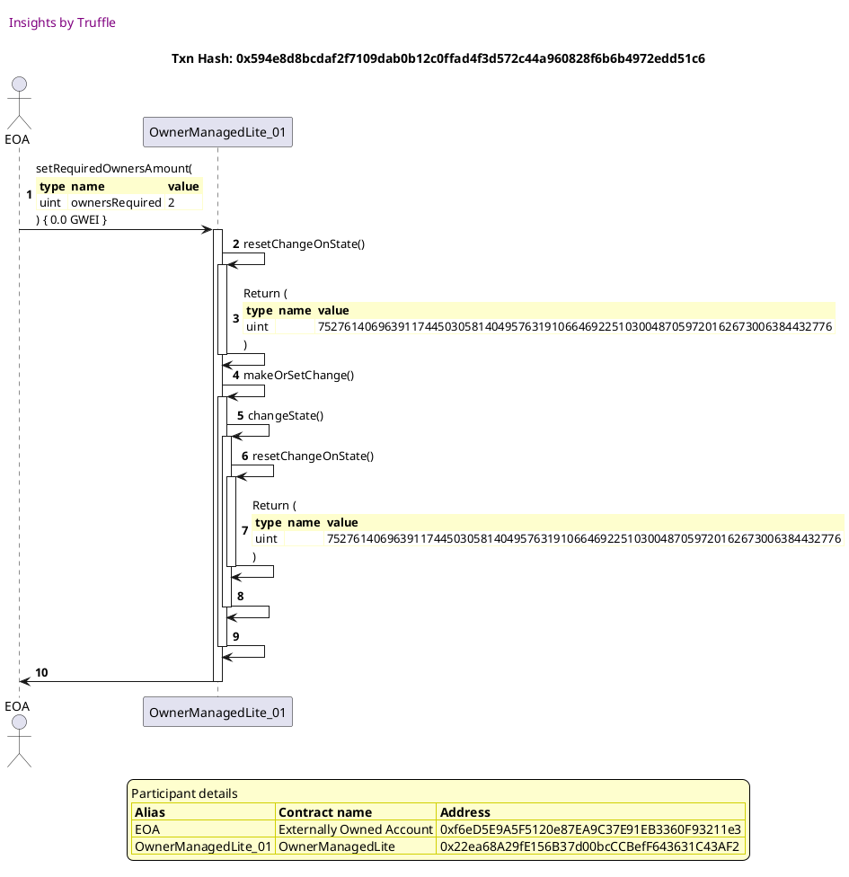
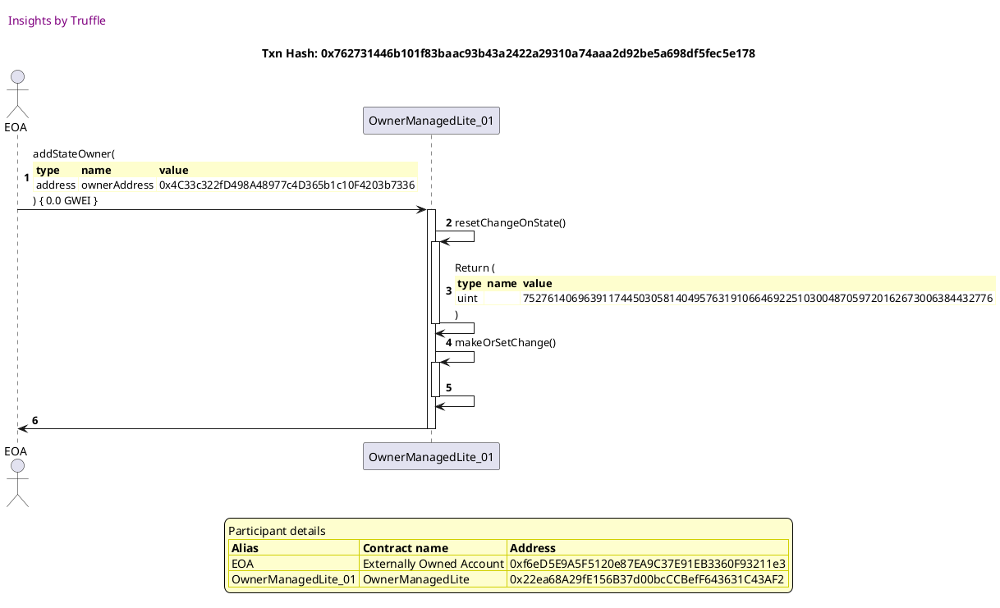
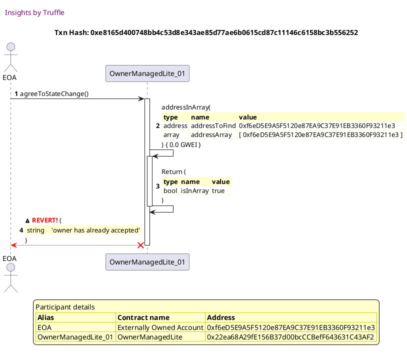

Test date: 2021 Mar 02

## Fails when the state does not exist
[link to test...](http://github.com/thedarkjester/ConsensysAssignment/blob/4fdae3d04e4addcce97e88f438735f476fc16bb5/test/OwnerManagedLite/test_agree_to_state_change.js#L25)

##### d1, tx: 0xac841e5b8829b882daf7654f815184234da7b6eb72445755b73249d9102d13e1

[SVG :telescope:](https://www.planttext.com/api/plantuml/svg/RL9TRziW57tdLw3qPLDN3Gp-YhAeJeBLIPjQQNsViBbsK0cECDQIhlll8uuLhLfukC0zbtC_3WZTzruwF-mCGdBmdHrs5JZKlsYxbqxki84Mh5h9-gLrtM3LkZETmpUbACLQ8BJe_T704k5nRK4gSFZtTCNueNFwjRDUciBerkx0-i3O-4j06S0pvNvmUmFlW1_w5J3b5z-JL4hR5bCokVwC--BpL0IQyd-rlMwtliVL4J-xeMa2B_BQ6y3F1uiVPB-TOtAGTSOfn5MMHVd9ADcaISoRZCOqun7ZIgPL0bKQSHwdSLobBEAvoYc956L0KHXPxKFfuh70iiUpiCzG69lNjTxBqEhZBmlkkxIo1VLDU_X9w1XunJz3Q7oFxvRNSNnxEyTrPtllXbFM3n_HzRWJmPdfReuHEWk8dlufIu6NslHeCSduwMP3DeIGvTiN77GA5OR3EWZWGd_OoXsS78LI3lg0NTujtyRMWpruS5OQSnnRLhYew_1PV838eKbW4ukyYCkOHWIoL1JvcgKYfsB5M4BAd4MK0djFV6rq_tl716p5IrhKd8aW6easZ8giL2A1YATv5ek4rMbQPqb842OnpGFT1nk-_Ly0)

##### d2, tx: 0xbcfb671f52aeadc3a4d21f9ffae1250b779c04ee02c94cd69219266acb344fef

[SVG :telescope:](https://www.planttext.com/api/plantuml/svg/bLDTJzim57tthxXYBviOcvsaIODOHMYTWRG9993sWZGvzasnS9tASLWBtN-V6qBLQNrP7dpjw_lXSyuD8UUj5yvt2qE8w7nZkqM5ZhIFsYw54mimE4UhBeHydBkcishQcCR1kvANVCe9EMlzsk24GFyze53eu6Ku0bmsJZytrWjJ63st2xG-LApzBg0CbwybbvrR6lphubO_8x1avxiHIcax1qO7r-_UddqU7a66_bUsrVC7tqArXZlNrNMeIxps1k5kPU5Ij0-dG5ULhAiqO_Ke4Y5FnY9H4QlpkXR8eX6jiYoND46aaSmJgT8yOdcKfa9MSPBKM9D0cVJXwVow0D72KR179D3cjTHB4Q1U_xBelWihvgY-QOy_AUi33_YF2EdpuMHo-1wEZq-XKEhM2u_lx-qzEHjK-3ZOoUOB-FKI8LWh5hrz4gOBcstu1W9z3jiMDj1i6nIx8rtLASv6F2z6vOX55CSPB_9fdF6SyOiuJccPnn5Z6B-Lgfh6X4JT5jBhfz01l7jhz05UW7wYyFK7lmeI7KQpXVcAz-GK27aTCtApHvv2BxHfzs3Ew8nIkeKPfYdm63RJC2OkgB03l0ErovjiUe72klBeh31ctGkZe90oZBJ_JmBs2nyI-5zlto2-I4fMo2JcIHJJQ1OpFYuLJp5AidmyucaiiqoEqz0WC37mGSx36dxEFm00)

##### d3, tx: 0xb2d81c6210b283821ca0c8d77e6f7d9b900b2492423217ddf7cefdd0bfcc8d2c

[SVG :telescope:](https://www.planttext.com/api/plantuml/svg/TLDjJzim4FxkNt43QOCoX9EqUK5THMXTCMaJ2Afz6TFasfVK8dKgnns5TVzzrpP2e7LHv8kVEpztVkx2s4NZfVFBUSMONFhQBkTJTAnvC7OXdPn3XILQVIdLG-dgfTN3kgeT78x5M0m5O_t6FrKuOB1zPYWrElZTRW6kQcUUQ-jbbLUcj7EqdXWB_n8m9kUESh5qYmhVEExCCqBGVS5kfDR6bX3m5lgpjVspjWZMvlzi6rFEV0FJ9vYuPL4GB_F6LmYJbOKhsSpEWQ-ceKu35OS1duPfb8Q1abobEaamBXATJJDEZcuMTiCe31AjYqHXeJMV5eh2GiL8CkMfT76TWspWWEm18zcyKMOXwQhNZnRTLsbbYVgByVYJ1zl0FVW1OzlpS3hOxuUJatEGfKESr7TUUXpEf2tnw9Zj3r-TVZzqg7zi-7R4f-VGV_yedIKD1z1NkqvIpA3JkHNVnEtaNQVJFzlY0pYwj_UitpRwOsi7QsYys_HW3VH-42lJ-CssNg2JtjGMZ8M5gwdEfla0wmt9CTD8GfbVLFJ_xhuRCtRpIZoDNfggULN3Y8yuvuFr9w1f8XtfOqXZueWSh9pZ1iYrtgI6zSivgddJ85fN7fsLLVMqROo6N2aQQKyklYfY7FL4blV6lI3ac2OYpuPH8h90N4PHpCSP3K60qLlYVGt-5zqcY2wxuo1NtKZGFF5m50KY7MiHOzXDihGduaWbYKfZIa1Aj7gm2rhfv_mB)

## Fails when the caller is not an owner
[link to test...](http://github.com/thedarkjester/ConsensysAssignment/blob/4fdae3d04e4addcce97e88f438735f476fc16bb5/test/OwnerManagedLite/test_required_owners_amount.js#L22)

##### d1, tx: 0xd296b9af855f2d1175fe62e9e3a383fc569246e2b18c8d628e1fc023028034d2

[SVG :telescope:](https://www.planttext.com/api/plantuml/svg/RLBBRjim4BppAmZdqY8DoeVreE4QKMm9AP0W0PfxGPDBcOXC6HI5scdwxwLbmMXGwq1ICylPtLaYTDi5wKE_RH2IVMXTlrs3HzshTJlfvHOtK8FJTrAzrhxjdLwsJUlnLLLMvR94QDw5GmCBX8Tl0rA3nx_7NuplMs_VMXTaKpIsTbjm8IgQS0we8dcItFL-ry07ueTz0qodP-nPQcrTZIaPeJ_3Flyw5e76_DzTP-jDwF3wW5zyRqpKHS661l3Btk5xsMrccEmr4-bQI9CdYM6QqYmna38Gm2NFkL59AjWq1RQckSfrodAWHX762Si9dsg6ecKgnDBBfmBB3a_YFa7Hjc2LtSdOwjCl1_vHEbc3Vh01VX8w15x09mWDz_7DuZAFhwzdMBMk2xu_Pltq6LsEEmgSb6vc6A7J0D7pFsLf2D8s7PgFO_nojI8hGiZY_HkESueLniCo3i37_h2JMpW2XTOUkiYTxotUXzRZkW_WdMoQmz2oneLIyR64I96zIM6LbA98geGo0dbM5cB9irBGyexpb5I2Cqg1VnI-PDt_w91049FcJ42I2SAAZ76L9ocjIggMT6qC1v9BcX4P4qGdHZ_GRLpZi_yB)

##### d2, tx: 0xf85467f8b89a28da3a3996c98c4254f3cdc35af148c896ef49e27c3ebaeb8639

[SVG :telescope:](https://www.planttext.com/api/plantuml/svg/bLDTJzim57tthxXYBviOcnCt7wwwYb3IWRG9993sWZGvpas9S9tASLWBtN_VRGWLq_goFFZQr_V3vvmRnavRhvplbeOnrVd6Tii27MiVQhjIJYt1u09jUQRqmy8rdIrdZMaSl9ldytoMCpPf_SRWb47_tQCgqS7pS0IuQ5pzr5YlJ6RgXLsYzLInylk0ELs-b5nrRcNmhukR-WaX6ErzrweiQxk0W0-ktxsTV1uUmOR-bxQj5_U-XM83jwwhAghBVEqDmktQmeLgxyV0rrKQZUAaIejKgZ0jbL12obZBL8_2Q5G9NMeHgIeOfJgLCLOZYM6Y1HOAYpGMaX5bsjFJywiCL0j7P8yOqUPhNQyKGRtwPT5zLrOjiFnMU_p9WpxmWF-8iJuVJgQ7x-7uU0nPMTvuvV7zdRrZaq65ZuETRh-0twmGo5grxEsZCXrjTk5R8FeSjYrieTaroFP7uYB6yoYNMJIFWf1ZckIPd8aabq5-9aJCvrA4GO3YjLJHD8OIwpRJldwa3k3TQwCFy0py4uUlF_9BakWmcXtC5xmdOs3iPSpOzHloIlIgDkqRcEVyd7E-WqdJH3pIPaPZuaY5FU0zg7tUTDiBHElQexFAc4qlJ0cPrZJI_Zy9U5luaC3_Uli6abTn6agC4id3B0c5JgCucEU1dWL5LGdagGeIhgW1CJ7mmKvffP_p3m00)

##### d3, tx: 0x9cda59969132d433e9007037d7c427092e50dee3c02745e67ad142aab01e9a39

[SVG :telescope:](https://www.planttext.com/api/plantuml/svg/TLDjJzim4FxkNt43QOCoX9sNXg0kefHKJDe4WcfVnZHTuqiQaJgLuux2kl--IniXqBeeyYNtd9yxFtSMuhnnQDroNWc1IrURvNnALZGFfLcWnJbKL93H5vWz5BPU6Zsggzh2_ZWTfwDKY47ZdYfA16oU6Q4c2x-xNu2hsfRFjN5O3QkoC7CoZXbpzn8mPd1BkLZQHKLlWBlocK05BxuRrBeq1IZPkVvixE2aAq9q-J-RfYnche7f4qpiCi-PLxZILGIJbO4hR6Pd85TnfZ6CutwiV4y7la-nb97q8nrbWHV9sADGQY8_aruKXDIFKAl0GvnAHJ7wiM39CiUbfzT3m0RssEu9bisLMRb0Fkhreo7x5GqMfB-KZdvAjGdSuTyJOhCVZfFTE1mTdG4MbcXItpbqD9gXAUZWKEmENnr_txUaVxHyM-BZCnYyVqHhMCC41jcsanoJz7gtwRVqTlAkrnkSRFm97DoRUp7e6lsniyaQ6cVR7go1tmyPLXKBNZPWQiSGbmLrMyq7MBVx3uKcrgZyrGB_EVPsmiJDAzqqEIohvbNwItaffKpMdu07YINaZn5FY6LoC3YdrZ7KsbB3sCi-BhVj3QyhHzPmiK-RdcWOPXbFisD8hlB8LpeONmwZoCEH7oWlLXYW3BKA-tqjqmj_6ey9tnBlwks_tas2MERzKo-cC8gbDumyFpiD-sgSgcoafddkapn55Sas0IlHwI7EUULx-HS0)

## Fails when there is no change in progress
[link to test...](http://github.com/thedarkjester/ConsensysAssignment/blob/4fdae3d04e4addcce97e88f438735f476fc16bb5/test/OwnerManagedLite/test_agree_to_state_change.js#L33)

##### d1, tx: 0x263ba1013b51d1685d00c822a557892e1abe11975c15f97ea2ae2d588e13f239

[SVG :telescope:](https://www.planttext.com/api/plantuml/svg/RL9HRziW47xdLvpIbqrTDR23RQ8igfCuwgHDhRI-JzYS7LI28uorfEl--uXZHQiMFm3-lkExk-yWvBxpqlb-PmYHlMzjlolHaUv5sxrqSWS66xHgAQkNnhMzLQlMj0vkDiMcM1M4p3j_DBWWC7nRb0eT_1v_0HvQfrzRwwN9ZMxi3gqFYhM_16m2UPRSzsvly1tnGxyYiEa5Uv9AQTi0eoFqPzZddySYo9Z_g-rqi_KTb4TuTdrT1rtYjJS8pmSB3xBRpe0UeYGk9QCiBZbJBCcuehJAeaXodcOYGYPBP4oal6Ay5YdAI6AaU9OXY-ie5YHOLlbGUl6OW-nW4lO92RPvNUcz3Aq-_hBelaih6rJVjCUVb0s1L_098SDzk5jSv-7sTWPLQpll-bFM3n_9zRYJm5dfRWQ4d0T8dlufIw6NsdHaFexnqysQhYcbYxSl4EOKAWo7LHY02_s1bJiy0RbI3hl0NUujteRMmthmwAmqvZYqh22lgl1OVA3eeKvmpGkHymrd4SKiBNAnYjD2i68PnmdTY3XY3EFtmjUi-nyT4YJJZ0krB76QKXup9HBEyumcqsgvNd4XqfH7YPX68K5mOlI3t8SrFFk_)

##### d2, tx: 0x678dc747470c0f1007adada614f5e77b823e37fac274f826f390391af8c5bc67

[SVG :telescope:](https://www.planttext.com/api/plantuml/svg/bLDRQzim57xNhpXaBnjTD_bkXopKIPoriD522tif3DcI7L553hBS9MtsttVYk2PZUPa5EjAvwllECI5NZMN6jcj526jjhTjrBWnfdgJUCCFMe4GbD9-nugaoTQlvl5QrWNVBR9dDCq8cZTqfCINGVIl1k33msby1hciZNsfjcKgLhFHQQ8iPIpiuBD5uJBbfpKQ9lmptyaM0um-wEyQvr1Kuj5VzxkJaS_y8qjU_qOsiLhQ1V0SFfYrBp4kij4h0mrR3DMjMOw3RC8fv4VcuQ45BXzA8SLoXuvU1YA8yTZtXHIKhtCWlOpSilOHwYSFAk0Zo8em8KbPOV7fscm9hO8HoH90sAmkvOGZrzfSMvZlJh1BycxJY9tKwnpFw4I5TF5nEpzlXuc8CAUVtbbdn_b4_aadVXO-zdEw_WDrj1A3KRDt9PwPQF1pSzu3q6T4qi8VwK20ThdHRXc8HP4aQB0F7fIAEiZIPUr6MEDdCyqAwJ3pNSOJtbYglQuM1iaaBAv-n0bZpLkW3l0BzHE7hZ-m6MtGUpG7c4U_b60WvZXcvEo6F2ykaQavWBkY2Kdg0YTE4FE9XZcDYi0i3u07K43VTTmt2VMk5qKofNTSO3cbHu4ZR_oJWDF6v1l-hxGg4VXmaV9OB7BV0StWI1a4Qqz0lPejva2HH5BXXuhjO09de-I1NkEFF-GS0)

##### d3, tx: 0x337a4ca00adc24cb3178a157e2558ceee5a5191e927c3070dcaf2c61deeaee2e

[SVG :telescope:](https://www.planttext.com/api/plantuml/svg/TLDjJzim4FxkNt43QK0PmdblK1UHjgcOj0a4rRwCQRh6rzGYTIh7XSAw_pudZH1eNHJvukVEpvsVkp1sMHlKPhqi6SErgTHwEIFDwWUfLgXn2IKLfCGGyuT2LsibHbLPQJYSP9Dib34sgCrpIGc3zbaG2jBmkzi2N5LQlbJAO9cMib1BKiOopirhmCGwTvIhjLwLzCvn9ry87FyLkq4Xf2h0uHtqfxM3ywu8rkN_ecfPB4mDisUOwlLyRdcPaQOac6uKN66zk02-yRm8_HmvHv6xVZxpdAYFJX2H6mJzd8W239pOeTYDSez7NEGuT_FG4KH8v5fEXhcnfMVNAM0D1zOUC2kRaRbSeRtgzPCY_GqL5YI-IaE_kDC6xi4F66lFmrcotm-dfnU0XIQQLdS63OqMg0ewFc7xmpTdFmurYPyDtuxux0867vzGAwjX0eDyrqaRa_Hwjzdtx7RweTSRdBTu0iVtwfuDkaP_wcooXThefWTRiEzHjf6rQRRLYZGQMIcG2bQwidNMzH5i6v8J9iWA9HzjqV-x-sxCsCqRyGGPb6NzfeOn7tFEa-rdiDDaTRGV8picsfA3mYKrG2f4angsh-TipKs3xBenf1MMvNFR605fdjkHDjR5D_EGna4Mfy4aS5nE_IXBuv4NPR6J3Jqlv9FOSns7lFV4-nhyBzec2Fr-48lXZFo81vuZuZ08qZuF_Nmu7WLn74M16yQ-QnDO9JezsALTxS_v5m00)

## Fails when the current owner has already accepted
[link to test...](http://github.com/thedarkjester/ConsensysAssignment/blob/4fdae3d04e4addcce97e88f438735f476fc16bb5/test/OwnerManagedLite/test_agree_to_state_change.js#L37)

##### d1, tx: 0xc6cdce116622320db0e9316674796cddfd1b1a8d64378100bb72544be01fa3ae

[SVG :telescope:](https://www.planttext.com/api/plantuml/svg/RL9TQzim57tNhn3foqPN9bd-Y4CMwZWs7MoqiBuFsRfsH1Kvo39Bkkw_xyOnOMNnWsITStNknn4XzxsNpWyxGuWSV6U7NGMEz2_QxgMJEsgW1QlMidvfNJTObNUcS_IcBCeYBmXPzlveO4Ne-6r1Ad3qztIazA5p-hMpNfhCwDRkm7fKRFmbe4JoBBaVtDx0E-A7VWNAmmls99NIjgMSJT2VSLz-deeWK_wljjVjrlUqEj9dDpGDwXAllG7wVB3qGVRR1MM7EgvL3Pp7SH28WAcAGIhmb8H9YfHg5A-udAiu5CcSCrPLIH25OGMCDr98r2IozbXwyPXHsTCPxZE2O_Ewrdk9hJx-ik2-IojRKD-qXv-CZu5Ny1aXutrwjxhEqzlR1QqxstitdB9--4Yknvq4paft2qh8sK3oz4zP2hpKfYVBoSPFDnksOOojthvGz0ahn9yS3N3O7xLo1oSWKyf1ZzpbtkfjR1tNWmTdfJ77iML5ixh6n-AHOeScXarKf5bKHZnWC4-ABCr5KgIyM0iHip8L0USWtWjV6zt_w9WW2436yon8cu97yLea2hsgytmDJOdUnOBdeSZA01FW9APva7jSyTd_1G00)

##### d2, tx: 0xdece79ae78de1a9d41c1f4d70c9dc9b2f7c27410977925aba48ca55a8f7bcb2f

[SVG :telescope:](https://www.planttext.com/api/plantuml/svg/bLDDRzim3BthLn3PPKFNJV9771TPKCUrrm8RMg05TYamo1AT2bNaG9QxfCt--nJN3J8ib_aWIgH8whr74tBUEcvTjzI4yCurfbjMQ4dxgCoAMxu4ZGiqSix5uy8sdP5veniBxygYBFA2a6dhDXfd1Fhl0Rb42o_34U2oiUgvCOxhJAk5MQ9nlcBjzXTA7tmjkUhiIkDVWLlrZC2YlU-6IwdC0XWTNBzxE_qyF88C_QzCgnOFheLg0tUsgsjVbpZbDCBTsi0bRn_EWAub2anIZib48kEfZ9XWTIGJAb8fqYge4n4a4QDfagH1p2iUJGIFOpwfaqhuCF6K2UUVNbndm5iOUJiYdZQdX5fn3_Nwbq7xdHk-GFbDEVn9MN_nY7z4I9yFfxFZSJWvEODCobl77Rw_D_TaEgZmSR2pxHTmcnM2juOlU_l4TUStk-jRyFHPR5lOGhDhaEsFT5sFyI8kqYmkOnPGd2H5bkPXKgIic8VXc9Pf6326uLkfgccqJrHj9fnwyXt0sRT67-05w2SANtyKLrwYusXsC5_ndfu18QzZHcuEo9FekDBj0SmBUa4ftS7qq-Hvz9lSZudrAkm1xq7jysRRNY2_hXrQmxNUzC98o8Jm8-t-au33miS4_jVRDmW2vED95gHrmUBnF4mafPN8ypdMvJWAno7Bep0h0z_0Cp7mGSxzwd_EFm00)

##### d3, tx: 0x245413ce651a20a6fbcb839d91420332a6f0a052f5a08237bcd38371eb2ab8db

[SVG :telescope:](https://www.planttext.com/api/plantuml/svg/xLNVQzim47xNNo6wbvQkctvPiaiNwZZsMjX8MGjxAGpPbXDJHmcsl2Ljzh_ludYXPTbWOOypnYUTxhwJlaEV4RfidAvTEwiGqgsRstQMcXer3wLTw5hFS6KcnkP3dJrCwdbhysXUpMlyAecJE8eHkcZSgZ83XBjdQdHkQlpKJp6-cjVbuzmwNOLLER4pOnqW5cuNaC3Y5dBHrelAl5YuBHyDfcBdkz5vNje9fgHtVU_inTj-4wYlVssRSZ9r3KvN-AvkYm9maIjTPV3Tqk8htKpFCLaouGdACoCzgXdHiaYprET17b312ESCF4GJZnMU9ZxZAiroxdD5JSfqwkSf0ieo1rkFno7M3Ju2UuI0DbTcvKB3KSVVhAa_Qgid9lzGElE5q2vmZ_y8eIuVdmtsh-FJqtCC1DmwxKmNS7nlxz55tuhNlHsits6tMXWCrkfPPx_ggeN19dozWQXDq-0rdcz0mjsKB0l5QIwIKQWKqn4Nb0LK2w0WfvwKEOc7F0qIexTG9_W9apS4l_ySNqCdzc_wZwU1miP5KsqdPcoxSnsV_2tEsTav_cHSMrjy61zj2OrQOtYLnvIaWiX0ye1I9OH7EF5yS8d0KvBJW18fXGmOyoWi4U4huWMA4IgPLE2Gt1U2CwLapz4XjCpqWndNjp-fEJu89Ejo3oJrVtD-Uvn_dBEzyfiOj5LQTFDCFtBZT5arptWRaH4XPCCR22f82GmYKCeQX6Z7uEvAx_86wqwZuBjqfhQwgbQTDkKup39GTRUz_jACl3W8lSIZZ1XVnM4GSHK752u-boG9EAFKy9V0-pJkLszNW36ZfH-oe8X1K8PSvOIaMHGDJP58mQ67aU1Xmg00CD7pWIxX2_-d7m00)

##### d4, tx: 0x594e8d8bcdaf2f7109dab0b12c0ffad4f3d572c44a960828f6b6b4972edd51c6

[SVG :telescope:](https://www.planttext.com/api/plantuml/svg/xLLTRvim57tthx2wbrPTDziO0rKNbL1OAsrArLRQIwN9O9EW4YSpPalQxB_lXj2erR99w_OuXBZcVXnVdoiE29qsJbhNJck4PEjcfftcsgBchZ9pQUKKrtgiZHhAucviPwrHoQoUMVmgIxCqIH4wQToorWE4kskYfT8MF_Il69_FR7K_CqxMSLsDpLGR1uYbsoPa4Dn0pbixh_Mpm7Lrhp7bMz-bLAeoOqn9x_hUsPEtVHEet__2DDLuuXgSB_6DRSiIS96hNAtnpSBWSzbCZZ5P-17NeGhpGicIbG4baP8voIahI5bAnKjF-G4hE9UH824BIv6Bd4S1qqhvj108A2iSj9wEOYmRl0Ts3m5jhYggkOIZZhuPRJzA8yTQVQYS_anebxZ3luTGLu-F1hlZ-F3m63VQNUalRMMrwdAQU0f3SVktvXQTz4DvtTl1wXrsoxd6O8sSTlQhh5jOhDDNkAsWnHMUTK2FiE1WcuG3_8396uBVVqelWEdTJVssMwkXtsGYpLYFpBMJJkyV_2dEqT4nljAkjGR_rIdX3dmM2Cg9Y8GNKHfmxXEF-26uUEG7mgCH9K9m4J7cKmWH7WR4Xu4JAfW8m26ya7EF1O7eENe9BLDvfqVs-f6Q_HU155tj2qdzFvnV7kSVrsm-wNKEsYWfkdoY3qexMTND4zxEo1aXPCqR22P81ImIK48BGhDbC5OAXWUnRTrWrMaGF1TEMoFhUjbfZy9nKQm50a9aKGfzvgTHx6S-PKI7GHf7YHUa4Ks7dYT85dcCKkqz1zwbOJzxkmqOqrA4COlAbFfYw0MAaBn8ag4kCy4zc672lJW3VK70HCy7EeKd_7z-0000)

##### d5, tx: 0x762731446b101f83baac93b43a2422a29310a74aaa2d92be5a698df5fec5e178

[SVG :telescope:](https://www.planttext.com/api/plantuml/svg/dLHjQzim4FwkNo6wBorRDxrPiaeNwZZsMjX8MGlxKXYoBIUcZX9iUKlQxB_lugIXPQ6m6gEJxaxFIS_T2Q6Brfl6TxCQ8TFvkUjccMrGUr-vXMdC3DTsObqnDFdzf9btheZdzRp1xz8aJU84eVFMhsexGBZ_fjOKji6FkoN6b_EcUfWxR-gehYPkPfq7nDBl7L8mRY4NNREexGl3JVLWCHLxtRKfYifDC2KxrPzUdd_Q7GBjub-vjffCVOkp5Rvjkh84NEGhNrjyktJuqhJJCqoMIZB5gH0oeuIM8S-CoJNF13TCC6QOvfGO9OmnhD0iiu6HEYpAeBHvOAaA4L2MUpXwCewmQV4Ho2C4jFaghnO6hZh-xMpppJWpiSNNojkVXFQE1_H72FNxyUdWi1s_Vt-6WO0RRxpj7Oxlt1qwtwNYmquErf-nNoqi1kdCh9U_JDt1PEE-ta0qjctn6iyt8D5-IPOYvZpdZ9KZeSD8X5gfN8ou33AQKv8AHdYcE9TRg1FyYCb7Wh_yIAuW4uSF_Ufj8B3ryTIuYHsx_bx79_-BStfwXhzRtpKElusFhe94hJ7yAc1AKa6abbnJgeG822T122gX0oKvrPH8AQHcBA1W8Y9K9D2A4IgPLA2GF1I2CwMUE7eBBJDpRyVDpHCrR-FabJtRCjlue6rte-jdDLjORwgwVKRaY8m88HiYeOcXV64IGtSsKFnxIlTbjDytMFTz0UFIsyQPkbxr_L3WAC_X9V5zoPNIZe94Hq4QK4Pig998nrmbcYP3g3IIQiuejVmbyA6--bVR1s3C6Xb6J9S93UIGguAGB8_ZeIrJAJWaDHOyIXa402PsVA0B6E5D_0i0)

##### d6, tx: 0xe8165d400748bb4c53d8e343ae85d77ae6b0615cd87c11146c6158bc3b556252

[SVG :telescope:](https://www.planttext.com/api/plantuml/svg/dLHjJzim4FxkNt43QK0PmtbjYxgAD2G3QHC8gkq3eCc9hsb4wbIE2osm_xvhctPCAvDO5ENiy_cvo-FdpDXnPOGsar71c9YOKar62MfMtULgBBGOGO4PAjaJwLscoucIOLcK6hRZA8x2YB5EPMO5TXaidY4AYHgUwYd0QQdpnr8PKGH5dgaHAaE80xCEY6bn2JcUw761VonSvOy8bhlsNGWfSvM1nMlNpuNj7DP5i3h_cQhoR6WgI6RGrvF1W72PoKs1q9ygE1NLy0Zu55kMxqcNywRRIX8tzHpPGiTr1BOysMmAz1FkMrugMytKiYpNJsdMIb8dyJpVzcn6bAM6Ie_E0n0LR97TOaIRoTDyBEXNpnyKwgz2YGpbbzpW3suj0ZVujnXRx8U3xkPrsDy_0f5fn7vvPOJ1S2XKXhjxR7Fult6ar5XLPohGMinsRzGDwzHd-g6stUTFO6PZ1B9AZ1RsNXGJ6ip3drSOi1xropXNakPyEl3nn8lQWHTxbisnrOo2TkWqexOLzHp7vt7RiIqBdJNMl8pVI44zlNuBrEqIR0-UW7_ayFbxT4O2UICv1mT7S8bceXNy7oj9MHPKURxYbiP6hvPVEwlfmVMsHdaxBsif0YgZy_v1Q4Lwxq8dNNOTnNGRZSleMtJPVzTeT0uN_kvhfK9bzBnVde7UdNAU6OQaFr5eQfGPY3J5iK6viwfE8WawloTnlQRHvNN0Bbw8NA8HUL6zo7_2JpZdSwgewoaV3K9gPqtWQzA2bNhM-wZUUIFHTsfGAr4KiqK3IGZIbAuUyqPblGJUr8X_UnS9R1k5tmhizY2oFB_dD2NdIHg6FHp4lkluZXMwJX3Rb82OgFbWn_IbI_GN)

