Test date: 2021 Mar 11

## Fails when the state does not exist
[link to test...](http://github.com/thedarkjester/ConsensysAssignment/blob/7c5b2f21f354ab6c2adcbc9e6ca114bc570081db/test/OwnerManagedLite/test_remove_owner.js#L28)

##### d1, tx: 0x7c4c6f03487a1900c6a33c9685daf4e5b756afed622e723ab907ea11963ea8a8

[SVG :telescope:](https://www.planttext.com/api/plantuml/svg/RLBBRjim4BppAmZdqY8DIkf1IOPhH95bf42216ZknKfSoKHeog0er4xJVoyj2qQ3MWUIsXdExiwIaDlUWNN3LXC2W-lCiAtGalvLcHrOs5ADBHfv1_LhQxl1oABJdQLNwt9T5YKXYzuTD2u97RyDWaHBVq-_bDvtLhrrne7EjMhD5etpYeqx4zOUF4dk1hlJ-07ueTwGykWSUmOfbMafPrFepxWllav5a2d_TzEhTkDwMXteYnsQnkiIfvn6-h8tz1xwpPooVL97jMXO6AK9y8onMa0Orfb8OmbDX76Ln08Qb288C0b2g3AM872UYH0XXPHuoshdIo-VSWezdVbzHhnjJjLg1xxLfry6xICOQ54-A8S_6H-95-8pGiRxz6Pv6QVNrtDQTwPtTZXc_VIPNEOT1KvADtDAo6c0vFcViYGwKBedYscCNwvMRCKOMxv_etvEla9_AFm0hE-F6jZYCP1BQR7tsFdUydritQzxXzQ0reUnPKdpklQFnNc8xN6Loeh7l65v27aItd4HHqKOf6K6GPabM6G9JuFWe_0bw_wFZWb448eiacMMIywIAahY0YF1kMZIi8YpjGYhmZCycNWd9Z_8hL_zi_yB)

##### d2, tx: 0xd6d6018610db593bd34ae9fe0593e5d3a5311860d7d440fda396b9cfa2bcfc4d

[SVG :telescope:](https://www.planttext.com/api/plantuml/svg/bLDRRzCm57xthpWgBw0ni9jRKvLgMPQoIQ1DsYHU9Y4dTb9hhbCvpcYtyjyvJREeYBwG1n-Vkx_ld11oqJXkNRlIXF3MrQPTvTAIvacPDRTy1LfMqeXBNZnLjcwDI6jTMtYto1PPcX4oQznMopc1xbjABgI5rru5kAwjUgcDuphHgZ8hQHnMBDqGi43deUIwjMij_tBSgnS9p1ziTrm8PIfWj3VzxkJiS_y8qlU_COsgbgw1V0iFjYrBh4kSSbh2myR0DM-MKw0R4OgGiad8gCY3sCk5vtCPbvAY8WFXyS1ZwAOY4hvFIy6zECpZekJZl2WBNn2ah73uzEms0Tx02EM886rE5MhD4UhjBoFjTsvu9SKtvUHFohh04_OH8Lq-dCzF--7iR0g94FUEE_d-qJoIMJ-5ZxsSxxw0swube3HyrSbdhbkyxCDtWFHPsJImWthV81bKkf5N4v6pW9KqyNWIUPSi3FpK6q-oc8-pE99f7B79UFnMAgzhZOcgIGgddh43EFlMw0Ey0lr4uUkFx0P7T1hD7kO1x_aK23ci6Rax8az8nvLkZc1UqIjAwHucRXFoY9SKryJY50R00wWXRxxh1eJdnabhkDRRRZ02agB0bNR_IS1nuLC3_jVQDGZ7NXZx8eiJmMYK-r6GIZzaB2mdNXh4Yz3BKup0O89Cz7oG2ppnv_m3)

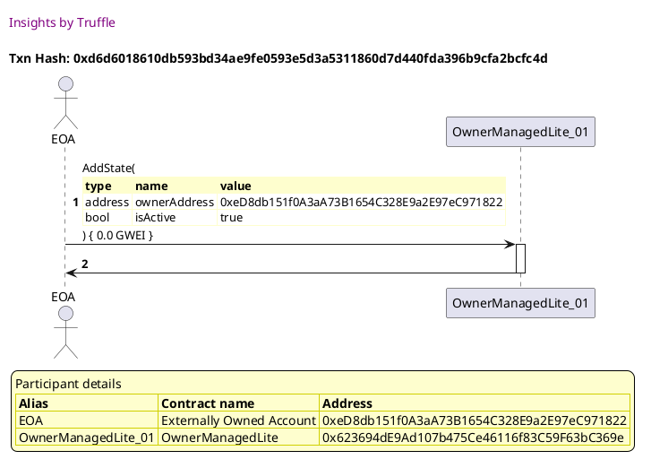

##### d3, tx: 0x28577b038d4f37801ba5a14598b3a916e7f3a7906ac9edb0c12d190fef889161

[SVG :telescope:](https://www.planttext.com/api/plantuml/svg/TLDjJzim4FxkNt43QK0PmaxQlA2keeHKJDe4WcfVnZGvyIMrI9tASQ6mxh_lcaO8j2wAVF5pv-VEprqOEs-Sj6uvhnYJIrURvJn3ove7RHRIoZbKMA9H5p9_A6szD2gfgzh2_YITf4dAsB1npnME6BJF3AL22x-xBS1LRVLBRPoinfKkpHoD8yR2lGPCoBcbN2pjei9tZZlzWY3whzYDL4gR4WJle3-j7PvsHR0k_nVJw7Bc6iYUOMgNHK6yp6bN8KnN1gvaCpi3llAYGHXct8zKl_33Y8jC3gJe3-8eysKi0WmBNuOn3sGUeyfuBZmbObvW4KNa5emaonsLdbwFGJQmHtQFaMnEvteXwQhNJmRjDsbaYUghTlYBYpPm1xx7M7iUJaQx_N1yV0Qoj8ZJ-iv9XybCcX8FZzZkyDN9ZtsBwkU6RqjySWR3Zq_I6j9m1CDysqcA6VLwj-dtz7RweTSRdhRu20xlpJqRTet-rDdH6XfdDprO0xq7wKetRhEj5sYbqxK1RM1XQwgpQGvWlI4vOWf9AFr8HV_lxjinOpTln5FefAwQDpLSyalE-MZz6MYQI4VwI6XCB963aNFS06EbDgbX_NgEQjuqYDQLGsjaLJstZL4mpdCQQKSkliBBI6LY80e-zkKuz2z4CEWdlXUbiVJIECGa3aNaUU-9TpNuNxHD47X-4FTL6e-Lu67M3mS9zWCXWYBoaq4y2VmieGWAPgH4fmSxfvL-phy0)

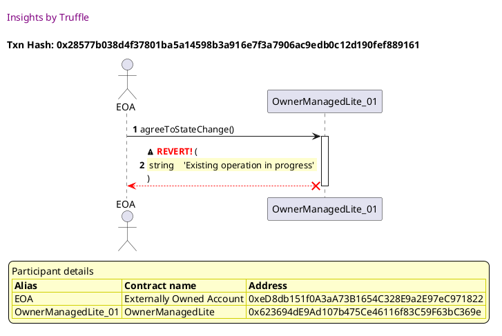

## Fails when the caller is not an owner
[link to test...](http://github.com/thedarkjester/ConsensysAssignment/blob/7c5b2f21f354ab6c2adcbc9e6ca114bc570081db/test/OwnerManagedLite/test_required_owners_amount.js#L22)

##### d1, tx: 0xbf894e5df518d483e0fdc0ab6482f31818267ccf9ad5d7b016aa221175cdeea0

[SVG :telescope:](https://www.planttext.com/api/plantuml/svg/RLBBRjim4BppAmZdqY8DIb8lod2DoBAC56YH0CszM8ahcOXC6HI5scdwxwLbmMXGwq1ICylPtLaISjyxi6xOjOJ0u3epx4gqf7_HPWyMThJ51erQGVNIs6umAk_QpjARJR4fyeAGHU-EBIu97RyjWa9BVq-_b3vqLhzsna6RjRenEpJEAzRk4h3nv5boFzXzY--87_eLAGyls1CefKr3EPkWF-E--3mLGQRyNqslcwthQNcaptQeQwzBd7OjqkU3eG_GR-UK7SfQfY56gewuLA4CaDMgOb36eHHrm2MN8awggav1HIef6Oy1XE0yYIg528nuoohdIoyUCmezdVbzHhnjJbTw3xxLnry6xNSmqA3wfXt-P7mCl8BF21dlqxlbTPxUtivfrPdUsU6KzSD7SZtk971MkfjJGiu394__bANGWMvxifZ6-EbcpTQCiUNR5-hdv2lqXzmFmFh-g84Tde1CAOkzvoxtbczZwtuzEBG6slOujgneLbN-iJXFiGEkfIfvn6kM1P0bmOh7KPW7GXOfY29DC4yJRxLuBtpDkl_HCK4W18iA0J9W8gWpv8NCYo3ZgrZAi121sCYOHN7a4tWd9Z_8lL_zi_yB)

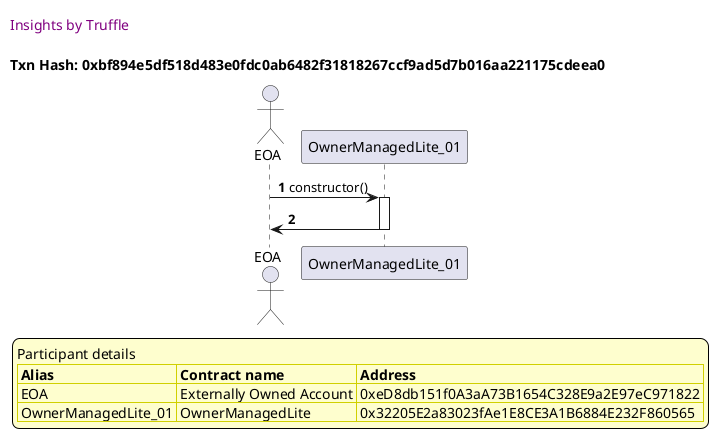

##### d2, tx: 0x409f17514bfa810e8876e9418f22bc97a77e8119ce70de9905a1be7e317cc36b

[SVG :telescope:](https://www.planttext.com/api/plantuml/svg/bLFVJzim47xtNt5YBviOcvqqZODOHTgc0saJI23j1MboaaknS9tASLWBtV--QnggJklByk2pp_V3t_TT6Bjil7A-NHZ6LEjhsovoTAnvqdQfd5g0mJdQSgoAfxchMrjEQbCxU3VBPjaaO-oYyMk38mRTzuYgH0Ul_H7WgdRwfRPUcTJekLsWzLInylk06LtkIYvRjpJuryMTVa4GWxtlLfMbjdCGl7Vzxkp5v_uHhEz_RHizV_GDv6kuTsrLKLtcjJS8zoiBLwfvF0U-6l2a4d4a1dcbfE0ePJp4P21a5GHvaSGgZb4AaHGOynAJX4TAv1XZAEAY28Sv8yeAJq_FRb9G3PoGFM54czU5NYg2UlFBelkkh9fZ-Krx_Cb55tZ4Vy9Obmzde-FtS7fw3cbPtddbyVs3VM0NlGeVUplQV06_NYAGjMhHsMTbMjfimpT0z3bi6jX0lMsGxezyXLDPvY8I5Kz3bSRXM0oZmIGCP9Qe84jYd2Ina47mLYglQqE9kaaBhv-f0tZtrkW3l0B_nE7hZ-oQ93gEPWjpX_Vi71ZRZHcxFI2lHA-qQGvWJlcKSxw5ITD4FD9cGcFYI8Kzu3seVTveqmb4wygZiygOTITC2MbHq4Zx_oJWiF0nWV_rTWt28E1H5YWPyY2iKXIPd6HXAiP3AGTP40OpEUJHCA86n4JF1xkabNxEFm00)

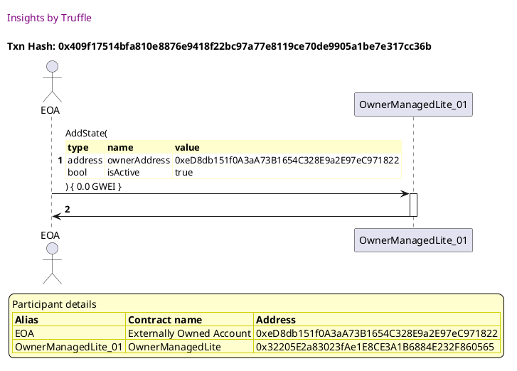

##### d3, tx: 0xc71967a7ae5288b32c36e96cfeca9a6c8eaf8e5b24336856233c3a012f01ccf3

[SVG :telescope:](https://www.planttext.com/api/plantuml/svg/TLDXJzim4FtkNt43QK0PmecJD4LTH2cfcBG91DM-Z6boxKiQaJgLuq9XtN_V9OqGQ5qK-P9xvtVdTsV6pcidhLijIiRaobLcjPYXPVL3OPRIoWMKcAFH5r8zvBPQ6Jskoih2_YITfEEKiM7jdajC6BJF7AL62x-xNu2hoXOlbN6o79L5RXPe735cxZLWGk2MShcoonBV0NV52u8NlFfkfDQ5oS7ZdUjFQuUdNH6io__5r4K-TpNCdc5gLrb6lCmLhaIOhWrSoNf-1doj-juWwik-nD2FuvdmbOXm4AaCbHp8ICKeinZ3cHy84SLXv0kXXEIUdt5FgKmmaamvAZsz7e6iOO_i7YFPNA6AfQIZNZyPjD-aaJdghuN3Nznh0tVuznXhzyD9iXk7u-CpaBb5d5PtJZeSpwN9yV28xGvVd_pOjwX_DdnRufCp67vyajQGXWaCrRQJ59FqUhVfz_Hs-g7N6vws_WGExyqz6tQD_jJPP0EriqqFDa3lWP9bIO8NDPZA4KHbGTLKSm2RPlyHqqWQ5OyDy9zZRoUCtRpHJQEJHLc_IN_9BpddoUOpq22HXFGnfWcnH0v6Bh1nZBIsM1Fske_ARNf3wzgXDLJiSziJ3IEbQ9eTGNoTzP7FmbWFV2-88X5SNWGpFGv5Fz0YZ0VzC0hbn9k8zyIxUlkljqqWV9-7gIzZmNsHZT1But4gHjv55CT1wWj_4aUSib02KgBJWvtJIlVoBm00)

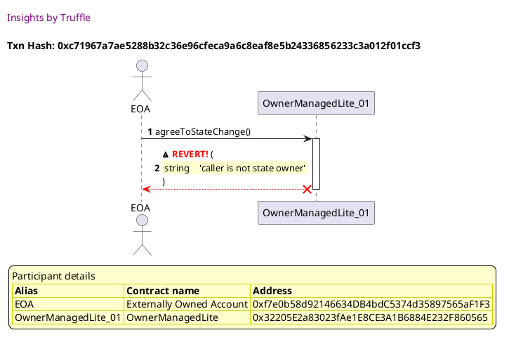

## Fails when there is no change in progress
[link to test...](http://github.com/thedarkjester/ConsensysAssignment/blob/7c5b2f21f354ab6c2adcbc9e6ca114bc570081db/test/OwnerManagedLite/test_agree_to_state_change.js#L33)

##### d1, tx: 0xf822bff5dd1f445fd834278ae23af81919bc484de078a6083e463a441b74995e

[SVG :telescope:](https://www.planttext.com/api/plantuml/svg/RL9TRzim37pNhn3QbmrTCSaViHLaGLt7GGTiQ87rVQ0jsX7go84iOqdN_VSnZX6iMFmWoNVKaKUAiRlUW_F3jcKC1j_POLkYO_sBiJjmiEKjDcZrFLGlZUi6g_EkxHo_NXVh8YyOM_J-qEAIyV7R86Xq_FVqo_b3vynhPpsqMMiQkqNhIR7svu0raIV9tU1sBRuZVfXNv38wOq-WjR4DbsA2_epxulDK19loVxMzQJQ-v-M1FxkXhacNUUDRvCzxon-WtyovsDTf49Hr7MijwoYAQvs6KP2aW448TIgLL6KLfP56GU1Cf256in2YI9P9f5HCcWmgJwKNZnc7db_HViMeRTvKPWTazV6NHVSTB3IelncFFuKS0o_WLuoDz_djyZBFRsxclEfixzrmpFhX8xiSTnGuATtEEMEd0RAdVyhIwC6qFLjCO_nqlH8h8SJoxGkdEL65TCXf08xySGjRF0APrWvxuixtbc-ZTLht7fs5jZsCbZNFgeeUYoTAx76LwbB6iXPP25aItijP7ELXa1OAWa8bcAj4qYZU2rzgtV_ec23BGfcgQXPAiX6hObN86QP1djIhKgjSgoHK88MW1DI9gH_iZbPwzdy1)

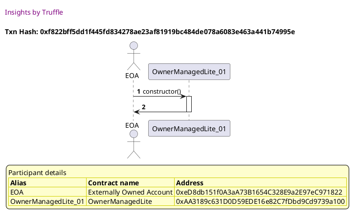

##### d2, tx: 0x4bd3dc7049860d7fb6ddeceb9b695a12e36e342a11a46d23b468739cf8ea3d59

[SVG :telescope:](https://www.planttext.com/api/plantuml/svg/bLDDJzmm4BtxLupefHMbjPDiFX1T4RAX8BK22QHUa2eddYmMNcVbE7GNjl-zio6igBgNvk2nn_FXzzw4iTFEI-VxXM5Czhwr_Q92nxe7RPVIoGKOdADLPx9-cBksjwfeJUlWtNbvNXObOoUTNnkSCXY-UvGA7JoFHu2BrkcdrdffSgFdTe7MKyN6xmBEwVAbvB9tIuD_NTpe9mGHxNpNKYbjvo3uwFezs9FFuoFOsF_ITdf-xpkerd3h-gQXkinhRn1kLnOkP7T_37mLLIfKTSAZB8svIfegLWfhhB8gpYPI11Z664Q15496iGh2AehJ9Cpg9aKPgad6YBBQqzFBgnna1mTa3nZHvdMjbvAWNlsowBvBA-UelccFFxaO0lVu3nWRyk5eklyU3W-F8LVgnakFx-_i7JiPLVWuskdc2_Zr4e6ibOl1FahJqsORlW6Yps7NmGRQRODyT-GhdAMg4XFHy3oKUHAUYNWI5M6GbfaCoYp18aj46WIlfQgsDPIekxps-f4wW7UlZJx0C_1F7Bx-A2z9elrejZ1Vy1uT0sClOyQktv2dq4jjkZSmPtp6ET_2f6aY7cbJq9WuKc47U0TgbpVT30BHklBeh3HcFGYZ8Azh6cd_dmIyBRnFu7-zGuCy3qMQrN4e2COaAsUbY34DYgIPLIehL4QZ9GNdr82O6FbWfxJIp_a7)

##### d3, tx: 0x5638fa07f1900a43720d48c92064c47decb0eecd8c81bd9d01df7158df78f59f

[SVG :telescope:](https://www.planttext.com/api/plantuml/svg/TLDHJzj037w_N-61DA0CSPUqJOAwY906CMaJ2AgzZ6cwvfpqH7gfBbSehFllSzC8WTP5aPspVP_jpmvZvusJrYtd5MDowMgpd4_HikP1cuMqSWuLbcZKXSmVIbilZKhhghQmVvbTPcd6sAXnpnN63DfdXbAXXT_T4U2gjlgbDavMIQLBCqVZ2B5mhm6NvDn2BfPsKU4xnvr-GH3zLzkDL4gR4WJlJ7zQFJhjYc1T_Y-cqUNCDJ1zXebT5WNXCgTTXJ1P6RYIpUmC-6emzCD2yg0G4UUoxmSUL_qmZpm-xEVzG64-vOYv2lDGJ5Mak51580OXoR0OH0KZod97fMVN2SW6zaZlCQBDwLml9BLw_MJGVfD6bgY-QeU_k6W3TzZt66llmqcysm_7nsSWIuiugU-ST9ZEf2dny8Zj3b-T_DYtg7vkyBR09sSm-lWahI4EOnZbsqbIJDphtMRVizl9XrvlTDhQOpYyD_Tir0twKwVZDJJERcQm1deFifLktEPOBz1Afsi3si32rbHdqnp0UWDon1GIKVgHYlvVxzirOpTlo5FefAwQDpMC-PXp7gy_0sqJyKWVAQs99N0mSeuRGwBK9ZMiN-zHpPi1aLmvj4PMrNCx60L9djDAEtBn5Ov3DHK3KV34bqdWNuZXe9_wNfX5qikY0DCe4A7dlGVUDU1_hMs29F556EL3Nr0RWoWRPsA8ePS6nPYMArLHu4TIS4u9Y8cE3tPEadxElm00)

## Fails when the current owner has already accepted
[link to test...](http://github.com/thedarkjester/ConsensysAssignment/blob/7c5b2f21f354ab6c2adcbc9e6ca114bc570081db/test/OwnerManagedLite/test_agree_to_state_change.js#L37)

##### d1, tx: 0xc2b840da743efbdde48c2a7469613b2023d69f4ed67af78aba99a591e4487abd

[SVG :telescope:](https://www.planttext.com/api/plantuml/svg/RL9TRzim37pNhn3IbmrTCSbs_15aGPt4GGTiQ87rVQ0isX7go84iOqdN_VSnZX6iMFmWMNVKaJoAiVlEW_Fzhc4CUj_QVgVGiUx5s3qusF46QxHw2ULBxThUwbNRj8xVR8fDiIeOctV-sE22yU7R8cXq_FTuvFoXTUQrjHwQl36rtQ7rf5ZvIy26oBFaldVx1jyHFymhSXbTi2VGsjYQIp52VuPz_daiWetvlzhEr5lVSNNapwwlAj9btlW6-VF1yWVejZCk3cMWqaXeIA8GAwKrHcaPq2dEOXcgG0IXZhCgGXqdK2KfACWoc6OIeoXDG6b6bfMUIYyUSmuTdz0-OMIRDwNP0xNw-CkY-muMQjJVZCUVGWw1L_09OyDzVhUuplFRsnalMzjvrv-oVlZ8hiUT1CvATpFEs7c0xEcViZHwC4t7vkCOFzsinLe8iNZxmcbEL27zh6W0ZlhZ5dPu0dAj7NR4NUujteRMQJruT1QQvZYqh7bUblHOF57YWEjKApcLbSX3o9DmAUDfj0g3jCWWAB84LraYqo1uBtpDkl_H8O6ESQEM6ncbiIf0fn06Cff2laoKbaKcGorKF5qlAG4vCVh1xccbP_yN)

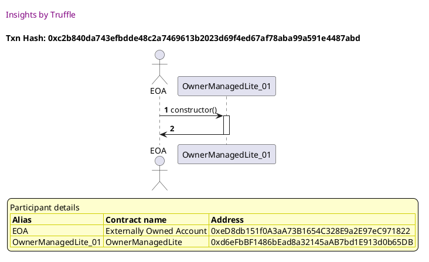

##### d2, tx: 0x085defd6c8e317a653d6074bb95858fb788a80a18a69d6c48f9608d22319db7a

[SVG :telescope:](https://www.planttext.com/api/plantuml/svg/bLFVJzim47xtNt5YBviOcvqqYODOHTgc0saJI23j1Mcwn4w9S9tASLWBtV--QmWLq_goFFZiy_tmztqNnivRZyvtIyCOThwntRBGZhKFjLsXmoKOlT1MJR1yMBYcishQcCR1kta-pwSvOsUjtnWzPj1_zngLTl0y704k6bS_DTQZoKozi4jjFLMi_3vWJfSl9LUTMndzryLD_QH1ZFQ-QrIgjWiGV73zxktPv-4HREX_QTjwSUzRA3PmwxggehhCrzvek5rRkC3s_XJucij8wKh5fTIXI32EGXNpP5GKQIGZMHM9b2Wv2ebnIb4ZMQKnboe8Gf6g8a56b9MUdfvVPO0j794zOaIRhyjwXGJrwfVLxZjQN6ZrhVRw9nTzu07_4MDzFfoC3z_3yV4fP4hTUFJw_PszOsU32Xy7Ezv-0RzPQI1hSTdRHpGTRNRXMo3wd6vRs4ApQv3jZtojPr8L8X8LpqBCad0YucWq3GEPfnZaQQAdQI9a4BoMAfh6K6BTPgMl7wa3UFVQw0Cy0__4uUkF_98aEenc1_C5xyafCFOoPkpw3NbAUwnD-mRcZCyuvpkOD4t48sscD2QELDW3teFQvustlK2qhhrs5etPzC8eoCgIHjh_9m5l2nyI-5zltq35UbvCvc8auo979J4Cn2Z2R98KIkIf21KlucWseGR4nC07EwULViu_)

##### d3, tx: 0x24134a352216cc6014db500b8fb62f8c79c8fdba1e74b7e724b0e3fcbc24a83f

[SVG :telescope:](https://www.planttext.com/api/plantuml/svg/nLJVJzim47xtNs6n5n1Zi_CxY5MaQJAGDXMfI7j1cixn9Or8dSfnjnQw_trko2hGgadmCZ_uxFFTT-VpToRaiZEWpMhH408hqwhLGg0ctNsjbg1XGHkiKCan5FULRbTAfctJQlekp_8ipGYvwCocmH6X_PWZIDJqSTXIUjNg-g5L1fgagIkrG6KiOcds1hazV89ShlIomHS7i_e1AVVskXkGibOLvMnG_UhbnSSX2JB4lrPTNSrDHyM6tkfLMLfSOchJ8BrTAte5tVoSihNZSTS3rtSS7XH5mBWdXS-OY4eHE6LKX74HbL80nz0J8OQE9nYwPI4AnuF8BOajMM5iwjaqeT3H8okFY2sRgOjw2VQgqvyAzLTGKA7yKXlypdXlU41_H4ZlJyz6Xy_fwUavjGMO6J3O6npVgJjoCJp5-q6Ejf-esIoHMgbWqSiVqApiOcU-tK5ex3gwfUqE9DblsReCaGa_ah73lI1mlSdO4pBrtT2JhX_5eH_uaFFSVO8weO-KVM3qyxVishx4uQJ_UHiR64qw1rNXLFNtEZvvBSxPsJbzI-m5tEDKp_x4VttW7KZH-xuny_zPWTw7FFKskNd6M8a6wgPxHgi9cp36ThIoBMp9QnUfxKrjgRyds9v4Ux_HjkyAEwyDQWLDi-cxGTAaAEm_Odh2uIIIWlkyP8aBIUYEUU1xgUj4MGnE5eUOnY6F7ESbyA6k-blR1v01vcASSoyAH0Oo0jTIsuTa70h9ivYxaed0dunj05k9eHxaqixsH_mD)

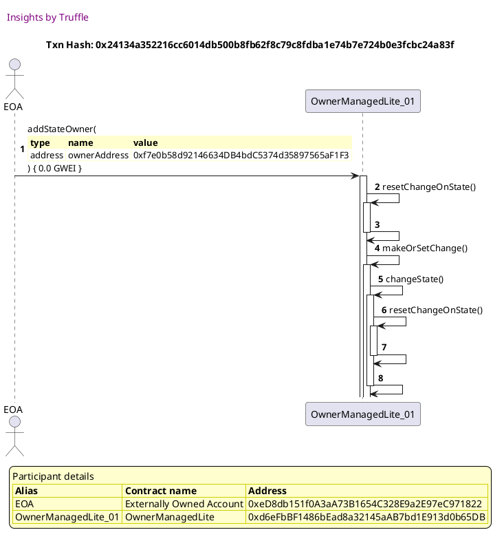

##### d4, tx: 0x333b9a8144afcd90967c2f992e493dec4dd64da3c3265a48f547663c34670e87

[SVG :telescope:](https://www.planttext.com/api/plantuml/svg/nLHBJzj04BxlhrZH2uZIhX_n0z489t4AKgkW1gaNf6hi7JiMzZfThsa2wN_ln9W8rAWINEh3pkuylfcT_SQCdJS6j6chaZ5eJQtQAa7Dcjj2BK53nKlCKSaHfBUvhbibntLPQ_vk6a_ZSSpOMMFM9GuPxxu5WaJD7_eZvnUrBkvhPQ2CoY9N5If3Y9dPEKp9-0YvRFMon1U6UN6Ft79tkYkGib0vjqIl-jt9iuzz4QpFVwcQ8b-OXYThVgtRB2DSPWfJ8hzUANu1pUAKYvNZE4a8WUMwaAKo5A7dftOMXZQweICnTQNqN0bEwjZU0DmW6xY-vz7HzNo1WS-ePQcXqkDPnA7X1oGF6BND56cn1Bhgx9T2_HKKv2Y_50P_2AjptAC_OAoBvoV3_NP-V7pA6pJVy6TRQ9ITJnDLz2Zcy4RTiBF-KTxtShZvnCrwYPoaWggJTr2sjDcwRtXRK8aRNdT0Jx2ai1yTZlW35ny4__mzlgHExo_gdzLgf7h72r0vpjJSWC73ezVYd9oSyhVahk0MPth-bF_rYRSWQHVxnih_PmUw6FOuk-pg6ICb6YZAvXbP9c8YXDYIXKQKo4cRCSsU9chlQ1D9IJSXsovkkEbOJ-lAe5PGbkkExP97QRgb99d42YU1JAo1bOd8WSXtHfOtSCUE7SGXs77eupZqhS2sNmBlcvg_jLq2wU4q6KqjD_2I66G0Zcsv0uX6VYAjEBGSAH9lC1bH0kf4tmzsJYlzyVu0)

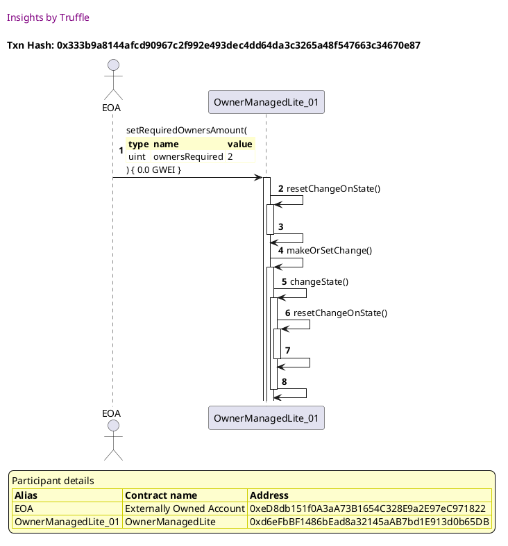

##### d5, tx: 0x1afdecfaa2ed8649010ad4c23cb0ad04ae33978d958047b44e3d51e4f0951af8

[SVG :telescope:](https://www.planttext.com/api/plantuml/svg/hLJVQzim47xNNo6wbvQkc-IVSib2dSHU2nifjB2NmZXRPyV4aOCiRqsR_UzJ72-qB0msvWUTT3fzdtJVdGcvQWreqwrgGg0pZUfM6MhIBYkr1WqhMcE9IauWNvQwwPISDdMZwPiqIPDfGiYeDPiQnuJstm91egRFmvBIwqPNJuqoKCTrLQeLAcCH2tC8IEtc7dBTwNMDhpRkgYUat3luRa7AIfMKiy7rexUZzyCboC1_ezggN9YMPXjwhxkYiBZ4LAP6Ul-ew3MqYqlA7ZaK4lC2m44f0YzYd87qSiVDCpjX7g3hHg6GaI-O5sQUXwxqENe5YtnxLX2RijpOgoVpc49BJwmz8JPjfighDTYdphyhr9z1GOdoKsNmA-Dzu17_2I7zUNenFhvFpyylgKt0dG63VS3fWteWeq6AjuCTRpzGiraZjLR1ghVVeExiP1U-tK5eR5kwfSqE93uiRK8YoLqNdAZWMO1Xc0OyYlmmPC54P8bWCqo549w_XpgZpvIzO_JZb-J6Ad7yqdzyZIL6Crs0Ad6k-dUTdlqjpiN59VqNxXKiSQxlVl7_T-AzbhiOicyXSlkYC2GQgEhsXNepDcECxTIpdM9hn4wcjWMqhR23ZWUj3kV6sxxuxFXeK2kewqrVT9B6UMxRrVIwuap8ZFkyOB4BSUXEUE1xKzSHIGHE4eKuZK8k7ESryB7Y_TtR4yW0qsoISay4MG9IWEjmpuTu4cQI9n5t9Si2VpQn13OJGpx8bHtjZ-Sd)

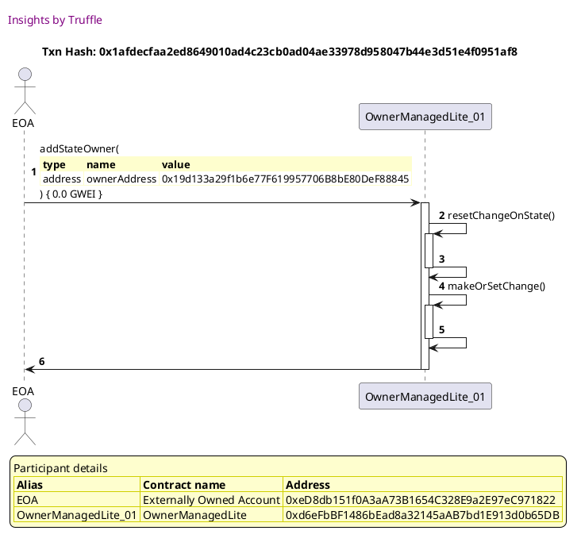

##### d6, tx: 0xe4a64130c11833198978c169200b9b62b6808d9053cb266bb82e97817e561476

[SVG :telescope:](https://www.planttext.com/api/plantuml/svg/dLHXJzim4FtkNt43QK1PXvsaQOAwYhHD1z8c45JR1q2J4xjfHEfKZWCjiF--QvfsJ2kJM1JbxFFvtUNvdGavAGpNffncXF3IvAgSHbAJuYvLCwxv53API2LwFBvBT5ugqS-pNCFkC1o6_P2GJc4McUmIg9w9v49gUAgd0AUvJXzpPNWMP6cYfb8PH1oRJS0G5rUGirBFCld7mbNwA84v6zy55o9L2J1QktvMjdDK5q7g_6UgI9E9AI1Qm4YNup7Y4fEQJC9ehk2K5vDZe7FfSDTXDeqPysoR-PxVzcBc-XQbaH-vLkHwr1C-RTbnPBbk57cMn13MbYsNEMsN86MnmTB3ym1u0JjeTmZIPj8udN7yrVC79VLNhdWYnPVKo1-KLO5R_3k4LFkXsTs-3eU7ny0JBUKelpBSoFw4gqJk7v3juV_64KBBeZXJWTPyiN-ZRaYdFjCFjUq-VmApc4b0g_YqilSyAt6m37zUOy1cDCg7gH8uHse7deXOYurfOFEWRVUOstBwjkM5FhT2lotxVfjvbhN1MfRn6ocefzTlWRfTWHt04z2F53v_3yzG86yafzayXajfIgtW_rY9yZp3ojCrjpWsUhtysbdDczUxMehRPLah4M0PdVSFN2lKUnSwyQhhCARRQ5o6tyBBqRj6etDK-RklbGg5qSj-UGPyz_9bPfYW_dYciL4MmEDOpemKU-lgX4H1f_SehjSqkheEoCKBaGjfU9eLB_8Fw81IkgGAknxpuQ2FxQmHV4DQi5RFPX_Mksma_CwDr8fdsQ9g80517EFLOzweh9V0snhnRs-LGBXo6FM6pF7SAEJ2uxR5d1OFUkr8iD1djg2HsnhqC04oKVD1Jl2Bb-Wl)

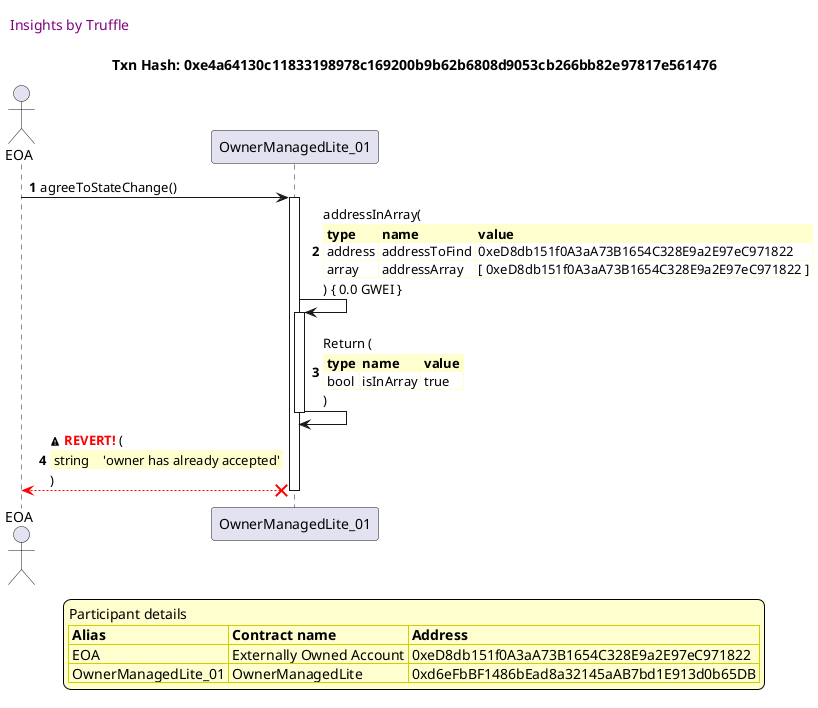

