Test date: 2021 Mar 02


## Resets change data to deactivateState operation data when timed out
[link to test...](http://github.com/thedarkjester/ConsensysAssignment/blob/4fdae3d04e4addcce97e88f438735f476fc16bb5/test/OwnerManagedLite/test_griefing_prevention.js#L24)

##### d1, tx: 0x15c79148fcef8b60cff3ea30f28167873f6050e9a3d848c240fd6e9c8ebf2a6e

[SVG :telescope:](https://www.planttext.com/api/plantuml/svg/RL9HRzem47xthpZHbqrTDISsSO8OAWHG9srgfVLzCl4vM3KESXmDkkw_puG8hHfvi9tlEtztzvq9kM-3zA7RMK9a5nhNxJReIVjYt5vwkGEBDJgraDLBxPlEgRAnZOURzMgzAbU4JDjmj3WZq7zRb0ez_1v-0HuQRruR5wITMrEx7ReG5NMu1AmZUPRSTtvlyHtnmxmY9Fo2FKcbZAiXeGFqfz-dduSYo93_gsjDlGqjR8xmx3kjeou99bY4vuE31zbk9q0FoRWIHS9pNQ7EDncjj6Oe6TLfdcGY5qndT4ona4pbFAzIJhNAiAXotEXKPb6Jo2h4qbUFSv0jZE8-8j6sO2gpbx7LnryE_NVfP8tgcmduaoPzu1LyH4X_7-vcrtculPr0rRWs-EwKzSD7SZtk971Mkfi08US1agT_ob8OfB4jcGvZ_7Ipf4jAwUpj2yGvnGhZeOm3yB4_S7A79s2kbCSsSfTxixU-zRWU0dedhJtsBIkOLrLyB25IzC0PpOk4RSfCqGLFQS9PoeL8IwhuaY_OIh4oUfwz5xvctVzedm3JOa77HIONc8bbcO_PE2tMEHFPaXQ22yOJmKgnZWcY4uCVv3wkyTd_1G00)


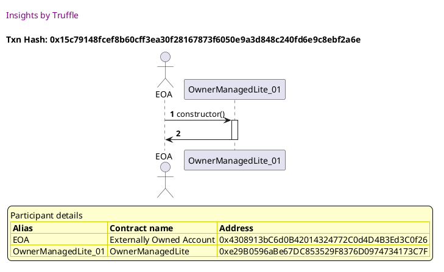

##### d2, tx: 0x2721da058dc2543228c5d338fcdf1be610449acbfd3577a6351b823d10b21238

[SVG :telescope:](https://www.planttext.com/api/plantuml/svg/bLDTRzem57tthxXYBvkwRewTBn13XG1hfKsjr4fxgJGviGDMZOCSfuEM_VTTGegOnilou6jVtm-VSsu8kQgzSBvP6K94uolRh7BbIFsaxLeuiGAZ5ihAYIYU5gvghCmgKpbuDv_DPzcCa67jjqQD2BJVKWcf7BnsHu3hokcNodfXnaOlx4fPZnLBVmoOu-MXvBfnQwF-khZNBmg2yEYx4r9gku20TgxVhHr-xXv1klutjjQBfQyXtyA3QyeIwnAllL7miB5mBUhb0EY69IoGWaQfB5WKSiRI8fASfsKXoo1NSK33i2-Al9GyIX8HyoZ8KyPbG7CMC9uIfApm-FJPxHX43JsqFOAqULtejK2ejx-iSj-55GiblsclVjAW3JpZxn7IviFbwFmzN5mCO2pblHTUlN-qZsJOgV2niwFT5_3RjGAqLgnQ-onCWvjz-0wGFgVg6dPGxHkCZqUw2JbD-m7FirZIISXeW7o4IS8oAiDfEE4poJDQilYjL5vL1XDrFIwyViOEuDrRem_m2lGJXQy_PZSeqNaqUvW7l9S38EGmPkJkX3oflD2cFe4vfLDAwHucJXFoY9iCnyIX2aV0Hr37lD6k5GZNZLVE2cEshJ0InaM18-t_au3JmkS4_jVRDb2iFw5HFnOJ5IVJB8runFhpb2VnbFQJCE5XaF0icMC3PABZWrpXYZ_d7m00)


##### d3, tx: 0x3b43a3a5ae879bb420c835d276cf34bd5771b2ab7980afc4eb2ed9f8e1094943

[SVG :telescope:](https://www.planttext.com/api/plantuml/svg/xLNVQzim47xNNo6wbvQkctvPiaeNcjZnMjX8MGjxAGpPbXDJHmcsl2Ljzh_lucIXPTbWOOypnYUTJj_flaEV4RfilAbzEwqGCgsVkNQQsXer3wMRczfCSMN7rkK3apsCwrdhycXMpMhyAXacmsY8q4NZbvNj8Tmz4sjoM-EdxHJZgrbTFiwSDrM_AiTkQfq7nCBl0X9Ot43EstfUsHSBj-MZnLJiV3ScpqitnfHiNTyxU_5sUmYqpN_jcd8yyGrEb_YkRei2S94lVMNntSBXAzDCpZ5Py5HmmqrWRAXqcWf6if07ELCoAxX8yq0fcZAJAXqIKsJ2fipckWWj9LfemH5Gbdau-d3KnwR1Hs2F4D3cowoS6oXrzCtP-gDnPcpp3wMtNmZj0lVuZn3gzkEptlvrV7fwZe60Ms-yxGAExzqzkjYsulNMzbRli5_EBGRhpBIpNqtLmc0Tlbf3rBPfy0hFrY3ztPGiH28BBMBAL11bFB7nW1LnJ3NZUQ9vp0MBZE8Yta2Tu2TCtX3y_lFm6Zgn_z1_h0OIMnzDZ1lRaUlgEZxvMvopitFyoVgsTlWmFjeI6hN2yAe0May5aLfoJQaI8Y2S126uX0wKv5HJ8gMGch60mX8HeIA1LenGoQG2X-IX49mf9RSS7KBBr3pOKNtxavhZWq2oRk-1fFvlpc_B-STxDbT-7OCsIejkdkb7Rhqfg-OPRp692I5hta1GGKfW485IrY14EmPtLtgthxVgD0g-2szhPwfgsMbJZljP1ghkDzUVar1JdaOo9mDGGmfa2QLOH78HYm4VvZmY1PClWVTftA_UBe5bUW0jaMPWfOgZCE01qqd8bOo9LWAaXIeUgGGI01DRFj0bVE7_z0C0)


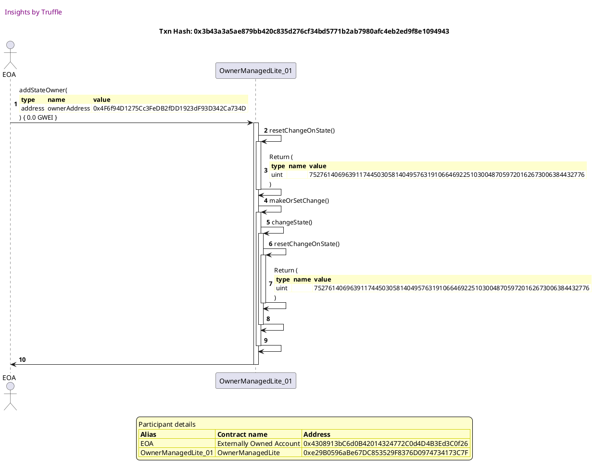

##### d4, tx: 0x61300d0aed0219c4737d75ee04fa2c8e0efb283ef123f7ec1194606f4ff9c42a

[SVG :telescope:](https://www.planttext.com/api/plantuml/svg/xLLTJzim57tthx3O2uYnsObZ9uXLj6axa3OL0T9Ua2OtlYaHgTivpjP2zzztcuOAj6xIs1uNHRdE_JY-FbSv8UIqyjhvUbeIeci_i_Lq38vKTuMTQwUdj8G9MDFJsTt4pMfhqbavS_JLS30Sf0D2JYg_BA53Q7FTWZRWw4FxIkdPp1NtC-jrsIsBYPs2zOYO-st248CRo7djvYKy2rmLzq2vsFekj365dL3EMjVtnfwyRPiWxVxdjYecjxwYuoMzTdMU8oxnXI-1NYyiFTFLxJ5b2yb3nWpJO5Z0aqoeK1aL0J2Hwo2BWK4-3k8GSXw4kOACyqH89dEHvvWTQ8AKPHvR7uowL5Tq3-qUGTfyaHLpZKSTVRFWFcgh9s0-51u-Czuaxl3l4TBKqwFExZWzF3oc5VXB-58N3aoJKtMdE1I_VsDlo4axbDUjxQpUKR-S0qLhzRInNtLPusATlg9rWIskwAm1UeH5Hx19EA0FbBrXzFsdmJaolRkfttRh0FjDRxMTmCXUUUrX_-1FSOwEZkab-DfP-bUdn5j5WP9SC9d8CE5S2H6na4KnkaGIAHdoX3CfXKo28E8OOY9MB4fKmBWCf4A736CXma0fsNBq4bgc-Wv6xkgHclqNWMHDxGj9_J-SNnxd7zTiFkbr3jaeARbueWy6l2xAwWblVTPdZArvGy54gS15YaheK6Ys37QDmU5XR5lNMJKQXC-51sTrMIuRxJ6qcsLhWS0GMuYGnGaFnwaqh2UGDoHBA1Map8Y-w8K34wOi3-Hpu5qQzhEtsG22f8SZaRe7KlNJE0gZ81d6eP9zbYZKLy5LcAeXRe1Cj7oGKtpY_-S7)


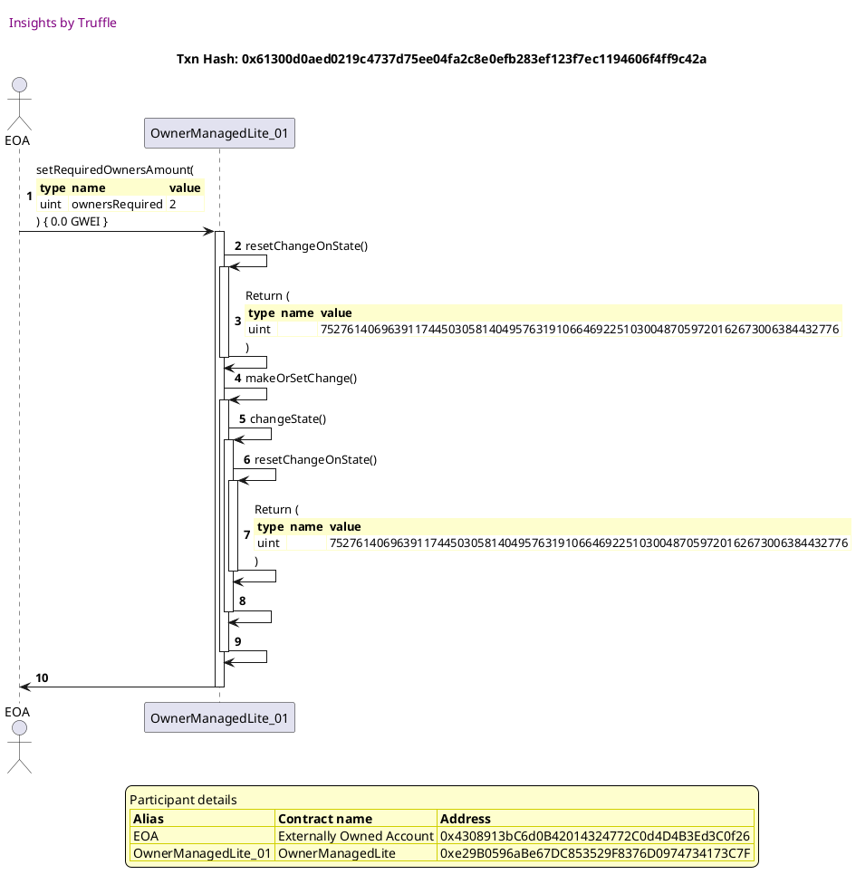

##### d5, tx: 0xe455c8057a10459645e4329bbf9caae1a9d2c8353630717935b648108a3beb97

[SVG :telescope:](https://www.planttext.com/api/plantuml/svg/fLHjJzim4FxkNs6nBo36PiTlCM8LRTeEf4r5WBGlI9EJk6r4wdQEixNG_VTTqr21LY6DHP7FkJUVdtik29rNmVXGpqg4J1tchfwbrgFgld0BuyqCbtPYNTupsVt4pskN9_Doxl6xuM0uI0O8dLLXLTeEmiqpjIQt7Z-sdnXVp7tnC7V1bDsocBYPTG4oZiFEOGZ6RSf5xHUbVM6uAHuifdodkp9vNhW9fgHL_MxasSUs2DIUV-cgOZ8D5KvN-DRNup7aHQ48fSMtIuSlJ3KznMHfkH1PJ8Gob72X9HUMiqYdwLXdnbXgT1vbCHDCCgAeqaoaaiUKn8QbDjKA0MHPWD87eous5Ju0UO00jb1anSB0LKU_dFLVZJCJctyfWlrEQEEuHt-0K1EFJphxxVZu-1HNDbpR7tNXRTxuLDqPD2KSthaxTDOsvNqhE-jFEAmM5eDqPjR8dwQiORDnN-EwW1BNUDuaUaeB2hfrECAFc7mW-FEtmIKWlR-eLwlr5kfDfiPDxCZT11FiuT6_vZavESNNDjJUuV-w9RnAH4fIJgIMJ5EgE1U44H63YckX9AEQ4Ycvr54aA9W8ZnKHMaM4oaWgK4WMS-28KhB5w2smpCoz7VcR9sZUXiahCLiQRNpGTdhHrJDEvZQOegoU0TadVKB81aWOKg0dR1AOFW_ata7QpNFe9jXsSPrrmtjOby5wPyforV0znzqisv0IJ6J96OarPMaYSzBZ02IWnvMA4fBpFk-nGSuICexaoyJxvkPlRNE0ZNGFUYHDpqhLJsB1HAI7CLEoJxJYYd6gMAA6S00WqUA1pc65VzuV)


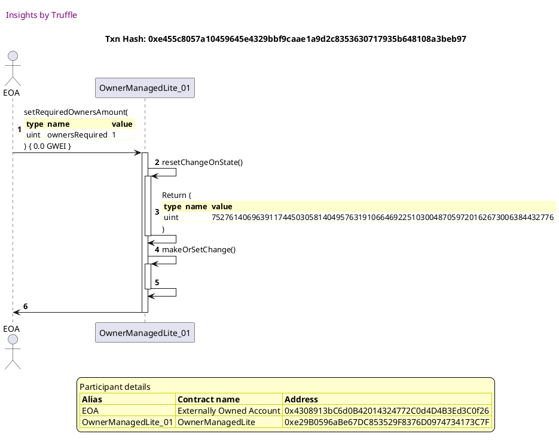

##### d6, tx: 0x55e4e0c95265eb8e08bae794103465636d7328b5d26a7044f0fbb6c4518f0482

[SVG :telescope:](https://www.planttext.com/api/plantuml/svg/dPHVRzem4C3V_IcixgLJLys9_oLLXme1r4cRg4OVAqqEFaBKO93ZTD2nxxuZPAZLK1yQHJxdxdoN_EukXDpKmVZGB2j2J1DMhbdcu4dzMBgryMP9AoZ0sO6PFHP-rJYRhQgLfn_6e_4e6n5oNOTj1Jr2ssi1neAdlxj7IczNldnUkM2gVbKMRWakOCHvE3gCqNW8kMxyke9NXcdv33GIHzsTiRPq1OrOf_hJoklFtKkGBlzNLvV58jGqtz9xtypd69U4CbH0xpUEtffwSKNPHaeGm6QfZ9M4F06Mv0PqAYB6XPAAAwjvdEJInife9iISpVDSpOICaZaJIKmGsIpWguycVMfgUeRoZ22sKCxAjS5FdVnouByRPmgmtye0FrdKEfxGdn7IdgUNlTDsUd5nHIrWnlB919W6NCu_ajE-RmRnK4F85iOLC77lZ7DvUKL_G6Yye-SFxe5STntngPEztHSQjckWA9rPjlB9L0rkzkuxsfJ8PqVnrZBMAX9CfOgdKQI5a8mpcQ1Af58h7gKHKqgeD8ubreOXUyragcCMgLXfL2YU2C5ZhVKX_BkmBCqZJFpq7vhtCNdZpA6wUnzo62fozw9LB0HJLlKBa4CsP8pjGUBiODVW9iEXyDW1HwHzQx6QQ3kUw-tQTiHr4y0xKrNRjWqjxSzcEC1xw6mZE4lIYEUPicmW42JI4rh76RDYA0PyP7d6vh5w7VXKE_-lRHD0d0wmHieCGEbXbaWkutISSAs6BDL2Sn5fdkan9a0I7GzoWol-Ylu2)


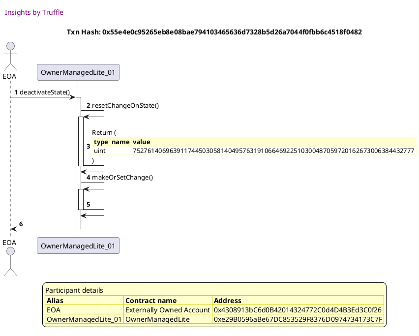


## Resets change data to activateState operation data when timed out
[link to test...](http://github.com/thedarkjester/ConsensysAssignment/blob/4fdae3d04e4addcce97e88f438735f476fc16bb5/test/OwnerManagedLite/test_griefing_prevention.js#L47)

##### d1, tx: 0x3613fb8ca140adb172ca3e73f2dc299b8e9f2a015b79e95f7fbef1800ba396e7

[SVG :telescope:](https://www.planttext.com/api/plantuml/svg/RL9TRziW57tdLw3qPLDN3R0JcoYBcZYsEcbJAwtlq-N33Yh14SPQqdN_VSInebMB7m2VSpdttdD1wBuBu4E_imX17rhNxuJsg7inRWyUTjZgHZkr1ldI-BPtgcXjw_5DLLPbKIAqwCBHwYN2mxVLeBJ7lyTVZ1zQRrvR5y2kh6dSJhiG5Ujm2QWYUPRSztvlzJlYXtdLcAONx0cKCgx1b8pGds5VV1wBG6F-hwuppJPqM1pni-_hEkgYO8BL-FdWy0DqspacXsH6arha4cXAG0cQCGc9pfAQASau5xdcDGD2foBZca_hh1QwfZaX0X8-qncAbiaGIoyVLnWwF8dx14NRWf5c3x7LnrzE--_WeD7gcmdw9w53u1LyWj1m7zyjh_FuzdQEPUkwuFjJrWyVqVMuay1PwMwE4JeF43tzKvRI0Opjq68SuwUR3TaGGfPlNt2SKwmm7eeu01_xmmvs-WIibFAwYzpbtl9jQ3skXw2z0skFGyiAhwICZoL4YXpIXEIS9gAOAR9E6Q5fmj8iOmLHwIPT9wLA2bApsNlXQzRzZmu9ebQUqYmlEPzcwNhAW4d9QL6AlE9KW62meXKNCK5qOlG3tSSrFlk_)


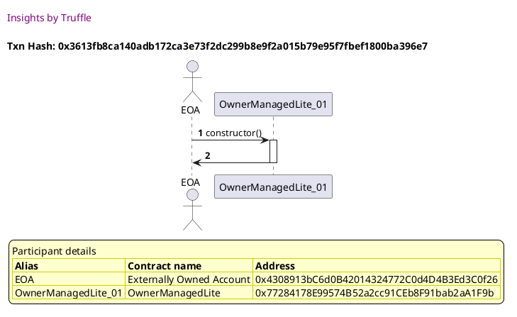

##### d2, tx: 0x1e57c02566003a501aff33fe01143353d8ab95e0ce2317c8cf93a8b895b36aa4

[SVG :telescope:](https://www.planttext.com/api/plantuml/svg/bLDHJzim47xthpYnbqsCpOwJDa6i8WtfGDe44aXxGPekiLCYNATo7DP2zzzt3Q7gjBui3pxxV7UVl-ykZ9st7ftl5eOnx7nZkqMX7MiVQxj4XmimUgwjccBvE7TDPrNMcCR1kra-oxESiRFMhusUCEY_1urAEtWPZW2NZQkV6-lHfAQUsuMsdYfMVXSmeylNailEBOt-w-AsVjOWmftl1fMgxHm47ro_UtlsUNW46_2lR5lF7tmBnHhkN5TLL9VvsXiDToiBbzW-d09V2HsDInv4en7d4YCkiAgah3GN8fGoaYh68eaqBtKWnRYCoogH61Tn4XLoX1WoagpqzFJyEWLiuOZi4IFPV5tMIoIgrx-iTj_HubohRxNNFxde0m_uZnZhy-5aSlWUZezF8LNgrgFNx-_jFJiRkl1ni9FD5_3hfGQo5XUzVKBJqMORlW6Ip-csXGqqMu1qT-IhKF8u4RB8HefFmu2J0a4u7WSPL-55E9MvaXclWj5RgQ9f32NMRLhw-eaGmBite0_m0lmJXwy_yYjgqM4sMvglV4zEWR7NCMCtU-8fxR4sxHxD2tx1ET_If6aY7McJqPWuwiAEy8xKBc-owHj4wyfhPz6OTTyO1MbPqaZx_nHWl_2X1l_hxG6eLXoASPmdIJGEfr60GLac8ikBU9Q80ei0Kp5B2W8W9GOzs3cjz7F-0G00)


##### d3, tx: 0xcd8c4a56caeaf2a5aa19f40e6ead3c105a86a0f45bf9eddb4ce62f01943fb226

[SVG :telescope:](https://www.planttext.com/api/plantuml/svg/xLLTQzim57tNhn3TIqlNJL-MhTA59lvO2nifQs4lXI7RScBgAC6MjwJD_ljk72-qB1iix776-4fNL-VgdekE4RfidAvTEwiGqgsRstQMcXer3wLTw5hFS6KcnkOZdJrCwdbhyt1UpMlyAecJE8mHkcZSgZ83XBjdQdHkQlpKJp6-cjVbuzmwNGshSc9dnZf0BDmk8875BUIYhHULUR5mMpuQJCNETwFplBGJJ4dl-jxPYxVz8L2V_zesvMJg6foky5tT5WNW8bUwok2xfSLNkfcUOxBCyY0JsfEPDhfWsjEQga8G8m65PvHuEf2Q5C9B2sNoF1MPaQmWL0bUf8n919Hb3euUZuTOD_W8x142sboPbGiDfOw_MLD_r5PFJFwXTEOBeLtW7lyHGjr-V3ROluvFJyyn473hj3DTmF6zlKSNVIjUztQmVeVTQc4mMAjddVsggnO6c_3r1g8sJOFNUBu16UwcP2aIMIWHKUPxOSOJ4urO4KLKCPudYaTSi53xN4HRg1FyXCaRWjz_Zg-X4_iF_STg8B5nuLJRYHdRhgxZax_5EJixnv-CQskB3-EZBQ5HQmolxp5VKa6aabnHwWlX4Kwy05n2URxaL54YfP2ACO_24X61JppbCq8bapuu90-4uCptPS_H8RJCz8CPrxS_gJa-22JhzXv8wl_c_BQSVxndU-KtCMYhjEZccNxankcoQfxn5f684BBX3GGLf0G68IXb3KAqOt1tfNVx1kjEe-2xTAQskgfMdJRbU9XbeEfkU_qv2HJbQIXpCXB06v0bV9-591UH6F4uvo4fc7m9l4_ZVlLs2G0h4DGFOWKT4oEFQPPbYePn6YIAfZfbUaWJbK82OABd0rt25_vFFm00)


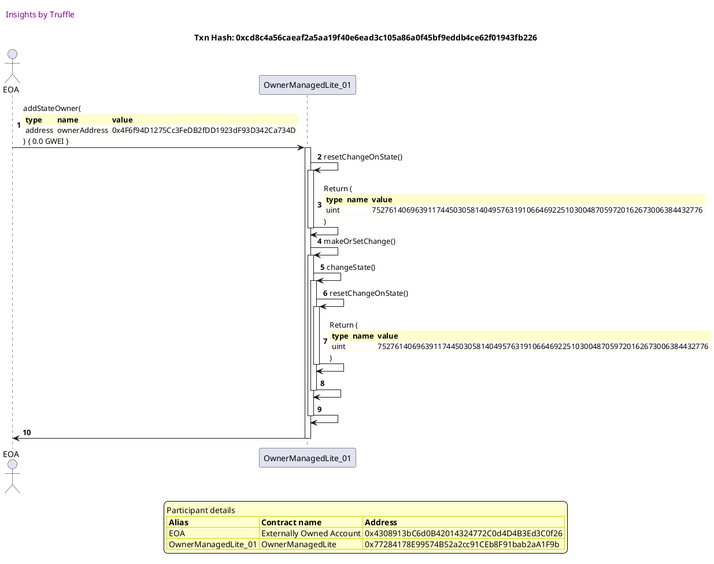

##### d4, tx: 0x9e9f447e4c55291cf0aa82ce840bdc26ac2bcba62071ddf18b5fa2e8def65f4d

[SVG :telescope:](https://www.planttext.com/api/plantuml/svg/xLNVQzim47xNNo6wbuwkJ99boIfTQE8cTB2HilInC6HBTamT9SXobtJP_xwBuuMMXJsKFiuOdNm_lfE_yvqHkcg2zg5Tr0ZfDYnTkyYiHyr3vLRQwmMkRMcT6UdyeVJBrfbqMIyzVZSPJyRf6A7B9cngEq2uk-PM6-lnp_uHuvkbhvwMBkXwM5UbMrWN0B481uS96FUGgzQlQll2CAkUBARyeBlLnbIkn9Jqgb-TlFpO7mBr-J-xfYhdeS7P1j_vjYW05uKgr1RVhHs-qSty0fErighWN5gUnp5JD2-8rWdBRS99Pd8cTCwoFDE24KcDAMYInOLcDZ6s47713GBAyW177q-7M3Vu1EG90jf2bLSh3Qyw_U6i_wgTBgtvKWNxdT3EyOZ-1A4k7fyFZjlnsTa5DXOoLeyws5c0vVGzEkxxJn1l6nlIkNQbdRfNufoVN-1lDhJUuTDxTuyk-o_YGoy7sqyuR5OMWtHwqSb7NRUmsRblSLi1FriCjuoP59GJeKIaA9MSnoGYSG8ghc8f8gee4O8BnLXCmKHu8aci92DKC2518QA4yuX9AVRmhw9beH_irC_-KFCwRlCkzdznth8ukzTvuvXzf-ryq7x0eTjdRMjiq5NTFEFjcbmJGdQymHo33ePD2WFAGpSU61mQ0yK3so5kiEr60wphOBtJTRtfHeB1mpo7ORhZcAnvH195eomLXemuy0PaSIbPIWo_vgDeRAAK54oy13usMlxMTWa0A-5K9cC55UEZc6cMvugcuooPA9hfZEaXdQWC4W0JFH_e2bRuBVm6)


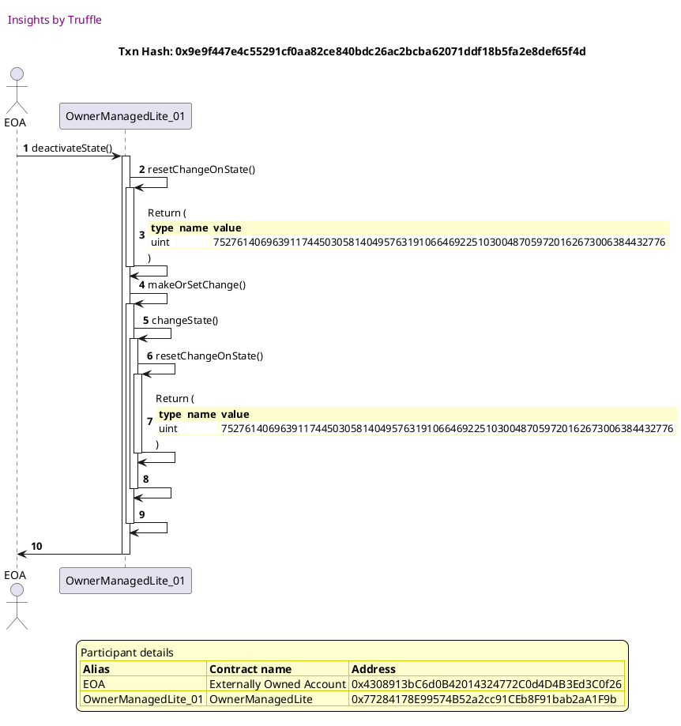

##### d5, tx: 0xb93b772ba443904b8ce94581dbe130712835f077a95fe8fb127d70c66b40bb96

[SVG :telescope:](https://www.planttext.com/api/plantuml/svg/xLLHJzim47xthx3O2uYnsObZnuXLjA4TI9kA06alI9CTksr4wdQEixNG_VTTqr21raqQs-EYoEVSdJ-Vlqk-87HQ1UL3FIqHKdMOkNgghKVLNU7cogifBktOEjDJ-TtOpsfdibavy_ZLe3_ePts4JggmB6q7uUQQM6Minm_j8yRdCr_SprnGPRSincvgNG34KTWc322uWPpNVbxQPu7hujvYohQ-IsLCuSQOajRrlR4dRziYKBl_XQkAyIHKM2_nZQz78y15eGYbnJSBXyzLDJd6PA5bh8M8j68ibeJfDBUI9IarsjAO21gbSJ8YGYYPZ6mwqZGIHf2SSys8rf8Ze2mFK7f_sCMgmdjWzn3G5egyc2iuwl2Ri_wZScfipOSYsC-4Deax_7i8DUlnKMTt71yU7kFAXYlxfIwyDKrErPr2KyB-hRj59srJNhUsitg7mt9kCLYdfetzgieQ9klq5QuBA765PmtG8omueat20Nx0v0t1xp_rBu3ftKNzjbfleTviejpO3jrrKC7k7_mfpj7HCRwoeVOE_zKfuHP993XbX4iUIqe5Omc92JIS4IOJmMCgAU6SSHb52OKGOQaWYHGHeJpY0XmyJk5bYOJWBKSleMMgxkpGNpzIi_yYaBnP-q9I_pVdbyVvnsisd_Gw1ssK55q-qGTZWohAwWblP-IC4BBc3GGJf08c6IYX1w7PCjWr1fe7iUswpghH81WNmNgdodBPQ8_1tJnV2mI4o8B599KqrXatfCU0Do2BWG1cnB0prelx9ix8AEBFWNTfsC_UPWF0IXaLQLz2nrWlYLIKvv9cVPqE9DLAHwfB1rB31i14omSwXH7-Fpy0)


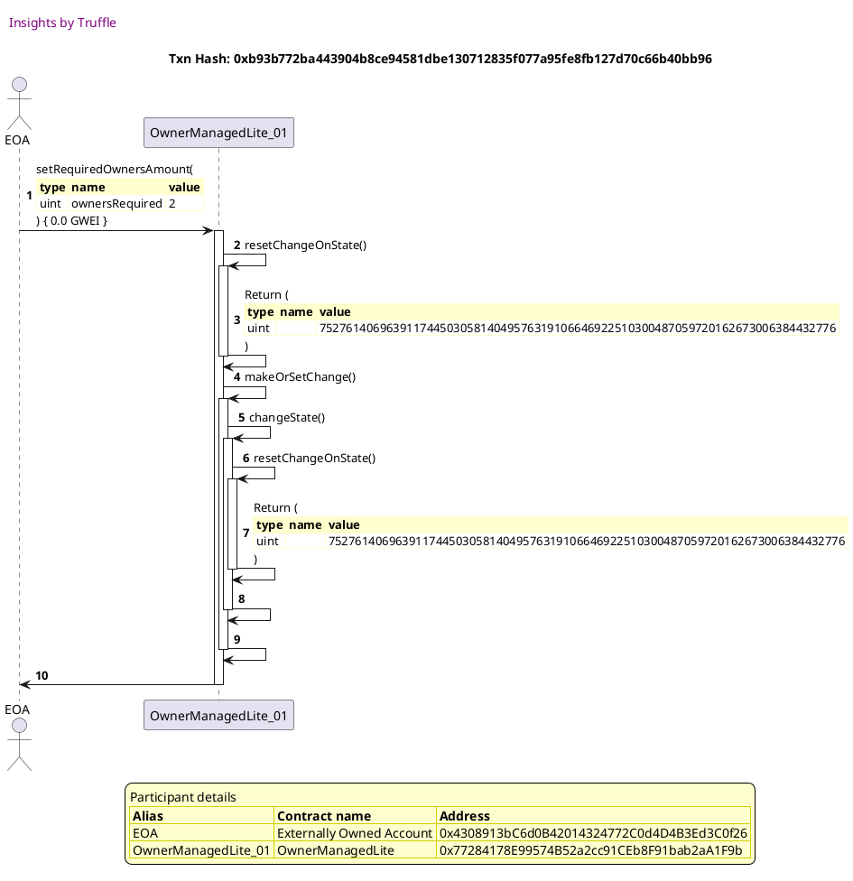

##### d6, tx: 0x6e380e23a448f4012e951cc8e80744be694e86aa898ce091286826b1ec134892

[SVG :telescope:](https://www.planttext.com/api/plantuml/svg/fLHjJzim4FxkNs6nBo36PZkEOoDMqOPq86qg0gHzGPgSvDf6f6wNE5iBxB_lceOAj0ffB8fyphqyFZzt5q9EQsyhtynAGcpZvwwPfL2H-gvm2rlP6IrX0YuVsEnkKiqRbyVpSbxHTyDacCG98IUrNvNG8xHzfc1pgEX3zqdf-RmgxkVEsx9V5XCt0-SHSUot3aCqRY0NJRKeuONXkhW7okLMTsdpl70Jobcd-jtAauzT4gGx_yBLnMJgQvgkw4tLZCU8ItpXIw0tIqVFRJqzfcof8D0CH62br6F9k00JyYpJe5aaPGhAID3AMcrq1inmePKMAkMGyK1g8mXIbdbCFHdrgQtf7iezWhJv8YiM5gyw-kMW-cgTdK3-fV3mdV7MSOT-Zv0sdXxrTjlfuU4nhS5VmO-cg21lVUh-38lYzs_TBJdfYlA-axt7JzIl5a1HEZjhvKzRDhXPkp_Ifi0K7-cy1Ng2HGNVE1pG1ye-CFhvMtA1JEzEwjLiAy1yuwbr4nYvQsyzx1_yAyxHqJ6z0jzKZlxNBV6DGX4fBfaoAZ2SOur35h1GeqgQC581Dvmf9PKH8kHeOb97B3IHO5m95Q521LhAG4IHwZXw2oqpUmUZwlg9chTnyahCfetMFcGplUJoMK_cu6rHri-8F6DdZB4raJYas9wuYN7wAcpkBQNzFCTgecqRrtji-nxNfOVAsR9SjVsUqtwMhPiIJMmf0wOD3z9OvMmWaKXaJqQHY5akp-GWIF8WPcEXNWBlcfk_jUq1YAKbZtHYi8Ho40ehiipmE4drqF3KfiBs-T2aU00oqV51Jd75VzuV)


##### d7, tx: 0x857d343f61f5816f7a3dc562918228855212575bcab8582aa1459a21414af735

[SVG :telescope:](https://www.planttext.com/api/plantuml/svg/dLJVRvim47xtNs5rBvswQhRn3wYwg0abwgHDgTO-LfeCDWILE94nNT9b__ikX4Mj5lMX2FdCtVax-Eux4BfgW_QXMpG8wIuiNRV8hKVjO-rMski5RcnbdPdeuh7ooywPTDaiFVumpQPPcY5qsOPDOqS8zzVSQcCz_ZqyOdopzFNpqWNTZ9kwSWlh0Y2MuP0mXU0USjNvLMDV1UxgPuifF_XkjJ6rgp0bW-jFRoy_3o-1XlfVNLjNyz3YV8FlVLUMW8j27HgBxzSEt-XsVe79EXRAH3mg9Ir5J6MfT6GA8Lb2OyRYM0X6cL0YBtGUYvXfJRb8DAESSbsgI22Wh0ZmwjbiZ7MBJy2U8A0jr4Mzql2fir_E-k_QwSgQRtMmFmdj4u_uJn3gp-FpqV4uFZkxm52lVjB1tWLOJZ-YuvblGdZRsf3EjQlipBqJv_py0l-meVCEdpwu1tGvwE7JO4VRBpXiLXQ3TNhHsoVTTB3PfMznLmCxMmot4an9oebCP9HGgZWN92BG3qvu8fICQ4A9b5mcZ0aA8S9ZHKIY6A6IIGKE6SMSHqmfjOT_5oqB_MXd_kuVDU_Zv8qp-zxkSj1-fD3j2w4O6tJTj2-8l2RNX90TaJ0ve1dOf30I7XHme7Hi37GJOeTpesqlHbZNmNgdcsRJYz3WSL70-Ev89siUaJYXKPvAGoOSY0Jsk58i9OPVyqcKcIWb9PElWO-9-NzlNm2mOavLd2NGGZuHJBEYI6YQvV4qeRdEcHxJQP930M1Yu0DTmGe_ehy0)


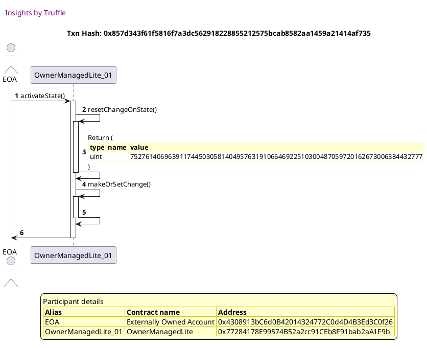


## Resets change data to remove owner operation data when timed out
[link to test...](http://github.com/thedarkjester/ConsensysAssignment/blob/4fdae3d04e4addcce97e88f438735f476fc16bb5/test/OwnerManagedLite/test_griefing_prevention.js#L69)

##### d1, tx: 0x46d517b9f29e53302affab243018898429b8ac7294fdd9cc22f55bcf0ae99715

[SVG :telescope:](https://www.planttext.com/api/plantuml/svg/RL9TQzim57tNhxYaBnjTcRuSMo4BJHo73ZPQMD-7RCcEg287MMP9r_ttAOu9AuiV9FcSgtFlFLS8tNT1-j3lB4Ao3wthTwNsg7inRY-zt87LZNPg9QkNnhUzKtbhMmytcs9Jv0L2youShLuW6Bwjbafx-3t-0ZoqthosBaYxjAPnE-r2LAp39M0JoRFallTxgzyHFyoh1i8ls9DKohW621wXFyC-_pmMWSRyNrrdcctee3p2i-_hEkgYO8BLy7nmy22xxGpmWKzLGj9Ir5JeX35CPLtBadA6IPQ9Z5DHPh9AgU2rKgAgAAsJfAngBBKGAKbGjAmAiVJYSGcoWqdS9oZQ5anbzZAs-lZBQVzTEjbezSq4_HEJ8V0AFa5ek0ztY-iytDxEe6fT5tn_olhX8xeUTn8uAztD0A7p0D7JFsKf7QIn7PgFO_nqiyPhZF7YxGl4ESKAuo6F0_2nFt1ofq_0KYclkyXTxYtUXjRZUWZQEsdjSMXPmRAgucC9aOesCvm9mifygl2AKqmuepnDQOuLN_CLAnJBSKsdxuMlMVS_EYH82qrmIQP9nZ5JJ6momKgSq2nbKrfa99KbnegAc20wCVg1xkCQd_rV)


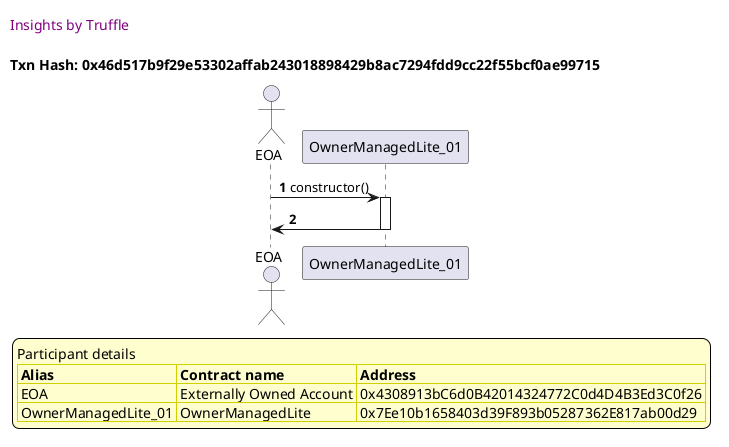

##### d2, tx: 0x673a881d9e712ac502e0b72bb9a95876813914f6b5bb86d6dce7052787cddd16

[SVG :telescope:](https://www.planttext.com/api/plantuml/svg/bLF9Rjim4BtpAmRkfKMQbfHaBOPhn8lS16YH00dGIu2256cR24qP59NQYVll7SkAuAA-L0SEEPo5xxqH8LULvyxNQqC8htrfwxLGZbHFscwuusimQgcidF3YQUdAsiffQKe7x-RvF9_cX0mhlpDgHA3vLefBvU2rFG9Sbqw_bDPpCpPwQTVAUgouy5t072-F9JUrsnZrryMzVb70eivtnwNKTWcCjgxVZHr-RXz1slutjjBBbQz0xE31rOi5rYLUUwFWOMlXcbUh0T1jd8GyJPdCLC82NlHfeAX80Y4odlNJ94vPcB5e4Ok-46aiOrceXFQ394qAAIMB2L9MU7nwVZi6Na4FROyWRLuNUiCHwkqlgzntRlbIoM_Qgv-KDO5d_3r2cdou79s_XukB0OoblFVSg_UFzf4CMnK-jdQq_m9-jr60rl9rOv-vgN5p2Dy3qkTKLS4UoaE3SNUasoYaQSP2COqbdKG1PL4OH4aIJAcCPj4ap6KufOiWVYiboj9Wegx6XTVFs06yUslq0Lw1VgBmzKT-WnATHtE0USHxEG12ZcD6xax8ayfpRQeJc3CwevGUOE8q8O-ucUAOE5IX0zo1wl96-qOWNBTUESkDsJN2I1WN1Owq_qy2JWkV4_XVRzCWoHMZWiNzDAAX3BDvceK2nobDmZZ8KvPmGQaCCco0JBHya2jSyUVy0m00)


##### d3, tx: 0x8df1e8c568de307c5831ae0f6c8cad28244c8e187c1b08504e92b17ca0bd9de3

[SVG :telescope:](https://www.planttext.com/api/plantuml/svg/xLNVQzim47xNNo6wbvQkctvPaaiNcjZ9MjX8MGjxAGpPKX9JHmcsl2Ljzh_lucIXPTbWOOypnYUTxhxJVKAV4RgiWwb2CoqHCasO-MQQkGhL3uMVcyfCSUd6pjkUoH_6rQpnDfcLimg_6lG7_QIFq4KTbgNh8Dm-4sUig_3JTehnrQmg7cS-cB9R5cC_TJu0uYZi0WQmk86SDzMyT2yMRej7XwdO-MwCjOKVOqgshk-jlNYxtGJQrh_sTJ6UX1fdItnNDQCHuA9GXDBXkuN7LwQUd6Eoq7P4dSuZgQtZHEMHvjGuCfAvperbcWcHQqUrocb6T4I4Yrb6LMv8PcD8GK1P7c3h_M4NcneVWJr2G5ieyc9keDNXD--gZyQRiRCVYk2-4De6xl4V8TJcuxFE_dLyUdgEWO3RO89h0uxl_Jsws1x5wwtjhDxXi9mx3DQRQMk_chA1mJfyjOQeN5tZ5PwjGRgxALc8WHp58gLCHKdE1oxjiL6QqfXnEuXvoWLBZE8YtK2Tu2TCtX3y_dF_6avY_wR_s0qKTY6P63zsGz_sTNpojpXdP-VuamjDvV5XV3G57DGAmwiYfYGLHCQInvGg8IB2IQJ19U98IKvZIgGKCcOieh14X5OaYXKZL3Afm26v5e8pfUIMeqDecPe7DwnkVr9pV118tkOUIEh_m_bjE_yuPtFbrp5eexJevfb-M1TCKTRFU4j9IWXPymQ22b82WmIKiW8XsZ6ukzAxlCwgrIZuBeAhl2dBPQjD5dVp75GzRAu_9pgcF4ka9Jq1l05PGYcM42jIqUDzonCoOl8by3wD-zNR5b1zHqb6PQG5uPR70ntpZ4HCAovPNrDbCa8iYw40CB7b0rt25_vFFm00)


##### d4, tx: 0x0e1d0e13dc8babefc8fdc2cea8a33277f4ef085c72ea1a8725154bf8fdaf5028

[SVG :telescope:](https://www.planttext.com/api/plantuml/svg/xLNVJzim47xtNs6n5n1Zyw_O2M8LfQG3QLCH8Eq5QN9YfqIaRkSuMmlT_xvh6YhGkabZUroK-9Axy-VpTyaNX8xhe7re9XL2kWbJrqmowr5zLxgPzdg2Apkspfpe_6xifuqpWsarzVZLC1scWnIXepeiAjj3k3rkhJRMuuVk4UEpgI_lfoxegb-LOpUnBW1Y4JO9GmYk8MUDdrNsMU2glBUOYetlGXjJkZ6cf7DzR-tHswu8rAr_xkfoV1jgd2tmjM-A0d1HA4DbyVNSuJDTtnvYCYUM6hYuoUDCPxR8uyBaBBSwrfmpfGfX2n97kM9MKnqh5j58P0LawI8YB4P0MHwWz7JKnxh6Es1t4D0MohoSQTZgw9kp_gDsUcpDXpBOpuIsYLlyEmYry_51RtiSx-yVujg6I_kbARqrRKxTdq1JmkwDkq57NLDUTxQtV8V3OcOnMASdhVsggmPkLkbBt9HGuX9FMw17M72mTS8UVi3a3S7lFwNdmFJsedvRhRTGx-1Mkx4TkQkWWztT-rESWuD3V6b3unt-grt2gIAc91L49f8db2eX8i9958DB996Id2QKI2bamg3L428YLYHA52DKCgd08NainEhTa1r7Bw5bek_io5yzKhFx8f2ydVj2KlytvvVR-STprf_qAWUjbHHTFD47OuCkg_e9RwVab12ouWq44wG2RWQWX1w4PiDWtnXe7iGsythBLeDWd0VhdQwgHQiz1lVpV2KG429pmKcSK9uDf24d0dW3ieHIR42CE1KdF3LyG0ecdmDlqx2VlUq2AhMKP5H6iI3Sy6GO9pmZ4OiLbooDgT8P8OObi00mqV61Zc64_yyF)


##### d5, tx: 0x4c7f0beb1722b5aab7c7c3a8b93c443f4f27f0849105957aadb7b150ab8135d5

[SVG :telescope:](https://www.planttext.com/api/plantuml/svg/fLHjJzim4FxkNs6nBo36PiUEdI1MKKewa3OLKQHzGPgSs4aZKgTpd8r2zzztJKC5MeKq5aK-vzvyVkwv87JQUELyEwyGKgslRJjFZKFDNMaNogavhanXh3vJsLtXwjRgKLtL3hyR9-Dab21qqlXbPGO8Ty_CA6qSVkm_CRweNVbGMw-gOLKMTcwiXuovtpgCmRX9kMZTeZ8l3DFomM3AjxehfNLf2qn9h_hToPEFVH6eF__IDcKnymrEb_Z6jNaEUP4lVMNmpRt55wgP7MDoppEPazIaL0P16YgLoancJ4Lfp3BEMSxp01mY7bCIng5KIgSofI5HQKHPg4C4a6KUIaycGwmQl0To3m5ilipAXOAhJdvPuxuggmgZlvJUV2UqSzoXtqEeYyT7WzrsV7XuZ1lZhysFjdH6TpxDS0vDyVktzXQTz4rvtyl1wXFsouN18AsQT_AdgbhOhDrNk2sXn1MkkqHFQK51Dmu7-16J3mH__fPS0jAxYtgrMcUWtj5CsS9CxDGhR_OF_ZNFqT4nlZQ-THR_rotXbM4W1UL4n8B5b4hEGy98686AGty5ez1f8RY8Wo2aO28yaj1w6H0g0Y518LW4p0Ya53r6Ru5bhkxCn4sVe7aR9g_4R6Yqza6RwKLNppYfZLTbrJm3yfoS4qBMGCAG0ZrXCuBfSq3kBQH3hQ6RODl63LOTxs6zzyPPLLNBZkyQ3xDiJKemmOmn4iMKfIEXoHa7804zBcKm8fgVypEMQ3OYUI1U9jurDtzhkmDaOYX9gGWZJfXcyJYAMKh2899C14b4fKe9qK4C1m0IFHxe55Ruv_q1)


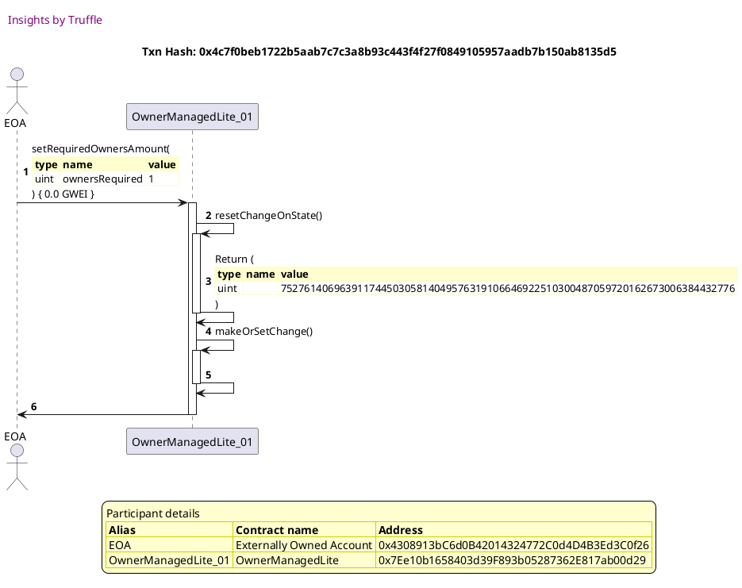

##### d6, tx: 0x1d2b47d2f0024b7c417532981f6079af4810431753ea45d5a5521bf8e0710cfa

[SVG :telescope:](https://www.planttext.com/api/plantuml/svg/dPHVQzim4C3VzIb4zzAoTJlziMMNBZInaxMmaR8Mzb8OiYKdfeuSPBbBskoxJt6yqBAmiHgZa-vE9-cdEo5qqJXfNRke49AjgqsxoBH5pNrfbjBA1QxqJ1iraldzpDQjKKbTrHQ_cOmdusICq7dZrfKU8DnzSosLjlYf7s9yMTloiJPELiEgd9c5Div7BDpUOUADkv3BrYuh_S9mKpvgJFXUTosLAiqC4-XLFpjv_g7V1EhNlp9DEPkx1cThV6lRel1naIjTfV7jok1BsSpFCAo8eXaNYXO0b6SYvqG4ZCOHAK8GiInuH82phL9B7gX01W4bMH5f40JoGYAFB7T-w-Ff4Ci67tbvX3msL-RbKlgZJdyORRz88sTQVIwT_WwaSpoWFqAecuzF1uVj-EtRCspredxGDquwtVaStvaxTDxVnhjU3ZOViLilDVRIo4Kd7sJL-ixMVOCzHgkR1czmlGqot0zXnITX4VEKK14aEPleT4IBD2KnPMeIivHncaZ1UBeBTOAVCBm7_EdR-CfVnk5z_-D0ZNR9N9gPdfhkNCSd_nldzFGCVzMkjGQ_ZaTR-hlQOF-BW8gGS0ZZaCM42Cu3O114NiNZG8ICn0J2a8SnfG7n9k2HW20M54X8G-4L8OiuPrG8qJDw3PQ5lDTJU_CRpUkO_6NEBjEsFcXNuEZwMTegxMHPDSz0ff02m1QahsEVmRwJ-0ArFl_tIFTfj9yts7IbuTkLqzR8gbft9Q7mCC_zO-9sASSWYWdBab31Y7kGdXuNWYQWUCf7RAnO0WKDNmO-L5f_Qhi5n5WJo4WOH1oOOl4aYba60Oq42-au8a9c08h6VW5FekU1BdphdyLV)


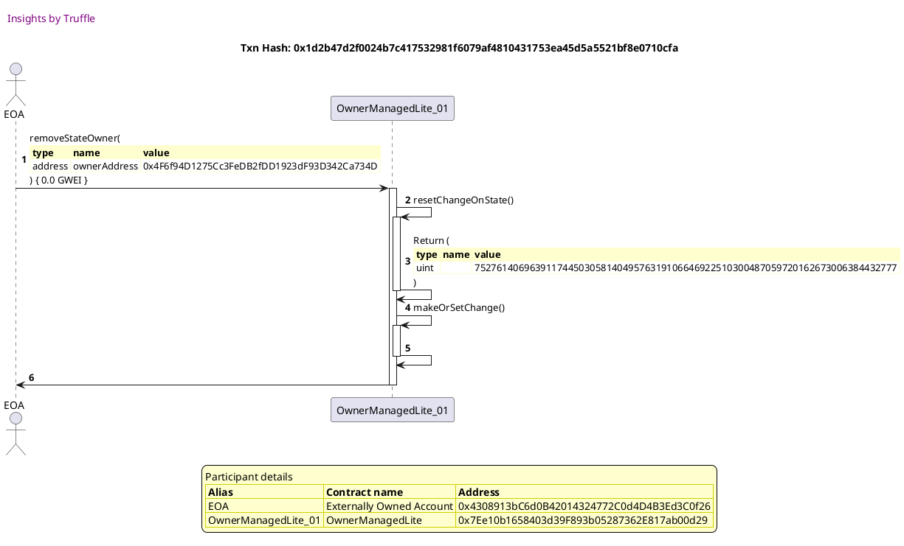


## Resets change data to add owner operation data when timed out
[link to test...](http://github.com/thedarkjester/ConsensysAssignment/blob/4fdae3d04e4addcce97e88f438735f476fc16bb5/test/OwnerManagedLite/test_griefing_prevention.js#L91)

##### d1, tx: 0x37d45492279ab90aba4ef546943c5dbccf59903eadfaf8845c63167d2e58cf80

[SVG :telescope:](https://www.planttext.com/api/plantuml/svg/RL9TRziW57tdLw3qPLDN3MDiGvH5THn7dRIfbTRt2VFXe18SOQmbNVVVHnmhMhNu0V0vbtFlFHS0xll0VHXs5W0-XCuDkqPvqByOj-UUxw1LhN9onSLBwxl1oQgpdOStctfJLpK0YpuShLe2E7vRnQNoyFVq2-53vyrhvmAtfJMjsoaNeg8Ebu1D9C-I-y7lhNf7_32l2YRaWZrnAOrhOO8cwC-uBpvFHO0f_rVNctORUjWSuRCVj8ww89XW5Nm-EFZ0--qSeaDQI98HXd71UCCGRpXHEYCv8wd8P2E4pXX3QTJKN5DACf6dILv8h38gD4KWMYP2BBr-B27luIpkCn1j2qQOFO-jFlvood_dZhTAVZD1_KJ967W5dm4mteTto-iylBsTGz6vFlZXbFN3Ht0zxYHmLhgRGm3E0mHF_vGbLU36zc0nZV7JpHgj4KBBjoympYbM60zL782F_K77T-e4b59wrKVkSc_vDhOUrqDGtd5hZsFB4fP2nCSI8eKE94MK9MbJvHAj24O9IJ4f2bmXITPabTOohP36-NlXQzRzZuu9LWAL1SqPmummKGXAiIYrsb2IbZdb6Ei4SufHJ12TcFm0zt6Dp_ul)


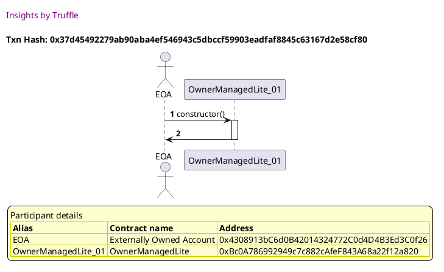

##### d2, tx: 0x54402f6a386583f3ce3d5bf140bf8432636fab56d077e90e0ea0ee2d767ee78a

[SVG :telescope:](https://www.planttext.com/api/plantuml/svg/bLF9Rjim4BtpAmRkfKMQbbeioOPhHDwQ02qI805w2L1GuiWcGbC6HQLsulvxnx8YkAWlrO533cVXUs_4s5NbX7NrMZCcQbUQUfsXPTMJCXjXnHeqBj78YSYVbhQiZPoMkhJmRZ5VpATpnaQLssaSCsY-5Gg95bxR8y1rQTLBQPpGgLPBiqRZg6BXke05NHvBRcgxqVZNnRrwGV32pdSdf5Hc2HvlNRyRE_hSFeAr_MzCfPOhLq6sWmTR5mNLPKuvZV2mDN0jgjKG-BOVXjml8X4aKJy9YY37GFQpmWjvLYHXu4T1L8Yi7qaUnpZWo55mH5_6KOmO9u8HPRcZfyzlKn0LzCZs6D7cLAusWg3U_Z9elmiZbYY_AOS_kTS4dl7t66louN9y_XukBeQGIddlXCFtZ-QHZLeLFhPslFy2RhT186l4kh7FGjUqEOJlWUYpM5MmX_BG8EsEV1i6F1buGJObj9FGvnxX3-FOdt8Ppi99C9V1b1T-z5OgAqjDYQfASwUUgGCu-zRe0xm2_yJXwu_v3Kbq7iq1vX7lvH0OEuuPkpiXJw8JIbSdC6TynZa_mAHf8XvfCwKniQH21xW3rUMDzur0j6uTMYEqtZN2I4Zpd4RQ_IS1fuNF2VoljsamoNaQ9z5Wu0_2GHxdIUBdQO4BchGqIeJl5vul4fzJ0sAYvODTqKe_vny0)


```plantuml


@startuml

autonumber
skinparam legendBackgroundColor #FEFECE

<style>
      header {
        HorizontalAlignment left
        FontColor purple
        FontSize 14
        Padding 10
      }
    </style>

header Insights by Truffle

title Txn Hash: 0x54402f6a386583f3ce3d5bf140bf8432636fab56d077e90e0ea0ee2d767ee78a


actor EOA as "EOA"
participant OwnerManagedLite_01 as "OwnerManagedLite_01"

"EOA" -> "OwnerManagedLite_01" ++: AddState(\n\
<#FEFECE,#FEFECE>|= type |= name |= value |\n\
| address | ownerAddress | 0x4308913bC6d0B42014324772C0d4D4B3Ed3C0f26 |\n\
| bool | isActive | true |\n\
) { 0.0 GWEI }
"OwnerManagedLite_01" -> "EOA" --: 

legend
Participant details
<#FEFECE,#D0D000>|= Alias |= Contract name |= Address |
<#FEFECE>| EOA | Externally Owned Account | 0x4308913bC6d0B42014324772C0d4D4B3Ed3C0f26 |
<#FEFECE>| OwnerManagedLite_01 | OwnerManagedLite | 0xBc0A786992949c7c882cAfeF843A68a22f12a820 |
endlegend

@enduml
```

##### d3, tx: 0x83d44648ae6e3bb2ad2e8168de8eb3b81c8b94d59780d30ce3c17524c42eb439

[SVG :telescope:](https://www.planttext.com/api/plantuml/svg/xLLTRzCm57tthx36owOny5STUnhLsgHbaq2Ts2HU9Y4dTjjegLib3hHR-U_Sfg7QH46Yuf4eyhNllJwspurF4BgiWYb3FIiGCdMO-tgMkX9L3xbVcDBCSE4cpjk-oHucvRpsDfuNynA_6Ww6WtY0q4KLLeNh8jmyKsUiA_5JEyJuQbxcZtCVJD4hyecVEHy0SHns2KC8RY4NTRaet8l0RVxeC1KxtusnDlSJJ4dh-jxOYxVj9b2x_hMlyiaqL3XTuRko7ey15uKy50xVBJs-CjNq79EbubO8APHnql4qPSOofwXKrYcNybJHJALQs8wE5B6SP8vdDEemaGdcKi4r0igo05iVZ7hOLFW8x142saAUvGi3HnrzywxyQBoPEFiX3-uBeKtY7lyHGiryVDRT7yUdf-SO2BWD9hWcuVZUtwEBjXIlMzjTlyDXjN0Oh3UpndurHGsTJVfw0r6wgi9hFD-0z7P3iXH3ETOYeIpgn1aVkgJFnab2DUDsg7d21OjDn4MoXJh1JvYy8VZzvy4rL6B_flzu6bZOXNXg_CIDV7EkuvE_nJaxEyUVNAXBZm_ZeywXK6iCBzGsabGGgINNb4P2T0Wd7GKkeJkHv5HJ8gMGch4EXH0HAYBmUJ129PCHE2HNGd0MHRBbw11QPkR1ZShRdzGS7mIIDNCF9FL_SNvxd7yyPtlbDpbegxJevfb-M1TCNbJFU4j8GWZPy0Q22b82dHYKiWGXsZ6ukzAxUTrrer7GBeChlIcALQDD5lUo35GzRAy_9qfJdiRIahu0te0i4KKi9bOaeiy7biTapEHBu7qQzwktMQ2VaLwafDPC2vr5cL8iwutTK0dUayemDgRCA4PW0M2YvGDTGWl_fny0)


```plantuml


@startuml

autonumber
skinparam legendBackgroundColor #FEFECE

<style>
      header {
        HorizontalAlignment left
        FontColor purple
        FontSize 14
        Padding 10
      }
    </style>

header Insights by Truffle

title Txn Hash: 0x83d44648ae6e3bb2ad2e8168de8eb3b81c8b94d59780d30ce3c17524c42eb439


actor EOA as "EOA"
participant OwnerManagedLite_01 as "OwnerManagedLite_01"

"EOA" -> "OwnerManagedLite_01" ++: addStateOwner(\n\
<#FEFECE,#FEFECE>|= type |= name |= value |\n\
| address | ownerAddress | 0x4F6f94D1275Cc3FeDB2fDD1923dF93D342Ca734D |\n\
) { 0.0 GWEI }
"OwnerManagedLite_01" -> "OwnerManagedLite_01" ++: resetChangeOnState()
"OwnerManagedLite_01" -> "OwnerManagedLite_01" --: Return (\n\
<#FEFECE,#FEFECE>|= type |= name |= value |\n\
| uint |  | 75276140696391174450305814049576319106646922510300487059720162673006384432776 |\n\
)
"OwnerManagedLite_01" -> "OwnerManagedLite_01" ++: makeOrSetChange()
"OwnerManagedLite_01" -> "OwnerManagedLite_01" ++: changeState()
"OwnerManagedLite_01" -> "OwnerManagedLite_01" ++: resetChangeOnState()
"OwnerManagedLite_01" -> "OwnerManagedLite_01" --: Return (\n\
<#FEFECE,#FEFECE>|= type |= name |= value |\n\
| uint |  | 75276140696391174450305814049576319106646922510300487059720162673006384432776 |\n\
)
"OwnerManagedLite_01" -> "OwnerManagedLite_01" --: 
"OwnerManagedLite_01" -> "OwnerManagedLite_01" --: 
"OwnerManagedLite_01" -> "EOA" --: 

legend
Participant details
<#FEFECE,#D0D000>|= Alias |= Contract name |= Address |
<#FEFECE>| EOA | Externally Owned Account | 0x4308913bC6d0B42014324772C0d4D4B3Ed3C0f26 |
<#FEFECE>| OwnerManagedLite_01 | OwnerManagedLite | 0xBc0A786992949c7c882cAfeF843A68a22f12a820 |
endlegend

@enduml
```

##### d4, tx: 0xc0e305d3d720920876a319529f85dbe185f51525c35289cc41b9a63f143ed523

[SVG :telescope:](https://www.planttext.com/api/plantuml/svg/xLNVJzim47xtNs6n5n1ZywyuCM8LQMa7qgOYGDeBqkJ6JXkHkftZR2rq__kkQQX0woQDxN5Hb7Fkpf_FtpbV43gjWlQXdfO8wJhCN3qTMO-gkyBDjTTJNDgnTQQhixkndzNEz6RbpEDNW_wWt-iZT5A5PMax23VNn6fZFNveNp4-d_dYVkQ2BjEo6BkfTG4Gyx1D641m0pcl_RoqpmBNnRt5L6nzbzgOmeqn9QthUsDFthP5e7Rz2rSLuqcey6Y9RtoTvu2BGX5AYsyM3f_hQdACoI8ZbfF8S1CpeXX9OgavLH5JUHAPaQL9b4SqOb768vQeB1DqfBJaEHNSceXn19Hb0Khl3rEiAxm7TWy1RQ78Yhc6hGw_EUi_QgV7rdmeWlrCQ9Eumx-7K3CV7tLsn_7XuJ6kRBYoN-h2MzFaLEaKcXBsRzqjEccRyhgrdTKx79PpYy4wFMtiLrtMC5Ydht1TG8ahF6k07c71mJO91_W1apS4l__Klm2cTnVrssgzXNfx4-t6TkYkWmvs_-1FSOwEZl6L3RLt-Azs2NSSiLXIGQIIN54Q2n4HE009k8IAOWdDfqHA8HLZ4OKG4KbC8WN7WqecOt18dWZ1MHpBbgENq3BLTtRehn-fsNyHIDRCVI6f_vlpo-tyupcRJtgTWpPAYYwVw8EnGHTbzOItCt9625dp1e89KW637YYX1w7PCfWQ0ys3s7PUPzLe43mNmNgdotBPQ8_1QPQj1G92P24uIHJbevuqf2k0Do1Bn37h4IFEH9Vt3U-HdCddmBiqx6Tliq0t8scSIAMO4YgBioHXMPhRGI9uAXFDM4wPJXY11O29bWzq2a_u__m0)


```plantuml


@startuml

autonumber
skinparam legendBackgroundColor #FEFECE

<style>
      header {
        HorizontalAlignment left
        FontColor purple
        FontSize 14
        Padding 10
      }
    </style>

header Insights by Truffle

title Txn Hash: 0xc0e305d3d720920876a319529f85dbe185f51525c35289cc41b9a63f143ed523


actor EOA as "EOA"
participant OwnerManagedLite_01 as "OwnerManagedLite_01"

"EOA" -> "OwnerManagedLite_01" ++: setRequiredOwnersAmount(\n\
<#FEFECE,#FEFECE>|= type |= name |= value |\n\
| uint | ownersRequired | 2 |\n\
) { 0.0 GWEI }
"OwnerManagedLite_01" -> "OwnerManagedLite_01" ++: resetChangeOnState()
"OwnerManagedLite_01" -> "OwnerManagedLite_01" --: Return (\n\
<#FEFECE,#FEFECE>|= type |= name |= value |\n\
| uint |  | 75276140696391174450305814049576319106646922510300487059720162673006384432776 |\n\
)
"OwnerManagedLite_01" -> "OwnerManagedLite_01" ++: makeOrSetChange()
"OwnerManagedLite_01" -> "OwnerManagedLite_01" ++: changeState()
"OwnerManagedLite_01" -> "OwnerManagedLite_01" ++: resetChangeOnState()
"OwnerManagedLite_01" -> "OwnerManagedLite_01" --: Return (\n\
<#FEFECE,#FEFECE>|= type |= name |= value |\n\
| uint |  | 75276140696391174450305814049576319106646922510300487059720162673006384432776 |\n\
)
"OwnerManagedLite_01" -> "OwnerManagedLite_01" --: 
"OwnerManagedLite_01" -> "OwnerManagedLite_01" --: 
"OwnerManagedLite_01" -> "EOA" --: 

legend
Participant details
<#FEFECE,#D0D000>|= Alias |= Contract name |= Address |
<#FEFECE>| EOA | Externally Owned Account | 0x4308913bC6d0B42014324772C0d4D4B3Ed3C0f26 |
<#FEFECE>| OwnerManagedLite_01 | OwnerManagedLite | 0xBc0A786992949c7c882cAfeF843A68a22f12a820 |
endlegend

@enduml
```

##### d5, tx: 0x0523a1dbabb2fda6ec5705e34de9897d682f36b1226dadc5696224e2277b30a9

[SVG :telescope:](https://www.planttext.com/api/plantuml/svg/fLHjJzim4FxkNs6nBo36PZkEao1MaPPs86qg0gHzGPgS-D96f6xdE5iBxB_lceOAj0ffB8fyphtv_Dnp8UIqzjhvPbOHeXi_jyqi0qVgkz8kjDCpMi44hEdh_6xYveqrWtarT_JTQ3WQ3eQ4dDH-LK6FqFQPWZRWw4FtIUdvt9NtS-jrbLRbnCx0UinO-At328sRb8l6BIfuORWkxu5okTLTQcDAEw6STQhVhJpvs1L1klClR5rEfhwcsOhUkAOeC2_nfQ-0tYmjFTVrz9Yo9Gj5eBd9T9Q9mcW5UHYn409f88cJoAXO587Ak13AQ9E7Ab52I10YYhA0wOGWPBd7qeVZbEgQxg7S8mYRB_DoeV6guryMt5TjzGJCbzB3TyPRnntwFKBQU7hKsssdXuV7j0P_1J-Qqe5fVUfqXatn-xVsbfnqJNdVoTxZ9-fN2w0ehPwrygUk6joitHzfKsA9ZtJU9dfAYmg-SJYW3vHzOFJpj-458hsxg5UhTO3r3gRQJc1ihxtsi7_mhtcEZexf5VZ6MVfVjyGt2aMak6JOno3XF98oP04BOrJ998nKm1FEb98g4IBaQ68oHa8aaM1S2HMXGWMnb04IG7KOlGMMcRw3iRj-WkPjcBmIiw7HseTiffTSFkEa0Q_Bgdu6v1axOuojWSGXHNhYPe3Jvv3SMqXJOx2RQDl6zHvRtkEwzE2ihgfLotT3qpnVan9DR2a35YSyo0RAiBv4814z6KLYm8mya_rWQ881AuHwcNZNtFojRG_evooDOfKa8f597kLnBFAqW54iWrJ5MeY22nqBXWSW4XqUv1HN_EVz0G00)


```plantuml


@startuml

autonumber
skinparam legendBackgroundColor #FEFECE

<style>
      header {
        HorizontalAlignment left
        FontColor purple
        FontSize 14
        Padding 10
      }
    </style>

header Insights by Truffle

title Txn Hash: 0x0523a1dbabb2fda6ec5705e34de9897d682f36b1226dadc5696224e2277b30a9


actor EOA as "EOA"
participant OwnerManagedLite_01 as "OwnerManagedLite_01"

"EOA" -> "OwnerManagedLite_01" ++: setRequiredOwnersAmount(\n\
<#FEFECE,#FEFECE>|= type |= name |= value |\n\
| uint | ownersRequired | 1 |\n\
) { 0.0 GWEI }
"OwnerManagedLite_01" -> "OwnerManagedLite_01" ++: resetChangeOnState()
"OwnerManagedLite_01" -> "OwnerManagedLite_01" --: Return (\n\
<#FEFECE,#FEFECE>|= type |= name |= value |\n\
| uint |  | 75276140696391174450305814049576319106646922510300487059720162673006384432776 |\n\
)
"OwnerManagedLite_01" -> "OwnerManagedLite_01" ++: makeOrSetChange()
"OwnerManagedLite_01" -> "OwnerManagedLite_01" --: 
"OwnerManagedLite_01" -> "EOA" --: 

legend
Participant details
<#FEFECE,#D0D000>|= Alias |= Contract name |= Address |
<#FEFECE>| EOA | Externally Owned Account | 0x4308913bC6d0B42014324772C0d4D4B3Ed3C0f26 |
<#FEFECE>| OwnerManagedLite_01 | OwnerManagedLite | 0xBc0A786992949c7c882cAfeF843A68a22f12a820 |
endlegend

@enduml
```

##### d6, tx: 0x750bf1ca8db649e35cee0e7c6f4ba3f1529aee1aa312251f601aa4a041826861

[SVG :telescope:](https://www.planttext.com/api/plantuml/svg/dLHTQzim57tNhn3TIqlNJL-MvDA5Eewp5ZPIri9U2aEsvSJKKO8jRqcR_VVTE5veMIYinkXAzruTIKVd2g7BnflQj_CA8TFwXMldgQrHyr2wfQdD75TsQbq-DDd3j5wqBeyNrQB6xyR9E8aJX2uQlwxi0E7kcrcJsne_zKEChnPr-RXmtbHHLKxTt3eFY8NV9umXk8DSjlMoiYy2j-MZnLJiVJScpqitnPJqhj-TlVZORmBrwr-xffpEV8FJDRwhsw80NEHBNrbyjtBuoZIpSqnMAY1fGJEZyrIAqF8WivPObSb2f8OND62XiPOQmobZ0IqaWRumH53Df9OK0MMPXwqdamYR1X-1FK90co-pScdWg9DVpjPVZJDJctyflVr1Q9Tum7-4K3SVdmqEn_7fwJa60cwzyRPBEBvtz-YYluhtlHriFc6_NbeCrfbvPt-QgeNEDdspXQXjq-0DNcn1elsGhBA0PopHYhEKSJuIckU49Z8XN16TH9dM95RHKEoWJl0J9Xy8_lmzkOQREBpfLqy32riVpuoRsedhpdLyyhyuPsVd-9lrRUtms_XeIxYe3OPV1Kn9AeWC9GyfLK84X9D0Wqk4WPASXfH8AMIubGE4YD2A1A5YX4ec5JWarq9mffJgENeBBNFpO2VrxLzgtiR9AtDsCjlce5rrevjdcisjDsNLF2DoH4Q4a2sHKCGWN-Z4K9qrY7zFwLv6-tc3JLSNqAwyhPsfgdLN3pcEiWnU4jz9Jd2YGyhJMEPaA818O4yenMAIYv4OyYJdCIcOV0bygAx-zNOB33CIAIt3a8KYp1Hec6LHOSTQy4XgmrX1cT6Cm0B0HCy7keGMtiG_)


```plantuml


@startuml

autonumber
skinparam legendBackgroundColor #FEFECE

<style>
      header {
        HorizontalAlignment left
        FontColor purple
        FontSize 14
        Padding 10
      }
    </style>

header Insights by Truffle

title Txn Hash: 0x750bf1ca8db649e35cee0e7c6f4ba3f1529aee1aa312251f601aa4a041826861


actor EOA as "EOA"
participant OwnerManagedLite_01 as "OwnerManagedLite_01"

"EOA" -> "OwnerManagedLite_01" ++: addStateOwner(\n\
<#FEFECE,#FEFECE>|= type |= name |= value |\n\
| address | ownerAddress | 0xc53c2E8732b233D483d01E6E03708EAc880C7AB4 |\n\
) { 0.0 GWEI }
"OwnerManagedLite_01" -> "OwnerManagedLite_01" ++: resetChangeOnState()
"OwnerManagedLite_01" -> "OwnerManagedLite_01" --: Return (\n\
<#FEFECE,#FEFECE>|= type |= name |= value |\n\
| uint |  | 75276140696391174450305814049576319106646922510300487059720162673006384432777 |\n\
)
"OwnerManagedLite_01" -> "OwnerManagedLite_01" ++: makeOrSetChange()
"OwnerManagedLite_01" -> "OwnerManagedLite_01" --: 
"OwnerManagedLite_01" -> "EOA" --: 

legend
Participant details
<#FEFECE,#D0D000>|= Alias |= Contract name |= Address |
<#FEFECE>| EOA | Externally Owned Account | 0x4308913bC6d0B42014324772C0d4D4B3Ed3C0f26 |
<#FEFECE>| OwnerManagedLite_01 | OwnerManagedLite | 0xBc0A786992949c7c882cAfeF843A68a22f12a820 |
endlegend

@enduml
```


## Resets change data to owner required operation data when timed out
[link to test...](http://github.com/thedarkjester/ConsensysAssignment/blob/4fdae3d04e4addcce97e88f438735f476fc16bb5/test/OwnerManagedLite/test_griefing_prevention.js#L112)

##### d1, tx: 0xab9d103e7179a08cb2a2c0649cc017432649346a315161c95d835a3f556e9879

[SVG :telescope:](https://www.planttext.com/api/plantuml/svg/RL9TRziW57tdLw3qPLDN3Gp-8CgYnawYJjhKIklxX84ug0H766j9r_tttJXMj6hn0-1pBkVUUou8tNTHXjZl74AoZwtlTxK9g7knVY-3t65d6kDrATLB4zhUwwfrRS0twzLwLQqGcdNnwCmSuU7R6gbDmB_7NumVsc1VMn-bMpZR-9tn4HGtyHAm1l8ikU_3tfbtn0_xQZ3b5-n9QcrzWoaPeJ_3Fliy5e76_5zzPvjjx71znC-Xtsn05qKRdS7F1uyVPBUTOdAGjT2KC9FJN4XIg3gHYI8P5qeHcdEMm97nJ3AQqemgaUg2fP9jqZGpeiW50ijKXD9NZmiiEpo1VOB0jcYLtKjezV6ND-6xzB8n-fkDvYUXG-0LV8BGS1_VpQ_p-FPsYbNhknZwKzOF7z7rk9F0MUbkYX4w3n0z_LEMDb5Qrw7PECPFDqko98JCtxvWc1DK28SA1X2WF-pbpfo0XTR1TC1TxitVXjPXFKGJl7JkEBIiyK8fU2mHA7BWZ1I2ihhAD2bvGYWuo_CygOZcIrwobMOLsIJPU-5hrlsF3Wb8MggaBl9C58IfZ8cSoR8gJR4aGeY26vudMK88900dHZ_GFQpmxFy2)


```plantuml


@startuml

autonumber
skinparam legendBackgroundColor #FEFECE

<style>
      header {
        HorizontalAlignment left
        FontColor purple
        FontSize 14
        Padding 10
      }
    </style>

header Insights by Truffle

title Txn Hash: 0xab9d103e7179a08cb2a2c0649cc017432649346a315161c95d835a3f556e9879


actor EOA as "EOA"
participant OwnerManagedLite_01 as "OwnerManagedLite_01"

"EOA" -> "OwnerManagedLite_01" ++: constructor()
"OwnerManagedLite_01" -> "EOA" --: 

legend
Participant details
<#FEFECE,#D0D000>|= Alias |= Contract name |= Address |
<#FEFECE>| EOA | Externally Owned Account | 0x4308913bC6d0B42014324772C0d4D4B3Ed3C0f26 |
<#FEFECE>| OwnerManagedLite_01 | OwnerManagedLite | 0x05Bc2b8769803c63973aBCBe8D099984e4726200 |
endlegend

@enduml
```

##### d2, tx: 0xa37301a896421832bb498f9d4d985fceaf1d60c589bf6b912e590f5c07086192

[SVG :telescope:](https://www.planttext.com/api/plantuml/svg/bLFBRjim4BppAnRffKMQTlMm91gk4Lkscm0j4Y01UWbGK2Bb4A4fWw9IEt7_lMj5CLBKb-h09PVxuCoi63jll72-NHd6HEjhswuAvLZpeErQEB42evRAogae7vQkRgtCQrCxUBUOB-RvdB5HuxT6ZHbqtxqIKZbuxey05xNJJxNrmaoCNjgLifugLluGiA3BbvBhrgsD-klYHZyf2EA3xrf8gUqI0knTlpix-jm_WlNzBssZb_U-WM8BjwwjAghBlFP6mUt6meLexeU06n6b4GOYuqaS1baK5aNCiuhBMF9iK9LAL85Ci1nalAYIWWUX6d2i1YMcc2K13nbHLdfw-lng0gA14x8dZ6ZpkjHhGL2lVbdblWihbaf-qrxznA0BFE8_OQpBXxFnyNiuFHt2HCeRBxnwVsVlsAXNuMDlnxiluBTh1MIjM7NsKPYMDllm7H1zJZKDxA3UDvWSZhY98ynu41Lv8d4QXnZ4KHYdQPYZZ6VnD9hBACSgJ5vB5NLjA54tazBhH-e0thqs-W3FW9yGllwONv94nz7iORxWFHi2OozZngxVa2UL5zeqRs3ES8Q8UvWqJSGZRN8Q4qSg700VG1tonhjE85etNZahZDbsmaYOb2MDjFzF0juMFYRmlzwk0GwcPLXaQS8pZCeaucaaflbKPJFad6UnYjCm2H6f0J7Hyy7EQQMVymy0)


```plantuml


@startuml

autonumber
skinparam legendBackgroundColor #FEFECE

<style>
      header {
        HorizontalAlignment left
        FontColor purple
        FontSize 14
        Padding 10
      }
    </style>

header Insights by Truffle

title Txn Hash: 0xa37301a896421832bb498f9d4d985fceaf1d60c589bf6b912e590f5c07086192


actor EOA as "EOA"
participant OwnerManagedLite_01 as "OwnerManagedLite_01"

"EOA" -> "OwnerManagedLite_01" ++: AddState(\n\
<#FEFECE,#FEFECE>|= type |= name |= value |\n\
| address | ownerAddress | 0x4308913bC6d0B42014324772C0d4D4B3Ed3C0f26 |\n\
| bool | isActive | true |\n\
) { 0.0 GWEI }
"OwnerManagedLite_01" -> "EOA" --: 

legend
Participant details
<#FEFECE,#D0D000>|= Alias |= Contract name |= Address |
<#FEFECE>| EOA | Externally Owned Account | 0x4308913bC6d0B42014324772C0d4D4B3Ed3C0f26 |
<#FEFECE>| OwnerManagedLite_01 | OwnerManagedLite | 0x05Bc2b8769803c63973aBCBe8D099984e4726200 |
endlegend

@enduml
```

##### d3, tx: 0xd9baacbe2ef205edfea8dffad4311e1f9e5200c89ae916dfe9506d0a66135666

[SVG :telescope:](https://www.planttext.com/api/plantuml/svg/xLLTQzim57tNhn3TIqlNJL-MhDA59dQo5ZPIri9U2aEnvCJKKO8jRqcR_VVTE5beMJPOsEECyPNknv5qBZf6wB8EfWhDj4J8D67cc-d8LQX-AFpSL6QAIpTstlPCzZ2kPestoQoSLVZLe3_e9ts4BkgmB5q7uVQPE6DTXP-sKuolPbNnEFF1bDso6Fkfym4Gyx1B641m0pblgddfNWHkYqU7gTZvReorXHzZIhQkxwszUBlT1DgkV-thOZm9DHujyLtLv3dWeb24qk6xXSTNffwSOxAmUcHCDdBCvOn4pkREn3RFZHMSKaTpxI96I1PhupIL4DOHaPOOAIcFf9G8ACi2RBq_x69JuoEmHmXe2qLMp0qSTVZDk-gZyMRix8SYk2-4jebx_4S8jVNuhBC_ZazFpp4GS1jCS6t2yRs_HnVRLhpUsixg7GxBkSDWlPcszgif6nYiqrThYChLDLxXsHgakvkIXHZ8N8kKCXKb6H-ujCVoDAMQSJlGFEM29KPnaMwWJl0J9cy8Vl-vVmsTsB_fFvu65dOXcHW_TaFVdkluv6znpixEyISNcihZm_Xe2cZK2iEh8gOa5KHgoJMbIeY8S1B5u18wKf9JJOcKGch68WeX8c958gqOeP991Gx9Oo4uKqfkEJg4bgbvSCFgzYSrnmU1P6tjWQJ-RyvlZ_EFQpPNVfs3DagBRfxfXtN156NzZBUKf8IGDMyWg20bC4X0AIiGeXs3kokzg-kiMes2xoAuofkoNBRQP74toq3Lm-RwSn9hoaS9Y5nF06z0bb2A9SIALFHut_A4v4o-1DwdSRzwsmL8rClOA5PInuHdq4V5JI_fkJWbMkjOEA6O1Cc51O29BH_e4hxmV_e1)


```plantuml


@startuml

autonumber
skinparam legendBackgroundColor #FEFECE

<style>
      header {
        HorizontalAlignment left
        FontColor purple
        FontSize 14
        Padding 10
      }
    </style>

header Insights by Truffle

title Txn Hash: 0xd9baacbe2ef205edfea8dffad4311e1f9e5200c89ae916dfe9506d0a66135666


actor EOA as "EOA"
participant OwnerManagedLite_01 as "OwnerManagedLite_01"

"EOA" -> "OwnerManagedLite_01" ++: addStateOwner(\n\
<#FEFECE,#FEFECE>|= type |= name |= value |\n\
| address | ownerAddress | 0x4F6f94D1275Cc3FeDB2fDD1923dF93D342Ca734D |\n\
) { 0.0 GWEI }
"OwnerManagedLite_01" -> "OwnerManagedLite_01" ++: resetChangeOnState()
"OwnerManagedLite_01" -> "OwnerManagedLite_01" --: Return (\n\
<#FEFECE,#FEFECE>|= type |= name |= value |\n\
| uint |  | 75276140696391174450305814049576319106646922510300487059720162673006384432776 |\n\
)
"OwnerManagedLite_01" -> "OwnerManagedLite_01" ++: makeOrSetChange()
"OwnerManagedLite_01" -> "OwnerManagedLite_01" ++: changeState()
"OwnerManagedLite_01" -> "OwnerManagedLite_01" ++: resetChangeOnState()
"OwnerManagedLite_01" -> "OwnerManagedLite_01" --: Return (\n\
<#FEFECE,#FEFECE>|= type |= name |= value |\n\
| uint |  | 75276140696391174450305814049576319106646922510300487059720162673006384432776 |\n\
)
"OwnerManagedLite_01" -> "OwnerManagedLite_01" --: 
"OwnerManagedLite_01" -> "OwnerManagedLite_01" --: 
"OwnerManagedLite_01" -> "EOA" --: 

legend
Participant details
<#FEFECE,#D0D000>|= Alias |= Contract name |= Address |
<#FEFECE>| EOA | Externally Owned Account | 0x4308913bC6d0B42014324772C0d4D4B3Ed3C0f26 |
<#FEFECE>| OwnerManagedLite_01 | OwnerManagedLite | 0x05Bc2b8769803c63973aBCBe8D099984e4726200 |
endlegend

@enduml
```

##### d4, tx: 0x90a2b3cb8bf578888f3511f37ea9bc0a4fd0acf054b4a07a0b484608fd4313e4

[SVG :telescope:](https://www.planttext.com/api/plantuml/svg/xLNVJzim47xtNs6n5n1ZkyIEdI1MqLyCf4r5WBGNfCc9dJOYTJl7sLhe_lTTqr21raqQs-EioEVSdJ-VlrE-479QUULyFIq9KRMVsNgQ6aUgkyBEbLDJMfgniRgdihknczLMzsVbpD5NPyEpONz8o4dbbwNf4DgCYL7QEFhGlb9wFdF5_SnwLNRBOcodndf4pFqsuGo36yXvxUQbUHQuBkuD3VZMTwcqBkoO1j2wlZVsv6rR16dFlx1LCPxuYgPBUkFgF4TSuWjV6dgpiFHSLPDZ2ei4L9YoB8tJF98nZfn5GP0pQLIIPg1uha5bEKGyvGgaWfJ7N42SQyu2PZX1oZAFfGz7NQegkeTsZo1jliYAkSAhZhvPupuggyP6VoYy-Gn1axZ3lqT8ivyUTNR7wU7XCQsClp9Vwi8PtUHKtIasnU_VsbjoqZRbTMixgtVKB-U6ehLgsjYlggnniKvVqRh04bTqrW0zmg8Zt2GSq0SARu2-_pIyGAPt5_NRQft1UliJPSTcPA-zycR_u4znZewEwPNnjRFqhsw9Zun2AG8E8X4i2GB9UGGCeXXTF8caO44IW11S964O1HW27ak84Xb2848XqI5Op3aBfHGjHo-XPQhkpCXTFrAp_oAGhDdxGbB_D-UNr_d7UpQVz3g7R9IKN3xH1ssyAihg2My36030cZSKJ9GANFHH2HqApPR1hjROF8njztLMZGRXlF36MLMMoqPxDErcsLeWC0GBpY1E0fRsXOOUHzwGB2vbs0VD1xp7Xfhr8G_5S-1T6lQpjpa0ebuMfh4KIGmimpvAfdhzdea7a2H9p0sNeGW1y01aekM3dEAC_vyV)


```plantuml


@startuml

autonumber
skinparam legendBackgroundColor #FEFECE

<style>
      header {
        HorizontalAlignment left
        FontColor purple
        FontSize 14
        Padding 10
      }
    </style>

header Insights by Truffle

title Txn Hash: 0x90a2b3cb8bf578888f3511f37ea9bc0a4fd0acf054b4a07a0b484608fd4313e4


actor EOA as "EOA"
participant OwnerManagedLite_01 as "OwnerManagedLite_01"

"EOA" -> "OwnerManagedLite_01" ++: setRequiredOwnersAmount(\n\
<#FEFECE,#FEFECE>|= type |= name |= value |\n\
| uint | ownersRequired | 2 |\n\
) { 0.0 GWEI }
"OwnerManagedLite_01" -> "OwnerManagedLite_01" ++: resetChangeOnState()
"OwnerManagedLite_01" -> "OwnerManagedLite_01" --: Return (\n\
<#FEFECE,#FEFECE>|= type |= name |= value |\n\
| uint |  | 75276140696391174450305814049576319106646922510300487059720162673006384432776 |\n\
)
"OwnerManagedLite_01" -> "OwnerManagedLite_01" ++: makeOrSetChange()
"OwnerManagedLite_01" -> "OwnerManagedLite_01" ++: changeState()
"OwnerManagedLite_01" -> "OwnerManagedLite_01" ++: resetChangeOnState()
"OwnerManagedLite_01" -> "OwnerManagedLite_01" --: Return (\n\
<#FEFECE,#FEFECE>|= type |= name |= value |\n\
| uint |  | 75276140696391174450305814049576319106646922510300487059720162673006384432776 |\n\
)
"OwnerManagedLite_01" -> "OwnerManagedLite_01" --: 
"OwnerManagedLite_01" -> "OwnerManagedLite_01" --: 
"OwnerManagedLite_01" -> "EOA" --: 

legend
Participant details
<#FEFECE,#D0D000>|= Alias |= Contract name |= Address |
<#FEFECE>| EOA | Externally Owned Account | 0x4308913bC6d0B42014324772C0d4D4B3Ed3C0f26 |
<#FEFECE>| OwnerManagedLite_01 | OwnerManagedLite | 0x05Bc2b8769803c63973aBCBe8D099984e4726200 |
endlegend

@enduml
```

##### d5, tx: 0x700dcc63bfa0917fb38dc33ec409340a578341c0cb097e7811b73c7d0f8d851c

[SVG :telescope:](https://www.planttext.com/api/plantuml/svg/dLHHJzim47xthx3O2uYndMF7TX2hQDCma3OL3QIz84sEuvQ8rAqIPskX---xfbq5MeKqeiXdtvs_ix-xCo7dJJ1rQASL8QODCzzESrUJvg7qSrERAQtSnFbYOEp3f9wrlaXdrQocxowoYopD23bhmh9oFKAxxzwPmjNqQRkaz79Mbuyp7qpLhyg9dpeV474STWuNQDn0pjjwNhaNXfloqL4cThfhKnIbdr06MzNlJfvzt1w2REDV-QQSt8U6vajwMxVZCUAIK8RAqTk5fvUckJ-bi500XRMIvsC32LFZdEl2SkwiW8GBCB7IN30BDeT4EQKPonMtge2nBdJCB47ARC2ZPwC-DGqzG7b0aBPGsd9kyAgZNzxLNuqt4rTyAOFx0QnptAC_8AJRJqzw--tq-FYK8W4tmGJNEHpU-Jjojat5-wtihJxHi9mxYjARQIT_cgh5oTfzjOQeNTFG5PsjGVgx9Inip6sKQSMZFE9yA3GlW6Ko0wv0PtshDQIgFn0Rg2FwHE43qC_ViolCnFv3lteR3En2Uc_yn8ryTw_3e__5EJavfTzSQ6jFtyP7MsAYLXH_5KTACW4oaJnXJ0aH0uTOeqeaiPAS9Goa53A9efYX2OHM42Sg0YOZgL0XkHQ2Hqh9BKTleMLg7joellbBpTiuUMNFfipMFcJJtUJwMSqMBfYoQfuHEOGX0Ao9n2R6yiL9YjrPO_7lADsLqMvVRzNr1OwBu6flgchPzKD1-zRYInAwaXCSTC9udie21WA9HFQ4Kb4AXHYA0SyAdi8uaY-1z_NLlzek0CG36-LQoKG3nsPF53U3TE3q498aqS895Sa800CW4ri-o3cE-2R-0G00)


```plantuml


@startuml

autonumber
skinparam legendBackgroundColor #FEFECE

<style>
      header {
        HorizontalAlignment left
        FontColor purple
        FontSize 14
        Padding 10
      }
    </style>

header Insights by Truffle

title Txn Hash: 0x700dcc63bfa0917fb38dc33ec409340a578341c0cb097e7811b73c7d0f8d851c


actor EOA as "EOA"
participant OwnerManagedLite_01 as "OwnerManagedLite_01"

"EOA" -> "OwnerManagedLite_01" ++: addStateOwner(\n\
<#FEFECE,#FEFECE>|= type |= name |= value |\n\
| address | ownerAddress | 0xc53c2E8732b233D483d01E6E03708EAc880C7AB4 |\n\
) { 0.0 GWEI }
"OwnerManagedLite_01" -> "OwnerManagedLite_01" ++: resetChangeOnState()
"OwnerManagedLite_01" -> "OwnerManagedLite_01" --: Return (\n\
<#FEFECE,#FEFECE>|= type |= name |= value |\n\
| uint |  | 75276140696391174450305814049576319106646922510300487059720162673006384432776 |\n\
)
"OwnerManagedLite_01" -> "OwnerManagedLite_01" ++: makeOrSetChange()
"OwnerManagedLite_01" -> "OwnerManagedLite_01" --: 
"OwnerManagedLite_01" -> "EOA" --: 

legend
Participant details
<#FEFECE,#D0D000>|= Alias |= Contract name |= Address |
<#FEFECE>| EOA | Externally Owned Account | 0x4308913bC6d0B42014324772C0d4D4B3Ed3C0f26 |
<#FEFECE>| OwnerManagedLite_01 | OwnerManagedLite | 0x05Bc2b8769803c63973aBCBe8D099984e4726200 |
endlegend

@enduml
```

##### d6, tx: 0xee52afd20da50679af168fe0f27425e56d7997714d1f9bb31bfa37c92c5ed7ed

[SVG :telescope:](https://www.planttext.com/api/plantuml/svg/fLHjJzim4FxkNs6nBo36PYUE7IDMqQPb86qg0gHzGPhS-D96f6xdE5iBxB_lcfOAj0ffB8fyphtv_Dnp8UIq3iQ7PbeHOfemSyrq19xKTwMR6s-cj88nEDip-TtOpnfdirary_JTsU1ia0q8EQd3ie8EeUqp0MF1quVD9wNdCr_UprmmLRSgnsuABc368cmTpj2uJZbl_Bo25uRhyXue5rlTfR6sT6FAsKRrkvKd7pT5aCtv5wuknvDGqz6ItlYcA30l2MMeWDui73qtzUIOiWL04fd2HioQX4cbJS5bMW0h8YMY119fbTPASM5veKUZc8yA4wjSHta2Le4b25aUiFJ1i4jDJVTGxX64BPHvEJTurU4l1_whSMOCzaiPu3lZhUCE_HuXRJmzwkosqyF3Orf3k88VJUd1jZvrTufD2VktxfQSR9hoVYCxZvzeMCw1edHcsigVfcfmit9_f4s99JxIMPleAIqg-DhXW3vGze7Hpzy65uZqxg9UhTO3rfjDZ1l3q5q74s3_u5_p71qTqoi8ZNVqlsw9hqeY9RbWKijOSww4I5ZCaXHLGYTAnbnp9gMGEeeIZYOcKiKIhIB6PIGLAcIS2X57IgaDHc-1PMhkOEYldw1v6oQlnAnfjF8Xw-abbyyuQI6OiggV0TbdVSRO2aWSKgGdRZASFe_ataBQjHQxYRPjNEUnvJskYm3UcQfQjdotj9ldArAYYIr4p5BDur4cBUi911BH4qf56REYBthnmCOP3fnycNZNtFojRGzWII-FHgcIEcLnZerLiUbbFKZxJ6kT2X0gaX5ZU00YiS63dEAA_xm_)


```plantuml


@startuml

autonumber
skinparam legendBackgroundColor #FEFECE

<style>
      header {
        HorizontalAlignment left
        FontColor purple
        FontSize 14
        Padding 10
      }
    </style>

header Insights by Truffle

title Txn Hash: 0xee52afd20da50679af168fe0f27425e56d7997714d1f9bb31bfa37c92c5ed7ed


actor EOA as "EOA"
participant OwnerManagedLite_01 as "OwnerManagedLite_01"

"EOA" -> "OwnerManagedLite_01" ++: setRequiredOwnersAmount(\n\
<#FEFECE,#FEFECE>|= type |= name |= value |\n\
| uint | ownersRequired | 1 |\n\
) { 0.0 GWEI }
"OwnerManagedLite_01" -> "OwnerManagedLite_01" ++: resetChangeOnState()
"OwnerManagedLite_01" -> "OwnerManagedLite_01" --: Return (\n\
<#FEFECE,#FEFECE>|= type |= name |= value |\n\
| uint |  | 75276140696391174450305814049576319106646922510300487059720162673006384432777 |\n\
)
"OwnerManagedLite_01" -> "OwnerManagedLite_01" ++: makeOrSetChange()
"OwnerManagedLite_01" -> "OwnerManagedLite_01" --: 
"OwnerManagedLite_01" -> "EOA" --: 

legend
Participant details
<#FEFECE,#D0D000>|= Alias |= Contract name |= Address |
<#FEFECE>| EOA | Externally Owned Account | 0x4308913bC6d0B42014324772C0d4D4B3Ed3C0f26 |
<#FEFECE>| OwnerManagedLite_01 | OwnerManagedLite | 0x05Bc2b8769803c63973aBCBe8D099984e4726200 |
endlegend

@enduml
```

