Test date: 2021 Mar 11


## Resets change data to deactivateState operation data when timed out
[link to test...](http://github.com/thedarkjester/ConsensysAssignment/blob/7c5b2f21f354ab6c2adcbc9e6ca114bc570081db/test/OwnerManagedLite/test_griefing_prevention.js#L24)

##### d1, tx: 0x0468d4bb4c6c533b18f35d5400fac9d3e849709e3fc0616d007abb05290deb93

[SVG :telescope:](https://www.planttext.com/api/plantuml/svg/RL9HRziW47xdLvpIbqrTDHnZRA8iQk8uwgHDhRI-JzXW1vNW26CjwRh_lejZHQiMFm3-lkExk-yWvBuBqeT-PmcHVMXTlokr9zsBSNlfvGwiRhHJArczDBxjdSfRstgusHIR8Yy8cNVXQFM2mF1jjLJQm-_n5-2XzUQrTK7QfJMDssaNKB4Ebu0DacV9VU_tLhyZVfXN3H6xO4zIAUCQYEW8_Hds-UUn23Bc_-ewqsn31-KHddrVrwXBWWbMm_F1mOFijZEW1yfufbXPiefNIHoNKLR7YKeOfRMiX8frnaHAXOxhYlA8AqfJMPOqcGggT2bYWfPL0Kil7fSWEvZWFY5eMp2LsKjizV6Nq_wxTBBHwfi9-YUDXi0h-8IGuJxSBQxpS7ixWwfrNV3zAUk7Z-Hwt4dWh7Gt0qBE0oHF_vIbT936TcG-Zl7JpPgkAQMBjo-0Sy8AyP3Z03ps1qxkz0bOAkLrXzpbtk9jQ1tNGz3UIMkFGyiAbbM5ZoKWHGyfAcVJD1VrkbPJlagAQHwnD1KYInbTfKhaKRoXw_V2rwpx7nqIH8gBkA2ivhdW4MDyoigOYOtEQ9efpXEnpD9L6MC2T6BqWzpZYi_-Bm00)


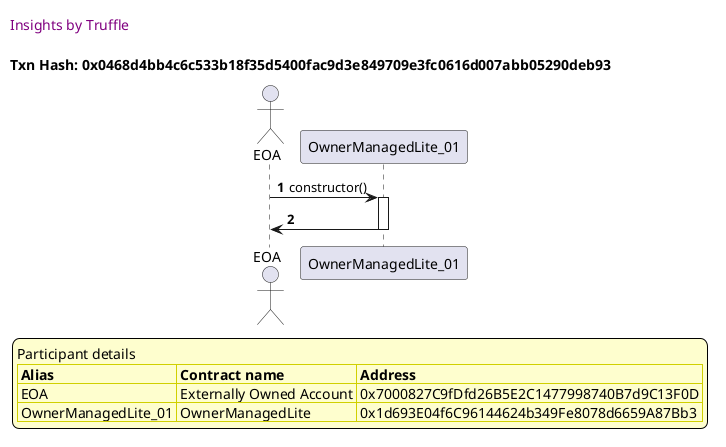

##### d2, tx: 0x9c4f05cce0186176d4e2c7d7aca283b827cd2422af9907d173917f8513ca5c40

[SVG :telescope:](https://www.planttext.com/api/plantuml/svg/bLDRJzim57xthpXYBviOctDfd21MaQRfGDe44aXxGPfSsoaMhbCv3ckX--yxJKFKQNrP7dpiS_--SqB8PUEvy-tI4C9RNzjsELUED4_QhhZZIp1geQoSSF6qS7LhPL6Rsi6xMJahYvAGYyPlZ1eJwBv7nQLoyDe_0Qvgfrzgwxd9ZLxOfR8UCrP-S9YXSPzorRgLKNyPxlIBWY0UTBTSIcqN4D1UzRkJ5v_x9aXV_zesUl7e6vXluDwrLOLvYTVUABXVMxZYpUCvq7KcuegEX50qI9E09J9MeM2ISS73D9gd8HCoZCEGLrb6cGnOb0MiIaT19FX8n9GWPS9Zw-LD3ho14vGd16dpMkWLHwWtlwnotxdb2oM_QQz-qg1pFA8_8QIBXxFnSJkSdfv3BkMTvrwzVx0FvAAVmiTUZhTVm6zM2b1QlkpaCpSjNdRkMq3wd6eQs4AzAv0FJxfcb584N6JLj99XCXcLOH74Z6LPoc8wOJ8hWcX6fs-fvdLjC50tkV3w6Ik0Ts-5Fi0hq4yKllueht54nz7iOExndfq38Vir8xS7v4dbkJRD0SmfdMAREvYuJSWZNWfS4uTJ600Fe8QuyROR49vhhvpbncowmKZ8XS2Lzlz9m67YOmF-LziL26IIHIMDgwJ8aY2Eap2UHt4sKobbgKoIKPQdR3AFi00oqVD1Bl74d_CF)


##### d3, tx: 0x5d7c84ebd45d9e506c3227d2b0918f7cb7742a9df06f007bcd023d371d67c6ee

[SVG :telescope:](https://www.planttext.com/api/plantuml/svg/nLJVJzim47xtNt5YBo36vlooOyGgsZGPI9kALAIz84rExAGHgLCvpjP2zx_FDLa5MZK9NkO7dts---vy_iu8NNQ6QzCl6uHuRrhLBtEfKNTVgnNNV0cDhAGI4rxSLxhjbKZQfjNmBakpD4aHkkZCff4Z16ui91TIm-Em1RXgTVtGAiERSLDNQYcLiOYbsHjazl09SjNhLIDV7Cph1mbUkDVTS25gLO671zKl9oy-3acW8VwrwkfgOJh8Dt2h-xAqkCZKff5mkrPmnRl5EU1r96WHXp8NOIIOZ30f0j-dmiyny-AI5ZcbeS-PA34fCQPv8R0VY81wWj22I8k9U65iwkbi3Bo38okFa2sRgOjwnUrLPp-Lr5-vufKKNseZlsFF6HxG7o7a_E5iTFWSJa_FmHPWRhYHpk3uJjsXY-4ftWzojFq4PhEIOANYIoT_yAQtYvtvTWUXPTV15jeTo7Y_nUiiZRs0isaHJNAI1rxWKnQJc68lYoObzZDCaZ6N_0dg11u1Vy3m-LjwRL_YSDB_l8qDB4souAgIC-NkTNpoMfopitDuI-mblvSpFVyJ__M1To25ytrZvl-p0iu7FVKskdd6M24Dhvlk6QscU8entj7Ajh0bhrqajZUrfVwUO7iIxVr6MzSLTbuRgHLlceth1W7Zeh3_Y764enOvzcd2ocafV3A9KZ_nGaePYsc89rImn0ioF7q9VAYh_jQw0BPLMP3Yi2G98ruO4Z_CWv1bCiOq5eH4R1pJIHxO0BOIGptGfPtjZ_WR)


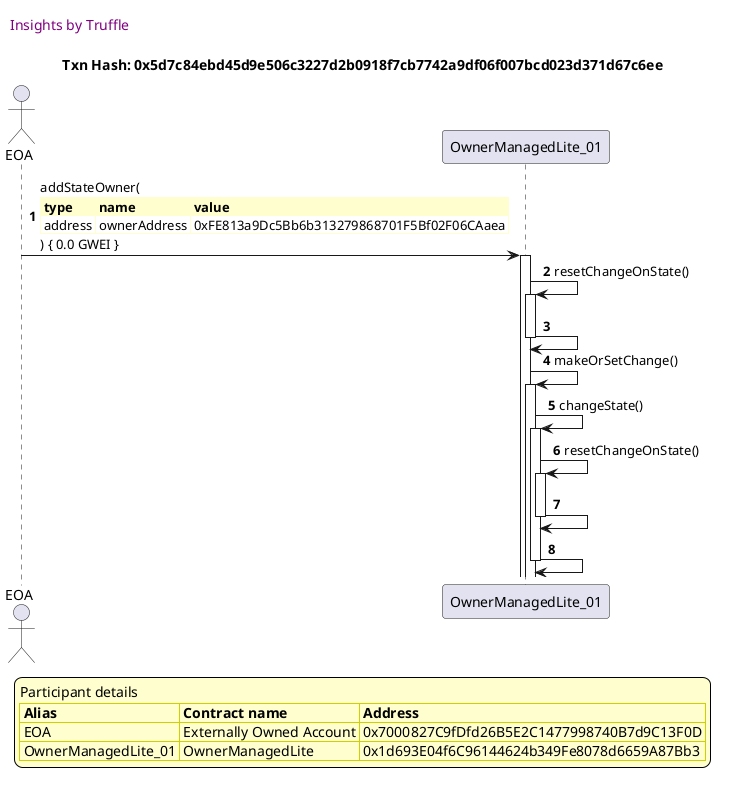

##### d4, tx: 0xe828b117f0c44ef13b2b5a410871c63235212616f40611a84c1e2b2b74d8e32f

[SVG :telescope:](https://www.planttext.com/api/plantuml/svg/nLJTJzim47_tNs6n5n1ZinCt7uXLj6awa3OLhKXxGPgS-99694xdEAo5xd_VDOGAj6eIl2mFFkS-VdS-_yw4d3TM6jjM9I6ojRLkgmGCQMuBlPH6LhI47BGQo_GsDtMhLLINjQ7lfl4qZc92pXgxBc58QFSjG2emzA7_fVIYDiLzhQqiHsMHwmgqHSJCxXocQ7o4NBPcMS8Bmxou1yh5JdSbbIfqJZdhLRyxUVQnBuBq-IzrK-GBsz1aJQzDcsM8IsnXIw3NAqqlPBCufMm5WHCadFiPIuM0ZBk9amoau2pmUUgvZZjmkEDnBnFCurm68kNWe8ylL02kan5iMMgnz7WsehAX1oWF2BRD5ccnb7ZKsIyDvglKCWVrfR3mW_7ESO_-W90kdfuCzzlfyV4fRS1-WvzjOK1rFisemaknXpVwXfprb_A-byFD9shNIw0ejQmwUIVB5ZTRzmrj2onnG-iEw0aM5SwZmn5zeEm3ev-_nvVOwVr5_RDQ0rXlj90wXvcUMsdXyEYrE2Sdf_GjkIjv2pCpVyh_-iHRaBIBVMFb_xC3NGnvd5rozOoH2gmiokOPMIPimXZRaWL75Cc9cmXdpo2rTxGPAOKdGTikRhZfM8_hoeBHiYpN7TiL7QNfbf9eOYiVaGF7Zy9iaYd76mzY9-B2zyCmy0KR-ogCk3jbavV0-wRcRssNW2ilT6CcCYyAFIw4vuZ45U4K0kO7olC6uIZmnucB2R0JVJ_8EQxuulq1)


##### d5, tx: 0xc91bfce38ee16a8992441113b409547e1ba1c919996fc68e788640bbffc0502f

[SVG :telescope:](https://www.planttext.com/api/plantuml/svg/hLHHRzCm47xthpYDbqqmiDiqYQTHhKrRDWdKYKtYPH9ouaiQBN6Auq2xbV_EDSsgJLH88FBWS-u-VtUvxnp6Bcgdh6lAWZ7LkCeqPOoMrVUvMIghIYWmGwF7AhdFRDKO7LL5PU7LR3gRHbF6pcktBd38e7qMg3HQUEnU0IuhcpzKngbYLEIPAT4uOapT7Z2Zu8vosTXbWIy2D_a3Wl3slckbTMuo4Bnp_Mpj-Rkk2DRblp9rdYrS3V4QRcsJfiJBNEuAXDkLWKjLByw0hn8fuZJ1VeWeV1LAsVCy8KG_zhWSU06AM0d2I2dzDF533CBGztWSfsd21xoNCcfPugZqwNm4geOZiaUCskRo95yg-jJv3uFsap8gG_qnT_YLYnPum7_4M7iUJeU7u_3wzHdKw3xZjoQtg5jCFIf957TyP-xOUIVAcyuED-_1hPS8P8qgM_jT5Grjjl0DD3cLk86g9NgY9OVO0KxW4VXR3X--JA-equUB-cEr5gdUQA5CXdDpuvJ3uvE_vJazFOD_oLsgUvpRcwVy_ptnJgijXksk2Bj-9hn6f_AYVgR9X4yuvrjDw2RG3D0ceX6tD45xTKPQKyiejZyttBJ3HUlAeJMgADRjK6aO9SbMUGhnLK3COI-8P3f9TSyV3wQzI7X186KOU7mSQ1c9_enFNX8V6ixVlMq2eNtPdt8lzIFf2y_pUrxSz-GCGnw4slS7SXG6uxXF2QWJNJ_O1QtqO_a5)


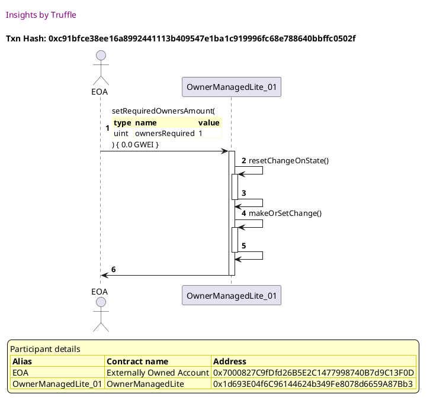

##### d6, tx: 0xaefd8004199211cef626301ba3de459fe769de7ea98b6feb9832d99972ec759d

[SVG :telescope:](https://www.planttext.com/api/plantuml/svg/hLDDZvim4BtxLrZPIwjjLFCHZACqseGGRQLMMIbxhmmUY1KmaJ5jzgF_lRE4Hbqrwc5L3cEO6RzdtZmJSjCwQLrNLuJ8pZMcgpEmfDrhSv1MrhI24enQodnVsgOpAccgnjAhTRfEavIGMUiUAfWJsZyxa0eiVHe-ARrjh7viZ9FLejAbgS4uH2pSkM6DnHFaeRE72buLjleHg1UUStTIAMrAwh4XzRDVPn-7Gv21_xDfTRbpBSqUwBtjYW9nYTEk0df_DFHMjhifPKS9XOeP2pqXVC_BeOZyA61U9WC5uKGKm2EXW8CKSHOLa8auy9KGWlkGyubG12NB7HuztIoeREa8rn51sPpEzK7Yhsv-6B1VfP4bg2_QmJVczOqNyYD2-lrqFBzSfzVNKwe06VLtwM3hCBnxJoxt_XF4GWiksKbJmiQy4MSydjAtSDTo3nkx_St_tubF4hxqa9DpoTqVyr3WfAvQCXly--5gnLQCiVdp9ue6nT7WIuBEioWpDRA6byH2APGCQ-Tzy-T-vXYF3goHLVNGprhHHPxZBN5OOaUEoB7F4r6i2kL7oqdg9rx8kH0n3zcIAv5umPgjNWDVyipVsPx0Kv48KXOMKI8YBmmZFyo2KAmXPZnMKJGHYvWlim09K8b13tA34U_xBm00)


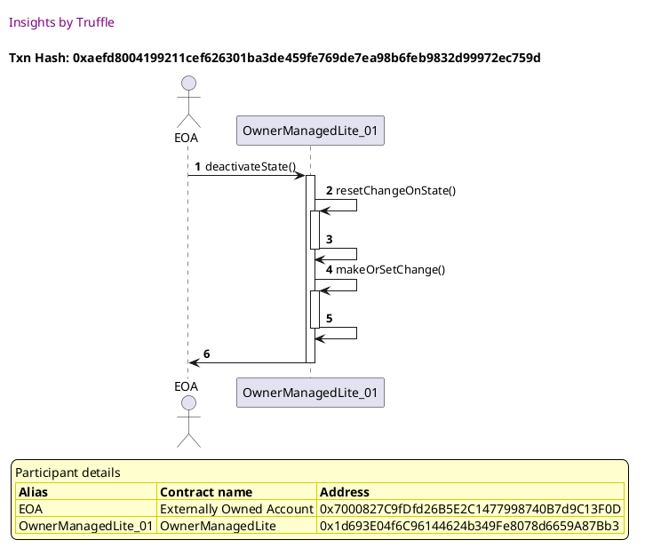


## Resets change data to activateState operation data when timed out
[link to test...](http://github.com/thedarkjester/ConsensysAssignment/blob/7c5b2f21f354ab6c2adcbc9e6ca114bc570081db/test/OwnerManagedLite/test_griefing_prevention.js#L47)

##### d1, tx: 0x43e0d7edb9d67f1765fe50c7910f9d305b221eee2234b9d1d37a904c0149b4fa

[SVG :telescope:](https://www.planttext.com/api/plantuml/svg/RL9HRvim47xthx3IbqrTDGC6XoYBcX1G9srgfVLzClWWLes9ZD6Ihlllkn0KhLfuiCttdR-x-yw4tFTUEZ-qXX0v-CuERGcEz2_QxgMJBJNGW5KRMRqqhXkioZhJENfJv4MUvOGiUtyqi29q_7OW5JZwU_gbzA5p-hMpNfgrqOrjmNfKhFqbe43oBBaVtDx0E-A7VWKQy0ls99NIjg41cw0_uxxyF1L1flnVRQ-RdUzfUQJFRgXhr2LUUmFq-M3fW-nt2yeEF0Ac1AWoLOce0v74DSIi4cd0wbH5B2x3C020C8munWGg4Z9bl681JqjUIuAMLHvBpn_NLFPqXlkCe6rULteliTN7NnRSTsbb0-gRzl2J1MFW5Nn6o7YVtgsky_JsTa6hplRU3QUi7pwIwt4dWRFItO8ISXuWUVgdB0LUQjEJvJJ6JpTRjcMChTw-K9mJLeY730VWi3zgPGidOAsKWnwvoxtLszWwhWSFpafZZcFBYgwh2X-BHueT12hFGv6bzRPMORA9yp0Bk11fEXUSROHAio0gsFQzy3Nh_aV715pCjocBodKYDaMM57AUn3nFbSmZNXTCS15LCGEE2T29oGzoZoi--xy0)


##### d2, tx: 0x79fe23bd0b06be7a559415b3bc201c66e600019ffd029d6e550f5cf42cc54e83

[SVG :telescope:](https://www.planttext.com/api/plantuml/svg/bLDRRzCm57xthpWgBw0nSEvDLQgbQS8cWJPfatYPX9pOQQsvJkKueztAV-SqpQ8Y-a8UVEnp_xvpGiXLOvcnxLeHmbfRwtPT24EQ9watpB0rAB4KcizP-RGqTQjvMglQmBiyoxCq8sJQs9qICmBTjnAC2mEl_HFWkZRofTQMgKJ9fLuBRJ5ZPGU778t7b9lMR9Juot0lNmGu_g2xOvnBlGI7zghVdPn-xfiWVVqRtSZboZPGxE31j5M5UOcLLWbus6guPirg0dGRnPLmlOBJWeQ5Y5WGnBuJ55vHkjGfmr24b58dhYfEtPY78WXe5PILxvPbu8knHv2oqcBhsMq2h84HoX51sgmivOOXrDjVMfZlJBEbuD-a5J-fqpcUqOy8wUBXSdRU3XSN4qWulxVCYlUF-f5C-obyxELi_mNiRYC0fMRhJZuprUBbuBu7fC-8fe4zr8S2oV14BX3gs8tIk5fKt0tdGUQcZXz5SJoEV3gFU9mwNauNRwcAkbOOA9kajF8PAu0rRuK-m2lGJnI-_iXkS4JdqHnW7l5UJe2GuvgHknFokB1CgkO4ve8kiCq3JDmcv14lAQw9mIaCW0TGGznitmq8pwqLHZEbTjrWE2HbYIjj_vE0qyJd1loljYlWH-D5JBqY2QDvdeOv6uU1dyMSPPvVvJJo8wyCgF2n03BHyq6kyCIVymy0)


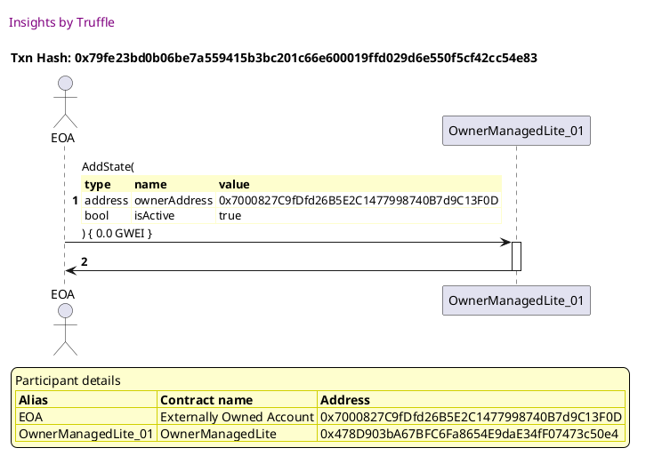

##### d3, tx: 0x05c4c8f1191cbd86dc0fcbbbcb619194427e2b36534c74e10c434d860e3da283

[SVG :telescope:](https://www.planttext.com/api/plantuml/svg/nLHHRziW47xdLw3kfLNN3TlOs5KNDN7ijTAcL4gblLIQC637geCZZBUapVxxBjIBMYsQrBwC1mwEk--EupiGkkmiDxPVDWZnthQwNnRAeEw-rYjk-18tgb9QJhYuhqpRQvcsJMlmkppBipH3wAApcqQD47PZeRXK1ZyEMuolMbC_jDhoPjpKbLugRG6nj7k370wV85UzMJNgnS6yVb3OetlT3PUorXNsoA3wvUJ5no49DCI_rbrTBMo7Yms-DNrP0YwojMqKlbrhVCMxnJacQn8AAkBIyn9F53AEf22bA8f2516e4afzflmYYCA02aQLHmGDADWH5KZknm62aWaBgMUpCUOTFW9vXA1ijXRrYiDLPp-rCb-vvfMINsghlXFF6HxG7o7a_F7PwF0vFZqznr20kULMEOFZEts7BeQdU3_8qVOJjfkLmY0rNphvWpSzB7Rcsns4KLs7jxZTWOptMxBEizWBU38LuQI8Yi0BV9R4KSo8buUJalWvYT8nL_m9wWG_OlA1uC_VicjuYSD9__Cs45ZPTC5rfMRQtUluvBKuPsVd-2snb_nUpSpyJ_pN1zw12EVxnip_PmMS3thgRNJpZB5IMLuttJDQJScK4BAZ5RGma1SMAVIc0Uhl2ROdqTvlj7LT0VFQAgDvqsnSDqWy5WB-4Ui8nm0vzbcQbDDI-j4apFpKeumbISmecJ2Pf5wGa-bBu4DTzRVM1Q0idYOaACOHc-HfbFCu2ccMI9u5jCm9eomG8L4K0a0bXdgWIvZXH_mD)


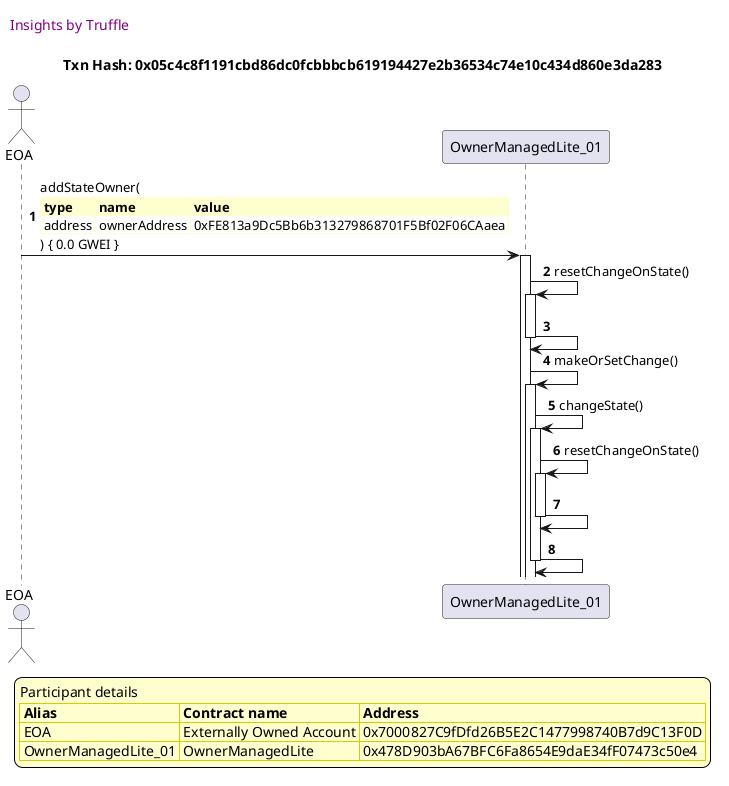

##### d4, tx: 0xded8726476b3c1340a5a71d1d332fcf5717c81339f39b44f5b6dac1faa712fee

[SVG :telescope:](https://www.planttext.com/api/plantuml/svg/rLHBZvim4BxxLrZPIwjjL1CUXYYDDY6WhTGgAsNlrO07WW9EP4oRRBV_lLEMHbqrwY6t-Z26UNoVPpnZnkvQ2yPsJSqOT7QlkoP3mzfTfGzWeE4rbgZL4l9TQVQTLl6-tXj-aoPf4YUCpLfxgd7EUB-s20eD_pxySdw_DzNJNbke5tLLwWQr9SJ2dXrIChv07ZfpgF6LOLCz8NUyi-u1bAfqoHqng7xq--pzS0Wsy7_KRLLkRSkp4tyqNL4GBhELhP4_7ZM_XtOxvUAeK8Lo4dWooDpSSJq1FaX7ESfr9qLU-DAHUUYuRbIuKUPvXPy52dAd0FAQ54YO379BHq_M2muj7z4-ObGsM-NL0IZLzJUDvZDeA55zgYn-4KxlU44_OgoFv-FvPJk_lProXSHOVGMB6qlYpLjssVUV80PRjF4MT8bhVINEU3pbrt0tiCErsVpclow1l8_z3olGnx2NaM8FVpIAGWjLtRBPC5ZlRbPY9OIOFt_WD3dKC_GHqqWOkd-keS5VYeLIb0dPpd7pvxuPIHuj6WrrVUgRKF55djFuMZA9eoJaS2BZg5WLQX8i_MGIEvwKKHHAJoobYcB7JSNgDV2bPlvRsnDuCbn5miqMWLocSP126FXU4Yb8NAz8XVIac_i2FIAWIWprO7SawI7w2G00)


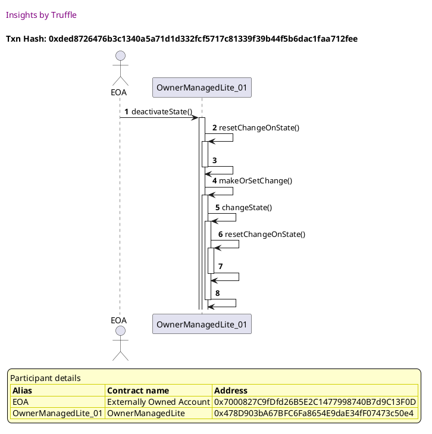

##### d5, tx: 0xea834461528fdd96c43900d317ed263c3e5027991d4d2304f6506bfaea184c72

[SVG :telescope:](https://www.planttext.com/api/plantuml/svg/nLJTJzim47_tNt5YBw2DpKdSV21MqQR9GDfKD93sWZIvyIMDI9pESROMklzzrr0gqAf9yB8y-9px-Dtv_3ipTjPQQMnNLup9pZQwgsTeM7jRweKqieOA2zHgBBFRmZITLd5JDGRUf4cQn0bZfwrTLJXaq7zpb0eDt6z_0SuRKzursifgL9M5hb5RGipjpY4bumFaeZEB2fyPhiex14ViT9TIgL8NuF2jwdSlJpziYs3R_1UwBOkvRM6sWclJvJdXCblQ2k5wgU5SjlCJu4kKeIU4xmpSC5SgyZFXHPmhpmbGkRwNUJZWRX15ZXBAzRZ8_G7tPxb4wOGY2rn6BSiibPvCHo1RE21vmAXjjipAXQIZJdzfD5-abWMgpwN5xzpf7VVe3nZhu-5ukDyERz-UG8lsA_xeIeEgzsb7DLsAFRpHD-nqUodljdAu_WXsjK0WgMNTov-owcYpSLz3LrA9QsXwe4TOKhWF3aTm3_mzXq_VaWlgzFwY_bcjGQetdajTu5HVMMdnyEYbECV79_2QtBMynQcvUip_yiGRaAoFVMNb_xC3VGnxc5rs-OIH2gqig_O9MIPymZdVa8L6bCX9cvXcpn2rTxGPAKKd8TikRhZkMK_hqgBHigfMFTiLZB9iGqaoyML0oA4Rn54-oMcaneF4ZHqHq4o5WU3ZG4MnuwLyyXnutzJyhUqJY22SHDoRZVnWdCP-AaD_8998oSGJUSe34NZPWAEW1DI9RJ_O6Qtqulq1)


##### d6, tx: 0xdebfc539bac128d74b67105eab8fea403aa036ebc0010a8c5a15c3364ba134b6

[SVG :telescope:](https://www.planttext.com/api/plantuml/svg/hLJVRzCm47xtNs6DbqqmS9hVqwZMfWcR1Eh49l4o2LtYInejSOhZGBkL_vrhcbMRg910vC7dt7t-xdBVEOnTj0QqwUgACUXCexewHStQ-r8jGKFDAonGoIbazuLkEYMZfceqVvN4IHp5Z9stPbtXcF7-MI18rFnnUENyij7bGwCCL9EgB5IDoX1ZRlQ0X88xocMdbnM-2DoK3yWjP--x1YbBLN1B3AwVlJr_DnJ1XlnNgYsBXMbvkkQtkijpucMcD1NosvNYbz0kphXOIKpppBN3539h54ZVIJtV4Yv26kG8Zh01XErXcWbX2GWo5omtistFIS6o2SoePPcXqkFvX4FBZyWUCMgRARDo2VIfynyAzITGKA3yM1hyAgmUUC1_n5X_df-E3yVvwzTdl4Np6RzrfKRPOzf9JQAOupjrnyu7KTuCThnvpyrwYPoiWhgttw7gQBE5RtXNKeaRtlH4JxJai7Q04_x8nLl1Fto9hwZJXulwOxKQgTve0Qh0kRenOF3uv6zvJa_F-B_ahk4Uv_hcAVz_JxpJQejXkol2hfy9Bz50MRNFD9c9cH1YgmdT19e1saGqufecQA_EH4fg6SNsvyQRVhXeNHdK2gfgtG-Lv9CisofF8R7oYJaO-L6Opt8vygPkF8ein_V3CF0TCVLb65bs8cOlYGyDv-_UFe7Z1xDGsEd4ywT9v2KGUAuJXn9YsyaJuJk-dRa27Kf0dHZwmIvefH_BBm00)


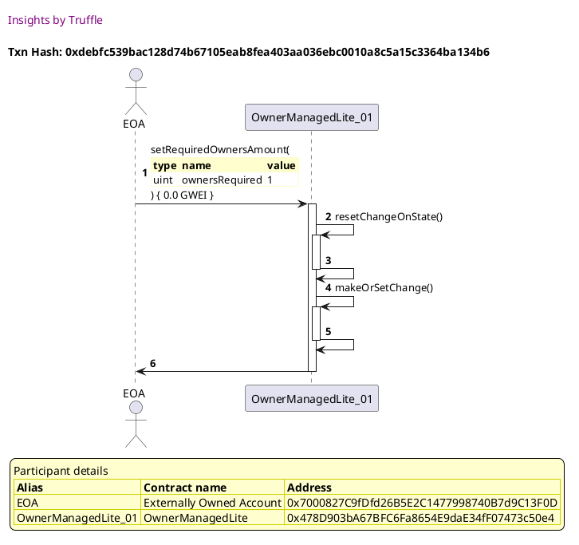

##### d7, tx: 0x7f5a9dd7c41e0f991ce3fba4959d7e14a790ce0a8ff5bcf88aa8aba5388db358

[SVG :telescope:](https://www.planttext.com/api/plantuml/svg/hLDDZvim4BtxLrZPIwjjL1CWXYYDDY6WhTGgAsNlrO07WW8cCgRDVlI_TvRGgAj6FQpAOGmpu_VCcsV6RbeBndPrnHXqjj5TdQ9XxRxK1p1GymeBr6e5sRumJQTLr5IDuLT9dCHHpDYyjGyLBXZldns2GiEVXa_ERnjJFZRQGhMioaBNg2qXvlRSa53n17depA72LuLj-OZSySwvEr2gr0Ltn93wsQ_pZyCXsC3_MRTbiRCjJn_ulUdod72PBMs5_Fwe-IsqknaNHvdx42ebCyz1aOUXaw6Rf-25VgWaEXx8K6Ge8CXpFyto800880NV3GALkdx0IBBCqj7ZpP93oqUqZXZ9PikiF03zwkQ7HlCLD1IelfGMlmcdRxoG7p7Mx-VZnUKwlxwUSU8hluF5hQNmxZsxtFbF28CjscW7ki2DVYFEU3pZR-6kOOyRi_tD_z-9JmA-zB2JRzdT7zDGQA6iMZOVtFlXQYtMGeZ5yoTEzgJ1q4j4lZCaCzTGuqjYgHH9HhNpliLpFt6AHuj6GrKzz9DMV9bbT4SibSXTX1nCP1JcwrnDfYi_daIE9sKO1j8JAwd2o74JiNuDVCanVsTx0ay6wr2uwN8gLqaqJI2O-buSAeXTBq-4zAIR-G8z8Y0b1ZtO3KMwxRy0)


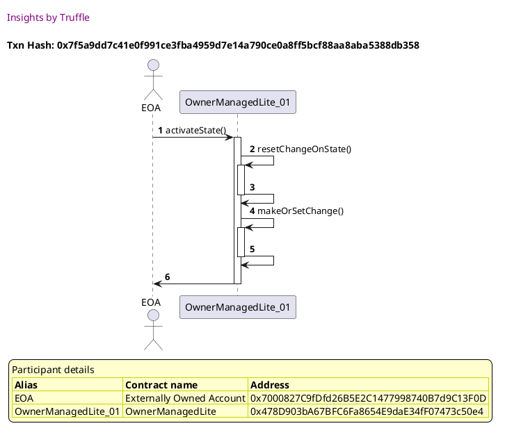


## Resets change data to remove owner operation data when timed out
[link to test...](http://github.com/thedarkjester/ConsensysAssignment/blob/7c5b2f21f354ab6c2adcbc9e6ca114bc570081db/test/OwnerManagedLite/test_griefing_prevention.js#L69)

##### d1, tx: 0xcfbc643b75ab618c1a8bd6c01da9336aa795b0535f4e90914308eb9e38343b0a

[SVG :telescope:](https://www.planttext.com/api/plantuml/svg/RL9RQzim57xNhn3foqPN9lcka8KwZaC76osix-F8aXrHHmwop9Ak--yxSKnOMVIWo_UTyvsR2BdlFJW_x5f2OF2T7NPIEzA_6Bi71plQwaPRjOBgfN7TO5NHjPsZDvjoKnOb8OlU7rkz97HSMmrAE_fxUbBwq3dpsbaFRTwQnkwqzQXO-ul11icpv7vm-rQ_8twOLqrvTC6UG2bZ6yhP1FqPpyNdAGaonVzgUzDiVK_baJwxeQvHbtZZMqsV3vO-GB-TKtQeQbabKIZJ66J2iuf39bLICQv0X642a8fOiZYCwqWB9dWKianBeSCiH2y615jMUKozVCmfz7I6vunWsxofp1wmrCTVLhllOA7Hwfln-YVZe-4LV4R8w4_lbjTvUdixfrLdU--6KzGF7ybrkvF0MUbkJWav3v0y_PEMqXvCsvF5DCPFDsksPemjtxvGd1DcY9S21-2mFcfXfqz0hfJJFN8Nl-NRM3hk1w-TXROzZYKhcbSLVXQF53kag9m5QI7gTQs2P1MNGS6ZD1KYIoEsIfKeUBXXw_V2rrhtFpe645pmCexNgo0hir3Bi6IGXx580v59cSGPPr6moYK6m4vC_I3tkEEt_mi0)


##### d2, tx: 0xff62a935e7c738c1030b7417f71155ae96c3c5ca4a6317ca9e8db79243ff1974

[SVG :telescope:](https://www.planttext.com/api/plantuml/svg/bLDRJzim57xthpXYBviOcvrB7IDMaRRfGDe44aXxGPgSs2aMhbCv3ckX--yx3Q5YMb-M1n_xtB_ld11otWRfGxUqXCWkDAvRbjgJzi6ubVHo2LOlj5CJMJqiVDCvDMriu-7Tl9WNquAGipPih1uJwBzxBPNsy3my0IuQRvuQ5wJDhLcufNO1CzPXxp17uqlALUTNLlzbk35F6bYorrrBfOnR0AE3wdSlppuFJP2X_gLhpU8-j51kuDPtTOrvIJ31QhXTExYGxVqfq7LTZo8fubJpYiTPnMXCIvumNdF6qbHgCQhYAgra8aSnuvKKEbCb5r4IrpKJF258MHMmzU8g1zd24SeZWhG5KvcLHAXNlvpstwMJ2ws-cQ1_KjOx7j0V4TB7mydui1sEZqyXL-ecoA3VtxaxSZPCuUCWnzil43Oh3IYTNFRoKTeEBpltBI1zNhSjRA7P5SZtJxhcbD8iubDHpseLZIPf4KrPmhaG6K_eX2inPV6SpbvJbKrZCT2qUHNC8rQ0u5yBVO1de9yeVFrHNEA83gFPmNp1Ut8AXBoi6Rb-GvxIGHhRle4vepDiSmSJjmbvnCiKryJZ5FQ0zw3sSUDjFo0yrq5x9wtTz8DHa5SLhdJuJmBU9Zuqu7-rVG7112lIT3Q9iYABTHaNLEPnAdWaih8SfHcZIJJ9Ioo0J0nya7CyyUVy0m00)


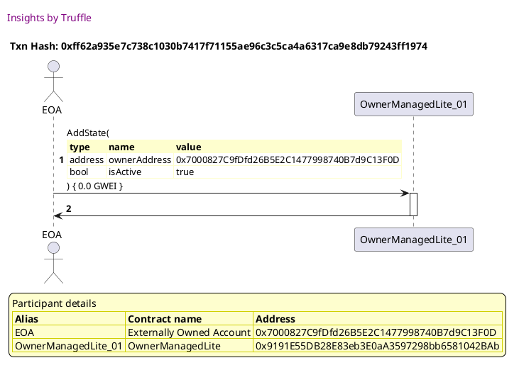

##### d3, tx: 0x0acb1693edfe1f405b189606d366f4f019b8c48b5abd7ee0570e715575b9bb88

[SVG :telescope:](https://www.planttext.com/api/plantuml/svg/nLJVJzim47xtNs6n5n1Zi_FJHgmYIPE1jAb8HTeBqcGdbpGYTIh7sLhe_lUv8Qj0goR1o_pWiyzttvtFtncXoyu8RVfbWv3eJQlwfGIDkljQhOGMIzn01Qg8HNvVwRPNHT8shSRliZHBanIXYyvi6fWWF8m5Y08qVXot65-rkdvebH5DrDILMe8o5h4qUuFC7Zv1hdgzQk35mRn-04ozlUv654MjAap9gFero8kFOn9eZ7-jkhfQc0xB3RxLVLbQN6Hgqm2-NIjy9Rh5EIPh8d990-v2KG8jFU9BodX0Wi8DWj8h2UMIvHwJlf15243ya418VJ_q9PUICMHBbXkRUZgBiEZmaPL7o9RDr7cz4lQgivyAz5UXH0N5bzh0Tq87mmFw8uG6VtmsENoEJq_FiIt0t0W3Wy7ndRf35-DJl1_bPFi9cyqAi9LAB0VvGpIzNUpCjpi83Ls7jxZTWKJxBLbdAQEkuDFSZsKWNUew8MS12mdD_BWaJaQ2918Wdg1Ey2Cc7mZ-_2szjYznEEb_tiO61fCiXAfWfePx7P-y5kVix1o_9VPItCDCp__4VttW7KW--Buny_zPWS47FVKskdd6s0ACg9lk6QscP4e8sT7Ajh0bhrqajZUrfVwUO7iIxVqcsw4hxBmse9LecitG3GMEyjp-8sOWN6YHcHCcl9oMXHF4Vkear0j3pbdeaJWiU4BTZ4nV0X_ggh-rGm1EEKrzVnexB6KkI3Sb8d9z7ZgSIHduZ1BFYIDf0zXAZFL0btQsF-9l)


##### d4, tx: 0x7a5703e0a645364924b150240bfada2b3d1827a409ec60ff716d0fd1c3c9ffca

[SVG :telescope:](https://www.planttext.com/api/plantuml/svg/nLJTJzim47_tNt5YBo36vdmrJTLLf6awa3OL3QIz84sNs4aZ4gTp74QX-zzt3Q42hPe4Byk3pxcFtvtFlpDZfur1RTggP0nRKwksIgHcpKsXLgYnWbBcKeaffZUvhbibehgiDRoRn_CuYXaRDsPToWc3xbjA55B3G_yBS5RhuhvM1ikmB79LIMK8CJCxXpaP7o5NhLwLyeNXihYNOBaxtGKAKQWSBDwhVdTo_B4lWlNvprLJv4lJGBA6Azrc6U4oKvXImjMTWZDibYFWTpvwFdSanu7hEGCtiDt4yhZjyYH3WNRY26je--ZoGAO3dcM-DH0y4rRgf46MfSYePQcXqkD52DZ00Sa3HcqpHLgia8ww-AMa_eeASoc-54R-u5Rdk4T_m5WN3oUJ_NOuFXv18yqt-RCjj1ITJnDMT2dcy5fTit5_AUzxETby0hDUII2fiEhaBPOjRRRk6sWBAd43TGVq14iA-z7X21w0V-3m-NjyJftUNzG_gzMIwesMg7AvK9S6ZJmyUYtEoSa8tfAxmXkvq9TF-L-VU0kITh5lhFn_Tg2BOO-poowUCL98WqNPF2FBZCyuvrkoq8WIEMaJqUnfelQEDg4GT1AoxU8ccuxrjDuPgHMMvRfZku0mJRUK91DD627J24L1Dik4FPXwiHrPhky7mT1t-TGNGMGvSpvx2RnlQlxMTWa2Ax1YpvjDxM4yT6JYn1n3nmjyEnWcoS0RMjorfs522QWJVJ_OAQtqulq1)


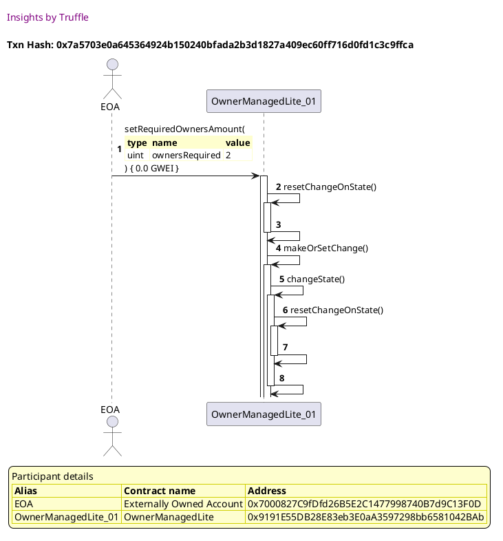

##### d5, tx: 0xb43e1c595498f40e17d21ae6dc46ce7e219bc61178a4ef9034369a4534db05e2

[SVG :telescope:](https://www.planttext.com/api/plantuml/svg/hLJVRvim47xtNs5rBwssRZO_0gwwg8IGjTAcL6kblLIQ33u8AfZCc2rfi_zz5qAZLeicRHeFFdDt_kwuxpE4NBHM6jlL5I6oiutkwXGCQUzBlPH6rhI20hIQoEo-C4sdLTnKZQ6lPiaiYHD2pbkxhc1CQFyiG2emz75ufVIoCUL3ewsiegeiT0tQ8c9kzmap3EuWbvrPLl0YS5C-0ENUtdSjbIfrGJaRN3zxU_vkQ88CzQzqMnOBsz9qJMzDb-U8IsnfAw2tAqqlPRiuesoLUYxmp1U-9yBSOy03vN098vLvemm2SBX8in7dGIWzo0LpFNSafEUxdagP3mx1aMKMMq_c4PKjFK9xH71ijipAfSHFdV_GO3v9BGjG7qiBNndl4m_uZmZfpzFJyU4uVVtwZBPWFyEthZIW-fmsgf4KUtodxyZvGCgRmOutxwbTBu6YrRBkxNTPTRZPfczeLsAB6zhqG4-mwE2xX1FwIDbRHZzyIQvmqeUR-cEt1h3VU25r0NDzOwM5uvE_nJazFQF_KhkMzp0tDq_r_tlX7LVR7BAx8kJw6V4Ah2ohzXadKpPbZ6qvmPk06i1DZ18tgA0zEv5IE3ACxS-DDxsuS5rPC5fMrReNbQ9HbcsPnn1R1OWSEa4iycckdD74JvoOUq4WH1XuR18e4NDtngOlWG-9ytTlNq1mmHFVdqwSC0bTIDs4oSZrHU28C4r7ViYPvqoY50lW98Pva0jSySVo2m00)


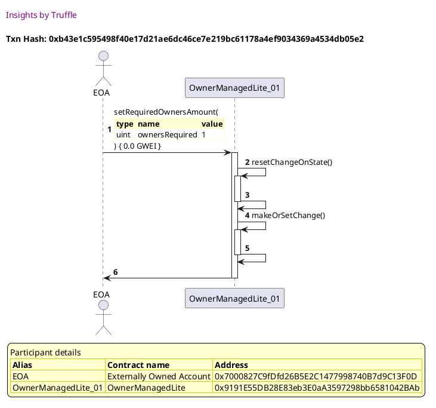

##### d6, tx: 0x4e3c9ef4653b2da7a59520d844816b202f16e9d14cba057026883ac7d1718897

[SVG :telescope:](https://www.planttext.com/api/plantuml/svg/hLHjQzim4FwkNt5qNrgwRfBV99Kkr7RijR2HGWlxKXYoBJkcjXnafKtQxBzFSRpGii3Oc3_efDFfkPVdpWXTzaPeismRXCJIT6hPPbAZ_g5M2w552usif2eYaJzKkbkg8kwQJiExD4cJE47eeZVhHauG3DzSYa9gU1cF05UThfyxPKGJDdMbMgcCHIpDtY2rbpl8nL8l6ldcuhP-ba2ylUv654MjAY1uLFqOvCN7CGWq-hzMVLtDJG_P6kxqiYmjBZArQIJShHHSYNv-3dZbIJVdilG2tysSGb3XSz_11VCyHeBCmKv90iaBukMPm3x5Ji2OAt9Q44eOunJPakN6XfxCGX0z75bvX6pPJ9tN2s5JdJqfgRyA9IfPVAcD_8x9O7X0VuJGy1xE9eVluVJq7BHikqTvQuIHWytnlRf75oCRxqSvsNm2irv8i5A9Tf2FebdQpTPy0xQCMlOzRA3RWeJx8rwb2IEkuDFSZx8WSudhKCu2HZ59_QZ4Jeg3E1HIxA1Eu0Nm1moVloNNbep3SVyXeLwQU2vK9MTgoEluv6znpixEuLzyj-91plJjB___tV6EpgqDsaqHkddL6uKqecxwL-nDyHHZl6NF3ejj4xk9xHHessHx7lTSxTzDDaF_sNLbf5QYQTP3tnKGvhcTM3FmIYqoSsZCosbPE47a9qvCF4evPzJ34IruJDmKJzy27-hVtxM30quuINn_6ZaiOQxCt0IBqFKvTJZBii1d17jE56RMWQt4M0zqQLVxx_a9)


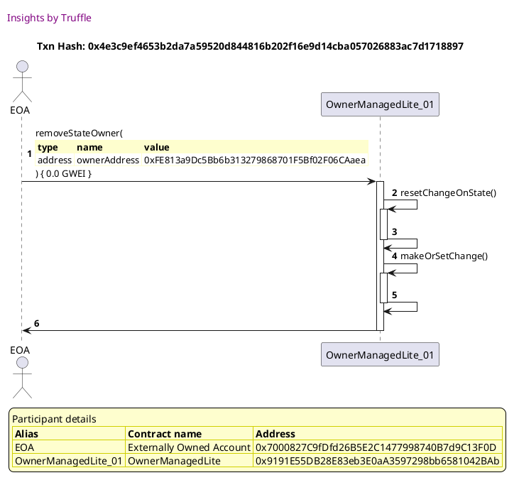


## Resets change data to add owner operation data when timed out
[link to test...](http://github.com/thedarkjester/ConsensysAssignment/blob/7c5b2f21f354ab6c2adcbc9e6ca114bc570081db/test/OwnerManagedLite/test_griefing_prevention.js#L91)

##### d1, tx: 0xa867e21c68a0d7479382e0e59e450ef37d0792790d1fdd50381c50fcc0737436

[SVG :telescope:](https://www.planttext.com/api/plantuml/svg/RLBBRjim4BppAmZdqY8DkjIBak4QiIKRAT0Y0PfxGPChcGXD6HI5scdwxwLbmMXGwq1ICylPtLaISjzvuNo_CuI8thUststGaUv5sxrmOaSDDcZLKiYNnhMzLMLhMaTlrglrgbmHCklyqU2SqE7Reb3ewE_nbzA7rkdNrdfX5aOtTeVM1yNQNmBMWJnBxdktD_YE-A5VaRBaWZq9fRHjA8CH-ZFiiyzZ4MJC_zLskjdwZcwEzDdrTHrqYTVU87q-MFeWkksKma7a6SU8oImNe7Z2YpYF430jC4a1wvWhu4N42r2iLYg5E6SoXLfAu35Fuem4owGFfQyU5rHqT1Bs2GcsUItrNeHM7tzPTD-55GsgRzhZJs13u1LyGiXmdzxDh_FqzdPAPMixx_fJrWyVoVMuay1PwMvA2JaFa3pzKvP2BxJfo6mSuwUR2Ye0cBzzeM5EeS9mACC0NEYFMh734x1Goc4NkCkz-TlGUbWF7fqLnXo7bXLTI1aUYmyK77XGpYDU5dLLgoXRfgkeP0ddHP7p19PS5IMBrr2z5xvctV_ea23D8YZAc6NhIZAMnvXKomH4pSgia0o0GnobOWCXGN1Yz8FSXpKy-xy0)


##### d2, tx: 0x58d62cb4ee6a9df2eb81f3075fa104bcabbcf311b687fefebcfcaa81432a417b

[SVG :telescope:](https://www.planttext.com/api/plantuml/svg/bLDBRzim3BxhLn3TPKFNJR8TFu8iQE8aQu4DBT02knGOQ4jEXIfo8CjTqcR_VOph1XsMotmGHOglxoFDs7dZqVbsPHZ3rjUsNHNAiUP1spKwN85HIsNb5Ck7fQjRA_FQr0xUBUQBUJvdRDJuhL5Z1jrthr0g1y-z2d1HE_rKMuzcOlJIhfJrbB7o1uS5FRwaNBTkRTHV3pVwIO683hPhb5BR9GZUctvtSlIvRuBrzIzjevVtle5Y2xUkhIhAoxpsHi7jni85DlT3u9j1AkEWB2AbOina5QWY5LN8aq65WaT5YKLHLg4GHPmcbQeKQILYAg8mm4Wa1IFAIa-jpwycW0sSa3nXH9lNfLuZGRtwPPNxZXQNIdxJNltaedCyOZzXh8k7i_7nTpWz7S94oXkFNhs_itTir4_XOo_7ko_Wjsi592skElc8fgNBtdq7H9zJJGCxgFS59WULRnBEUHeaULRDAXd4qy4yo4MK95cM9X6V9ZBBHRZWizTKHLqR2jJDfFJwaIg0Tw-5Fi0py4ySllwONzA8ZgFPmtp1UpO4nbxMZ5s_8KygZzeqRs3E-8pQtCEaRI8UwPBJcZYQmW7m0TGXRhph1aJdnYjdqPXjDnW9axAabVR_IS3RnCS6_A-rAp280vxbeOWNirA8D5JHR1fnh4GUPwNWFE5XCC22Km5YekU3dTD9F-SV)


```plantuml


@startuml

autonumber
skinparam legendBackgroundColor #FEFECE

<style>
      header {
        HorizontalAlignment left
        FontColor purple
        FontSize 14
        Padding 10
      }
    </style>

header Insights by Truffle

title Txn Hash: 0x58d62cb4ee6a9df2eb81f3075fa104bcabbcf311b687fefebcfcaa81432a417b


actor EOA as "EOA"
participant OwnerManagedLite_01 as "OwnerManagedLite_01"

"EOA" -> "OwnerManagedLite_01" ++: AddState(\n\
<#FEFECE,#FEFECE>|= type |= name |= value |\n\
| address | ownerAddress | 0x7000827C9fDfd26B5E2C1477998740B7d9C13F0D |\n\
| bool | isActive | true |\n\
) { 0.0 GWEI }
"OwnerManagedLite_01" -> "EOA" --: 

legend
Participant details
<#FEFECE,#D0D000>|= Alias |= Contract name |= Address |
<#FEFECE>| EOA | Externally Owned Account | 0x7000827C9fDfd26B5E2C1477998740B7d9C13F0D |
<#FEFECE>| OwnerManagedLite_01 | OwnerManagedLite | 0x56209C316FDc1183e4DB40af1C69c10070325ab0 |
endlegend

@enduml
```

##### d3, tx: 0x4f2b08987537132034703c46431c648055f9d1fb5eab360a1f8222255b5b8f35

[SVG :telescope:](https://www.planttext.com/api/plantuml/svg/nLHDRzim3BthLn3TfKNNJVAtYoveOiThWGqfa0Ax51XeMtQCEd8WorlIPlzzZEi5BHOCQ2_JGPGeyf6Y7iNOPMjGcsvPCuQTQLItJALcxNsbLgXn2RKifSedcDsNkkbK7ZLre-5TCascqPInYzPiQZbYq8-5n5ngU1os05UDhXuQPR0UrrMfbb8PGYpCtY2XmoV8LQTNjNnnCAyU90Xdhxl1FAzK2O8Fgb-zlFWu9C66-DUghSg5QI7TmAtkYe9mcQbCBU5shU0AsyKvyBLJM2aFmi1tRL_O5hSTdzkPupcso3mduAvRXBaeKbTYQdiSHH5OD5mtTTEWi5r69SiCfJwTZG5RE29vnAXifigg5T9LPp-Lr5zHOIdpBvMHtxde3G_eZnZh_U5iTFWSJa_FWGemDsXaRt1yf-xOnV0KxmSvsdu2irb98AbmsSiVM7Uqs9blTn1QjYrieTc1ZFTRlawcWR0nZ3DtadgfJJNnmy0BV2uITr9mA-5UD4Q9Jr0dy0Zy0uVFtwRNz1A7a_xdRIYmDD42LIbdgh_NySbhSSxEpk4jiPTuBsTw_YV-wmFlGBBUzusP_yyAz3xigRVPpJF6vj9WLRVFQ1Npc7E-enMrC96N5X7rfYRgxmcs9z7URxJjkuBcjP5QOLrl-cx8OPnbz8-Odd0-8GUM7uL5NEIMDt6dLYGStm-fAHq-yVCm4dR2uvV0XxhgRsqVmFKi7aQsy98u4oAmfHDF78w5YBmm4vnJmrikffm2K2M6Uh1Bckb7_0q0)


```plantuml


@startuml

autonumber
skinparam legendBackgroundColor #FEFECE

<style>
      header {
        HorizontalAlignment left
        FontColor purple
        FontSize 14
        Padding 10
      }
    </style>

header Insights by Truffle

title Txn Hash: 0x4f2b08987537132034703c46431c648055f9d1fb5eab360a1f8222255b5b8f35


actor EOA as "EOA"
participant OwnerManagedLite_01 as "OwnerManagedLite_01"

"EOA" -> "OwnerManagedLite_01" ++: addStateOwner(\n\
<#FEFECE,#FEFECE>|= type |= name |= value |\n\
| address | ownerAddress | 0xFE813a9Dc5Bb6b313279868701F5Bf02F06CAaea |\n\
) { 0.0 GWEI }
"OwnerManagedLite_01" -> "OwnerManagedLite_01" ++: resetChangeOnState()
"OwnerManagedLite_01" -> "OwnerManagedLite_01" --: 
"OwnerManagedLite_01" -> "OwnerManagedLite_01" ++: makeOrSetChange()
"OwnerManagedLite_01" -> "OwnerManagedLite_01" ++: changeState()
"OwnerManagedLite_01" -> "OwnerManagedLite_01" ++: resetChangeOnState()
"OwnerManagedLite_01" -> "OwnerManagedLite_01" --: 
"OwnerManagedLite_01" -> "OwnerManagedLite_01" --: 

legend
Participant details
<#FEFECE,#D0D000>|= Alias |= Contract name |= Address |
<#FEFECE>| EOA | Externally Owned Account | 0x7000827C9fDfd26B5E2C1477998740B7d9C13F0D |
<#FEFECE>| OwnerManagedLite_01 | OwnerManagedLite | 0x56209C316FDc1183e4DB40af1C69c10070325ab0 |
endlegend

@enduml
```

##### d4, tx: 0xf7b2aae424f1c03da27b5607be808a8d9d5cd651bbeb555f359b511e4af017da

[SVG :telescope:](https://www.planttext.com/api/plantuml/svg/nLJVJzim47xtNs6n5z36PgT9qo1MqQRjGDfKD93sWZHTuajgaJYTusmjTF_xhY5Ke5MJu6Lvy3dtuxlp-JipTbOxiAuf2yQWSPLfoWGjgs-rMOA5aXUOer5ZI6zpMpL6nLLHMVvcDfrDuobZfxLR5pXalFqM20ejl-z-EJ-lhBwhZ8DYLEZSb6WS8MPkvp0ZumFaih7B0fyPhlGTSkdlT9UWb3Ovbw9J_MxbwOUk2DRblp2rpXUkvicQNzicomYNEUqAvDShmy-XNfnmiSh2n0D0t_CpcOgU0YzCWhu84no80GnKf89KzGEP99W4GP3rWYW9f4GVCY531OnQbZegVJeVSQZv0Sa3HcrpEjLBeAFEVncqNy10ZkgpTlXToDPnZ_w0iJQU7m_ts_dRjoUyHlSLVpJQecfzwb59b-8ERymDE-qkvLqdXvkFtAsNo4aQA5lv4ug6Dblt3MyqbRZXLGlq24iAxy7XYDzpyLxmJz-c5zJf_KNzirgBL6-y09FZt5mvS7Xuz5ASu-CJ_fhS9TpYt5uzvdzvuYr8siQ-ilB_sO4sXZtCBhjymaY53dHHFo7BH4o445koq8WIEMaJq-nPelQEDYEbw2HasyKDDothQLqvj0QAOjsoNV5HccufIIQn2Wbvu8Lnb4qovVN7mTIBfH-6KJG8VJ4ELHJBtanCdWFlcvg_jMs2eE-9AEx9_coIIZdeeJyP-m8o6VUZL0eHYfuNG28e0NMYwmSxevLUl3y0)


```plantuml


@startuml

autonumber
skinparam legendBackgroundColor #FEFECE

<style>
      header {
        HorizontalAlignment left
        FontColor purple
        FontSize 14
        Padding 10
      }
    </style>

header Insights by Truffle

title Txn Hash: 0xf7b2aae424f1c03da27b5607be808a8d9d5cd651bbeb555f359b511e4af017da


actor EOA as "EOA"
participant OwnerManagedLite_01 as "OwnerManagedLite_01"

"EOA" -> "OwnerManagedLite_01" ++: setRequiredOwnersAmount(\n\
<#FEFECE,#FEFECE>|= type |= name |= value |\n\
| uint | ownersRequired | 2 |\n\
) { 0.0 GWEI }
"OwnerManagedLite_01" -> "OwnerManagedLite_01" ++: resetChangeOnState()
"OwnerManagedLite_01" -> "OwnerManagedLite_01" --: 
"OwnerManagedLite_01" -> "OwnerManagedLite_01" ++: makeOrSetChange()
"OwnerManagedLite_01" -> "OwnerManagedLite_01" ++: changeState()
"OwnerManagedLite_01" -> "OwnerManagedLite_01" ++: resetChangeOnState()
"OwnerManagedLite_01" -> "OwnerManagedLite_01" --: 
"OwnerManagedLite_01" -> "OwnerManagedLite_01" --: 

legend
Participant details
<#FEFECE,#D0D000>|= Alias |= Contract name |= Address |
<#FEFECE>| EOA | Externally Owned Account | 0x7000827C9fDfd26B5E2C1477998740B7d9C13F0D |
<#FEFECE>| OwnerManagedLite_01 | OwnerManagedLite | 0x56209C316FDc1183e4DB40af1C69c10070325ab0 |
endlegend

@enduml
```

##### d5, tx: 0xc12fd246109d75bff6e6ef1c293e2e7a6bf52ee514f07a1f53090dcdd27d38f3

[SVG :telescope:](https://www.planttext.com/api/plantuml/svg/hLHDRzim3BthLn3TfKNNJV9dN7H14oTP2sn8iHJOfS2WMBHZr9OpMUwIDlllOnmtQB5Wm8Rv8CeazKZpFPcnozfAOvkoO4msjj9DEKV3wljSBwMH9HIOeLP3cTndfcgqYgkYCl1cCfwCup5Z5xLT5zXdq3uBb0eDF7Ml05ULoHyhRMKnAF9CbwWj8QPsdp2Xu0vosPXbWQy2i_mHGNXxturKAjSP2DwvVhRsudtN1ElgN-iwpnQsXlaQRasJfeJBR6uBXDkLXYjPByw1hnBXfChn0i4Z5VhpD0qmm5GaJkIYWw4Cvgdl8Fh2ItaeHUgxFE8gKSe9bTjBNKOZIoorFfuEGDPmHFQ8qTXidkHBIPyw_Q7HV9PQPgW-vHQ_ST4c7l0VCTQUXxF-uJYSdfv3ZVOBVczoWwhDgGSbaMAFx_GTk-X8UTlP_kO3sFKIWQoMPMiVPD7GPfk-WIQd5ZTGjK3FiEGGkuGJU0B-ZiF7h-DhclJXflxOhK7gDrv8dU5KpwoqU7pojpXdP-VmBxLBUOzJCtkk_zyBxxZQvh3T5M4tBuXNQ6LUr2yu6V4HvtpB2Tq4qW1jOfAu8GNjsHaeHIEZsFvSVzEAYzQLHQDbKQnRKIaO9CcMUGhnLKZ8FIUCetH4WWw6_jY9XHU6KTGBFJuCLHGBTy97hu4FYVDtRrl03nmUnQu89gD4Y9wBtcZeSPcAE8WImNd8NSUNSqu5Q1BTFDWbhVHZ-GK0)


```plantuml


@startuml

autonumber
skinparam legendBackgroundColor #FEFECE

<style>
      header {
        HorizontalAlignment left
        FontColor purple
        FontSize 14
        Padding 10
      }
    </style>

header Insights by Truffle

title Txn Hash: 0xc12fd246109d75bff6e6ef1c293e2e7a6bf52ee514f07a1f53090dcdd27d38f3


actor EOA as "EOA"
participant OwnerManagedLite_01 as "OwnerManagedLite_01"

"EOA" -> "OwnerManagedLite_01" ++: setRequiredOwnersAmount(\n\
<#FEFECE,#FEFECE>|= type |= name |= value |\n\
| uint | ownersRequired | 1 |\n\
) { 0.0 GWEI }
"OwnerManagedLite_01" -> "OwnerManagedLite_01" ++: resetChangeOnState()
"OwnerManagedLite_01" -> "OwnerManagedLite_01" --: 
"OwnerManagedLite_01" -> "OwnerManagedLite_01" ++: makeOrSetChange()
"OwnerManagedLite_01" -> "OwnerManagedLite_01" --: 
"OwnerManagedLite_01" -> "EOA" --: 

legend
Participant details
<#FEFECE,#D0D000>|= Alias |= Contract name |= Address |
<#FEFECE>| EOA | Externally Owned Account | 0x7000827C9fDfd26B5E2C1477998740B7d9C13F0D |
<#FEFECE>| OwnerManagedLite_01 | OwnerManagedLite | 0x56209C316FDc1183e4DB40af1C69c10070325ab0 |
endlegend

@enduml
```

##### d6, tx: 0xe8018806aa4bad6a578946ea6da325b0b6d4e2eeb19984094d4a77f9fbd5a264

[SVG :telescope:](https://www.planttext.com/api/plantuml/svg/hLJVQzim47xNNo6wbvQkcwmu_b6wqCIEry962YdifJ3ErjanTUGWorlIPl_xBeuNMXO66_E3JZgTlfFk-ywCNJSMZ6sN5MFGsbgtonGDQnvBlG83IrvXWLfD87iiJDrg5TLLRVYRP9fCeobZLutTL3XYlFiM20eDV-wNdD_KfdogjOLgN9M5NgAsX9ZRGq12ctl8LMjM5RxQc9TFo1ttuBi3fKfTS4VqhX-TlNhVNuBr-MzrKnOBs_1qm-zDc-U4osnfA-JtQyrle5bSSh76G3X183m0DmNbmT0FGjT3y1GCv30LgQTSb8Yf4uQ1Aq9NkU3xUPYdQWZISncLBBDqzUbipA7X9sHF69NDbbcv0dhgxBj6ynaq5AW-bHQ_2gSBFE8_OQmxpoz6n_Vv-VabfmBCBLZi0auVz0ExwgbuszlHzWEtcnLoiXgMdVq6LKkJNVXs1s6mQVYMrpkGyM4frg6KOyn2P-XX9bKefrucHIBZ89OmY8Jh1yd4ZponXphZproy4_pZb-ajCN7yqdzy3IL66or05pZJtRjEp_uMv-BYalzBxYKyuipCV-N_xudtNEvYsBw5sDqBOIYqK5RD2_PY4GiXTknHfv16Q19H2nXIs8770rU7SwDj9puQrnQDXghQTA9JV9nbrAwsuzKdv43wKPZ7kPBUP3YLaUFwFidQTyN4Ls7a318HlmO-9jxVlLs2eIT560qSBuapnma6wCOJLq3kH5wOEKBuWXeAKX8EeqhqzM3NDDAFvoS0)


```plantuml


@startuml

autonumber
skinparam legendBackgroundColor #FEFECE

<style>
      header {
        HorizontalAlignment left
        FontColor purple
        FontSize 14
        Padding 10
      }
    </style>

header Insights by Truffle

title Txn Hash: 0xe8018806aa4bad6a578946ea6da325b0b6d4e2eeb19984094d4a77f9fbd5a264


actor EOA as "EOA"
participant OwnerManagedLite_01 as "OwnerManagedLite_01"

"EOA" -> "OwnerManagedLite_01" ++: addStateOwner(\n\
<#FEFECE,#FEFECE>|= type |= name |= value |\n\
| address | ownerAddress | 0x922Aec9156ec2d92E6c20F2D8D2a3C0478FB7C60 |\n\
) { 0.0 GWEI }
"OwnerManagedLite_01" -> "OwnerManagedLite_01" ++: resetChangeOnState()
"OwnerManagedLite_01" -> "OwnerManagedLite_01" --: 
"OwnerManagedLite_01" -> "OwnerManagedLite_01" ++: makeOrSetChange()
"OwnerManagedLite_01" -> "OwnerManagedLite_01" --: 
"OwnerManagedLite_01" -> "EOA" --: 

legend
Participant details
<#FEFECE,#D0D000>|= Alias |= Contract name |= Address |
<#FEFECE>| EOA | Externally Owned Account | 0x7000827C9fDfd26B5E2C1477998740B7d9C13F0D |
<#FEFECE>| OwnerManagedLite_01 | OwnerManagedLite | 0x56209C316FDc1183e4DB40af1C69c10070325ab0 |
endlegend

@enduml
```


## Resets change data to owner required operation data when timed out
[link to test...](http://github.com/thedarkjester/ConsensysAssignment/blob/7c5b2f21f354ab6c2adcbc9e6ca114bc570081db/test/OwnerManagedLite/test_griefing_prevention.js#L112)

##### d1, tx: 0x3f94654aa2f9d41e92a792594070e7a267e4c7ece15b2c3ffa4037895ed55cb1

[SVG :telescope:](https://www.planttext.com/api/plantuml/svg/RLBBRjim4BppAmZdqY8DIkfXYePhn9Ojf42B16ZknOfSoKHaog0er4xJVoyj2qQ3MWUIcbdExiwIaFlEW_FzhY44Uj_QVbUY8zsBiNjmiACDrcZr2jHBxThUwhnjMaTlYasnoJU4p3j_R711wF1j4JGw-dlyfVIXTUQrjHwQPMDgkqFhWsBbBm558C-I-zxj6tn7_32lI7bomPv0QsDhoja8_Hds-UUn23Bc_sexKszzHyiZVNPzLGLTuerla3uVB7s0RZkZx11NCfcc2K1KIPrmb1486QKoOOAXW6WgC5425VAqZ5HSLP2mM6GoHPscgkGaMAPyA7tpkAJGqKdO9oJOveqoUmYjFlwowBw3XHhrD-Fn9-D3u1LyGiXmdzujhlFqzdP6LMixx_fJrWyVoVMuay1PwMv62JaFa3pzKvP63wRfo7mSuwURDLipnXPlNsYOKwWm7F8m01VwenPsU0AMMZli0dUvjtWRMW_hmQEpq3J7eMLDbqg5n-83nGuYA6UHo6MrhdGqNQMRAEU9459c8c4heMNEuuAjtmjVi-v_T4WGypKNMPPn4KtJObKMm7DLHWL2d2wPd4eDo6LIXGJ1YT4FSX_MyEp_0W00)


```plantuml


@startuml

autonumber
skinparam legendBackgroundColor #FEFECE

<style>
      header {
        HorizontalAlignment left
        FontColor purple
        FontSize 14
        Padding 10
      }
    </style>

header Insights by Truffle

title Txn Hash: 0x3f94654aa2f9d41e92a792594070e7a267e4c7ece15b2c3ffa4037895ed55cb1


actor EOA as "EOA"
participant OwnerManagedLite_01 as "OwnerManagedLite_01"

"EOA" -> "OwnerManagedLite_01" ++: constructor()
"OwnerManagedLite_01" -> "EOA" --: 

legend
Participant details
<#FEFECE,#D0D000>|= Alias |= Contract name |= Address |
<#FEFECE>| EOA | Externally Owned Account | 0x7000827C9fDfd26B5E2C1477998740B7d9C13F0D |
<#FEFECE>| OwnerManagedLite_01 | OwnerManagedLite | 0x31D1788817265FBbFa1Ccb2Fea35A0969dae194f |
endlegend

@enduml
```

##### d2, tx: 0x9ab193dcd3b007c583f38db61de75001b654b5842fc74341d802b6959b2a8bd3

[SVG :telescope:](https://www.planttext.com/api/plantuml/svg/bLDRJzim57xthpXYBviOcvrBarHTHPes0saJI23j1McoOwTOk4xbEAo5xh_lD8IAQNrP7dpiS_--SqB8UUkvyztA4C8xtzXk9PGZxOEsQ-xu2enQAYjdl7fOkgQpicXCu-1TkIWNnOAGIUktHaq9zD-zub8vU1wU01UDqq-DzTpaHY_jIbcF6Mj_S2ZH-99otRcrKNyPRlIJ0XOTTDTSIcsNmEYW-jtBoUUX2JBKlxIjNjxx5iGMRbrNrvYNUEsDWjkDXGlUte-1RZ8kM1RAIeQ2qgIAqx0EKob6JAeaffI9KHo9E8s2kagYC68ofO4OPN4c0fuA6HAahFBO-k8g1zx22SeJWhHvNUarHwXNlwnotxdbIoM_QQz-KjOx7j6V4DB7mzdqk1rEJyUGItdZkLVlx-mTcGnJ-3Z8wUuB-ErQ0KhBLxryvAR3ozvz1qYVKsqBEsZs1VB3asuIIcaQ94LMpsiPZ6Rn8YXOb2HPbYOHdIKoArXOqlbhAj4q1WDrcrTUFs85yEwrq0Tu1lg9mjSVYqiSqN4qUvWlUC_6GCZBcf7hD-H9vRasxHkOSph7DlSmSPkGHxmKk2OEft00V01rY9lk-W7XkV7AMMxCjX-CXBogSANzVnBmDl6n0V-hxGk4RCwID4rP4epYSYPApefA1ANYOPpJR9H9hbWMrLW0cHZu8ETuui_v1m00)


```plantuml


@startuml

autonumber
skinparam legendBackgroundColor #FEFECE

<style>
      header {
        HorizontalAlignment left
        FontColor purple
        FontSize 14
        Padding 10
      }
    </style>

header Insights by Truffle

title Txn Hash: 0x9ab193dcd3b007c583f38db61de75001b654b5842fc74341d802b6959b2a8bd3


actor EOA as "EOA"
participant OwnerManagedLite_01 as "OwnerManagedLite_01"

"EOA" -> "OwnerManagedLite_01" ++: AddState(\n\
<#FEFECE,#FEFECE>|= type |= name |= value |\n\
| address | ownerAddress | 0x7000827C9fDfd26B5E2C1477998740B7d9C13F0D |\n\
| bool | isActive | true |\n\
) { 0.0 GWEI }
"OwnerManagedLite_01" -> "EOA" --: 

legend
Participant details
<#FEFECE,#D0D000>|= Alias |= Contract name |= Address |
<#FEFECE>| EOA | Externally Owned Account | 0x7000827C9fDfd26B5E2C1477998740B7d9C13F0D |
<#FEFECE>| OwnerManagedLite_01 | OwnerManagedLite | 0x31D1788817265FBbFa1Ccb2Fea35A0969dae194f |
endlegend

@enduml
```

##### d3, tx: 0x8db1e76fad9a328acc3800425043775c781a9a3fe3a0d66e7c9832f9634e0c96

[SVG :telescope:](https://www.planttext.com/api/plantuml/svg/nLJTJzim47_tNs6n5n1Zi_Fb1B6ADaq6qgOY5MalIDCblgGHgLCvpjP2zx_F3La5MZK9NfO7dtqVlpjVVcT2Bbi3sdJBcX3eJAEwPOQQjFULMe669QsnH2KdaD-NkkcKZ9kwqVHTcgH9d11oqPfDZID2-s-1857Jn-58wLMZguT66QZ7TLMg9IfZ4GkpTqYjyGborUbLZIyCy-e1AVVskXkGib8bvMnG_UhbnSUX23BalrPjLIvCIxCDlTLTKLXSOYfJ8xrTAte5xUASidKeCuuYA416u3eXvBaRCkOvFlDS8VnSX1oifK0Nc0m257aKkauH1Qw7B8y2ObkM6rjwCXjJQEcHbKV4jirKURK2UzNPJuNwAoWeKNwf37vdl7Sye3yYf8-dPwF3TdfwUavj0-O63FOEntVgZbmCl-Bz84VRJzHiLaYjLB3ivG-eExlPkMzt41hRbcvfimCPxuzidIOXTo6Qvlua2pANkuw8mY0KZAV-f61Eoe9u30XFK2VqaR8FZ7x-bbpRFt6uw7_UnYP64oz0bJXJ_RsEJrwBStPsJj-IUmdtEDFpF_bVdtW7alUnRwpyVtQWZo5FiqrkdZ5Mee6gRf_HQigcZB4ThUm8M_BQJMndKrlgxmcs9z4-RhJjfyAkQuDQGLrl-ccGT9pdzXqnFU64HGuT4KV5j91ECF4J9-QU454K2ezDX8nYxgPi-XBuq5JzhUqJk7pAHHY6N3Y1dqwo57YSPqwAuFfZ5WMH1EIHLzW4jXD3FyYbNUsB-1i0)


```plantuml


@startuml

autonumber
skinparam legendBackgroundColor #FEFECE

<style>
      header {
        HorizontalAlignment left
        FontColor purple
        FontSize 14
        Padding 10
      }
    </style>

header Insights by Truffle

title Txn Hash: 0x8db1e76fad9a328acc3800425043775c781a9a3fe3a0d66e7c9832f9634e0c96


actor EOA as "EOA"
participant OwnerManagedLite_01 as "OwnerManagedLite_01"

"EOA" -> "OwnerManagedLite_01" ++: addStateOwner(\n\
<#FEFECE,#FEFECE>|= type |= name |= value |\n\
| address | ownerAddress | 0xFE813a9Dc5Bb6b313279868701F5Bf02F06CAaea |\n\
) { 0.0 GWEI }
"OwnerManagedLite_01" -> "OwnerManagedLite_01" ++: resetChangeOnState()
"OwnerManagedLite_01" -> "OwnerManagedLite_01" --: 
"OwnerManagedLite_01" -> "OwnerManagedLite_01" ++: makeOrSetChange()
"OwnerManagedLite_01" -> "OwnerManagedLite_01" ++: changeState()
"OwnerManagedLite_01" -> "OwnerManagedLite_01" ++: resetChangeOnState()
"OwnerManagedLite_01" -> "OwnerManagedLite_01" --: 
"OwnerManagedLite_01" -> "OwnerManagedLite_01" --: 

legend
Participant details
<#FEFECE,#D0D000>|= Alias |= Contract name |= Address |
<#FEFECE>| EOA | Externally Owned Account | 0x7000827C9fDfd26B5E2C1477998740B7d9C13F0D |
<#FEFECE>| OwnerManagedLite_01 | OwnerManagedLite | 0x31D1788817265FBbFa1Ccb2Fea35A0969dae194f |
endlegend

@enduml
```

##### d4, tx: 0x6f25855fa667bcae9db8a970be9173ac045ce3b7993a4b5af0d7f6be30858760

[SVG :telescope:](https://www.planttext.com/api/plantuml/svg/nLJTJzim47_tNs6n5n1ZSvBc2x6ADcq6qgQY5MalIDCblgGHYTCv3ckX-zzt3Q42hPe4Byk3pxcFtvtFlpDZvuq1RTggP0nQKwksIb2pvhPGIz1GyH9pL78CwMskwrR9g2vhpT_5qtWQJHaxQyown27ZtRT0aAZvG__B-KMjY_jQ6IX7PP6h2fKXnCpi768oFa8kMxqiyOLXNjmZjmOxtHL8MQYSMw9N_UxasSU-2DRdlrHDaIzCmvCrlzPjbX4kCuKfaL-l5B-0Pd7AnShBR3TmtGmypqzIm50c0OI-I32qV0TICN1JT18_31qO92vaGlgPbw0Z0ZVmFS6ePQcXqgUp4OU67v0yODGsKwJ54kYeiryAzLTGaAFyKXZy8QpESO_-WB4kdfyCzzlvyV4fRz1ymvzjeL5sFiseeainXpVgXftrb_A-byFD9sxMI-Ga5LITl8EofStMVSFRWahSyBe3Ue8bXVteSCGVkFWW-EVlqqlgzFwY_bcjHgetMe3ASQRc1WmU7hqMv-JabBybTmMtEDFpf_olJxm5IRlODrR-FplGnR37sMLNpnWfqK1HDi_8CX4J8SIMB3IYH4xQH3HxcgYzeyr8IZe9sNPnmqt7UbfN1hM2ibntR9TybAPRIf99h7n23cm_2hD99crlx4xjo1huD561Fn1ZNuQHvSHYyX9utzJyhUqIEDR4yeCWi7pRS-Dn4eCLfOaT8pZkI8HUA06jS91H0kf4tmzsJYkzU7y0)


```plantuml


@startuml

autonumber
skinparam legendBackgroundColor #FEFECE

<style>
      header {
        HorizontalAlignment left
        FontColor purple
        FontSize 14
        Padding 10
      }
    </style>

header Insights by Truffle

title Txn Hash: 0x6f25855fa667bcae9db8a970be9173ac045ce3b7993a4b5af0d7f6be30858760


actor EOA as "EOA"
participant OwnerManagedLite_01 as "OwnerManagedLite_01"

"EOA" -> "OwnerManagedLite_01" ++: setRequiredOwnersAmount(\n\
<#FEFECE,#FEFECE>|= type |= name |= value |\n\
| uint | ownersRequired | 2 |\n\
) { 0.0 GWEI }
"OwnerManagedLite_01" -> "OwnerManagedLite_01" ++: resetChangeOnState()
"OwnerManagedLite_01" -> "OwnerManagedLite_01" --: 
"OwnerManagedLite_01" -> "OwnerManagedLite_01" ++: makeOrSetChange()
"OwnerManagedLite_01" -> "OwnerManagedLite_01" ++: changeState()
"OwnerManagedLite_01" -> "OwnerManagedLite_01" ++: resetChangeOnState()
"OwnerManagedLite_01" -> "OwnerManagedLite_01" --: 
"OwnerManagedLite_01" -> "OwnerManagedLite_01" --: 

legend
Participant details
<#FEFECE,#D0D000>|= Alias |= Contract name |= Address |
<#FEFECE>| EOA | Externally Owned Account | 0x7000827C9fDfd26B5E2C1477998740B7d9C13F0D |
<#FEFECE>| OwnerManagedLite_01 | OwnerManagedLite | 0x31D1788817265FBbFa1Ccb2Fea35A0969dae194f |
endlegend

@enduml
```

##### d5, tx: 0x4bef3d88fd7dff1e247a29dd17562e3e2d27743918e1778a8354f78acdd9596d

[SVG :telescope:](https://www.planttext.com/api/plantuml/svg/hLHTQzim57tNhn3TIqlNJP8_P9KkDF77MjX88OMz58PYNJkcZXnaUKlQxBzFSRpGiZ3Oc1zqfQkhSwHxxZL2rwsLndRB6Y7PsKPtopaOr3vMUYMDNE8QIj1g8lF7qZITLd5JDmQ_oT8iZLE4hbgxgM64SFyjG2em-7bOOdpJcEgfqLRMuxegzHAqTOY5FGHaRdCFkUhCgePN6xFg2J3r3xuxgLIbIqp9uFhHswltmoNGm7-hswfSs1RFD_ZUT4NXS96jR0tuVgtnZMmNbvYi_JaKdegYGd5L51IOpoKJIb4UX0myO8fnxdk2Ha0vZsJa1NxXRAwK24Iea4jPRjtLq-aOonQVE7k2NDfibLShwPuw_Qx1V9PQbg0-LHQ-4je77l6V8DIVnnUZu_lu_FmIkmJChBJG1vm-w0TqDKZnTh2ZxGTiDol0pcgvxEqtMNTkiWlVxY0Cj2tUucO7CZuioLemDePSq224d2d1qZ1d96D9b33fnSJdKJRXSKZsK6Vu6PDt17_yajuw9OvV-e-lSSHWuuNK9Knr_wxJix_5kRYunF_2lPIFC3MpN_p_dNYlvIu6xLi8tRqe30LMLdNxGhs498IGdNgkKroDk4diMi2u2ZleUD3gS6wqxOlFZMiBHikwtlH5f_0uprsxsbvNxf0ZncDH98LYuIH8MKnzpeM8k4ycN8cOUXb9NWCVAzxVlJs1HnFAeoYYd8L1DfbdaiRvd6KWlM1CH2YK12hymX6uJ0pvGDTkT3-Udm00)


```plantuml


@startuml

autonumber
skinparam legendBackgroundColor #FEFECE

<style>
      header {
        HorizontalAlignment left
        FontColor purple
        FontSize 14
        Padding 10
      }
    </style>

header Insights by Truffle

title Txn Hash: 0x4bef3d88fd7dff1e247a29dd17562e3e2d27743918e1778a8354f78acdd9596d


actor EOA as "EOA"
participant OwnerManagedLite_01 as "OwnerManagedLite_01"

"EOA" -> "OwnerManagedLite_01" ++: addStateOwner(\n\
<#FEFECE,#FEFECE>|= type |= name |= value |\n\
| address | ownerAddress | 0x922Aec9156ec2d92E6c20F2D8D2a3C0478FB7C60 |\n\
) { 0.0 GWEI }
"OwnerManagedLite_01" -> "OwnerManagedLite_01" ++: resetChangeOnState()
"OwnerManagedLite_01" -> "OwnerManagedLite_01" --: 
"OwnerManagedLite_01" -> "OwnerManagedLite_01" ++: makeOrSetChange()
"OwnerManagedLite_01" -> "OwnerManagedLite_01" --: 
"OwnerManagedLite_01" -> "EOA" --: 

legend
Participant details
<#FEFECE,#D0D000>|= Alias |= Contract name |= Address |
<#FEFECE>| EOA | Externally Owned Account | 0x7000827C9fDfd26B5E2C1477998740B7d9C13F0D |
<#FEFECE>| OwnerManagedLite_01 | OwnerManagedLite | 0x31D1788817265FBbFa1Ccb2Fea35A0969dae194f |
endlegend

@enduml
```

##### d6, tx: 0xec09bc38ef3fd463045dc6047f8e84b60a1a7002759494746b31e15958467ba2

[SVG :telescope:](https://www.planttext.com/api/plantuml/svg/hLJVRzCm47xtNs6DbqqmiFCxqwZMfWsR1Eh49l4o2Jdn9RMMECLneDtA_yurpQfDL4WWyk1pxixVNUxx748kMYkCxUgA4D7PHdTr1eQqzqelXH4rhQ04BISYlozDqscPD5LZwAjqbiwI6I7dhLrNC2AqVnOW91ZwEBnIUjaOzT1eAwfnfKfTWxQ8MDXzGeh17UIoCyiANWHkr0DGxkrzrq9AfKlAsU3wsTlpTqCJPAX_fLjLBcnBipMzDLrH82wnobP0RrUQNefsSKRP2d8MPxaRGU4MqWjSvlao3vWN5X54NXOmmKN8c1FwiHTxeHTaBWVkntxa1M4c788ZoossFfkFgMZf4TeZWcEpAbTBWPyw_w71V19Qb20_AWjV6UyJ3_YF2EdFqzFHuJXz_VgCjc0_mxTE6P1zJZkkaHHxVAVloFb0ofl1ZZRlgLqlWQBLekxjTr5rkDccRsYdiCKDRNgW9rXqy5t22Nsax2sZ7xxChd3IXvlwOxS6iDza8NG9StrZXONZax_5EJqze_zIknRtC3StJ_N_U-4TLziSihiYvFePyHAiK5NxZ9CfcpB6jfpWJK0Du2P1YHjKq9wTiPGuCepjpuqslRXmNLamMbJLkXULfECytpAF8RP2aRB82PEuc1RI2IR-p4cu5uPn78KUcuGoJhYRikbBu4FY_DtR5t3vb8TH5F7G2VnqagM29tdcf21SVypY89O2UEmLM00dCSo3NE2AFvPV)


```plantuml


@startuml

autonumber
skinparam legendBackgroundColor #FEFECE

<style>
      header {
        HorizontalAlignment left
        FontColor purple
        FontSize 14
        Padding 10
      }
    </style>

header Insights by Truffle

title Txn Hash: 0xec09bc38ef3fd463045dc6047f8e84b60a1a7002759494746b31e15958467ba2


actor EOA as "EOA"
participant OwnerManagedLite_01 as "OwnerManagedLite_01"

"EOA" -> "OwnerManagedLite_01" ++: setRequiredOwnersAmount(\n\
<#FEFECE,#FEFECE>|= type |= name |= value |\n\
| uint | ownersRequired | 1 |\n\
) { 0.0 GWEI }
"OwnerManagedLite_01" -> "OwnerManagedLite_01" ++: resetChangeOnState()
"OwnerManagedLite_01" -> "OwnerManagedLite_01" --: 
"OwnerManagedLite_01" -> "OwnerManagedLite_01" ++: makeOrSetChange()
"OwnerManagedLite_01" -> "OwnerManagedLite_01" --: 
"OwnerManagedLite_01" -> "EOA" --: 

legend
Participant details
<#FEFECE,#D0D000>|= Alias |= Contract name |= Address |
<#FEFECE>| EOA | Externally Owned Account | 0x7000827C9fDfd26B5E2C1477998740B7d9C13F0D |
<#FEFECE>| OwnerManagedLite_01 | OwnerManagedLite | 0x31D1788817265FBbFa1Ccb2Fea35A0969dae194f |
endlegend

@enduml
```

