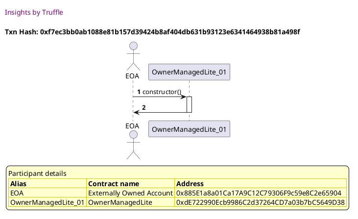
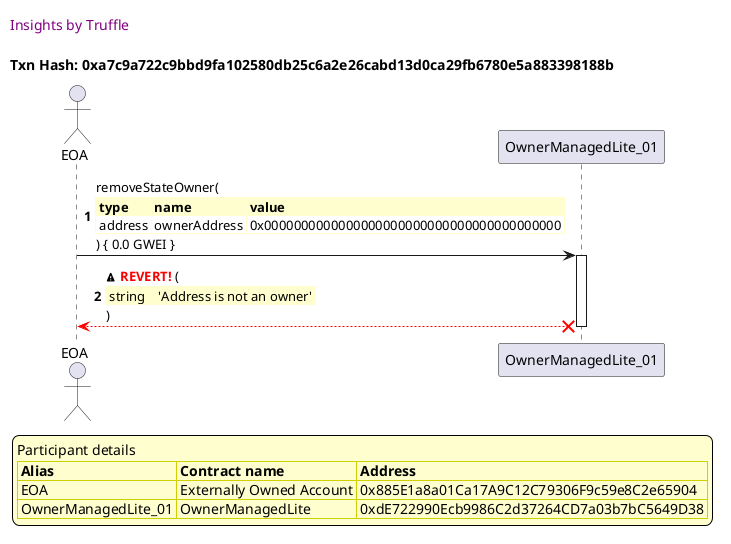
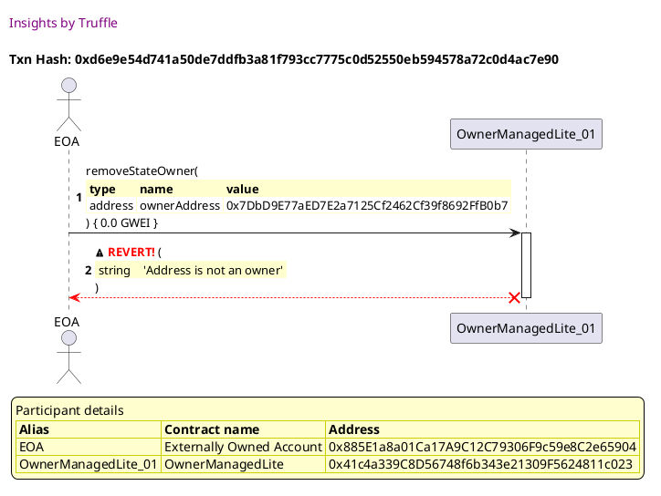
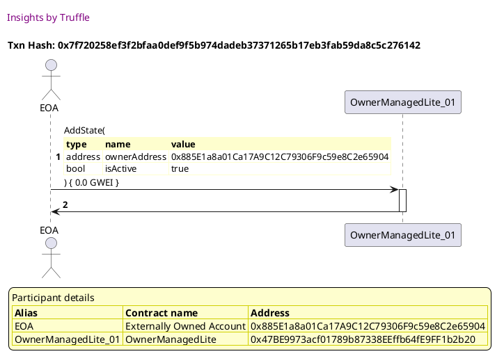
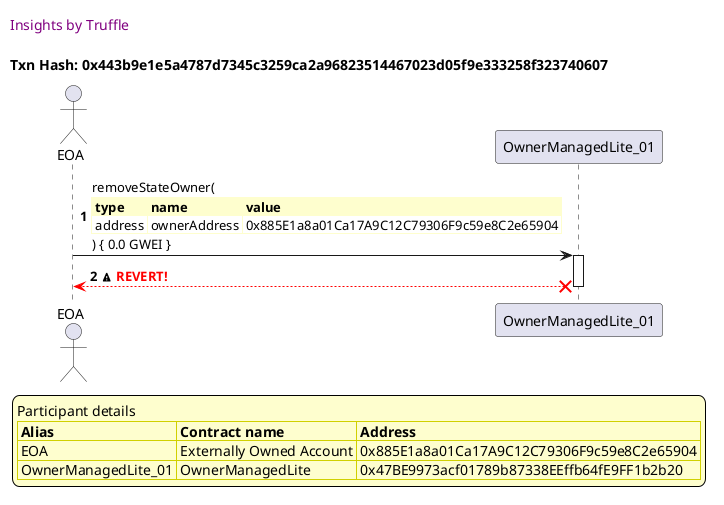
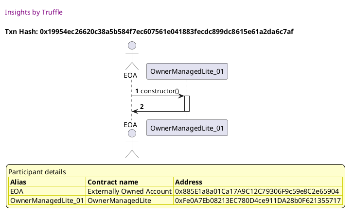
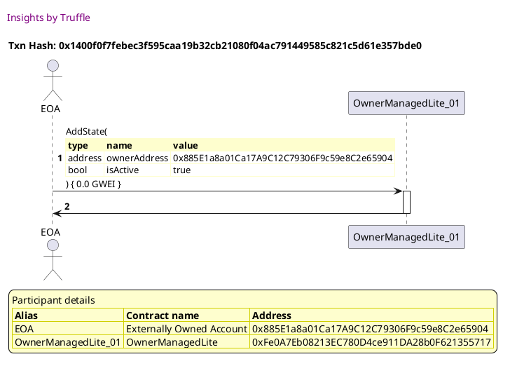
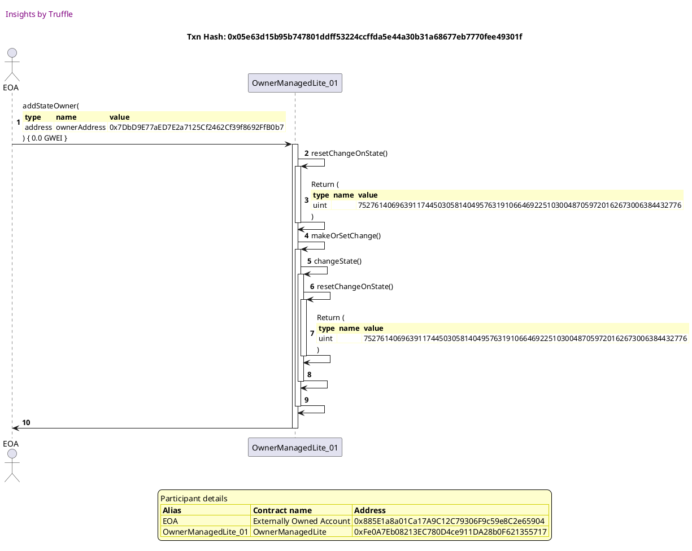
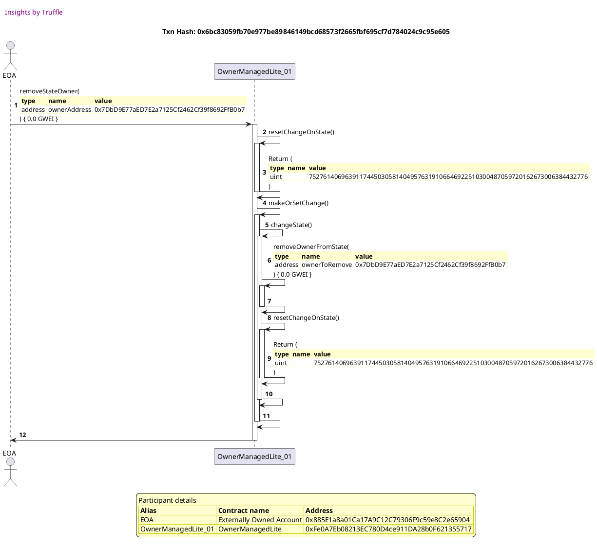
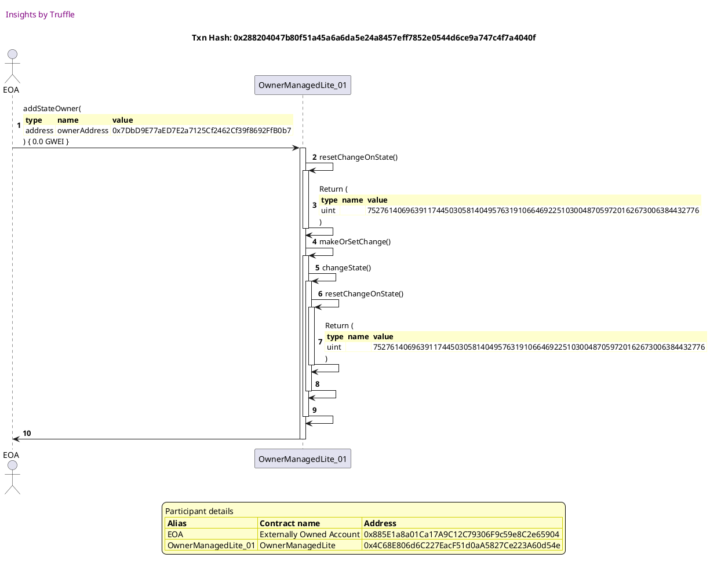

Test date: 2021 Mar 02


## Fails when owner address is empty
[link to test...](http://github.com/thedarkjester/ConsensysAssignment/blob/4fdae3d04e4addcce97e88f438735f476fc16bb5/test/OwnerManagedLite/test_add_owner.js#L22)

##### d1, tx: 0xf7ec3bb0ab1088e81b157d39424b8af404db631b93123e6341464938b81a498f

[SVG :telescope:](https://www.planttext.com/api/plantuml/svg/RLBHRjiW57tdAr3wigch1ZQn8SgYPewZLkhKIklxT37OGIKumbXBskxVHnmhMhNu0V0vbtFlFHU4Rhi0FlHRYn3qeNNzLcgFkXVZTk1XYwrkj5FVeNffVDixLRIszVXgNQxBeaHeteM3rGk4Xs-ZGMcFtyPVZEzQRrvR5y0khMdSLhiG5Ujm3bX7yYIvw_tEwW_4J_EgCMLdx0cKCgx1b8pGds6VVnsBG6F-UzUPPXCwB0_usVTr7NLHCC5g_Bnt-0wwpGoJVPthAfMIWAI4SysffDDSfO8bJ7Ae6M5APYcL8gL9ghEKKPOnaNB9AJ31QnGjgq8ilNnSOkZm9EuJ56qBfZ8xYAq-_dRQ_m07ZLOF9kXVX0w15_09GiDzVBEupEFhwnckMjS5tn-pVlgCBiST1KvADpECq6c0wEcVifGEO6o7vkCOlrojo8eGidZ_XkESOeNnKCG1-DWVTh3LHs2fbDTTvCxt5kz3wt7T1-qTM7iOMbPuMLNniOH8aJtdqv821q8BeFbI53GfSf6IR2sggT2yI7Gs5OHz5BvatV_ea42LUP88GSfA2i6p8b5fdcIiMEL0KfdBOXh7jafvJ12T6Fr0jt6Dp_ul)




##### d2, tx: 0xfb5d2737123f53f84b1155e719c515be76636dddf00d4d8a20bb117848f51939

[SVG :telescope:](https://www.planttext.com/api/plantuml/svg/bLFBRjim4BppAnRffKMQbjHRXcj4bUKcG8i4I81U0XIKIDb4QCgWgCHEt7_lMbOC5_MbEd39vJuuCoj2Bbl7hUkMcX3UkSPqor9QqZugi-AMBq7BkJJYAwyUvxRfZCWRtLXuDojcHLuGCcxTHii9WVvRI2waXTVX273LMFNI6CTrfjNSBALnMB5sXu0PNkvBhZgxqlAlYplr8e451zyj5qAPEJ0wk7xtTlnvU0GP-b-RLiqNheLo0_UsgskiIvnoMiBzsi0LRnSZeEkw38KN-p7p_3hqwoGe6Gj36REq2bbOoZYA_4W8KLCg0f5mZvOO4IT1KeSizLE2b5KEdrxSPC1RE4DxHf0sfogruWZrvjb8-uCRFfVYktBo5sLzu0d_6I5zFbnCJj_3-Va8CY7k77Vo_ODv8ED1XO-3dMo_WDki9A0rVDdR9wuxtEp2ju3qMTcsi8Lcro0x7EawISA2yOHJbdCMPsdEl3nEVHhDa8nK9hadep2bmLkficaq9gesgvnwmWxWx5kZ3_0Az1E5Rp-BQvJeD9eTp3tUYn4GiXypSdj4df2EAzqUmPpIAQLq1nEd2Nd4JOvZOb650-03g4FUPDiBXElQIMkurfjU605PLU58k_yauBZmAO7_zVODH15xNfhIeYhJD8boJ_Yn5mNvDERKB-Co3wCWdVe9Da0c1Zx89QxuS_u1)


##### d3, tx: 0xa7c9a722c9bbd9fa102580db25c6a2e26cabd13d0ca29fb6780e5a883398188b

[SVG :telescope:](https://www.planttext.com/api/plantuml/svg/ZLHjJzim4FxkNt43QMnb32TfNeowYfAc0saJ2D3sOKpJ9NPBHEfKZWCjTFzzrpIhG2lIhCXddy_tyjpZC7PSMJIsdXQCOMrBNKzJPLXrb-iP6fn2eIPAonFCxYQchBMCow8qi3jAHacSCDQhxA9GVGRDk5KebO6dTWjmMfhyiTGMYq6HJ_HKQKiUntPZCAB3jSjPRMQ5Ud5mbJygSBeRtGLAcUi9EBnL_Mvaxx1DWhNnptILJsvj1Ua2haqz7fDVPdDRABYUQpZ5wlO8-1p3J63ekfb8Kod6w73NZxXCNJyBq5Lka64g7K_o35qnJeCmuih7AF8y4JbHb3A2BBEKUd8-0AnWX-GE8zXidkKpf5BF7xGoNr7ZHCalkLM_kDCORj7lCDRSXuF-zdFOtpy2ewRblRgoQ5LZy-v6tx1UsuqFhUmlFu5Tp1IGr3Xjv3qMDIrMvaiW68sgAbX2kN8os6pvdF_dMBjw3q_0FtBu_3qvesPiptj-y6FNAFbpLTYwmeCZwBrzGAEfcNtePMjAaKs_qxbClYMNrsywdTvXe-_3ApL2PSsA34kWR-zl3Na5khI0UbtQNfidaufQbTyJRg-XloOwktZMFgaivaNrBFYG3wdu5S34P-eaBM8YgY7d6wWtS6xkKR8hYj0yjyfeB8f5Gmq9WooZHsKRwAF8JnoCa3inEk50n8uRXyBZmKXalb1HxAh05xpxql4sYlshRGB8XCWk14-oL8WeY5tfXMxGZOSXSYyDqzWFkcBeHHI0a6ZnOCSqq-_X3m00)





## Fails when the state does not exist
[link to test...](http://github.com/thedarkjester/ConsensysAssignment/blob/4fdae3d04e4addcce97e88f438735f476fc16bb5/test/OwnerManagedLite/test_agree_to_state_change.js#L25)

##### d1, tx: 0x712b9eca9a962c3838237c8c8d7e1879420f36d9f66d5b36756686d28b93667a

[SVG :telescope:](https://www.planttext.com/api/plantuml/svg/RLBHRjiW57tdAr3wigch1iR646LHCoTHAtLgfVLzkWRiM2KumbXBskxVHnmhMhNu0V0vbtFlFHU4Rhi0FlHRYn3qeNNzjZGUTI-Dsu67BRQcDav_1_LI-xPtkcXjw_7LUhLU5Ik4PbquM3D7UFWs1hJn-6tynVYkzSrhwmBOXMrgjpKkHCKgd0FMaJn9xdg_i-O3yRDvDPYcP-m9j6vSZIaPeJ_3Fliw5e76_FUkQ-fDw71vmC--hwgeYq8JhC7FUuVleDjCCTddD2cbKI11yaGnmKJ2SYMKqBcX8fTfGYh6jQmurrd9U9vnBhXEH2aPvpcWQ9aAiVJLum93XoTndw1eMsXKiuFOwkDlP_mFS50R_T04yulG8V02Fa5ek8zlvfTvV7qznQfrNV3zCUkdp-Xot57Wf7GpnGYT1eYU_YbBcm2DxT1i7EENgoLP4aBcxzzmd5EiC1wAE00V-yCEjkO8BBJsfelS-TxyVMWzhljWl0Dh3qFB6Y-KYeybH8hiXSXM50GGMW3D5xAWIP5BHlXQgamQKII6PvAa7uKlMVS_EYH8gKg1CLc8PSRpL5IyP2ap2ML4hZEUf89IHH8M4qGdHZ_GRLpZi_yB)


##### d2, tx: 0xc9b101956d7219241ac98b14e3e7ce5e458fa6e806b04f026e49c5200722fe4d

[SVG :telescope:](https://www.planttext.com/api/plantuml/svg/bLFVJzim47xtNt5YBviOcvquQL9r5Lbe1z8ca43Q2zBa99TYuJgLuq0BtV--QmWLq_goFFZiy_tmztqNnavRhvplbeOnrVd6Tii27MlljLqffvPWS86s-ghA-uLhEblbZMaSl9lFvhDynjYazHk3KmRzTuUgGWVFmn7Wl77wgR5UcSpeXLsYzLInzlk0ELs-b5nrRcNmhujh_OGWvDvtfQfAsmK8FhX-ztRoUNW46_fVs5OlxdmBnGPkN5VNL9TvxGt2pTh2kMhlni3NPLe8Bj8ehaQ1I0CfL9acXP0OugZ426MKr2h6XCS5bpKFOfHf6GMSZuAWHbanegpqzFJPPGQgXIEoHuneyxhKAqLGBnyjkX_AgWLMtxN7NrpqWGVyHupr-N0oFNmFnyTZoAhgsYkFxs_jBPiCAdmSx7Jx1VncXK3MgcLl7vJfQBCBtmBHvx1jOGlDha6sF_9raaGpeHB5HQx4A4jp4UIZDEJnd22dcEG1nb7AvMkfecaC9UesAxr-e0xWtMkZ3_0C_1E7Rpzd5oJHOJGxc2zuJyR0sCkOiQitv5NebJRj6vXd_8npleD9qqGyqYQdCN6amXxm7jG-Rxhj1Q9rxT5PPSoc5wQ2h2nffFr_4l2sy261__Ns3QGefGh3D4_EedWaapekGXbY84AUpgCua8aG9Gz2Qa1C37omKrhfv_m3)


##### d3, tx: 0xd6e9e54d741a50de7ddfb3a81f793cc7775c0d52550eb594578a72c0d4ac7e90

[SVG :telescope:](https://www.planttext.com/api/plantuml/svg/TLHjJzim4FxkNt43QR0oXlFg17KL9Kq7qYOGeEt3c2OtlfI8rAaS5rhe_lkkQLQ1LgB8Pz-Tx-Mv9s7ifBRIsDcaP4pERALdan4QLjyNUYgDd429OzJgL6RtOrFDj4ggiZAmEqo7QP8orgtjeiGUW-QvGwdGm7Dx13YhJF5KQIlBVbcCzGIrfOYvtJWCoRWEEPsPQOcl3DV54uBZRtINKgb2Zy7XhUfF8xj7RH6ipN-kws9yPsiOBU36pFASuZ9Rs1BXPgxXJDPtny3dAiGO0ry9tv41LoYKoaUUZ9nSn5wM2I62ZAl03GAEeo3s0n59uPBAbvd0c3E2BBDKUdhH1rd33iaTHh3P8YkcabgzUDHelaajnwY-5XP_SwTntABVOQov3uUzxNOuE3W6WvFg0Q-jjDZuxD_gMzPjf_6nbRtbPx2BAG99BIUDV93bZ3OhzoKGZ0Rh6fPGhOBqDqS-5uFH84w5aEb0fAuKZXiakUk7Rf9xSHw5iJlCJ_b8h4DzW6VWdpXy-P6Uqp2srpq__BbhKFrQDRRkyF0OkkyVfT4qp1vqipMboAVNwLobtzEhctUTJlUeqVVWZHwXjcP5XYNGk_UlXw86NLcGUjtQNbidKqYZAXu8jxVGNnETNRuOdq8hYx9-aNp01vpp5S34PveaRH8Ygg7W6wWtS6xkKR4hYj0wjsYqBCj5Gmq5_IoZZyesq4THa3eoajn9f2FwSUAu2H6HXyCu2sAC4XV38ER-wy3RAFQ_jadWEvalFIzEea4G2Z_Amv7dU-Ww7e-7GUZwaUDatFKe0I7Hui5EQANVmry0)





## Fails when the caller is not an owner
[link to test...](http://github.com/thedarkjester/ConsensysAssignment/blob/4fdae3d04e4addcce97e88f438735f476fc16bb5/test/OwnerManagedLite/test_required_owners_amount.js#L22)

##### d1, tx: 0x2e9616d2b076a4435e81b27ff8de1cc816a5ab6d719ba3bafb390414865aa8e9

[SVG :telescope:](https://www.planttext.com/api/plantuml/svg/RL9TRzim37pNhn3IbmrTCScE_15aGJt7GGTiQ87rVQ0bsZ7go84iOqdR_VUnZX6iMFmWoNVKaJoAiTlUW_F3hcKC1j_POLUYO_rJO_VWOCTRhD6Qhw2VQjSDrkHTspb-jIasHLumjkpziSKLu-EtHJ3e-Clqo_bTvvhdpdfeixQfxGwj9yNAdmCsH9uazuFRj_YE-Day8vVpC_O0nZIsvb9Cq9znNtwUYc1J_c-sR-gjxtbvv8zkg2hIPRxnBVB7W-Ltq6yNN1m2J2CPcQ0KSGJpUQWmaMKGLrLYK6gTo0WKb969PLf2M49LXgcOotaIAO04KqQMQK-b5_SPXvxFQ9yniiqtkja3jNh_swBx0HPgDDyRZx-470Clu3F6nllyPdMPvzVN2wuxstitl6Nzy95TZdiJE2dTB3XZfm6oXt_ACkYXQNksdCRuwMejraA8rUiNJdEY2kcGqm0SzSSjxF0Do8nns1DtlhTw7LkdzU3HMMZRuzYouPdMz5WyKUAG9AgGa82GESWuItCPv74QYcYJQfLYaWSOAJBslV0bw_v7nmHP62cbmh8ib4vB8p58LROMeLPXbUfeW_6Q9hnMb82ScFnWjxJIi_yB)


##### d2, tx: 0x7a9e8bdac90236a22f092a6be0ffa197ff879db62f533afb8b71adbe524223bf

[SVG :telescope:](https://www.planttext.com/api/plantuml/svg/bLFVJzim47xtNt5YBviOcvEGfAbOHPQc0saJI23j1MawnqwnS9tASQ25xd_VDOIgq_goFFZiy_tmztqNnivRZyvt2yCOThwntK8enze7RPVeS056pPMLNx5wcBkcix9eJEFWtQoSbKN9s5dhrqPD6FJVlKAf7BmCHu2BnkddndeqkT5pkr3MKyNQxm9cTFbQSjcvfL5_NTpePmN1wSvtZL9gEuU03wxVlJtxF3o23VqlRQldzxu5iOPRrzKrrMLUUwFWTcNX0jlxCV1LYfaQ2ObLniCemJ2iUHPY8XIlQmoojAv7QIP54jPn564jHY8DK0eLXwTX68cQ4MMLfwUNLpbW2qTaZnZHvdMbbqXGhvwiSZ_Gubp9xzghNppe0m_uZnZhy-5aSlWUZe_7a4jvuz6hztVsZfqDAdmSx6Jp1VnwgO2inKLl7z5qjDc6Ru3eSwfjOGFDja6-E_BLQ1IN0OwG1mK6QPuLGLYaMSIJMLR5H5CHgYJE-EbRAT4qXX9rcrTUFr87yEwjqGTu0Vw9mxUVvIL9T1ZD5kOhtfCnCFOwPknwZpofF6hJxi6SyYddV0kJfebuf4r1O-98XHtW7QXTtcJJ2qJhoYjdqPXrBuo4lAfefFr_4h1V-930_thx1dcKn74S2L76LIPaeC8ipgSygkAepgfafj8fJvDfJ0s8YO4FTauh_Pn_0000)


##### d3, tx: 0xb39cae338f7db9aefaf8fe5f4fb1187331ffb12068bb711d9825330eb7077d4e

[SVG :telescope:](https://www.planttext.com/api/plantuml/svg/bLHHJzim47xthxY1DBOoXfCqTOEwYjAa0saJ2D3sCAR9ISub8dKgnoajTFzzbpIgc5OU5aK---xytTrtbp1sMbffR3NB6PELBNGrYz6myY7JSsda37ASeaxFPF8mDKMbqt6H5mRs9z4a6aUC3Kgxod78e7dkKQPeuBaz0fmN9digj9NvAC-cUeRQ4gAoMuS96JUGyyhCS_pBS9Cz8JZThUvAfcccf-3mLlMxaOFZDWdMnh_GPJQzjoN4AxWrbLA4osncSuJRfOPpMTwV05_6Nf18zBo-4caSI5HIzHNwggjYn-aBptCKxLpUwyUnS9mqwBk-vt6C1HSYxH8caucbrAFB4SWIzaZkCQBDPaasbrJgvQD6yrLgESNqIsRn5tSQnntwFSQQ-t0qt6s7myCJC3Wh5dXZfSN6vzsTlcE3jXiVMZbSVmAxcYEGr7BMo8NCAzhKxciW6WsM9QoXg456soDVYZ0EWqW86OKYSgLmN7-it6xF7IilKFrUu4xK6O_51kezF0F_oE7pz-Y2ch4xx-NHZts3wS-wi4s5HoSmUFieZQPc3c6GR4QAV8QTpdNqBRg-VTFf38uR_H1UgH5AQ-fXM0Ez1udCS-fyLe8kB9c8e4rn1sscB4LgLhQe3Q_mlnbrTlMYWIbQcUNbY_0X3pddDSKqqTHBsenfL0s1RydU4hgzH-dMGqBhqgBHbEog6OuKHab2dvNzJ_9V0kyQid-rJO2Hr_DztulZo4-2E7NG3VnHoBt4zrIGz2OeGYvweKy1Y8cM3tPAA_qW_W00)


## Fails when the address to add is already an owner
[link to test...](http://github.com/thedarkjester/ConsensysAssignment/blob/4fdae3d04e4addcce97e88f438735f476fc16bb5/test/OwnerManagedLite/test_remove_owner.js#L36)

##### d1, tx: 0xa04b9fef3ea43f4a0d4c3fe0f115f414daff3032c84a5f185046fbdd7aa4e0a4

[SVG :telescope:](https://www.planttext.com/api/plantuml/svg/RL9HRvim47xthx3IbqrTDJkO054MDQMWJjhKIklxTE0piMfCP8oMTDr_dqDGj6hXmJRVT_xkxZiJSjjxS7ve3I4m-CuEROMEz2_Qxi11ImqsQEKTr2-DwmOhyyvqZbwLHLda1I6htXyChWaTlos2H4T_Jx-KFdHEltRMWzaOtTWMhG-Aofy3oa2U97U3snbyH_pGhqYvE6DF8AMs3ULiWlwC--hpL0IPyd-rlMwslgVLWJwxGQcWIxps1kdptj87wBTBolR0H9KfL162Y9G09aKTAMIAyrW9BYGe5R5eNgS2OiNJc8c5ggHC00Go42HOLljGUl6ueT3JMTXd9DZcTQrt45fz_6NHVGSB3SflskDFniV02_YCaF4-lLbVvkdrzPBMdUsz6uvPFtmab-EE0YUbcoKbv3H0ylHFMH8zQDEJrJJ6JrVtx9unjdxxGiESGeNXa8S1kD0VjT3Y4TX8wR0FtFdU-criFQnxZyw2COUnPKatTHqUYmyKswTfN718WV4SUBB9SZxFaonYYpAhumpJV8wBE6FYlV0bw_v7nmGYkIkoB8cWLemdQLQbIHIbHQ5KjH2goCgIL_DgpaA2uCJa1xaDQtZsVm40)


##### d2, tx: 0x7f720258ef3f2bfaa0def9f5b974dadeb37371265b17eb3fab59da8c5c276142

[SVG :telescope:](https://www.planttext.com/api/plantuml/svg/bLFVJzim47xtNt5YBviOcvCqTL9r5I6a0saJI23j1Mcwn7QnI9tASLWBtV--QmWLq_goFFXyl_rzTs7ijFNeVBUi6SFEDxPRbignzi7O5JfSGgqMoieph1uMhkcip9kwSV1kNioBl61islfDhMOC-kzUeLGEdWSLuA9nvgcn7kkiDWkxLDPJHUtt0NDolfHSTMvLgxySD-P9GJ3QswvHIcCN4F31zBkNqy_38zZG_zAsPd7lMoWtSEiwhQakyyRN2cxN5YwmlPy0NmijGXx6YTAH3akDoANIgOxBL8ma5IeZ4OaW7CTb84ZHMCQfnAIAgr2CWr78YBBAqzEBgmomXIEIHuneywOoAoIeLx-iSj_HuaB9RyQhdppe0m_OZnZhy-5aTjWFnySJoAIyyUZL-pjxnwR353uEShRz0dwpKa3IuhANZrXtTDc5Ru7eSwfjOGlDha6sL_awIU8Ym0Hva6CWiZGFmboa4H_FqofELPA7QXodVFHQgcoQcX9DcrNUF587yEwrqGTu1lw9mzSVnIMDw32Q7SmNl2SJOEnbpTZr6_AaycZgzWtCStxEET_1f6qY7kcIqveuci8Uy1xKFc-sxGT4vzehPx6kD_rW96HLHIlj_vE0juKF3VXVQzzW9CwAD1KHLfe78adBH4HHKXHQb-EHBjBvF2Z3CkJKW9WO-62dTDBF-GS0)




##### d3, tx: 0x443b9e1e5a4787d7345c3259ca2a96823514467023d05f9e333258f323740607

[SVG :telescope:](https://www.planttext.com/api/plantuml/svg/bLDHJzim47xthxY1D6rb32TEcXXr4IMa0saJYA7jOKoJarnAHEfKZWCjTFzzrpIgcDOzp0y---xytTrtPyPE6gkCRMSLOwgrjMvdAHhMt9TwheoQGOLJrFcfokwdfcvr7jTLRM1_aaoIE65irDXbXH63RjsXoj70Sty5EAzD-LHhgwfnLKxr3BKbnC9k7IPat43EMpEly0_3b_89mV6skYkLvwMUWiDxrQzEZexw95WV_q8tvVJEDf0kuSQqHK6up9QsGhXPQ3XNpTqny8NdYLIYWxxoWZ380-7vcN1zcIbNoM7e2j_nl670NP5plv0e15d3GhWYyFYG1umeooobdboEGJMmHtAF4MsspCgveb8l7pMQpqghAUQVIei_kTCvxj3lCTQzXyDejnqE3ex1uAn-m2zMMUnytjpgMpRgk_6kbz7g0zZb786aLhDEFgYgfSFQVGL4ey6cWHNKQv3nzieNOUWdZWeLTsBb16CPEsuSIC674vdv4iFOnQ4lkRU1UWlFmDzp-FWjkQ1cxCvxSVXzts3-OrtOfiB3OnYzVbH6KpCZ66MRaIAVQ32uJhucrpUl1eFHKQUFM8x4Slb09V-BkCsCigiNpETeLLarBxWvusUSypKtD8hK13h4D6E6mBSiRPdOlejMNNTfNrWqMbNLikjg3kCie_zW_vErby2xfkDlRHV02quJAGEXie8xGIZJC10YJ9AYI8TUaSZ9n4dTrEKKW9Ze-M0djDFF_Wq0)





## Adds the owner and then removes the owner
[link to test...](http://github.com/thedarkjester/ConsensysAssignment/blob/4fdae3d04e4addcce97e88f438735f476fc16bb5/test/OwnerManagedLite/test_remove_owner.js#L41)

##### d1, tx: 0x19954ec26620c38a5b584f7ec607561e041883fecdc899dc8615e61a2da6c7af

[SVG :telescope:](https://www.planttext.com/api/plantuml/svg/RL9DRzim3BthLmZfPKDNJ7By8GTPKC-nqG4RMc2z3un4EqOTEP1bB6cx_pxMCO8LYmwKz4WzaezYxBRtuFomQnc3mNTss6tGiVwfiNjmiECjrcZDLz1FjUi6Q_AkxHo_Aekoo0l6bhq_jhXYV5nR18EElqnNpkywrpntraERjKrjTsWzCLR-752IyqIv7zo-nNUEdyqpSXcUiGSmfh4rbsA2_epxylDK19loVxDzKszzppT7_kY6gY9UvXlV8dyyM7u7_NR1nK6cQHIY3k8u47gk8Df4AgmIrB58ebYY2ALIymgrqIfDoSGombX2O23M2LIC9DEUIY_kCmuzdz4-OoIRRtIp1shr_hT5zmCir6Y-Dnv_2Ja6Ni1dZ8tl-StgifzVNo-uxcpltV2MzSD7TZdkZU34TBFWZ9q6o1x-ASkWXwRjsN8QuwUhjLWB8LQlNpZDYIgaGqu3SDGVjx33Do0pnc5FllExrUlOEjc3HsUXROzZouPdMjDdyUGI1wMYGe828NEGIPRcCiYJT2xYCjLHYYeFC8vI4RudlYJT_-YOe4IH9SL6g43EYpnHOXrgJALSPu7QY38cE8eIcL02KcBIWzsIfM__5m00)




##### d2, tx: 0x1400f0f7febec3f595caa19b32cb21080f04ac791449585c821c5d61e357bde0

[SVG :telescope:](https://www.planttext.com/api/plantuml/svg/bLF1Rjim3BthAuZkig7h9YLsR1TPKCznrW8RMg05TYamo3AT25NaG9RRfCt-VOpZ1XsMotmG9L8azTwZ6Rjel7I-NHh6PEjhsouBTAnvq7ObdLo2mJdQygjK3tDNjxRCQbCxU3VBPtcMCpPk_CRWX47tBL2MwE2bFm9Srau_rzPBanezjqkqdYfM_d1XHi5zoLNhLWR_2jpgPmGH77mtiYordOFWlUjtPyUV-qUmll-LRVHyuHieDd3dsggYkinhRn3krXOkPRCu1xuM0USLhw8A2rJ3Aan29QL8Yk505GF1Ome6KaM9288aZ4CL3uGAov70OHWL9N96b2bFJy-lKv0Dd90zOKIRrqgl946zVhBeVaWhvrX-rnv_ST5TFE8_OQpBXxF9yJYSdfv3MfQtNdfyVs_lsRXNuMDl9zilu3Sh1B9MBZlxA4rBcztrBH1z3fi6jb3l6gI78r_7SPWB6KikCYcYDCd488kI8H_D4XKc66S378K93rvB5NLjA54tgVBwaJg0Tw-DFi0By4ySlltChqYYusXsCFTupyw1iVsOiPitv9NefJRD6vXJFkMSxs3ID16FjCbeJ1ofS01y07N8csmxWMXTUtHM6hFfX2aXLOf6slyd0MyB7nFuNs_NO8OyZVA2qnGDyooA-JHGc0WnJGTnmMSZSeTX929gG4pqVB0BMkdd_0C0)




##### d3, tx: 0x05e63d15b95b747801ddff53224ccffda5e44a30b31a68677eb7770fee49301f

[SVG :telescope:](https://www.planttext.com/api/plantuml/svg/xLLTQzim57tNhn3TIqlNJPBrOPSkD7MSjR2HiXRsKXYoVPsQEagmvIrfi_--6oSBBSi62tkSCRxI_JYIpaN7X9mttjQ-dLI4sDPFNJj9eIRDG-bcjhOJMi4ON7vXiuTnFMrT7a-hQKrV3PDX4YU4d3L-KK6FqEwv1vj3JPysKqelftNvE7NULlsg7Bi9E8-8XTyc336uXforzQo25u6RyX4ebrlVjStpqeqfPnlNzywUlTriWcpMlt9DERxt3KqNzBPkYm9nYIzz1VHsxkYbRUvFAPip1Jh8kKeZbHffGiRpl2XK88JCigB8hG8fRS3IW5iTQcCWDSQm0a160UC5GSeoZrjFHdrg6tg0ze0WRRxCofd5euw-EQW_McV7a7yeFNnXl4lSuJyWfAkd9xtTSNfyV4gHW1jlFNG9XtVkZfnjMl5wOtlBTzGlPa3HEZlfx5TRjJXOfIzN43Kq3LtIwGgalvsokHcaWoWnnYO3amXhk51n8QGMSH54HQWZCImkM6hMK4VqYR8tZBx_d5nX9tPl-e-dmON1n_VMZM7akdCT7lqjpid9AVq4lgqTtO-FjiH6BIc-HWcZkMGwqa74kP5IiO2f45qoKaO7FE9CQuay2CKnn6Hec8gCO5mBRT2XWr3AG1YZDnpjGyl4Fi2ellb9pU5U85bNkoUf_vlps-FyuvhrbL_baBNIakjd-f63jsNLFEDjm0QCiHLlAAWe9JY8KIbh5A8jWzihlQthBJkDmk_SG-riLIqwRSffFyjGrNrt_SDG9To6bl7OSjEFOYvYWqgdXr6c8WXZ0Lf5JBu4tgLnltgx1OR0-YP9MIXuaCGek0EP0JPpq1TXoeOQtKePZlf2a8aD7-GSl_X_-W40)




##### d4, tx: 0x6bc83059fb70e977be89846149bcd68573f2665fbf695cf7d784024c9c95e605

[SVG :telescope:](https://www.planttext.com/api/plantuml/svg/xLLTJzim57tthx3O2sXZi_FX3yGgIfeCf4r5WBGNfCb9d1AHEfNZi1Qw_xxRDEj0guHMeJqjYdpZUwzFxEEZUn4wQPoohfrM2AdMrQQTfjgYvguqCsNL55Twear-ghAxYQrRaqTrLLly9ecJE8eHEcxSej83XBldLgjSM_pOJp4-gstvK1kdgc5LJinK6mU8XTia911SGyvQEwlqiy1L-Q0n3JQ-2vNdfPbWIdhNZyuUV-WtWVh_dvkcdDow1gSBV6tReW1Sv4fNQNmzD_XCDRT7cCnPcWcVXB98ET6IyrGBAG960vbcEHCXzmkFiR182oR3hE0v5m7nWancCjICX0WeonniFHuFiMhm7jWz1BIvCYjd2euw_cwq_QACckZyS-dqDqAxn2t-FOIwzVXmi3sEtxuzmbPFwtjzvPJJNSx-ZRb1n_rjlEljOFaHkyLCOx16JJjxhweMFbRfImmqMjqqU8dh5SXmCoLpFaf7CkPSnICUUufJBumABs1ULFYo44nwIN5AKhw6Ei2FcBmd-DFN-1mkO_k-NpXGerrqgyn4Zqrthls3lyKvF3p2bzgrrk3T-6XBkAibXfU77WS142QPBodbGH0Ia8W0Lo13pdmgAM4i01wya4A818A3XBX7AFCO1mVpHH3u7kUivsWNMgRgJe_jrIzgzdS2oRgrEvBwMsrTEB7rT8tq6egxhYyxw7ykkPLK_ilqLMIw2vKlh5dNlrKEMhSTTF6acERQgR9gdl0s8YD2o8etw2vGL-4ZWhPXeIfl6DmKjyswmR8hs33EdRP6LTMYAzGv7cOPj3ZNgLA8CAPAA48ZHVbGHjIBkFG9IsGMIYqYJxDGak0vyBQ2_wUt-q6YoP37AH4UzUE82p8ACWsNEHfw8YK90tSOSWgoHy14pmSwWH6QzKy0)





## Adds the owner and then removes the second owner
[link to test...](http://github.com/thedarkjester/ConsensysAssignment/blob/4fdae3d04e4addcce97e88f438735f476fc16bb5/test/OwnerManagedLite/test_remove_owner.js#L57)

##### d1, tx: 0x234fbf085922f0f96f7246cad2298a98df991b14767446a6db8b660c1381874d

[SVG :telescope:](https://www.planttext.com/api/plantuml/svg/RLBHRjiW57tdAr3wigch1iJ646LHFTTH9srgfVLzkZROGIKumbXBskxVHnmhMhNu0V0vbtFlFHU4Rli0FWnRYn0CeNF3jj8UzS_6xS335blTQgU-GltS-cvmgkXiv_7LkboNHOdGiWy7grS8Zzz6Wz8Ulqw_6DztthnqBe3DhMdTLhiG5Pjm3bX7yYIv6_pEwdV4J_EYCKtEs2CePLoBAPcWF-E-_3mLWQRytrnlsateSNN0JtvecgYBWWbMuwUzm_VGRnQOxDayQQg6Y5Gorf16yYPZ2Qz1CIO5IA4QAMb5aundISA1gqfKd9EQpWKLMQ9GjAmEiVJo8SVGurdSPoZQ5anjTX1RVVZjjFy13bgjlfkWVn4w1bx0PmYDz_7DwZAFhwyNkEvS7_nmpFhX8xeSTnGuATqiC4Ad0QB7VyfIEe2nFLfEO_nqTKVk226hjoyupYbM60z5782F_M47Mtq4SgMyxYDtlhTw6rkFwpvexy3QmzYomdbTnySI8aNsGgGb1G645a2pN1QK5PcS4xwMTIgrA9ZcgIJ9U-5BrlsFZWcIWejI4AvumLXMGhrEgIAGfu9bXMPiddEYqYG6e-Z4v0UwZMjyzdy1)


##### d2, tx: 0x63c2026170131fe598ea074292a95c25edbc8193a4b4aca74eab469f5d1455ad

[SVG :telescope:](https://www.planttext.com/api/plantuml/svg/bLDTJzim57tthxXYBviOcvtc4x6ABAG3QHD88Eq5QRgDRuk5wrIE0orq_trk6g9Ewylou6jVtm-VSsuOEsySMjSkD6FOkjgqYobPrZmgiqIB2z0q9oE_OlKujtLhP57hsiAxIJafYvAniyQjDOqPTDy3eIGBh_qHuBAswgKs3dMkrTmio3XVSUQ6W8c_t9LSjdQfwQ-BM_L28CB1TuDIAZC7mNlNxywUVUuVmVh-LwPHymVNm7GDTxQTpNnTvfJJ17Sh0vVOF9m2NyMZAk11B18kHc96KPOIyYGCiW2pg0eYajCg5Ta8msc85IOXuJICiraaHHX5A9cdh7B-wULr3jZ0aRT7pDFcLAMMwA5UFnkoFz3WdEHtvUWN5rtW0VyHOrq-d8mFtyFnyIdaKjuwTFJ-tjopirw5ZxqTRxw0Moy9l3MuwEmJwjPljk4RyFHPQXhOGBrja0z7lahJg1IO8XS5YYJF2X4KIJRYyIIheepI8g0uodZuLcfQrzedgYQld7ho7S3PjqOVu1Nu9mxVVfPNNgB3QBOmTtXFJe6ntPYncpto93bKkjc3US4lEETRc7wQF8z-K_WniLw50V00QiWRRpg1_BfoP0rglUw4aP1NbHzfzvy4x1S-9F2_tgv1MCHfcV9OnaKG92LMaqX8ZdcK1ab1GJ3AOowZq0SppqJF1pltg_yv_m00)


##### d3, tx: 0x288204047b80f51a45a6a6da5e24a8457eff7852e0544d6ce9a747c4f7a4040f

[SVG :telescope:](https://www.planttext.com/api/plantuml/svg/xLLTQzim57tNhn3TIqlNJPBrvTA5fewp5ZPIri9U2kF6bbDJHmcol2Ljzj-dE5veMJPOsEECyPNknv5qBZf6wBpsu7mphH22niziCnqRX-g7qix1mHHNPc9iVW7PmyJD6fidishcyAjXEaoJ5A6psYyhqqEuVUuDvCRXfswAyUNCbOypww7gL-N4Jetr0R7msuHX26uWvusRL-P5uAPyD9ZohUyQyhoq4qn9v_hUshEttIPGj_wLhSl9lQ_nU8blNLCK0HVvqbS6touileJw_XIJ1TEQ4Kwu6cjI20fSW0IPWp2CW-P2cQ9GMZ131EUvp4mCYgkC5mf25IbGe2ppOUlfg8-XnWV17g10co-pSWxXgADlrhYFO65YyW-bDry8RHDt-0yGQklnIMzt71yVd-90m8q7Rzg4mpjxXywwLhpkR6_r3llbtE1WBKnR-nMg9WpMwQirX3DrZLTujWRfRwTaeGRZGPmg1Ub0fGmKPI8f69SiAQAuq39cm-A2ZDK6wWW_OVA6uFUVqwlGYTsR_kDfmiB69_TW9sPastCT7lqjpid9AVvaVECite-FfWoDMk7mAi6Kf9p8M4OnfOfpGI8YT73nM2WPqPWIANdWWGaQGeHhHKIi6A6IIHKSCjASHqmfsN6q3orJU30ZT_EJciEzGBAsTazI_pVdjyVvnpMRAx_EGHkbHTVFz2Ct7iggViRRW0m88MlUWg06AGc392Yb2qAqPN1xfRTrlLMhKU6xyCPPgAfbgqqvxcTPK7NVNd-jHKf10w49KDMF4yeI5KT43kDCn4Odp4WH4_uIU9V6_Ufj5-29rAacCfS9Oog5R2XeJg0lD5E9OIpgIv8B7f9HOABZ0vs7R_W__G00)




##### d4, tx: 0x566aa4fa010a139b0ddb7c4a49c12515bde5d55d6e16da2a9a623972dcb25d75

[SVG :telescope:](https://www.planttext.com/api/plantuml/svg/xLNVQzim47xNNo6wbvQkcoJhXrswqDHrri96obhOIs5SB2KnTPHWorlIPl_xBauMMfOD5lOuOtpIwUwJxfFqcP3pEa0Lcab923HXwfl9m5MaVYZy32gOqDADdBSNa3-CgcdZRJejfnLzrSjwMPeHSbQ7HUawXBRFs85r5NtQT2czcbR5uzG7ABjbCV8JvmCY3iCse8U3QyXPKyrAzsBWjdXqbCkjxmQiBVo8ShPnVM_jsTlD8iXc_cjV5wDngEbWGU-gPZX4N1AAK3fwD_Vq2khnAMLpfJM070BZ37YK39Yr0vDBa4dEXU9gO9soIbdjkBOW804jeiG8cm-4iaOHf2mFkFIitwLGqmEq1mHf2qLUp01BxN_phle87aREVYY2-y9u6xZ3Vq18cqzFEhl7wV7nAKK2RWC4rmOStljxShRPYjSRsrc-es4nSnIjXqbhlqBPO6CLlbn1LAwkwP9ELo3TRPVDpUM5Pjc5v8P5DdCyuav92OdXYW_4PHBbKaSMXcke8_f4sHj6tt_Ehd4dTY_wZzNWn2waO_0Zr_TjNOT7VujpSd9AFxdGL9xknqTJu4OjARv62QEvP3hHKSAvaLAnYAaONJ9HHaSyuKnhgHE1nmE7c8mDKtWY6DT26tJeA9Oo4iRe3KVxq3A11zUlRdzISxWNIDxcxadg_ytvRJd_E6TzvLSnPAsqvEQPVbWNe2ZhPxnTial6s8et55IK4coag9GL2j6MmUsLtkPrbgr6uNSUNEMXB1UjDbdQpNDKzT1U_pXM6OSOzJ05Rhf9oaLgaeZfNfAhnCMfS5ebJBu4tgLnlthR2MIguoncskfK29D1tbFSCkYgM9ZK2H5rDRDAOZ119ZPya7Fyul_f1m00)


##### d5, tx: 0x08e738eac7a90eb7b0c7a75397489597a6eb7a0efc33084d54c45e4515b69182

[SVG :telescope:](https://www.planttext.com/api/plantuml/svg/xLLRJzim57xthx3O2sXZinrVOiGgIfeEf4r5WBGNfCbDt1AHEfNZi1Qw_xxJjEj0guHMeJqjYdpiS_biVpuw1w6JEXWVcac9a6b2vPh9q7fKtnLkQhoPuDAEhSjFJNOtzbNZygGgAu_VzDD-cgG87TTXNjeEmkrtQqrkFNvSBp4-gtpnKBbWocvPZDt4kW28ex1nw8Dn1Jbj_BIqpmnNnOF5b6zq5oRF2pV6bAnLFrfv_65z2BJU_zpLnVWsr7WunzU-6Oq05uKYb1PVpnm-C_Nj4IOp4biLnTPaocXYXsf8OAP4f1MFjT3AI50QOaTP596Ovu9dN5Wkg1XAJME6WB8imD7JGHUR6k-1t4D0MoYoOchWgeFlplelnfcnpJyNmNuZj7NSejz3g8t7XvtjTlpsxH7sTbBTswjWWcrzzc_S3JfUlyQxjUmiFk8mdreCqfb9A-zDsS1awRx0GAEtTOqNk5g2T3TBCbEzOK-dIfcqfr9c56KY6J4kMJAAz2YMclL7fsIeLb07-16JzmH_-fgUmsDiF_SB5wfjI6wD6zk1Q--rV_2tE8U7H_ZIXiOxl1iVJG5ljS3mAy6Kf9n8BIDDgU9Sa8Y865HS2oKZgYcHaWCFJ50m4Huh0hd229LCAb38AEOyOah9DKUxq38nTtRWhtvHixyJIDR6xaZgxsnhpNrVJLP8hv5nrzLb2_tFKswPAl_Jz5NIT1SgNuXPrR-b3rgr7NJnf9ZcDfYYh9_mrYCzGiYID-WkK5TXaa3Ry52LDmnkYjichhDe2pQCis2zCsKvRmjrZhjP1Yqkj5aPnoAb9ZQ49eQghaueIvIEYEphJ6WR9ynAeGb_3hojuF-fRJVWYOpJcCXS9eofr6HzGNDYkY9cAh6CHLr9eEM0Cm8crdoW4nYXMVy4)


```plantuml


@startuml

autonumber
skinparam legendBackgroundColor #FEFECE

<style>
      header {
        HorizontalAlignment left
        FontColor purple
        FontSize 14
        Padding 10
      }
    </style>

header Insights by Truffle

title Txn Hash: 0x08e738eac7a90eb7b0c7a75397489597a6eb7a0efc33084d54c45e4515b69182


actor EOA as "EOA"
participant OwnerManagedLite_01 as "OwnerManagedLite_01"

"EOA" -> "OwnerManagedLite_01" ++: removeStateOwner(\n\
<#FEFECE,#FEFECE>|= type |= name |= value |\n\
| address | ownerAddress | 0x7DbD9E77aED7E2a7125Cf2462Cf39f8692FfB0b7 |\n\
) { 0.0 GWEI }
"OwnerManagedLite_01" -> "OwnerManagedLite_01" ++: resetChangeOnState()
"OwnerManagedLite_01" -> "OwnerManagedLite_01" --: Return (\n\
<#FEFECE,#FEFECE>|= type |= name |= value |\n\
| uint |  | 75276140696391174450305814049576319106646922510300487059720162673006384432776 |\n\
)
"OwnerManagedLite_01" -> "OwnerManagedLite_01" ++: makeOrSetChange()
"OwnerManagedLite_01" -> "OwnerManagedLite_01" ++: changeState()
"OwnerManagedLite_01" -> "OwnerManagedLite_01" ++: removeOwnerFromState(\n\
<#FEFECE,#FEFECE>|= type |= name |= value |\n\
| address | ownerToRemove | 0x7DbD9E77aED7E2a7125Cf2462Cf39f8692FfB0b7 |\n\
) { 0.0 GWEI }
"OwnerManagedLite_01" -> "OwnerManagedLite_01" --: 
"OwnerManagedLite_01" -> "OwnerManagedLite_01" ++: resetChangeOnState()
"OwnerManagedLite_01" -> "OwnerManagedLite_01" --: Return (\n\
<#FEFECE,#FEFECE>|= type |= name |= value |\n\
| uint |  | 75276140696391174450305814049576319106646922510300487059720162673006384432776 |\n\
)
"OwnerManagedLite_01" -> "OwnerManagedLite_01" --: 
"OwnerManagedLite_01" -> "OwnerManagedLite_01" --: 
"OwnerManagedLite_01" -> "EOA" --: 

legend
Participant details
<#FEFECE,#D0D000>|= Alias |= Contract name |= Address |
<#FEFECE>| EOA | Externally Owned Account | 0x885E1a8a01Ca17A9C12C79306F9c59e8C2e65904 |
<#FEFECE>| OwnerManagedLite_01 | OwnerManagedLite | 0x4C68E806d6C227EacF51d0aA5827Ce223A60d54e |
endlegend

@enduml
```


## Adds the owner and then removes the first owner
[link to test...](http://github.com/thedarkjester/ConsensysAssignment/blob/4fdae3d04e4addcce97e88f438735f476fc16bb5/test/OwnerManagedLite/test_remove_owner.js#L76)

##### d1, tx: 0x15b69f3554541ec0bede65d94767e8f0c9314c6a6938da45acc22058cbb08a46

[SVG :telescope:](https://www.planttext.com/api/plantuml/svg/RL9HRziW47xdLw3qPLDN3HnZcoYBwZY9EcbJAwtlqndE3gg38uorfEl--uXZHQiMFm3-lkExk-yWvBxpu7o_QmY1thUstvNeIFTYx1uSx6Y3DLgz1FLIkxQtkcYRrj6RpNgpBjQ4p3j_R711wF1j4JGw-dlyfVIXTUQrjHwQl36rtQ7rGR7obu1D8C-I-zxj6tn7_32lI7bymPv0QsDhoja8_Hds-UUn23Bc_sexKszzHyiZVNPzLGLTuerla3uVB7s0RZkZxC15cSXgAaGiOewAbQWn4Lh6QP9YLZ4bfpnM2IHoccc81IWLHKnagYnP1d52WcNAXzBNZpc5Zax2FY71Dc-KsKDezV6NHVSTBDIelncFFnaV0g_W4qA6-_HkSPsdjxSpgbhRUTUVidxuIAx7dGJEIdSpIiXvWEJfdx8qUZ1DH-RZ63_ThDYACRPu-qB3d4A5uL240RZG7xMmmnEGQ-sm2zpbtk9jQ3si1u_EGjCSXvOrpPKAZyK7YXsoJAmvPC1u0JpDPS6Z8fLJbcoa4XAp8WgkInQ_5xvctV_ea21diP1995VLKeXf4PMPp9bWUH5jO9ckO2MMF1Ky2Gc24wCVv3wiuTd_1G00)


```plantuml


@startuml

autonumber
skinparam legendBackgroundColor #FEFECE

<style>
      header {
        HorizontalAlignment left
        FontColor purple
        FontSize 14
        Padding 10
      }
    </style>

header Insights by Truffle

title Txn Hash: 0x15b69f3554541ec0bede65d94767e8f0c9314c6a6938da45acc22058cbb08a46


actor EOA as "EOA"
participant OwnerManagedLite_01 as "OwnerManagedLite_01"

"EOA" -> "OwnerManagedLite_01" ++: constructor()
"OwnerManagedLite_01" -> "EOA" --: 

legend
Participant details
<#FEFECE,#D0D000>|= Alias |= Contract name |= Address |
<#FEFECE>| EOA | Externally Owned Account | 0x885E1a8a01Ca17A9C12C79306F9c59e8C2e65904 |
<#FEFECE>| OwnerManagedLite_01 | OwnerManagedLite | 0xA0459629DfB553C2b89A050AC2FaB7DaD5B17516 |
endlegend

@enduml
```

##### d2, tx: 0x5d9a6c27fd42c5576c7872c6c489c72e0331a661ee76d41f82572ef7e5475054

[SVG :telescope:](https://www.planttext.com/api/plantuml/svg/bLDTRzem57tthxXYBvkwRaw8yu4OQWYmLjhKIgsqbqgJiHsmQXpaE1sqxB_l4bB4D5wM1r_x-dxud7D3o5NjkVFDoX326r_PPZLNZjHFsgwvuoimQg6i77Fnj71LOsLHcSh1kzbqDYscX0nhlpLgHA3zbefBvU2rEm9SLqw_LDPpankzi2jbFLOi_J5WXfU7akl6hOtww-9UloW8egFlZakfxG82shb-jtRukNi4wVhVs5elbhw6-HOUN5EMM9TuxOs2Xus5Qrul1q0tJ6Oy5c5IoYWKZ2MnID8a5B68qamaeQBzVi3ZE50gYMKKb6d8q5icYaK9eomYI9dm-FJfRGwyXXxQ7a7Ql1PwpH7gxI-ht7Tk-KB9RzghdpHe0y_uUuIq-N0vEdyF5nS3oAMyzzohzu_saGmx5JvsThJx0dwxLe3MybLhdxbfSBCFtm7IvrHTmmwgVOFyUAIRD6NJWAUS1WKFaZmhWh18iZwDPvbWcKgBKCKiez5RgNbL6KpKTIwyViOEuDrRem_m2lGJXQy_fZSeqNaqUvW7l9S38EGmPkJkX3ofFDUcFe4veHDAwHucJXFoY9i2nyIX2aV0Hr37lD6k5GZNZLVEScEshJ0ISY5mfFr_4d1Q-9p0_thR1ZcDM1Q7sQGSCzOlmdcQvPJHl0XdV9nC-8IDWuG5CJP09Ze-o1Mk-7F-0G00)


```plantuml


@startuml

autonumber
skinparam legendBackgroundColor #FEFECE

<style>
      header {
        HorizontalAlignment left
        FontColor purple
        FontSize 14
        Padding 10
      }
    </style>

header Insights by Truffle

title Txn Hash: 0x5d9a6c27fd42c5576c7872c6c489c72e0331a661ee76d41f82572ef7e5475054


actor EOA as "EOA"
participant OwnerManagedLite_01 as "OwnerManagedLite_01"

"EOA" -> "OwnerManagedLite_01" ++: AddState(\n\
<#FEFECE,#FEFECE>|= type |= name |= value |\n\
| address | ownerAddress | 0x885E1a8a01Ca17A9C12C79306F9c59e8C2e65904 |\n\
| bool | isActive | true |\n\
) { 0.0 GWEI }
"OwnerManagedLite_01" -> "EOA" --: 

legend
Participant details
<#FEFECE,#D0D000>|= Alias |= Contract name |= Address |
<#FEFECE>| EOA | Externally Owned Account | 0x885E1a8a01Ca17A9C12C79306F9c59e8C2e65904 |
<#FEFECE>| OwnerManagedLite_01 | OwnerManagedLite | 0xA0459629DfB553C2b89A050AC2FaB7DaD5B17516 |
endlegend

@enduml
```

##### d3, tx: 0x4ba9f91421c9bd71339a8609d3151c500e337fa460e407c89ca3bbb8a32f54ba

[SVG :telescope:](https://www.planttext.com/api/plantuml/svg/xLLTQzim57tNhn3TIqlNJP8joIfTg6CxQs4ZPItifJ2kRJanTPHWorlIPlzzYkE5bcM3XJtE65_fVXn9vw9ZX2uR2xLjPnL2qDgvQMUfhb7pK9e5r333bPveamyXUvZKyzRaqRoQr_ZLA1abKOBGHMDNbHuWt3rJ3RckyLC_nVXgNfUFSsEX2gjoOcRQM8TOs5t2o0Mta8ksNbJwHU2sVDIO-ZlV3UHvQIQOajxrlRCNR_jDe7xzQzEKawbjSBh2TtLR50uNsT9M6jyj3Rw2PdgEoT9FGHMA-encAiqbzJm5WI0gzoYd6IT4Uvuim1T4-qHcWSh0IzCq08yLt1KZHrbctTQJSOYXmKVE7Y57cospSW7kgEDlHjSVmS14vnzAgxyGsYNkyHyXrDNZiy7-E3uzFSUEW5iBLdS9n_Vc7btqhNZTsy7w7RQhXSRE6fXrzYjKhHjiqjSRY5et3LxZ-GOat4t9KiPfh18f8Obbma1IngE2-O95XQUAG2WsAeOabLke4_o4oHk2ttzEhbqdzc_wZwTn2siRJS5CzDXqvpe--LkSixDp_4dRjZRuC3xQqZLgZTqhEPE2-aGeuIbAfUzpuX4UE9Ulk1GULPG8uJiU6ASkHFn04gua8rGm8Pr3U87lUqnAqNDq22qpUD3Z-lOdDSS7WMHTxO6a_c_ERu_pZsksLtwJWxPAYswUwKUkBPHLyuotcCI4a0rlJb2TbBX1v9IoTaAqOt1tfNTrWtMdKUwxjBesK5MhJfjo76QPKtNRNVyWu0c500YDWCfGHPH5Kdb4Z5J6bGuYfWLNn7y9l4_ZVlLs2uJ4vqem5HT3phs8fO4A2ITXn4Omb374V4Wbfwuzo37Hyu4ktTVzdtu0)


```plantuml


@startuml

autonumber
skinparam legendBackgroundColor #FEFECE

<style>
      header {
        HorizontalAlignment left
        FontColor purple
        FontSize 14
        Padding 10
      }
    </style>

header Insights by Truffle

title Txn Hash: 0x4ba9f91421c9bd71339a8609d3151c500e337fa460e407c89ca3bbb8a32f54ba


actor EOA as "EOA"
participant OwnerManagedLite_01 as "OwnerManagedLite_01"

"EOA" -> "OwnerManagedLite_01" ++: addStateOwner(\n\
<#FEFECE,#FEFECE>|= type |= name |= value |\n\
| address | ownerAddress | 0x7DbD9E77aED7E2a7125Cf2462Cf39f8692FfB0b7 |\n\
) { 0.0 GWEI }
"OwnerManagedLite_01" -> "OwnerManagedLite_01" ++: resetChangeOnState()
"OwnerManagedLite_01" -> "OwnerManagedLite_01" --: Return (\n\
<#FEFECE,#FEFECE>|= type |= name |= value |\n\
| uint |  | 75276140696391174450305814049576319106646922510300487059720162673006384432776 |\n\
)
"OwnerManagedLite_01" -> "OwnerManagedLite_01" ++: makeOrSetChange()
"OwnerManagedLite_01" -> "OwnerManagedLite_01" ++: changeState()
"OwnerManagedLite_01" -> "OwnerManagedLite_01" ++: resetChangeOnState()
"OwnerManagedLite_01" -> "OwnerManagedLite_01" --: Return (\n\
<#FEFECE,#FEFECE>|= type |= name |= value |\n\
| uint |  | 75276140696391174450305814049576319106646922510300487059720162673006384432776 |\n\
)
"OwnerManagedLite_01" -> "OwnerManagedLite_01" --: 
"OwnerManagedLite_01" -> "OwnerManagedLite_01" --: 
"OwnerManagedLite_01" -> "EOA" --: 

legend
Participant details
<#FEFECE,#D0D000>|= Alias |= Contract name |= Address |
<#FEFECE>| EOA | Externally Owned Account | 0x885E1a8a01Ca17A9C12C79306F9c59e8C2e65904 |
<#FEFECE>| OwnerManagedLite_01 | OwnerManagedLite | 0xA0459629DfB553C2b89A050AC2FaB7DaD5B17516 |
endlegend

@enduml
```

##### d4, tx: 0x4bfa2dbb12c410ee3cd155fe36fcfdca2a1f97e0d53baf368bc9b2a4ee9d55b7

[SVG :telescope:](https://www.planttext.com/api/plantuml/svg/xLLTQzim57tNhn3TIqlNJPBrOPKkr76IjR2HiXRsKXZNjfoOEagmvIrfi_y-nV52oxB1mXvdZAzqFuwaSz4nGfUrWyerin8XQDpSDhF4LAX-AEm2AfZXqaoCpVgGFaogUMEpU5xEA_ngD1mDuo525xLRbQQ7SFjC3MIcma_T5EEhULKypgs3CYgBYPqPwpnYxdO98n_SGYwQQb6Q5u7Ruj5WodU-6yYomaum9PthUsiltdQRGDtwrxOk9bDNusI5xwecppqkSeKh3RvRMdm5zVGSaoLFSc1Pab2MSagC2TAC2f6RGEPfdgN0WEPQ6PA9884ya66IweG1DqPdGYGAUSfIvxS-74SOQdpaxH7ojBaYBHRWZph-Patr4InCJFQXSEOBeMtY7lyHGcqzFkljZ-FJqtFi2RXru4oRS7nlxz55ruhNdUsjts6tMXZihOLPQxz2sVZ19dszWQXCNUCrdcz0ejsKBDMWBycmpwaYGJOqDA16S0vQKK4JDj11ocMGGRw5Ei5FcBmX-FtduRNlnFvD__4qVc7ZuYdOYHdRzbp79t-BStPsZZyPrrGM7yP7K_X6hR5_bM1AKawabe6cL74kI414w5rS2oK3gYcHaalDcA0-H7YeYD2A4IgPLDuXWv3pW2abEuuEeMK63sPStVwavlWWaBIjFP3K_ytvxN7-SStsoczoq5PfqSqp_SYCWwAid_4s80D2o8OtBwXUIlmWzafPUI7QCRYxqhkwthhLAFzTEbDPACjLgqqPZjBKgxfhhtyOYY6540YDWQf8nvJ5IWT4ZdGgj0bZPgJGXBy4tgTnlthR1IB2XPPC3_A-447Cab17H90ePYFegm4CH9ygGNrxa6UYumDT-g__F_q0)


```plantuml


@startuml

autonumber
skinparam legendBackgroundColor #FEFECE

<style>
      header {
        HorizontalAlignment left
        FontColor purple
        FontSize 14
        Padding 10
      }
    </style>

header Insights by Truffle

title Txn Hash: 0x4bfa2dbb12c410ee3cd155fe36fcfdca2a1f97e0d53baf368bc9b2a4ee9d55b7


actor EOA as "EOA"
participant OwnerManagedLite_01 as "OwnerManagedLite_01"

"EOA" -> "OwnerManagedLite_01" ++: addStateOwner(\n\
<#FEFECE,#FEFECE>|= type |= name |= value |\n\
| address | ownerAddress | 0x7DB60EB41703dEe131e544a97151b2D93c463daf |\n\
) { 0.0 GWEI }
"OwnerManagedLite_01" -> "OwnerManagedLite_01" ++: resetChangeOnState()
"OwnerManagedLite_01" -> "OwnerManagedLite_01" --: Return (\n\
<#FEFECE,#FEFECE>|= type |= name |= value |\n\
| uint |  | 75276140696391174450305814049576319106646922510300487059720162673006384432776 |\n\
)
"OwnerManagedLite_01" -> "OwnerManagedLite_01" ++: makeOrSetChange()
"OwnerManagedLite_01" -> "OwnerManagedLite_01" ++: changeState()
"OwnerManagedLite_01" -> "OwnerManagedLite_01" ++: resetChangeOnState()
"OwnerManagedLite_01" -> "OwnerManagedLite_01" --: Return (\n\
<#FEFECE,#FEFECE>|= type |= name |= value |\n\
| uint |  | 75276140696391174450305814049576319106646922510300487059720162673006384432776 |\n\
)
"OwnerManagedLite_01" -> "OwnerManagedLite_01" --: 
"OwnerManagedLite_01" -> "OwnerManagedLite_01" --: 
"OwnerManagedLite_01" -> "EOA" --: 

legend
Participant details
<#FEFECE,#D0D000>|= Alias |= Contract name |= Address |
<#FEFECE>| EOA | Externally Owned Account | 0x885E1a8a01Ca17A9C12C79306F9c59e8C2e65904 |
<#FEFECE>| OwnerManagedLite_01 | OwnerManagedLite | 0xA0459629DfB553C2b89A050AC2FaB7DaD5B17516 |
endlegend

@enduml
```

##### d5, tx: 0x4847ceb3d26b982411d4d4748155b7009e424c50fcae4def2eff7509e5d129a5

[SVG :telescope:](https://www.planttext.com/api/plantuml/svg/xLNVQzim47xNNo6wbvQjcoJhXrMwKCT9ri96IblOIs4ejfoOsdAGvIvfi_zzYkDb7GkKXhAd6QEJxawVfE-EEm3EQgUiQye20DMuoZJbH5jGt-LchgmgOQ6dsgHzbTnDRTMODAwAoi8te-5e60y1EAtTij0z0DjlfbMgBNpibX2ULpP_g8nJHLJaKrDgupnYvhOE8s_SGCuREo_q7uRh_453JBUwIvMckPb2Z3hLZrQUVkWk0RhpBqoTJsUkXfCblB5DbdbSu79NQ7YpCF1SrRCJY1Oqf2BHao0bV293GZ5EQKe53J5Z4u6Gr9JGXA4iKPgcEYCwomJpQfPY8XK3dhB4-QiFnn5KDJpmyW1usboUv7Fbdph-RhJzeeoQwlHpxlGtX5l77Ve30DhzyBYtsmxVlZs1LfVLlRvsokdMv_3Mt8BJBXhlEjbRVOHkETVGIwFALjwhel6JjViAUXgjhckuWjKQ9DekqI8CsH2hK24SAomY6MCI2naWFf89apgCYUPC8hg1EeAF4Br7yDFNuOKFnkvxF_EWMhjufinKZqtxhiEZb-8S7v_0A-qQQ-1-V3IvZzKA-bym8ZYcY4iUI8m5fGm5Y8LUHIKJFC0I8yufbuGmx4s8XW8nAGZ2d73X5Jm8AGs84BpZQ1zQIdMdn_Rw5pM7Uu4axTuzIVsTRQrvPAjoW_GQ6NTJNRNG_ppbrgdoFqrV9KtteVAPFPlwj_O1cxO3BfyKqrGxbHVr4zu6Q80GMlFckuklgtuI-xPXVLNUChWjRjjzlLLRiFsuSDeQLHJBjb2dC4eIt-BS2xFoAV2kWl-tjZqWGfH9JkGWwpCMn6GIoWWn5CLafFfYe0QiZmN3FZp0Cz7n0Sxyw9lrJm00)


```plantuml


@startuml

autonumber
skinparam legendBackgroundColor #FEFECE

<style>
      header {
        HorizontalAlignment left
        FontColor purple
        FontSize 14
        Padding 10
      }
    </style>

header Insights by Truffle

title Txn Hash: 0x4847ceb3d26b982411d4d4748155b7009e424c50fcae4def2eff7509e5d129a5


actor EOA as "EOA"
participant OwnerManagedLite_01 as "OwnerManagedLite_01"

"EOA" -> "OwnerManagedLite_01" ++: removeStateOwner(\n\
<#FEFECE,#FEFECE>|= type |= name |= value |\n\
| address | ownerAddress | 0x885E1a8a01Ca17A9C12C79306F9c59e8C2e65904 |\n\
) { 0.0 GWEI }
"OwnerManagedLite_01" -> "OwnerManagedLite_01" ++: resetChangeOnState()
"OwnerManagedLite_01" -> "OwnerManagedLite_01" --: Return (\n\
<#FEFECE,#FEFECE>|= type |= name |= value |\n\
| uint |  | 75276140696391174450305814049576319106646922510300487059720162673006384432776 |\n\
)
"OwnerManagedLite_01" -> "OwnerManagedLite_01" ++: makeOrSetChange()
"OwnerManagedLite_01" -> "OwnerManagedLite_01" ++: changeState()
"OwnerManagedLite_01" -> "OwnerManagedLite_01" ++: removeOwnerFromState(\n\
<#FEFECE,#FEFECE>|= type |= name |= value |\n\
| address | ownerToRemove | 0x885E1a8a01Ca17A9C12C79306F9c59e8C2e65904 |\n\
) { 0.0 GWEI }
"OwnerManagedLite_01" -> "OwnerManagedLite_01" --: 
"OwnerManagedLite_01" -> "OwnerManagedLite_01" ++: resetChangeOnState()
"OwnerManagedLite_01" -> "OwnerManagedLite_01" --: Return (\n\
<#FEFECE,#FEFECE>|= type |= name |= value |\n\
| uint |  | 75276140696391174450305814049576319106646922510300487059720162673006384432776 |\n\
)
"OwnerManagedLite_01" -> "OwnerManagedLite_01" --: 
"OwnerManagedLite_01" -> "OwnerManagedLite_01" --: 
"OwnerManagedLite_01" -> "EOA" --: 

legend
Participant details
<#FEFECE,#D0D000>|= Alias |= Contract name |= Address |
<#FEFECE>| EOA | Externally Owned Account | 0x885E1a8a01Ca17A9C12C79306F9c59e8C2e65904 |
<#FEFECE>| OwnerManagedLite_01 | OwnerManagedLite | 0xA0459629DfB553C2b89A050AC2FaB7DaD5B17516 |
endlegend

@enduml
```


## Adds the owner and then removes the third owner
[link to test...](http://github.com/thedarkjester/ConsensysAssignment/blob/4fdae3d04e4addcce97e88f438735f476fc16bb5/test/OwnerManagedLite/test_remove_owner.js#L95)

##### d1, tx: 0xcba0e7e47c2e87d06af36f0d628cf8583d1bc75d5a1ca7a9c04544d6211720bc

[SVG :telescope:](https://www.planttext.com/api/plantuml/svg/RL9TRzim37pNhn3IbmrTCId-3hAWZckZ0rgqmFe-q1Bj67NaG9QnfEl--nZ725OiVf3aE-f87iNORU_0kc7RCWQ3wyomBT6o_hKnEx2mvItMQFGQr6jjky7eh6ixow-AlCYpdB5bxmujhXWVlms2Hij_Jx-SttUsUUkCWpPjczfiqJXIhDmve23o9BaRxAx53yIFvWsvzC_OCsZTc9fBCK5_ndtvTIg2JVc_cxwfDwxdvO6_sA6gI9UvnhN8N_Q6tqE_MN2nLoK8ZD2Fr1pZI8iGAY-iX0xdiQhY8FQqB5KKw02aWWWI9Vp0zucMCfgBKZ6oJ3agFNzAEVHyHlkCaMskKSqEgDMdNmRj8nYeKJyq3dyAEGPUm6UCZVVvpUeopw-l5rnrfdTsE6Rzz9bTZZiAd9Hk5fonqm3PypzbQNJGj3rRJcFySdKdxeGGg_TldEP45T8Xem5OweyRsE8HIBMss1DtlhTw7rkdTU_G6cZRmzYovgbIz5WSKM8Vnq4k8GOXCv1HccHodaM99y8YKK62SJR7C4Y4_r7uadN_ewS4GUbL8ed5kYYAAYZy8ALHOf5vNXvwmeCWNajVAKf0Jan-i5jQwTd_1G00)


```plantuml


@startuml

autonumber
skinparam legendBackgroundColor #FEFECE

<style>
      header {
        HorizontalAlignment left
        FontColor purple
        FontSize 14
        Padding 10
      }
    </style>

header Insights by Truffle

title Txn Hash: 0xcba0e7e47c2e87d06af36f0d628cf8583d1bc75d5a1ca7a9c04544d6211720bc


actor EOA as "EOA"
participant OwnerManagedLite_01 as "OwnerManagedLite_01"

"EOA" -> "OwnerManagedLite_01" ++: constructor()
"OwnerManagedLite_01" -> "EOA" --: 

legend
Participant details
<#FEFECE,#D0D000>|= Alias |= Contract name |= Address |
<#FEFECE>| EOA | Externally Owned Account | 0x885E1a8a01Ca17A9C12C79306F9c59e8C2e65904 |
<#FEFECE>| OwnerManagedLite_01 | OwnerManagedLite | 0x85b3f0980BFFFf5F45A6afeFC33E6303a58B14cc |
endlegend

@enduml
```

##### d2, tx: 0x78c1749fdb1714dbfac021d912e0a7179ee41f58325432e99ef5c4801c535b5e

[SVG :telescope:](https://www.planttext.com/api/plantuml/svg/bLF1Rjim3BthAuZkig7h9iLMR0TPKDUrrm8RMg05TYamo1AT2dNaG9QxfCt-VOhZ1XcMotmG9Ohaqtka2JbldR2kMzI4YCurfbkKQ4dxfCrIMB606kTer8MGJtFRT4PbJTrOU5VaHPxbX4nRjwvnHg3_7b4ejF0w706k6gjV6kD4dTPwRXPedAzOkNr0uIzt9PUTNTRuryMTVa5WuTvtAvJIPWwC3gxVlPr-7Xv11lnhq-hveskXNCEzxQhAroLEknhXVcNWIhIF4w2hA9Oi2fDAbInYeIeh8Uc8gOIDa8g8HGbYo2eU1oCU1YDC4gou36FA90zuoNrD8gJpJyzlKX0jd7XxGhniJakz59xgpI-3zhimOexgctRuax8-y8Z_X90-7yvcn-_Xz7G2gL9tJZXy_s0Uo7JemiV1pZPVmAsN2DuQiUZjiwWxlzc6Ry3BPx5jOGFD5Y3T7-agZddEH2meomIBqYHZeonA0Zek4iaJZBCHZdb2mxTIPTFKFb6tgNJwsIE0isz07-0Lw2SANt_arxv5nzbiQUxudas0aDsOaTi3yHGweUlsWEOblQIKRcdwQV8w-atcnyJwBkm9xqdjysQRla5-NJcqHjJrkc-CWbHAFzBkFmKuB7oimVzwTm2y32gQnFIYA8gA5o5FnwB28Wk2V1pGGF3uWeLIUW2lnA07EVUh_pd_0000)


```plantuml


@startuml

autonumber
skinparam legendBackgroundColor #FEFECE

<style>
      header {
        HorizontalAlignment left
        FontColor purple
        FontSize 14
        Padding 10
      }
    </style>

header Insights by Truffle

title Txn Hash: 0x78c1749fdb1714dbfac021d912e0a7179ee41f58325432e99ef5c4801c535b5e


actor EOA as "EOA"
participant OwnerManagedLite_01 as "OwnerManagedLite_01"

"EOA" -> "OwnerManagedLite_01" ++: AddState(\n\
<#FEFECE,#FEFECE>|= type |= name |= value |\n\
| address | ownerAddress | 0x885E1a8a01Ca17A9C12C79306F9c59e8C2e65904 |\n\
| bool | isActive | true |\n\
) { 0.0 GWEI }
"OwnerManagedLite_01" -> "EOA" --: 

legend
Participant details
<#FEFECE,#D0D000>|= Alias |= Contract name |= Address |
<#FEFECE>| EOA | Externally Owned Account | 0x885E1a8a01Ca17A9C12C79306F9c59e8C2e65904 |
<#FEFECE>| OwnerManagedLite_01 | OwnerManagedLite | 0x85b3f0980BFFFf5F45A6afeFC33E6303a58B14cc |
endlegend

@enduml
```

##### d3, tx: 0x2b10fdf61929b350ec36265ae89918b4688f0b5d86d74a8adbff78a401f96075

[SVG :telescope:](https://www.planttext.com/api/plantuml/svg/xLLTRzCm57tthx36owOni1D_nDEergO9cmJgn2RnCWavYTr6IzqgSQ3Tod_dDYtL9WeI5Oz4aQzzVU-vzd5yWj1butNjssc5a6xzpBNJpDIeUIZTNDTwYYipDguOwFnXNCzQLyIpQbRZLscI9d62q4NZbvNf8Tmz4wCBK-EdxH3ZgrbTFiwSrrM_AiTkQfm7HEjt0IbCRY3dRJslp8k9s_BHOCfslXjT5AKROqgshk-TlNYxNGJQrhzsJJcU-0PdItnNjzO2BlAbhmo-MpXyfPl9EIQB8AF45bPG5QWivCJaeGW4roPIYaOP4r5aISQBI1IIwKWNcRKoqenGgmIH705bkOUb9wC-rWq-0dk4W3PVvkLSmrP7tvofFsgdnwRuK7hpXT0kS8__2A4k7v_rzi_ZqzDp30JSUkrD5t1yx-xHnVOeNczjR_KE--NSOB1EJplxLLSjTDRXgpL4RPe6h_1i3TBV3Sb23hEXIgJKoL0cWPOquB4Dc0XY6oeR2HMaTa0okO4wmK-Ol27u_UVa6avY_wB_k1ieR7myqMviHgxRr_79t-ASdPtZJyQtjSE7yT6MS50h3A_aWHIK4Q54g2YLZ74I4Xw1YoakHKWL9K8mu27W5AO8YoJXIWQ4meSZmI72YB4ma59iEJg4bgb-CAFwzYSrnmU1v5tkWQJ-FvpVRkSVvsok_3e6RPGMtJpJZy9uNLRDCzw6P4W8MVC6WWfI0fqObB868TenkBlIkxpUgjCeQ1VUr4vNrRBJfWBtynnKtNVNFufuGa7d28qrbNqLqo2MAYGYLJbN9ee38xWYx2NmFetxrRifmBFG4XMHGPgcbgUCzuMs9et3C14X2JMF1fJbEHG09hPye4jeuV_q0m00)


```plantuml


@startuml

autonumber
skinparam legendBackgroundColor #FEFECE

<style>
      header {
        HorizontalAlignment left
        FontColor purple
        FontSize 14
        Padding 10
      }
    </style>

header Insights by Truffle

title Txn Hash: 0x2b10fdf61929b350ec36265ae89918b4688f0b5d86d74a8adbff78a401f96075


actor EOA as "EOA"
participant OwnerManagedLite_01 as "OwnerManagedLite_01"

"EOA" -> "OwnerManagedLite_01" ++: addStateOwner(\n\
<#FEFECE,#FEFECE>|= type |= name |= value |\n\
| address | ownerAddress | 0x7DbD9E77aED7E2a7125Cf2462Cf39f8692FfB0b7 |\n\
) { 0.0 GWEI }
"OwnerManagedLite_01" -> "OwnerManagedLite_01" ++: resetChangeOnState()
"OwnerManagedLite_01" -> "OwnerManagedLite_01" --: Return (\n\
<#FEFECE,#FEFECE>|= type |= name |= value |\n\
| uint |  | 75276140696391174450305814049576319106646922510300487059720162673006384432776 |\n\
)
"OwnerManagedLite_01" -> "OwnerManagedLite_01" ++: makeOrSetChange()
"OwnerManagedLite_01" -> "OwnerManagedLite_01" ++: changeState()
"OwnerManagedLite_01" -> "OwnerManagedLite_01" ++: resetChangeOnState()
"OwnerManagedLite_01" -> "OwnerManagedLite_01" --: Return (\n\
<#FEFECE,#FEFECE>|= type |= name |= value |\n\
| uint |  | 75276140696391174450305814049576319106646922510300487059720162673006384432776 |\n\
)
"OwnerManagedLite_01" -> "OwnerManagedLite_01" --: 
"OwnerManagedLite_01" -> "OwnerManagedLite_01" --: 
"OwnerManagedLite_01" -> "EOA" --: 

legend
Participant details
<#FEFECE,#D0D000>|= Alias |= Contract name |= Address |
<#FEFECE>| EOA | Externally Owned Account | 0x885E1a8a01Ca17A9C12C79306F9c59e8C2e65904 |
<#FEFECE>| OwnerManagedLite_01 | OwnerManagedLite | 0x85b3f0980BFFFf5F45A6afeFC33E6303a58B14cc |
endlegend

@enduml
```

##### d4, tx: 0xcb1a69aab532e40e3a327a23425c39fb89dc8e01c73a30fb78cf447d40dce124

[SVG :telescope:](https://www.planttext.com/api/plantuml/svg/xLLTRzCm57tthx36owOniEElU1hLsZHXaq2Ts2HU9g7Rn6cZfMwLED1kvR_Zfg7QH46Yuf4eyhNllJwspurF4Bgi7LIkcPK8GUFcjfcDJONgXy8ke88PBit4s6m0wSEacZSsY-RblCAlaZY9enYXYzgjIjD3k7sc1Z9JuQTkYF7Ll2eUvzP1sI-BYPqPwpnYxdO9YGzk8HTDjIZDYy1jyMWmvJlV3MHPOIUOaixrlRKNRxjDe6xzQriNawchyNY5xwecppqkSeKh3RvRMdm5zVGSasKwfY0rm5Ymm71Y6B10GS1u85Acyt6eipGqXARAHqW-Lc6QSwuoJhBKq80ZJrdg_DRZKHz3ZO-yFKAUDbUanGByKKVVhAa-WeM9oJuKpdmXj4tSupz2g9sFpthxu_Zqz1nx0cuTEDCc7D_RUtJHbU9rPtlhTzYj5WPxQs7MsgzGDhwpILzl82fJrtYDvnkG_cv8bceua2GUSAe8os936JM2Sz2A2ZeEXfgbNB8CyYtK2Nx2v0t1xp_7rxuI-pVznzFuXOsBfc0dPcJRSnsV_2tEsTav_cHSKrby61zDuGkrnlvL8b2ISYArP9fInRaWZ8ZGkxWMIZAgAP6IInq4WleGuQ4YGgk0K1b8vHsIXPpxhqZ9ZgD3Q9d1WnbLjp-fEJu896td7aZg_-ByzZZ_UCxsoczoq5PfqSqp_SYCWwAid_4s94D2o8OtBwXUIdmdyafPUI7QCRYxqhjvlNMhKRvTEbDPACjLgqqPxgUfLtNNNlym536540YDWAg-ZcWGASs8J7Ggj0cZm4YX2Ny9l4_ZVlLk5n1ZbXCTaa6I9Bb8kEXBo4qICHPBHXY8S41vcle5F1CT7-ZIj_x_z0C0)


```plantuml


@startuml

autonumber
skinparam legendBackgroundColor #FEFECE

<style>
      header {
        HorizontalAlignment left
        FontColor purple
        FontSize 14
        Padding 10
      }
    </style>

header Insights by Truffle

title Txn Hash: 0xcb1a69aab532e40e3a327a23425c39fb89dc8e01c73a30fb78cf447d40dce124


actor EOA as "EOA"
participant OwnerManagedLite_01 as "OwnerManagedLite_01"

"EOA" -> "OwnerManagedLite_01" ++: addStateOwner(\n\
<#FEFECE,#FEFECE>|= type |= name |= value |\n\
| address | ownerAddress | 0x7DB60EB41703dEe131e544a97151b2D93c463daf |\n\
) { 0.0 GWEI }
"OwnerManagedLite_01" -> "OwnerManagedLite_01" ++: resetChangeOnState()
"OwnerManagedLite_01" -> "OwnerManagedLite_01" --: Return (\n\
<#FEFECE,#FEFECE>|= type |= name |= value |\n\
| uint |  | 75276140696391174450305814049576319106646922510300487059720162673006384432776 |\n\
)
"OwnerManagedLite_01" -> "OwnerManagedLite_01" ++: makeOrSetChange()
"OwnerManagedLite_01" -> "OwnerManagedLite_01" ++: changeState()
"OwnerManagedLite_01" -> "OwnerManagedLite_01" ++: resetChangeOnState()
"OwnerManagedLite_01" -> "OwnerManagedLite_01" --: Return (\n\
<#FEFECE,#FEFECE>|= type |= name |= value |\n\
| uint |  | 75276140696391174450305814049576319106646922510300487059720162673006384432776 |\n\
)
"OwnerManagedLite_01" -> "OwnerManagedLite_01" --: 
"OwnerManagedLite_01" -> "OwnerManagedLite_01" --: 
"OwnerManagedLite_01" -> "EOA" --: 

legend
Participant details
<#FEFECE,#D0D000>|= Alias |= Contract name |= Address |
<#FEFECE>| EOA | Externally Owned Account | 0x885E1a8a01Ca17A9C12C79306F9c59e8C2e65904 |
<#FEFECE>| OwnerManagedLite_01 | OwnerManagedLite | 0x85b3f0980BFFFf5F45A6afeFC33E6303a58B14cc |
endlegend

@enduml
```

##### d5, tx: 0x305f8a4852bf36a4e471d0a72e2147b961c10ab1bff4513a7e2591200f60c4c4

[SVG :telescope:](https://www.planttext.com/api/plantuml/svg/xLLRQzim57xNhn3TIylMJR9kTkb24yTU2nifRM4lXI7RSc9goq6MkwJD_liKnyjQ5YWBPKypHaSwbq_IfyCv09mrLXhRLYK0ihMrRgj46T3S5NekZQnWgQPAPoEPtarDtUeihClQm3Tn54TX1C1fOvUb6W3OVJCbCsNWOx-4yBmsnKEjhIo7PJ7LbTBM8UPswn0xumPotffvgPuPhei71J7TwYvbbXLw2Z7gLJywUVgXFmJezx_GJJ6TsGOcItXZsZntkC0MjbJmPg7XkMnc9n0j26AvBwdFl2GdN5951SwG59xoC1L9m76AaKnmakUKOIA5ybY0FOHoZbAQKk0eIwqxUZGPGjd00oSFWAFD5canb-wga-zQcIzIowdAFXTMVKEuSzoXFm2WYuV7Wzrs-FRj2JIggk_LjPLMTJw7j_eMdFQlyQwNWzL7Q9Tp1PtKikhalInRDrcxhw2ZqQYcWIjOhq66soLQYF68esX4iK0aYnGcM35API0mmuat3aXAESbale4wWeyGlKVmqzVemZt6xdE_SA56sN0czLHDT7UlmwE_nJa-Fe5NohP6m_tuQ0ltLYleVi4ymJ55FE0am5XGof1B4z-fQC049pZ0Y7FA0yzZs9aGzGLYWV0GvXuNJi69JodnXE0zH_lGKiaxDJ7NlwWvt0iaxMBt9FLtjdNcsDJL1karCkwclkgW_tdAhLFbVvg-IfhkG-KBCPlwj_O1cxO3BfyKqqnPMPJD4zx6Q8mGMlFckekhgsuIkhPXN5NUChWjRjkumQehs6vSM6MqBCjbLwWpE4nJr-9ibvM-po8iVObmAB4O1Y7sGX4GnECWPO7oGqzn5Y3w77XNmVzJkzc09IH7WOz6SHpdBAPio6Mkuf2GY1D49FD7cAQfsy0nqVC1pjpeclLF)


```plantuml


@startuml

autonumber
skinparam legendBackgroundColor #FEFECE

<style>
      header {
        HorizontalAlignment left
        FontColor purple
        FontSize 14
        Padding 10
      }
    </style>

header Insights by Truffle

title Txn Hash: 0x305f8a4852bf36a4e471d0a72e2147b961c10ab1bff4513a7e2591200f60c4c4


actor EOA as "EOA"
participant OwnerManagedLite_01 as "OwnerManagedLite_01"

"EOA" -> "OwnerManagedLite_01" ++: removeStateOwner(\n\
<#FEFECE,#FEFECE>|= type |= name |= value |\n\
| address | ownerAddress | 0x7DB60EB41703dEe131e544a97151b2D93c463daf |\n\
) { 0.0 GWEI }
"OwnerManagedLite_01" -> "OwnerManagedLite_01" ++: resetChangeOnState()
"OwnerManagedLite_01" -> "OwnerManagedLite_01" --: Return (\n\
<#FEFECE,#FEFECE>|= type |= name |= value |\n\
| uint |  | 75276140696391174450305814049576319106646922510300487059720162673006384432776 |\n\
)
"OwnerManagedLite_01" -> "OwnerManagedLite_01" ++: makeOrSetChange()
"OwnerManagedLite_01" -> "OwnerManagedLite_01" ++: changeState()
"OwnerManagedLite_01" -> "OwnerManagedLite_01" ++: removeOwnerFromState(\n\
<#FEFECE,#FEFECE>|= type |= name |= value |\n\
| address | ownerToRemove | 0x7DB60EB41703dEe131e544a97151b2D93c463daf |\n\
) { 0.0 GWEI }
"OwnerManagedLite_01" -> "OwnerManagedLite_01" --: 
"OwnerManagedLite_01" -> "OwnerManagedLite_01" ++: resetChangeOnState()
"OwnerManagedLite_01" -> "OwnerManagedLite_01" --: Return (\n\
<#FEFECE,#FEFECE>|= type |= name |= value |\n\
| uint |  | 75276140696391174450305814049576319106646922510300487059720162673006384432776 |\n\
)
"OwnerManagedLite_01" -> "OwnerManagedLite_01" --: 
"OwnerManagedLite_01" -> "OwnerManagedLite_01" --: 
"OwnerManagedLite_01" -> "EOA" --: 

legend
Participant details
<#FEFECE,#D0D000>|= Alias |= Contract name |= Address |
<#FEFECE>| EOA | Externally Owned Account | 0x885E1a8a01Ca17A9C12C79306F9c59e8C2e65904 |
<#FEFECE>| OwnerManagedLite_01 | OwnerManagedLite | 0x85b3f0980BFFFf5F45A6afeFC33E6303a58B14cc |
endlegend

@enduml
```


## Removes the owner and emits event
[link to test...](http://github.com/thedarkjester/ConsensysAssignment/blob/4fdae3d04e4addcce97e88f438735f476fc16bb5/test/OwnerManagedLite/test_agree_to_state_change.js#L110)

##### d1, tx: 0x6bc562059d7d08430429bfab875c50e6fe548d515d603df7431bfb3bdcd26a4c

[SVG :telescope:](https://www.planttext.com/api/plantuml/svg/RLBRRjim37tNLn3fouQkc7oHBGTPqCInqG4RMc1z7sX9TeGwSY3BMD9r_px5CO8LYnvquI4FoKCHSjyxj6xOjOJWu3epx2fbIV-YpHujxg1LZJ9oZUAbiTrWPDwrdOMRiYYBl21aqRjZgvO4nhLLA9M5tzCJuA6p-hKp3jjLgnkpKyPvnjfT74eFdYdtWzstwXtmGxyg2EABxGcbrAQ1W4wcF-Ev-3mLGQRyNqslcwtheJh2intgslCIfrshuFbWu07xxHpe8Qa4IqBACfbAokE8nc5MrLZnb0b6LL8h5dF90YOJ6iawZQEWggkeaaA62SQ2UCc4ywKNZol07cR-d14lczD2xz6t-lZBAFiT3JPAVjDE_QJ1w7Z5FYDaZ8UxvNKSRc_d83hJEpkSidxuIAxxdGZEJ7Tp8EGyGFBqJrbIETHjJnRJ63_TREY6Khfy-m9-Jhv2Vydz0Apl3mpkrCcmajAgtcENkENRsBhV3qvPWsrx75kMi1B2VnRd8NhWd1K1SgH1Za6wol8WpDCieacP2POfdeSgOHcDtnDVa-v_wvX0n9Ker-keY7d8qp9Z2PKyoTQKfrZpDKP-S5cmyV74Ap7fGUxzxh_zNm00)


```plantuml


@startuml

autonumber
skinparam legendBackgroundColor #FEFECE

<style>
      header {
        HorizontalAlignment left
        FontColor purple
        FontSize 14
        Padding 10
      }
    </style>

header Insights by Truffle

title Txn Hash: 0x6bc562059d7d08430429bfab875c50e6fe548d515d603df7431bfb3bdcd26a4c


actor EOA as "EOA"
participant OwnerManagedLite_01 as "OwnerManagedLite_01"

"EOA" -> "OwnerManagedLite_01" ++: constructor()
"OwnerManagedLite_01" -> "EOA" --: 

legend
Participant details
<#FEFECE,#D0D000>|= Alias |= Contract name |= Address |
<#FEFECE>| EOA | Externally Owned Account | 0x885E1a8a01Ca17A9C12C79306F9c59e8C2e65904 |
<#FEFECE>| OwnerManagedLite_01 | OwnerManagedLite | 0xc4bcFBB3E48287F9560d869B087af8Ba343191D1 |
endlegend

@enduml
```

##### d2, tx: 0x92954748f3bc46c82131db687a5c2946d3edb06d62278e9a18371b047daca934

[SVG :telescope:](https://www.planttext.com/api/plantuml/svg/bLDTJzim57tthxXYBviOcvsaYOrOHHhIWRG9993sWZGviLiiNATo7DP2zzzt6qBLQNrP7dpjw_lXSyuD8UTja3vq2qk8x4BZkaMbFMaVZLjABnTWzLmxDP7ruzmtdLD5OniFxwRbj2nAGixQiBPwJA3_7hHKsiFBS0IuRBnvRboGDhTcxXRQ1Qmu2xk0ALw-bbnsVcdrNnUtvba3ItQ-6wcKSNDWT73zxktPv-4HPEX_vLepVmWjL6kuyzriXdL9CC5gk5ivk9JjmodGbOZ4ACaIFekhEabh7h6OgIhbcHpLaKXI5MjLqLIbKPHnBIJZSSOgccHArbB42K7Awe1FBwzpa2qSeJqYI5imjLbAX7hzosd_NJevr-gR2VedPNtW0VyH8Nq-d8mFtyFnyIdaIjq66VJxUtTFpWOLFWvslFa2ORtKWDR9HM-VfErmimtV0DBdTTl21ffjWtntf2lEHoMJN59MI9Rbec1HaOcOfbDHZuJcHQJJaQ39MwcgQImccZQlWtd23X3yMwCFy0Bq4uMlFyehbEWmcYtCLxmdfq38wvYHcptob0xIs7OFvWMze9HkOU8q8O-uAN1CFAgm0xm3jSiRRtg1S5q5xPsqTjqBeo2lQnpfy9y4x1S-9F2_thv1dLJrT3A9ouH7F9kAKKeLJyM4uhpD-4J6ISm4ky1yWamCV91pNF7d_0C0)


```plantuml


@startuml

autonumber
skinparam legendBackgroundColor #FEFECE

<style>
      header {
        HorizontalAlignment left
        FontColor purple
        FontSize 14
        Padding 10
      }
    </style>

header Insights by Truffle

title Txn Hash: 0x92954748f3bc46c82131db687a5c2946d3edb06d62278e9a18371b047daca934


actor EOA as "EOA"
participant OwnerManagedLite_01 as "OwnerManagedLite_01"

"EOA" -> "OwnerManagedLite_01" ++: AddState(\n\
<#FEFECE,#FEFECE>|= type |= name |= value |\n\
| address | ownerAddress | 0x885E1a8a01Ca17A9C12C79306F9c59e8C2e65904 |\n\
| bool | isActive | true |\n\
) { 0.0 GWEI }
"OwnerManagedLite_01" -> "EOA" --: 

legend
Participant details
<#FEFECE,#D0D000>|= Alias |= Contract name |= Address |
<#FEFECE>| EOA | Externally Owned Account | 0x885E1a8a01Ca17A9C12C79306F9c59e8C2e65904 |
<#FEFECE>| OwnerManagedLite_01 | OwnerManagedLite | 0xc4bcFBB3E48287F9560d869B087af8Ba343191D1 |
endlegend

@enduml
```

##### d3, tx: 0x5e4737ba72f149d429844049b1b26e5687180cf9f5131e2878b18056f1f73ee5

[SVG :telescope:](https://www.planttext.com/api/plantuml/svg/xLLTRzCm57tthx36owOni1r_nDEergOfcmJgn2RnCWavYTD6IzqgSQ3Tod_dDWtL9WeI5Oz4KQvzVU-nVQvzWj1bxKtbcrc9a6dyt3Mpn5QeVYZSmbHcXaixiIuRcFHXKiqRbqNpSbxXLwDu54SnGXUrNvMsXt3xJAt9R8MVkYx6L_EgU9mxRyf-MKpSp3eFYBdV1OnWS0kvQAf5QLyCt1QF5bE-yzsOB2lS15FIkRwtzk9jjmZKpN_jwc8ozJLELlYkQl8SS94lV6dntTBXArDFpp5P2ijLe1AZM4wvpZZJ8UU4wuGcJ5eXGqL3akOw5pIWbeKgJC0XP4vp5LWh452MUbXwFEvZK-CZi4S8QFD5MYmCR7NypTdget5cOhCFXRTV26q3z_YF46hpyLbl_pW-FJt7GC2jDzws0SVtxXvTTALutTdU-XtsguN5O9sPjVQhAHjeRCBN6uZArZLUu_a6fB_hagKQ9aCTAsNYeOgPKPI9A6TSiYWFT1vApKRvW2Hg2tM2dp1vG_3xp_4rL6B_el-u6vZO-cXgtCIENRkluvE_nJaxEyUVh6ygXm_ZeocWK6iChn9CISg9r3BGb2hE1Gc82EdcK0Wb0wefaP833qnG628yL4HenGYLJ2fmo02EKC2KaXr7Xz0oCmzsNDt-fERu892qpJsGrF_5-Urs_d7EziflOj1MQT7DC_t8h3T5MJ_ZRKY6X90DRo2e82NGY40fAn2Y7OExAxtBwwrRZOBlqjlAcR9SjTgKuNwQWghxzlg7eOYf2GsXaQ6ghoFA8gK38aSw5Tg64RDIQC9V0k_Jk5-zxGGfJzBHO134F0Gr7MaXIGQgCY2XCdauC07VL748-GYOwFX0b_25_zCF)


```plantuml


@startuml

autonumber
skinparam legendBackgroundColor #FEFECE

<style>
      header {
        HorizontalAlignment left
        FontColor purple
        FontSize 14
        Padding 10
      }
    </style>

header Insights by Truffle

title Txn Hash: 0x5e4737ba72f149d429844049b1b26e5687180cf9f5131e2878b18056f1f73ee5


actor EOA as "EOA"
participant OwnerManagedLite_01 as "OwnerManagedLite_01"

"EOA" -> "OwnerManagedLite_01" ++: addStateOwner(\n\
<#FEFECE,#FEFECE>|= type |= name |= value |\n\
| address | ownerAddress | 0x7DbD9E77aED7E2a7125Cf2462Cf39f8692FfB0b7 |\n\
) { 0.0 GWEI }
"OwnerManagedLite_01" -> "OwnerManagedLite_01" ++: resetChangeOnState()
"OwnerManagedLite_01" -> "OwnerManagedLite_01" --: Return (\n\
<#FEFECE,#FEFECE>|= type |= name |= value |\n\
| uint |  | 75276140696391174450305814049576319106646922510300487059720162673006384432776 |\n\
)
"OwnerManagedLite_01" -> "OwnerManagedLite_01" ++: makeOrSetChange()
"OwnerManagedLite_01" -> "OwnerManagedLite_01" ++: changeState()
"OwnerManagedLite_01" -> "OwnerManagedLite_01" ++: resetChangeOnState()
"OwnerManagedLite_01" -> "OwnerManagedLite_01" --: Return (\n\
<#FEFECE,#FEFECE>|= type |= name |= value |\n\
| uint |  | 75276140696391174450305814049576319106646922510300487059720162673006384432776 |\n\
)
"OwnerManagedLite_01" -> "OwnerManagedLite_01" --: 
"OwnerManagedLite_01" -> "OwnerManagedLite_01" --: 
"OwnerManagedLite_01" -> "EOA" --: 

legend
Participant details
<#FEFECE,#D0D000>|= Alias |= Contract name |= Address |
<#FEFECE>| EOA | Externally Owned Account | 0x885E1a8a01Ca17A9C12C79306F9c59e8C2e65904 |
<#FEFECE>| OwnerManagedLite_01 | OwnerManagedLite | 0xc4bcFBB3E48287F9560d869B087af8Ba343191D1 |
endlegend

@enduml
```

##### d4, tx: 0x29341603bf58105cf98dbfab8c5285dce5eadb2b93974393d38f5f64c40e3f29

[SVG :telescope:](https://www.planttext.com/api/plantuml/svg/xLLTRvim57tthx2wbrPRDziO6rTTr8J0McbJghRINYfD1ao22YOofalQxB_F8InhjKZLecfFGuWBz-DW7n_T2y1POwMnRLK285jRwxPAb07DNQ7dqiWAbcggT3QIwTtKrAtEmhgi3NmJHt4KHW2SDdPPgW60tJLJCbC6FlQV49xNfdYejPNbi2ockbBQEiJSRXDY5zn0pbipBzMpm7Nne22cMz-bpB92Jo56lUj7Pqy_z8i0_VylT5DCPxQ1oHBUc3RF7IwmXIqLl5beU2wRsGb42o8yYXdoajmFCFBJN0HPaiiaI7qI-5cgV0UNa4HuWbDFU9aNv7xEQ4gHyd8YWACijMxfqMG8PGCFd3q0ZZPRfCLSkgrElcjblaWjfohxN5Zr3U4kSOV_082k7XuFTiVXsxSdqAYglbVNLbhLvHpUwbjmsf_6kzuELX-XNSuLT5RBghFticpTopfz1HsDHZKDNC5w3JBSVg857oTZ4N4kep6FYEIO-65EA2DXxeayO8B4-GWbV0Dr11yXUe_Wfw_HXJkCtUj-OKEDik5CwgcQw6vVXqT_YtDyV0Alb6sDXllnqHRkh5RGtTmdd66Ac62Um9XJwYCFENbGH8NFcOS5HenHnmFniGiX6d3a2quGPeHnvs1UGAb7E6SzH_lGKiaxDJ7NlwWvt0iaxMht9FMtshfmREfgW_GQYhkfhpheVowvjLJ-o_HLPBeFbI_KRFhVEWTinWwuVD9CCsLbKJPFU1kZCK9epPkRBgwlkfVGZGtZklAMmMrpszODLbt3Ti-5LKRBibnsZJg3mpHr8yvsgWm2Fy8oa0Y74lEX2349kV0GYqNg2nM4H35V8FeSU5V3_zFR_I2bIHgFHbv40nBmMFWCPKxi8nHmcGSZwT7rAOvTFN1Cz7o0C_Tqm_ed)


```plantuml


@startuml

autonumber
skinparam legendBackgroundColor #FEFECE

<style>
      header {
        HorizontalAlignment left
        FontColor purple
        FontSize 14
        Padding 10
      }
    </style>

header Insights by Truffle

title Txn Hash: 0x29341603bf58105cf98dbfab8c5285dce5eadb2b93974393d38f5f64c40e3f29


actor EOA as "EOA"
participant OwnerManagedLite_01 as "OwnerManagedLite_01"

"EOA" -> "OwnerManagedLite_01" ++: removeStateOwner(\n\
<#FEFECE,#FEFECE>|= type |= name |= value |\n\
| address | ownerAddress | 0x7DbD9E77aED7E2a7125Cf2462Cf39f8692FfB0b7 |\n\
) { 0.0 GWEI }
"OwnerManagedLite_01" -> "OwnerManagedLite_01" ++: resetChangeOnState()
"OwnerManagedLite_01" -> "OwnerManagedLite_01" --: Return (\n\
<#FEFECE,#FEFECE>|= type |= name |= value |\n\
| uint |  | 75276140696391174450305814049576319106646922510300487059720162673006384432776 |\n\
)
"OwnerManagedLite_01" -> "OwnerManagedLite_01" ++: makeOrSetChange()
"OwnerManagedLite_01" -> "OwnerManagedLite_01" ++: changeState()
"OwnerManagedLite_01" -> "OwnerManagedLite_01" ++: removeOwnerFromState(\n\
<#FEFECE,#FEFECE>|= type |= name |= value |\n\
| address | ownerToRemove | 0x7DbD9E77aED7E2a7125Cf2462Cf39f8692FfB0b7 |\n\
) { 0.0 GWEI }
"OwnerManagedLite_01" -> "OwnerManagedLite_01" --: 
"OwnerManagedLite_01" -> "OwnerManagedLite_01" ++: resetChangeOnState()
"OwnerManagedLite_01" -> "OwnerManagedLite_01" --: Return (\n\
<#FEFECE,#FEFECE>|= type |= name |= value |\n\
| uint |  | 75276140696391174450305814049576319106646922510300487059720162673006384432776 |\n\
)
"OwnerManagedLite_01" -> "OwnerManagedLite_01" --: 
"OwnerManagedLite_01" -> "OwnerManagedLite_01" --: 
"OwnerManagedLite_01" -> "EOA" --: 

legend
Participant details
<#FEFECE,#D0D000>|= Alias |= Contract name |= Address |
<#FEFECE>| EOA | Externally Owned Account | 0x885E1a8a01Ca17A9C12C79306F9c59e8C2e65904 |
<#FEFECE>| OwnerManagedLite_01 | OwnerManagedLite | 0xc4bcFBB3E48287F9560d869B087af8Ba343191D1 |
endlegend

@enduml
```


## Fails when there is only one owner and they try to remove themselves
[link to test...](http://github.com/thedarkjester/ConsensysAssignment/blob/4fdae3d04e4addcce97e88f438735f476fc16bb5/test/OwnerManagedLite/test_remove_owner.js#L126)

##### d1, tx: 0x1e140b59c70c974e4b3d643813fa405d821e0465f4db58310010e35dc89d65fe

[SVG :telescope:](https://www.planttext.com/api/plantuml/svg/RL9TQzim57tNhn3joqPN9iMIOuKir7KIEjXeONqVidNjY2foa6MMTDr_turZmigY1tsSS--vNoBaheiwn7xh2D5zR7s_BI6GxiNwdGvwInqquCszhbwQqFRU5Arh0xrUhzQhOaN8l8i71mj2XxK1RI3Gt-EJqeSssDVMH-roPnk_1HzHiOvdWpMI9ybT7tOEtX4_x2jGBixOapR6-ePoDa9_XdF-UKo2ZF6_-iusczZHya2VGr_Ng4kYZGxeyzxJ1zrjPfJjEN31IgcgAQlKL80e4vEA9ED9hGMJ9fjmO2ALjJ2bp1BE66UGI5DboY2AcaHN4LDVFUPKT_GApok2ROksiZkDfJx-yX2-QwyRCDziX9-C3uONy2j21dzwkxZCqvkR6QrQtyNG7wD--4Wksnq5JagtCqh8QO3awP-q34HjNKVcunW_NI_PaZ6sUFj2SKwO8LuA7430-gZNMpW2kJ41EkJEVekteNJSzn62ryuTXf8DpQiAFqj4YkspJAwupZJZXURJN1LyKanLmjArggI2h9X0AXKJxuKljUv_T0XG9BcQ9FTYALJ9p5AaYjTbaauIoLYc5CvMPgKKw4-m4sC_o1tk-Et_0W00)


```plantuml


@startuml

autonumber
skinparam legendBackgroundColor #FEFECE

<style>
      header {
        HorizontalAlignment left
        FontColor purple
        FontSize 14
        Padding 10
      }
    </style>

header Insights by Truffle

title Txn Hash: 0x1e140b59c70c974e4b3d643813fa405d821e0465f4db58310010e35dc89d65fe


actor EOA as "EOA"
participant OwnerManagedLite_01 as "OwnerManagedLite_01"

"EOA" -> "OwnerManagedLite_01" ++: constructor()
"OwnerManagedLite_01" -> "EOA" --: 

legend
Participant details
<#FEFECE,#D0D000>|= Alias |= Contract name |= Address |
<#FEFECE>| EOA | Externally Owned Account | 0x885E1a8a01Ca17A9C12C79306F9c59e8C2e65904 |
<#FEFECE>| OwnerManagedLite_01 | OwnerManagedLite | 0xC3A923B4D49b0dD4691fb3623500899c9758b541 |
endlegend

@enduml
```

##### d2, tx: 0x89bfab55d0802f9b9e0d03063d7b76b73c2ddfcaa117005fa357d9c154bdbd0b

[SVG :telescope:](https://www.planttext.com/api/plantuml/svg/bLFVJzim47xtNt5YBviOczCaJOnOHKZRWRG9993sWZITOwTOk4xbE8n2zx_l6aB5jBui3pxxV3_yVT-5iTCse0_TqZA6NMXSjvJQi_RUk1LwN8BL2-tK6LRt2zzqJfMDRJoycy_citB6s4aRrbPF6FJVdKQbFJmFHu3pnfkdnWMqXJKBjzGkKCKwx0BcTFbISjNvbTL_NLoR9mrHilDTeLB6BI3YW-jtRqy-3uzWG_yBrvh5NMX1hk76TtLDTLammMguUNHmZktTCV37NCWQPPegdlDHBQJGNF6OZsELoMmiixWQALLNY56KSPxM6AUP4bMK9b99nIKZogf0JvzT5e0j790zO4HRC9LP8K6z_EMq_uuE5rfzCq7_v54VkCT_m5YV3qUJ_VTmU7WCXLBN0OD-V-jksScWmiV1JZPV8AnN6iWwNFRs0Mr7cstu1eW-hziMDj1i6nIx8t6HfxC8S-HHYL5MY38QbPaWCkQYIeNEov4Ufu8dhwLaqrXAD6rH1VD07I3urqOVu1du9mvVVymkIABzQBOmN_0U7GDZBsF6hjwGftH0OzitCATyoZdVmgHf8XvfKzAOU59X1tW7QfStsVG2qVeOj7TexReNHa5HLJJIuJy9U5judy3_Uli6PLo8KNoMJ1CXkPecOn7LCXwFufJpN8XAP6akquJo6J4nyC5EQQMVymy0)


```plantuml


@startuml

autonumber
skinparam legendBackgroundColor #FEFECE

<style>
      header {
        HorizontalAlignment left
        FontColor purple
        FontSize 14
        Padding 10
      }
    </style>

header Insights by Truffle

title Txn Hash: 0x89bfab55d0802f9b9e0d03063d7b76b73c2ddfcaa117005fa357d9c154bdbd0b


actor EOA as "EOA"
participant OwnerManagedLite_01 as "OwnerManagedLite_01"

"EOA" -> "OwnerManagedLite_01" ++: AddState(\n\
<#FEFECE,#FEFECE>|= type |= name |= value |\n\
| address | ownerAddress | 0x885E1a8a01Ca17A9C12C79306F9c59e8C2e65904 |\n\
| bool | isActive | true |\n\
) { 0.0 GWEI }
"OwnerManagedLite_01" -> "EOA" --: 

legend
Participant details
<#FEFECE,#D0D000>|= Alias |= Contract name |= Address |
<#FEFECE>| EOA | Externally Owned Account | 0x885E1a8a01Ca17A9C12C79306F9c59e8C2e65904 |
<#FEFECE>| OwnerManagedLite_01 | OwnerManagedLite | 0xC3A923B4D49b0dD4691fb3623500899c9758b541 |
endlegend

@enduml
```

##### d3, tx: 0x98776d921eda0d070ca47ebd2713af17e11f2a1d04d96159925e61759019a5e0

[SVG :telescope:](https://www.planttext.com/api/plantuml/svg/bLHjJzim4FxkNt43QR0oXftcpQYhA6awa3Q106qVnZHTOxT4f4xbkD12zzztJREAQUN3eiXddy-Fxvvx4iPEAeVMpIO5OpXpfPbDXjgowZutKxGuWKAFjL6dcDsFRJapAYcBqiBk81saISfOftABGdSPrC-THgKjF3TBWBFIva-bSLZqYdni9jeuGXovJS20DjUGqvcT5lglZUlyIOFmDxvBL2etOn2ySVsgRUUeIO8rzv-RAX_VkGg62xYniz68S9dBNQ7XPcxW3AkxO-1p6KTHgAGdj4AkUCGpz2CzL5uasZWIaHPYvA5Gt5So586KNg134GMI2uc1vemeonobdbxq02lO8Rl3Y3QNP_aKgTIBHwFj5pGurkfpxlHFBkh0BVuTnkhpSDZTlWy71yT015mxTBeEsByrjwpJjE9zOxlBZ-0MKmra3Kvg-u35Z2QhyEKAmkggWYMKAv3UPiddSHoa0cFa8a4HzMGYl2IIRHuEP1P87IUU3gbwVmtr3fw1V-3mwLjwJftOdlJyyFkkrUh7ggfrUOV7q7dxYDPG9xlGoTPwefXkgtMLVaslRjwqMfsZsj-5Lsg4ojcL4fP0xzwV6l8AqApBscjoP4fJZ_87ukmrsjSAPvSl-gQqmxoeNbpSvttE-OfS4ZAra2O9ATGI-8Rc3PMRSvJeIXiqpfss1ejYKMj2GI_Bw6jo_qdxI-1jslhNMr-Gj7lIQv_wVLyEkUhxeHIZOJlqsW7diPIPZ89u6FXqdX4J3H_iX4RwB_m6)


```plantuml


@startuml

autonumber
skinparam legendBackgroundColor #FEFECE

<style>
      header {
        HorizontalAlignment left
        FontColor purple
        FontSize 14
        Padding 10
      }
    </style>

header Insights by Truffle

title Txn Hash: 0x98776d921eda0d070ca47ebd2713af17e11f2a1d04d96159925e61759019a5e0


actor EOA as "EOA"
participant OwnerManagedLite_01 as "OwnerManagedLite_01"

"EOA" -> "OwnerManagedLite_01" ++: addStateOwner(\n\
<#FEFECE,#FEFECE>|= type |= name |= value |\n\
| address | ownerAddress | 0x885E1a8a01Ca17A9C12C79306F9c59e8C2e65904 |\n\
) { 0.0 GWEI }
"OwnerManagedLite_01" x-[#red]-> "EOA" --: <&warning> <color #red>**REVERT!**</color> (\n\
<#FEFECE,#FEFECE>| string |  | 'Address is an owner' |\n\
)
deactivate "OwnerManagedLite_01"

legend
Participant details
<#FEFECE,#D0D000>|= Alias |= Contract name |= Address |
<#FEFECE>| EOA | Externally Owned Account | 0x885E1a8a01Ca17A9C12C79306F9c59e8C2e65904 |
<#FEFECE>| OwnerManagedLite_01 | OwnerManagedLite | 0xC3A923B4D49b0dD4691fb3623500899c9758b541 |
endlegend

@enduml
```


## Creates change when more than one owner required
[link to test...](http://github.com/thedarkjester/ConsensysAssignment/blob/4fdae3d04e4addcce97e88f438735f476fc16bb5/test/OwnerManagedLite/test_required_owners_amount.js#L56)

##### d1, tx: 0x9cb06375b44cf2a75dc1258dfc03618669e29691ace3400ac5f87e727eb5f1e8

[SVG :telescope:](https://www.planttext.com/api/plantuml/svg/RL9HRvim47xthx3QbqrTDPjWm54MbHAYJjhKIklxTDW7iKfCP8oMTDr_dqDGj6hXmJRVT_xkxZiJSjTxS7xOjeJ0u3ixR2jqf7ynTWSEjhJ51gs-1_NIk6wmkkZQpj7hTRakYvAGHUyFBIu97RyDWaP7Vq-_b3vqphnsraERjwQnMxG-ADR-7B0Ev4boDxXTY--87-OLAO_Fs1DeRMn3EPkWF-E--3mLGQRyNsrlcetlQNMWpsweww1BlF4jqkUzfG_GR-QKxQMgM39BHHN7geuW5LhnI6IwLcoMy2n994OoaHmKpcB6G8awIp6DKgn4pJ4ZmJBbG-dbOqwXfrTXloB1Dc-KsK5ezV6NHVSTB3IelncFFnaV0o_WLuICz-djyZ9FRsxcL7MszsuuPltmaLoEEmgSb6xdb93J0CdJFsLfz63QdYocCNwwNh4LOspvzeM6EOKAmw480t2XFsfXYqSWrzfX7xZplUNRs7fOznwTXROzZ2rhcYiL7eiF5DjdcIWvPC1u0JpDPS6Z8fKpbgob4XAp8i94I1Q_5xvatV_ec229yrWMR2LMaiUYZghoFbT2C0rYngDrN1KLP5Ana20uCVb1xi8QdlrV)


```plantuml


@startuml

autonumber
skinparam legendBackgroundColor #FEFECE

<style>
      header {
        HorizontalAlignment left
        FontColor purple
        FontSize 14
        Padding 10
      }
    </style>

header Insights by Truffle

title Txn Hash: 0x9cb06375b44cf2a75dc1258dfc03618669e29691ace3400ac5f87e727eb5f1e8


actor EOA as "EOA"
participant OwnerManagedLite_01 as "OwnerManagedLite_01"

"EOA" -> "OwnerManagedLite_01" ++: constructor()
"OwnerManagedLite_01" -> "EOA" --: 

legend
Participant details
<#FEFECE,#D0D000>|= Alias |= Contract name |= Address |
<#FEFECE>| EOA | Externally Owned Account | 0x885E1a8a01Ca17A9C12C79306F9c59e8C2e65904 |
<#FEFECE>| OwnerManagedLite_01 | OwnerManagedLite | 0x64A49C0D5D9145f2bEBAc550da5312F4bCba89c0 |
endlegend

@enduml
```

##### d2, tx: 0x3aebcb68c8de0f02d48a41861fa9506d98853e5cc59c8027eb5afeff3c9735b6

[SVG :telescope:](https://www.planttext.com/api/plantuml/svg/bLFVJzim47xtNt5YBviOczCcQLAnYf2c0saJI23j1Mcws4wnS9tASLWBtV--QnggJklByk2pp_V3t_TT6BjeF3hVBWnZsFhQjejIETOyQRj4XmimQgwil4JnD7TrQsLUczh1kranA_A2iVF6husQCEY-HuLIENZjZm1NjTCljVLeCgFdTg6ifugLtmVCw79NSjcwfL5_NTpf5mL1kFVTefJQpY7WlUjtPyy_zuzWVVzhs-Zves-WNCEzQwkAwZAllL5mlx9mXStZ6FXgYAeKPPo8H2fUyO4C4mo390ugJ2CUopH9eg6AX8XIaV31I9KHLgggXY8T3QCoPaIPyFJquYO3RE24x0aZshmMUea4zUQNLUuxMfmh-KrxzPC7NU0H_mbZNJwSJOxVm-df638fxpnwzVx1Fh3pNeMFlPrile1VBnMGjRZex3EQbZRRy0qGVKur3MoWtZR8zaU-8gX5W0do8CTWbALvCCX7wP37ivJWgoGVg3XAUVXMggnhGucwoOJNpzG1l7jhz05UWN_YyFL7SKqI7KUpXRd3UpO6ndPZncuFo9FAepRD0SmfdtBEjp1fceX7skGq9evKs0FUWzhdJJQTGBIkl78MZLbtmaZ8XA2Hzlz9m67XOmB_w-qQn64MfZcVHjCq2ADgK1QNcOWYBZ4Q1eDPMEOb9gdWr82OwFbW5xJIp_a7)


```plantuml


@startuml

autonumber
skinparam legendBackgroundColor #FEFECE

<style>
      header {
        HorizontalAlignment left
        FontColor purple
        FontSize 14
        Padding 10
      }
    </style>

header Insights by Truffle

title Txn Hash: 0x3aebcb68c8de0f02d48a41861fa9506d98853e5cc59c8027eb5afeff3c9735b6


actor EOA as "EOA"
participant OwnerManagedLite_01 as "OwnerManagedLite_01"

"EOA" -> "OwnerManagedLite_01" ++: AddState(\n\
<#FEFECE,#FEFECE>|= type |= name |= value |\n\
| address | ownerAddress | 0x885E1a8a01Ca17A9C12C79306F9c59e8C2e65904 |\n\
| bool | isActive | true |\n\
) { 0.0 GWEI }
"OwnerManagedLite_01" -> "EOA" --: 

legend
Participant details
<#FEFECE,#D0D000>|= Alias |= Contract name |= Address |
<#FEFECE>| EOA | Externally Owned Account | 0x885E1a8a01Ca17A9C12C79306F9c59e8C2e65904 |
<#FEFECE>| OwnerManagedLite_01 | OwnerManagedLite | 0x64A49C0D5D9145f2bEBAc550da5312F4bCba89c0 |
endlegend

@enduml
```

##### d3, tx: 0xe6b7fdf83acc175d4469e6aa6ad73df92a1c3d735fa8340c673c85a19e26d038

[SVG :telescope:](https://www.planttext.com/api/plantuml/svg/xLLTRzCm57tthx36owPHi1r_nDEergKfcmJgn2RnCWdT94uRBNMhn85sA_yTDmtL9WeI5Oz4KQvzx_MnVQvzWj15xQ1opQn421etjyqiCHMg7mgxW0fck3GJOxDBI1ycrRonMJGlvnL-DOf7SHGZT5wxLMdw2BVFr41cAlpKTJ6-cbV5uzmwA0TbCR4pOvr7pDqkOUI3MyX5KorAyo9mMpmQJFdETmDPLjW9fgHpVM_j-Tjk4QYR_zhMnMJgQfoiy5tLvBd7HQvmfS5tIukle9wUOR8qCb5vbeS1f2bL8kDSQYC196Ggo7BDWAQ1RueSme2JLAeW3GLGRPZCI10YJrdg_DBZyG13ZO-yFKAUDbUanGByLiVVhAa-WeM9oJuKpdmXj4tSupz2g1sFU_tzSNnwUeOz0RSEd6aJZk_jFJhlIl6wi_trE-nM2uEzjJ1hxLSe6z_OfAyt49MfQxp6ymt8ODSbIpLCXZfM2kAXYXaeoaIKCovPb0Sw3wLce_oI96eBTOAVC7b3yFlFyRMlnFv5_t4tVcBZeYdOYHdRTb_79t-Bq-kTuK_6DPN5X_7H5BvGQ-nV9PYIb1EfPQ0fLPmB4X0HUXVNGic0QagazAU4CK5zYF1G4Q4L8rGoVpe8aK78US2KaXr7Xz0oWmSphcv_KdDy44ZQZZsGrF_5-Urs_l6OxPNVvA2jqgARP_gH6GT5MJ_ZRKY6X90DRrvGlPJuHkILil92j6DmTwLtu_hhLgFyT-bCPQ4iLwqsPNYGfbxLNNlzmr34548WD0Ag1ZgYB58w87AaKw5D634ZXIRy9V0-ZVlLsquW-O3hY0p5K5CkSfR4buDK29A122WRyIHA8DGfyHDu9Ze-q8N_-l_J3m00)


```plantuml


@startuml

autonumber
skinparam legendBackgroundColor #FEFECE

<style>
      header {
        HorizontalAlignment left
        FontColor purple
        FontSize 14
        Padding 10
      }
    </style>

header Insights by Truffle

title Txn Hash: 0xe6b7fdf83acc175d4469e6aa6ad73df92a1c3d735fa8340c673c85a19e26d038


actor EOA as "EOA"
participant OwnerManagedLite_01 as "OwnerManagedLite_01"

"EOA" -> "OwnerManagedLite_01" ++: addStateOwner(\n\
<#FEFECE,#FEFECE>|= type |= name |= value |\n\
| address | ownerAddress | 0x7DbD9E77aED7E2a7125Cf2462Cf39f8692FfB0b7 |\n\
) { 0.0 GWEI }
"OwnerManagedLite_01" -> "OwnerManagedLite_01" ++: resetChangeOnState()
"OwnerManagedLite_01" -> "OwnerManagedLite_01" --: Return (\n\
<#FEFECE,#FEFECE>|= type |= name |= value |\n\
| uint |  | 75276140696391174450305814049576319106646922510300487059720162673006384432776 |\n\
)
"OwnerManagedLite_01" -> "OwnerManagedLite_01" ++: makeOrSetChange()
"OwnerManagedLite_01" -> "OwnerManagedLite_01" ++: changeState()
"OwnerManagedLite_01" -> "OwnerManagedLite_01" ++: resetChangeOnState()
"OwnerManagedLite_01" -> "OwnerManagedLite_01" --: Return (\n\
<#FEFECE,#FEFECE>|= type |= name |= value |\n\
| uint |  | 75276140696391174450305814049576319106646922510300487059720162673006384432776 |\n\
)
"OwnerManagedLite_01" -> "OwnerManagedLite_01" --: 
"OwnerManagedLite_01" -> "OwnerManagedLite_01" --: 
"OwnerManagedLite_01" -> "EOA" --: 

legend
Participant details
<#FEFECE,#D0D000>|= Alias |= Contract name |= Address |
<#FEFECE>| EOA | Externally Owned Account | 0x885E1a8a01Ca17A9C12C79306F9c59e8C2e65904 |
<#FEFECE>| OwnerManagedLite_01 | OwnerManagedLite | 0x64A49C0D5D9145f2bEBAc550da5312F4bCba89c0 |
endlegend

@enduml
```

##### d4, tx: 0xedebdf51a5d1027c16ec2f3ac0f8cbcea6721853b8e793b04e4b59fef2a1a312

[SVG :telescope:](https://www.planttext.com/api/plantuml/svg/xLLTJzim57tthx3O2uYnsOdj98XLXBGTI9kA06alI9EJtBGHgTivpjP2zzztcuOAj6xIs1uNHRdE_JY-FbSv8UIqTjgwPbeHeXitCyqq1KlgkzBCjTLJMi4OJ7wcixkndJKcJsRLpD9Nmy5ma0m8EQdTie8UeUqr0Ps3fG_TAwNdCrlUpupJLLoLOpC5un2nSDk48GOtaFF6pYju5hWkxu5oiVLTwZmlpPXorhc-j_RaRTS4wVQ_C7KvdhYQfajwOvkYG5pYIbS1lLaOUgxhoJ5b2yWXpGl9jSmvyuACAyYymjSPAy8ipK2hmEEXzDCGWiXFcG2HogY0mjDS-zmZI5dciFN1AAQwfdjezmZIvigid6iywkYR0VjH6ps6_4Ffu3FZRU8E_nuXRJqzwksEqyF3Org3ku8lJMaXRtFgU8f3SVktvfQST4DvtTdUwXrropbGj4PFM_jLLmqkrkahsfJOuehEMg17M7HucuG3-a3P6qRVVnfS8DExc_fjjnQmtsIYpHX6vjff1_i7VufpT7HChy0rrj2_EYNUWVG2nGLJaV8ZpWCX9FEP3D4b8XaedqUSAILKv7cIOuY9C60o2Zp6bQS2T2W_5CBtWa1r7Bs4bgc-Wv6zVgHc_qKWMLlxGbB_3-UNn_d7DPjFUfr3DafABf_eGmvEbrNzXBS-wpF6rhoXOA9Ku2919RGeD5i6upp7uM5iMzTRjHg4puK3QtHLBLljoMcSPMk1m11RXA4SS1rgnXFDWpXAk9UWi34rZ38PGPXue6J4n7FWNHhsixVTG8bOH0dhotx4XIoyT70MPrAoN4kKow58arI7KSPm0sIYuuESuXF_Fpy0)


```plantuml


@startuml

autonumber
skinparam legendBackgroundColor #FEFECE

<style>
      header {
        HorizontalAlignment left
        FontColor purple
        FontSize 14
        Padding 10
      }
    </style>

header Insights by Truffle

title Txn Hash: 0xedebdf51a5d1027c16ec2f3ac0f8cbcea6721853b8e793b04e4b59fef2a1a312


actor EOA as "EOA"
participant OwnerManagedLite_01 as "OwnerManagedLite_01"

"EOA" -> "OwnerManagedLite_01" ++: setRequiredOwnersAmount(\n\
<#FEFECE,#FEFECE>|= type |= name |= value |\n\
| uint | ownersRequired | 2 |\n\
) { 0.0 GWEI }
"OwnerManagedLite_01" -> "OwnerManagedLite_01" ++: resetChangeOnState()
"OwnerManagedLite_01" -> "OwnerManagedLite_01" --: Return (\n\
<#FEFECE,#FEFECE>|= type |= name |= value |\n\
| uint |  | 75276140696391174450305814049576319106646922510300487059720162673006384432776 |\n\
)
"OwnerManagedLite_01" -> "OwnerManagedLite_01" ++: makeOrSetChange()
"OwnerManagedLite_01" -> "OwnerManagedLite_01" ++: changeState()
"OwnerManagedLite_01" -> "OwnerManagedLite_01" ++: resetChangeOnState()
"OwnerManagedLite_01" -> "OwnerManagedLite_01" --: Return (\n\
<#FEFECE,#FEFECE>|= type |= name |= value |\n\
| uint |  | 75276140696391174450305814049576319106646922510300487059720162673006384432776 |\n\
)
"OwnerManagedLite_01" -> "OwnerManagedLite_01" --: 
"OwnerManagedLite_01" -> "OwnerManagedLite_01" --: 
"OwnerManagedLite_01" -> "EOA" --: 

legend
Participant details
<#FEFECE,#D0D000>|= Alias |= Contract name |= Address |
<#FEFECE>| EOA | Externally Owned Account | 0x885E1a8a01Ca17A9C12C79306F9c59e8C2e65904 |
<#FEFECE>| OwnerManagedLite_01 | OwnerManagedLite | 0x64A49C0D5D9145f2bEBAc550da5312F4bCba89c0 |
endlegend

@enduml
```

##### d5, tx: 0xf1c77d714f07bd2317398552afa7a325645ccb9b4ec2f5f2fdc886e4514c3fee

[SVG :telescope:](https://www.planttext.com/api/plantuml/svg/dLHTJzim57tthx3O2sXZinr_n8XLb3GTI9kA1j9UaAQRn2aHgLiv3ckX--zpqwm2hTeqeiZNllVws3w-nmYTDHwSRsSrGj3wkMrdcN6ekQ_i0XpCS6scnXRdaDzFtRorHJAlvmw_6QVZD4aHEctygZO3XBllpa1X77xgXnXVp5trEBSUwc5TJUtCM1yGIxzB68VW5dBHkaLjNWIkgqU3AT_vhg0eAZl5bFIkdvqz_T1l0lNhNzgccjxv1cShVEFQiWouo5U-DlXcQV45D7Sdc2nBcYjLACfBehA2HLH5EXQ2GGaA8YOa5tcUwOoRd9MYP6MHnx4qN52UHwK9c0Xo7xQUJeOO6dmGx04AjFaghnOGZZhvOOtx0XQcflXSUVETq2vnZ_y0eMu-FXxiZ-EtRq-mCxFvWxdsu4sNStXhRz5fVnllUZjOVyH-jJ0uM0kppZv0tORE9dsD0utED0rUu_a6PBWRagKQPIETAWNfIAKC56KYAHcNB2aZNSPIit5vJZArXJh2JvYy9_ZJj_GoNCR-VV_ZG8tnoHtOgPdOxbo7H_-BStnyWhyQtpgBNyT7MuMxMkFmAy6Kf9n8BIDDgU9Sa8Y8EBYu5af6L5CY9GyyC453YF1O4Q4L8rGogO93HZ7d4LDAzXozXfOPt9k9k_vDpUiu-SkSRQLjSj1MuEZgMTaMnaDLDy-8794H8MH3PD1ngE3GIO90NQZ_7QMxCjhD6wmxQOHswOspKDUhJX857kPvU4nyLt9nB58ACH2Q05L3dL2MA1qHETQvq2PEc9524_uIU9-q_lHs2qW-v3eX8p7Ib0STP-dvC1U2520YoiOyIpA8TKx20e69dWzq5jhmBFu2)


```plantuml


@startuml

autonumber
skinparam legendBackgroundColor #FEFECE

<style>
      header {
        HorizontalAlignment left
        FontColor purple
        FontSize 14
        Padding 10
      }
    </style>

header Insights by Truffle

title Txn Hash: 0xf1c77d714f07bd2317398552afa7a325645ccb9b4ec2f5f2fdc886e4514c3fee


actor EOA as "EOA"
participant OwnerManagedLite_01 as "OwnerManagedLite_01"

"EOA" -> "OwnerManagedLite_01" ++: removeStateOwner(\n\
<#FEFECE,#FEFECE>|= type |= name |= value |\n\
| address | ownerAddress | 0x7DbD9E77aED7E2a7125Cf2462Cf39f8692FfB0b7 |\n\
) { 0.0 GWEI }
"OwnerManagedLite_01" -> "OwnerManagedLite_01" ++: resetChangeOnState()
"OwnerManagedLite_01" -> "OwnerManagedLite_01" --: Return (\n\
<#FEFECE,#FEFECE>|= type |= name |= value |\n\
| uint |  | 75276140696391174450305814049576319106646922510300487059720162673006384432776 |\n\
)
"OwnerManagedLite_01" -> "OwnerManagedLite_01" ++: makeOrSetChange()
"OwnerManagedLite_01" -> "OwnerManagedLite_01" --: 
"OwnerManagedLite_01" -> "EOA" --: 

legend
Participant details
<#FEFECE,#D0D000>|= Alias |= Contract name |= Address |
<#FEFECE>| EOA | Externally Owned Account | 0x885E1a8a01Ca17A9C12C79306F9c59e8C2e65904 |
<#FEFECE>| OwnerManagedLite_01 | OwnerManagedLite | 0x64A49C0D5D9145f2bEBAc550da5312F4bCba89c0 |
endlegend

@enduml
```


## Fails when there is a blocking transaction
[link to test...](http://github.com/thedarkjester/ConsensysAssignment/blob/4fdae3d04e4addcce97e88f438735f476fc16bb5/test/OwnerManagedLite/test_required_owners_amount.js#L76)

##### d1, tx: 0x505cc1ef6922e0e0605e4804b81a6c8235fef88dc3262ac23f010ac1fa5cf18f

[SVG :telescope:](https://www.planttext.com/api/plantuml/svg/RL9HRzem47xthx3eowQkcksGu2266WAeapQrqle-7VObM3KESXmDkkw_puG8hHfvi9tlEtztzvq9kMy3-D3jB27GXSPrkmrwqhuOjmSFEsgnHgSNe5vgttHEburjFBrPhzQhSaN8h0r7YtD2-s-BeD7JtyClfG-DDw-D2s0BQsgtGnUYOXKk0Uj8dYNtdTzRV4VyCAz8-VY2FO7MnjMKim7wq--ppqCHPCZ_rRMcteQMRexqsNTL5NL9CC4YVJuu-W3jTahP8MMfKXohB1S26RACfJYMRBoH738bHP9MM4cfLI8o0Kea5UCC5AyWLHMN5OcMgH1BNpqM55ewYlk8HDk2KMOFiTN7NmxzTt1Ge_vc0lval0-yWey8wU_Jk_brdjxUJgbgN1jyTyhwuIEv7dSIE2lTJIaXvm6Ift_AqXZ0s9RCXZ5-kbco9MDi_lQ5nZd52kEXZ0FmiJ_gO8SdeD3QOnkvoxtvMzzwN0y1lGDhZttBcXPAnSSI8iKEKgOh3X8OBu5FYhpaefpa2SlMkKfpbAN0BCtP-BtmDUl-H_i4GgGJdHISoJBFnZAERI7POZcHWYNBf9JBBES998kO83en-47kungV_Ly0)


```plantuml


@startuml

autonumber
skinparam legendBackgroundColor #FEFECE

<style>
      header {
        HorizontalAlignment left
        FontColor purple
        FontSize 14
        Padding 10
      }
    </style>

header Insights by Truffle

title Txn Hash: 0x505cc1ef6922e0e0605e4804b81a6c8235fef88dc3262ac23f010ac1fa5cf18f


actor EOA as "EOA"
participant OwnerManagedLite_01 as "OwnerManagedLite_01"

"EOA" -> "OwnerManagedLite_01" ++: constructor()
"OwnerManagedLite_01" -> "EOA" --: 

legend
Participant details
<#FEFECE,#D0D000>|= Alias |= Contract name |= Address |
<#FEFECE>| EOA | Externally Owned Account | 0x885E1a8a01Ca17A9C12C79306F9c59e8C2e65904 |
<#FEFECE>| OwnerManagedLite_01 | OwnerManagedLite | 0x2257d3A108C964835fB80BD78203D3C8D6913a3B |
endlegend

@enduml
```

##### d2, tx: 0x91e3d1b7c499f552f639777b5d5df8bd99d38ed2228fccc8a25fe9dcbf739a2a

[SVG :telescope:](https://www.planttext.com/api/plantuml/svg/bLDTRzem57tthxXYBvkwRav2Y8qOQWYmLjhKIgsqbqgJ4pjWrJZ8SJfesN_V9QI8QRmi3xxszVtmEUU6aAlQ2-URbI54DBwopIfNZjHFsgw54oimQg6id8ZYQU6gnigiCfM3T_FPV9RD21dLVclKc43xBPMGoi5hTmIuhfn-gQmN9ZLwOLVAUgnO-cF072yF9TUDMnlrryMzVb4Gz8--Eo6bjWi8QEVwtThHv-uHfEj_OskzMFeQyYqykAOiiIxnsXi53niBrw9U3e5kUA0Y6UH9qUUyZEEm74GyIP8ybh4iMIuvbn5JCWn3LXP5mKGObuhB8Y-JY8jG4AIiyFZqsMqAeeOUsXv1shmkz5eWrDjVLhdlmeg5aj-qLpzfq0QUyVS8QVFXSdp-7YukXf1AUU-5L-yVxICPTIfyxEnuzmNyTgq0hHMhrZuBq-1c7xu3fC-fkeOTLFi6wV58Dup5iq0mGODC14dAio3C4XxHmPmNCLSi2zKWvhJ_LYglAeE9kauBhv-n0tZtrkW3l0BzHE7hZzaDIdGUpHxc0U_b40WvZ1cvEo5FAY-qgKzWJkcKKhg7YTE4FE8cmp5ngC8Hy17KCM-yQmN2TUELiyAORIkCXBGeSAJzVn9mMlYSmFzwsmPX62SoIWFACZxeioWk9unEfWaBQJIDCZOTy20IqGGR81CT7-GAL_mv_m00)


```plantuml


@startuml

autonumber
skinparam legendBackgroundColor #FEFECE

<style>
      header {
        HorizontalAlignment left
        FontColor purple
        FontSize 14
        Padding 10
      }
    </style>

header Insights by Truffle

title Txn Hash: 0x91e3d1b7c499f552f639777b5d5df8bd99d38ed2228fccc8a25fe9dcbf739a2a


actor EOA as "EOA"
participant OwnerManagedLite_01 as "OwnerManagedLite_01"

"EOA" -> "OwnerManagedLite_01" ++: AddState(\n\
<#FEFECE,#FEFECE>|= type |= name |= value |\n\
| address | ownerAddress | 0x885E1a8a01Ca17A9C12C79306F9c59e8C2e65904 |\n\
| bool | isActive | true |\n\
) { 0.0 GWEI }
"OwnerManagedLite_01" -> "EOA" --: 

legend
Participant details
<#FEFECE,#D0D000>|= Alias |= Contract name |= Address |
<#FEFECE>| EOA | Externally Owned Account | 0x885E1a8a01Ca17A9C12C79306F9c59e8C2e65904 |
<#FEFECE>| OwnerManagedLite_01 | OwnerManagedLite | 0x2257d3A108C964835fB80BD78203D3C8D6913a3B |
endlegend

@enduml
```

##### d3, tx: 0xc6ab045661c09d7b3800f934dd0ec675938a6c5b8ddb3e4c25911501632092e0

[SVG :telescope:](https://www.planttext.com/api/plantuml/svg/xLLTRzCm57tthx36owOny4TinzEergOfcmJgn2RnCWavYTD6IzqgSQ3Tod_dDWtL9WeI5Oz4aQzzx_MnVMvyWj1bxKtbcrc9a6dyt3Mpn5QeVYZSmbHcXaixiIuRcFHXKiqRbqNpSbxXLwDu54SnGXUrNvMsXt3xJAt9R8MVkY76L_EgU9mxRyf-MKpSp3eFYBdV9OmWk8LSDDMYj2y2jyMZnJJO-MvCbXLkWYdfNDzRU_6ssmJgrhzsTJ6P-XedAtnNDNaEkCWNlhJuRkdmbQcdvvWiKsaI4WWfQKfqfX8U4f9h7cGPiQbKGlFGo5GaOPObt0Of4vfIGQZaZ6Xc2GBAKWzRZyTzR6fy1FO80Ms-I8k5WQEElpbRVJJEJ6pseV3s2w5juXx_4KBjV7pMsn_7fwVd60YuzSRRDk7utjsZYwuKhplRMx_3VhMm6AmpizP-DMK3dKtwUWDHsRh6QppVWFHtGx9KmsIeOwLCF5GnCueo4UKia2pAkSv3gTae7v14RQ5Ey1CcRmX-_pc-Xahit_GVJmCBMnzDZPlOiMlFTNpojpXdP-Vua_LDvV1XV3G556gDuLM2AKa38hNaK6aL189m8a9m1LeeoQccHCe0U622GeW4eI92AmRV19CA79A7GS2PKhBZw11QPkR1ZglRdzGS7mIIjdCF9FL_SNvxd7yyPtlbDpbegxJevfb-PDQRegoVyJOaGqB8XZSGL90Iw4IWb1K8qOx1tPNUpUkjMus2TkbjvKnPhbfjod0_JK7LVNlzmr34r8I6qCXGrTSHPP7IdCYHJeMsOSIi59e4Bu7tQToltdO1g8pAU9-ICD8o2Bd81o4P35N821_oA1nAJRdX0rW0cEZuG9VGml_f1m00)


```plantuml


@startuml

autonumber
skinparam legendBackgroundColor #FEFECE

<style>
      header {
        HorizontalAlignment left
        FontColor purple
        FontSize 14
        Padding 10
      }
    </style>

header Insights by Truffle

title Txn Hash: 0xc6ab045661c09d7b3800f934dd0ec675938a6c5b8ddb3e4c25911501632092e0


actor EOA as "EOA"
participant OwnerManagedLite_01 as "OwnerManagedLite_01"

"EOA" -> "OwnerManagedLite_01" ++: addStateOwner(\n\
<#FEFECE,#FEFECE>|= type |= name |= value |\n\
| address | ownerAddress | 0x7DbD9E77aED7E2a7125Cf2462Cf39f8692FfB0b7 |\n\
) { 0.0 GWEI }
"OwnerManagedLite_01" -> "OwnerManagedLite_01" ++: resetChangeOnState()
"OwnerManagedLite_01" -> "OwnerManagedLite_01" --: Return (\n\
<#FEFECE,#FEFECE>|= type |= name |= value |\n\
| uint |  | 75276140696391174450305814049576319106646922510300487059720162673006384432776 |\n\
)
"OwnerManagedLite_01" -> "OwnerManagedLite_01" ++: makeOrSetChange()
"OwnerManagedLite_01" -> "OwnerManagedLite_01" ++: changeState()
"OwnerManagedLite_01" -> "OwnerManagedLite_01" ++: resetChangeOnState()
"OwnerManagedLite_01" -> "OwnerManagedLite_01" --: Return (\n\
<#FEFECE,#FEFECE>|= type |= name |= value |\n\
| uint |  | 75276140696391174450305814049576319106646922510300487059720162673006384432776 |\n\
)
"OwnerManagedLite_01" -> "OwnerManagedLite_01" --: 
"OwnerManagedLite_01" -> "OwnerManagedLite_01" --: 
"OwnerManagedLite_01" -> "EOA" --: 

legend
Participant details
<#FEFECE,#D0D000>|= Alias |= Contract name |= Address |
<#FEFECE>| EOA | Externally Owned Account | 0x885E1a8a01Ca17A9C12C79306F9c59e8C2e65904 |
<#FEFECE>| OwnerManagedLite_01 | OwnerManagedLite | 0x2257d3A108C964835fB80BD78203D3C8D6913a3B |
endlegend

@enduml
```

##### d4, tx: 0xcae8ea55acb9471cf61d8a8af23aea53a8b2b22bee091f64b2cf11b7a47bf860

[SVG :telescope:](https://www.planttext.com/api/plantuml/svg/xLLTRzCm57tthx36owOni9t47zMergOjcmJgj4tYPH9o4gUDbhh5SQ3Tod_dDisgJHGa1ez4KQvpxeUlprLE43ghl7Q-dfK8wThFRJrBZ4FLNM4NskaPBit4sAolqxk9czSsY-VbtE5Ne-5e60yHEgtygZHTX9jhQdHc77veNp4-dxlYVcwzBdjbCR4pOprKpFqkO0JERSb5xHQbUUQuBkuDfk4EkzHPLjW9fgI5lZVsz6tR16htlx1LCPdw2YShVEFgF8Uwo1U-DFXcQV6vhgOTJ9QfDjBeAD9fea91qvpJJ6gfSnPem0Cj4vOmbXX35CrvcB0qfpGHEXH9BZb1G5dgeVNXk8TrXG_07Y2WpHTfiT1mrF4tQzn7RVN4P1yARpuJsWJkmGyGQlBnINU_7nyVTt1b_9NvKXVEP4rCrPl1KFpXhRr5f-rGNhUsktw7_MfXC5YhPutzgiiQ5flmDQuBQ76DvqsXnx80i6t04Nx0v0t1xpyDBu3f_KtzjbjdeDzugkt4ZEsrrzuS7lrfdPEJ3huoldOM_zKfuHOH4vo6X2iUA4f564Oa8944A5IHu05Lb70USiLOHC55GYb8f0GZb3Ck0E213CE02S5RZbv2oqpVcR6xVgJcy4L5qYRtXQJ-7yulZ_EFSxQVz2O6RPKKNJxHXynuNPJL4zu6P408sV06WWbI0OiObD21qEmOx6KP30zykxpkkj4WU2wzSLQNvQhHdWptqdGZ4E0YIocZ8GLz8pJMLFHKJ5aiL43uIAMHCZ9cXaUAXCyBxzEmdz5c0vYCo88U9J9MF9H1bFSbwG-4P2GO1B4SS4K37VHX0s2YvGETmHF-Fpy0)


```plantuml


@startuml

autonumber
skinparam legendBackgroundColor #FEFECE

<style>
      header {
        HorizontalAlignment left
        FontColor purple
        FontSize 14
        Padding 10
      }
    </style>

header Insights by Truffle

title Txn Hash: 0xcae8ea55acb9471cf61d8a8af23aea53a8b2b22bee091f64b2cf11b7a47bf860


actor EOA as "EOA"
participant OwnerManagedLite_01 as "OwnerManagedLite_01"

"EOA" -> "OwnerManagedLite_01" ++: setRequiredOwnersAmount(\n\
<#FEFECE,#FEFECE>|= type |= name |= value |\n\
| uint | ownersRequired | 2 |\n\
) { 0.0 GWEI }
"OwnerManagedLite_01" -> "OwnerManagedLite_01" ++: resetChangeOnState()
"OwnerManagedLite_01" -> "OwnerManagedLite_01" --: Return (\n\
<#FEFECE,#FEFECE>|= type |= name |= value |\n\
| uint |  | 75276140696391174450305814049576319106646922510300487059720162673006384432776 |\n\
)
"OwnerManagedLite_01" -> "OwnerManagedLite_01" ++: makeOrSetChange()
"OwnerManagedLite_01" -> "OwnerManagedLite_01" ++: changeState()
"OwnerManagedLite_01" -> "OwnerManagedLite_01" ++: resetChangeOnState()
"OwnerManagedLite_01" -> "OwnerManagedLite_01" --: Return (\n\
<#FEFECE,#FEFECE>|= type |= name |= value |\n\
| uint |  | 75276140696391174450305814049576319106646922510300487059720162673006384432776 |\n\
)
"OwnerManagedLite_01" -> "OwnerManagedLite_01" --: 
"OwnerManagedLite_01" -> "OwnerManagedLite_01" --: 
"OwnerManagedLite_01" -> "EOA" --: 

legend
Participant details
<#FEFECE,#D0D000>|= Alias |= Contract name |= Address |
<#FEFECE>| EOA | Externally Owned Account | 0x885E1a8a01Ca17A9C12C79306F9c59e8C2e65904 |
<#FEFECE>| OwnerManagedLite_01 | OwnerManagedLite | 0x2257d3A108C964835fB80BD78203D3C8D6913a3B |
endlegend

@enduml
```

##### d5, tx: 0x4ad17dd677f63a246ca9b07e3746a67f9076b6f508b294974fc20ccb2971cd07

[SVG :telescope:](https://www.planttext.com/api/plantuml/svg/dPHHRziW483V-HMeUscrTGECmLHTrCHsragRKgsLzb9f8ZPEh3eumhXBsko_x-9uKQj5crRBuk0u3lZk3eGk6g-TRnSLGhhrjMqNK-DGSr_QfNPwWIipCpOVwUn-vkhMvd5TrGw_6QVZD4uHEc_ykZ83XBjlRdHk77xgXnXVrgvyhAtNrR0gPtPXh0UFXTyRZ65ovtBPkcLbNapSb8y6KxxNNUiyB-qCKzAhVdRo_4D_2DJlVsMRSZRt3PwkyQrhYmBy8b_wok3RbSMNkfcVORBYEgSopuMKXGWquoBJQaga2IGNMiX24IcceWX9D6MAAycBZ94iWu6aMKua0cIPXwEdao7M3Ju2UOG0co-pSgdXgfCVrhWlskgPoJ-Ntdmdj3Cye3z2g5kFJmU7v_7RjsVOcKNzO6wyzgQpERwpT-YyZyQxNWus7x5VBmq6QVMYam-wQg6pDTzWmEXCq-0DhhTEXliXMSbacgXKIfqcCcLQKXR61Q1XSH6e8XAAZOiHcSgTgnFyXCbxWZzzIwyW68VF_OyBDSR7SsrdPcAxUnsV_A-VqzCp_DNurbdyEXvj2R7QOFXboAIWd0Wb0aMfv3ma0GaZK74LIX5GHOaG73YmaC8KuP4aePACKC6418K88iu39gNe6Rq6oqBVcucx-OtcTKp-icQNQLiRj2jmTFqiRNFZTLarpq0c9264R4527KC6GoU60dMG_tka-pJQhnjikjA0TkMDixggrbr9v7YOPV2O-2xbeYXCgOuqeR6cSgXYocAf0YB6AWkLYM9cHAW8V-duK6dzgUqsW539F1XI4iLAy2W8Yr54HecC60cI88uIeMYWWn5i02Hw7kW2MdWMVm40)


```plantuml


@startuml

autonumber
skinparam legendBackgroundColor #FEFECE

<style>
      header {
        HorizontalAlignment left
        FontColor purple
        FontSize 14
        Padding 10
      }
    </style>

header Insights by Truffle

title Txn Hash: 0x4ad17dd677f63a246ca9b07e3746a67f9076b6f508b294974fc20ccb2971cd07


actor EOA as "EOA"
participant OwnerManagedLite_01 as "OwnerManagedLite_01"

"EOA" -> "OwnerManagedLite_01" ++: removeStateOwner(\n\
<#FEFECE,#FEFECE>|= type |= name |= value |\n\
| address | ownerAddress | 0x7DbD9E77aED7E2a7125Cf2462Cf39f8692FfB0b7 |\n\
) { 0.0 GWEI }
"OwnerManagedLite_01" -> "OwnerManagedLite_01" ++: resetChangeOnState()
"OwnerManagedLite_01" -> "OwnerManagedLite_01" --: Return (\n\
<#FEFECE,#FEFECE>|= type |= name |= value |\n\
| uint |  | 75276140696391174450305814049576319106646922510300487059720162673006384432776 |\n\
)
"OwnerManagedLite_01" -> "OwnerManagedLite_01" ++: makeOrSetChange()
"OwnerManagedLite_01" -> "OwnerManagedLite_01" --: 
"OwnerManagedLite_01" -> "EOA" --: 

legend
Participant details
<#FEFECE,#D0D000>|= Alias |= Contract name |= Address |
<#FEFECE>| EOA | Externally Owned Account | 0x885E1a8a01Ca17A9C12C79306F9c59e8C2e65904 |
<#FEFECE>| OwnerManagedLite_01 | OwnerManagedLite | 0x2257d3A108C964835fB80BD78203D3C8D6913a3B |
endlegend

@enduml
```

##### d6, tx: 0x668701dfb574c6663b232cdb050b0dc5906ebb60716675c0a0f2a2b686e7b0d2

[SVG :telescope:](https://www.planttext.com/api/plantuml/svg/TLHXJzim4FtkNt43QMnb32Tfx0Hr5MsI3gHD843RXp5DJk8KYzIf71TQwFxxBcbKWLQYo6UVp-Uxzrv2o6bjXR6BMKc8MDXABsQfDAI-LtekZ9X1AQTIvsEHtKzDjT1vL9MLWVr9CacYX911RLUb719edpifScdWkLi2d5L6FLNQYd9KggcUIMqnOs6t0HFStAISByoybAyshjMJ1AU_zLsAF5Tw2WxjN7zREpZkYY3T_UUwLjCxMqEwWXkpA0hCIwoofOIRfOOpKT-T05qo5d3gv4Ngytx66FDIrtEpFAK-JMcU-I5bCaqPvGvZtC-ee8Kht9G5J78CS0b2bbaiFRaOWQXX3-qUGTYiojHSOAiNZrgQxqABgSo_AIl_KASDtE7V8wGz3qV3tVjmU7W2Hiwg1tbjXPLjp8TRVKi67HkVEZjSVm6xcaj0gyMijG-YNE2a2Ly3mcXaNSCQgYR9QBkaInwdSPXmBfAO9wxWZkj7XTjdRbHuOH6mq9qKOvhoJQgFy0pqCuMlFvDp96DttSkZN_j6vh-RnZOT7ft0uFsZC1h97C8WsqWAOuQztbNo8xcwUTVh3OvR_n3Uw15gQnenh07VWsIfQjiigxaqmgfAWz8mDzMqQUsWAvVa4XbJ3mZVMoHiz4ukNx2OIojKMR-e8QOnfRJ16MMDXE8aGhqQJBv5V8lgzXpMt2W5nwMLHekoNBKAoM6KPVXjsPQ18F0JHmI2Ef5m-2YC73VYeKVP94H9oY1o9KDfzbydtgMq_xtj1QxhyzmREJI8GjOFFByO1tGSyy2bNkn5GSn2nnFU62z093eyo2cE-9Vu1m00)


```plantuml


@startuml

autonumber
skinparam legendBackgroundColor #FEFECE

<style>
      header {
        HorizontalAlignment left
        FontColor purple
        FontSize 14
        Padding 10
      }
    </style>

header Insights by Truffle

title Txn Hash: 0x668701dfb574c6663b232cdb050b0dc5906ebb60716675c0a0f2a2b686e7b0d2


actor EOA as "EOA"
participant OwnerManagedLite_01 as "OwnerManagedLite_01"

"EOA" -> "OwnerManagedLite_01" ++: removeStateOwner(\n\
<#FEFECE,#FEFECE>|= type |= name |= value |\n\
| address | ownerAddress | 0x7DbD9E77aED7E2a7125Cf2462Cf39f8692FfB0b7 |\n\
) { 0.0 GWEI }
"OwnerManagedLite_01" x-[#red]-> "EOA" --: <&warning> <color #red>**REVERT!**</color> (\n\
<#FEFECE,#FEFECE>| string |  | 'Existing operation in progress' |\n\
)
deactivate "OwnerManagedLite_01"

legend
Participant details
<#FEFECE,#D0D000>|= Alias |= Contract name |= Address |
<#FEFECE>| EOA | Externally Owned Account | 0x885E1a8a01Ca17A9C12C79306F9c59e8C2e65904 |
<#FEFECE>| OwnerManagedLite_01 | OwnerManagedLite | 0x2257d3A108C964835fB80BD78203D3C8D6913a3B |
endlegend

@enduml
```

