Test date: 2021 Mar 11


## Fails when owner address is empty
[link to test...](http://github.com/thedarkjester/ConsensysAssignment/blob/7c5b2f21f354ab6c2adcbc9e6ca114bc570081db/test/OwnerManagedLite/test_add_owner.js#L22)

##### d1, tx: 0xb63d50ff18e80ec6b2327ff809f358a9f49c8036163b64e34a6b7c47251b29aa

[SVG :telescope:](https://www.planttext.com/api/plantuml/svg/RLBHRjiW57tdAr3wigch1iO176LHazXH9srgfVLzkZROGIKumbXBkkxVHnmhMhNu0V0vbtFlFHU4xhi0FlGxYn3qeNNzhjGUTI_6xS733blTQATMKBqqlksTMhUszVXcKsoATO7Gl0j7gnS83zzMWz8U_nv_CNvelNbjNG2xjAPnE-r2LAp39M0JoRFallTxgzyHFyohnZIzO4-Wb74DfcI4_Wpx_FDO11hpVtMTQRQXm-KHF_k-hgCk2YPOZPyF3Zz0jvrXSYWvKrDIrrHgINJ5ouGbeguboMesbP3LQLP9mZZbhEIfPYdmKbIfIAQqJ38052shGYozU5nYwF0axXCKRGkcCdk8hJx-Sjf_1mUDLjzCq3y97GAlu1E4XlluRd6TnxUtCrorhWk-FsNzy15TZpi9d9NkPXYXym3HqpzbAHt0s0xDnp5-kib9JWXPl7t1SKwnmdXOnm7us1zsiDCdOAcKrrtaBlSMRqFhSJq4xHrOUnnQLdXPLV6nX4YH0rjB9g7a1V0qvK82K06SG2KeBwHSBNEvBcXqvftmDUl-HuS4Yl2KRqWXCig122aIaQmuBRXWkQ1CiAHEybokOeBenEW7kezhVFP_0G00)


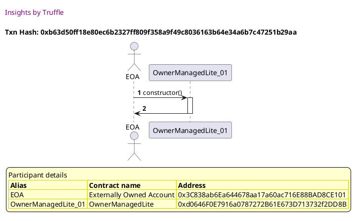

##### d2, tx: 0xe1f86960b91d14cd169a85c08d9ca28b9d191982f0a4d864577a49e26955dfc4

[SVG :telescope:](https://www.planttext.com/api/plantuml/svg/bLFVJzim47xtNt5YBviOcvscZeDOHTgc0saJI23j1Mcwnaw9S9tASQ25xd_VDMGLq_goFFZi-_rzTs7il0deGxkqZ64RQjSkvyQpvg5oA_Iu16iMnkan5WyBNxTEJsfRUtWtosVv96Vih0aRQqOCkk_Ue3OUNledm4Njg-VQ1RIPhHPkQLoWZ6NOEyp8-9forVgLDNyPRgfd0oBUwwvHwyejGF1UzQkJPv_x9bXV_z8rrU8-D33VmArlovBoib05Q-1sxU02c_jJu6iZIYLJoUUfq28kj90fgc71bKuBZDGyrI8LgOfAZh5MCXuc2SQfYMGw7EgoY1bHLWHgFR_A01iu8dd4YBPG5TKA2UhLapF-EpfS6Fsj2kOd5vtZ0VqHOrqyd8mEs-7u-1GohMy21lF-pjsnituA7tivsdw1i5aP8EbmsSb7j2rTTkvR8FgyQHhOGhqhaEsVV3sOg872kSnHnh5C5A98K78i4Y5pfSRPL4roGUttgUPrRIcmQh8YL8zK0OB_K-W3l03_nE7hZ_oIHdGOpGxcAzwJKs3iTStOzHloj0bOsUODp2cVSivtC6cRY4UwJ6XDF4rX3tWFQXytsdO3edCTZ7TexQORZ8QiA6YbmtyIy3RneG7_g-qAQ2vZEUDvaWg9F559b4HZANAP3AQ962I3g8ocKpMc0iH4pmSxfvD-pjy0)


##### d3, tx: 0xcf2e4e9b7415e18bdc19ee124a7b23d314370990a1a33c61c633bf51897ba9eb

[SVG :telescope:](https://www.planttext.com/api/plantuml/svg/ZLHjJzim4FxkNt43QMnb33i9IOgwYhwa0saJ2D3sOKpJ9RcMYDIf70TQwFxxhcbMWLQaMP7FFf_lvRd74UAaj6XiDSs5mCeMkfh6P4Hvb-aP6fn2JXFIQH-JkuafAfqEYhmmi3kAHj4W4g9JsaLENG7rk2LCoS1JimKuBKpsM6YBUI_F9dfAshB7iTqOZFXmxN9McLbEBmwkiaS2vMrq5vYccPw0aetgToqxXqqIeeb_fijiScjBY1TmRQhncFqAczcSu7gkuHJBssEGysJia4VjEF3K4QamJXFL9bAEXq7ikAchF3UGxRP4XQwR-2hnNJSU7wcm7SJOfbWmP8dbrAFp7c09Eont1CDcioIR8PTw_g39V4MD4qg_P9P-ILKRRj7l257VXuFkzdFOtpy6GzFYdguiMgfjtjte6z5fkl6XaTtb9x2B6G5BZTDQtcDUyM9blWI6qL1PmXAAbPFUPYldyZ_7sjLxU0BvKSBdxz4PDsDxtlE37xk6qf-hmjOL7Xn3v-q36itDx48dMLEARRgjrcNqBRgyVjDgTGvhVHTUgH5AQrPaM09_Utzho4hGXGNKwzBscZn5Ijogx9vnUmtzDT75nRFsfMGnoyjdmOTooCMl06O-SoTvCM2Y6dQ-WNe3v-OU9xkY2CzpIqPZdYzgQgJGIn9-LBQ6tXs4ReYn7w7lUNuG8ge0VOb9eFme3FkzOJY853FeXUDj5FjNMmT8fU_v8na5RUMZ3CB02Po-ho8_S8U1SWFN6Jl3OTZd08n4WuSuuPb_3ty0)


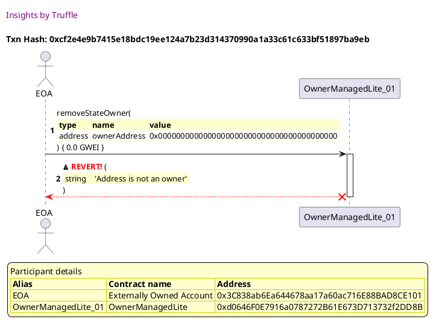


## Fails when the state does not exist
[link to test...](http://github.com/thedarkjester/ConsensysAssignment/blob/7c5b2f21f354ab6c2adcbc9e6ca114bc570081db/test/OwnerManagedLite/test_agree_to_state_change.js#L25)

##### d1, tx: 0x6cfca8641d043071a06a252216fe262866084bb542cf31aae583c6608799ba26

[SVG :telescope:](https://www.planttext.com/api/plantuml/svg/RLBBRjim4BppAmZdqY8DIkf1oOPhHBPbf42B16ZknOgaP28qPL0KQgVfltSj2qQ3MWUIcbdExiwIaFikW0_zpX82VMXTlwkq9zsBSNlmiADMDzgf9SYNnhUzKwlMjfxURCfDkIe9cNVXQFM2qE7RQb3Qqz_ZBwKFhJUlhGjW2siQjzCke68TBW4R9C-I-zxlhNv7_32lclBaWZs1KiOrbBCH-ZFiyyzZ4MJC_zLrfjc6ZbP7-kpxkaPT4aomcZuV77s0RZkZx21aBI4N2LSiYLd6WGc8qYZYejQHY78XM9vKLPf4ieuvW4xpM9x0R3gj8184BPC1IoyV2meTdU0-8MXRCDBi0Ljz_EMq_muE6gs-cQ1_CZu4Ni4dX0ptwTtYEazlRsTKjguBlZzb_V2HN8yx2PoLxcQKaFC0oTC_PIaTmDYEpCSnVhfPipLZRF7sXUASi48yh7007lkZ3dRw11HAUTqXTxctU1jQn_KGj7TWxN5eMT52Idmi0IbsY5Tvd4CbIX198h8SW6SW6CYCYpBFbyKwNvKSdNadVCsw_z4X0KkJ3SJPDChMZ2SyAv9Ch4NAbrCU2SwAATCwPccA2T29qGzoZoi--xy0)


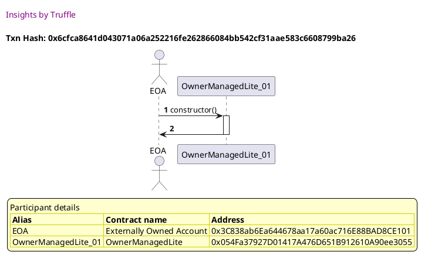

##### d2, tx: 0xce53eabeed2c8c524526144d8b25afe5d8570e4b2e21a395b614e362b626f6b3

[SVG :telescope:](https://www.planttext.com/api/plantuml/svg/bLDBRzD04BxlhnYL2mWAwxTJbQXkuj1Ae5Pg9IwLqDWxILVThAFrkYHj-EzCN1CLaGi-xEpE-_jcBCHPwz7vRcc4mCutjbjMv4JxeEqA7Ix1q8AiEiVwOU6Qpgf9One7RsRbh9oKGfosVcDeBA3_xWaLENWUdW0NZTDFZVLe2gCNTadMSyQvtplCsFYISjMvbQ6_33VwYI28zxfhL4hR1GHoKFtgvUcdeGanrB-qhLxS-nQg3TowRZxdlC9hRmXkrnOkiBq_0RckAOa8Ao8LrdcTX74Ifa4SgxmA4vnJel8aanHN8OK1HgEaOYj5QLYbOJfFgqWmPRNdrikh0h258vP7WcdpkjOhPAXNFosvRsXnGUghzlH31htZ0VsH47qy78yFs-7z-nCebBhnwEdjdRqJfyCKFWnolFqCVhCYO6bnsSj7D1rVTkvROFeSjIrieTaLAFPFkOucUPHZbPQOnd6QvOX1Xgd4EWlICi_FYsa-AGDkVqXLDOtXGDqMjTUFN06y-rFe7Jo3_2ZXo_VoaaTq6CqEvWlUunCGucNDnFKhyXHvrAPz1NCgfrBA7KpU9kQHBnDU4yTJs0FUWzh7ZRVzWFXSUt8MZTdqWr5Gr3MljFzF0budFZJWVxLz0Pd4CuooKPXDPH07MH5dwJHDWlDHm6idYv4aYcIIS05cOk13dF79F-Tl)


##### d3, tx: 0x3d5a859a0b82fd394ab8861335480f77731bca0883a6459341fa4f77e3e31d5d

[SVG :telescope:](https://www.planttext.com/api/plantuml/svg/TLHjJzim4FxkNt43QMnbR7QTLzHLf6qwa3Q106qVnZHTOxT4f4xbkD12zzztJRCAj195FllkV2_FFGbZ9vL3w-RJWZ6SkzBCfoDjMNMNcnbQd4AX9zge7cPt4rlEZUgNHMbXVvWEqtxAMATooq9t6TJFhKQbBJmrHu3JqkQFfN5O94K-CLDj74KSkwt3a8oRaBEvdHNwXU4gVzGWlAtk0fNApGG4RrH_Qjdvr1J1clndfiedjww2qHAkxNmyfhZCvQxGSBqmS8hLxJ7mXLG-HdwCV1Irnqh67ewYA11I-bx4ns4OIZ7Aa4UHnC3pO-c9CNgarr9BeNp52BBCKUdfUG9OmHx9FKQmkJpBPqYjdZyORR-XmObMNtEdVtDHE-xGxp5MtuUZxcux71uUWzNJybvVENIwzdbtOsvOfvd6XqPsLv_1BMSQI1gSrl8UYpbjrkuh81YjhYfOGRaEacoFVA64nsMVAp_sOg-jCMnxlf1ZNmdLyyDH4eb8frxGsuHw3q_0FtBuyYCzes7ihdjnz7FVQlLhtTYcmwDZwBnzG6jec5teP1jAaK-trRfClwUNrszQhSwdMj-5Ltg4ojar6LP0xy6_7l8AJEa0pQQrWwPEfZIDAhydt5v3VqDqTl5iV4exp8lgMV817t3Erm0JdscIjEaJKIq5tqAzXNDxZufTKuJMXTFMO54iQseeIBACFYfNGo_xaOnm5AJ4DYy88qGHOi0n2qMGHb4l6KJzL123NWJUHR7_jNK2xdj3b67S3WTSU29Cl30O1BxenQ8T29x4N6l9VPyI418D7ko4Llez_0K0)


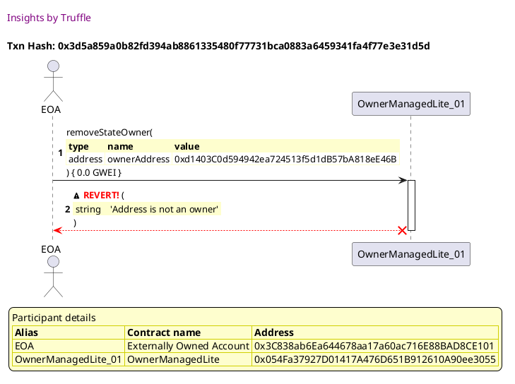


## Fails when the caller is not an owner
[link to test...](http://github.com/thedarkjester/ConsensysAssignment/blob/7c5b2f21f354ab6c2adcbc9e6ca114bc570081db/test/OwnerManagedLite/test_required_owners_amount.js#L22)

##### d1, tx: 0x1212861fa42aaacb8279853c28c89c0c246bdf4a1a68d2f1be95aa17b729c6dd

[SVG :telescope:](https://www.planttext.com/api/plantuml/svg/RL9TRziW57tdLw3qPLDN3Hm7uoYBwlX3dRIfbTRtwHgmWqfmXB6MTDr_7t6iQDNY1y3dNCwzzrmGkkyzE3_i348m-CuEkrevrBzekmS7EsnKgwpSW7XfNJTOcNUcS_YcAgioBn5QzVver1hXyTigaChXtzClnW-Tqw-TzM0oerkxKzO7nSPV0gf0dYNtWziRzOxueLyLfl45Um8fjMqn9HFqPznNdwSYq9J_g-rrk_Kzhe_usGrD4tIHrzue_7om-07wxHAJ0uren1bj88u0GDGyIbA-c8k82vuA8gAOrRA9WGBZCcfehT8504tg94e5an85ouGFfPUF6OOUpy8-Gy4shuNUGsZryPTLxZjOQ9NyfhtwIUWOU0MV8JJUntVhwpo-lLrYqTdUk-6KzSD7T3tk971MkbjYXCu3H4__b2ML1srwj9h6-Ecc80KXPFts1OSvXGh38Gy3SA4_R66dJa0cfLDzu2xtrczZws4zUEKi67CSMvOu4o8y5XyeSfZdVCwXPYMmE6O9Fra8Z818A2ivtsG5pqiQd7adVCsw_z4nWI0neqLDY2gQZ32-oUjgGwg8qtB1apGXQPCjObg41C69oGzq7zRmxFy2)


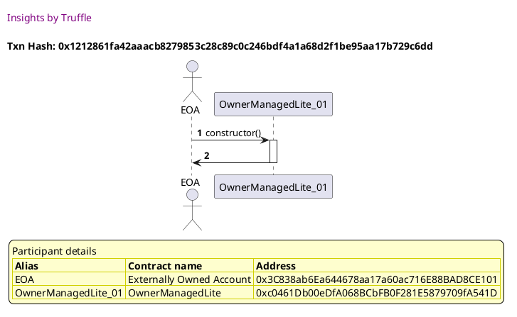

##### d2, tx: 0x71fd425e404845d1fd991307cf8346e247904af12f8af5d862d0423f3eb01e31

[SVG :telescope:](https://www.planttext.com/api/plantuml/svg/bLFVJzim47xtNt5YBviOczsuYOjOHTgc0saJI23j1Mcwn4w9S9tASQ25xd_VDMGLq_goFFXyv_lrVNTXxBm9w4Exj8nX6shNBdFZMVDGkHLwN88r2-Fq18k7XQzRfwUrhJsycsVpR9enTjQ4ZJLZ1jrtRr0R3o-z2d1H--gvTW5jQgk5MneNA6CPzWvpUdnDkMhzofg_7cwgPmD2xctNg7Nb5Y1uR_hLoRFFVHEiht_fccfn7nh8Dt3hsxAal2nKmHguNJkumER-5FWw4QMMWw6HN2evrAIDHYBYIL6gICPc89CHbrYAGQcm76eL3pINWwYCJCw5YGGZoef0hMTNAM03HoIF6D4Mgg9Q8K6zUdB6VqU72wE_LS7yvA9pF60_OgoBXvFnuNSuFZw5LEkRWC6yltDtxAoVmiTUZhTV86nM1aWwN7Ro4MrBbvtx5eW-Rve6jb3l2gHxbQ-ZgOeKvd66iPHneX15WZ778X5nfjGadQbf9gZzFbLUrvO2goOjGlL85I3uFuK-m0lmJno-_iWkQKI7qUnWlk8zEGN6NjUCNRyXJvk0bMtUm9pn6UTy1vEsYNYaovJMnDCKze3teFPnusqt83hNmNY7rcwwmMX8Yu9MElmd0MyJ7nhmlzQkGC5bB6OvvsPMfZnMasa-d_3vG8big99HmaTbEfHYHWM8YPuFTaud_Po_0G00)


##### d3, tx: 0x7551a0c85fe3bba34cb135b3d4cafb5095fe52f54917b9c103b65f1952c87d42

[SVG :telescope:](https://www.planttext.com/api/plantuml/svg/bLHjJzim4FxkNt43QMnb3Bk9cwJgAj8s7KYRG82s3sEQdDWf4QbJEGwqqFttNTAewhJoOL7ai-_Ez_BSan1oLbfXR3NF2H6LBNGrZvKXvKEc5yA8EUHgfhGSYUHXPefAot6H5mOEfz4q6aU434gxojMGGFFSAo6LWPVs271UcEovq5RaOPxDz5nfYn5JktMOed4JSb6PHQx-CjnapmgOkzLT2IapFGD6MzNlHWvEso98c_z2bzditfOGh-3ML6cASOdDRAxWTgdXN9JtVQ1BZtCcQEBpL3bnB1mtYPd3OqUwYKXZJWCqy6xAtO1vSP0mwiGzdhA0TnFVaswN86I9nTAZon142GSe3mZ2PhCaMmXizV99A_DLQ35JyajcrI_A6iSz-WD2cljmCjnlX-FZFXWrBnxLZHLMDJxlxlGT6RJJ-D3AuVeJsDL20Kejvery57c5czfz3GYZKMK9QoZg8E7sI9UIkTGPKya3Dt2xIdXTbpCdvPB94VVYq6U-YjpUQ1FgFRm0_KZXy_Ve0eUnl-xboOz3e-JFkh5DXoTz6Bnz4aRZC8SmI3QKGfzXftCTVOkkRzzqEeFJHZ-4Ltg4qfgQ36l0zoWHUOwJpqhGXKKJ0hHfxgYjb4Y5myeUQyCh-6-eJgvs1YYL5LbUxgIVq0cbj8OO6OspnCqOgMem-1RiBQ3RUrXkJH9SbrOPZSMk6d9829C4Folxd-3l1jv7id-rJOA4kZqsYIbLapIaFNyqZgSZEktwBEA-5tWqI4FkiWacG2HQFCWPhlY3-0C0)


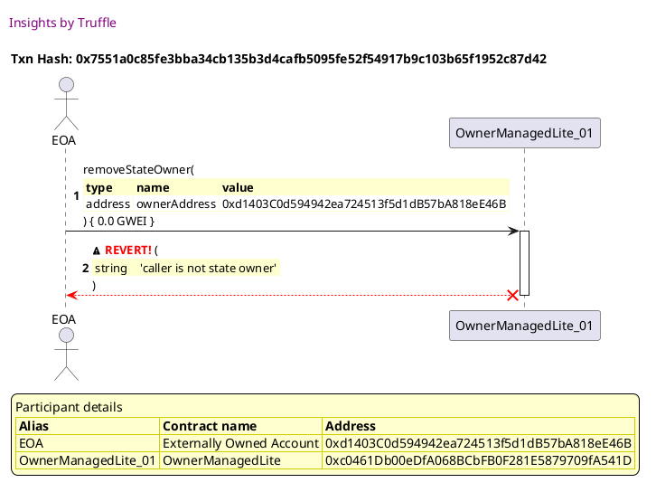


## Fails when the address to add is already an owner
[link to test...](http://github.com/thedarkjester/ConsensysAssignment/blob/7c5b2f21f354ab6c2adcbc9e6ca114bc570081db/test/OwnerManagedLite/test_remove_owner.js#L36)

##### d1, tx: 0x0dcfa598435959678a098c3decb29738494262c11843a282fda7c3441f0701e5

[SVG :telescope:](https://www.planttext.com/api/plantuml/svg/RL9HRvim47xthx3IbqrTDHiCc2YBIWXH9srgfVLzEcn3K8c9ZD6Ihlllkn0KhLfuiCttdR-x-yw4tFSUd1zsBI4m-CuEkz8uqhyqTWyEThGrjR5w1UgbTjrWTTwrdQCtcs9Jv0KXYzuVMxCaTFos1hHnzFVqI-b3vvhNpdfeixQfxSvOZugLlmHia3nBxWUtRyqxuaVpQYWN5-m9j6viJJcRe3_ZllWy5K6c_5zjtzHRtzFoI9_TK5MeItpZMqEV3vO-GB-TKtPWMbKGfLA4KHgbSIA1fLA5sgWoI9DGYbG4SQ0unmW8P51fI5Ge1AzOmhY925gcF9PUF6OKUZh3VKRGDj-ePW_OwkClQznti50R_QtnvYVZO-0LV4R8U9_UBQ_pzFPsJbLdU--6KzOF7ydrk9F0MUbkJWav3v0y_LEMDXwQjYUBQOoVRjPipHXRldsXE2Ui40yv3i1XVzJ2pfo0J6jdUkGkzvPlO-ku7hnn5jhsEBQiQQOKFXQF53k4kGmbb741iH0dbu4d43DG2OyBALVPMkO5HsVU2L-pxdzqJ11jL28COs9LSHRaOSIZBD92I2Qh90dMgIn3MF4I4w0Jan_a7bTyzdy1)


##### d2, tx: 0x91a5af37eae04f513e744b2d6c7784e4a394627514264b04479dc27ca40e9cec

[SVG :telescope:](https://www.planttext.com/api/plantuml/svg/bLFVJzim47xtNt5YBviOczCuSLfr5McR3gHD886q5wJfOZl5mdKgnu4MklzzRiWgflLbUV3Pz_lxxaB8UUFH-NPb2C7MrxPTbSgHva7RDJfSWL5BPUKKnSFIrQsLizhK3jujYaKnAmWPDtvhr8H0zzqhbCh1I_y4kAYTVgwjHvCRlRGhPNt8MFc3mo8ONrEkMxSswY_3ZNvM4B63xXgbr7O94UrLlpev_jmtGVhwbxRHotlVGBc5MzTMLSXBlFP6mUt6mWKszoEWcs642LOnLwWegv8eLfonSY1JmNd65CDuoD81Jo8sI5b96UD3AGPS8ADgA9GWWJBXG-l5LGxOm4cG9oJGvhNGQmnGhvwiSj_HubB9RzghdpJg78_eJmZfuk5iSjmEfwSZoAMyyUZL-pjxHyRz53xsShBx0dwxLX2anLKd7z6quR9ttq6WpwccWHtK-mBvuKatyIoBCopJ0bF6KfuXHXnJYe97QP5bqtoUpOeejD-dAklQX43TvCBhnr01lFjJw0Ey0Fr4uUkFuZACw3YQFSnNl6SZ8EHrpSZr6_AaygXDymRcdCuffNkOOPi2Z-4o2slYmXGEW0-W3d6JNJUWS6wySXQDsNQ3aP0B4LRQ_oS1RnCV6_2_sgv0iX2SAKhPj8heO1OdKP8dah6CPXNdW_amAsESHcKe49Ze-I3duGm_vsy0)


##### d3, tx: 0xbf0f869834e7eae8382218b9ef2de12ca060d1e32f7bad4c834b25725bf50bd5

[SVG :telescope:](https://www.planttext.com/api/plantuml/svg/bPDjJzim4CVV-rFSG9f66SD9ymJgAlgG3gHD843RYp5Db_XI8bAdSXneeVlkkwPHnRJknV8YPv_FV_j-TnRYhB9eR3qhXC3QbhgU9MH4zP3hEHgSGK5Jqcg8wSFKbBLMex8e3UnFuaayYeNeLNPPK5z0yzqJAZBmqau1pakJFvVQOZ4eygcUaRQicDbjm8GNDvBpsimB-cFX9dycSBojxmgLolKK7DcwVZMsTznUGhJdN-WgdzxR2f8bt9eworXNsDmM1BSB3UTOtP-2N2IPpABW9Efw519Ir8rSrucI4yfSHOwReWoaSgZhPc62oaivC77zqFMJp9U9yWKZIorVFRuS05QmntPFC3QRf_aSETNB9qtc2sgSalgSM_efdIPmXtzFY6O_7FLthyFXuIaOcfMFT6FHKXFpxaxVYLvRZVUjxQy-WbtE2TXgd3Ns4OkQ1-lm5J16GrK5AoZN8eFjL2ww8yQ0IH1Zu7b1624w8GOIqz09uYWQ3iRHA7OuZKRg05v0Vf3mwLjymSNOVU_5qVTzG-h7Eh5DXaUdq7lxX4PpCVlGIpSjnJ7zJkSw_XfVtxxfT7h7ZRyl537b_95J_XUuJO-AgrVa5LdCY-eLcx4SIodNRBWLkGWy676F6HRVKjgIsExhhvhgydzXoMWiYcLJLGM3DENtOF-JsclXNTtnjxSvm9-aeKTIUiFCaUwewpl-m5UU5yae2qDtV18bNHmw2H_095eUuep__B9_0m00)


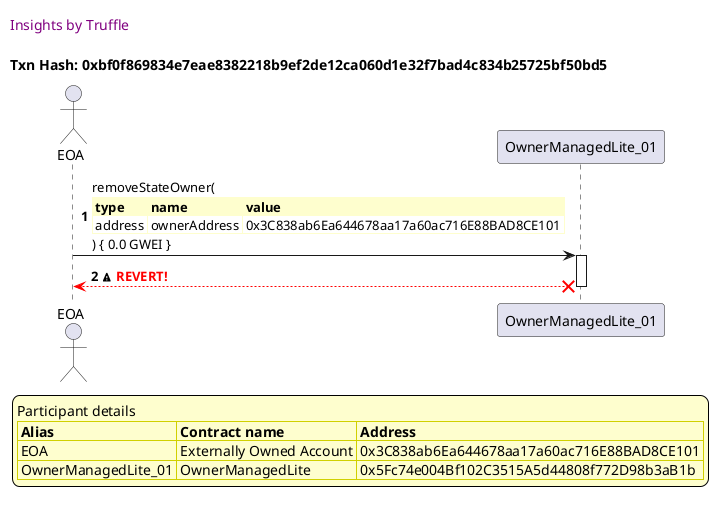


## Adds the owner and then removes the owner
[link to test...](http://github.com/thedarkjester/ConsensysAssignment/blob/7c5b2f21f354ab6c2adcbc9e6ca114bc570081db/test/OwnerManagedLite/test_remove_owner.js#L41)

##### d1, tx: 0x6f7485feeab4f392c48dd06716318e1e02a9d72f0434d3bbb2e236c47bc81819

[SVG :telescope:](https://www.planttext.com/api/plantuml/svg/RL9HRziW47xdLw3qPLDN3GorSPH5JHn7dTIgbTRtwGndnwg38uorfEl--uXZHQiMFm3-lkExk-yWvAxpu7o_RGY1thUstnReIFTQsnqusD86AxHc2VgrScrlJTOshQDNwtoTPpaXiyuV6fmJEdmR18EE_Xv_ARrlNVtMMW_DegahkqNhWsBfpm7hG9uaTxtRDVY1-56_8UNoZ3s3CRMjA6SZz6VOPr_78iYO_xljwchZEreSw8lhopBe4b_x1kdBtj9xw3PJolPncKXrMo928KkHHbegOrYSy5XmXHnP1Ab9ef998OqeYYB2ICHQ9eLMNF6K1Ckq3wNdJmiA7Ps4VKA2RRxMzGv2gq-_BBf7i52XUQWz_cHy2Bo0JmWPxjER-MMUNbzFgMvjvrr_pFhfCxaSTnGuATrCAI6d0PBdVyeowA5kEZ8Rn_ZbQiLMZB7v-pSQvXGg38Si3C25_gY5BHw1XJ4Eky2TxytVXzR3klVeB3JDOMZPq8NMuR7uGB6zo9HGKCGvn5B6YGBW2SGCT30wLsgvMAaivy6P3yANhFiV7H8iLuaeKtuh9Of42x6IF4rmhL4lrvdGgKoKY6AfGeBWnEW7kGjhUFP_0G00)


##### d2, tx: 0x0210c8ab571e87c9c154c55cf0e5269111ecfac4802e32f04c7d5cabd1a6b3fa

[SVG :telescope:](https://www.planttext.com/api/plantuml/svg/bLFVRzem47xtNt5YBvkwRZO9IK0CDK1OAsrgfLRQIwNfS1omQXpaE2sqx7_V4JB4D5wM1vzzlx_lBenTLHwThrU6CQnzQUlLN3bMFMcxHeShC6gXR3v6-RHmPMtpIMbA1-zcsIoRP8mDAxyrQiIW-POAS-NWhNq2N9TElvRMeqcDNjYLifuo5lxeC2FZ8UMwTckZ_ZBSwrS58ZpgxZ3FjLs0uAtgLoE7dzicM5l_nbPwiVGLpBVmuEgYeBpCQsyKF6miN6Er703VyAxWCi5vBnOgYMLVYbueUprPSDNhHdqXX985oZ3XNHLq2nxAEEz9dES2etbG82FAfAVMiziKi88EoGuZshoMUeq4zVR5AlSTBIvK_arxzPEBnl6CliDO4m-Ne_DskBWOG9hdznwzUlze7zcmdSB7LevsNy1lrmf8MbmryXbDJPUz-mw8FgUg2dPGxWkanoVV19Ca82gY3ACmZE84KSGOSPInYB8a6QVJP989QhzDDIzBGu6wIgNNprG1lFjJw0Ey0V_4uUkFx8P6T1xD7kO1x-K063ki6Rix8IzN7hMfJc1E-PHpleT9sqGyqcL2Q-9e2aV0Hr37kD6k6H2T6w-SHMEspM1oIAMabVR_IS1fudC3_bVR51XFuw3equg5AeXb44n3qO_LJ2evdaq2sG_Z9EX6OK85Y8cM3tP59_sSlm40)


##### d3, tx: 0xa21c9a13bf1307f0827ca370a570929de523e55766c93f13aca9bc761cfe6c26

[SVG :telescope:](https://www.planttext.com/api/plantuml/svg/nLHHJzim47xthx3O2uYnsN4I9uXLj6awa3OLgKXxGPgkpYMDI9tASROMkly-DsGLQDKaU9aVVFRvxhlp-JiJSjbOCBPTLeH0QslTBkTeI7DVwXKOMD8A2zJP2DHzOUfMPqbTrOQ-cwIJD4a9kMZifi81eTrO86Hew6E_fVIgDkL3hIrKmweiz1ArTOYvtHjCtE4JvAergmfV7CpA1wJSt-jk8CjANL3EUjMlJbvyx9CWVVnhtPJ5mZPqlg6tfirpXqjiQIkajsjDhw1Pd5Es1e-h6BYOvrmmcRF8amg4P1185djnXe4dC0Xa6AfOE1jG4C-L3BdACLHUI5p9b7MffzCXXOOUENb4NDbigSeLkAjEVseqNq53WTcNqk9tnZl30_eZGZf_UZOuV4vFJy-fAy3CWiNEuFXEtv6B_YdUztAm_KJjPeNKIGtBJlw0gdMBdVbs1s6mQUYMrZkGuNxBrXdtcKXO5iH-x7i8qlC3Bl8WuzaeaFDXn2DC_N3q17L27odxmEZdR-crUud3IV_pDYumscG1ki2fxkvrVF9QdBEpS_gMs4kunwcP_Od_-i0x4DNvlZ7p_rc1peSyzJQvUSRO32sKLVECLcCsPepjQELQs97NBHBNcyPHVq-mFOdsVeDjrnLkNbiq6gfgqtL3HeTAkN_4TeGJIIGYc8SfXBuVoWY0ImWPACd3D8f6mt6KfDmrpGlWGrtrjxOBC1fBaSSyy7qKKWanzdaiSQ9GZIQ9KB4l8-65VkG2k4hqzI2NRdO_ucy0)


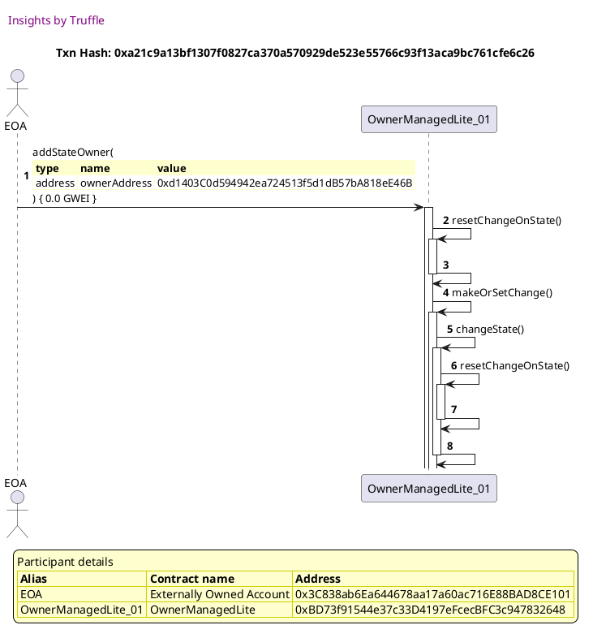

##### d4, tx: 0x95a2a62a73ca705bfcbe334c358c715c3aa2d2adad9df3920cafe8614bc7cf71

[SVG :telescope:](https://www.planttext.com/api/plantuml/svg/nLNVRzCm47xtNs6DbqqmI6BdrpIgjMdA9e4wiKcyJ49N-z96IvpASKUxbVyTrmrb4vNG9WHvy3dstNVd--8lX9or1hHPr1KXi32DMjGJrAIzBTKSDDIqmYagEG1nEzNDGicigHfDNutoKPxbX9osPbLXZr3tp10aQlhGlL9wtkZolb46gdvLJbMDobZ4mkmSHdPp2pbVw7c5JpQkodkaFj-jNOAKfPfIt-kMlZjx-guhWdJvBrHRJcUcfPCLlTQBeh2un9IcGdgzLFGSsja9zPPf20540SHCGEo5aq9Ca34kM9Y8s0y50mXa019aAWkM1fw00fF8vnCHYoBsYMsPCBRqVDodqD83Qm-8RPifHJa7UzJnDuNw4oYOelnO6lpg-Svnp_e18IwU7lVsxzFNhq-enhgvmoi31ftFuOsw8QST6sywsrk_fsOrHsgjWjhPEwWMTh9nNrFRHerjIzUqsO3qTw_UKlhSOvadmvIdF4280nxwh0YbBmTXFEadVe8vZmPRg2FwGBst7ltm9R-mPEol-my7Qj5aCr1J72jthiEZv-8S7v_Gb-IkuHR7-kfd_kSdte085_l2odzHwhP7kgctI7-3rklciuF-vxo-b8__zIsu6B8LEdBvwFfAD51MxICcXjxGyxmD4rRFx4ssaymAbROwiEDaTvrsSRsramWxBWrg1LMrSj8WQLy8Awh6KSIoX2KmYNA8E8_Y1C2F8VB0Qb6K9ycWFqootBSAyWHudyJylkeI38OnAr8_v1nPB1WRSZ-DSIHG34OP4ocF4nP4FB49R2UwVf0pEzhVmmy0)


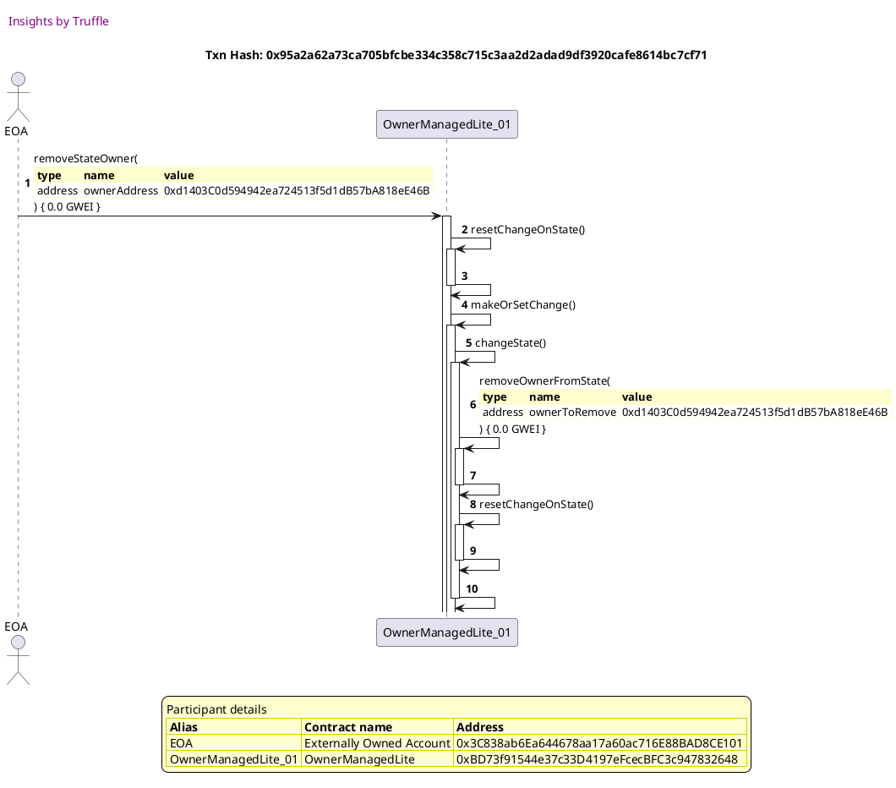


## Adds the owner and then removes the second owner
[link to test...](http://github.com/thedarkjester/ConsensysAssignment/blob/7c5b2f21f354ab6c2adcbc9e6ca114bc570081db/test/OwnerManagedLite/test_remove_owner.js#L57)

##### d1, tx: 0x0a364a0cdcf2fe400e2547889f7590044e9dc2b6f682b20c465fe36bc2ee8e93

[SVG :telescope:](https://www.planttext.com/api/plantuml/svg/RL9HRziW47xdLw3qPLDN3Jisnb4MDN4STTAcLbhVfpES7LI28uorfEl--uXZHQiMFm3-lkExk-yWvBxpu7o_CuH0xrlRxofqf7lHTWyETjHWWrQjGBuqhksjAbhJEdgpAJTbKH8ox_pHu8BGuTiYA7Jqz_XBwKFhz6jhFPYbqOtTeVL1iVQNW4qWpvBxtkqDlYD-w5UaKNB1da0fRHiQiH7wC-pppsCHPCp_rNQwsVgELaVwxFgw3hh4Qs-GFXyiVO1kEwFim63A4s1IoJgkCM4CupJ9XCZhBCqPInBCbOmhNdCHLp6J2KzhdF9AneW2yoa9baaVIYyVbnGwEWdxX0JRl9Pw3w7LnryMtNUmqA3wfZt-PD4GU0MV43BSftUBwpozlPrHsThEk_wKzSD7SZtk971MkfjHGiu394__bANGWpOTcOzZ_7IpPcl6sEBj2mrp2XM6Gn46u49_rC8EJy1IAOTTu2xt5cz3ws4zU7GMZ3aEBIkwb38y5XyeTfWMOYgWuYNm9E6P08Wou0na5l5IYDLoBOeo2iwy4xvctV_ea819pdaT5L8KwKRogEHLYccKInG9uxbGguZ7F9CXGN1Yz8FSXpKy-xy0)


##### d2, tx: 0xcdca21424aa5b173dcae9145b1542c4aabfde4e59d8e8d33f21dde79d7ebe1b2

[SVG :telescope:](https://www.planttext.com/api/plantuml/svg/bLFVJzim47xtNt5YBviOMzocIOfOHGZfGDe44aXxGPekzhLOk4xbED12zx_l6hAAQNrP7do-7xwxxxkB4ATDG1_QXHK2sr2xTb6H5ys3SKlqk01BStBw3DN3tDUjqqLjQm_lfkMqB4eXJfgmjZGHq7ttX9eylFGgm4NjpNFj0jhSchbRa0kSSHPs0LDslgPSjdvfwI_7ZNacaF7ETerQ6pS76VMcNvqy-Tmt8Vhwbwuny_lGGBM6Mz_EPfnN11CimUtAmGKszySGhPHME93n84OSLJ8TiafZ6VDz50yKMwkPffX6OvrHfeV3sK1gJUbOfrIHh0Q2ALE1Mo-lSi063bWU2AOj66MMo52ldXpvx-XmJlgR2VGpabtW7lk14DrxE9hizyFXuJ7aMjy43FJ-pjs9atuA7tivsNo1i5uIi7IuwEGZsfOls_0DC7sUcWOsK6yBv3irMWsBR9XXbPIOn76IPeWonIH2bSgapBAp_3mhIidjzwcgkhRyq3Iv2kQHAq3mVmfzW1U8FaNmzKTvoIFQZsOBynNlqJ48yRfculeDUPe26jkyWNaUdKTHj8N9syGyygNWDV4yXHtW7QZTkycc6n2Vgq3UeRNhRZ0QSgLufSD_4l0syRu1_slj2aGgIPAPB5HMZAOgaMLIZMWanugoE4h6cJwJoI195HTW9de-n2cV_7F-1W00)


##### d3, tx: 0x524dc6ae4161bc5e565db7322bbbf477bce5dc2687b8ca211d038c60145b0b5a

[SVG :telescope:](https://www.planttext.com/api/plantuml/svg/nLHHJzim47xthx3O2uYnsMdYk8XLj24TI9kA1D9UaAQpVKqZKgTotAs5xh_F3La5MZK9NfO7dtq-VtU-V9y9EMyyEB-SLuJ0qjTsELVeI7DVsWKucDCA2xHc1Fg-SFNIcgokQaVVZVDndkM4d3L-NU60qFQR8HXqzB5RKdfPk_AXjXwgOLKMTexM1yIftmMCm-OJv6Bf5XM-sBWf7v3oUEUx1cDAMr3EEjUlrfvzx8eWNVuhsvJ5p3TKhUcjMqwd0PVuqbT8RrUMNa8pEwLibKInqG8mve8hdM0Y4gFINXGffQPncYgDYT6HaAcI6YBE3Uj9BHYF4yLK0YIqJFjGUZuPKcZeGR079BJDbxfSGBZgvAT5znKi56Y-b1w_Czu6xl4V4DAUfoU3_Vlq-FYKXWRSUF3O1XpUsJjorlsAzvqTR3vHlruW3TR2lBK_e5g6oJPyiuLms3HqG-ijo72tP2l3OzRBc4dwSJ-E4D8eJdXlcXXkHacgXf9Bp6CnUe8wee-KVM3qyxVyAlo9_KN_ypOXCVfi1hR0YMtlTNZqMfoJarFwbjnpkCU9k_cJ__M9jo2wFVl6olzd1zepv4dRvFePOmrwAAlc6Qqks0LZR4kh8E50tZ39WZPTeFwEO3iIxSuDDgqgmhZow2nKrRfLWw53hSCxubl2zJBPaw143YAEHIe1U0g2WKwvoAKS3IzablCWcXV0-rJrjxTDmBGGOiepBRDah0NFXGewvtsDCcQYBys8YqYaEYG8dUZwGSx365x4tm00)


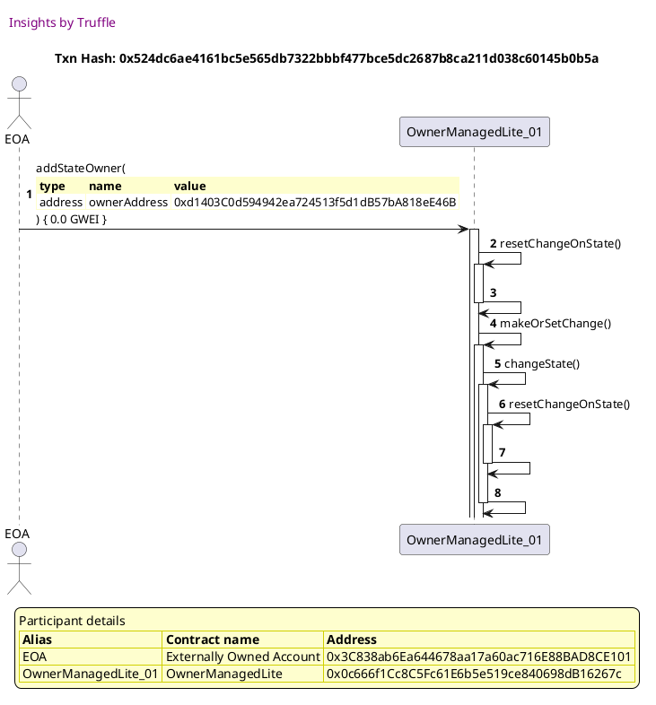

##### d4, tx: 0x6589c43809d3b54ac79919d220012aa9f49aba4d0cd6eb3d8de2767703d23cff

[SVG :telescope:](https://www.planttext.com/api/plantuml/svg/nLJVJzim47xtNs6n5n1Zi_F3SH2hQDDq86qg4aXxGPekjfD6f4xbE1k5xd-VQx8Aj6eIl2mFFljy_kvy-JuZTDvPCBPVDWX1RrlTBmjbK7TNwnKOME96LKhB2OYxohIzbbdRj0Q_c-MpFCiHEklikb4ZXFstK22LmO_34kEBrjGFhRRGZ9kwqakbhKCixIvWvZQV85UzMJNgnSPr_Q0mZNQ-Av2orXMcP73zylRiur046l9Vwgwk5hR3nHhVcBui7IwojMqKlhdN-0AwnIaczopcgOX2Jb8P5d448abJcieW88G606aPfL1098cGJ1MXv5852KiI4ieW56M9NCk4TQNdyp663XyuUu1SssmjwXMugyv_QcM-WePAoI-rLTy9zO5x_0S8-VFuPBH_7nyVdsBNW6iBLlc0mrjzYyw6N_5-iAFD9spNAuMTrR3qzWSqlPjimpTR2AEw3czmkmKPxvQk8RnWnNWMna0Y4SQpHAGifl64HWKFP1XCMPPoGU8dg2FyYCa7WZz_oo_TdzXVz3zlun8hcor0Lsgk_RqEZrwBSt9oYj-IUmbtQcwk_-H_VU8jYF1dtrZv_-o0FuEUj8skdZ5MAWjrqpsZrPHC2I5RMZa9E_AwIUQqQHprTmJRaMXtRhJngd3ZlLL6GzEilHea7WlXtX7h2HTcFEHGi1nO5B640z04675Af2pdV3AUyYodJZGlWFUfwc-lJq04OwoacU1PF1ECvgo8LKnJeNX4MChbXBA09S8bS9qO-e7EtUXUnDy0)


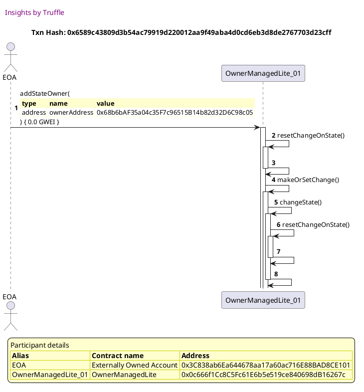

##### d5, tx: 0x36af7ed683ae0a019282a952b78da2ac5dbf97452007ef512d73355bd630a607

[SVG :telescope:](https://www.planttext.com/api/plantuml/svg/nLNVJzim47xtNs6n5n1Zi_F3IH6hQ4Cwa3OL3QIz84sN-D9694xbkD12zx_FTRCEj4eJQDhou7Fik-_EzyLV23bj3MWphoj2O6uQDQyprAIzBTKCDDIqmWagEOJyTgARkP99KpMQlXcbepH92JbfpRB2Fg7kcI98rFInUwNqlD7bGwCCL8EgdAWQbR68XTawZEpc1d8srxCAdsrSbGz8UR1TkmGfIpMXd7LBtvqzUTyLGRhy5wej9rFJqcn9h_MyA2mkCQMfa5ul53s7TdfCsS8NK4GeHUm3Cc2yvyKUz48lYs897kIXp8fU58GUOn4M8VTavFjXc4dXCn0i8hPbkR6bf-C1XPRkMRj7RDjCcPSpi4STtolKdq711EMdqk0tnftZZlKzGbmyFUhltgU7XyTKOztSuPK1Wyvd_qRTa9EEZRUTxQy-KBES8RLMGUti7LHpErcxhwXjeyQsfIlQh446srUsa3nWVi9as0jwWOSGUK78_IAKN0x3A1l4FCOq4CCDr05zfEmTen-_fXUMZDrr_-50BPfa2cg2O-NEjN_mKfoZesFwcjmrtE9ON_tC__B4Qv3SnRwoyb-KkksHRkeDqj-WzRhvug3_EQ-lvUD_VGikXco4Zbm-kRuI3PHL-uI9CtR665ipOVNCtcGxIQnGQQi3MqwsrsaRrryvYR3Zmg1MK5LB9msI3lBSYgfn5Fb9xCUGYHH448We1k2HbHd88oxIE1uEpk8avLP1dW7lafZVLrq2bWiX2fxaSHAESi5JaOKOybwESS14BvP3BZmHvJQ1xKJN3t9gH_jx-040)


```plantuml


@startuml

autonumber
skinparam legendBackgroundColor #FEFECE

<style>
      header {
        HorizontalAlignment left
        FontColor purple
        FontSize 14
        Padding 10
      }
    </style>

header Insights by Truffle

title Txn Hash: 0x36af7ed683ae0a019282a952b78da2ac5dbf97452007ef512d73355bd630a607


actor EOA as "EOA"
participant OwnerManagedLite_01 as "OwnerManagedLite_01"

"EOA" -> "OwnerManagedLite_01" ++: removeStateOwner(\n\
<#FEFECE,#FEFECE>|= type |= name |= value |\n\
| address | ownerAddress | 0xd1403C0d594942ea724513f5d1dB57bA818eE46B |\n\
) { 0.0 GWEI }
"OwnerManagedLite_01" -> "OwnerManagedLite_01" ++: resetChangeOnState()
"OwnerManagedLite_01" -> "OwnerManagedLite_01" --: 
"OwnerManagedLite_01" -> "OwnerManagedLite_01" ++: makeOrSetChange()
"OwnerManagedLite_01" -> "OwnerManagedLite_01" ++: changeState()
"OwnerManagedLite_01" -> "OwnerManagedLite_01" ++: removeOwnerFromState(\n\
<#FEFECE,#FEFECE>|= type |= name |= value |\n\
| address | ownerToRemove | 0xd1403C0d594942ea724513f5d1dB57bA818eE46B |\n\
) { 0.0 GWEI }
"OwnerManagedLite_01" -> "OwnerManagedLite_01" --: 
"OwnerManagedLite_01" -> "OwnerManagedLite_01" ++: resetChangeOnState()
"OwnerManagedLite_01" -> "OwnerManagedLite_01" --: 
"OwnerManagedLite_01" -> "OwnerManagedLite_01" --: 

legend
Participant details
<#FEFECE,#D0D000>|= Alias |= Contract name |= Address |
<#FEFECE>| EOA | Externally Owned Account | 0x3C838ab6Ea644678aa17a60ac716E88BAD8CE101 |
<#FEFECE>| OwnerManagedLite_01 | OwnerManagedLite | 0x0c666f1Cc8C5Fc61E6b5e519ce840698dB16267c |
endlegend

@enduml
```


## Adds the owner and then removes the first owner
[link to test...](http://github.com/thedarkjester/ConsensysAssignment/blob/7c5b2f21f354ab6c2adcbc9e6ca114bc570081db/test/OwnerManagedLite/test_remove_owner.js#L76)

##### d1, tx: 0x9c5834e5ec65fafb3595da821e795bd149df444c27cf026caa349edf3df13bb5

[SVG :telescope:](https://www.planttext.com/api/plantuml/svg/RLBBRjim4BppAmZdqY8DIkejmpKYop9Ie4K2DFTYnOTCHAOCYaBjDFtthcN1Q53hG58pozdTMH9ottjmVjYrXC3WEpliQkL8_sBi7XpiQAiQPUKAn4lZki7AicixHsysrQOgAq8MlJ-sQade-6qLIENex-cNqeVEcTVEUcYBrZHsfwn7HUql0HiapvBxmUrRzOxuOLuLvT45Um8fZMqePnFqPzmNdwSYo9J_g-rDi_KzhO_qsGrQeoxnnhUAFXyiVO1-EwVia8iu2oCLAv746dGTndai8GkuIlEubZpAfOwYI0Ifq2n8140OvKhgK6eUrdLCq3BXiVJgiQ3GqndkCuAsUIFC7h3LnrzMkUzWeL7oc_7g9-DZu1LyHiXudzujh_FqzdPEHMTxxuPJrWyVoVMuay1PwMvE2JaFa3pzKvPK7apRayKqnaytQxPcZ2tVlb2S4rQ8Xn87uB0_Qc6dJa0XfLCzSfTxoxUnTLmFNZaBRNiSMvQq408VYqUA7S8o2pEeamgIA4hI382da30GAK-gB5iLwwoiE3hpJlYQTV-ZOu84uWqFWhpYaCGYrenLabT1L6If35C9uMOLQWab9a0d9Z_8FQxuxFy2)


```plantuml


@startuml

autonumber
skinparam legendBackgroundColor #FEFECE

<style>
      header {
        HorizontalAlignment left
        FontColor purple
        FontSize 14
        Padding 10
      }
    </style>

header Insights by Truffle

title Txn Hash: 0x9c5834e5ec65fafb3595da821e795bd149df444c27cf026caa349edf3df13bb5


actor EOA as "EOA"
participant OwnerManagedLite_01 as "OwnerManagedLite_01"

"EOA" -> "OwnerManagedLite_01" ++: constructor()
"OwnerManagedLite_01" -> "EOA" --: 

legend
Participant details
<#FEFECE,#D0D000>|= Alias |= Contract name |= Address |
<#FEFECE>| EOA | Externally Owned Account | 0x3C838ab6Ea644678aa17a60ac716E88BAD8CE101 |
<#FEFECE>| OwnerManagedLite_01 | OwnerManagedLite | 0x6a5F1229E1a65c5f00Ed1E24A87d37da3FB3fdaC |
endlegend

@enduml
```

##### d2, tx: 0xb47e3fa0822cb128a7227fdb81f0ad07bf1ee27205d104078690366e059f6ddf

[SVG :telescope:](https://www.planttext.com/api/plantuml/svg/bLFVRzem47xtNt5YBvkwRdO2IK0CDOMmLjhKIgsqbqhJ9NQeLUCWnscXPV_xZf0Xfl6oFFZi-_rzTs7ielReVBCqZ67ZAziiS-LO_QJj2XqkmQY5il8IYwU5gnehfvMf7BoRP_DicZ4shlt6g0c3zdjKA9M3j-u9S5Kv_LfPZoOrUc6NodhAMFg3mvoC-vIhngsC-ijmfryLYFv1TujIQhi0mJlLhrQEFtTDiAx-jQtruj7Na6_WtZLbINcPrzuek5zRkCBwSGHydVTZ5PR8ao0eSX4a60T1NCey4IL7oUEy54e5SS07Kl0-ZvDeoCCeKdmmB2CfIqQK5PvQpsvIm1fw97kCQFEwq2iag3SlLhdlQ76Xv3VjrKykMiSJ-XvZRJoSJqxRuUni1AcKTnwzUlzW7zYucyB7JawsNy1lLWf8MbosyXbDGvUT-nQ8FgVg6hPGxGgaXoTVXzCaJ32FCepw_IXE44MC4SSY5b6M99VfB9bcWjhlKkLLPIXGrsdXzJDL0E_-5Fe0Ry0_SVZw8xkc4Pr6iuEvnti-0iRsQyPkZyYJogCszH7C6PznpdSmQPk8HxfCQKqSJU40-03g43VPjWEYS-sLisZCfXsCXBGeQANzVn9mdFZKWF_LjWKY7Cn540mpWT6W69ISPr9aGJzDOXd64iFvPLXAd581OgBZWrtGIJ_dRm00)


```plantuml


@startuml

autonumber
skinparam legendBackgroundColor #FEFECE

<style>
      header {
        HorizontalAlignment left
        FontColor purple
        FontSize 14
        Padding 10
      }
    </style>

header Insights by Truffle

title Txn Hash: 0xb47e3fa0822cb128a7227fdb81f0ad07bf1ee27205d104078690366e059f6ddf


actor EOA as "EOA"
participant OwnerManagedLite_01 as "OwnerManagedLite_01"

"EOA" -> "OwnerManagedLite_01" ++: AddState(\n\
<#FEFECE,#FEFECE>|= type |= name |= value |\n\
| address | ownerAddress | 0x3C838ab6Ea644678aa17a60ac716E88BAD8CE101 |\n\
| bool | isActive | true |\n\
) { 0.0 GWEI }
"OwnerManagedLite_01" -> "EOA" --: 

legend
Participant details
<#FEFECE,#D0D000>|= Alias |= Contract name |= Address |
<#FEFECE>| EOA | Externally Owned Account | 0x3C838ab6Ea644678aa17a60ac716E88BAD8CE101 |
<#FEFECE>| OwnerManagedLite_01 | OwnerManagedLite | 0x6a5F1229E1a65c5f00Ed1E24A87d37da3FB3fdaC |
endlegend

@enduml
```

##### d3, tx: 0x4829954ad493cf59ee9c8e33dba63f1f8620d6d95ae967d526de87a99e786ad0

[SVG :telescope:](https://www.planttext.com/api/plantuml/svg/nLJVJzim47xtNs6n5n1Zi_F3SH2hI4Cwa3OL2QIz84tN-996f4xbE5iBtVy-DsGLQDKaU9aVVFRvxhlp-JiJSjvQCBPRr8H0PnlTBMPeI7jVwIKOMD0QIzHg3FbzQPfEgxIf6qFVJR99bcQ4dBLsNUE8q7xC4HGQ-ZXiARriJFNGQ0jrKbUbNg2s3h6mEuE9Eto2N7PcMUEBWvlg0IaFThfhKAhI9ULiKFtgvTd78GaonB_IRLNERKjdQtfhkg9mkCHMjaPwkzBq4jhvAMMhG7fn70QWWjZFYp16Z7E9lgzc8Fo25r9uJ0aLXu2nY5Je2OKoWZZ6I0fGZBYIvTQbdaqJ2YqzSFA0kBBPAg-MuAuw_QdHV0KD9QelbSNlZFU6U_G7XFJ-z6Iq_vmU7vzILu0R2nPxWyCxVKVEXgTuFyZHvXErwoLI9pKiUla3wiujjkQRBOJ1jgKRscn1ajsMhHGFc9yo5SP177W8aHU4t2z2nTKuZ6Q9v1ApG8oVe8xe8sKV6FtyBRjoBx4_wN_UnWL6cyv1bpZL_RqEZrwBSt9oIjyIUm7tE3KtV-A_Fl0M9EzztvZv_wn0xqEUUfjSFsEiGWjLtJwZrGMxO8njQULQs97NBLBNcyPHVqUm7ObsVgDDtnLkNbaq6kfwtNU3eacUkt_4zeJpK-bBc8aCH128I0Bm20I3FE8YatASNCWquwvfNW3lwwg_jNq00U64UrwSSH1X7XQCPOfdNf38IFcH0dyozWi5gGlWAZ7KWvoxsVs8lm40)


```plantuml


@startuml

autonumber
skinparam legendBackgroundColor #FEFECE

<style>
      header {
        HorizontalAlignment left
        FontColor purple
        FontSize 14
        Padding 10
      }
    </style>

header Insights by Truffle

title Txn Hash: 0x4829954ad493cf59ee9c8e33dba63f1f8620d6d95ae967d526de87a99e786ad0


actor EOA as "EOA"
participant OwnerManagedLite_01 as "OwnerManagedLite_01"

"EOA" -> "OwnerManagedLite_01" ++: addStateOwner(\n\
<#FEFECE,#FEFECE>|= type |= name |= value |\n\
| address | ownerAddress | 0xd1403C0d594942ea724513f5d1dB57bA818eE46B |\n\
) { 0.0 GWEI }
"OwnerManagedLite_01" -> "OwnerManagedLite_01" ++: resetChangeOnState()
"OwnerManagedLite_01" -> "OwnerManagedLite_01" --: 
"OwnerManagedLite_01" -> "OwnerManagedLite_01" ++: makeOrSetChange()
"OwnerManagedLite_01" -> "OwnerManagedLite_01" ++: changeState()
"OwnerManagedLite_01" -> "OwnerManagedLite_01" ++: resetChangeOnState()
"OwnerManagedLite_01" -> "OwnerManagedLite_01" --: 
"OwnerManagedLite_01" -> "OwnerManagedLite_01" --: 

legend
Participant details
<#FEFECE,#D0D000>|= Alias |= Contract name |= Address |
<#FEFECE>| EOA | Externally Owned Account | 0x3C838ab6Ea644678aa17a60ac716E88BAD8CE101 |
<#FEFECE>| OwnerManagedLite_01 | OwnerManagedLite | 0x6a5F1229E1a65c5f00Ed1E24A87d37da3FB3fdaC |
endlegend

@enduml
```

##### d4, tx: 0x5776eb94a1b871ea90299c58129be4e825671c8055dca0f71a51cbbc70b5fe31

[SVG :telescope:](https://www.planttext.com/api/plantuml/svg/nLHHRziW47xdLw3kfLNN3MnZuwgBwZZsMcbJAhNINYfDPy2ELGT7c6n9c_tt4SUBMYsQrBwC1mwEk--EupiGkkmi6BkSDmZ1qhPwEI-KGTr3hHTWO8uRLIajno0UAjCkjKpRfZNuNPxbMPeXTD7PTQD62FTZfa0gWv-6BSPNhQaVMssXIPgwqdEbhKCixTuWTuSxoCNIB1hruk2sVbIO1dlT3KXPwmfJCgX-zVBYuv046k9VwwwkPhR3nHhVcMLPEbnaQzieVBVI-0gwsJacAnP5eIhY06Z18weW9buS2yQf5nSgKDnZOKG59un90QICA30gYa94f62byYbo9HFMfPvD4mmTFdBo2BcosLhK2t1NdVxKodm53PMINsghlXFQ6nxG7o7K--EpqU5pV7fwZbq1RYrOrHiSt-jxT34ynVj1ZZQVi5ql57PImxoNFw1PkiNMVBE5CAhhy0QtMv1aloMha1TXaUG-0n88d-MHY4D6sPW61VUaxqt2DEQ2i1tK2Nx2v0F1dxzbr-ub3YVzpzkumCgcCz2Lckh-NiSdhyKvEpl7RuazXmSrDRT_uhy-y1P4zBvlpFn_Lg3tGRlUHZVF62kLXRhfdj5gGYQ4a2sjN0ixyhf5wdhJEEhl2ROdqTvljEcxmiqhguo6fbdttI1n8eJxHsnFE3_bFeSYp20CWZ3Y03I2a828Q9XnFaucFCseQveNm8Uwwc_jZj70SkfvSKOXP8ALX6IIPbwGy4ZwaGG_7_kbXDG5S9KOwe4ktUn-nDy0)


```plantuml


@startuml

autonumber
skinparam legendBackgroundColor #FEFECE

<style>
      header {
        HorizontalAlignment left
        FontColor purple
        FontSize 14
        Padding 10
      }
    </style>

header Insights by Truffle

title Txn Hash: 0x5776eb94a1b871ea90299c58129be4e825671c8055dca0f71a51cbbc70b5fe31


actor EOA as "EOA"
participant OwnerManagedLite_01 as "OwnerManagedLite_01"

"EOA" -> "OwnerManagedLite_01" ++: addStateOwner(\n\
<#FEFECE,#FEFECE>|= type |= name |= value |\n\
| address | ownerAddress | 0x68b6bAF35a04c35F7c96515B14b82d32D6C98c05 |\n\
) { 0.0 GWEI }
"OwnerManagedLite_01" -> "OwnerManagedLite_01" ++: resetChangeOnState()
"OwnerManagedLite_01" -> "OwnerManagedLite_01" --: 
"OwnerManagedLite_01" -> "OwnerManagedLite_01" ++: makeOrSetChange()
"OwnerManagedLite_01" -> "OwnerManagedLite_01" ++: changeState()
"OwnerManagedLite_01" -> "OwnerManagedLite_01" ++: resetChangeOnState()
"OwnerManagedLite_01" -> "OwnerManagedLite_01" --: 
"OwnerManagedLite_01" -> "OwnerManagedLite_01" --: 

legend
Participant details
<#FEFECE,#D0D000>|= Alias |= Contract name |= Address |
<#FEFECE>| EOA | Externally Owned Account | 0x3C838ab6Ea644678aa17a60ac716E88BAD8CE101 |
<#FEFECE>| OwnerManagedLite_01 | OwnerManagedLite | 0x6a5F1229E1a65c5f00Ed1E24A87d37da3FB3fdaC |
endlegend

@enduml
```

##### d5, tx: 0x9ba0abeb16c059331b00575f5f134ff81e21a6b96954130a16197555b03cfa6e

[SVG :telescope:](https://www.planttext.com/api/plantuml/svg/nLNVRzCm47xtNt4QBvl6m6wQ7vr6jIvBsIHG9pg9bqdeaZXfjCIf76UqM_dVkNgX5549TKAG1vzZttrtvo_-mjXvOr2RjYePmzRKggrYgLbpNwWvQgoWbBbKwGKczxckMvM6TLbhU3MEnb4OCNRMc6KfXmpiCvEOIWrFtIl0LQsBnrePB4TbaQjAAaE8cTauZ6dp6NBUwdafVzcO5eyIH7-pTeDfMgWS1E-MlbbxzhOhWdNvhrLJv3FJGBo4Mzrc6U4oKvXImkr2mHKsirFWYq6C76CP2o_Xxi1nHCovwxkPcmcddsM1a3s1NZpm1cvVE1o59mQ-wxenTv8CFS9ac1WgFPgC01iu87l0wDXCaHHpf5OdNvNK7r5XBjCFXP5VkB2EEzOF6BFnS3BSlG_7nwUWPLK_oAb18wtFuPswOsST6wyxEroz0xESIo2hiBBs0SkM9clt5T0nQjaqi89w3JBQlFA54mPEWB4NeTVlUtw0A7pqE2Q-yA8Wk1XT1c4ag0qBTGHFmDzmUFyvkYOoTjVzXuOQQS8PgbnEbEthy6XVd9EJKtX9xWhlvKHFV-JVF_4Q9B6nBwpy9wLsUwphwXdfRz1wMt-oqF-SrvVoyR--1Hl3deMEtMnTtrGQBCfcYubBViavNpD1UaOtcIOX2PKc7TXmihbEcxZXoae4ZGiZjSAoN5ffI66K92IgPa-Aje5tISplgpQ1X-vOz7g3Y5JDJToCyoWLKQy_2lpKyLDqnXTEbc982UWaklDWvpJIx-4x)


```plantuml


@startuml

autonumber
skinparam legendBackgroundColor #FEFECE

<style>
      header {
        HorizontalAlignment left
        FontColor purple
        FontSize 14
        Padding 10
      }
    </style>

header Insights by Truffle

title Txn Hash: 0x9ba0abeb16c059331b00575f5f134ff81e21a6b96954130a16197555b03cfa6e


actor EOA as "EOA"
participant OwnerManagedLite_01 as "OwnerManagedLite_01"

"EOA" -> "OwnerManagedLite_01" ++: removeStateOwner(\n\
<#FEFECE,#FEFECE>|= type |= name |= value |\n\
| address | ownerAddress | 0x3C838ab6Ea644678aa17a60ac716E88BAD8CE101 |\n\
) { 0.0 GWEI }
"OwnerManagedLite_01" -> "OwnerManagedLite_01" ++: resetChangeOnState()
"OwnerManagedLite_01" -> "OwnerManagedLite_01" --: 
"OwnerManagedLite_01" -> "OwnerManagedLite_01" ++: makeOrSetChange()
"OwnerManagedLite_01" -> "OwnerManagedLite_01" ++: changeState()
"OwnerManagedLite_01" -> "OwnerManagedLite_01" ++: removeOwnerFromState(\n\
<#FEFECE,#FEFECE>|= type |= name |= value |\n\
| address | ownerToRemove | 0x3C838ab6Ea644678aa17a60ac716E88BAD8CE101 |\n\
) { 0.0 GWEI }
"OwnerManagedLite_01" -> "OwnerManagedLite_01" --: 
"OwnerManagedLite_01" -> "OwnerManagedLite_01" ++: resetChangeOnState()
"OwnerManagedLite_01" -> "OwnerManagedLite_01" --: 
"OwnerManagedLite_01" -> "OwnerManagedLite_01" --: 

legend
Participant details
<#FEFECE,#D0D000>|= Alias |= Contract name |= Address |
<#FEFECE>| EOA | Externally Owned Account | 0x3C838ab6Ea644678aa17a60ac716E88BAD8CE101 |
<#FEFECE>| OwnerManagedLite_01 | OwnerManagedLite | 0x6a5F1229E1a65c5f00Ed1E24A87d37da3FB3fdaC |
endlegend

@enduml
```


## Adds the owner and then removes the third owner
[link to test...](http://github.com/thedarkjester/ConsensysAssignment/blob/7c5b2f21f354ab6c2adcbc9e6ca114bc570081db/test/OwnerManagedLite/test_remove_owner.js#L95)

##### d1, tx: 0x13bfaad0d030ba1371ec8d24cc8ec0df02449ec0987bf09f47dacc69e7bb22e6

[SVG :telescope:](https://www.planttext.com/api/plantuml/svg/RL9TRzim37pNho3IbmrTCSdnLu8ig1Cxw80DBR2-3xGaEq8TEP1bBEcw_px6CO8LYnya-KWToJinTjzvTBxVDOnXxrlRxqhjMFTYx1uTxg3HjRPgXVAbTcrlrRfjMWStcs9Jh0l65fq_Ddh9OFYs6fLsy7ly1NXedNbjhSScQqnjTzfwOgpy9M53mJFbldVxHhyB_32l6aHumPvGAMDh47o4_WpxulFO11lhVxMTgRU-W_88pwwlAk9btlX6m_F1mWDsspdmWvYM5QBYYazvYMAQ22rJ5OHIfbfoLV4W36TqcgL9MV5P5IOAfOndEYdB8D0n8ycafzQBnmomWmdj4qQoUIFD7cdKnrzMk-zeiTRgc_7w9nT3uXLymjXm7-wMr-DmUpi7sThEk_vKzSD7TZtlH71ckfi3OsS3sTC_RIdjqJGTMumsVhh9USuvNxvz0VA9EgJ3cWnmD1zOtEaJa2dbT4Unoxtbsp0whGUldSMcEGuZAyYafCVYASGFqtKwJR6C2up3C4vIH95Wp54c8YxIT9NbwReGfCmxuclI_OyE1KgXyyqiusaURGgHLr4HyoGC10zNv1pFeYW9yb15L82K6FLWzxJIi_yB)


```plantuml


@startuml

autonumber
skinparam legendBackgroundColor #FEFECE

<style>
      header {
        HorizontalAlignment left
        FontColor purple
        FontSize 14
        Padding 10
      }
    </style>

header Insights by Truffle

title Txn Hash: 0x13bfaad0d030ba1371ec8d24cc8ec0df02449ec0987bf09f47dacc69e7bb22e6


actor EOA as "EOA"
participant OwnerManagedLite_01 as "OwnerManagedLite_01"

"EOA" -> "OwnerManagedLite_01" ++: constructor()
"OwnerManagedLite_01" -> "EOA" --: 

legend
Participant details
<#FEFECE,#D0D000>|= Alias |= Contract name |= Address |
<#FEFECE>| EOA | Externally Owned Account | 0x3C838ab6Ea644678aa17a60ac716E88BAD8CE101 |
<#FEFECE>| OwnerManagedLite_01 | OwnerManagedLite | 0xb1eDF9A08D5FE1Df5E60742104B87b0A5572D4d5 |
endlegend

@enduml
```

##### d2, tx: 0xb52f86a19d4ff24df0b39851c06c4136ef08ac23f831e4eb2d5630e9eae8283f

[SVG :telescope:](https://www.planttext.com/api/plantuml/svg/bLFTJzim47_tNt5YBviOcvslkeXLX2OTI9j00calIDCbTag4wrIE0orq__kk8QiwhI_BWy--xz_lBeoTjnwTxnQ6CUnyOxj5eHrh7skxH8SBC7gkhRh0yd7kciwgQMCQ1-zc-IoVveoTjNvjz8H1_preLDh1w_04k6nS_T9OZoOrzTmkjFMKiV8xXnaPtr8kExSq-Y_3RVsYGKGxtGqgLTiv23weVlNoxFFG11lgNzcsdZ_u5eertBckgYWlyxKt6kvM5YwnVJW5lYhYe989Yh6AgYg8LCMBS2nZKVAaZ4IOw8fBB8Emag7GaIu25ISXrsEDMWOoh1XHLdfgFRzE0Liu8dd4Y3PVb_KI2UhrizNkErgSQ_Mjzled5xtZ0VqHOtqyd4mEs-7u-1HIfMuzUlt-tjwpis4A7mSvsNm1lrvg86bnqSidD1rTjkuR8FgSRblOGBCjaEwUV1LEPIYnI79CeYWPIKGnmeHZEH99BkL5cibfBgZz8LNHD8O2wpOjVVr45S2xFuK-m2lmJno-_iYlQ4I7qMnXlk4zEGN6tjQCtUoHfxJ7shHxC3EUSSwtC6cRY4UwJ6bD74rX1tW7QXStsVG3edFbjRDepBeVZ8AqB6cb_NyIi9_uq83_rVO52g6psJZbCejdkSYgE4_uA0e4ZoxagE1f78-2B58n5I0c1ZxOEPtqS_u6)


```plantuml


@startuml

autonumber
skinparam legendBackgroundColor #FEFECE

<style>
      header {
        HorizontalAlignment left
        FontColor purple
        FontSize 14
        Padding 10
      }
    </style>

header Insights by Truffle

title Txn Hash: 0xb52f86a19d4ff24df0b39851c06c4136ef08ac23f831e4eb2d5630e9eae8283f


actor EOA as "EOA"
participant OwnerManagedLite_01 as "OwnerManagedLite_01"

"EOA" -> "OwnerManagedLite_01" ++: AddState(\n\
<#FEFECE,#FEFECE>|= type |= name |= value |\n\
| address | ownerAddress | 0x3C838ab6Ea644678aa17a60ac716E88BAD8CE101 |\n\
| bool | isActive | true |\n\
) { 0.0 GWEI }
"OwnerManagedLite_01" -> "EOA" --: 

legend
Participant details
<#FEFECE,#D0D000>|= Alias |= Contract name |= Address |
<#FEFECE>| EOA | Externally Owned Account | 0x3C838ab6Ea644678aa17a60ac716E88BAD8CE101 |
<#FEFECE>| OwnerManagedLite_01 | OwnerManagedLite | 0xb1eDF9A08D5FE1Df5E60742104B87b0A5572D4d5 |
endlegend

@enduml
```

##### d3, tx: 0x7cb7f593b4f150970767fd8fd4937a5aed54487b51ed7f162d9635ed7f76a29e

[SVG :telescope:](https://www.planttext.com/api/plantuml/svg/nLHHRvim47xthx2wbrPTDplO6AekAW6oLjgKIgcqbqhJWGr19IOoPalQxB_FeIngjMXI-p8UVFRv_Dtv-3uZTDbQCBPRrWX1PnlTBJDbK7jVwHKOME9QbKhB2UJtfMawBUEcRWn-DqsdQPmYTD7QJQt62FVVGe5K1ZyEIuol6bCzDDf27TLLgPTAMuTOs7t0r6q-GQuwiwhLYurvzQ0mPNlV3KXPwH9JChX-zVRYur046l9VwxOg5xR5sGRVcgue72wobQqLlbrhV0NjuXoJjSWpKV3GorX1EGa54RueP5185de2E2Z96Gj4ngcIeg3-I8Q-ntTpuSCeT9W8SkjAJsSHXXOVENk4NDjibLShS5UT_TJAV0KDfP9VAgk-4ze77l0V8TIVnsVZm_luzFGSkmRCBLZL1npVwJjqCVoAzuCTRpzXkrafxAo6PMz_GDsvoIvykuCmgctn5ZSxa6Y_96j96V5Y8dd8GZPI84QCKw_Waie95raKq42bp9yyGPtWHqm-4FpvMthj_iJXelzv6vTOsNW1kbGptT_h-EIrE6Tdv_WjkPTmhsPc_YV_wnFlGFB-x1ih_vyTwC-W9ssZcsUCbSf2LRVFQ9MGX12oevMJi2ElcyHEcyPHVq-mFOdsvyRRNXLkN5jbDDJrfbU3n56UktV4zeJpui0B8FDJy1dpHG101VW4Sa7zD0WcKHB4ANMYUG5yI5L_U_i46LN9D8n8aF1fIfE2fpuHR4G9cpXXauXpCKgOv2w1wyJG3tJfHlSY_WO0)


```plantuml


@startuml

autonumber
skinparam legendBackgroundColor #FEFECE

<style>
      header {
        HorizontalAlignment left
        FontColor purple
        FontSize 14
        Padding 10
      }
    </style>

header Insights by Truffle

title Txn Hash: 0x7cb7f593b4f150970767fd8fd4937a5aed54487b51ed7f162d9635ed7f76a29e


actor EOA as "EOA"
participant OwnerManagedLite_01 as "OwnerManagedLite_01"

"EOA" -> "OwnerManagedLite_01" ++: addStateOwner(\n\
<#FEFECE,#FEFECE>|= type |= name |= value |\n\
| address | ownerAddress | 0xd1403C0d594942ea724513f5d1dB57bA818eE46B |\n\
) { 0.0 GWEI }
"OwnerManagedLite_01" -> "OwnerManagedLite_01" ++: resetChangeOnState()
"OwnerManagedLite_01" -> "OwnerManagedLite_01" --: 
"OwnerManagedLite_01" -> "OwnerManagedLite_01" ++: makeOrSetChange()
"OwnerManagedLite_01" -> "OwnerManagedLite_01" ++: changeState()
"OwnerManagedLite_01" -> "OwnerManagedLite_01" ++: resetChangeOnState()
"OwnerManagedLite_01" -> "OwnerManagedLite_01" --: 
"OwnerManagedLite_01" -> "OwnerManagedLite_01" --: 

legend
Participant details
<#FEFECE,#D0D000>|= Alias |= Contract name |= Address |
<#FEFECE>| EOA | Externally Owned Account | 0x3C838ab6Ea644678aa17a60ac716E88BAD8CE101 |
<#FEFECE>| OwnerManagedLite_01 | OwnerManagedLite | 0xb1eDF9A08D5FE1Df5E60742104B87b0A5572D4d5 |
endlegend

@enduml
```

##### d4, tx: 0xcda49bc4314aa4ac3dd46178c0a1faca2ccd156ac4fcd76b5c379e05e101be90

[SVG :telescope:](https://www.planttext.com/api/plantuml/svg/nLHBRzim3BxhLn3TfKNNJOhbHuekgEF7Mc132gJ0BWK6Mb8SeuuSoCgMjDb_d-9wGOi50zhBT10bYln8KHz5o6LhqTZLeYO4LxRHgqMX36dlAxr4WmkeLQcq7AEuBqspqZ9fwiR0kppBioGZvAArcrgD27HZhb0g0u_z5k2gCTL3eotMSLsLUg6qTOWpkpV8tU4Jv79bbhLwSJ2j7XGmljVTe9ILBe7HNlMhanSV-oH87_zQjrKvjoqK6xWrgzdCuH9RsLh1xLh35RRpSw1h8P4F2y4znX4v2azA7h0m4XJP30KEX93C3r3mcP1XKFZ22uUA-efHLgWX9QvamhhKiqaCsCAHaqV4bSrMebgYk-hafrRcAseibVnIMVMTiixmWFw8aCuVpaQ7p-7qz1nS0QOMhUeCZk_q7Rded-9zBqVRJs0tImLEQbnqyWVMAxVOcMzt44QrBMoXsO74-orT1r4H577k-KYvyFmy5CF0P_wOyI8QI6-G1idGLST_WZg1Hw0VA7p-bbsxbpYSz3zlum8hcynHbsgYktiTdxmMv-pi7DuIUu7tQcAcV-A_Fl0EH7I-RypyVrQWyo5FlKrkdZ5MAejLtJwZLKfJIkcELgw57NdT8d6zQHprzmJRasZlDzfsNU7cjLL6OrrlkcwG40lX_X7R4SvB8Y_28iWmu3m88qGMOa1HX2p8ecWSfr6IkMvx2Noeg_xMTW4Afj9y6DCezVECfJC_2sZ81upoSHGMDFRzS91owHXDN2NwUf1BDxiVyJS0)


```plantuml


@startuml

autonumber
skinparam legendBackgroundColor #FEFECE

<style>
      header {
        HorizontalAlignment left
        FontColor purple
        FontSize 14
        Padding 10
      }
    </style>

header Insights by Truffle

title Txn Hash: 0xcda49bc4314aa4ac3dd46178c0a1faca2ccd156ac4fcd76b5c379e05e101be90


actor EOA as "EOA"
participant OwnerManagedLite_01 as "OwnerManagedLite_01"

"EOA" -> "OwnerManagedLite_01" ++: addStateOwner(\n\
<#FEFECE,#FEFECE>|= type |= name |= value |\n\
| address | ownerAddress | 0x68b6bAF35a04c35F7c96515B14b82d32D6C98c05 |\n\
) { 0.0 GWEI }
"OwnerManagedLite_01" -> "OwnerManagedLite_01" ++: resetChangeOnState()
"OwnerManagedLite_01" -> "OwnerManagedLite_01" --: 
"OwnerManagedLite_01" -> "OwnerManagedLite_01" ++: makeOrSetChange()
"OwnerManagedLite_01" -> "OwnerManagedLite_01" ++: changeState()
"OwnerManagedLite_01" -> "OwnerManagedLite_01" ++: resetChangeOnState()
"OwnerManagedLite_01" -> "OwnerManagedLite_01" --: 
"OwnerManagedLite_01" -> "OwnerManagedLite_01" --: 

legend
Participant details
<#FEFECE,#D0D000>|= Alias |= Contract name |= Address |
<#FEFECE>| EOA | Externally Owned Account | 0x3C838ab6Ea644678aa17a60ac716E88BAD8CE101 |
<#FEFECE>| OwnerManagedLite_01 | OwnerManagedLite | 0xb1eDF9A08D5FE1Df5E60742104B87b0A5572D4d5 |
endlegend

@enduml
```

##### d5, tx: 0x1f725030e3adc0f6f5f8eb278b21ad397035634b2dc47e19b7f33f7610575f88

[SVG :telescope:](https://www.planttext.com/api/plantuml/svg/nLLTRzCm57tthx36ooOOsFcoEurgQPEmIQ1ER18laz1DugJH4gTodD5kvR_Zkg5ieXBQX20Fllwuzrpx7li4eRDEWz9zKoC4lMvbtwH2eUwsaWjGqE1Qb4Bc4yXkIzNsCf-sTQlmgoHEuccCq6cdLxKO8so_kO1SAFmm334-RrLrtqeDTLXNfMo4r0Qnq3k7n2nk8HUzMjJYoS9LTIymzNPpbv3dbImn9SFKTsjFtmsRG4F-2zbLvLntE5tXQzKNXS55kjArmDTBYS-XcvzWigG5StpY4k52df4YAFo2YzHXF7KevEw84TSFN2zryinZWevILhXkmG9AV6PSEJ8boxJPUZmBCNJumDW3PCgcgwnQW3dgx9iKwXD8A4N-iTBYAw7MSS_y0K8s7X-Fzw_ZrwzFi19DUoUkD6XXVGvlv0qw7TXuCzZn-ZtMguN0nafehBs3kZUTZViQcp8gqNLuZTiDIBWRacN0qo0D4zS7ucMkdx1i5FZKdr0lvKxkEb4m7V6C-5ke8_o0oLk2Fto9BmmP-_VzXmDrGa_d84ina_PSXqVFnJa-Fi4loTt0hPYfgv_vdvzu0vBPs1Vk_1UbTZbHRRD5-XkqNhUVBVG_v_MbVFolks1Zq5ReqEMZvviB3LNTFM8Y8X4XPCE4qJFpaardQeHA6HtOSR9xJhkuyTfAX6cNMYW9TRsoqf3ZCCkCg6fBaJlbBeSqY27ml81n0CeW890n6iISJyA8JsDg5EG9y3w9-NtM9aYfY99HI7Za9p6D2ZyE2FCSIhm9Poa9VPyvaPUREu1C9OPwe3FJcj_33m00)


```plantuml


@startuml

autonumber
skinparam legendBackgroundColor #FEFECE

<style>
      header {
        HorizontalAlignment left
        FontColor purple
        FontSize 14
        Padding 10
      }
    </style>

header Insights by Truffle

title Txn Hash: 0x1f725030e3adc0f6f5f8eb278b21ad397035634b2dc47e19b7f33f7610575f88


actor EOA as "EOA"
participant OwnerManagedLite_01 as "OwnerManagedLite_01"

"EOA" -> "OwnerManagedLite_01" ++: removeStateOwner(\n\
<#FEFECE,#FEFECE>|= type |= name |= value |\n\
| address | ownerAddress | 0x68b6bAF35a04c35F7c96515B14b82d32D6C98c05 |\n\
) { 0.0 GWEI }
"OwnerManagedLite_01" -> "OwnerManagedLite_01" ++: resetChangeOnState()
"OwnerManagedLite_01" -> "OwnerManagedLite_01" --: 
"OwnerManagedLite_01" -> "OwnerManagedLite_01" ++: makeOrSetChange()
"OwnerManagedLite_01" -> "OwnerManagedLite_01" ++: changeState()
"OwnerManagedLite_01" -> "OwnerManagedLite_01" ++: removeOwnerFromState(\n\
<#FEFECE,#FEFECE>|= type |= name |= value |\n\
| address | ownerToRemove | 0x68b6bAF35a04c35F7c96515B14b82d32D6C98c05 |\n\
) { 0.0 GWEI }
"OwnerManagedLite_01" -> "OwnerManagedLite_01" --: 
"OwnerManagedLite_01" -> "OwnerManagedLite_01" ++: resetChangeOnState()
"OwnerManagedLite_01" -> "OwnerManagedLite_01" --: 
"OwnerManagedLite_01" -> "OwnerManagedLite_01" --: 

legend
Participant details
<#FEFECE,#D0D000>|= Alias |= Contract name |= Address |
<#FEFECE>| EOA | Externally Owned Account | 0x3C838ab6Ea644678aa17a60ac716E88BAD8CE101 |
<#FEFECE>| OwnerManagedLite_01 | OwnerManagedLite | 0xb1eDF9A08D5FE1Df5E60742104B87b0A5572D4d5 |
endlegend

@enduml
```


## Removes the owner and emits event
[link to test...](http://github.com/thedarkjester/ConsensysAssignment/blob/7c5b2f21f354ab6c2adcbc9e6ca114bc570081db/test/OwnerManagedLite/test_agree_to_state_change.js#L110)

##### d1, tx: 0xa10416f4d6d1e09f3bd60be25e5b832370fa5dc7771195d82a67fd7b4a116b7f

[SVG :telescope:](https://www.planttext.com/api/plantuml/svg/RL9TRzim37pNho3IbmrTCIcMFn9aGPt4GGTiQ87rVQ0isJ5gou4iOqdN_VSnZX6iMFmWoJpgo3kAiVlEe_DzKpE6lMzjtoZZMFTIsJqwRA0sfR5wXVbBwThUwdLRjmvkjjasMsUCBJf_hCsImV3j36hZuFVu2_3GkkgrjHxhjAvAsnZhYR7mbuGjWMVAVU_sjNa7_AXU3GXvYJsXrfKjGV0nz6VO5v_79jXO_wljgdBdEr17U7PzKH0lyvMl3JmVB3nWjvi3Fw3WKaI5r94MXi-AGEc8ApCDJQYIO1h4lC1Gvt4S2p4BTJB5A2vqh2GA4QcuO6HPxgdrx345x612-uIHRRxAgpsIrCTVrhZlQB4q-blbpKykXiGhyGbZmtsuMrx7uVPs3dbhE-_wKzKF7zdrl1F1cUbk3eoT1yYU_cbB6uzLtR75ECPFDnk-uPmltxu0pOawfCEQ1k187rXip2cGQkrCHzZbtl9ja4xhmHjdiQwFWsGDQPxJO_44yKEmJe84LPHX96KK9uWYneXZ7eieIv9LkadMcI1dtX5Vi-x_w51WLSYLKZDHO6P8Hop2KAQSos8p5TA844MkH1H8Aa1EZ7wmUrhfsVy5)


```plantuml


@startuml

autonumber
skinparam legendBackgroundColor #FEFECE

<style>
      header {
        HorizontalAlignment left
        FontColor purple
        FontSize 14
        Padding 10
      }
    </style>

header Insights by Truffle

title Txn Hash: 0xa10416f4d6d1e09f3bd60be25e5b832370fa5dc7771195d82a67fd7b4a116b7f


actor EOA as "EOA"
participant OwnerManagedLite_01 as "OwnerManagedLite_01"

"EOA" -> "OwnerManagedLite_01" ++: constructor()
"OwnerManagedLite_01" -> "EOA" --: 

legend
Participant details
<#FEFECE,#D0D000>|= Alias |= Contract name |= Address |
<#FEFECE>| EOA | Externally Owned Account | 0x3C838ab6Ea644678aa17a60ac716E88BAD8CE101 |
<#FEFECE>| OwnerManagedLite_01 | OwnerManagedLite | 0xBf4Bbb91faEe0D071554A004fD214e15a1cb1634 |
endlegend

@enduml
```

##### d2, tx: 0x51bd1f22d10b4b89172c5e717279f5c42a3b13883e32b011ba9ef9b8bbd17f0e

[SVG :telescope:](https://www.planttext.com/api/plantuml/svg/bLFVRzem47xtNt5YBvkwRZO992266Y2ibJQrKYljfT9qJXomQXpaE2sqx7_V4JB4D5wM1vzzlx_lBenTLHwThrU6CQnzQUkLL8vLJzgkqU4AZ5eecqymUrguihRvj3IbWtVpT9vEKyP6bTyQDMRGV4k5kNBmrZu1hakdNqlhqIH6B-nAMKyP2tzqc9Fna79TkxLHVndkzQi24HvrTvZdsYv0y5Rrgv6ZpsqJhAr_OokzMFeAv1OUN5qKb9TvxOs2Xus5QwoMG-2Rdf2vABhTN70PodWWecxMKn69Q53qih2BWHH170Sgw4ekXCI1AWOobXGM5PnoCimyjPxU9e0LT4Xs6D7cTQRNI51lNwnotz7YGkNVj5S_kMWSp-WxZ3NnS3a-RuUBYo4aUNxlqQltZ_QHZTefV6pbUFS5_7QjWAJ5LIEVqTHqsRllWEXpggfW1-M-G79yyaqmZOCOPJ_5VXZsenXHHDZdc4MYdyRn99d5qrHG-sqgMPQ60dMLP5u_KmNmxa-X3_06_1E7hp_I6nhHUJHxc0UybqDWxB1cxEw4l5nvrAOwWJdZCyxv7YPj4_58bocjYQCf704VGHtZnhjcG7Hkl78MZTasWyaXoJ9QQV-V19mcFZVWVxLDWKaHJgGSY09JHJWYqUk52UTXCUkAK8aUYaoAVX1I0MAYvODTqKa_vsy0)


```plantuml


@startuml

autonumber
skinparam legendBackgroundColor #FEFECE

<style>
      header {
        HorizontalAlignment left
        FontColor purple
        FontSize 14
        Padding 10
      }
    </style>

header Insights by Truffle

title Txn Hash: 0x51bd1f22d10b4b89172c5e717279f5c42a3b13883e32b011ba9ef9b8bbd17f0e


actor EOA as "EOA"
participant OwnerManagedLite_01 as "OwnerManagedLite_01"

"EOA" -> "OwnerManagedLite_01" ++: AddState(\n\
<#FEFECE,#FEFECE>|= type |= name |= value |\n\
| address | ownerAddress | 0x3C838ab6Ea644678aa17a60ac716E88BAD8CE101 |\n\
| bool | isActive | true |\n\
) { 0.0 GWEI }
"OwnerManagedLite_01" -> "EOA" --: 

legend
Participant details
<#FEFECE,#D0D000>|= Alias |= Contract name |= Address |
<#FEFECE>| EOA | Externally Owned Account | 0x3C838ab6Ea644678aa17a60ac716E88BAD8CE101 |
<#FEFECE>| OwnerManagedLite_01 | OwnerManagedLite | 0xBf4Bbb91faEe0D071554A004fD214e15a1cb1634 |
endlegend

@enduml
```

##### d3, tx: 0x52a799689aa0065bec535ee067449228b71660139c197f835fdaad52bcd1a075

[SVG :telescope:](https://www.planttext.com/api/plantuml/svg/nLJTJzim47_tNs6n5n1ZinCx7uXLf6aOI9kA1D9UaAPBV4aZKgTotAs5xd-V6x8Aj6eIl2mFFljyzxkFtC-4d7SMZ5tE6q9WQLkzdETeI7TVwmKOcDC6AzHg3CLzPTgbLcdRj8Q-kyWkiZGZvAopwmP7XFRV346XeO_3aTBBrjGFhRRG94rTwJbgwn1BkpEuS9TFa8kbMJJuukAcVa3AnKvt3KhLkgAS3QfVlJpxE2H1XlXNkgkhcUrelgQtPbcM3fVOsZP8RrUQNa8tEwLi9Jq8upY8OW360fbZ8Ns9o89GYDZpeZpaGS2u7nSy3il8bwK2KDBB2yM1XPAubXNMfPvD4meTFN3oWBYssRge5-1AdVxKQBw2XWhLbzhYTyPxmptw0q9wVteosdzFZuzFgMl0ZGMBlS7XdRuZPyElU3_8qUOJjUi5KYSrp7lv0vgbsspDDri8Wrr7DxJTWYIx8rifBfYVCYLZ4GiF8VI4v7uf5LTZ6UP9n2FCH31-WZgYZvHzOFJpj-pA_OdzIV-p6XSORJe3NU5KztKT7hqMv-JabBubzXpkSMfk_iH_VU0jID7xlZ7p_zc1teSySPjSFvjOXHRgfdisLXCsOOnjnyfHs0slswIEcyQD_cx0TaEqynjjUbQuTMNHQ6YQTSy6HPEYSE-8xGVEJoC_WZp8810Y22C07aB0e73Cow9ed4oYDEEED2-0zx7gRsqVO5oASPx7l8GCNHqXbr8aZ8boud61N08lSXxumWLmdHZwGSxTwbx4tm00)


```plantuml


@startuml

autonumber
skinparam legendBackgroundColor #FEFECE

<style>
      header {
        HorizontalAlignment left
        FontColor purple
        FontSize 14
        Padding 10
      }
    </style>

header Insights by Truffle

title Txn Hash: 0x52a799689aa0065bec535ee067449228b71660139c197f835fdaad52bcd1a075


actor EOA as "EOA"
participant OwnerManagedLite_01 as "OwnerManagedLite_01"

"EOA" -> "OwnerManagedLite_01" ++: addStateOwner(\n\
<#FEFECE,#FEFECE>|= type |= name |= value |\n\
| address | ownerAddress | 0xd1403C0d594942ea724513f5d1dB57bA818eE46B |\n\
) { 0.0 GWEI }
"OwnerManagedLite_01" -> "OwnerManagedLite_01" ++: resetChangeOnState()
"OwnerManagedLite_01" -> "OwnerManagedLite_01" --: 
"OwnerManagedLite_01" -> "OwnerManagedLite_01" ++: makeOrSetChange()
"OwnerManagedLite_01" -> "OwnerManagedLite_01" ++: changeState()
"OwnerManagedLite_01" -> "OwnerManagedLite_01" ++: resetChangeOnState()
"OwnerManagedLite_01" -> "OwnerManagedLite_01" --: 
"OwnerManagedLite_01" -> "OwnerManagedLite_01" --: 

legend
Participant details
<#FEFECE,#D0D000>|= Alias |= Contract name |= Address |
<#FEFECE>| EOA | Externally Owned Account | 0x3C838ab6Ea644678aa17a60ac716E88BAD8CE101 |
<#FEFECE>| OwnerManagedLite_01 | OwnerManagedLite | 0xBf4Bbb91faEe0D071554A004fD214e15a1cb1634 |
endlegend

@enduml
```

##### d4, tx: 0xae64eea1510005fe932b7b7edbb112dfd291f1af78f15ff0563f226d27086943

[SVG :telescope:](https://www.planttext.com/api/plantuml/svg/nLNVRzCm47xtNs6Dbqqmi1FdHwTHBMrJDWdKYKtYPHAwn9SsMk9KZZFQhVplk6ufcwY4DY78Wy-nxxuxtnT_8UIiDQ1DLrU4G6SQrTKPQjBUbceE6cfQuHIL741-EzLDf-ImgHfDNutJSJfC2JbjpRB2Fg7kcI58rFHX-qhfUQFB-qOPg9AgdAeQbR68XTavZEtc1dBUwNc5JpQkodkaNEpMBa7AKaqfPzkbxywUljiMGRRvBrHRJcUcfTcINkkkA2mkCQMfa5ul53s7TdP2sG8m58Z00yuO2mhi-LuMPH7ABEFSauNqUhpWK4HnmOEYO47e5vuNIYzYSTWJFh4jouqjFPqa55fwOEq1iMqpPLxEmHvryasX_WGAfYW_bWQ_CkuSzwmV4EBYwN5__pvz_Vg4QgoRExmoOD3v7Dwe6tAwPUFDrlPNxwbPpf5Qgw1szWwgpaxMxYjgswYnRUcADckGPFVA5f8BvW-P37gY9po4o1C1zuj0SZa8eYo9UOof20SRg2FwGDbRHZzyIIyi6Vlh_iE1MZJ36QWfJfGxr-7HSt6EZq_eItBNS8iJVVKp__CJhq5o5_l2odzHwhR7kgatI7-3rklciuF-vxo-b8__zIsu6B8HEdBvwFfAD51MxICcHcnajMBDXDKpUvFjP6Y5IbiTs76okqwxkFxAIOGT5mQrWgfQEccGDCbpAwh6KUGFOp-6B4mX52ACOW0UGSWWZtYOnl4W6SN3b5i5UGAyJs9-NtK91eKOP9dLD4ZHdYFYGI0InaGnyhX07W3FCnxwmYQmdTZsWvpPqVuUVW00)


```plantuml


@startuml

autonumber
skinparam legendBackgroundColor #FEFECE

<style>
      header {
        HorizontalAlignment left
        FontColor purple
        FontSize 14
        Padding 10
      }
    </style>

header Insights by Truffle

title Txn Hash: 0xae64eea1510005fe932b7b7edbb112dfd291f1af78f15ff0563f226d27086943


actor EOA as "EOA"
participant OwnerManagedLite_01 as "OwnerManagedLite_01"

"EOA" -> "OwnerManagedLite_01" ++: removeStateOwner(\n\
<#FEFECE,#FEFECE>|= type |= name |= value |\n\
| address | ownerAddress | 0xd1403C0d594942ea724513f5d1dB57bA818eE46B |\n\
) { 0.0 GWEI }
"OwnerManagedLite_01" -> "OwnerManagedLite_01" ++: resetChangeOnState()
"OwnerManagedLite_01" -> "OwnerManagedLite_01" --: 
"OwnerManagedLite_01" -> "OwnerManagedLite_01" ++: makeOrSetChange()
"OwnerManagedLite_01" -> "OwnerManagedLite_01" ++: changeState()
"OwnerManagedLite_01" -> "OwnerManagedLite_01" ++: removeOwnerFromState(\n\
<#FEFECE,#FEFECE>|= type |= name |= value |\n\
| address | ownerToRemove | 0xd1403C0d594942ea724513f5d1dB57bA818eE46B |\n\
) { 0.0 GWEI }
"OwnerManagedLite_01" -> "OwnerManagedLite_01" --: 
"OwnerManagedLite_01" -> "OwnerManagedLite_01" ++: resetChangeOnState()
"OwnerManagedLite_01" -> "OwnerManagedLite_01" --: 
"OwnerManagedLite_01" -> "OwnerManagedLite_01" --: 

legend
Participant details
<#FEFECE,#D0D000>|= Alias |= Contract name |= Address |
<#FEFECE>| EOA | Externally Owned Account | 0x3C838ab6Ea644678aa17a60ac716E88BAD8CE101 |
<#FEFECE>| OwnerManagedLite_01 | OwnerManagedLite | 0xBf4Bbb91faEe0D071554A004fD214e15a1cb1634 |
endlegend

@enduml
```


## Fails when there is only one owner and they try to remove themselves
[link to test...](http://github.com/thedarkjester/ConsensysAssignment/blob/7c5b2f21f354ab6c2adcbc9e6ca114bc570081db/test/OwnerManagedLite/test_remove_owner.js#L126)

##### d1, tx: 0xab454857c623e80ffec8ff04d08ae8c19535db404dc8d6d3984f09c0445f72cd

[SVG :telescope:](https://www.planttext.com/api/plantuml/svg/RL9HRziW47xdLw3qPLDN3SVOnb4MrKc8EcbJAwtlqncmOvNW26CjwRh_lejZHQiMFm3-lkExk-yWvBuBu4E_iuH07rhNxqhZIVVIk3rus55hQkFq4jHBxTlUwLLhMqzlDd8ZLvAGUHUErYm87Rwj0Mqy_Jt-KlhG-kQrTG5iOPlQxOmBg5Y5Iy06oRFallTxQzuHFvfNGoD-mPv0wyRLD68Zz6VOvv_78iYO_wlhcdeREbeUwRFlgmfrIMY2DVJvuEW3TDiPPGSeUS95agbq6Xl1gieeKLMCQoR021NbIPpeaYEWX4vrd0jUiLmnpfCgcofDq38Li7JvM53ew0Jt2K7RGgEQFM2hZx-SyT_1GMtqjoQOdomQ0g_W4qA6-_HkSPsdjxSpgbhN1T-VidxuIAx7dGJEIdSpIiXvWEJfdxAq2T3OZip7CNwwMRCrOspnzeNYdB12FAnm01xxemvsvWGKMdlJ8NUvjtWRMiVr48ntOErnQ5dJGYbyB04fTeXN8XPGfX9IpjDC04GPf0nK5gLIY6Mn5YiPeJFlXAzPzpyw990u6HDDfOgIg2WpNZ2XDikI5JBBizmiaxLOndAQOG9qOlI3tEEAp_ul)


```plantuml


@startuml

autonumber
skinparam legendBackgroundColor #FEFECE

<style>
      header {
        HorizontalAlignment left
        FontColor purple
        FontSize 14
        Padding 10
      }
    </style>

header Insights by Truffle

title Txn Hash: 0xab454857c623e80ffec8ff04d08ae8c19535db404dc8d6d3984f09c0445f72cd


actor EOA as "EOA"
participant OwnerManagedLite_01 as "OwnerManagedLite_01"

"EOA" -> "OwnerManagedLite_01" ++: constructor()
"OwnerManagedLite_01" -> "EOA" --: 

legend
Participant details
<#FEFECE,#D0D000>|= Alias |= Contract name |= Address |
<#FEFECE>| EOA | Externally Owned Account | 0x3C838ab6Ea644678aa17a60ac716E88BAD8CE101 |
<#FEFECE>| OwnerManagedLite_01 | OwnerManagedLite | 0xE398e12Ec151Ab74A08cFBb0AE7979eB5D8B3E27 |
endlegend

@enduml
```

##### d2, tx: 0x662f516758668c064686c09121553ca7a24b78db6c3be9198eacd14e9ea67810

[SVG :telescope:](https://www.planttext.com/api/plantuml/svg/bLFVJzim47xtNt5YBviOczscZejOHTgc0saJI23j1McwE6wnS9tASQ25xd_VDMGLq_goFFZi-_rzTs7il8uOOhDqZ64JAzyi2nDO_M3z2WCkmPc5yUKOzSCYL8ql9vMh0hoRvRDyaZDsLiUDCoC6xNTli3G1Nhedm4KLx7Fb8xhCsOLV6Xyfuppk7MPaV4svQiBAcRyCD_RPW4ZskciiI-iN87Yd-jNAiyzT4wohV-bhkxYFDHGRk0tDV4vvMRJH6RXTUxZ0-luK-5hAtdmWP3fGKYhDPIALr7meUc8mw6jCiPSKgIeBgVk56OgXCgXBaPYXGPagQe8eqv5Qpwyom1gEI1uneYrQRLT8KA-Ul0dVqUF2bDziD3-vQ1qFw8yOQ-FXP7JO3iV7fv2LvKt4QDxV-JjsratXOoT7soyGDoi393qkM_c8hg7BpdqBH5ymTGrRg7O5ilsJh_iJrLTOo1nbaX0wH96YvAXJ8NEbnjbKJN91xNUfYgfo56ZhJ4VxI1KWXZ-5Fi0By4ySllx8Bsb4Xz7iOBxYFJa5nbxNZ5s_8Qyq4Qshty2SyYddV0UJjebufCk4rYJG5FQ0zw3sSQDjEo0wrz44Zyvjsi6Ka6bDAnt_au2tYGyD-5zjMo3lqmA9Ngx5G6H5ccHSwTcuu5cU3jEX6G-cQjpFUoaL82OwFjWvdVHp_WO0)


```plantuml


@startuml

autonumber
skinparam legendBackgroundColor #FEFECE

<style>
      header {
        HorizontalAlignment left
        FontColor purple
        FontSize 14
        Padding 10
      }
    </style>

header Insights by Truffle

title Txn Hash: 0x662f516758668c064686c09121553ca7a24b78db6c3be9198eacd14e9ea67810


actor EOA as "EOA"
participant OwnerManagedLite_01 as "OwnerManagedLite_01"

"EOA" -> "OwnerManagedLite_01" ++: AddState(\n\
<#FEFECE,#FEFECE>|= type |= name |= value |\n\
| address | ownerAddress | 0x3C838ab6Ea644678aa17a60ac716E88BAD8CE101 |\n\
| bool | isActive | true |\n\
) { 0.0 GWEI }
"OwnerManagedLite_01" -> "EOA" --: 

legend
Participant details
<#FEFECE,#D0D000>|= Alias |= Contract name |= Address |
<#FEFECE>| EOA | Externally Owned Account | 0x3C838ab6Ea644678aa17a60ac716E88BAD8CE101 |
<#FEFECE>| OwnerManagedLite_01 | OwnerManagedLite | 0xE398e12Ec151Ab74A08cFBb0AE7979eB5D8B3E27 |
endlegend

@enduml
```

##### d3, tx: 0xd4c87abbdfb3bfb4a26bac7f8e609d8de5cc1a62858d3e02f22962507cdd6b2b

[SVG :telescope:](https://www.planttext.com/api/plantuml/svg/bLHHJzim47xthxY1DBOoDYTj4nTr5Mdh3gHD843RmvYcI-oKYDIf70TQwFxxhcbMCQqyB8fyzldy-UwxBs7if7HeNJNB6SFA5QQQnTgoyYupSxGuWrnFjL53JEwcjgYC6XLvOM5_8YTo91dhbswPwm63-hdLgBI5fsO9S5hOxB4m3lCepwPcfeqZnDHj0oQqkO6SLtQUwxyshh973Lvdwxj0fJ8p1Oythb-rxNzeac3D_MUcpAQtheHu2TUsIbF2PIvpkORhXO5JB6-FWIzK9n4Xnh5AutQSnXtqWnYJC1Kwu3qbbEucYOU1Bxf2jJNtKz_l1NwNXubIGUp7Z2XB7AKkpoF04lR8xZ6YpML9DaSgzVp1QFi53Kwr-fmv_PDxTU0E_nvZzNau6kpUXyF3Oo02hXmwNGUykJ4thD-qubrZ1wkFu9Pp3MGDpcfxZtb5atNuQWrXTLd22eerIBHTyaLx9De2uq1YqEa4eK3qGWmuSU85KeXXD1OZwL4DDTHRU0B-diEdR_ACEh4xwSNHztshrOzrLPloZewX__e1hQ5E3g2VRFH4CODMwr9-bPVNhrgj_eVQFu0NQeJIsRKILa3lmPyQiXBGRCewQ79aIbEFidlYx2NQDmfd5y_wfhJ3B2-VNJpcOyxvcbmIChMG9YDIg2NmBSrRAhVdAD6rDcXSE6qDvlcoreI2A4deQtB_IVjpu5tQ-jTRNo3RFQ4zNoPUrulYi1DnaKo6COzas0jxUjWTYs5R-Y5TG4mqVB0J6kc_y1i0)


```plantuml


@startuml

autonumber
skinparam legendBackgroundColor #FEFECE

<style>
      header {
        HorizontalAlignment left
        FontColor purple
        FontSize 14
        Padding 10
      }
    </style>

header Insights by Truffle

title Txn Hash: 0xd4c87abbdfb3bfb4a26bac7f8e609d8de5cc1a62858d3e02f22962507cdd6b2b


actor EOA as "EOA"
participant OwnerManagedLite_01 as "OwnerManagedLite_01"

"EOA" -> "OwnerManagedLite_01" ++: addStateOwner(\n\
<#FEFECE,#FEFECE>|= type |= name |= value |\n\
| address | ownerAddress | 0x3C838ab6Ea644678aa17a60ac716E88BAD8CE101 |\n\
) { 0.0 GWEI }
"OwnerManagedLite_01" x-[#red]-> "EOA" --: <&warning> <color #red>**REVERT!**</color> (\n\
<#FEFECE,#FEFECE>| string |  | 'Address is an owner' |\n\
)
deactivate "OwnerManagedLite_01"

legend
Participant details
<#FEFECE,#D0D000>|= Alias |= Contract name |= Address |
<#FEFECE>| EOA | Externally Owned Account | 0x3C838ab6Ea644678aa17a60ac716E88BAD8CE101 |
<#FEFECE>| OwnerManagedLite_01 | OwnerManagedLite | 0xE398e12Ec151Ab74A08cFBb0AE7979eB5D8B3E27 |
endlegend

@enduml
```


## Creates change when more than one owner required
[link to test...](http://github.com/thedarkjester/ConsensysAssignment/blob/7c5b2f21f354ab6c2adcbc9e6ca114bc570081db/test/OwnerManagedLite/test_required_owners_amount.js#L56)

##### d1, tx: 0x8d5d18ec525ef7e8f095eaaf5ac81385246ada54fd3f1895ae15acfbd4d54b2a

[SVG :telescope:](https://www.planttext.com/api/plantuml/svg/RL9HRvim47xthx3IbqrTDHimE54MDH2YJjhKIklxTC47GIKcCaPBkkw_xq9Gj6hXmJRVT_xkxZipTjzvSBxVDOn1xrlRxpReMFTIspqusF46AxGcXUAbScrlJTOshUCtwtoTPpbZyyuV6rmmFdnR18EE_nv_ENzeNVtQMW_DigahkqFhIR7qbu0raMV9VU_s3RuZVjIlo6LqmPx0cDfMN8eH-ZFiyyzZ4MpC_zLsTRNr7TyS-RFhov9qcQzzW_pvOFa3TDiP5mTjb94Q2nKeB1FKfPWg12WL55g6MWLH30PKL9gmb7gg02LHvSP4HaMR01XPLdWgFNzSSkZuXFO98zjyNTHxe5OVVrbqty52XUPRxV6da4FW5Np2s72Vtosky_psTiQBrdRUzQUi7pwowt4dWRFItOmpTXuWU_gdB8CUwgPZyt6CdsvMOYM4MBnzuJGdgf0E6Gt0KN_SmWvFmD8OXnrnbtkBjw5rMWyUdOMcEGuj6xui2deidYXn23CTQjZ4ESHH52SQG2OG2oWI6UTQfykLpd99phmJlcRT_-YGGCaubK6M26cqY48KOPGaAfv6SXsamNeLYp9DLQOf0Jan-i7kQQLd_nS0)


```plantuml


@startuml

autonumber
skinparam legendBackgroundColor #FEFECE

<style>
      header {
        HorizontalAlignment left
        FontColor purple
        FontSize 14
        Padding 10
      }
    </style>

header Insights by Truffle

title Txn Hash: 0x8d5d18ec525ef7e8f095eaaf5ac81385246ada54fd3f1895ae15acfbd4d54b2a


actor EOA as "EOA"
participant OwnerManagedLite_01 as "OwnerManagedLite_01"

"EOA" -> "OwnerManagedLite_01" ++: constructor()
"OwnerManagedLite_01" -> "EOA" --: 

legend
Participant details
<#FEFECE,#D0D000>|= Alias |= Contract name |= Address |
<#FEFECE>| EOA | Externally Owned Account | 0x3C838ab6Ea644678aa17a60ac716E88BAD8CE101 |
<#FEFECE>| OwnerManagedLite_01 | OwnerManagedLite | 0x516B12C701d8043e0347756941F2B2FD60fBB5C8 |
endlegend

@enduml
```

##### d2, tx: 0xd3375fbbd135b7b24e417ff0893806fbc47753c98c6b0aae81b76d27f32abb6c

[SVG :telescope:](https://www.planttext.com/api/plantuml/svg/bLFVRzCm47xtNt4QBo0Os4sQPDEebgOfcmJQf4tYPH8wnqvdpNKgnndjLlvthbceXkWBUV3Pz_lxxiBOUHlGXsvf6SCkDAvRIkrP-s3S2ZqkmUg5TcgArSF2DvrJHMCR3s_cvRmiIiREsh2nUiAW_-urAktXUNW2N3JUF3KkeCsjMRYbTe4orc7lC2VZIyfLvrTM_sMuCKyQHBpNNQDInYr0y47rgvTdduOcs53_qhLcSHzQa1kuzLrTKruMJB0QRjSEBh2zFmM-Lb6KZcifbOZ6CfMZMCSYhMkUdKGPJsfPnMawZggJh4eaHzIPa6cYHcaTZL3Af694MHMezV8g1spXYEGH8zg2gSmA2UhLJwVzDtIuqEgh2Ve75xtZ0VqHOtqy74yEs-7z-rF8bRe96FJREtV7peOfV1ZaPFiPmcQbWQJ3PIyVqNPqsRblWUZpkcrX2yskGBv_ydLKP566CYanYUCapH15YWd7AXL9cMNJV9OLfQ3sXrIoQIm5cZQlWdca2X3ydqBlu1duHmvVlfUNDAB3Q7OmN_0Udm9ZBsl6hb-HftH0OzjNC6TynZdVmQHj8XxfKj2QU9h27l0Ur3vkikq7HESwQE_Gsaq_60LvLT5AX_yau7NYGmF-LziN68jaAaP5oeNAU1nf7ktMApc9nNmq7Srd2Q-dqt6HKG5YOk23dTD9F-Tl)


```plantuml


@startuml

autonumber
skinparam legendBackgroundColor #FEFECE

<style>
      header {
        HorizontalAlignment left
        FontColor purple
        FontSize 14
        Padding 10
      }
    </style>

header Insights by Truffle

title Txn Hash: 0xd3375fbbd135b7b24e417ff0893806fbc47753c98c6b0aae81b76d27f32abb6c


actor EOA as "EOA"
participant OwnerManagedLite_01 as "OwnerManagedLite_01"

"EOA" -> "OwnerManagedLite_01" ++: AddState(\n\
<#FEFECE,#FEFECE>|= type |= name |= value |\n\
| address | ownerAddress | 0x3C838ab6Ea644678aa17a60ac716E88BAD8CE101 |\n\
| bool | isActive | true |\n\
) { 0.0 GWEI }
"OwnerManagedLite_01" -> "EOA" --: 

legend
Participant details
<#FEFECE,#D0D000>|= Alias |= Contract name |= Address |
<#FEFECE>| EOA | Externally Owned Account | 0x3C838ab6Ea644678aa17a60ac716E88BAD8CE101 |
<#FEFECE>| OwnerManagedLite_01 | OwnerManagedLite | 0x516B12C701d8043e0347756941F2B2FD60fBB5C8 |
endlegend

@enduml
```

##### d3, tx: 0xa11d8a093552146a6d0e807ffc6eae1fe424043b3a6aa3a2e9c2a198d933bc0a

[SVG :telescope:](https://www.planttext.com/api/plantuml/svg/nLJVQzim47xNNo6wbvQkcsJBlq8M6ZlEMjX88OMz5CR5EZkcZXnaUKlQx7-VudgXPM7GlimFEkbq-kvq_ZuHSjaOqAPTLOH0QshLhXQeINDVgZLeMD4A2rGoXko-q7MhP59NjQRlfkaqJL92XetPLZWYjFkM218rVUoNb5xLkdoebO5gN9M5Mg4o5Z4tXu2ftNo2NBTwNU6BZNdvW9IBW-y6f2nLGJdhNRywE_pO5q7w_DUgAOkbQUXYIszrc-SMbvZIL4XlDufUGRCSKBO1pcK8B78zp-721ryo35cGvvcFW3n7uGWct8KBFe0B3aQP0pmAPUIwYum1iItBZ2qzdOqfDFJ4sXDYssRAh5o3lUhifqBz5HGKAB-K1hyptWKUyPyGqfsd5wFZ-_JyV41j0-O637O1ftVgZWpxN_6-jwFT9sgsQwJMAbXrzWTKhPtimtTx28rDGtUqteEC3qksaLmmDs7IYqGa78J04HvtSqzo6Nl1OXpo45FXnqzGP_IHiW-CVlwMNji_SRpeVzx69aQJB44LE5FTlKxFNejpSJ6WRyczWdkSwVcV_AzFl0V9khDlhFn_Tg0xGvwqJMwUCLQYWR9gdj5gmYQCiJsjh8GjUUqaiThKble7WXr8T3WtsdMgiEF6e5PGLTjE3PAEiyo-8wOZd9k4RWWBFmLV23y80NW0FeCiu7uQXl5u4YOfjw9v0NnCLNzxkmGUzsFk906pIhTIHkQA8F3yIF2f4plJYS_oEFQIq2QmdUZxGIxjQ5_4tm00)


```plantuml


@startuml

autonumber
skinparam legendBackgroundColor #FEFECE

<style>
      header {
        HorizontalAlignment left
        FontColor purple
        FontSize 14
        Padding 10
      }
    </style>

header Insights by Truffle

title Txn Hash: 0xa11d8a093552146a6d0e807ffc6eae1fe424043b3a6aa3a2e9c2a198d933bc0a


actor EOA as "EOA"
participant OwnerManagedLite_01 as "OwnerManagedLite_01"

"EOA" -> "OwnerManagedLite_01" ++: addStateOwner(\n\
<#FEFECE,#FEFECE>|= type |= name |= value |\n\
| address | ownerAddress | 0xd1403C0d594942ea724513f5d1dB57bA818eE46B |\n\
) { 0.0 GWEI }
"OwnerManagedLite_01" -> "OwnerManagedLite_01" ++: resetChangeOnState()
"OwnerManagedLite_01" -> "OwnerManagedLite_01" --: 
"OwnerManagedLite_01" -> "OwnerManagedLite_01" ++: makeOrSetChange()
"OwnerManagedLite_01" -> "OwnerManagedLite_01" ++: changeState()
"OwnerManagedLite_01" -> "OwnerManagedLite_01" ++: resetChangeOnState()
"OwnerManagedLite_01" -> "OwnerManagedLite_01" --: 
"OwnerManagedLite_01" -> "OwnerManagedLite_01" --: 

legend
Participant details
<#FEFECE,#D0D000>|= Alias |= Contract name |= Address |
<#FEFECE>| EOA | Externally Owned Account | 0x3C838ab6Ea644678aa17a60ac716E88BAD8CE101 |
<#FEFECE>| OwnerManagedLite_01 | OwnerManagedLite | 0x516B12C701d8043e0347756941F2B2FD60fBB5C8 |
endlegend

@enduml
```

##### d4, tx: 0x69a3d5c0be413f6fec482dd6d4b2fc7d57f25de8e1259225cea22ab824b704ee

[SVG :telescope:](https://www.planttext.com/api/plantuml/svg/nLJTJzim47_tNs6n5n1ZSz9yWLX5cwO3QLFHGDeBqdI9Bwb5udIEmrhe_lTTGwX0goR1o_BWS-xZT-VpxypOMMF1sBOg6OFMrhgjKZIikLLw0GOgNcA1MeuXkorCtMePrsLj-BjfCatYXB7JngvA73BUVNC4YOO_zB-SdzT6tTVQGZagLQ4hr9OGSxjrc9Bn4NBHcaM9BmnNwXwvusrrbo2bqWLtHA_wtSdJZtqHhCz_eHjLp6t3qnM_DcsU4owpofR8hvUQdqCpF-5Y6Hp3GFgPID5p1dcGO-P5hfI1z58tpqBfXxdhIupGSVrZr_Kp1DU5D7AzD1GU4YQ3p5BfoMp4eU5x9FSOjSsgJ2s0ZZhxfT5y1Gq5oY_AuW_XT8uxz7kCTV7yQBZRpWyFJtY3zXl-R9L1sVaqeueknUxVw1jssb_A-ruErv-uNIsGazHGTV8EofOs6_SrRnMLkEPr1_G4ImhtqU60Ft3nGV3FtvCBwlJkelvPhK6gDvw3Bd2chonOt3zuBSxHqGb_I-uARd5chfxolpxn1YJhOjzO-V_iG1V37cUNNJvZf4GBgcoUaMKY9aA83LbeH8cSj8bfzWnHUqkRaPHq4h9juuRhZlMqBYqQ3MMvwjWk-IZBDfGaarWEucWGGHea47XU44O0JWY1W2nqWYIAngD952SE3SKBu5rJyxUsI-0xmTXnur0uCXBU0CN02qC_EFQSgJjsfvD0vEEn7qUKW3hHzuETqKeltXy0)


```plantuml


@startuml

autonumber
skinparam legendBackgroundColor #FEFECE

<style>
      header {
        HorizontalAlignment left
        FontColor purple
        FontSize 14
        Padding 10
      }
    </style>

header Insights by Truffle

title Txn Hash: 0x69a3d5c0be413f6fec482dd6d4b2fc7d57f25de8e1259225cea22ab824b704ee


actor EOA as "EOA"
participant OwnerManagedLite_01 as "OwnerManagedLite_01"

"EOA" -> "OwnerManagedLite_01" ++: setRequiredOwnersAmount(\n\
<#FEFECE,#FEFECE>|= type |= name |= value |\n\
| uint | ownersRequired | 2 |\n\
) { 0.0 GWEI }
"OwnerManagedLite_01" -> "OwnerManagedLite_01" ++: resetChangeOnState()
"OwnerManagedLite_01" -> "OwnerManagedLite_01" --: 
"OwnerManagedLite_01" -> "OwnerManagedLite_01" ++: makeOrSetChange()
"OwnerManagedLite_01" -> "OwnerManagedLite_01" ++: changeState()
"OwnerManagedLite_01" -> "OwnerManagedLite_01" ++: resetChangeOnState()
"OwnerManagedLite_01" -> "OwnerManagedLite_01" --: 
"OwnerManagedLite_01" -> "OwnerManagedLite_01" --: 

legend
Participant details
<#FEFECE,#D0D000>|= Alias |= Contract name |= Address |
<#FEFECE>| EOA | Externally Owned Account | 0x3C838ab6Ea644678aa17a60ac716E88BAD8CE101 |
<#FEFECE>| OwnerManagedLite_01 | OwnerManagedLite | 0x516B12C701d8043e0347756941F2B2FD60fBB5C8 |
endlegend

@enduml
```

##### d5, tx: 0x02d55c3ee836059cd062258cc38faa354e76957ce3740dbcc9603ded78ee8bce

[SVG :telescope:](https://www.planttext.com/api/plantuml/svg/hLJVQzim47xNNo6wbvQkc-IVIkb2OyTP2nifjB2NmhX85yVKbeCijqcR_UzJ72-qB30svWUTT3fz9zttdGcvR2mOsrOb8T3QMhVL30rf7Wgz10CLBJ57hHAG3xcfMwtIkgmDVJV99bcQ4NBHs7M9GqAxRu6WqD2NVadfLMsAvrfRA4TbaUiAjNM8SxiFcBZD7UIoDSiItspS5iz8UR3ttO1IXSufPxthHsSlFlQN87t-QzqK-S8sTBQcTwQTpnqkiOKjaTwjDBs2Pd5EsOfvAWobZoZyY8K3gLZaUQ6GqXTp03yCC8u6OIpHZmEcPb8E8kOhLB5mHsRIOHAGrbqzcuueDFJ8sIFYocOBMIp1FNNwfD5y1GqvgY-5nU-CTu47_4U4TEVfsV3mFZqzFQS6g_eHRorOx6AEx_KzkUZPUD_RuUOJjUibKcSrL9rzXB9rastuXheo6cmQkg7r5cIqNxALuW7pKwR2GJ08F8JO2qBkpqF5LHB6iv7W0hCWIdPG9_I5iW-CVlwMNJio3j_x3mzgqAOBq3bETVUkuvE_nJaxEwV_ahk21voQsr_v_tlY7PtR6BBh8dBpIXiABHHbyugzCHipnhRikMPnCd6Jr7M1SIBRyxZdQdzkkEdqvyQLHQEXBDUTxXGTIUawrdQy-gdm1SoY3A8WY681m6E86CYOHvaGoMWiqemxURu1FgJVtxrTWf172VVIc74bME0ZyuCu3gD1m2TUuat64PidIPWAby1Legy7kNIZ-_Vy1000)


```plantuml


@startuml

autonumber
skinparam legendBackgroundColor #FEFECE

<style>
      header {
        HorizontalAlignment left
        FontColor purple
        FontSize 14
        Padding 10
      }
    </style>

header Insights by Truffle

title Txn Hash: 0x02d55c3ee836059cd062258cc38faa354e76957ce3740dbcc9603ded78ee8bce


actor EOA as "EOA"
participant OwnerManagedLite_01 as "OwnerManagedLite_01"

"EOA" -> "OwnerManagedLite_01" ++: removeStateOwner(\n\
<#FEFECE,#FEFECE>|= type |= name |= value |\n\
| address | ownerAddress | 0xd1403C0d594942ea724513f5d1dB57bA818eE46B |\n\
) { 0.0 GWEI }
"OwnerManagedLite_01" -> "OwnerManagedLite_01" ++: resetChangeOnState()
"OwnerManagedLite_01" -> "OwnerManagedLite_01" --: 
"OwnerManagedLite_01" -> "OwnerManagedLite_01" ++: makeOrSetChange()
"OwnerManagedLite_01" -> "OwnerManagedLite_01" --: 
"OwnerManagedLite_01" -> "EOA" --: 

legend
Participant details
<#FEFECE,#D0D000>|= Alias |= Contract name |= Address |
<#FEFECE>| EOA | Externally Owned Account | 0x3C838ab6Ea644678aa17a60ac716E88BAD8CE101 |
<#FEFECE>| OwnerManagedLite_01 | OwnerManagedLite | 0x516B12C701d8043e0347756941F2B2FD60fBB5C8 |
endlegend

@enduml
```


## Fails when there is a blocking transaction
[link to test...](http://github.com/thedarkjester/ConsensysAssignment/blob/7c5b2f21f354ab6c2adcbc9e6ca114bc570081db/test/OwnerManagedLite/test_required_owners_amount.js#L76)

##### d1, tx: 0x9683cdafd7284818cf5513108dba7ac2f3b0f7fe13f7931b2c5097cd95542cba

[SVG :telescope:](https://www.planttext.com/api/plantuml/svg/RL9HRziW47xdLw3qPLDN3Onjd2YBcZX4dRIfbTRtwGpOiUhW26CjwRh_lejZHQiMFm3-lkExk-yWvBuBu4E_QmY1FhIktnNMa-wbTdlmiAEDhQmpAz0lbMzxP_AsQJszsQYDoXKXyouS6xiWTFYs5eprzFVuI-b3w-lNrWLebarTkPrr0HNBS0dO87cMtFT-tzXtn8_wrL8UNx0dCAPs5ULiXFuC-_ppM0GPytzrNLrjGqUB8ttsVLcYBWbrQ2nzFZZw0DrsHjbXccP26oYDZB8uuvakauGBpZ9JW0GTbQ9WfImj5wMS2bv4Ec5JgSqqIU985q3GCXsmTFMufD3H2UuJWhQ5MjTxm5OVVpdhluE3offlTR0_6Hy2h-0JGeRxz6vndQUtjpEgMzS5tv-oVlX8hiUT1CvATpDAo7c0vEcViemDK3STcOzZ_7IpPcl6sEBj2yKvOOLuo7407lkZ3dRs12oDyRP3xd9lyJQqZkiXME-WQOv3ouOkjSR74f1Y1v5d8eCYLP36SIep02uXPQ0bJrMMhPRhB5SSdNadVCsw_z5p0f6g9E9SWKsCYDHAgaqH9Od0GQwAKgLIv2AL6qo0Jen-a7jSyTd_1G00)


```plantuml


@startuml

autonumber
skinparam legendBackgroundColor #FEFECE

<style>
      header {
        HorizontalAlignment left
        FontColor purple
        FontSize 14
        Padding 10
      }
    </style>

header Insights by Truffle

title Txn Hash: 0x9683cdafd7284818cf5513108dba7ac2f3b0f7fe13f7931b2c5097cd95542cba


actor EOA as "EOA"
participant OwnerManagedLite_01 as "OwnerManagedLite_01"

"EOA" -> "OwnerManagedLite_01" ++: constructor()
"OwnerManagedLite_01" -> "EOA" --: 

legend
Participant details
<#FEFECE,#D0D000>|= Alias |= Contract name |= Address |
<#FEFECE>| EOA | Externally Owned Account | 0x3C838ab6Ea644678aa17a60ac716E88BAD8CE101 |
<#FEFECE>| OwnerManagedLite_01 | OwnerManagedLite | 0x336E5211Eae5d32EB7EFb25538dbBbfE673C367F |
endlegend

@enduml
```

##### d2, tx: 0x194b4b805ac9036c2ff1259ec02b0f001a48d6d721aff1d5745e4df2cef163ce

[SVG :telescope:](https://www.planttext.com/api/plantuml/svg/bLFTJzim47_tNt5YBviOcvrl4Aj8YpkGDe44qbwGfali58lKgHm7MkZ-zrtJhEgqlYmFFlk-Vx-xC7RHUdI-czUCOUSRsyqBxLZxPEm27SwXrZDjrHZBfvbhEgicJTquU3ULKpcHZ9stVbNh4OF-UzIej8EtuGbmrJZpsbYFTLwRcPrhwobZvNSEKp9kKouwjwZrNuOxywf1H3lTBIfbx0m47rI_Udd-UMY23VMlRMjcZxw5OWNthgigoikyyRM6-wM5AsmVpu0lnMbKH4N6OonFUPYKGLM983xL9GyANd4kCCfKej9085bKd4QnZbGLbBeIILXIJeQbfzRbJGxOmX798qQqULEQ1HBKcnUhtNUqEDFgc_7w9nUzum7z4MDzF9oC3jlX-FWCSgNkF7hz_i4-iFDX2Xy7ELf_0RzQQ21fSTxBPwmxkcpSrq3qETssi8PcKo3VFVaod6HXXaKYCOcY9CqGHOe9np8LYSooSNwPJQIWzeTKHTFK56ZQlFJccIg0TtyAVO0tu9yuVFqXhsb4Xz5iO6xndfm1OzirOxTxv2djqTJj7inBViavty2aRI8UwJAXDN4qXHtW7QXTt6ZT3uZEfTVEObsl-i4eoCkILjh_9m7xYGyD-5_jja2Oo3WGGgAELHZ8SIgdHH37OQQASL7990qdOP9EgG0nCV31BkYad_Ct)


```plantuml


@startuml

autonumber
skinparam legendBackgroundColor #FEFECE

<style>
      header {
        HorizontalAlignment left
        FontColor purple
        FontSize 14
        Padding 10
      }
    </style>

header Insights by Truffle

title Txn Hash: 0x194b4b805ac9036c2ff1259ec02b0f001a48d6d721aff1d5745e4df2cef163ce


actor EOA as "EOA"
participant OwnerManagedLite_01 as "OwnerManagedLite_01"

"EOA" -> "OwnerManagedLite_01" ++: AddState(\n\
<#FEFECE,#FEFECE>|= type |= name |= value |\n\
| address | ownerAddress | 0x3C838ab6Ea644678aa17a60ac716E88BAD8CE101 |\n\
| bool | isActive | true |\n\
) { 0.0 GWEI }
"OwnerManagedLite_01" -> "EOA" --: 

legend
Participant details
<#FEFECE,#D0D000>|= Alias |= Contract name |= Address |
<#FEFECE>| EOA | Externally Owned Account | 0x3C838ab6Ea644678aa17a60ac716E88BAD8CE101 |
<#FEFECE>| OwnerManagedLite_01 | OwnerManagedLite | 0x336E5211Eae5d32EB7EFb25538dbBbfE673C367F |
endlegend

@enduml
```

##### d3, tx: 0x1cf92bcde7ffedbc45b1e5fa9eb28f3e17be2faa17f209aee2bda09b25bcb946

[SVG :telescope:](https://www.planttext.com/api/plantuml/svg/nLJVQzim47xNNo6wbvQkc-JVBbreuYfhOIE55FPI62Vhx9WwSf2LBMcp_tsAuuMMXK7xCZ_efDFfkzFv-qJ8PMl1sEMy9WIMjj7BkKH3seTABy30dDPOebOZo1zAqoorofgwCVJTM8n59WYvQEswnW6XtJT3K6ZeKx-azBenrMEZBTJ3kYhr7BLrY8NT1upTvWvoiJIB6bziJAj7f3pO-sv1gKgNbBFUzQkp5n_x8aYV_qQtLJcpBPLhUcUMHU5mYQriZVHkfUarjBDpobOyBr9FvWhZea0byo2K7CC2KfHUKlZ8OubU0S3ZmcCf87fI0Kkb5yfSfa54NCjowqeNao65bXuvUqHSssoLLmjmLvtyr6Y-WeOIrPVAudV6ky03_YD2klFqR71udvwUdbFNWAa5Yrt0yRs-9nVzhtZVsy7c4xNh1L9dDSmx-mFgfPjimpTR28DjIpUqsO8CzqksKZnWViPKc0Pfu274NX1olmWLLwCmbiE49oY2QBI3Eg5Fb7rWzFCtSUF-nE6Y_taRbnXjDWDTuaHtzpe-UItEsTavVKlkEJpWn4p_v7zzuYr8tfrzO-N_imFT6RBJDhbznbY55ggwVKQhAtR56DlIoadOaTTDCgTDuwY_9zYUHFjpWqsd2ZUkB1eDTRtkrA3eCC_TEs8xmlbPuYSW8m5H44HnijKQH0poc4SYIKR3goGJt8dc1V0XLVtjtINm8n5wd0l0KFcU6CLYxFGR-ecI8rc8AFOpFuh7Be7hHDyFSkb6zoB-1W00)


```plantuml


@startuml

autonumber
skinparam legendBackgroundColor #FEFECE

<style>
      header {
        HorizontalAlignment left
        FontColor purple
        FontSize 14
        Padding 10
      }
    </style>

header Insights by Truffle

title Txn Hash: 0x1cf92bcde7ffedbc45b1e5fa9eb28f3e17be2faa17f209aee2bda09b25bcb946


actor EOA as "EOA"
participant OwnerManagedLite_01 as "OwnerManagedLite_01"

"EOA" -> "OwnerManagedLite_01" ++: addStateOwner(\n\
<#FEFECE,#FEFECE>|= type |= name |= value |\n\
| address | ownerAddress | 0xd1403C0d594942ea724513f5d1dB57bA818eE46B |\n\
) { 0.0 GWEI }
"OwnerManagedLite_01" -> "OwnerManagedLite_01" ++: resetChangeOnState()
"OwnerManagedLite_01" -> "OwnerManagedLite_01" --: 
"OwnerManagedLite_01" -> "OwnerManagedLite_01" ++: makeOrSetChange()
"OwnerManagedLite_01" -> "OwnerManagedLite_01" ++: changeState()
"OwnerManagedLite_01" -> "OwnerManagedLite_01" ++: resetChangeOnState()
"OwnerManagedLite_01" -> "OwnerManagedLite_01" --: 
"OwnerManagedLite_01" -> "OwnerManagedLite_01" --: 

legend
Participant details
<#FEFECE,#D0D000>|= Alias |= Contract name |= Address |
<#FEFECE>| EOA | Externally Owned Account | 0x3C838ab6Ea644678aa17a60ac716E88BAD8CE101 |
<#FEFECE>| OwnerManagedLite_01 | OwnerManagedLite | 0x336E5211Eae5d32EB7EFb25538dbBbfE673C367F |
endlegend

@enduml
```

##### d4, tx: 0xe5d0e899b0f3dbf71c49322fa65705a999a43a49692cba26f0412963e30f6b8e

[SVG :telescope:](https://www.planttext.com/api/plantuml/svg/nLHBJzj04BxlhnZH2uZIhX_n0z68n3W5gLLGWzGBKZNshXqBUvskrpI1zBztufW8rAWINEh3pdeUtypEVhECdJS6jMchaZ5iJQtQAf6QDNU5Mg362agPIoN6cDxbkcwLYEgorl1k4a_YA6Rih36hKWuPTDzSef0Q7ljVWCjQ5m-rCbYEoY9NbLI643EpSvYGSGkvQFMYb2yCi-91WkNkTDSeHA5oi7Yl-jt9iuzz4QpFVwMQ8f-R1f8LtEWsomYNcSAK4cwM2YwncPy2Nyg1u388muHdZaWotqhTqB7j3Bs1pmSOXY6w3hgX5zffWhQNSTUoGy-H3i-y921CXgcXqkFf2B210v87ZDfcYhHO81rr-aj9_HKLvb9yAOpymQtESO_-WB4k7aw6--rmV7mAZJJVvC-sq59qFiseeainXxVgbftrb_A-byFr9p2hXGII2gjEtcFPqcRZleQse1BNK7T0Jx2aiBSEH_08_0E7pz_ZA-hq_gB-MQsML6yqHvNBgPePDFBmwBKu9oUdy9RS5Tx9gPuzvNzzuWr8siM-iVB_sO4kXcrdbrq_OwIG1ekoUKQM2tx1ET-GXKQKo4cRY6PF4xLtj1a9GISXsovkkEvOJ-lIIAsmB5STsmMCqdH3IJBnfHC5Je295wFdkfuV85e-UXnJt_BY81YFBe8ejcWeNW3lcvg_jTi4ZXSFRCkAaORPiUEn7qyIUp1m0f6CaopsV2ToF7z22QWJVJ_OEQtqulq1)


```plantuml


@startuml

autonumber
skinparam legendBackgroundColor #FEFECE

<style>
      header {
        HorizontalAlignment left
        FontColor purple
        FontSize 14
        Padding 10
      }
    </style>

header Insights by Truffle

title Txn Hash: 0xe5d0e899b0f3dbf71c49322fa65705a999a43a49692cba26f0412963e30f6b8e


actor EOA as "EOA"
participant OwnerManagedLite_01 as "OwnerManagedLite_01"

"EOA" -> "OwnerManagedLite_01" ++: setRequiredOwnersAmount(\n\
<#FEFECE,#FEFECE>|= type |= name |= value |\n\
| uint | ownersRequired | 2 |\n\
) { 0.0 GWEI }
"OwnerManagedLite_01" -> "OwnerManagedLite_01" ++: resetChangeOnState()
"OwnerManagedLite_01" -> "OwnerManagedLite_01" --: 
"OwnerManagedLite_01" -> "OwnerManagedLite_01" ++: makeOrSetChange()
"OwnerManagedLite_01" -> "OwnerManagedLite_01" ++: changeState()
"OwnerManagedLite_01" -> "OwnerManagedLite_01" ++: resetChangeOnState()
"OwnerManagedLite_01" -> "OwnerManagedLite_01" --: 
"OwnerManagedLite_01" -> "OwnerManagedLite_01" --: 

legend
Participant details
<#FEFECE,#D0D000>|= Alias |= Contract name |= Address |
<#FEFECE>| EOA | Externally Owned Account | 0x3C838ab6Ea644678aa17a60ac716E88BAD8CE101 |
<#FEFECE>| OwnerManagedLite_01 | OwnerManagedLite | 0x336E5211Eae5d32EB7EFb25538dbBbfE673C367F |
endlegend

@enduml
```

##### d5, tx: 0x8a747bf7d2a2ac8b41db7aa3dbe09d98b7efddd87788da9409974ee7e036c29d

[SVG :telescope:](https://www.planttext.com/api/plantuml/svg/hLJVQzim47xNNo6wbvQjc_nJSkb24rTP2nifjB2NmZXRPyVKbeEiT4cR_UzJ72-qB30svWUTT3fz9zttdGcvw2mOksngGc1fMxriCZIaUwZq0WmqjCOIjPf0_b2QTgbLsjQjeM-cSYfJISXvPzSrZWZjlpc2GaEVXoMbLwsfdbfjeHxNLQaRrDOX5dOVC7MREyZ5qYngVBLnMpqXzSAzxmQKgdH9FJQuVlJs_CDm2JBalzPTLSvjHxCrlJFBed2un5QsHdgtqlGAklaPPIi1FEHPmPKFFkGY2psLSO10PSWIbOYCOw6K4fmBeI09MPBm494Z2-BSJnHn9SkjkxgSZIbqzCZP8-BAPgkyMe1xwkoxHlC5D9IeFbSMlp6l3ppWFoAaFqzFHuVtwTktPzHWqpxYhGMBVSpnlRudvmCRxmOxsdoaThr0wgo6fhUFK2_TP1k-eQwC1hkERcYx1Hdlbsobl905ALDH4YQXZy3zCFA28bAUcaGy6mjFe0pZoGxgX3vJzfxHJr_bjIFZyBt_yA0ERJe7NU9Cz-ywFlbRdDFJC_elkHjum9cv_PN_loVUqRcD8Rik8ZSljA7GGbLtBzYxP9UCiIrxhbcSJDmaTLrWdCZsFEwvsfyRRNhzkN5bqMYewtMlEqN7UUuwrlQy1ga816InX3WCOou0F0unWvnxiHHYChuKgVISF5y17zBlxzvTWY2MaUzv4Z1IWIydN4upFue2eR99LiYO1saGywbBu2enr8DSkD7zUtu2)


```plantuml


@startuml

autonumber
skinparam legendBackgroundColor #FEFECE

<style>
      header {
        HorizontalAlignment left
        FontColor purple
        FontSize 14
        Padding 10
      }
    </style>

header Insights by Truffle

title Txn Hash: 0x8a747bf7d2a2ac8b41db7aa3dbe09d98b7efddd87788da9409974ee7e036c29d


actor EOA as "EOA"
participant OwnerManagedLite_01 as "OwnerManagedLite_01"

"EOA" -> "OwnerManagedLite_01" ++: removeStateOwner(\n\
<#FEFECE,#FEFECE>|= type |= name |= value |\n\
| address | ownerAddress | 0xd1403C0d594942ea724513f5d1dB57bA818eE46B |\n\
) { 0.0 GWEI }
"OwnerManagedLite_01" -> "OwnerManagedLite_01" ++: resetChangeOnState()
"OwnerManagedLite_01" -> "OwnerManagedLite_01" --: 
"OwnerManagedLite_01" -> "OwnerManagedLite_01" ++: makeOrSetChange()
"OwnerManagedLite_01" -> "OwnerManagedLite_01" --: 
"OwnerManagedLite_01" -> "EOA" --: 

legend
Participant details
<#FEFECE,#D0D000>|= Alias |= Contract name |= Address |
<#FEFECE>| EOA | Externally Owned Account | 0x3C838ab6Ea644678aa17a60ac716E88BAD8CE101 |
<#FEFECE>| OwnerManagedLite_01 | OwnerManagedLite | 0x336E5211Eae5d32EB7EFb25538dbBbfE673C367F |
endlegend

@enduml
```

##### d6, tx: 0xdf7ceb870163c8c7162af3be3ba1ef6f4179b58d948b9e54be23c7ab883cb555

[SVG :telescope:](https://www.planttext.com/api/plantuml/svg/TLHjJzim4FxkNt43QMnbZAHvBUegsk8Ef4qWGDk7CKsN-58YKgToN6YX---xf5456aIHppwVptVFyoH275SMZLtC2Y5mOKkzc2LaH7MNwpaQd451Kz9gXEdTr9GBhSPbKHhOdSY974iX-fLT5JGGq3otX8eCFBLBWDFIv8-bjbWCYtogPwGjPypiDc32cvkKyuMP5_HYuof_973zhUy2bShr55odTVrjRF-mBKAqzv_fAf_UsWgI5LoRHPPnNc5pMn1SBpMSOdLx1CvIPL5AIHmvRkYbSHgvOHSpBo4lGPUoCFFTg9S4iUhvSTAZm4-ewwKH9d7ifKaG188XIosNBi-7W1NiiDqH39lDqtoEtEhvWoRp7JLEINtBBVrnt2Rm5V-E4CrvE1YylW_x-qTWQ5RUqvL5IqtCXnjz8_ej6vzQErX_0RkQ4x3LE6liFHOBdjJXQs0O3LKLhA6iamotIyR4zHrlxAYWv_VyBc7KzGFNomBbgb4G9SFOZKdwuMYJwYCyWVFPWQy_vHcJyNhTouDVkuRKxxgnJOS7Hz1__u16Cva3wASRIN7CeDEvb3_avVMxJgT_sFW7y4QFK5bJYs4D_Ex9PLxPUbdEoQ3DImsvXhafftLhUssvGX4pbjypV6-HiD6xk7Z6eYABUL4zg-74EN4SfyQPPSs4ycJCUZMSV8lu5jNjEQwvLWgFIqj6Or6i6eKe6AOfVrksOS0RnrwCIIWnzFqmYX7T24C7QttAE1uDJ-AnT5b8BnA_fhJ_lPiBl506NTULI87okd8KoKdI3G8lLiaeoMGOUMClZ2Py0IFHuY6EUUI_n3y0)


```plantuml


@startuml

autonumber
skinparam legendBackgroundColor #FEFECE

<style>
      header {
        HorizontalAlignment left
        FontColor purple
        FontSize 14
        Padding 10
      }
    </style>

header Insights by Truffle

title Txn Hash: 0xdf7ceb870163c8c7162af3be3ba1ef6f4179b58d948b9e54be23c7ab883cb555


actor EOA as "EOA"
participant OwnerManagedLite_01 as "OwnerManagedLite_01"

"EOA" -> "OwnerManagedLite_01" ++: removeStateOwner(\n\
<#FEFECE,#FEFECE>|= type |= name |= value |\n\
| address | ownerAddress | 0xd1403C0d594942ea724513f5d1dB57bA818eE46B |\n\
) { 0.0 GWEI }
"OwnerManagedLite_01" x-[#red]-> "EOA" --: <&warning> <color #red>**REVERT!**</color> (\n\
<#FEFECE,#FEFECE>| string |  | 'Existing operation in progress' |\n\
)
deactivate "OwnerManagedLite_01"

legend
Participant details
<#FEFECE,#D0D000>|= Alias |= Contract name |= Address |
<#FEFECE>| EOA | Externally Owned Account | 0x3C838ab6Ea644678aa17a60ac716E88BAD8CE101 |
<#FEFECE>| OwnerManagedLite_01 | OwnerManagedLite | 0x336E5211Eae5d32EB7EFb25538dbBbfE673C367F |
endlegend

@enduml
```

