Test date: 2021 Mar 11


## Fails when the caller is not an owner
[link to test...](http://github.com/thedarkjester/ConsensysAssignment/blob/7c5b2f21f354ab6c2adcbc9e6ca114bc570081db/test/OwnerManagedLite/test_required_owners_amount.js#L22)

##### d1, tx: 0x6f36bc9e1ea80d4de7329ad8b191f4546afb4144d956cd232e1ecc1bbac79e1b

[SVG :telescope:](https://www.planttext.com/api/plantuml/svg/RLB9Rjim4BtpAmZdqY8DIbeqPHck4IyIKg150ZJtOaHICX6QCYWAjTFqtpkM1QD1pGENMTxCl4T2xji88NOxHmXqiV7ThZI1j2_Mxo70ZZfJ6wzNe5xgq7HUhnlN17fJv4M-pWcPj_7ep8BGVcqDQ1Fex-59wKCJx6lZ8xYbixNV6HyHiOgNW0ATPyXz5_REl7FyiA-6Sd6nFO7MrjUKiy7qfp_dduSco53_gszjlOqjBO_qENHLXRWaskWCVJvu-W3jTaRPGLQ9B5Lck84fqqARD1bdeASbptWb9a92LGekXCucKkbnCiP8fNXPWaengoH8cOhOUlwufD3I4PuZWhH5g-mUSDJ7Nzw4x-2XDlgRZUOduttW5Vk8a3wVtYsk--djxOognhSnTAUg7pwIwt4dW3FItOmISXQGFFtJbZOHh6l9V93nqys6RHXZYxSl57N23l6oHW42paSzxCp9iDGwc1Pzbxp5MpywxeTeWWVdZlt8cYwLmiyIqSKEAf_AOh99ig9C5In5AhDCyfmdB95hmUIA2ICsHhu7laRT_zQ-05TiKurppdYwObAkfLfXHPHh2abMZbLUf29RoGmB81C37-GUT_psVm40)


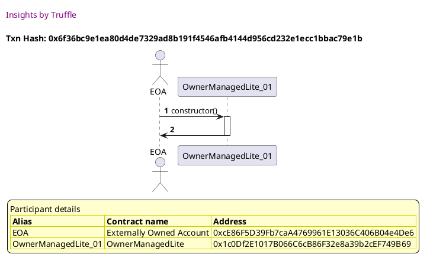

##### d2, tx: 0x958eff3557bb74a58f846a0c486b8261a462729a59bc0d562220b283f3f4e1ea

[SVG :telescope:](https://www.planttext.com/api/plantuml/svg/bLDDRzim3BthLn3PPKFNJVwIxI0BwYJEMc132xJ0BWK6MPOJeOeSo7ANjDb_7-EuGORbCXz4YIBvz1vfGguQnwrhLveGthhQjAj2Mj8yARFcbgz0ouKqvOIBfuMjMrDEQrrRU3VFv_aq9sJKkAsMOmBTjvIyb1PU-oF0TMtLIsqSrvbM2xEInc75oXq3vdXvABbkxLhBloxkrOi4BppwxdXPAhC0Z_QktvqTVUuVGNhy6zEenT8rK6pXmRPLXNM9KqvBUDWOkERDSWXqaqQ9hAeWYkAYY4CU9LKICav5cB0YyPd7G-R7VigZj12qZ9Zl-xJmaw0Agb1waXEKJ3XyUdwR0MzWW7P0K3QdX5fpf7hxoqZxdHk-aEKtvUHFwdM1P_m3Ghfyk1oVluUBYo5aPNdlk9Fl7yqZ6VLT-DZRyUuBkErQ0bh3Lvrzvhh5pJvy1oYVbKq3EwZt0DdnI3SYJzWycWNfl8W5pyAOfIdpSY-W0Pk6b4reACEPP6-bYhhMcAYQJ3ZrZ0ZWx1lG1tW5-ed2rn_v3RReF9izpGFVoo4GSXWpSdSYNYaTLxeveJcZCqhfdYPE4-g8cocEYSKk70aVIHtpnhkkGRXkdBI6Qxtj6bD29WIEjFjF0KuBdslmlzuEm1DqLlcvHxruGXcRCZ51nC2N2G_ImXVvF0xJ2KiH09NezI1NkEBF-GS0)


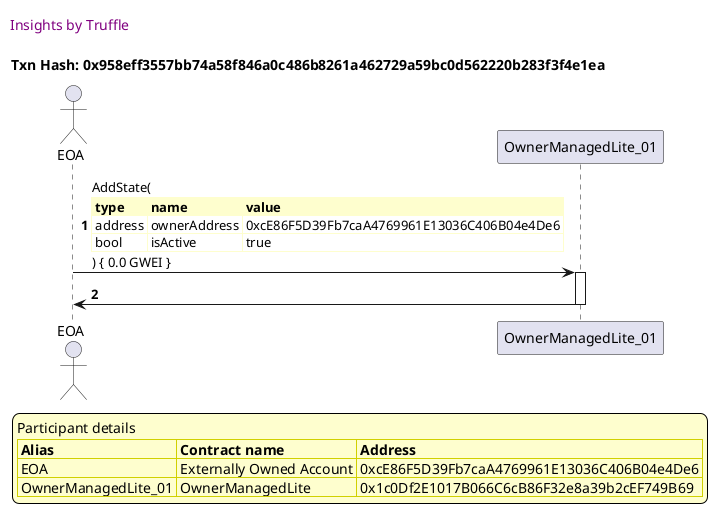

##### d3, tx: 0x8dc85ca542d26959769ffac6214fc2ec671fe501c2584fbdaaf451b1d1946c6b

[SVG :telescope:](https://www.planttext.com/api/plantuml/svg/TLDjJzim4FxkNt43QMnbR7QQ9WtgAlgI3AHD88Qs3sEQNDif5gdJEGwqqFttNLvMWLQYoEVSdU-UFC-Pa9F2SUlAHKO8BrrkoiLCMLBSQhFabYyWKtDbv9YBsxdDIoCdUPPRs4_Y99x4X0mAjyxKa43zt2WkbON7zXFWDBVw8JUEPwDCpyr26OSLKxTDI33Ob5oMTfcfPu6l-a41yxU-2owbDdDWj7NzgUtWGmk2jFtFJA7dDww0sHgkR9ccM9SuxJ85Loi3fxouEGQwwalHxmdUyptf1L4l2eCeJRa8FEQdmbCY25cgUfG9hzVtqvdaFFLxRCOaY_n013E2b0c7qEFp4V02zj3k4QJDQQ6N77_r_Due-uKRFbVoitRg5sLruWx_7Y7rUJWQxex3uU4n5CfTgj-bjahMESLeWQAuDzVccWnQKTwrThZv26wzL83My4LjxtXMugPAtq2f4U86yhhGlxBey9g4j_08z3s5Jz_ZCsHwDwZLqOzzFFMpGjt0Fpg6mUjxRWqgDOI1QEO5SuQTpcNyBRwyUjNf33xK_Y6yW1mAPokbDu3lWU1PXhBg0apkCCITQb0Vj4Y9LAY4lgi2Bv3Rp36vUAAEL8xhh7ZIVagdbDAAE1nN50et4vn3YyMt58wajAh0sFOSmgqc0DULKzOWs7Mjl8IH49Ky6A8hrkr6ISYYxcpIcp0UUccNiJXAOs-Kz3rEMSgcGHJIvuLtJT3_tgQ1eDFKYnbbuPW6mIGGutwGT3tLvzreveau2Vre74JO09be-I0dkEBj_mi0)


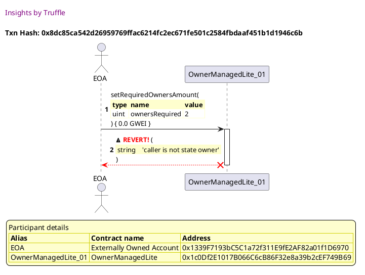


## Fails when higher than number of owners
[link to test...](http://github.com/thedarkjester/ConsensysAssignment/blob/7c5b2f21f354ab6c2adcbc9e6ca114bc570081db/test/OwnerManagedLite/test_required_owners_amount.js#L26)

##### d1, tx: 0xee033bed1bd71de175675ad034010be61ca2fbe940f3eacb44e089ea59a0971f

[SVG :telescope:](https://www.planttext.com/api/plantuml/svg/RLBBRjim4BppAmZdqY8DIbgq7ePhHB4bf42216ZknP9SoKHaog0er4xJVoyj2qQ3MWUIcbdExiwIaDlEW_FzjY44Uj_QVYlHaUxLs1qusD86QxJw3jHhxThUwbNRj8vUbKLPh0f25fq_DBWaTFWs21eT_Jt-KdhVElFMMWzDtfZQRj7we5ZvSq0Po9FahdUx1ZyGFymRKYxEs3DeRMnDEHkXFyE--3eMGSRytsrdwetlg3pG5zTNLT0btlW6wSlUqdleDdFAzeWiYYHgBdN2DV9a5YSpq2mIZ3E9CLSmhIHcWbKHWf9284ipX5a6B4juHO9boeVIYwUSGaSdOP-GO9itokmWjFhqow9x10irwWVZyIVZG-05V4B8S9_UB2_pzFfwJbLhE-_wOzPFdydbkAF0IUbcJWav3P0y_rEMHW-cwSXY7EENgpLRCyQMxzzec5EeC1nMOG0kz4SjRF48v5exx09tlhTy7reFwzwZiz0qXw5bJNEbmcFnWM9xLQHnELj7MIaJ1Rb8uYoBUS4Z5iKhmU8x9b2iCVueVCcw_z4X0QH559M9neoBD4-pHAGeOYLbETKLh-HqAaLShQgG83Wn-a5kmngU_Ly0)


##### d2, tx: 0xd46c97732425239388c1ccd91a4373034b43a98093647bd3fc0fbf9cb593a0dd

[SVG :telescope:](https://www.planttext.com/api/plantuml/svg/bLDTJzim57tthxXYBviOcrERV5Ii8hJ9GDe44aXxGPeSsoaMhbCv3ckX---xJKF5jBui3xxszVtmEUU6aFCs21-wXIL4TA5ntQBIdhIFnYs55mkmUgwTkX3oSUwRpgbfOniFxygYBAO58MTjM5iz8T1_3reexU5bE09SDjuyDou8cripTmlj0bQimpwWnCjToMNdbrR_TN5hdZL4VE-x4KePDuU83gxVlJtxF3o23FslN6lc3w65QWrtlgjhh4k22LR3tSh1fMWVna1NYiSoIn8sugFJ4SjOcif8IfL5WhE4KSOhpaIMqep5FAaKgoMjgpgJrMd615MA86KouDEBwnn42qTeZmZI5emqIu5GhtyvxRyB9-PQVJD1_wHH7tZ0VqH8dmydayFtS7myXbofso22Vd_lxidPeCB7mKusNo2ibnhGEh7exPEm7MwsuHj0-hnkMzX0issGxuzq9OiqBazdB2khH8gS9t6MnL4H8GtnbDFuWdBDPpf-BLKrZSL4q-Ooc2Vi0C6_Dle0Bq0_KVZwexX2YGwZsSBSuJqP0o6xCICtRyXJEWXZspSmPtH6ATt2n6b27d4pnJ7ngC8Uy1xKFc-owGN2THMqTyBQTI-CWbnA7EdmdmIyBNn8u7-zVGEH5eoLYT9PnDCypHAUQXp0gYf7gexgQZIgU5nFQso0J0nya7DSyUVy0m00)


##### d3, tx: 0x0af299b14e350fe7e0c6324d11b4d098fe547698cacd16d24e18d032cc6f67f3

[SVG :telescope:](https://www.planttext.com/api/plantuml/svg/TLDjJzim4FxkNt43QThA6CuBQOAwYD8c0saJg4FRXp5DJdmf5gdJEGwqqFttNTEi0gtB1vzpBy_TFNTcxBIsmjXcLZ8c6blfPfQXOVMTqdDXn0nAdAAMPoA_cvggqN9KbPM1_JH9ar72sA2son9Z1krtYqAYWQVk5-2yCkgnqbQKmr9DzGor9SJ2RXrICcuWvusPb_Z2y4Kz8ZZ-LdSbf5Hw2WxlLBzREJZgYc1T_WjTg-cjhI5RmhLfYe9mcLMsHBXUQ3WNzUq9y0KNXHj5cUEZTymBx2FF0y_rfUDalkHHME2ntm-YC1UvT0Bf-kY4adjkdWT5q2yyHfJbbafFBeSWQjWZkSU8DgjoDHVKwkM3HlDPQ355-KbP_CcTrd67Ve-nDXuEuzrsE3WuWHhj17yrog1iVUhXZ8PYtzpe6pReXlAka_7g0zZb786a5hDMtekoeSlQVGMDeX9NKBL0Vs59uMuSti8JyFSSFdvBBeZftKKj3h_lKzIFTTMRyWzFOF3wGHXDaufXa6_sXNpYNc-IV4qcrwzwlS5Hgu-PHA9GtGkB_sDbiu3iwXcj4grGPVsiup4VSyxN7TEU4SDq6T426GBVzZwKqc1DjcrSl6f7H-V2ej6YB9Vjo2GCytpDAvdu8a_283qUUr6QzNCnNAz453Y9ut4l6FayEEC--cCCNWBl6ls_sZQ121FFI_iI8ySFXs7KzqFqWppBKbSMJf6vRkO7nQYW1CH4nmSxfPEUxHy0)


## Fails when required owners is zero
[link to test...](http://github.com/thedarkjester/ConsensysAssignment/blob/7c5b2f21f354ab6c2adcbc9e6ca114bc570081db/test/OwnerManagedLite/test_required_owners_amount.js#L30)

##### d1, tx: 0x9a96e588269fcea2d98c893a706de93840774902fed8997ecfb3f1b5ef9c6adb

[SVG :telescope:](https://www.planttext.com/api/plantuml/svg/RLBRRjim37tNLmZjouQkc7o9R0LPK3UnqG4RMc1z7sY9TeGgSY3BMD9r_px5CO8LYnvquI4FoKCHSjTxS7xO6a9Wy9qTjZKwqhzekmC7MsgmHQlkGRwqhXkiMdMcS_IwAgjoLHAowFt1u9BGSMqG53hwUtfI-j0v_TfP3wOmkhLRj3umDlxiK0NmHBaRtCxWE-27VaKQfMVR4oYbRKiZDfd-ZEVYyrG4cV9_jRrkDxwdzO4-kw5f0Y_nsXkaptjB7w3Vp2dR2n0SPtaUSz58X5Y9NEOYWOnnXIB9KvPbgM1nWoeN8aFPr4aJrJDiXEIWQX8aapwKNZuM57fw5Suh4cJpMkeTX5OVVrbqty52Y-gRzlYJHQFZ1ViL8MCylLrUnkdDpPpAplRU3SUi7pwIotv7WXFJxPmISXeWUVgdB8KUjEd9OXhZf-irMpF6bczVQ9XJg31SLc40BlH7BMpnQ2YKSjW7x1otV1jR3_lUexDWp65iMT52ol1PV83ONfOvhsRhH5Hr9g58Cou4ZyeeOGbVfOpVinJJDVBtn9Ua-zyw9YZMjKWo53Ajobd6ohG0cG5V8PCoJhCeoU9GG1pYIL1YqeFSXJry-xy0)


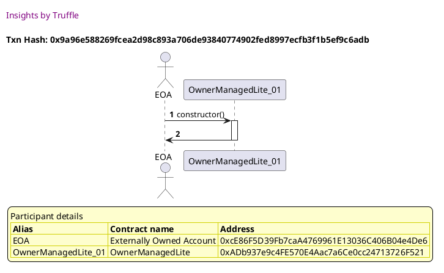

##### d2, tx: 0x3cc6b70a99d1d25f473f552cf0c6e7cf6f363ec4e5c4a86256dfb11ff07e49c9

[SVG :telescope:](https://www.planttext.com/api/plantuml/svg/bLFVJzim47xtNt5YBviOczCa3a6i8hJfGDe44aXxGPeS-r8iNATo7DP2zx_l6aB5jBui3pxxVd_VNHWxQuFqeLjOncGN6jSjAlIiVJ1kARrSWCKvEdqkrSFSDvtJayOs7jxDobavAHaxRSFQufX1_zsZrEZXUNW2N3JUF3KkI5jOCtSBT84orc7dC2FZIyfbvvSM_pBSc2U4ADdfhgNMniqXueFgTozFFmzDiA7-fMlD_3wqKAtXrdTrJNbPCC4YtAuSNCZs_WJuAbPAL1cNUQuZFKhh98lhD1sfcYk1cQf57OiOLOAfIkIn6AL2rrKKrJNFCCbLpeWo5QZryge0sS81oGD6j0MZp58IrAjV3lrtwUGSzJSJy2UFUiSz-WF6-dWu6k-tm-7X2HHQtmGPyFsTksEdmnG-3dAy-G9XlKGWwUIYbu_ITdJPkc-0wFFOjh21PbkWs3tvIfN7OfPEutnMPKeMIIRoN4Hb5FDOJ18kpdc2oHJ5QwggQIm5chPGmJnI1GZ-jT07U0R-YSFN7-KbZMW_cYtC5xn79y3OovgnwpVaQGpIsFODp2cVSiwtC6cRY4UwJ6XDF4rX1tW7QXSttlG3edCLq3jfxReVZ8P2ALhfy9y4l4syRy3_Qli2nRJAumnpbSpADEDbKaYLIJ51hjGeoQ8u6r438ufdnCJ01pkZatxEFm00)


##### d3, tx: 0x20ad5e780ab775a2bd00ee8802a8344d9bbc319338a727feed09004d4ac07496

[SVG :telescope:](https://www.planttext.com/api/plantuml/svg/TLDjJzim4FxkNt43QThA6CvBamPr5Q5D1z8c44FRXp5DZdqj5gdJEGwqqFttNTEi0gtBXvnpBu-VU-x2s4dbX7Nrh61CrAuqzIn7owexRUR2YXaKE4MZJeMyczgoDcfO5gM5_N4speOPO_tABGiSC6YUMnGABJordm1dfTMFfN6YI0izDJCqZX0dRfimfk06SbxRUO4l0b_q8u8NRdsNGYbjfk3nrlMxiVsZbWHhxpytbPxUkWho9LpRUZ8XNEQqAn2k5mREH7Lx37pXSw6w6FUuoEEuA_nSSOxOwt5Vz88mL4cUoy1BWg0dOZ-U82gUS1wgK4WUXqd4I3BfY7fsaOAeO8_i7YFPd9PwBgZLYmU3zhCmOehgatRuatjDuWx_7cDDFHmETiVXuE0OAdHN-AlM5bMJKwKp6efxSsDkMByTohlM3bOVm2td26IDc3NsNXGr7TRfAwWrKLn1sG3zXIK7toIyXIVWxpby_9QTazAxIIqEl-zJrOyrwmtzmsFeltuGrj2a1j2NctsXd46dSvLzpQwkNtKw_QF6Fs0AIK9zBnp-JvND0hBBPx8gT48NrREEHtp4ELztJ7j62jDXI0ja2NpRUwgKnOfYsxh1gXaTlHSEhH55iMn6fY2LSgthMeo5p7hHk3iAad4UIv66SPGaaPTv0G-YOSYZKnvYECBe9V2kqV_hRIv8HtaIn9Z8S9nrOvw5gP2nY8R8fVJ3s0jYdmZuLCz8YLOFTa9l-ct_0000)


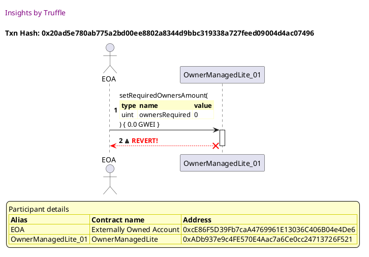


## Adds the owner, changes required owners amount and is retrievable
[link to test...](http://github.com/thedarkjester/ConsensysAssignment/blob/7c5b2f21f354ab6c2adcbc9e6ca114bc570081db/test/OwnerManagedLite/test_required_owners_amount.js#L34)

##### d1, tx: 0x49304dface1dd3378b915571927577b0b01012cf91c26794b019f32b6b4b6f9c

[SVG :telescope:](https://www.planttext.com/api/plantuml/svg/RLBBRjim4BppAmZdqY8DIkf1cePhnB4bf42216Zk1L-IXT2KGL6edQR_thKi60rg7KXnTZcxEqE4RhieG-ot3Y7PnzRtMsK3wbuRlvD1Rh6pjVNcJkhNEhIzDwlMjG5VbKLPh0g4vbqyEBj0UFWsLXeRyE_nYF5z6vgtraVfbgwf_TRw28nLF2UK43nHxlgmS_P3u4VpPZ7DpjYpDARnDQPaXFuC-_phs0GQwt_tNLDlOeVL0R-4lgg05yKcEejVzXxVosupmsIVYPHaffBQKcFIb4-Le7dEgKXuphaYYb124rq9gXF6HGPdKQM9OYfJh18QWMGwGkl5qnBB3azWdo2GBJQwsKaOzUcNj-5HUbbRyz14-vFG8V42Fa5ek8zl5fVZ-FfwXdNhknZwOzLFdz7bl2F1YUbcXX4w6OYU_sdBs2WRrw7vQEENgpLP4q8Mxzym-0GTmiyA30Wm7_PoQu_0qfXWEuYTxotUXz5XtKSRl7JkC8niy59hU2mHGcIlYoahytKgIiMrN6QS2S5eGLEIibL6s1t9RBQsx2Fn9Ud-HuS2t90o4M1JmGbBMCQDOdgQCgxolCheQYeIGYIRGW5GOjG3tS8Ap_ul)


##### d2, tx: 0xe94432fe9ab497f4a8279e2b7347b66d9149af743191d9d471e2f84013a6cc3a

[SVG :telescope:](https://www.planttext.com/api/plantuml/svg/bLDTJzim57tthxXYBviOcvEuJerOHMYJWRG9993sWZJTn4wnS9tASLWBtN-V6qBLQNrP7dpjw_lXSyuD8UUjH-UxXI44Ez_ORb4gHzf7RPVeS056pPML5rWzpbtJMJbjJEFWNP4N-JGdvAprQwCc1FhlGQ5K3bw68y1bu_HpOpsQpEYvNIZhGyNQxmAASFbQSjcvfL5_NTpgPmKHs_bkK4fjvn3HmVMxjsUVXqUGeV-LRVNymRTGhk7ETNKTwXAllL5mjx9mYUt3AT2L4embSQq4baoaDSDnd0eLbsd2qf9pAI8ci4vP4eb82idIICNrcD4eGLvL2P90MUN3q_Fh3B25es2FIA3DwqelCK2z_cML-uuMvqf-qrxzf54VUC1_H4YV3oUJm_TmV7mAcPIt7hrwVs_loTcWmiV1JZPVmA-N2eArkEZj4vekRBRX6mZqETMsi85cso3R7UcgoiUy6CqIKPHfXHbBkH0yogE49dpAAB-WJB6Puc-bogOn8L6tMUNrK-W0thqr-W0lG3zH-FeZlmeI7KQpXVcAz-GK27aTCtApHvvK7hLfzs3Ew8nIkeKPfYdm63RJC2OkgB03l0ErovjiUe72klBAMJHctGiZ8QkgCDB-FmdOBtn8u7-zVODKqY8MjOZobFAOirIMl1edF2r7evf5qx68AKK-3Wq24mCVv3oiuUVy0m00)


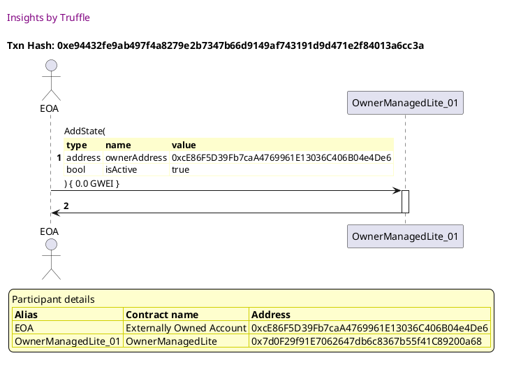

##### d3, tx: 0x015858995651244c7d4dce0f698d29fe7f6e0f8cedd36a81131b6f8e362f2bd0

[SVG :telescope:](https://www.planttext.com/api/plantuml/svg/nLJVJzim47xtNt5YBo36PkU7aw2kegJ9GDfK993sWZGvyIMDcZgLusmjTF_xt91Le5MJu6L-yDddk-_Ev-zCo4LhX3RTiYP4TAPHtJ93JTf5fLP2YoNKMAAIbo9VbBhfb8oRkj7mBatI94u86RLcK-EOG3_cA2HgU1os05UDhXuQPKGzgQjIBL4PYrYOlK5g3vyWLvrUrVZYuBPwG63UNdSZfAnK2OmEgb-z77qSaY13_6lLLkNSj91ju4vtHM5nYQbCZN2tLd0bslavq3LbVkY7KUHpdpcUbmVIapdIWaUXTA82WuBRNPYZb2uN8MCkotWHeikTmiaa9RPakR6f9xC9Y1QEh3mYjcocogkLi5UT_LIelmebIfHVAeFVAUiD3-YF2EdzuMny-1nEJy_15k3M28EzmV6zkYUZuIdU3tAy_GHciqAmKebbBt-8khEBdVbs1w6nRM4BpGvaij_IDNFTA0rOv6Qn7pCHE8NBM18LYJD9GqTGLh0fZmBw17K2Zq0_KFZyBRcsBt4uwN_UnWP64y-5Ad6c-diTdxmMv-pi7DuIUoaMEDEtV-A_Fl0E9EzztvZv_wn0xqEUUflSF6EiH2Egkdr6gocTKaftjB8jRCbh5x7jJMsfloVOdaHxl_6sxmexhmrg9UfwqtU3X4cUst_4z8JBav2d_jIoBWjoCV427aMS9SobBeyzoY-fXzuK-KlWGrtrjxOF44YQsbQEM19Gxd0la1dFGvS7cUyN7el3oA5KyD06i9KOwa4kx6n_nDy0)


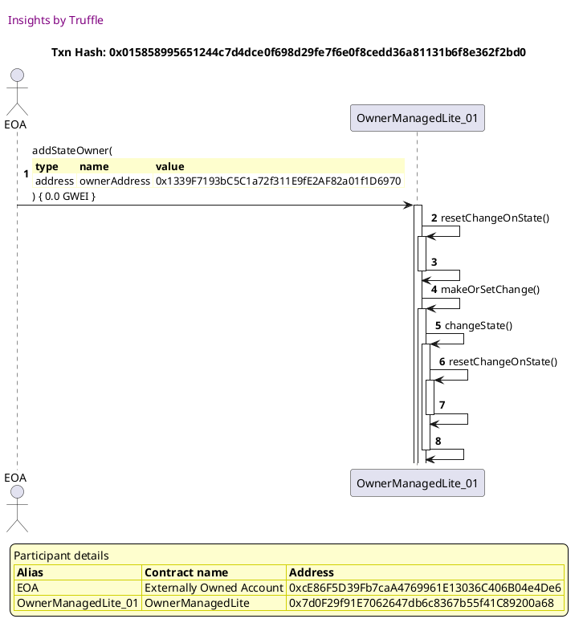

##### d4, tx: 0x7dc3e7963005330954eb0812acb288d251a02bad49855d88616b77f87455218c

[SVG :telescope:](https://www.planttext.com/api/plantuml/svg/nLJTJzim47_tNt5YBo36vdmv2M8LfKq7qgQYWRGNfCc9hsb4udIEmrhe_lTTGwX0goR1o_BWS-xZT-VpxypOQMEbiMrLCYPRM-ksIj6mvhRG2sba1INcgDMPp6vpKxTQZUgoDl1kaaoIKSBOIMDN9GuOTDySfK833_qlm7bjYljQMraEooBN5MfBY3ExTPYGyH5oqPf5YIyCLyKzWkDlTPTIgKBduF1UzRkJ9n_x8bYV_q8tHJwt3QGhk3RjR4Qup1QsHBXUQZYNpVmO-39KcOTXB3pE0y_ZSU1ZoYF7bLdgHf5o0qToDvNAZwCWK54a7966uImA_I1mdIXZrBBCKkd9T0YoWJsIUupQPekiM4WwwlINHlDLQfcZ-b9O_C6Tpd67Ve-nBXwE1hljS7Xu30tQR_YpBGogpgSPLdGfTlz6tx2J_bBUztAm_WHsjK0WgMNLoJjPjhJPkA-XBQZ4DTGTq1CiATn7XmDu0Fw1m-VloGLrUdTH_wpM8DKxcakTurHVMMbn_-2rE4T7n_2Mt9MynQcvUih_-iGRaAoBVMFb_xC3NGnxd5rs-OoH2gqiokOPMSPyp3dVa8L6bCX9cn7DdY5gRsapL8fEGhPjt63TiPxMfKMZPLckEhOh66RPXf9auiiiYSGa67ln90qpEVH34SV2IHoFUsBaSt76VVJ7A5u2xvgQlxLTWb3nYHlFOYS9kN257wfKP94dmZG8PhupYcANSoaYIa2TwFl1Jccb5-yF)


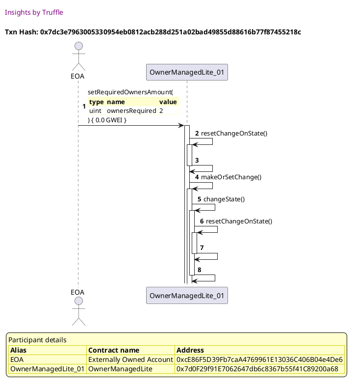


## Adds the owner, changes required owners amount and emits event
[link to test...](http://github.com/thedarkjester/ConsensysAssignment/blob/7c5b2f21f354ab6c2adcbc9e6ca114bc570081db/test/OwnerManagedLite/test_required_owners_amount.js#L44)

##### d1, tx: 0xf8a26725554d11de0860ebde138043332b55513bc2aeb6234d9deca64d8d4468

[SVG :telescope:](https://www.planttext.com/api/plantuml/svg/RL9HRziW47xdLvpIbqrTDR0nTg8igfquwgHDhRI-JzXS75I28uorfEl--uXZHQiMFm3-lkExk-yWvBxpqlb-PmYHlMzjlwlGaUv5sxrqSWS66xIgaFLBuzhUgcLhMWStwt9TBaj2vfq_6bmG6BujIeKEVe-_00-jqw-jzTBaHZTsXzO7nOs_1Am3UPRSzsvly1tnGxyYC7x1dgHIsZR0w0Zz6VRvvx48CkR_QZlTR7q7rH6UNR_P15tYjJS8pmSB3xBRpe0UDfcCH1ebIS8LOmff9YXM2bcSKHx7SLG5YiLL7KciH1HpDLLOIy5LfZWN6GcMrJwKNZxc83kOX7r2WcrUrtelGwkFloowxzBA1jKtxV4dPKFW5Nn2o70VxXRNURYzdK7Tsiwx_fJrmqToFUuaS5Qwcm4Xvm6Ift_AKkYbDXsPZsFyTBEYAqhfukqBX3c52iDX6GRWGdzWvGvFGAwKmovmbtkBjw7ri1uyEYkDEGujAyZhEZmM7oXwgCjCh9DLF5rNQIrpdehfLB2InJGMIqv5GJdo5OhtmjUi-nyz9n1P8f9KYNJAenMhKbuaV2EZWYTnMWXQv0LZIt5A49mO_I3tOGtF_Yy0)


##### d2, tx: 0x7419b7e994653ad0d959b87f7b46e43db5e61c9e8cc391e51b3407e2c8ac04df

[SVG :telescope:](https://www.planttext.com/api/plantuml/svg/bLDTJzim57tthxZgNZOnDeSuJeEwYgHD1z8ca43Q2zBasBV5mdKgns4jTFzzRXegflLbUV2rh--7ppatX5mqNZZVBWqXelMrRPSLEj8yQhiIJYp1u0AjAeHyNBYwjMfIczh1kravAoSb8QF6RmoE2NJV0mg53bxw8y1bxVHpRRqmkT4BkqJhGyMvFmJCmkM-vAfrAuD_NTpgPuI87NmtGYbj5n3HtlMxiwFF_ID8t__ADdhnu1keDd3dslayr2LUUuDmjxPmAPg7Sw3hb4LPbMAMCPx4Gb6L9LarJETfnJYoM5K9yaXcE9GopY9CeYfcDCKpEHIICZKdWJBfmzFBwnn40uDW1oJGvhNKAn6WNl-owBuBAnQelccFFsdK1Hxn3mZfyk5qVFmUJaxE8LVgrWkFx-_jFHdrAdpixNZx1VncXH2i5SlEFWdJXiqkV0k1FeTD0rkeTmtomv6kPJdaisGQPxCgbI9dASyo7fLHJ6C-OPGNb26R8dyjLTMr2OcwoQNNJw43UFVQw0Ey0Fr4uUkFyYf8T1pD3kOUx-av4B8VCtBpXZo5NcZJl84vfLDAwGvccAR0OzXCmfYueC81y07K8M-yxGGAwzgZiyAOJIUCWbpACDB-FmbuM_YOmFzwzmtuCE59gdYQiRDfLAMiIDXSd1KiYTE2qo8lecZ2Tmq24pqVv2AiuUVy0m00)


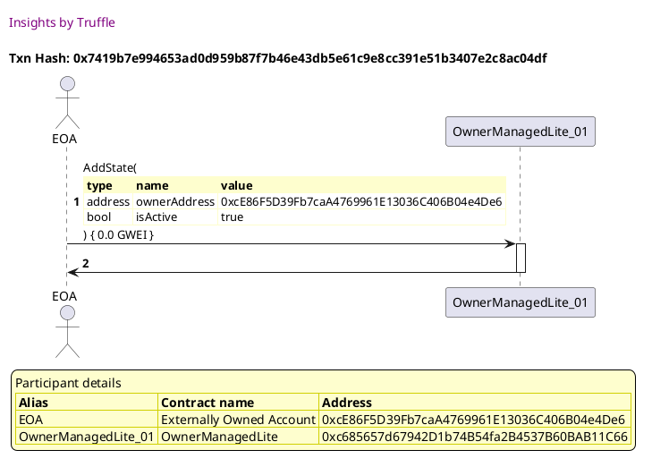

##### d3, tx: 0x197416f1627b33940a723fa52f27132e13cad500791d47d54775a272d58bc590

[SVG :telescope:](https://www.planttext.com/api/plantuml/svg/nLJVJzim47xtNt5YBo36PkU7tI1MaQJfGDfKf2Bj1Mcw94uQaJgLusmKklzzRffLe5MJu6LvyDddytVdBz-PaClMe3RTiYO4EzEeRfbAJThxIgrGun9gMKgLHvZTbxhfL1utTQFXtJIP9d52o4LhrhKS4-Y_XSHSQdWQbW1NZQuU6sMm3kkgL4kfZ4Kip3vWQZTtaAjEhshvOcDUFKfWtjvtWtbUgH8O7Lo_UdlnSIY23FclLLkL2zD2kePRtHM5nIMcChM4smS5LzWkpe4-i41uZ1UCEo9rtS2ZA1otGDyf7C5SHp8tmzodL0GizqJkUqBuw0WdzqTfvWUKMCeoOqjFPY5W2qVM7X5BcwcoQeNsghEVIkglgB2K-PVAoE-KzO47_4U4zEVXR7nu7qvFpy4IC3TeP1zmVAVkoCNmAzuFThpv16Qzac2jmcLlVs3TsSasVBE5qB9jOGFD5YJSBoqXbeMfO86RndxCB1k5orWI58aJJaSEKbQm2Gy4tK6Tm1FG3nG-VqkkxPyuNFG_RsCJInClK9Loflfx7P-y5kVix1pUadk9ztAcvt_olpxn5YJhpxwnyl_9G7-6x7gRt3nJR2uDLdNxJ5OJEg6KRcLbMzYArqvYsvlQIdyliBs8zkV6cxuhxFXWf5POr-k-6t88iyo-8wONN9QC-DIVMDMb8iFG4pm8E4kOIrqUUvH7r9FUHFANm8Uwwc_lBW4V-TmNEHU1vqnOAhp8zmfq8iztHSHf54QCnNoRm38ny44kxMXVnDy0)


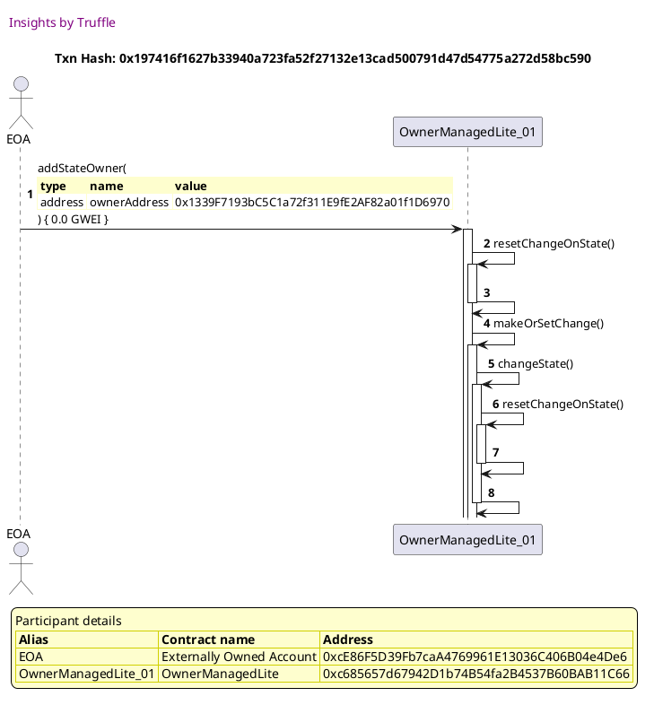

##### d4, tx: 0xabb6f0722ff8e8832aa5408d15aede67ba8fd0500b7f47c53fb9c0ff8e84dfde

[SVG :telescope:](https://www.planttext.com/api/plantuml/svg/nLJTJzim47_tNt5YBo36vhJvQjLL96qwa3OL3QIz84sN-99694xdEAo5xd-VcuOAj6eIl2mFFkS-VdS-_ywCdTSQbMxAWZ5iT2MRCYR5whjSBb5X2GLb94M8oLscgaQAILLK2jxDebaqYHWRrNfTq9X1-oq81Ibux7u1BYgLFrHIOn4KUIPBajeWfdhlC3F67UIoKSk2NXYkymS2ozxhhb28N6PWyKxrkvMZZrqHhCj_AUiyM-WQuZNSg2PD3IxJkIu8RbOIBh1U386lC8xTb7kzNfhwvFlz7g9ZSrzO3f8WrulHJmLtE8-zrFOIfv_6WuItphP8XS5ac6XJUZGF06iuClA8cRRfFCcNQ8uw_oL9VKM96OalkQOVt6eT3-YF66lZuMnys0wdfqEeIN-ZdqskIBG-TL2QIz77j_AMZRfBUT_9yUOJwFMIm4Y9PIlliMZCPkk-WIOt9MwWQe6UO8sYjtCuWKVW7pXy_XvTcauVBkgVrIeozKuMA3EQoskDcevFNejpTZQ4j-GkyOxcwlef_-iJRq6IDlQDbV_F3hGnR3UxxEeP8mLfp8lw6LccVCevtvB5ZAWXfzbCpEmfG-qzRG8Xp4cCRHytthIiD-jAav9O5EkMxGA29DbIqfZuAebyT-PC-uDPx2KOs9ux6BXMPFLvtvtOt0svJVQKt9V0XwRcR-qkWUixhkC9rnlOlQaLUtRes2dsGjlfUw7Bmo2qh8cxJM0wqVM3dPlLl7X_0000)


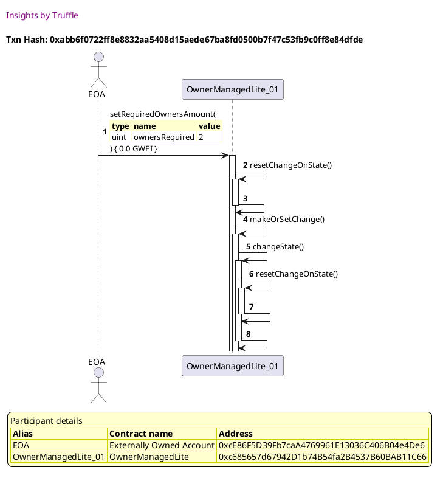


## Creates change when more than one owner required
[link to test...](http://github.com/thedarkjester/ConsensysAssignment/blob/7c5b2f21f354ab6c2adcbc9e6ca114bc570081db/test/OwnerManagedLite/test_required_owners_amount.js#L56)

##### d1, tx: 0x79b4ff9105704f767d88808ac7cb15cb07ab94fc5226aa1ad3ca092879648834

[SVG :telescope:](https://www.planttext.com/api/plantuml/svg/RL9TRvim57tthx3IbqrTDHEC3L4MbV2XJjhKIklxTB4DiGecCaPBkkw_po4eMhNmO9jphi-zzrmZT3yui6xiMeHWTBqPkqfPDBneimSB7MvLeupSWdXfR3yQcVLjR_5DMPH5LY2q7jonLHk4fs-dG2gBVy-_63_qLh_sna6RjhendJBEAzRk4b1wyYov7-s-LU-87_fLuO1Ui2UGKfi61sI6_apx-lDS19hpVpM3RdPkmDKHFzknhhqkSjgr2ZyV37w0ORV2vC2JYjPr4f284rfpncKSnoG6mKKLHA8Y7Ag4rY9QBXb0038KG99bp1D6upYao5icd2-zU4mn37ZXzmNojZajz1vygu-_ZBBVmK2Zv3Vjr4yIJ85Ny0L2qtryjxdEuzlR5HQz6PmTJra_V4JNuqu2PwMx5KReF43qz4zPKZdGxO3MynW_tUGa9uHithvWFoTVeJzaVW3MzuSDTEe4f59QDNZkSc_pDhNkruDJra3R7gUM9Kw5y8_5UOeSH16pCih3fAouW9HobYGiA8AGX2oZX6q9LJHNxBtmDUl-HwS4TH7aB6SPWIZ8yhJa885kbvLaIyR3Y19EHPdmq2VmJin-e7k_-cV_5m00)


##### d2, tx: 0x80f03880eea291c12ab6957b1b9d58c11c954c02d0435deede1c6943bb616bc5

[SVG :telescope:](https://www.planttext.com/api/plantuml/svg/bLDTJzim57tthxXYBviOczqaJeDOHMYIWRG9993sWZGvjbiiNATo7DP2zzzt6qBLQNrP7dpjw_lXSyuD8UTj43vq2qk8w4BZkaMjFMaVZLiABnPWzLmxTI7auzmtdLFJnZOUtbLbLKvBGixQiBPwGg3_7hHGsiFBS0IuRBnvRbmGDhTcxXRQ1Qmu2xk02YzVIouxlxJwhujRywo1nJlVZL3Ak3amEhX-z_Riy_08ClI_SgsPFuGMwZNS-Musmxeac60rtAqSN8hsuHJeQandD1gFgTPYb379HgBcMPBMhCvKCfQCoIo99Hqf6aU9qbff9daMHtND6QzbGf0o6V3fvNKEeeKZj4S4QGj6cgL0gDU_dFRVXHDphRwPe7zIrWSUy1yHqkV3oUJmFHmVdqAkr6qGGR-_T_VaR53Xus0dcoyGraiDQ9rOzFP9s0uts_0D87rUjorieDaso7T7kfBbc5T94MLLdKgHnodFCivA5j68JsFABsYiuqBpjr9rqrXCD6qkWtd23X3yMwCFy0Bq4uMlFyehbEWmcYtCLxmdfq38wvYHcptob0x2s7OFPa4BIkaM9auJyeYRAOw9HnLsW7UWTdcJJIyGhgkWlHFMhdjX5EHIuaY7_oHWl_0XWV_rzWrc9IjumQTK96nQv5Kgb8WlHhNY8vv6IKpJM5PP6c43P6BWWvpZYZ_d7m00)


##### d3, tx: 0x4de01b4505419b7f4f02f92d7507243f83f0580c137de420ad9125047057d2ad

[SVG :telescope:](https://www.planttext.com/api/plantuml/svg/nLJVJzim47xtNs6n5n1ZinCdRX2h2Fana3OL2QIz84sNs4aZKgTodAs5xd-VQx8Aj6eIlCmFFljyzztv_9qHEkyDQ3CiMeHWC9qQ5eNKgBzlr18qB70hQwd41PJtjUu69PAkxJH-bsTvbcG8dVLctSefmcxC9GYfyUEunVYoqyr3fmoqSTlKQY6LiOYLsHdazl09SZdePIjV7Dmq3n9JjjDTWn2DgZ4be-gNasSVnoJG6FzAzKqzDpqkrlXM3rLbSP5fJ2lnxKhXI-ZdfvYic9245YmW0QDHmIjM4Q-AFC43mZtcLnE_8i64bDJdGZAFW8Ye5n36IS251mBPafN6ffxDOWmzFh3o0DcocQPibc2lElkffFuA2ceflZH6VYVK6UxH7o3a_F79TFyvFZu-nRO0DmQCT0Q7T-eEdOrFyNwKqyqdRDPBYQrKi73o1xI3NMpDDri8BViURt2t1ObtMxAYlX_bd4P-aGG91UvLFgLPL6LUd4yy8BIYQHXnyWHrX1yn-K3mvs_PbNs9_Kd_ypOsi3J975GjPyhTw_3ejJWd9wVuBR4NS2zd-kPF_DS7teAKplUDcV_F2ZWVzDJRwFePOuKqqBJzCrgb92M4R6bbMzYIrouIsvlQKdz7i1s9TdxJZUiAEw-Cr0hQTkswGU2uBEq_OXpXocmIva5gMLVm4cB6moWAQKPzueS98-45OPAbCdm9lA-h_jQw05Lc6Pk62O609ccSSn30Bhn2X5x8_O0HpieyuhuDO2inrWETszd-YBy1)


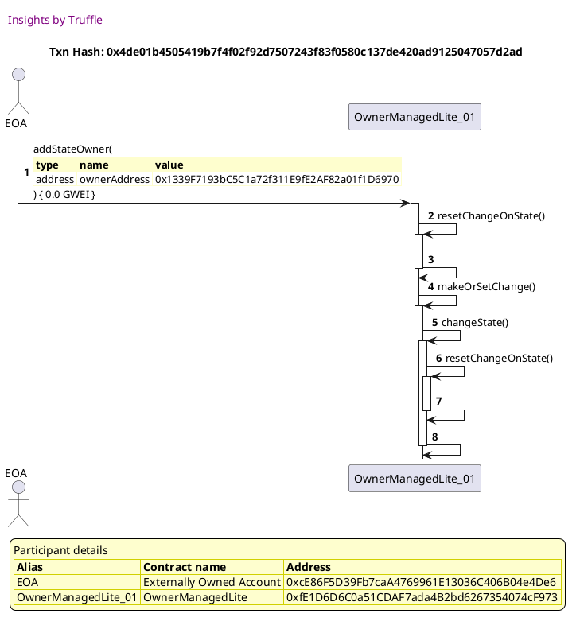

##### d4, tx: 0x09ca7f850570fa0fd096873ce115e283720b3c60a6c57da4ece9ccfea37da227

[SVG :telescope:](https://www.planttext.com/api/plantuml/svg/nLJTJzim47_tNs6n5n1ZSxuRn2f2cWoaJKK3QIz8qzMvf169qpaEQw7xttSDeGAjcWGlouFFle_VdS-_2sEdhG5jkhfY33hJgAwUeMRjRQaMeA7c5HQeiZEGjuLkEfN5JTLe_YvDqYHE63jfpQh2CUFzDqV8KFE7uSZvUQFB-qOPgAAgB5IDoX1YRhOEAHaV8HUTNbJumd1LtYEttAtk4hAiL0MtnA3wtSkJZqCHRCX_eTgoc9kMprRyMdTvJhZCbAP2VhrK_1pQ-J4NIn5A2FAH9xn0v23oJ8J-A70aMfQ7ziW9R35pf2_0brwGWOiIGobp18TEjXqmQfaqL7eoZJYqV8_a7gEscLAM2w2hJdyfr5z1GO7PbzBW3s7rZZlqUupryVnelDlE3m-FUOlc6_xiIerPxzD6DJsAsRzHD-naU9JtWnolFt6pMY0dgQ3kvHrK7MqsxclUbLJYcZSzq1CiAUn7XmF-mCK7mJz_JoweqxkB-cUr6gdUU0wgmAcwCc1m_-2rE4T7n_mjkMkunQc-Uih_-iGR4Dd7lh7o_zc1FeOzpYwxVCR830sKLVkCB1Cn4K9io48ZIkIaJKopfudQMzf4MKOt8TisRhpkMK_hqg1MK5MhdkqPZwJSK99COYcJaPzw4oTCPu64o0tyCFIjn7A4uyUkyC-4Y-u4_PV0kwRcRssV84-iYJ_nOm6U5K-YD02QqpDxblcs7pYUAm9Nfc7WK0BgnD0FTaeh_V7-0000)


```plantuml


@startuml

autonumber
skinparam legendBackgroundColor #FEFECE

<style>
      header {
        HorizontalAlignment left
        FontColor purple
        FontSize 14
        Padding 10
      }
    </style>

header Insights by Truffle

title Txn Hash: 0x09ca7f850570fa0fd096873ce115e283720b3c60a6c57da4ece9ccfea37da227


actor EOA as "EOA"
participant OwnerManagedLite_01 as "OwnerManagedLite_01"

"EOA" -> "OwnerManagedLite_01" ++: setRequiredOwnersAmount(\n\
<#FEFECE,#FEFECE>|= type |= name |= value |\n\
| uint | ownersRequired | 2 |\n\
) { 0.0 GWEI }
"OwnerManagedLite_01" -> "OwnerManagedLite_01" ++: resetChangeOnState()
"OwnerManagedLite_01" -> "OwnerManagedLite_01" --: 
"OwnerManagedLite_01" -> "OwnerManagedLite_01" ++: makeOrSetChange()
"OwnerManagedLite_01" -> "OwnerManagedLite_01" ++: changeState()
"OwnerManagedLite_01" -> "OwnerManagedLite_01" ++: resetChangeOnState()
"OwnerManagedLite_01" -> "OwnerManagedLite_01" --: 
"OwnerManagedLite_01" -> "OwnerManagedLite_01" --: 

legend
Participant details
<#FEFECE,#D0D000>|= Alias |= Contract name |= Address |
<#FEFECE>| EOA | Externally Owned Account | 0xcE86F5D39Fb7caA4769961E13036C406B04e4De6 |
<#FEFECE>| OwnerManagedLite_01 | OwnerManagedLite | 0xfE1D6D6C0a51CDAF7ada4B2bd6267354074cF973 |
endlegend

@enduml
```

##### d5, tx: 0xeebe61c73d416d0f59e6e8f8f5501eb99f9e8e88ed88e28d322b3c48f70cb4ea

[SVG :telescope:](https://www.planttext.com/api/plantuml/svg/hLHjRvim4FxkNt7glhJgkfb0UAcwg9J0McbJghNIlbIQ33u8AfZCc2vfi_--2w5HgqMJDWq9pjoTdtkuvmnZvwqHsdHrnPZeJAEwEaNDsljIBOGMDLHOe98N8hilTDCf6JLLe-5D4YTn53DsrffLXHC6_JL78L73q_0ASDdeyh5HHbHXLHQgHcK8CJUxX8I2MyX5fnSLlWhSb8y8bhFpNGifIrM0nGVNpzwUlHz8iA7-bMhBOcvQI5Tmgxiy9rncIbCXt2uLN8fsVWfyYPYYQsMUBHtBbJmV1-YYd_lvUCmjJ8CW3z17tqT9zyYNzcYKsfdZvnxFKWS5evPbXgZ7in142mTa3nYrpPHPkH3qgRCV2lLdeKI1ybDfy1kt-iGz_WF6-lrmCjaVX-FZKsZHVC7lNQbHzZbjM9Cevl1EtR6pGPItWvsiFu1PBH38Ab7tza5K7IqswMleIgAuXgO7UeObXxLDE88duEyuVFmQNr6dzvFw8rkDn3UQ2rNWJDqOOV3mw6znJavEuLzgr-8UP_hckVv_BxpLQfF3jaU4NRyGNg8HPTM-q6JAfvppZIPq4cW6Q17HY6kQe9qwePJKCehjzatM_N3HSsbGAr5Lgtwe98HPjb6UGdoPnRwRZATsaAHU9aB7SuF0jMBBvhORETozu0uwKtHV0-yRpj-zVO4yjgRkr8su65lHD4my8OLpCKgbEt8zU-nmpycImBEf07LYw0SxfoVzM7u1)


```plantuml


@startuml

autonumber
skinparam legendBackgroundColor #FEFECE

<style>
      header {
        HorizontalAlignment left
        FontColor purple
        FontSize 14
        Padding 10
      }
    </style>

header Insights by Truffle

title Txn Hash: 0xeebe61c73d416d0f59e6e8f8f5501eb99f9e8e88ed88e28d322b3c48f70cb4ea


actor EOA as "EOA"
participant OwnerManagedLite_01 as "OwnerManagedLite_01"

"EOA" -> "OwnerManagedLite_01" ++: setRequiredOwnersAmount(\n\
<#FEFECE,#FEFECE>|= type |= name |= value |\n\
| uint | ownersRequired | 1 |\n\
) { 0.0 GWEI }
"OwnerManagedLite_01" -> "OwnerManagedLite_01" ++: resetChangeOnState()
"OwnerManagedLite_01" -> "OwnerManagedLite_01" --: 
"OwnerManagedLite_01" -> "OwnerManagedLite_01" ++: makeOrSetChange()
"OwnerManagedLite_01" -> "OwnerManagedLite_01" --: 
"OwnerManagedLite_01" -> "EOA" --: 

legend
Participant details
<#FEFECE,#D0D000>|= Alias |= Contract name |= Address |
<#FEFECE>| EOA | Externally Owned Account | 0xcE86F5D39Fb7caA4769961E13036C406B04e4De6 |
<#FEFECE>| OwnerManagedLite_01 | OwnerManagedLite | 0xfE1D6D6C0a51CDAF7ada4B2bd6267354074cF973 |
endlegend

@enduml
```


## Fails when there is a blocking transaction
[link to test...](http://github.com/thedarkjester/ConsensysAssignment/blob/7c5b2f21f354ab6c2adcbc9e6ca114bc570081db/test/OwnerManagedLite/test_required_owners_amount.js#L76)

##### d1, tx: 0xd89eefd2ee0c7f8bff0a748365cea33126c0caa257717ef97eda3b11cb403b09

[SVG :telescope:](https://www.planttext.com/api/plantuml/svg/RLBBRjim4BppAmZdqY8DIZrCcePhHBObf42B16ZknOfSoK9eog0er4xJVoyj2qQ3MWUIcbdExiwIaFlEW_FzpX02lMzjlolHaUwbiNjmiAC6QxHw1UgbTcrlzRerhQCtHLxawvoGHUUF1fU43jyMGQEZlyTVIXzQrxosreF9J5FR7LeV52j_2IW2UPRSzsvly1tnetb56gKNx0cqRcnD8pP2VuPzyNaiWepvlzgkgRU-e-MHFhk-ge8kyOqtI9yFbZv0jvrJTj0pYLZf694fKStAgc8Wqbd2fmeXIQAOAwO0ugaGaS1A2jIGb56aofGb9PCaMAPyA3r_p2XqT1Bs2Gcs-KOrUmYjFlwowBw3XHhrjyRZJnODWLVm2I73VNgtlCxJszivLQtjlEjFMJzy9DVZJW9dfRiv9UGyGFBqJraQFJIc8ujnZ9zkDcp365k-VQ5XJg72S5Y70RZG7xMmmnEGQUsm2zpbtl9jQ3si1u_EWZ77eMLDCwN2O_61OWULptWntIIoA8M2B1LSIXxbKS8IlauPNx4KqmtozyBNhFiV7HBeIiGHp-CfoxCuJP8KAXbBBjSh8ONWF0nm5XTIXWJ1YT4FSX_MyEp_0W00)


```plantuml


@startuml

autonumber
skinparam legendBackgroundColor #FEFECE

<style>
      header {
        HorizontalAlignment left
        FontColor purple
        FontSize 14
        Padding 10
      }
    </style>

header Insights by Truffle

title Txn Hash: 0xd89eefd2ee0c7f8bff0a748365cea33126c0caa257717ef97eda3b11cb403b09


actor EOA as "EOA"
participant OwnerManagedLite_01 as "OwnerManagedLite_01"

"EOA" -> "OwnerManagedLite_01" ++: constructor()
"OwnerManagedLite_01" -> "EOA" --: 

legend
Participant details
<#FEFECE,#D0D000>|= Alias |= Contract name |= Address |
<#FEFECE>| EOA | Externally Owned Account | 0xcE86F5D39Fb7caA4769961E13036C406B04e4De6 |
<#FEFECE>| OwnerManagedLite_01 | OwnerManagedLite | 0xdf7216E250EA24334af92969CB79776625782F99 |
endlegend

@enduml
```

##### d2, tx: 0x9e4f663e5840449a4a3c705f6414a821ef64364b7556bb4139cf50759f31608c

[SVG :telescope:](https://www.planttext.com/api/plantuml/svg/bLFVRvim47xtNt7gNZPrtGmO4rTTL9B0McbJAxNINYfD1anYrJ6HCLtIPl_xBfH6cPQNyU0xtqz_tns4NBPUEjyj3I6oyutjbeLof7tKTYMTN89HSsMhYImVvwxfR3LjJEFWNPxbsJGZvABr6wF61FfleMIb7BmCLu2hnkddndffKgFdTgcinugrtmVaw7mjkUhSogY_77VwMK70zhPRMLNQpY6WW-btBoy-3uyWG_zhs-hvmhTGRE3UTNMDTOdNtYYuNrkuaktY7EXQA5Pp7gbun2XZGZ8PbGcDQyu29aTXe52BE2kIEEP5mO98b7LCarZKKS3fg2H8MUdnwTbD2hA54vGd16dpkjGhYL1lVbdblaihvwhwfhtwIOC-y8ZzX90-7yx6n_rmUdeEQLNTUUdL-mVxG2w6ANmSv7Zx1VncfG2bbSjUFadJeR8BtmBIvrJRmXQQNODqVwNhCXlnF9v58Y-IKgOiuKBm80iY6l4fetn2cM8pnTzA5KrZC56tQUdr4tO0xzuQVO0Ne9yeVFsHNUE8ZgFPmNp5UtOEXBok6Raz8AzINchJ7i2SqHcbT0SJjmbvH6MAQ-9m2dl0Ur3xlF6s7n2UQw-SbSPi-i5Ka9ObhhJ_Jm8E2nyRyB_Mla5L9s70ip2cMHgoA6Ao5g7WOZf9H99m7iR9ACo5m0R8nC07kSGJVyu_)


```plantuml


@startuml

autonumber
skinparam legendBackgroundColor #FEFECE

<style>
      header {
        HorizontalAlignment left
        FontColor purple
        FontSize 14
        Padding 10
      }
    </style>

header Insights by Truffle

title Txn Hash: 0x9e4f663e5840449a4a3c705f6414a821ef64364b7556bb4139cf50759f31608c


actor EOA as "EOA"
participant OwnerManagedLite_01 as "OwnerManagedLite_01"

"EOA" -> "OwnerManagedLite_01" ++: AddState(\n\
<#FEFECE,#FEFECE>|= type |= name |= value |\n\
| address | ownerAddress | 0xcE86F5D39Fb7caA4769961E13036C406B04e4De6 |\n\
| bool | isActive | true |\n\
) { 0.0 GWEI }
"OwnerManagedLite_01" -> "EOA" --: 

legend
Participant details
<#FEFECE,#D0D000>|= Alias |= Contract name |= Address |
<#FEFECE>| EOA | Externally Owned Account | 0xcE86F5D39Fb7caA4769961E13036C406B04e4De6 |
<#FEFECE>| OwnerManagedLite_01 | OwnerManagedLite | 0xdf7216E250EA24334af92969CB79776625782F99 |
endlegend

@enduml
```

##### d3, tx: 0xa429803301acef5ae4df7d4bfd462e7412e99e03050845d2af11171d43ceeb2b

[SVG :telescope:](https://www.planttext.com/api/plantuml/svg/nLHHJzim47xthx3O2uYnsOwRr8XLX3GPI9kA1D9UaAPBSaaZKgTodAs5xh_F3La5MZK9NkO7dts---vy_iw4dBSMZEqMDI7GsKPtYnGDQUyhlGG32rfZYJg_WEo-D4sdywYf6qFV9N4IHp4XPwrTrpWXj1zpX1mDVHosb5usfdfej8KwhAjIBr1RXrZOdK7Y3fyWbvrPrlZYuAPwGChbJdSDULxfad8sg7xrykpZa0GPub_fjYhdjgNfcjwQhYWSBh6LhP7UhZIzX7P-IjaAf51ZvdcCGuR5253cHP3BjCYbBp2GNA1Io3msOcCvoWKKdFE0vzBB45EH4bUopBhKurb8eQK7JXuGLpPRPTKIt5LdFpMQhw2XnFnBPV4xuxtX7lq18Rq_FPdiFwV7nwVK5U36WiNUuF1Etv6puIdU3tAo-KJjUedKIGsBNlw0kdEBhVbc2s6mRUc6DbkGSBTbA-vvAWcuyj9e5748HE5n7giY5c4o5i1umQU-2jWJr15zfEm3ev-_nLVk9VOd_S_RkC1eepde4cUwlzVXqMjnJavEwLjYB-0UP-RcJ_pN1zw2PBtl6pF_dnNeVSXJRvFhPupDqK9LjyzeDMLJnjYMLgw57NdT8dAzQHprTmJRaMZdDzdqNU7cbKMZeQxNVJVaDCmozu_Odd1PFFQJqTInBWqo26NWA-Npc7lCyoF9_0icKKxHVmcyhwl-rlO1N4CBxiTYnE9GIC-JK2YXV1LT12e8V5-CWh58b781N2M6Uf1pDxiVyJS0)


```plantuml


@startuml

autonumber
skinparam legendBackgroundColor #FEFECE

<style>
      header {
        HorizontalAlignment left
        FontColor purple
        FontSize 14
        Padding 10
      }
    </style>

header Insights by Truffle

title Txn Hash: 0xa429803301acef5ae4df7d4bfd462e7412e99e03050845d2af11171d43ceeb2b


actor EOA as "EOA"
participant OwnerManagedLite_01 as "OwnerManagedLite_01"

"EOA" -> "OwnerManagedLite_01" ++: addStateOwner(\n\
<#FEFECE,#FEFECE>|= type |= name |= value |\n\
| address | ownerAddress | 0x1339F7193bC5C1a72f311E9fE2AF82a01f1D6970 |\n\
) { 0.0 GWEI }
"OwnerManagedLite_01" -> "OwnerManagedLite_01" ++: resetChangeOnState()
"OwnerManagedLite_01" -> "OwnerManagedLite_01" --: 
"OwnerManagedLite_01" -> "OwnerManagedLite_01" ++: makeOrSetChange()
"OwnerManagedLite_01" -> "OwnerManagedLite_01" ++: changeState()
"OwnerManagedLite_01" -> "OwnerManagedLite_01" ++: resetChangeOnState()
"OwnerManagedLite_01" -> "OwnerManagedLite_01" --: 
"OwnerManagedLite_01" -> "OwnerManagedLite_01" --: 

legend
Participant details
<#FEFECE,#D0D000>|= Alias |= Contract name |= Address |
<#FEFECE>| EOA | Externally Owned Account | 0xcE86F5D39Fb7caA4769961E13036C406B04e4De6 |
<#FEFECE>| OwnerManagedLite_01 | OwnerManagedLite | 0xdf7216E250EA24334af92969CB79776625782F99 |
endlegend

@enduml
```

##### d4, tx: 0xb323cb9f768cda5450930768f5080f67ab7b02f235e66ced93541a62aad92a23

[SVG :telescope:](https://www.planttext.com/api/plantuml/svg/nLJTJzim47_tNt5YBo36vdmv3M8LeKq7qgQYWRGNfEaIEsb4udIEmrhe_lTTGwb0goR1o_BWi-_ZT-VpxyBOQMlHsAwk6CFEDhghKsLOUrlgEHgieLA5ql8Cizl2D9sMewPg3BoR99Dab31sqjfbfOOC-c-cK2e33viZm7bZolj6MwpYgYnqhRGbnDnk7IPaV8ISTsPUgHU6g_9UWUDlTPSePQaBSFX6zRkN9nytHR1D_WlTbiNCjf0kuTfqUKwup9QsKd2zq72ExUmO-2BrN2zBepmKWqnYu0SyyZWTye0FU2v2JCEKkxdh1Kg8JCd82tm7XOie8nTTZr7BCakb9zCOi8KzadkCscRBh9mZNNNwIolp5JKMIdufhVh1dTvnXtwFiJuUZeQxxN1uU0ojij_KpwuqIlO-RLpJezZz6tt3JZQFyduZXwjFO9Tp1IGrrhsymwgZpTfz1Lr99QwWwO6UO4dXFZeSm0Fm3nm-VqykgDExY_fdjKPHlQCPwa9DzPL5g_OFNejpT7GCRybTuwsQcgkd_AzFl0R9-jWtLlu_Ez37iCVPPPVF62cLnR9gdv5bpCUSypLPQ4I9dBGPqUmPelQMDh6KT1EoRUE6gvxrj2wiCXghQjcpNKASPMjAaealicGW9i7OYoPfc67iXoAAX9Cu7lV4oEVYZFlA7oln4dZNrFojxHF8F7GTaRW1JsBNzpmVyyYDH3Gw2wCm5C8Dme4xYI9AG9tOz8ETqaf_l3y0)


```plantuml


@startuml

autonumber
skinparam legendBackgroundColor #FEFECE

<style>
      header {
        HorizontalAlignment left
        FontColor purple
        FontSize 14
        Padding 10
      }
    </style>

header Insights by Truffle

title Txn Hash: 0xb323cb9f768cda5450930768f5080f67ab7b02f235e66ced93541a62aad92a23


actor EOA as "EOA"
participant OwnerManagedLite_01 as "OwnerManagedLite_01"

"EOA" -> "OwnerManagedLite_01" ++: setRequiredOwnersAmount(\n\
<#FEFECE,#FEFECE>|= type |= name |= value |\n\
| uint | ownersRequired | 2 |\n\
) { 0.0 GWEI }
"OwnerManagedLite_01" -> "OwnerManagedLite_01" ++: resetChangeOnState()
"OwnerManagedLite_01" -> "OwnerManagedLite_01" --: 
"OwnerManagedLite_01" -> "OwnerManagedLite_01" ++: makeOrSetChange()
"OwnerManagedLite_01" -> "OwnerManagedLite_01" ++: changeState()
"OwnerManagedLite_01" -> "OwnerManagedLite_01" ++: resetChangeOnState()
"OwnerManagedLite_01" -> "OwnerManagedLite_01" --: 
"OwnerManagedLite_01" -> "OwnerManagedLite_01" --: 

legend
Participant details
<#FEFECE,#D0D000>|= Alias |= Contract name |= Address |
<#FEFECE>| EOA | Externally Owned Account | 0xcE86F5D39Fb7caA4769961E13036C406B04e4De6 |
<#FEFECE>| OwnerManagedLite_01 | OwnerManagedLite | 0xdf7216E250EA24334af92969CB79776625782F99 |
endlegend

@enduml
```

##### d5, tx: 0x8aa11d6df86617dee2e3cf2052b7646ad1ac5b4dc25e73c48d7cb1f023fa47b4

[SVG :telescope:](https://www.planttext.com/api/plantuml/svg/hLJVJzim47xtNs6n5n1ZStxKQH2h26qwa3OL3QIz84sN-99694xdEAo5xd_VDGqLQDMaJSk3pxaxVtUvxtCOEsyi6DjM9MFGsbgtLOA6DVU5Ne21YfUOerONaDxdfcwr6jTbRVYRQJoDnp5ZPurTbJXYl7lc20eDV-fVER-iJV5OQmjbL1Qvhb1RGipiBc5AmItaeZMB4by5Ref7v8w_yrs3KeNEkIDwry_Edhtlcs1z_IlT5FdSDZnPyLlJPXdXCblO4ldjKlDBQEQdN2o708wZfCg6KZg1GdJHIpDN3DmaaBu4vK0wI7oLkWCClDGVgY1Dd4ouNWP-aFYCHfPQQZsUHHmQVa3sWD7OR94M2w1FdVtGQ3w3XXpLfyBYD-5qYNly1unrv_d9Q7-S7n-VyWRj5_pU5WPLbzD45P5Y3-_q7JlhINdRsz7w0xUh1NAo6ghEFa3PqcQJlkPjGIskUTq1FSEImzac7F4dBju9_l5hV4MJtj_K7xirIFsEvw1pdEaR2nOFZ_uMv-JabFzBxGhkSMPkdkl_zy9RhZOvR7j5sFKBuXLQAChc1ISJCH52R3YXcq0QeCsO96v8GJjs8gLeP1JRdHkjEt7HkhHeD9JbgXELub6QRfYda5YcyL1E1nCld2P12f4Vo32KJknumfDZNyWBuQC_GVaQU9yuV_Ts1LGMk8wCtO688zVtF1-oq0rbEBu8mY2GqXq4GtSQXbI09j7FWvtJIZ-MNm00)


```plantuml


@startuml

autonumber
skinparam legendBackgroundColor #FEFECE

<style>
      header {
        HorizontalAlignment left
        FontColor purple
        FontSize 14
        Padding 10
      }
    </style>

header Insights by Truffle

title Txn Hash: 0x8aa11d6df86617dee2e3cf2052b7646ad1ac5b4dc25e73c48d7cb1f023fa47b4


actor EOA as "EOA"
participant OwnerManagedLite_01 as "OwnerManagedLite_01"

"EOA" -> "OwnerManagedLite_01" ++: setRequiredOwnersAmount(\n\
<#FEFECE,#FEFECE>|= type |= name |= value |\n\
| uint | ownersRequired | 1 |\n\
) { 0.0 GWEI }
"OwnerManagedLite_01" -> "OwnerManagedLite_01" ++: resetChangeOnState()
"OwnerManagedLite_01" -> "OwnerManagedLite_01" --: 
"OwnerManagedLite_01" -> "OwnerManagedLite_01" ++: makeOrSetChange()
"OwnerManagedLite_01" -> "OwnerManagedLite_01" --: 
"OwnerManagedLite_01" -> "EOA" --: 

legend
Participant details
<#FEFECE,#D0D000>|= Alias |= Contract name |= Address |
<#FEFECE>| EOA | Externally Owned Account | 0xcE86F5D39Fb7caA4769961E13036C406B04e4De6 |
<#FEFECE>| OwnerManagedLite_01 | OwnerManagedLite | 0xdf7216E250EA24334af92969CB79776625782F99 |
endlegend

@enduml
```

##### d6, tx: 0xedfdbe6c73dd8e84e480befaee5633597330b4f124b391c4e56eb387bb4c51e4

[SVG :telescope:](https://www.planttext.com/api/plantuml/svg/TLHjJzim4FxkNt43QMnb3EUbIOEwYjAc0saJYA7jmvWc9xuKYzGfZWCjTFzzbpIhG2jHvBFlpdTFdkSKnevBAuojPZbZehA5hcO96bRUAZqNHimWnobgUIBIswafAYr7HLuOs9t4atWKCzOlxJB70OFckK4XqS1JUmGuBOnwBBGL-J1NKpr3RQbYPZS94mgkIyuhCy_nHU2RUaHm_8tlGaYfz1GSthh-DBP_s89WRVypNQhfZIqXMSALgRACwZAhR8vmjT1mAigR8-0Bb9bCC4X3JyeUzdpqUpp1J21s0y_hHg7dySJF7DTFlCX9VN9ZulN29F7JheC-8yfIIz3Zyo684dR8xZ2YpQfKpGLzwlc3HlDLQ355-KLP_CsT9d6BVuUnvZuS3BR7ON__24gqbtXNAOEooIc7CnB5lhlMrwpVYlAXjOFL9x3BEG9PBMQDlHTvHPiwVGML8eWhA9f2_ygImrqdl8Sdu1yvVFuHdn7Jsq4j3dxkqgrVDUer_8CZwBzz44QJKWFef-jvePn1ftCPVuylhzvqElt3nZ-0Lv13QKsjz0hetOiNghJriPYZ4LOL6fI6kIcc1ijohuNB998SwbvOV8tXzJ2pYsSIIRH2vUKp36C-vfpNxD7Cabgq6T4m6Yg-uN4ePTqQLfjxXBaU0reN5eqMURviv9SmJDDQ8mhnHHhtWabtx4MJ94p5q0-3A0gSsF6u5uny7fnmci8n1YyBRnkZ_xrD0vc5hXF4RfV7GzVtF5zaaHi5qUWaZC8m2Dnks7CdKKGDY8cM3tPCA_q2_W80)


```plantuml


@startuml

autonumber
skinparam legendBackgroundColor #FEFECE

<style>
      header {
        HorizontalAlignment left
        FontColor purple
        FontSize 14
        Padding 10
      }
    </style>

header Insights by Truffle

title Txn Hash: 0xedfdbe6c73dd8e84e480befaee5633597330b4f124b391c4e56eb387bb4c51e4


actor EOA as "EOA"
participant OwnerManagedLite_01 as "OwnerManagedLite_01"

"EOA" -> "OwnerManagedLite_01" ++: setRequiredOwnersAmount(\n\
<#FEFECE,#FEFECE>|= type |= name |= value |\n\
| uint | ownersRequired | 2 |\n\
) { 0.0 GWEI }
"OwnerManagedLite_01" x-[#red]-> "EOA" --: <&warning> <color #red>**REVERT!**</color> (\n\
<#FEFECE,#FEFECE>| string |  | 'Existing operation in progress' |\n\
)
deactivate "OwnerManagedLite_01"

legend
Participant details
<#FEFECE,#D0D000>|= Alias |= Contract name |= Address |
<#FEFECE>| EOA | Externally Owned Account | 0xcE86F5D39Fb7caA4769961E13036C406B04e4De6 |
<#FEFECE>| OwnerManagedLite_01 | OwnerManagedLite | 0xdf7216E250EA24334af92969CB79776625782F99 |
endlegend

@enduml
```

