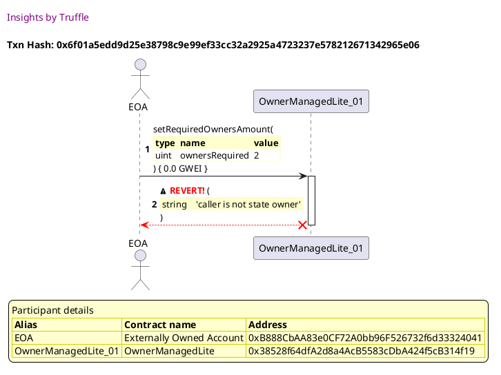
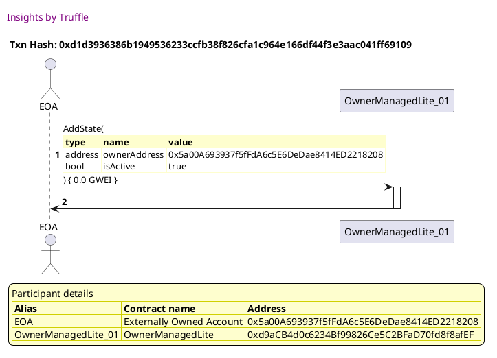
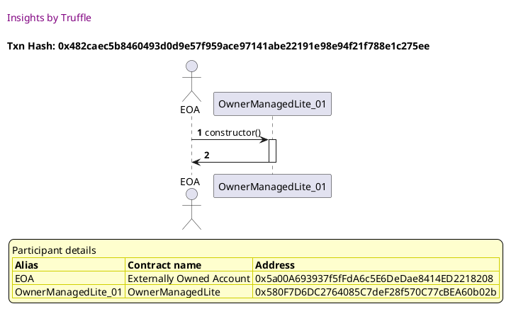
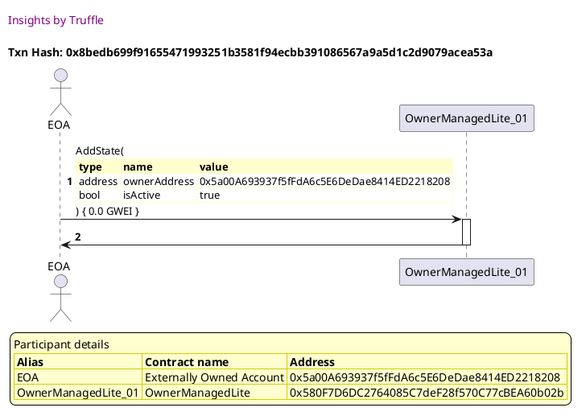
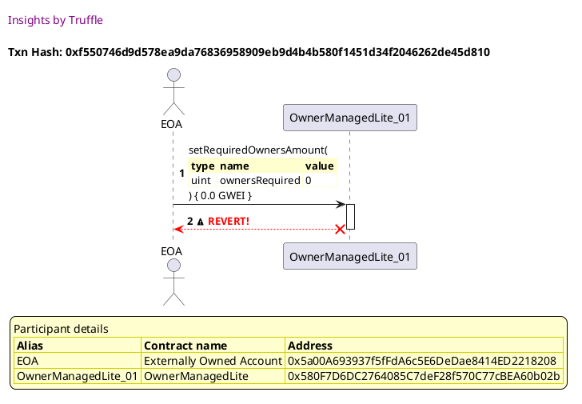
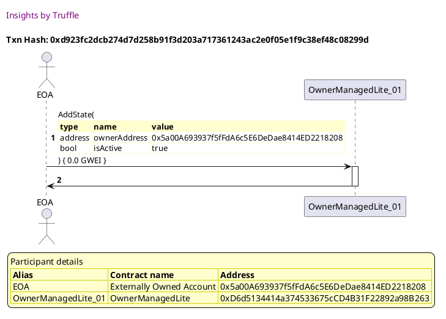
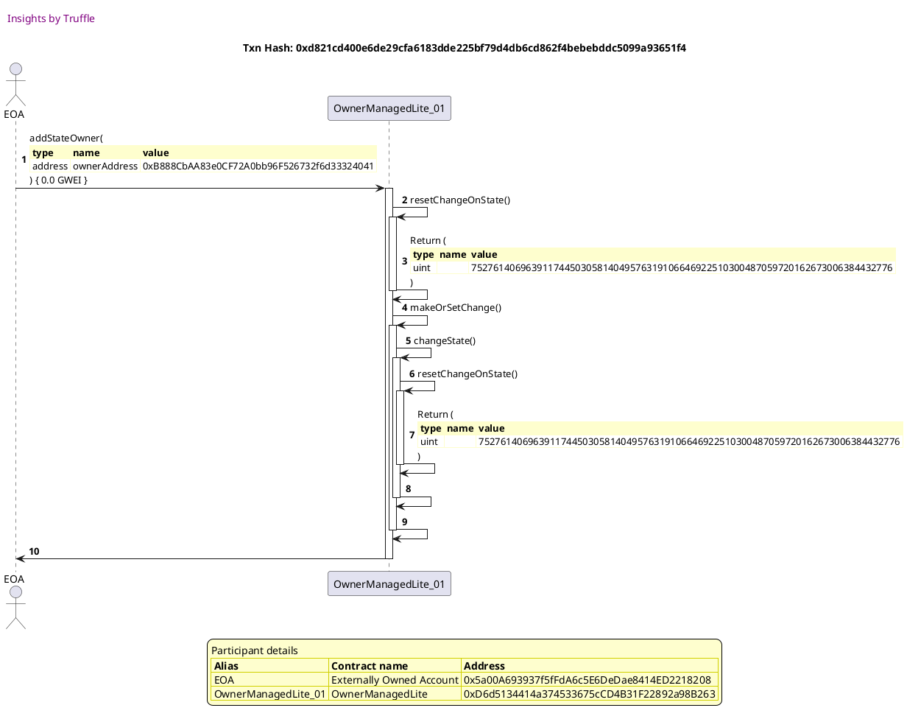
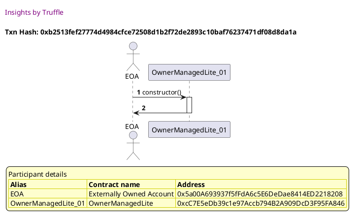
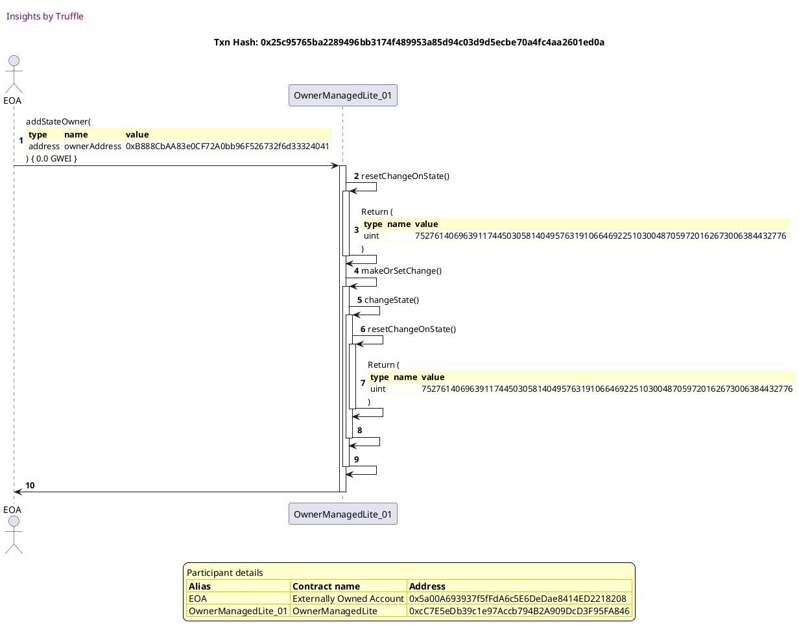
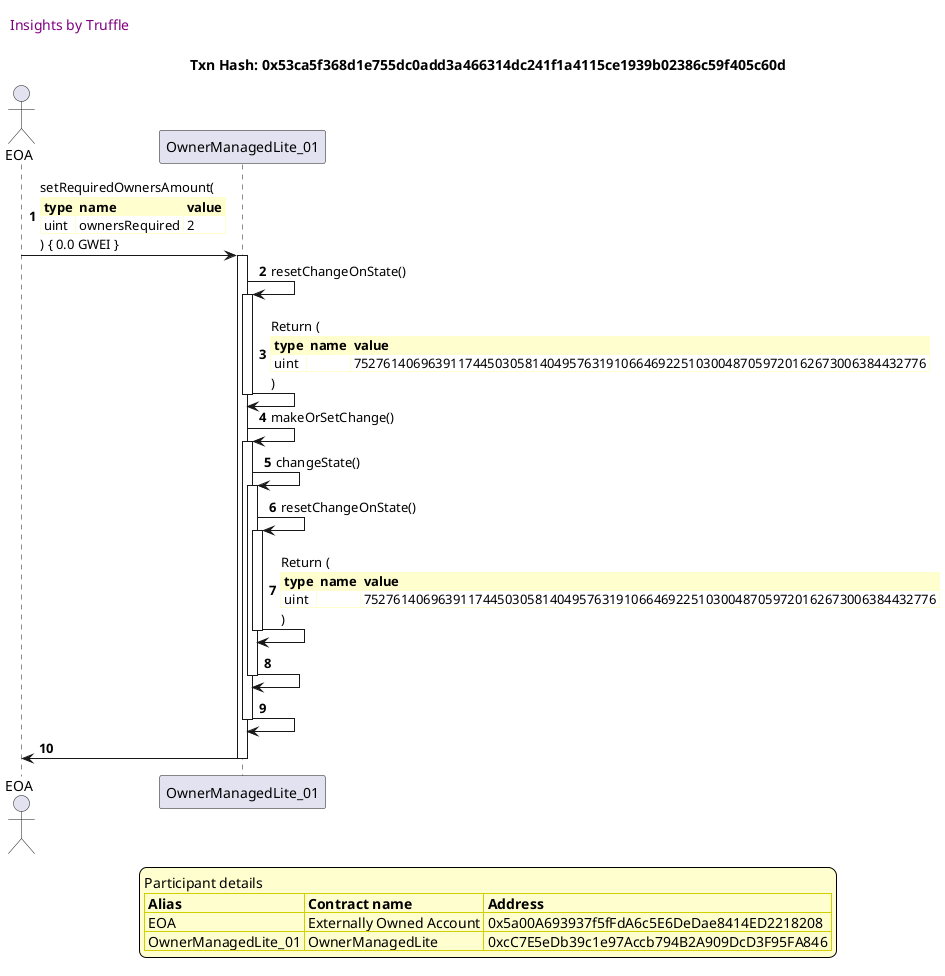

Test date: 2021 Mar 02


## Fails when the caller is not an owner
[link to test...](http://github.com/thedarkjester/ConsensysAssignment/blob/4fdae3d04e4addcce97e88f438735f476fc16bb5/test/OwnerManagedLite/test_required_owners_amount.js#L22)

##### d1, tx: 0xe8a59b54ea987dc00ad7ad33970e10f7878bfb3183fdd18878f3e96c4d5e39d4

[SVG :telescope:](https://www.planttext.com/api/plantuml/svg/RLBBRjim4BppAmZdqY8DIhqfmpKYMp9Ie4K2DFTYHIvb8JHbK1Hgf-c_bvO5eq6j0odEB6TtPqd8VU_0kc6d2O71TMROrMX9_zAQFLZOKOqD6ha2yTBORZ1otUdEqfjDjQdM5I6BtXqrBWaTlos2H4j_JqTA7phRldR6WIvqsvWT6kSLbRi4R3nvbjmFTg_n7V6ZVKKQn1Vi2QHiJKC3Da5_ndtnUIg2JFc_chvjjgwdzP4-sq4fhqjSwpJIvuEX3z1lvvGTa4EIrqcCaFDC2iP0PY2ZACyO1anbFEErggE0HqhAWFkZYZ1FHImJZ78P4s-PSBxqwh6WqDEPtsV4s-PQqUx1j_huow3z3WOQbDzQXpzPC0PUmMU4ZFVftV8wJszlvrHqfdTsE6Nzy95SZpi9d9NkvfIGym39qpzbINJGwfuifZ5-kYbPoHXRldsXVaw-Gl-pzWEmlZzgO8Sde93IOk-voxtbszYwNmyEhG6jZsFBaXP2-CVYFCKE2J1Mf7cKHvbAr4OMgKYgjCGIaCT1N9LX6F2GyVV2rwpx7nqJH3m9kKfZgOfGSeWBiKeI7ecoBk8mLebOHK6iWjmdy4vCVf1xl_fd_nS0)


##### d2, tx: 0xbbb91ea8cec247b755a948d1f2adb422451e113d155407f080b8ea9d32c6ebfe

[SVG :telescope:](https://www.planttext.com/api/plantuml/svg/bLDHRzem47xthpYnbqrTDpjn82266Y2ibJQrKYljfT9qiHsmQXpaE1sqxB_Ff2dgD5wM1vzzlhlFttSNGYvgZyutQqC8DhwopRfGZjGFscxGuHgCMYehfoWUbgvgh9nLfdBmRf4lybbEoBZsEwCc1DflfL0g1y_T4U2oSlgfiXvDPlJIhfNreMBfZm6BSFbISjEuZL5_NTpg9mMC7tqtAAMsIs2qS_rkxVXpzmZIuL_PMYzNlePY1tUkASjGbtZjZOAxhOLBh5SZeDkYA8PCOIgKYFYW62G93dagMHcXB7WKyOGfncB9aeJJGKbJMgGAXpAEH5yLPQX9KFZmzFmw0woX5soF1Dcy5dg3WUhrBwlSTxIuLFARzkedPMtW2N-Fa3OVpYUdx-7iR0IPbBSUlNf_R-_9kEl2nyvEzb_0xpOAWhMuRkqZcYPi3k5x2F8vLTUmX-e0a1sFT9iWfLb_60_ZGPcK2vdrHPBtvsgEAkMCv_CeOcb4qzTIHLMPaAZhJ7Zz6130krUW3_0Cz1E5hp_ogz2YqsmED5_ude-0a9Sn8pTln9FAepRr6vfpEgUK7cY6QGewXiqiZ8aBNJWIFf8wvatsROF2klNAMJHcrpP6GYP466d_dmAyBNogmVzwMu0uJQAqx7DPPf5CaMTYcYHfBEP5nYDU9c8QCrwoOG08IdHwa8kmXf_p3m00)


##### d3, tx: 0x6f01a5edd9d25e38798c9e99ef33cc32a2925a4723237e578212671342965e06

[SVG :telescope:](https://www.planttext.com/api/plantuml/svg/TLDXJzim4FtkNt43QMnb3CTEsWHr5Mb91z8c44FRXp5DRkmKYzGfZWCjTFzzbpIhG2jHv7FkpdSlxvq9EIwTiAwQvOI8oXMccasK9UMjDdDXnGnoDLL63aLwExL5PUIeo0iBk-Dad8mIGlgbM-PgGA1vRfIGoi9J-mbmMbZzM1WdyZZNKpDJnc75p6qInXXSbvnNTfwh5u5l-b61vszy5q9ARQRWqTRrfx7zmnO4QVkVcL9FRrm9aoLSsIhBi2vnskKAhXO6JaLvSmHqqSse9m8bPIHPe7ZOYy8qKb6aCixJb3F18XO8lySuupqLz4BciMxFupwBke6YNOAKfGwX9-SnY19sqEuGfCtfLCy5_khvWr7sgp1YgkGNxTHlwZM9M_mxX3JduM2mFGxx-qTGAdUfxYfjbMnoodY6ehXtr-QQz5jHFhHsiFe4RZbNWDQ8MMFlHLxXfavVGQKHuWgAfj2_ikXWwuJty0Jq8uNFFv8pP7exgCN1prqyzQj6lOP_S0Jzjm_26bHg0FrqFI-OC-XqBfFloUNLcqwdVzZu1_0ASYYThPLU0RvxgSXpb5MNO0g78U7K6lLUYvH8XKhe-phm2hdhEIONpzIHoWcTby_Qdz0JIcbD78uh2eMR4SwXnU8R2cCfhIenjZc7SEi9m7NXb3K8TjaeBo5EqreU3D75C0p3qIIEGwxeQDnZCPrCekuum97YBEjApZdpgU-zBBnjWlxtDWru6B0mw_eoYvaCXH-dmo08UNeoYNtcPq4wv9wVUH4sG2PQFiWnhdZx_m80)





## Fails when higher than number of owners
[link to test...](http://github.com/thedarkjester/ConsensysAssignment/blob/4fdae3d04e4addcce97e88f438735f476fc16bb5/test/OwnerManagedLite/test_required_owners_amount.js#L26)

##### d1, tx: 0xa9537ca16164c4e4eafe0b48dcf5fc8fc93960e5cbcf840b9ee882a4f97add8b

[SVG :telescope:](https://www.planttext.com/api/plantuml/svg/RLBlRvim4Ftkly9AlspggXa21A8iAk67EcbJAwtVfyC-4rHY8cEqfEl-zrq8YbOjVB3DU-TtT-_Cs7tlmBfXrp86W-lCiAlGilwbCNkmiECjrcZK1kHBRRl1gAnhEyjlog8iieAnLU-EBQuP7xyjWaBBVq-_d3zqjddjZ8CsRPlQxD0uKjJk4b0IUPRS3tRVuZlYH_EAt0iks1CerPYQUsA2_epxwlDK19loVpLzKszTpwiZVxQ3rgJBNEDQvCy7mn-WtowvE40IpXSIlCYB0XbWWA1HL46if0wrZBLCvaaaC9ILr74WgWGnZdq8TBAWGkAAaMNIKUd5OygXvpFQPuniSuriza2jFluoQB-3WHhLjyRXJ-6DWLVm6MFZVNwtlixpszibbvtfdHrEMJzyPDVZJW9dfRibP-myGFRqJraA7JHjprRJ63_Tv28NGgpVld2Q4rL8Xum6OAa_Rc279o1Loc9FtENU-cridTQ3GskWROzZougdKj9ZSKI9GmX2f15vEL-GhwLA8naMKOuvO1nuGP7xlXVx8dulVCsw_z4nWKeWsmHAoCYV1nkT9B4VPHXc_gQ4V26qYdKCkYWf0Jan-S7kQQLd_nS0)


##### d2, tx: 0xd1d3936386b1949536233ccfb38f826cfa1c964e166df44f3e3aac041ff69109

[SVG :telescope:](https://www.planttext.com/api/plantuml/svg/bLDTRzem57tthxXYBvkwRWu9AK4CDK1OAsrgfLRQIwNfuWzgrJZ8SJfesN_V9QI8QRmi3xxszVtmEVU4iSige0_rqZA6TIXTlPmhpwedurReSGbMBPIJOnHF2r_MJavAMtfuDojcnQHWR5Y5ZLKZ1ittg50g3w_j4U2gzEQbT05jRit2BPKBL567Gy2CBlSbLxLVMVNNnPrvKH0b1zyjIcdS0YBUkdutTlYvVGHh-r-xoYmUGmNp3TpxMckgou89Li7zsi4LLey3u6iPoJYBqxYVpgCioNfnserZ8VGyxkj-DnKQ8v6bYOhILEeaqR6A4GLF8gtJBE8P8yf4eASNDpbW1Hso7KQq1IFC2WdgpI-d_7Tqk53ocmdg9u-Qm1F-3cDDFfoFJj_3sTa0SYdl0WRr_i4zi64xXO-j7Ms_GDYi591rk6piCzgQDhlmBH1zNbKLRA7SDSWFHxxk8UTvcX4V5xgdPp9FHQz8fsgAgfz4IJ7jTgD-b_VVIitBqbAYgN8Hp3DrWE3V6ds0L-2VE7pzKLpJY4wZsS7SupqV06DxcR7R8_Aa2cXiTGHpogUSynrCKXFnI9i9oSJJ50w03w0EUQDjCo1Qrq5vXzPkci58o8KWIOV_9E2uyAa1_-jj6iWC9-D4Sa4gIyOwoqXY4zMRTCSpd5vmBKbqg8iPDI0cMZxO9QtqS_u1)




##### d3, tx: 0x0ecf3a4e5b44cb0b0072f62e6c1d812851a21697d45b82495d56314c5da50e92

[SVG :telescope:](https://www.planttext.com/api/plantuml/svg/TLDjRzCm4FxkNt5q4eAECITDqcGgqT8sPPD0cyO47nX2RdpfhALESPojtSf_vvg6QXCb7tpElJntzzoPiTFA2cFhUS6Og6sfw_aK3Qlkb5u88-PGu0or78hiRcRAMijHMPG63YRf91sbZ0qgkoemPj1yjoWa6dXgVm7EIgCUIsr5aHHgfkUeBI7cTkSm8UCMSb6RHO4l35_K8uBZxNINGagbP-3mLlMxaOFZjWZMvZ_NbPhTsWgcAxWsTPuJBhFA5WZNImrdehez0RxacEKzuQ4_zRniogUSzzqyS37871awRkWxmdM2g2yzVngwNkHBF-WvNkPBuNECN4QKPPPAJoyI41LqI7OOqMPLfXQ2Mhruq6W-2orcA3yfYp-vqpZkqNSOQ-BXADvlXyF34wZGNk6lMXcKZK-Lp6aezisDlc63TYZlMXclFu1TBH18QZ5lvBqeQhfitDTGAofn3MK3z1UM5ExMuIqy0N_FuUEtz9oOtb_KykZx0KNzs5IzBV_e10Ql7uJHDAaO1jbsNyWdxdQlqg_frVMhRdTmtEXZ9f4eLFV2ulzOsIuWktn6gqGhL54zwtZCnvppJSUqPyGmNKQqG8R0TxqdKXgioBQBYzVDwEXSMZHQ5CMg6Pc49Cisl9A9Btt1UH94lQZNp_ry8fCWyzDWZ6E1eUTuwTXrdT3buKlWVQF_Lziaa94O3Jt9iy3jUSCyYa8t6A4_SeSJCUxpN8PvAF9qGWc8YPOFTaedFTi_)


## Fails when required owners is zero
[link to test...](http://github.com/thedarkjester/ConsensysAssignment/blob/4fdae3d04e4addcce97e88f438735f476fc16bb5/test/OwnerManagedLite/test_required_owners_amount.js#L30)

##### d1, tx: 0x482caec5b8460493d0d9e57f959ace97141abe22191e98e94f21f788e1c275ee

[SVG :telescope:](https://www.planttext.com/api/plantuml/svg/RL9TRvim57tthx3QbqrTDKC0coYBIlbG9srgfVLzClQ5e3ecCaPBkkw_xuQWQDN2WstEkJxttdDDoDtWfVFZrX0YHz_RSLk38yDBPtVIoIqrq8BLzrAzjAuVhSvxqpjwNPLLcPU4h0P_CB0cTFes83Ku-dl-fVIXTzrhRxqqcUbQkmNhKR7nvu0AoPFaRdGx0--87zqhq20wOqzIwywsD60pz6VQLv_d8iYS_wiTkdRZ1reVwBCRcmPrYU-y0Vgyj_H13fibPVj8X4g2YciH9InA5vhf56BUf74g5QGyY09PGnW6QG2fW3Hgmg3XGa2WGXu3QXAfF9PUFcPK3lGAzok2jlbETJk9hJx-ik2-IojRqDyw3pzPC0LUmAy8cUxJs_LbdjxSBAdgxU3TUCpwuIEv77SKE2dTBYaXfm6Ift_Aqk1bPmQociVuwRfW1MDi_VQ5ufomGZpaE027_L4hjt04CgqT3CYTxwtVfjPntNjmLXfpc5hMD5CA7uj7YkrZoLYMf8jqmPkugNIMgBXC2YWaY2Y8oW8T5Y4JxuKlMVS_UaeWMCMBfCX3daHCn3dNK8MYYJdBELVtPPQmceKr9a0dPZ_87QxuxFy2)




##### d2, tx: 0x8bedb699f91655471993251b3581f94ecbb391086567a9a5d1c2d9079acea53a

[SVG :telescope:](https://www.planttext.com/api/plantuml/svg/bLFBRjim4BppAnRkfKMQbfAjb-4QKIov2T0Y0HAWbm35IgGS8ZHbK5Hg9-w_ToqhXelwKXsuv78Vd9aLOnUDG-lQfMOCMrURTbb8ovedPLPeSGbQBgGHbrW-BMpT6Z6hTMtXtJoVvxESiKdZDbfE6NJVeqGXBRpsHu2hsggNsZZKgLOBivJ6KSNA7GBcTBalkMhjIik_BkxKYmHlTF3TeX3ABC3ZlUjtPoUV-qUmll-rQTJYqJLGRE3UjbL5TPbJJakuNnkumkPn37mT5r8KOP9KYHS6mIZoacJe1run36AlIaQoB8fXul4u3C884mo4L_eYuL62fSHWY8meAnqzFRz90HiOa1qmeisfKgsGeDxyCj9-HuCBARuf9tzohmiyuHymrkN3-VJqFPoTZI4LuiwXa-yVp0ERz2fyxErq-mNSPYM1hC5bPvzHjxJPXM-1wBEoQM0BzQv1UZZoTO2Sfs4oJ8PH5LHpaOPba8UPp5368s-KPxxlnJwFtqeLTQqfKJLfwTGpTG1dtnfzW5VWdpXy_P5VaqIdqUnWxl6UZu6n_PYnsoFoX7IeT7C4C-CPvtm7awQ9UAJDZCR4aWe7m0TGXxpfjXE8rhMJrg3McquO0MbPqaYx_oJWkF0fWV_rxXl4V1vbOJRpet34us0M2Jdtuog8-2oAoiiy3Nd1_O8Q41Cz7-o2Llev_m00)




##### d3, tx: 0xf550746d9d578ea9da76836958909eb9d4b4b580f1451d34f2046262de45d810

[SVG :telescope:](https://www.planttext.com/api/plantuml/svg/TLDjJzim4FxkNt43QThA64wQLzH5X2OTI9j036qVnZGvyQL4f4xdED12zzztJRCAj2uVVCxT-V5ppvqPEscCqAQTLOo9rjIgdMMeMNDNghdGOWOLJb79Kv7VJNNTAZckgrh3_YITfEEKiL5ZbXL63Bhl5eL43K_zBy1PhSl7MXbHnLKvLJDKXX0BiqsOK703EM_rlC8NWI_b8uBbR7sNGifIJS7YlUjtPqT7FGdMtt-kcd9wQnh8bd2jsw8WN6PAKo5SBnISYURs6FYYS5tkEvuCfUi7A48fV2yOUg4RX3p4B9HEvcHkm0lBSIqvT0gREvxjsH8TLmP4WYJB3L5FBs8G3UoHtMCacodpSYwer8i7XVgpK6AAybDfy2UtkiGT_Zt6klDm6EsEmy71CJHehl1NMsgKNKuJpwWfvisDkc6ZlYdlUXkjFe1PpX78AZ7hxBseMjgiqrVGbaHn1NK7z1UM77oJy1QUWB_dyF5RUavAxoQrEFo-JwT-h5blw1yUm-ZrWz2AEXN1AD_C2-L4Wy5L-ZMzkdur68oEEd_499A4vRqm-3zLDWF8Bf_9Aj68icgULPpmX7E-hfZcZ1IcpPW6I1FujlPOIeqDnRRdebNNEbeN1hKILRNiMYOXplErhcin5gxWFFR2OJZq2xUOoDZBtTHBC14OE9QJ9hPj1JOFNWBlQls_tiq50P_uYPUCRTzpUE2EVOaJEoXSduzzFpzDOuzdtCxe0bAYruETq4hFzWy0)





## Adds the owner, changes required owners amount and is retrievable
[link to test...](http://github.com/thedarkjester/ConsensysAssignment/blob/4fdae3d04e4addcce97e88f438735f476fc16bb5/test/OwnerManagedLite/test_required_owners_amount.js#L34)

##### d1, tx: 0xa45e9a22846cb2693b213d4e799601208aa43304eecf7398630a850fc08c9c20

[SVG :telescope:](https://www.planttext.com/api/plantuml/svg/RL9HRvim47xthx3IbqrTDOE1G9H59O6eapQrqle-NUo3M2KcCaPBkkw_xq9Gj6hXmJRVT_xkxZipTjzvSBxVDOn1xrlRxpReMFTYx1uSx7Y3DLgz1FLIkxQtUjKshUCtwt9Thah6vfq_DhXWVFYs21eT_pt-SlxGElFQMWzDtfZQxj1wKgpy9M1Dv5botxjzW--87-OLUH1Ti2VGsjYQ1sA4_Wpx_FDO11lpVxMTgRU-uviZVtPzLP4kyyOto9yFbZz0jvrnSO0enWp2C8qIjGcJJ6x2GEe8frcMY20KAK0afOWGLJMLMPf80MaiAYLIbQbGCB9CUIgzVCmvT7n2-uIHRTueimTgzV6NHVSTBDIelncFFqKm15x19umDz_dTuZhFRszdNBMsywu_PVtmaLsFEmcSbUvcdB7p0DdJFsLfz62QZit7CNwwAKGXX5YyVU4q9wgG3YiQWAF-k8KTde1SQuSTSPTxYxUXTLeF7fs5fZaEBMkUAqMFnHCb3Z48aPExcPnMSRNMUQBYCYcm04oZ82gBC0nISlkzy3Nh_aU714MYuq16f0Lo6iLI9jDOhOfeAOCrJJSB8KkNOI8f0Jan-i7kQQLd_nS0)


##### d2, tx: 0xd923fc2dcb274d7d258b91f3d203a717361243ac2e0f05e1f9c38ef48c08299d

[SVG :telescope:](https://www.planttext.com/api/plantuml/svg/bLDDRzim3BthLn3PPKFNJPRyMMH1tTXP2sneWHROfS2WI79gL943MUwIDlllOrmtoB1SveCeKIIVtYDDo7dhXVFTqX0YEj_ORZdNZhIFjLq99vPWz49RTI7auy8rdLNJnZGEtitAMJaj2HctVcFqX43_FMYXj8ENuGXmsRZwkR5UcDpK2xlKrcF5oky3PdZvMdBLkPNHVrtSriyQWd3lkn5ArNO10HrSltix_ZmyWWpuLxQj5m--XVa6xbnNLLYN-DeR3NTh2vUYVJW3kbOPuvLaIivP4gf4iIYTPq755QDS9472uu25N4YcQKKZ7LIPvAckmbJIb6MP8YYPzFZqyZe7qS88xOYWRBwMzKeWrUjVLhllmeg5Ljzght_Ie0yyuXyHqkV3wUJuFPoSd46krAqNNh-_j_TaF7JXus0dso_WDoiDQArOzlP9c0utk_0je7nEjorieTa1vFiZNKU2qZpEUCQJAgfcAezbLCQ5BeHEmo0i2yQ2bD7qhTIyQGmcrcqkVVs42E3T6z07U07wYSBN7-KLjkWucntDLxwdPq38wvYHcmFnbFQYDkq1pO8MbD8TJPmcr14tKnmJXrtO4zwJskTDjds3S5rxxQmmPjCtHa4k9Owq_qy13WiVQ_2_tXwWY5KKy11h2Pw44UTn4ibf4LxmOCPOcZ6HfHSivWY0IWnwa7DSyUVy0m00)




##### d3, tx: 0xd821cd400e6de29cfa6183dde225bf79d4db6cd862f4bebebddc5099a93651f4

[SVG :telescope:](https://www.planttext.com/api/plantuml/svg/xLLTRzCm57tthx36owOny5USU1hLqe-mIQ1ER18lav0JEssqrAqI1zgj_7Tkqr1jeY1HyKWI-JhNzvvh7ySd25tMNbU-cPK8wSRFNJDBRONgXy8jTALdkBGJwqnVPm-JQjuuCvYNymg_IaR9Q312wABsgzBs46wlgTN6LlYfUyNuQbuLZtFdTHcNnSJDhFE0cFjTG0A3MyX5KorA-sBWjdYqc8gTxqORKxW9fgHpVM_jnTjk4gYhV-tgOZBrDKvN-AvgyXnmaIzyQV7Tqk4hNK_FCLcQYD7C24AiD9QfBDUIHjn0dmLf7YeZJ2ep4qcMYzJ2RKmM4AMquZAWkK10MUPXwgDnZ7MDZy0U8Q3D5rcnqB3KyJTdgu_QwOar7mflln3Q1kxn7o7KvkEptlvnV7fwZe60Mw-zRGEExzqzkkYsudLdU-jtsAyM5eDrUjRQhxfieBC9NsyWAblNU8td6v1uzqgM_IYA1caSHzoIGHAocAIfaad0PCXPBWtdd0aYw1Rg13zXyeRWzvz7rx0J-oVznzL0OUi7K-qcTkpQTHsV_2tEsTav_cHzKpby61zD0Hkrnl240Gib5KGgoHMbeH01uII8m2LK44fE5ILI2gdW0w4mH4GKaa25Z52vuOWGoICXE0j3sN5q22qp_M37rUrFQeuF0idQt0D9_RyvlrtEFyxP7lbD3DegBRfvfX_6UbsKzJFUXcH82Ddm1e8AKWAT0IXb1KAqOt1tf7TvlNMhKT0klQsSBijLgqq6nra6gkxRunzeGcAfkE9X7kI9YMKMZEJG3hMD11MZ8MCqOYHw2RnFutxrjWM6qWIK2y3IF1G1vp8Cii5Gz3bD68iKqohgCycX033HyO4keON_qmy0)




##### d4, tx: 0x3779a643899147104a25c115cce9ea447236765c31bdc2ff8b1d976621726891

[SVG :telescope:](https://www.planttext.com/api/plantuml/svg/xLLRJzim57xthx3O2uYn-UuOiOhIoq3QL0H8Uq6QtCHj8rAtSvojXUw_xpGD5MZTfB4zBefod7FvVFmTvGj2fsMq8LRJ0Y5RnPclfaCNK7cN-xaDTeeBDtO-ExFftJZCAfzrPiKiu5VzNh_NwI5qKiPbuLe8rzV4sSm5_D2yOdm-2_dzp4TRj8jyxAVEHq0SnMr27u8Ro7aLveLx5hZExnscOkkxj5cM-p6cf75zh-t9swO9rEn_uSjyF8ab7YxnJQX68y15CO-5mpSBZyzjEJd6PC6rDbO9dXX3XQP4M2PJIcMQEkEi49fnfPLCEHrcAHkDaY7DZ5QAKSrKOYW2oj88hVS6RMnBl0Ts3m5jCK_pkOMZ3hvv5pvQRySk-v17zvdGEd67Vm-XkXuVjNR7yU7XCIvTl79VgZouhCufsrCOIjo_zRVef1dAwyQsLkzmNCuT1kljjBPVRL71Ofs-mbKEBQxmh0PwX0K7soGSu0TCtX3y_bFl0fZUtTHlkmqE-krCh1-xWR-EDhhzWp_5EJewnbSkLi7Zlpebt5eohQWWoYXkADL2ICA9JC0bZDIAKqE9Ka8PnYI541699j9eHgXYIeD3yKG8phHM3KSleMLgxzmWN3zIi_yYaBIkVI6f_uVpo-FyuvhD9xtEGHibHPTFz25pqUP5-OItBkaIGjQyWM22LC2Y0qeOG6Ys3BQp38O7iMrTQrLh43mNqGLlYs9PQq-6sscw5WW8aOMqXBILuORhaHprixPAPKzrNTUwH53Hwp964qQIvy2xDEndRxr1LsMISW5ObciXESYdJ3jTSSPfdx74C6kICwOuR01CD7oWKtZ2_-S7)


## Adds the owner, changes required owners amount and emits event
[link to test...](http://github.com/thedarkjester/ConsensysAssignment/blob/4fdae3d04e4addcce97e88f438735f476fc16bb5/test/OwnerManagedLite/test_required_owners_amount.js#L44)

##### d1, tx: 0xb2513fef27774d4984cfce72508d1b2f72de2893c10baf76237471df08d8da1a

[SVG :telescope:](https://www.planttext.com/api/plantuml/svg/RLBBRjim4BppAmZdqY8DIkfXIePhHB4af42216Zk1KKkPI4oPL0KQgVfltSj2qQ3MWUIcbdExiwIaDlUI-U7RKk877ndXsq5ZlIlZTr99xUqXHgilfFgjNRTOFMwQpj7hygYBDO58SlU7rfO4Jf-6v0Q7Fqz_L9wtxdchRDUjbdRr7OBrgEYyUU04icJv6vmknO-43-QDw0yEcFFKkl6rfIp2VepxiklKn5aol_TzaszyJsj3lJ53SQWBl6DRu6-x2szb_rcGTc-2c8U6Z2142BIKPf4oYWGGSmIpQl0Y413aAIXugoIHio3K4I2QuDqeYMN12rJ7aildZ8gUph3VKRGDj-ePYUnrQTV5joZjB86_T1u-Cdu67W1dn4otgStgyiylRvUKDNPthlXcFNJPt8vxYXmKhfPK49E0oJF_vIbmSkcxSbo6kENgvpbZB7L-pUASy8AyR360JZiZrgvXIEGQUsWH-vyR_K-jexhteEpicqFOykQPahXO_58iNqi6SlcQPY6miIcrDbSnSKyXrn24l6eo8E09m5BFWfVikv_T4oWrgA88Q_2L7581UQkH1hT1LdAqbpbOPd6PPP4Sqo0Jan-a5jSyTd_1G00)




##### d2, tx: 0xf7c5b4db698219a374f6881455450e3f3a816d65cc398793640972af341f4473

[SVG :telescope:](https://www.planttext.com/api/plantuml/svg/bLDDRzim3BthLn3TPKFNJOxb3mLTK3TsrW8RMg05TYamo9AS6bNaG9QxfCt--nZ73J8ib_aWIXJ9f_T84tBHUk5yjp24YCutjbkKsf7sgRPBuSG2Z9vhgow5V9gxfhDgsfZ6mRjPCIkc1I7dhLyRFI7GVuzQAEtWTJW2N3MkVcci5oOpzTmkjFLOiVBxW1bUxaekExSq-g-Bk_f5Gy3slbkXL6td4D31zRktvv-7Hv01_zgszVpHjr2kuTvrLOLrYQ-zqN2_id0bsiSnq5MLoAXagenvEWgu21DMnMaQi2XY4TLX5OeqY5KSIHdoDE5Xp2XFHg8AML0nbeG49PCUdrxSP21QE45xGb0sNyjwAP3gpI-htNTXnLohRxNNFsdG1nxndn3IvyFPvFWzd9wE8LFgpWkltp_O1t8-TE7ZO2URB-3NImrehLZqzbcO3ZVRy0sWV4wtBMoWsG9a-oDTHOBIBEOX3vCggcOgYsLKnBdEXKvPm8fyD0hI4KtVIfLDOp2nRZFfwsT40E_UW3x0Az1F5Bx-AAwnHSVPR6dk-9wDWP3Tc97R0_6Kzg8sxG7DdEQKqYrDd2RK4JTJ71E7NTWJtfFQvqqsVODmNNdjh31ctJT6GIObZhJ_Jm4E2nzhyB_U7a1EaoBIUHbo6MYU87QPS7OvoZZbkSp36OzcMSfY140b1Zt81QxuS_u1)


##### d3, tx: 0x25c95765ba2289496bb3174f489953a85d94c03d9d5ecbe70a4fc4aa2601ed0a

[SVG :telescope:](https://www.planttext.com/api/plantuml/svg/xLLTRzCm57tthx36owPHSFmPJwDQrYHi4gWJcyJB9EGaJXijTIl7WNOh_nqt3TKc2X8LZqHHhdtlzR5zhdq2m4NZb7Njh0P0jMvksbccBMWUAhDGLirWhIVQ59SgVvZOUMkAqRoUM_WgJT9ab01mthXLhOS0TizKgq9R-DHt8RoQs-fnRfogexgQc9aspYEMRfUG-k0MSj7QHQrV16whHmq3klFTgAAep0G6g7Tzx-pvstuHe9__sZJLPEeQcAtWdMtBqkC2LxbQmxkbWLUgcPv1jCGibqnmbYcCGqabpp8I25hIK4f6LCWAIND42bamdMTQ84NBd2g5EGfqWHJmbENEBpqPHr0ryCZR8-1fSrLUBPJVwlYRqVQZCcgYYm-LqrzGq2NkyHy1q8s7W-7-E3mzFOEUW5kddEuIZk_DFJZlI_6wjyFrE-XM2mszDMhMsQ-gRdrZaxxUG5ZTD70DvnkGQDT5oyim34TP58L4er4gS8IoJFAKOIu8Bdb12C4KqM0BTGAV87g3uFlFoRMlnFv5_t4tVcBjHbDb9dfikdqTd_mjpc1m1Zzfrre33-EZhNoXrj2_Wc710uguv4G6_YHGXWXYeNVHpK4XWGmGvvHBZ5dWGuY60Z4fC0huXYE4E0af9LW8tdDq22qpzQ37zlOdDSS7WUJTs0D9_L-Stsxd7u_PNlbD3jWgBRXvfX-5TgggcsUynIX626ruyuBgfSGtHbufhHUY7OExAxqRDrnt6kM_IwUjKNMzwhIfW56UUrLttVLd2g68IoA9A5cP5X7FMS9Z7IiTqe0cCSP1Y57u4dYVnltgxIR8Ho9XEiw8p0CjXPyx4v9UuaWY6USnIILBev3wyW3FHCy7kF1V_t_w0G00)




##### d4, tx: 0x53ca5f368d1e755dc0add3a466314dc241f1a4115ce1939b02386c59f405c60d

[SVG :telescope:](https://www.planttext.com/api/plantuml/svg/xLLTJzim57tthx3O2uYnsOdjn1Mh24qwa3OL0T9Ua2OtTjg8rEqSPwFG_VVTfg42hPiqjiT5KQvpFuwlprLE43gflNA-cLK8gSRFRJCR6uVgsz8kb5CpN9c9iVfKvRSJDs-i7iohkSElXjam6sG87TT-MPa-mkqrDKeRXn-wLupFvgwydrklggGg9tPch0V4mcyJXX3SG2uQjwZCiy1LUMymPLlVXTAwj1DCIUVwtjhZjrqJgDl_tDRbPEfhF5xYQzSK1U0YN_hAuEixYyzKFUrXSiV3NF4Y5B6c9k9SvmJmGyM422dJUS1eGHMZbEU6ob2EIH368kUoO8JdWcW4bEKUMiz62LOrtWExXu0sN-RbGi5HHz-iSH-LLHEZFvJUV2QqJTpXtqEehST7_TrnV7ZOmxNnb-PBKpgZsvmwcS5G_FwDlK77tL1UTxQ_UeVzSc4mMAjchVsggWOMw_GLRafeSONdBT0ZB3Y2JS81Vi3a3S7lFsNdmFJkfdxRhJFGxs2gxCICx9LNtkmV_2dEqL4FNnhVE8l_wfHmHpo816L4I15AIYF6E0a9Zy7598zWwf8I8PYGGS0fX0YB8y9b510g0X61GuGnOs4GHQBZw2MqpDIj6RchHshsNmIIjxKl9FN_S7vvd7zSi_carpbeewJeuea-QEDLMTLFU4j9IWXPymQ22L81Ym4eeGEXsJAOQ0t3WzYshhzgDGYUTzuugwfgsMgFnacUhmK2Gg1tYf14W9A5KS6BeKv0p3AHcbIPc56MfK50uu34pu5tQTZFtdQ3V11btAJZKERKo0Zs7aUIdGQ993BDqt0e-J296Om70HCT7-W4dl3_-G40)





## Creates change when more than one owner required
[link to test...](http://github.com/thedarkjester/ConsensysAssignment/blob/4fdae3d04e4addcce97e88f438735f476fc16bb5/test/OwnerManagedLite/test_required_owners_amount.js#L56)

##### d1, tx: 0x49b57d800a4efe5f1f15c3b808ce1b9ef41da025e7b77b3b2cb7a85c5af0693f

[SVG :telescope:](https://www.planttext.com/api/plantuml/svg/RLBBRjim4BppAmZdqY8DIZreIOPhHB4af42216ZknOfSoa9eog0er4xJVoyj2qQ3MWUIcbdExiwIaDlUWNN3LXC2W-lCiAtHalwrDJkmiAKQ6pJo3iHhOxl1o7MdEqklgh8groKXozuTDAu87RyDWaHBVq-_bDvtjdthZ0ETwxOnMpJEAoft3gWyUPBS3NQdyGFnetr36iHdx1caR4r30pP1VyPz-NKgWapvlvk-RJQkf_M1ljX1AQzBNEiqqfUzeVVGRnQKxUEivebC6OCO5N8Lg82Bg4vPAZ2eCrHn886579CwIUge3aMTGCe51yNcMQI8jqmuNthvb5FewSplC-9jSwreT-1RVVfbq3w2WGRbG-lm9ml6m0luZ93nFhrPNURfzVM2YixqpWx7h9y-ayjnHu6Jqis24d8Q87d-foo93bhTa-KqnYzN1IiOOwltRzJFoLVe3si_0ElxemQsU0HoAItsdZlVMxsFhVjrxz0QqFemjYnfBeH_BCvJRC-1iTpxbKM9uggI-LpmSbvW0PZ6GLmMOHYa8Ki_2b-oxdzqJ10MLPpDup1H8SH9n0BExiACfxLYiQgoB47WQrv6Fe5tOlA3tFhLF_k_)


##### d2, tx: 0x90b509d5856b92b077d18eeedeb21c5bf9033ec654db01c88f8b046ba2bbd6b2

[SVG :telescope:](https://www.planttext.com/api/plantuml/svg/bLFVJzim47xtNt5YBviOcvCcQLAnYj2c0saJI23j1McouqknS9tASLWBtV--QnggJklByk2pp_V3t_TT6Bjel72-NHZ6HEjhsouaEjOyQRiKJYp0u1ojkXJbqzpLhLMJsjGEtisAMJ4f63jl_DhWc47tFQ9GwE2rFm9SrKw_rDOBanizjmkqdYfMVXymeyjToMNhbWR_khZJBmX1jFVT2gMqdKF0UzVlpfv_xX_1-lxNjj7pHz-0NCEzQwkAwZAllK6uNrcu4itZ2FWgupBccOhJE95PAFbmg88K4HNAC2XZMMLyCC0oYICbUL2cQPLA7YLIX5AgH8QCA2izFRsuoK4qS4BsX15jNfTwAGZgpI-BxhkmOexgc_RuamTTu17_2MDTFfoDZz_3wUa8SgNklF3u_i4-iFDUXO-z7M--W5yl4SXQiUZiip0jRRRX6o3w73ODRA3UDiZtHxwA1UTvaWsomR2AgvdAap8kaYbE1QPH41NJC0pIaATlfMHT6qhKJLvw_KmTmBktHX_W5VWd3bz_5DSaqN4qMvWxl6SZO6mtPkpsW3o5NcZJ7C2SyYddV0kJfebufCs4niIH2dl0Ur3xlF6c4uZMbKTdXJ7hJXW5ULdIIFl_9E2my361__Ls3SBfBCgIA1nMeOY60nx4_3BCubHMFAfcMJP44K_YOa0DY8cU3tP1A_sSVm00)


##### d3, tx: 0xd468019d9a237b216de4b9a1c5f18c63877e434fe70d2458adc92e3c0b272246

[SVG :telescope:](https://www.planttext.com/api/plantuml/svg/xLLTRzCm57tthx36owOnyBVZQLJBseHD0dLYatYPX9p4wQAbRkKuq6xbl-EceTf4GQBYaIZojU-zFhRFZKy0E6-yThwTrW3eriziEysC0yr3PUVQwIcipSJOuaBd3nCtQsqndDKp1r-bIPeC4m3E6h-ipG30xhatkZ0EFlL322zdhdgSMQ_hkAucTcgi3uYbtoQa8RY1dBTkNfiNWPlgqK3CjhvhNHILdK2CUjVtpfwzxJS1-lMlR5DDxdq3ioMyTMrP1bpWAryRUBkmy58tzwSGBGec8eHLeJIXCYDO58PbIkESbpZA1OsaD8ooqaXK4COZNUIA69gZZ4X2c021ijo7hIVZ6Ee67WHx009jlighkGv77N-pndtKLazCyQ7ovWl2NU8E_m40tNnuCjWTXyV7fp0GSEErDrt2uPsz0sTzALxtTh1w1_roRc2mLayx-rNNRUYiqrTh26UQ1gxWR0qIRuTeSH55qJ2BuuWQD4mbYL6MAP5o8YGbfIWefOGXXZTGH_09eZS8ll-SN8LAxDxq7qyJ5ZP-UA_jn8njTwx3ex_5EJavXP-CRvs5-_7HLg5GAnXUoOaKc26X15KOIyOueeX7mSKKbu9YXP4GJ2X2E0uXn2A9k984OR7c2A7mqJ16YPIYvsWVMgRwmOpTpKzg3lS2oRkvUvBwlpY_FSu_dhEvykiSi55QSFrCFmhZTLKtptWReH52QCrR4DGW9Q4p34hfWX1j6TnUwUsymQhJgD0kl75Mr_MoqwO2ndaULDrtrvzhX6AXgAAov6LQn2BdYHYPaJOHmomP4O8ZWgANmBiqxbTljm0PfKm9HcH9D0iLmHnT4CMZh4IiJ9MIHlCXJsXO833Hym7EGnl-Jpy0)


##### d4, tx: 0xca7f604b4627be5056f0f2f7d7e6dd69acaa8c7e5292fb8fa6fe846d1f5020d3

[SVG :telescope:](https://www.planttext.com/api/plantuml/svg/xLLTJzim57tthx3O2uYnEOu_4iGgIfiEf4r5WBGNfCcDxJOYTJl7sLhe_ljkqr21raqQs-EYADUv7yVNvoed29rMGVbGJqk4L1rchfwEZ4VLNU7cogifBitOE7scyhkndzLEzsRbpEDNWsoGzJA4JggmB4q7uUQQ6AMDnm_jAyRdCr_SprnGPRSincvgN0146xO90mXk8EUrdvVcMU2wk3SuOblVfTAwS6CSaTRrlR4dRzicKBl_XQkAyIHKUBJ4Dxws5d1HA49fyCt2uNDLJOunMUHAMa7OY0agHuOJBYonr4ejZT1Qf2fNAicbuJIbTfHO9Qn9cD2HvOGI7IEWB0_GUZRiObNXFR1x26WBHLxC5Hnr-CqP_r4vDJRwGn7CPn8rYJlyUmWrzVYeipkE3m-FSMN2bVbI5zxe9gVgJc4eOV_MtQAJTYYlMzjPlSDXEJSOh5FJndvLPGsBTVeArmMqkCAp1kWH5Xnqat207p1vG_3xJza5CBsxgTzswmtqsvieDpP3TnrKCFi7VufpT7IChqoelSD_TKgu9QTIH8o8LCHf54d6E8a9Jy35KYv57AKH4OA9b58UGOYmH1AUIaeYGOK4XuWJnc8gfMWvUWajKtLdXlxwaPhz5u7aJUqBIVq_d5yUvn_NR3xfTGxQA2cwVA8FsWHLbDKJtlgaJmXPymQ22L81YnueeGUXsJBOrHg61x5jNMVLQ10y5y5ufyfosMYFnjqyNmi4XCY2AqAw8etJM5fk1xehSfw9lkahaBM8PNrAeuIIv3dmBWtxsTjiGFi3bWf6fQMAmKGYJiveofEH9SmEqbGQnNiyYs43OABb0vt24_u_Fm00)


```plantuml


@startuml

autonumber
skinparam legendBackgroundColor #FEFECE

<style>
      header {
        HorizontalAlignment left
        FontColor purple
        FontSize 14
        Padding 10
      }
    </style>

header Insights by Truffle

title Txn Hash: 0xca7f604b4627be5056f0f2f7d7e6dd69acaa8c7e5292fb8fa6fe846d1f5020d3


actor EOA as "EOA"
participant OwnerManagedLite_01 as "OwnerManagedLite_01"

"EOA" -> "OwnerManagedLite_01" ++: setRequiredOwnersAmount(\n\
<#FEFECE,#FEFECE>|= type |= name |= value |\n\
| uint | ownersRequired | 2 |\n\
) { 0.0 GWEI }
"OwnerManagedLite_01" -> "OwnerManagedLite_01" ++: resetChangeOnState()
"OwnerManagedLite_01" -> "OwnerManagedLite_01" --: Return (\n\
<#FEFECE,#FEFECE>|= type |= name |= value |\n\
| uint |  | 75276140696391174450305814049576319106646922510300487059720162673006384432776 |\n\
)
"OwnerManagedLite_01" -> "OwnerManagedLite_01" ++: makeOrSetChange()
"OwnerManagedLite_01" -> "OwnerManagedLite_01" ++: changeState()
"OwnerManagedLite_01" -> "OwnerManagedLite_01" ++: resetChangeOnState()
"OwnerManagedLite_01" -> "OwnerManagedLite_01" --: Return (\n\
<#FEFECE,#FEFECE>|= type |= name |= value |\n\
| uint |  | 75276140696391174450305814049576319106646922510300487059720162673006384432776 |\n\
)
"OwnerManagedLite_01" -> "OwnerManagedLite_01" --: 
"OwnerManagedLite_01" -> "OwnerManagedLite_01" --: 
"OwnerManagedLite_01" -> "EOA" --: 

legend
Participant details
<#FEFECE,#D0D000>|= Alias |= Contract name |= Address |
<#FEFECE>| EOA | Externally Owned Account | 0x5a00A693937f5fFdA6c5E6DeDae8414ED2218208 |
<#FEFECE>| OwnerManagedLite_01 | OwnerManagedLite | 0x2DF496427f2a4730150B2958bf04fF997ea5C5E3 |
endlegend

@enduml
```

##### d5, tx: 0x38ff60f9b3ef7b750b6330c964331989a521a9da68ae8d90d314bbc1b55bd056

[SVG :telescope:](https://www.planttext.com/api/plantuml/svg/fLHjJzim4FxkNs6nBo36PYUs4oDMKTfq86qgeaZxWZGviPD6f6xdE5iBtN_VDGqLQ1NIM1Jvd7lp-RddWj1vxPNppQn2I3L-RfjPQXogxqkxK4xDS6KAO_M5okuBDs-i7iohkSFlHiae6IG8dTL-LPaUmkqpDKeRXn-xJumlvwvyc5klgdvL5dPch8UCkTyvZC2uJRbetA8oBmoJyi5WodQwQwLrQGjCIQVwtSgpZrqHg3l_ojPbCVKrJbVurZLv3dcHBtrbyEtIuajLJqynMOPndWkIopGqUPH6dAGY34ac1Gj3AcEfU42Lr4h4oiHQ4XrIbgOPJJbFDU420MIPXzAJSH-h6X-0F400co-pSg7WgkDVrhYlogh2w2-bDzy9RHttw0yGQkFnIM-_7HyVd-BQ-1lpeocTqQrFtPz1K_pXdRr3PrrJtdUoj_w4_MfXC4YhPgtygQe6DXltDMvAA76DvssYfxIWe5k78_o8oGU2FtzBhW3f_KMzMgqpKEzWgcnXndRYbJU7H_-Qv-Ja5DyOtpYB_-kMy4OyY0HbH4WHIaeZnZW92Oz1nIIF13IT4Y6Oa470APW8YoF2PHGGAW8HWKA4CMDX44MYm-WjiCpKlHcxoHCqRyFabPWjZJO-Q3kzwFeP9xNnggpgPq0EoP0GiW4IXXJe2Pi1J9y3SkyWxMiDtGJRBgwtRdaFwz8RPrLLhLg-QzpFiWqfmKIMN17I5pAKOPJpVAJx8kE969eXZ1IZB1a60Oq34hzCl6zk_jQs1mJ34OE93Q8yK0nQH3cv22IFqvomV2HbP1GVy2I40m293Wzq3Ylyy_u0)


```plantuml


@startuml

autonumber
skinparam legendBackgroundColor #FEFECE

<style>
      header {
        HorizontalAlignment left
        FontColor purple
        FontSize 14
        Padding 10
      }
    </style>

header Insights by Truffle

title Txn Hash: 0x38ff60f9b3ef7b750b6330c964331989a521a9da68ae8d90d314bbc1b55bd056


actor EOA as "EOA"
participant OwnerManagedLite_01 as "OwnerManagedLite_01"

"EOA" -> "OwnerManagedLite_01" ++: setRequiredOwnersAmount(\n\
<#FEFECE,#FEFECE>|= type |= name |= value |\n\
| uint | ownersRequired | 1 |\n\
) { 0.0 GWEI }
"OwnerManagedLite_01" -> "OwnerManagedLite_01" ++: resetChangeOnState()
"OwnerManagedLite_01" -> "OwnerManagedLite_01" --: Return (\n\
<#FEFECE,#FEFECE>|= type |= name |= value |\n\
| uint |  | 75276140696391174450305814049576319106646922510300487059720162673006384432776 |\n\
)
"OwnerManagedLite_01" -> "OwnerManagedLite_01" ++: makeOrSetChange()
"OwnerManagedLite_01" -> "OwnerManagedLite_01" --: 
"OwnerManagedLite_01" -> "EOA" --: 

legend
Participant details
<#FEFECE,#D0D000>|= Alias |= Contract name |= Address |
<#FEFECE>| EOA | Externally Owned Account | 0x5a00A693937f5fFdA6c5E6DeDae8414ED2218208 |
<#FEFECE>| OwnerManagedLite_01 | OwnerManagedLite | 0x2DF496427f2a4730150B2958bf04fF997ea5C5E3 |
endlegend

@enduml
```


## Fails when there is a blocking transaction
[link to test...](http://github.com/thedarkjester/ConsensysAssignment/blob/4fdae3d04e4addcce97e88f438735f476fc16bb5/test/OwnerManagedLite/test_required_owners_amount.js#L76)

##### d1, tx: 0xe0bac80ba3d270c96d45f9904c585d0de0f03390467574d48ad965f3a075c8c0

[SVG :telescope:](https://www.planttext.com/api/plantuml/svg/RL9TQzim57tNhn3foqPN9iUMBOSir4iSEjXeONqVD_fmH1Kvo39Bskw_xzOnOMNHmvLqpjMvNoBajeiGOhzpX40VMz_lDZgGxidwFGJOKQSRxTLNa4zDQ7klbgrh0xrQr-jwMHCox-BHwGMXmzfgK3hGb_5AwLqRx7Fh8xZAsSRlj8-eQEBPOOtaINBVXxtJxuYVzbdJ93jZ3w2KzGrDs0Zz6VRvvp49CiR_vZlRR6D7DqVw67fZK9T46vscZmTFxw3RpYWxQBO1AT2aQbemMUOguwOiMIQvu8efpGnBKxpd1IyobGbGPSvD2gpWKaX6i6KoOkhrVKMXenFS9mJR5gsqUy1Ixtzx7Nw0XqQhxpRgNomP72_W4qA6z_HcSPcdrzSpAblVnT2_HVtmaLpsUnCuATtCA26d0PA7Vz9IEe9r7PcFO_nqjM8hnjZYzGl5EM66U5ZY00BMHptiz1jGAHLqXzpvtU9rA1tj8UhWmRdZKBAYbPJuMI9IxC21iIelqp8j33ThLUMIr_bAhq2BBCdgrNIQY2aJxuKljUv_T0W0YIdoIgpJGZAUc0rmbCkCI5XTL7cIiKIaIoKo382T6Fj1Rj7Yj_yB)


```plantuml


@startuml

autonumber
skinparam legendBackgroundColor #FEFECE

<style>
      header {
        HorizontalAlignment left
        FontColor purple
        FontSize 14
        Padding 10
      }
    </style>

header Insights by Truffle

title Txn Hash: 0xe0bac80ba3d270c96d45f9904c585d0de0f03390467574d48ad965f3a075c8c0


actor EOA as "EOA"
participant OwnerManagedLite_01 as "OwnerManagedLite_01"

"EOA" -> "OwnerManagedLite_01" ++: constructor()
"OwnerManagedLite_01" -> "EOA" --: 

legend
Participant details
<#FEFECE,#D0D000>|= Alias |= Contract name |= Address |
<#FEFECE>| EOA | Externally Owned Account | 0x5a00A693937f5fFdA6c5E6DeDae8414ED2218208 |
<#FEFECE>| OwnerManagedLite_01 | OwnerManagedLite | 0xa1f76A8F37c051fba58204f810E7A6140183Cd84 |
endlegend

@enduml
```

##### d2, tx: 0x7e9623b8103e3d1bb4ab77b8d501efe3da1499b61e29041da651a8da49aaa125

[SVG :telescope:](https://www.planttext.com/api/plantuml/svg/bLDTJzim57tthxXYBviOczry8rQHjUb0sWGII7j1ccvYfrYuJkKuq4BtttURXeffVLaUVEth--5ppWrZvwr7vxk5OGmxtzXkKIh7sWTjb-Xm0KRDbPLViNgOkwQpSjAOni6xMJ4h9WLZPwrV6pLcq7_t2gLoy38S0IuQfvyRwz7aHi_jGbbF5Mk_3vZHvQxaidDBe_wwkD7F2aIuzrsZbDhEGV31zRktPv-7Hx2X_wLjzVpUjr2kuTPrTKrrcTVUABXTMRZ0zluK-2fHMJmAobJmG0LIb6M8PPAKgOouK3MvK8HPLiP2ZJ8U2ebn932L66Q8A4OH8yegJqylhdB05ex87Z6YpUjABv6WNZrPvNwWnRcItxLNlxZe0m_uZnZhy-5aVFWUZezF8PVongDNx-_i7JiRLFWusF7c2_ZrKW5PYulUFgBfQBCDtm3HvrJRmWQQRODyV-Ih23dFuop8WgIEwfdCuoegugcQeaf34HRJqKYa8vw-bYgRnb2YRlFAwqVg0DwzDle0By0_SVZsixWaYGwZsSBSuJqv1SPsOyQktv0dbKTjsZSmftpAET_2f6aY7capeJ5nfC8Uy1xKFc-ywGMYTUMLisZCkXT6GbvLDDB-FmbuM_YGmFzw-mOewYJEqrcGL3mITOaHbGjhchuYoMCHSf464vc6r82O6FXWvxJIp_a7)


```plantuml


@startuml

autonumber
skinparam legendBackgroundColor #FEFECE

<style>
      header {
        HorizontalAlignment left
        FontColor purple
        FontSize 14
        Padding 10
      }
    </style>

header Insights by Truffle

title Txn Hash: 0x7e9623b8103e3d1bb4ab77b8d501efe3da1499b61e29041da651a8da49aaa125


actor EOA as "EOA"
participant OwnerManagedLite_01 as "OwnerManagedLite_01"

"EOA" -> "OwnerManagedLite_01" ++: AddState(\n\
<#FEFECE,#FEFECE>|= type |= name |= value |\n\
| address | ownerAddress | 0x5a00A693937f5fFdA6c5E6DeDae8414ED2218208 |\n\
| bool | isActive | true |\n\
) { 0.0 GWEI }
"OwnerManagedLite_01" -> "EOA" --: 

legend
Participant details
<#FEFECE,#D0D000>|= Alias |= Contract name |= Address |
<#FEFECE>| EOA | Externally Owned Account | 0x5a00A693937f5fFdA6c5E6DeDae8414ED2218208 |
<#FEFECE>| OwnerManagedLite_01 | OwnerManagedLite | 0xa1f76A8F37c051fba58204f810E7A6140183Cd84 |
endlegend

@enduml
```

##### d3, tx: 0x02b6a8c6f608bb60193b2913a768f8d2a1331f9758e93861d5667e4dfb8b78d8

[SVG :telescope:](https://www.planttext.com/api/plantuml/svg/xLLTQzim57tNhn3TIqkNJL-MvDA5kecp5ZPIri9U2aEsvCJKKO8iRqcR_VSfZXTQbWqMzZXZVAMhgtDrpqN705pKNZdVp2e0LEFdjfbbne7weRGBvTGCLcPYhBvK-SF4pHkh1_Dgxk2hKJfA1oa0vxLVLQOFOFjCZTB6mQTk2k7Lt9MFS-jLbLJbnCwCzG6nyBk0KLZSGYuQjwZCYuNRyj50p7Q-6wLrQISGeyxrlRNdRxj3W2x_jQtBoTJNC5l1EzSKHS05llILWNTB2wzKFJs3Q8b8nfNCUS6Hp3AES4mp4cEg19U5r4HXId4HYqYQc4gETSIvC4mNcSo4r184od8VZfwE4wXgU1Ji4GYq-J8l5ogKElvcZVkeh9eO_Q7qvWl2RU0U_n40xNxOw-zVXwUdPp0GSEkLDst0yRsz1-TTArvtjhz-1_rgOM2mLirQ-rLLJHXimjSR26Vg6gxXV0EIxAPeUIcb76H98gb1Wv4W2Sgoc8yYmWKb1TUKKi8Gmrke4_W4qHi4ttzEhqCdzX_wZzM4nCOFfifEpDYsTHsV_2rEhtS6FndVE0iFuwCfGwFMCBmY8e9ZXdZCQOonO2n254Kok5WS2KvnZ17dZCU4H3Wi8IO5Yc914EORZX3YL396YH2yu-WGMcRgmOpTxKzgZWy2oTkz1vBwlpc_BUSVxzbU-KqCs2ejk7cc7zfuLLRrCzw6Q8WGsl0M13L8IHWCWbAw84Gx1dTNUhUllsurAdoNtZYhgchLQfE6IPu7LVVjzOyKGWcFQKn54HKZdV0yIldG39MH3BDqI0YM1CcNmFiqxbTlcq3XGl14ZgZ8KOIBJ4K1ZXKIerGac-PYIGTQif0WCD7n0Ix2D_oVVW00)


```plantuml


@startuml

autonumber
skinparam legendBackgroundColor #FEFECE

<style>
      header {
        HorizontalAlignment left
        FontColor purple
        FontSize 14
        Padding 10
      }
    </style>

header Insights by Truffle

title Txn Hash: 0x02b6a8c6f608bb60193b2913a768f8d2a1331f9758e93861d5667e4dfb8b78d8


actor EOA as "EOA"
participant OwnerManagedLite_01 as "OwnerManagedLite_01"

"EOA" -> "OwnerManagedLite_01" ++: addStateOwner(\n\
<#FEFECE,#FEFECE>|= type |= name |= value |\n\
| address | ownerAddress | 0xB888CbAA83e0CF72A0bb96F526732f6d33324041 |\n\
) { 0.0 GWEI }
"OwnerManagedLite_01" -> "OwnerManagedLite_01" ++: resetChangeOnState()
"OwnerManagedLite_01" -> "OwnerManagedLite_01" --: Return (\n\
<#FEFECE,#FEFECE>|= type |= name |= value |\n\
| uint |  | 75276140696391174450305814049576319106646922510300487059720162673006384432776 |\n\
)
"OwnerManagedLite_01" -> "OwnerManagedLite_01" ++: makeOrSetChange()
"OwnerManagedLite_01" -> "OwnerManagedLite_01" ++: changeState()
"OwnerManagedLite_01" -> "OwnerManagedLite_01" ++: resetChangeOnState()
"OwnerManagedLite_01" -> "OwnerManagedLite_01" --: Return (\n\
<#FEFECE,#FEFECE>|= type |= name |= value |\n\
| uint |  | 75276140696391174450305814049576319106646922510300487059720162673006384432776 |\n\
)
"OwnerManagedLite_01" -> "OwnerManagedLite_01" --: 
"OwnerManagedLite_01" -> "OwnerManagedLite_01" --: 
"OwnerManagedLite_01" -> "EOA" --: 

legend
Participant details
<#FEFECE,#D0D000>|= Alias |= Contract name |= Address |
<#FEFECE>| EOA | Externally Owned Account | 0x5a00A693937f5fFdA6c5E6DeDae8414ED2218208 |
<#FEFECE>| OwnerManagedLite_01 | OwnerManagedLite | 0xa1f76A8F37c051fba58204f810E7A6140183Cd84 |
endlegend

@enduml
```

##### d4, tx: 0x8db64b61fef1f0e9839d0e12772a5bb3d079ebc824ccf23d14ae680f934d0a89

[SVG :telescope:](https://www.planttext.com/api/plantuml/svg/xLLHRvim47xthx2wbrPTDnkCWQgBoXAoLjgKggsqbqgJmKU2IfpCc2vfi_--2w5HgsMJrkrn2FdCtVdp-Jlu8EIqTigwPbeHeXetCyqq0qlgszBCbLLJMi4OZ7wlyjkndJL6zsVLpD9NmtIOzbD2JcgthA17Q7jDG6cmzA5xfFHiPilxcN6gIgfoRAPW728MRfimnE06SjxOUGNF0bVbFL0kjhuBfNLfnfIpplMzjITlko98j_-vgSlnnDKqMz9hsnG5uX9NkWhezSBGCrLFZYbRH3gJ8fEyW88N3EB8ZpK3xeMXfu8iypKBOyZoo1DvNdY-vaA1Z5WH-q8p5SK4ASiTbfwE4gfgkeTsZo1jhipBkSAZZhuPi9-KKMFG7qi7NnXl4tVuzmXfrzEZtkuuFJmyfZMuI_ZQb1PqcrCdKsoAsxynD-IaQyhhplPMxwXRpe6YDMhQsZjLDJXPfwzeKsA9ApfhWHvXqU5j4Wxe0sLl6FtmEJr7fdSNzTjgBM2z_OaoOnYPAwSSx1_yASxHqJ6z1DTOG__gb7Y7WHTABfYCfHzp7WeHC9y54Rf478JIvp5dKWePUrx0CSH45B8W3Zt6fIT3T4W_4iB7DqHs7Bs4bgcwXP6zUgHc_qKWURlsXQJ-RyulZ_EFrsm-wNKEsIWfkNYY3ngSAglw2My3Dc2ChNb3mKIfm4aVbT2Yq6mPJBJ6vc5ikwwtQZK8nuK3QrHLBLljqJJ9yxL0O8Wj0iLO8cC_ziCYA8OwaNcGoW4C54I2YtJWUJpoMFGSU9U6_UnjDr2y26KI3VqmPm4lCXKWd2WYpj8mMJUNHtvVHm8tG2OwFiWfZlZ_-G40)


```plantuml


@startuml

autonumber
skinparam legendBackgroundColor #FEFECE

<style>
      header {
        HorizontalAlignment left
        FontColor purple
        FontSize 14
        Padding 10
      }
    </style>

header Insights by Truffle

title Txn Hash: 0x8db64b61fef1f0e9839d0e12772a5bb3d079ebc824ccf23d14ae680f934d0a89


actor EOA as "EOA"
participant OwnerManagedLite_01 as "OwnerManagedLite_01"

"EOA" -> "OwnerManagedLite_01" ++: setRequiredOwnersAmount(\n\
<#FEFECE,#FEFECE>|= type |= name |= value |\n\
| uint | ownersRequired | 2 |\n\
) { 0.0 GWEI }
"OwnerManagedLite_01" -> "OwnerManagedLite_01" ++: resetChangeOnState()
"OwnerManagedLite_01" -> "OwnerManagedLite_01" --: Return (\n\
<#FEFECE,#FEFECE>|= type |= name |= value |\n\
| uint |  | 75276140696391174450305814049576319106646922510300487059720162673006384432776 |\n\
)
"OwnerManagedLite_01" -> "OwnerManagedLite_01" ++: makeOrSetChange()
"OwnerManagedLite_01" -> "OwnerManagedLite_01" ++: changeState()
"OwnerManagedLite_01" -> "OwnerManagedLite_01" ++: resetChangeOnState()
"OwnerManagedLite_01" -> "OwnerManagedLite_01" --: Return (\n\
<#FEFECE,#FEFECE>|= type |= name |= value |\n\
| uint |  | 75276140696391174450305814049576319106646922510300487059720162673006384432776 |\n\
)
"OwnerManagedLite_01" -> "OwnerManagedLite_01" --: 
"OwnerManagedLite_01" -> "OwnerManagedLite_01" --: 
"OwnerManagedLite_01" -> "EOA" --: 

legend
Participant details
<#FEFECE,#D0D000>|= Alias |= Contract name |= Address |
<#FEFECE>| EOA | Externally Owned Account | 0x5a00A693937f5fFdA6c5E6DeDae8414ED2218208 |
<#FEFECE>| OwnerManagedLite_01 | OwnerManagedLite | 0xa1f76A8F37c051fba58204f810E7A6140183Cd84 |
endlegend

@enduml
```

##### d5, tx: 0xab49626647e213e74fd1b5e39a9fc293019ebaa2840f4fcea2a7aac74f002178

[SVG :telescope:](https://www.planttext.com/api/plantuml/svg/fLHHJzim47xthx3O2uYnsOaJ9uXLP6qwa3OL0T9UaAPhScaZKhTpdAs5xh_lccOLQ1NIM1JvdBlpv_DtdyFOUUt0kcPMCGQDcvjcDaRBwllIBC32Z5SuGPD_XEn-OkUDoVlpQcxvcs4wJFifOsUrMrNOOxnzfWWvMlxOVN9-CRVbmzmug9Agd9WP6aU8XTib32cuXLmqTb7Xiy1D-O1Sgftl2lAyD1CkHUVwrTgpzrqHhDl_qjJbPEfgFbxnMziK1U4oLxeA-UtIy0kefwTSB66iuj0BGwNHapvgLUHo7A0VGrnaNkmB6UCOm8kKA5IH8NYW0JBA4yAJEc94MUQez7IKSAZv0Ta3HhIvCYiNG4ST_JHelu212UQVIuVVX6mJz_WF66lNyvFU_ZW_FZxbDRfh_DwK5lCsfqvcr1HtU6Vks5dNbBUTxQq_SBTQ82ThODRQ7r0rDDcahtbJKebhFc-1_i2IGsuJZlWZ5-y4__GrlIIcznVrOhKMgTx-5Cm4H-R6WSF3et_5EJavvTVe6cluVvsINXruEfHAX77enr9gfGBXYo0Ybue37VeobeBa4CQU5qWA2HLf4SJQ4v9qeiaH-f5IlgTrs77q6bfcS8yZU_E7cjTnyiAQhOmsEMnxUzdL4qtcwA2iwYT43iH02B4XaYufoPCcVRfzbiIzepJ9S-ecnNRhUkjMzpGk7Le3LRLgzPxp9CisegIGM0OWH1B6Vkph8YY6UH9cGHeES00OAQdIWUV9o1FHS-1zz-PlRxi1o4A7IJJqTIO2MOmX83XLH5AaEjbqMqP-FuyKRK1CT7omSnhfd_SR)


```plantuml


@startuml

autonumber
skinparam legendBackgroundColor #FEFECE

<style>
      header {
        HorizontalAlignment left
        FontColor purple
        FontSize 14
        Padding 10
      }
    </style>

header Insights by Truffle

title Txn Hash: 0xab49626647e213e74fd1b5e39a9fc293019ebaa2840f4fcea2a7aac74f002178


actor EOA as "EOA"
participant OwnerManagedLite_01 as "OwnerManagedLite_01"

"EOA" -> "OwnerManagedLite_01" ++: setRequiredOwnersAmount(\n\
<#FEFECE,#FEFECE>|= type |= name |= value |\n\
| uint | ownersRequired | 1 |\n\
) { 0.0 GWEI }
"OwnerManagedLite_01" -> "OwnerManagedLite_01" ++: resetChangeOnState()
"OwnerManagedLite_01" -> "OwnerManagedLite_01" --: Return (\n\
<#FEFECE,#FEFECE>|= type |= name |= value |\n\
| uint |  | 75276140696391174450305814049576319106646922510300487059720162673006384432776 |\n\
)
"OwnerManagedLite_01" -> "OwnerManagedLite_01" ++: makeOrSetChange()
"OwnerManagedLite_01" -> "OwnerManagedLite_01" --: 
"OwnerManagedLite_01" -> "EOA" --: 

legend
Participant details
<#FEFECE,#D0D000>|= Alias |= Contract name |= Address |
<#FEFECE>| EOA | Externally Owned Account | 0x5a00A693937f5fFdA6c5E6DeDae8414ED2218208 |
<#FEFECE>| OwnerManagedLite_01 | OwnerManagedLite | 0xa1f76A8F37c051fba58204f810E7A6140183Cd84 |
endlegend

@enduml
```

##### d6, tx: 0x849df9c5125f79faadd153097910f31408ed1d2bca7c5a35165271207b608b07

[SVG :telescope:](https://www.planttext.com/api/plantuml/svg/TLHjJzim4FxkNt4hqjZA67RUYxgAh4q7qYOGGzk7CKrkx1IBrCaS1rhe_likQLQ1LgB8Pz-Tdtjopoc4d5IM6rilSa9uRGjTBsRIaEfMwP8Rle1SpgKM7tbwEpT5hSMuo0i3UzDacemJGeQLNULoHA1zRYGNqi1ZTmGuBOnwABJbUPohkLv8RH4nizk4AGOta6Ljobm-2tnL3nAOj_LTS26KdWEZdUjFQuT77GdIrJ_JbPhVs0fcAxWoTPOXBh7AvXAkbXfEUNLp37GPUGEH3LAVENuM3ZAEwCntwI0SC9gvpAEH54muivI7gSzTdmM-4pA7XhE0HZCQ4cnPQf5wSXu3hw27jaUmRLQbgkJugUVtMfelNFEv59-LbRyeQnDt-7k4jFVXSBGx3WS7nr19Uob_ryf8qUPKyG95iM-kzJKPTgAyw-ne_G7igfI0LlD5Q-zuNkEcILz3hP3Y6eeMw1yiEfnDmbju1FgUmgVloHbsUZUfvU6FFRpris6zeNzu3CFNzzneL6e4mtGpBvWpwlSlas_9vTMhVdzurFf7y09pgAnfb5u3lll9KbMsEHQbDDogGeFIK9fYRcHLxNTqYP0eXxhZLhxKuSqmauid4WbfkSgh9nmcT48fRRg7CujguMQCmsWGVDl7M8YcDAotzv1pCmQuBgqqckVvgfLVG9ocZKOOeakVKne70tVWXfcVJKKSf7uIJEI4oyXZNZ9n71OvD7eEl6kC_lUs1JZBmY2EfcwOKfzbC-uZd9T5Z2PX7E1CiyWTYyZ30jY9hX_a15Vy1Vm5)


```plantuml


@startuml

autonumber
skinparam legendBackgroundColor #FEFECE

<style>
      header {
        HorizontalAlignment left
        FontColor purple
        FontSize 14
        Padding 10
      }
    </style>

header Insights by Truffle

title Txn Hash: 0x849df9c5125f79faadd153097910f31408ed1d2bca7c5a35165271207b608b07


actor EOA as "EOA"
participant OwnerManagedLite_01 as "OwnerManagedLite_01"

"EOA" -> "OwnerManagedLite_01" ++: setRequiredOwnersAmount(\n\
<#FEFECE,#FEFECE>|= type |= name |= value |\n\
| uint | ownersRequired | 2 |\n\
) { 0.0 GWEI }
"OwnerManagedLite_01" x-[#red]-> "EOA" --: <&warning> <color #red>**REVERT!**</color> (\n\
<#FEFECE,#FEFECE>| string |  | 'Existing operation in progress' |\n\
)
deactivate "OwnerManagedLite_01"

legend
Participant details
<#FEFECE,#D0D000>|= Alias |= Contract name |= Address |
<#FEFECE>| EOA | Externally Owned Account | 0x5a00A693937f5fFdA6c5E6DeDae8414ED2218208 |
<#FEFECE>| OwnerManagedLite_01 | OwnerManagedLite | 0xa1f76A8F37c051fba58204f810E7A6140183Cd84 |
endlegend

@enduml
```

