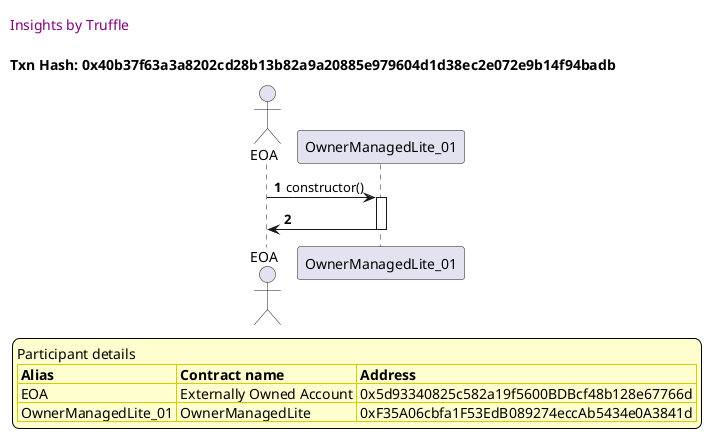
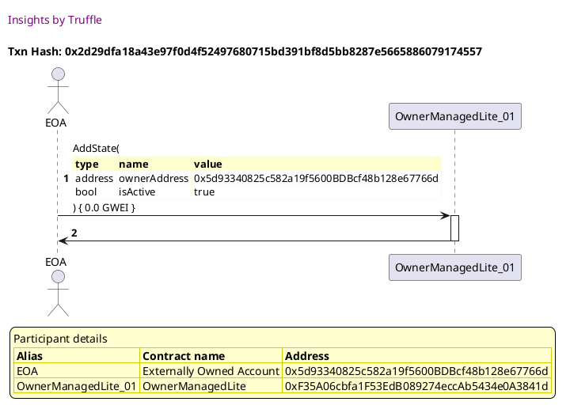
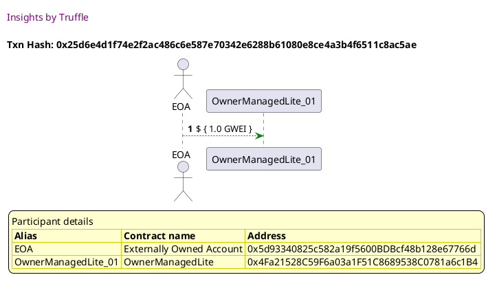
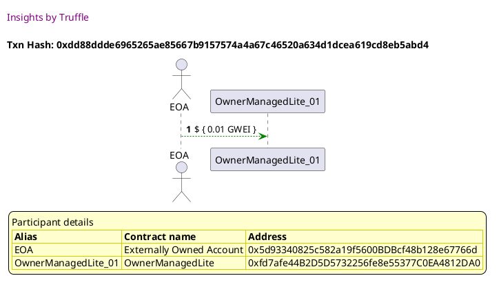
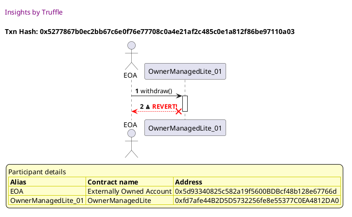
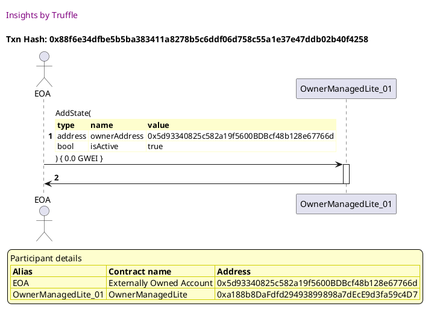
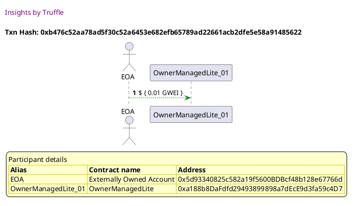
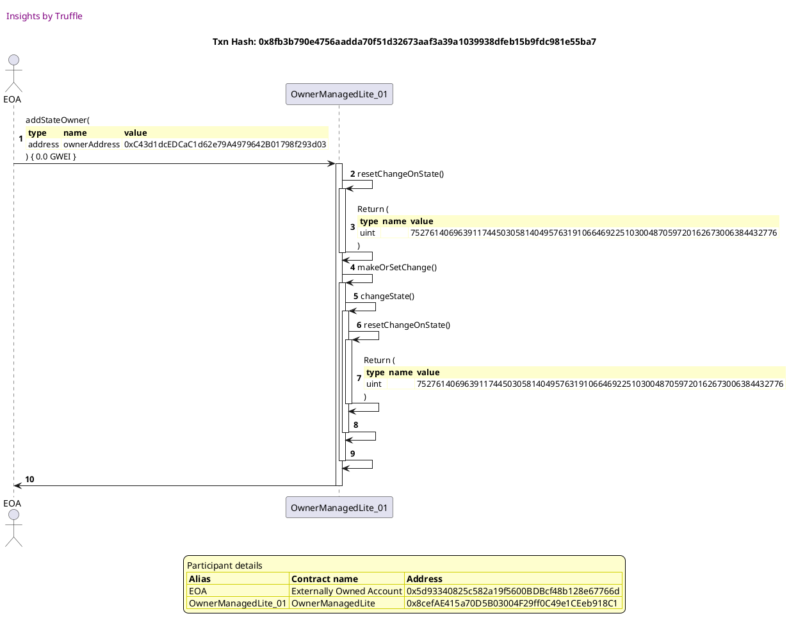
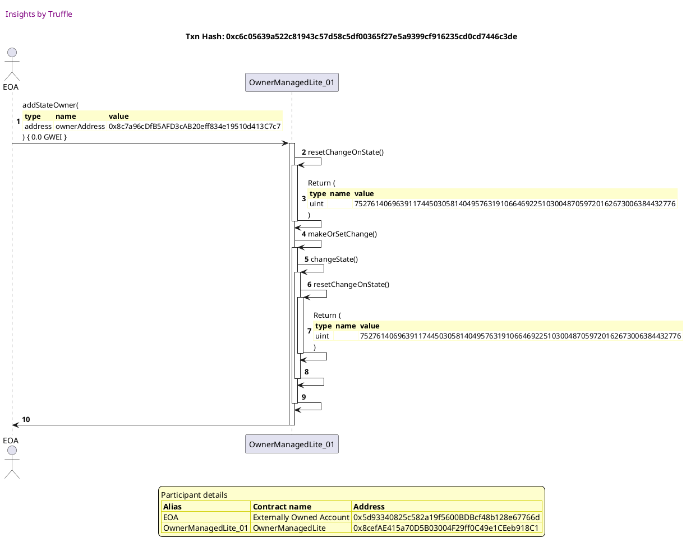

Test date: 2021 Mar 02


## Does not fail when data is sent with the value
[link to test...](http://github.com/thedarkjester/ConsensysAssignment/blob/4fdae3d04e4addcce97e88f438735f476fc16bb5/test/OwnerManagedLite/test_withdraw_and_fallback.js#L19)

##### d1, tx: 0x40b37f63a3a8202cd28b13b82a9a20885e979604d1d38ec2e072e9b14f94badb

[SVG :telescope:](https://www.planttext.com/api/plantuml/svg/RLBBRjim4BppAmZdqY8DIedKot2Do2-aG8i4QEu5HQva8ZHbK1Hgf-c_ToqBHeDQ1vAQMSxkpfAG-ov87_gT9KJseNNzhW9FkXVZzjBB7RNGWDCBgLuQt_PEBrlRUdgpMM_MopKXiouSBSm97RujI0sU_Xv_ANrelNbjNP2sjAPnEt015Ujm2TWWUPRSztvluHtnmxm2ZSG5Uv9Q6zVGY8tGds6VVHwB86F-hwuppJPqj3hIPz_NDUgIO885-dnmz45ssobb1y4gdjKfbrpcCOkLZlCgubKUoqB6BCyJAB8YPK97ckUWOc1P34KLYReGbTGLGSjKmDBNZoML7PtWFY5eMp3Ax2Ms-lZBWVykdMn0VpC1Vh9e2Bo2JmWPxjEx-NMUtjvEgMfT5tn_olhX8xaUTn8uAzrDAI7d0PAdVyhI4AIn7PcDO_nqis8hnjZyxGl5EM65U5ZY03psHvtSmGaejVRG8NUvDtyRMiVr4C0xQUrnQ5dJKYbyB04fTaXqmRbWUPoe1BsDYZf96Lki5geMQ7YSGvfbQQhV2r-pxdzqIB3XISbILTKosYHyhHSiB-9CW59bbGWkW9Ky5z4f0Jen-a7kSSLd_nS0)




##### d2, tx: 0x2d29dfa18a43e97f0d4f52497680715bd391bf8d5bb8287e5665886079174557

[SVG :telescope:](https://www.planttext.com/api/plantuml/svg/bLDTJzim57tthxXYBviOc_FXnAcwYXJQWRG9993sWZGviLCiNATo7DP2zzztcuQeq_goFFZQr_V3vvmRGiuRBvnlbuOGqVhQjij2ET8yQRiIJYp1g8MoSYhAfuMhMoilQbCxU3UVpMSNCqB6ZTyODI7GVOzAIENWjJy2NDLElzJM2vCRlR1BPJrMhFmGCCVBVSbLwrP6_NLnfryK1F7WknLIQhk0WFQktvqTV-uVGVh-rxRHYqVVGB61UzTM5TObNdkZu7vjuKeqZoEWwr26cQn4m4KSgIojg8mh5iPPcd2Q1goGKHOK5PUiA7Z8KyMIX76Uq3GBqfYnb21bfSUdpsvo40sSe3qXI9lNfLu9X7hpoohtNLYnKFARzked3Rh08_uJGhfyE9iSluVJqn7aKjvvuTNx1_j0nhqA7tixsNu1lrafG6l5ihFFmhIusOLl0UbpgcbW2_MkGJuSwPh9B8fYoaDMCXwA8AjOGkdqSbfMCI-2aAiaJPD4lfKgwjfWecxoqkjdx03UlJNw0Az0Fr7u-cDsZH8THxE3kSTxDW92zcD6RW_8ayeBRPe3c9VqabAwWudJX3pYvWB7nA4A0-01r90tsNO2uRhsobbXpAOJHa9UbZZI_Zy9E2nyJE1_lLs3USHocfG53joSHJCvfJmBqrYLPLwmE8eLpICU1xi6o4JF1pd75N_EFm00)




##### d3, tx: 0xe070c2967d4006ea3b18867c66526238f08cfb0e512dbb7f54a59cf3b0aef978

[SVG :telescope:](https://www.planttext.com/api/plantuml/svg/RL9RQzim57xNhpWaUrmt-I9VIXRg9CvQs6XXXJsCCMJfs16LvI3BB6cx_pxLDM5bqSEHz9txTmuXLxtZrWsj9eGFhZD3Mw4b_OCoUsvv2neRD7B5nKDZky78TQSx2_DjkItN9I6BtXqrBWcCPuTSeeMdwGjmtLdrs1d7TQ5LOreqpaUitSbWwvMl8VU3tMjye_Yc7X62-8JTSIcLQI2W4_Hdl1SVfoB8bF_6zAhPkHwg8zpReQvzNEAKqmZt1mFNlDzT0ZqWJQa8yoILCQK9ygWAiYn9HPAmC0cZhAQPg2kAB0XbLQKrYpdBHHrLb6ETfndnb0ddIozl2-0zpFmz8vusfuJQSz_gxM-3zYitl47vHJdyHOFHy0m-8sJqXuiVyyOYcfyNo_E6S0dlu0c23nG-VozlF0daTKZaxf_K4XrNkYUBQLJlvnkwePGkdp-1duMlmZ_MdcJhUm33Mtm12Yajzbvtybi-Z-rvUN1e3TVwEBObeH32BuJpAdfWCe-Yc6OX4omBUP3NBA5qjLc9Eiwg8CmmITCaaMy3dwFdVtHCi8rOGHDHrJpOigYKAvhbOHgZ44N5uYX6MaHP7Bmay4nCV90hB_rg_mK0)


##### d4, tx: 0x049b233bd95e7eb761a629b8c8399922058e5675773f408e5e6d85b057587b79

[SVG :telescope:](https://www.planttext.com/api/plantuml/svg/RLBRRjim37tNLn397jTDliYN8Wlg9CvQO4CBhC0UXc6GBTenAik1B6D9s_txMDS8LYnw8AL3YfT3CdRLEsdTq6h6vE0wCxG5MjO_D6OlhMn1Our6hMJvKDjkC6hTwSx2V9jlytNEsA9tHurB1kFPeLHeuMbw0bntjddiZ9CwqqrjMZIE8bRkvB0busl8_M3t6jyOlZMF25vumkwaKesfmUCJz6VKYuzJ4MpAVsFwfjwv7eeZtDkXgYWkSutJ2FS70zUotrq2F_0mBVmWA5GgCCOYZZmP-McHb4cGfgdlSv6WY68Hnq4LShfZf19HS16B92xYb15bfQFIyziCP0ypqZD6jBccRFQIMhtzRT1-bKRMgBuq3dznRtGyWyyO6__3nOzvRH7DpulbUKUuX7Vm1Fm3Xy_VyniYWRqEYTtzargXautksM8QrVlvXcyuvyldJq2pe2heiYQIBVK0HhRu0cHAMUp9TlgtV1xR8tbmQ8tK-ZYsfI0hIre8HoP-42eD0kB85wL8VEcbbOWuNsrMPHKcXUSd6CLn5ActWS_Hypyw9jW68kDHMLJIsueWLokUf7uSObbcXGY347aM9A7tae2OcFXWLoHfjVy2)


## Does not fail when data is sent with the value
[link to test...](http://github.com/thedarkjester/ConsensysAssignment/blob/4fdae3d04e4addcce97e88f438735f476fc16bb5/test/OwnerManagedLite/test_withdraw_and_fallback.js#L19)

##### d1, tx: 0xeade18df53e034f11dc5eb8468f3381491f6d0b4602fd7f6267d7a8beb3ff57b

[SVG :telescope:](https://www.planttext.com/api/plantuml/svg/RLBHRjiW57tdAwxIbqrTDR0D9b4MDN5YTTAcLbhV9sp0GIKumbXBkkxVHnmhMhNu0V0vbtFlFHU4xhiWVEXt5Y7HXzRrkqfvrBqOjnTUxC2gHZcv4lLBuzlUoQArhOURSbDkYWr2youShLeW6Bwj4b9v-3t-0ZoqthosBWYxjAPnE-L2LDJX4b16yYovx_tUgdV43_EgW6GNx4b8QLm318_Gds6VVnwBG6F-hwuppJPqK1tXsVTQHrqKJB0AdWyE7aItdG4-d889bvgc2gUP9aJML5KyOrodAIVPb6WcSPKnd6YPQvQmNEQ2LwfAjQPvXQ9bTOYbRnwN83gOn7s2ect1r6OlOgkFlvpotuKJZPBVJ50_CHa2h-0JX8RxSBUupiFjxGpgrdN1zwUi7pwYwt4dWRFItGmGEWyGFVrJbbH16DkX-JZ6JpThlCOOBzw-G9nJh30UYZW07_i39tRg12obzAgBtENUucreFQw7eBmJrXw7bYKiwpe-bX0fVA1ocgOPvWcjAKy4cMhAC5wjLxNEU4KIhbYUCoRV2r-pxdzqI92L8Y4quGMTbapWL92Iae8pFgKfBt3EYM0rMMKnGNHYz0FTnpK--xy0)


##### d2, tx: 0x71a3a1a26b9f75cb1dbb3f1dda55e2228c6e63ed81efb513bc6329700dfe7a45

[SVG :telescope:](https://www.planttext.com/api/plantuml/svg/bLFVRzem47xtNt5YBvkwRdQ2ar0nLA2mLjhKIgsqbqhJ9NQeLUCWn-cWPV_xZZH5JEDbUV3Pv_lXx_ikZ9tN0NrebfOnR4BbccMkFQiVZLkXnoLOlT1EJR1uNFYgSMfQsSh3k_biFflE61lMOMFrY47xFMXKsiDBTmIuhBnvhbn0ExPcuPRQ1QfOXdt0d2vVIwuQlxBwhujRywn1zFU-6rJAk0K8thb-jtRukNi4w_fVkTei7a8D-GRkV5EML9S54wo6kxM3IwmVpe2lKu4n2eoIV52ciiY5olEu54gXb3gAegn8T19hbGbTvbB4UP74qI3bN9KwnRvaH5aHwEcpwp5W3JsoFKQq1LEO5HBKwrzE--_eSA7LDnFqJoxQm2F-7cDjFfoEZj_3oSaPZ9Mw3HZq-tjtpuQT2XyxEzf-WR1PQI3hSDdQ9xGDRNRXMo3wlAvhs4ArQp3U7_bQga4SztaMoK9c4Of1AHFE9nUJekndkOWodQHfagYtKdbLMKeqzRW8veawGF1lZJx02_1F7Bx-c5sHHCVHx62-uZqz0yPUnupT792dT41ZwmEO5_o2Sxw3ITD4FD9cIcFYIOKzu3seVTvesmf4wpfexz3QJIkCWd5Hq4Y7_oJWiF0nWV_rjWtwSuo4ZBAf7CmJv3HvSoccMP8DP9nDUPe9J0enwLC3OgBZWvtJIZ_d7m00)


##### d3, tx: 0x25d6e4d1f74e2f2ac486c6e587e70342e6288b61080e8ce4a3b4f6511c8ac5ae

[SVG :telescope:](https://www.planttext.com/api/plantuml/svg/RLBRRjim37tNLn397jTDyaLHYYneuiHhWGqji09x68Q1aMZ7g2C7iemblVpxDDS8LYnwqEMGEYGFoTXLwz7vRbSpXfrlRBVRa6FjGsNtw707DPLapHBrG-cQpfgigHi7utoThxCrOxFM7skQC-ZNbj2GWwVX2N3TkEgniHxhHLsLTaVM1yR2dnpoO7obt7TkNzCRmxVgaK0a9-mEZQbi2O8Fq4j_pZuEIR0X_erjgtBhMzWSuTvrHH5ucQzyJN1_i72DxVOI-25AZQJ4Y6AIK5H4g1CbjQHKJMZ2uoGY6IcraO8hJafJWl4cAMGgX5QeKmoS3BKFgQzl5u0jZC8vOa4sN-bgZw7Ksz-Mt5UqM9BvKddwnKNlU0OVCTR_XuiVuz8HsPyNy_EES0dlu0d41mwVlwzlWWZijKdixf_GXZnMTSjcGwlUZrTynJcVFt-2q8kGHRXaGMGNQW2BE_eBB8nnr0RRwT_ykIylx0TFpc9T7_ko32oq3WFXWuaVKZEDuuIhADMfYb1CYrHolbmjTP6eZOWKoSb4IlEM-9my_wDzW2J7IAIHoj9fBf77AF9KP4ggQHghZ4-KGAd5CWa1WXA37kmgx66q_m00)





## throws error when balance is not linked
[link to test...](http://github.com/thedarkjester/ConsensysAssignment/blob/4fdae3d04e4addcce97e88f438735f476fc16bb5/test/OwnerManagedLite/test_withdraw_and_fallback.js#L33)

##### d1, tx: 0x280856128c70f00179adb71ea76283d01e14788d02ded29b303db277afb4afac

[SVG :telescope:](https://www.planttext.com/api/plantuml/svg/RLBBRjim4BppAmZdqY8DIb4FqePhHBPif42B16Zk1IMkP28qPL0KQgVfltSj2qQ3MWUIcbdExiwIaFikA1_wdIL4zQ5r_Qu4JxeNu_RAgnsrq83JIrMzDBxjdLwrjlNqPhFUh5ThGkPTE5fO43fyMr0QFFqz_bBwq7hpshgWR6vDutRW0YhMuHAmGV8ikU_zti8xueTv1Heb5-n9QMrSGoCsGd-6VVvvB8AC-R-wpZJRqD7oI9zzNzUeIu895kZpmT47rMrdb1suP3BD8YuhmMh68Z5LkXGHA95n6MiMGPG8AJNZ6ZIVbZ6BTSc5K7MPg5fL12sh0fQ-ViofwkW4zmb1suAfp5vXgu-_7FZloga6z3SJu2UBXi0h-8IGuJwzMrpdwUtjZ5QjwuBlJra_V2JNuqu2PwMx6INaF43oz4zP6e8ojYFpSOoVRWfMCCOMRryepWahnCCA1-2nF-hK3av0hhM73hdBlSNRq3gkXm3UAMkFGykQvbM5ZoKWnGwfdiPnmYHFgrHo5KthD6DiMIohEf4bsW-P45cctmjVi-v_T4XGQnm99CcI5scHYfZpDAj1Gfh6GgpOEazan8kSOG9qOlI3tEEAp_ul)


##### d2, tx: 0xbafa6613f95e41876e43d2b3ab98fa5f81e8565055d5d3664b8c411b32421277

[SVG :telescope:](https://www.planttext.com/api/plantuml/svg/bLF9Rjim4BtpAmRffKMQbbeeoOPhHDwQ02qI805w2L1GuiWXGbC6HQLsulvxnufYfAWlrO533cVXUs_4s7dZfVFjoZ0cMr_RTbMWOys3jclfv0eCBj6gYImVbgvkhPhMfdRmRZ5VpATpnaQDtneSC-Y-UvGA7JptHu2BskcdsdffSgENTeNMKyNA7m8MTFbISjswjS6_Bcxq4q8G7tpNKYbjbn3mtlMxiwFF_IDOt__IDdfvxniejd3hsggYkinhRn1kDnOkP7C_1BufP2MJ98YgWS0uoD84uqY5HIIBGLP9KMK1PY8HN0WbL9GaSP6LSH0KKHY7GPYcZ2WhFJrzVfM3RE24x0aZshmkzLeIrAjV5jrtQUKIrJVjyISFki0Z_XF6kdmu6n-_XzFJ8UHAtNZfyVsTlMEZNeMFlHtlle3VhX78MhdgxACqBMtsuJiW-Xms3UoWtZV83qU-4MeGHJ7FGb6AB9J1e189vvFPfApYh0Z239CqJHBrMggeQqE9kibBhn-f0tZtskW3F0F_nE7hZ_abINGSpHxc2zwp8J3sCcRi-Wrv2htKfda3SyPddFCzJ9ecuf4sKneJHoeS01z07VB6kquWMZSUdPN6R3jX5EHbIIFj_vE0juMF2VoljsjGgLHM6CUJS2Pc8et2K2GLPYX4bAPJFi_ZB0XdEQS6n4JF1pkdbNxEFm00)


##### d3, tx: 0xdd88ddde6965265ae85667b9157574a4a67c46520a634d1dcea619cd8eb5abd4

[SVG :telescope:](https://www.planttext.com/api/plantuml/svg/RLBlRvim4Ftkly9Azd7T3C66L5bK4iXQQLChhT8-JDDqu8DO9IOoHalwut_VZQ9erS87sxntVdVtpenTTHwSxtSDOz3xrlQx0Xth7epTWuCTRx16grTGFjIkxQrUjqth-7IJR_9rpjYYyyS6bumFtnP1e-DFuo_drwqpZwtrqAIDgUqEhIV5ofy2DaI-Ikvxjs_m3V7DF28FeXDs1reRM_D0ZD3Bi2y-ZaMmCV-DxKozzHqlZlpUzLL5kimRto2_FrX-3Ttsaek3racYjKOrLp9K4Z2HIiN5F92nZ2E8GCLbH9G0DOjqe4i45SnBdM0XeT0H8yjAJwNdjoc7Zazedp2opPlIx85QlVrjqNq52pNgByRZBn4CWMVm2MF3VNxnOrexHFlpOda-a5_oT_o9YmyazlbxVaCkiDSfiRj_SclqO9gEBSPPlPzc8XD2B9y_SHe6bK67DRdig0bkOOT_WLHhXnrnftlBvw4_MWyUdOMcEGvzQPwM9Rq8JvGuI3sVpIAHXBAKIGZ1l99AY5MsAgieAO8mGHN7IkctmkVy-HyT4bGwXWgZQ1LcCfFnB0obgZ11AMTnl1Pv6YL1cAM24f0Jen_iYbPwsty0)




##### d4, tx: 0x5277867b0ec2bb67c6e0f76e77708c0a4e21af2c485c0e1a812f86be97110a03

[SVG :telescope:](https://www.planttext.com/api/plantuml/svg/TLDjRzem4FxkN-61D6rqLPsGn06ngBm4TTAcLXtQbscQBlO5h0Q375EWw_xxhW6XLMF-OCVFdP-xU-x2s7NjmVdDic8CDdvbDyi27QiVZ5s3WoMlS8vMZq0zpDrgO_LuLQqSRq_pQJxE6HlKVbzXndYp5WWQ7Vzrl79-itBcQMKzLCFApEqIhIV6qfySfcGyKAutRbtXAyDNyuGyY4xO7MXjx9m7uWZzRix1rJ49Tep_oTPcll0rB_PyvZPbIRpC6ryXd-qilu5wqUTY5uTIfeai1AgmA1Af4XIbJ51AAL8b8C8mW39KKHehWG6aGLYcIO4z6GG2H9UHPCfJwldja4FDMtIs6CdcZJ9he59ljnRT5x0mH_tPUFmfWiRn3DvYh7dFBxFpTdvnqUTRunVQmVRTUtRUQNVvlUrG_tXXET1TzldWxHQS9UKoFb27_f5FrkdSvz_o-zcRJcTmrU0PqqWbcKVm-Byi3mF1xlugKwC7KzLiS1oB3-s9c0WXikUFdFfE5TF7c1hgY9nRME8BCDJQOKssqxlikP6Izfr7Pw6gzes4cW-Lek7pPAAswLwt6uaqZ5MSXX3qoZWHOZGPgJ9AYo1CCP4oIVHhudEj-1Tj0fHQGebHD0edyIIMtJ2Can9JZEEkb6EH3oEQXCbGK01IugW7kwQTVgC_)





## emits event on fund distribution
[link to test...](http://github.com/thedarkjester/ConsensysAssignment/blob/4fdae3d04e4addcce97e88f438735f476fc16bb5/test/OwnerManagedLite/test_withdraw_and_fallback.js#L39)

##### d1, tx: 0x90969b947d4becc6dc7a9b081def5af432b2c5c8e0965a6e0b6d6c3df18cefa6

[SVG :telescope:](https://www.planttext.com/api/plantuml/svg/RLBBRjim4BppAmZdqY8DIhr9mpNYXumKQ940pRrOaIkP24qP58NQQVhlfMN1Q53hG58pozdTMH9ottbmljyPGg3thUrt5JhIlMYx1mSxQh11gvOWNnhNzbQjMjCwUhCfD-Mg96JM-QF1EQ73jqLGwEZlyPVIXzRfrzPwC0kZ6xj3wuDYxIy1cq2U9VUzsnjyH_pGhqYZz88zWLBQDZHY8_Hds6UVnoB8cF-hxNIpzHsjZlJPzNKTT8dNtY1zFbZw0DrsIjb1C96BIgI5IYkKCbUo054n7YciCwZJ9AvYcKcE8Iw375cLgrmcgewun1fo4YoJFfHUFYueT7GIzWa9jdajzHv2gu-_BBhlOA51zKrx_CcY8V0AFY5ak4_lvjTvUdixfRArdNVzAUk7Z-Hwt4dWh7GtfOIS1qYU_YbBeGTjEZ8Rn_ZfPitMZB7vsnSQvXGg38TL680B_L4BEpm12wKSTe6xt9k_3Qs7zU3HMJ3cEBIiw4BAy5XyeDWXKo99KiRZJ6OyXaZKMSxOShsKTSghAEQO5qMUg_V2rwpx7nqIGCHvnTUmKRMAHIeIBWGN70fLobAef8PCo7HTX0J1YT4FSX_MyEp_0W00)


##### d2, tx: 0x88f6e34dfbe5b5ba383411a8278b5c6ddf06d758c55a1e37e47ddb02b40f4258

[SVG :telescope:](https://www.planttext.com/api/plantuml/svg/bLDTJzim57tthxXYBviOc_FjL5r5eUb0sWGII7j1ccvYfrYuJkKuh8Nkl-ysX8ffVLaUVEth--5ppWrZfwr7vxkbOGmxtzXkMIh7sWTjL-Xm2KOjb9LdM3qiNDDPUTwOni6xUJ4lpWl6ngtV63LXq7_t2gLoy3mS0IuQfvyQwz5CZLxOfRAUAjP-7p2dovUIgywjZFhhuaO_AGZYlUyQfTHs0G4VNBzxE_uyF88D_IzjgnVtleLo0xUkgskgoxpsHi7jsi85jlSZu6iXwbH5iQnBbPH9YP68uY104MQYJAfKofgdCaj4bIGOg2XJSIPboSCovdKS9e8HPPMdfnTNKy0MZiWUCQBDwqglaA1U_RBAVKUB2oM_QQz-yg0FFE0_OgpFXvF9uNiuFXx1LCeRZrwzlxDtR3oey76ma-qNy9kL0h8MbxrzHDFHPXU-1QBFgRQ5BJIx1jFzaQyJcKTHp4MOL8a8CSZh9ENyR7PMrR4eWr2eDClILBwMAfl6KA9kfvNNZzG1l7jjz06UWN_YyFL7SKaI7KQpW_c2zsG4ZBsC6Rj-GvvK7hLfty2SyHddV0UJfebufCqvZOaZ5VQ0zw3sUPDjBn2jQw-SHMCslJ0IfbL58-t_au2tXGy9_A-tRu214AMOuLpMCipZF19vBdA1cIog8fTHZKbUnREC6X0J0n_ib5RwEVy0)




##### d3, tx: 0xb476c52aa78ad5f30c52a6453e682efb65789ad22661acb2dfe5e58a91485622

[SVG :telescope:](https://www.planttext.com/api/plantuml/svg/RLBRRjim37tNLn397jTDliYMYYneBivQO4CBhC0UXc6WBTenwiY1B6D9s_txLDS8LYnwqEMGEYGFoTXLvz2wVjSmXhrhJR_BoRBkeJPxjBY3XYeoUed5GsNRtkXLsxGMffjiawqoncQTEpOqPp2iBQ4c2q_Z4-2wjVLZQnmsYwQkp8wCyuobEpbilF6LSj_RVKDl3D_gHu8WFc5tg7LjAWZu2FqPpjd7CGasnhynNLrjNGVv4UvjNvQUbxdQDGJt1mFNs6qlWH_oE4qA4IAc4hKe8_xoI68HKI93AlD4f5AX3iCa2R38GrsI825H1R4KIHWoBrdXVEhPxGAmWua_9ypBvkgYtgClzVQt8ViL3LQalzIEVl5WS3o3JnWR_iF5ZsbbYSpFY_bvHxY4T_04_8Cd-_mzk_4giDSkiRj_OcjoM3STcuszUZzTypNdVFxy2NmpV1h-il8gMry46DpH2x3GsbBdRQT_y-UXFhyV75c3JNCSwjAmA0e_4SwR-45e5KKnbw4eX0mnKAL8E5-kbqKPopm89ILfcYJwBV4vVVv7Xm0OI9dBDMvqgKCLgqWg9PN4L6T5fdHKeb15l4vz0A_4g0UxyhkVxRy0)




##### d4, tx: 0x96f950e404d71f6e8925a98446109a7298056a8387e1fb84ee6c290128156584

[SVG :telescope:](https://www.planttext.com/api/plantuml/svg/xLTVJzim47_tfx3O0o36vhH9QYDMKMWxa8P0WsalI9CJEwsrrAaS1rhellikQIWjbAbGe3miKkBuOj_zxfzpXz1UQhcnMIz6Y6SsqLala0QblvNkSyDxE9OTgSK-3tztJ99fSP34YS4Vsgrsww25q6vgXx6i8rnSNSc5DFYcd69yc1XrdMZBuqQiEhedjGMEaPqiQCF7CSj-PlgndFbmfgubTjm9xPGBeNG7EwGa_Id6tSyb25JAFzAfwdHjYeCXFZTP505VP9MD9JuVQ7p8q-uE9WFcHymZqYMkg3cHBochU9nHr_KTmdYjmYZnV4whj2QTAA2kb7vOOSIfKCVpFUeYC5be0Nhhf85vYjTWN4DWDgj2rUUWwicLbkQOQzwHufkoyXTnYeLpwBCRptWaZxdjtcwOcgyXL0Z2s_NvZF3MrWuMAhL61PcLFpIFuoJaLees-2_Ts4Jpj-NyfkKKVC3Y6nVw0ksM7lzOZlNH5so7VObXrBnNZ9Sypk0bNpx2cG8rHfZ3JUxHWZlQ9hx1v1F1Nt-sZi2Ri_8VLN1xUmT_bpOp6Yy5RWh7KsoIPi7IDd78-5h2D2l2DS9vP44MZh0q9Z77Cat1PZ1TlqLKGB46aaCb6YUNqaHnShN-7BrUqDMpgcsk8DWU87WqvXR8wt4oB-Nl7XpeTexJWoI9WHp2mI7DKLg0WRarjopk-t3nt17gyZLZr7bkxhmDheLo1w2eD4yS-7jTIvFypvl5y-Q1Ntk9U9VnzZQu5eetW9B5oNk9jXM6sNFYwxNgetiXl-eoQOaCV0aBlK2rzCx_xJcIV-mP5_pv6ZHkoD3fLBSWfEKgJgVWDqaJiEJmeU-21W9U3g2XoakoYI8D8GoS1tWqsLSV5QqCF0TMchnl61OjZC2DC2nh1JBm1AjMNK8hNkZH2dTOvFc4x3VtmyYb0NH7qg_LV5_CCfxN2Zsa5WAuGsb0cxmj8b5XBgjInYYZl2PQOOk9QiGz5hhDsgo0wPRfRlPKXc3Qqi1e3vxG5_y5)

```plantuml


@startuml

autonumber
skinparam legendBackgroundColor #FEFECE

<style>
      header {
        HorizontalAlignment left
        FontColor purple
        FontSize 14
        Padding 10
      }
    </style>

header Insights by Truffle

title Txn Hash: 0x96f950e404d71f6e8925a98446109a7298056a8387e1fb84ee6c290128156584


actor EOA as "EOA"
participant OwnerManagedLite_01 as "OwnerManagedLite_01"
participant SafeMath_01 as "SafeMath_01"

"EOA" -> "OwnerManagedLite_01" ++: distributeUnallocatedFunds()
"OwnerManagedLite_01" -> "SafeMath_01" ++: add(\n\
<#FEFECE,#FEFECE>|= type |= name |= value |\n\
| uint | a | 0 |\n\
| uint | b | 0 |\n\
) { 0.0 GWEI }
"SafeMath_01" -> "OwnerManagedLite_01" --: Return (\n\
<#FEFECE,#FEFECE>|= type |= name |= value |\n\
| uint |  | 0 |\n\
)
"OwnerManagedLite_01" -> "SafeMath_01" ++: sub(\n\
<#FEFECE,#FEFECE>|= type |= name |= value |\n\
| uint | a | 10000000 |\n\
| uint | b | 0 |\n\
) { 0.0 GWEI }
"SafeMath_01" -> "SafeMath_01" ++: sub(\n\
<#FEFECE,#FEFECE>|= type |= name |= value |\n\
| uint | a | 10000000 |\n\
| uint | b | 0 |\n\
| string | errorMessage | 'SafeMath: subtraction overflow' |\n\
) { 0.0 GWEI }
"SafeMath_01" -> "SafeMath_01" --: Return (\n\
<#FEFECE,#FEFECE>|= type |= name |= value |\n\
| uint |  | 10000000 |\n\
)
"SafeMath_01" -> "OwnerManagedLite_01" --: Return (\n\
<#FEFECE,#FEFECE>|= type |= name |= value |\n\
| uint |  | 10000000 |\n\
)
"OwnerManagedLite_01" -> "OwnerManagedLite_01" ++: distributeFunds(\n\
<#FEFECE,#FEFECE>|= type |= name |= value |\n\
| uint | amount | 10000000 |\n\
| bool | callerIsOwner | true |\n\
) { 0.0 GWEI }
"OwnerManagedLite_01" -> "SafeMath_01" ++: div(\n\
<#FEFECE,#FEFECE>|= type |= name |= value |\n\
| uint | a | 10000000 |\n\
| uint | b | 1 |\n\
) { 0.0 GWEI }
"SafeMath_01" -> "SafeMath_01" ++: div(\n\
<#FEFECE,#FEFECE>|= type |= name |= value |\n\
| uint | a | 10000000 |\n\
| uint | b | 1 |\n\
| string | errorMessage | 'SafeMath: division by zero' |\n\
) { 0.0 GWEI }
"SafeMath_01" -> "SafeMath_01" --: Return (\n\
<#FEFECE,#FEFECE>|= type |= name |= value |\n\
| uint |  | 10000000 |\n\
)
"SafeMath_01" -> "OwnerManagedLite_01" --: Return (\n\
<#FEFECE,#FEFECE>|= type |= name |= value |\n\
| uint |  | 10000000 |\n\
)
"OwnerManagedLite_01" -> "SafeMath_01" ++: mod(\n\
<#FEFECE,#FEFECE>|= type |= name |= value |\n\
| uint | a | 10000000 |\n\
| uint | b | 1 |\n\
) { 0.0 GWEI }
"SafeMath_01" -> "SafeMath_01" ++: mod(\n\
<#FEFECE,#FEFECE>|= type |= name |= value |\n\
| uint | a | 10000000 |\n\
| uint | b | 1 |\n\
| string | errorMessage | 'SafeMath: modulo by zero' |\n\
) { 0.0 GWEI }
"SafeMath_01" -> "SafeMath_01" --: Return (\n\
<#FEFECE,#FEFECE>|= type |= name |= value |\n\
| uint |  | 0 |\n\
)
"SafeMath_01" -> "OwnerManagedLite_01" --: Return (\n\
<#FEFECE,#FEFECE>|= type |= name |= value |\n\
| uint |  | 0 |\n\
)
"OwnerManagedLite_01" -> "SafeMath_01" ++: add(\n\
<#FEFECE,#FEFECE>|= type |= name |= value |\n\
| uint | a | 0 |\n\
| uint | b | 10000000 |\n\
) { 0.0 GWEI }
"SafeMath_01" -> "OwnerManagedLite_01" --: Return (\n\
<#FEFECE,#FEFECE>|= type |= name |= value |\n\
| uint |  | 10000000 |\n\
)
"OwnerManagedLite_01" -> "SafeMath_01" ++: add(\n\
<#FEFECE,#FEFECE>|= type |= name |= value |\n\
| uint | a | 10000000 |\n\
| uint | b | 0 |\n\
) { 0.0 GWEI }
"SafeMath_01" -> "OwnerManagedLite_01" --: Return (\n\
<#FEFECE,#FEFECE>|= type |= name |= value |\n\
| uint |  | 10000000 |\n\
)
"OwnerManagedLite_01" -> "OwnerManagedLite_01" --: 
"OwnerManagedLite_01" -> "EOA" --: 

legend
Participant details
<#FEFECE,#D0D000>|= Alias |= Contract name |= Address |
<#FEFECE>| EOA | Externally Owned Account | 0x5d93340825c582a19f5600BDBcf48b128e67766d |
<#FEFECE>| OwnerManagedLite_01 | OwnerManagedLite | 0xa188b8DaFdfd29493899898a7dEcE9d3fa59c4D7 |
<#FEFECE>| SafeMath_01 | SafeMath | 0xa188b8DaFdfd29493899898a7dEcE9d3fa59c4D7 |
endlegend

@enduml
```





## emits event on multi-way distribution
[link to test...](http://github.com/thedarkjester/ConsensysAssignment/blob/4fdae3d04e4addcce97e88f438735f476fc16bb5/test/OwnerManagedLite/test_withdraw_and_fallback.js#L51)

##### d1, tx: 0xcd4373d22fa8b473dc5f403cd0d8fa240a478d4a78af035f6bdb43dbe3685595

[SVG :telescope:](https://www.planttext.com/api/plantuml/svg/RL9RQzim57xNhn3foqPN9jkIBOSiD74SEjXeONqVnxeufh8SP9abNVVVfpWch2nwqENxpldEJGZTznwS7rg340o-iqDRAOVwbyRkmK6BZQgLbMiGBxNh1YkBpdGEtspBRLcK22rwVpHgYV2uTWgaSlZtzCJueNFDQsSzc9LfQjigwuEYzXU3RI3Fall1xOrwH_neNXMEw0Lx0YaRM-E8JD2VyLnydf90K_oljc_gdUznTSJFRj0ww2BVUAFmyy7Y1-XtSqmEGj8aIsGSQ-0L3JV1D2M9a4Ho3J4bG3CkAMGSD4cOJYjPqKHMAaavOpb3eMN2XzJBnnM67i_2EKEXRRuHpHv2gO-_h7BVmKAjvBV6gvya6Wslu3E4HdzyjxpEuzlREHQTxRqRJb4_V4JNxKu2PwMxEKReF43qz4zQKdbeJ8yMqnW_tMp8XX2oVFk2mvn2Xk5IX06uK1-sqAeJi9BIgJvm5x_bsrXws0zUEGl67CUI9Lu94JwB3nGvC9ad2IKyPeBn6A9SivIGzMOjDELL57ELPbcQolV2rrhtFpe6u4BfLKaZ1XdPi3L92A7REDUQ53HNKL6gAezu4VnHwCJK3tGVzl3j_m80)


##### d2, tx: 0x46ddc3db361b43ec19cb0f72fec0805ec12877bb7436d4105d60b05fe76539be

[SVG :telescope:](https://www.planttext.com/api/plantuml/svg/bLDDRzim3BthLn3TPKFNJOw_YoweapXhWGqjq0Ax51XaYKw5Ad8WortIPlzzZEi67PRBV10bYdpKUwGPEs-zSBvR6iP4vnlRBIjqh7tGTYMSM8B11Ler4V9XuPhEgcbZ6WVlvkMyd9QCdRL-Ot3CeF_kKIXqy3mS0IuQfvyQwuKfZ5xO9LfFYBNV1ypfyWLorRcLmRykRlGJGX3jVTT2AMqN4F31zRktPv-7Hx2X_gLjzUBUjr1juDPrTKsup6jl46xN5Yv4UtyAV1qbIibGLM4IL568CiXbnUjqLAFa6O_9CShIjAhIA4nK5F1O9RpYSOrf4eTvHPXCI4zFBwyA42qSaJrY99lNKgy4KRtwPT5z5rOiK7tJ7d_oe0yyu3zYhC-7a_7XUpW-FeL2gHilFBw_itViREZ2ny6Ejr_0RrO8PArOzlPHc8usk_0ja7mEsnQsqEmA5FiZNySg3yE8PwDOnjb817aT9vnFPXDPHrb5Gc2IfacYNg6gfZ6KgDj2Ulr85S2xrq8Vu1du9mvVVvINrAB3R7OqN_YUd09ZBsF6hj-8fz0BRTetD6TynZdVqQHf8XrfCwKnSTI5FU4zgNtUUDitYDQrHsU5CPk-CGeAAMca_NyAy1RuK8F_zVO5CebrKKP1B58-YoSyv3oQZ_AwvjCens1QOfK7sPJo6IanwC7EQQMVymy0)


##### d3, tx: 0x30e3d3ea8c0d2c315dd6ad28ea4ba474d029f9ef1be2a07b8a8a764f0647a644

[SVG :telescope:](https://www.planttext.com/api/plantuml/svg/RLBRRjim37tNLn397jTDjkLRaGLD76SjiA45Lc0Fmp3G5kqOTUH0Lh2abtyVvnh1YaKFkXoIX-IXXBZg7LgttxP2uDvrPhyjo8h-eJ4xjBY5bceoUedbGssxlT5PrtOMfkjydMUv4BFU7LkQ2nZMXb2JXQVn2N3TsUQnCmxRHTlKPal6CMFbJWvhDhvIxlPsrz8RmxVcaS1J9-mEjMvC3PuSePVXd7qSYn1Z_XlJD_N6zL0SuTxkgufvXMjSIt1_C72D_UOIv26G5EY0C2cbzil02xMEKFi9eIfGnKfBFwrIgho2V9HnaM22SQGg6QaO8wK4IrOwBZs_NG3sCE5p8bWsrvJD3hdLsz-6x5SqM9F-qZZw9Rt1yGm-4MA8XuiVqzeIcPyNy_EES0dlu0da1oRx_3s_OHN4wvJ4tJ-vDJbisbxCnbczdwxaIaevV_u4F0mkWoyPgsov2J2ufR_0GcjBFTjESVFdeJ_U3uwimROz3drfM9Gb_mZ79da8THe4IYP-M8Q9ZrvQXP6KozMoh5HIU2ng5CTHfDyIdzFdVtH8a9HKBNBbXHZBLRYKWPHgpVEfPAPIyhASYjHBCeuNhCIeXxZYdV_s7m00)


##### d4, tx: 0x8fb3b790e4756aadda70f51d32673aaf3a39a1039938dfeb15b9fdc981e55ba7

[SVG :telescope:](https://www.planttext.com/api/plantuml/svg/xLLTRzCm57tthx36owOniEElU1hLsZHbaq2Ts2HU9Y4dTjfegLiv3hHR-U-uQQWsKP2eU2IASkthUu_jS-qJ02vhhvnlPXK0gl5psymouq3zKDg5Sce6ApCnLWzK_Z1nyyRgP5xD7NmrIaTfaW9mKVjLPNe0ji_KA6qSVEgw45xDNVaujrvL_QgSs9cnFY0MVXSm2eDRo4NZ5fLvCN1RFXg8wSvtexGkxGHYrBc-j_RYRRS8qCr_RUjoClKrp5RmpZL54N21BtrbuDtImYjLJyyXMiP5HZ8XaQ62SHMmbK05mvf4N12b2gA8L1WHAKci2vDXbib2vpB6Xh5C2H0eotrOUZhkGrN3es2FGA3DbtcvK66hus_Mk8_AgedH7qfllY3S1kxn7m7GviEptlvnU7fw3iCYRxtofWqulhVtuA8hnUlEzjRle5yj30pMgbbhlwgg2OrD-7e3uKnTmpMSRq3wkovQ9fHehFDqcAW4QnuP8VjK2ibfD41OoBY89D68RA5Eu1D4Rn1y_pcz3fNOl-W_xYPCR7moLNPYnhRTr_79t-ASdPt3JyOtpiB3-6ZAKAWr3AzWaU2O8YuvaHWBIXaYYCN1HIKJd6294UUKooXYuLmWH6E1c1GHmdnpPX3Y9AQKH4BmZgD3Q9cf1pDsjp-fEJu896zp3oJrVt5-kvr_dBEzyfiOi5LQSFDCFxJnggpgPxmDqH0XjE4j26gGaj18WbAw84Gx1dTNUfVNMxSQ5RvBRvnLLRLgjKd3Vfu7LVVjzMTQ4a9H7B6SnP72ic0SeS5ma1Sqpd0K6nwuu_eby3wD-zNRJX3dfkYd5BCWj4CsQ8iqYcHHe8HAWvFKP1B7ISW7WOcE3t0Plk7_z0C0)




##### d5, tx: 0xc6c05639a522c81943c57d58c5df00365f27e5a9399cf916235cd0cd7446c3de

[SVG :telescope:](https://www.planttext.com/api/plantuml/svg/xLLTRzCm57tthx36owOniEEFnDEergOjcmJgn2RnCWcvjjD6IzqgSQ3Tod_dDWtL9WeI5Oz4KQvzVU-nVQvzWj1b5NGPwbc1aAx3tDUpiIjHzP3xXIxr31TkuhpjQVCmAUUrj-cyc9VurN0m7AG3X2wgi2fS1-7ccJfjNOcVsYx6L_CoVvpxe8jkaK_ypFa0Y5dO1GnXS0kvgCj5uLuCtEQF3bE-yzreQtC_mPIqhk-DlNZRBWAryr_xAfzCGuN7AtnNrba6k2ZaeN3uRkdnbQwcvvWiZJH4IAQqY2AJKCMP4R4LYH4s8uH9aKMn4renfKocg8oOC9OO6tCk3RE0YRG9iFJ1g8jrXO_07Y6WBUGcNsZOwkYRT-L7xVN4sGzvS5y8RGBt-8yGQlBnMMV_E3uzFST0m6tGmJK1n_V-7bsqfNZTsixw7GwhXSDWlPurzgikQcXimjSRYD9L5LxZ-GQak-kIPM9YhQJfPptH7VQPwVOYuh8iOTnH9IYndB8qDl4MwWG_OVA6uFUV1zTGYVsB_kDkO68Nqgds4pVopRwEJ_uMv-pi77zoeIuzFeoFEeT2hJ6yiOXYIJcH2Wu5fL1cGHWH2RYu4h5aL54Y9PSgYe0DHWXFOY9K714u7386XsG9vooAOzboT0WjC_tWHkNjJsgE3m8nJUw1fFulpc-tyuzpjbT-4uEsIejkdkc7TK7dHVMCjpxf4q8sl86WWfH08mMbB468TWpkhlGkhxDkD0g-o-1AhujYrMYJnLrZGDL3S_s5LOnnaaJ2Y2JIL6L24jBhzqp6ap6D4YU1EsbV0k_Jk5-zhRwuh3lWLEYOz4MlAT8mKbb6KguSJGTkh6YIGZu29be-q2LyuV_q0m00)




##### d6, tx: 0xe1a1a660439340ecf33fe240907ed9cea53cad083b6e9eee8f4105b23a7e4616

[SVG :telescope:](https://www.planttext.com/api/plantuml/svg/xLXjJzim4FxkNs6n3u0OczEyj46ieYtjG1e23QPzGPgS-D9QS-tASQ25xh_FJKjfe4mTPRIQYDIuljXtZv-xiwr3w20rL9kiAn2YcL4owqQWKVgJonxLj8i5j46oEer_jhNA96ieeJH-rsgsceqcGlkf6GYe8fm_7Q0CDBwTT34-KfhVA6ceg0dUbbsGncfCp7H0otuSg-nbkYUWyE6Stm1slAdiZ3B6PHixP2BwbRVx7oSWqCJ-iKnvksDI70tmXSwInEf5XXi1-A8lyH5DEtkOzC6X3Wq2uhcXwn684zTDeEIHa9I1XJ5Gtuqf8nKt2Y04W4hYESIFIYujWnSu0RAKnSP2RvxMC4tnXcqtaANDy9Ztg5tgwRK4VK8bRGFxmWty84u-S8wyEF6S9d12JUTkman_0w7S4DwjpbU4TtRsCEEfqJpA37oJL0WLKmEiPVsNRcsZ-TD6-cRjv7eiurkNyXBjJpp-Vj9MXv-m6VG0srRIRjvUKP7PFwFXGvnnkumXflP77iYYUzasliNa0y6VlpUFhJUBzfzSuExk7luA9jCIBmLk1iSR9s-Sl3GdQHOjpOb3niyIrAm8rn2FTY2xMmynQAtq2QIfvSnsD-yGvL2CjfieLnAhAz29KDURprdN2xgwkBJj5GJR8mHFnjm2-_zuqr_Atrrxy9ivJe-K4bOSsmC6z76QWx5ze-zKFFJXuhd3-DM_Z57tkRdpEhWMoXqBXQUZnB6td1lGQjLvuuwVrQNDGm2BHrjNiRMCjjV1jL2qMIYPKEiIQyuAD-SrkXqL8txLTwJdvzzBy5EmNc39MIj-lBVuMSlu-O_uUHB87-QCImgZCMXSya5dC_K81ePoaSwWFoI7zb0PeQy9JjCHx8QI-ML-keuQOzgU9NWudLSTviKI--uRqAFAn20laZ1SY-F9BPFqVHRQF26LaX_xbH9rmiGF2AaVrkF4gqHEgG91kHm4hAXuNh7biJGtK8aXgJKznwTbSkZNYKk8rog5IK8QNWXEembHw5GQJj70R57cllUt2Ysr4uBHWNrdNV4R)


```plantuml


@startuml

autonumber
skinparam legendBackgroundColor #FEFECE

<style>
      header {
        HorizontalAlignment left
        FontColor purple
        FontSize 14
        Padding 10
      }
    </style>

header Insights by Truffle

title Txn Hash: 0xe1a1a660439340ecf33fe240907ed9cea53cad083b6e9eee8f4105b23a7e4616


actor EOA as "EOA"
participant OwnerManagedLite_01 as "OwnerManagedLite_01"
participant SafeMath_01 as "SafeMath_01"

"EOA" -> "OwnerManagedLite_01" ++: distributeUnallocatedFunds()
"OwnerManagedLite_01" -> "SafeMath_01" ++: add(\n\
<#FEFECE,#FEFECE>|= type |= name |= value |\n\
| uint | a | 0 |\n\
| uint | b | 0 |\n\
) { 0.0 GWEI }
"SafeMath_01" -> "OwnerManagedLite_01" --: Return (\n\
<#FEFECE,#FEFECE>|= type |= name |= value |\n\
| uint |  | 0 |\n\
)
"OwnerManagedLite_01" -> "SafeMath_01" ++: add(\n\
<#FEFECE,#FEFECE>|= type |= name |= value |\n\
| uint | a | 0 |\n\
| uint | b | 0 |\n\
) { 0.0 GWEI }
"SafeMath_01" -> "OwnerManagedLite_01" --: Return (\n\
<#FEFECE,#FEFECE>|= type |= name |= value |\n\
| uint |  | 0 |\n\
)
"OwnerManagedLite_01" -> "SafeMath_01" ++: add(\n\
<#FEFECE,#FEFECE>|= type |= name |= value |\n\
| uint | a | 0 |\n\
| uint | b | 0 |\n\
) { 0.0 GWEI }
"SafeMath_01" -> "OwnerManagedLite_01" --: Return (\n\
<#FEFECE,#FEFECE>|= type |= name |= value |\n\
| uint |  | 0 |\n\
)
"OwnerManagedLite_01" -> "SafeMath_01" ++: sub(\n\
<#FEFECE,#FEFECE>|= type |= name |= value |\n\
| uint | a | 10000000 |\n\
| uint | b | 0 |\n\
) { 0.0 GWEI }
"SafeMath_01" -> "SafeMath_01" ++: sub(\n\
<#FEFECE,#FEFECE>|= type |= name |= value |\n\
| uint | a | 10000000 |\n\
| uint | b | 0 |\n\
| string | errorMessage | 'SafeMath: subtraction overflow' |\n\
) { 0.0 GWEI }
"SafeMath_01" -> "SafeMath_01" --: Return (\n\
<#FEFECE,#FEFECE>|= type |= name |= value |\n\
| uint |  | 10000000 |\n\
)
"SafeMath_01" -> "OwnerManagedLite_01" --: Return (\n\
<#FEFECE,#FEFECE>|= type |= name |= value |\n\
| uint |  | 10000000 |\n\
)
"OwnerManagedLite_01" -> "OwnerManagedLite_01" ++: distributeFunds(\n\
<#FEFECE,#FEFECE>|= type |= name |= value |\n\
| uint | amount | 10000000 |\n\
| bool | callerIsOwner | true |\n\
) { 0.0 GWEI }
"OwnerManagedLite_01" -> "SafeMath_01" ++: div(\n\
<#FEFECE,#FEFECE>|= type |= name |= value |\n\
| uint | a | 10000000 |\n\
| uint | b | 3 |\n\
) { 0.0 GWEI }
"SafeMath_01" -> "SafeMath_01" ++: div(\n\
<#FEFECE,#FEFECE>|= type |= name |= value |\n\
| uint | a | 10000000 |\n\
| uint | b | 3 |\n\
| string | errorMessage | 'SafeMath: division by zero' |\n\
) { 0.0 GWEI }
"SafeMath_01" -> "SafeMath_01" --: Return (\n\
<#FEFECE,#FEFECE>|= type |= name |= value |\n\
| uint |  | 3333333 |\n\
)
"SafeMath_01" -> "OwnerManagedLite_01" --: Return (\n\
<#FEFECE,#FEFECE>|= type |= name |= value |\n\
| uint |  | 3333333 |\n\
)
"OwnerManagedLite_01" -> "SafeMath_01" ++: mod(\n\
<#FEFECE,#FEFECE>|= type |= name |= value |\n\
| uint | a | 10000000 |\n\
| uint | b | 3 |\n\
) { 0.0 GWEI }
"SafeMath_01" -> "SafeMath_01" ++: mod(\n\
<#FEFECE,#FEFECE>|= type |= name |= value |\n\
| uint | a | 10000000 |\n\
| uint | b | 3 |\n\
| string | errorMessage | 'SafeMath: modulo by zero' |\n\
) { 0.0 GWEI }
"SafeMath_01" -> "SafeMath_01" --: Return (\n\
<#FEFECE,#FEFECE>|= type |= name |= value |\n\
| uint |  | 1 |\n\
)
"SafeMath_01" -> "OwnerManagedLite_01" --: Return (\n\
<#FEFECE,#FEFECE>|= type |= name |= value |\n\
| uint |  | 1 |\n\
)
"OwnerManagedLite_01" -> "SafeMath_01" ++: add(\n\
<#FEFECE,#FEFECE>|= type |= name |= value |\n\
| uint | a | 0 |\n\
| uint | b | 3333333 |\n\
) { 0.0 GWEI }
"SafeMath_01" -> "OwnerManagedLite_01" --: Return (\n\
<#FEFECE,#FEFECE>|= type |= name |= value |\n\
| uint |  | 3333333 |\n\
)
"OwnerManagedLite_01" -> "SafeMath_01" ++: add(\n\
<#FEFECE,#FEFECE>|= type |= name |= value |\n\
| uint | a | 3333333 |\n\
| uint | b | 1 |\n\
) { 0.0 GWEI }
"SafeMath_01" -> "OwnerManagedLite_01" --: Return (\n\
<#FEFECE,#FEFECE>|= type |= name |= value |\n\
| uint |  | 3333334 |\n\
)
"OwnerManagedLite_01" -> "SafeMath_01" ++: add(\n\
<#FEFECE,#FEFECE>|= type |= name |= value |\n\
| uint | a | 0 |\n\
| uint | b | 3333333 |\n\
) { 0.0 GWEI }
"SafeMath_01" -> "OwnerManagedLite_01" --: Return (\n\
<#FEFECE,#FEFECE>|= type |= name |= value |\n\
| uint |  | 3333333 |\n\
)
"OwnerManagedLite_01" -> "SafeMath_01" ++: add(\n\
<#FEFECE,#FEFECE>|= type |= name |= value |\n\
| uint | a | 0 |\n\
| uint | b | 3333333 |\n\
) { 0.0 GWEI }
"SafeMath_01" -> "OwnerManagedLite_01" --: Return (\n\
<#FEFECE,#FEFECE>|= type |= name |= value |\n\
| uint |  | 3333333 |\n\
)
"OwnerManagedLite_01" -> "OwnerManagedLite_01" --: 
"OwnerManagedLite_01" -> "EOA" --: 

legend
Participant details
<#FEFECE,#D0D000>|= Alias |= Contract name |= Address |
<#FEFECE>| EOA | Externally Owned Account | 0x5d93340825c582a19f5600BDBcf48b128e67766d |
<#FEFECE>| OwnerManagedLite_01 | OwnerManagedLite | 0x8cefAE415a70D5B03004F29ff0C49e1CEeb918C1 |
<#FEFECE>| SafeMath_01 | SafeMath | 0x8cefAE415a70D5B03004F29ff0C49e1CEeb918C1 |
endlegend

@enduml
```


## fails fund distribution when not an owner
[link to test...](http://github.com/thedarkjester/ConsensysAssignment/blob/4fdae3d04e4addcce97e88f438735f476fc16bb5/test/OwnerManagedLite/test_withdraw_and_fallback.js#L65)

##### d1, tx: 0x92cb6401e1cf4c3915d2f04665c66640469868089f8f75fa481d944b32905ee5

[SVG :telescope:](https://www.planttext.com/api/plantuml/svg/RL9TRziW57tdLw3qPLDN3TkOc2YBcWz7dRIfbTRtYS35GNLmXB6MTDr_turZHQiMFm0-vtBklUT2o7qRLOZThYP4TR7ntMu3WRGlpkzLK3jQGmNUB9H-gKBJURDiwYRGctMvBfSb8TCs7ckO4Tf_Mr060lqz_5Bwq0JtslYewddjAhy37r7Hnal06icpvBuB-nhU4J_SAz24Nx0dPOpp5KtO0Ftfz-ddeGWovF_gMrTjOqitH_eSEcjHbqGNQw3F1qyVLBkTK7QGgTu8pX98jEKwaqbkKiku4BaM0WakP24ALaXRs75k5IyI8pdVPAbaEK1Eq38TiVJoSKvLIqUuZmZQ5frsUuMjFlxo4Buhhoemtro4dopf0w_W8qBw-_HkTfsdjxSJgXlVnj2TidxuIAx7dGJEIdSJIiXvWEJfdx8CHENgbao7CNwwMR4LOspszeNYdB12F2nn007xerxju0JCZGdG8dUvDtlhMyVr425uLTV7lcL3vrhZOub8iKDkP9PnLgIvpejK9TBcWh75Qe6k5viaBK2CnqAOzyBNhFiVxHD8cx9II6b4AlIOhKJ9j9tBOipNl1JfCe4oorAJOG9qOl23tEEAp_ul)


```plantuml


@startuml

autonumber
skinparam legendBackgroundColor #FEFECE

<style>
      header {
        HorizontalAlignment left
        FontColor purple
        FontSize 14
        Padding 10
      }
    </style>

header Insights by Truffle

title Txn Hash: 0x92cb6401e1cf4c3915d2f04665c66640469868089f8f75fa481d944b32905ee5


actor EOA as "EOA"
participant OwnerManagedLite_01 as "OwnerManagedLite_01"

"EOA" -> "OwnerManagedLite_01" ++: constructor()
"OwnerManagedLite_01" -> "EOA" --: 

legend
Participant details
<#FEFECE,#D0D000>|= Alias |= Contract name |= Address |
<#FEFECE>| EOA | Externally Owned Account | 0x5d93340825c582a19f5600BDBcf48b128e67766d |
<#FEFECE>| OwnerManagedLite_01 | OwnerManagedLite | 0x9f20E699d626c70D6E0cfA9874F4E62C1eE332d3 |
endlegend

@enduml
```

##### d2, tx: 0x81c6fea7226df537bfb1b453e3643c0ed855a215086449f1dcf294a9247e2e36

[SVG :telescope:](https://www.planttext.com/api/plantuml/svg/bLDTJzim57tthxZgNZOnDkVBIL1N4Tfq86q22QIz84sExHGBrwaSXxNG_VVTXb1rMb-M1r_x-dxud7D3o7dhkVFTqX32Ez_ORbafHzf7RLVSyIKOjL1MNd3nk71DP-MqCOs3T_DoNavBGiQjtnWr8T1_3ufBvU1bE09SDau_DzPpKnYzi4jbFLQi_JvWZfUl9LUTMndrryMjVbOGn7lV3PTIsmK4T73zxktuy_08ClI_igrUFFWMgWtSkQwkiIxnsXi5TsiBbxnzE0EwpWB1QiNJC6IoJgAqggkWYfD8HIoE15KoIn8U1WdDM1pdTI157UOnpyCuLI464QHCU7nwULq0Rs64TaIGDg-5Nd64UltBAlUTMxvGyflswYSD-i0Z_X4XVJwSJexVmyd96HHItdhkrVjxUq_6WmeV1plPVW6_MIb0Q_cojq_STBZPXMy1wNEgRM4BpQv1iJ_ITIBpA8ff5YOYoK8Uv7N2ABsONOWwpgeWp1HBKyRaMwcgQGmcwhOGNZzX1_3khT47U07wYSBN7-KLIdGSpGxcAzxJCo3aTSp8pG5vKdckJNi0SqPdbD8TJ9mcv14tKnmJXohi0Uz1xVCcsruWNDTUESkDsVJ2I2Y4m97s_qd0OU5Z0l_hxHlaTKXBbkUIXKoaTCPAAkeYpz9u7fSid0QgZA9GHjW0cHZu8EUuui_v1m00)


```plantuml


@startuml

autonumber
skinparam legendBackgroundColor #FEFECE

<style>
      header {
        HorizontalAlignment left
        FontColor purple
        FontSize 14
        Padding 10
      }
    </style>

header Insights by Truffle

title Txn Hash: 0x81c6fea7226df537bfb1b453e3643c0ed855a215086449f1dcf294a9247e2e36


actor EOA as "EOA"
participant OwnerManagedLite_01 as "OwnerManagedLite_01"

"EOA" -> "OwnerManagedLite_01" ++: AddState(\n\
<#FEFECE,#FEFECE>|= type |= name |= value |\n\
| address | ownerAddress | 0x5d93340825c582a19f5600BDBcf48b128e67766d |\n\
| bool | isActive | true |\n\
) { 0.0 GWEI }
"OwnerManagedLite_01" -> "EOA" --: 

legend
Participant details
<#FEFECE,#D0D000>|= Alias |= Contract name |= Address |
<#FEFECE>| EOA | Externally Owned Account | 0x5d93340825c582a19f5600BDBcf48b128e67766d |
<#FEFECE>| OwnerManagedLite_01 | OwnerManagedLite | 0x9f20E699d626c70D6E0cfA9874F4E62C1eE332d3 |
endlegend

@enduml
```

##### d3, tx: 0x920c96ca0d0070145f9dd26348b49133a3dc25a8260cfac681c25b377c6bdce3

[SVG :telescope:](https://www.planttext.com/api/plantuml/svg/xLVTJzim47_tNt5Y3u0OcvEqQODOHMdJWJG46anxGPeSssajKgTo73wx_tsNz8EMTLC1TUEXbHhdBlRTp_TXtn5oa5bcRDvF266vJNNUZwGXsPNI0sPO7nBPbLeSCdxLDMckHIjDKWFlEc4dR8M4x6VsBf4D0kMl9vcG1Xx69C1HQjHzgYrBcedgwhxK5YN6TZgXWnz78WUv6IHoxiEvkfVWLAQyCoQ4qbrmw9ZrinptFuv1aB7-OvsfRizc4Dt1XSdZ6EKIgsmYuU9Mmn7BUdj0RmENyi3dZ0fAQzIfLED02DVtAlMe4ZYUnpp1tIghkpxbCUD-tK4oycerxaU2Iu-WoRX5wE5f4rW66pXk43IRLLmD66xrz4PBSy8qwqhnHLdvWphbn0Ny-ONdB9OdpFOc2sRe3K9AHR3RM2m8TdRsGAZC6XNbLdxJB4bIpgmK7VHVjhLD5YyhvCtgAUMWnRSkzINP7tly_NXi33-1lHj8m56pVZbUioJ7bsBw47A5snW2mpzzmeiUUTlm0FG3XS_VmsFqvhp-FsvmTtSFlagR6msl0ZU3upasoVBelzhaNmCQGX5Bc7T3aCQavaHc6Le9oSq9b1A3DPWEAjMGNaiJ9-dDvaisj1BdliMuMY9tHmdxAjVsyT2sixwCqZH1ckEf8CrnLg90sfh9sgVkMZunXBfUIHmwBqsC5GDQAZ4GWygAhC3Bw5wQT9qKppfi-wbuMp6rOa1BnHHYo9Dq7L4lYgXrIREsoRBNSG7XBsj6TNWnXupw978sKyGBQPbAiXdSRTgcb1QuiHt2kXvVMjZd57NJT0TD8GpcF0odwnh3iiF0vwsLfYZdxyhEGa2JyydrVbiLWUTLQDsjychTPKuGLtrA3zk7FCQ6nd7hqg_LV5_C2rxKeVpEBHK4iKj3FmY4x_gyHjj-Y6rHCwZNAfrAwBijHuQUvmflNi5i9_D8FLSWcdPiO7A0JsnNVm40)


```plantuml


@startuml

autonumber
skinparam legendBackgroundColor #FEFECE

<style>
      header {
        HorizontalAlignment left
        FontColor purple
        FontSize 14
        Padding 10
      }
    </style>

header Insights by Truffle

title Txn Hash: 0x920c96ca0d0070145f9dd26348b49133a3dc25a8260cfac681c25b377c6bdce3


actor EOA as "EOA"
participant OwnerManagedLite_01 as "OwnerManagedLite_01"
participant SafeMath_01 as "SafeMath_01"

"EOA" -> "OwnerManagedLite_01" ++: distributeUnallocatedFunds()
"OwnerManagedLite_01" -> "SafeMath_01" ++: add(\n\
<#FEFECE,#FEFECE>|= type |= name |= value |\n\
| uint | a | 0 |\n\
| uint | b | 0 |\n\
) { 0.0 GWEI }
"SafeMath_01" -> "OwnerManagedLite_01" --: Return (\n\
<#FEFECE,#FEFECE>|= type |= name |= value |\n\
| uint |  | 0 |\n\
)
"OwnerManagedLite_01" -> "SafeMath_01" ++: sub(\n\
<#FEFECE,#FEFECE>|= type |= name |= value |\n\
| uint | a | 0 |\n\
| uint | b | 0 |\n\
) { 0.0 GWEI }
"SafeMath_01" -> "SafeMath_01" ++: sub(\n\
<#FEFECE,#FEFECE>|= type |= name |= value |\n\
| uint | a | 0 |\n\
| uint | b | 0 |\n\
| string | errorMessage | 'SafeMath: subtraction overflow' |\n\
) { 0.0 GWEI }
"SafeMath_01" -> "SafeMath_01" --: Return (\n\
<#FEFECE,#FEFECE>|= type |= name |= value |\n\
| uint |  | 0 |\n\
)
"SafeMath_01" -> "OwnerManagedLite_01" --: Return (\n\
<#FEFECE,#FEFECE>|= type |= name |= value |\n\
| uint |  | 0 |\n\
)
"OwnerManagedLite_01" -> "OwnerManagedLite_01" ++: distributeFunds(\n\
<#FEFECE,#FEFECE>|= type |= name |= value |\n\
| uint | amount | 0 |\n\
| bool | callerIsOwner | true |\n\
) { 0.0 GWEI }
"OwnerManagedLite_01" -> "SafeMath_01" ++: div(\n\
<#FEFECE,#FEFECE>|= type |= name |= value |\n\
| uint | a | 0 |\n\
| uint | b | 1 |\n\
) { 0.0 GWEI }
"SafeMath_01" -> "SafeMath_01" ++: div(\n\
<#FEFECE,#FEFECE>|= type |= name |= value |\n\
| uint | a | 0 |\n\
| uint | b | 1 |\n\
| string | errorMessage | 'SafeMath: division by zero' |\n\
) { 0.0 GWEI }
"SafeMath_01" -> "SafeMath_01" --: Return (\n\
<#FEFECE,#FEFECE>|= type |= name |= value |\n\
| uint |  | 0 |\n\
)
"SafeMath_01" -> "OwnerManagedLite_01" --: Return (\n\
<#FEFECE,#FEFECE>|= type |= name |= value |\n\
| uint |  | 0 |\n\
)
"OwnerManagedLite_01" -> "SafeMath_01" ++: mod(\n\
<#FEFECE,#FEFECE>|= type |= name |= value |\n\
| uint | a | 0 |\n\
| uint | b | 1 |\n\
) { 0.0 GWEI }
"SafeMath_01" -> "SafeMath_01" ++: mod(\n\
<#FEFECE,#FEFECE>|= type |= name |= value |\n\
| uint | a | 0 |\n\
| uint | b | 1 |\n\
| string | errorMessage | 'SafeMath: modulo by zero' |\n\
) { 0.0 GWEI }
"SafeMath_01" -> "SafeMath_01" --: Return (\n\
<#FEFECE,#FEFECE>|= type |= name |= value |\n\
| uint |  | 0 |\n\
)
"SafeMath_01" -> "OwnerManagedLite_01" --: Return (\n\
<#FEFECE,#FEFECE>|= type |= name |= value |\n\
| uint |  | 0 |\n\
)
"OwnerManagedLite_01" -> "SafeMath_01" ++: add(\n\
<#FEFECE,#FEFECE>|= type |= name |= value |\n\
| uint | a | 0 |\n\
| uint | b | 0 |\n\
) { 0.0 GWEI }
"SafeMath_01" -> "OwnerManagedLite_01" --: Return (\n\
<#FEFECE,#FEFECE>|= type |= name |= value |\n\
| uint |  | 0 |\n\
)
"OwnerManagedLite_01" -> "SafeMath_01" ++: add(\n\
<#FEFECE,#FEFECE>|= type |= name |= value |\n\
| uint | a | 0 |\n\
| uint | b | 0 |\n\
) { 0.0 GWEI }
"SafeMath_01" -> "OwnerManagedLite_01" --: Return (\n\
<#FEFECE,#FEFECE>|= type |= name |= value |\n\
| uint |  | 0 |\n\
)
"OwnerManagedLite_01" -> "OwnerManagedLite_01" --: 
"OwnerManagedLite_01" -> "EOA" --: 

legend
Participant details
<#FEFECE,#D0D000>|= Alias |= Contract name |= Address |
<#FEFECE>| EOA | Externally Owned Account | 0x5d93340825c582a19f5600BDBcf48b128e67766d |
<#FEFECE>| OwnerManagedLite_01 | OwnerManagedLite | 0x9f20E699d626c70D6E0cfA9874F4E62C1eE332d3 |
<#FEFECE>| SafeMath_01 | SafeMath | 0x9f20E699d626c70D6E0cfA9874F4E62C1eE332d3 |
endlegend

@enduml
```


## emits event on withdraw
[link to test...](http://github.com/thedarkjester/ConsensysAssignment/blob/4fdae3d04e4addcce97e88f438735f476fc16bb5/test/OwnerManagedLite/test_withdraw_and_fallback.js#L69)

##### d1, tx: 0xec9c237962ddba3693edc732140d17cc3124afd70da2b8a813913dc8ceb5482d

[SVG :telescope:](https://www.planttext.com/api/plantuml/svg/RL9HRziW47xdLw3qPLDN3MniuoYBciI9EcbJAwtlqndE3gg38uorfEl--uXZHQiMFm3-lkExk-yWvBxpu7o_QmY1thUstvNeIFTYx1uSx6Y3DLgz1FLIkxQtUjKshQCtc_LclLeJCklyiS4veSEtHT3ewE_nbzA7rfdNrdfe5esfxGwj3ugLlmHi0dcMtFTkt-0xueTvHSh51Ni2hOsjAMSZz6VOPv_78iYO_wljJBtr7IsFzDdrLHLqYJU-GVfyiFG1kksKiWEgN4LnbgUHrYN4QHwZLbaSSS4qpvIAUIIWqXdJ49KI98zp7cib5PQ9a94cmJBbG-dhnmM5Zax2FY71Dc-KsKDezV6NHVSTBDIelncFFnaV0g_W4qA6-_HkVfsdjxTJgbhRUTUVidxuIAx7dGJEIdTJIiXvWEJfdx8qUZ1DHsRZ63_T5AnWZCtVlj0mfr1XEAp205peZrhOuGbOQEsm2zpbtlnjQ3si1u_EGjCSXvOrNIWL7eiF53iaEezZmMIKg4H6mFCgIHbR5ajL2LdoI6AQPMcgtmjVi-v_T4YGYvH1aGafL870P1fNeYZbXeMy5S_49XMupbWH4WGdHZ_8VLZ3i_yB)


```plantuml


@startuml

autonumber
skinparam legendBackgroundColor #FEFECE

<style>
      header {
        HorizontalAlignment left
        FontColor purple
        FontSize 14
        Padding 10
      }
    </style>

header Insights by Truffle

title Txn Hash: 0xec9c237962ddba3693edc732140d17cc3124afd70da2b8a813913dc8ceb5482d


actor EOA as "EOA"
participant OwnerManagedLite_01 as "OwnerManagedLite_01"

"EOA" -> "OwnerManagedLite_01" ++: constructor()
"OwnerManagedLite_01" -> "EOA" --: 

legend
Participant details
<#FEFECE,#D0D000>|= Alias |= Contract name |= Address |
<#FEFECE>| EOA | Externally Owned Account | 0x5d93340825c582a19f5600BDBcf48b128e67766d |
<#FEFECE>| OwnerManagedLite_01 | OwnerManagedLite | 0x9460aD7484cDea0863f4Db8F0933f174F64eE70D |
endlegend

@enduml
```

##### d2, tx: 0x70da776e9261b52221da5a98ceecb830d80c1fbf41f7f63e6987b9065e091617

[SVG :telescope:](https://www.planttext.com/api/plantuml/svg/bLFVRzem47xtNt5YBvkwRax8JyHGWS1QQLChjT9UAarEV06hna6Eqq7B_lST8KLCusLvyDddk_lyVNTXxAfsmhfcfHaJZQjCiyhHilf9cRMmOWKQ5sZaH1HF2rirHauhNLbuDv_DPzCPOyFQRJME6BJV4eL42w_T4U2wikgbCaxeiLOBiqBZg6BfZW5pkZoKN3TshV6lYtlrWk05Hz-Ta5AP1NYyS_rkxV1pzmZMuT-OMYsMhePy2m-sAKkgovno6k5XO-1QrCi1y4tCfOZZ25C_ylBGztrFYb2aIO5Ov4cVouGNNfcNWLV6PTJ7A4tYFELHY3pr8Yzc95dXwEcpsp686dfaUunaSwfGQq5KRtyPjD-54GkKtvJ3dznh0y_uUuor-N0vEdyF5nS364jvxuJ3zu_caGsxBdpix6Zt1TnsZK3MY5LhduLkQBCFtm79Px6kOGVL7c1yFF9DADD-F-297nPXuWilBSE8yqasASeWoJq_mOYaYkHRgRogD2MgUbmuzKm8uEmRq0Tu1Vw9mzSVinjgqNasUve7lfS3OEmmPkpkH3o9JYXTdz3CUCOvtzEaQI8TQJEbCR7KXIFX8wbZtcZNDeZMZKDhXDRRjZ4InaL18-t-Ku3JmkSQ_A-t1KY3Y8ii3fAWo53m9EgNGPOdSqwufHS7yoZ0MSmp0Y0bEZtO5QtqS_u1)


```plantuml


@startuml

autonumber
skinparam legendBackgroundColor #FEFECE

<style>
      header {
        HorizontalAlignment left
        FontColor purple
        FontSize 14
        Padding 10
      }
    </style>

header Insights by Truffle

title Txn Hash: 0x70da776e9261b52221da5a98ceecb830d80c1fbf41f7f63e6987b9065e091617


actor EOA as "EOA"
participant OwnerManagedLite_01 as "OwnerManagedLite_01"

"EOA" -> "OwnerManagedLite_01" ++: AddState(\n\
<#FEFECE,#FEFECE>|= type |= name |= value |\n\
| address | ownerAddress | 0x5d93340825c582a19f5600BDBcf48b128e67766d |\n\
| bool | isActive | true |\n\
) { 0.0 GWEI }
"OwnerManagedLite_01" -> "EOA" --: 

legend
Participant details
<#FEFECE,#D0D000>|= Alias |= Contract name |= Address |
<#FEFECE>| EOA | Externally Owned Account | 0x5d93340825c582a19f5600BDBcf48b128e67766d |
<#FEFECE>| OwnerManagedLite_01 | OwnerManagedLite | 0x9460aD7484cDea0863f4Db8F0933f174F64eE70D |
endlegend

@enduml
```

##### d3, tx: 0xb4c4be00e768703bd827567806a0eb4cea7a69e6dfa7244b30b4df01d87c0cf6

[SVG :telescope:](https://www.planttext.com/api/plantuml/svg/RL9TRzim37pNhn2IFQuRdIYIKsH1azXP2sneWHNOmp0Cj4KxHXqva1KiwST_7-SQmOh53v9yfEx8euIuQWFwiD_MGk0-D6w_pSYBzg5oE_IubJMLvEmIyuVIDtjdLqtTU3bSf-jqbGenQyEnfhcGtRSXjEJbK_yhvNNZgyV61QmNTLMwBRd0Z4Ku9Qmv-4gvs_jTJMy2twf7af4wONTeRULA6K4FlNJxx6DVXEZrRrnRbPlGokmex_s-A9XNX2hK9EyFJbvZkxcKSCXKhZ828ADZ0-FCnYCpqIO6ZK0S93IefwHjWMQaL3Q6JDa28XkR7F922xOi3rnwUhkGsCe1xmF1jeKghtR8hTx-TkI_eiEIx9Sgq2-8kiGp-428xhwy-34iFP7xUJ4_doWlvJlv9E43att-djwm2-9rIkBk7srB0Qkw5RD-Lk-72IG0C7_-97aON0OVLkoovoQamotz1HRMUcevThetV-xwu_KGo3kiwsFNbvMBFESN4JW4XucTZiSAuj4adyGZZAR5H0CiasLUg3YBHZ5fOxIsRudF-VC_sWbCbGPCZ8fLdX12hCU5Ih9u3QnRH4QjjQBKGC82x4JlXxZYbT_s7m00)


```plantuml


@startuml

autonumber
skinparam legendBackgroundColor #FEFECE

<style>
      header {
        HorizontalAlignment left
        FontColor purple
        FontSize 14
        Padding 10
      }
    </style>

header Insights by Truffle

title Txn Hash: 0xb4c4be00e768703bd827567806a0eb4cea7a69e6dfa7244b30b4df01d87c0cf6


actor EOA as "EOA"
participant OwnerManagedLite_01 as "OwnerManagedLite_01"

"EOA" -[#green]-> "OwnerManagedLite_01" : $ { 0.01 GWEI }

legend
Participant details
<#FEFECE,#D0D000>|= Alias |= Contract name |= Address |
<#FEFECE>| EOA | Externally Owned Account | 0x5d93340825c582a19f5600BDBcf48b128e67766d |
<#FEFECE>| OwnerManagedLite_01 | OwnerManagedLite | 0x9460aD7484cDea0863f4Db8F0933f174F64eE70D |
endlegend

@enduml
```

##### d4, tx: 0x78f81b9434e741ab8c9490f198539e6794549bb9c77cb5ec0faa1ab882a09594

[SVG :telescope:](https://www.planttext.com/api/plantuml/svg/xLTRJzim57xthpXY3u0OcqET9a6iuj9s80s11jDUa2OdTbfhgLCv3hJG_VUTfAMqKAP2WVAmI8dZ4_kSp-VY-2DaDxFSsBoJ4C9pc-gy4qf3ijzATxdX7KXaIsgnpwFVBPFcMXoaIMhWGxFHR1mq2Dd9R3-HDGBbrPPSI0Cteox0OMhKTQejJ_OIrT8TgIrgZEruG1C_3bLsSzDDvDI7CtKjmM5ZsIaNGkaME7Ga-bEsEvz78CZ8_f7ELAjjCmZxS6xoE4Qzn2gRI3ZlQJZaMNiRQC_pOzy90rPXqcCE3_qeO06DdS1tAu6iUW5pMH26GUHvKUZAYCQS5yFyBKu3Ds04NHPPXDuusGEUmGgsAmJTPbMakXoNUdAbfJdcchUa-AQi_4MTSk0C-VJ4CnxBOsxRjnCc-Yk4b8PWipPR4MniR8DGcJKgpAtyeNcIf16tKZGnVjdQEfazhT0tQQVKWnvVkz0NP6SKyO-ZjZRu0hRVbO2jvfsolUH9ZY_5y07a2fSn08utlISBxsJhS0Fq4uMlFnj76Crf-uykS7Dp6xvBcniD2u6RmF4KdsHvkB1F73gy5d3Dad0DeCWihC81I6DISoop37s6tTLRH2KKQx0uLAeXlPGcJjAhrUUiwmL3FRsqzIKasmC4Z-RS77KzBEQ5ujt13TtE27gOfWcA8zmuf3dAIZ3Oj-PMnVqOpbyxGbs-PeuwpwsTjy4rL-qW59KLXOD_hsjfqlzrCt_TF8Xh9nNlCj_U1jTS-OPGyYHzBzcsn3HxJdwzrldeNiel-vYqG0M-X8TUuBJqpl_j1P9_p1aU-8inP4Z8oEa4Mn3ISfLa4_3hj8vO2lZ8kv10uCi14ghYI3PUo9uG1lS368pdrGObbS5dpqfJy8P-IM44x4NHwAn0Uwu8AXL6_IqtSf4AEK7iLYdTh-z7CVD3Pyj7wkHLgs9QyImgz51Q6WXObVAwntmMrIMdVhKIitheDodQZHsFDQjCDZnQdpOmIPdkUazLYAuTEPZiuXDvyLy0)


```plantuml


@startuml

autonumber
skinparam legendBackgroundColor #FEFECE

<style>
      header {
        HorizontalAlignment left
        FontColor purple
        FontSize 14
        Padding 10
      }
    </style>

header Insights by Truffle

title Txn Hash: 0x78f81b9434e741ab8c9490f198539e6794549bb9c77cb5ec0faa1ab882a09594


actor EOA as "EOA"
participant OwnerManagedLite_01 as "OwnerManagedLite_01"
participant SafeMath_01 as "SafeMath_01"

"EOA" -> "OwnerManagedLite_01" ++: distributeUnallocatedFunds()
"OwnerManagedLite_01" -> "SafeMath_01" ++: add(\n\
<#FEFECE,#FEFECE>|= type |= name |= value |\n\
| uint | a | 0 |\n\
| uint | b | 0 |\n\
) { 0.0 GWEI }
"SafeMath_01" -> "OwnerManagedLite_01" --: Return (\n\
<#FEFECE,#FEFECE>|= type |= name |= value |\n\
| uint |  | 0 |\n\
)
"OwnerManagedLite_01" -> "SafeMath_01" ++: sub(\n\
<#FEFECE,#FEFECE>|= type |= name |= value |\n\
| uint | a | 10000000 |\n\
| uint | b | 0 |\n\
) { 0.0 GWEI }
"SafeMath_01" -> "SafeMath_01" ++: sub(\n\
<#FEFECE,#FEFECE>|= type |= name |= value |\n\
| uint | a | 10000000 |\n\
| uint | b | 0 |\n\
| string | errorMessage | 'SafeMath: subtraction overflow' |\n\
) { 0.0 GWEI }
"SafeMath_01" -> "SafeMath_01" --: Return (\n\
<#FEFECE,#FEFECE>|= type |= name |= value |\n\
| uint |  | 10000000 |\n\
)
"SafeMath_01" -> "OwnerManagedLite_01" --: Return (\n\
<#FEFECE,#FEFECE>|= type |= name |= value |\n\
| uint |  | 10000000 |\n\
)
"OwnerManagedLite_01" -> "OwnerManagedLite_01" ++: distributeFunds(\n\
<#FEFECE,#FEFECE>|= type |= name |= value |\n\
| uint | amount | 10000000 |\n\
| bool | callerIsOwner | true |\n\
) { 0.0 GWEI }
"OwnerManagedLite_01" -> "SafeMath_01" ++: div(\n\
<#FEFECE,#FEFECE>|= type |= name |= value |\n\
| uint | a | 10000000 |\n\
| uint | b | 1 |\n\
) { 0.0 GWEI }
"SafeMath_01" -> "SafeMath_01" ++: div(\n\
<#FEFECE,#FEFECE>|= type |= name |= value |\n\
| uint | a | 10000000 |\n\
| uint | b | 1 |\n\
| string | errorMessage | 'SafeMath: division by zero' |\n\
) { 0.0 GWEI }
"SafeMath_01" -> "SafeMath_01" --: Return (\n\
<#FEFECE,#FEFECE>|= type |= name |= value |\n\
| uint |  | 10000000 |\n\
)
"SafeMath_01" -> "OwnerManagedLite_01" --: Return (\n\
<#FEFECE,#FEFECE>|= type |= name |= value |\n\
| uint |  | 10000000 |\n\
)
"OwnerManagedLite_01" -> "SafeMath_01" ++: mod(\n\
<#FEFECE,#FEFECE>|= type |= name |= value |\n\
| uint | a | 10000000 |\n\
| uint | b | 1 |\n\
) { 0.0 GWEI }
"SafeMath_01" -> "SafeMath_01" ++: mod(\n\
<#FEFECE,#FEFECE>|= type |= name |= value |\n\
| uint | a | 10000000 |\n\
| uint | b | 1 |\n\
| string | errorMessage | 'SafeMath: modulo by zero' |\n\
) { 0.0 GWEI }
"SafeMath_01" -> "SafeMath_01" --: Return (\n\
<#FEFECE,#FEFECE>|= type |= name |= value |\n\
| uint |  | 0 |\n\
)
"SafeMath_01" -> "OwnerManagedLite_01" --: Return (\n\
<#FEFECE,#FEFECE>|= type |= name |= value |\n\
| uint |  | 0 |\n\
)
"OwnerManagedLite_01" -> "SafeMath_01" ++: add(\n\
<#FEFECE,#FEFECE>|= type |= name |= value |\n\
| uint | a | 0 |\n\
| uint | b | 10000000 |\n\
) { 0.0 GWEI }
"SafeMath_01" -> "OwnerManagedLite_01" --: Return (\n\
<#FEFECE,#FEFECE>|= type |= name |= value |\n\
| uint |  | 10000000 |\n\
)
"OwnerManagedLite_01" -> "SafeMath_01" ++: add(\n\
<#FEFECE,#FEFECE>|= type |= name |= value |\n\
| uint | a | 10000000 |\n\
| uint | b | 0 |\n\
) { 0.0 GWEI }
"SafeMath_01" -> "OwnerManagedLite_01" --: Return (\n\
<#FEFECE,#FEFECE>|= type |= name |= value |\n\
| uint |  | 10000000 |\n\
)
"OwnerManagedLite_01" -> "OwnerManagedLite_01" --: 
"OwnerManagedLite_01" -> "EOA" --: 

legend
Participant details
<#FEFECE,#D0D000>|= Alias |= Contract name |= Address |
<#FEFECE>| EOA | Externally Owned Account | 0x5d93340825c582a19f5600BDBcf48b128e67766d |
<#FEFECE>| OwnerManagedLite_01 | OwnerManagedLite | 0x9460aD7484cDea0863f4Db8F0933f174F64eE70D |
<#FEFECE>| SafeMath_01 | SafeMath | 0x9460aD7484cDea0863f4Db8F0933f174F64eE70D |
endlegend

@enduml
```

##### d5, tx: 0x8772fe5773526485b8c93edf324cb3232f94278403c98e31e4493863cf5471a4

[SVG :telescope:](https://www.planttext.com/api/plantuml/svg/TLFlRvim4Ftkl-AKxCEcBfi1yolAeYQ5j9KsjT8gxSCqJGOV19MOo1WbQRl_VLVAebNB-633kxjtllSCO-UjbSPscvensTb6TviC3MllAxsLHcwWnXArMihylZHDfzL5KpS6ngjqbLwaZCrQUwXnpg1_rYWL6dWSFW6k6bCzDDhAUb5NfTwWjiHOs6F2Ye8lbDlER6jy5VXQFI0uueZTIgKgNOB31-XNlyy-3eTWG_zhtLRbshQG7U3ET4L1lCnMjaQusskuakrw2dmVXQ5Re1-6dky68lApA8yzL8NdYZppNCyjOk66aU1U7aVeEIX4x4M1bnU-21qf64cMMpfwUhC0sSA8zX4ZsMoLLrj9ezxiD9elKiiIrUVAua_kz8ady15ZVJrCvgVZS7OsXLrbryh8tTjtx7JIvFkuD8ZwnpDDppU5D_08_0ErlloMNfDc_wdyKp2PJ86n5z_PxL_JABIogbis6zn_FqvumZcVFtq2ifS6evSByisGBA3b1f-1XL86MueTw-PFlMAqxYqQBUlwq2kbO97dTCSiXVZULx7d2HwvVkv7hdJYmWyuNoRBl11HvhWH1c4O1EeryId5_qNx1h48k4n24OayGSd9s48aMRJYrBTmGh4A1AOXJwW1AJ7emSvffR_bDm00)


```plantuml


@startuml

autonumber
skinparam legendBackgroundColor #FEFECE

<style>
      header {
        HorizontalAlignment left
        FontColor purple
        FontSize 14
        Padding 10
      }
    </style>

header Insights by Truffle

title Txn Hash: 0x8772fe5773526485b8c93edf324cb3232f94278403c98e31e4493863cf5471a4


actor EOA as "EOA"
participant OwnerManagedLite_01 as "OwnerManagedLite_01"

"EOA" -> "OwnerManagedLite_01" ++: withdraw()
"OwnerManagedLite_01" -[#green]-> "EOA" : $ { 0.01 GWEI }
"OwnerManagedLite_01" -> "EOA" --: 

legend
Participant details
<#FEFECE,#D0D000>|= Alias |= Contract name |= Address |
<#FEFECE>| EOA | Externally Owned Account | 0x5d93340825c582a19f5600BDBcf48b128e67766d |
<#FEFECE>| OwnerManagedLite_01 | OwnerManagedLite | 0x9460aD7484cDea0863f4Db8F0933f174F64eE70D |
endlegend

@enduml
```


## allows owner to withdraw full balance
[link to test...](http://github.com/thedarkjester/ConsensysAssignment/blob/4fdae3d04e4addcce97e88f438735f476fc16bb5/test/OwnerManagedLite/test_withdraw_and_fallback.js#L82)

##### d1, tx: 0x56b79099b9423c2bfece9fd056840f3036239190f9268a384ff3af3f6e6589d9

[SVG :telescope:](https://www.planttext.com/api/plantuml/svg/RLBRRjim37tNLmZfouQkc2pPZXHaGND51sneWVLza7LnX2fo8CjOqdN_FiOnWXMB7dGv90_9Go5qtoOPKxVp2CakDQ7RLIQYziM5lOnoXxsfJT0BgLxgs7H1BnlVH7opMM_MopL2qpOTlPaXtA-jaTf4_7juOlpGHFVQX2JztBiwx4n8m6ZJnM43nZFblejxRzuPVhXNWxFyWZr9hLseSKO6w4z_JZyFHQ0X_zVGkdgRMbmTyNFih0LUb5po1ZyV0dwGxNQ2oQ4egx4WGbGYfqpHoXfbXDMaA7bEB2Eif4naWbX1IouPpwrbqZ9RchBWGWi4aga4fQyVvrYsU0Jd285ioIctbz3guwzWudSPP6tqDvVCJvBrZbVm4K9zFBwRNRVZszi9LareK-nEMJzyHDVzJWHdfhi9HkWyGFJqJrdQ9EbyYwR363_ThCYA439x-u9XJb0XN9OmW0ZzuI1tvWJCjOwc1TibRlRMjmxx8PaOfFV7lcMDvqh1PqbW0fcrO2mdd1Qgu5HcmXOb8OlLGjcSLndbfXoForA_9xuctVzedu2IXLpcZ5fAQ0vCOw4MMLvalAAauXkrMKakM07n29GOz43tiCEt_mi0)


```plantuml


@startuml

autonumber
skinparam legendBackgroundColor #FEFECE

<style>
      header {
        HorizontalAlignment left
        FontColor purple
        FontSize 14
        Padding 10
      }
    </style>

header Insights by Truffle

title Txn Hash: 0x56b79099b9423c2bfece9fd056840f3036239190f9268a384ff3af3f6e6589d9


actor EOA as "EOA"
participant OwnerManagedLite_01 as "OwnerManagedLite_01"

"EOA" -> "OwnerManagedLite_01" ++: constructor()
"OwnerManagedLite_01" -> "EOA" --: 

legend
Participant details
<#FEFECE,#D0D000>|= Alias |= Contract name |= Address |
<#FEFECE>| EOA | Externally Owned Account | 0x5d93340825c582a19f5600BDBcf48b128e67766d |
<#FEFECE>| OwnerManagedLite_01 | OwnerManagedLite | 0x20BaC432f202476679cB14518b20b8FcFDa89351 |
endlegend

@enduml
```

##### d2, tx: 0xd75a0bece994a0774f6d53a9cabae5cce1b1032d2e2a3a521ff9c025f58529a6

[SVG :telescope:](https://www.planttext.com/api/plantuml/svg/bLDDRzim3BthLn3TPKFNJPQjn0woeFbS2sneWHROfS10It9gL943MUwIDlllOrmtwB1SveCeKUIZtYFDs7aTq8TcPHd39bIkMUN6i_gXT6lqk09hbiRf2Qg7fQyQfwULhJoyMymNy-cSiM4TjjQC6BJVlK5jF3ntHu2BofTFbGjenxPSkfLnWH2BS0XOqEKBvBhnQsl-khWfdmn4oS5tZLgNRWaHxro_Mplyt3s2TVKlNLqkxqCD-HPkVLCKXCj26Qo1sus32wpl1y0tkY-HvqQPB4kGz_j9qTConanXZaOgPQ8yuh7GmWYCKOgeA3B5XInaAaM6FKQIgK1Fdr-D0Miu8Nl2IBPGgdADHFNgbpF-EpfS6lsj3EOdZzh08_uJnjfyE1iTluVJqm6CjRu96CpxEtV7XbqNFdPsjFi2ORisGDRXghMFQ1lQxCDtGF9vKzUmWsfVO7muyetKMHmdF1LIoLHWb1Mon_baDb55akQHI4slt-_rz2jKNbMM4ijwh4BvI1KW-DT27-0P-2SENt_CBwb5nzdiQRxmFHi0OozZngxVYATDmDBMRsZE-8nplgT9qqGwqcPAO-Af2mV21rA7lD6kRH2jcs2yGsktRMCqZ9MYaGx_AS1Ru6CD_jVR5X1yWjCa5eNW8Y6aVgOcKIAZD1SyJnTgCSCqYoNbCrAYquETqqe_vny0)


```plantuml


@startuml

autonumber
skinparam legendBackgroundColor #FEFECE

<style>
      header {
        HorizontalAlignment left
        FontColor purple
        FontSize 14
        Padding 10
      }
    </style>

header Insights by Truffle

title Txn Hash: 0xd75a0bece994a0774f6d53a9cabae5cce1b1032d2e2a3a521ff9c025f58529a6


actor EOA as "EOA"
participant OwnerManagedLite_01 as "OwnerManagedLite_01"

"EOA" -> "OwnerManagedLite_01" ++: AddState(\n\
<#FEFECE,#FEFECE>|= type |= name |= value |\n\
| address | ownerAddress | 0x5d93340825c582a19f5600BDBcf48b128e67766d |\n\
| bool | isActive | true |\n\
) { 0.0 GWEI }
"OwnerManagedLite_01" -> "EOA" --: 

legend
Participant details
<#FEFECE,#D0D000>|= Alias |= Contract name |= Address |
<#FEFECE>| EOA | Externally Owned Account | 0x5d93340825c582a19f5600BDBcf48b128e67766d |
<#FEFECE>| OwnerManagedLite_01 | OwnerManagedLite | 0x20BaC432f202476679cB14518b20b8FcFDa89351 |
endlegend

@enduml
```

##### d3, tx: 0x3d32b2443d74d08db54b42f9a480ca7d013858cb06ef0ccf1cb7d930461c38d5

[SVG :telescope:](https://www.planttext.com/api/plantuml/svg/RLBRRjim37tNLn397jTDbcLRARAWkQu5DhJ02knX60PPaXsXYXp8CfRqyk_ZN2DOiUX1bqFoa3mK8LTjb25sEqU8x6BZkrrf0caVhD_B87VWJ6syNaZrK8UcythPk2R0UBFUh9ThGgPjF3ep8z2lhP7Q17WQdW3NJR2FZO_IpPsj_SxuY8nLF3biqFXAkU_2tfatXc_sqK32JzYTrDhw6X8wG2_zEVqu5466_3U-jVKsjb0UuJvqLOMy9Dhe3DmVF5pBTdi9z93gb9MCyrGNN5EXouoNd5KJoGLLij0qIKKcL4bpKr6bgaILXPwabEU9IeNE24gc8fQ-lfs3R664vuYWRD4gkvVOwkrlRy9NwMLjz1SRpI-Qz8vdy14XVJnS_1ZNmHZ_ys9stX4kuHqy0Vs0P9-_hszG1V8w9NBtJsvjehIk9TDXLk_7AxgYbCwUFm4E0yl0on9L3jW4UBapVu6vri6qQ3l5pPxx_d0_H1EyTExOzwLXhXJ-Y8WcUiXGc9HJmJAL2IQJIPNbb2vM2rLnKIPCcBmeybo_9Jwdp_zedu3HXLpob5MCCevCnKGj4fubecIq51krMKanIJEC9wZ4e0UvmXt_zXy0)


```plantuml


@startuml

autonumber
skinparam legendBackgroundColor #FEFECE

<style>
      header {
        HorizontalAlignment left
        FontColor purple
        FontSize 14
        Padding 10
      }
    </style>

header Insights by Truffle

title Txn Hash: 0x3d32b2443d74d08db54b42f9a480ca7d013858cb06ef0ccf1cb7d930461c38d5


actor EOA as "EOA"
participant OwnerManagedLite_01 as "OwnerManagedLite_01"

"EOA" -[#green]-> "OwnerManagedLite_01" : $ { 0.01 GWEI }

legend
Participant details
<#FEFECE,#D0D000>|= Alias |= Contract name |= Address |
<#FEFECE>| EOA | Externally Owned Account | 0x5d93340825c582a19f5600BDBcf48b128e67766d |
<#FEFECE>| OwnerManagedLite_01 | OwnerManagedLite | 0x20BaC432f202476679cB14518b20b8FcFDa89351 |
endlegend

@enduml
```

##### d4, tx: 0xcf792008b9e10c6f589ba8f2a7fc582408e26525b321b60cea8a49ca88c28d62

[SVG :telescope:](https://www.planttext.com/api/plantuml/svg/xLTRJzim57xthx3O0o36vgHDcY1MqUj06W8DfhqWJOxjjDPIkt8SQA7xxpj9IscXJ8K2vM6H4iSdzl7dSt7EXz11QgcnMIz1Y6PMgwmN2OFItrBrgQ4zd8YEKBnEsU-EqPdY3PreWp-qM-rMeuNGVcg7YQWYN5nTGRam-6RInVXG6tcjbQL9BP4TrHFAWiROJWUquUDOPJyp_KJCVJYJrm8xvQdib78kLGSxP2BwKxJxdoSWq6Jz8vNAJjUcE1hYSvF5CUX5Ljf4uFE1meSqxUvXCc1n9NG92Q9GE8JviHU44GrYbrPYvWLkcGJ2zJtNYqgk4_c42HhGSiXe430tuBwBm6JC0lJMIGtJ56z0ku70R5OosQUmrPCh9SmnLRGZ-3TfnI_Y50CNoESddj5O75FRlPqmqzz0g5W8xrONAy8xEtkOozGQ6MLM_50qIJIZLl0s-2_TsaQBf-NwPjSfz835joxK1TgVUFpZfAsElc0xx0iChQAzehsaIGOl-V0HpYHiOuGftEIUBBgJRUCRJ3uH_FLdwmYyER_-enlStTt3tuNDZC8hWPl1yHIRf5cqiaqSChvMCCsQS8rm7bcGXICiZD7cMAGfs0owcxU82YZMG798hR2-52PEzDNcS_RrWgwUtzhs6eBj0O97Osw9l1udyqh-xi61RXSuFT8w0J63WqEOexG00trhRbNSz-7okSFbvMl6gFFSt7aRN4lb3a2HQPuuyFUw5aR_pvlby-Q1NtkQlyjuUnjSIyKRGCaI_LwYROrXzfpuUgtww5x8hxjCMY43Ny92Br0jlVD_Uuxa7tF61Ny-1eq96JgTOGjSM2gJT0P-apG1ImuVU1SG27Xf0A7AIxBfHcgS6pWFy6Wwhpegg0my1rQOd3SC2mh3SOsnIQr01XuFIoKWHwwNioJgXB7d4r9lrbbS3YB73OHVgVW-drUyY0ezb1OBkAHE6-MI6xl4BOEcIiZgJjbpWiWbKT1cxIODmfBdp2ymIvdkUazL2AQT61WTm1DuyLy0)


```plantuml


@startuml

autonumber
skinparam legendBackgroundColor #FEFECE

<style>
      header {
        HorizontalAlignment left
        FontColor purple
        FontSize 14
        Padding 10
      }
    </style>

header Insights by Truffle

title Txn Hash: 0xcf792008b9e10c6f589ba8f2a7fc582408e26525b321b60cea8a49ca88c28d62


actor EOA as "EOA"
participant OwnerManagedLite_01 as "OwnerManagedLite_01"
participant SafeMath_01 as "SafeMath_01"

"EOA" -> "OwnerManagedLite_01" ++: distributeUnallocatedFunds()
"OwnerManagedLite_01" -> "SafeMath_01" ++: add(\n\
<#FEFECE,#FEFECE>|= type |= name |= value |\n\
| uint | a | 0 |\n\
| uint | b | 0 |\n\
) { 0.0 GWEI }
"SafeMath_01" -> "OwnerManagedLite_01" --: Return (\n\
<#FEFECE,#FEFECE>|= type |= name |= value |\n\
| uint |  | 0 |\n\
)
"OwnerManagedLite_01" -> "SafeMath_01" ++: sub(\n\
<#FEFECE,#FEFECE>|= type |= name |= value |\n\
| uint | a | 10000000 |\n\
| uint | b | 0 |\n\
) { 0.0 GWEI }
"SafeMath_01" -> "SafeMath_01" ++: sub(\n\
<#FEFECE,#FEFECE>|= type |= name |= value |\n\
| uint | a | 10000000 |\n\
| uint | b | 0 |\n\
| string | errorMessage | 'SafeMath: subtraction overflow' |\n\
) { 0.0 GWEI }
"SafeMath_01" -> "SafeMath_01" --: Return (\n\
<#FEFECE,#FEFECE>|= type |= name |= value |\n\
| uint |  | 10000000 |\n\
)
"SafeMath_01" -> "OwnerManagedLite_01" --: Return (\n\
<#FEFECE,#FEFECE>|= type |= name |= value |\n\
| uint |  | 10000000 |\n\
)
"OwnerManagedLite_01" -> "OwnerManagedLite_01" ++: distributeFunds(\n\
<#FEFECE,#FEFECE>|= type |= name |= value |\n\
| uint | amount | 10000000 |\n\
| bool | callerIsOwner | true |\n\
) { 0.0 GWEI }
"OwnerManagedLite_01" -> "SafeMath_01" ++: div(\n\
<#FEFECE,#FEFECE>|= type |= name |= value |\n\
| uint | a | 10000000 |\n\
| uint | b | 1 |\n\
) { 0.0 GWEI }
"SafeMath_01" -> "SafeMath_01" ++: div(\n\
<#FEFECE,#FEFECE>|= type |= name |= value |\n\
| uint | a | 10000000 |\n\
| uint | b | 1 |\n\
| string | errorMessage | 'SafeMath: division by zero' |\n\
) { 0.0 GWEI }
"SafeMath_01" -> "SafeMath_01" --: Return (\n\
<#FEFECE,#FEFECE>|= type |= name |= value |\n\
| uint |  | 10000000 |\n\
)
"SafeMath_01" -> "OwnerManagedLite_01" --: Return (\n\
<#FEFECE,#FEFECE>|= type |= name |= value |\n\
| uint |  | 10000000 |\n\
)
"OwnerManagedLite_01" -> "SafeMath_01" ++: mod(\n\
<#FEFECE,#FEFECE>|= type |= name |= value |\n\
| uint | a | 10000000 |\n\
| uint | b | 1 |\n\
) { 0.0 GWEI }
"SafeMath_01" -> "SafeMath_01" ++: mod(\n\
<#FEFECE,#FEFECE>|= type |= name |= value |\n\
| uint | a | 10000000 |\n\
| uint | b | 1 |\n\
| string | errorMessage | 'SafeMath: modulo by zero' |\n\
) { 0.0 GWEI }
"SafeMath_01" -> "SafeMath_01" --: Return (\n\
<#FEFECE,#FEFECE>|= type |= name |= value |\n\
| uint |  | 0 |\n\
)
"SafeMath_01" -> "OwnerManagedLite_01" --: Return (\n\
<#FEFECE,#FEFECE>|= type |= name |= value |\n\
| uint |  | 0 |\n\
)
"OwnerManagedLite_01" -> "SafeMath_01" ++: add(\n\
<#FEFECE,#FEFECE>|= type |= name |= value |\n\
| uint | a | 0 |\n\
| uint | b | 10000000 |\n\
) { 0.0 GWEI }
"SafeMath_01" -> "OwnerManagedLite_01" --: Return (\n\
<#FEFECE,#FEFECE>|= type |= name |= value |\n\
| uint |  | 10000000 |\n\
)
"OwnerManagedLite_01" -> "SafeMath_01" ++: add(\n\
<#FEFECE,#FEFECE>|= type |= name |= value |\n\
| uint | a | 10000000 |\n\
| uint | b | 0 |\n\
) { 0.0 GWEI }
"SafeMath_01" -> "OwnerManagedLite_01" --: Return (\n\
<#FEFECE,#FEFECE>|= type |= name |= value |\n\
| uint |  | 10000000 |\n\
)
"OwnerManagedLite_01" -> "OwnerManagedLite_01" --: 
"OwnerManagedLite_01" -> "EOA" --: 

legend
Participant details
<#FEFECE,#D0D000>|= Alias |= Contract name |= Address |
<#FEFECE>| EOA | Externally Owned Account | 0x5d93340825c582a19f5600BDBcf48b128e67766d |
<#FEFECE>| OwnerManagedLite_01 | OwnerManagedLite | 0x20BaC432f202476679cB14518b20b8FcFDa89351 |
<#FEFECE>| SafeMath_01 | SafeMath | 0x20BaC432f202476679cB14518b20b8FcFDa89351 |
endlegend

@enduml
```

##### d5, tx: 0x8453b0f9e27762fb05c665b4df0674e03ec38e818c0fcf5d0854435a9e532507

[SVG :telescope:](https://www.planttext.com/api/plantuml/svg/TLFBRjim4BppAnPn3orIjzI3CcMuHlnC0hH8W0ReeIWAYbp9GcJQe2ZOJj9_xqPHZGPrTI2bdTrPxWp5s4NjbVFDkc9CDNvZctM6ZjNtfTqgfzPGOO7MJ9M-BzociMQsgJOEUil5SZ5RC3Qg_Q72COFsMQ4owE2n-mIushZoOMEzgYPLMTWrMa-CkJycB0byeTmsRblXA-1h-O0GnCVOhJAcj0K4l0lzQlVHn-uGhEj_RUkoMFaQiWFSkIRFYPVvqbS8TtiBLwfU3O7lPIoYZESfXeD14kOP5pf9H1QRd2U367c4Ef8e0wbvhdDXk1Hn70cLeeX2mGUC9DEUZhwucO2guOpsCqQo-LANMqMZtkmikY_AgWBDvzBZJnwqYIVYPuorzT0VdyRX_7m8kzAlZ5Exj-_OwQJ-zrxX4EsFPvgMRmXlu17u1sfz-MrnJPhzf_9FGRy_1CPUV6UtVqrZqAkogjceS_zzRyxddFFnqoSWUsamUfcHRuva0QlM-1oO6EEm9knODtvg5QDrxz5PLLM7LYa34wtfZdc2-5wOD8fYBaEXXGnLaEOYuNmwd-eybbaGIap8jiIy9Zwb-B_Hja78fseMHs4UyZ0cfa6gfq4i0fc5F9DBlPmhcKQ2wXafqUd1BcYbl-Kt)


```plantuml


@startuml

autonumber
skinparam legendBackgroundColor #FEFECE

<style>
      header {
        HorizontalAlignment left
        FontColor purple
        FontSize 14
        Padding 10
      }
    </style>

header Insights by Truffle

title Txn Hash: 0x8453b0f9e27762fb05c665b4df0674e03ec38e818c0fcf5d0854435a9e532507


actor EOA as "EOA"
participant OwnerManagedLite_01 as "OwnerManagedLite_01"

"EOA" -> "OwnerManagedLite_01" ++: withdraw()
"OwnerManagedLite_01" -[#green]-> "EOA" : $ { 0.01 GWEI }
"OwnerManagedLite_01" -> "EOA" --: 

legend
Participant details
<#FEFECE,#D0D000>|= Alias |= Contract name |= Address |
<#FEFECE>| EOA | Externally Owned Account | 0x5d93340825c582a19f5600BDBcf48b128e67766d |
<#FEFECE>| OwnerManagedLite_01 | OwnerManagedLite | 0x20BaC432f202476679cB14518b20b8FcFDa89351 |
endlegend

@enduml
```


## distributes evenly with distributor getting the remainder
[link to test...](http://github.com/thedarkjester/ConsensysAssignment/blob/4fdae3d04e4addcce97e88f438735f476fc16bb5/test/OwnerManagedLite/test_withdraw_and_fallback.js#L90)

##### d1, tx: 0xa9c0422764bddfdd5149da000b4af4a851973a3a1547c89a32df943d7709b715

[SVG :telescope:](https://www.planttext.com/api/plantuml/svg/RLBBRjim4BppAmZdqY8DIahKWuPhn0yPAT0Y0PfxiH8fcGXD6HI5scdwxrtBWj6Wve6KPfQpkxCavBuBu4E_iuH07rhNxqhjIVTYt1uyxAZLZNPg2TLBuzlUgLLhMqzlDiMcM1M4pBfmj7fEwB2s6fJszFVuI-b3wyrhwmBOXJMDssaNKB4Ebu0DacV9VU_tLhyZVfXNJRcuO4-Wb74DvMo4_WpdxFDO11dpVtMTQRQXe-MHFlk-hb6N11Eifiy7Hn-WsqufEu2ic8YYB1MbKhLI2HTI0MEi550Bo1CkinXYu8d8gbn27AbQYbXb6PDbnXE2bbK1IoyU5nGwEi5pGj2sO2gp1spryPVJ_ZiuQBJwPeB-oVWGU0MV43BSftVpwpozlPtIgdLTyFqfwuUFv7hSIU2iT3UbX9m7I9x-AKlf0CPsP3QEyTFDcgsnx_dR5ufpmWhnOuK3yDWVTR3J9s2XbDSTSfTxyxUXTTmFGNi7rXw7bXLTL1K-be0KEoHAnh5WUPHKIHu1btMIChPSBwjQv2MFSfrcMPggzyBNhFiV7H8iSfP5EiQbHHgbSgLP7JCPftdACo7ZHFAS5JB21EZ4w0UvnnsV_Ly0)


```plantuml


@startuml

autonumber
skinparam legendBackgroundColor #FEFECE

<style>
      header {
        HorizontalAlignment left
        FontColor purple
        FontSize 14
        Padding 10
      }
    </style>

header Insights by Truffle

title Txn Hash: 0xa9c0422764bddfdd5149da000b4af4a851973a3a1547c89a32df943d7709b715


actor EOA as "EOA"
participant OwnerManagedLite_01 as "OwnerManagedLite_01"

"EOA" -> "OwnerManagedLite_01" ++: constructor()
"OwnerManagedLite_01" -> "EOA" --: 

legend
Participant details
<#FEFECE,#D0D000>|= Alias |= Contract name |= Address |
<#FEFECE>| EOA | Externally Owned Account | 0x5d93340825c582a19f5600BDBcf48b128e67766d |
<#FEFECE>| OwnerManagedLite_01 | OwnerManagedLite | 0xA8072e3333e46269Ce0f30936861749359180E92 |
endlegend

@enduml
```

##### d2, tx: 0xdceda22b273707d009b92f934f81a5468b1f4fc64b707ad96e192026e90dcf79

[SVG :telescope:](https://www.planttext.com/api/plantuml/svg/bLF9Rjim4BtpAmRffKMQbbeiYK5gHDwQ02qI805w2L1GuiWXGbC6HQLsulvxnx9YkAWlvO53pihtPiZOPUEby-t2C2PRNzjsKQ1ZpPEsI-da0WpEqQgHB9_chcwj6jUcTl1kDfrDnrF6BXg_DZXaqAr7b0eTlFPNWAlQwPVQUcboe-TsWTPJnihl7MPatALSjcvfy2_3dNv12EAzxbOgfUqS0jwhVdVoudF_2DRNlxQDdZ_w1eertBksgYWlyzeRXFkLXIlPF9u3NwaIbGp38aoZbAUASr68i19HN6M17CH9LWHLN9L9N91PAf5W848U9YYuAgjKCAAizFJqwKqEie4JaYUCQFEwr4j9K6z-MNJVfPLpLD-qnvyyw1oFw4yOw-BXR7ZS3gUdvv0hTUUbn_SFze5Tz5tusClXvWluzHA1f9MBJZvBqz9Xwxu1eizXqy06wcs1V7_bgu4IKHJpB1oKWooKWQW62UUZoQYiOk8Xp319qoHHRwcAkZOKg9kyzFgPAe1tRuK-m2lmJno-_fXUKukEezd2tE4zEmV6TcF6RW_8K-YbDiq1p0cVSCwtC6cQY4SwZ6bC77LX3tWFQXytt7GDedtbqLbfpBfhZ8AyB6ca_NyIS9ZuM8F_rNO5yeod8KQqC4x2H8oHLn4NKP8bGHgBQ222Z4z5I0M8YPuFTaaxVSu_)


```plantuml


@startuml

autonumber
skinparam legendBackgroundColor #FEFECE

<style>
      header {
        HorizontalAlignment left
        FontColor purple
        FontSize 14
        Padding 10
      }
    </style>

header Insights by Truffle

title Txn Hash: 0xdceda22b273707d009b92f934f81a5468b1f4fc64b707ad96e192026e90dcf79


actor EOA as "EOA"
participant OwnerManagedLite_01 as "OwnerManagedLite_01"

"EOA" -> "OwnerManagedLite_01" ++: AddState(\n\
<#FEFECE,#FEFECE>|= type |= name |= value |\n\
| address | ownerAddress | 0x5d93340825c582a19f5600BDBcf48b128e67766d |\n\
| bool | isActive | true |\n\
) { 0.0 GWEI }
"OwnerManagedLite_01" -> "EOA" --: 

legend
Participant details
<#FEFECE,#D0D000>|= Alias |= Contract name |= Address |
<#FEFECE>| EOA | Externally Owned Account | 0x5d93340825c582a19f5600BDBcf48b128e67766d |
<#FEFECE>| OwnerManagedLite_01 | OwnerManagedLite | 0xA8072e3333e46269Ce0f30936861749359180E92 |
endlegend

@enduml
```

##### d3, tx: 0xe9890f168299372e54c1dadf5eb542df1550b2b0aa1f5e7fa409387107841d63

[SVG :telescope:](https://www.planttext.com/api/plantuml/svg/RLBBRjim4BppAnPsZqrBwit0DUA7t0HeaG0Dq4DH59IuaeNGb45Hg9t7ltUh24Q3cWTIcbtExiwGiQlEA-VxdM5CzRwr_Qv0nxg7nkwLKpimMAFLIrK-rAxjhLwrfdKmtUIRV9KpDklyqU2SmR2sg3GwU1f_0QvRrposrYkpC4rjTsWzCLR-bB2Xu2lbldTxWsy2tvf7116Ti3kbTMDh47o4NePpzd5iWetrRspNr5lVGN64UzTN5V4ottY3S7-mSAswxINm0yfCyaeaMI1bc0OOHwNGIbSn5d4Kw4h4CI-2WYib24ih5N4PPgdWQHO9dOIC92izjPxVBa1rCA5pmaWstvJDNj6ejxyjkg_AgXhrbyRZBow6n3FuXB7XFbpycDOEqVwyc9zFX4ju1q_0Fn3Pv-_v3Qd0NbrYT__KrkXLOpes6xrwFrtpDUTy_lm9o0ngWpvMfBAZ8S2g7Vu55bexx2XskZT_7kQZ_U3HMMNCSPXBmw8iwKLu2l53h6KOHZmBuZBE0YLa5IUSBzVBiegoGWGP9ccQ9FejyJbz_aU70ekCaqKXBOoI894hv5L8VYHP8j98Xh4K6SzbG0L8YL4FTaKxlUq_)


```plantuml


@startuml

autonumber
skinparam legendBackgroundColor #FEFECE

<style>
      header {
        HorizontalAlignment left
        FontColor purple
        FontSize 14
        Padding 10
      }
    </style>

header Insights by Truffle

title Txn Hash: 0xe9890f168299372e54c1dadf5eb542df1550b2b0aa1f5e7fa409387107841d63


actor EOA as "EOA"
participant OwnerManagedLite_01 as "OwnerManagedLite_01"

"EOA" -[#green]-> "OwnerManagedLite_01" : $ { 0.01 GWEI }

legend
Participant details
<#FEFECE,#D0D000>|= Alias |= Contract name |= Address |
<#FEFECE>| EOA | Externally Owned Account | 0x5d93340825c582a19f5600BDBcf48b128e67766d |
<#FEFECE>| OwnerManagedLite_01 | OwnerManagedLite | 0xA8072e3333e46269Ce0f30936861749359180E92 |
endlegend

@enduml
```

##### d4, tx: 0x405c6606d7e7e7c82b97fd62697a3b48e68f6bee6f40dd68c0cc5c7392a13887

[SVG :telescope:](https://www.planttext.com/api/plantuml/svg/xLLTRzCm57tthx36owOni6F77zEergOjcmJgn2RnCWcviTD6IzqgSQ3Tod_dDWtL9WeI5OyuaQzzVNridnkV87HP1LE6UbOWPEemz_Lix4fKFUH-OKepmuMRE6zx9dsObFFQssHUp4lyQZWO3f81GXTLM1MkWt1JfivOL-AdjelnrRpC7-S-cA9Rv1C_Spu0OXPs0KCOt48kwd9Hk1S3j_cZmvJlV3V6sjnFC2MjwtjZBzwscq3j-jU-oYVJKE7n2j-LTPO1BWfvA1o-MtfyPQhfEIPBJk9K22AiTF2aAXfhcLaH2IqD6tFbXCh4s3cHSMAjK2b9qpYLJ4U6CgKa0ihI05iVZBhOLFW8x142saAUvWi3HnrzywxyQBoPEFiX3-uBeKtW7lyHGiryVDRPFuvFJyyn470RJ71DmF6zlqSNRIfUjxQpVeV3Qk4mM6zcZVrgYXeQc_3r1g9qLONNUBu1wUwwP9bmPgbD1_t491I8S59tkPPQyAX7gDGgYpIpX6sXJl0J9cy8VlzvS0sPsB_fFvu65dOXcHe_SIFVdEluv6znpixEyISNwjBZm_YeSqZK6iChuqWAoedGWcbA9USnOIHMuE8wbe9HJOaGNEWeYYaC4QuaYRMC28MlHe93CCKvYwGKBKU7q38p3svKtlwavlWWaBIPUo2f_vFps-FyupdRAx-9GLkbHJVFzCEwOFAYUiPRd_G98HlUG511Ig2HW5AM84Gx1dTNUZUlisuq2kfbSAKtHR5gjCdYRfg2geVc-iTMCyQ9Yk8qLg1nEei58Rr-Bysu6jC8116u4_Oby3wD-zNRBD1LH4QEGN5y8xE98naZcWab8A6QnPegCj0HB01Cj7oWIwZX__G3)


```plantuml


@startuml

autonumber
skinparam legendBackgroundColor #FEFECE

<style>
      header {
        HorizontalAlignment left
        FontColor purple
        FontSize 14
        Padding 10
      }
    </style>

header Insights by Truffle

title Txn Hash: 0x405c6606d7e7e7c82b97fd62697a3b48e68f6bee6f40dd68c0cc5c7392a13887


actor EOA as "EOA"
participant OwnerManagedLite_01 as "OwnerManagedLite_01"

"EOA" -> "OwnerManagedLite_01" ++: addStateOwner(\n\
<#FEFECE,#FEFECE>|= type |= name |= value |\n\
| address | ownerAddress | 0xC43d1dcEDCaC1d62e79A4979642B01798f293d03 |\n\
) { 0.0 GWEI }
"OwnerManagedLite_01" -> "OwnerManagedLite_01" ++: resetChangeOnState()
"OwnerManagedLite_01" -> "OwnerManagedLite_01" --: Return (\n\
<#FEFECE,#FEFECE>|= type |= name |= value |\n\
| uint |  | 75276140696391174450305814049576319106646922510300487059720162673006384432776 |\n\
)
"OwnerManagedLite_01" -> "OwnerManagedLite_01" ++: makeOrSetChange()
"OwnerManagedLite_01" -> "OwnerManagedLite_01" ++: changeState()
"OwnerManagedLite_01" -> "OwnerManagedLite_01" ++: resetChangeOnState()
"OwnerManagedLite_01" -> "OwnerManagedLite_01" --: Return (\n\
<#FEFECE,#FEFECE>|= type |= name |= value |\n\
| uint |  | 75276140696391174450305814049576319106646922510300487059720162673006384432776 |\n\
)
"OwnerManagedLite_01" -> "OwnerManagedLite_01" --: 
"OwnerManagedLite_01" -> "OwnerManagedLite_01" --: 
"OwnerManagedLite_01" -> "EOA" --: 

legend
Participant details
<#FEFECE,#D0D000>|= Alias |= Contract name |= Address |
<#FEFECE>| EOA | Externally Owned Account | 0x5d93340825c582a19f5600BDBcf48b128e67766d |
<#FEFECE>| OwnerManagedLite_01 | OwnerManagedLite | 0xA8072e3333e46269Ce0f30936861749359180E92 |
endlegend

@enduml
```

##### d5, tx: 0xeef422d8432c525ea341b4e2a0385e9d88f77db74fcba951cf88e8e1a2a7518e

[SVG :telescope:](https://www.planttext.com/api/plantuml/svg/xLLTRzCm57tthx36owOny5TiPnhL-iacWJgnIRnCGcvoqqPBtIfneDtAV-SsBTKc2X8LZrXHhdrzVUnxRdn2o6KLN1dgQK68gyFCrzCHbAHwoFtSbMvA2nY3JpikUHYNizgdtLanA-chGN_Gx_O9kQZ2ie0MeKsRW4kXf4_R8QLNip9_dFdWYdQHZ_qKV434BEm21ZYvWPpNvRo05nEt-IDGhdQ-6vUckHzJphQkxuszUBiz1DdkV-shV3m95HqjwLrPPndYaf270kZTmjChLqtEALi0P4g8r2efaaX4uAJY8mN2CMaZY5DhCsFIaL5PCd9nn9FCMh30dN0cuXOnYKi27hq_R5DNqIEqHmHf2tcIpnscElpceVpel1j3-Y4Fy8Nn9d2F_uYGPZqzQ-sVfwUdvnG9k0qkG1DmVE_loSMs5A-tjhLwHyDo3XIjTzF6VdL5ZPrr-6eDKK9LqHMThK7Qko5RsCIuM2Uzh1Er1psPj3k2GPPPgO1Z_YnLN7PDOZPG9_I9iZUCll_SlyPAx3_q7xF1ZI5q9ywFOUYRl8vF_XRdxEoSVe9GbvuUnaUTOw5M51yJ2QEvOZhMCkRSA1KnoIABBXL7HaiUSwQrqh4Go8PaJ5d3ejW8nhNG1XrQMeMVap5woz4Xj4pT0mpBsv_K71y4aZHh3oJrVt5-cyu_NhEvykiOib5QSlDCFr88BY-gPxprM8ynjkOD1HMb13jTLCeIXMZ7uEvAxzQrLer6uNiHeFIkA9QDDgMqdIIewg6v_b4QIwcO5L4IMU5ud4MQiKwlasJAZhYme94xdRu4tgTnltgR3TgM6G4I6oYiITm5baaMIsqr5ZIMKSmjwyS2Dq0cjdoGItpZ_-a7)


```plantuml


@startuml

autonumber
skinparam legendBackgroundColor #FEFECE

<style>
      header {
        HorizontalAlignment left
        FontColor purple
        FontSize 14
        Padding 10
      }
    </style>

header Insights by Truffle

title Txn Hash: 0xeef422d8432c525ea341b4e2a0385e9d88f77db74fcba951cf88e8e1a2a7518e


actor EOA as "EOA"
participant OwnerManagedLite_01 as "OwnerManagedLite_01"

"EOA" -> "OwnerManagedLite_01" ++: addStateOwner(\n\
<#FEFECE,#FEFECE>|= type |= name |= value |\n\
| address | ownerAddress | 0x8c7a96cDfB5AFD3cAB20eff834e19510d413C7c7 |\n\
) { 0.0 GWEI }
"OwnerManagedLite_01" -> "OwnerManagedLite_01" ++: resetChangeOnState()
"OwnerManagedLite_01" -> "OwnerManagedLite_01" --: Return (\n\
<#FEFECE,#FEFECE>|= type |= name |= value |\n\
| uint |  | 75276140696391174450305814049576319106646922510300487059720162673006384432776 |\n\
)
"OwnerManagedLite_01" -> "OwnerManagedLite_01" ++: makeOrSetChange()
"OwnerManagedLite_01" -> "OwnerManagedLite_01" ++: changeState()
"OwnerManagedLite_01" -> "OwnerManagedLite_01" ++: resetChangeOnState()
"OwnerManagedLite_01" -> "OwnerManagedLite_01" --: Return (\n\
<#FEFECE,#FEFECE>|= type |= name |= value |\n\
| uint |  | 75276140696391174450305814049576319106646922510300487059720162673006384432776 |\n\
)
"OwnerManagedLite_01" -> "OwnerManagedLite_01" --: 
"OwnerManagedLite_01" -> "OwnerManagedLite_01" --: 
"OwnerManagedLite_01" -> "EOA" --: 

legend
Participant details
<#FEFECE,#D0D000>|= Alias |= Contract name |= Address |
<#FEFECE>| EOA | Externally Owned Account | 0x5d93340825c582a19f5600BDBcf48b128e67766d |
<#FEFECE>| OwnerManagedLite_01 | OwnerManagedLite | 0xA8072e3333e46269Ce0f30936861749359180E92 |
endlegend

@enduml
```

##### d6, tx: 0xc1cf4ae6d6ef3cd48ebeb96aa31c34ef185e2f261d918b23d07bed15c135f5d7

[SVG :telescope:](https://www.planttext.com/api/plantuml/svg/xLXjJzim4FxkNs6n3u0OcvqqQO8Oea0xa8P0WsbVa2OdlXHhhbqv3g_TVv-J5cYWJ1qmMar4QbnVxBl7pztPrY6qcLjcRD6J2B72QbNq4Z0e_obKdndMmnAweFWMItzsZIuKtzPI6_okq-wqjzi8hUVsKi86mjLp2eo3mTUZBiQxseWhhIoJBIcwgWVAEesPlHtGSH-7Alk5wKkeVJWILu1furPso3WNgeif6Ob-LUtwnn48DBA_ftBHFRKvJYxniIcopEb5LbW9-FX2uLsMdwvXSf7ID6im27a8cP_oHWG99778c4zJlm4PZGBmCY-aFAPHulcSD1FWD4Yf7sG1Ro97MMeTzFP12xCSBxXs0JdQh4X5dxcb7fmhCFjCiIxmByB23qAhWHFazOb7B8DzPazl9epr5n2g3E7LZScAyChA6kOYjqOaXOLlYacfKsQ1Tvp_ygLbD7bQgM_SJgN7CRvqeaxG-iZZxqVjnk0JjfTzmAvLh5UrPqmMxayvV80BuPOnmCpzo3rPSYTRnjUOV23uy_VsdlDctVwZ2rnTNSDVmHP6uMU16yFnniaR9o_DILuap-Q4ak7p36fcX6k0ont8xTO33CPeimzvxZXptSKRH1KKQzmcAhJ2-WnC9lNvubFMzOAkhYzjUGR1zW31ep4tnVu_tFIVvU-UE_Zj1ASdMaidJjq10sOlhy2ulZKtAkxxSFhSuUBiNyQe_zJSUHrSK-MEWoBoCd7SBUSAZ9vrtlZ3PtPfSn_0zD7Mqtmke-rrS4qLRGvA8VMyn1gTuUOyHxUZUiJF-exqzFnx2NvgrciiqRdYf_4MFtCPF_yHFuy2-SESOKcX78E69HzqE5QFu62PaFaO-XsoumwL4drB2fQNiBUrgYxpj-jeSMxSMO87j_Cs1bMnnBqlB9YoCd5P5KauRgNfw9P9BW8UkpmXaHUaGUGn6cT1ICZMpbQQDQA4UX64pMOOyhhYISMMXzBAG2iYJGzACg4HUc6y3IJpIUo7KKYRZTWFOXgHTkpL3OmNPUvwVwlGKJiY66swTz6Jlm40)


```plantuml


@startuml

autonumber
skinparam legendBackgroundColor #FEFECE

<style>
      header {
        HorizontalAlignment left
        FontColor purple
        FontSize 14
        Padding 10
      }
    </style>

header Insights by Truffle

title Txn Hash: 0xc1cf4ae6d6ef3cd48ebeb96aa31c34ef185e2f261d918b23d07bed15c135f5d7


actor EOA as "EOA"
participant OwnerManagedLite_01 as "OwnerManagedLite_01"
participant SafeMath_01 as "SafeMath_01"

"EOA" -> "OwnerManagedLite_01" ++: distributeUnallocatedFunds()
"OwnerManagedLite_01" -> "SafeMath_01" ++: add(\n\
<#FEFECE,#FEFECE>|= type |= name |= value |\n\
| uint | a | 0 |\n\
| uint | b | 0 |\n\
) { 0.0 GWEI }
"SafeMath_01" -> "OwnerManagedLite_01" --: Return (\n\
<#FEFECE,#FEFECE>|= type |= name |= value |\n\
| uint |  | 0 |\n\
)
"OwnerManagedLite_01" -> "SafeMath_01" ++: add(\n\
<#FEFECE,#FEFECE>|= type |= name |= value |\n\
| uint | a | 0 |\n\
| uint | b | 0 |\n\
) { 0.0 GWEI }
"SafeMath_01" -> "OwnerManagedLite_01" --: Return (\n\
<#FEFECE,#FEFECE>|= type |= name |= value |\n\
| uint |  | 0 |\n\
)
"OwnerManagedLite_01" -> "SafeMath_01" ++: add(\n\
<#FEFECE,#FEFECE>|= type |= name |= value |\n\
| uint | a | 0 |\n\
| uint | b | 0 |\n\
) { 0.0 GWEI }
"SafeMath_01" -> "OwnerManagedLite_01" --: Return (\n\
<#FEFECE,#FEFECE>|= type |= name |= value |\n\
| uint |  | 0 |\n\
)
"OwnerManagedLite_01" -> "SafeMath_01" ++: sub(\n\
<#FEFECE,#FEFECE>|= type |= name |= value |\n\
| uint | a | 10000000 |\n\
| uint | b | 0 |\n\
) { 0.0 GWEI }
"SafeMath_01" -> "SafeMath_01" ++: sub(\n\
<#FEFECE,#FEFECE>|= type |= name |= value |\n\
| uint | a | 10000000 |\n\
| uint | b | 0 |\n\
| string | errorMessage | 'SafeMath: subtraction overflow' |\n\
) { 0.0 GWEI }
"SafeMath_01" -> "SafeMath_01" --: Return (\n\
<#FEFECE,#FEFECE>|= type |= name |= value |\n\
| uint |  | 10000000 |\n\
)
"SafeMath_01" -> "OwnerManagedLite_01" --: Return (\n\
<#FEFECE,#FEFECE>|= type |= name |= value |\n\
| uint |  | 10000000 |\n\
)
"OwnerManagedLite_01" -> "OwnerManagedLite_01" ++: distributeFunds(\n\
<#FEFECE,#FEFECE>|= type |= name |= value |\n\
| uint | amount | 10000000 |\n\
| bool | callerIsOwner | true |\n\
) { 0.0 GWEI }
"OwnerManagedLite_01" -> "SafeMath_01" ++: div(\n\
<#FEFECE,#FEFECE>|= type |= name |= value |\n\
| uint | a | 10000000 |\n\
| uint | b | 3 |\n\
) { 0.0 GWEI }
"SafeMath_01" -> "SafeMath_01" ++: div(\n\
<#FEFECE,#FEFECE>|= type |= name |= value |\n\
| uint | a | 10000000 |\n\
| uint | b | 3 |\n\
| string | errorMessage | 'SafeMath: division by zero' |\n\
) { 0.0 GWEI }
"SafeMath_01" -> "SafeMath_01" --: Return (\n\
<#FEFECE,#FEFECE>|= type |= name |= value |\n\
| uint |  | 3333333 |\n\
)
"SafeMath_01" -> "OwnerManagedLite_01" --: Return (\n\
<#FEFECE,#FEFECE>|= type |= name |= value |\n\
| uint |  | 3333333 |\n\
)
"OwnerManagedLite_01" -> "SafeMath_01" ++: mod(\n\
<#FEFECE,#FEFECE>|= type |= name |= value |\n\
| uint | a | 10000000 |\n\
| uint | b | 3 |\n\
) { 0.0 GWEI }
"SafeMath_01" -> "SafeMath_01" ++: mod(\n\
<#FEFECE,#FEFECE>|= type |= name |= value |\n\
| uint | a | 10000000 |\n\
| uint | b | 3 |\n\
| string | errorMessage | 'SafeMath: modulo by zero' |\n\
) { 0.0 GWEI }
"SafeMath_01" -> "SafeMath_01" --: Return (\n\
<#FEFECE,#FEFECE>|= type |= name |= value |\n\
| uint |  | 1 |\n\
)
"SafeMath_01" -> "OwnerManagedLite_01" --: Return (\n\
<#FEFECE,#FEFECE>|= type |= name |= value |\n\
| uint |  | 1 |\n\
)
"OwnerManagedLite_01" -> "SafeMath_01" ++: add(\n\
<#FEFECE,#FEFECE>|= type |= name |= value |\n\
| uint | a | 0 |\n\
| uint | b | 3333333 |\n\
) { 0.0 GWEI }
"SafeMath_01" -> "OwnerManagedLite_01" --: Return (\n\
<#FEFECE,#FEFECE>|= type |= name |= value |\n\
| uint |  | 3333333 |\n\
)
"OwnerManagedLite_01" -> "SafeMath_01" ++: add(\n\
<#FEFECE,#FEFECE>|= type |= name |= value |\n\
| uint | a | 3333333 |\n\
| uint | b | 1 |\n\
) { 0.0 GWEI }
"SafeMath_01" -> "OwnerManagedLite_01" --: Return (\n\
<#FEFECE,#FEFECE>|= type |= name |= value |\n\
| uint |  | 3333334 |\n\
)
"OwnerManagedLite_01" -> "SafeMath_01" ++: add(\n\
<#FEFECE,#FEFECE>|= type |= name |= value |\n\
| uint | a | 0 |\n\
| uint | b | 3333333 |\n\
) { 0.0 GWEI }
"SafeMath_01" -> "OwnerManagedLite_01" --: Return (\n\
<#FEFECE,#FEFECE>|= type |= name |= value |\n\
| uint |  | 3333333 |\n\
)
"OwnerManagedLite_01" -> "SafeMath_01" ++: add(\n\
<#FEFECE,#FEFECE>|= type |= name |= value |\n\
| uint | a | 0 |\n\
| uint | b | 3333333 |\n\
) { 0.0 GWEI }
"SafeMath_01" -> "OwnerManagedLite_01" --: Return (\n\
<#FEFECE,#FEFECE>|= type |= name |= value |\n\
| uint |  | 3333333 |\n\
)
"OwnerManagedLite_01" -> "OwnerManagedLite_01" --: 
"OwnerManagedLite_01" -> "EOA" --: 

legend
Participant details
<#FEFECE,#D0D000>|= Alias |= Contract name |= Address |
<#FEFECE>| EOA | Externally Owned Account | 0x5d93340825c582a19f5600BDBcf48b128e67766d |
<#FEFECE>| OwnerManagedLite_01 | OwnerManagedLite | 0xA8072e3333e46269Ce0f30936861749359180E92 |
<#FEFECE>| SafeMath_01 | SafeMath | 0xA8072e3333e46269Ce0f30936861749359180E92 |
endlegend

@enduml
```

##### d7, tx: 0x98704808705b8f11bf990d0bb0b2a6e1915189aa521136476ee81e23da78ecb1

[SVG :telescope:](https://www.planttext.com/api/plantuml/svg/TLDjRzCm4FxkNt5g-G0Q1JklTbMgzINT9e4sYKbyG0WvyIMDbZgLuwZjDluxRXOg9ee_dErxUUxkEPkGoyPAOzjDHOXiRQtRJOg6D0-btaeZDr1XWLhDPVPGcBhLQb5NjO7XAbabYuIGIMCF5Ku9T6kDKg61f_uAS5sRyh7MLbQpgYpq1hLrYBazEQoSyGLosvfjXQyCNyj711QST7TIgL8Nm6Yl-jNjauzz4QJFVwERibZR1j83t9ispnqkiQMj4Ext6gvbinu3tGiUqu1J9yEKvuobkH1KqJIbgISZP8A5Z0ifGuynFmhY294pz7mbOuvPoeYZBBEkzEHs1hA1WTi7nD5cowpSIjVgxKwZ-IArB51zBYt-fAnpFACV4DB5msXwtWuN5sFObNQjZDozVKVEEus-3mk3g7ySOJgyCRo19w0VAFMx5S3Lj-J6KVSVW3znez4O27aPFxdxgoc5LfPLGoRz8tW_ND8bfNJw_0dSb5r_xh1mupEE7T1oWqV5J2c3ZRETugRF7N5ExYqQBQlgq16cO9PbxgbPPwBxK0bNC-LUc8NSaqpaOKJfV3dFye2dpECOnN4KgTV0vuZ_Lzibc74QUtXa1eF8YyG2QUvJuKSyOd4W_50mJXFXkGIEYPuFSkca-pI_0G00)


```plantuml


@startuml

autonumber
skinparam legendBackgroundColor #FEFECE

<style>
      header {
        HorizontalAlignment left
        FontColor purple
        FontSize 14
        Padding 10
      }
    </style>

header Insights by Truffle

title Txn Hash: 0x98704808705b8f11bf990d0bb0b2a6e1915189aa521136476ee81e23da78ecb1


actor EOA as "EOA"
participant OwnerManagedLite_01 as "OwnerManagedLite_01"

"EOA" -> "OwnerManagedLite_01" ++: withdraw()
"OwnerManagedLite_01" -[#green]-> "EOA" : $ { 0.003333334 GWEI }
"OwnerManagedLite_01" -> "EOA" --: 

legend
Participant details
<#FEFECE,#D0D000>|= Alias |= Contract name |= Address |
<#FEFECE>| EOA | Externally Owned Account | 0x5d93340825c582a19f5600BDBcf48b128e67766d |
<#FEFECE>| OwnerManagedLite_01 | OwnerManagedLite | 0xA8072e3333e46269Ce0f30936861749359180E92 |
endlegend

@enduml
```

##### d8, tx: 0x237a73a64eb8d213a5e86d9a6f3aeae38cf84d6f4ad42de3ee2eda9e129376bd

[SVG :telescope:](https://www.planttext.com/api/plantuml/svg/TLFRRjim37tNLn397ZPqsMJBzIN8WgQEqnROq08hi8TX61YBTeGwSY3BID9s_pxLyO8Lo_IW2mzvA1vAZ5qq5erjrnLZsDfQj-ib6TOyABr1Wskeg2GjBp5_A4tTQfdMLMrWkCWMMPenDcdilg8fWswi22KPUEgF0DUrKO-rjbZDAbNgDMdh60jxT5Wuy42vQSscebV0L_L8u0L7snrAgNG97kzDlxfryh6_1Elpt-X6bIlRm78FzwOj2iVBhB8LmVrEmpKsgp7mdIyYZ0I60IrZwNi2poaEPO9X8P2GH9mNSI338a0P-984aKyI4_ByH4JXKZ8dMMxTrRFR6M030xSEc9FDgbnjq9LwkzLalg36akHdPUadzph74_O1OrqyZAQdSJWx6yDMsPKqk7txZfrs6dqVbeP8_tYXwVZ6y0QUW7_WN1m6N7tBRfnq_o7u4pSQZO6nG_lPtLz5IRAegePD-aVmVZZdSyxvzFaJk2wx-jmcTUqpJXtGkAONmqnAGut3Zd7JvquuD-yi6OrLjUy4ap3BS_VKh8FuBWs4z6IUpLDCFHdw52Mp88cICF0lkHSbSU6w8RbuJNnA-7-jNO9Pp2EVNeIX8FJ392LU29w8C0wzA4Z4UUB5F4jyby0fqUl1BjpiFirl)


```plantuml


@startuml

autonumber
skinparam legendBackgroundColor #FEFECE

<style>
      header {
        HorizontalAlignment left
        FontColor purple
        FontSize 14
        Padding 10
      }
    </style>

header Insights by Truffle

title Txn Hash: 0x237a73a64eb8d213a5e86d9a6f3aeae38cf84d6f4ad42de3ee2eda9e129376bd


actor EOA as "EOA"
participant OwnerManagedLite_01 as "OwnerManagedLite_01"

"EOA" -> "OwnerManagedLite_01" ++: withdraw()
"OwnerManagedLite_01" -[#green]-> "EOA" : $ { 0.003333333 GWEI }
"OwnerManagedLite_01" -> "EOA" --: 

legend
Participant details
<#FEFECE,#D0D000>|= Alias |= Contract name |= Address |
<#FEFECE>| EOA | Externally Owned Account | 0xC43d1dcEDCaC1d62e79A4979642B01798f293d03 |
<#FEFECE>| OwnerManagedLite_01 | OwnerManagedLite | 0xA8072e3333e46269Ce0f30936861749359180E92 |
endlegend

@enduml
```

##### d9, tx: 0x0eca6cc3e95853197608301c409ef8dd47f99075f44dac847299442e2f2bb227

[SVG :telescope:](https://www.planttext.com/api/plantuml/svg/TLDjRzem4FxkNt4g-x2fOtFUOyHG0uIsqgPMMgLzcAR9s9TWDJZ8SGIqtN-V2HbQDUOFVhddxZdVSpOXLutbnhRhYX3UsbgtwoKQqZmglU66hw724hMSSl5OchhLSbPNjO718b_aivoGSMFt5Ku8T6E5NAA1v_u8S5CRzLHhowkiKgLUexQEiR0dXuK3ZvIRrcmgV0LyLKy8NdYotNCfbIx1extfLxUEF_QN87t-MzseScKRMExXmRH5uNY9LRP2UDXfkE7DQWHqHr7mM8W0MPH6WSUIcAO1zKH86HQfb65IC4QJg0X3oKKQ9ZvZOUYZN_ZBfUydn4achBjwVfS1R-32hHV4oMQLK1lkIhtRQZHVkEOboi_Aua_gTOvdx1U4TF4md9p7uV9o15jbLzBmxTjtvBpJyFkWD8Zwnu6cunl16tW6-e7Iu3ZW-bj-wwJx3y6VkE5m18GSsq_k_ofAekMgQiYuVmJl1tCwfvHENZw1wxAhpsrchdt6gGEQh_5WoAGqs3Zi53TvwOHpyywYqRogzfrW4Z8Xt5Ep3gAxL2ISnM9UJADiCGz4DlKf5aKQXEYnoACoz89P8fBNnEU4_zVQ9SXIclXu40R3s8_P36aHK1R4QUmb8GiYvgKqPxvBu9JezI1NRdQVvZS0)


```plantuml


@startuml

autonumber
skinparam legendBackgroundColor #FEFECE

<style>
      header {
        HorizontalAlignment left
        FontColor purple
        FontSize 14
        Padding 10
      }
    </style>

header Insights by Truffle

title Txn Hash: 0x0eca6cc3e95853197608301c409ef8dd47f99075f44dac847299442e2f2bb227


actor EOA as "EOA"
participant OwnerManagedLite_01 as "OwnerManagedLite_01"

"EOA" -> "OwnerManagedLite_01" ++: withdraw()
"OwnerManagedLite_01" -[#green]-> "EOA" : $ { 0.003333333 GWEI }
"OwnerManagedLite_01" -> "EOA" --: 

legend
Participant details
<#FEFECE,#D0D000>|= Alias |= Contract name |= Address |
<#FEFECE>| EOA | Externally Owned Account | 0x8c7a96cDfB5AFD3cAB20eff834e19510d413C7c7 |
<#FEFECE>| OwnerManagedLite_01 | OwnerManagedLite | 0xA8072e3333e46269Ce0f30936861749359180E92 |
endlegend

@enduml
```


## Fails when a non-owner tries to withdraw
[link to test...](http://github.com/thedarkjester/ConsensysAssignment/blob/4fdae3d04e4addcce97e88f438735f476fc16bb5/test/OwnerManagedLite/test_withdraw_and_fallback.js#L107)

##### d1, tx: 0x0d1c28c7b0731c234b3d4de96c5f44dd341ba0daeafc258b6be14a5f7232531c

[SVG :telescope:](https://www.planttext.com/api/plantuml/svg/RLB9Rjim4BtpAmREfKKQbDebmpKYRqY15WdGt0kA7Cb4QCgWADHEqt_lM1QC1ZKFNDwRUREHiVlE2-VxdM5CzBwr_Qv2nxeNRVV2YHqORD2gXP0lZMjxgvQjQHtSRDQRzNBDsAppHuDp1iFQeb3euFVu17XedNvjhHUcDBgnExIU56j_CTWGUPRSzsvly1tnGxyY1F45Un9AQTj0m4Vept3EFez9i37-LzlfPkixg8xmxFgw9btcjJS8pmSB3wBRJe4Vk0facCkiubb4joYk8XKhB5APr76iL1G7bU1AeAXbcEHLMc4GYwJEmYXCo8DHowIdrDUF9OWE9dHE6BNDQwdtWafz_6NHVHTMDAY-QOy_UJ0ONi4dZ0t-S3U_piFjxHHaQpll-bFK3n_PTRkJm5dfRWgCdGV8dlv9Iw4NsdHiDexnqysAhpZdyxSlG7EY3Ecof04ugW-isE49A9Los15tyPk_3QNJVl3eh33cE9Iie9IIFeidYXyILKHHpFCmaKaUYg2eavJpnMeXwpYlWZ37DClILBqNljQw_z4XGBOiyphOY3p4TLPMIL57Ys8Hnsd4WmABf5WMKfR5AG1rOkm7kwUTllrV)


```plantuml


@startuml

autonumber
skinparam legendBackgroundColor #FEFECE

<style>
      header {
        HorizontalAlignment left
        FontColor purple
        FontSize 14
        Padding 10
      }
    </style>

header Insights by Truffle

title Txn Hash: 0x0d1c28c7b0731c234b3d4de96c5f44dd341ba0daeafc258b6be14a5f7232531c


actor EOA as "EOA"
participant OwnerManagedLite_01 as "OwnerManagedLite_01"

"EOA" -> "OwnerManagedLite_01" ++: constructor()
"OwnerManagedLite_01" -> "EOA" --: 

legend
Participant details
<#FEFECE,#D0D000>|= Alias |= Contract name |= Address |
<#FEFECE>| EOA | Externally Owned Account | 0x5d93340825c582a19f5600BDBcf48b128e67766d |
<#FEFECE>| OwnerManagedLite_01 | OwnerManagedLite | 0x7CA8f1Fa82eE7Ab59f3B9B4463019e959C9ccA9d |
endlegend

@enduml
```

##### d2, tx: 0x8935edb0fe2d1330c472a0c57476f3d24b43c37688d9448a2efc3955cc3f4210

[SVG :telescope:](https://www.planttext.com/api/plantuml/svg/bLF9Rjim4BtpAmRkfKMQbjebmpKYRqs05WcG0Bq4A2YIiedGb45HgPsu_zwnh0Wkwajru92plpSZGgvgnwnhrfeGrhZADEj2Mb8_ARDXbgr1owKqOiBuqz9MZH7JIbSMtYtcY_bqJiYeTZijnmJQRoMPa1PUkoV0TMNLIsKSqxbMIxEMnc76qlKE2pGUKsuQkz7oByEzUf7WXRtkZWcXp18ysgb-jtBqkMk2TFLlJAsMArT3iOC7svGbvYLEEItXOMlWcjMh8T1jcWMH50KjfI-y8A0yJ7n6UPI4ILm6mW-BCE114gUfoC8mPRuiUP154UT16VhO15B67RO-lys1rJ10EI18crDSRHX2lVrbfFtE35jAyKqv-PDwhUCP_O2GDXukn-VjS74nX5o8UyUSVFze7icecyB7JextNy3jDX9G6hPkvJFJ3LuExdj0-goiQzX3TIYGzq-wZKGM125D_OX7gS-yh8nYIYUp2I_3jF3yLCP94iVYBLLHLHe3LPrpfvwn0ZZxLkW3l0BzHE7hZ_aDZkWycWFC8zxB8H1oN3DoTqAUa8ufNP_0dD4PfVG04xS9USJB5DV4uXHwm3seFcwyRmU4vzP9QvZMktOm0dBESQNTVn9mclZSWF_LjWMIQPwMteAblfmdUH5bPJ399c4O1zJBP1PbquppF3iKG2OwFiWLdlXp_W40)


```plantuml


@startuml

autonumber
skinparam legendBackgroundColor #FEFECE

<style>
      header {
        HorizontalAlignment left
        FontColor purple
        FontSize 14
        Padding 10
      }
    </style>

header Insights by Truffle

title Txn Hash: 0x8935edb0fe2d1330c472a0c57476f3d24b43c37688d9448a2efc3955cc3f4210


actor EOA as "EOA"
participant OwnerManagedLite_01 as "OwnerManagedLite_01"

"EOA" -> "OwnerManagedLite_01" ++: AddState(\n\
<#FEFECE,#FEFECE>|= type |= name |= value |\n\
| address | ownerAddress | 0x5d93340825c582a19f5600BDBcf48b128e67766d |\n\
| bool | isActive | true |\n\
) { 0.0 GWEI }
"OwnerManagedLite_01" -> "EOA" --: 

legend
Participant details
<#FEFECE,#D0D000>|= Alias |= Contract name |= Address |
<#FEFECE>| EOA | Externally Owned Account | 0x5d93340825c582a19f5600BDBcf48b128e67766d |
<#FEFECE>| OwnerManagedLite_01 | OwnerManagedLite | 0x7CA8f1Fa82eE7Ab59f3B9B4463019e959C9ccA9d |
endlegend

@enduml
```

##### d3, tx: 0x0b43dd90cf4398edae2cfec118ad20558f6f3875e3135409f6ca3412a865c70d

[SVG :telescope:](https://www.planttext.com/api/plantuml/svg/RLBRRjim37tNLn397jTDlbj55jH9dBN0XXPOWJqCmw18j2FKaGDPnfAs-_UnhX6iMFIWoo5rI1wIiQlEI-VxNSEOx7rh-zq67UiUZDrB9tVGO8rMBwHwg5tRMxriczR1T5skosN9sAppnmRd38QrHQdHmTFu1BXkdNbihPTDqPZQxj1wOgpyoM5DnbVAVU_s3RunV3EF245ymkwariRM4F0H-ZESiuzZ4coCVsCxKszz1viZtBk-geYNUUCRXFk3XMlPRI-17_WcZhGMN5Ln97BK4aDLeGg2NEgG9qbUfLMKPmb6GPJ4N5Ifab4SX39F4vLnpKWovIdryhO0sS64pWaZsRnHPY-frDlV5jrNQMMD-eln-8i7W-CPVCBOy1ykVanhXsX_NipFEy8bl8Cdu1-8xFFtyePKOAzTOdV_nDRefMawDXjxzNwwuYlE-Vpv4r0pA0swB4bbHqM0bJjy0Ggj7NPaE_sRFm_rqNxmwAnickDGbuP2APe8JoP-IBI8efZdOQAIF9I1g9AKyyLgGUBcco3CCSsoDDLlYS_fypyw1CYMHLu5Qvc7M6R59X5Lj12BE4uZ7WWKYLWAfGhn4e2K6FLWLxJJRFy5)


```plantuml


@startuml

autonumber
skinparam legendBackgroundColor #FEFECE

<style>
      header {
        HorizontalAlignment left
        FontColor purple
        FontSize 14
        Padding 10
      }
    </style>

header Insights by Truffle

title Txn Hash: 0x0b43dd90cf4398edae2cfec118ad20558f6f3875e3135409f6ca3412a865c70d


actor EOA as "EOA"
participant OwnerManagedLite_01 as "OwnerManagedLite_01"

"EOA" -[#green]-> "OwnerManagedLite_01" : $ { 0.01 GWEI }

legend
Participant details
<#FEFECE,#D0D000>|= Alias |= Contract name |= Address |
<#FEFECE>| EOA | Externally Owned Account | 0x5d93340825c582a19f5600BDBcf48b128e67766d |
<#FEFECE>| OwnerManagedLite_01 | OwnerManagedLite | 0x7CA8f1Fa82eE7Ab59f3B9B4463019e959C9ccA9d |
endlegend

@enduml
```

##### d4, tx: 0xfde78d4c00bc729fde1aea2d07f5c412c81905efa6ce18399df1b714762ee6d9

[SVG :telescope:](https://www.planttext.com/api/plantuml/svg/TLDHRzem47xth_10cZQwgdO81ACiQWX1dRIfLOVsCasJiIzWDHZaE0Mwxh_l6YAqQYmFTlpT-Rkxxyw4N5TUEb-lIq9axJUsNY_0aUh1sArqSarBM8BL4waUbcvJMvrjoesZtLa-oxESaBZoXn8IGfjl1LA3ex_Q8wKt6sUUDjRBCYtDqgx1UcGi_CbXXiOZvRPssn9U6RwQ9w0yF65tKcjZbvIp5lhTxF5LcmHfut-obLckV4KN1pftTL4WB_76bq3dUqjlPBKQKxOlD4GZ7Ih65YeA11wv11be5XK35V90ZRXW0oZaK04VzONG1Lz4F8o60S1G2uAIAO-fvxSfbHNjuDuXA9itocmbbdgxi-2-I2kNe3yR3pyPRnpFu1r2cllqCZblfnSNOxepVgMTtBrxJyuxxI-_Tnte7oyiHxhBCOtVxgIpg5n2OtNi7_ealTvz_Ys_dx_fzUAh1a-81Yp9F4eF_yloE13axgyoDNXfoeh4xLXyw4xPb36MF7-as7Ui67yoRAX3Schb6bw0L6i75TfEzvBdHafSznwSbMLvQ2JKD5KAXy-ZYUspiA-vLlaqandNs8j8fA68n30C9en7ObG4egzP_pNnkLRyYpO1eYmT5NmcHm7aKReOYA8_4PCm7FOP5o068XDAfK9Z05IYrODSuuhFw0y0)


```plantuml


@startuml

autonumber
skinparam legendBackgroundColor #FEFECE

<style>
      header {
        HorizontalAlignment left
        FontColor purple
        FontSize 14
        Padding 10
      }
    </style>

header Insights by Truffle

title Txn Hash: 0xfde78d4c00bc729fde1aea2d07f5c412c81905efa6ce18399df1b714762ee6d9


actor EOA as "EOA"
participant OwnerManagedLite_01 as "OwnerManagedLite_01"

"EOA" -> "OwnerManagedLite_01" ++: withdraw()
"OwnerManagedLite_01" x-[#red]-> "EOA" --: <&warning> <color #red>**REVERT!**</color>
deactivate "OwnerManagedLite_01"

legend
Participant details
<#FEFECE,#D0D000>|= Alias |= Contract name |= Address |
<#FEFECE>| EOA | Externally Owned Account | 0xC43d1dcEDCaC1d62e79A4979642B01798f293d03 |
<#FEFECE>| OwnerManagedLite_01 | OwnerManagedLite | 0x7CA8f1Fa82eE7Ab59f3B9B4463019e959C9ccA9d |
endlegend

@enduml
```


## Fails when balance is withdrawn
[link to test...](http://github.com/thedarkjester/ConsensysAssignment/blob/4fdae3d04e4addcce97e88f438735f476fc16bb5/test/OwnerManagedLite/test_withdraw_and_fallback.js#L113)

##### d1, tx: 0x8d1269fdb80cf9858c6576512fe171a2a2180a5d728c7c756ab3b20538c2c3d6

[SVG :telescope:](https://www.planttext.com/api/plantuml/svg/RLBHRjiW57tdAwxIbqrTDI31u2YBciI9EcbJAwtl4mRie18SOQmbNVVl8uuLhLhy0FYSoxdtdWj2zssK8NOxXv3iOkExNMa2Qb-ityiWT-1CRRnUIlLIXwRpUjMu9i3DPhrPhzO8pTfuT6QEeF-sHceJuFVm2_3G1FlQ-2ZTmjdQxuoFIR6Abu1D8i-I-oxidNb7_B2l1iZaWZr9hQslWU01-jFliyz34MZ8_zMtjjx65ieZF8Ukgf8kYZOw0yy73m-otKu17uGcDCihNGgigbmmeJB6CqPePGWdaafA19PCSoeKLvnbiXoN5BEnK5IDTOQIPIgcqjUF2v0jZD8-GicsQ9NTozJguozlmdVfPMtqDnlDJqpwm2lu2A7-FjpDh_DmUpi5rVWsXkwKzSD7T3tk971Mkfi2GkS1egT_oj8cIkjQD1l6-Eccm0N6UFxs1TASKeNfi4e32Aa_y79dJi12ws3Qn5tkpT_wrjDwY2PuwTonRrd3GgdqM6AYy87fV3oUO46POe9AabSimtXPB5Kr4IMXmcISPvb-BtpDkl_HFa666SvpjbmHoYSLBd6-u89hHbP4y8AN1SbDGIgQ4YGd1Z_GVLhJi_yB)


```plantuml


@startuml

autonumber
skinparam legendBackgroundColor #FEFECE

<style>
      header {
        HorizontalAlignment left
        FontColor purple
        FontSize 14
        Padding 10
      }
    </style>

header Insights by Truffle

title Txn Hash: 0x8d1269fdb80cf9858c6576512fe171a2a2180a5d728c7c756ab3b20538c2c3d6


actor EOA as "EOA"
participant OwnerManagedLite_01 as "OwnerManagedLite_01"

"EOA" -> "OwnerManagedLite_01" ++: constructor()
"OwnerManagedLite_01" -> "EOA" --: 

legend
Participant details
<#FEFECE,#D0D000>|= Alias |= Contract name |= Address |
<#FEFECE>| EOA | Externally Owned Account | 0x5d93340825c582a19f5600BDBcf48b128e67766d |
<#FEFECE>| OwnerManagedLite_01 | OwnerManagedLite | 0x6050995BC1274f0b09A787d51C187D7bD19eD1f2 |
endlegend

@enduml
```

##### d2, tx: 0x07060b17c16687c3874300332385c3e451c700dd6e07aa3a929ff3369930ff6a

[SVG :telescope:](https://www.planttext.com/api/plantuml/svg/bLFBRjim4BppAnRkfKMQTYbPecIuHkHN4w150YH0Bm4AIgHi8ZHbK5Hg9-w_bvOLmqLzgGvSShaFpioAaAlQSUkQbIQ4DwuopIgNbjHFogovvIlGSY6D6FFYQM6hneX9fIiBx-Qp-Mmo8sHOkwsM8mBjjvHSI0kltH7WkhBgfJAEwqohXLb9utp5qXq3vlxoK7BTsBMMVrtSgnS9j7_qtN4Xb5a0nSxrkxN3pzqZIDV_njHgiNGrv5jui4rP-hh4AQSbF6mCNFDwEG3S8CCOSyeA6iS9AyA4zKF4C0p292f2sOzemH25Y2KopaEU1cbPXc6SfY6MPSo9fwnm_kcpsmnu3JrlUyJJvbIXrjn3lVrbfFtE3Lz8yKqv-HDf6tZ6toEapOVBqVbxkBWOG2R4lUDEldyqZsJOgV2niwFT5t3RjGHl3L-rzfdhnc_suJlmz5bPrx23QjyWEnvn4uaq3FkO154H9G6dQHd5YEFfk2ZxIKw3HCQCnR5uAvLNbVQ9giuAfvvz1t3shT47U0NyXF3rn-p6ItGUpHxc0U_b00WvZ1cvEo5FICULhazWJd6AY7kOVfeyZtupyMDYlGf7m4TGnxpHhXN8hnidhU5QRrjX16H5uKVQ_IS1fuNF2VoljsqGOuHf6eqdD63z4dDCCvOm4T49JTYKvLEQoYaj0z_0Cz7nGQxywd_EFm00)


```plantuml


@startuml

autonumber
skinparam legendBackgroundColor #FEFECE

<style>
      header {
        HorizontalAlignment left
        FontColor purple
        FontSize 14
        Padding 10
      }
    </style>

header Insights by Truffle

title Txn Hash: 0x07060b17c16687c3874300332385c3e451c700dd6e07aa3a929ff3369930ff6a


actor EOA as "EOA"
participant OwnerManagedLite_01 as "OwnerManagedLite_01"

"EOA" -> "OwnerManagedLite_01" ++: AddState(\n\
<#FEFECE,#FEFECE>|= type |= name |= value |\n\
| address | ownerAddress | 0x5d93340825c582a19f5600BDBcf48b128e67766d |\n\
| bool | isActive | true |\n\
) { 0.0 GWEI }
"OwnerManagedLite_01" -> "EOA" --: 

legend
Participant details
<#FEFECE,#D0D000>|= Alias |= Contract name |= Address |
<#FEFECE>| EOA | Externally Owned Account | 0x5d93340825c582a19f5600BDBcf48b128e67766d |
<#FEFECE>| OwnerManagedLite_01 | OwnerManagedLite | 0x6050995BC1274f0b09A787d51C187D7bD19eD1f2 |
endlegend

@enduml
```

##### d3, tx: 0x5540dc82fb785164a7dd3e158be5b4a5aa0e63af6bf73d7377df19bf2388597c

[SVG :telescope:](https://www.planttext.com/api/plantuml/svg/RLBRRjim37tNLmZ97jTDiYtBBhAWIPoi1JQqm0hiOHW6sQ8SeOuSo3AMzFBlurmZMB7eGPT3wf0y925NNL0-zBk64DM7rlMx4Zpf7gpRAwzsj84Qd5wgwg7sRU_qgcrQJwURzMQzMXCowyAnWJcXmzg2qk3fq_YazBhrzh5rGJMBnjPk1ouWemadXmqQNodtlTytyCRmpJu2vSa9krDQMrTJpaRePJXd7ySao1Z_ndMsteQEbaTwxtjZa9S46ngWzmT7hrMtlQJi84J2T9L5ffIPu6cYfDOnS96L8Cf42QKOfB4oQMbah6KifJOyBqqKPvd8PKLGiYfWwklR1LKTdU0v8IXRi9NTAoprzhS3_rKvLOF-OWFyOdnmF8DF21d-quiVqze3k9yNy_EEz9A-eq-KVK2opz_NDwW2UUqIkVidjeQWRDEHsTYhzzE25Oon-VCdYit0DF2oGfKz5a6Tsi5VOA6rXmvjft_pvw4-t0y1l5DDSnpgqdHHLJWH0KsefSxZE65P92gHHOhdHgICBOjbPPAiv546gPHfgjyIdzFdVtG8a3B1ybmiLpoIYM4bonSoarhm5Sza8Sk2vr1m4s40L6BKWrpXZhFz1m00)


```plantuml


@startuml

autonumber
skinparam legendBackgroundColor #FEFECE

<style>
      header {
        HorizontalAlignment left
        FontColor purple
        FontSize 14
        Padding 10
      }
    </style>

header Insights by Truffle

title Txn Hash: 0x5540dc82fb785164a7dd3e158be5b4a5aa0e63af6bf73d7377df19bf2388597c


actor EOA as "EOA"
participant OwnerManagedLite_01 as "OwnerManagedLite_01"

"EOA" -[#green]-> "OwnerManagedLite_01" : $ { 0.01 GWEI }

legend
Participant details
<#FEFECE,#D0D000>|= Alias |= Contract name |= Address |
<#FEFECE>| EOA | Externally Owned Account | 0x5d93340825c582a19f5600BDBcf48b128e67766d |
<#FEFECE>| OwnerManagedLite_01 | OwnerManagedLite | 0x6050995BC1274f0b09A787d51C187D7bD19eD1f2 |
endlegend

@enduml
```

##### d4, tx: 0x0a15a74b02bc076040da51bdd69f6960a2c34ea836951f7edbd44d48e08de48f

[SVG :telescope:](https://www.planttext.com/api/plantuml/svg/xLVTJzim47_tNs6n1q2CpMdpYLX5FmVI46WmxGLfScAdjPRQbUD02zt_laiQIWjbAXGe3ukKEBxOTx_xSkuGEaWDrIRh9mZHp2YPzKEkKVfRo07Lj8yJtkMIDMZqkwjL9bbJ9KhZ3vrsfzri8xIVcb72QmWNLuzJnZM-AQSO7oejhfKqDAadeYlxN1hW69lfWWvydB0SP7gGyBaFP-AQOykUqaufOq9siKLAqfzYtFzSWa2b_2EPYcxFf3WSuNETnJ7mHKQOXEFpeSI7DEtjOJ8ar7AePuUa4aR4SubD67Mia34tYDt09RGILMrE_QeRE5RiSHOossQspudFkEt724mM6O3UFgbZck8D63SGcCs8I0meg7fo9Ra-ff9sEVic3Fz5h6BX0lhynZCQysDgUhSRPkOR21M2y6vjCIEyixE7cKYD5c5c-0z9aqH5r73M0V-bMzjeyRQStwoSWWzOVEj2Ng3zqkCVox4s_eBDQC0nZ9BsY_6I9XcyvCl7E1EWnXXJkCazMdX7syOtc7mY-ElFzX5uSrx-emhkxkxXxznaMkALmCtWU8fDqYnSsIOMcLmhc6PDkCOuZop8mZ7cMYjzpDCKR0RJpLj41HIZ8Jc4abXTSXqdwchpENgzeAldLTjUGx0zGF1ep2sHrvDaNidVVJZGpGAdXqebG8xWuE3wA2t0mDpeMnRtVRXyxZ1n-PenQZqtTzu6rrAv0r14cYSE_BskkLR_ysRvl7dWrxvYxpBUtWRNKl46KB94lPTeMsEOFIU-Ngi-kXVowowJLiZ0bx3G2rHBx_pVdYFvnvv9mP-lGPE639tET0kC6ogIT0P-YxG0ImuV-Yve8E2b2GrLNf9D5Qapfk4ymEFfljguQ6NWEJHSvtt3g6XX6Av7KLahaA73WchL9dx5YHo_GgqWTbn26gr65Dj-Q5LyxdgUwx9vnejQeOVKGe1B7184JgDfLJmx9Y49wfxlCSTgMhxNyiAM5V2M5LVc1SosJ7Upfp84qvO6HWVmXBxuBm00)


```plantuml


@startuml

autonumber
skinparam legendBackgroundColor #FEFECE

<style>
      header {
        HorizontalAlignment left
        FontColor purple
        FontSize 14
        Padding 10
      }
    </style>

header Insights by Truffle

title Txn Hash: 0x0a15a74b02bc076040da51bdd69f6960a2c34ea836951f7edbd44d48e08de48f


actor EOA as "EOA"
participant OwnerManagedLite_01 as "OwnerManagedLite_01"
participant SafeMath_01 as "SafeMath_01"

"EOA" -> "OwnerManagedLite_01" ++: distributeUnallocatedFunds()
"OwnerManagedLite_01" -> "SafeMath_01" ++: add(\n\
<#FEFECE,#FEFECE>|= type |= name |= value |\n\
| uint | a | 0 |\n\
| uint | b | 0 |\n\
) { 0.0 GWEI }
"SafeMath_01" -> "OwnerManagedLite_01" --: Return (\n\
<#FEFECE,#FEFECE>|= type |= name |= value |\n\
| uint |  | 0 |\n\
)
"OwnerManagedLite_01" -> "SafeMath_01" ++: sub(\n\
<#FEFECE,#FEFECE>|= type |= name |= value |\n\
| uint | a | 10000000 |\n\
| uint | b | 0 |\n\
) { 0.0 GWEI }
"SafeMath_01" -> "SafeMath_01" ++: sub(\n\
<#FEFECE,#FEFECE>|= type |= name |= value |\n\
| uint | a | 10000000 |\n\
| uint | b | 0 |\n\
| string | errorMessage | 'SafeMath: subtraction overflow' |\n\
) { 0.0 GWEI }
"SafeMath_01" -> "SafeMath_01" --: Return (\n\
<#FEFECE,#FEFECE>|= type |= name |= value |\n\
| uint |  | 10000000 |\n\
)
"SafeMath_01" -> "OwnerManagedLite_01" --: Return (\n\
<#FEFECE,#FEFECE>|= type |= name |= value |\n\
| uint |  | 10000000 |\n\
)
"OwnerManagedLite_01" -> "OwnerManagedLite_01" ++: distributeFunds(\n\
<#FEFECE,#FEFECE>|= type |= name |= value |\n\
| uint | amount | 10000000 |\n\
| bool | callerIsOwner | true |\n\
) { 0.0 GWEI }
"OwnerManagedLite_01" -> "SafeMath_01" ++: div(\n\
<#FEFECE,#FEFECE>|= type |= name |= value |\n\
| uint | a | 10000000 |\n\
| uint | b | 1 |\n\
) { 0.0 GWEI }
"SafeMath_01" -> "SafeMath_01" ++: div(\n\
<#FEFECE,#FEFECE>|= type |= name |= value |\n\
| uint | a | 10000000 |\n\
| uint | b | 1 |\n\
| string | errorMessage | 'SafeMath: division by zero' |\n\
) { 0.0 GWEI }
"SafeMath_01" -> "SafeMath_01" --: Return (\n\
<#FEFECE,#FEFECE>|= type |= name |= value |\n\
| uint |  | 10000000 |\n\
)
"SafeMath_01" -> "OwnerManagedLite_01" --: Return (\n\
<#FEFECE,#FEFECE>|= type |= name |= value |\n\
| uint |  | 10000000 |\n\
)
"OwnerManagedLite_01" -> "SafeMath_01" ++: mod(\n\
<#FEFECE,#FEFECE>|= type |= name |= value |\n\
| uint | a | 10000000 |\n\
| uint | b | 1 |\n\
) { 0.0 GWEI }
"SafeMath_01" -> "SafeMath_01" ++: mod(\n\
<#FEFECE,#FEFECE>|= type |= name |= value |\n\
| uint | a | 10000000 |\n\
| uint | b | 1 |\n\
| string | errorMessage | 'SafeMath: modulo by zero' |\n\
) { 0.0 GWEI }
"SafeMath_01" -> "SafeMath_01" --: Return (\n\
<#FEFECE,#FEFECE>|= type |= name |= value |\n\
| uint |  | 0 |\n\
)
"SafeMath_01" -> "OwnerManagedLite_01" --: Return (\n\
<#FEFECE,#FEFECE>|= type |= name |= value |\n\
| uint |  | 0 |\n\
)
"OwnerManagedLite_01" -> "SafeMath_01" ++: add(\n\
<#FEFECE,#FEFECE>|= type |= name |= value |\n\
| uint | a | 0 |\n\
| uint | b | 10000000 |\n\
) { 0.0 GWEI }
"SafeMath_01" -> "OwnerManagedLite_01" --: Return (\n\
<#FEFECE,#FEFECE>|= type |= name |= value |\n\
| uint |  | 10000000 |\n\
)
"OwnerManagedLite_01" -> "SafeMath_01" ++: add(\n\
<#FEFECE,#FEFECE>|= type |= name |= value |\n\
| uint | a | 10000000 |\n\
| uint | b | 0 |\n\
) { 0.0 GWEI }
"SafeMath_01" -> "OwnerManagedLite_01" --: Return (\n\
<#FEFECE,#FEFECE>|= type |= name |= value |\n\
| uint |  | 10000000 |\n\
)
"OwnerManagedLite_01" -> "OwnerManagedLite_01" --: 
"OwnerManagedLite_01" -> "EOA" --: 

legend
Participant details
<#FEFECE,#D0D000>|= Alias |= Contract name |= Address |
<#FEFECE>| EOA | Externally Owned Account | 0x5d93340825c582a19f5600BDBcf48b128e67766d |
<#FEFECE>| OwnerManagedLite_01 | OwnerManagedLite | 0x6050995BC1274f0b09A787d51C187D7bD19eD1f2 |
<#FEFECE>| SafeMath_01 | SafeMath | 0x6050995BC1274f0b09A787d51C187D7bD19eD1f2 |
endlegend

@enduml
```

##### d5, tx: 0x38b578bf8ebbb7e22a0ed96bea969906a9d2395212a5bf7f54068e03350c9230

[SVG :telescope:](https://www.planttext.com/api/plantuml/svg/TLDHRvim47xthpWrUzZKPJCG0uwog4b8sagRMccLzZ1DauqFOfMOo1WbQRl_FfUoQDKo7cpulhllVDyPGYuQ9wnhDnKXedMrQJSIBMdkjTaAApPGOOb6pKL-NzgwDMfHLxM5mMgvMYwMX4mQTwXmIg1xrYWKMdZiFm6kQgiVQkD4DQjqQJPed5Sit35WvSaNoMrhjnM-8hxg1uHWTCHkXLBQb13G7lhLxPEF_I58N__QDBfSkmRa0UviMnHUbpZjAeIxlO4hqQp7GFTHAbcIoY95AMM2OIWeAXvB53pcdCQ2gp3YB0n2mMIH56n4unHf536Qyp2Yn5kMEt_qvSqCH0DdVZyZtZQdSxqLljMRdK7xHHXHelgi7VwaGHTu0ZyZfCk7uVGq3-VdOzXfjrPMxDw-8wU3Xjy7fKKqFvvbEhqnl857e1zywSjlosllsNyo_oGCXsCWv6NkvFQlRXGweQk6JFhflnzaDAEKJfy-WH-lRyo_BFpShBS5ZDZWCp1JocBZkMFUzAbppAzxXzQ8gZfqJYcOvRc_OyvJTCyKZw8HJKEMipGK0IzOJEayc-V5A9L1c6AS976iNWkVSlnVj2iGKqOvP_D542QZWahAPqcQA1OiWZJ94fa57BEW27q1xqJl1xdmg_zRVWC0)


```plantuml


@startuml

autonumber
skinparam legendBackgroundColor #FEFECE

<style>
      header {
        HorizontalAlignment left
        FontColor purple
        FontSize 14
        Padding 10
      }
    </style>

header Insights by Truffle

title Txn Hash: 0x38b578bf8ebbb7e22a0ed96bea969906a9d2395212a5bf7f54068e03350c9230


actor EOA as "EOA"
participant OwnerManagedLite_01 as "OwnerManagedLite_01"

"EOA" -> "OwnerManagedLite_01" ++: withdraw()
"OwnerManagedLite_01" -[#green]-> "EOA" : $ { 0.01 GWEI }
"OwnerManagedLite_01" -> "EOA" --: 

legend
Participant details
<#FEFECE,#D0D000>|= Alias |= Contract name |= Address |
<#FEFECE>| EOA | Externally Owned Account | 0x5d93340825c582a19f5600BDBcf48b128e67766d |
<#FEFECE>| OwnerManagedLite_01 | OwnerManagedLite | 0x6050995BC1274f0b09A787d51C187D7bD19eD1f2 |
endlegend

@enduml
```

##### d6, tx: 0xf0b46cdc71a7436d22efc1f9ca21903fb78aed51db5b294354ba334a226df156

[SVG :telescope:](https://www.planttext.com/api/plantuml/svg/TLDjQzim4FwkNw4bCBPqfPBZr-2P9h531nijNTYNCSRPaXrHHmcot2HTzzztTKnOMQOFalNSwRcxvyw4N3SMZ6tNDI7Gserkrxaqf7bGUWi6rhIMbTHY1iL3PJQj5lDDlJ5qkCWMsJmZ96xiePO9eTrQIH3Iq5_zbTARZL5F6ssXdjQgqckfBJAMzkImGEEHSjkQRIrV6Rwg9qcvUyBkG0YbAyfP3_tkplYgJuBqyJ_fHbKhsz3yG9UcBKla9LRPMjBbNjCRQ5OJolObors_44N08N37ld0SMHQyZ0fmUCJ6PHw488N7HUxbJkIEFJU7yTW5n_55oJsVe6I5nTIpsoc5XWxm712KpQf2RG5BlTrfQRw0XagApyhAduntZcVm0I7TUtgPdBVJYui9tIcx4WPsxzwJyqxxo-z38yMF5vOZtUM4ncztO3Ggbz2uEFOFVPBHw3xxbjqltun6yLM79qH8B4azWfN_o_8u4EJkhpA5jA3gXiJzM7mOfYnbZ2NF7ods7Il6Zpasr20vrR2MBy1K22CRj9tU9S-TbBZlhJGQwlhGIIZej2Xm-2oQsDuJ4NQ1XOvNUA43F2ezdx5PEYjADyov4qe_27nVl2O-ruf_qIw0ppmMHTvipft0nI5XqJG80no4EG-3DCXJ7icKbmu6G2LwFSWrxlWR_G40)


```plantuml


@startuml

autonumber
skinparam legendBackgroundColor #FEFECE

<style>
      header {
        HorizontalAlignment left
        FontColor purple
        FontSize 14
        Padding 10
      }
    </style>

header Insights by Truffle

title Txn Hash: 0xf0b46cdc71a7436d22efc1f9ca21903fb78aed51db5b294354ba334a226df156


actor EOA as "EOA"
participant OwnerManagedLite_01 as "OwnerManagedLite_01"

"EOA" -> "OwnerManagedLite_01" ++: withdraw()
"OwnerManagedLite_01" x-[#red]-> "EOA" --: <&warning> <color #red>**REVERT!**</color>
deactivate "OwnerManagedLite_01"

legend
Participant details
<#FEFECE,#D0D000>|= Alias |= Contract name |= Address |
<#FEFECE>| EOA | Externally Owned Account | 0x5d93340825c582a19f5600BDBcf48b128e67766d |
<#FEFECE>| OwnerManagedLite_01 | OwnerManagedLite | 0x6050995BC1274f0b09A787d51C187D7bD19eD1f2 |
endlegend

@enduml
```

