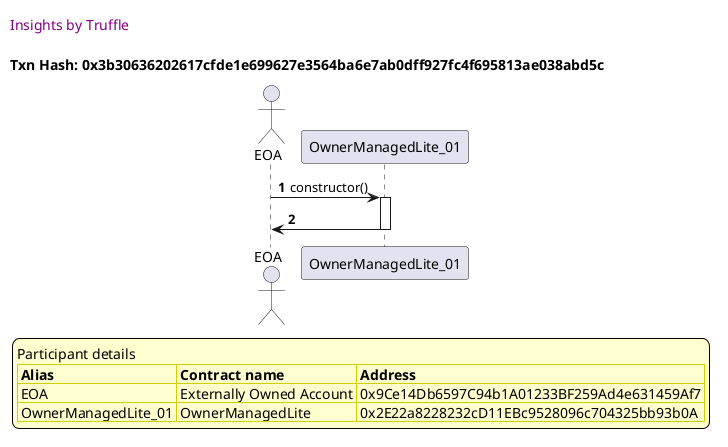
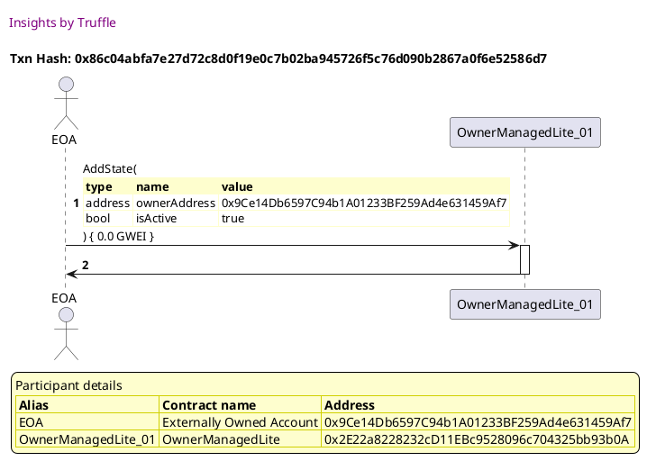
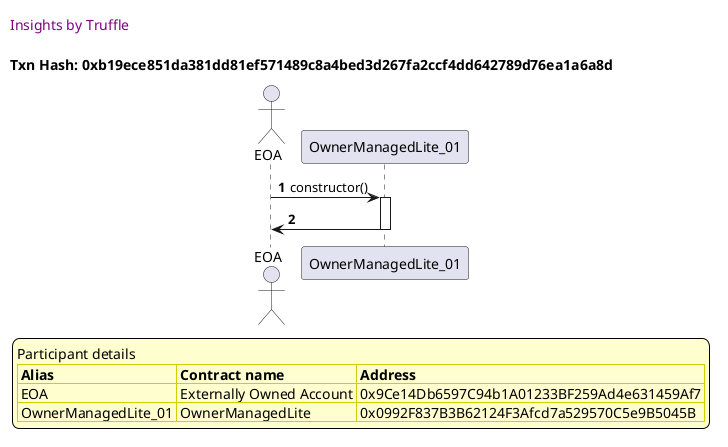
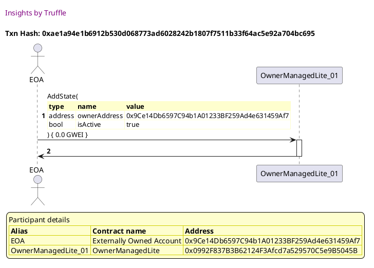
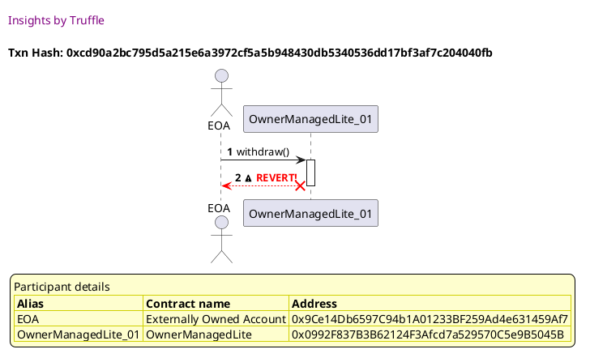
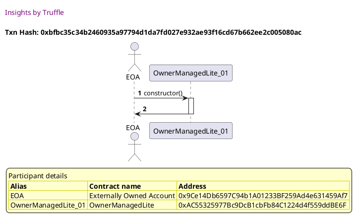
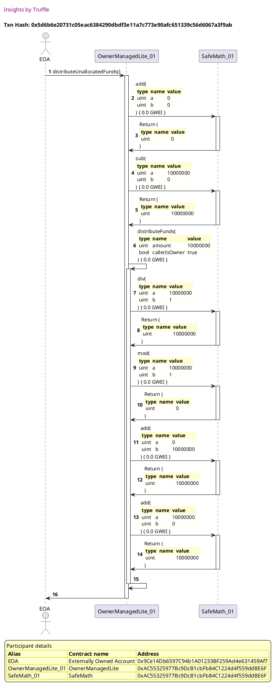
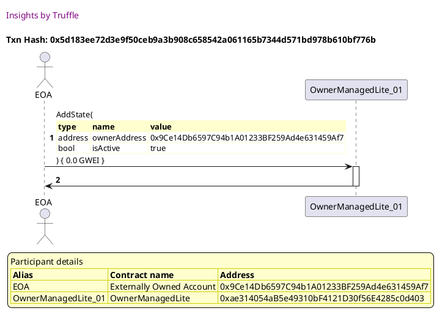
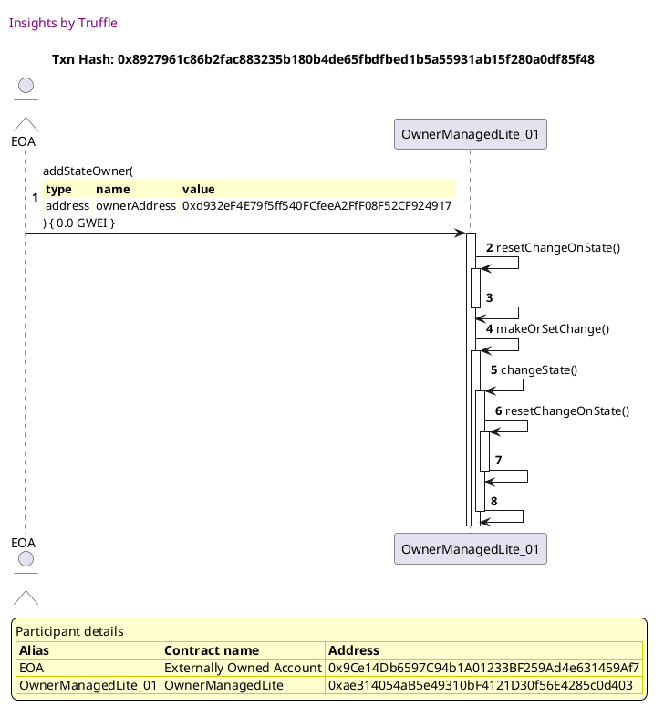
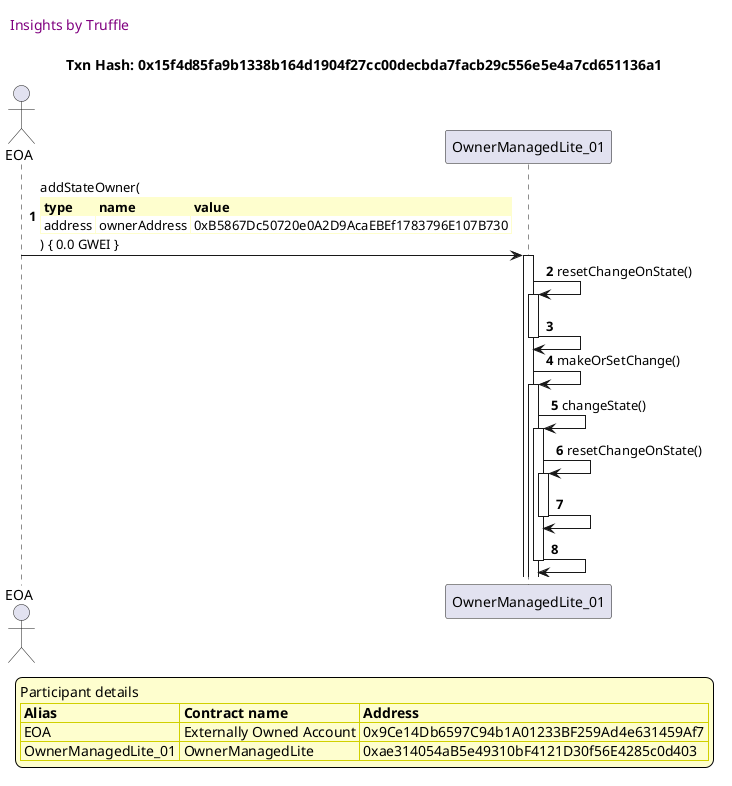

Test date: 2021 Mar 11


## Does not fail when data is sent with the value
[link to test...](http://github.com/thedarkjester/ConsensysAssignment/blob/7c5b2f21f354ab6c2adcbc9e6ca114bc570081db/test/OwnerManagedLite/test_withdraw_and_fallback.js#L19)

##### d1, tx: 0x5b21ad11a246e90911181fd2c8c9ca01bf40b77e4592eefa9e0ce980ff0743bb

[SVG :telescope:](https://www.planttext.com/api/plantuml/svg/RLBRRjim37tNLn3fouQkcEGujXLaGHqxGGTiQ87rVT25TeGwSY3BMD9r_px5CO8LYnvqEIGFoKCHSjzvuNo_QmWHlMzjlvFeIFTYx5uuiOC6QxHw9THBxThUwg9jMWStc_LcNQm9MNJ-sE2ImB2sA3Gw-3q-0HvQPrvRwqMJDwQsExG-C5R-uh09nZFbldVx1jyPVfXN11PVi2UXjR4rC3f2VuPpyNaiWepvlzhEr5lVWJp2i-khAl0IRto3y7omy22wxHpeOIOZ9ZHZ8eeJv9GpnZ9MwKXbYYj1cQnYAjCKuncF42l1aIha6QqgciPJAKcGJFbG-len1z7199mJ4cJpHfcz2Aq-_hBelWihQjJVZCUVb0sEL_098KCyt2sls-7sTWwgjPrt_IdhXu_akj-9uCnqDmT2pWCaJ_-KfT4BqtHaCOxnqqr9IqhfykqBX3c52iEb20DmeJ-mOeSd8DVQOHTibxZbsz1ws0yUdHLDSnnQrf0h5JwB3oPwu0Mok9J9ZAS5ZoNBAOkcqzKccl5SnvXCMH0uhzBtnDUa-nyT4YHP8MRn9ikOBl8IyvX7FAbApAXUHx9aagjibQGXdWGbHZt8VTZ3j_yB)


##### d2, tx: 0xf6bff9bc50b65bec3092ab7c72e0bc70ab8d052f1b8d14f67fb88628655f075c

[SVG :telescope:](https://www.planttext.com/api/plantuml/svg/bLFTRzem47_tNt5YBvkwRax89sAe8S1QQLChjT9UAarsx81Luo37wQ1b__kEa4PCusLvy9tlqx_VNGYvgXsphbbhGbZZAjEikRIaVb9cmonRWvPBQSIK5KzBMpL6v9MkBBnRp1VpV4x8k7OxBIS4scybcP0MNhihm7LbrKjb7DEPLakpbiPXnTBr0Gjq7ajk6hlHyY_7lNgHu0MzxOu9eSmIFDgPVhTo_Bbx1EdwtvXQBLUk1hw31zkK9TObJZajuM5hu9hLgn7GRHdnianv4L8UXLmMGvhwZCT5x4lAYvWodWWQ-gM7qWlAA2vvaaH-4eLXIUEm84XPuV3fyziCM0q3b0E2j3bLg0r3gBU_ZBJVcM5BARuf9tzIhmqyOnyGqkR3vUIy7oukHf09SU-Oa-yVpICPTrFusCd9_WkutKO2IiFMhNncka7b4Bu7fC_AkeOzL8S6MN-bspINNZ137j8uJmFkPTJpXyFfmW_JJ0Go6de1QcNyLefNbSP4LMU5Ky_O0PnzQ_G1Ne5-el3rn_m6HtGUpG7c4U_b20WvhXcvEo5FICUKhazWpkYCKdg0YTk4FAAIuvfOd48Fk0VLvqtsxO3mt3ff3TDwrmv6G5OKkDBkFmauBNnkmFzQsmPHahCmM2I99_9i9hCWzTEedCc4YhdFPnvFYsGQnPXFa8cE3tA59_wSVm00)


##### d3, tx: 0xe5c83afa0ec59c5c0866342fdc35257f3b3fae8a9bec1afc930bb4037c9d0450

[SVG :telescope:](https://www.planttext.com/api/plantuml/svg/RL9RQzim57xNhpWaUrmt-HgxPA6ExQo5ZHPMsCCOGvQE7L573hBCabx--yvS4rOMFPmZVUV-7J5srJjXtR1h6HE3wyomgz2o_a6RlR1Y1oqsQDHQo8V6TeDHUTTs5kQRSbFc9MFBtXrRN34OpnQ5GWjFqnFWkhFwiJDEj5ch6xD3uoXZxKuE6pA-fjmFTj_Y6yCt_OZWXIViJYYbJGCUdw2NKIy_JasmgVwDwNMpTJrKHxYtGrrJNkQqQn7k3mQkHR-z17x0I2Q1g0L76QKoaZo9uo3qQoM3o8yMTL05jS14f1LAJzGo3NXLXJnOo5JnCEACA9EEMYzlCn0zp4ZF6D7cjDHxGQFU_ZPelmeZ6bHVjCDVt1iTp-0pniPukFWnRooY-NcnEky8b_0Edi3xmE7pz_A6I62lIs9t_vHMw8HkUxQSLlL-Nl22Sxvw_WIq2-g2BZcHR6a6C6A7Vu5CAOizsKvng-TnF987XzQ8jZsEOod8fAGFuSZ43scENbXKSPGkyZIil8nxVX2iDtwKPYh4EF12kjMBjudFqVC_EXQ8arn4uIP9F9Ld1MPXwgTnNM32LUbNXLUbCbd72ufdnCJ41xiYIL_x3m00)


##### d4, tx: 0x0e76f3e010952a35681df8d10b4df6e674074e717f963c50bb111290f5666a4b

[SVG :telescope:](https://www.planttext.com/api/plantuml/svg/RL9RQzim57xNhpWaUrmtoHVPBbceOpjhOQE55VOmnf2jOyVKaOEiiAIN_xupruILHG_dID-vVqUCNGrEMRVVTeoflUlDVbkYPSD3QtRAgYrqsA3HArKzDBRV6vtrNMzXlYxMHLOmjXZSiSCbW_5iK6cqy3Gz0QvxspxsngakxTh6RD4uobYxayEQZAyfTtkxw_2DuLlxY2224tQdj6vD0u9FqCke5n-d9jXK_yOCRRDn0vH7kBVxkgQypBMkGxW_6BXMm-OI-85Z96iVkU19w2a_bB7GTQm5BmDTIvHHmAC08n7LYVIha9Ub4C9BU1rAALLGCgAiSjHwSPk26c16UiQ8DjTMxKxHgBU_3TglogW6zPVMuIykHiSp-8onCHukVimRYsX-NYpFEy8bl8Cdu1yuVFvUt109x7L9xEwVqXgTQhk1BQPLlP_dFEUSBvy_0Us2kg1BHYHRcW6Csk9V8DNQua2sKzpoUHoFvC6XDQhhZkDO6jAgeW_XoCGFIOOYo4iP9b6M1AL8kV1yVxNsmYJL0KfV17IhexU9pz7pFpeMa76cmc0TqugoDCSqIBn4rZd6N1TUcOiogUALZ2YU4HCJ7-oA97tjFm00)


## Does not fail when data is sent with the value
[link to test...](http://github.com/thedarkjester/ConsensysAssignment/blob/7c5b2f21f354ab6c2adcbc9e6ca114bc570081db/test/OwnerManagedLite/test_withdraw_and_fallback.js#L19)

##### d1, tx: 0x3b30636202617cfde1e699627e3564ba6e7ab0dff927fc4f695813ae038abd5c

[SVG :telescope:](https://www.planttext.com/api/plantuml/svg/RLBBRjim4BppAmZdqY8DoeT4cOPhHBPbf42B16Zk1HyhMOXC6HI5scdwxwLbmMXGwq1ICylPtLaYTDy5vKE_Qn1IVMXTlzFWKVTIkxtoQeSRgC3PfJ8lbMzxPrTjqtfyioasnQf0QDw5OmCBX8Tl2yg2nx_7NumVMb-_jYwe9c_gokt0XQXOXal09f9doNtlzmsy8txKhu1fSi6UbBMrgp0b8_HdsEUVnoBGcF-hw-fg6pgiZ_ZPzsKPTL6eGmFu-U3mW-gsCqmEN7CYk6242PgPqW858QLW6V1K95e9o9GcjYmboqgJb4AcKyeL43vLsgO6HSjCYAKNZpbM7Px4VOAYRQ4szLx5LXz_EV3VbLCLs6zrW9-43e5Ny0b2mtryjxZEuzlR6JQjwuBlJra_V4JNuqu2PwMx6KReF43qz4zP5eAgcmxDnp5-kbcJDI5ayVO5npd52kDX5GVWOt_OgHsSWDnQ3rtaBlSMRqFhSJq4y4urpN5esUBScFXOGgJ8GQw09cijKfcjPA9fJYZZVBbXgSnj0eBJ99xAxBtmDUl-HuS4h61CJHcRCixCcj9YQMJAfaGAav64irHhoJM9XQBenEW7kezhVFP_0G00)




##### d2, tx: 0x86c04abfa7e27d72c8d0f19e0c7b02ba945726f5c76d090b2867a0f6e52586d7

[SVG :telescope:](https://www.planttext.com/api/plantuml/svg/bLDBRzim3BxhLn3TPKFNJLRyBBgWJkAi1JQqG0liKc2G9JaHgiY1B7T9c_ttCQvhP5Wkyq6aABw-ZpGXbutdphShGmXlVMtRLQaSQHwrNNF7Ls3KGbavuU9nuUhMocbjQWVlviMyc1Q4N3H-QzIOGFSj5PVAmKj_1RYgdNwkhUScDtfXLyfwp5ZvmM6EZwyfrwrR6_NNmvr-LX24W-sMIwdj0WBQctvtyk9ptmJfwr_RHY-Mle5o2_UkhIhCIxpsHi7zni8LRvRdG3TfB6Z8ouedYYKoOIALj0eoHKLIKbRoB8mI5bUHI699CrgoD4uuhM8LiIYDPKAGCk6nzU8c1zx02SeJWhHvBVIQ8zIRNrQvxzpoXPBVj5S_QT0v7h6V4DB5mzdu-3kSdfv3BkMTvrwzVx0FvAAVmiTUZdTVm6_N2b1Qlkha4pSjAdlt7I1zJZKDxA3U5yY7AzraKnM4ipAEicIQXMMGqu2DHfCvYx9SXYeU1I5gLVAMggnhWu6woONNJrW1l7ihz05UW7wYyFL7SOqZEevc3_CLxzav4FAwPkJsW3ofFDUcEO0vepDAwHucRXFoYCeKryJX50R00wWXRhph1eJdnYjdkJ7RRZ0ISY5mfVr_4d2O-DY0_xLs1LZ164yPIzc8YLaG51EHHIobMImI6evOL9RPgAJOA44cUZx89PxuS_u1)




##### d3, tx: 0x10c3746845dfc4518a93a442ba0042be5b43454325ff7d9a6643c9241bc6ea09

[SVG :telescope:](https://www.planttext.com/api/plantuml/svg/RL9DRzim3BthLn39ZkicoR8J5rbG9t7M0XjQO0Ls68P1bcZ7g2C7ie8bRVVVnxf6i6BHWQGUANuyYh6hBcWVzjk6CRqFhTjl2_IiUwZTJdkzXGOhT7QXpKFbsxspoxPfFOpN-JfVvepDkd1iSCwWFnlK5Zqy3LU0wzRNZwqBkicQkd9RT84obk4Ki2RdQyhTtkyQVEFuLZyY27N2xhIrjQj0y07wq-lPnw49DjI_SLrTRK87nH7k_RuiAIyBTMWGxWyEhdMtkGH-4Dn44vLCLMnBes8nrMcabPA5vfmaneMALAmY6PVbnAOwILHaKgb4OHBKF6L4cGdKUdwRWUvWH7h4YBPGctgdQTJRtmxzL-rqXVPB7V0N5ttW6Np4MFyUBdwCAu_eVbxCpmV29Ro39n0VE7p-djyG2UnrIUpkdz8MWwwRZis6LRqVh_YASpv__WIq2-g2Z2MHx6a6S7gBBq1chSUEVATty-T-F9A7WDxffZdsOrd8ZA4F4SZ53-aIXLeLIPnEbgagHCQ5ZAB5MiPfPXKcaL1abPEtYS_Hyp_Q5v2vb7egvLH6qgo4o1ScZUMKfucPy9SL5KKQ5PmQPSJ4m0Ux8abV-oy0)


## throws error when balance is not linked
[link to test...](http://github.com/thedarkjester/ConsensysAssignment/blob/7c5b2f21f354ab6c2adcbc9e6ca114bc570081db/test/OwnerManagedLite/test_withdraw_and_fallback.js#L33)

##### d1, tx: 0xb19ece851da381dd81ef571489c8a4bed3d267fa2ccf4dd642789d76ea1a6a8d

[SVG :telescope:](https://www.planttext.com/api/plantuml/svg/RLBBRjim4BppAmZdqY8DIkfDmpKYoHPIe4K2DFTY9Qva8HHbK1Hgf-c_bvO5eq6j0qdDB6TtPqd8_M31sB5JXC1eUprs9HeolBHw3mOwgh11BJEeNXhJZrhclUeDlIcsnJRV4h8Qx57Xcj3fso58DFJt_4lfGs_QrrvRKAbg6zsXjawnjfU0mf5doVrezWhV4J_QLwGyk61F86Mh6yhP3FsPzjNdkGWov_-gXxRPsO6MH_finhfskiIsLY5zFcZw0CDkITcXv08hJ48kmK-ub0d7Eenva8WgWQ14wKilYclmggeEf8m2Bqw4Z2C43X4aaZZBAkjAtpwc50QwSFk2EDjiMxLxSAq-_j9eleE61kMtrk9FngV0A_Y2aEa-lLjVv-djxP9MlHwi6KzPFtmar-DE0cUbkoKbv3n0ylHFMH8jj6eWgtcCdsusRCCOMxzzeMvEha9toDq0ZEkFQkZm1AHI6XmSTxctVfjQT-l1ej6Wr75gMTAqgjnZiOvY1v4Z3pPb58eu5q79KyOztyyABnIf333oUU1ETVnU-9fr_wDJ0YQ4LoH-dFbPv74lAFoqhcGCeIV2cEKXYYnaGPYv1Cw9sGzoxrRtxFy2)




##### d2, tx: 0xae1a94e1b6912b530d068773ad6028242b1807f7511b33f64ac5e92a704bc695

[SVG :telescope:](https://www.planttext.com/api/plantuml/svg/bLF9Rjim4BtpAmRkfKMQbjHg6QuHUL4Je4K2940l0GfAf6mYD6LGL6edxhztB2k2Y_fI7JZ3MVdUZ0YvgXsthbbhGdZZAjEiSsb9_QJCXbk-1YsNqeWfBvwMjcgCc5Mwil0kMsIBsOAGSUrsMau8jDzASY4jl7PNWElAgfVAEAvJhPPcBOt3YgNh0p9q7ajk6hlHyY_7lNgHm8BUTiU5K6O9Z7QctwqSV-uUGRh-DwPMovMh8T_1WstA4kiIfvoMyB0rSCthrGZebal6aq2oF4gObuS-5JGQnh7FHKIzeHTuEHlIk8n3ndBVBwE05w5CF1xJ82-Y92H8MU7mwOlR57WD0vG3WhGvLQWDHwYtluoqtxdXIoc-AIT_KjO6dh4F26dpuN9otWyN5oD8XRXttCdtZ-QHZBifVEpaPFy5t6uZ0QNXwrO-SzsWSWZV0z9dPLt37gf3WxI_qcqoaooOvr6OnBCao5bAcUVxqymBarG4Cl9PW5ePlvNAgqfZeghJmgbdx03ElZNw0Az0Fr7u-cDnWoCwZ-O0yuZtSWI47DUCt9sG9wJZIjSdCETqJYazmCHjGXvHcU6QM9n23xW7rUTDzks0yDmwQGtNUjSEHa1Q5BZIxZy9E2ryRi3_Mji6D4cyREZ7KtyQUSmBCZyj2n7pq4l2cCvmiwOX3S8fDa0cEZx85PxuS_u1)




##### d3, tx: 0xae7c81543772c21d088fa9fb064d1014746bffd7316a9c2762d5ebe0d03906e1

[SVG :telescope:](https://www.planttext.com/api/plantuml/svg/RLBRRjim37tNLn397jTDicKxBhAWjXEl1JQqm0hiOHW6sQ8TeuuSo3AMzFBlurmZMB7eGPT3wf0y96DNlLFM3RkMCJMupWox0Yth7ngpLrRjeCKQZKvL-L3RRZ0wwzhEmZpVv9jimzYoTySMLmp6jKMbqSBJz0Iuxcpps1cdsgHjQhD3uuYnSYU7d8olbFl1xbjyO_ZMF288USBkbDQDgK7m2NePp-N7AGasnRynVLDlNG_54UxjK5N4orpZMeJxWu5hrMylWHyKHkL21DAF8g_qXEQBHQNYgk2Xr88B6Scmg2eT-I9KSUb5eQS3B91hxiSyHC58ij9HwflR15GFCpfdZ6HpJTdi5PLw-zkW_QgCgb5_QHp-uc9qF8FF61l_myMFUMqHpS-BrNb7k8Hty0Jy0v5z_hwv8HNOQvVOtJ-nDJhLj3rRJhrwFr_pDUTyzVm9g1cK1bqoKjbI4M3K3ly2YTOMUxAT_gsUn_feFpYqHhNjSQnBGrAMD16EJFmGPoZakWY3ECfYMOY42y_tqzmBuaHB37qXwLP5RudFwVC_EWRWSUpb2pzA_JJqX2TpFwbA7Qd0YuE8Pm76QS1ba580KcBIWrtHJhFz1m00)


##### d4, tx: 0xcd90a2bc795d5a215e6a3972cf5a5b948430db5340536dd17bf3af7c204040fb

[SVG :telescope:](https://www.planttext.com/api/plantuml/svg/TLDjQzim4FwkNw4bCBPqeVABuZfufdOIqy56InVsPOnnjcH7r963h3H9r_ttNHqJLfRP8CdFdPwxU-vCo7LhmTZjkYO4jhRHstKk3MaVbDw0WJMjPIMrIA5ug4oprMBMr8sXmsoHBMOBGgBM7ceP4zezAmb26lgh_wJqfZ7ggT4MwgHMbLvBRP6nj2U738r7oitMR6hvol1LFKdg-2Vi3eHGkg8Eww7VtHvTzacGFludtQfgPLkQ7-ZIRCiIUObLjfPqkTVq1jhLbB9z8K86Rbu48HSSN8VB2NXXu1Ob1vw7_fNlCP5ppsVScmZX17dfGHaKBlFnBNE2aXKMKr_S9XHQEi1zG50sgmgr0IprTgUb-G8QAYa-Aoj_CgTpF8CF2Edkqt5ytaulBgPqf-nA6DYzUq_EE-t7tuT6YXylB4UwyPH6RtTWD2eNqwWuzWzzuj7eVl5jSRzyCnf5bnqU4o6n9FK8Llulo-D0aBk_oXJIWgfR4lLZyM4uPtF6MFpyaMBViM8ypB2X1icfXhLy0H8XZ6pHTheNFtTIuhgtqcYewqCdeQ19KU3mMJInVJYJZZ_F9pmCPg6VEmbpNCzBCvU7YV3bn7DyF9N1Q-9phVWNxGAmC7IpAoz8lNJYEgwVUKbPY02u6_A0pRWCKyvydc80LABNWrpZYh_H7m00)





## emits event on fund distribution
[link to test...](http://github.com/thedarkjester/ConsensysAssignment/blob/7c5b2f21f354ab6c2adcbc9e6ca114bc570081db/test/OwnerManagedLite/test_withdraw_and_fallback.js#L39)

##### d1, tx: 0xbfbc35c34b2460935a97794d1da7fd027e932ae93f16cd67b662ee2c005080ac

[SVG :telescope:](https://www.planttext.com/api/plantuml/svg/RL9TRziW57tdLw3sPLDN3Mnirr4MrN5YTTAcLbhV9mpN3Yh14SPQqdN_VJUE5QrQUBZ0EPTplo3alW_IXs5h2P53wDomhS6J_iMudVHoIosquFHIgfVMTuFJPMSxJw-hTRKkruJC-t2mi21qN1kG6ZpzFLqfVUYyUUrSaBQmfdLRS04Lct1sg90yIUu6lxFmZlXXNe5oSSQUfDR6jPIp2VepxlFFKn9aYl_LzQRTX9xM1_hiXwP1NH9Ci42Vzuu-o7upesnVDxMA4nMBEX8fo-D4vbcM2ysrp1hDeWpoE99e6fugdMPrcaO0aM8iONTCAe8jKm5JNpyMLFRq2lShWcqBHfcTn58VVpdmtwMJBUXl9i1FnaV72_WL8UDxUhkupDERcnbLdUk37uvHFtmab_sE0YUbsnabv3H0ylHFMXg2DBOdyscCdwvNRCKOMxnzeJWdp10F9Gx0OttKoIqSWK9h3provtUBjx5qjFi0tabh3sF9cXPAuMS9IB5zNW8NgpfDygpCHSqBngCuNbPHaXTQG1fpWQScUozygNN_esE0eaoI6DMoRAdobLfoLLVrdIXv50ajcYJ9jLwkqme3O2UcVf1xjFZj_m80)




##### d2, tx: 0x6b36c39b2cbab60c3b657a7f91c4681017c5113ce31e4e319ba4bc4ae4e3e66f

[SVG :telescope:](https://www.planttext.com/api/plantuml/svg/bLDDRzim3BthLn3TPKFNJOg_wg0BwZZ9Mc132xJ0BWK6VJaLgiY1B7T9c_ttCOuRP5Wkyq6aAF5Hxv4cvB89t8TsOGdXRQXTkn3Qa-R9k2NtV05MpxLJOowVvhvkdIfhMtjuDvlEfkMKa8ichAqU4UY-HysLzl3QRm6kQczUQXUuBQoPkuLs0H6hiBymmyCTvBBrIwl_EhWpBnfOl8_TSgMCcmEZVUXtPoy-zuyWVVrhrvZvOsX0hE7UjrM5k2IOO3NShnnSyUPn27ILYYYLKIu6Kd2HKXc9DCbuLkLCnkaveooJ2MEHr17JCIwvuB6GCTzkT9fM12MJ0Py-lIc0Dt22zeIWRC58i-H8zUQNq_uxTtokrJSJz4_Akej7uYU4TFbmDZf-3gUdGoYKkWiywFSFxe5Sz5tusDlHvWk4zL83MiSNdNtcjaLdUtq3A9_NJGCRgBS5YlsMhl9IitY20kHPcSU25PGDecWy6oHveMATHYn6hyhUe4HTMqmqJI63USOA4FnReG_m2lGJXQy_fjVOekDijZHtVC-6GCXkpCZjWNXA1sviSq1pGYUKqYrDd2RK4PqInyHZ5_Q4zwJsUQDDro1SLq5xnwrTTurHK4Y98nt-Ku13u6CD_ZVQ5IZA98aGBSl6Cf_8CPDY9ixZaWq6iOgh9CcL6a_J6HP09Nezo2Mk-7F-0G00)


##### d3, tx: 0x8af4b2c57fbe3f6e83cd4e2abb4fd2b0338103688761c056985bd1e3c719aba1

[SVG :telescope:](https://www.planttext.com/api/plantuml/svg/RLBRRjim37tNLmZ97jTDyjr55jHsxBN0XXPOWJqCmw0BxHXrv42MiQINVn_d6i6AHG-w75A7v249kHgSi6xSTOI8qVLct4cmP7XepLvOiQCTD61qBjH3O_lHwABlUakNLLcLHKd8Qd373jQ4JciBGeEbJ_EJqklUje-zSQBBkhOnEp0E6MjtSgZG-4gv7-s-WpU6R-qZK1wSi3kXTMiQojaClKpdwkES19dZtvYXRRPkeF98x-rOryXBNEiweFS7Gw_5iBsax928Ef2U2kDQWbz7aFXA1-09AODQUvBvViAP7oL97775mYXDGgav-2hcgP224vHCEKozlCse6EW2pmL1sLohsht0Kcz_6x1VXH4Dw2-jWr-CJuvdy0KXqtzwyMFPM03pys9ztf5UqdVqYR8FIFRvUtc3Af3NBf6xVs9hSABj1hAQU_L-kM4RnjZw-HF5Pc0QU2bGPOj5K2Dsy1V8jBOmeEtqR_qyrOVxmO4rekkEKrsQPahXH3WqiKDQ00ysCWhJk4W3oJF6FT_FAozCCnGrydc0jpf-ItnEd__HAK1MXA6FR76SgtIZSgva9PEWu9uNwA0EmrJhl8mg381Ap7gGAznnjly0)


##### d4, tx: 0x5d6b6e20731c05eac6384290dbdf3e11a7c773e90afc651339c56d6067a3f9ab

[SVG :telescope:](https://www.planttext.com/api/plantuml/svg/vLPTJzim57tthx3O2uYnsSqNGQmYJTjHQGWqcFQ2D3csqrgaJkKuh8Nkl-ys3QM53i4OqjWi9TU-jkyzFjUo3a87XMN6biCC8LRQN9V3H1fKN2WzOeODSIRxKeiMunTzavTQn7cM6_ocs-bsuWv2-uMTPBA9SDK6aWbfy7KznFWmD-egrvPbKQRwUYYrXOYfNIpemkGyvAWqeqokJ9ogAucfk_2TC26KxcDAQjUFokw_hq6WEdzF5we_i0LE9lZCb6aASP5LDfFuRApn8Ii6UvYCFU4dlcoGmA6SU99ntzbr6o4HYKWTIIaBU10uCYGivRv77IVadYzyuWVCIKEM8A2CMu3UEOumA_06s0q4j5d5rOZ1KO-_QscEc6PzAJufAxyHMYrSur_TUCfIUSJiu6R3qdW3eIeHtcck3uItj_UmK8KrAYcj_A9PbkMSMIcwKBzYSmkjtpQBjvodYWECRvxhSxHVL_njRPlJ3zXEHXA3rMnOsKkMbT2PBP_YKi4nffZ1H-xuablV5hx6v1t17xzsUb3DrVo_FE3EpXx-B6rfD7uMk2KSJ-6aA9DdSqB9lFt5rAn2V8YXHzp2-TLx5cj3U7xi6kgIFC_0pU6QIzChAZ0mjkOcn5qc7rzfeIvVijBqrLNw7aF3NFmF3FqEDI_rTDwfrYk-F7-2eN__8PqXUM3FN0lCrg2vLaCdIq92ICjKLYp1RvCsO9d11qa6sW8wCMWj0r9cSP1822CBc5liQquhbGF_iPLc9YacbReHEEAyVfZ9E8mbTTk9xuL17Be9ZGXjE4whs_32IBZITwWBlJHO3RnE9TttLWcYsFCSY1O4BHwsUOlof9likZ5jD5pXffuN2j7g-DtL1CjgwdRqr810RKqmEe0_IEQV)





## emits event on multi-way distribution
[link to test...](http://github.com/thedarkjester/ConsensysAssignment/blob/7c5b2f21f354ab6c2adcbc9e6ca114bc570081db/test/OwnerManagedLite/test_withdraw_and_fallback.js#L51)

##### d1, tx: 0x21da19623aa444066011c2e0c5176ab3fc738e8712188e5ba1aa6a75c89668ba

[SVG :telescope:](https://www.planttext.com/api/plantuml/svg/RLBBRjim4BppAmZdqY8DIahKot2Do2-aG8i4QEx5Ibp9H6JAe2ZKJjD_xreMZ0Qr3YGrkvpTdI5Zzvq7v_jTmnZqlhNzha37kXTZz-1WnnkiqUe5b2-rQtkhbstJEdwpMM_MopLZiyuV6vmpFdnR18sE_nv_ENzedNbjhOScRqnjTsWzCLR-ah2Xu9botxjzW-y2FymhSgaks1DeRMpDfHYXFyC--pmsmSRwNsrdwgtlU77apwwlAk9btlW6-VF1yWVejbCk3e7K8BCu206KKYAEXPHbWAACP1934LPb4gQO9ZAGQOfH0H8WXYGgqooEqm8OILPwQdtzc7Fe-8Js2IFPl2dD7cZKnryMtNUmKAF-PZp-5798l89F61lkyxlvzJY_lPtoihMTT_sfweUFx7hUYU3CT3VbZ9qDP4__jANHWsawDXjj_7Ip4YiXnFpj2oUVg4CwBCa0H_Dn2piy0RdM3ZkANUxDtuRHQJruT1QQvZYCh7bUblHOF8N48LkYLAiYZh9acQb2va86ORZO156MQuLnA1MTgkGzyJNf_aU70e148I85YmXL5afHR1HvjWf55SLh5QHHARGI8HKW9KOzs3sjzEp_0W00)


##### d2, tx: 0x5d183ee72d3e9f50ceb9a3b908c658542a061165b7344d571bd978b610bf776b

[SVG :telescope:](https://www.planttext.com/api/plantuml/svg/bLFTJzim47_tNt5YBviOczquIODOHUZ7GDe44aXxGPgS-58iNATo7DP2zx_l6aBLQNrP7dpd-_JlTnV6pfkWV6WNbZ7LXjgrYm8zQnwDMogl5c1nZavVgF9nxklMwN5jQm_lPjFPT3nbxAm9QuiZ1jttW4gZXvV-2d1PU_DSkw1iRitSBT05gbY5NS2CdAybbwrVMlpBSMkU4OJSsMwKriRDGV3UzBkJPv_xHx2-_vLhpFmXD52iuSwtLKLrMJ318joj75ogvk4K-2hMOXWXfWCTOLR5lCGYKr6HyM6PnCDO3XHFX4ZY8esar74g2fsbmo8HlAZID2aOKLO6UlhqEWVLm1798qQq1LEQfIAerxyS-k_AgJdgRoRWJowwm0Fs8yQwV3WP7VR3yV4fv5hV1XNm_RsxPsVz53xsShJv0c6zH23frAAJJygsf6p3Dq3qUMmQs42zRP3lhdoLZL78IP74MJhEP25oBWPHT34Rn5ck9IQHaAHLwLkfeguj9PecBuDveWuG_5kZ3_02_1E7hp-cLpIYmsYsC5_ndfm2OwzhncxsoDCObB7D7im9dt3Ejp1fcuX7KiQq9fwci0Ey0xNB6ssw0T6v2kYTidRT3KP3NfQqqk4_2TWlV6Z0_rgx1Wgf18-bkeXHPX4jqKoAWPX4l8gJgHmCuv9hoIDgG4pqVB1pEkdd_0C0)




##### d3, tx: 0xf50e6e51d10749093a8d0dcebc843163931e355050a7d56bcf6335f09b7e72d3

[SVG :telescope:](https://www.planttext.com/api/plantuml/svg/RLBRRjim37tNLn397jTDYYGxBhAWJkAi1JQqm0hiOHW6sQ8TeuuSo0gMzFBlurmZMB7eGPT3wf0y96DNNJ0-xBSDOsOVMhVVvkXPzr2xdV5c2mrMwEp250-LR_VEBjkczJ1UP-jicJ4swyAnmJc3VctGMFJmD3m1hbjVFxOkc2PjwifjqGLYBCF9OKt6LyhTtkyQV6FuLZyY27N2xeorjQj0y05wwS_Pno49DiI_SLrTRK87-H7k_RuiYPU5EZG8zmS7rwRRN08_b9fZX5fOmMELy4IQgUMsmBoOAYaYcKY1KckkkOcjZlAYZAJK9K_o6EE9bOmaAmAbdjscO3eOqJbY95keYtfdgDJRtmxzL-DCXVPB7V0N5xtZ6Np4MFyVBdwCAu_eVbxCppl29Ro39-0VYEppz-o6L62lNM9t_yIs64pTT6mszEhzUCLNdFFvyoUWPb0QT5cIofwA06Us-1T8hVNOaUtqR_xSrqVx8Q1tfccEVLqMqgAWYGXaueTaYKAjyaWdyJ9HkKYvc4YvM4zqabg5aHIARcNyblYSFl-ZVG23HC6rCWkDYZh3yxKI4x6IlDHHfYPJNN2hkAG0fCIW1xkYdMRx3m00)


##### d4, tx: 0x8927961c86b2fac883235b180b4de65fbdfbed1b5a55931ab15f280a0df85f48

[SVG :telescope:](https://www.planttext.com/api/plantuml/svg/nLHHJzim47xthx3O2uYnsOdT9eXLX3GPI9kA1D9Ua2OdFgSHgLCvpjP2zz_dcgm2hPe4B_E3ppxVVNS-VsU4pZihZEqN3KAYjwtk5mKOrDtNUYcCME06Aj3oGfJtbMbxBTEsQGr-bsTvbcO8dNLstS04OJ_c82GO_3XiCRviJVtGQYkQfAahlG1j7QAoEuFS7Jv1BdkpRE35mKtz09YodUvQI5dh2bCog7vvUVPnI08DyQzqLrTps-5YZMzDhvJ3HRQs3U3RbSQNefkVOhAAuc0SZsWPZOf0YJAAmY3a1Or8mIICk2gaAa3IWWlEuv2AWd8LH4GGgIAkM8HSoKhhKizc2HOTFd3o0BcosRgiby9TTVPJW_agjAX0VgajV2VK6-xH7o3a_V79PFyvFZu-nQu0DrPOy0Q7T_eEdGrFyNwGayqdRDTBm4vgiV3oXsXwjzYQRxOG1heERt2x1KbsMxAISHX0ph9nhBXId94yLG19aAkSH3aFqZmEM4p7Jr17-16J3mH__fPTkPVOd_G_R-C2WqtdGbSmq_vUXqUlnJavESLlYRqGzp0pDt_Ylpxm5gJqlc_C_7zMmFkWfzv6ryyOAy6AkkcUqMfAfeIGBQrS2plokaNgUjCuwky8jYFHpc-oyLtXvfK5eqNJh7qtI9oKfVj7h2TSd09bqsB4ut4Qiu8cX0PXU947F4uaWr58cLkfyKlWVLtrjzO74E0W26VYWWDpFKoAdD60JaEY-2XZGSHB8Xa9NG1NYQ4UwDpDxaVy3G00)




##### d5, tx: 0x15f4d85fa9b1338b164d1904f27cc00decbda7facb29c556e5e4a7cd651136a1

[SVG :telescope:](https://www.planttext.com/api/plantuml/svg/nLHHJzim47xthx3O2uYnsKcSD8XLf6qwa3OLgKXxGPekzYMDI9tASROMkly-DsGLQDKaU9aVVFRvxhlp-JiJSjbOCBPTLeH0QslTBZCqfBalzGeCB6c51Mer0dbVcBhLQbnNjQ7lfkaq7QU4N3HsK-6Gq6ui41GQ-jXlARsgJVbGQmjLKfM5NgAs3Z6tUuEfEto2NBLcLU6BWtdvW9G7UzqDA5NgWdBMgtvryk9ZdmJfur_hfYmMjg7PXjwQDiyTBh6bhP3UhZMzWcPnJjcQYpnG0v53d77V7sGy31IFMP1xaPICAPIPWYW7cNcn5294WG54KeM2Spy4Jbp9f7MffxE4GaEFd3mYhcosbEKAt5LdFpMQhw2XGFMbjFYTySxmWFw8aCwVdWqFdzFJqtFg2Z2tOB4pEBxJT-IYVuhtlHnkFr6xMI5rKiEoap-WQjrYPxxTGHXi6hgbzGuasM_PUYG6OJIHWaKUGvPuapYHa8xId4S3Fuh3bBDe5Fdi2Ug4FbBsWT7Ftz9hznA7a_xdRLnWjEC5w09dkhlNySbhSSxEpkbROY_X7cTc_YV-wmFlG6Jd-yRC_sS5EX_orDlavXbZ5Leeg-OPhIPimXZRqSgri2ElMunTRnf7_Jt1zYJQ-mstNLUuUMtHQAYgJTSDYYPIkd_4TeIBnyY3IHQAE1h7GSOJnZtV7qqz4ISgmD3dWLlbqKlWGrtrjxOB0EWWc0XWv7etzZdBfW7t-CHdkGZJm1i8oLJ0V1V0LQAl1xbqi_iHVmC0)




##### d6, tx: 0x5c1c2a53005462d84d906738532b77f8144adf866239bcb0db0ab5fe2b3f6292

[SVG :telescope:](https://www.planttext.com/api/plantuml/svg/xLTjJzim4FxkNs6nBw2DpSvR6yGgIby6qX1eCEqBqcJ7JckHE9NZi1Qw_xvh6ah32cA3ITs6fUJiitrtViwvw45eBxVCs29D46A5pNIHScbGVg7qY1cMuaGEf1RxBBeOcApGefCbcS6l-hr-hzD3Q3UtaqIs42xRK38X3RwkXXWVP4PTPTgof9seWKwbjc0njei5VPYScnmLPfJ8siIfkfAOUWlT2HD2wG6cf59zB-Nkkoe8LFa_rBaQ36sE-GIVcIAEmIwooYOIduqrFc3vS0UJiH_Ho66-IuZl1OveUY8aGSDj-gx36usuIJsFYRWP18uRyeWJmGdZVYmTxiQ14pe888iiXDuxRcEMumsG6mXWiofI8mP7FVwcfJbYcWsa-AYi_4fekN25lhxnbCNoYDdXpOQbyGP2fIEytLfj2Bz-lOE5ogrHlB3oisP9aaNCIj67_EMRMsZrjfczPJ-b7K1yyroVezqgusygsPg-ntOoaXYaPcafBrbIG6UsV8eB1SUOOWOFkQFZjxejV8t9Mu8_VEaTGZRh_kyzuFRs3luaRM4qVb9mIt6yOFA2oNDZaXVyoPXGCczh34qzn8SGUaIrcfUe9w6Mmc_Ahe2EPra2wWZAeJI7UHaCZAsvCN4NoSTdMgZBFvbfTqqoxSxRRtmAQIR-1u3e6bNEUhB-tglp7FZKlDTGeck5Z_ToVzRo_ln3-DmRo0DxvdHZjWRDwI0wMU8gGbgcadmf-YxfGfsUHG-i3-WBT3f0vmomfSKvsa8OcSFSObzhMX8fU8-jD3FMCYa9bC3jAAh-wMGSTYJrkZpmmqOdz3Xj4-guxdxVySEsy6JWKWzwSQDkU1KH-rbREc0IJ00ZPFk-z4AN4jxtg4ExBedzeESvJJyYmYDktS4oORiT_Qf1WBO26Et16rZv3m00)


```plantuml


@startuml

autonumber
skinparam legendBackgroundColor #FEFECE

<style>
      header {
        HorizontalAlignment left
        FontColor purple
        FontSize 14
        Padding 10
      }
    </style>

header Insights by Truffle

title Txn Hash: 0x5c1c2a53005462d84d906738532b77f8144adf866239bcb0db0ab5fe2b3f6292


actor EOA as "EOA"
participant OwnerManagedLite_01 as "OwnerManagedLite_01"
participant SafeMath_01 as "SafeMath_01"

"EOA" -> "OwnerManagedLite_01" ++: distributeUnallocatedFunds()
"OwnerManagedLite_01" -> "SafeMath_01" ++: add(\n\
<#FEFECE,#FEFECE>|= type |= name |= value |\n\
| uint | a | 0 |\n\
| uint | b | 0 |\n\
) { 0.0 GWEI }
"SafeMath_01" -> "OwnerManagedLite_01" --: Return (\n\
<#FEFECE,#FEFECE>|= type |= name |= value |\n\
| uint |  | 0 |\n\
)
"OwnerManagedLite_01" -> "SafeMath_01" ++: add(\n\
<#FEFECE,#FEFECE>|= type |= name |= value |\n\
| uint | a | 0 |\n\
| uint | b | 0 |\n\
) { 0.0 GWEI }
"SafeMath_01" -> "OwnerManagedLite_01" --: Return (\n\
<#FEFECE,#FEFECE>|= type |= name |= value |\n\
| uint |  | 0 |\n\
)
"OwnerManagedLite_01" -> "SafeMath_01" ++: add(\n\
<#FEFECE,#FEFECE>|= type |= name |= value |\n\
| uint | a | 0 |\n\
| uint | b | 0 |\n\
) { 0.0 GWEI }
"SafeMath_01" -> "OwnerManagedLite_01" --: Return (\n\
<#FEFECE,#FEFECE>|= type |= name |= value |\n\
| uint |  | 0 |\n\
)
"OwnerManagedLite_01" -> "SafeMath_01" ++: sub(\n\
<#FEFECE,#FEFECE>|= type |= name |= value |\n\
| uint | a | 10000000 |\n\
| uint | b | 0 |\n\
) { 0.0 GWEI }
"SafeMath_01" -> "OwnerManagedLite_01" --: Return (\n\
<#FEFECE,#FEFECE>|= type |= name |= value |\n\
| uint |  | 10000000 |\n\
)
"OwnerManagedLite_01" -> "OwnerManagedLite_01" ++: distributeFunds(\n\
<#FEFECE,#FEFECE>|= type |= name |= value |\n\
| uint | amount | 10000000 |\n\
| bool | callerIsOwner | true |\n\
) { 0.0 GWEI }
"OwnerManagedLite_01" -> "SafeMath_01" ++: div(\n\
<#FEFECE,#FEFECE>|= type |= name |= value |\n\
| uint | a | 10000000 |\n\
| uint | b | 3 |\n\
) { 0.0 GWEI }
"SafeMath_01" -> "OwnerManagedLite_01" --: Return (\n\
<#FEFECE,#FEFECE>|= type |= name |= value |\n\
| uint |  | 3333333 |\n\
)
"OwnerManagedLite_01" -> "SafeMath_01" ++: mod(\n\
<#FEFECE,#FEFECE>|= type |= name |= value |\n\
| uint | a | 10000000 |\n\
| uint | b | 3 |\n\
) { 0.0 GWEI }
"SafeMath_01" -> "OwnerManagedLite_01" --: Return (\n\
<#FEFECE,#FEFECE>|= type |= name |= value |\n\
| uint |  | 1 |\n\
)
"OwnerManagedLite_01" -> "SafeMath_01" ++: add(\n\
<#FEFECE,#FEFECE>|= type |= name |= value |\n\
| uint | a | 0 |\n\
| uint | b | 3333333 |\n\
) { 0.0 GWEI }
"SafeMath_01" -> "OwnerManagedLite_01" --: Return (\n\
<#FEFECE,#FEFECE>|= type |= name |= value |\n\
| uint |  | 3333333 |\n\
)
"OwnerManagedLite_01" -> "SafeMath_01" ++: add(\n\
<#FEFECE,#FEFECE>|= type |= name |= value |\n\
| uint | a | 3333333 |\n\
| uint | b | 1 |\n\
) { 0.0 GWEI }
"SafeMath_01" -> "OwnerManagedLite_01" --: Return (\n\
<#FEFECE,#FEFECE>|= type |= name |= value |\n\
| uint |  | 3333334 |\n\
)
"OwnerManagedLite_01" -> "SafeMath_01" ++: add(\n\
<#FEFECE,#FEFECE>|= type |= name |= value |\n\
| uint | a | 0 |\n\
| uint | b | 3333333 |\n\
) { 0.0 GWEI }
"SafeMath_01" -> "OwnerManagedLite_01" --: Return (\n\
<#FEFECE,#FEFECE>|= type |= name |= value |\n\
| uint |  | 3333333 |\n\
)
"OwnerManagedLite_01" -> "SafeMath_01" ++: add(\n\
<#FEFECE,#FEFECE>|= type |= name |= value |\n\
| uint | a | 0 |\n\
| uint | b | 3333333 |\n\
) { 0.0 GWEI }
"SafeMath_01" -> "OwnerManagedLite_01" --: Return (\n\
<#FEFECE,#FEFECE>|= type |= name |= value |\n\
| uint |  | 3333333 |\n\
)
"OwnerManagedLite_01" -> "OwnerManagedLite_01" --: 
"OwnerManagedLite_01" -> "EOA" --: 

legend
Participant details
<#FEFECE,#D0D000>|= Alias |= Contract name |= Address |
<#FEFECE>| EOA | Externally Owned Account | 0x9Ce14Db6597C94b1A01233BF259Ad4e631459Af7 |
<#FEFECE>| OwnerManagedLite_01 | OwnerManagedLite | 0xae314054aB5e49310bF4121D30f56E4285c0d403 |
<#FEFECE>| SafeMath_01 | SafeMath | 0xae314054aB5e49310bF4121D30f56E4285c0d403 |
endlegend

@enduml
```


## fails fund distribution when not an owner
[link to test...](http://github.com/thedarkjester/ConsensysAssignment/blob/7c5b2f21f354ab6c2adcbc9e6ca114bc570081db/test/OwnerManagedLite/test_withdraw_and_fallback.js#L65)

##### d1, tx: 0xc6ac1b680202a11ddb1c6a8b35e91b181068902250cb33262f3f0158421f7a29

[SVG :telescope:](https://www.planttext.com/api/plantuml/svg/RLBBRjim4BppAnREfKKQbAJUXcj4rWCfq281cdj1YPHCHAOCYaBjDFtthcN1Q53hG58pozdTMH9oFpXXtRZh216ZwysugvGbmuisUs753ZhLAYCtedvfRJyQcVLTR-6cBCeYAmXP3UxOgJM1wTig8PM5t_Clm4DlzMjldEZIJhTcfun3nSPT0aeapvBxqUuxzOxueLyLCF-2FGafjMc1qHdwC-shptCHPCx_rGowtRe1gYCysx5fK9SuxJe5pmS33sBOBe4Uwb3Kh0fZoYaNZ4bPCOJYoWjKmYeMCnh62UKye7NbUJpaZTTG5iG-PqqaU4BGijfXwSLZ2cA01UuBWhOvNUkzm5OVVnbblmiZMYM_QQT-KZO5Ni4NX4ptuMvzdOVRsoNKlHcS7KzPFtmar-DE0cUbkoKGSXuWUVgdBAcSqDr0LlCOFztaDAUKhj--0Cu9AyH3XWEms1yOiLCd89NIgW6voxtrszGwhWUdh15TTvnQbf3MDJuMXnGz99bYVbw5GH9bYL-nb3BkUPkI1qagVHLwpCTJ4xqNlcRT_-YK8CrOmalknn7APxJCcGYB855UHgDD8YaFl3o8Q8u9q8dP3tAFApxxlm00)


```plantuml


@startuml

autonumber
skinparam legendBackgroundColor #FEFECE

<style>
      header {
        HorizontalAlignment left
        FontColor purple
        FontSize 14
        Padding 10
      }
    </style>

header Insights by Truffle

title Txn Hash: 0xc6ac1b680202a11ddb1c6a8b35e91b181068902250cb33262f3f0158421f7a29


actor EOA as "EOA"
participant OwnerManagedLite_01 as "OwnerManagedLite_01"

"EOA" -> "OwnerManagedLite_01" ++: constructor()
"OwnerManagedLite_01" -> "EOA" --: 

legend
Participant details
<#FEFECE,#D0D000>|= Alias |= Contract name |= Address |
<#FEFECE>| EOA | Externally Owned Account | 0x9Ce14Db6597C94b1A01233BF259Ad4e631459Af7 |
<#FEFECE>| OwnerManagedLite_01 | OwnerManagedLite | 0xAC192F248794bC0FD1a6E59e3C07B9d0253D570D |
endlegend

@enduml
```

##### d2, tx: 0x551b130fedb645638e75c1244159729bbb25917a767aae83a317e8ec40b82c2c

[SVG :telescope:](https://www.planttext.com/api/plantuml/svg/bLDBRzim3BxhLn3TPKFNJV8ZZeikgEF4Qu4DBT02knGOP8j9X2fo8CjTqcR_VOph1XcMotmGAJxrVQGPksoyTBvT6iPawslRBajqh7dKTYMTN8B1ELerbjNZtDMjLNbjQWVlYcanpQUCNJH-Ot34eFiMA1KwUEcl05Urqy-rzT9aHi_j4gsdYZE_3oZ8-LforRgLmRyST_ePGKHxswrKIjiv2DwRVdVoudF_2DRtlxQDdYzy0-K6xbqxcr5TvhKt2FTh2rUoMPm3NyUnA4N8PwZAGHGFmY4cSIM2A19ncWHfMPP1d8f49eD4IXo6CXG93h6AU3aCgg1YH5dbwUdJcmna0oSaJnZHvdMbLvAWtloowBvBA-UelccFFxde0e_OJnZhyk5iTDmFfwVda2brvwN7zm_sWLtqK_ZOoz7s2_ZD2e6abSjEFadJah8BtmBHvx1fO0lrha6sl_9rcgE89kM0aETfL8gCYo0CnmKnaAa81w68I9ibRwNAkZQKg9kiylg9Ee1tRuq-m0lmJno-_fXUquYEezd1VCLxTWwClQuPkpqWJw6NsZG7C2TymZdVmQHj8Xv9oMbD74rX3tWFQfytsdO3edFjqLbfpAORZ8AigcYb_NyIS5Zus83_jNODiboaGH54muJAvxoO23cOnYc6EK_6gU9174xYX4-e0J7Hyy4kwQIVymy0)


```plantuml


@startuml

autonumber
skinparam legendBackgroundColor #FEFECE

<style>
      header {
        HorizontalAlignment left
        FontColor purple
        FontSize 14
        Padding 10
      }
    </style>

header Insights by Truffle

title Txn Hash: 0x551b130fedb645638e75c1244159729bbb25917a767aae83a317e8ec40b82c2c


actor EOA as "EOA"
participant OwnerManagedLite_01 as "OwnerManagedLite_01"

"EOA" -> "OwnerManagedLite_01" ++: AddState(\n\
<#FEFECE,#FEFECE>|= type |= name |= value |\n\
| address | ownerAddress | 0x9Ce14Db6597C94b1A01233BF259Ad4e631459Af7 |\n\
| bool | isActive | true |\n\
) { 0.0 GWEI }
"OwnerManagedLite_01" -> "EOA" --: 

legend
Participant details
<#FEFECE,#D0D000>|= Alias |= Contract name |= Address |
<#FEFECE>| EOA | Externally Owned Account | 0x9Ce14Db6597C94b1A01233BF259Ad4e631459Af7 |
<#FEFECE>| OwnerManagedLite_01 | OwnerManagedLite | 0xAC192F248794bC0FD1a6E59e3C07B9d0253D570D |
endlegend

@enduml
```

##### d3, tx: 0xc4192ca1778249c5a6203ee325d0e794c724f92ebc805bc5e4352bf0d539023d

[SVG :telescope:](https://www.planttext.com/api/plantuml/svg/xLPjJzim4FxkNs6nBo36vhmr1B6Aa3O3QGWqcFO5QNBYIskHE9NZG0lTVzyrBILbtGH3-p2DICdvphuNFsSv3o47bU7Qr4LE2AzDgUeY0KsgAwb6NFE2vZ009GvvUZNGPQr4LEQbfc_YVjoF-eJiLsQIGvVGvXa25w3ftKAbzAZKyhPKXkTXBWUg06KmOcQM2sASd8SSrNgKmyh4kRm5QhbBsnaNGge1jTZ2zBsH--yNHP15_cDLoS7GL3IPq0jTPnd69KQQ7EZ5MD4ZNWttA1kdhXNOARTyVzTsWzJZ7Piv08xj2GP-uAQ-xMQ13KcwoxmazS1rF3l9cF2SWDcE80XPQh3q_cb8UKKtK6uGXCt8L8uuRlNqHe4-uOeFG7oI1hungrcunhxgUCupEE5cUE_GqZS8QHBHdUxwG7HxUuyAMHajazh05yNpl4ov0H5Z_whDBRBURHQldQU9WuXlNgfBih_e-Dk5x4u_K3CP0KMfUD78QvxNE9Wjdz9QuZQcbEFB7jcI1ziMlQFi7QCVl_QFiPkh-N-vmPsTFVePJAqLVL5nhJgUWqbL9_yx9ayuT_F3zYAS2hnmJ1kif2npr5CyqQ2FgwOAr8s-ztsCtTERAkJrNscgzGyVzA8KhvYyNeYlcFpXXJWhuJS-yx_uR0sPionorg800WoNUTMgkyTwZB5PtKYca1NW84AMf964B7SG2g6XmhcbNtVQy1FyZWte6HcODBn4q31Dxo_OSH21vVQIZXVuKU0cLiWist4EOziBGk52nx5S76N-Qk1r_EPdQvCWZ91inRQxYyGgYLZSitYdxmNWHCm_30IpFQVd-Qotcg3DWnwqvmP4Q1S0amFy8jdz0G00)


```plantuml


@startuml

autonumber
skinparam legendBackgroundColor #FEFECE

<style>
      header {
        HorizontalAlignment left
        FontColor purple
        FontSize 14
        Padding 10
      }
    </style>

header Insights by Truffle

title Txn Hash: 0xc4192ca1778249c5a6203ee325d0e794c724f92ebc805bc5e4352bf0d539023d


actor EOA as "EOA"
participant OwnerManagedLite_01 as "OwnerManagedLite_01"
participant SafeMath_01 as "SafeMath_01"

"EOA" -> "OwnerManagedLite_01" ++: distributeUnallocatedFunds()
"OwnerManagedLite_01" -> "SafeMath_01" ++: add(\n\
<#FEFECE,#FEFECE>|= type |= name |= value |\n\
| uint | a | 0 |\n\
| uint | b | 0 |\n\
) { 0.0 GWEI }
"SafeMath_01" -> "OwnerManagedLite_01" --: Return (\n\
<#FEFECE,#FEFECE>|= type |= name |= value |\n\
| uint |  | 0 |\n\
)
"OwnerManagedLite_01" -> "SafeMath_01" ++: sub(\n\
<#FEFECE,#FEFECE>|= type |= name |= value |\n\
| uint | a | 0 |\n\
| uint | b | 0 |\n\
) { 0.0 GWEI }
"SafeMath_01" -> "OwnerManagedLite_01" --: Return (\n\
<#FEFECE,#FEFECE>|= type |= name |= value |\n\
| uint |  | 0 |\n\
)
"OwnerManagedLite_01" -> "OwnerManagedLite_01" ++: distributeFunds(\n\
<#FEFECE,#FEFECE>|= type |= name |= value |\n\
| uint | amount | 0 |\n\
| bool | callerIsOwner | true |\n\
) { 0.0 GWEI }
"OwnerManagedLite_01" -> "SafeMath_01" ++: div(\n\
<#FEFECE,#FEFECE>|= type |= name |= value |\n\
| uint | a | 0 |\n\
| uint | b | 1 |\n\
) { 0.0 GWEI }
"SafeMath_01" -> "OwnerManagedLite_01" --: Return (\n\
<#FEFECE,#FEFECE>|= type |= name |= value |\n\
| uint |  | 0 |\n\
)
"OwnerManagedLite_01" -> "SafeMath_01" ++: mod(\n\
<#FEFECE,#FEFECE>|= type |= name |= value |\n\
| uint | a | 0 |\n\
| uint | b | 1 |\n\
) { 0.0 GWEI }
"SafeMath_01" -> "OwnerManagedLite_01" --: Return (\n\
<#FEFECE,#FEFECE>|= type |= name |= value |\n\
| uint |  | 0 |\n\
)
"OwnerManagedLite_01" -> "SafeMath_01" ++: add(\n\
<#FEFECE,#FEFECE>|= type |= name |= value |\n\
| uint | a | 0 |\n\
| uint | b | 0 |\n\
) { 0.0 GWEI }
"SafeMath_01" -> "OwnerManagedLite_01" --: Return (\n\
<#FEFECE,#FEFECE>|= type |= name |= value |\n\
| uint |  | 0 |\n\
)
"OwnerManagedLite_01" -> "SafeMath_01" ++: add(\n\
<#FEFECE,#FEFECE>|= type |= name |= value |\n\
| uint | a | 0 |\n\
| uint | b | 0 |\n\
) { 0.0 GWEI }
"SafeMath_01" -> "OwnerManagedLite_01" --: Return (\n\
<#FEFECE,#FEFECE>|= type |= name |= value |\n\
| uint |  | 0 |\n\
)
"OwnerManagedLite_01" -> "OwnerManagedLite_01" --: 
"OwnerManagedLite_01" -> "EOA" --: 

legend
Participant details
<#FEFECE,#D0D000>|= Alias |= Contract name |= Address |
<#FEFECE>| EOA | Externally Owned Account | 0x9Ce14Db6597C94b1A01233BF259Ad4e631459Af7 |
<#FEFECE>| OwnerManagedLite_01 | OwnerManagedLite | 0xAC192F248794bC0FD1a6E59e3C07B9d0253D570D |
<#FEFECE>| SafeMath_01 | SafeMath | 0xAC192F248794bC0FD1a6E59e3C07B9d0253D570D |
endlegend

@enduml
```


## emits event on withdraw
[link to test...](http://github.com/thedarkjester/ConsensysAssignment/blob/7c5b2f21f354ab6c2adcbc9e6ca114bc570081db/test/OwnerManagedLite/test_withdraw_and_fallback.js#L69)

##### d1, tx: 0xbf273afe00bc4b05aac98e3f9bfce24dc1b01ddba621a715aead768042ed9502

[SVG :telescope:](https://www.planttext.com/api/plantuml/svg/RL9HRvim47xthx3QbqrTDHiCX2YBIWbH9srgfVLzClP1h3ecCaPBkkw_xq9Gj6hXmJRVT_xkxZiJSjS7wSEmjOJ88NHksDRWIVzYt4vwkQKMMd3wNggNrdU3qsLdEq-lrzMwAYj25dquM5WIEduRa1ey_JtzKlhGUVFQkI1jOKthjk02AZRX7B16yYIv6_pEmZlYXta5oiKPUv9Q6zTIpYRepxWlFaz5a2d_LzURTXDwMX_ein-Q1dL9CC42VTux-Y3xpPooVTr4MImROAnMecQ9b2gVGTpaTQCW4bhncd6jQvb6N6OyaQYUfJCc8j1vmYA2bgc0fLUF1PKzlSBzYg1jmIYpazZguoy7_hjqiWNzpGJuoVWOU06_8cIyJs-NbtbwSpEdgdDzyCCnwuUFv7BSKU2aT3kdX9m6I9x-AKj3aCRsP36DyTFrYgqOOyktBnJdX1NYeSG1UEoFEhc58r1exQ57xdnl-JQsZki-W7VIsiFOigQ5KlXO0b9idvV0nQfEapmhSr7pWl4eZk_NKP8NMa0QSu6d9dilVCcw_z4nGH4dIP6b5HCiYQiuvRcObJoDaaoiaemLIgGLP9d21EZ4v0UvmnMV_Ly0)


```plantuml


@startuml

autonumber
skinparam legendBackgroundColor #FEFECE

<style>
      header {
        HorizontalAlignment left
        FontColor purple
        FontSize 14
        Padding 10
      }
    </style>

header Insights by Truffle

title Txn Hash: 0xbf273afe00bc4b05aac98e3f9bfce24dc1b01ddba621a715aead768042ed9502


actor EOA as "EOA"
participant OwnerManagedLite_01 as "OwnerManagedLite_01"

"EOA" -> "OwnerManagedLite_01" ++: constructor()
"OwnerManagedLite_01" -> "EOA" --: 

legend
Participant details
<#FEFECE,#D0D000>|= Alias |= Contract name |= Address |
<#FEFECE>| EOA | Externally Owned Account | 0x9Ce14Db6597C94b1A01233BF259Ad4e631459Af7 |
<#FEFECE>| OwnerManagedLite_01 | OwnerManagedLite | 0xA355A76E04053E361948C162574D570Ac46Ee77c |
endlegend

@enduml
```

##### d2, tx: 0xfed1419b5d2a400003fe615e47afe23ed0d8f77217815c3cd42f3651b95bdde2

[SVG :telescope:](https://www.planttext.com/api/plantuml/svg/bLDHJzim47xthpYnbqsCpKwSfAbOHMZJWRG9993sWZGvyQLOf4xbEAo5xh_l6aB5jBxC3xxpsRxpztrdnivQhvplbZLZglEDxPO5EjO-6BjIJYsXnWLQVQxAXuLhEgkdJTquU3VFv_aqP-oqzPiQ9mpwSOzAeuFdOGbmqJZpr5Ylwgms2xj4wobZvVS7vhJvadBLkLMDVstSc2S48VUnQwMriGiGV0Zzxktfv-4HRAX_QLkpkFSj51kuTLrLKLxcZQyHRjSMBbHxFmQ-hb0BAT8Yqe6Id4POOImYb8cgC0XHSpsgaYGGoKX4PLXg6LHX78aYZGgjCM14MUdfwVbL1gg58x97Z6ZpfZGhHL2lVbbqtvLL2zJVZCUVNFG73yIF6Ellmyday3uS7uyXq_h6Au_lx-mTEnrK-3ZOoVOB-CqAWQnLozu-gheZPtTy2qIVmxQ5BJIx0jb-oTVf58MS5N6K9jDK5YBZ8WZ3ytaGfPcM68T2abSbhwcAfgdfeccpqfj7gW3UlHRw0C_0Ft7u-YE_98aEezd1VC5xCWR6NjgCNRyXJwDNfcxVm9pn6QcqWqdTH3oICwKsSQJ27l0UrFxUPDiBHFFQexEghZUzC1goigIMzlz9mDl4XmJ-DzeNoC8eof8uvv97OHx68fMZgOY3A96pAE5PAUCSawIa0iJ4m0Sxeva-vny0)


```plantuml


@startuml

autonumber
skinparam legendBackgroundColor #FEFECE

<style>
      header {
        HorizontalAlignment left
        FontColor purple
        FontSize 14
        Padding 10
      }
    </style>

header Insights by Truffle

title Txn Hash: 0xfed1419b5d2a400003fe615e47afe23ed0d8f77217815c3cd42f3651b95bdde2


actor EOA as "EOA"
participant OwnerManagedLite_01 as "OwnerManagedLite_01"

"EOA" -> "OwnerManagedLite_01" ++: AddState(\n\
<#FEFECE,#FEFECE>|= type |= name |= value |\n\
| address | ownerAddress | 0x9Ce14Db6597C94b1A01233BF259Ad4e631459Af7 |\n\
| bool | isActive | true |\n\
) { 0.0 GWEI }
"OwnerManagedLite_01" -> "EOA" --: 

legend
Participant details
<#FEFECE,#D0D000>|= Alias |= Contract name |= Address |
<#FEFECE>| EOA | Externally Owned Account | 0x9Ce14Db6597C94b1A01233BF259Ad4e631459Af7 |
<#FEFECE>| OwnerManagedLite_01 | OwnerManagedLite | 0xA355A76E04053E361948C162574D570Ac46Ee77c |
endlegend

@enduml
```

##### d3, tx: 0xe7f702068b557817bdc85b3c40fdd18b7ba7c3e68b169e0486ee04d09e03d941

[SVG :telescope:](https://www.planttext.com/api/plantuml/svg/RL9DRzim3BthLn3DZkicnR9b5rbGrt7M0XjQO0Ls68P1jcZ7g2C7iemb_VZlurmZMB7uGD6Fr2FvACOkUw-T7xOjOthmdHss1JhMFpHsfvtUGeirMdEbouVQTOCrMTTs3cRhV9rdEMEBtXzQN38OlmrgWmwUfb-0wyurZvtrkatRfhPRj9uOAtzCM5FmbN8tk5sBRmBVcaS48O_OdJQciJK8Fa4luxduE3N1fletjc_gZU-XEC2z6wgAU9blV8jmlxTmhVlD1V0zgahnEO_Y8WnLB5HXoZWiWbBooXWH5whGgWoGuY9AaCiuGhA6an-OH0f6afMUMizlKz0zdD5vnaWstvJDJjEejxyjkg_QwXhDbyRZBox6n1Fu6MFZVJZ_CQiTelrvlZoT21Vm3fw0Vo2opz_p6rA1lMw9tVrJsw3NJTkpnRIhzxCLNt7Eby-VW9P1RP2JaSgEXW2hj_WNI8rns5FiU6_vFCv7Tk_HMTssXt4k0sbPqelm5EBx94CXLqKK9YfBP25IBkP1SBMUXqbg94Q1aEHLwYtnANt-HyS2QH26gOfoBdaOv44a4Xbd8fg7Igv2nTDIHZagLL81KcBIWrsIfRVz1m00)


```plantuml


@startuml

autonumber
skinparam legendBackgroundColor #FEFECE

<style>
      header {
        HorizontalAlignment left
        FontColor purple
        FontSize 14
        Padding 10
      }
    </style>

header Insights by Truffle

title Txn Hash: 0xe7f702068b557817bdc85b3c40fdd18b7ba7c3e68b169e0486ee04d09e03d941


actor EOA as "EOA"
participant OwnerManagedLite_01 as "OwnerManagedLite_01"

"EOA" -[#green]-> "OwnerManagedLite_01" : $ { 0.01 GWEI }

legend
Participant details
<#FEFECE,#D0D000>|= Alias |= Contract name |= Address |
<#FEFECE>| EOA | Externally Owned Account | 0x9Ce14Db6597C94b1A01233BF259Ad4e631459Af7 |
<#FEFECE>| OwnerManagedLite_01 | OwnerManagedLite | 0xA355A76E04053E361948C162574D570Ac46Ee77c |
endlegend

@enduml
```

##### d4, tx: 0x6561d3443c423f0620ff2f824b13bf2745e16eb1027d691ee4c7be691c6eec04

[SVG :telescope:](https://www.planttext.com/api/plantuml/svg/vLPHJzim47xthx3O2uYnEOcJKCGgGfiEf27GODeBqkJ4bpOYSIh7OIrq_ttND9GMEWHZI6EpbDW---u-VsTP7o5xfH7QL7b6YAXCeQey0atAYrGDXHOvpQ0FIkwB-AAlYqh9Jf4LchxfXRsm4nAoMvfn1cr2wpO08K7JwsPAwK6Xqwj26P45MTfNEIY34HCptz33nLd8OQM76ImjdAPNG2q-jvq8ALFLfnPhJ3_gVlTz0u8q-GzLcVO7fgJHc9xfAaamBZ6foO2UZHGz4ELWXxAHvtgMT3XtOcux2VDibYHsictpo7AYnFQv2vO7aSLiNtej2u37VWGuYZs0c762bCK6eOV70HKbNSD-ZI1j9etJeS2Z7dzNe8-44dsGdr83tvXLRrnXNtOy5GaS2JEuSLYOhn5I9w9RxTM1wERc3fLfQNGQLGQ-A95bHImCo1xMhrpV8AlTfl4MyzHnaF7rStLETfkAlstwzkG3DUCXKEoLoEl-KcGL3gRR9xHAyHWJAl1ZTspHhMs3NbFsZj6FNyD3hEPo_byUS6jhXtu6Ksb5dmLk0STJE2chwDcSM6pM_c9gbY4-nD0ZRk7iwZsBjHoV7xE2kgWeCZJ7UCr17vOr69mRVHFYBfEFhxHCBr-oqjQhg_GzXl92_WyC_GurB_LqtgdMAxuyVuAXV_yXdI9vm6Uc1QPxo4ohaPC58I71Y3Gh5-1tMHUnJE6Z94DjWOCEQYsDKcP-a41A3IMkpVtQarhbu7zaG4ybnRXMDv86STmyp6pKwe35kv7djlnE2sLKm2pRSVPxjjiA90VFiJYE4dyvy2gLTDzQ9mWSrmryBsISkKxeU5QBRtSiptPztdLz5iJS2y7tu-K4YshgTlRKW4XjGp3PmpzAvfy0)


```plantuml


@startuml

autonumber
skinparam legendBackgroundColor #FEFECE

<style>
      header {
        HorizontalAlignment left
        FontColor purple
        FontSize 14
        Padding 10
      }
    </style>

header Insights by Truffle

title Txn Hash: 0x6561d3443c423f0620ff2f824b13bf2745e16eb1027d691ee4c7be691c6eec04


actor EOA as "EOA"
participant OwnerManagedLite_01 as "OwnerManagedLite_01"
participant SafeMath_01 as "SafeMath_01"

"EOA" -> "OwnerManagedLite_01" ++: distributeUnallocatedFunds()
"OwnerManagedLite_01" -> "SafeMath_01" ++: add(\n\
<#FEFECE,#FEFECE>|= type |= name |= value |\n\
| uint | a | 0 |\n\
| uint | b | 0 |\n\
) { 0.0 GWEI }
"SafeMath_01" -> "OwnerManagedLite_01" --: Return (\n\
<#FEFECE,#FEFECE>|= type |= name |= value |\n\
| uint |  | 0 |\n\
)
"OwnerManagedLite_01" -> "SafeMath_01" ++: sub(\n\
<#FEFECE,#FEFECE>|= type |= name |= value |\n\
| uint | a | 10000000 |\n\
| uint | b | 0 |\n\
) { 0.0 GWEI }
"SafeMath_01" -> "OwnerManagedLite_01" --: Return (\n\
<#FEFECE,#FEFECE>|= type |= name |= value |\n\
| uint |  | 10000000 |\n\
)
"OwnerManagedLite_01" -> "OwnerManagedLite_01" ++: distributeFunds(\n\
<#FEFECE,#FEFECE>|= type |= name |= value |\n\
| uint | amount | 10000000 |\n\
| bool | callerIsOwner | true |\n\
) { 0.0 GWEI }
"OwnerManagedLite_01" -> "SafeMath_01" ++: div(\n\
<#FEFECE,#FEFECE>|= type |= name |= value |\n\
| uint | a | 10000000 |\n\
| uint | b | 1 |\n\
) { 0.0 GWEI }
"SafeMath_01" -> "OwnerManagedLite_01" --: Return (\n\
<#FEFECE,#FEFECE>|= type |= name |= value |\n\
| uint |  | 10000000 |\n\
)
"OwnerManagedLite_01" -> "SafeMath_01" ++: mod(\n\
<#FEFECE,#FEFECE>|= type |= name |= value |\n\
| uint | a | 10000000 |\n\
| uint | b | 1 |\n\
) { 0.0 GWEI }
"SafeMath_01" -> "OwnerManagedLite_01" --: Return (\n\
<#FEFECE,#FEFECE>|= type |= name |= value |\n\
| uint |  | 0 |\n\
)
"OwnerManagedLite_01" -> "SafeMath_01" ++: add(\n\
<#FEFECE,#FEFECE>|= type |= name |= value |\n\
| uint | a | 0 |\n\
| uint | b | 10000000 |\n\
) { 0.0 GWEI }
"SafeMath_01" -> "OwnerManagedLite_01" --: Return (\n\
<#FEFECE,#FEFECE>|= type |= name |= value |\n\
| uint |  | 10000000 |\n\
)
"OwnerManagedLite_01" -> "SafeMath_01" ++: add(\n\
<#FEFECE,#FEFECE>|= type |= name |= value |\n\
| uint | a | 10000000 |\n\
| uint | b | 0 |\n\
) { 0.0 GWEI }
"SafeMath_01" -> "OwnerManagedLite_01" --: Return (\n\
<#FEFECE,#FEFECE>|= type |= name |= value |\n\
| uint |  | 10000000 |\n\
)
"OwnerManagedLite_01" -> "OwnerManagedLite_01" --: 
"OwnerManagedLite_01" -> "EOA" --: 

legend
Participant details
<#FEFECE,#D0D000>|= Alias |= Contract name |= Address |
<#FEFECE>| EOA | Externally Owned Account | 0x9Ce14Db6597C94b1A01233BF259Ad4e631459Af7 |
<#FEFECE>| OwnerManagedLite_01 | OwnerManagedLite | 0xA355A76E04053E361948C162574D570Ac46Ee77c |
<#FEFECE>| SafeMath_01 | SafeMath | 0xA355A76E04053E361948C162574D570Ac46Ee77c |
endlegend

@enduml
```

##### d5, tx: 0xd77fc1f648cb48e74c5e447e91dc2313abcb12ad1721861e6e68dc5723cf0d1f

[SVG :telescope:](https://www.planttext.com/api/plantuml/svg/TLDHRvim47xthpWbUzZKPRF1u2JAeb92sagRMccLzZ1Dax4FWagSo1WbQRl_FfUoQDKo7cppVNVV-Ru3GiuR9wrhrpKXidKRqwvpjAIvhynMMhc66aiq-aAg-z9kMgFJJRsnC5ncoopD29arxb3Zd43th51gjF3Olm9SRMpri35ErabTbMQDndd5mXq3bfvyaTosTblZA-9hzO30-16xbLfNfWH6U-XNjyy-zfSWVVrhqrJboZMG7-3EjaNXTOchN8rmjpTm9PlL5EXU2r4eLiHyh78-Hi5LX9mBd32jWf25CbSv2wHc8c3Zc66CyLYhI0IXAgXc1V6MAUUldjqa81iO-7r0l6skKjLM-bPlTWRj5sbaYVfpvV0dPLtW2Nn0I9SFe_bf7ixEfh2ht4fRkNlxZfmE6dqVbXRH_7YMwVIcy0OUWNxmfI-_PTVUi_za_aaOZQP0oClSoUrVtMXqigeRCkkd_twue0jAwVpf4_Zn-iRy8VLpizuMC7ADpq2YjSN6SyUy-LFdc5_t3gsHTNtedDAGAEM_CUSfkf-aoFWYZwE9I2SyPmbbGHXUB8DeacYESSYuFnNYjV0fn_z5km9964M9Y3FAQHHcOSmcV9ooE8W4NqI29eh76GgXV07lHEy7EVUh_rj-0m00)


```plantuml


@startuml

autonumber
skinparam legendBackgroundColor #FEFECE

<style>
      header {
        HorizontalAlignment left
        FontColor purple
        FontSize 14
        Padding 10
      }
    </style>

header Insights by Truffle

title Txn Hash: 0xd77fc1f648cb48e74c5e447e91dc2313abcb12ad1721861e6e68dc5723cf0d1f


actor EOA as "EOA"
participant OwnerManagedLite_01 as "OwnerManagedLite_01"

"EOA" -> "OwnerManagedLite_01" ++: withdraw()
"OwnerManagedLite_01" -[#green]-> "EOA" : $ { 0.01 GWEI }
"OwnerManagedLite_01" -> "EOA" --: 

legend
Participant details
<#FEFECE,#D0D000>|= Alias |= Contract name |= Address |
<#FEFECE>| EOA | Externally Owned Account | 0x9Ce14Db6597C94b1A01233BF259Ad4e631459Af7 |
<#FEFECE>| OwnerManagedLite_01 | OwnerManagedLite | 0xA355A76E04053E361948C162574D570Ac46Ee77c |
endlegend

@enduml
```


## allows owner to withdraw full balance
[link to test...](http://github.com/thedarkjester/ConsensysAssignment/blob/7c5b2f21f354ab6c2adcbc9e6ca114bc570081db/test/OwnerManagedLite/test_withdraw_and_fallback.js#L82)

##### d1, tx: 0x5745f1aa4205601980f765703b7a2ca0a057e80fc26b135b54bc53488ab06d9a

[SVG :telescope:](https://www.planttext.com/api/plantuml/svg/RL9TRvim57tthx3QbqrTDHFy0L4MbPAWJjhKIklxTC66M2KcCaPBkkw_xuQWQDN2WstEkJxttdDDo5qVm8TXsn82G-ZSi2sD9_sBTJlmiAMjQOpJzr2zDBuRdCwxjlFqkbWNwtnDoA8FXzOi2Hs_ZG5jFFqz_LBwq7dxsha0RTRQncsD2wXOXtD0WUH9SZVuNMlU4J_igw4HFsDFeBLr3OtO1FqPzyNdgGWovV_gUjjiGa_B0ttsGrsZBWasj8O-xnrzW7upfsml51Tr1C1dJ4WMfGchbHIAnQM2MGKCc506mMecooWMfU1b9MAU950ogLCWQ5aLiFJrOqQXfrUuNn6qBTZAxW1RVVpbZFyE3XgZlzbWVh9e3Bo0Nn4otgUtoyiylRcPqwfpVV33CUk7Z-Hot57Wf7GxfuIS1aYU_YbBcm2sxSbY6kEdwnLRCSQMRryepWahn4EE0_3O7tMmDKSWqzgR7hdplUNRs3gk-s2yWxOzZ2rhcbKLFfQ05DkdkOdugfGYLNdAooXZqIoExukPI3FDZOmZZgTQlHU-PDt_w9XW9TDrhcIP9ALaHQg4JfLAL54dHI4v1yPb9BYkC04wCVb1xd35P_yN)


```plantuml


@startuml

autonumber
skinparam legendBackgroundColor #FEFECE

<style>
      header {
        HorizontalAlignment left
        FontColor purple
        FontSize 14
        Padding 10
      }
    </style>

header Insights by Truffle

title Txn Hash: 0x5745f1aa4205601980f765703b7a2ca0a057e80fc26b135b54bc53488ab06d9a


actor EOA as "EOA"
participant OwnerManagedLite_01 as "OwnerManagedLite_01"

"EOA" -> "OwnerManagedLite_01" ++: constructor()
"OwnerManagedLite_01" -> "EOA" --: 

legend
Participant details
<#FEFECE,#D0D000>|= Alias |= Contract name |= Address |
<#FEFECE>| EOA | Externally Owned Account | 0x9Ce14Db6597C94b1A01233BF259Ad4e631459Af7 |
<#FEFECE>| OwnerManagedLite_01 | OwnerManagedLite | 0xD69EC76b88b60F975d97787Ff8FF644a046154dc |
endlegend

@enduml
```

##### d2, tx: 0x321b77e047c62fcc34ee198c4e9d5caff1b110dbdd87d6e06f4bd72aa6b0d2b2

[SVG :telescope:](https://www.planttext.com/api/plantuml/svg/bLFVRzem47xtNt5YBvkwRdOm2K4CDGMoLjhKIgsqbqgJ7JlKgd6GutJGilzzHqWHqtXP7dpd--dlkmiX5tKGFZHBIuXeGkMQfTIUr4_6hOGNIx1wePsw5CNJmbUDKzFALXxUvVDyFfqJCgx3nke9WVPxr49f3w_T5U2gykQbSa7Op9g5MseNi68P3W4vElSbLurVMVsNuywyQ63yOBiLIXct04Oxq-zMZZztZo1T_sjNcyLZg45kuDutPObrIJ31QhXVExWIzUC8wBeVCPaaclAaYAEoAFfSQvOE2wvJDIX4MJB965LIgM6YOatZaakLH4B4agf8HWGfAm8-VNwJWQYXXx97aBPW2hCI2FNcbzF-kt1YeTKt4_HFojh04_OU8Mq-d4zE--7iR0IPKdT11Ft-mJsGSJU5ZvsSRBz0sAmqe7HYsSfdOHjKTk5RGFgyhclOGhLha1skT9rEDUCp6G_IP9fooJBAedx_Cey6QQQuZlkCerOcRwLaLLbCD7LM1FEC7I3ujqOVu1Ne9mfVVyolSKIdqUnWxl6UZu2G_PgHsoFob0x2sFe8vepEAAKxcBXDo2CgKrmJZrCu03w0EkHDjks0y5m7xPsmTjCEHa5M5BZIuJy9E2vyQi3_Mji6ipYTJvDO3eSofdcQ35IQ9CCaBuTv7dCkA8_PWAi26o0J7H_a0a_yEVy0)


```plantuml


@startuml

autonumber
skinparam legendBackgroundColor #FEFECE

<style>
      header {
        HorizontalAlignment left
        FontColor purple
        FontSize 14
        Padding 10
      }
    </style>

header Insights by Truffle

title Txn Hash: 0x321b77e047c62fcc34ee198c4e9d5caff1b110dbdd87d6e06f4bd72aa6b0d2b2


actor EOA as "EOA"
participant OwnerManagedLite_01 as "OwnerManagedLite_01"

"EOA" -> "OwnerManagedLite_01" ++: AddState(\n\
<#FEFECE,#FEFECE>|= type |= name |= value |\n\
| address | ownerAddress | 0x9Ce14Db6597C94b1A01233BF259Ad4e631459Af7 |\n\
| bool | isActive | true |\n\
) { 0.0 GWEI }
"OwnerManagedLite_01" -> "EOA" --: 

legend
Participant details
<#FEFECE,#D0D000>|= Alias |= Contract name |= Address |
<#FEFECE>| EOA | Externally Owned Account | 0x9Ce14Db6597C94b1A01233BF259Ad4e631459Af7 |
<#FEFECE>| OwnerManagedLite_01 | OwnerManagedLite | 0xD69EC76b88b60F975d97787Ff8FF644a046154dc |
endlegend

@enduml
```

##### d3, tx: 0xa32573d85a51631dd36590ff07b9df02201fbe3fa5422d24ea191170de1e511e

[SVG :telescope:](https://www.planttext.com/api/plantuml/svg/RLBRRjim37tNLn397jTLyZKkig2kOwy5DhJ02lHX60RPeXsZYXp8CfRqyk_ZN2DOiUX1bqFga3maOvUzazODMysO75ndXcs9blMFhTb9AxUWiK6ZhcJrsDXkC2hhT6TXNkH5dkMCBNjtqBXYCAuDIeKMdgSdm7LdswVEEAbJtJPcYyOHO-sE3WKPtoXtWzrfV6VutZuXYE28tKcbMjE0u1FqEfxByoa9DiM_CNtRR5mFvG7kxL3NnCjSwpJ2_Tx0jUmt5y3tqlV2s5UBK8OYyeLIVXGclAvvN2Qgvfx7HLsYNyimy3pb1IX58aJC5GeCXI1E9Yj7gUUtASWUPdJE6CdcsghTIIhrzhT1-qqQsQ3wsZhynSNeU0AVCJR-XxCVyyOYcfzdgzEES04Vu1du9oBxyf3Va0hihKlixf_O2friTS-MKwy-pjTypJbVlNm6QWQbGPUCLBPK11YvnRz0gfJ5dcp7VwkNiJxQzmwjaLeVnheKf5L54-78nFT9XY9OboHWd2L1AL8kFD-_AhmmILM096z0jpf-JtnAd__HCS0wIl8iZih5eenuaSIXIk9u4HVreYYY890yY4GOg8e2a1AJ7koITfhjFm00)


```plantuml


@startuml

autonumber
skinparam legendBackgroundColor #FEFECE

<style>
      header {
        HorizontalAlignment left
        FontColor purple
        FontSize 14
        Padding 10
      }
    </style>

header Insights by Truffle

title Txn Hash: 0xa32573d85a51631dd36590ff07b9df02201fbe3fa5422d24ea191170de1e511e


actor EOA as "EOA"
participant OwnerManagedLite_01 as "OwnerManagedLite_01"

"EOA" -[#green]-> "OwnerManagedLite_01" : $ { 0.01 GWEI }

legend
Participant details
<#FEFECE,#D0D000>|= Alias |= Contract name |= Address |
<#FEFECE>| EOA | Externally Owned Account | 0x9Ce14Db6597C94b1A01233BF259Ad4e631459Af7 |
<#FEFECE>| OwnerManagedLite_01 | OwnerManagedLite | 0xD69EC76b88b60F975d97787Ff8FF644a046154dc |
endlegend

@enduml
```

##### d4, tx: 0x25bf5fc0818be9d75b3222d40f9ba4fe80a93848f78cb7dccd486e639dde91cf

[SVG :telescope:](https://www.planttext.com/api/plantuml/svg/vLPjJzim4FxkNt5YNq2CpMdJl21MKTfcL1e23QPzGPhis6ajKgTo7DP2zzztJKDfeKCmXZGsIydPP_lkyNEMzH2odrjcR35C2M65pNGnvDAG_4Bf4JDi2AdiIoqEM7pHDrcXHJjBCmDlecxKRNS9sSlj99LD0cKRI2QaWUjg272O6NMLQSlILghwUYYrnOY9NIo8S78USbIOKIfN9axLbGJ7NVXEc11Azy6XbUj7QVVULo18bR-dSzKVs1pu1CvCaIGObrXbKmbdOms7B1_i0XtN6Znf934Dd83BKFWDNg_LQiAbISYPcyY0ih0Uk47Y1p7tHHmBD_2aLm-5aA4J9mGfYor2xnwtWEMmWNQ386rMnMh4yAZ7txKqHqoplXIVb9NVg5CkNEDVtNZA4dd4xE1cmz9uWv0o4UmqrmU2xUrT42gtHl72oY-QfMaMCoj5XFNBDxV8-cspUCjvoZZ8-EQvFYTxLSNVLhOv_G1sCfA0LhDXQIzPMc1djdmAXS9ZJ87XH-_u-Arl2ww1lgFmyMktXzLSpV_B0-xixC9dQGkZuLdWbd0yXPEyuC_cnA7pzXTJimhn8OOUSGldL-zPh0tn-R5hgEDPbg8xncikJIylmU3OcfiGTvbyVAM5kdp9IZklhjBt61fcudzWw7UeUQcdyqwrNl7b-HCC_ViFwGp90tlcMc2sXior6ZbP4X92MgRIV0b-XtOGomm-IZBK5jXfezOoA6KM1sa9OMIESujzpMcfSl0_jjBC9CMaL3S2Md5SFSnq7BQbutQurmZzTkXofqMTMhr-4DKQOKkuA9qS5tk9lnfudKgwxoqJTBoms_Oz7WJSer7eDqJe-u4V9K4KUQxBgEiv3LV4gmcMrTJjwAa1aTgAOBAFVvJCFm40)


```plantuml


@startuml

autonumber
skinparam legendBackgroundColor #FEFECE

<style>
      header {
        HorizontalAlignment left
        FontColor purple
        FontSize 14
        Padding 10
      }
    </style>

header Insights by Truffle

title Txn Hash: 0x25bf5fc0818be9d75b3222d40f9ba4fe80a93848f78cb7dccd486e639dde91cf


actor EOA as "EOA"
participant OwnerManagedLite_01 as "OwnerManagedLite_01"
participant SafeMath_01 as "SafeMath_01"

"EOA" -> "OwnerManagedLite_01" ++: distributeUnallocatedFunds()
"OwnerManagedLite_01" -> "SafeMath_01" ++: add(\n\
<#FEFECE,#FEFECE>|= type |= name |= value |\n\
| uint | a | 0 |\n\
| uint | b | 0 |\n\
) { 0.0 GWEI }
"SafeMath_01" -> "OwnerManagedLite_01" --: Return (\n\
<#FEFECE,#FEFECE>|= type |= name |= value |\n\
| uint |  | 0 |\n\
)
"OwnerManagedLite_01" -> "SafeMath_01" ++: sub(\n\
<#FEFECE,#FEFECE>|= type |= name |= value |\n\
| uint | a | 10000000 |\n\
| uint | b | 0 |\n\
) { 0.0 GWEI }
"SafeMath_01" -> "OwnerManagedLite_01" --: Return (\n\
<#FEFECE,#FEFECE>|= type |= name |= value |\n\
| uint |  | 10000000 |\n\
)
"OwnerManagedLite_01" -> "OwnerManagedLite_01" ++: distributeFunds(\n\
<#FEFECE,#FEFECE>|= type |= name |= value |\n\
| uint | amount | 10000000 |\n\
| bool | callerIsOwner | true |\n\
) { 0.0 GWEI }
"OwnerManagedLite_01" -> "SafeMath_01" ++: div(\n\
<#FEFECE,#FEFECE>|= type |= name |= value |\n\
| uint | a | 10000000 |\n\
| uint | b | 1 |\n\
) { 0.0 GWEI }
"SafeMath_01" -> "OwnerManagedLite_01" --: Return (\n\
<#FEFECE,#FEFECE>|= type |= name |= value |\n\
| uint |  | 10000000 |\n\
)
"OwnerManagedLite_01" -> "SafeMath_01" ++: mod(\n\
<#FEFECE,#FEFECE>|= type |= name |= value |\n\
| uint | a | 10000000 |\n\
| uint | b | 1 |\n\
) { 0.0 GWEI }
"SafeMath_01" -> "OwnerManagedLite_01" --: Return (\n\
<#FEFECE,#FEFECE>|= type |= name |= value |\n\
| uint |  | 0 |\n\
)
"OwnerManagedLite_01" -> "SafeMath_01" ++: add(\n\
<#FEFECE,#FEFECE>|= type |= name |= value |\n\
| uint | a | 0 |\n\
| uint | b | 10000000 |\n\
) { 0.0 GWEI }
"SafeMath_01" -> "OwnerManagedLite_01" --: Return (\n\
<#FEFECE,#FEFECE>|= type |= name |= value |\n\
| uint |  | 10000000 |\n\
)
"OwnerManagedLite_01" -> "SafeMath_01" ++: add(\n\
<#FEFECE,#FEFECE>|= type |= name |= value |\n\
| uint | a | 10000000 |\n\
| uint | b | 0 |\n\
) { 0.0 GWEI }
"SafeMath_01" -> "OwnerManagedLite_01" --: Return (\n\
<#FEFECE,#FEFECE>|= type |= name |= value |\n\
| uint |  | 10000000 |\n\
)
"OwnerManagedLite_01" -> "OwnerManagedLite_01" --: 
"OwnerManagedLite_01" -> "EOA" --: 

legend
Participant details
<#FEFECE,#D0D000>|= Alias |= Contract name |= Address |
<#FEFECE>| EOA | Externally Owned Account | 0x9Ce14Db6597C94b1A01233BF259Ad4e631459Af7 |
<#FEFECE>| OwnerManagedLite_01 | OwnerManagedLite | 0xD69EC76b88b60F975d97787Ff8FF644a046154dc |
<#FEFECE>| SafeMath_01 | SafeMath | 0xD69EC76b88b60F975d97787Ff8FF644a046154dc |
endlegend

@enduml
```

##### d5, tx: 0x1c223c9374372ee3f054b49d4135e25babda6601201390f52207e786081b5229

[SVG :telescope:](https://www.planttext.com/api/plantuml/svg/TLDTRzCm57tthxXgUG2DWfCuILELQbcRR9D0cyGa7X12JdoJMakTod7LTXl_dRkiL4mKF_ZZVfphUuxDs7ddf7MRLSEOtBZMR5O5MjRTQxEMLgwWmHgDkf3bVMtRZL7pjcaj3FCip-OPOzFExHkSCUZ74gL22u-78y1LQ_L3QvniqaRNPeN64MBbZW4vELyWrnkxRl2Luwj-GF34qNOhbTAc1eyVJB_wTVhnS0bsg7zjEbqlNGV57kxifge8bpdj6eIxdO4hsIqdm7TUwVj1cGIn268VCQXuA0gHAE458VfX8GibeuXxFlU2X5UXx_COut74nrv1XuGHPQMZgsStASWE1hGE6D7cTAdNabgzsHgqNwIHDQhFsk5FxlM19-m3nlfy6CrE--7iR09RxPRAoktRT-nqqEZxiBQ8viSpJ8ytWJVm2Fm3bRxybbqJP__9_9Cm6as0iHVTsUrVtIXqKZSTcnxKVpzSy0NdVFRq2KXUQemsSzBD4YrWv0gV3QbI5Zlo7VDcJprZDEySMYERPjypfI0jItfZZbnybypH4uiY2fDudeZ2Iqc88BZ8_J19bS0ey0JjglWry2d6_xNs1HPHaitZg1YFYuZdIHog98x7SLwDypmIGd8HUQ5G9HKW9Wvyi7EQwRVy1W00)


```plantuml


@startuml

autonumber
skinparam legendBackgroundColor #FEFECE

<style>
      header {
        HorizontalAlignment left
        FontColor purple
        FontSize 14
        Padding 10
      }
    </style>

header Insights by Truffle

title Txn Hash: 0x1c223c9374372ee3f054b49d4135e25babda6601201390f52207e786081b5229


actor EOA as "EOA"
participant OwnerManagedLite_01 as "OwnerManagedLite_01"

"EOA" -> "OwnerManagedLite_01" ++: withdraw()
"OwnerManagedLite_01" -[#green]-> "EOA" : $ { 0.01 GWEI }
"OwnerManagedLite_01" -> "EOA" --: 

legend
Participant details
<#FEFECE,#D0D000>|= Alias |= Contract name |= Address |
<#FEFECE>| EOA | Externally Owned Account | 0x9Ce14Db6597C94b1A01233BF259Ad4e631459Af7 |
<#FEFECE>| OwnerManagedLite_01 | OwnerManagedLite | 0xD69EC76b88b60F975d97787Ff8FF644a046154dc |
endlegend

@enduml
```


## distributes evenly with distributor getting the remainder
[link to test...](http://github.com/thedarkjester/ConsensysAssignment/blob/7c5b2f21f354ab6c2adcbc9e6ca114bc570081db/test/OwnerManagedLite/test_withdraw_and_fallback.js#L90)

##### d1, tx: 0x843144fc08da0b52e1f6d01d5320d3e2415d70de23b6cd82f5195293da2593c3

[SVG :telescope:](https://www.planttext.com/api/plantuml/svg/RL9TRziW57tdLw3qPLDNZG_ZX2YBwiInEcbJAwtl4pROGIKumbXBkkw_xyQnebMB7m2VUpdttdD0wBwBAiH-vn1IVMnzlojDGDsBzNiLr0uxqnYlLwfwQKBRUxrkNHlmJR4fDkiDGeik7frP8ZnyMwEq2VZt-8lnGnliQ-kZSfcpZTyP7u6nZfU40e9dodqVziwy2_omhmRJv88zAQsjRp0b8_Hds1UVnoRGMF-hxsopZHqkZ_Wvz7KDl2ZQw0n-FdZyeBhj79F3BE4qIUgApBGYfM26rgacL0lEYEQ69LJeAT66yJAjz8pLWah19DUA2SahZa2oAaBhcySCgmvFO9yWa2tQokuLZFhuovlmNNdL6FtDHlEJq27n2Zv1QBYFxvRNu_ZsTewhrdSnzAUg7pwYwtadWZFJtHmZT3OGFVtJbZPHMTUXnMZZfvkSv8IGvTiN33v1Xt1OWm41viDUxSm9oBGEfeFOvTxoRHWTraCqmIldZiF86cTL1OybGeWSvDhG92zJ8QThcPGq8vHnlYf0n4md9WKJu5HFtnDVa-v_T2WWXCfvodAbfyKggNYMofebKaaY6QTfBZWNic0S2e0Ienxe7bPuzdy1)


```plantuml


@startuml

autonumber
skinparam legendBackgroundColor #FEFECE

<style>
      header {
        HorizontalAlignment left
        FontColor purple
        FontSize 14
        Padding 10
      }
    </style>

header Insights by Truffle

title Txn Hash: 0x843144fc08da0b52e1f6d01d5320d3e2415d70de23b6cd82f5195293da2593c3


actor EOA as "EOA"
participant OwnerManagedLite_01 as "OwnerManagedLite_01"

"EOA" -> "OwnerManagedLite_01" ++: constructor()
"OwnerManagedLite_01" -> "EOA" --: 

legend
Participant details
<#FEFECE,#D0D000>|= Alias |= Contract name |= Address |
<#FEFECE>| EOA | Externally Owned Account | 0x9Ce14Db6597C94b1A01233BF259Ad4e631459Af7 |
<#FEFECE>| OwnerManagedLite_01 | OwnerManagedLite | 0x55aD362Dad7FB4c3A69f249a9092316D53359F23 |
endlegend

@enduml
```

##### d2, tx: 0xce469330a81aa85a82bf36c32c066e9f79092ffa04f32635d471fe236c719b9a

[SVG :telescope:](https://www.planttext.com/api/plantuml/svg/bLFTJzim47_tNt5YBviOcnCdQLsnYj2FWRG9993sWZHTOgTOk4xbEAo5xd_VDOIAQNrP7dpd-_JlTnV6pfg0FhHBonYseNRjij2UDG_6hT3Z4gnUQAVEiNnO-BfrQbBRsiEx-Mm-cymOEst2nkenW-wxrwYqX-V-2d1HU_DKku0sjsRXbje5gbY5VS2Sd2ybLwrVMVsNuyOyQOYIlUqQbJ9k0H7lJRyxUVgvVmJh-r-wnYpkGmF51cvzMrLKbmKJh8RRjOCBREv7mDUbJZ8f1CTXX3XCSHWNbSXA4PSyoxIi1fBBkAgG9vM8Cv6gP11LEgQGGIGBYOmeAmCzVNQL0pPmHFA84Mt1b6Q51FNgbzF-EpfSQFND1FsJHrtW0ViHOrq-d8mF--7uU0IvKZS1Wtv_v-xOQJ-5ZxqSRxz0sAmqa7IuxEGZsfQKNVWMY3wlcmQsKEyQvFihNyk9Zf9faQLoC9594UKyYeKudyUfp5MYCn4bf5M3rr95NLjAD4rU1lD87I3urqOVu1du9mvVVymkQKI7qUnWlk0z6G5ZBsl6hj-GftH0OvitCATyoZdVmQHj8Xv9cT2QU9h27l0Ur3vllEq6HESwQE_Gsaqt60LvMT9AX_yau6tXGmF-rzerI5ESYYoUeXhCpvDIv9ciuaJYRib4b4rJ8L8vZmKr82PwFjWPdVHp_W40)


```plantuml


@startuml

autonumber
skinparam legendBackgroundColor #FEFECE

<style>
      header {
        HorizontalAlignment left
        FontColor purple
        FontSize 14
        Padding 10
      }
    </style>

header Insights by Truffle

title Txn Hash: 0xce469330a81aa85a82bf36c32c066e9f79092ffa04f32635d471fe236c719b9a


actor EOA as "EOA"
participant OwnerManagedLite_01 as "OwnerManagedLite_01"

"EOA" -> "OwnerManagedLite_01" ++: AddState(\n\
<#FEFECE,#FEFECE>|= type |= name |= value |\n\
| address | ownerAddress | 0x9Ce14Db6597C94b1A01233BF259Ad4e631459Af7 |\n\
| bool | isActive | true |\n\
) { 0.0 GWEI }
"OwnerManagedLite_01" -> "EOA" --: 

legend
Participant details
<#FEFECE,#D0D000>|= Alias |= Contract name |= Address |
<#FEFECE>| EOA | Externally Owned Account | 0x9Ce14Db6597C94b1A01233BF259Ad4e631459Af7 |
<#FEFECE>| OwnerManagedLite_01 | OwnerManagedLite | 0x55aD362Dad7FB4c3A69f249a9092316D53359F23 |
endlegend

@enduml
```

##### d3, tx: 0x084affb86dccbdaf630e610f3a752fdc6157bb3feb38a86af74d60d48d5594b7

[SVG :telescope:](https://www.planttext.com/api/plantuml/svg/RLBRRjim37tNLn397jTDjdmjig1E7Ay5DhJ02knX60RQaXoZZXp8CfRqyk_ZN2DOiUX1bqFga3maOrUzG-k6NSiO3gupmwvKblKFZTcZnHsqgbP6hh1wg6qt6Bdksix2lDWKc_M6iKNlZgrQCXZNLg5K5fwc9y1rPvl7pZXiixQfpKuPHupQdHmAChvIxWUxRzKRmxVcKO4NdB0xbB8nDNXyWbx6S_5nIe9DyMzCtzHRrqDvX7ixQ4syp3MkLN1_C72D_VOI-84d0MfT9f6igbAYZWHNaSUrm3ZqjQmYBupBKcXLYWIJ27KSo8ZB895Xc0Pbp4Yoob7gcziCi8SPdJD6ihccQlP8fTx-Dif-HOErabyQftvnRtGyWyyO6__3nOzvRPKoFo-MvntX4jx14_0FHFRv--Q6L62lNM9t_yIMoc7JzcmnzUhzFESvvtpv_0ce6PG6NTQaigKYmE1E_GKoAQtgoNRwjtmUwwFzu9GrsBR7iIu9MLNHH3WoyKEwLbwGbr6OnclInikuvmknAlmmpMIW8k45TDFnM-9p-loFZW7247CH-JdAk5W5bSYYLFj1YYbFVU55UIX4c1Q-e02anAG7kwATPliF)


```plantuml


@startuml

autonumber
skinparam legendBackgroundColor #FEFECE

<style>
      header {
        HorizontalAlignment left
        FontColor purple
        FontSize 14
        Padding 10
      }
    </style>

header Insights by Truffle

title Txn Hash: 0x084affb86dccbdaf630e610f3a752fdc6157bb3feb38a86af74d60d48d5594b7


actor EOA as "EOA"
participant OwnerManagedLite_01 as "OwnerManagedLite_01"

"EOA" -[#green]-> "OwnerManagedLite_01" : $ { 0.01 GWEI }

legend
Participant details
<#FEFECE,#D0D000>|= Alias |= Contract name |= Address |
<#FEFECE>| EOA | Externally Owned Account | 0x9Ce14Db6597C94b1A01233BF259Ad4e631459Af7 |
<#FEFECE>| OwnerManagedLite_01 | OwnerManagedLite | 0x55aD362Dad7FB4c3A69f249a9092316D53359F23 |
endlegend

@enduml
```

##### d4, tx: 0x36ad7099ce33d162c6f26d48fd6450d961471c97fee9b39cca161cb25eb5683a

[SVG :telescope:](https://www.planttext.com/api/plantuml/svg/nLJTJzim47_tNs6n5n1Zi-DyOCGgGjeCf4r5Aj9Ua2OdlgGHgLCvpjP2zx_l6h8Aj6eIl2mFFljyzxkF_Cw4NBHEMTSjQa9KvnhJBJAmfBslp59PjQ0rb63qfShlIzjqHYTDtLZwBfsaasH2o7dhrZMC2Es_EIWDbZuEHqgl6bizDCQfEgwhqYp0E4GitCuWnSido6LdbpMyk9XL3q2vlzFTAAqhKrBE1jMlNfv_798WG_nhqrRbtBKqMzDRsnK5uX9NkHhexShGAzNEpoXRYL3fY4cPWn2QXruU5bwe_TD2Xtx0j0ov7_5SHWM0p8JCSyL3dcTU05aGdWf5i6MvmzGdqvYgbXwWF23ODbVbrL9XgTEV1knNPLG9-albu3lZlU4U_G4XlJyz6Us_fyV7PnGRC7FAGMzmU6VkoFdmAzuFShJvHDrw2HIbKOjU_b1rXvkj-MOBOQ5jwOOsMv1uTsGhBOK7gJ-9P14KHU2pDC7QOoyjKdQQ1bwIIi-NF7g2EgAFb7rWzFEtoJN-YVr9_xCQ30mkcIjJmjJqTHqUlHRdvEIClYNsGjt3rCx-n7zzu2r8tlk-CVF_sO7UXppDDhbvnbWDJbLr-unMOpPcZ6rfXIECvCLDWhDfaVexWkr8jFCRRVgfm7Nbm1fLr-j-6ZIDynpV4TSJJYR0_N4M1Z9Af9_nc75FYClK2sIiVGW5zt5NH2-1zqtLtze-G12eiGYzCGvwUkdd8WvbWHHMaabFy70S2178r1CO03inz8DSu8elucy0)


```plantuml


@startuml

autonumber
skinparam legendBackgroundColor #FEFECE

<style>
      header {
        HorizontalAlignment left
        FontColor purple
        FontSize 14
        Padding 10
      }
    </style>

header Insights by Truffle

title Txn Hash: 0x36ad7099ce33d162c6f26d48fd6450d961471c97fee9b39cca161cb25eb5683a


actor EOA as "EOA"
participant OwnerManagedLite_01 as "OwnerManagedLite_01"

"EOA" -> "OwnerManagedLite_01" ++: addStateOwner(\n\
<#FEFECE,#FEFECE>|= type |= name |= value |\n\
| address | ownerAddress | 0xd932eF4E79f5ff540FCfeeA2FfF08F52CF924917 |\n\
) { 0.0 GWEI }
"OwnerManagedLite_01" -> "OwnerManagedLite_01" ++: resetChangeOnState()
"OwnerManagedLite_01" -> "OwnerManagedLite_01" --: 
"OwnerManagedLite_01" -> "OwnerManagedLite_01" ++: makeOrSetChange()
"OwnerManagedLite_01" -> "OwnerManagedLite_01" ++: changeState()
"OwnerManagedLite_01" -> "OwnerManagedLite_01" ++: resetChangeOnState()
"OwnerManagedLite_01" -> "OwnerManagedLite_01" --: 
"OwnerManagedLite_01" -> "OwnerManagedLite_01" --: 

legend
Participant details
<#FEFECE,#D0D000>|= Alias |= Contract name |= Address |
<#FEFECE>| EOA | Externally Owned Account | 0x9Ce14Db6597C94b1A01233BF259Ad4e631459Af7 |
<#FEFECE>| OwnerManagedLite_01 | OwnerManagedLite | 0x55aD362Dad7FB4c3A69f249a9092316D53359F23 |
endlegend

@enduml
```

##### d5, tx: 0xee61fb25145f5e2b824e190927cf3fd6744d38b3f4c4ff911bec9f8acf818c1c

[SVG :telescope:](https://www.planttext.com/api/plantuml/svg/nLJVJzim47xtNs6n5n1Zi-FyCc8LQPCEf4r5Aj9Ua2R7EQSHgLCvpjP2zx_F3La5MZK9NfO7dtq-VtU-V9yHkcojCBPRrWY9pZQwM-PWK7jVwPKmOebhA44NOo7lIzDqkfWqTMFmksaspIOPGXUjtTGmGhZ_5Y0ACFXnM69yrPZgeT5Mr4bTbNe9sZf4PVS1KxVv1BdgpAg65nlpwW4mzVU-6r4KbIun9OFhLsylFWv5e27_jMwhSc5Rd6_mhUcKShZ8LhO6VBlM-4gqYtDCrW0XLRaNK3zG0NXvxFb0EU5U91LJHHZvVi7Yd2bV-afnIdEGNCL2gfZ6aahaMYQjApsR9LYq-CZP8-JQPYjPhOIxwkod1lDLQ552yQMoy9tGFl20_mYX_Zm-6ntUnwUdvzWrO6w5XJxW-4xVeOlXLxmVx6Zx2TlD2h2pMYnx-qFKdPlimhSx20DjYxUusO4a-oLPZuCuZ58PaCWZG18lvOaKsJXJD8fPnCECacWSCV84TO8VCVb0yETlsRNx4uUB_kTjN6AmauNG9SnqVw_ZazVYd9sTuxVaNefxc9dvd_olJxm3aVtPDrR-FplGdq5FsaOtpnXRW1LLtJwZLKfIGiYELax2ZhnkCd7QD8xwUuBjIRG_Dzhsgd3ZseBHegutlHeAd4ZftX7R4uvFWFff7WOycd0_fmcX7cFZgHVmfF0XP4wQF57HI-13glhRsoS80f6oq4j54Kt7lcH9o9NdSx5JEQDX6Z0MyAd7N0BNYQ4VwDADxaNy3G00)


```plantuml


@startuml

autonumber
skinparam legendBackgroundColor #FEFECE

<style>
      header {
        HorizontalAlignment left
        FontColor purple
        FontSize 14
        Padding 10
      }
    </style>

header Insights by Truffle

title Txn Hash: 0xee61fb25145f5e2b824e190927cf3fd6744d38b3f4c4ff911bec9f8acf818c1c


actor EOA as "EOA"
participant OwnerManagedLite_01 as "OwnerManagedLite_01"

"EOA" -> "OwnerManagedLite_01" ++: addStateOwner(\n\
<#FEFECE,#FEFECE>|= type |= name |= value |\n\
| address | ownerAddress | 0xB5867Dc50720e0A2D9AcaEBEf1783796E107B730 |\n\
) { 0.0 GWEI }
"OwnerManagedLite_01" -> "OwnerManagedLite_01" ++: resetChangeOnState()
"OwnerManagedLite_01" -> "OwnerManagedLite_01" --: 
"OwnerManagedLite_01" -> "OwnerManagedLite_01" ++: makeOrSetChange()
"OwnerManagedLite_01" -> "OwnerManagedLite_01" ++: changeState()
"OwnerManagedLite_01" -> "OwnerManagedLite_01" ++: resetChangeOnState()
"OwnerManagedLite_01" -> "OwnerManagedLite_01" --: 
"OwnerManagedLite_01" -> "OwnerManagedLite_01" --: 

legend
Participant details
<#FEFECE,#D0D000>|= Alias |= Contract name |= Address |
<#FEFECE>| EOA | Externally Owned Account | 0x9Ce14Db6597C94b1A01233BF259Ad4e631459Af7 |
<#FEFECE>| OwnerManagedLite_01 | OwnerManagedLite | 0x55aD362Dad7FB4c3A69f249a9092316D53359F23 |
endlegend

@enduml
```

##### d6, tx: 0xe92445b5ee12ff1c773b84b53ee24341c68db51261585a9cd8ac186ca4a3960c

[SVG :telescope:](https://www.planttext.com/api/plantuml/svg/xLTHJzim47xthx3O2sXZY-CaRH2h26qpa8P0WsalI9CJEwr5ubIEmrhe_lkkQIWDAuWD9dKRbfApp_RT-JldeW-XlS8mRSeiHOYL9bTb5WcDYWkfHaop3ATY81JVP_75GEUbujqypJL-5VR3VhUFq6vX9gde85oreM1SQ7nT3p4-oBMyofLXQP3AWSg4Cc0nCOi58KpEJOvAFKf5O-9KNWbCd8NkX74krG0JgrPzh-Jkkpe8LFi_L8KS34s1ema-qsMIW5raf4a5FXihVC2AuGwsniAt7SUDN268dIGaRhLer7OYbmfXEzGXiTVcaKjiZxXjb_anRxEOjBsOEOpwdXKZW2ms47h_EC2im1iWDn30PcGiHmoEUlnD2Nt451i8_b4QyTKYrS8L-kR6KvQ88sQ6DnkMnXi8LOxmTcUr8VpwzGxciZ1QHgKHdnLBqpncHl0GybTiRg7LssRsblrKTW3npNDrZdRhZB-fPMVw7fl9I62GYcMLl6Hf2PtPyYak9HnZYXayrXrTTAlRmjVOUclX3r_wXv3Dflzx3xYzlOC_2LDgXPyKt58SBvYyOFBSc1Hbz6HCY3LlQmnDCyI747f4jPgNg2UXbi5logo0Bihp5DGnb4EX3uig61WRVMFYBfAFppINbtyoqtHDCatdxJS-XIpd_mD0P8qgPpDPV-_LUGvy6juRA96rmiTvkJzhUN_-8Npk3UI1FNEwCLk3vdGGdInn5IuCascn57tFwa6TdaKFh0_e2tIwGESqiAN5EGBEjIXWRh6lCws85Bp7HkWPQvbK18hZ88xhVxerzhk2EBt8S_rMrtSY4bZ4fdG_j5q_u8xmA76WbxIQXbSHiP-rbGFNPJtgsJt6M-6-4zF0ynFRyPbl-JObNi-brFL3cpOTB1Essz6l6WHeQu3H7ho1bVy0)


```plantuml


@startuml

autonumber
skinparam legendBackgroundColor #FEFECE

<style>
      header {
        HorizontalAlignment left
        FontColor purple
        FontSize 14
        Padding 10
      }
    </style>

header Insights by Truffle

title Txn Hash: 0xe92445b5ee12ff1c773b84b53ee24341c68db51261585a9cd8ac186ca4a3960c


actor EOA as "EOA"
participant OwnerManagedLite_01 as "OwnerManagedLite_01"
participant SafeMath_01 as "SafeMath_01"

"EOA" -> "OwnerManagedLite_01" ++: distributeUnallocatedFunds()
"OwnerManagedLite_01" -> "SafeMath_01" ++: add(\n\
<#FEFECE,#FEFECE>|= type |= name |= value |\n\
| uint | a | 0 |\n\
| uint | b | 0 |\n\
) { 0.0 GWEI }
"SafeMath_01" -> "OwnerManagedLite_01" --: Return (\n\
<#FEFECE,#FEFECE>|= type |= name |= value |\n\
| uint |  | 0 |\n\
)
"OwnerManagedLite_01" -> "SafeMath_01" ++: add(\n\
<#FEFECE,#FEFECE>|= type |= name |= value |\n\
| uint | a | 0 |\n\
| uint | b | 0 |\n\
) { 0.0 GWEI }
"SafeMath_01" -> "OwnerManagedLite_01" --: Return (\n\
<#FEFECE,#FEFECE>|= type |= name |= value |\n\
| uint |  | 0 |\n\
)
"OwnerManagedLite_01" -> "SafeMath_01" ++: add(\n\
<#FEFECE,#FEFECE>|= type |= name |= value |\n\
| uint | a | 0 |\n\
| uint | b | 0 |\n\
) { 0.0 GWEI }
"SafeMath_01" -> "OwnerManagedLite_01" --: Return (\n\
<#FEFECE,#FEFECE>|= type |= name |= value |\n\
| uint |  | 0 |\n\
)
"OwnerManagedLite_01" -> "SafeMath_01" ++: sub(\n\
<#FEFECE,#FEFECE>|= type |= name |= value |\n\
| uint | a | 10000000 |\n\
| uint | b | 0 |\n\
) { 0.0 GWEI }
"SafeMath_01" -> "OwnerManagedLite_01" --: Return (\n\
<#FEFECE,#FEFECE>|= type |= name |= value |\n\
| uint |  | 10000000 |\n\
)
"OwnerManagedLite_01" -> "OwnerManagedLite_01" ++: distributeFunds(\n\
<#FEFECE,#FEFECE>|= type |= name |= value |\n\
| uint | amount | 10000000 |\n\
| bool | callerIsOwner | true |\n\
) { 0.0 GWEI }
"OwnerManagedLite_01" -> "SafeMath_01" ++: div(\n\
<#FEFECE,#FEFECE>|= type |= name |= value |\n\
| uint | a | 10000000 |\n\
| uint | b | 3 |\n\
) { 0.0 GWEI }
"SafeMath_01" -> "OwnerManagedLite_01" --: Return (\n\
<#FEFECE,#FEFECE>|= type |= name |= value |\n\
| uint |  | 3333333 |\n\
)
"OwnerManagedLite_01" -> "SafeMath_01" ++: mod(\n\
<#FEFECE,#FEFECE>|= type |= name |= value |\n\
| uint | a | 10000000 |\n\
| uint | b | 3 |\n\
) { 0.0 GWEI }
"SafeMath_01" -> "OwnerManagedLite_01" --: Return (\n\
<#FEFECE,#FEFECE>|= type |= name |= value |\n\
| uint |  | 1 |\n\
)
"OwnerManagedLite_01" -> "SafeMath_01" ++: add(\n\
<#FEFECE,#FEFECE>|= type |= name |= value |\n\
| uint | a | 0 |\n\
| uint | b | 3333333 |\n\
) { 0.0 GWEI }
"SafeMath_01" -> "OwnerManagedLite_01" --: Return (\n\
<#FEFECE,#FEFECE>|= type |= name |= value |\n\
| uint |  | 3333333 |\n\
)
"OwnerManagedLite_01" -> "SafeMath_01" ++: add(\n\
<#FEFECE,#FEFECE>|= type |= name |= value |\n\
| uint | a | 3333333 |\n\
| uint | b | 1 |\n\
) { 0.0 GWEI }
"SafeMath_01" -> "OwnerManagedLite_01" --: Return (\n\
<#FEFECE,#FEFECE>|= type |= name |= value |\n\
| uint |  | 3333334 |\n\
)
"OwnerManagedLite_01" -> "SafeMath_01" ++: add(\n\
<#FEFECE,#FEFECE>|= type |= name |= value |\n\
| uint | a | 0 |\n\
| uint | b | 3333333 |\n\
) { 0.0 GWEI }
"SafeMath_01" -> "OwnerManagedLite_01" --: Return (\n\
<#FEFECE,#FEFECE>|= type |= name |= value |\n\
| uint |  | 3333333 |\n\
)
"OwnerManagedLite_01" -> "SafeMath_01" ++: add(\n\
<#FEFECE,#FEFECE>|= type |= name |= value |\n\
| uint | a | 0 |\n\
| uint | b | 3333333 |\n\
) { 0.0 GWEI }
"SafeMath_01" -> "OwnerManagedLite_01" --: Return (\n\
<#FEFECE,#FEFECE>|= type |= name |= value |\n\
| uint |  | 3333333 |\n\
)
"OwnerManagedLite_01" -> "OwnerManagedLite_01" --: 
"OwnerManagedLite_01" -> "EOA" --: 

legend
Participant details
<#FEFECE,#D0D000>|= Alias |= Contract name |= Address |
<#FEFECE>| EOA | Externally Owned Account | 0x9Ce14Db6597C94b1A01233BF259Ad4e631459Af7 |
<#FEFECE>| OwnerManagedLite_01 | OwnerManagedLite | 0x55aD362Dad7FB4c3A69f249a9092316D53359F23 |
<#FEFECE>| SafeMath_01 | SafeMath | 0x55aD362Dad7FB4c3A69f249a9092316D53359F23 |
endlegend

@enduml
```

##### d7, tx: 0x11c955f89bc657554952d0993965b3f3dbc058f41944793a7964aad711645ef4

[SVG :telescope:](https://www.planttext.com/api/plantuml/svg/TLFVRzCm47xtNt5gUG2DWXtRoLoLQcdJR9D0cyGa7X12JkoaqLAdSXortSR_ZfU5YedY1_-ux-uxttSsGXUjazPrcneXsRd6T9jCMzJULsOhhTn0hKjjr4BczwLjEgEMJTrO6AUhTBLS8JHhtQ7MSmJzM6kfj8N7uGXmrTZgeJ5Erd5TbMQZZVECXJiwf1vyeTnsTblhLy3Nwa43OKVRhLIgCYKGF9X-zUliut09DEI_DcrLhbqBsG7kR5SKdXUvojKQxlO6hcIxdWBU4v8BpejpaUKXZpXdWWSA2q55o3DQK9Nbc9yNZ0Z68a5b948cfOe82HdN1KDUijpvgwzkOf0jZFmwGbusL-NLLlfIRtP6so_Io5AhpvNJFp7f7K_OHmZryJ2PdyRXx6mAkygjbPMxj-_GQQV9zt5fjJO_dcbwlYcyWKV07p2c_M1m-MrrxQNx3y6VkCba2WYzj1_T_bMKqavMTOjcmoDuFqvmWZ6UFtq2tsLVdzyiVVkiLmUCtEXdGwoKrQt7Zd7pfruuF--TjaRMzQ4NJ46Sv_wfEG_XlLXgmf8iv29Q2fQH69E0qaKQS14hfaDAcDyLqMlYKyB_Q-qJS2uJ6WQ9RsowO3cDGr44J4Y1HK19c71AkKW3wXDu9GOzq8MV_QVv3G00)


```plantuml


@startuml

autonumber
skinparam legendBackgroundColor #FEFECE

<style>
      header {
        HorizontalAlignment left
        FontColor purple
        FontSize 14
        Padding 10
      }
    </style>

header Insights by Truffle

title Txn Hash: 0x11c955f89bc657554952d0993965b3f3dbc058f41944793a7964aad711645ef4


actor EOA as "EOA"
participant OwnerManagedLite_01 as "OwnerManagedLite_01"

"EOA" -> "OwnerManagedLite_01" ++: withdraw()
"OwnerManagedLite_01" -[#green]-> "EOA" : $ { 0.003333334 GWEI }
"OwnerManagedLite_01" -> "EOA" --: 

legend
Participant details
<#FEFECE,#D0D000>|= Alias |= Contract name |= Address |
<#FEFECE>| EOA | Externally Owned Account | 0x9Ce14Db6597C94b1A01233BF259Ad4e631459Af7 |
<#FEFECE>| OwnerManagedLite_01 | OwnerManagedLite | 0x55aD362Dad7FB4c3A69f249a9092316D53359F23 |
endlegend

@enduml
```

##### d8, tx: 0xf4af362d2858cdb1c7afbe3f3940867c071bbef47117fd3f1290cd81fcd4c5d5

[SVG :telescope:](https://www.planttext.com/api/plantuml/svg/TLDDRzim3BthLn3D3XkwRF9N70TPq3Insm8RMc05TXY6GPOenwWZ1xAC96tttySwNh1YcGwI_KW-YeyKOnUD4zQrwuenqRhQjEiSBMiUIhCHLgoXmWADkXJoeR1rQzIYhceBWopDqaNAsBHn-mfd3BgrGg7GmbF_2t1Ts_AnDavKyweip1gD8qRjZWuP6G-KczPkAdnb-5e-8dZX4RiJIfMc08_tqA_kd7xiBy7w_3UcAOkLQo3VmxrjjIPUvafN8Tpl35oBPZK1ljEXqC78L_uu6akLUp8MEiT01qd8nwDOyjZBSzHXx7cnLe7s_8HBDVQqLA6CLCH8Ckdewkdj74G3PtIUCPBDbRBS22hrTclGVX565AW-bmv_SgzpF86VCTR5mt1ssWxdvnFObcwbhDY-VSTEEms_3mgBQ7wyq7Hy4tW3Jy0_S1uS5bnzIsz8klyG_8aR3YV0sA7zxEwleXGwKLODc_P3y7wmv4lE-Upv4r2NgJxwM53xBAa3Hgpn1PWhPR4Xsp5kzjm9H_lEeJMYglQTO0hcKjAeEJBndKe27xCmZHCTQHs5F5jenBcVwOoFiyXVP8aV9bxyclYKyF-YNO8e4akQWgLGSNOPoc0-IZGnYeGdVk2Dbb4GH4dc1vI0bEZrO1UqqwFv3G00)


```plantuml


@startuml

autonumber
skinparam legendBackgroundColor #FEFECE

<style>
      header {
        HorizontalAlignment left
        FontColor purple
        FontSize 14
        Padding 10
      }
    </style>

header Insights by Truffle

title Txn Hash: 0xf4af362d2858cdb1c7afbe3f3940867c071bbef47117fd3f1290cd81fcd4c5d5


actor EOA as "EOA"
participant OwnerManagedLite_01 as "OwnerManagedLite_01"

"EOA" -> "OwnerManagedLite_01" ++: withdraw()
"OwnerManagedLite_01" -[#green]-> "EOA" : $ { 0.003333333 GWEI }
"OwnerManagedLite_01" -> "EOA" --: 

legend
Participant details
<#FEFECE,#D0D000>|= Alias |= Contract name |= Address |
<#FEFECE>| EOA | Externally Owned Account | 0xd932eF4E79f5ff540FCfeeA2FfF08F52CF924917 |
<#FEFECE>| OwnerManagedLite_01 | OwnerManagedLite | 0x55aD362Dad7FB4c3A69f249a9092316D53359F23 |
endlegend

@enduml
```

##### d9, tx: 0x7ffd420e8652aad44a13caa856d9445fe6e855a5fcaa2caad420e42ce51e4678

[SVG :telescope:](https://www.planttext.com/api/plantuml/svg/TLFRRjim37tNLn397ZPqsUHx76H1dTXf2sneWHNOmp0Ch2KxGXqva6KaQRj_7-DumOfbUj3ba3mK3oN6BXkBnhRhYZ5iRQtRzOCqh7bKUeC6rr39Kcenn_onD7MhnQAkQWF3PRRC5XbZqyRkApbZq8sLH24DFFT7WElQgATQMwoIIfLwBRKbniAU79PaF59kMhEfv2l3L_KamV5Fs1qAeNG93k-XNzqw_TXVWlNvRtIZofLju64FzwOj2k9bLjbAmlrEmpKsgmdmNLGKmdUv78U1YoXy7nqlHnm7eOXzFoXaACT1W451e9iVFCZPTtCPED8Fep4ZoN9BLyzk4y061hGE6CbcLQusIANURhKqNr1ZASLdPULFxdIEP_01OrqyZ6RdxN1nCO6jiYjXSFls7JllDFe-B8sK-iU1fkERm1ju1lw1S-yuuEfRTaFI_OVWJzneD076ZkrdTtyL9QH5LJLisZ-2zyEKfvppsSide2vJVRHPKFiCgGCQr_80948OsP3j53TxwOIZUMUbqLXL-qum0KcUqrEpPEAxUJ0EepGFU4JYyyHDuoJ7R9uLJZJseZZC71xD8u-_9Zud_Bzebu0wd7gXcwA8bdC_zv8mBbm_nfZ7hkU4QU1vGRnqFKf0IlHwi4kQwTFy1W00)


```plantuml


@startuml

autonumber
skinparam legendBackgroundColor #FEFECE

<style>
      header {
        HorizontalAlignment left
        FontColor purple
        FontSize 14
        Padding 10
      }
    </style>

header Insights by Truffle

title Txn Hash: 0x7ffd420e8652aad44a13caa856d9445fe6e855a5fcaa2caad420e42ce51e4678


actor EOA as "EOA"
participant OwnerManagedLite_01 as "OwnerManagedLite_01"

"EOA" -> "OwnerManagedLite_01" ++: withdraw()
"OwnerManagedLite_01" -[#green]-> "EOA" : $ { 0.003333333 GWEI }
"OwnerManagedLite_01" -> "EOA" --: 

legend
Participant details
<#FEFECE,#D0D000>|= Alias |= Contract name |= Address |
<#FEFECE>| EOA | Externally Owned Account | 0xB5867Dc50720e0A2D9AcaEBEf1783796E107B730 |
<#FEFECE>| OwnerManagedLite_01 | OwnerManagedLite | 0x55aD362Dad7FB4c3A69f249a9092316D53359F23 |
endlegend

@enduml
```


## Fails when a non-owner tries to withdraw
[link to test...](http://github.com/thedarkjester/ConsensysAssignment/blob/7c5b2f21f354ab6c2adcbc9e6ca114bc570081db/test/OwnerManagedLite/test_withdraw_and_fallback.js#L107)

##### d1, tx: 0x134c7824f0da181a030f156b05ce7541c7da346af5a501ff48f5a76a8d84035d

[SVG :telescope:](https://www.planttext.com/api/plantuml/svg/RL9HRziW47xdLw3qPLDN3MAmdIYBwYIsEcbJAwtlqzbW1vNW26CjwRh_lejZHQiM7k2ux_ZkxZi8kUy2-D3lB27GXzRrkr9xqhqOjmSFEsfrevrQGVNI-BPtQjtQrjER8Y_oTKx8eWj7gvU43ckhGMbFVuzNIXzQRrvR5y1crZHkfrr0nZfS0We4pvJxtk-jVWVyCA-QSd7nFO5InZMKiz7rPpWNdySYo9Z_g-jCimqTBO_qsVTrZRmac60rVJuu-W3TTaxPWKUYIjAfg9a2dd9W4QkvZ4icAvr8mQj4GIHYg2L8nkjQf6WbCQGg5IoIYg1aLS3IyyUCGaSdU4u8oXPCPVQ0hJx-Sjf_1mUDLjzCq3yP7mAl-2U43E_ftV8wJczlvxHgNHTyVyhwuIEv7dSYE3FTpIaXvm6Ift_AKZg0iHrPZ6FyTBDX6yROykqBnJbXXMYiSG0U-wCETlhao9JokaFiycxvDhIE-o5exy3Quz2oebbLuMS92B73RAsvs9Ind2NhcIXvnlWqYbR5LCuo9NGSSO5MdRmdlYRT_zuX0LI9t9HicjOibKMPpnAMQo5MnOfBnNE6SopZLP9Z0bHYr8FSuuxV_Yy0)


```plantuml


@startuml

autonumber
skinparam legendBackgroundColor #FEFECE

<style>
      header {
        HorizontalAlignment left
        FontColor purple
        FontSize 14
        Padding 10
      }
    </style>

header Insights by Truffle

title Txn Hash: 0x134c7824f0da181a030f156b05ce7541c7da346af5a501ff48f5a76a8d84035d


actor EOA as "EOA"
participant OwnerManagedLite_01 as "OwnerManagedLite_01"

"EOA" -> "OwnerManagedLite_01" ++: constructor()
"OwnerManagedLite_01" -> "EOA" --: 

legend
Participant details
<#FEFECE,#D0D000>|= Alias |= Contract name |= Address |
<#FEFECE>| EOA | Externally Owned Account | 0x9Ce14Db6597C94b1A01233BF259Ad4e631459Af7 |
<#FEFECE>| OwnerManagedLite_01 | OwnerManagedLite | 0xac75Db028f085FbE970Ee44BFB15d1E0c7db6B7E |
endlegend

@enduml
```

##### d2, tx: 0x3210c2fec7f1b229df34625264ab81eec339bafae2f021c775486d2e777adcc7

[SVG :telescope:](https://www.planttext.com/api/plantuml/svg/bLFTJzim47_tNt5YBviOcvsFkgcwYhHD1z8ca43Q2zBas4wnS9tASLWBtV--QmWLq_goFFZEz-dVxow4d3T1-D2kB26Y3RLhLwNsf7amRYsyM87LI-tKLCY7fQzRfsQrhJsyMnIBObOGCcx2rke9WUwxrq9f3y_z5U2YzkQfTa7Ot9gbMsaNi68L3W4BTBwKNBT-RVLVZXlpf84b1zkrKCgu9J3QctvtSlovVmJf-r-wnYplGmFb5cvzMrLObmGJh8RRZOCBqToFW6xYY54PLLhoYfLHbAagJWPH6WqIKGwPrZAEir9KGaSLZPZaF4s60nLfphbGKdA2bCc0Jo-kSX0DdA0y8KXRCDAi1KAz-kMq_owSM6hrpGJzax8ky8ZzX90k7yucn_rmUZg2NAcR889-V-VkoBYVmiTUJdPV86pN6b0wiUhaex0jAllm7I1zNZSDxA3UDyWFLxh9PfebytAGPdoM9INBAOlYUBg8qYnNYHx4B46jug-bohgsc6YQN0RpY1qW-DT67-0Pw2SANtyKbpYYusZsC5_mdes0a9Sr8zTlo5Cw26ERDp3dT4uftSF4RK8UKPdXcdYSmW7m0TGXRxBh1eJd9cZlXBNRRZ0ASYbnfSD_4l2syB41_slj6WZ9qtb9es55X-cYB39E2vqaqyMKfOeLL79L3gQym0R8HCy7ESSJVyu_)


```plantuml


@startuml

autonumber
skinparam legendBackgroundColor #FEFECE

<style>
      header {
        HorizontalAlignment left
        FontColor purple
        FontSize 14
        Padding 10
      }
    </style>

header Insights by Truffle

title Txn Hash: 0x3210c2fec7f1b229df34625264ab81eec339bafae2f021c775486d2e777adcc7


actor EOA as "EOA"
participant OwnerManagedLite_01 as "OwnerManagedLite_01"

"EOA" -> "OwnerManagedLite_01" ++: AddState(\n\
<#FEFECE,#FEFECE>|= type |= name |= value |\n\
| address | ownerAddress | 0x9Ce14Db6597C94b1A01233BF259Ad4e631459Af7 |\n\
| bool | isActive | true |\n\
) { 0.0 GWEI }
"OwnerManagedLite_01" -> "EOA" --: 

legend
Participant details
<#FEFECE,#D0D000>|= Alias |= Contract name |= Address |
<#FEFECE>| EOA | Externally Owned Account | 0x9Ce14Db6597C94b1A01233BF259Ad4e631459Af7 |
<#FEFECE>| OwnerManagedLite_01 | OwnerManagedLite | 0xac75Db028f085FbE970Ee44BFB15d1E0c7db6B7E |
endlegend

@enduml
```

##### d3, tx: 0xe3f60246d4598dce0508613c03af6e4c927badc5fe4882f82418ea2adb9066fc

[SVG :telescope:](https://www.planttext.com/api/plantuml/svg/RLBRRjim37tNLn397jTDyjr55jH9xBN0XXPOWJqCmo1Bj6FKaGDPnf9U_dsSQmGh5ZteSaWTaeTaxAftqhfXrp8c1zUPOLUYPVr3O_RIoXsqMAFHAwaUQjiDHg-xjhCmB_8YN-UCBNftR779O5nRb1ejF4rFWElEDe-TSRBDsgOsEpIE62jtSYZ8-4gv7-o-nJU6RyqZWWXEs9tKkZ4r23v1B-Ev-3WbmQRuDwPlwgtheJp2lHsgYdYPQroBS7ymS2txxINm0_fLnBqWqa6O9beX3taI2LznNrOH1Yhrub9g5LOO98bN9LuW4fIUr6NAewXIZ2HJZbBFRpEGFSped36IpJMgsKigzVQtGVjL6bcZ_j8u_CN5w7W6dp4s_eUB7_FQ8fgV5ylpZd09x-09-0SY-_mzlo4Ls6kNsDq_iJKwsRGzMqozUZ_Vy0tdVFdy2QWPb0PTrgIofIB0o1t-1JAjBVPaE_rRFe_rqNvmQ8ris-DObuPCAPe8HoP-IDSeWaqPXMcyJeDIP5nulhygl33DT82HBqZah8hV4f_Jvtzq321L76vAxYKLJyAYpDEOvnW4gs8bGYrohc9THgiufm2anAG7kwATPliF)


```plantuml


@startuml

autonumber
skinparam legendBackgroundColor #FEFECE

<style>
      header {
        HorizontalAlignment left
        FontColor purple
        FontSize 14
        Padding 10
      }
    </style>

header Insights by Truffle

title Txn Hash: 0xe3f60246d4598dce0508613c03af6e4c927badc5fe4882f82418ea2adb9066fc


actor EOA as "EOA"
participant OwnerManagedLite_01 as "OwnerManagedLite_01"

"EOA" -[#green]-> "OwnerManagedLite_01" : $ { 0.01 GWEI }

legend
Participant details
<#FEFECE,#D0D000>|= Alias |= Contract name |= Address |
<#FEFECE>| EOA | Externally Owned Account | 0x9Ce14Db6597C94b1A01233BF259Ad4e631459Af7 |
<#FEFECE>| OwnerManagedLite_01 | OwnerManagedLite | 0xac75Db028f085FbE970Ee44BFB15d1E0c7db6B7E |
endlegend

@enduml
```

##### d4, tx: 0x5d5a6c442895713ac96b694c321c30dda2018fe142735d665bae19844967f678

[SVG :telescope:](https://www.planttext.com/api/plantuml/svg/TLDjQzim4FwkNw4bCBPqfR8ZlmNFD2ys7MoqT65VnXYoTNP47IN8SfDqtN_VrJ5XPPa-IDPpf-VkdZiJSjrOOMoxhWaHhTteTfs38Ss3qbjXn9hMK86MCr4yL6RJQZdVr1j3XrcQfVEKaBYnXneIGhkr0Y71q5_zbTARZL5F6sr5FQrLfTUWBJAMzkIGeV58kMtDjePNXg_g2QZ3JzYTa5BfYZgiXtvtPtpL9q7w-9zqewgLRMX-e4lJbYNo4gji3NIvr_H6DAi9PNjFUi8lE7V3o0kSiIWYF_SZNenTfnWpAONBdB04Xxl1s9E-x-K2d2ZaFFA3qWz2Wf8L5bDFRwTKD7I0vu2WR5OLQYkmrDkT1lD5Q561_Ami_6HEvtW67n3IlQUNoNaxlRYOq9soAsd4xjrxSjvfV_bzQ43-U64vqbrEQFns9un6vH8Q5yV-eKyo6jsdtzBxvPlHABxgy8H8m9BKex3mlooF0q7k_YfJWXMgRaZSZyM7uO8j66F9yqUAVSUAyMEE3JL8JhLOmmimbT90WxRJk-IvanBtlGMZHLqVEWabdHO53fz54zlBQEn2njCWAhsoz3ZBvYN0rCtAZ8MPvywpoEMH4xmcFjUAVz4kW2W2Rv4pDonPw6Lv6WKi1SvdsSpnf9Eo8f2vFmjI381Az7gGQzpnD_e3)


```plantuml


@startuml

autonumber
skinparam legendBackgroundColor #FEFECE

<style>
      header {
        HorizontalAlignment left
        FontColor purple
        FontSize 14
        Padding 10
      }
    </style>

header Insights by Truffle

title Txn Hash: 0x5d5a6c442895713ac96b694c321c30dda2018fe142735d665bae19844967f678


actor EOA as "EOA"
participant OwnerManagedLite_01 as "OwnerManagedLite_01"

"EOA" -> "OwnerManagedLite_01" ++: withdraw()
"OwnerManagedLite_01" x-[#red]-> "EOA" --: <&warning> <color #red>**REVERT!**</color>
deactivate "OwnerManagedLite_01"

legend
Participant details
<#FEFECE,#D0D000>|= Alias |= Contract name |= Address |
<#FEFECE>| EOA | Externally Owned Account | 0xd932eF4E79f5ff540FCfeeA2FfF08F52CF924917 |
<#FEFECE>| OwnerManagedLite_01 | OwnerManagedLite | 0xac75Db028f085FbE970Ee44BFB15d1E0c7db6B7E |
endlegend

@enduml
```


## Fails when balance is withdrawn
[link to test...](http://github.com/thedarkjester/ConsensysAssignment/blob/7c5b2f21f354ab6c2adcbc9e6ca114bc570081db/test/OwnerManagedLite/test_withdraw_and_fallback.js#L113)

##### d1, tx: 0xdc1ddcbf89474617956ba3a6ede261eacd16244803cc2128b0f5d64b4fa062e3

[SVG :telescope:](https://www.planttext.com/api/plantuml/svg/RLBBRjim4BppAnR9fKKQb1HfFGpNY2BPI84M2T3S2ufSoK9eog0er4xJVoyj2qQ3MWUIcbdExiwIaBlUI-U7hI543hwpmxP2H_gNrkwaarimsA3LzrAzDAuRh2uwqpcuNg_Mgs95oABt1uDB0kEtGQdHmU_f5-2XS-rhPxqqkMaRkqNhWsBjpm7hG9uaTuFR6Nn7_6XV4PWuOqzIwzOsmEW4_HdtnUUf23Bb_shxjjdu7ge3FBkXheCkyQqt2Czx2m-otyo1xhLYMgkgJZEHY9WbsIok99SnQenYXb9f5aT2f9Gh5R4ehMWzqx6eH2rf724dmJBbG-chnnna3rTXloB1Dj-gTYT3gu-_BBhlqie6zRVMuq_Ani0B-1KXutsuNLxcuUPc3ggplNV3CUk7Z-Hot57Wf7Gx1q9E0oHF_vIbqSlMz6GnZV7JTKbBIkdoxGk4EOKAmw480t2XFx1oYqSWrzfX7xZplUNRs7fOznwTbSOSnfOrv4g5n-83HVTPWKoKLJpBaY8J5SifYpY_NqUpBDS2Oyv4EDN9U-5BrlsFZWdIaejPn2bF1KVDIoOY8RDA5JmMPPIKIPPoAl9ZWk34v0Uv2sjuzdy1)


```plantuml


@startuml

autonumber
skinparam legendBackgroundColor #FEFECE

<style>
      header {
        HorizontalAlignment left
        FontColor purple
        FontSize 14
        Padding 10
      }
    </style>

header Insights by Truffle

title Txn Hash: 0xdc1ddcbf89474617956ba3a6ede261eacd16244803cc2128b0f5d64b4fa062e3


actor EOA as "EOA"
participant OwnerManagedLite_01 as "OwnerManagedLite_01"

"EOA" -> "OwnerManagedLite_01" ++: constructor()
"OwnerManagedLite_01" -> "EOA" --: 

legend
Participant details
<#FEFECE,#D0D000>|= Alias |= Contract name |= Address |
<#FEFECE>| EOA | Externally Owned Account | 0x9Ce14Db6597C94b1A01233BF259Ad4e631459Af7 |
<#FEFECE>| OwnerManagedLite_01 | OwnerManagedLite | 0x8D3452303843ed3D1424a9bcC364D27D798304A7 |
endlegend

@enduml
```

##### d2, tx: 0x09a9bc6644f2e277d80c687518652f8db000a2891ed7d51a0804bc17c62b21a9

[SVG :telescope:](https://www.planttext.com/api/plantuml/svg/bLDDRzim3BthLn3PPKFNJR8LVmHPK3TErW8RMg05TYamo9QI2bNaG9QxfCt--sZ73J8ib_aWIYH5whr74t9HU-5yipA4YCPNjbaLof7wITkrS685HYsLbPUYV5gwgh5oMfdAmRlvR3wRpWWPrtvhr8H0zpqg8PM3r_u8S5Kv_L9PBqnczDAkbFLOSU4F2NCCxakk6xSswg_0dNvHmFZ1Tokar7O9ZFQktvqTV-uVGVh-rxRMoqTVGx65UzSi5bYNUEsDWlkDXIjHFuw0RcWgqgAC8iuNWGhYM2QqZ99uo99e62mIML1AHP2aJCbO3fcW2UL5oU8o2eg0YPGWPQN7fyzkCX0r3D0E2DBcTQdN0g7U_BBAVHTMB9NyfhtwILcNUC8_8AIx3-UJqt4uEnj19kMT5rwzVx0FPDohyB6tazqNyDkr0hHMh3hxB4o3cpPz1qYVKtKDEwZQ1jdXI3VfL36U5z4mZQSfBrX6MH26b_DWc6QIgoXa77UB-ArKKLK6B-ewAxr-nWxWtLkZ3_0Az1E5hpzcroZHQJGjp3tUyn4GiXypSdj4dbHUQ5CVmSnfZfAqC76Qa4VSJ75C7Afm07m0TRWtsNK2uRhnobbXpBOJHa9MbZZI_Zy9E2vyIk1_lLs390_vC0XfcF1GoJ1dFE3j_4t3YET1dCTf4bAUjGsGYPuFSe4h_fn_0000)


```plantuml


@startuml

autonumber
skinparam legendBackgroundColor #FEFECE

<style>
      header {
        HorizontalAlignment left
        FontColor purple
        FontSize 14
        Padding 10
      }
    </style>

header Insights by Truffle

title Txn Hash: 0x09a9bc6644f2e277d80c687518652f8db000a2891ed7d51a0804bc17c62b21a9


actor EOA as "EOA"
participant OwnerManagedLite_01 as "OwnerManagedLite_01"

"EOA" -> "OwnerManagedLite_01" ++: AddState(\n\
<#FEFECE,#FEFECE>|= type |= name |= value |\n\
| address | ownerAddress | 0x9Ce14Db6597C94b1A01233BF259Ad4e631459Af7 |\n\
| bool | isActive | true |\n\
) { 0.0 GWEI }
"OwnerManagedLite_01" -> "EOA" --: 

legend
Participant details
<#FEFECE,#D0D000>|= Alias |= Contract name |= Address |
<#FEFECE>| EOA | Externally Owned Account | 0x9Ce14Db6597C94b1A01233BF259Ad4e631459Af7 |
<#FEFECE>| OwnerManagedLite_01 | OwnerManagedLite | 0x8D3452303843ed3D1424a9bcC364D27D798304A7 |
endlegend

@enduml
```

##### d3, tx: 0x46fc725787060afa8a420dc45ac05e86330e80a92c409effdcfc2ea46372e6ea

[SVG :telescope:](https://www.planttext.com/api/plantuml/svg/RLBRRjim37tNLmZD7jTDjkHRaGLrxMGjiA45Lc0Fmp0m4kqOTUH0bh6axVvzh6i4AnOzw7987PA7PEooz-3yi6qPWy5tTjYkqR7-eR4xSB3bBTPepHNeXzfrWpL5rtQEprRBrR9OCZRl_Q751UFZsY0OTFnfUd9-tRdciRCUshnjQhj5wucnyaU75HbVANU3sxNunl2jUKGUg2Ds1yOqjkQ1cA0_upd_E2N1flWtjc_gZU_v-i3ltL1LnCjyurlaztlBhw7VN72nLt6bap1AqaJ40Yf8GON2Q1M15X6ciPG2Km5Pg9N8iAgChdI8e6APX1WZC99CUqfzUPjpwFaPdMUCPFEDRdP0fTx-jkY-WeKQpPV6uoyHZ8udy3F6nl_y_CUiTeZsv_dYj2E_uE_u4nSVYEppz-KDgS1UkyJk_ebjq4FJzcm-zUhzh1Ib46Bn_8bJCoWDkXIaigCYk8KjlW2vCGvxiXt_BPx7-cZVUtGMslOmrcLuhZLDX2UJs6S51gfSnr6M59bQ1xa8GYclLc6KvKPXB0D5jofvItnAd__HCK1QIXM5KiXKIJIo35Ie85lhGiQg39CooL8fLFuIW9IOz62NjDDi_mK0)


```plantuml


@startuml

autonumber
skinparam legendBackgroundColor #FEFECE

<style>
      header {
        HorizontalAlignment left
        FontColor purple
        FontSize 14
        Padding 10
      }
    </style>

header Insights by Truffle

title Txn Hash: 0x46fc725787060afa8a420dc45ac05e86330e80a92c409effdcfc2ea46372e6ea


actor EOA as "EOA"
participant OwnerManagedLite_01 as "OwnerManagedLite_01"

"EOA" -[#green]-> "OwnerManagedLite_01" : $ { 0.01 GWEI }

legend
Participant details
<#FEFECE,#D0D000>|= Alias |= Contract name |= Address |
<#FEFECE>| EOA | Externally Owned Account | 0x9Ce14Db6597C94b1A01233BF259Ad4e631459Af7 |
<#FEFECE>| OwnerManagedLite_01 | OwnerManagedLite | 0x8D3452303843ed3D1424a9bcC364D27D798304A7 |
endlegend

@enduml
```

##### d4, tx: 0x9837963736f73e5775a4c77d519bdc1a265ab051f5524cf307850a3a80ce863e

[SVG :telescope:](https://www.planttext.com/api/plantuml/svg/vLPTJzim57tthx3O2uYnEN4-6iGgGjCEf27GODeBqkJ4JckHE9NZi1Qw_xxRD9IsT0Z6aCPcARdsjNtlyRcMTH3QBmtJfiepX5Xb2bNbiT2el9Hgo3JBSIRwGl43bbpsTL4ftYcoGkCtlMwls-aYj5UQSIRQ2DTj81WN6jyqGumF2osl2sLO5cQohtAX34HCpNn13oPd8OUL7cPYQU9CNWjiENFVAUDSgZwsIEFwKTkzzmq8rEG_KgNi3qo9up4-rrMQGbnafCa4FXyfVCZAmIucew15_S2ZFlLIdmhNzrtc9BxFNIk8UM8nstDPJ5mhTLtRIL9A_9PB66KjaeYMHo4cOea1wDsJ4BCIRu3TG42RaOaSCZZgoNSbz35Jh2_u9sd4DsBL2zVubpUUiLGSCpEutR0mta2eJeHtski3uUtjNSnbQRICAoE-A9PbHSACu3seNxcvXTPlcyPRp5F70SOtBzG5scig_hQnxSa7RCP3WS4gbjVsYcKLTARB9xYIS8m9Pl2H5Lzyvzl2DvYy8_ZZr-uHL7Cv_oyFkBEpYpyBKsc5dmLk0STJE2ch-DcSM6JM_c9gbY4-nD0ZRk7iwZsBjHoU7xE6khWeCd0dSCs5FYfhC30s-ZR4AfEFhpINLozPQUlLLVeUGtd1_mU6VeUQbtewLwhrYY_Fds3ettz8fqWUs3FJ0jCrQARLqEc2aE32C9cL2_0Z4W6MANoGPA0jeDC1hQL1oimF4dAkHGbpyttjIQrou3yoGaybnRXMDno7IT8ypA2eEi9oejXp0xyJEB4L4ikczA1dkq787U5Hou5UwYy7NgUIxdlh1As8EgvD2MqvL70QMOxji21EEjHp8jkFVD1qn0bN4YoggRlHKmC2jGt1Q1_-89b_0W00)


```plantuml


@startuml

autonumber
skinparam legendBackgroundColor #FEFECE

<style>
      header {
        HorizontalAlignment left
        FontColor purple
        FontSize 14
        Padding 10
      }
    </style>

header Insights by Truffle

title Txn Hash: 0x9837963736f73e5775a4c77d519bdc1a265ab051f5524cf307850a3a80ce863e


actor EOA as "EOA"
participant OwnerManagedLite_01 as "OwnerManagedLite_01"
participant SafeMath_01 as "SafeMath_01"

"EOA" -> "OwnerManagedLite_01" ++: distributeUnallocatedFunds()
"OwnerManagedLite_01" -> "SafeMath_01" ++: add(\n\
<#FEFECE,#FEFECE>|= type |= name |= value |\n\
| uint | a | 0 |\n\
| uint | b | 0 |\n\
) { 0.0 GWEI }
"SafeMath_01" -> "OwnerManagedLite_01" --: Return (\n\
<#FEFECE,#FEFECE>|= type |= name |= value |\n\
| uint |  | 0 |\n\
)
"OwnerManagedLite_01" -> "SafeMath_01" ++: sub(\n\
<#FEFECE,#FEFECE>|= type |= name |= value |\n\
| uint | a | 10000000 |\n\
| uint | b | 0 |\n\
) { 0.0 GWEI }
"SafeMath_01" -> "OwnerManagedLite_01" --: Return (\n\
<#FEFECE,#FEFECE>|= type |= name |= value |\n\
| uint |  | 10000000 |\n\
)
"OwnerManagedLite_01" -> "OwnerManagedLite_01" ++: distributeFunds(\n\
<#FEFECE,#FEFECE>|= type |= name |= value |\n\
| uint | amount | 10000000 |\n\
| bool | callerIsOwner | true |\n\
) { 0.0 GWEI }
"OwnerManagedLite_01" -> "SafeMath_01" ++: div(\n\
<#FEFECE,#FEFECE>|= type |= name |= value |\n\
| uint | a | 10000000 |\n\
| uint | b | 1 |\n\
) { 0.0 GWEI }
"SafeMath_01" -> "OwnerManagedLite_01" --: Return (\n\
<#FEFECE,#FEFECE>|= type |= name |= value |\n\
| uint |  | 10000000 |\n\
)
"OwnerManagedLite_01" -> "SafeMath_01" ++: mod(\n\
<#FEFECE,#FEFECE>|= type |= name |= value |\n\
| uint | a | 10000000 |\n\
| uint | b | 1 |\n\
) { 0.0 GWEI }
"SafeMath_01" -> "OwnerManagedLite_01" --: Return (\n\
<#FEFECE,#FEFECE>|= type |= name |= value |\n\
| uint |  | 0 |\n\
)
"OwnerManagedLite_01" -> "SafeMath_01" ++: add(\n\
<#FEFECE,#FEFECE>|= type |= name |= value |\n\
| uint | a | 0 |\n\
| uint | b | 10000000 |\n\
) { 0.0 GWEI }
"SafeMath_01" -> "OwnerManagedLite_01" --: Return (\n\
<#FEFECE,#FEFECE>|= type |= name |= value |\n\
| uint |  | 10000000 |\n\
)
"OwnerManagedLite_01" -> "SafeMath_01" ++: add(\n\
<#FEFECE,#FEFECE>|= type |= name |= value |\n\
| uint | a | 10000000 |\n\
| uint | b | 0 |\n\
) { 0.0 GWEI }
"SafeMath_01" -> "OwnerManagedLite_01" --: Return (\n\
<#FEFECE,#FEFECE>|= type |= name |= value |\n\
| uint |  | 10000000 |\n\
)
"OwnerManagedLite_01" -> "OwnerManagedLite_01" --: 
"OwnerManagedLite_01" -> "EOA" --: 

legend
Participant details
<#FEFECE,#D0D000>|= Alias |= Contract name |= Address |
<#FEFECE>| EOA | Externally Owned Account | 0x9Ce14Db6597C94b1A01233BF259Ad4e631459Af7 |
<#FEFECE>| OwnerManagedLite_01 | OwnerManagedLite | 0x8D3452303843ed3D1424a9bcC364D27D798304A7 |
<#FEFECE>| SafeMath_01 | SafeMath | 0x8D3452303843ed3D1424a9bcC364D27D798304A7 |
endlegend

@enduml
```

##### d5, tx: 0xab766587fec3ea805b388bc7b8e83a35693b3f485c1fc5efa51b9bd90c29c89b

[SVG :telescope:](https://www.planttext.com/api/plantuml/svg/TLDTRzCm57tthxXQUG2DWbCxNrMfbYNjDWcqIKpY0I5anpTfjDIf74Tjj_7VSRDGCL7oO3ldt7kkxxa98HUj5SPswveGqTb6Tsk9XhGFbTu88zPGOubQNOhyeJHDfrNQr8s1qNAnNAGBGcQjtTSu9z0_AnGA3JmDhm3NZQaU6sr5dTHLgTUehLCix35WwSWNoKrdDZM-8hvMZmWUFs9tGgbAb-3H0VhLxxEFmoN8KFz6jrMviYt8FToRhYYSBh6LhH7kTngkHRkQ0jq96GQ17uK5vWn5H7t9eaZceOmmOeBvGSmaAtZavrwH-rW8tvEnL37D9t4UnP8uotBhhhwuJK2qSERsC-9iirLUROHhzNQhqNmHMfIeFbSMVrAl3po1dn7IvyDuVfg7y_CfR2kxKaPitxuZfuF6tqUbGTG_3ZAztXJUm1FG3wxqrRV5ZVFiFvb_4iRZAH3oCdTozrSt2gsewfRCXkc_7sKqevJEdp-16wzhp1rIDpVZR04jrdW04gKCjeuxvisVUyVSkhDejAZhVU-KWYJFtJTc7KLtSOeUpsJWns4QS-abr9imThcS-76YE0RCu-vKXA-5Jpd-BzeNY3B6_GcZBE8C5SiyFk4YbddA0fvDmYoC8qPvSYZWd1Zy81TkTN_BRm00)


```plantuml


@startuml

autonumber
skinparam legendBackgroundColor #FEFECE

<style>
      header {
        HorizontalAlignment left
        FontColor purple
        FontSize 14
        Padding 10
      }
    </style>

header Insights by Truffle

title Txn Hash: 0xab766587fec3ea805b388bc7b8e83a35693b3f485c1fc5efa51b9bd90c29c89b


actor EOA as "EOA"
participant OwnerManagedLite_01 as "OwnerManagedLite_01"

"EOA" -> "OwnerManagedLite_01" ++: withdraw()
"OwnerManagedLite_01" -[#green]-> "EOA" : $ { 0.01 GWEI }
"OwnerManagedLite_01" -> "EOA" --: 

legend
Participant details
<#FEFECE,#D0D000>|= Alias |= Contract name |= Address |
<#FEFECE>| EOA | Externally Owned Account | 0x9Ce14Db6597C94b1A01233BF259Ad4e631459Af7 |
<#FEFECE>| OwnerManagedLite_01 | OwnerManagedLite | 0x8D3452303843ed3D1424a9bcC364D27D798304A7 |
endlegend

@enduml
```

##### d6, tx: 0x32d300a2d44ce6373479ea6d5018e51c6761a22a85f6c1dcfabd1566fd37ef44

[SVG :telescope:](https://www.planttext.com/api/plantuml/svg/TLDHJzim47xth_10chOoX1qxIOEwYD2qOj8c44DxcQRf6bzQYzIj79UsZFtt7Mc5XjRbmNQ-EtztzzsPiOisW0-hUSCOhCB2hUOJzAozjsu97kQymIawSmdL_TGlLiuC5yt2y-FnQ3mQZXWRj67ROCvuzyqG37h-Q__B-TN2syU52z0KZPswERf0Z7LuSHYJSKUvNFbbWwyCN-qZSgbVi1imnhefbs8F_UxsmTa-2RQF_ycrTZeBBPzi-PrVrJNnic13W_nku_WLjBDpBZOgCae8Y8pM5IOgLJhD418J2zd7M5P9caY88kZ7TL99KzKmCJ9Eajge56kj6KbM1KfzT5rmQFaHxKUCP0ksiakWKg_N3lqNS315yza6_2bavtW0FsAikyzFyyDsVd9opjSsp8o7zRltxB3JvlJxiKVpuvbbHtTwpWTlr-0TAPVpGRNh7_dalTxjwDlezkvDhpSuw_2S6QIIx0C4_5-Mku5WDt-LQJ20RLess8_5X-DIb4A8_EaZfxvJnNGOKaCzaNC7Stm62cCyjcHxkPS_TLBIkWde7JJDjfFGyAAgQFW2cSGc6wBKvII9itIOwOaiX8oKkXn7SLOOJOsKcavr-fhuK2l-HRi0_LBfE592zRL2eqgf8mtPf1ggH9THMgPPNmbTF0SW9VPwi0jQwHdz0G00)


```plantuml


@startuml

autonumber
skinparam legendBackgroundColor #FEFECE

<style>
      header {
        HorizontalAlignment left
        FontColor purple
        FontSize 14
        Padding 10
      }
    </style>

header Insights by Truffle

title Txn Hash: 0x32d300a2d44ce6373479ea6d5018e51c6761a22a85f6c1dcfabd1566fd37ef44


actor EOA as "EOA"
participant OwnerManagedLite_01 as "OwnerManagedLite_01"

"EOA" -> "OwnerManagedLite_01" ++: withdraw()
"OwnerManagedLite_01" x-[#red]-> "EOA" --: <&warning> <color #red>**REVERT!**</color>
deactivate "OwnerManagedLite_01"

legend
Participant details
<#FEFECE,#D0D000>|= Alias |= Contract name |= Address |
<#FEFECE>| EOA | Externally Owned Account | 0x9Ce14Db6597C94b1A01233BF259Ad4e631459Af7 |
<#FEFECE>| OwnerManagedLite_01 | OwnerManagedLite | 0x8D3452303843ed3D1424a9bcC364D27D798304A7 |
endlegend

@enduml
```

