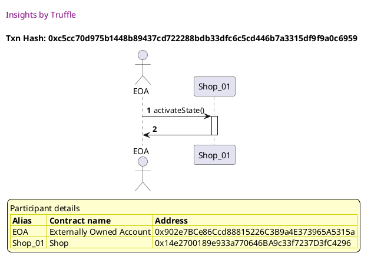
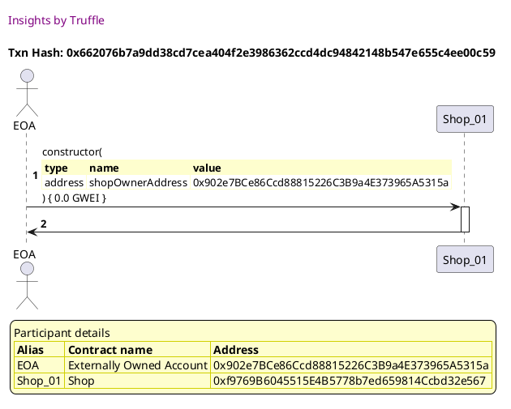
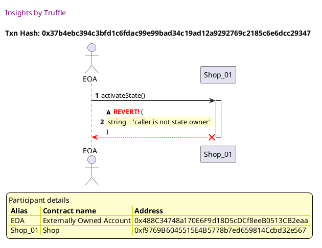

Test date: 2021 Mar 11

## Can set shop as inactive
[link to test...](http://github.com/thedarkjester/ConsensysAssignment/blob/7c5b2f21f354ab6c2adcbc9e6ca114bc570081db/test/Shop/test_add_shop.js#L13)

##### d1, tx: 0xa2694e8244aa7c47629df4dde455d782ac102ed96ee8afdaf1e6c461a422e043

[SVG :telescope:](https://www.planttext.com/api/plantuml/svg/bLDDRzim3BthLn3PPKFNJRRbho0BcZX9srCBjC0k1GRMeXEZZXp8yfQqsNyVutXfTfmE8aNIptnFb11NZKFhsdKb1BQkDktwcQneNagpGOjhg6X9HaynVrdQkZKwgwlQmeV5V37FvaAC6hUhQ2oWMoj2JHRU-YF0JMtBrzeuh2PLkJHhCeuH2tSgM73o2BbfxQQYVn8FvIk1fqwnUzIwD4lmP1_wtTdHrxu9qV__rZJbSkKQUDx1essBWd65Arr5yBWrS8FDQWXoYtwKAafyfH3ZNCMHd-f2QKqg37MS-9XxqYUTHaG95XeBZw9SHHugtoUf0i6IvOvRdzzD01iOi1q8bisLURb1flgmgZS_fDSbUtyWH5S7b-Ft65nS326lJUDiUq3y-6IUnAWN-NDln_jlu7OR0hO6rvtzYLNBpg5y3woEfQQ1FJICU_VBa9sSGdARCfbucb4IPRbEaiGBVJ_AWccAQXx4GHg5ap3mGZp2VO8ta5yaN7-VtxBExwqU-ZuIk1o24CVv4FTdh3KvBAlcZC1CpgIK1m8y1Ym6EndVhsNvJbHEhPw-6-yxPNdVEh86gse71rOQ9ddEi-Z-azOvyD-RENeTaAV8ZwNqafJI8C0ubf6AffCq3u8YzeDu5XIPyjE8WPXnprjSySwlvmy0)

##### d2, tx: 0xc5cc70d975b1448b89437cd722288bdb33dfc6c5cd446b7a3315df9f9a0c6959

[SVG :telescope:](https://www.planttext.com/api/plantuml/svg/LLB1Rjim3BthAuZqig4h9bksPGLPKCT9q9rQ8BqFiYGdHXKvaEKjwRf_7-kuQQi3HV5HZ-AZ2BdjWlIXtrj2P1zQr-yhuqdtrBY3z78FrcoDqmkfdhQ-xPqkMzjwk5glrgjoHSYi2oThvWI6jJDI6mz_noF0NUkRvzO5QGlRRDtUk82CTRWah14yKnvwVx3c4x1fdWr4oINs8BLkt1OYEeR-3Vli-_W8CjR_wRfckmiTL2Tuz7rT8oy9JR067eyExcItcm8zgbGfJhNWQHKbILxb8c5SQHx7SPvNkc9Croh3B9qaMSKbOr6gQr4BILKcKa5GCXNmwQlx0cG74zmd16KBZMeE4blTxDh3BneDuEXF21dou6R-7eFhwoaWL_DR1hC9QBvy9U_eQ-hvpiqK23cFX3nyAAHDa8tjo6mSpBUh9LrIIkSlFm2Ln_heb2YfnohWvDwy1WgjlUaGkzoRlmpDe3q6uvsqzWJtVvpHK2Y5umy8qQEWiU6BqkHPgNIUvr4Qnrd95a8cAyQPoD8YHQtaP-8tCSxUG1Gb9kQKHhamWZ79ESsIR548nLZDOyQNh2wJM6H8X1sFVPDRjFXX_mC0)

## Cannot set shop as active
[link to test...](http://github.com/thedarkjester/ConsensysAssignment/blob/7c5b2f21f354ab6c2adcbc9e6ca114bc570081db/test/Shop/test_add_shop.js#L21)

##### d1, tx: 0x662076b7a9dd38cd7cea404f2e3986362ccd4dc94842148b547e655c4ee00c59

[SVG :telescope:](https://www.planttext.com/api/plantuml/svg/bLDHRziW47xdLvoobqrTDsm3jgCiQk8wRPzQgPNsKcd2G1Ah14U0jwJD_lk8uxdPutZWZhlpv_i-3eIkdEVMjnkD46zzOzfDfInoBxNPSiiteDLA6JdducLbczR8ej6DXG-BSb4M9K8Jv_TQJH5qQwsuL1RU-YF0RMFhryPuhcUwNfcDCZuWBlrGi0Z94-IsjLkj_aayrgyA8ZB47hYKjLb1XFlGxyvEllPDeFx_TyRLgxLtKEtXoRRBPS15llPQmTFEm2rtwp7W7MCnJbcLybpA91Co5OeJJ9QnIlAC9ImMGX8fSfAHE29PHKcg6AM2A8Mne3aAaWaVMY_lPy0TZ88TeI2RhqMzvO7guxhP_i1Hb-pz4K9T7LnEtsDmSJ46qHZdRNj4_FXidj6a5_bpRwU7R-3tMmN16hxfx4-ks-0SomyGrB7AEJY02xZtluooio64TpcELJelLCOA8RCiYsWSioAPvvoKIPhaZCve4b5-Wli4Ru2_OBZvNju5dTzRFVPz8d0v1eHEyu4UpbXBvNcjtHc1QtoDCJuI26CGn0XE4UxN1la6AaEhmtVJGwTis7TUMSErtiEHbOIP464M_N_IEWV-UpCdhmDQvYdBvmmJIYDQaZbDqwnAbMGqpo9IY4eciQ8i3K21SSyRNOKzl9u_)

##### d2, tx: 0x37b4ebc394c3bfd1c6fdac99e99bad34c19ad12a9292769c2185c6e6dcc29347

[SVG :telescope:](https://www.planttext.com/api/plantuml/svg/LLFlJzim4Ftkl-9Mf05bYFnEZBg8Dat5Fe40xSkO9iU-j16fKpakjApxttTjGu4eifrxlkTtxnp6hbehZ5tEQyR4qZPwEI_GiFQfqWjXn1ngdA9M8o6VfgPPQfKrTMFWQ99FyYndRD3QTOqfWzqpGw7GmD_k4-2wCTLhewseXtKrrNFKbXXBUzWm8N1FkLYQHOsVWFlg5S4D3h5ReLIbf-0wNUZVRXvST29OT_uFtLRJcMsXMCE3MPObyJ9RsHhXOQNXMhIpIt1MVbm4M4YV1z8lIkNAg5H2SewS5qBvWNIvKAudkCUzEEBISvDGHXWfAJtk1p4ZowGbwVdD44GBFPfxZ6opbQmMWagzdpMBFuwx0xjrZx7TFZXFtsDmTdO9n5Kz2ultbeQJK_QEhiv_7HbKlxSf-zppInXyVH56anqf3EI-ARGdxVVlyf_vtSENVdzmiOkdSFAe7zcWwzctRautq5gpjNC3z1vBKTVaNTM2RYn190AQ5utc63RR_5Ecy4tYnshs5uJTVYXReHLLtNuuSkoC7ST9Dz-1xW6vGOkC6co84BIOupOmLCfWIzWXZoHkhQLnPT5e4hY66vAaO2WbNKPBaBCAaYIZRWI9S6CdZoPSkSaubEEiJ117JkZwsSX38JuJlxLclzeHbPowF8gS80pTC0z6OHmdHOmg2ddY1faibEzX6CL4H1LtTRCh6kdt-Gy0)

