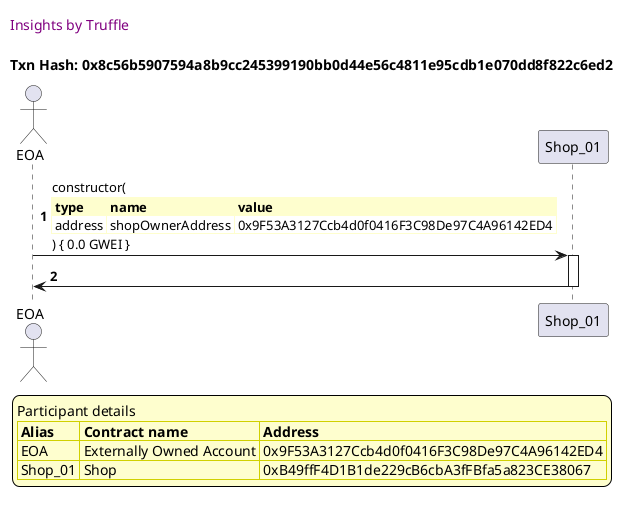
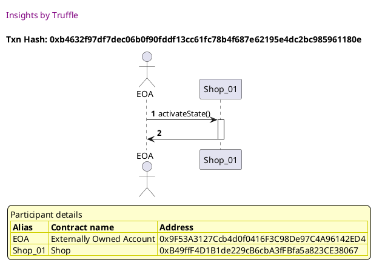
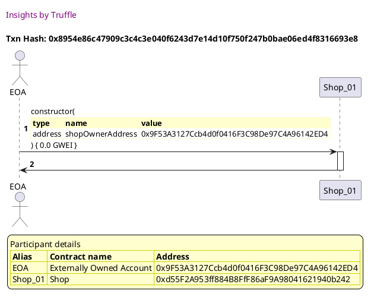
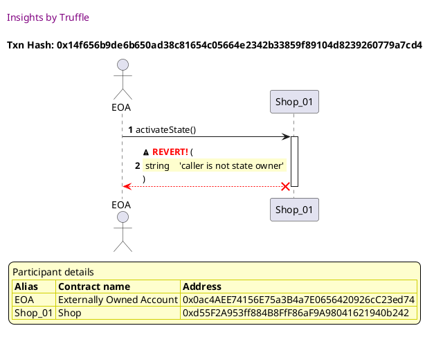

Test date: 2021 Mar 02

## Can set shop as inactive
[link to test...](http://github.com/thedarkjester/ConsensysAssignment/blob/4fdae3d04e4addcce97e88f438735f476fc16bb5/test/Shop/test_add_shop.js#L13)

##### d1, tx: 0x8c56b5907594a8b9cc245399190bb0d44e56c4811e95cdb1e070dd8f822c6ed2

[SVG :telescope:](https://www.planttext.com/api/plantuml/svg/bLDHRvim47xthpXrBvkwRZOOWgCiAY7GzgcLMcalbIPZcmJLCP4nMz9c_tqEOJHxd1zyvxlZuxxFPuIkMyUjwpOQ8TwvndIRKbdKljHcootVW5OhPUI2YvULRJeZiqOt5ZuKUP5dEKAprksrcYFerrfngIoy3KU0syRMhurnNAUwNfcDCiuZLcuiA7po1Bdjx5QhVnAFzQi2GiVO0vUoDYiWU0Zzxktiwz046lv_PzfwjNOjb7juibrLULpaQgSLFEqCtF9sFGMyIqGKbn73auXHdfHCY8168ME4uRB4ab8LnO8cX2WM2LaIXITOogHAWa34IWR8IoQSRps_Ju6tSE7j1VAokLhKM-wfFgwRxGzC-kJWNo3Kry7L_3q6bvTJ48rfdUsEY1-VpJEQ3I9_7kpyy0tSVgl0MyCtlVt9TUUTO_a1l3fMjIqSeFMuzx-CikaOmZjMH64Qac2IYP9AN65AuYBCMB9KR9BHbCM41lcIdk0-mHlWBnXklkTtNkVtLezzdmXSJG6XqtoWXpFMKZbUw_QCm18lCSP70duCl1ZUoVpzMY_VI6LiTVnkVkYLzVlEAMkurdiuifAG2k5dqVqdhNFWlpTpydgW1MLLLT0bMH2fWe29HIpADAoAHSKZdWHXbeS9ZYSUo3CUUADhl_lNymS0)

##### d2, tx: 0xb4632f97df7dec06b0f90fddf13cc61fc78b4f687e62195e4dc2bc985961180e

[SVG :telescope:](https://www.planttext.com/api/plantuml/svg/LL9DRzim3BthLn3fPKDNJB8LVmHPKCUnqPrQ8BqFiZuIeueSoFAMTjr_7-juwQe3HV5HZ-AZ2BdjW_1XE5X2n10wDnmQxKd_rBgZyE80Lk-qKsiXdtQ-6vmgEzjvkAghkYehGfPzUBPwHM1SUosKzl1xEWBSTRvzwLmGjh3jpXsq2yXemYMXHl1CUHpyqUeFmBPzqS3u9VOWb6hT3XYTGd_6VVbrUWIPwdztVRlRXnwQPtZqWp78Iq8Rh8R7auCxqUyNG4yDJ-B8vAaogTAI9WqrEJLA6HPBcJ0ZqwpX9ibIdKGidskkPDJ8F9ld2MCPHKuYPC2dL_S5Y1vckCy8oXPQsHu5jhhTTySVb8tWvCy86VFWPlKUW-lh1I1N-rC4lGreFdqcx-XRwldEpG88EO-4FFnNIEaWMjkJvJIOBrSRkg6Khbw_0IgFzT4fKLAFLS29WtuB54fvtIDskRTw7Pj1UmhQEs7jCzp_Sbf18IMEFo14JtazZukOHMaf6wweePmbTLpcsKRdQSaBr8T7rOP_9FudnjaRYTOyDwRc6xPcIaTHBjU9R8hOr6iZvYABuhAACvgaI8GTJtsJMxJuOVy2)

## Cannot set shop as active
[link to test...](http://github.com/thedarkjester/ConsensysAssignment/blob/4fdae3d04e4addcce97e88f438735f476fc16bb5/test/Shop/test_add_shop.js#L21)

##### d1, tx: 0x8954e86c47909c3c4c3e040f6243d7e14d10f750f247b0bae06ed4f8316693e8

[SVG :telescope:](https://www.planttext.com/api/plantuml/svg/bLDDRzim3BthLn3PPKFNJRRb3mLPKDU9svvQe0LsAJ38bfmOLMH3ahUapVxxPCTpi-Dq42cIVkPxeX2wCfPfs-qaGgopZUfsXT38lDIgPPhjG8gDKFoQbIyRtNIAPuriD7p8r_awMoEqCFOWnHB1iBQ2SQ7XRJm2t3QwVcsKPJALzKRjXB8EiR9JGUwI9yYsqwqK_oGUwrS17fbY3uppMct0msFezs0NNyScqFZ_EsNgpTOQA0xmfBkgShZ8rbOAUDehk6LcEmUyJsX8H1AL9AQOba59oa1WWgl89m6FXKUuXwiun9LFuW8NJE18S58bWHT5D109SfALrhM-la-16PWvEqDEDbkNTSiSrSTjq_x0tf0S_Hb2GnrSBjzZS74nXx9HnkgkH_puh9xHOXJvysYNnszW3wq0PnNR3VOdavrp-l8ZE7MqC0QEO1pk_IybT3g5y9xcOP06dXzdPK4uhZ3neZp8QB8IDCv8IYEF-EiLES5zWZV0Np3SV5_VEPtVM-txFX6ud0D2f_b03sUikR2ibkQCm0glCCOz0JS6JWpdPEv-jPDleZArEdstF0xAkdrlXLPCoWFqh3YaPUbcqVudhNFWlpTpyWOW7eQvdz8mgAea8TT9NkL9n7AQqgJ7z3rASE4Jtm4vnYDlTELszth-0000)

##### d2, tx: 0x14f656b9de6b650ad38c81654c05664e2342b33859f89104d8239260779a7cd4

[SVG :telescope:](https://www.planttext.com/api/plantuml/svg/LLDTRvim57tthxXBfRLD5zM0-OeOAab1tLEh9jhBEaqEDWagCP5nsgJB_ljk24rJX6npZ-_nkUSQGcuQmxLPBoj2-DhKQhsSIKsQvrAjkEPBgEHSAZ7Y-VDSrsibndLLQpZBqYmTfuH4ZTbMCYRGFWl9XTJmj_i4kAjr-LOhmwkaAkTgAPL1ni8SDsG87YXNQxsgv2TWKhv9iDWnzi25ADKSBDg5_hLpTDs98DtvFrHJpXUcWTaMfdfT5CXBJ6ag2TEDWZlUB8P0DnOhFDURXK9wCy-bN3X17bYUotBgUXwJjiFicUC4RbW4eKMP26mdj3tg-o7tSy48MfORb9xU9y0RwE7S8sYRAVDonR7KoQ9U_Q5M2tRh7Y7jFXZ47p6ukXe2SfKltCY9mU7YadoWcy6lCot5xttA8NSmXEZhAzSAxOWXoWzDmJrnl_-O_amVfr_w_UYwZSTmyQIUIDJrx5itnpjeZDxRkGDyptDULUXTsO2g3K8e0kfN9VKvxFRvbqJ8TucdrHmk27auALj8mykgEJdobjvIIkFTTy1xW6xWOemDraW8YY_bFf08eMM3s34F9UwjnN5Zf5OeS0ltA4b0akTu6Gr2T4Dvpf8qzPdbUgdlScV4k9zIR2spAVOh7zkE53xxJFpUciEg9HAkczb9w3f54GHi56H55dWy2vCmeCpoR2jaT6Op6ucmugvkSeCZ_Zx_0G00)

