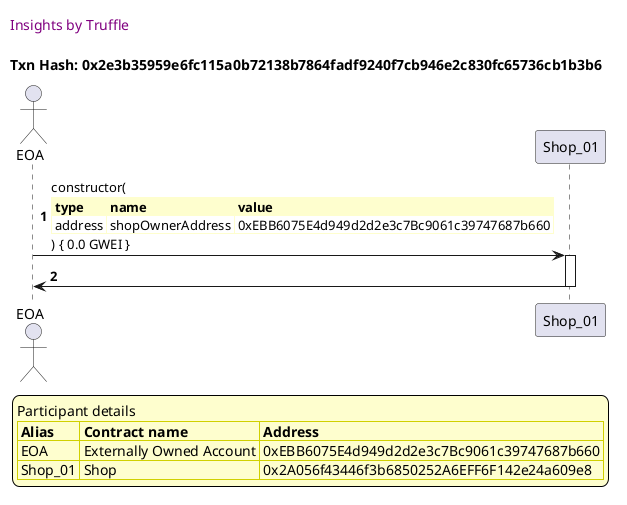
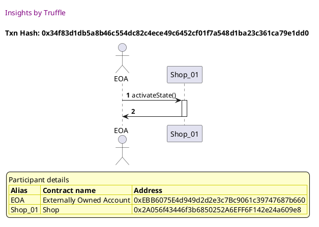

Test date: 2021 Mar 11

## Cannot buy when there are no products
[link to test...](http://github.com/thedarkjester/ConsensysAssignment/blob/7c5b2f21f354ab6c2adcbc9e6ca114bc570081db/test/Shop/test_shop_buy_product.js#L22)

##### d1, tx: 0x2e3b35959e6fc115a0b72138b7864fadf9240f7cb946e2c830fc65736cb1b3b6

[SVG :telescope:](https://www.planttext.com/api/plantuml/svg/bLDHRvim47xthpXbBvkwRWQCWIYBIbBIzgcLMcalbIPZJ8Bg66JCbhJPVz-5C9ezZWVVSNTytFVTcP2hrWdhkgqcH7IkDjqsLvQqBvLfX1LRq6gjJB4GycLjwyuKorhN5ZwiibMsp0YPjMwlrPn0_soKA9I5j-4LuBQsrMjjdD2fhjPcgun3nDAD1IjCdY2RpZPQ_PDuh5uLU6oCFOYYgCmQF3g4VlTszdLeWWp_lpDjjTwu5l8zFDckB16NkCff1Kyx0xUYtKo1xdmLv46OX8dYfVIyKD0yyhqWpgEOir8KPU8pMaOoJnXNlem3MaeUHW6NkPS7EISecNJOUdQVWcXXWdP2K3PNoQeHIFLnKpS_gDSd1tz2I5y7b_Ft65nSJ47MfdMsEo9-V3RFP3Q8_7cmyyCtSFj60LeZjhtzANI7ph7y0AYELMqB1sWHz_wNKJOTGtINBHQSHc76YeGbXLyWVHajP4Av9uCaOX6FevnpUeBx16z0lr2u-PxTeSxlhHxxFX6ud08Xf_qW3sUi2-L4fTip0jVqcb9w981hW6AWiyJvMfHlf3AsEdutF_JAuhbpoXgXzHwEh0f8fSHTTFz9wnpuxsHENW_afpJa9GiOuoLEDmwf7_efprOhllAOhtmcE4rKZ438UE1Dhl34s_C7)

##### d2, tx: 0x34f83d1db5a8b46c554dc82c4ece49c6452cf01f7a548d1ba23c361ca79e1dd0

[SVG :telescope:](https://www.planttext.com/api/plantuml/svg/LLB1Rjim3BthAuZqig4h9jkoR0TPK2UrqPrQ8BqFiYGdGXKvaEKjwRf_7-juwQe3HV5HZ-AZ2BdjW_1Xs5j2n10wD-mRxKd_RDn1UB47gxVQgPMGprlV3KwjEzjvkAghkbfNX2pwSB9wIM1SEosKzl1xEWBSTzwyT2u8MrgpTNlj0ZAsuP9G8tYcF0p-OFK7O6DUD4Ji4diKIXctXOXEeJ_ZllWwFO9CzR-xtcnteOVc14z-Q5la9S44g-7fwE1UzBivq6F2sZnHaMfIaJUCopHbIkQnP5fgLaZEqbYsD6epaR9SHOs84vdmI8giq95IbA1aCk3JguSIH0ypt6S4PGj6ceF0LZUxxl23HYCu-JD2nZouMRx7uFfw3iXbVegWDm7Dfy_a7NrBFT-vcGCXvv6Gn_yAAHs4iJrPJ8FvSdL7xoYbozTlWCfZVNJMAAd7Ak34Nhy5IgMyxX6xt5k-ZisWFGRjdR3s10-_d5PGIedZ3mZHOxLQSPgb5LC5ArIiOft8R2KBYk8aHSOodcSDv_GZyJynpjv859SqvIrB6EDjql0yfN4QbxogQrv7BDOn4vmMEaSYx7ZgczoYnG_x5m00)

##### d3, tx: 0x57a59b9187b10f0f0a5181e67c369c151cd0889359233b8c11c7c7b391229b1f

[SVG :telescope:](https://www.planttext.com/api/plantuml/svg/TLDjKzim3FxkNw71tTXWR7PUd9ZhUhIG3Zx1eBTz6BkTOpjjhcdISnneeVllKzDGuCFo9bbI93_IOq9EQoUjQ-O58R9nLTdCKsD9FSlBXRHo3eMPc58FfPfDRDMK-gmgAWlxesIKd2M4z6gtAaoVG7jDZTJ6mbEt1BYeRFvObKuMWoAVb7DJEioOkLt029tRb8l6BWhpnd6RFnfWmSvsBRNEomamsfd-jhBtfTi4wUfVbdK-cReQqXMCRPDbc9Uut1K6niiIBcGzFG6w32CPYbImE4ePpV2M8OkPuP7okL0iP4hJE1P-A3pVJsF5c8fKbFg2UPv8MKQmPShXrfEh0SWQzb3k4MoRorM-a0ZrTbej_b3MEZjzZv0s3exxBpOuEZg1j5bTsqetodsuA-z8h-lnfqxsrr_1hHO6K9PotifxMJIeRCBNqEHOSGsrgzJiUuFbSxV2DNlsfojdwat0hDbq03MwZAX9QSnywUd8n5agF4KzFzCYpM8HnCoZWfd8pvYlOsuKHaYV1oBoU4WZ4GVRt1_X2UXdIX7fjv_99Oxb1Tdo-DU-DVht1kuMz_49zDu_I5lYAFlGKrj2OKp_yF0c-P7SZDyT7lQ-jFO-_ASN2DDkgB06V0vWF3NMWCIth62nxM9zqEsEQ8Dpok-bCw_7i6KskNurBssSp8lwLRrpUewuDhr70kCOKJb3PbfCk9l2G6jhQlJj_iFzRJY1twKpjfH5iOAhXz9e62Y5fyYrpK-6GqwZC0cq28Jsj6Ty5GsLe9mfNqH1n96PdDEtYPyvjTNQHDw0XZmB_23WcP_oEAHUw0ruCXhn4GiyumMIKs5YJ8I8Ezpa5Bzuxly1)

