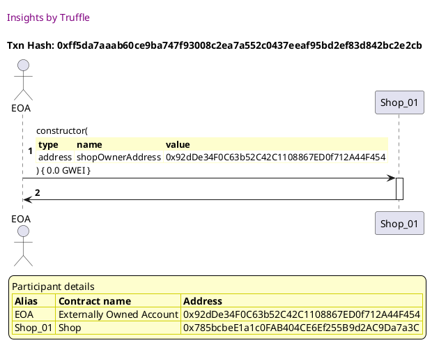
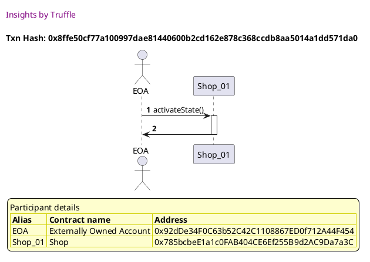
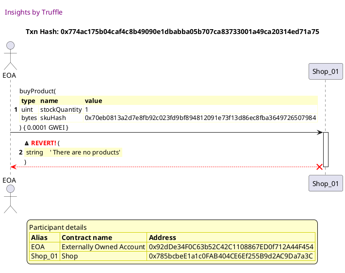

Test date: 2021 Mar 02

## Cannot buy when there are no products
[link to test...](http://github.com/thedarkjester/ConsensysAssignment/blob/4fdae3d04e4addcce97e88f438735f476fc16bb5/test/Shop/test_shop_buy_product.js#L22)

##### d1, tx: 0xff5da7aaab60ce9ba747f93008c2ea7a552c0437eeaf95bd2ef83d842bc2e2cb

[SVG :telescope:](https://www.planttext.com/api/plantuml/svg/bLDHRvim47xthpXrBvkwReQO054MbH1e-zHAhRINIfEnJO9A3BBDbhJPVz-5C9ezpW--yztnST_dCo7Nrd7ZkcrD2EzSexjjeGonBvLkkU5RgDLQQRdaucLjcaxBjAaR0n_oBC_IZ92vTVjQBGZqQwEuL0RUXYF0RMEgrqOxNYTrjTPRfHqYbcuio35vWcmxqzRgdyHZzQh0OsFiWKjPwJLuT0Zzxktywz046Vv_fssrtZWBnHwUJ5UMY4jSvMe5JpiDjznkPa1tPHb87dBEYoaLAYvuoC8odb0Q2LzX8WXyGTaaL8gNSL18NvNHH4RCBp3lYuAWPC9Xwzbz0jp21TeBWhAvIbGjHwgFcwRzGRq-EVWNXFHrSBLuZy7bvGn4ewqptH7nuxD-9lD1vC-3NHo-WTkt2j1glktjJrvtw1pB3u3g66Kj7C0YxlqlhKmoXkWkzkLAJLXEq-ca2FoK-QddqIYQXjcAbg7d9upbB60dk4_m1lGBXPllsHtg_DxgiUyJWQiP47AQ3_9mnbegnwlQdX5OqHMbz4W0nm35G2V5-pKetqXbR7NyRd7ebSLzvvJHlAxtS6Gb8H42Pz7z9wrpuBytS_9we30A2b6epEEUe7coP9IbsJGh_I1Onj9FqdY5Gp594GWP3xp9DUxuUlu0)

##### d2, tx: 0x8ffe50cf77a100997dae81440600b2cd162e878c368ccdb8aa5014a1dd571da0

[SVG :telescope:](https://www.planttext.com/api/plantuml/svg/LL9DRzim3BthLn3fPKDNJ7BaZmHPKCUnqPrQ8BqFj2GdHXqvaEKjwRh_FjPnqrO7YkAZ7iL7CNRRUNI-tpUCOUzRs-zBurZtLDi3Ejn3OxR6wXMgfwrhUwkpjcaTN1LvaMSvOulEdngpP32idK5j7FmTZm1thQkVM-knIPjwQ_V6UcAi_2MX8F1CUUZTeJ6VW4tzR438I-m1jQxj5WGVG_-6VV5zV0GRw_-qNRtT-GxA4powlgg8b_dQDmOUZnRkiDlDWH-JgZ8XLrKSe-1yDeircaH8oIFEoq1f4GKcYHCrZHAbT9aWXbn855g7iT386KccF3qzlqy1EvZGFc4acwzLVK1gTRDh3x-u6C3Hdp0svC7DyZq6rzTp8AxwDtgpyMI-V6Nlw6lg-SxD71WxZuGzV2YaZSUwwTXY7CotgpLVSywNBp-0bAVwv6GagQCgO75lNWEfrivqX5tkBL-6PiWUlN4Mc-O4zt-iqP0gHUFt1F7ZBD1hCvK5pw9f6GQP338XU994SRxcLIo2LCf2Xl8pyPiOPsyWYfEmLAN91Gh5YtGbkSpoAA-2C5pDT91cipN6ECs8Y3eU-sQtPEd3_WS0)

##### d3, tx: 0x774ac175b04caf4c8b49090e1dbabba05b707ca83733001a49ca20314ed71a75

[SVG :telescope:](https://www.planttext.com/api/plantuml/svg/TLFVKzim37xtNw71tTZAsEp4QHAkwr7ITF04WzxsC7Ox_qgRQvhq70TQwFxtgMqeyB1SOicI8bdV9nDoLZjXNJCl216DgyfcBeqbzIml5yAAEHHcOafzBjHiOgkcr4bLL1OEH-aeJL92UhLR5QPFOFjCZT36mbEx1RYeRFvObKuKWoAVb7DJEioOkNt029sxb8l6BWhpnd6RFnfWV6-x5bhdvGGORKr_jxBtfJq4QUjVbdK-cReQv0h6jiaop4jSxWe3usK95wAUdW9TXY4NYeM1f5o9ZAj8yfZ6r30jXPI21ZAaeHAH7_e-fKpmM0cF-emR7J8H1WGXKmwFdbuDGDHmWFA086mkL_b2OAktqshnXxAjizKF2Dd6mKd_nGR7nwSWczMrhNIZt8UxyexqMem_jRA__WfkjJ20iXJphRmNHOFA9dmDJOuLrr2xIis-DrW-TolSisU_N3bJRm9cpGO1r102QYIDc2yy7Peeax6dgETdEfPP5FE8UJHc9lGpvkkeQnH62B_Buz3h1ZIC8xxB_H6UW7wcY15y-vbU8YqldIrFVXrQetzlsjtrVN8AlVSFmfP8PHzwQZTG6DFlT6xI7-dD-5sdq_kojVVXFrXWctOp2cl0zmZ6KsCD2FpA2XOx5EkZzdH46-GflnVElAPXDzda-XLVsZYH5_MhUaCwnBussEC08use93YP5XFkMHXeRKsDllr_UBxDJE2wTCQMeYXMSFLG6Wq3fV0MkItuiQU7nkSZcdHz6NW9znB6Q1HrmtH8iv1v0yv7FE1l4p_Fr4xRiHW5KacJCi4K7GtEEUL9saqpBmZEO-qDadWeGk4dc0WxRlicPxZYlVy7)

