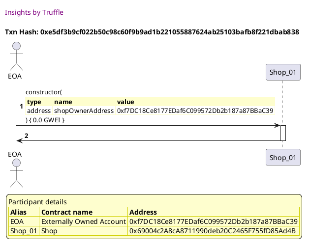
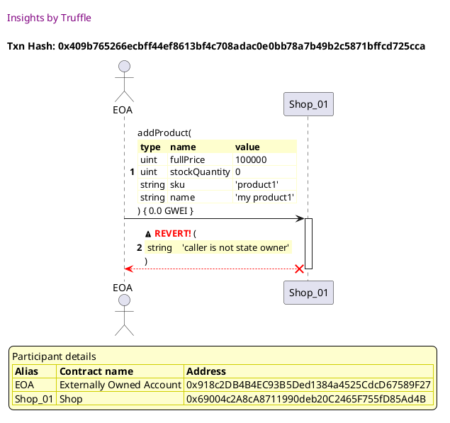

Test date: 2021 Mar 02

## Cannot add product when not owner
[link to test...](http://github.com/thedarkjester/ConsensysAssignment/blob/4fdae3d04e4addcce97e88f438735f476fc16bb5/test/Shop/test_shop_products.js#L15)

##### d1, tx: 0xe5df3b9cf022b50c98c60f9b9ad1b221055887624ab25103bafb8f221dbab838

[SVG :telescope:](https://www.planttext.com/api/plantuml/svg/bLF1Rjim3BthAuZkig7h9ZjnB0TPKCTnsfvQe0LsAJ18bfmOLMH3ahUapVvzZEEvsN4wY1H9F_CzKOHSEy-jRxUQ4DxwshHReInnBvLfkELRq6gjZ5pmucLjwzR8hDQrXG-hV9LdEI4pv_TQpGbqQwEuL1RU-YF0RMshrzfuhbDThSrM6O-8fHyALfWyGJQjRRJw9_5OlIe8naFiWKjPcJK4j0_zxkpiQzy4wVz_PrortdW7OWzFjYrBn2M-ybh1qyx0BNURAT2TYcGv4abHqZ0K4IqILanecOY4oq24OK2ZYB5u4ewv2AE0ZWGl1Iin8GKNRCG8IbPuR3s_Ju4xk41xGL0sNnLLmv7guwPkVj2WI_R-1I5T7LpDtsDmUJc5eZREs_Q8-F7PF9DPB_BdtiuFty3l6mLe3TzszYVNBJh7yWEWEbOv1mTmY7l_ooYR3Y6wA-Db5h1CiI2EyoKl9nbDaYWEbo8K0OivYnSBdesI4zmdU0FwXSBDz_mETNvlzTZtYS3L50WvpGTvE6CjbUULTcS4bdH9AJqIm350CT39y7ujoZTG6LeTlfiVEcLnttbb3TTw3qTM4jAYm5dq_qdh7FZlpPoy3cYIK3ekmfGLAOk384ceL2AaMJYUHAiuYiebYr8vNY0GCkvvaslSyVNy0G00)

##### d2, tx: 0x409b765266ecbff44ef8613bf4c708adac0e0bb78a7b49b2c5871bffcd725cca

[SVG :telescope:](https://www.planttext.com/api/plantuml/svg/TLHjKzim3FxkNw71tTZA64v8ceJhUlGb7NoY0sxxC7OxntPQNrEdvpZGGlVVfxnGNdRp1qkH5EcH7YM4d1MM6LikCq9OQNDTBXDfIB5GUiKCMq8cPrAB8UEBcSbBBKPvbXlOdyIJU1GJqYli9fDz0lMPIoQaWSVs4U0yD-eXrvPbWqpDz59gYnbJkmkOeBD9kIhDAfEl7DVgGOBZxMnJ9eJICt1eQ_fJozvn2uAqzIzqeMPpMq2oWHjJfYdc9LRPJCBDMiCvA-QdGDSUZPAWwxlThkH9cdgUJCEkSvAa7Wzeo0JZLD8a2K8M95wKkDmF0mS3kGXSdtD6S6JS8lJuSW2iW3sKUmJ7PXLNAuQjNi_prM_grCvMtoEaZeEZ_hCD3WzF0PkRcboKt7wurRUaryxuKolxsozWDoi9A3LRrlAEPIKgLVWMIeKLjv2MMJOrYgCT1rMTDm65pVdYMudubDtWyyvVM5DD5vL5YVV1ga7Z7FmJqDI7W-K6tWHzX4UWdoby_H5V83tF7QwFVkuRANvLRJVz7vr2x_qzCnfpzg77cyN2c7wdSnL_ZwzktdKwlUFQteV_pEGPKuM7ion3_bK1EhVeObP2Vg-bUK97X4JAr5tbUC58i-Ha-e8w8IrJMV6Yv9YESPWL3RZBo2Wg8rnIWmbtX0o4CB90t-uzX5Yj1zvhAur6W1kuH4W21fpZ1rKnGjUH4t9tFFI6NZoAJeR-M0hd9FIOvxl-IF1nD_33QE86hnC_hLUZrOcw4QKUTmSX7-2oEb54XKnSEdAzhZy9V3yTX_v0U4DCX1stVPCplF4Ny1S0)

