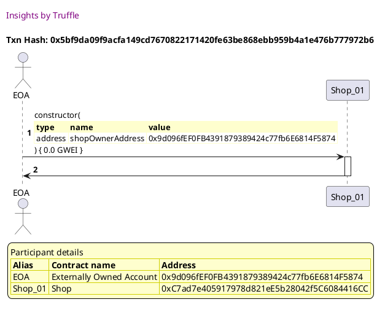
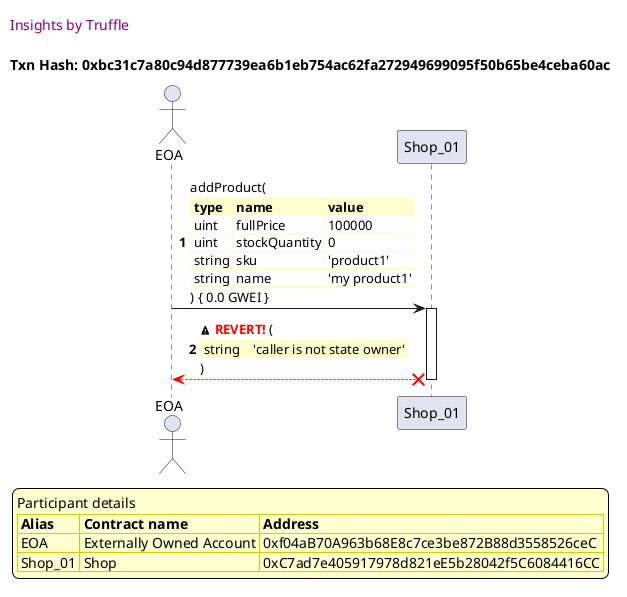

Test date: 2021 Mar 11

## Cannot add product when not owner
[link to test...](http://github.com/thedarkjester/ConsensysAssignment/blob/7c5b2f21f354ab6c2adcbc9e6ca114bc570081db/test/Shop/test_shop_products.js#L15)

##### d1, tx: 0x5bf9da09f9acfa149cd7670822171420fe63be868ebb959b4a1e476b777972b6

[SVG :telescope:](https://www.planttext.com/api/plantuml/svg/bLDHRvim47xthpXrBvkwReOOZACiQagXxLChjT9UAaq6J8BgcCWsMz9c_tqNmcZsE1vynztnSTztPq8kdPVMTsjDYEnyQxfreInnButPI2lNeDLIcUfAbYzBstQcIblTMlYGPtcMPeJCdDzfDIVGFoibAsNXRNW5k6rjyzeQB_L2DqkpLiOZOkt7WXoJHyXDPpTQ_PDuR5uL16oCFSYgQimI0Zg4VlTszdLeWWp_lpEkMQwyWs87JxQhQyGbll5QmTFMmArqgodGRLJKef9Kr4AMjGoOA2iUSvg4OS035j9QnPD29N6YYa94ec0oK8p71UTSyB282KfMUcmzkr-0T726zeoWRBufcur4ge-hTlE31droyCy8wUlWOluUW_FpAPIjSTvs1yIFp-QPp0QHFmzslly6VhTHWDR8TMz_IjsXSoZV0wfZbNEm1uUuzx-CieinHBUYeYAkivpcLsmYWeIBII9Oo4hEwoBEuYHWUPHmTeJx16z0lr2u-PxTeSxlhHxwFXAuc08Xn_qW3oUiA-Lbezq9WMjwJIaz4C0rG37GIN6-5kKRgOojZj_DzxsoU6wziaPglOC3gmeMPOcxwF-JrYdmtyaSlHuevRBYYj5813ZVf4h2G6LH4IQKXNMKnZHXB8ZJ586GyS2RNEA9j-SF)

##### d2, tx: 0xbc31c7a80c94d877739ea6b1eb754ac62fa272949699095f50b65be4ceba60ac

[SVG :telescope:](https://www.planttext.com/api/plantuml/svg/TLHjKzim3FxkNw71tTZA64wQLwxhqPOm-4G7tFPXx7QExRI-faxFSQ05zj-dl51UTlC7Iv4KwP4U9OGSbvOPMorpGbXb2rqjKsb8kL1wnGnRGYvdKeinuukPAIej9aLU6DWzJKwJIKB8eBIRN0u9D6SkcP067hf7WBF2gFj2MvQFSZNJIwajPipiDk0KdMtALMLMkNpbk5Bt4XnlQvio8PIUWKCxqvz63Wux4AIhVwvBDPlR4j8DN9igop0liShc4gxN6ivOEJy2kavvt-4XYoYFFH65OTYF9GjIHwQXxp4Uk1bpGpVsuY2EQUndFaq3FvKUboaBAEC4HyOjGaykHi1As46vGt1iLd6rOjZgrRnO_QPEu-pq7KAQE3WOFjjWV_y8iBcfAKJ5xOSRVKC6tOm_TNBu-0NiPYK1fMRBHjwol4Ab3d-4Ic75HyYgF9yQnT6EWwhFcu3I5dpnhK9yocxmUUilhQcdYygYmdjlrQ9nzlu9QEl3td83Ru8-mWFGpnI-_aZEaPxd3jS7FtUD5B_gjjl-3uvWyFwE6OqvXp3WxM9XpB3Nkqo-9vVNxtgzmM5Z7y9_PlACgSR3MPuZ_we4NLXqCIkXkDFIFA4ZGY9bwhPsl62aNN8oVK6Ta9Qfl7nHyeIUu31h6d2NaL5K9hYa1XDk2Ha9OMI9lkrx2B5U3xpNLXgD03TmWP04Z3Z73wfcXAupwh5nI4Tnq4-3A8buo6K_bL7eZgD8z7q_yjs0oydhn4_hrMfDead8H2WzwiTE68UHY5n79dxgHjHpCtyIqCZpd61I9yAEkxx9CTxu2_WB)

