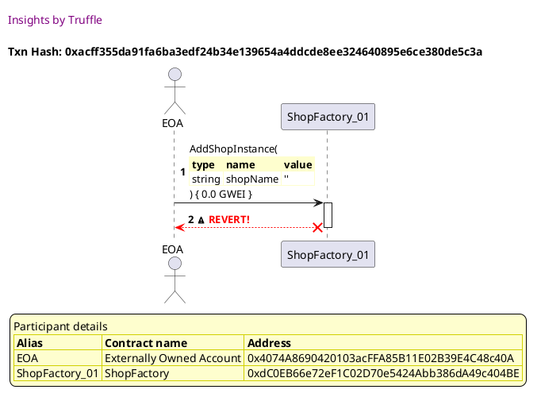
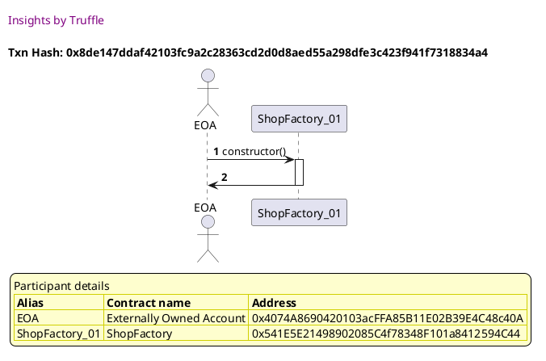
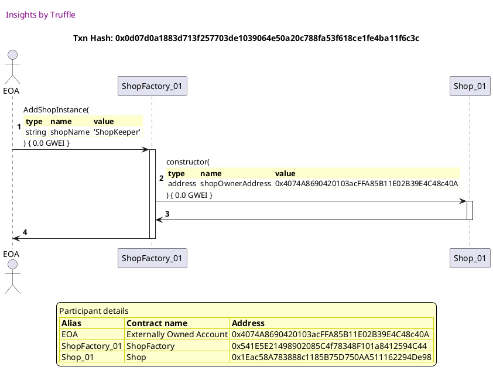
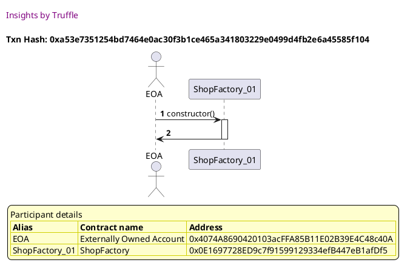
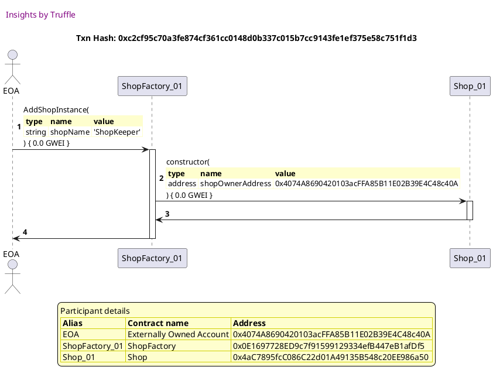
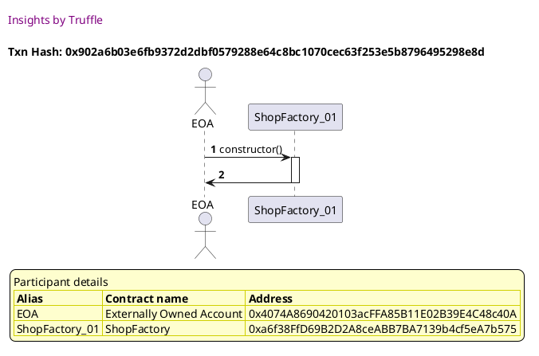
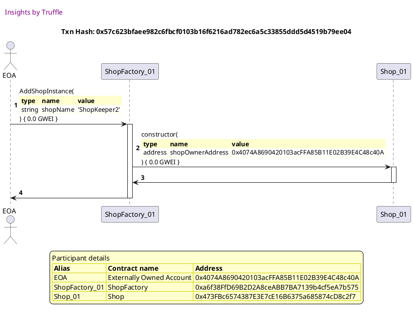
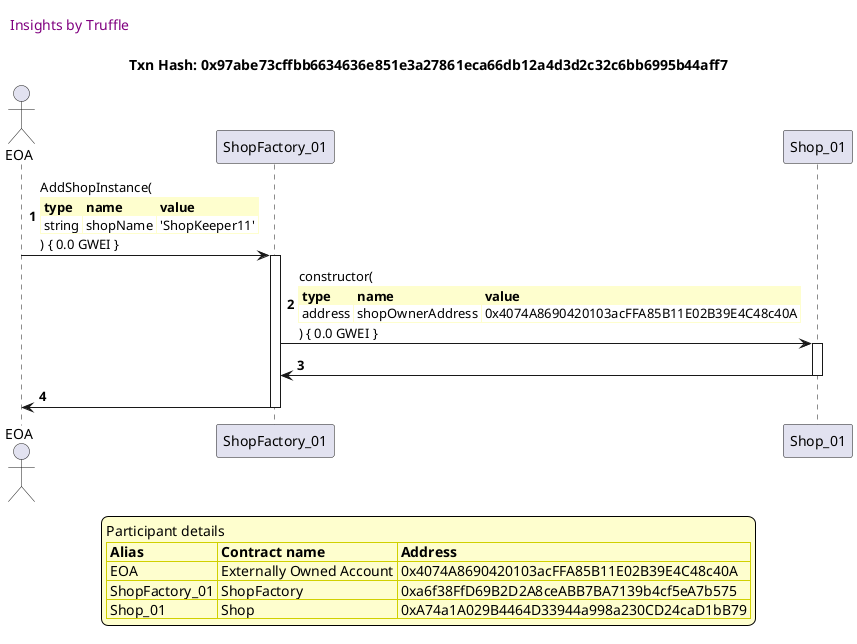

Test date: 2021 Mar 02


## Cannot add a shop with empty string
[link to test...](http://github.com/thedarkjester/ConsensysAssignment/blob/4fdae3d04e4addcce97e88f438735f476fc16bb5/test/Shop/test_shopfactory_manage_shop.js#L15)

##### d1, tx: 0xa7f04428fa78bab3f1458cea4efcc62ba256e1747bf17f405ff74bea73470add

[SVG :telescope:](https://www.planttext.com/api/plantuml/svg/PLBBRjim4BppAnREfKKQb98fKJPS8x8i8JqbG78lA3vi8JHbK1Hgfyc_ToqBHjtmG8epkwFTMH9otmNXGx-pX8W-jAxVrTgJxhLnU-753gpUQATMGhvkVDixLRIszN1JbLLPb8Gikd2qUabWM5ijbFRmPxm2FBI-UMjT43QtpSRjj0keQC8be4BoBBdl_TxgA-AvUTCGiGls99Hgt0OYEa8VmxduFXP1nl__T5spsOOEwYEy-DuOr2MX2LR3oy71W-YsSw07mGrbBCwCu5ajwgc9M999BPWsKgPnBU8arH5dl3OHDumcnd1MQy6dZ5CiXQ1bCc3fvMCEeeC9dXE2jeL6Ddk1hJvlstqrn1n_qMY8kOOcX0nPSBVyHC7jxHnawxhW-nFuvIlv579AE-VVpO6Gyx38qpybA1r4Opko64VsxMPDrvJIvViFm9bWIVXHeDaUPS69dJu1kL9UTyXTyfRlGvku7uBsJbXxXCVVJYl8fSI74P2Y1qOvoxDqHbbC8peLighoB5b5KKdZrNHMie9baj7yMlW_cww0GLOLj5obgUQnhgA2ncjETS9YbjVrD4jLpcOeobObocB_emla7dTys7y1)


##### d2, tx: 0xacff355da91fa6ba3edf24b34e139654a4ddcde8ee324640895e6ce380de5c3a

[SVG :telescope:](https://www.planttext.com/api/plantuml/svg/RLDHJzim47xthxY1DBOoXfCu8KLTHDecWvU106qFOvhS-D96f4xbED02---xfb55n_BWS-uxVxdlyuMnizfAOvjvoPXiRAMR-GGDg-yBlP16pg74AMerbDdzr5IDLgEgh0pifqcQZ1B61hLTbHWnQ9yPIeK6dhjNWFFA54-LjhACosAgvwWjCUPsMv0IkA5SD6PHuWvmKpmXE6ARkv9A5NeA3kzIVzeuEEwQODttBtHTJ6UsXiaARasJvyJBR65BXDkbXdDPpqw1BsMMvvxlAzbtSXbCf8SgTyN44-Xu_S0NKYYLAGmHFLS4WeTz7uCClP0hz3DFCh8iizHwSXc3h66FuXuZssoH5Gj9KczcrI9jQrQ_kTFMxARs66jFmL7q1eB3mrE8bLgdIP6LEiCFT_gE3JhtFtKnUla2ThL0eAZbl8qFicneiov_WTgQjMsq8QflRGKS76pGZ_0C_3E7hp-I2_BpJHFBev_x1jMlTOERJezEOV3-KHfDd14Ciir0K4tKwrqdtvFhstUztk2upKTC8P4L3zBYVxHlXejTlR9CePL5MRyIEUPZplbQ9CqGMKYR4Gs78QAjNBB9O4tOzbpqqbuBhKkBHikoNC7beqO5SPRH85k2-5Bm4n67GPyBbplSarcQng4_T9o4kqElduYH23F1urtYVwvr9z7IgX5FXa609owcpeYxunEEld15F9buOQ1YqITICKo8blHtBh0pMkb7_0i0)





## Can add a shop
[link to test...](http://github.com/thedarkjester/ConsensysAssignment/blob/4fdae3d04e4addcce97e88f438735f476fc16bb5/test/Shop/test_shopfactory_manage_shop.js#L19)

##### d1, tx: 0x8de147ddaf42103fc9a2c28363cd2d0d8aed55a298dfe3c423f941f7318834a4

[SVG :telescope:](https://www.planttext.com/api/plantuml/svg/PLB1JkCm4BtxAqRbiYj0QpiETQfkHLeIiIUGuBuojfD6k4xbEDgMXN_VQHfLTF71Zj-RUPbvOq9kkwX2x3UE4DN7rlUR5nj8zzhuhGfg0yxMrfkbqgzrQ7jlLgrh0roKHLci2aBcNTmxko0mhBLLnWRuEru1xjlGlBK-AfUxflORwoCgLl4KK29vbDpsOUli6V7Kl5bWueGzAcCQNmEZ8_GndFCVOn5a_FyltpNrEdRmieVdq5SLwfBOH6VXUUVXNdNh6T2TD9Q9gJ6g4fpHfDAPufhBv2RHXXjgfB8cJHNFfAbieWLFgaomQfemAHEX147BTCJIYuSSL0SJF2S4ROkDRhOAMtrQjzjoYDd_fco8EOScX0nPSBtuGi7bvGnqwxiO-WFuxJlv4d98E-PVpu2Gux38uwSIZ8sgSHsPZoExkhYZTvJInVjFm9bWIVYnGhC3oe9N6ti0ScE2xP0xvItUXpPntqKRl79k3mz_l3MGQuqF8o95Tu9EHIvlCYeuHKkLBijSfal62igNILQ8bP1QqFnS-3-Rpe11DXMiI0lEH2OpogbCLwAQuWnaoIXJKZ2UPYWjK1Rx7rqWjxZZm_u7)




##### d2, tx: 0x0d07d0a1883d713f257703de1039064e50a20c788fa53f618ce1fe4ba11f6c3c

[SVG :telescope:](https://www.planttext.com/api/plantuml/svg/dLJHRfim57ttLrnr3ztKTRF115DrKMa2QpLfhTHAUwaqkSOagCH4ndH9s_txBeInPDaUDXvypVNnuPnxRGWvgvsqhbcKXCZ6LQPPt6jBweV2BAML2oZrJ9liNAg7cQqQaqsgihBmAatIP98GSbgxTQd71BfdhcMcBJpthm0NbIsUAkDa6PV5p2oqSSYOkm6GukA6SjdOPQbt5cwA9msC3xbhcMM5cG6ZVUfx5q_Vzo98__rBKnUpkQlXVWstjibpv2MkSAM6svM12rdFJu2kQ4R3Z4ecX9-5pC-z80ofdsb6_OYEk0wezAWAXSXbuESZ9fHckURtah5yf7n5i6JAeVJaAWPPmm760u9bSuKgbXAjtiohPTfXrbyfwp2xgNtuDgu3a8uMZiTxU-7ew0JYB6lJQDb9e_JhEtD7JllslEtZ-EK3kFLI0qOZ5rryb6M3anR-0hMpRLrnWbIVEmGSjhIVj5vgUxZ1lO5deEyeVFoIN6Bfz-Jyb3XeKnMgiasB-3zTs6-hwxeNTlNDQ1iFARhYDEIn64MKUnIR9bMQnY8uPooXthaV9Np2XU8q_hly7TqxNevFuCyEDzrebydcRf3hhHPcsicYhBUiJkcKKjfQnIk0dSN91C-sHTh1z61gs3T-wKuLZYkdhP5bkORMVmQnKdWFtJyMO9lujrEva-Xe0ywI8F4OZqH4FIg22Sz3uNEHCigauCmB8gJc-xI_-3eYbaWLY1Zt2Y4KOwWj3APXGECuO8oDF2_YKnq99C92zkKaPpZY3-a7)





## Can add a shop to collection
[link to test...](http://github.com/thedarkjester/ConsensysAssignment/blob/4fdae3d04e4addcce97e88f438735f476fc16bb5/test/Shop/test_shopfactory_manage_shop.js#L27)

##### d1, tx: 0xa53e7351254bd7464e0ac30f3b1ce465a341803229e0499d4fb2e6a45585f104

[SVG :telescope:](https://www.planttext.com/api/plantuml/svg/PLBBRjim4BppAnREfKKQb9Ie1mtNY6nBI4y9aDmBcbpPGcZAe2ZKJfD_BoqBHjtmG8epkwFTMH9ottdfVBypXCZUjxRVhT6HxhMnU-da3WnkqEg5LAyRr_PMBrlJEhYfogfSbeJCEdyqE2Smh2rAZGx-Z5U0XzOrRwtrqXIcsTWTMXyKQty9g09vbjptRc_mYdXktX0Ols1FKkl6Re3H4VeOpjdtiGWo_l-dxPhDrdUmFiABw-iww1BVU8FmSh3m8Blj5EX19Z5cSSAYXAzrnbEELAgOrl6QAUHf8cFESXf7aK3AXT2yNaUOIfuaUL8poacmJFbGUlbOWEnW4iu92RRvHZLx6LfzthRxQeWv_g9iYBc69eGCMN0t_qJ1xUqKL6ixx_eJ-EKh-HHoIZldtqs1aFEmoDC_9MZqiZ4TcOqZ-tQpeYjAwVpz1uIPX9B2npAOxO8iMBd34r1exR0Bt2Ll_Zwq6VQ3HsUbCKTu_6rHGw5KU1W-KFJ0QSQBF1MKHvJHMAggAl9amLX9eqKiIhxakUAqk1R-pwOhO92b9Kj5baLvkH8ggmLBX62HY6EEzOBp31TCrgiw2RAX_z45SX_syB3_0W00)




##### d2, tx: 0xc2cf95c70a3fe874cf361cc0148d0b337c015b7cc9143fe1ef375e58c751f1d3

[SVG :telescope:](https://www.planttext.com/api/plantuml/svg/dLJHRfim57ttLrnr3ztKTRF11AYwg8IGjPgqLcgblLIQ76CIL6AGCLtITl--2s4iMRQ7ZGTVStryEETU6q8kQYkCRLO58QAnfMvMSsL8_P3hIXYnWa8jb4udGZuiJDdeD2wBqi2hMJ9BueIGyzfk2ZKcq3rB9L9buBb_1RWiJVvKQYkAgCWNUgMqHSRC3e0PBcufgyPKXTfRkCsV530-v6v4ckPw0OpsgUzTF7_VYo3zzwzqdI-MjeRv1kvCasN8Isnk2mLtQmsNebwU0LrBHsQX9tqgt4m5FfUPEs9IKiQ3bCvTryUfD_Ub31b715EPwtlA2wJliOobBi6IIOlIa-i8H0r768y8bitcCgy4MhrTbjMimso-KjPXzbE7y5rS1o0TBPoE3_R2oSaPH6dQfj6o5Lggr_VwdfptxNdRn_7B1x2RIW56BLPTV1H5WvCM_WArDMrTSO9Kdpi47BUqdvIgb3dUujx0Cz1t53v-IQwmz0ToVaeSjCaILPccHVoVBkotKNNT2xl-ffM9XXHTS-hpA1Y5b3kKKLV8sImAl0bZ2NKcRfZmc0UIq-ZlylTqxtavFOC_Eznserqcsxj1RdPQc2ehygBUiJgbKqffQnMl07OM9p6UROEqW-d1rB1l_DATAXpNLXajYc83hVyK8Ydn7jf_BC0kyM-dSY_HqTA4ZKBVTu9a6ae_2vaNXim9NPUhRCAvhoPCPDFCEwJznRVL9s8_2BrCnZGOnOwJKXRnaBdUn4DX3asIC1W9Zo8H5h8l9xd04Nz8Fm00)





## Can only add 50 shops to the collection
[link to test...](http://github.com/thedarkjester/ConsensysAssignment/blob/4fdae3d04e4addcce97e88f438735f476fc16bb5/test/Shop/test_shopfactory_manage_shop.js#L34)

##### d1, tx: 0x902a6b03e6fb9372d2dbf0579288e64c8bc1070cec63f253e5b8796495298e8d

[SVG :telescope:](https://www.planttext.com/api/plantuml/svg/PLBBRjim4BppAnREfKKQb7fJXck4iYMafmH8xWL5hcmXD6LG56gdoR-NbWMZRdWWnPdTqUui2RdldR1ks6b2nE0wC-ngjAH_RSrUMB43ZHiqgX3oTMExmQXLfpiBDrLPbQkIa4NlZXgN1CQrHQ7Gmf_f2l3GsVQjCqvehjkDsQ5nNh5nbu3AasV9_M3t6g-8v_OD8OWls9DGgZKR2EW4VOpduljK19d-_zFqxMRhUgYFy6A7fl6wnBLE8xmS33o8VZi7UiXfADAQHfWsTHvbeGfLtT0aoqF6C8qbgsL0CofHfb4J9X4cDSloDCwJC6V85F6MIUTBBnyvY1vc_fmHRvjhPRiNljNdRRUlnfZZBngCCTVGZ90n2-wMdoYulPs3x4plx702ltmbdq9EQUVykpaGSXuMUVgd18LEjBedYsbatsxMT4qfNRx_03yJNvB_M7cphPS58tPu0hXI5dlFNVAMxsERVZyuj4PeVOJ7tmOLS2dzmt2UeeUOPZ5dQKxZa0Oq4hAgE4kA82XfM4Hv6QzY9cFAhuN_i-aA66L5saIiQjPfNeJha3E9l2YoWcT1bDUnR1BaMPraYPVr_Kyka7k_-uVz5m00)




##### d2, tx: 0x00af705dcf0fb637e2af157e0e8692d09d67d8172f052d045462f243337d0622

[SVG :telescope:](https://www.planttext.com/api/plantuml/svg/dLJHRfim57ttLrnr3ztKTJDW8Acwg2Q1jPgqLcgblLIQ33O9AZ6HCLtITl--2s4iMRQ7ZGUkVNryEETU6q8kQYkCRPOb8QAnbMwMgJAaVYZqIXYnX5BDbPQHo1xcfcgqd5PbPU1L4YVnD2RalBQRKaq8TCz22QaCFFTJWClA54-LjgBaPJ7NIwKjCkPs02IukALSDMPLghs5s-99WSE6t8sGij1pS6YV-jx5y_Uz2D9__qhNnNnXQqWtS6UQF4TUOWjRAhXRQxWKzU8Cw9fIaOVKbrbEypJmGkMAtF53HTKe6BkIZcKGof4JkZdrSSfy5hYvoppF2oKDN9TWoJABqkDh3gA68un71CjcYwnO2RHwkwXMIOVPVALEXzbF7S9tSHs0TBHmEZdO2oSdPy2bRDDesGgTgTVt-fwSz-rvsyV9omUmcvK2Z5eik_WeoWO7BVm5QclQkk80gJvt23XkQJyfjLB6ETu2ty0pq7SKFdw9hx3s1tf-QXp4PHNACasB-3zXs72ZwhfNTlrDAyE755qp6ZAEpQBCfGxrH9OaVEH7ZXDJD_B6CPkoKSOe_xlyFTrxNaxFuCyEj-rebydsSf2RdHvAPKLHrZjMPtH6AMsjuXt0rk9WYeVR8ErWUZ0rx9kyTCSAtskhZ1PbkO7MlmIUPNWHxJyMO9VujsEvb-XeHP1xeoIV1UF8dRbyb2aUHM74GySRfopBVSN3r0_zGzfVV1tHrEVKYmFEX9zEAG_KMEOf7ucKJNsNPKmcKH0AIf482zcNarpW6_z8Fm00)


##### d3, tx: 0x57c623bfaee982c6fbcf0103b16f6216ad782ec6a5c33855ddd5d4519b79ee04

[SVG :telescope:](https://www.planttext.com/api/plantuml/svg/dLHTRvim57tthxZg7hgfwsO-3L4N5H9OgqbhfLRQIwN9s2P19GOPqoLjzjzd26F9iZriFFYQw-F3EVVQ87JPQAfqkoeHegskPBlAX4BDOo5hgkWAIh4GaiUKFIvKrKe-gyfAmQiqIPDPWj15epUbc2BedwMWN2Xu6Lu1hYfLF5TIqp8gYuLS2QaDOwv7G6eMTvHrg-fI72pS5Sy2B7VCtLBE2xa02m-fxtsyU3-8GCFthsLJB9QwWMm3zwhDSyEBTA5B0VTh2LUqMKu0hpt2VDl9SYf46DZCppEMOmixcUNdlctvb9F05iod7dESmFCuvnvtFIlCI2W4Tf4f6TD6Ud8J0MtWnCGJPCgc2rRKr5YzMrPrscCsNx7LOmvJn_1zN0z0FIsSJu_smjdP12BEkxInhAbaulM3V40NGtlU3d6w_G1wKmimKT9L7vzesPf91zz2erLNLpCnL9zx19nsj9-4g8MoJtV0D_02-1s6Zr-IQrFx8pq_DOxYM6LagRP3_9ymqt0bccPGTlDD2XMDARnsCN6Zm0-nQtUDeonDey2BBIl1Tko4YJjp0-RYwE_o3tGVU3cVm9yTxjhHBQFTvK2tUptaGjEYRFQipl4SOznPDNV0jDPCPkPmAqCxcXvDZVkcs_vOcN6jXPAqB3VG-USGCMOkelx70kmJ_tOi3n8zBVLp9qZpkH_6zjoE0YQYE2PnH2mdp5oMUo8YcKUyOzfVV3jzn4bZvdl4TGAIE0bXYUN7laCywWTUG5ms3vYT4qDa2ZcK4rsQqVoHVW00)




##### d4, tx: 0x240293ce05b6b9e1eff2d646d9ae9197d77c8e02d528a679162d98f3532a0a9c

[SVG :telescope:](https://www.planttext.com/api/plantuml/svg/dLJHRfim57ttLrZTGpTrtOmn1bTTL4XWhIQjbLffBvKcOvi4bPZ8c2vfkt-V8Ombo_QmyU1hheyFvznh0y15OxcnxR82WBUsrkqoLmOq3wLUSSENi59pfMN2nSFSrAsMqxgg3NoLfLawJG4uR-ocKXC0-sUXk5G6FW-l45xMfdogjULLN9LplLJQEiR2Ze3CBMufLwrPLMfluRPyKj0ZO-w6IrdgEVJGaFhUn_FtWmWmVFzAD-LyOHkOR-2TQOl2yG9Rsah1kxM6bxnPd46qnWHXvWk5WfpcJ7cgAB2aX4h65VDOACDGH0fX6U28qv1v54iM5NxWOuuu4y2LJ5WdFRsE8M_WaOj7m9NDbg9SSMVrTb6liXwp-Ogy7hEVEeJlude0w6dXwUHWBpmvEOEnb5tQMRPS2_NwNj-3yw4zRuSuUVa0xMQbe8kQB_luoAlMJJhu2soiwUhg9exgSu-0nntj9wLMolZ7M-0R-0pHEmG_VaclNEqFzFpKE8eJjPDbsWxnVy9Smurgca7PzJUjJ3ocq9gWaCGHPOXWv26VYooBeo3nl1JXn6SfcP9841J_NVwUxZqlfsVmpmwtxUYMmVPoW9kT7afbULarErPdQ8OGwgowE-1QwoPJTxYDenrDZwR6VPEN_bYvSMsLqRogDh3pBs4iXBk8zXyBi4lysx7SI_Iqd1P-b1KpoX8ymt4aL9maOHA7dizo8ef0nM4UXC4XxI--daZu4KqvyH9AAQCIvv7aI1GuId0K4aPJDFCH8SmHkK8EvGGNRdH_f1y0)


##### d5, tx: 0x03caed5ca0226ae2702794cca3acaa63dbdab4165ae4330aed6c74426d8f90c4

[SVG :telescope:](https://www.planttext.com/api/plantuml/svg/dLHTRvim57tthx2wXsxgkXamNrKNrIImLfFMIgsqbqgJiKs2IanaJ9UqtN_VXJ2MBDl3neElkJu-d7El3K8NZUN6jiiA8TxQMhVBN1dKF9HwnGrVuahDbPO95mzpKxTQJkkgDlXLbcRfD4NelB6RIaqGxf-5ub8P_3oyOdnPc_AfrfPNh2hdUgcq1SR2Ze0C5hUKgzQiAhMtS5i-AUpGCNV3fIpr73jaI7tlu_dxGGGQld-bctA-i0tED_ZEj4K1lCYMjbBuRgtn9MyMPvYiYIUuahxWn7K3hjoGk65CXU0U5vm7dimbpwaJ-5nHpoE03KH8gHl8g8Y9e0XA9Yn8JwyPvWq-WdY4e6os5EMAWzNRHRtAUipcAt5wp7xg4BwBwm6efyMdauEz-EJa33CfkpHOjbmBzVfUtwFpeJrlXpXv-O3jPgKmHCsNVNpaLGkJ3lw26skwki84g3xt27pSqNvIQgKCFTu2t-1dJDuH_F5BUWMrFz3pK-CeJjGWoxGTul-4GSEDQff1sVKthGmRKsHDIKXP5CI4kiGXqBOiOv6VE4vAtCIBKpgbaQ24_Lt-dkuzBwTd-CyEj-tebj7sSg2RdHvAPNbPDJjMPsH62EcimXs0ri9a2eVR0EreUZGrxfkyzCSAnhLLHlEgsk3ElyHC2BY8zXyBi4lysx7SI_IqF2YyA2jcGPouCvT5Gh4a2HCMEbwSKr7uYeMv7_g7jB_uUgB03oCdeR4RE94R9L074i4Lcadca9dCNUO78Pdw4H118OToeWiOuO_q0m00)


##### d6, tx: 0x1a642d4a4f29605625296057ea8e74287111f291232d489955cfb1629c452b7d

[SVG :telescope:](https://www.planttext.com/api/plantuml/svg/dLHTRvim57tthx2wXsxgkjcE-Qgwg930MarQAxNINYfDnfW4bHXaJ9UqtN_VXJ2MBDl3nWFNN1yVdtEl3K8NZHN6jgiI8T7QIhUhL1dKF1Iw5aQiSAaMIcUHa0yBKxKwcrLbPV2h94xYMOpGUMCtfPeYt3zB9J9byFFmYV5bPOgdIbjHXcMnq2kbBJ3cTWGaCBcbh5jJbsfluhPuKfZoCNSZigpG2qp9aFhUn_FtWmWqx7-bcsAnj0rED_ZEj7aElCWMjbJuRgtnfMYMPvYigN0voxZWEGjSuhZCwQEdXAyypdoFKWfJb4q0vGU1uyWyfIuB97TOwcK8IYOjI8-lGomQV0Jn247PR26BMe3LssLL9prcyvNG7hEVEeJlude0wcdnwVHWBJuvESDXbdLfi6o5bkhrlRv7vqDxtWvn-l81sqsjC4GjLdry56KBWmx-WXjhkhh20AW-zmXytD5-KgfMnZdU0j_WPqpU4VpnItm5jJ_GyrFZA4vM8Ckq7UB_X473ZMgQGTdrDwrCEAR8cXEFXxuR4Cu89HCXaoJqdOZIcB1e4iHyndt9IVXt-NkwzxoSdk4_Ezosevj6syk1RdPwc2ahYhBPiJedSq98PnNk0BGM1ZCut0PeHzEZgN7TzAK_Ll1UMsMqACiDxlndE9GIBgBznmBi4lzsBFSIFQrmyucVv7CtYDYSXRvKOHHvKUZHIP1ocJigz5B7SmvfV_7rH7AcCkQvZ74go4o6Yj0uydYcX1SGngCq9WviGu082ZcK4rt06_v8Fm00)


##### d7, tx: 0xe5e3a77f4fd9329c5e4b44fb02217e441887d63e9c32999eb796419decb8a2c2

[SVG :telescope:](https://www.planttext.com/api/plantuml/svg/dLHTRvim57tthxZg7hgfwsR0V5LTL4XWhIQjbLffBvKcOou9AZ6HCLtITlzzXZ2MBDl3neElkJu-d7El3I4NZUPAjykA4DxgMhRB31Lf7agvueeleS8voZpcuc6kwbRcqxgg5RnAapIP9eISDtfJuOH0_ooGvwZWUNW5kAnL-LHBpQkeAkToYL8RnaAFWDGiRYbNhLfLkBTmMpuXM6pCtV0yB-KSB3gallVn_FqWWWpVlv9DEL_e1h8DtAcsA0mlqQMk4ExM4YvvipW3kaON7Uxx1IloqB53uIBB62ioQjkMZunPGU3ddeEXCAjXY9aVUimASnHPm6rX4rCoeOtqv3e2ti2HYKV4b4sNebnnO_LsKQ_I7hFvIgqUivywXE_YUW3fQU5qSh0NJaxE8ChpBcqiQou5lhwNz-HyQC_R8KvUFe3Uh11Cb7pPnqTUjMRImL-WqQghgvaOgiyz0euxsa-8ArJUyHRu1fw1lgFmyKjoPMf_eEUdnb6Sg8qirNQ8_nDc6gwmQGPbrzyagcXCqJMZFei2BwJCfXPrk4ZJA71Zoqge7JjXmgOi48n6VvU_ftlFo-aP_DdXjXtTCjbU3dApqyCSDI-hPiVgZCuefPrLSmTCQyraQWwtChIZwT7Kk6_oqXyhCwurAichQWET_nmY8Sn5rFzOW5tYtuxbNgAdvLxX16anyyBOdjbH832AOp-EVCi9CoOA5oC_StttaFONNq_aUrEBMeM5gJSD_SHBymofxL8cU6BFWeY6miSY2msHAUHGJd9XHlD7-W40)


##### d8, tx: 0x4275a83db875cbc2b52a0f9927ebe8e35a39df8240579d84a02bec0235ff332f

[SVG :telescope:](https://www.planttext.com/api/plantuml/svg/dLJHRfim57ttLrnr3zlKTJC6Wgcwg930MarQAxNINYfDnfW4bPZ8cArfkt_VXJ2MBDl3neElkJu-d7El3I7dZHN6jgkA4D7QMhUhJ1dIt9TwBOnOGQKMIkUnaFSBKxSwdzLLRU15cgJ9B27ahB6RIaq9zCzIYLmPU1fU0IvgKpxMseeggig5NYbjaR6m8o35nItbkZNhIkqjt9IF2Xnlp5sBF2_r0XmwfBxtyUpT888Ctx_KJRbOsWQo3ToQjYYGbzZILWfk7pHSY6Pv2lJ1Ou4lk9jdFF1b9bdcCq6BC6I1oXHNhY_SC2yuywWVX3dt16MPafIvVb6uBYi8banQb9vSHI0QEC9uHB1ijfJbMg3LcsMzJdlCvWjrUin-wX2-Y-i1fAU5a-d1NZW-FeKepxiqMhP2I_NgJj-Hiw4zRuOuVNuFThDMW56BLH-_Ygh5IGT_XiQQhguuGQfFFG9UThGVbLeh4xpS0b_34z2t53vyJYwnzWTwVceSnSaQPPcsG_oVC6ouKKqpABlwffM9nXHsa0PUn2SXzHXrg2jacaRSZnqdeInsmyIRULnwDFgx_3tTUrvEJk7F3hVjw9R9zdAGwvqUvigAicfshCxfd5BQMSKxWAt5oGmFjq7QqVHeQjmtVUwF5OuFLXajgce3dVyS8Ydn8jf_BC0kyM_7SY_Hquf9uVAqc4_2cCrPnAMAuZY8ey1nmyoJXQ-Y8FC3_v3s5rzFv0G95wvmUKXfEE4ULx5AGYzovopqSyQOaoMvp-T8X8KSoadESSG_qWy0)


##### d9, tx: 0x7f350f71c50b274a0300df7da9c6856081e23c352a0b5281c50018d66dc17330

[SVG :telescope:](https://www.planttext.com/api/plantuml/svg/dLHTRvim57tthxZg7hgfwsRpJTL5XG1hDMcjr4fxgJGPsoIen21ZkgJj_liCOInPjeUD1rzpVNmuvruRX2vQJPNkLXL2jDErx5QvKAXzA6L35Lr19HP2yfYoXuMgEyddTLKhU9MbMJfF4JflzQOICmJ3inIK2mNFuol0PQtAfrfgMaLLkP0h8RLXBFG4oCpYbhBfL5E9lONRyaa0SQRS3UMyb0iWU4nz7-Bv-r446hz_9TjoiTGjv1kuKrrH65waIrq9k5jBkAJjyWpmsYzi5nS-OIxEBT-XsCQO5pwd8VC2ryC14PRDRDUYE7UjeCTX4d3FuupujesHAHdJHdfw7G5juSZ48sJAfajMDjHOlLtMJJPWDbyn6J3xgKFuBcu0e84MJcS7U-7av0mYplkqiQofPEBrlRn7vsDxtevnzl81zAOHOAAago4-qgepanx-0grMVLtDn51z7X1mtDD-4g8HAZZU0j_0C-1t63v-IQzCxG_q_DGuYMEraQMw7l5_map3bMZRKTdrDobKDANmsi6-4mLUY1qB4snJbcLHuCQ4fDYAxJ1rvax071pzNVwUxZqlfsVmPuVRTlJBQ7ivqCrE3xdGjApQ7Qi9JZ36lLLp1qnhpMHk3hSoj9FfoTIqR_Oo72iphhLGabRL1dh_72B6p4NK_rY0NUBVZkLUOg2bNc47MP5uOMmbLXGm4SMn7qS-iSFSOOKh8ZztVVUGzXVVG1HwSKAnoyCvOJacBaaIX-QX5H56BLCL7lESuTZiGQQGOpdHXHdD7-a7)


##### d10, tx: 0x8ec22cb1a0331935a551e682f1b5a50a91d441eb05c34a65c9a039b5b67ef334

[SVG :telescope:](https://www.planttext.com/api/plantuml/svg/dLHTRzCm57tthxWQ3mEDWTryJwDQqYPiGcAJDecNISXnd3PQwaIECzfj_7TkqX1Q2W-G1r_d-lZad7lj47BH6AvDkoe9uQsfLBjAfIRDGw5ghlaAIhcGAekuU5ZegbNPh2eh3Q-IE8bdCI7dZTcKSagWVvQIPrB3y_0AS5dfugbIXfTXMIpKIYg3ZBaP0GakRYdhLjUbt5kuBPuaC7lCtV0iAzG261rIt_ju_duGGORlNwccM2nD0-a6xdIRvyXBJ65A2NTh1PUyMPu1NVjIJ2OYPPnQ5WiiXpiEawu_oLcASye3bjasaobrX6Lprn418eFKILrFvfPb4ooPC2WzlWw1Dt24yOXWsKmXYfgZrTjbLISzPlELiXwpdpg4x-9w0EbfuNHwi1TEJiuWpB8kZPODLqA-lbVtv7nepziXJby-WDdK4Z0glkhZ8ozRd7Jm5sYCxkgA4wJwt2FWkAFz96KjTN2y1Rw1Pw3lA7py4bzXxG_q_DGuYXCLoj9jX_W_OTXmBPjcK7RzJKaTZYcwjgbdXxuRK7j26RMuI9BGToB6OZg9h22sPxOlR1h-NVwUxZqlfsVmPuVRTdJBP7ivoCrE3pDfU54sErRdT4ufxQpY7S3MucI6XriZxMXwD3Nkcxxqnmh7jP5QyRBSGES_Wr08l8Zc7mkmI_pRiTnBzBJSpIq_oUTk44tcaz0NCemYBmezXkVV5haZGozrFEUGzXTVJ-HxUASysvMk22AMp3qh2UGiu8npXrdCftDBp88WG28iv51ESe4Z_f5-0000)


##### d11, tx: 0x0cb143710cefdb72c25495265103ee86b99275f371ccc9eed0a1b425bc1b8420

[SVG :telescope:](https://www.planttext.com/api/plantuml/svg/dLHTRvim57tthxZg7hgfwsO81AYwg930MarQAxNINYfD_Y919IOofalQxh_lGXXBbkrXuy7NN1yVphdNXf2BsZ9ZcsL926jifPibLuRK3uLUCSEMKAgvqZ9Xuc5kgaRBQLLM1bvbQPPEKqBEQxifrOH0zomKayh0S_yAS5cPugdIbfLnMSprKccBZBaT01akRYbNZLcLQc_XjdXIu7X3xeP9MUWvEBHFVU_Y-VjU1Ec_VwNhOhwmDV0Dt9acpv6NsCAM2kxM6YvPlJW3kgQ2EzueSAXGkUI1ArpVYtntx3jqf5Guvb7a1dwE2254f9IapE6UwtFXyD1pAS6I2OlIq-iOM0r768y8biqMebWnj7gxg5PPXzbyfKw7sKyTmdTn7O1qj70wETWB9oTd44lPfj6oPLger_VwdfptxNdRnydB1x2RbGACcYsx-CZA1YSj_0LgQzgwuWIfFdS8E6vfFocrKiQXnrla6tW6-ex2no_f5HR_GD1FaOCwKQ4kqxI8_rE67JUghdjfrz-qCl6GeckF1buSZYEAxS2kCP5bSUWdZfDIDnb5gJVrGk7H-E_oztJlUJazWpyxtFQZNIRRsq5kTfeebML5MUzOdT4PfRIrYfS0UukJAPvkWxI3wS7Ki6_oqfqh7DTM6StASWEjVmcn47WJxJyMO9VujtEvb-XesJWVXLa-6qU9EtFZKAWuIO8a3fnHn3sH-oeEk1_uXxI_-3gYyPH9b_Cu2gPIkDJ5IeGptvSyJ55ta6UZX2TEE4CYB6HVJdA18_wIVW00)


##### d12, tx: 0x97abe73cffbb6634636e851e3a27861eca66db12a4d3d2c32c6bb6995b44aff7

[SVG :telescope:](https://www.planttext.com/api/plantuml/svg/dLHTRvim57tthx2wXsxgkjdWy55rKKq2QpLfhTHAUwaq6MCIL6AGCLtITlzz5y9OicmF6m--vlhuSCwzDWXTD5OOswvAX4HhAzskKcLGyr3eMXYnmgLQA9r5GZuiJDNgR5QLbS6laZY9Pp52vutTb6gASFyibSYKmS_3AyQNbIcUAcr5oSjYeLTAMs3CxGX8O75BMRUcBjNUmctnf31bO-v6P5cX5vYI8VMzZ-Vl1n5e-FwLReh5qZOutU0xq-Ovy29Rs5BXkxN6bw9Pdc6o3dsHAj-LUPwcdkSop_LKCA7A5OuVU5H9uNbPIXt1CZTpfEj83u1XE4aP4tdk8oYPj20zlkPODFW8uX62ijb25hK0gxVBgavwpEOheJrcFtK8tyNr0DJJujFfmLvySdA6UPPrQR1iXPRgzRs-H-T3UzuESVho0TjDhJ14BLPzV1Hb2vCE_e8RQxgwmWIeFlS8VDpHVbAgLeRIuoto3Nx6v1t17x_4Lr3y0q4_HOxgP0MwJDiX_ayPTDoefXcaNN_Jol0nHTQC-8m7NaYOGoXnXKmI7amYIcFYH6uOinaB92Fyx_BtTEzvEJt3VtQuxKUtZBQt0ztiD35JLXHbisDrJkQ4aCugN0BeBKncSBeDq8wcHrFZlkbBVwvWN5jbj2ZB3UxyPvXB2JVH_cC1Teb_EvTxYPvMUBaR9FdS2oDdxl10AXv5ViHzweOfa_b4SJ-T-9D3sbzyFH7tcQ2SE674cCVchXl2tGd3G3WkcSqT9iMSff4V0X4KSYWdke0HVaa_0000)




##### d13, tx: 0xab97bdc53670f8c2c915fe3a90cc970b05b323bca04d026796e80477d28ce2ce

[SVG :telescope:](https://www.planttext.com/api/plantuml/svg/dLJHRfim57ttLrZTGpTrtGoO6AekAYImLfFMIgsqbqgJiKs2IWmofalQxjzt8Ombo_QmyU1hheyFvznhWz15OxcnxQf4YBUsqkqgKmOr3uMkkU4hNAg5qZBcuc5XgbRBMLLM1hzAapIP9GYTDtPJgYd2_RDKN2g3duTNZ2yhKpnLsl8oAek5NYbjWJ6t8o25nIrbtPgwL7iBjyMJmWuTSpTSoa8li4E6rFS-dhyVHA3X-rUwAHPBs-1iW-zCc-V0YsnXIuNlrXfVycPvXicQPo7BfF2z2IDv85mHEdwkF1uI8K96Ck9ddkjbWXCgYJjXuKG5X38ctK0eLm0duiA2zEGwmhp1Hn2F49JD5gAeELYzNLPrscCsNudJO_PJX_1TN0z0FIq-dHxinISdPpYIiak3PSkrKA_lzJqw7zhpTeZJbm_ORcg58Mg-wkCZBrkOTF0Nt5ZJrHKcGFMvH-3ZZlQJKhKoZdkyHRx1pvYy8_ZZb-GAYdyWwAV8KPseG9TfEyJ_AOEE6zKqWxJhRrgPQ4oHDIMCHi4a9DGb3l6uIDCey6F7IOWRUs52PpGGb4H_bx-dUy_BwHd-iyDjFxfbjBqTw6QdYL9PNfJDZjKvcHD2Egjm2Q2tC9d1wJP0EveUJOtxfY_zkO9nRPNHl2mtkFClSIG4t4JxZmNO9VxjNEubUbe-oRqWpUUJC7RdRWJdFOfZ5aVCySACYjnN4SjyvX_I_kBhYH9EfMAvd37gXREGKazu8afz9PYID0dTD0P088082ZcK4rt02B-a7m00)


##### d14, tx: 0x7202aaa57a69409f01750b022966d1dddca044881b00c78d7b7e908cd92ca93d

[SVG :telescope:](https://www.planttext.com/api/plantuml/svg/dLHTRvim57tthx2wXsxgkjbyn51rKI70MarQAxNINYfDnZO9AZ78c2vfk_--2s5PicmF6m--vlhuSCwzDWXTj9ORsoqhX7XdQzqjSsLG-r3gXXk-n9MQAorZBXxcfkwqdDLLRV2hBCtIMOhGUMlNbPeYF3mBnQKo-7bynVYoDkLJhIsleggSwwNI5XWBkmLaiBYXR3hJL6fluRPyKfXwszmDbxBKSqp9cFe-nFFtemWqVlzAj-LyOLkSh_6TwOe2U94jRQNmtKhZIzukpZ1PCOSud7EVyKdeaR0WbFaa9uuJJYQIIYa59vuN13GdHB10ifofa0H2XexWeIiHb4nOa9vUHvYt-0ZY4OAosLAK3GUhjukwoGRC-YkX0sO_TGZVnGq0DD3Yq-d1NdnoSeOZAViqMBPS2_NwNj-Zyx4zRySuVVc0xRfH6ABcoo4-ygg3IGz_mQqrVLrX0bIV1mG-xca_ATKeGztZ3V8DViRa7S4VlwHNKFm3GJz5RjM96dIPhaVydpBek55jEqgx_gQLYROfil88yw9W4XBF8PIuN6HP5FWnfIbnOZTClPaN28z4VvU_ftlFo-aP_hF3JJ_wPRIv7UXcfubIMLvMxOxLX2I4aDugN0BeBKncSBeDq6vDRqrjzqrVXdC5uyegetbLhN7lN-982BY9zXyBi4lysxdSImoqV5AuGLOaap1s4YSAX8hYcCKHeswOUwBmLSHod_c7jB_u1YAPX05pEGqJ6kHk7cH-mlo90zV8zIaLB5HHpYXFWGWAEPOJNS08lwGV)


##### d15, tx: 0x44763666fbed5aa617db8b2d1ead8ee096decc4a987422f831ad3fe6c80a2acf

[SVG :telescope:](https://www.planttext.com/api/plantuml/svg/dLHTRzCm57tthxWQ3u36m4dSV4oZMj8cR49YapQ9bqd8iPqsMkfKZWFhDluxDsa8BOK7o8ElStrySiwzTWWvRomtjbrLXF3MrhfTvSgGvhxKQsxu2YgrK5ecNDmlJDrgEQkhsi2BBCtIMKh8MMCtbPeIw9-bub8PU1fU0IvgKpxMsl8ghig5NYbjaR6m8o33nItbkZNhIkqjt9IF2XmsvgwvbALUW4E7rFS-dhqRH93X-vUwAHTBsq2-WLlJ5WNo4blQIi7jWuOBtYnFWJum5lYUx_j5hkI4Szy9P1xchdIG9LIAHhvKGZ0UXG5ptIBq72wzGlaYfDpbeY1OCc5HUdeL0s_W2ECHmRBPKfHhZbPlblKwwp6RBzJfCVkfG_WkhWUGdXPEfWTxuVZu568fkpHQjbmBzUfEtv6peJrlXZXzVWzsirQ0KVDL7x_ogiL91t-6nfgkhZX1gayz0bvsj1-LMYlZi9TRv6ju0lgMmeVFwIKM_q3GJv6ZEb6ZBjDsYFzJXXqtgca6QLVVj3BncC8Mqe35eHzHvbA7UbnaMHnE4iT9gPjuKSfcB1ICnd-NlwTxpyl9AVpPuROVtJBPtWvolTD4gImlgsR7wfpEAQMTLRm4s5kSpF1q6wGTJO-cndtJv_vSuVXWbT6ygZRG-PSG2u4tqVvZ0NQ9VpkNUucUblk55sR5t8yIT-x6eL1naWH973XUb3DHJ5GSv9DWSaZxYwyd4fHwSavdUJ9Fip0C4khmWdA6DosElCmDM28m22J2GWxb9ESuuY_f1m00)


```plantuml


@startuml

autonumber
skinparam legendBackgroundColor #FEFECE

<style>
      header {
        HorizontalAlignment left
        FontColor purple
        FontSize 14
        Padding 10
      }
    </style>

header Insights by Truffle

title Txn Hash: 0x44763666fbed5aa617db8b2d1ead8ee096decc4a987422f831ad3fe6c80a2acf


actor EOA as "EOA"
participant ShopFactory_01 as "ShopFactory_01"
participant Shop_01 as "Shop_01"

"EOA" -> "ShopFactory_01" ++: AddShopInstance(\n\
<#FEFECE,#FEFECE>|= type |= name |= value |\n\
| string | shopName | 'ShopKeeper14' |\n\
) { 0.0 GWEI }
"ShopFactory_01" -> "Shop_01" ++: constructor(\n\
<#FEFECE,#FEFECE>|= type |= name |= value |\n\
| address | shopOwnerAddress | 0x4074A8690420103acFFA85B11E02B39E4C48c40A |\n\
) { 0.0 GWEI }
"Shop_01" -> "ShopFactory_01" --: 
"ShopFactory_01" -> "EOA" --: 

legend
Participant details
<#FEFECE,#D0D000>|= Alias |= Contract name |= Address |
<#FEFECE>| EOA | Externally Owned Account | 0x4074A8690420103acFFA85B11E02B39E4C48c40A |
<#FEFECE>| ShopFactory_01 | ShopFactory | 0xa6f38FfD69B2D2A8ceABB7BA7139b4cf5eA7b575 |
<#FEFECE>| Shop_01 | Shop | 0xc003dD0CbBDEF887B01af0a4db8A93F274Bc3F2c |
endlegend

@enduml
```

##### d16, tx: 0x959be5cd9ae8bacd22586312c41c48baf1fb3d73d88ce14a8f8e184d82af44db

[SVG :telescope:](https://www.planttext.com/api/plantuml/svg/dLJHRfim57ttLrZTGpTrtMmm0QekAWHOgqbhfLRQIwN9s2P19GOPqoLjz--x49Obo_QmyU1hheyFvznhWz15QxcntR92Y7UsrjqoLmQr3wLkkE5BNAcvqZBcuc5kwaxBMLtL1h_AqYoTfGYTjtPTgId2mxDGN2g3dyTNZ2zhKpxLsl8ggigvNYfjWR6mMq06YnlAfZDDfVOMRiidXIdRvcwubAMUOqh6rFSXdhyVHQ3n-rUwBUSBs-9yZUzCLnJ0YsnfAuNlLXfVydPnXiagzC9SUKA6N0Kv5z9nl63YKaSmAXXa2bhahlHT6GH2KSQ38b0qO39mUC6Op16KJ5YGdbv7cBVu2E8HWhBPKfGD1wktYxh91ipwAw43PZzr2D_53G0qqEBJwS5UV79oXYCf-pHOjbmBzVfUtwFpiJrlnpXz-O3jkb4OekRB8JxogeD93t_1hJLzNM42L9y713xkQJyfrIX3lUCDyWr-nkGTmH-_f5TG_0D1FqLkrOaQT9ckH_oVCkYuKMqxIhl-ffM9jYcoOiHdKJ092NC89IuNMHO5NanfIfpO3LCsOu5W9Fgx_3tTUrvEp_2V7MxwqI-ZpUr0DpjDbChoicfth2Oa8OJqLk4IG6zXCeFJRO1sQtfhQhjl-ZASAnXNLXdDgsgDU_yIHqB0JRJ_M81Tuj_EvLvYeEMJmWso8fc4iPCu4Pp_A8xzEFAf6-PC59wA_DpplKFQNtm34VLTt_VoYVHZTpR9IKhoS28TKCiJ4aQCqoZBamHgWA2GOpdH1OpmI_e1)


```plantuml


@startuml

autonumber
skinparam legendBackgroundColor #FEFECE

<style>
      header {
        HorizontalAlignment left
        FontColor purple
        FontSize 14
        Padding 10
      }
    </style>

header Insights by Truffle

title Txn Hash: 0x959be5cd9ae8bacd22586312c41c48baf1fb3d73d88ce14a8f8e184d82af44db


actor EOA as "EOA"
participant ShopFactory_01 as "ShopFactory_01"
participant Shop_01 as "Shop_01"

"EOA" -> "ShopFactory_01" ++: AddShopInstance(\n\
<#FEFECE,#FEFECE>|= type |= name |= value |\n\
| string | shopName | 'ShopKeeper15' |\n\
) { 0.0 GWEI }
"ShopFactory_01" -> "Shop_01" ++: constructor(\n\
<#FEFECE,#FEFECE>|= type |= name |= value |\n\
| address | shopOwnerAddress | 0x4074A8690420103acFFA85B11E02B39E4C48c40A |\n\
) { 0.0 GWEI }
"Shop_01" -> "ShopFactory_01" --: 
"ShopFactory_01" -> "EOA" --: 

legend
Participant details
<#FEFECE,#D0D000>|= Alias |= Contract name |= Address |
<#FEFECE>| EOA | Externally Owned Account | 0x4074A8690420103acFFA85B11E02B39E4C48c40A |
<#FEFECE>| ShopFactory_01 | ShopFactory | 0xa6f38FfD69B2D2A8ceABB7BA7139b4cf5eA7b575 |
<#FEFECE>| Shop_01 | Shop | 0x173775b6d7B3C6b0E0b96d2420aD09A4a1AFbDDe |
endlegend

@enduml
```

##### d17, tx: 0x73d55cd0d9e984027794a22730026f1bd321feb4f162459bd56c56f41855bd53

[SVG :telescope:](https://www.planttext.com/api/plantuml/svg/dLHTRvim57tthx2wXsxgkXbilgekAYImLfFMIgsqbqgJiKs2IanaJ9UqtN_VXJ2MBDl3nWFNlZu-d7El3K8NZUN6jiiA8TxQMhVBN1dKF9HwnGrVuahDbPO95mzpKxTQJkkgDlXLbcRfD4NelB6RIaqGxf-5ub8P_3nCCRwiJVbKQykhk2hdUgcq1SR2Ze0C5hUKgzQiAhMtS5i-AUomCNV3fIpr73jaI7tlu_dxGGGQld-bctA-i0tED_ZEj4K1lCYMjbBuRgtn9MyMPvYi0oezJqWY8nM5ZBX1437kkW4bnFKB9vVKTGgLiyBnNUP5kVHyuVa5SqBFWmb5K39XGNfw7MFUu2E8HmZAPajHhZXOlLtKgwp7RBuIfyVifmxXkxWUW7fQV3evs8jFJivmB6MN1ikMQw5Ut-jxT3wqv-qG9oyViDsi58Qe-RAFZxngOT31Nt1ZJLTN603Lvnw1ZplQJqgjb77yuoto3Nx6v1t17x-aLr3y0q4_HOxgH0swJDiX_ayPTDoefXcaNN_JoiHZYgmP2LWS-X5XBd48vIBBuj1B72SbRaAZb4rPA1Y9_ov_J_UUbzCp_6U7stvqosXxEz3DJXEbihoicXshCp8ZX7HMuH90Rs4mXTDjW7OqFPeQzqrU-dC5xxLLHlEgsk3ElyIn470JxJyMO9VujtEvb-XfkL_GC2jcVfIuCpSEXOgJ94ZYmA5HpaJXgJZ8lS0xfFt5rnDHAaNa4vRaWaUIKi5e4420Z6HUg9IOCa8e0o8ev51ET05l-2Nz0000)


```plantuml


@startuml

autonumber
skinparam legendBackgroundColor #FEFECE

<style>
      header {
        HorizontalAlignment left
        FontColor purple
        FontSize 14
        Padding 10
      }
    </style>

header Insights by Truffle

title Txn Hash: 0x73d55cd0d9e984027794a22730026f1bd321feb4f162459bd56c56f41855bd53


actor EOA as "EOA"
participant ShopFactory_01 as "ShopFactory_01"
participant Shop_01 as "Shop_01"

"EOA" -> "ShopFactory_01" ++: AddShopInstance(\n\
<#FEFECE,#FEFECE>|= type |= name |= value |\n\
| string | shopName | 'ShopKeeper16' |\n\
) { 0.0 GWEI }
"ShopFactory_01" -> "Shop_01" ++: constructor(\n\
<#FEFECE,#FEFECE>|= type |= name |= value |\n\
| address | shopOwnerAddress | 0x4074A8690420103acFFA85B11E02B39E4C48c40A |\n\
) { 0.0 GWEI }
"Shop_01" -> "ShopFactory_01" --: 
"ShopFactory_01" -> "EOA" --: 

legend
Participant details
<#FEFECE,#D0D000>|= Alias |= Contract name |= Address |
<#FEFECE>| EOA | Externally Owned Account | 0x4074A8690420103acFFA85B11E02B39E4C48c40A |
<#FEFECE>| ShopFactory_01 | ShopFactory | 0xa6f38FfD69B2D2A8ceABB7BA7139b4cf5eA7b575 |
<#FEFECE>| Shop_01 | Shop | 0x33dc9604Bbca9d33c437733c04Bd458eecC40034 |
endlegend

@enduml
```

##### d18, tx: 0x4203507c1ec960e923b46c112aab7c3b881f80f43c085cc8ca8d416bec0ddf5c

[SVG :telescope:](https://www.planttext.com/api/plantuml/svg/dLHTRzCm57tthx360w0niFFbP1hLaZPX4nARj4cyJ4AExRJHKYTo75YtyT-vIKDeAJn07doTw-EJS-wrWz1vQxcntRf2Y7UsrjqwLmQrzwLkkE5hNAcbqZBXudvfwaxBULtL1h_8qYoTfmYTjNPJgHd2mxDIN2g3dyPNZ2zgKpxMsl8ghigbNYjjWR6m4o23nIrbqvccKdiBD-MZmjIRSjTSob8lCILZwliGpzwD8j3u_KlTbikLRN6-mRUcAmhWHRQqbSAt3nfVy7PrYic3vn3N9qnG9QA0gCXnSoyGb3gSvqouUHZI8YI5vmeI-aA4WeVIeq6k196oy0M2aWaBqjEh6FCM7q4yGb0sMugouM3rPbKtsO3PV25qmEod3k6xk0601bfyCZlOYu-FJt4iPPy6ovPheLxTwJjqDhRdpHXdp--ntJGAGzHyFSIllEfWqiEVSMjDNrUO0DMd0O5VzhGVbMgKeUpb5laQFs7obk0FdzDBAFw1e9yY9tMY1bscwn7_fmmwRbJRZjAklcbbuYa5BIJCYyCW8j1BIbmkiYmE_OJIb3Y96wNUt0k5H-A_oz_JlUVbv1J_sU6s7_qosjuETBtJHAaiBwjsn-g2B0WXlLMu1D1RcCpXT1kWdKnFfgPzi-VXNC7uO9NHlAeskFSlSIm4t4JxZmNO9VxjNEub1beU56wO5OiWIfo54uT2nKd2afXHDyezKVWgPhdF_4FQNtm3aGpcOSn2IlpGPr056YL5GETHcf38aynXBE8f4muGGI77Sg9p6E6Nz0C0)


```plantuml


@startuml

autonumber
skinparam legendBackgroundColor #FEFECE

<style>
      header {
        HorizontalAlignment left
        FontColor purple
        FontSize 14
        Padding 10
      }
    </style>

header Insights by Truffle

title Txn Hash: 0x4203507c1ec960e923b46c112aab7c3b881f80f43c085cc8ca8d416bec0ddf5c


actor EOA as "EOA"
participant ShopFactory_01 as "ShopFactory_01"
participant Shop_01 as "Shop_01"

"EOA" -> "ShopFactory_01" ++: AddShopInstance(\n\
<#FEFECE,#FEFECE>|= type |= name |= value |\n\
| string | shopName | 'ShopKeeper17' |\n\
) { 0.0 GWEI }
"ShopFactory_01" -> "Shop_01" ++: constructor(\n\
<#FEFECE,#FEFECE>|= type |= name |= value |\n\
| address | shopOwnerAddress | 0x4074A8690420103acFFA85B11E02B39E4C48c40A |\n\
) { 0.0 GWEI }
"Shop_01" -> "ShopFactory_01" --: 
"ShopFactory_01" -> "EOA" --: 

legend
Participant details
<#FEFECE,#D0D000>|= Alias |= Contract name |= Address |
<#FEFECE>| EOA | Externally Owned Account | 0x4074A8690420103acFFA85B11E02B39E4C48c40A |
<#FEFECE>| ShopFactory_01 | ShopFactory | 0xa6f38FfD69B2D2A8ceABB7BA7139b4cf5eA7b575 |
<#FEFECE>| Shop_01 | Shop | 0xd6C8A7810585700019Bf61C9EB094d72779aE7c2 |
endlegend

@enduml
```

##### d19, tx: 0x0f79ab3b653d4bcdf049209d4f2f696d81588299824be40774bb487db9806019

[SVG :telescope:](https://www.planttext.com/api/plantuml/svg/dLJHRfim57ttLrnr3ztKTJF4WAcwg930MarQAxNINYfD1fi4bPZ8c2vfkt_VXR0iMRQ7ZGTVStryEETU6q8k6YkCRHSL8QArjMuNcJAaUIZrKXYnW4hDb9Qno1zcfcwrdDHLRU1LcgJ9927alB7hIeq9zCzS2QaCF0-l09UrAPzgRKKLLULCBvIso5ZOBI35nGtbiZNBIkqjt9PF2XospTq8AKiz0uSEgUzzF7y_Y233zwzqKyxcje5i3NUcBGha9RQqbOAxbOPBqSpFWAve4OGY6sM-Dv8iosL1MUZIKBB2BVpGbzpnE7V3aBiiKum60SionWEPXPpwr0a9bYotA3svZa0qS8JnY63PR9cNIu5MR-VrCkqnww_KwJ7xgKFuBgu7a9uMJiS7U-7av0mYARiqMhP2v-hrlRudvqDxtWvn_F81x7gf0ACMYpu-Ygh5IGT_WSQQhguuGQhFFGAEEzfFIYsLSVZn1la6de6-e_3nItA5nJyGz5FaLbrUeoxJTeZ_KuOTDwff1cdNtxGoqJP5LzWL5d4_fCob3Xs9F4qZxiMEar0t7eK9cp2UCnhzNVwUxZqlfsVmPuURVdJBP7CxoCrE4wMoegoQ7QjJEgMKTbRn4c1lSJB1qssGTcjwQsgxR_pIdoiSLrOPBQfg3Pr_2L6Uuqsq_rY0NUBVpkLUegSLVZ7YQJ7rmzYTkX7FLHJ7GHm5pYZCM5vuAWeoB_0EQN_nzKHka2P-WlQzIQHIPnepXybGfkv4SOTpHkbewh6qG28iv51ESe4Z_f9-0000)


```plantuml


@startuml

autonumber
skinparam legendBackgroundColor #FEFECE

<style>
      header {
        HorizontalAlignment left
        FontColor purple
        FontSize 14
        Padding 10
      }
    </style>

header Insights by Truffle

title Txn Hash: 0x0f79ab3b653d4bcdf049209d4f2f696d81588299824be40774bb487db9806019


actor EOA as "EOA"
participant ShopFactory_01 as "ShopFactory_01"
participant Shop_01 as "Shop_01"

"EOA" -> "ShopFactory_01" ++: AddShopInstance(\n\
<#FEFECE,#FEFECE>|= type |= name |= value |\n\
| string | shopName | 'ShopKeeper18' |\n\
) { 0.0 GWEI }
"ShopFactory_01" -> "Shop_01" ++: constructor(\n\
<#FEFECE,#FEFECE>|= type |= name |= value |\n\
| address | shopOwnerAddress | 0x4074A8690420103acFFA85B11E02B39E4C48c40A |\n\
) { 0.0 GWEI }
"Shop_01" -> "ShopFactory_01" --: 
"ShopFactory_01" -> "EOA" --: 

legend
Participant details
<#FEFECE,#D0D000>|= Alias |= Contract name |= Address |
<#FEFECE>| EOA | Externally Owned Account | 0x4074A8690420103acFFA85B11E02B39E4C48c40A |
<#FEFECE>| ShopFactory_01 | ShopFactory | 0xa6f38FfD69B2D2A8ceABB7BA7139b4cf5eA7b575 |
<#FEFECE>| Shop_01 | Shop | 0x27FE6E0005CAeF1DB414d9dF2Ce81884003D54Ff |
endlegend

@enduml
```

##### d20, tx: 0xf1c37ada3a031bcebd43ab0737d98b58e87afb893987cb8d9a3ae7ab1e59dfed

[SVG :telescope:](https://www.planttext.com/api/plantuml/svg/dLJHRfim57ttLrZTGpTrtKo06AekAYImLfFMIgsqbqhJnJO9AZ6HCLtITl--2s4iMRQ7ZGTVStryEETU6q8kQWl6DikI46XifPjbfWof7mgz0WDBMggvqZ86yJ0tLQFbj2ehGr-bIPfC4qBEQxifrOJGxbaeaChGv_wLqilA54-Ljb16PJ7NIwKjCkPs0AIukALSDMPLghs5s-99KSSRSZSWPQ7dr65zwdiNpz_t8aZ__IjT5_E5hMcseNUcoNFa9RQmfQ9tQqqleLwSKRRE7U5oaE02SvrCg4nwBcICkro6GUO7Ak2GPq7eXW4NMI13H2eEcQFyKEPA4YoPi2WzkOuerFG8un71ijb252j0gxUBQfLscCrNvdIO_TGXV1VN0KX7Iqyd1tlfoSaPZQHiqsZPWXRgzRs-9-TzUzxsSVBoWThDIb6C6fPTV8IomKaBVw6rDMrTSO9Kdpi4FMvfFocrKiO9ZxV8D_IPidUCVloIN67n3mJz53ce4nNgCasB-3zbs76ZwhgNTlrDAnCDARRs6FUYO1moRyGSve98qoZmOyT9s2XsmyIRUe7mMFHt-NkwzxoSdj4_Ezpserqcszj1RdQQA9M5egnthCxOZ37MMiLBWBt5oHHFjq7QmVHWQjWtUUdE5Ovhguo6ijpGrh-aaH1u4-q_5c2N-BTpkPVeQ66Skq6QpyPXF9gDea2eA8vv77773JDFvBwAUEPp_v3s5rz7b33maXZyXFDSyjprnY74pFKTxa8mzSPJvcKy4HA9i91zESa5ZlXB-W40)


```plantuml


@startuml

autonumber
skinparam legendBackgroundColor #FEFECE

<style>
      header {
        HorizontalAlignment left
        FontColor purple
        FontSize 14
        Padding 10
      }
    </style>

header Insights by Truffle

title Txn Hash: 0xf1c37ada3a031bcebd43ab0737d98b58e87afb893987cb8d9a3ae7ab1e59dfed


actor EOA as "EOA"
participant ShopFactory_01 as "ShopFactory_01"
participant Shop_01 as "Shop_01"

"EOA" -> "ShopFactory_01" ++: AddShopInstance(\n\
<#FEFECE,#FEFECE>|= type |= name |= value |\n\
| string | shopName | 'ShopKeeper19' |\n\
) { 0.0 GWEI }
"ShopFactory_01" -> "Shop_01" ++: constructor(\n\
<#FEFECE,#FEFECE>|= type |= name |= value |\n\
| address | shopOwnerAddress | 0x4074A8690420103acFFA85B11E02B39E4C48c40A |\n\
) { 0.0 GWEI }
"Shop_01" -> "ShopFactory_01" --: 
"ShopFactory_01" -> "EOA" --: 

legend
Participant details
<#FEFECE,#D0D000>|= Alias |= Contract name |= Address |
<#FEFECE>| EOA | Externally Owned Account | 0x4074A8690420103acFFA85B11E02B39E4C48c40A |
<#FEFECE>| ShopFactory_01 | ShopFactory | 0xa6f38FfD69B2D2A8ceABB7BA7139b4cf5eA7b575 |
<#FEFECE>| Shop_01 | Shop | 0xE0a4EBa5E77fd7f3469aB035173a8C46C04b7Ecd |
endlegend

@enduml
```

##### d21, tx: 0xb4e602f12b8633df9f4342fc00d5b9378f1cb414716814680d2689384e257821

[SVG :telescope:](https://www.planttext.com/api/plantuml/svg/dLHTRvim57tthxZg7hgfwsR0V5LTL4XWhIQjbLffBvKcOqo2IanaJ9UqtN_VXJ2MBDl3neElkJu-d7El3I4NZU7QjCkA4DwQMhNBJ6hIF9HgnJLVGYNdKkKn5mzpNRSgdzPLhU5LcgJ9D27al36RIau8zCz2ybngU1vU0IvhNJxLol0ggigvMafbaB4m8o35nItbgjMhIkujt9PF4YmsvcvudfTg3XOTKj_xUFv-4466xr-fffmlJ0FP1kvqMnJ8IqnfAWbtQmMNl5cS0LrdJ7hKBYmx2pp7oOkmO0wp2q5fxcQXumU59J9cCT_o0ejv0SrjBmYTW4dRzGFR8bWoOL1wSXq1R-08un71ifbIb2kELcyNzIhjCPklrEen-wb3-2wk1v2U5aud1tlXvEGCeZplqcZPS2NawtjrJyw7zhmTukJb0vZDIW96nPTzVEHLYvCE_WADqLrTSO9Kdti477UqdwHSIMtJuoto3Jm3VKVXuvVa2ej_8EYdo56Tg56NRZl4_od3ZclPD8EqwszAwcXCqJMZFei2BwJCfXPrk4ZJA71Zoqge7JjXmgOi48n6VvU_ftlFo-aP_DdXjX_TCjdU3dApqyHS6bvMpOxL6PrHIZkhU0cmjpYPukdMI3kQ7asD-oOl_Rd2SMsaLhogDj3vpo4I0c-Y-SS2x1B_TYxt4ZqjzmedI8kP5yRsp8u28QCuzkF8jvmmOw9mPUHdhkyUqlxYwudmwd3EKyVb7dM4o-NCIqJWk2wbRkX7Z4w38frvDX9X8OToaWiSyPVq0m00)


```plantuml


@startuml

autonumber
skinparam legendBackgroundColor #FEFECE

<style>
      header {
        HorizontalAlignment left
        FontColor purple
        FontSize 14
        Padding 10
      }
    </style>

header Insights by Truffle

title Txn Hash: 0xb4e602f12b8633df9f4342fc00d5b9378f1cb414716814680d2689384e257821


actor EOA as "EOA"
participant ShopFactory_01 as "ShopFactory_01"
participant Shop_01 as "Shop_01"

"EOA" -> "ShopFactory_01" ++: AddShopInstance(\n\
<#FEFECE,#FEFECE>|= type |= name |= value |\n\
| string | shopName | 'ShopKeeper20' |\n\
) { 0.0 GWEI }
"ShopFactory_01" -> "Shop_01" ++: constructor(\n\
<#FEFECE,#FEFECE>|= type |= name |= value |\n\
| address | shopOwnerAddress | 0x4074A8690420103acFFA85B11E02B39E4C48c40A |\n\
) { 0.0 GWEI }
"Shop_01" -> "ShopFactory_01" --: 
"ShopFactory_01" -> "EOA" --: 

legend
Participant details
<#FEFECE,#D0D000>|= Alias |= Contract name |= Address |
<#FEFECE>| EOA | Externally Owned Account | 0x4074A8690420103acFFA85B11E02B39E4C48c40A |
<#FEFECE>| ShopFactory_01 | ShopFactory | 0xa6f38FfD69B2D2A8ceABB7BA7139b4cf5eA7b575 |
<#FEFECE>| Shop_01 | Shop | 0x168aaaF35a603c5aeD6Ec835500597A40C8fFD62 |
endlegend

@enduml
```

##### d22, tx: 0xd2ed099797e043b6cbf63b03b9274f305661cf8333a95d7596b6f91335bbc657

[SVG :telescope:](https://www.planttext.com/api/plantuml/svg/dLHTRvim57tthxZg7hgfwsOmNuwwg930MarQAxNINYfDnfW4bHXaJ9UqsN-V8Ombo_QmyU1hheyFvznhWz1bevdIxQf4YBMwakqg5GerZuMicM8hACL2o2nY_76XgbPciwgi5BnAuYIUnGXTD7fJYYc2_baAbWa5ByChm5MbYkTAQbQ6PR6GAo6rOSpr24ZCuewoRbLTYeE5k-9PWEMCkLkMPOLSW8M7rFS-NhmVHA3X-zUoAHPBtK2wWNlLvhdXHRhGfO3xjOGhrYmdWDUPBJ9CgKzzWHsIUZpDFP9YabBRTtA2NS-pU1uGGXXrCz-bNkhbr2B4JLFkkJuo9UFQI8zlGc0Dd9XuWapPTC6BcXchTykgJdhCvYksUinXwXY-Z-i1gAU5y-dHNZWxcq2OPLtQMDPCSl7wGJwWYw4zRuSutNu0lQa5c2ZPgezFh6pDf8DleT6ggwkP6AhFFG9EEzfFGjH2sTRf3la6NW2_m_3nItnjYdyawAV8KHslZ2xLTeZ_KsOwhaJJ3D9klacXmZ65rmxsdJ3mA7PiR672U9A4WHjPLepjYD3OcJa1Tt3uT_a7kW-yd4_Wpmvt_UYMqUvseDkz9cP2iw9izgpEyHnZt5arby3qrancvdGhGpkQ7asD-wRR_boPSQs5agmiDz3vpo3atDn4_Oy5s2V-xLmU97fQvkKaIFAvHoDxReS15s4K-L7eMuIc3izT4Vgfwxl7jB_uUg8WiBqaYYdBGyjoiZcbBaw2E0ceQ_kC107tESszcI4oXHpAYIxDQ7v9Fm00)


```plantuml


@startuml

autonumber
skinparam legendBackgroundColor #FEFECE

<style>
      header {
        HorizontalAlignment left
        FontColor purple
        FontSize 14
        Padding 10
      }
    </style>

header Insights by Truffle

title Txn Hash: 0xd2ed099797e043b6cbf63b03b9274f305661cf8333a95d7596b6f91335bbc657


actor EOA as "EOA"
participant ShopFactory_01 as "ShopFactory_01"
participant Shop_01 as "Shop_01"

"EOA" -> "ShopFactory_01" ++: AddShopInstance(\n\
<#FEFECE,#FEFECE>|= type |= name |= value |\n\
| string | shopName | 'ShopKeeper21' |\n\
) { 0.0 GWEI }
"ShopFactory_01" -> "Shop_01" ++: constructor(\n\
<#FEFECE,#FEFECE>|= type |= name |= value |\n\
| address | shopOwnerAddress | 0x4074A8690420103acFFA85B11E02B39E4C48c40A |\n\
) { 0.0 GWEI }
"Shop_01" -> "ShopFactory_01" --: 
"ShopFactory_01" -> "EOA" --: 

legend
Participant details
<#FEFECE,#D0D000>|= Alias |= Contract name |= Address |
<#FEFECE>| EOA | Externally Owned Account | 0x4074A8690420103acFFA85B11E02B39E4C48c40A |
<#FEFECE>| ShopFactory_01 | ShopFactory | 0xa6f38FfD69B2D2A8ceABB7BA7139b4cf5eA7b575 |
<#FEFECE>| Shop_01 | Shop | 0x8826FBE9afA114dD9950F8EF89527a388c7c9f6C |
endlegend

@enduml
```

##### d23, tx: 0x8cc99fec6330966059d79c18da2429ebf488ab68909b8de10ae680342b6dbfe7

[SVG :telescope:](https://www.planttext.com/api/plantuml/svg/dLHTRzCm57tthxWQ3mEDWVDjJwDQsYPiGcAJDecNISYndJPQwaIECzfj_7USD8IMmWFamTUvFZuvvrux25qqXcdJhag4M6igrQuogL7pKAYQQRQ2KYwa4bF67nQwQfMOLMMbuLMQfCaiGUYyCPjIJX3qpr8o8JKy3wy0bvKkdYfbM1cNnKAjf3AMCJSZ8BMBMygwrNKfznPkYoS9ZZ_cRfWGXLg0WuVKzpwUlnz4eE7xLwef5alJGBQ1EztckUL5fZ2bXBkrWalMBCy0hmddbEQIXvw7QHZYW8g8SeS8vlekbLdk4yAoa51CCoAaWvaC2VPyDmj5bii8sP9nOwKdrp6m1eviF4AsRARWHSsirTjbLQSzPlCLEprcFtK8tyNr0DJJmkdaO2-Sd9n1B4INjfODKro-lbVtw7nepziXJbu-WDdK4cnKRDN7HrQsTjB1Nw0nkgkhdLYgppq2ZZlQJrBMKhlkyHRv1fu1lyFmyKjoPOj_8EYdo54ThwmktNQ8_rDcEwvbqmpIhhyfgUCnXTS-ZloOX1JxBdQmntYQnYIOEaw2tQb74t_c4-xZ-E_oztJlUJazWpyxtFQZMqRRsu5kTfeef655sUnOdUCvnhYpQY-1xQsTpEpfrfPsD3sQ6lTDNlfpPSUraLgnijn0vrz0pBczYUOV2x1B_Dkvt4lqj2pCFPBcyv1EtRaR4oxZwJIQnf7ZqSpdUI3ZA0kYu93s5rzF908dm97hkL7iHAb3gHiHpoLY5f7vZE5axlaEJMHeYMmXXtAY2plQNz8F)


```plantuml


@startuml

autonumber
skinparam legendBackgroundColor #FEFECE

<style>
      header {
        HorizontalAlignment left
        FontColor purple
        FontSize 14
        Padding 10
      }
    </style>

header Insights by Truffle

title Txn Hash: 0x8cc99fec6330966059d79c18da2429ebf488ab68909b8de10ae680342b6dbfe7


actor EOA as "EOA"
participant ShopFactory_01 as "ShopFactory_01"
participant Shop_01 as "Shop_01"

"EOA" -> "ShopFactory_01" ++: AddShopInstance(\n\
<#FEFECE,#FEFECE>|= type |= name |= value |\n\
| string | shopName | 'ShopKeeper22' |\n\
) { 0.0 GWEI }
"ShopFactory_01" -> "Shop_01" ++: constructor(\n\
<#FEFECE,#FEFECE>|= type |= name |= value |\n\
| address | shopOwnerAddress | 0x4074A8690420103acFFA85B11E02B39E4C48c40A |\n\
) { 0.0 GWEI }
"Shop_01" -> "ShopFactory_01" --: 
"ShopFactory_01" -> "EOA" --: 

legend
Participant details
<#FEFECE,#D0D000>|= Alias |= Contract name |= Address |
<#FEFECE>| EOA | Externally Owned Account | 0x4074A8690420103acFFA85B11E02B39E4C48c40A |
<#FEFECE>| ShopFactory_01 | ShopFactory | 0xa6f38FfD69B2D2A8ceABB7BA7139b4cf5eA7b575 |
<#FEFECE>| Shop_01 | Shop | 0xd515072327A17F199278328dC78DCa0ED3419Ee6 |
endlegend

@enduml
```

##### d24, tx: 0x1a1f989c64af043ba04f0e8cef766f1265d24b8ad49ee673ca0c9f3bac3a995c

[SVG :telescope:](https://www.planttext.com/api/plantuml/svg/dLHTRzCm57tthxWQ3mEDWPsa-PX6jQHDs8J49cqIBvEGQpjjjDIf76Uqs_ZltAGXj1GU80--plNnoJdtsY7aehRSs6PP4i8RM-bcELE6r0-5Nd73br2gkT8ouU9XRgf6oqbLLWPUPMcMJb92pckxATMOGFSi59VAm7F_2d1PcUAfqfQNSLdCzL9fYuov7G0PBcufLurPbMfluRPuKi2y8NV3fIpq71ZjKz-xUFw-5q7wxr_fkfWlR0sp3ToP9i-HbzZ2bWhkrXekURqu0xfcdELH60dVupdrt1cdNavLA5GU-7xE77ya7MyMSkb5Ilc1ApWLKOuuuV8e6Wc29HCMfQVNCV0QZZ0U4IoRBKInucZrTb6jiWwp-KfPXzbF7S9tSHs0TBHmEZxO2oSdPn1BsQRHikLQgDVt-fwSz-rvsyVnomUmcvK2Z9elk_Z8omOdBVm5QclQkk84gJvt23XkQJyfjLB6SO-to3Vm3FGTXOzVqYii_e6Wdo87TQ92NQPf4V-d33jkL5ttqgw_QMNY8KNN7WsyEFGZwZcKKPUBB8l3KS9OIft4ZL9lueN2e_7VvU_ftlDoUWP_ThZjHxjCjhU3tEmqKIhBYxBUiJgbKqffQnKl0VOM9nCytGPf1zE3gM7V-AKxLpYkhJAQb-K6MlyIOY7m9jf_BC0kyM_dSY_HqN8_TyCid_fHuaoT6Ez4d2H14WVCZMQUo4Sg3cQZO7H8-ukl8w8ia5D7AXcn45LDfVIPYhYVkI88tC2PI9OnttMG20lPbvDSu8Y_f1y0)


```plantuml


@startuml

autonumber
skinparam legendBackgroundColor #FEFECE

<style>
      header {
        HorizontalAlignment left
        FontColor purple
        FontSize 14
        Padding 10
      }
    </style>

header Insights by Truffle

title Txn Hash: 0x1a1f989c64af043ba04f0e8cef766f1265d24b8ad49ee673ca0c9f3bac3a995c


actor EOA as "EOA"
participant ShopFactory_01 as "ShopFactory_01"
participant Shop_01 as "Shop_01"

"EOA" -> "ShopFactory_01" ++: AddShopInstance(\n\
<#FEFECE,#FEFECE>|= type |= name |= value |\n\
| string | shopName | 'ShopKeeper23' |\n\
) { 0.0 GWEI }
"ShopFactory_01" -> "Shop_01" ++: constructor(\n\
<#FEFECE,#FEFECE>|= type |= name |= value |\n\
| address | shopOwnerAddress | 0x4074A8690420103acFFA85B11E02B39E4C48c40A |\n\
) { 0.0 GWEI }
"Shop_01" -> "ShopFactory_01" --: 
"ShopFactory_01" -> "EOA" --: 

legend
Participant details
<#FEFECE,#D0D000>|= Alias |= Contract name |= Address |
<#FEFECE>| EOA | Externally Owned Account | 0x4074A8690420103acFFA85B11E02B39E4C48c40A |
<#FEFECE>| ShopFactory_01 | ShopFactory | 0xa6f38FfD69B2D2A8ceABB7BA7139b4cf5eA7b575 |
<#FEFECE>| Shop_01 | Shop | 0x017dD2ded918B11Ddd61e9a6F3c77372Cd1F1632 |
endlegend

@enduml
```

##### d25, tx: 0xdd3b4176c160c0665a83c19e4327bc4e6f8f4978e90eef6f84fa3a5c00e87eca

[SVG :telescope:](https://www.planttext.com/api/plantuml/svg/dLHTRvim57tthxZg7hgfwsR0V5LTL4XWhIQjbLffBvKcOou9AZ6HCLtITlzzXZ2MBDl3nWFNlZu-d7El3I4NZUPAjykA4DxgMhRB31Lf7agvueeleS8voZpcuc6kwbRcqxgg5RnAapIP9eISDtfJuOH0_ooGvwZWUPW2NDQgVAgbvbLKbNEvHAaDOw57G6eMjvIhLgqgt5kuBPyGB3RcRdYUbt8E5XrIt_ju_duGGORlNyccd2zq0za6xbHR58QNw59N27Th2PUyMPm1NUUvap7BzuJbKK4zp-M18wmGcMFxcM3e5K71GZ_0a28MPiOAxd1NK8g1Zu8JKpAXZVJaEWBUm969HyIKJPUYN75ZzNPHhz8Ui_bAhHwpdpg4x-9w0EbfuNHoi1TEJiuWolCkRInhBWM-lfVtv7nepziXJbu-WDwi44oKVDd7HrwrPj31Nw3Hggkh6HYgppq2ZZlQJuWhL3OxtYBVm3FGTnG-VackJF4F1FqKEQeJjT6bsWxnVyfCnnKspI3j-fj45OqfkcRKPr7WXPJPrA8E5saQ1MviMGcrOoTCs9G5Wj7ex_BtTEzvEJs3FplSzgDR9jlRGMvscfYZvcNLx5YTqHcbjBDgBe7fhHbCpUbMXdOqFPeQzqrU-dDbtckDIlAgsa3dFuT827CJzJyMO9VujtEvb-XfkLSuGLhCl32sPtOK28pYs8yZttB2Z8d2nSZFNDyzfFt5rnFDlC1ogUE5FYi2mVEWy9bhspvriZ2cXOLepongCqDa2ZcKaroOj_ab_G00)


```plantuml


@startuml

autonumber
skinparam legendBackgroundColor #FEFECE

<style>
      header {
        HorizontalAlignment left
        FontColor purple
        FontSize 14
        Padding 10
      }
    </style>

header Insights by Truffle

title Txn Hash: 0xdd3b4176c160c0665a83c19e4327bc4e6f8f4978e90eef6f84fa3a5c00e87eca


actor EOA as "EOA"
participant ShopFactory_01 as "ShopFactory_01"
participant Shop_01 as "Shop_01"

"EOA" -> "ShopFactory_01" ++: AddShopInstance(\n\
<#FEFECE,#FEFECE>|= type |= name |= value |\n\
| string | shopName | 'ShopKeeper24' |\n\
) { 0.0 GWEI }
"ShopFactory_01" -> "Shop_01" ++: constructor(\n\
<#FEFECE,#FEFECE>|= type |= name |= value |\n\
| address | shopOwnerAddress | 0x4074A8690420103acFFA85B11E02B39E4C48c40A |\n\
) { 0.0 GWEI }
"Shop_01" -> "ShopFactory_01" --: 
"ShopFactory_01" -> "EOA" --: 

legend
Participant details
<#FEFECE,#D0D000>|= Alias |= Contract name |= Address |
<#FEFECE>| EOA | Externally Owned Account | 0x4074A8690420103acFFA85B11E02B39E4C48c40A |
<#FEFECE>| ShopFactory_01 | ShopFactory | 0xa6f38FfD69B2D2A8ceABB7BA7139b4cf5eA7b575 |
<#FEFECE>| Shop_01 | Shop | 0xD6815036974f8cad8f74522703b9B0f1ee2D1024 |
endlegend

@enduml
```

##### d26, tx: 0x48baa6223375e644066bb10920c74ca98d4373092369775a272c563ad30ca3e2

[SVG :telescope:](https://www.planttext.com/api/plantuml/svg/dLJHRfim57ttLrZTmpPrtGm635KNrIImLfFMIgsqbqgJCIP19GOPipLjz--x4CQIPNlOUE3QryU7S-wrGUYyjSBORbqX93fRwswTAOFQ-r8tmeWrhjHIwJmMydvfwaxdyxgg3NwH9caoJn0wQ-scKZE4XsUbHAuCVXgd65_KfdoijHKLhygbNYjjWR6m4o25nIrbqvccKdiBD-MZmeutvQv5dfTwYHqofhuFyUpTA0ADtx_KRRbSsHPd6tnhkg80NcHBMoby-w3nXMXNfvWyU64cHE2wb39V1Pv7WY3B71AvH39FYYZCFSeep6aGCUOBbxdI3wZ8AP62AXT1oQG5wSaLnwB5Hn2F49JDbh9i15YzMTLDEc0sNuWpOFPJX_1Tt0100oq-cHtinSV7fvZdUPy6orPegLxTwJjqDhRdpHXdp--ntJGAGzHYFSIlekfWqCEVSMjDNrSO0DMd0O5VzhGVbMgKSVsNM-Hh_8J9Mu8_V4ukeVW7WdwAdDJ96dIPhaVydpBek55jEqgx-gQLuLCAMaYOnyCW8fvB74A5J5CU-h7Z9CIDQPHuSo-K7k5_bx-dUy_BoId-iyDjF_fbjBqTw7gdYRcoegpQ7QiBiY24z5RX4a1lOJ27qss0TZ8zcPhspPw7SmNl1wkC5bMrmRt_77CfuIRQVop0Bl5lvt8lCT2AeA1XMYo2A7ONBW-bud7COiuS6cMUB7p5MUOp_v3s5zz0DES-PNd4MP14YqNeiSnXXCqZHaL18p_9f7JONAL018KSoudEuGs_f1y0)


```plantuml


@startuml

autonumber
skinparam legendBackgroundColor #FEFECE

<style>
      header {
        HorizontalAlignment left
        FontColor purple
        FontSize 14
        Padding 10
      }
    </style>

header Insights by Truffle

title Txn Hash: 0x48baa6223375e644066bb10920c74ca98d4373092369775a272c563ad30ca3e2


actor EOA as "EOA"
participant ShopFactory_01 as "ShopFactory_01"
participant Shop_01 as "Shop_01"

"EOA" -> "ShopFactory_01" ++: AddShopInstance(\n\
<#FEFECE,#FEFECE>|= type |= name |= value |\n\
| string | shopName | 'ShopKeeper25' |\n\
) { 0.0 GWEI }
"ShopFactory_01" -> "Shop_01" ++: constructor(\n\
<#FEFECE,#FEFECE>|= type |= name |= value |\n\
| address | shopOwnerAddress | 0x4074A8690420103acFFA85B11E02B39E4C48c40A |\n\
) { 0.0 GWEI }
"Shop_01" -> "ShopFactory_01" --: 
"ShopFactory_01" -> "EOA" --: 

legend
Participant details
<#FEFECE,#D0D000>|= Alias |= Contract name |= Address |
<#FEFECE>| EOA | Externally Owned Account | 0x4074A8690420103acFFA85B11E02B39E4C48c40A |
<#FEFECE>| ShopFactory_01 | ShopFactory | 0xa6f38FfD69B2D2A8ceABB7BA7139b4cf5eA7b575 |
<#FEFECE>| Shop_01 | Shop | 0xCA537d9A76E9DD847b1707C973af395Ebcc17CeF |
endlegend

@enduml
```

##### d27, tx: 0x827b110476f7ccc0392d5b791a410c11250f83edfb6b07d2438abaacec0d52db

[SVG :telescope:](https://www.planttext.com/api/plantuml/svg/dLHTRzCm57tthx36mq1ZO3lErpIgEMt29YGsQPDucOGSsscZfKxbEAFTnd_7IKDeAJn07doTw-EJS-wr0y15OxcnxR82WBUsrkqoLmOq3wLUSSENi59pfMN2nSFSrAsMqxgg3NoLfLawJG4uR-ocKXC0-sUXk5G6FW-l45xMfdogjUKLgygvNYfj7MDXHq3c5hUKgzQiAhMtS5i-AOZfcBlXKfPw3Z4QKj_xUFv-4066xr_fffmlR0Fp3RmpRL4uNc1BMobujzRmaZUBCuZM4GbpZ14DWo8KGY0l9jBFmnXpYf70cFYeY3mbYpp8KIW9zIAUSowKGD8dCWUkPC8wwUarWxo1HouU0LSsMufonPtLsqMzodhCvYl2FMO_TGZVnVK0qDF2qyd1NdXoSWQPb5tQMRPS2_NwNj-3yw4zRuSuUVa0xMQbe8kQB_luoAlMJJhu2soiwUhg9exgSu-0nntj9wLMof3WU8jy0vyXUeVWno_fbIl-WQ2V8aTredQwJDiX_a-PwxXHJJD8k_wcbM5Z2gqf2YcBWXXHWZ3okCWo5la9nYaYYHUdT4eZGH7xk_mztNjUJi_Wdnrk-z4jW-tj03SxJPJAyh9gTgpEq0mXr5brby3rrascxdGRHpkQ7asD-oOl_RbouzegetbLRM3dNq8cXBk9zXyBi4lysxdSI_IqF2YyA2jcGPoG6M6HK2n9meI5s8jpAWfViJ3tG_-GzXVVe8z6CvA6Bc8IXW4LGS4IWW8w3P1YM4L-IcBaQW1S8OToWWitkb_I3m00)


```plantuml


@startuml

autonumber
skinparam legendBackgroundColor #FEFECE

<style>
      header {
        HorizontalAlignment left
        FontColor purple
        FontSize 14
        Padding 10
      }
    </style>

header Insights by Truffle

title Txn Hash: 0x827b110476f7ccc0392d5b791a410c11250f83edfb6b07d2438abaacec0d52db


actor EOA as "EOA"
participant ShopFactory_01 as "ShopFactory_01"
participant Shop_01 as "Shop_01"

"EOA" -> "ShopFactory_01" ++: AddShopInstance(\n\
<#FEFECE,#FEFECE>|= type |= name |= value |\n\
| string | shopName | 'ShopKeeper26' |\n\
) { 0.0 GWEI }
"ShopFactory_01" -> "Shop_01" ++: constructor(\n\
<#FEFECE,#FEFECE>|= type |= name |= value |\n\
| address | shopOwnerAddress | 0x4074A8690420103acFFA85B11E02B39E4C48c40A |\n\
) { 0.0 GWEI }
"Shop_01" -> "ShopFactory_01" --: 
"ShopFactory_01" -> "EOA" --: 

legend
Participant details
<#FEFECE,#D0D000>|= Alias |= Contract name |= Address |
<#FEFECE>| EOA | Externally Owned Account | 0x4074A8690420103acFFA85B11E02B39E4C48c40A |
<#FEFECE>| ShopFactory_01 | ShopFactory | 0xa6f38FfD69B2D2A8ceABB7BA7139b4cf5eA7b575 |
<#FEFECE>| Shop_01 | Shop | 0x4048D2E7404127764c6fAB2064C60eA1e85E290e |
endlegend

@enduml
```

##### d28, tx: 0x2279931633fd976790464836030153438c789ab91ed2594beef923728a35a276

[SVG :telescope:](https://www.planttext.com/api/plantuml/svg/dLJHRfim57ttLrZTGpTrtGmOZAikAX1OgqbhfLRQIwN9W4bGYK76T4dR_VikXB5asHus7dpDzV7Xd7jj4BfeZT2cMrK8YSxKgbkbKgFseLIDq6A5AxcGAWz5zh3GTQVogAvgZLybSH97CKBdhTbKSeRmy2oboAN6p-ChnfUrBfzgPKGLLEL2hQGom5YO2P30ufQowNHJoRs5s_99OejEkHkHvwLQO8kCgUz3F7y_Ya3ZzwzKMowMfiNf1j_fhYY05vdIL1BVhHM-5Eto39ErRJFE7Sjpd2Bdp6ESK8_wZaSSOhaETVoC-Loat9AvxNAQIbbmss6sBnnNsCn3KBBCWFJuEi2YnKSGZn2KpPHPsGYmUhkicsJ0RBuIQy3ifmxXkxW1W0PQV3exs8jFJivmaETz6YmReJBv-bxTe_EnFM_7E7lvWCscaHYY4giXFeggWqaFVy6jqNrTOG9KdmS4FkvfFqdPI6spuoto3Nx6v1t17x_4Lr3y0q4_HKxgiXfqwQv7_9yowBYMRJjAk_wcf0wc55bJmcZWUz0vcrZ44LcI1BuRMbPCxD3XCOsedr4I_5t-dkuzBwTd-CyEj_tebz7sTg2RdIRcqeYoQdUipicS4D9RXKi0lOL91ATR0-raUZ8rxPkz3ESAnhMHMecgsk3UVuw3B8ERQFwn0Bl4lvtBlSH0Axp2yPDYxl7Gdjk1dyaW35aOCClXASqALmOiTPbxIFkBRo3oCf9G5gKXt2Jk4fiNbBbkdeG5jQA8MHOFANS20KHGoB6Sw096-2Nz0000)


```plantuml


@startuml

autonumber
skinparam legendBackgroundColor #FEFECE

<style>
      header {
        HorizontalAlignment left
        FontColor purple
        FontSize 14
        Padding 10
      }
    </style>

header Insights by Truffle

title Txn Hash: 0x2279931633fd976790464836030153438c789ab91ed2594beef923728a35a276


actor EOA as "EOA"
participant ShopFactory_01 as "ShopFactory_01"
participant Shop_01 as "Shop_01"

"EOA" -> "ShopFactory_01" ++: AddShopInstance(\n\
<#FEFECE,#FEFECE>|= type |= name |= value |\n\
| string | shopName | 'ShopKeeper27' |\n\
) { 0.0 GWEI }
"ShopFactory_01" -> "Shop_01" ++: constructor(\n\
<#FEFECE,#FEFECE>|= type |= name |= value |\n\
| address | shopOwnerAddress | 0x4074A8690420103acFFA85B11E02B39E4C48c40A |\n\
) { 0.0 GWEI }
"Shop_01" -> "ShopFactory_01" --: 
"ShopFactory_01" -> "EOA" --: 

legend
Participant details
<#FEFECE,#D0D000>|= Alias |= Contract name |= Address |
<#FEFECE>| EOA | Externally Owned Account | 0x4074A8690420103acFFA85B11E02B39E4C48c40A |
<#FEFECE>| ShopFactory_01 | ShopFactory | 0xa6f38FfD69B2D2A8ceABB7BA7139b4cf5eA7b575 |
<#FEFECE>| Shop_01 | Shop | 0x6c0F47CbB89a95029f4755dFBf41CC7119B493Aa |
endlegend

@enduml
```

##### d29, tx: 0x0795ffe38f4b30795d2c2c2a7846d4e503e0ba86da187b39e0aacf6574e8667b

[SVG :telescope:](https://www.planttext.com/api/plantuml/svg/dLHTRvim57tthxZg7hgfwsR0VAJgeWA1jPgqLcgblLIQ33O9AZ78c2vfk_--2s5PicmF6qXSStryEETU6q8kMiErwPOL8RmpjUgMcTIaVIXLmpLVGYNdKec8vmzpNNTAn7LLQtYL9caI9uISjsPToIc1uLf8BgI6v_4LuBBMvLEj3A_2gfohfLG66Gkp1QGukQ5iEjrKSc_YjdoIOB5jxeOBKQevM7HCVH_Y-VjH11c_VwNQShumBMHhkDDTKI0lCQMf9Doj55poTd46T4NzYLiKqWaAbZdzYx1plBaVC4ymwL97qem7dk1Mu6VEH5BEyy9pVIO3p_CpWYNB3KfFhaFWBHnXF29ODbFcPSFHwksYRj81i_vAhG6pdpg4x-8601beuNHwi1PEJiuW5A9FesN3LIvVtwjxSZwsv-qOfoyVmAmR2HWLNmxnaLST3dhu2xH6ztN50L9z7X1mtDD-ahAHsWwEDyWty0pq7OMFNv8hBFw1e9yYj-ho6dNfhaVydpBik9PjEqgx_gQa3hSfkcBKPs7WJIYpgKKTdgTf6BYHPINKZfn9mc8Mv8o6VvU_ftlFo-aP_DdXfX_zDDcS3dApqqGX3I-hTiVgZCuefRrLF0JOMnp4kBirqcvDRqrjrqrVXds5pvMHMl6gMaFlNq2OvtWIpJyMO9VujtsvbnXekLSuGLhCl4bap-mmo6KOHNuK-fOpoLXUk3BqCzTt3sb_yGr4jk19FFDisnLE7CIEvx9eDlEOY2nxOhcSfgvNiC178YpaM4voWK_y9Vq0)


```plantuml


@startuml

autonumber
skinparam legendBackgroundColor #FEFECE

<style>
      header {
        HorizontalAlignment left
        FontColor purple
        FontSize 14
        Padding 10
      }
    </style>

header Insights by Truffle

title Txn Hash: 0x0795ffe38f4b30795d2c2c2a7846d4e503e0ba86da187b39e0aacf6574e8667b


actor EOA as "EOA"
participant ShopFactory_01 as "ShopFactory_01"
participant Shop_01 as "Shop_01"

"EOA" -> "ShopFactory_01" ++: AddShopInstance(\n\
<#FEFECE,#FEFECE>|= type |= name |= value |\n\
| string | shopName | 'ShopKeeper28' |\n\
) { 0.0 GWEI }
"ShopFactory_01" -> "Shop_01" ++: constructor(\n\
<#FEFECE,#FEFECE>|= type |= name |= value |\n\
| address | shopOwnerAddress | 0x4074A8690420103acFFA85B11E02B39E4C48c40A |\n\
) { 0.0 GWEI }
"Shop_01" -> "ShopFactory_01" --: 
"ShopFactory_01" -> "EOA" --: 

legend
Participant details
<#FEFECE,#D0D000>|= Alias |= Contract name |= Address |
<#FEFECE>| EOA | Externally Owned Account | 0x4074A8690420103acFFA85B11E02B39E4C48c40A |
<#FEFECE>| ShopFactory_01 | ShopFactory | 0xa6f38FfD69B2D2A8ceABB7BA7139b4cf5eA7b575 |
<#FEFECE>| Shop_01 | Shop | 0x2daECD6225d3C8C3654BDD64dB12915a0F56f487 |
endlegend

@enduml
```

##### d30, tx: 0x71df33ceee4a11afbaaa104b77c601b2e32347260009239d2f1ed3d50cd85650

[SVG :telescope:](https://www.planttext.com/api/plantuml/svg/dLHTRvim57tthx2wXsxgkjcOpwgB2W7MQj9QgPNsKcaonYIen21ZkgJj_likXB5asHus7dpDzV7Xd7jj4Bfe3TUcMrK8ySxKgbjbKgFseLGDrto5AxcGAe-uU5ZekbFvlAvgZL-bIPhC4uJEMxEfv0pXuLbAdakDdyTNZ2zhNJxLol0ghCg5MabbWB4m4o25nIrbq-ccadiBj-MJnDIUSZSypqkrm9ICgUz3F7y_Ya3ZzwzKMowMfiNP1j_fhYY05vdIL1BVhHM-vEto39ErH_E2CI6bj3cblCWuvvJOcUS9bz3CainYjcUvX930Oa5k5LJcB7U8o7t7TGY2aWa3qfFh4FCM7q4yGb0sKugouM3rTbatwO3PV2LqmEod3k6xk0601bfyEZlOYqzEpd2OvtqQB1kkX7nzh-xH-TYUjsESlNp0PjD8357nrH0VUTN1f8U_uDRelgum0QhF0m8VzxIVf6oajeBZBV8DViRa7S4VloHNKFm3GJz5Jkf43RfqroF-JnbqNCks7QLTVrDIXrEAh6tYsQ7l1iIs22MCYpGDVIUYD25Mn8B4djk-i4duT_bxklUyd9xXFplSzgDVHjlRWMvscfXBmykgtR4QanYEK6yLBW7q5YPpEDqQQ2VJawbft-nbE5SmhetKYbVL1lV-SnmA0JVH_6C1Teb_EvTxYO6MkmNpqo9sWyYAhT0NCemYBmezoeBC5eKZGozpFEUGzXVVG4IiB7JikHl70VCYnZCMk17puhd7af1OCVNXFiNM78YWa6CvqGMCy4lw0G00)


```plantuml


@startuml

autonumber
skinparam legendBackgroundColor #FEFECE

<style>
      header {
        HorizontalAlignment left
        FontColor purple
        FontSize 14
        Padding 10
      }
    </style>

header Insights by Truffle

title Txn Hash: 0x71df33ceee4a11afbaaa104b77c601b2e32347260009239d2f1ed3d50cd85650


actor EOA as "EOA"
participant ShopFactory_01 as "ShopFactory_01"
participant Shop_01 as "Shop_01"

"EOA" -> "ShopFactory_01" ++: AddShopInstance(\n\
<#FEFECE,#FEFECE>|= type |= name |= value |\n\
| string | shopName | 'ShopKeeper29' |\n\
) { 0.0 GWEI }
"ShopFactory_01" -> "Shop_01" ++: constructor(\n\
<#FEFECE,#FEFECE>|= type |= name |= value |\n\
| address | shopOwnerAddress | 0x4074A8690420103acFFA85B11E02B39E4C48c40A |\n\
) { 0.0 GWEI }
"Shop_01" -> "ShopFactory_01" --: 
"ShopFactory_01" -> "EOA" --: 

legend
Participant details
<#FEFECE,#D0D000>|= Alias |= Contract name |= Address |
<#FEFECE>| EOA | Externally Owned Account | 0x4074A8690420103acFFA85B11E02B39E4C48c40A |
<#FEFECE>| ShopFactory_01 | ShopFactory | 0xa6f38FfD69B2D2A8ceABB7BA7139b4cf5eA7b575 |
<#FEFECE>| Shop_01 | Shop | 0x02bA54C6DD937B3ab396B37DC73EA02D18d50D2C |
endlegend

@enduml
```

##### d31, tx: 0x2ae66e854fcb6efc75fa9e4b72774e792ebb5b79ed8668b20e89b12747b0a55d

[SVG :telescope:](https://www.planttext.com/api/plantuml/svg/dLHDRvj04BtlhrYbXxHAqowV2r5g1MneeafDf4Jg9LAr2uEDWXThML8xIVzx1qofNRU7bWEpp3uUxytiGCX5OuGsxR8YHBIcLkrIWYRDGwbMGeibhM0EAez5zZ3NTQloQLtLchvAapIP9eISDsPJmOJG_bg0o47Jv-6HqijQbq-rCgAAgdAkbg0CCXPc1AIukQLSjNfLmTx6RVa4r7B7t8t8yrBDgSM6rFS-dhyVH93X-rUgAUSBqr2veNUwBGha9QOq5T2xjQANebcSKRQs1VW-19vRPDA78kDU8K9m9RSvTu67DaZfIHv27lX-86q6GIWjcxjSCk5vES6IPGQb9zSH5GqzmdX4i6ocpCgLGAktYtgLzfZDLsRrcFtK8NmNrmD8JqjF9mVlqfEJCnhbUPT6oqQe35xVgtjoFhJdxH0dBn-esQo0ObHYsST7KRMuwE0lj36wgoikaEfpZw377UqdW1LeXnrlaM_eCsNl6Ftu9Rd2uXy8-YboL9VLg4kt7UB_b677DJJD8Etwcm8TZIcsTXbtey0FcMipYpaYIzCey6BBIfWTEs7YJjqWSrdqT_bxklUyd9xHFplSzgFR9jlf83SxJSp1YB9gTgpEs8mnrbd58S3UucAAfriZxMXwD3M-DtdfpnNUrmQq4bMrePt_d4PPXfDe_h40kyI_dSkzH4yh_C89qcBcXx4ziwCWWoYEUHnnomcbcnKUH5nwt3ka_SNN4nKs3q8U-jncFklco2bODqs18nrVOZhYmiqz1ucma4CvoGNUyPVq0m00)


```plantuml


@startuml

autonumber
skinparam legendBackgroundColor #FEFECE

<style>
      header {
        HorizontalAlignment left
        FontColor purple
        FontSize 14
        Padding 10
      }
    </style>

header Insights by Truffle

title Txn Hash: 0x2ae66e854fcb6efc75fa9e4b72774e792ebb5b79ed8668b20e89b12747b0a55d


actor EOA as "EOA"
participant ShopFactory_01 as "ShopFactory_01"
participant Shop_01 as "Shop_01"

"EOA" -> "ShopFactory_01" ++: AddShopInstance(\n\
<#FEFECE,#FEFECE>|= type |= name |= value |\n\
| string | shopName | 'ShopKeeper30' |\n\
) { 0.0 GWEI }
"ShopFactory_01" -> "Shop_01" ++: constructor(\n\
<#FEFECE,#FEFECE>|= type |= name |= value |\n\
| address | shopOwnerAddress | 0x4074A8690420103acFFA85B11E02B39E4C48c40A |\n\
) { 0.0 GWEI }
"Shop_01" -> "ShopFactory_01" --: 
"ShopFactory_01" -> "EOA" --: 

legend
Participant details
<#FEFECE,#D0D000>|= Alias |= Contract name |= Address |
<#FEFECE>| EOA | Externally Owned Account | 0x4074A8690420103acFFA85B11E02B39E4C48c40A |
<#FEFECE>| ShopFactory_01 | ShopFactory | 0xa6f38FfD69B2D2A8ceABB7BA7139b4cf5eA7b575 |
<#FEFECE>| Shop_01 | Shop | 0xf278979672060d8663f0866883b36b672A7a4d53 |
endlegend

@enduml
```

##### d32, tx: 0x7e97ac9bc1fb61015214ed083116630a75985d5063c39bb40d2956765f0286dd

[SVG :telescope:](https://www.planttext.com/api/plantuml/svg/dLHTRvim57tthx2wXsxgkjbyKtLHWS1QJLehjT9UAat6DWagCSYOBccx_xuBOInPjeUD1rzpVNmuvruRX2vQmxJfLXL2h3ErwbQvrAXzA5N3D5lXIYwa4Z7Z3mjTTqeaTLLh_2fBipH94JflpQQICuI7PocPa1e_ZwyONzQwVAgLOLLKbGkraie0Os4cG0QBMygcqqqbznPkooU9gJFbRfWGfLfWIiRKzo6Ulnz5eF7xLwej5qlJudo3xtHN5C2BJ6agYU_M2b-oTdc6oTgNeSzuc7DQv1ubrBMe8mK9R4ezpoRCTyF05IxnR6w7UUuGOOMkvtjkGQp04m91oRW1wUbrX5cBZo0U8IYRANdPCB1wkwoRRC1ilX8wOFPJX_1Tt0100oq-dHtinISdPpWIea-3PSCKbw_lrJqw7zlpTeopbm_OR1g98Igs6k8ZgpgOzF0Nt1hTrnKcGFLvGE3ZdlQJb8tKDZtU8j_WPqpU4VpnIte5nJyGz5Faf8xNe4jtFUB_b477jMpRKThrDoLrDAN8sY6-4mLUI1oBK68pdcLHuCQKfiIAxJ1r4YVW3ed-BdzFzvwNqpFyPuVRVlJBQ7ixqCrE4uKqhApQ7QjpCYU4z5RX4a1lOPB0wTP0EvcUJ4txPY_3kO9nRQHMhAeskFSlSCGvt4JpZmNO9VxjNEub1bhc5NQG5NClZAsv5GLSHd7inv5FuIOul71bvEUkxnxI_k8RY3mxvoBX9B5Tq9TAcrbMwFi19NEP5ruGf1uHOH834HHoB2UwW15-IJy0)


```plantuml


@startuml

autonumber
skinparam legendBackgroundColor #FEFECE

<style>
      header {
        HorizontalAlignment left
        FontColor purple
        FontSize 14
        Padding 10
      }
    </style>

header Insights by Truffle

title Txn Hash: 0x7e97ac9bc1fb61015214ed083116630a75985d5063c39bb40d2956765f0286dd


actor EOA as "EOA"
participant ShopFactory_01 as "ShopFactory_01"
participant Shop_01 as "Shop_01"

"EOA" -> "ShopFactory_01" ++: AddShopInstance(\n\
<#FEFECE,#FEFECE>|= type |= name |= value |\n\
| string | shopName | 'ShopKeeper31' |\n\
) { 0.0 GWEI }
"ShopFactory_01" -> "Shop_01" ++: constructor(\n\
<#FEFECE,#FEFECE>|= type |= name |= value |\n\
| address | shopOwnerAddress | 0x4074A8690420103acFFA85B11E02B39E4C48c40A |\n\
) { 0.0 GWEI }
"Shop_01" -> "ShopFactory_01" --: 
"ShopFactory_01" -> "EOA" --: 

legend
Participant details
<#FEFECE,#D0D000>|= Alias |= Contract name |= Address |
<#FEFECE>| EOA | Externally Owned Account | 0x4074A8690420103acFFA85B11E02B39E4C48c40A |
<#FEFECE>| ShopFactory_01 | ShopFactory | 0xa6f38FfD69B2D2A8ceABB7BA7139b4cf5eA7b575 |
<#FEFECE>| Shop_01 | Shop | 0x63bcdCc0C35010Ee3a22977810Debf688E60d9CB |
endlegend

@enduml
```

##### d33, tx: 0xe9ba00972df820f089cb8c75e92854b03d6f5de564baaa9f2e2967248120ab30

[SVG :telescope:](https://www.planttext.com/api/plantuml/svg/dLHTRvim57tthxZg7hgfwsQC-Qgwg930MarQAxNINYfD1ao2IanaJ9UqtN_VXJ2MBDl3neElkJu-d7El3I4NZH7QjCkA4D6QMhNBL6hIF9Hg9RHOGYNdKkMHo1xckcvLFgshMiEh94xYQKp8UMCsbPmGw9-55BdKy3oy0bpMkdogbH5LM9LpjPJA86DXHa22YrlALQjNbTnRk2sV95XypDs8F2_L72mwfBxtyVpz888CtxzIJJbVc0RI3TpfjYYGbvZIL1BkrWekHRCu0xgMGIee3JoM5pwZ1VM3BFKppv41ynsUKZjt2oUNZijJ8KHGCCa2rsFSjnWLgKq9bYmpA3s-3a4qS8JnY63PJ9cLAu5MRnVrAkancw_KwZ7xgKFuBgu7a9uMJYS7U-7av0p2FE_IQDa8bSdNz-gUd0_jUJl4oSi7C9kL18nABFluAAeM9nty1HgZkxhY1Aa-zmWuxcW_IRcIscR7M-GRU0RwZiB7B_4L5lz0q4-HexgiHbswxH3_fmmxhcNJ3DAklocfmp55rvnwFFJTW796BMgBB4b2tuaiAwOiieEOJxcVSHh-NVwUxZqlfsVmPuVRVdJBP7ixoCrE4tDfH5arErPdT4OfxQpY9S3UucIAfriZxMXwD3Nkcxpqvmh7jP5QYQhQGES_Xp3By2QQVop0Bl5lvt8lqTCAjx3zf9YvGSHcBFGp6KQH5uMUPGSfpmf7XbxgUCuXxI--hJuUM5PgsrGortQP6rkqy7cQSHxvKoUqaTknYcIAH5Z8ePpa0aVy9Vq0)


```plantuml


@startuml

autonumber
skinparam legendBackgroundColor #FEFECE

<style>
      header {
        HorizontalAlignment left
        FontColor purple
        FontSize 14
        Padding 10
      }
    </style>

header Insights by Truffle

title Txn Hash: 0xe9ba00972df820f089cb8c75e92854b03d6f5de564baaa9f2e2967248120ab30


actor EOA as "EOA"
participant ShopFactory_01 as "ShopFactory_01"
participant Shop_01 as "Shop_01"

"EOA" -> "ShopFactory_01" ++: AddShopInstance(\n\
<#FEFECE,#FEFECE>|= type |= name |= value |\n\
| string | shopName | 'ShopKeeper32' |\n\
) { 0.0 GWEI }
"ShopFactory_01" -> "Shop_01" ++: constructor(\n\
<#FEFECE,#FEFECE>|= type |= name |= value |\n\
| address | shopOwnerAddress | 0x4074A8690420103acFFA85B11E02B39E4C48c40A |\n\
) { 0.0 GWEI }
"Shop_01" -> "ShopFactory_01" --: 
"ShopFactory_01" -> "EOA" --: 

legend
Participant details
<#FEFECE,#D0D000>|= Alias |= Contract name |= Address |
<#FEFECE>| EOA | Externally Owned Account | 0x4074A8690420103acFFA85B11E02B39E4C48c40A |
<#FEFECE>| ShopFactory_01 | ShopFactory | 0xa6f38FfD69B2D2A8ceABB7BA7139b4cf5eA7b575 |
<#FEFECE>| Shop_01 | Shop | 0x44911b330e263626E10f84bc44B8C5A32A851fFC |
endlegend

@enduml
```

##### d34, tx: 0x887624dd46b8c26f3f9cbed51439c00a1814be83bfb8a768cef901a60f5284dc

[SVG :telescope:](https://www.planttext.com/api/plantuml/svg/dLHHRvim47xthpXr3ztKTJDWYAcwg2I1jPgqLcgblLIQZ349AZ6HCLtITlzz1s4iMRQ7ZGVEd3z_-RuxNmYvgAqmjbcMX8Z6LhfPfigG-g7GAs744aerLpgR2FamDrMZisbLLWPU9N4IJsD2pckxATMOGFSibCYKWUV-4-2oCiLJfQqeexAOwwNI5XbpEm0ItDnIhXgpAjNUnctnfC1XG-v6P5cXv-3GFlMzY-VlUn6a__qhNHVpXQqXtS2TQV8SUOajRAdWRgtXKjIBCw1hpaU1oxAC1IcNRf1xUIXJbVaEyq99gN2umrB5lJHFkHW5NAeyf8u8QEwxd6MIOCcaHUdnTGIYXYECHmJBPWjPh0HQlLrKgwJ3RBvIfyFifmxXkxWEG3fQE1qVd8MJapE8ignDesKhj5Ilx_KzEU_RyxQFuvSFO3Sh1HYrM7RnKPGDBbhu2zJMj7N51L9zxX1mtD9-KcgbZESTRv5lu1deEmeVlyHNMFm3GJz53kfaXRfCqoB-JnbstAYwxgLTVzFAH4EAhXaTiOW78MKkTQWdP994t9yuJapTYHV6RCguP3Jwk_mztNjUJi_Wpmwt_MYtoNOwoCrE4pDbHL7MErPdT4OfRQtY461lSJ75sssGTZ0zc1hEZL-wUuNljLL6YxBSGEi_WqXAd4JxZmNO9VxjNkubEbg1qy2JV1Q44tVcHdZreybaD8b6ZXUcJEQ-YaQfF_8FQN_nROd2XCUka_eoSBZ7kF83Bw2-7qsPc_iuRpwLdflY6OA5xCj9Bl2DVqa_0000)


```plantuml


@startuml

autonumber
skinparam legendBackgroundColor #FEFECE

<style>
      header {
        HorizontalAlignment left
        FontColor purple
        FontSize 14
        Padding 10
      }
    </style>

header Insights by Truffle

title Txn Hash: 0x887624dd46b8c26f3f9cbed51439c00a1814be83bfb8a768cef901a60f5284dc


actor EOA as "EOA"
participant ShopFactory_01 as "ShopFactory_01"
participant Shop_01 as "Shop_01"

"EOA" -> "ShopFactory_01" ++: AddShopInstance(\n\
<#FEFECE,#FEFECE>|= type |= name |= value |\n\
| string | shopName | 'ShopKeeper33' |\n\
) { 0.0 GWEI }
"ShopFactory_01" -> "Shop_01" ++: constructor(\n\
<#FEFECE,#FEFECE>|= type |= name |= value |\n\
| address | shopOwnerAddress | 0x4074A8690420103acFFA85B11E02B39E4C48c40A |\n\
) { 0.0 GWEI }
"Shop_01" -> "ShopFactory_01" --: 
"ShopFactory_01" -> "EOA" --: 

legend
Participant details
<#FEFECE,#D0D000>|= Alias |= Contract name |= Address |
<#FEFECE>| EOA | Externally Owned Account | 0x4074A8690420103acFFA85B11E02B39E4C48c40A |
<#FEFECE>| ShopFactory_01 | ShopFactory | 0xa6f38FfD69B2D2A8ceABB7BA7139b4cf5eA7b575 |
<#FEFECE>| Shop_01 | Shop | 0xa9F8E21b5c618348e5636055AC42f59cb50c32b1 |
endlegend

@enduml
```

##### d35, tx: 0xa4d4fdaec5d35a5d1dc8b547452389e3b1c99d06773aed42205af58f86e7cefd

[SVG :telescope:](https://www.planttext.com/api/plantuml/svg/dLHTRvim57tthx2wXsxgkXamNrKN5GAirQIrKYljfT9ax4k2IWmofalQxh_F4CQIPNlOUF0rryU7S-wrGUYYrKpfRbKXn3fToswLWqBjGoaRfjWALx00AMB67nQgxgIOrrMjyAiipT9vYj1vgpSLp10UdYKm0Ge_ZwyONzQgVAgbPbLKbGkv0gaDOw4dG6OMjvHDfveAzXPkooV05froDqo8KYwmHSRKzo6Ulnz5eF7xLx8j5qlTudo3xrHN58ONwL9NWE_M4b-oTdc6oPfHGGl1WBl2SPahBC63tAK-TMqd2C79BHw6WdY-xp0GrBQ9ometA08FV0w5GAPaN1lfwNM4MOkFJ3n2fcowv6N3ZDNRPTra0sRpbLW3PZzr2D_53G0qqEBJsS5UV79oXYCX-hInh9dayFfUtgFpiJrlnpXx-O3rfW5iecIh8JwogZEJ7lw2Mwtwkfg9eVey8F1nJ_i9e07bqECjyWr-nkGTmH-_f5Uc-0U2VegSrF7Qw59TZ_W_PQRZ2jfsb7RzJOAAfXHPK-BJAF12GcrY4OVnB8i2DxQibDYn4wPqJWDEIVHt-NkwzxoSdk4_Ezpserz6szk1RdQQA42picfth2Oa8OJqLiqbCBqraxavtShGJgOdKzE-sSjmhiourg0agweDxlqB775kRgB-nmBi4lzsBlSI0otp2YV8YiGBOpkneu135CT-7FcM4-QK5ov4VkxwxY7jBxw1o1BWXmatsZm_TFpKjGW92oTCmCsjq7CI4leMIKmDa2daM4vqOKRpI_e1)


```plantuml


@startuml

autonumber
skinparam legendBackgroundColor #FEFECE

<style>
      header {
        HorizontalAlignment left
        FontColor purple
        FontSize 14
        Padding 10
      }
    </style>

header Insights by Truffle

title Txn Hash: 0xa4d4fdaec5d35a5d1dc8b547452389e3b1c99d06773aed42205af58f86e7cefd


actor EOA as "EOA"
participant ShopFactory_01 as "ShopFactory_01"
participant Shop_01 as "Shop_01"

"EOA" -> "ShopFactory_01" ++: AddShopInstance(\n\
<#FEFECE,#FEFECE>|= type |= name |= value |\n\
| string | shopName | 'ShopKeeper34' |\n\
) { 0.0 GWEI }
"ShopFactory_01" -> "Shop_01" ++: constructor(\n\
<#FEFECE,#FEFECE>|= type |= name |= value |\n\
| address | shopOwnerAddress | 0x4074A8690420103acFFA85B11E02B39E4C48c40A |\n\
) { 0.0 GWEI }
"Shop_01" -> "ShopFactory_01" --: 
"ShopFactory_01" -> "EOA" --: 

legend
Participant details
<#FEFECE,#D0D000>|= Alias |= Contract name |= Address |
<#FEFECE>| EOA | Externally Owned Account | 0x4074A8690420103acFFA85B11E02B39E4C48c40A |
<#FEFECE>| ShopFactory_01 | ShopFactory | 0xa6f38FfD69B2D2A8ceABB7BA7139b4cf5eA7b575 |
<#FEFECE>| Shop_01 | Shop | 0x1de79Dc01067937E51009f39De5b1963D09710De |
endlegend

@enduml
```

##### d36, tx: 0xcff72fe240d8d3b3156d561c1f59c97c91fc57ac6a4bf93642fe875b47c8e722

[SVG :telescope:](https://www.planttext.com/api/plantuml/svg/dLHTRvim57tthx2wXsxgkXcm-QYwg41WhIQjbLffBvKcOqo2IWmofalQxh_lGXXBbkrXuy7NN1yVphdN1g6Brd1jkbM54EzChRfL9ZLg7qhLSCrNk98BgVA8YuU5hZkLntLLQ_mgJT8aJX0wRyscaZE4XsSfUIurVXvVCRwiTVbKAyEhi2eNQYML0SR2J80K5hUKJQURIkujt9PF4bjqojtmF2_L0bjaJ7qVuldxKGGQlt-bsdAnD2tEDlXETqK1lCYKffBuRgtm9M-NPvYiHL5uTY5jId8_TpB7OcxEN4jO1Gj4u8d0AWJpk70vpOh0SIc0VOzbr1E-z6mRGSc40Ud9TOXvYuyW7Y4ecob5sN2mUhkictJ0RBuIQy3ifmxXkxW1W0PQV3exs8jFJivmcETz6YmRheHyVQ_kqVdOdhTZdBrym6RJI0nHyTKG7tdLmQI7l-3MwBwkC06gpmC27_UqdwHif7ROyHRv1ZzZyexWZr-IAoZ-WQ2V8YTreWPTkkiH_wSCEgvbsuxIhhyfgSCfHTQKU3JqtO1GcrZ4uI9DGvz5bfKGEtA2XCRK5vI4VvU_ftlFo-aP_hF3RJ_wPRIz7UXcfucvDBoisXshSp8dXFHMuH90Rs4Im-dMG3kPdanD-sOlmxc2SMsaLhogDhZtd-DG2BY9vXyBi4lysxdSImoqt2qSFotcRX3PSplqXGoZo8j2ptA2Z8g2oT3BcCSEQN_n3KI-vxCuetR8sBn8GQBjMlCy268h3YYr26MvCq_i58YWa6CvqGMCy4lw0G00)


```plantuml


@startuml

autonumber
skinparam legendBackgroundColor #FEFECE

<style>
      header {
        HorizontalAlignment left
        FontColor purple
        FontSize 14
        Padding 10
      }
    </style>

header Insights by Truffle

title Txn Hash: 0xcff72fe240d8d3b3156d561c1f59c97c91fc57ac6a4bf93642fe875b47c8e722


actor EOA as "EOA"
participant ShopFactory_01 as "ShopFactory_01"
participant Shop_01 as "Shop_01"

"EOA" -> "ShopFactory_01" ++: AddShopInstance(\n\
<#FEFECE,#FEFECE>|= type |= name |= value |\n\
| string | shopName | 'ShopKeeper35' |\n\
) { 0.0 GWEI }
"ShopFactory_01" -> "Shop_01" ++: constructor(\n\
<#FEFECE,#FEFECE>|= type |= name |= value |\n\
| address | shopOwnerAddress | 0x4074A8690420103acFFA85B11E02B39E4C48c40A |\n\
) { 0.0 GWEI }
"Shop_01" -> "ShopFactory_01" --: 
"ShopFactory_01" -> "EOA" --: 

legend
Participant details
<#FEFECE,#D0D000>|= Alias |= Contract name |= Address |
<#FEFECE>| EOA | Externally Owned Account | 0x4074A8690420103acFFA85B11E02B39E4C48c40A |
<#FEFECE>| ShopFactory_01 | ShopFactory | 0xa6f38FfD69B2D2A8ceABB7BA7139b4cf5eA7b575 |
<#FEFECE>| Shop_01 | Shop | 0x8785Cb42A55DfF010261Dd99C1C9441045d3DE2F |
endlegend

@enduml
```

##### d37, tx: 0x181bc331cd327d84f7db86680fba8b8b0e724b97fdf1771e5b77210767aad0ca

[SVG :telescope:](https://www.planttext.com/api/plantuml/svg/dLJHRfim57ttLrnr3ztKTRE1OAYwg930MarQAxNINYfDnZO9AZ78c2vfkt-V8Ombo_QmyU1hheyFvznhWz15OvWsxQf4YBMcKkqganer3uMgcMOhAEL2AX4p_h3GLQl4h2eh3Q_I94rc2KBdZTcKSegWVvQI2QdXUNW5kAnqyLGfmygeB1Pg9PMnZBaP0QbTt5BMhQvBkRTmMpn98DwOks5256e110-fxtqyVp-8GCFthrHJB9QcWMm3TxhDSykBJ65A2NTh1PUiMPu1NfE0PDnr2HUkGqNWvLHaWUy7ECzOa0KPbjJnif3c8YUK4Zd9A7K8fZvbJ63Ea2qPDrPwSXq1Q-38nYDaosOANjJCMhrTLdNQOpPVCUan-wb3-2wk1w2U5awd1tlXvEGC8Y6wjBLicEBozRswH-T3UzuESVho0Socbc2ZOgi-FhAojPCE_WADqLrTxSHIVUuHSDpHVfAobjhrZxV8D_0C-1s6Zr-IArly0q4_HOxgU6LrwRP3_9yost4jcsQGTlrDIHsDARpsCFMYm0-nvs22NSRJD0ecCI49Tc8tJBoP5t0FHt-NlwTxpylf6VpPuROVtJBQtWvqizD48GqhocR7wXpFCSQTLNi9R6_jP6PFjxQqe-dHrBXl-jAVApkkZTIAbUK6Ely28ixjJJJ_M81Tuj_EvLwYfsL-xWPfFlV3s9axKS1b5CSqZYXnmypZ-KH6D9lGoI7jBxwUQ3PpA4jcuSHnGqU6GHnAZ5rAWZZsi9VWKFeESLox1zb23kL45tQqlwGV)


```plantuml


@startuml

autonumber
skinparam legendBackgroundColor #FEFECE

<style>
      header {
        HorizontalAlignment left
        FontColor purple
        FontSize 14
        Padding 10
      }
    </style>

header Insights by Truffle

title Txn Hash: 0x181bc331cd327d84f7db86680fba8b8b0e724b97fdf1771e5b77210767aad0ca


actor EOA as "EOA"
participant ShopFactory_01 as "ShopFactory_01"
participant Shop_01 as "Shop_01"

"EOA" -> "ShopFactory_01" ++: AddShopInstance(\n\
<#FEFECE,#FEFECE>|= type |= name |= value |\n\
| string | shopName | 'ShopKeeper36' |\n\
) { 0.0 GWEI }
"ShopFactory_01" -> "Shop_01" ++: constructor(\n\
<#FEFECE,#FEFECE>|= type |= name |= value |\n\
| address | shopOwnerAddress | 0x4074A8690420103acFFA85B11E02B39E4C48c40A |\n\
) { 0.0 GWEI }
"Shop_01" -> "ShopFactory_01" --: 
"ShopFactory_01" -> "EOA" --: 

legend
Participant details
<#FEFECE,#D0D000>|= Alias |= Contract name |= Address |
<#FEFECE>| EOA | Externally Owned Account | 0x4074A8690420103acFFA85B11E02B39E4C48c40A |
<#FEFECE>| ShopFactory_01 | ShopFactory | 0xa6f38FfD69B2D2A8ceABB7BA7139b4cf5eA7b575 |
<#FEFECE>| Shop_01 | Shop | 0xCC27aEC952392e98B9e003718BB404E09e621231 |
endlegend

@enduml
```

##### d38, tx: 0xde0db6423312538a816b4d25504ac5883e8d09dbaab7b9b0d885f60e299b4522

[SVG :telescope:](https://www.planttext.com/api/plantuml/svg/dLHTRzCm57tthxWQ3mEDWVETJADQqYPiGcAJDecNISYndJPQwbIECzfj_7TkqX1Q2W-G1r_d-lZad7lj47BH6APDkwm8OQsfLRlCfIRDGwbMJBCbL78kbKWOVvZhkbLYMbUrXbTPcgNJb93pncmgEI7GFml9XDJmFBm2NDQwVAgLOLLSbNErbCeWOs56G8QBMyfLgrULt5kuBPyaMEwOks52b6eE5XrIt_ju_duGGORlNwccd2zC0_a6xdHR5CXBJ6ag2NTh1PUiMPm1NGj9HUwxjkDOjkU4BBJyt1Msvr6NSIyC7HaA6ecSiJp8evoACFGAdqexYdBNiss29UC6fQVNCR06ZZ0U4IoRANcvOcZrTb6liXwp-Kgj7hEVEeJlude0wMdXT7Am5qvEpY0MeakZPSCKbw_lrJqv7zhpTeYJbmzWDYi961LRzl6HLIrEElWBD4PtTSK9Kdtk4N3SqNwISYMr4nnlaM_W6UWx2X-_f5TO_0D1FqMEwdYDkdJR8VvF6NPSowOPf5r_KrB7OugkNHguSUX7rBMfHHt6iomElSIoKcedJfIwKpVaBet_BdzFzvwNqpFuiyDjFxfbihqTv6QdYK8QLbRDZjKPdL5AEwju2R2tE9dYwTP8EveUJOtx9Y_zkS9nRQHMhAesqFaN47EEDz7yOm5sYNyxbtk9dfRvXHDcnSoF4djcno6NSP84IHnO3fvzNdWo3d8ly0vfV_7rH9P7PMB5JfGb-PJw8YbyMr8MfJJCUMhDyipY1NTz9C923kKa5pZYB-a7)


```plantuml


@startuml

autonumber
skinparam legendBackgroundColor #FEFECE

<style>
      header {
        HorizontalAlignment left
        FontColor purple
        FontSize 14
        Padding 10
      }
    </style>

header Insights by Truffle

title Txn Hash: 0xde0db6423312538a816b4d25504ac5883e8d09dbaab7b9b0d885f60e299b4522


actor EOA as "EOA"
participant ShopFactory_01 as "ShopFactory_01"
participant Shop_01 as "Shop_01"

"EOA" -> "ShopFactory_01" ++: AddShopInstance(\n\
<#FEFECE,#FEFECE>|= type |= name |= value |\n\
| string | shopName | 'ShopKeeper37' |\n\
) { 0.0 GWEI }
"ShopFactory_01" -> "Shop_01" ++: constructor(\n\
<#FEFECE,#FEFECE>|= type |= name |= value |\n\
| address | shopOwnerAddress | 0x4074A8690420103acFFA85B11E02B39E4C48c40A |\n\
) { 0.0 GWEI }
"Shop_01" -> "ShopFactory_01" --: 
"ShopFactory_01" -> "EOA" --: 

legend
Participant details
<#FEFECE,#D0D000>|= Alias |= Contract name |= Address |
<#FEFECE>| EOA | Externally Owned Account | 0x4074A8690420103acFFA85B11E02B39E4C48c40A |
<#FEFECE>| ShopFactory_01 | ShopFactory | 0xa6f38FfD69B2D2A8ceABB7BA7139b4cf5eA7b575 |
<#FEFECE>| Shop_01 | Shop | 0x150eB1A39FBbC06dBf62e0a9E08bcE1DbF1cfc46 |
endlegend

@enduml
```

##### d39, tx: 0x16c22f416f7af5d8768c1cd138023b206773f9ac1fd64dae109a8c7b2708a44f

[SVG :telescope:](https://www.planttext.com/api/plantuml/svg/dLJHRfim57ttLrZTGpTrtMnm35HTL4XWhIQjbLffBvKcnpO9AZ6HCLtITl--2s4iMRQ7ZGTVStryEETU6uGkQYUiQvObGg9nbMcMCsrH_L2ObR1YYKizrqObGZxCRTKODQdAok9NMPgbanIXyzfjIZr6k7iMMYXjyNF_Yl5bPOkdoZXHncKnDqjj733cRW1aiBYbN3LsLUgzXTlYIMFAXjoDKAemSqn9d_hUnVFtlGZKV__ArCLyuMeys-0xs-Gvy29Nk5BZkxN1bw9Ud66ofbnwNiuepmEHZrGOy51IgQWV4i-VUOG7WPz7Gj9SSQQ4fYGIeGncNa12mLYEe6JIWVJqEiQYnaSGZn2KpHMoM0cmUhkeLbc7sNmbjCFifmxXkxWEW3fQV3e-s8jFJivmh5IR1ijE6AbVtvjxTDwtvsqVnoyViDkiD8PenBABZw9iODB2Nt3jR5jNc03Lvmw1ZrlQJrgljFN3uoto3Nx6v1t17x-aLr3y0q4_HGxgP0MwRDCY_ayPTDpgkkwbNNypsiP3YgmP2LWSyeWmZr3Y2vbbSJXAA4s9b_XHoYOib8p4VvU_ftlFo-aP_hF3RJ_QPRIz7UXcfubAEr6KzOxLAPaIGbghS0cWjp2PmEcsG3kO7amD-yOltRc2SUsqDQ8iDxZrht0i9Tn4zuy5s2N-xLpk9JfQmNC_pF8fZn9lwiMXr76I14aSK3-QCPcFT1pCHi7eaFONNqSKPN35T41up58vyLAjV1x2d14kDE4iPvdWdEP018NiouakO8HVqWy0)


```plantuml


@startuml

autonumber
skinparam legendBackgroundColor #FEFECE

<style>
      header {
        HorizontalAlignment left
        FontColor purple
        FontSize 14
        Padding 10
      }
    </style>

header Insights by Truffle

title Txn Hash: 0x16c22f416f7af5d8768c1cd138023b206773f9ac1fd64dae109a8c7b2708a44f


actor EOA as "EOA"
participant ShopFactory_01 as "ShopFactory_01"
participant Shop_01 as "Shop_01"

"EOA" -> "ShopFactory_01" ++: AddShopInstance(\n\
<#FEFECE,#FEFECE>|= type |= name |= value |\n\
| string | shopName | 'ShopKeeper38' |\n\
) { 0.0 GWEI }
"ShopFactory_01" -> "Shop_01" ++: constructor(\n\
<#FEFECE,#FEFECE>|= type |= name |= value |\n\
| address | shopOwnerAddress | 0x4074A8690420103acFFA85B11E02B39E4C48c40A |\n\
) { 0.0 GWEI }
"Shop_01" -> "ShopFactory_01" --: 
"ShopFactory_01" -> "EOA" --: 

legend
Participant details
<#FEFECE,#D0D000>|= Alias |= Contract name |= Address |
<#FEFECE>| EOA | Externally Owned Account | 0x4074A8690420103acFFA85B11E02B39E4C48c40A |
<#FEFECE>| ShopFactory_01 | ShopFactory | 0xa6f38FfD69B2D2A8ceABB7BA7139b4cf5eA7b575 |
<#FEFECE>| Shop_01 | Shop | 0x9F22fe706A4EcC2Eed368A4E406ae064f4Fa661f |
endlegend

@enduml
```

##### d40, tx: 0xeeebf94e49756c8c89bb0e1bbf4f102c42bdc487f61bc5153796f0a56224b6a9

[SVG :telescope:](https://www.planttext.com/api/plantuml/svg/dLHTRvim57tthxZg7hgfwsR0V5LTL4XWhIQjbLffBvKcOou9AZ6HCLtITlzzXZ2MBDl3neElkJu-d7El3I4NZUPAjykA4DxgMhRB31Lf7agvueeleS8voZpcuc6kwbRcqxgg5RnAapIP9eISDtfJuOH0_ooGvwZWUNW5kAnL-LHBpQkeAkToYL8RnaAFWDGiRYbNhLfLkBTmMpuXM6pCtV0yB-KSB3gallVn_FqWWWpVlv9DEL_e1h8DtAcsA0mlqQMk4ExM4YvvipW3kaR4h0WPij1tFH688CmoYbQM5Qomg2sOdUM21NxXMPbmBTVnGw-WtFLicsKU3uafcT16Ud8T0M_WoCGZOigcIr6kkB5wkwXNQO_PVALMZzbF7S9tSJs0zBHmEZdO2oSdPn3bUPSsbZMN0b_VotjoFhJdxH0dBnz0RrO89ag-xECZhrepwU0lq6ZLrTLC3DNd7W777Uqdn1Kg9ppU8j_0Cz1t53v-IQvCyGy4_HGvgXErqQNQ3l5_oap75JRD8EtwcqGLZIcwPjHdKU25bDdKeWuNQHe5RcnP2RLZ9qpOb0M2qUZlylTqxtavFOC_Ezpsericszj1RdQQcAFcPTNiM9tH6QMqisekWUcjcKpDwLQ6TZGzcXhtJLxwSsN6jKObULLjeFEVGoI4kOdw7mkmI_pRkTnBzBJSAvmWBMPU6DipEme4Hd7inv5lEM76HE5Yv6UkxnxI_kBhYU80EVEPo_qeSoZpQCY3WCrY7osM2OVFFD-sNQSZCeKSoaakp6X-IJy0)


```plantuml


@startuml

autonumber
skinparam legendBackgroundColor #FEFECE

<style>
      header {
        HorizontalAlignment left
        FontColor purple
        FontSize 14
        Padding 10
      }
    </style>

header Insights by Truffle

title Txn Hash: 0xeeebf94e49756c8c89bb0e1bbf4f102c42bdc487f61bc5153796f0a56224b6a9


actor EOA as "EOA"
participant ShopFactory_01 as "ShopFactory_01"
participant Shop_01 as "Shop_01"

"EOA" -> "ShopFactory_01" ++: AddShopInstance(\n\
<#FEFECE,#FEFECE>|= type |= name |= value |\n\
| string | shopName | 'ShopKeeper39' |\n\
) { 0.0 GWEI }
"ShopFactory_01" -> "Shop_01" ++: constructor(\n\
<#FEFECE,#FEFECE>|= type |= name |= value |\n\
| address | shopOwnerAddress | 0x4074A8690420103acFFA85B11E02B39E4C48c40A |\n\
) { 0.0 GWEI }
"Shop_01" -> "ShopFactory_01" --: 
"ShopFactory_01" -> "EOA" --: 

legend
Participant details
<#FEFECE,#D0D000>|= Alias |= Contract name |= Address |
<#FEFECE>| EOA | Externally Owned Account | 0x4074A8690420103acFFA85B11E02B39E4C48c40A |
<#FEFECE>| ShopFactory_01 | ShopFactory | 0xa6f38FfD69B2D2A8ceABB7BA7139b4cf5eA7b575 |
<#FEFECE>| Shop_01 | Shop | 0xB8ea4745a7Ab304609a884DB7e14bc3aD6722535 |
endlegend

@enduml
```

##### d41, tx: 0xb34504a1d7167c8168f1f052680ebc29f6280d802417ea8e2e5bf3c744d232af

[SVG :telescope:](https://www.planttext.com/api/plantuml/svg/dLHTRvim57tthxZg7hgfwsQ3-KZLHJK9hDMajL8hxQNIP8n9K8b1ndH9s_tt6S9OicmF6m--vlhuSCwzDWXTD8PhqwvAX7XhAjMkKgbHyr2ecck-Wb8kfCeYBXuMkcfLDglAIiEh94xYMOpGUMCsfPmYw9-bv9dKy3oy0bnMkdYgbE4bAuk5MabbB6DkHa1Y5xUKTQlhKkujt1PF4WWTSpSyomgr08A7rFS-dhyVHA3X-rUgAHPBqq2wWJlTvhdbHQOmfOIxjO9BtYpF0AzJbtgOSf85n0z4IFmm9pds73_4CXNE9FUT46SXTYW990-b8xqqTqL0QUQu3i-HBPamLdfypO0tS6JZ4R9bCuKeQcwjtYwhEkancw-Oz9Zzr25y5zS3K4yBfzE3lN1oSWOioxgqjMou4lBrlRf7vqDxtWvn-l81pAQMOAFYgpu-yhAramx-0etHNLtjn59zxX5mtD5-ahAMckBZBV8DF0D-X-7Zb_ZA5lz0q4-HepfHMLswxH3_fynsNCkc6QHTVrDIip65rnG7b8N-15C74-noaIGiz292Okn4xYIcCneAYjdVvU_ftlDoUWP_ThZjHxUCjhS3tUmqCPE65sMpOtMEvnZZpggz1BQtTZApfrjRsj7qQ6hSDttfpvKTrqPgnSjo0vt_39WGzYQQVop0Bl5lvt8lqTDoFtV399_xayYPEomKaaLH4B60k9EKYjoJB4Yzm3ka_SNN4yLqxheufq7Wfu6WB8w9vVG9IKBckpCkAFMpYR1xa2taK4vqOKVxI_e1)


```plantuml


@startuml

autonumber
skinparam legendBackgroundColor #FEFECE

<style>
      header {
        HorizontalAlignment left
        FontColor purple
        FontSize 14
        Padding 10
      }
    </style>

header Insights by Truffle

title Txn Hash: 0xb34504a1d7167c8168f1f052680ebc29f6280d802417ea8e2e5bf3c744d232af


actor EOA as "EOA"
participant ShopFactory_01 as "ShopFactory_01"
participant Shop_01 as "Shop_01"

"EOA" -> "ShopFactory_01" ++: AddShopInstance(\n\
<#FEFECE,#FEFECE>|= type |= name |= value |\n\
| string | shopName | 'ShopKeeper40' |\n\
) { 0.0 GWEI }
"ShopFactory_01" -> "Shop_01" ++: constructor(\n\
<#FEFECE,#FEFECE>|= type |= name |= value |\n\
| address | shopOwnerAddress | 0x4074A8690420103acFFA85B11E02B39E4C48c40A |\n\
) { 0.0 GWEI }
"Shop_01" -> "ShopFactory_01" --: 
"ShopFactory_01" -> "EOA" --: 

legend
Participant details
<#FEFECE,#D0D000>|= Alias |= Contract name |= Address |
<#FEFECE>| EOA | Externally Owned Account | 0x4074A8690420103acFFA85B11E02B39E4C48c40A |
<#FEFECE>| ShopFactory_01 | ShopFactory | 0xa6f38FfD69B2D2A8ceABB7BA7139b4cf5eA7b575 |
<#FEFECE>| Shop_01 | Shop | 0xE4D330f4776b7c4AEE169B611F8A63Cac446d9c1 |
endlegend

@enduml
```

##### d42, tx: 0x85eb7268a6a1d67127c221d947fc2f5d5bd50127c89fc755d2f7151b374477b2

[SVG :telescope:](https://www.planttext.com/api/plantuml/svg/dLJHRfim57ttLrZTGpTrtMomCLHTL4XWhIQjbLffBvKcOvi4bPZ8c2vfkt-V8Ombo_QmyU1hheyFvznh0y15OxcnxR82WBUsrkqoLmOq3wLUSSENi59pfMN2nSFSrAsMqxgg3NoLfLawJG4uR-ocKXC0-sUXk5G6FW-l45xMfdogjULLN9LplLJQEiR2Ze3CBMufLwrPLMfluRPyKX2JCNV3fIpr768qfBxtyVpz808Ctx_IJJbVs0Rc6tXdsg9mlC2MjbBmRgtX9MyMPn2jGwfovWKX3pYM0SCU4vw7PKHO8Ro2IffBYhfi61M2KIgzWc6ASvyHmbZk0LSoOPtqz3g6l857BXu1LpPRYdB5dTNRHRtAUipcAy8zPZzr2D_5zG3GqyBJoS5UU79o1cCfkxIpRBaMwlMzlWVdGtlU3d7oyW7QpKf15pLVzl6HLwsRTF0Ns5ZJrTLD7DNd7W6FEzfFIgsK8VXuYtm3do5wX-37B-cLA_w1e9yYHtMYThfCso7-Jvdhk55DCqYx_gQLYSSKMXF4I1m64I8UmiZd8ilYa2OOfyXB_2WbKn8AWkA_oz_JlUVbz0p-sU6s7zqosDuESBFJHAaiBwjcn-eCpH12dLLt2LnltMJgJhTnjAFfqTIuR_BIdoithgqocbVL1dR-9Oo5S3VH_cC1Teb_EvTxYPwM1uKVPiKiY19lviMXK76Ii2Hcs8zo8WggOfPJHWzfV_7rHDGZYaTnbcEIKiLOIWA2kOyIto_yAMKeyZnKYDmHkK8EvGGNRdI_f1y0)


```plantuml


@startuml

autonumber
skinparam legendBackgroundColor #FEFECE

<style>
      header {
        HorizontalAlignment left
        FontColor purple
        FontSize 14
        Padding 10
      }
    </style>

header Insights by Truffle

title Txn Hash: 0x85eb7268a6a1d67127c221d947fc2f5d5bd50127c89fc755d2f7151b374477b2


actor EOA as "EOA"
participant ShopFactory_01 as "ShopFactory_01"
participant Shop_01 as "Shop_01"

"EOA" -> "ShopFactory_01" ++: AddShopInstance(\n\
<#FEFECE,#FEFECE>|= type |= name |= value |\n\
| string | shopName | 'ShopKeeper41' |\n\
) { 0.0 GWEI }
"ShopFactory_01" -> "Shop_01" ++: constructor(\n\
<#FEFECE,#FEFECE>|= type |= name |= value |\n\
| address | shopOwnerAddress | 0x4074A8690420103acFFA85B11E02B39E4C48c40A |\n\
) { 0.0 GWEI }
"Shop_01" -> "ShopFactory_01" --: 
"ShopFactory_01" -> "EOA" --: 

legend
Participant details
<#FEFECE,#D0D000>|= Alias |= Contract name |= Address |
<#FEFECE>| EOA | Externally Owned Account | 0x4074A8690420103acFFA85B11E02B39E4C48c40A |
<#FEFECE>| ShopFactory_01 | ShopFactory | 0xa6f38FfD69B2D2A8ceABB7BA7139b4cf5eA7b575 |
<#FEFECE>| Shop_01 | Shop | 0x524ea9AFb14E5e77E4641a30B33f3C5709220fcb |
endlegend

@enduml
```

##### d43, tx: 0x7edfd5bb773227c21e4aa05e46b57d3cb288286ca5c51fac040078b6f0e5c9c0

[SVG :telescope:](https://www.planttext.com/api/plantuml/svg/dLHTRzCm57tthx36mq1Zu3ZVqwYMj0cRaDYaJU9b4dAScpPQwbIECzfj_7TkqX1Q2W-G1r_d-lZad7lj47BH6A5Dkwm84QsfLRlCG9FceLGheSMILZ07bST2FinrtQfyMbUrfg_I94sc2I7dZTbKC26qVnOWSj3qUNYbzBBMvLEjZAYYgfoh9IY3Z8KP0IakRYbNhLvLiBTmMpu1jPmnToFol5HpQh4XzRsFv-y74MJu_fLgold2D3JRq3lT5WNo4bEQ2kZTMj5BqIpEA5lxa1UvcsM-RtFkIsw18mHpmV4oryzjcV4Wu84dXIjTgn2IEOpvGUOL35mPIaQmPDAWzEGwegAXHnYF29RDbB9S2RHwkwXNQO_PV6LMZzbF7S9tSJs0zBJqT7AmbvwSdD4epxiqMZP2INXzh-x9-T2UjqESl7oWPhC2Yb69PHyVHTNYf8E_qCRehguuGQhFFO8UTxIV05QW7NwyHRwXpvIzO_JZb-GAYtyWwAV8KPsiKPTkEyJ_ASEEQsYQGThrDmKw6bDixJ3VYG8lP0vd5hE5JDCeS6FBIXYFxJ1nfauW7HRzNVwUxZqlfsVqpmwt_UYMoVPsa9kT9kPWH5arErPdRCOOwwpY9S3UucIAfriZxMXwD3Nkcxpqvmh7jG6jH5LjQES_fv6KU1FDFnPWb_YtSxcNw6c5LzX1MioyCEOp7WKIeZZsuyYtx31pPE52vECbSGzfV_7rH9bbSUvwOUXEWTjsQ0Kyb1ou8sSGU7uMX9xl9RcFH5Z8ePpa0aVy9Vq0)


```plantuml


@startuml

autonumber
skinparam legendBackgroundColor #FEFECE

<style>
      header {
        HorizontalAlignment left
        FontColor purple
        FontSize 14
        Padding 10
      }
    </style>

header Insights by Truffle

title Txn Hash: 0x7edfd5bb773227c21e4aa05e46b57d3cb288286ca5c51fac040078b6f0e5c9c0


actor EOA as "EOA"
participant ShopFactory_01 as "ShopFactory_01"
participant Shop_01 as "Shop_01"

"EOA" -> "ShopFactory_01" ++: AddShopInstance(\n\
<#FEFECE,#FEFECE>|= type |= name |= value |\n\
| string | shopName | 'ShopKeeper42' |\n\
) { 0.0 GWEI }
"ShopFactory_01" -> "Shop_01" ++: constructor(\n\
<#FEFECE,#FEFECE>|= type |= name |= value |\n\
| address | shopOwnerAddress | 0x4074A8690420103acFFA85B11E02B39E4C48c40A |\n\
) { 0.0 GWEI }
"Shop_01" -> "ShopFactory_01" --: 
"ShopFactory_01" -> "EOA" --: 

legend
Participant details
<#FEFECE,#D0D000>|= Alias |= Contract name |= Address |
<#FEFECE>| EOA | Externally Owned Account | 0x4074A8690420103acFFA85B11E02B39E4C48c40A |
<#FEFECE>| ShopFactory_01 | ShopFactory | 0xa6f38FfD69B2D2A8ceABB7BA7139b4cf5eA7b575 |
<#FEFECE>| Shop_01 | Shop | 0xb112256995Ce23391829c2e24cDe867b89676Ed7 |
endlegend

@enduml
```

##### d44, tx: 0x5aea27815425d8db9eb2abbcc6e170db951a28845e01b92107af1031cb3245c1

[SVG :telescope:](https://www.planttext.com/api/plantuml/svg/dLHTRvim57tthx2wXsxgkjbWlgekAX1OgqbhfLRQIwN969EW4eECwPAs---x4CQIPNlO4EAQw-F3EVVQ87JH6gvDjweGufsfLRVAf4RjGwaQhlaALt8XLHvnyR3GTQVokAvgZL-bIPh42KBdhTbKSeRmS2qbpwN6p-ChnfUrBfzgPNWLLkL2hQGom5YO2P32v9QowNHJoRs9s_99Oigct0tFyr8jC2LZwliGpz-F8j3u_IlLbekbQN6smNUwAmhWHQOqbSHtQuKlURiymsJjSCajpwSEivpSpxD0PXRFCY5SIJq2xmxbbkypHnAQ1HOb7YyeiQd8R8ivWY8ecJ0WFRaECM_n4SGZ16KpfIWR3bPlbtMJ3fZDLq87p7xg4BwB6m1eeCMdiuEr-EJa38TvtgV1ik5AoDVtwXwTZ-rvEyRPomTiDet441LV3V6HLnqCUlWBRetkwme3eFey8F1nJ_j9oaPgPXzlaM_mCoRl2Fxu9Rc2uXy8-YboKYTgqAMx7l5_og3ZMhRjAEtwcv8wd59apOZ7GjyD2BC8j8QBD0rz9w8q8LPa1mcBcIyO2VykVq_tdfVJC_ndXzj-zDDeUphGpKuJSsbuMRKxLkTaJWZfhS8XWDx288RThO5sCZsPcjRDNePz1S-raLhngjhWtd-EGo7W99f_BC0kyM_xSYynq7AtiFsqcBj1PCsjq1SoZ28l2Zrg1naJXID3BtCyvv3s5zzMNsoH875jE46ny7nkvwxDSYOpnfX5KrV4Fjp-78YWa6CvqGKyuPVq0m00)


```plantuml


@startuml

autonumber
skinparam legendBackgroundColor #FEFECE

<style>
      header {
        HorizontalAlignment left
        FontColor purple
        FontSize 14
        Padding 10
      }
    </style>

header Insights by Truffle

title Txn Hash: 0x5aea27815425d8db9eb2abbcc6e170db951a28845e01b92107af1031cb3245c1


actor EOA as "EOA"
participant ShopFactory_01 as "ShopFactory_01"
participant Shop_01 as "Shop_01"

"EOA" -> "ShopFactory_01" ++: AddShopInstance(\n\
<#FEFECE,#FEFECE>|= type |= name |= value |\n\
| string | shopName | 'ShopKeeper43' |\n\
) { 0.0 GWEI }
"ShopFactory_01" -> "Shop_01" ++: constructor(\n\
<#FEFECE,#FEFECE>|= type |= name |= value |\n\
| address | shopOwnerAddress | 0x4074A8690420103acFFA85B11E02B39E4C48c40A |\n\
) { 0.0 GWEI }
"Shop_01" -> "ShopFactory_01" --: 
"ShopFactory_01" -> "EOA" --: 

legend
Participant details
<#FEFECE,#D0D000>|= Alias |= Contract name |= Address |
<#FEFECE>| EOA | Externally Owned Account | 0x4074A8690420103acFFA85B11E02B39E4C48c40A |
<#FEFECE>| ShopFactory_01 | ShopFactory | 0xa6f38FfD69B2D2A8ceABB7BA7139b4cf5eA7b575 |
<#FEFECE>| Shop_01 | Shop | 0x4C209E6301bCc78a3d634d4eb44421F6cC8cC88D |
endlegend

@enduml
```

##### d45, tx: 0xf74230e661c3c84c24ebdd9f7fe75885ebf674fe81bbb25f44fefc86a97efc0f

[SVG :telescope:](https://www.planttext.com/api/plantuml/svg/dLHTRvim57tthx2wXsxgkXbYlgekgabWhIQjbLffBvKcO-m4bHXaJ9UqtN_VXJ2MBDl3neElkJu-d7El3K8NZUN6jgiI8TxQIhUhJ1hKF1IwveQlS2aNKkSn5myBKxKwdrLbPV2hD4cJMOBGUMCtfPmYt3zBoNDfyFFmYl5bPOgdIbjUih9Ow9NK5XYL7G4fB6ufwzRKfTnRk2sU97RecBlXULxe1NR8aFhUn_FtWmWqVFzADyLYQHkSRV2TQPK2NcGBMqfyjzRuaZVBCqpMAg3kX4ZVTyH4X5IuL6Pv7gb0oS0BGqzcoW-eag6JPPdhAGfp9KAVHm54eX2KJ5YGdbmpp1jy1F48GTbi8OgQWzNRPLMdFMRpbJWzPZzr2D_5zG3Kq-BJwS5UV79oXbcUTscmRBaMylMzlaVdGtlU3d7wyW7RJIqnHCrNVNpaPGkJ3lw26skwki84g3xt27pSqNwIifQ6qkCjyWr-nkGTmH-_95TG_0D1FqMEwaG5kapR8VvF6NJSoAOPf5r_qzAmCKNMb0IKXNv4g4iSCk4YJLdenOwJ43UUH0cTqL1GmlukVq_tdfVJC_ndXzj-TCjeUplGpKuJSsbvKJOxLkTaJWZfhC8bWDx2P0Qdsm3jQ7eqDUwRllJd2iQrbKRpijpWpd-EcH1m4-q_5c2N-BTpkPVeQRcl9c6gvduKktENXKAoE0vY5ZYJAAD2UP85cHTuXxI_-7gYY0H1a7k-4t7NzHc1Q-MGA1LkbB249f4NEMuuLmA8e913ET45ZF1B-W40)


```plantuml


@startuml

autonumber
skinparam legendBackgroundColor #FEFECE

<style>
      header {
        HorizontalAlignment left
        FontColor purple
        FontSize 14
        Padding 10
      }
    </style>

header Insights by Truffle

title Txn Hash: 0xf74230e661c3c84c24ebdd9f7fe75885ebf674fe81bbb25f44fefc86a97efc0f


actor EOA as "EOA"
participant ShopFactory_01 as "ShopFactory_01"
participant Shop_01 as "Shop_01"

"EOA" -> "ShopFactory_01" ++: AddShopInstance(\n\
<#FEFECE,#FEFECE>|= type |= name |= value |\n\
| string | shopName | 'ShopKeeper44' |\n\
) { 0.0 GWEI }
"ShopFactory_01" -> "Shop_01" ++: constructor(\n\
<#FEFECE,#FEFECE>|= type |= name |= value |\n\
| address | shopOwnerAddress | 0x4074A8690420103acFFA85B11E02B39E4C48c40A |\n\
) { 0.0 GWEI }
"Shop_01" -> "ShopFactory_01" --: 
"ShopFactory_01" -> "EOA" --: 

legend
Participant details
<#FEFECE,#D0D000>|= Alias |= Contract name |= Address |
<#FEFECE>| EOA | Externally Owned Account | 0x4074A8690420103acFFA85B11E02B39E4C48c40A |
<#FEFECE>| ShopFactory_01 | ShopFactory | 0xa6f38FfD69B2D2A8ceABB7BA7139b4cf5eA7b575 |
<#FEFECE>| Shop_01 | Shop | 0x90777d5619a226A0885109Fc29EAE4E959128Dfc |
endlegend

@enduml
```

##### d46, tx: 0x7827ca41d35af232a1106a9fd5dc0a15c6a9984321c5f1673512b8c20359bbc8

[SVG :telescope:](https://www.planttext.com/api/plantuml/svg/dLHTRzCm57tthxWQ3mEDWPtlJAEQqwPiGcAJDecNISXnd3PQwbIECzfj_7Tkqb1Q2W-GXrpx-lZad7lj47BHM65ikwW84QsjTRl8b27DGwcNmeW5L6gcT9u8-J0pTQlpSLtL1bvDqsawJWavR-owKYC2_JDN8bS6deSfm6LjogTQMr7ngfpfXT8M6Gkx1KnnSKEvRCsoKdiBj-MJ0kPjSpSYpqiz0qQ7rFS-dhyVH93X-rUwAMTpsq2sXZlJ5WNo4blQIi7TIiEbQEPdG5TXv8HIU2ntVL4uhYCOeu68YzpF9HNCbpY98yzrcFGB5eIkpvmiaWvr_JZBP4ImPDAYzFIQWsZW2ECHmRBPKfPBWLPlv_LoscFMNodhCVkfG_WkhWUGdXPEHmTxuUJa37YUTscqR8MMwlMzlYVdGtlU3d7qyW7iUga0enQBFZwAgiL11t-1nfgkhZX0giyz0euxsazABPNn_ECDyWqy0tr7uUENz0gBVo3efyYjEbcZBjDsYFzJXXqtgca6QTVVj39ycw8hZuOUZuAOUWvbr1LoEkMHdp2MKYTnuzGRUv7qAF-x_3tTUrvEp-3F3ZVzw9R9vdQGcvqcvigAicfsh4xeX5BQMSLBWBt5mHXFjq7QhUcjgUs-qKj_hl2ziifeKLLhwFpdmAN4csZ_iG2xnB-Toxr4Jok2mescnII84sVYy4WgdYHXmaFcnfad2r_nCFD3_v3s5rzFv0Q2nbxWkaue_9X7V2oHa4MvmpEdcAWuYV2AgKuV5d8e9xd0D_wIVW00)


```plantuml


@startuml

autonumber
skinparam legendBackgroundColor #FEFECE

<style>
      header {
        HorizontalAlignment left
        FontColor purple
        FontSize 14
        Padding 10
      }
    </style>

header Insights by Truffle

title Txn Hash: 0x7827ca41d35af232a1106a9fd5dc0a15c6a9984321c5f1673512b8c20359bbc8


actor EOA as "EOA"
participant ShopFactory_01 as "ShopFactory_01"
participant Shop_01 as "Shop_01"

"EOA" -> "ShopFactory_01" ++: AddShopInstance(\n\
<#FEFECE,#FEFECE>|= type |= name |= value |\n\
| string | shopName | 'ShopKeeper45' |\n\
) { 0.0 GWEI }
"ShopFactory_01" -> "Shop_01" ++: constructor(\n\
<#FEFECE,#FEFECE>|= type |= name |= value |\n\
| address | shopOwnerAddress | 0x4074A8690420103acFFA85B11E02B39E4C48c40A |\n\
) { 0.0 GWEI }
"Shop_01" -> "ShopFactory_01" --: 
"ShopFactory_01" -> "EOA" --: 

legend
Participant details
<#FEFECE,#D0D000>|= Alias |= Contract name |= Address |
<#FEFECE>| EOA | Externally Owned Account | 0x4074A8690420103acFFA85B11E02B39E4C48c40A |
<#FEFECE>| ShopFactory_01 | ShopFactory | 0xa6f38FfD69B2D2A8ceABB7BA7139b4cf5eA7b575 |
<#FEFECE>| Shop_01 | Shop | 0x36a09463327a59A8ACc2D218d2Ab2fDe9B8984eA |
endlegend

@enduml
```

##### d47, tx: 0x2aed20f74c14453a2e0ab3b404efe156e8d0944d85d738f758a8ba627f33b685

[SVG :telescope:](https://www.planttext.com/api/plantuml/svg/dLJHRfim57ttLrnr3ztKTJDWWwcwg930MarQAxNINYfD1fi4bPZ8c2vfkt-V8Ombo_QmyU1hheyFvznhWz15OxWsxR92YBUcLkqoaner3wLQSSsNKCcvL2Bc-SDSrwqIqxggDRnAapIP9WYTDsPJoGc2_bb8BgI6v-4LuBBMvLEj3A-YgfohfLJ6CXPc1AHsSKkvQlMgadiBj-MJ18UCkHikHAdcuE0XzRsFv-y74MZu_fLgold2D91ju4wtHM5vaIbD9U5khU2IDuipm6kNI-7Y8Y2vGmZrk2inpxoCO28BwL1VCe53GWIZ8l1O4L36MSPzDoWyB_CPHRPakR7Ia-i8U0D7DXuXMpPJvkMAMwktYtgLzfZDL-pqcFtK8NmNrmDGJmkdauEzS79o1f4GNTfQDbpbylMzkaVdGtlU3d7oyW7CPYN1HiMNVNpaLMid7Vm56gExkjg9fVhS8-2ue_qavKfguXzlaM_W6V0x31-_95Us-0U2VeeSrUMrrQNR3l5_ocp7jMoQGThrDoLrDARmck20HCmFCN6nWpsUfsd4QEmu2NPZBqp8bB2SuEZlylTqxtavFOC_Ezpserj6szk1RdQQAAJXPTNiM9tX6SQuiselWUsjdKpjwTQMTZGzcXhtJLxwSsN7jP5QyQhQGETVG9JdzYQQVop0Bl5lvt8lqTDol_1OMipyC7PdRiHo6SLn44U1uuKPoGigeo2Z0Jsa_SNN4uMOKU8IIYXbJXOuZlI9vmQ-5p1Ha8I6RkJuEGyjaItaK4vqOKVxI_e1)


```plantuml


@startuml

autonumber
skinparam legendBackgroundColor #FEFECE

<style>
      header {
        HorizontalAlignment left
        FontColor purple
        FontSize 14
        Padding 10
      }
    </style>

header Insights by Truffle

title Txn Hash: 0x2aed20f74c14453a2e0ab3b404efe156e8d0944d85d738f758a8ba627f33b685


actor EOA as "EOA"
participant ShopFactory_01 as "ShopFactory_01"
participant Shop_01 as "Shop_01"

"EOA" -> "ShopFactory_01" ++: AddShopInstance(\n\
<#FEFECE,#FEFECE>|= type |= name |= value |\n\
| string | shopName | 'ShopKeeper46' |\n\
) { 0.0 GWEI }
"ShopFactory_01" -> "Shop_01" ++: constructor(\n\
<#FEFECE,#FEFECE>|= type |= name |= value |\n\
| address | shopOwnerAddress | 0x4074A8690420103acFFA85B11E02B39E4C48c40A |\n\
) { 0.0 GWEI }
"Shop_01" -> "ShopFactory_01" --: 
"ShopFactory_01" -> "EOA" --: 

legend
Participant details
<#FEFECE,#D0D000>|= Alias |= Contract name |= Address |
<#FEFECE>| EOA | Externally Owned Account | 0x4074A8690420103acFFA85B11E02B39E4C48c40A |
<#FEFECE>| ShopFactory_01 | ShopFactory | 0xa6f38FfD69B2D2A8ceABB7BA7139b4cf5eA7b575 |
<#FEFECE>| Shop_01 | Shop | 0x9085424545581b711e643276378df4E592A16ca9 |
endlegend

@enduml
```

##### d48, tx: 0xfd9efa6ab199650fd563d079d9de17c886cb4751965785992b14ad6accaf89b4

[SVG :telescope:](https://www.planttext.com/api/plantuml/svg/dLJHRfim57ttLrZTGpTrtGm1ZAikAYImLfFMIgsqbqgJiKs2IWmofalQxjzt8Ombo_QmyU1hheyFvznhWz15OxcnxQf4YBUsqkqgKmOr3uMkkU4hNAg5qZBcuc5XgbRBMLLM1hzAapIP9GYTDtPJgYd2_RDKN2g3duTNZ2yhKpnLsl8oAek5NYbjWJ6t8o25nIrbtPgwL7iBjyMJmeutvcwub8LUO8SCgUzzF7y_Y433zwzqKooMji7P1j-PDi-15zd2bWhVhJM-vCto39DrBfdAUS0pXx709xdqWuaab4acbKD560OYywZlm28DVSRSpF6u3BWGF0zPvY4ecR0WFRcEC6_m4SGZ16MpXIXg3bPlbrMTzfZDL-BqcFtK8NmNrmDGJujFfmTxySd96OwaxD9WsN8jrEjxVO_EX_Qy7UBqvGEscrfXY9gl-lZ8onOc7Vm5DzPqTOK9K7tk4VYue_saLAsCHu-to3Vu6PDt17_yabn1yGy4_HGvgXCLw39jX_W_PT1nevfca7RzJIiJZIcozWZreZ1Wn7E9GoPSf6aK-h7Z9CID9opnPbueF1BzNVwUxZqlfsVupmwt_UYMqVPse9kT9afbUL4sErRdP4u8wQp29O3UmcG6fzi0xMXwD3Nkcxxqvmh6jLL6yxBSuCw_n94GS1FjFnPWb_YtSxcNw6bva4_2D9y7B7RdRXGA5SKnZIFgJE3WYznN4SrywX_I_kBhYQXBg9FEt5ZuBCXdL0HidiNkXAIH31nA6NDuC4zp88923kL45p32B-a7)


```plantuml


@startuml

autonumber
skinparam legendBackgroundColor #FEFECE

<style>
      header {
        HorizontalAlignment left
        FontColor purple
        FontSize 14
        Padding 10
      }
    </style>

header Insights by Truffle

title Txn Hash: 0xfd9efa6ab199650fd563d079d9de17c886cb4751965785992b14ad6accaf89b4


actor EOA as "EOA"
participant ShopFactory_01 as "ShopFactory_01"
participant Shop_01 as "Shop_01"

"EOA" -> "ShopFactory_01" ++: AddShopInstance(\n\
<#FEFECE,#FEFECE>|= type |= name |= value |\n\
| string | shopName | 'ShopKeeper47' |\n\
) { 0.0 GWEI }
"ShopFactory_01" -> "Shop_01" ++: constructor(\n\
<#FEFECE,#FEFECE>|= type |= name |= value |\n\
| address | shopOwnerAddress | 0x4074A8690420103acFFA85B11E02B39E4C48c40A |\n\
) { 0.0 GWEI }
"Shop_01" -> "ShopFactory_01" --: 
"ShopFactory_01" -> "EOA" --: 

legend
Participant details
<#FEFECE,#D0D000>|= Alias |= Contract name |= Address |
<#FEFECE>| EOA | Externally Owned Account | 0x4074A8690420103acFFA85B11E02B39E4C48c40A |
<#FEFECE>| ShopFactory_01 | ShopFactory | 0xa6f38FfD69B2D2A8ceABB7BA7139b4cf5eA7b575 |
<#FEFECE>| Shop_01 | Shop | 0x72071FC2Bc596fC7c69DbB230FAd6177991a6DFf |
endlegend

@enduml
```

##### d49, tx: 0xa0da0515a3e4d6454d01044d38bc9b8fcb7a68c708be48daa21bba37558fe837

[SVG :telescope:](https://www.planttext.com/api/plantuml/svg/dLJHRfim57ttLrZTGpTrtKmmOAekAYImLfFMIgsqbqgJiKs2IWmofalQxjzt8Ombo_QmyU1hheyFvznhWz15OxcnxQf4YBUsqkqgKmOr3uMkkU4hNAg5qZBcuc5XgbRBMLLM1hzAapIP9GYTDtPJgYd2_RDKN2g3duTNZ2yhKpnLsl8oAek5NYbjWJ6t8o25nIrbtPgwL7iBjyMJmWuTSpTSoa8li4E6rFS-dhyVHA3X-rUwAHPBs-1iW-zCc-V0YsnXIuNlrXfVycPvXicQ4yc9vtZSLLJwrAEIE8HIwR9CX1dBHHPmduc0i4nH9ZcVE5d6tS3pMAwO6o0ecR0WFRcEC6_m4SGZ16MpXIXg3bPlbrMTzfZDL-BqcFtK8NmNrmDGJujFfmTxySd96OwaxD9WsN8jrEjxVO_EX_Qy7UBqvGEscrfXY9gl-lZ8onOc7Vm5DzPqTOK9K7tk4VYue_saLAqCPSTRv1lyZCaxWZz-IQwW-0U2VeeSrOaAT9csG_oVCkYuKKqpIBl-ffM9nXHPKnBGYFaXeHFedSj5caRCYnqd8PFO3HCweqnG4lrT_fxkFI-dP_ZF3hVzw9RHzdQWcvqcIcLvKJOxLkTaJWZfhC8bWDx2P0Qdsm3jQ7eqDUwRllJd2iQrLKRpijpWph_4aH1m4-q_5c2N-BTpkPVeQRcVkopDvtuOJ-QJY0aLnN4GHu7ZXXaLkQUY8FC2xv3s5rzFvCZ4dIGHe_FGzMAMEGaFPUJubFl2fNJYoj1X94o020evb1DTm0Y_f1y0)


```plantuml


@startuml

autonumber
skinparam legendBackgroundColor #FEFECE

<style>
      header {
        HorizontalAlignment left
        FontColor purple
        FontSize 14
        Padding 10
      }
    </style>

header Insights by Truffle

title Txn Hash: 0xa0da0515a3e4d6454d01044d38bc9b8fcb7a68c708be48daa21bba37558fe837


actor EOA as "EOA"
participant ShopFactory_01 as "ShopFactory_01"
participant Shop_01 as "Shop_01"

"EOA" -> "ShopFactory_01" ++: AddShopInstance(\n\
<#FEFECE,#FEFECE>|= type |= name |= value |\n\
| string | shopName | 'ShopKeeper48' |\n\
) { 0.0 GWEI }
"ShopFactory_01" -> "Shop_01" ++: constructor(\n\
<#FEFECE,#FEFECE>|= type |= name |= value |\n\
| address | shopOwnerAddress | 0x4074A8690420103acFFA85B11E02B39E4C48c40A |\n\
) { 0.0 GWEI }
"Shop_01" -> "ShopFactory_01" --: 
"ShopFactory_01" -> "EOA" --: 

legend
Participant details
<#FEFECE,#D0D000>|= Alias |= Contract name |= Address |
<#FEFECE>| EOA | Externally Owned Account | 0x4074A8690420103acFFA85B11E02B39E4C48c40A |
<#FEFECE>| ShopFactory_01 | ShopFactory | 0xa6f38FfD69B2D2A8ceABB7BA7139b4cf5eA7b575 |
<#FEFECE>| Shop_01 | Shop | 0x1dE32EA84D935B8b1Ea9dA164a6c34423d91809E |
endlegend

@enduml
```

##### d50, tx: 0xc393bd2762520d1423a744c2e81cbb79ba25b6fa31b2115cf0247eef5716b036

[SVG :telescope:](https://www.planttext.com/api/plantuml/svg/dLHTRvim57tthx2wXsxgkXamNrKNrIImLfFMIgsqbqgJiIy9AZ6HCLtITlzzXZ2MBDl3neElkJu-d7El3K8NZU7QjCiA8TwQMhNB73Hg7agrufelSGLpK3BXuc6kwrR9QLtL6h_AqYoTfWYTDsPJmGJX_ba0bw3ny_2AyMMjowTQ6Lwngfoh9IXZ6Gip0ZAxkALSjNfLmTx2RVa4sA5ZxePBMQevTiYG-jx7y_U323Hy_qervNnX6fnly9rkYyBo8bEQ2l3TMk5BtYpEC5aBB_PowOQ1wxj4EjJrU4YfS25oH9w7SSvTFmyAxZcvwpY-A8XBGu323vqW9rw0RCc4iTBJQuPvWuziF4AsRAOKvOfRgxUBUfNrcCrNulIO_TGXV1VN0r1FYqyd1tlnoSaPPb9sQMlPS2NWzRswH-T3UzuESVBo0PlD2h2DYY_x-CYhrauw-0jkZExgQYUMwdEFmCSTxIU05MWQ7s-HR_0p9ky8_lWblRB5Fn3qK-IeJjHMbsuxnFyfintNq3I3jEjl2ZGRKsHDIKXP5CI4kiGX7XTPnY8_SPoKk8aNftHA8q49-xlyFTrxNaxFy9yTRllHBQFjxK0tEqsKO7XPDJjMPsH62EcisajWUsidKtkwjQKTJO-cndsJb_vSsN5jG2jULHlS-PUO2M5leld70kmI_tOkzn8zBGyABygAMH0dxinbaG2M9672GiUBSoeA7rYO-w5_IFkBhoUI47eqijf2IGC8AFCPYMEOWXzJrwUkZ81bCGaiaItaK4vqOKVxI_e1)


```plantuml


@startuml

autonumber
skinparam legendBackgroundColor #FEFECE

<style>
      header {
        HorizontalAlignment left
        FontColor purple
        FontSize 14
        Padding 10
      }
    </style>

header Insights by Truffle

title Txn Hash: 0xc393bd2762520d1423a744c2e81cbb79ba25b6fa31b2115cf0247eef5716b036


actor EOA as "EOA"
participant ShopFactory_01 as "ShopFactory_01"
participant Shop_01 as "Shop_01"

"EOA" -> "ShopFactory_01" ++: AddShopInstance(\n\
<#FEFECE,#FEFECE>|= type |= name |= value |\n\
| string | shopName | 'ShopKeeper49' |\n\
) { 0.0 GWEI }
"ShopFactory_01" -> "Shop_01" ++: constructor(\n\
<#FEFECE,#FEFECE>|= type |= name |= value |\n\
| address | shopOwnerAddress | 0x4074A8690420103acFFA85B11E02B39E4C48c40A |\n\
) { 0.0 GWEI }
"Shop_01" -> "ShopFactory_01" --: 
"ShopFactory_01" -> "EOA" --: 

legend
Participant details
<#FEFECE,#D0D000>|= Alias |= Contract name |= Address |
<#FEFECE>| EOA | Externally Owned Account | 0x4074A8690420103acFFA85B11E02B39E4C48c40A |
<#FEFECE>| ShopFactory_01 | ShopFactory | 0xa6f38FfD69B2D2A8ceABB7BA7139b4cf5eA7b575 |
<#FEFECE>| Shop_01 | Shop | 0xde73482017d46e64A5A099eCe5942542d8eAF906 |
endlegend

@enduml
```

##### d51, tx: 0x2beaf9c2be53a312a6d2181e289783ba961f647b0a0523b8d8ca25f89d193f36

[SVG :telescope:](https://www.planttext.com/api/plantuml/svg/dLHTRzCm57tthx36mq1ZOEVJcKOrfqtOXCGcRH8lav0JEssqrAaSPxJR-E_Sf26q51uW3xxEzV79EVVQGUYYiSBOTbaX95fRwtQPAOEQXrAlX15BNAcvqZ8M-SFSrAsMqxgg3NwL9caoJH0wR-ocKXE4-sUXX5G6Fm-l65_MfdogjHKLhygvNYfjWR6m8o25nItbgZMhIkqjt9PF2bDlpDq8AKiznvGCgUzzF7y_Y433zwzqKyuNji7P1j-PjYY05zdILWhVhJM-5CtY39EraobHH3a4tnKkTKGW7SgeSbWKCZSJKK2Bm0ip8eZlk1cJB1UENx18qiWjt011oN8BqfDhZaM3Zo0U8IYRBVDo9S3gxQ9UfJrcyvNG7hEVEeJlude0wcdnwUHWBpuvESDSoYuDbgtGkNfzh-_H-T2UjqESl7p0ThDI6A8Mopu-Ygg5IGT_mOqrNLrX0bIVUmG-xcW_ARLInYV7M-GR_8p9Eu8_VackeFW7WdwA7DNbDUWoROVuFsNGSQEQPf1s_KqhmySKMNiaz3WB8k8vX19Nv6dAcHzJcX0dTgF4cteizmZ_k_mztNjUJi_mdnrk-z4je-tjG3SxJPJAYh9gTgpEo8mGqbc5Im2zXSaKJhS1sj7qQ6hSDtdfpnMCQwkC5bMrmPr_YNcUmqsq_rY0NUBVpkLUegSLGU6oj9W5KUpC7CvonUCuZ7b8tIZpyi9NFCpyq3-a_SNN4ybfu4ZEVUf23SA2HfGhmOZ7Y5zupjGFbJVBN8y14HHoA2UwW15-IJy0)


```plantuml


@startuml

autonumber
skinparam legendBackgroundColor #FEFECE

<style>
      header {
        HorizontalAlignment left
        FontColor purple
        FontSize 14
        Padding 10
      }
    </style>

header Insights by Truffle

title Txn Hash: 0x2beaf9c2be53a312a6d2181e289783ba961f647b0a0523b8d8ca25f89d193f36


actor EOA as "EOA"
participant ShopFactory_01 as "ShopFactory_01"
participant Shop_01 as "Shop_01"

"EOA" -> "ShopFactory_01" ++: AddShopInstance(\n\
<#FEFECE,#FEFECE>|= type |= name |= value |\n\
| string | shopName | 'ShopKeeper50' |\n\
) { 0.0 GWEI }
"ShopFactory_01" -> "Shop_01" ++: constructor(\n\
<#FEFECE,#FEFECE>|= type |= name |= value |\n\
| address | shopOwnerAddress | 0x4074A8690420103acFFA85B11E02B39E4C48c40A |\n\
) { 0.0 GWEI }
"Shop_01" -> "ShopFactory_01" --: 
"ShopFactory_01" -> "EOA" --: 

legend
Participant details
<#FEFECE,#D0D000>|= Alias |= Contract name |= Address |
<#FEFECE>| EOA | Externally Owned Account | 0x4074A8690420103acFFA85B11E02B39E4C48c40A |
<#FEFECE>| ShopFactory_01 | ShopFactory | 0xa6f38FfD69B2D2A8ceABB7BA7139b4cf5eA7b575 |
<#FEFECE>| Shop_01 | Shop | 0xdC62dAA513D007f191Aea804805f42C57e4Db348 |
endlegend

@enduml
```

##### d52, tx: 0x1733d21f0beb042dc511c816cde44b6c36a6b60a8832d04d63fe2af6f93026aa

[SVG :telescope:](https://www.planttext.com/api/plantuml/svg/TLDjJzim4FxkNt43QMnb3EUbQOgwYhHD1feq45JRXp5DZdrf8rAdSbneWVttNTAkesEBP9zpTtxy-BapOwUL5SOkPWLZOc5BlPYbQ5Xrc-kvC6861KvGgu6GjnDJBhGQbaLfO3-9atWOCzQhxAh0FeFccw9GQE1nymjmLfhyeTHM556HJ_GCjIN4p6uJ4Wgk8USBCozm9t2TFo0u_jPtAPJAzGGSld7zR6plU4E2RSu_rrK-cTeAqXMCpIBB29VPt1O8uwM6Cr5DJu0ldOxdATV9U8efzrqbsuuZGoUG2dq_3QGNY20Dk0X3prNSLu6NeIko8Ejwt0s4O2IPj4GzleX0LB17Te-HR3QN-LpGLQ-dvJnfSbO_kDFaxBhs66jsmL7_HGWE3qyWKgfsqusiq1BVtEWRrjke_svZ-qyVmAxc26Irc3NsJXGBMjJfJr1PKyj62uBwt6J0GGtx2N6EfkqSh3FVmYFmznm-VetFITiNX9P7t_ODgkyrsJNhenFelRuNHXD-7tfotHoKqs-rhk8lyTNuLQlLEsxyVVWF-p_yQbumdg914FKe31Lq1MtUCAz-qsGAYLL-9op-Gz1rnxBBPtLGQ4LULC_E7l4HvxnMZXgJwaAB8NMS8Q2jXgIzmOfYstt4jQurpKkBHekYMC75lKO5aPJqEYo5-DBd7JyAWoxr57Uu9sIIH65xu3WnTmTUD_Q7VYXz7kq2_zKhEuu6LWIP5oRPAEWEt94RXHAZmQ0pY3gErqrzcRKnwgJjJfjWwVuR5TWfpVIwVm40)


```plantuml


@startuml

autonumber
skinparam legendBackgroundColor #FEFECE

<style>
      header {
        HorizontalAlignment left
        FontColor purple
        FontSize 14
        Padding 10
      }
    </style>

header Insights by Truffle

title Txn Hash: 0x1733d21f0beb042dc511c816cde44b6c36a6b60a8832d04d63fe2af6f93026aa


actor EOA as "EOA"
participant ShopFactory_01 as "ShopFactory_01"

"EOA" -> "ShopFactory_01" ++: AddShopInstance(\n\
<#FEFECE,#FEFECE>|= type |= name |= value |\n\
| string | shopName | 'ShopKeeper51' |\n\
) { 0.0 GWEI }
"ShopFactory_01" x-[#red]-> "EOA" --: <&warning> <color #red>**REVERT!**</color> (\n\
<#FEFECE,#FEFECE>| string |  | ' There are already 50 shops' |\n\
)
deactivate "ShopFactory_01"

legend
Participant details
<#FEFECE,#D0D000>|= Alias |= Contract name |= Address |
<#FEFECE>| EOA | Externally Owned Account | 0x4074A8690420103acFFA85B11E02B39E4C48c40A |
<#FEFECE>| ShopFactory_01 | ShopFactory | 0xa6f38FfD69B2D2A8ceABB7BA7139b4cf5eA7b575 |
endlegend

@enduml
```

