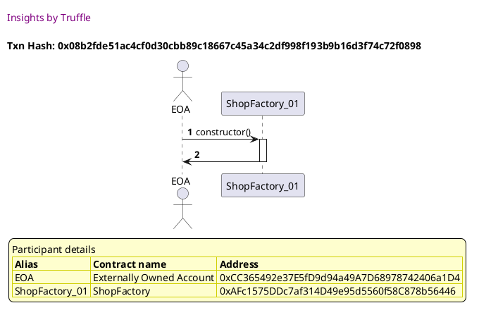
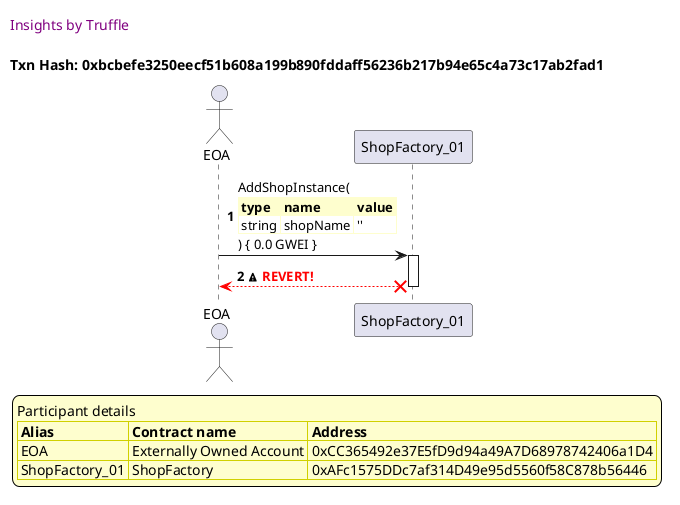
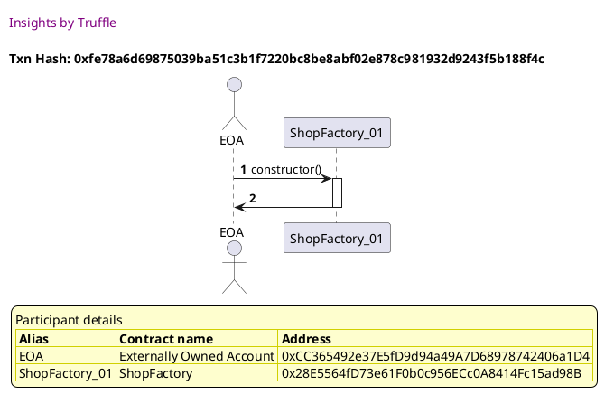
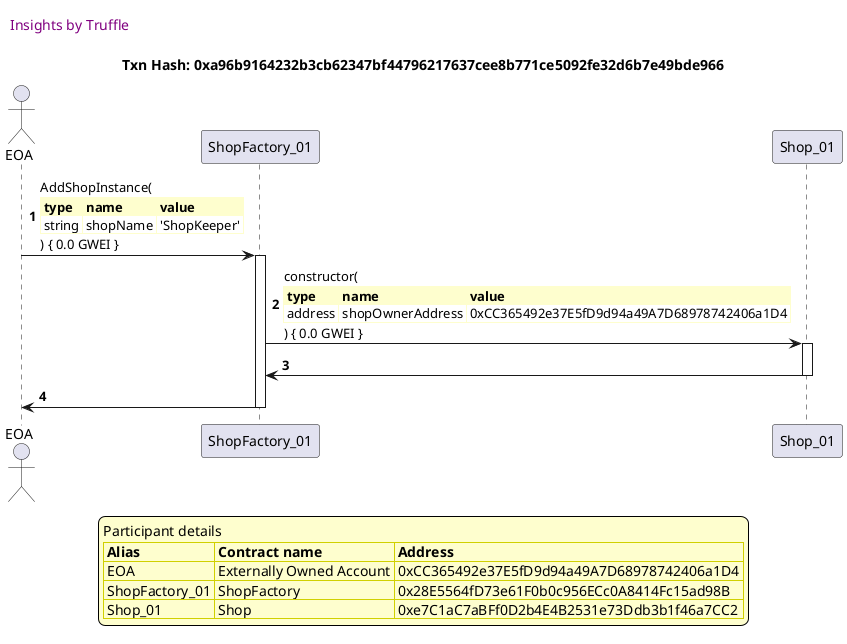
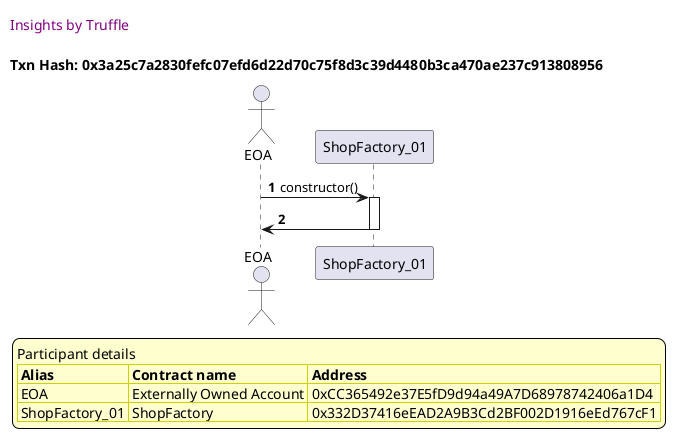
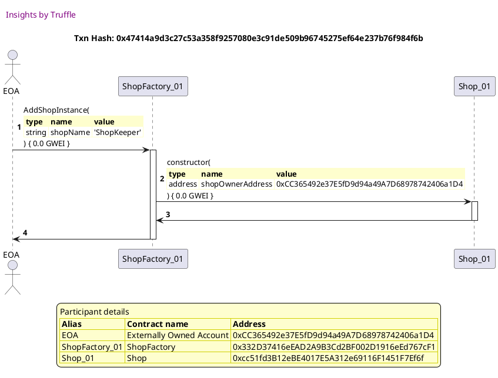
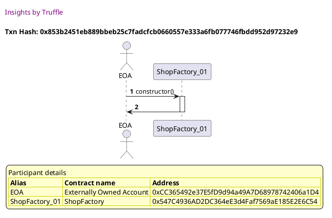
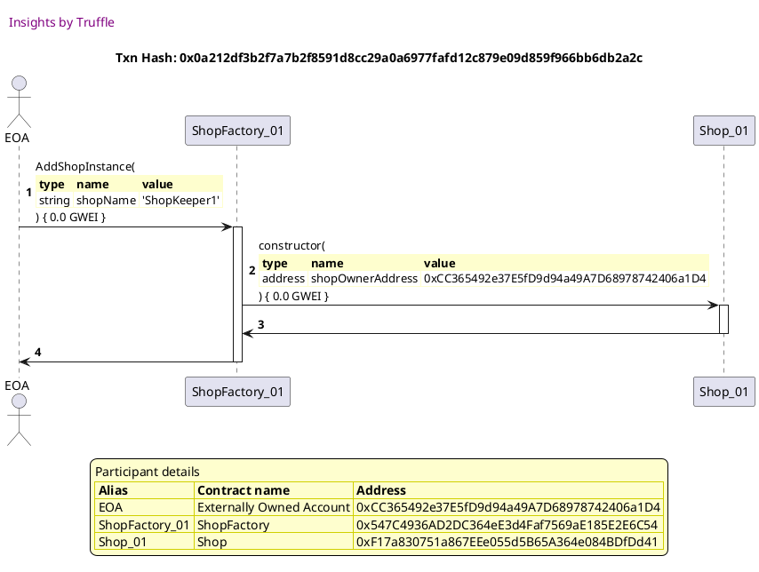

Test date: 2021 Mar 11


## Cannot add a shop with empty string
[link to test...](http://github.com/thedarkjester/ConsensysAssignment/blob/7c5b2f21f354ab6c2adcbc9e6ca114bc570081db/test/Shop/test_shopfactory_manage_shop.js#L15)

##### d1, tx: 0x08b2fde51ac4cf0d30cbb89c18667c45a34c2df998f193b9b16d3f74c72f0898

[SVG :telescope:](https://www.planttext.com/api/plantuml/svg/PLBBRjim4BppAnREfKKQbB98YJHS8wea8pqbG78lA3vi8JHbK1Hgf-c_bvO5esvu8CMPtT7kB16wxuFmOTXPXCGGEZVi6krH_zgwlV1Y1rPlj5FVXNpT-6vmgkniv-5cNQ_hiaPesOUZrIi4uzfgeRI7tzCLuA7pxLldWh25RJTkfrs8YYPS0jQHF4lk1x-t-efuRjyq9EI2FGcbMhU114_Gd_5SVfsAGDF_VxY-tMn33yqHNlnWJDH5eGrMmyl1mOFejml01yoQkL6Q9a8IQR1AiMmQncN2iYoNX8gKoBaod3EJyBJXJPAfrEH4vdE36MSeMYP3BBr-B43qC8ld34NRGYlRlOYjFc-x_NgCEVx4oHXp3SqG6hFWRlM1WjlR1SZEzS4F9_3JP_GXv9HsphzR04BdOQ6dVqfGEeZMzcWvZUpBJOKhZF7g_Hl4cSIIuaSPpVPH5fpOwHDGAELr7xbBtkfzR3FkXw2z4zOUuV6NqmeAAUF32972Xx9CCqhuNATvJKt55IU2y2AlCiPpbfCvmPb8Ad8j_9zDLy0eMwnbGdDQLJ8N9ar8HRZcL56QOKDPoNBMq8oGBCh6_YSNq7tSuyF-2m00)




##### d2, tx: 0xbcbefe3250eecf51b608a199b890fddaff56236b217b94e65c4a73c17ab2fad1

[SVG :telescope:](https://www.planttext.com/api/plantuml/svg/RLDTJzim57tthxW3QMnb3AUryu6wYDAaWvU106qFOveSssaZKgTo76Y1_VVTfb55n_BWwznpVNBFyGqXfxKJrZNpaX3HkCeqyqnRKjyNPY6ic4EffzgeCo7lfxPgZ1fNPMLXVv9Eqd5AoB1sgrB71DfdfeNI5fwxLu3poXPFbN6Y79N5rCorSSYOkst11C4DvQAnYrBl03V5amQFRNDNGgd2JC6ZNUfF6uV7NHEa-_w5gOlfpDMGhU3MDdcElCGLhjHmkpHmBkhP2T1b9ZETwq6VKwrbphtCfw7meYWB8veh9VAS-_s1d_Mz88kOzhba8XX8Bn1PFnVA8sYPTDXwUZa2KSCUnZs2jhb25Wk1KczcrMBIrgn-Kw-jsKtj4TAUWgFu3GI7XoSmKcgTHaLE6Aa_t9axCkpS_zJ5-EKBkDL20qOZvcry46M3ctNv2zJEhct33L9zQolWu623VeHde9yfVFsHNg2VRvfO7ltSjrhzMZUuwVJe18Rl7uKro1d3K6u60clYNkyw_PvUtxxhzOR7RJucIYDPyI2S_e_spN2HgrUMAUr4KTQlH2OqePIkHU8CeOMu6UDmM2JQoaMRhAuHsvwBNzfhmNNfj3MYB5Tm-MYqWf6KECWE8ReSZmS-Pr5V3uAKvqca8YPOD0eIFuo2C61zHdtX9MoN-9zhtKcqjAE9z7Z0aqG68XzuB66HZhZYtASv3yTX46RSPyn7MjJVkK1ESSKVyIy0)





## Can add a shop
[link to test...](http://github.com/thedarkjester/ConsensysAssignment/blob/7c5b2f21f354ab6c2adcbc9e6ca114bc570081db/test/Shop/test_shopfactory_manage_shop.js#L19)

##### d1, tx: 0xfe78a6d69875039ba51c3b1f7220bc8be8abf02e878c981932d9243f5b188f4c

[SVG :telescope:](https://www.planttext.com/api/plantuml/svg/PL9TRziW57tdLrobBvkwQc1Z6w8igkiFTK-jrBvF671YbU08Ootfsly-ubhHil80vfnxZ-yz5uHk1o-S7tS68J7wtewxHZiql7HsBvpOWT4RRTMTa2yRruzM5Rtf7LpLLLqL5KAhmH-DNYEOrbOBfHtycQy0zxthNdlhXSbDjx4xRNrGRFqve0xaX-H-T7kZBuYdxbK3eMViKIZLsGqGF4FlqxdwFXU1vl__j4EtsVe1cYCykx5jWoxodJSQdWyMxiMmNG8-j3fZ8bKfPrc2Ozw8XCYu8MqMHRYHhD5CD2sEDCkOv8pmE58yed6RD8InbaeKB9C-b5uzv206M8HpWO9jlfFTNeHMdxRzlfvYZhymcM8keGL2KnRSh3zHS7sz1DdRmRln17xvYZw5dD8-yc-MWD37iD3ZFoKexKLd1hIQH_RjgiGbndZzzWF2J499uQC8PhiW2rRiz0d8bN9w2DmvR_qsjHdsWzVE2cEEyF3RQWMvbE5X-43XGr74QK9vfEEiIjgIAqu5vNbMfendBACHnQaW9RqK_i-c2s2IZLYL92bjoopMAQbnWoLFqggGE6UKq5gIH2ZExe9iw7zs0Ts6FJpilm00)




##### d2, tx: 0xa96b9164232b3cb62347bf44796217637cee8b771ce5092fe32d6b7e49bde966

[SVG :telescope:](https://www.planttext.com/api/plantuml/svg/dLHTRvim57tthx2wXsxgkXamTgYwg8IFjPgqLcgblLIQ3BuagCH4ndH9s_tt6S9OicmF6m--vlhuSCwzDWXTD4PeqouhX4HhQjKkCz2eUIZLIcYnn1NCGScPo1_ckcwLZEggrlXLcgH9b21qtfXD1LE4-sS1GeB6pyChnfUrBfzgPKGLLkLSBK4PorYO4P3QnItbgjMh2lOMRiidm0uTSpT2obBDiKE6rFS-dhyVHA3X-rUgAUSBq-1iW-zqMnIM5vdIL83lrWfVYcPnXibQ12mB74PTpysyF6EkHtbMKCe3vZgSUJm7c6ISEpdu970By5p9CWuqo2G4Z25RijnOwSbrY4M3ZsmyGhPifipBbR1MRnVrAkqncw_4wJ7xgKFuBgu7e9uMdquFzkAJapCSIjcbhMKZL0wlxzKzEX_QytQ8qvSFs6nMW6rKOjd7Hr6rTjB1Nt1ZT5TNEx5Kdti4FkveFm6iG1zlSM_mCoRl2Fxu9RcofJ-GyrFYg2slhIhTTeZ_qsNxhQ5f1c7NtnJeS4oHTHHvpAU12nvF_28EP4053K8Uiqd09vowb33XnFJlylTqxtavFSD_ThZjHhUCjdS3tUoqK88HPTNiM8r9J0ZfhDehO3jh9v4zszhIZgP7K-E-wKj_gkouDg2LgAeDxlnB7EQvlOVc7mkmI_pRgTnBzBJk9F5zHekOUy2Sb6Ga3toMH3a99zIXQUxuGWQJsI7jBxwU27ZaY8YBMLgGsCreGcUkxpd0lLXcNkOKb0aUHQubieKSoeakx6X_I3y0)





## Can add a shop to collection
[link to test...](http://github.com/thedarkjester/ConsensysAssignment/blob/7c5b2f21f354ab6c2adcbc9e6ca114bc570081db/test/Shop/test_shopfactory_manage_shop.js#L27)

##### d1, tx: 0x3a25c7a2830fefc07efd6d22d70c75f8d3c39d4480b3ca470ae237c913808956

[SVG :telescope:](https://www.planttext.com/api/plantuml/svg/PL9TRziW57tdLrobBvkwQXYmiQCigkCFTK-jrBvF171YbU08Ootfsly-ubZHil80vjnxZkyz5uJkUo-S7tO68J7upWwxjNQeVstjNZYn0wCtsggLaAyRrmrM5Ptf7DpKLLqL5KABtX-DNY8OrrOBfHtycQu03vrhtphhXSbDkx4xRNrGRFmbeGx1i-H-S7kZhmBFxPk6Y5sm9w5KQpSGuGdw6C_5zwa8DFt_f-tRpTRti3x2YnkQ9kWYttgZuULWuK7qspdW0nKabboGbE96Dn9ptQX44Q8ubZnkKaKbpHHZALvJAHZ7GXFAPHRH5ATPdA1WcVIXzEen1z73B9mp56pphMpt8hJwlEtszPXp_8MZCUSQcY4qik1k-Ia4jxTpa9tjlHjEu9Ulw5FAYNRctyq1eVEmqDC_9IZjHMjwj9X6zkscn2N6UFd-0y9CGadXemXcko0BLkpq2SYLSheFiGjl-Jws6VQ3ryuAOuxm-Djg1RcKuM7u4CA7eg19p3AYAQ_YfinKnWJBSbucQSPJpWZ3YOXATYtydqrNm2XBAIafPr6YgxmaURQYXIAh6cDIHja9LJpXiWvK5FgVN43tOGyF-oy0)




##### d2, tx: 0x47414a9d3c27c53a358f9257080e3c91de509b96745275ef64e237b76f984f6b

[SVG :telescope:](https://www.planttext.com/api/plantuml/svg/dLJHRfim57ttLrZTGpTrtMmmEAwwg2J0MarQAxNINYfD3ZO9AZ6HCLtITl--2s4iMRQ7ZGUkVNryEETU6uGkQYUjQvObGh9nbMcMCsrH_L2ObRHoYKizrqPDPFOmjrLZrBGgAujVfKcQJ1E4pcktAVKOuUvPQAcqnS_z5EFBoXPFbN6oZCfYRfRQE63CtG18ON5BkMhigjHx2xV5ayQK3RaRgLHXvfYIFlMzY-VlUn6e__wLgOlvmjLuji5tjibpu4MkSAN6Tsk3BsMzECDapJYZJ0hbPnxF0b_wmIWNNi39Y6W_4rJfW8YP23aBF1xeF6JQy_cCXxaOiJoS8IXPva1wSXrXMUCZY4S8okQAh5X9i7gxg5PfXzby9RJ3xASEuRku3e0wMdmwFjYBJqxESAHKcmRBJffClxutz-YyRy_RFevVFc2tMMaCqSXb5nzbsS2WXR_WsjcshZ00giyT0X-tj9-qNcbxlCMzmS-Ol2FuuvVa2af_8EUdn45RLe4gsxI8_zC5_RQwhdjXrz-Cjj6G8klfr0y39ZpjyoJ8Ow44aqn4F0v7WeyuynW99OtPt-NlwTxpSdg6_-nmsurs6Mtl1hhPQQ7IJXPblMCr9Z4XfBKALm0w2uCfd6qBj8FfmTImR_pIdIfuhvssHfRb1hV-5Owo3EwX-yS2x1B_TYht4Xsjxtkn3vSZr4aKUv6O-5FbJL92l9YADgjuoBEK7jB-ukk8iYoWkV8drDEJX14AAYCV9g6WD4mf2sZAappCWGWAsPSJNS0RVaW_0000)





## Can only add 50 shops to the collection
[link to test...](http://github.com/thedarkjester/ConsensysAssignment/blob/7c5b2f21f354ab6c2adcbc9e6ca114bc570081db/test/Shop/test_shopfactory_manage_shop.js#L34)

##### d1, tx: 0x853b2451eb889bbeb25c7fadcfcb0660557e333a6fb077746fbdd952d97232e9

[SVG :telescope:](https://www.planttext.com/api/plantuml/svg/PL9HRvim47xthpYbBvkwQWPi354MbG5HzzHAxVjai26eZecCqPAk---x41GjgnzyzdTtd---Co7tWvVEZpj3Y1nzRyTTfHqPNZkxbqxkmEXMM_LTrg-jwqUhyjxq3cusvQRCIq9MWpyQlIOmhQsMIZluFLy17dhNlVNMIvEPhhKxRJqoDluIi47dcN8_khtHLuxdxar3m2xOarIgioq4T8R-J7RrTIw2pE__i4FNRlq0rH5UtDWqo4jyvus6buE51pbibq0F2O-gaF50LqcILfMkGbwBHggwgIiQnvHpeQCead5JKI44GwjKoaELYZ0ATKfGijfZwULZ1dA01Te5GTbyLtTxYQq-R_lzPeev_gJ157CDBGYPik1k_S45jxTBg7ixU3UUm4-VoOUGKzev_su9X9o7HPx-AK5fBpipaDKyiYyt1IqefUltRu0pmPBmaAFO3cd1ofq-0PbIJW_ek-IjtwSsSJzuxQmqvWYFlwnMaDKrVWoFBdh8yoZcB0rr94hU5AbAcMHf9eeuIKKYMCXeB8E2NHF_9zCLCD5o9dAMHd5MX0M-m7GPARQHZU1nAiiWuMLOnZa_qMB_imha7dVys7y1)




##### d2, tx: 0x0a212df3b2f7a7b2f8591d8cc29a0a6977fafd12c879e09d859f966bb6db2a2c

[SVG :telescope:](https://www.planttext.com/api/plantuml/svg/dLHDRvmm4BtxLupIGrgbQGtBPvIkGe1jeafDf4Jg9L8rYyqk2ckGCUrkalxt3YobkqrwQ3bupFZvyTwC3MDdZK5jsbN96BQcKkrgBZLhxWjLeyOLb78XbJZ7x7wXgrQ9k2eh3QzcwIoDKyPE6xCfvPH1_omb2gdXSNW5kAXqyL0fWsLK5WkraieGOsv6m8mMjvHrg-jIxYtS50yIB6VCNQCGXLg0nOVKZpwUlXz4iE7xbwef5alJm7m3jxhDS-9bfZ2bXDkrWWjibYV0rnnjonRvP6xdFleq1cveYI3Bx10vUg7lvvWBoyu2FvGy5BISXvutdtjYRgETCIfPPaXwUXK1Dd10yO1HsKoH5JMIrPjbLSzwpEOhjthCVkevV1VN0rXF2yVJPtlXwEW48Y6wD5asg3Bv-axTiTEXFM-7E7tw06PJIw2eSDN7RrYsDEdWJz0OtTML9aJrkKV0OKVxISfQQkjm2tm3Zy3VSVZu9RsasZ_JyqlZA2whI9PkEyJ_2QE6QzaqWxAhxqhgQ4pnTHnFFDS9RJdnKpTFGX4ww8IHdtX1w0U-OplSGojn_Yv_J_UUb-CJUDdXjXtTCjjU3dQzqqCX3HPbisCruGddlBDATu1QIvEO3hScsj7qQ6hSDttgZnMDQoErmhBSGETVG9HbT17DFnPWb_YFOxcNw6bTnu-TSE95YPtG5noPJeGpmzntlH1JAt1JE_LYzmNQttmzqSpoCPXmtxKmyFmqbTnrXNlkkL77oWFdFCaJuT0UHeKSoidEQAG_qay0)




##### d3, tx: 0xb47e961b04d5b8bfa10156ce3f11441ea52357afeca2dead5d6be9ee29497e17

[SVG :telescope:](https://www.planttext.com/api/plantuml/svg/dLJHRfim57ttLrZTGpTrtMmm4AekAWEoLfFMIgsqbqgJmPS4bPZ8c2vfkt_VXJ2MhDt3nWFNN1yVdtEl3I5dZPN6jikA4DdQMhVB30nfxagzaaOkQGLpqEgZpE_cfcwrYkkgDlJLB9sbSKh8QMCt5Km9xPy5I0M6FWwVb9xNfdoejPLLL9LplGHjaR6m8s26arlALMjM5UnDN9SFGBaOSrTIgLBFAMT3waSVJzyF8iYm_uLkold2DZJRq1lJ5WNo4blQ2kZDMjDpsInEA5jd8e3GvnaJoiicMI4vuvwVWrjmBWG7wJck5yW2SkaePFQKdq48u8GY380714kMMvIUNaPKDlG0um71ijaoBrSIhLulwjMinso-CTvZzbFFuRku7a1wMdeyVRQM7XsTq4YfBesMhTGvlBxLj-HqQC_R8KwVFb2xMG75gEMoZ_UoQd7GmPzeOqrNLnmWrPSUGGyxsiy0Ap3EuHRuXZvIzexHJr_J2wpzCps_D8xYyXfbcRP3_9ymRBY1fXcKNNxNOA8nnTPnxFgU21rmWzGhab25Geem2X9_4WQJG3Y2-P8duk_oztJlUJa-eIyxtBQZcoRRoq6kTdgemCgoQdQi9YnXZ7LMyGvWQt4Gu-4sI3kQ7asDwwPF_R72zzg2qRAgDhJphsYKvtWHxJyMO9VuZsEvb-XfFH748dJzA74It450wYenaqNW-Q5C-SHBdTIFlHTeV_FrHD8lmiWfPZBaVg9O7hZWi8GB1i240n5tkUF8C4OYBEHGJdA6R_mZ_GG0)


##### d4, tx: 0x498e82ae0ad27fee62541f56677a74c2d63b0cc72f894754dffce3b955fd30ad

[SVG :telescope:](https://www.planttext.com/api/plantuml/svg/dLJHRfim57ttLrnr3ztKTJDWC5HTL1h8MarQAxNINYfD3ZO9AZ78c2rfkt_VXJ2MhDt3nWFNN1yVdtEl3I5dZHN6jgkI4D7QIhUhkJAakIzqBOnOGQaMIijpaTqlJDLgEQtAoi2hMJfBfoaXfutTb6f2e7-MIaXbu77u1BYeJF5GQIlAk2mMUgMqHSRSZe0PJcufwzRKfTgRk2aU53Xip5qBAGkz08SEgHzzF7q_Y233_fUwAHPBsy1y0xUcpNFa9RQmfOBRjOOBqInFWAvP5AhG5OeAwV9SgS3rcPFxGS2vu2npPU3DQPPnDmyZndqcypnJtZpo_Lnwk8XWoJABqjEh64G31nWF29RD5bbH2xHwiwpgMO_PVALEZzbFFOVlude0wMdXUF9iBHmTdK0iPPT6orReJBs-qtVaT6ZFso5EdZw0tTGAC6gnwkCtKROuwE1Fq5ZJrHK7IFMvHy1XH_j9gLePxt0BV0EFGDzH-FWblSJQFzFpI-CeBgjGbcaxnFy9muORrJI3igllMfbuJD7rTEe5FejSvV7KpvD8HaomAEP944OyvCnbD11EmlukVq_tdfVZ4tZPuROTtJJPNWvolTD3gQmeocR7Qa8JIcbd5Uy0jXO7KppS1cb7qwEfSTtagJzM-5vRPRGeomrq_YN4MOONqVvZ0NQ9_pYMUucUrcTyoY8lY1CtmHsOIZt9PYBdVX29r0dzr4s3gVy2xM--deZoq8zuSfv6FdS26Nhd7aju7kVkZ3hKJKCHkZAbBX9X8OToaZDyun_f9m00)


##### d5, tx: 0xa64c0c93ef5adc0a58e7ab4d4cd0d2b993a1224b43a6cba1348c3ad55cbf8852

[SVG :telescope:](https://www.planttext.com/api/plantuml/svg/dLHTRvim57tthx2wXsxgkXamNrKNbV2nLfFMIgsqbqhJnJO9AZ78c2rfi_y-GnXBrkvXuu5hhe-FpxdN1g6BLeFItQf223fToswL2uNQXr8se625Ax4Gai-1FInKtKaUrrMjyAiipT8uHUYyrPjAp10UdgK0BXH-6ZynlgnL-LXB3LLKbGkv4b8Rna9FWCnCxYYRJZMLE9YuBHy5jkYKkm7EIxd05XbJFuPu_duKWSRzhsHRBfQwnVa6twckA0mlqgMk1BvRItm9xV8CapLub14MEg9mWJC2RY1yo2cdZ1Dkvs7eW6NRDASEU2m7ow41Su2xBikB871jP4h6j96UNaSOMdnauX4oPTCbAnimLc-NTPCDcCrNOWsOmzHp-3vk0A215f_Edgt59oTdEEAyJnlB6YGJh-_bFJeVs_DsZBFj1wmtZS0cIbWDyHjKdHdqy2rkjUhhQWQ6wlE0mCSzxISX6g7eyGxu1ZzXyexWZr_IArFxPtf-QPp4iTh8KbsF-3zXfk5AjEsexFgx52gQKcGTnuxdqj0MZf-wHHBoa08D8p_nWj0FV6fJue6LqB_BFz1zuENq3B_iSDUEVXhjBWUwsUiX5nhAgjspcf244D9RDNV0jDOCOdEubQ6TJ4-cfdMpxN2ip7kjXP9GLHlS--SuOinSHFsF1TWd_kDO7YG6MfVwCGqTBqhinEn0HUfmca7Xkru8gHMugPrwiVi2xM--WIWZDF7ToBUf4mPpBaX1Wy0ZMPxaJcABUH7E8vQHq12PGexbH1VcRVv8Fm40)


##### d6, tx: 0xc1879129ff06ed152d8dc3c72c02dc21d6ef007bca2d422184f8680e17412315

[SVG :telescope:](https://www.planttext.com/api/plantuml/svg/dLHDRzGm4BtxLrZbK50fs8xpLPLLqtpG2ebMQYKkbP0RExjHiqxaEB3RBl-TIJQ4NLeEa4F66Jy_lpTZ1w6prWfZksM5aEXihRlblJAeVIXr8unOuahDbPRd8d-OcxhJCgwhsk1NMPgbSOhGQMlNbPeXF3mB9QGo-6dynFYYDkLZhQseeggSwwNI5XWBEm4ocDnIDfrfAhKtSLC-AapvbBiMKfPwZYaPKp-6UFf-5876_IzrMyuNjiNtQtnhkg80NcHBMobykzBuGhIB4qnMEGtyaBAmA8Yd97MP36Jkv3xB2PCvez9J1I7-VIwOv8pHW1U15n15VKwPGrq49SijI4-l8YnQV03n047PR9cNZG2hDukwoGRC-YkX0sO_zHo-Yni0QA35nxDdQ_7HqGcEfEpJODaAdQlNT_eEdOxjUJl6sUO3jkj6OOXQB8VuJLGT37hu1hVMz7M50L1z7X3uiAVzf5IZZ7ku1Rx1JvYy8_ZZb_GIQlzCpo-DaxYy1bccwn7_9mmQRbJRZigklcjbeYb5Ld7iU2uFcNByr2sIK8PSy33o4oy8_S3dZ1DFq8J_NVwUxZqlnoVuPOVRTlJJQ7ivqFLE3wMoegpQ7Qi9IGWXlLMu0z1Q6CHmk0tGJgOdKzEwsMOuLl1UMMMqgAerxlrB7EKvN4JxZmNO9VxZMEub1bgN-p4F7IzAM08xS9KwacUYy5ql52aDt9IbNko-GFkRRo22MnCvhdVEWuIpD6H1LlWP9m5db56FaeI7hbJC1o8ev5XET0Pl-2Fz1000)


##### d7, tx: 0xd29ee950cd123e975edb0cd93f9709ce5b33403973f519b86285a3f1225b7d9e

[SVG :telescope:](https://www.planttext.com/api/plantuml/svg/dLHDRvmm4BtxLrZf8QtIj0Pim56w2k6ZYIeraHAfbqYLmMONXJKhOzhT9Ftl7LXATvlqq79WxF7Z-RqP6uJEMYkCxPOrGgApZUwMkJAelQ_qIXYnnBMQAotFHN4_DqsdPTpKZS6liZHBunIXqzPkQZL3U7WMIaXbyECunVYYCTL3ewseexgQwwNI5XXBEm4oMDnIhZgpgjNUmatreB13fzoraBBIS-oGCVLZYAVlHn5etFzIjzLyOLkSR_2jwSeIU96jRAtmxLhZ2z4kJZ1PIvShnHaffEDwYWTCoHmct2jvG7YXMEvvb7Wyy4hcy3pqtP09htHSb-M1vC29H651UdeLOT7Y0uW72Cfcgw9Q2R1wisXMsO3PV2NEWDbFFOVluWO06cZnyUpPj_Zew0H7KlPfi6o5BjJhEts7JiVsl1tZxEa3jfkLmX2rM0xncwWx6FJm9znQqzSL1a3rUK3Wmvxsar8hPVp3BV0DViJa7S4VlwINKFjdUdvfdCGL3SWoNO_uFs7GSAFQTbHszLqh4qqfievZpsUKkyeBKbOcN78gA8-2n0zv40RKfSGNJaB_BdzFzvwNunFyiiDjE_fbjBqSw7gdXr9PKTNjZjM498IGtYhS0MWj368ut0Pe9zEJgUcxsTDmhE2zjifeKTSRtFkNE2eAk8Zs7mkmI_p7iTnB3BIC1Z7bdXybRW8xK9LwacQY39ZFHUg4B7LJFsOlqFxcsnA9p7V9kGoOmmBkP658CZy9_SJ9VO-U4-g5Vboa8H118SToeZDumn_f9m00)


##### d8, tx: 0x4fab8aea6e894e90276ef8263f05e3fda852891b9a91a0c644f0e39ce55dc2d1

[SVG :telescope:](https://www.planttext.com/api/plantuml/svg/dLHDRvmm4BtxLrZf8QtIj0Pim56w2k6ZYIeraHAfbqYL5vjT5DOWOzhT9Ftl7LXATvlqq79WpFZv-RqP6uJEMYkCxLOLGgApjUvMSsLGUr_gHXYnmfLQA2tFHNw_C7MdPLnNjS6liZHBunIXqzPkAZL3U7YMIaXbyEFuYV55RSg7MbjHHLMvq2kbBJ0MTW9aCBcbR3hJL6flugPyKDYXK-vQI5dg1NR8cFennDFtemWqxd-fstAnj2sUR_2jwOe2U94jRQNmxLhZ2z4kJp1PqqBCGw64hq9E5ITkuAiYT7sl84nvXHGXSqFkpBdWZY2vJsb1bCTpnPZCNUaWA5bkGNfw5M7HuWE81mZAPikyR0HOlLdMJJPWDb-9Cs3sKy_XkxW1W0PQV3nxjXOV7PtWICe-3PQjqBbwVQVlqEdOdhTZd3rzm7RJA0nHYzKGlucgWq4FVyAjDNrTOG1KdmS4FknfFodLA1CSRe5ly2CcxmZ--2MzXDe_q_DBuoGkhq6MwNh4_mc3XXlLjgEog-zQcMXAaNKSUpwZt5LUaB8YuP9JGNaK97x8Wp2WBYM-S1BwT_bxklUy79_Wbnrksz5Fe-tbGDSxFPJAYh9gTwmc9264z5RX3a1hOH33uJP0EvcUJ4thPa_3iOBtsYgZHLLjSEzVuYZFuIBQVop0Bl4Vnt8lCT0o6iIKUtwKk0diG5NgIPg98c0-5waJijHD_PYzGFkRRo2YFZcNZiiupHpNyJsQY8oGypa35i_9MS0JoiYy028ev5XET0Pl-2Fz1000)


##### d9, tx: 0x53c491c54781aca3032634744e78454643bd8de795815a70aac445b21d4ee179

[SVG :telescope:](https://www.planttext.com/api/plantuml/svg/dLHDRvmm4BtxLupIGrgbQVam64VfAXJO9ghKH4gaNY9LNcnsKLYpCYRTJTB_te6bTBT93oq7nemVZ_TcF11orbXXRBki216jhNMxd2b3chjIhuGHIwZKN6dvKUHtSrEtMYPrLHjuDSscMP8HSjhOJQKc1FfheOHK1Xw7Hu3psfGFjRQYYgjohfTAMsGix0YOukQMSjMQLQNsDgxB1mKk7NDNGifIpy5rXjIFFfw-7qIGuViNkYdd2zl0R0CtfYqAv2Msj9M2cxM6Sz4iJi1P1tvEkPi7b4Mko8Nl-5xeKqQfOX4DQ4ZzcOoaOZo8t40mHuYSqc3ckP8gvJ9Ei6IvHUdPPGoYWGEC1mJBPikyN0cqUhseLzCUi_dck3rcF_KSlelh0QIdXUF9itVXwEW4OYcxD5gsGkVgzQs-9QT3UzuESVBq0UncfG2Z5ii-tekgnKK7VuB6cgwkk42gBpq23ZlQpqgjb8aEjy0ty0ZEEmS-VSqkiFRFzFpIE8hBQvHbsWxnVyAmuKOrpQ3iyhjM9XvJpZf9_32Wt5C-ou8YvP9JGNdCqZ3YB6BKequet9J-NVwUxZqlnoVmiiDjExfjiXqEShNJGwciAAjcnshgf8xZT5Pn1h2rk4ZmS1ka7KsFfiRt9a_ziSBxsYgZHLLjeFCl8Svp74JxZmNO9VxZMEubUbeSYOHoFunJByKlK9Nvaav5mOAGYyoDWipBmYHuWVOtNqyqcuK9zLnEiGACHpddOL6mqCjInYAUHBJ0oUBIGo8iv51ESePt_2Fz1000)


##### d10, tx: 0x4f48884eb203e0167db4ecec54c68524fc3b281e691c2f0aabd64aaf447f5f5a

[SVG :telescope:](https://www.planttext.com/api/plantuml/svg/dLHDRvmm4BtxLrZf8QtIj0RCLvIkGe1jeafDf4Jg9L9byB2BmXfaJBkRfF-z0qlfRfCUMWwC6Jy_lpTZGyXPQuGstQeYH7IcLjqg0qtQ-r8rGeiLhM01IfwB_7wXwqx9kAvgJL_DqtaQfuISjcPJmOpGuLc2aA3fu_X9wKMjouTQ6L55LRbGAr066Gip0UOukQLiEjrKi3TnKpu0jVYKknPIbcf1BJQcVWpnzFqeWepxNwgsN2nDIxCDlTLTKI0lCQMfWDwk5RqGxVA4iZKlU10473ARES0ipvSPXnnob-TUuDgyo9tC3YpmGYkt2oP49ZqkHC6vNxY5AmYMB3SeFRsAg6Zf0SO3WcKpPLus0gtUBEjcFc0sNvarOFPJp-6xk0501bfwF7ksbXuTdT18oZwDberGERo-KtVaT6pFsp7EdZvGisc0ObHYDSHlekfmqCEVQ6jqNrSS8DNd0K4FUzfF00tey70BV4CVANl7wCSlwINM_fcUNnedSNcDidJN8_vF63PSGzkEogw-Az3Hb6BhE7OybuSsE7xg5aaeGovu6Fc95uH-u7ERCqzO2V-x_3tTUrwEJ-ZB3hVjwAV9zdAGwvqUIZ2YhDeTgmbB66EzLRm3s5eSn7YuDT9EfYTJqxhPqt2iyBqse9MegWtj_KiQvJbUHFEF1TWb_kDOxYK6MfVxCGyTBqhi17VWa3gIpqNXkrueKYjmKplrOlS5sjzy0r74VDTdXGViNDfC-85qNJjDU1JXnMCnpnn80ZTta0WBEPQJdE4R_qW_0G00)


##### d11, tx: 0xac4bda6a42533e5d2ca41935323a1bb71bbbbf3b27480a80fbc04d98723b798a

[SVG :telescope:](https://www.planttext.com/api/plantuml/svg/dLJRRfmm47ttLrZfGrgbQGsOMvIkGhaqKQKcKYBr9L8rOBEBmfgLCUbkalvx1vRItIPzQ95WpFZuSCwC3I5dhG5jkcLD27IcKTqobvgqTvLQWOObhULSAl4HYhkvRZebugPkD7sLfLaQfuISjcPJoncXmxMG8AIcZ-ChfUUDhXuQPQ2Ewcgkbb8PP2pD1CXmSakvwlIgbdiJrzM3f1QVSbSWHANcr69ZwiSGJz-F8iZu_GlLLlE5QMc-eJUwAqla9QOojQGtQqNFeLsSKBQ6WkS2FE2swpZI5NO1t0eTrx4TiFBSnplFIoUtVHum25YP5uoBCF1j9_V300YMh30eFRsCABJq0EC1mRAPggXMW5Ql5yqg6p2RRymQCFkfv_1Tt00W0oqzdZrRIu-EJcWaH9z6omPK8L_VgbjoEhRdxHXdJn-esQmanQXWESHxg3iSzF0dsXhTrnK7IFLbGD33dlQpb2kfBNQuHRwXZvIzO_JJr_G2Y_zCq2-HaxgYGLswwn7_fmmxhcNRZj8klokfeod5rd7iU2uFRUdugLiceGWvy33o4oy8_S3dDcSUM0d_k_mztNjUZa_eomwt_UYdoVPqaAkT9WffeAhR7Qi9InXZlLKy1DXR7CIukpNIJgOdKzEwsTEmh_2vDb8hgEiDxVqB6XK5daJpZmNO9VvZN-ub1bgN-p4F7IzAx0I_m6Ng29v1wRjU2AaLkAcTUh7x0krllYsHo5CljQKLPt6SEPQTy3AoOZlcZWr-Mg1I4GHvW4HOoB6Sv0oV-4lw2G00)


##### d12, tx: 0xa0819935e3095a0bdfa2fed1b3f36d737f05ca75d8ebce48c62d4dfa0788d960

[SVG :telescope:](https://www.planttext.com/api/plantuml/svg/dLHTRvim57tthxZg7hgfwsR0VBZgej90rchIMgcLzb9fSh19K8b1ncn9s_ttNGXZoTezR3nmpVNnyJdtsX1orbXXRBig2H6jhNIxcYj3clj2ryA85PHgeRGy5zdzmbIjbjEgh0oycgMpT9eISjhOJQac1FfdgOHK1Xw7Ju2BoXGFbRQYZCjYeLTAMsJCxGYOuUIMicvDNQgzYPlYGO73njoraBBG2t3eaFhHnzFtWmWox7-fcsAnj0tCDt1hsZn7Nc8BMoguNMku4Cto1EXQqCZXtFELHxalw5pcmisLTEPUxWKozCAS-fa8VHcfUQPOb0MkP0YYOHH97b229SiiIa-lOX0D760y85WsMsH5BT3gpRAgPprcyvKwFMO_zHo-Y-i1fAU5uycpjN1qT0Anb5qQBLkXC_NwJj-Hqw4zRuSuUVe0TbChmAZ5ge_VHDdYe8C_GMDDLrSS8DNd7W677UqdfMfb7ETmYtm3Zq3VKVZu9Rt4uZyJz4lag2whK9TfEyJ_ASEE6zKqWxIhxrgPU4pHzNJg1JxZhlB2rCyJBZaJZCTX4aGyZ4BcCXe89s5_bx-dUy_ByGcyx73RZswQR6y7kTvfebHM56MpOpMX2QMqiugN07kBWocUReEqe-dHrBXkyjIVAtolhJ9QbEK6ElyIuYp3csZ_iG2xn7-Soxr4J-kpSCgu5yI9c-0EJAMUP3EHXtx0HUf4VkgcmTH_WVOtNq-KkGplK70U92uFpsamyqGaLUXobqT-v7WiH00FVIJ2GWxb96Vunb_IJm00)


##### d13, tx: 0x47fb57f335169bc321d084892b76a354131c6f95d6f5aa2b593dcb8011c46f8b

[SVG :telescope:](https://www.planttext.com/api/plantuml/svg/dLHDRvmm4BtxLrZf8QtIj3ROV4JfAWJO9ghKH4gaNY9L1fjT5DOWOzhT9Ftl7LXATvlqq79WpFZv-RqP6uJEMYkCxLOLGgApjUvMcJAelIzr8unOuKejb9Rd8hzVcBhJCgwhsk1NytIUnYb2fwtTL6g6yF0ibP3AuCVn4-EBsfGFjRQYYgfoeLTAMs0ix0IOm-IMikbCKwczYPloGM7AfjoraBBK2qp9cFennDFtemWqxd-fstAnj2tEDlZMT4K1lCYMjbBuTgtnXMYN9vYicLzat2zSbrClp7BNeP84B0YTpFU4onbrQUuL8PTUmOLmCXwwCiy2GcdEl2B849Gijo0zlOgmQF41n0C4PRDbNZO2hDuiwsO-O3PV2Hqm-wddy5tS0403BJwUFLkBZuvES2HbdmRBLkXSlRxJT-XqRC_RCSwUFc2xQHI6gCLgYDz4rS6WXp_Xrfg-hZ00giy30X_sj9-KQfIXpk4M-GO_OlAEu8zVqaie_ZD1lqHEwl8QT9ckH_oVCkYuKMqxIhlwhfM9fXHPnx7hSHOwolLJNYIX39bWOUGdNX3wWSySHZn14_Pt-NkwzxmSd-2N7MxxqK-ZxUr0rpjDbCgAicfth2Oa8OJqLk4IG6zX4CFfDa0xcPvCJUjcJyEvWlVQAgD5LMrmxr_YAC_X9jf_BC0kyH_dSYynq7BcnonqlIXn4jY1gTILR2uAdtkXI6d0KoVrOlu2xM--WSWB9JiFFL9GoiF0JG8_9G69vxIGDFSvyHqtFdSS0aHGoB6Sw0pUy4lw2G00)


##### d14, tx: 0xffa2c0341735e27ff0161427b0576d53f5c0decd02b186dc6c79a94b424338f1

[SVG :telescope:](https://www.planttext.com/api/plantuml/svg/dLJHRfim57ttLrZTGpTrtGms6AekAW6oLfFMIgsqbqgJWqs2IWmoPalQxDzt8OmbQ_UmyS0rryV7vznhWz15OuMnxQf4IBIsqkrghWng7WfT2oDMk5GBfULKP0yBKxLQnbLP6VngbixIE4NelB6RKaqGxf-b4b8P_3HyOdnPcUAnqbQKKLaiz4ff2uov7G4pcDnHrgsfItKmSLiyAkomCNSZf2pq0ZjaIFteu_dxGGGQzh_IJR5OsWRFD_ZEj7aElCWMjbJuRgtnfMYMPvYiyrou6Q7CuTHJBizpulWES_cSUDoN7iszZ4YLIUBEdS2NcP_nK8Hipbn6QP0x24gMMP2UNaTODFW8uX62ijaYAse1Lc-NLJthCPklnEanXwddy7rS3q0zBJwTF5kBJqxES2HbbmRBLkXClRxNz-XyQC_R8Kws7x3Tr0f3r6BLns-YR67GmRUuiQQhAmo0wdEFmCSTxIUbQcKSUhn3li5FcBmZ-EENz0gA_qpGBv6Zkgm2NQRj4F-d33fkLDCCqgw_QsMYCKNMSKnzZuMkeZpryYIK8HCiZ7ZY1o4FE7IA-C99sD_b7-W-y79wXbzskEj7DursjmFTx3LHAYkAijcpcf244D9PXKi0lOL13AVR0EreUZGrhfji-tC5xxLLHekotE3ElyHHbi5DjFzOW7tYFyxbGQAdzHYFMKZzA74Js86fb4es4pdt_52aJk2bRkh7tWkql_bw8ZhbWKVfBFH35hCeYfriJlCWdxfk89WtvJuBE4aI88923kL45_26Nz9F)


##### d15, tx: 0xb0966fb069fe36c73e3d07ecd608303a81e61c3445f9194561c2a0673c55801c

[SVG :telescope:](https://www.planttext.com/api/plantuml/svg/dLJHRfim57ttLrZTGpTrtGmOWwikAYNEMarQAxNINYfD3ZO9AZ78c2rfkt_VXJ2MhDt3neElkJu-d7El3K9dZPFMjQiI8TcwohIhkRQekIzCBQrSuL8lj57dChjVsAerAgtAok9NCp4JgK3ej76RKayGxf-bbafR_3YyOdnHsUAXCawMILaip4eR1uov6m4pMDnIrgsjIxstS5CyQEpHCNSjbIhC0djaIFteu-dxGGGQldzfccAnT0sUR_2jRVCSU94hNAdnxThW2zaiJp1PpmbdB9yJndCTi2mATA18f3F5I1oGGCQUPbuMK1hctECqX1TV4XO5MHZ6nCiGb2np85rS9LWs-03Y0OAokI8hQWbMRvPLFUincw_4wp7xgUVmNLmFG3qjFfuysukFZavmebIN1ijEcao_lZDtw7HepziXJfu-OBUfDOPevAgFtsJPmgI3F-76sQwkC06gppq27tQqdxIkjVNeuHRv1ZzYyexWZr_49HJ_cQ1V8aTrMGMwRDiX_ayPTDpgfXcaNNqtsYPZYgpJD60XvRuE8X7cKwuubPGdqPJ5F8eZwbF2f3UbVvU_ftlFo_49VjdXjX_TCjhU3dIzqqIbdIpAPiVgb4m98PrLk0JGMvYaSBejq8wcHrFZlibJVwvWN3jjZIpB3UxyAvna6Tn4zuy5s2N-urpk9NhQa4OfvG5BfluKla2r21IToJmA6PV2YqFX2vQ6Bz3-vkk9XA0wL5IUCnw7dkz78ZsFqdZEGXuBwj6S-vaKCzY3e913ET4PZF1B-Wa0)


```plantuml


@startuml

autonumber
skinparam legendBackgroundColor #FEFECE

<style>
      header {
        HorizontalAlignment left
        FontColor purple
        FontSize 14
        Padding 10
      }
    </style>

header Insights by Truffle

title Txn Hash: 0xb0966fb069fe36c73e3d07ecd608303a81e61c3445f9194561c2a0673c55801c


actor EOA as "EOA"
participant ShopFactory_01 as "ShopFactory_01"
participant Shop_01 as "Shop_01"

"EOA" -> "ShopFactory_01" ++: AddShopInstance(\n\
<#FEFECE,#FEFECE>|= type |= name |= value |\n\
| string | shopName | 'ShopKeeper14' |\n\
) { 0.0 GWEI }
"ShopFactory_01" -> "Shop_01" ++: constructor(\n\
<#FEFECE,#FEFECE>|= type |= name |= value |\n\
| address | shopOwnerAddress | 0xCC365492e37E5fD9d94a49A7D68978742406a1D4 |\n\
) { 0.0 GWEI }
"Shop_01" -> "ShopFactory_01" --: 
"ShopFactory_01" -> "EOA" --: 

legend
Participant details
<#FEFECE,#D0D000>|= Alias |= Contract name |= Address |
<#FEFECE>| EOA | Externally Owned Account | 0xCC365492e37E5fD9d94a49A7D68978742406a1D4 |
<#FEFECE>| ShopFactory_01 | ShopFactory | 0x547C4936AD2DC364eE3d4Faf7569aE185E2E6C54 |
<#FEFECE>| Shop_01 | Shop | 0xEE4e5d4aB69851227ECB7C8b6598E414f92caEF1 |
endlegend

@enduml
```

##### d16, tx: 0xf049400d652ec0a07f2ddd2393be80d071806c313d6bf3aec57fd6495bb891f8

[SVG :telescope:](https://www.planttext.com/api/plantuml/svg/dLHDRvmm4BtxLupIGrgbQGsOhoXTXG3RH9MQI8dKIwJAOBEBmXfaJBkRfF-z0qlfRfCUMWwC6Jy_lpTZGyXPQxWstQeYX7UcLjqgavgqzwLgkEOhgEH2Ad7Ey_k5hZibuhggDRoQf_CqJWavRSscaZC2mxEKN4WDZ-Cdm4MjouTQ6Lv5LRbGAwaCCXPc0innSalPTBgfvDx4JVaWmM9JxfeBKQe5M7HC_HZYwVjH11dtlrHjkLYQ5h8DtEgkA92NcD9K4cxN2Yvukpm1kYue2ncbmdDjcLDE_S8MGjXEw6Goe8BwLa2ztB4SuMM5msNk-eNmMEXcMH1QHK2mPBb1wUbL1Bo50um71CjcohniE5gzMTRDVC1ilb9hmEoddiDtSGE03BHmF7ks5ewEJY0Iea-ZPSDLBb_VgJjoEhRdxHXdJn_0R1e961LV3V4RhpeSzF0dQ8tkwue3fFey8E2mf_qaPIErvHvkaM_W4UWx2X-_f9TO_6U2VecSrEKrwj9TZ_W_PTXnBTjsb7RrNKaTJIcwZcF7SrbeIyTFtI89HSWu2oC_yOBG3tncC-fnAs5_bx-dUy_ByGcyx73RZtwQR6y7kTvfef26brMxOpMX2QMqjugN07kBWnXFjqRQoVHaQbetUnhE5RxNHch5gse3lNy1KPxZJJJ_M81TuZ_EvLvYe7MP7xFGyQB4Jd079bD7i3alVDSBUMe5RcgdNko-GFkRRo3YZ5hCjTtWd0THn0CtiCCio7pRZJCl3It7FlSjl718X8KSoqdEy8s_f9y0)


```plantuml


@startuml

autonumber
skinparam legendBackgroundColor #FEFECE

<style>
      header {
        HorizontalAlignment left
        FontColor purple
        FontSize 14
        Padding 10
      }
    </style>

header Insights by Truffle

title Txn Hash: 0xf049400d652ec0a07f2ddd2393be80d071806c313d6bf3aec57fd6495bb891f8


actor EOA as "EOA"
participant ShopFactory_01 as "ShopFactory_01"
participant Shop_01 as "Shop_01"

"EOA" -> "ShopFactory_01" ++: AddShopInstance(\n\
<#FEFECE,#FEFECE>|= type |= name |= value |\n\
| string | shopName | 'ShopKeeper15' |\n\
) { 0.0 GWEI }
"ShopFactory_01" -> "Shop_01" ++: constructor(\n\
<#FEFECE,#FEFECE>|= type |= name |= value |\n\
| address | shopOwnerAddress | 0xCC365492e37E5fD9d94a49A7D68978742406a1D4 |\n\
) { 0.0 GWEI }
"Shop_01" -> "ShopFactory_01" --: 
"ShopFactory_01" -> "EOA" --: 

legend
Participant details
<#FEFECE,#D0D000>|= Alias |= Contract name |= Address |
<#FEFECE>| EOA | Externally Owned Account | 0xCC365492e37E5fD9d94a49A7D68978742406a1D4 |
<#FEFECE>| ShopFactory_01 | ShopFactory | 0x547C4936AD2DC364eE3d4Faf7569aE185E2E6C54 |
<#FEFECE>| Shop_01 | Shop | 0xa40145258Ba8AAa85829b8b725Cb6E9132B7193b |
endlegend

@enduml
```

##### d17, tx: 0x0efaa263d3678d8106585e9b460bd584fd52ecd3892009cb0dbae632cf46c122

[SVG :telescope:](https://www.planttext.com/api/plantuml/svg/dLJ1Rfmm4BtxAwpqa5PfMWEsWIXTXG3RH9MQI8dKIwJAOBEBmXfaJBkRfF_UWQLqjqaFBGV6Z1-FzsOy87JMMc5ijweG4fsjTRVAb47jVQaROSGALsgXj3mN-Vt2r9sMSLtL1h-Qf_CqJX4wRUscKZE4XskfX5G6FuwF65_KfdoejHLLL9KBlLBQ0cDX9y0SDhUKJMUQIkrjt9GF2ZjqobqBAKkzm0uPKp-6UFf-5876xr_gjbmiROkp3RurNL40BxAbhHI-NMjy8Thb2IPheWeXNEv9Z_k131p2MS1Kc55ECia2MaZcgbnwGUWI4kOPaPbGt7FpWlBSSLq49SijI4-l8YnQV03n047PR9cNZG2hDykwcG-OpLVY39Zzr7FuBcu0e84M7y-UlOkFZavm96MV1ijMw5ozljDtw7Hipzinpfu-OBjf58QenMg8tqJLmQA7F-7Mchwki02gpmC27_QqdvHgb77uuHRv1ZzYyexWZr_IIoZ-Cq6_H4xgyXfqcQv7_9yowBXHRJjAk_gkbOcc55d7iSSP3Ltb-Iahab26LD0myXCUX7xWKvSIBfo4_bt-dkuzBySd-6M7stxqssWx7UXwfubIML5MxOxLX2I4aDug307q5XOnd6u3j9FfoTJqtknfE5TmNrjbjAYg3UxzInpbEKoY_SS2x1B_SIxt4WCjetvCGuz7YPl05wXAFKddel0P3qNg12nrKnwp5sX_ymr4YSVE0n54XSz31dF6N9VF0rOK7ZaFGXNx8NCp630WWaAEvKHdS8TVqay0)


```plantuml


@startuml

autonumber
skinparam legendBackgroundColor #FEFECE

<style>
      header {
        HorizontalAlignment left
        FontColor purple
        FontSize 14
        Padding 10
      }
    </style>

header Insights by Truffle

title Txn Hash: 0x0efaa263d3678d8106585e9b460bd584fd52ecd3892009cb0dbae632cf46c122


actor EOA as "EOA"
participant ShopFactory_01 as "ShopFactory_01"
participant Shop_01 as "Shop_01"

"EOA" -> "ShopFactory_01" ++: AddShopInstance(\n\
<#FEFECE,#FEFECE>|= type |= name |= value |\n\
| string | shopName | 'ShopKeeper16' |\n\
) { 0.0 GWEI }
"ShopFactory_01" -> "Shop_01" ++: constructor(\n\
<#FEFECE,#FEFECE>|= type |= name |= value |\n\
| address | shopOwnerAddress | 0xCC365492e37E5fD9d94a49A7D68978742406a1D4 |\n\
) { 0.0 GWEI }
"Shop_01" -> "ShopFactory_01" --: 
"ShopFactory_01" -> "EOA" --: 

legend
Participant details
<#FEFECE,#D0D000>|= Alias |= Contract name |= Address |
<#FEFECE>| EOA | Externally Owned Account | 0xCC365492e37E5fD9d94a49A7D68978742406a1D4 |
<#FEFECE>| ShopFactory_01 | ShopFactory | 0x547C4936AD2DC364eE3d4Faf7569aE185E2E6C54 |
<#FEFECE>| Shop_01 | Shop | 0xD35B8a8Af76953675226F85ff30B89eC7952b892 |
endlegend

@enduml
```

##### d18, tx: 0x419906c45fa08d5517c0cf043ebff97d20e1d57dc7b0a127925e26ea224b1b09

[SVG :telescope:](https://www.planttext.com/api/plantuml/svg/dLHDRzGm4BtxLrZbK50fs5ax7rLPDUI3LaYqKYjngOISsDcDcdKYnocxRVdlJB8XxD9oW1moplZv-RqPEmYTjLOOswqgX4HdQzsjCcLGUrVgHXYnmfLQA2q_YlnkOUfEowYkQeDVfKcQH0b2fwtTL6gEyF0ibP3AuCVn4-FpsfGFjRQY2gjoeLTAMs0ix0H8ON9BsNIcgTJUn7Nve31bK-vAI5dg1QPaJFqOukdxKGGQzx_GRRbOsXPd6tnZkg80NcHBMobyizRuNBJB4qpMZ0O1SNF62q5yoJdrSf8NXCrKLXI19nsYgEIUpBsC2EfuWSELuohXE2oZ6GaGb2ot83sv3B5eyG740mHbisLUDWAiNY_h9Xqmcs-43fZzr7FuBcu0e84M7y-VhSL7HoSubB9FWsKhTAvUt-fRT3gsv-qOvqyViDqq2aFKOZN4Ur5rCEZXJxYrfgyh383gou30XptjPwKQPQXtk4M-mO-Ol2FuqzVa0eh_JD0laPEwl0PTfkiH_wSCEcvKsuxIBhzhPS8fHTPHD7Cv2nmryn9Un84Cc611wCMk7tY-nnn6N45ZzdVvUxhtl1oVu9STRllHJwFjxK1NEqsKoegoQdUinYGcXFHMuH90Rs4GmUasG3kPdanDw-PFmxc2zzegeqLLRN3lN-8mp-4csdyim2xn7-ToBp7GSkP5B9YvOUp4i0DJoKooL1GUTmEHK9ydJk96_0NQttm3KUXJIjDP5hWkJnsdo0jWTNr64-dxZk8nzqdW2mv4KCYndEWCtl1B-Wa0)


```plantuml


@startuml

autonumber
skinparam legendBackgroundColor #FEFECE

<style>
      header {
        HorizontalAlignment left
        FontColor purple
        FontSize 14
        Padding 10
      }
    </style>

header Insights by Truffle

title Txn Hash: 0x419906c45fa08d5517c0cf043ebff97d20e1d57dc7b0a127925e26ea224b1b09


actor EOA as "EOA"
participant ShopFactory_01 as "ShopFactory_01"
participant Shop_01 as "Shop_01"

"EOA" -> "ShopFactory_01" ++: AddShopInstance(\n\
<#FEFECE,#FEFECE>|= type |= name |= value |\n\
| string | shopName | 'ShopKeeper17' |\n\
) { 0.0 GWEI }
"ShopFactory_01" -> "Shop_01" ++: constructor(\n\
<#FEFECE,#FEFECE>|= type |= name |= value |\n\
| address | shopOwnerAddress | 0xCC365492e37E5fD9d94a49A7D68978742406a1D4 |\n\
) { 0.0 GWEI }
"Shop_01" -> "ShopFactory_01" --: 
"ShopFactory_01" -> "EOA" --: 

legend
Participant details
<#FEFECE,#D0D000>|= Alias |= Contract name |= Address |
<#FEFECE>| EOA | Externally Owned Account | 0xCC365492e37E5fD9d94a49A7D68978742406a1D4 |
<#FEFECE>| ShopFactory_01 | ShopFactory | 0x547C4936AD2DC364eE3d4Faf7569aE185E2E6C54 |
<#FEFECE>| Shop_01 | Shop | 0xA8111F3b9665F22fcf9366841Ed882e5D58098a5 |
endlegend

@enduml
```

##### d19, tx: 0x02bf892c3169e4de0524c578a5f3a41ee2c84b98eb849a50f241bf3a5708327f

[SVG :telescope:](https://www.planttext.com/api/plantuml/svg/dLHDRvmm4BtxLupIGrgbQGtOV4JfAcI19ghKH4gaNY9L1imk2ckGCUrkalxt3YobkqrwQ3amPlpy_DwC3I5dhH7QTAkA4D6PMdMhL6hItfUg4Lgie98BgV9paTqlTDsfV5vNjOPNIPp4yvYGqzPiAZaZC3nBANAfuN7y1BYeTVbGAoEgi2eNQYMLGSR2J8049xUKJQURIkvDt9GF4YmsvQv5dfTg0HOTKp-6UFf-5476_IzLMowMfeLq0xUwAmha9QOqbOJRjO8BqIvFWAwfdHP-O6UEvGQIvP9ocsNSymKl7C4iAUtCPsdWozHdWU2qi9cLuXJtgE_ONa6mP9b1wV5L2AA50um71Cjcogni15gzMTPDCc0sNwarOFPJp-6xk0501beudZrR2qT79n3cUPz6oqQeJBw-KtVaT6pFsp7EdZw0sJGIC2gn6k8tKNKuwE5Fq1hTrnK7IFLvGC1XJ_j9oaPgop_S8j_08z1t53v-YI-n-Cy4_H8vgSjgrAMx7l5_oh3ZMhRjAEtgkv8wd59qFPyxBcU1BHqlvaKKv04JB0YzoFK3p_UOpQWhh8ZzNVwUxZqlnoVmiiDjF_ffihqTv7gdYRaqegpQ7QiHZIYblLMy1DXR7CpnT6kadKnFfgPriwVXNE5xRQHMegesqFlF8Smol8dc7mkmI_p7kTnB3BISUNCME6uOsH7km6Jiv2mHXSVTGCIMpsCxTkVy1ThVV0EHdMOETsCl2JctgPr8UivYcbFVfKcK9fm6Vb6SMnuIOI77Sf8pVEClwIS0)


```plantuml


@startuml

autonumber
skinparam legendBackgroundColor #FEFECE

<style>
      header {
        HorizontalAlignment left
        FontColor purple
        FontSize 14
        Padding 10
      }
    </style>

header Insights by Truffle

title Txn Hash: 0x02bf892c3169e4de0524c578a5f3a41ee2c84b98eb849a50f241bf3a5708327f


actor EOA as "EOA"
participant ShopFactory_01 as "ShopFactory_01"
participant Shop_01 as "Shop_01"

"EOA" -> "ShopFactory_01" ++: AddShopInstance(\n\
<#FEFECE,#FEFECE>|= type |= name |= value |\n\
| string | shopName | 'ShopKeeper18' |\n\
) { 0.0 GWEI }
"ShopFactory_01" -> "Shop_01" ++: constructor(\n\
<#FEFECE,#FEFECE>|= type |= name |= value |\n\
| address | shopOwnerAddress | 0xCC365492e37E5fD9d94a49A7D68978742406a1D4 |\n\
) { 0.0 GWEI }
"Shop_01" -> "ShopFactory_01" --: 
"ShopFactory_01" -> "EOA" --: 

legend
Participant details
<#FEFECE,#D0D000>|= Alias |= Contract name |= Address |
<#FEFECE>| EOA | Externally Owned Account | 0xCC365492e37E5fD9d94a49A7D68978742406a1D4 |
<#FEFECE>| ShopFactory_01 | ShopFactory | 0x547C4936AD2DC364eE3d4Faf7569aE185E2E6C54 |
<#FEFECE>| Shop_01 | Shop | 0x2bc356E7FA55202Fe0B4E0d0860FDbF5098ffB17 |
endlegend

@enduml
```

##### d20, tx: 0x1c8b4ce8cb9101c5c946b69b35cab3a7a0db1545941a962a4a1f704729877dca

[SVG :telescope:](https://www.planttext.com/api/plantuml/svg/dLHDRzGm4BtxLrZbK50fs8dpuQgickQ3LaYqKYjngOGSnxiRDUj4ZWExRVdlJB8XxD9oW1moplZv-RqPEmYTjLOOswqgX4HdQzsjScLGUr_gHXYnmfLQA5sS2tc_C7MdYxYkQeDVPMcMnYb2fwtTL6g6yF0ibIYKmO_Z9yONjIaVQcr55LNbGg-Kji0ujnCWWyajPTEPfb9x4pVbWyAKJRbhKHIbNc1AnjIF8Pw-7qMWSVzBtPQBfMrnli6tfflFWHVPqbOAtwurlX3jyWIJDPLXpgGAPSufeTAJdFcvptFNao9tHI18aLEFUPnHmNr7C47d0M61myCWAAH0K39fGNfw5M7HuWE81mZAPajPDWAitYph9Ximcw-43fZzr7FuBcu0e84M7y-UhSL7HoSuAee-3PQjq5AzljDtw7Hipzinpfu-OBjf58QenMg8tqJLmQ27F-7MchwkC02gpmC27_QqdvHgbA7yS8jyWnynUKVmno_f9HJ_cQ1V8YTriWPTfkiH_wSCEcvKsuxIhhvhPQ8fHTPnxFeUuuvoWzIR9xpWJ30U1OaVyY0CcCE8BsZ2_Yv_J_UUb-CJ_BB3RJ_wQRIz7UXwfuc5igAisXsh2Ka88RrLk0JGMnZ4SBeDq4wc9rFJkjdJSAxWlRRAQ55L6zpxBt0a9Tn4-uy5s2N-urpk9GPQZmKnuwuV9Ku2Ep2LkWNBn3pmV2vI6dgfa_gnzmBjRxw1Y5AFgv3cvvGnIdmAwqdSNpFfI1BwcUzaeIipg062GexbH6VmXb_IJm00)


```plantuml


@startuml

autonumber
skinparam legendBackgroundColor #FEFECE

<style>
      header {
        HorizontalAlignment left
        FontColor purple
        FontSize 14
        Padding 10
      }
    </style>

header Insights by Truffle

title Txn Hash: 0x1c8b4ce8cb9101c5c946b69b35cab3a7a0db1545941a962a4a1f704729877dca


actor EOA as "EOA"
participant ShopFactory_01 as "ShopFactory_01"
participant Shop_01 as "Shop_01"

"EOA" -> "ShopFactory_01" ++: AddShopInstance(\n\
<#FEFECE,#FEFECE>|= type |= name |= value |\n\
| string | shopName | 'ShopKeeper19' |\n\
) { 0.0 GWEI }
"ShopFactory_01" -> "Shop_01" ++: constructor(\n\
<#FEFECE,#FEFECE>|= type |= name |= value |\n\
| address | shopOwnerAddress | 0xCC365492e37E5fD9d94a49A7D68978742406a1D4 |\n\
) { 0.0 GWEI }
"Shop_01" -> "ShopFactory_01" --: 
"ShopFactory_01" -> "EOA" --: 

legend
Participant details
<#FEFECE,#D0D000>|= Alias |= Contract name |= Address |
<#FEFECE>| EOA | Externally Owned Account | 0xCC365492e37E5fD9d94a49A7D68978742406a1D4 |
<#FEFECE>| ShopFactory_01 | ShopFactory | 0x547C4936AD2DC364eE3d4Faf7569aE185E2E6C54 |
<#FEFECE>| Shop_01 | Shop | 0x1159e81bB14410615690C46b6c2c086F62F83cFe |
endlegend

@enduml
```

##### d21, tx: 0x5fb72e28320918453212bab2f081265ca094d1f741138b002d47f017bf49e72f

[SVG :telescope:](https://www.planttext.com/api/plantuml/svg/dLHDRzGm4BtxLupAeQ1Ii1tdgoghXdpG2ebMQYKkbP0JExjHiyxASSfkM_uxJZQ4NLeEa4F66Jy_lpTZ1w6prd1jkcMD4EzCexfbBZLgxogrufelePPpgSH7NjpDTTCf4JTre-5LbcPfd29qsffDBMS8XcSXkP0Q7iTFWFD6Lm-DChoEwcgkbb8PorYQ2P3PoItbgjEhMkvDN5SF4WYRSbTSY4hDWU0nzME8f-z74MZS_qArrNnXMiWtSAExihIyo5Icbd2pLd3EsyK9uBLRvZwLD70e3ad0N8SIclESbZWWr7CBZaCcIEapGfmWnvWAvfUO-7d9GkdJ4jcI5SPAJoyZu2qSs7Y0RDbCLLGhRgrUBvfLDc0stp0PCFkfv_1Tt0100oqSpvwjXQEZ4uY4wDFMik6gaAzlrIqw7TlpTeopfmzWDYi9DYg-7E8zhpixwE5Fq1hTrzKEBDMN0G67FUrdALTIKtouHRw1Hy3lC7pwcbxOuZyJz4lafAveh2xTzOZ_KsOxhcNRZj8klokfeoc5rt7iU2uBgNJyr2sJK8ICip3o4oy8_S1db66FauJzNVwUxZqlnoVmiiDjF_ffjBqTw6gdYK8QNjNjZjK49nZZtggz1BQtTX3RqwqjxMHwCZMjcpqDvyg-rqPgnUjw0xr_0L5Hs9je_h40kyH_dCkzn43hCZzceUD52Kti3aocZc0PBttN2tbA0ZUbgHUxBz3-vXk8WZ8J8V4nTUCyeIps0iS9_3oblYUy8ekyr2MKXw4bieKSoudExDl-adu2)


```plantuml


@startuml

autonumber
skinparam legendBackgroundColor #FEFECE

<style>
      header {
        HorizontalAlignment left
        FontColor purple
        FontSize 14
        Padding 10
      }
    </style>

header Insights by Truffle

title Txn Hash: 0x5fb72e28320918453212bab2f081265ca094d1f741138b002d47f017bf49e72f


actor EOA as "EOA"
participant ShopFactory_01 as "ShopFactory_01"
participant Shop_01 as "Shop_01"

"EOA" -> "ShopFactory_01" ++: AddShopInstance(\n\
<#FEFECE,#FEFECE>|= type |= name |= value |\n\
| string | shopName | 'ShopKeeper20' |\n\
) { 0.0 GWEI }
"ShopFactory_01" -> "Shop_01" ++: constructor(\n\
<#FEFECE,#FEFECE>|= type |= name |= value |\n\
| address | shopOwnerAddress | 0xCC365492e37E5fD9d94a49A7D68978742406a1D4 |\n\
) { 0.0 GWEI }
"Shop_01" -> "ShopFactory_01" --: 
"ShopFactory_01" -> "EOA" --: 

legend
Participant details
<#FEFECE,#D0D000>|= Alias |= Contract name |= Address |
<#FEFECE>| EOA | Externally Owned Account | 0xCC365492e37E5fD9d94a49A7D68978742406a1D4 |
<#FEFECE>| ShopFactory_01 | ShopFactory | 0x547C4936AD2DC364eE3d4Faf7569aE185E2E6C54 |
<#FEFECE>| Shop_01 | Shop | 0x8fFd917025CbD24C683387bE276d6cFA6E512a99 |
endlegend

@enduml
```

##### d22, tx: 0x84b4a2843641ef7029c02fe576eb026113ba4a3e845da0fb933402c45b3659e5

[SVG :telescope:](https://www.planttext.com/api/plantuml/svg/dLHDRvmm4BtxLupIGrgbQGsOhoXTXUMZYIeraHAfbqYL0REBmXfaJBkRRFzx1vRItIOzj1mOCtv-Vc_6Xf2BLdEbkrL52EzqBRjLAXHf7qhPSCLNK8c5aFcSPmyBLNSo3-kgLl0gYPCuZ0avR_Mc4ZC2mxCKF1SAdiPFWCjQbO-rrBmAgd8XLq9gP2pq14XmSaVPTAgfnC74RVaem61JxeRdUIaNOD0nzME8v-z74MJS_qgsvMAfMqWtSAUwea1UeajT2RXRIxZaxV8CwDfZAUEcnoo76Q9mgUbdr2o4xJeYfQPZ65RA6RU4n-oSqoBrBOjHCsDsQZcsBso29SiqIe-l0-0j764y8bWsNMPbmz7gxR9kaW6p-KgD0NEOUWxVnmq0Cj32wUpPMZWvEOCWp_iqMjPSPkBrlRmdvsDxtevnjlq0UjC8m2ZvQeZVUDNXe8TleTMghoiEaEhpW83ZdlQJ48rGfd6yGxw19w3lA7py4bzXyPy9-YLoKfVLg4jrFUB_b677bMZRKThrTobKCANeEWon5SmtXUN6TX7vkSyuymCtSZpVzLncCkfm8s9_bt-W-y3BwHcyx73NZtwQx6u7kTbhOYuqBwjspsf48qffRnKl0VOM1o6UReMqa-d9rBHkjXtE5RxNMYZ9gse3lVySWYp3cwZ_iG3xn7-SouF4G6ipDsI-vGIH6U4EJCHMpX9UkBRZyzZmxDYCdT1-WVOttq3apjtXsXHUufYUc8Ts64UfQNlpABDTqpT3oZoHM4Y4XHpBIIxmZR-adm00)


```plantuml


@startuml

autonumber
skinparam legendBackgroundColor #FEFECE

<style>
      header {
        HorizontalAlignment left
        FontColor purple
        FontSize 14
        Padding 10
      }
    </style>

header Insights by Truffle

title Txn Hash: 0x84b4a2843641ef7029c02fe576eb026113ba4a3e845da0fb933402c45b3659e5


actor EOA as "EOA"
participant ShopFactory_01 as "ShopFactory_01"
participant Shop_01 as "Shop_01"

"EOA" -> "ShopFactory_01" ++: AddShopInstance(\n\
<#FEFECE,#FEFECE>|= type |= name |= value |\n\
| string | shopName | 'ShopKeeper21' |\n\
) { 0.0 GWEI }
"ShopFactory_01" -> "Shop_01" ++: constructor(\n\
<#FEFECE,#FEFECE>|= type |= name |= value |\n\
| address | shopOwnerAddress | 0xCC365492e37E5fD9d94a49A7D68978742406a1D4 |\n\
) { 0.0 GWEI }
"Shop_01" -> "ShopFactory_01" --: 
"ShopFactory_01" -> "EOA" --: 

legend
Participant details
<#FEFECE,#D0D000>|= Alias |= Contract name |= Address |
<#FEFECE>| EOA | Externally Owned Account | 0xCC365492e37E5fD9d94a49A7D68978742406a1D4 |
<#FEFECE>| ShopFactory_01 | ShopFactory | 0x547C4936AD2DC364eE3d4Faf7569aE185E2E6C54 |
<#FEFECE>| Shop_01 | Shop | 0x7B793340f8F628eBC5CEDb258BDc57292C048eF3 |
endlegend

@enduml
```

##### d23, tx: 0xe6a803d1500abb7b4d4a944f6d6c4750d22f3651845fb7cf337faa6e015d43f4

[SVG :telescope:](https://www.planttext.com/api/plantuml/svg/dLHTRvim57tthxZg7hgfwsR0V4LPL0fahIQjbLffBvKc1vi4bHXap9QqtN_VXJ2MhDt3nWFNN1yVdtEl3I5dZU7QjEkI4DwQIhNhXTIakIzKpJLVGocNKebpdjqlTTKg4LTbfU7LF9sdSKh8j37RKiu8zCzASY4rF0wV01ULBXugPNWPbSLIhQKoo9YR4J37oHrbtUgwb0SJDyM318kDkMikHA6MOD4XzQEFq_U323BiVwcQOhao3IosSAlRF4TUOWfJIhZTABZWpMe2T2Cz7b17M2wbVB7m5qmm7ZAMUyBBcEzIOTkvuxbMmDnyuMUvu_WvvvwabYkOapE29SiCIa-l8k0D764y8bWsKsH5pT7gpQggvprc-vLQFUOmzHo-Z-i1fAU5qzcpjN1oCe58Y2wDbWrNcNnzf-x8T6ZFso7EdZw0sTOIC2g-xkCtNhOuwE1Fq1ZTrHK7IFMvHy1nH_j9obfgspxU8T_08z1t53v-II-n-Cy4_H8vgiigrANR3l5_oh3ZMZRD8Etgkv8w6bDq4yVO81RQql5JDqz24JBEmiXFl23q0v_PZ7hSIjZVvH_eFl1oEe6N7UxwqKsJtUqWrtjD5DBmecpsh2OqePHsLl4IO6zn4EFfraWxcXvDZUjcJ_svmlV6IAruMMwXyoyWoZAyYUOV2x1F_CUvF4Zqj2xpOnOwNfJO2Ux0PEe8DkUvxteXJwt0JUtKYzqNQ7_pzKHEEBS4YWfJoqqznW8hzPtCFVS2wbcH6zX-5eHvWZu95d8e9pd3D_wIVW80)


```plantuml


@startuml

autonumber
skinparam legendBackgroundColor #FEFECE

<style>
      header {
        HorizontalAlignment left
        FontColor purple
        FontSize 14
        Padding 10
      }
    </style>

header Insights by Truffle

title Txn Hash: 0xe6a803d1500abb7b4d4a944f6d6c4750d22f3651845fb7cf337faa6e015d43f4


actor EOA as "EOA"
participant ShopFactory_01 as "ShopFactory_01"
participant Shop_01 as "Shop_01"

"EOA" -> "ShopFactory_01" ++: AddShopInstance(\n\
<#FEFECE,#FEFECE>|= type |= name |= value |\n\
| string | shopName | 'ShopKeeper22' |\n\
) { 0.0 GWEI }
"ShopFactory_01" -> "Shop_01" ++: constructor(\n\
<#FEFECE,#FEFECE>|= type |= name |= value |\n\
| address | shopOwnerAddress | 0xCC365492e37E5fD9d94a49A7D68978742406a1D4 |\n\
) { 0.0 GWEI }
"Shop_01" -> "ShopFactory_01" --: 
"ShopFactory_01" -> "EOA" --: 

legend
Participant details
<#FEFECE,#D0D000>|= Alias |= Contract name |= Address |
<#FEFECE>| EOA | Externally Owned Account | 0xCC365492e37E5fD9d94a49A7D68978742406a1D4 |
<#FEFECE>| ShopFactory_01 | ShopFactory | 0x547C4936AD2DC364eE3d4Faf7569aE185E2E6C54 |
<#FEFECE>| Shop_01 | Shop | 0x39F1dd949E15E64481E73c5B68061A5827c89fDA |
endlegend

@enduml
```

##### d24, tx: 0x5e36e467fc501f228945f27bea72f9bf24c9d4118d034e04e0a12b317cfa0d43

[SVG :telescope:](https://www.planttext.com/api/plantuml/svg/dLJHRfim57ttLrnr3ztKTJDW84HPL0fahIQjbLffBvKcWqs2IWmoPalQxjzt8OmbQ_Um8SGrryU7S-wr8UIiCLoRTbqImbjJgNQTIasQ-qBLNFCrb78fbJZdsVrILwqIKLLM6bujaaKI9OJC6hCjvPn0Vwqa5rB3u_0AS57fug5IXfTXMIpLMYg3ZBaP0GkSt57MhQvBUJ1nKpn8iDYOk-P256e95XrIF_euUp-88CFtBrLJB5UcWNGBjxhDS-GbfZ2bXDkDWWlUhAP0DwvqFCayFyzSQkMsFGcOczj-Ahblvq6QsomB1BEiYQ0EanHlRjcfO_bPpgbW3i6IPGQb9rSXy0QEC1uHB9ifigBcQFLcLTMB7hFzIgqUSvXw3j_7zG3IqyBf_DbQE3cPGYX4bqRBXgjClhvJTsGsjEVj4ETF7y1iQmaO5L_tyHilMnnqy2TeZExgYWEa-jmZuBYZ_IHbBRNj7E-GR-0Hw3iA7xyabrZyPu9-YHpLPHNgqcs7-3zbs74jcsQGTlLTIHsEARg98iTpMM1Bnq_SF0v4m3WBGZ_s9e4_yPdDgCUjcFrT_e7k0o-dKtZPuQuVtJJPdGvolTT48GqlocRFQanZIcbd5Gy1zXO74UvkZRIZwT7Kk6x-rEyhV6wCr8gNvHOw_mB2BCEJQFwn0Fl4V-pBWqHFwp8_Oe7ZXR4TunUOJ1p15ZptNI_WYJLn4pln8lS5sjzyEw9pQGa_2Hqd2QAOfHPtOZkdCVSzF6yUi-9u4Pwd4H9X8OToaZDyuY_f9m00)


```plantuml


@startuml

autonumber
skinparam legendBackgroundColor #FEFECE

<style>
      header {
        HorizontalAlignment left
        FontColor purple
        FontSize 14
        Padding 10
      }
    </style>

header Insights by Truffle

title Txn Hash: 0x5e36e467fc501f228945f27bea72f9bf24c9d4118d034e04e0a12b317cfa0d43


actor EOA as "EOA"
participant ShopFactory_01 as "ShopFactory_01"
participant Shop_01 as "Shop_01"

"EOA" -> "ShopFactory_01" ++: AddShopInstance(\n\
<#FEFECE,#FEFECE>|= type |= name |= value |\n\
| string | shopName | 'ShopKeeper23' |\n\
) { 0.0 GWEI }
"ShopFactory_01" -> "Shop_01" ++: constructor(\n\
<#FEFECE,#FEFECE>|= type |= name |= value |\n\
| address | shopOwnerAddress | 0xCC365492e37E5fD9d94a49A7D68978742406a1D4 |\n\
) { 0.0 GWEI }
"Shop_01" -> "ShopFactory_01" --: 
"ShopFactory_01" -> "EOA" --: 

legend
Participant details
<#FEFECE,#D0D000>|= Alias |= Contract name |= Address |
<#FEFECE>| EOA | Externally Owned Account | 0xCC365492e37E5fD9d94a49A7D68978742406a1D4 |
<#FEFECE>| ShopFactory_01 | ShopFactory | 0x547C4936AD2DC364eE3d4Faf7569aE185E2E6C54 |
<#FEFECE>| Shop_01 | Shop | 0x5Be1d7EA33E9CD4b1a3D2f0Da76289641DDFABbC |
endlegend

@enduml
```

##### d25, tx: 0x172c130b1e12a65af33eb1dd3adf7c935f4e73ae9a0d94ac0dac3d56d4c0b0b7

[SVG :telescope:](https://www.planttext.com/api/plantuml/svg/dLHDRvmm4BtxLrZf8QtIj0OCB56w2kMZYIeraHAfbqZLW8TT5DOWOzBT9FtlDIobkqrwQ3amPlpy_DwC3I5dhGQbkrL527IwbjqgGqNQkr8se615AroW51yXlrkekfCYggjQqLTfaYPHGiXfgpSLpWaTdYM2G4KVnqzApsjLFjHIGnLMvKAkK6h3MEW9a9h9BMNJgQR2lOdhyW6fnQVS5GXHoWMrs9ZwCSJJzwC8Ckv_8TjoiTGjpJRqHdL5ONY9BdM5z6OjwJcqonFArfPlvvR3CWij6pmN2iV1p1B20L7uUU2u1KVV0Go0YO13pWJaZd0zmNEMiSmdfcIvDjAJov12ImzCF22cRBhComQCrUjbtQG3PlEDMGDcF_KSleiR06IWfSVpPslfqT493ONeqyQo1fdZwrjvIqx7zhmTu_pf0zMR1gc94bP3l8UgCuCU_aHRhVgwce6X-Z8Ww65F-ncnGMNpmoto3Nsax1sZdxuc5wRupmJz4ZcfoskZItKzul-KcOuhRDjHskLtYIgSKcmTHOxdyi16nq_S8WxwFl4Wz6Dl5lWpdzkSUM35_E_oztJlUJa-eIyxtFQZdoRRsq6kTfeeK4DPjJjMOnOpndghvXAOtff1P4wtChIJwSdKj6x-D9mhyrvhL1AgQaDx_uA6UMvkelx70kmI_t4kzn83hSlzY0UE5yPsR7RWc3Y2fr3uhXT0OitSn4wyo7s1zZVVG8H-03RB2YzDNTS33WWMy3W0j9oPxJavCZVrF5C3OWevbfEScRVv9Vq4)


```plantuml


@startuml

autonumber
skinparam legendBackgroundColor #FEFECE

<style>
      header {
        HorizontalAlignment left
        FontColor purple
        FontSize 14
        Padding 10
      }
    </style>

header Insights by Truffle

title Txn Hash: 0x172c130b1e12a65af33eb1dd3adf7c935f4e73ae9a0d94ac0dac3d56d4c0b0b7


actor EOA as "EOA"
participant ShopFactory_01 as "ShopFactory_01"
participant Shop_01 as "Shop_01"

"EOA" -> "ShopFactory_01" ++: AddShopInstance(\n\
<#FEFECE,#FEFECE>|= type |= name |= value |\n\
| string | shopName | 'ShopKeeper24' |\n\
) { 0.0 GWEI }
"ShopFactory_01" -> "Shop_01" ++: constructor(\n\
<#FEFECE,#FEFECE>|= type |= name |= value |\n\
| address | shopOwnerAddress | 0xCC365492e37E5fD9d94a49A7D68978742406a1D4 |\n\
) { 0.0 GWEI }
"Shop_01" -> "ShopFactory_01" --: 
"ShopFactory_01" -> "EOA" --: 

legend
Participant details
<#FEFECE,#D0D000>|= Alias |= Contract name |= Address |
<#FEFECE>| EOA | Externally Owned Account | 0xCC365492e37E5fD9d94a49A7D68978742406a1D4 |
<#FEFECE>| ShopFactory_01 | ShopFactory | 0x547C4936AD2DC364eE3d4Faf7569aE185E2E6C54 |
<#FEFECE>| Shop_01 | Shop | 0xe79a20bf6FF556a4aea1a4D9ae138263ce05F66e |
endlegend

@enduml
```

##### d26, tx: 0xa8d71868b7c1bf6b14176c46b0ad908fe70908ad281be92d26af1a93be7094e2

[SVG :telescope:](https://www.planttext.com/api/plantuml/svg/dLHDRvmm4BtxLupIGrgbQGsOhoXTXV3HH9MQI8dKIwJAOBEBmfgLCUrkalxt3YobkqrwQ3amPlpy_DwC3I5dhU7QTCkQ4DwPHdNBN6hItbTgnJLVGYtdKebpNjpFTTCf4JTre-5LbcPfd19osffDBMS4XcSXkP0Q7iTFW8j6Lm-DChoEwcgkbb8PP2pD1CXmSakvwlIgbdiJDzM318jDkMikHANcOD4nzME8f-z74MJS_rArrNnXMiWtSAkxiaHUOYfJIxXTAxZWxU84w9e7mhS2ByZzmifBBxUOvNi5ytBAHKY3KleK0nTsOEKoj8NjyTBYePFt4qpQ14jM69IUNaN0MpZ0U42mRAOggXL7gpUBPfKDcCrNQWsO_THp-2vk09215evdpzR2qT49H4BqQRHik2hawpjrHqx7zhmTu-pf0vZDIW96nPT3_CRh3WSz_0bQe_kwuW2fFWy8EEnfFqcvajfs3xV8D_08z1s5Zr_IIop-Cq6_H4xgYWPrwQv7_9yoxBYMRJjAk_gkf8wc55t7iUEvBBIbuwTkcOGYP9o5aPzuGUW7FhCPzRYLiB_BtzEzv-Nu15vskEr7FqssjuDSxpHHICEhkjsncj24KjfRnKk0lSL1ZATR8-raUZ8rhPiz3USAtsiZjU9rlO7Ulu2eAF0ccdyim2xn7-ToBp7GkioFMUXuKM8dk0EJgIDOnalVzKAUMe6RsgaNko_G_kORYC8WeM7i9zJ3HIpXp2bSvZZ2ZO8CMRdDqipowJaIOI77Sf8pVEClwIS0)


```plantuml


@startuml

autonumber
skinparam legendBackgroundColor #FEFECE

<style>
      header {
        HorizontalAlignment left
        FontColor purple
        FontSize 14
        Padding 10
      }
    </style>

header Insights by Truffle

title Txn Hash: 0xa8d71868b7c1bf6b14176c46b0ad908fe70908ad281be92d26af1a93be7094e2


actor EOA as "EOA"
participant ShopFactory_01 as "ShopFactory_01"
participant Shop_01 as "Shop_01"

"EOA" -> "ShopFactory_01" ++: AddShopInstance(\n\
<#FEFECE,#FEFECE>|= type |= name |= value |\n\
| string | shopName | 'ShopKeeper25' |\n\
) { 0.0 GWEI }
"ShopFactory_01" -> "Shop_01" ++: constructor(\n\
<#FEFECE,#FEFECE>|= type |= name |= value |\n\
| address | shopOwnerAddress | 0xCC365492e37E5fD9d94a49A7D68978742406a1D4 |\n\
) { 0.0 GWEI }
"Shop_01" -> "ShopFactory_01" --: 
"ShopFactory_01" -> "EOA" --: 

legend
Participant details
<#FEFECE,#D0D000>|= Alias |= Contract name |= Address |
<#FEFECE>| EOA | Externally Owned Account | 0xCC365492e37E5fD9d94a49A7D68978742406a1D4 |
<#FEFECE>| ShopFactory_01 | ShopFactory | 0x547C4936AD2DC364eE3d4Faf7569aE185E2E6C54 |
<#FEFECE>| Shop_01 | Shop | 0x98D09C7D061854Da43c5433d5A8F4eEa24EF170B |
endlegend

@enduml
```

##### d27, tx: 0x5e51aa51a36164ce8614c2514f017bf6096ecc4c78443b1a931336cf5e19c0a4

[SVG :telescope:](https://www.planttext.com/api/plantuml/svg/dLJHRfim57ttLrZTGpTrtMomJQYwg1JCMarQAxNINYfD3fW4bPZ8c2rfkt_VXJ2MhDt3XWJNN1yVphdN1g6pnYdhscM5a6fTRThbJ5lKt9TcfQnQuahFjSdFLNO_jtLhyhYkQejVfJALiKJej76RIayHxg-5Lhcs-75unVYYjkL3RPogeggScwKs3XWBDm9IcDnIhbgxglJUn4tve35bO-vQvNbfvfYI8VMZZwVl1n5e-FwbQShvmZLuji6tjYqAu4MkT9N6jsk3BrIpEC5apJMdIi7j2ofOfYU2iipZb1M41hD2a53eB6DPC67Cdr4L-jJtHLPmJSECA8QWP9a3wV8gmgh11n0F49JDbLcvKc3rPb6lqXwp-KfeZzbFFOVlude0wcdnyVJPMdnqT8AZFE_IODafa-dNT-OEdGxjUJl4wTC7x3OhZI4QjUpZDrMrCEZWJxXnjgih383gSu_0Xntj9wrNsdhYS8jyWnynUKVmno_o4eh_JD0laQEwh0PTjkqG_wSCEcvrqmpIhhuRRQCnHTPnx0lEGa_xWUH54kOXKooCWaHCmc0IC8yHeMZ2_Yv_J_UUb-CJ_BB3RJ-wQRGz7UXwfucvTggicXsh2Ka88PrLE0JGMnZ4iBijq8wcHrFZkkbJlw_WkNRQ6bLL6zpvpt6KPN0ItJyMO9VuZtsvb-XfEGjY5leYIhm4li2qz7EMgYBW8bIIJhZqf8Zv2xI_-NgYa51QS26OB3WlI9peLCf0Hr5u7dd4JuNakGY51qHGoA6Sw0oUy4lw2G00)


```plantuml


@startuml

autonumber
skinparam legendBackgroundColor #FEFECE

<style>
      header {
        HorizontalAlignment left
        FontColor purple
        FontSize 14
        Padding 10
      }
    </style>

header Insights by Truffle

title Txn Hash: 0x5e51aa51a36164ce8614c2514f017bf6096ecc4c78443b1a931336cf5e19c0a4


actor EOA as "EOA"
participant ShopFactory_01 as "ShopFactory_01"
participant Shop_01 as "Shop_01"

"EOA" -> "ShopFactory_01" ++: AddShopInstance(\n\
<#FEFECE,#FEFECE>|= type |= name |= value |\n\
| string | shopName | 'ShopKeeper26' |\n\
) { 0.0 GWEI }
"ShopFactory_01" -> "Shop_01" ++: constructor(\n\
<#FEFECE,#FEFECE>|= type |= name |= value |\n\
| address | shopOwnerAddress | 0xCC365492e37E5fD9d94a49A7D68978742406a1D4 |\n\
) { 0.0 GWEI }
"Shop_01" -> "ShopFactory_01" --: 
"ShopFactory_01" -> "EOA" --: 

legend
Participant details
<#FEFECE,#D0D000>|= Alias |= Contract name |= Address |
<#FEFECE>| EOA | Externally Owned Account | 0xCC365492e37E5fD9d94a49A7D68978742406a1D4 |
<#FEFECE>| ShopFactory_01 | ShopFactory | 0x547C4936AD2DC364eE3d4Faf7569aE185E2E6C54 |
<#FEFECE>| Shop_01 | Shop | 0x9011f5664Ef55f0CDeFEE7eAA9BA203F6E5d6962 |
endlegend

@enduml
```

##### d28, tx: 0x4707f0ead17ca8260cdf48fe516aedba73950bf414b9236a1b9de8d05d433fc6

[SVG :telescope:](https://www.planttext.com/api/plantuml/svg/dLHTRvim57tthxZg7hgfwsR0V5LTL09ahIQjbLffBvKcWqs2Ianap9QqsN_VXJ2MhDt3nWFNN1yVdtEl3I4NZU7QjCkA4DwQMhNBJ6hIF9HgnJLVGYNdKeafpn_ckcwLYEkgrl1gbixIE2Nal36RIau8zCz2SY4rF0sV09UrBXzhPNWLLULSBQKoo5YO4J33oHtbgjMhIXvCt9QF4Ymsvcwu4AMQWqM7r8y-dhyVH91X_olLbFE5QI3Rm9rkYm9vYIbD9U5khU2IDuipe6lcKx-WkCJoSnxO7ir5mO92kfR7fSYuxuGkpGfciIoq7OzRMIXa8AWhcECKkKUmPBb1wUbr1Bo18un71CjcohnSSRHwkwXNinwp-Kgj7dEOUWxVn_K0qjF2wUJPMZWvEOD8Y2wDbWrNkNnzh-x9-T2UjqESR3-0sQmaO5HysSTll6fnqC6tq1ZTrHK7IFMvHy1nH_j9ofNKjd-yGxw19w3lA7pyabvXyPy9-YLoL9VNg4kt7UB_b677jMoQGThrToLrDAReEeuTpsMXBHq_TOia527ZB8pyn0j2F_2PpIZsBM5_bt-W-y3BwHcyx73NZswQx6u7kTbhef26brMpPpMX2QMqiugN07kBWnXFjqRQqVHeQbmtsVRd2jzh8xNYLRM1ph-0AC_n9ff_BC0-yH_dyY3HqxhCZrdeU55Y9xW3awaZs8mNlkk5FBK2DxLJBtPVeFtDrnDnQZiy4DxKdpfJHbcGsSnoFSkXSU3FYeJYNQAX5ICH5d8e9xd0D_wIVW80)


```plantuml


@startuml

autonumber
skinparam legendBackgroundColor #FEFECE

<style>
      header {
        HorizontalAlignment left
        FontColor purple
        FontSize 14
        Padding 10
      }
    </style>

header Insights by Truffle

title Txn Hash: 0x4707f0ead17ca8260cdf48fe516aedba73950bf414b9236a1b9de8d05d433fc6


actor EOA as "EOA"
participant ShopFactory_01 as "ShopFactory_01"
participant Shop_01 as "Shop_01"

"EOA" -> "ShopFactory_01" ++: AddShopInstance(\n\
<#FEFECE,#FEFECE>|= type |= name |= value |\n\
| string | shopName | 'ShopKeeper27' |\n\
) { 0.0 GWEI }
"ShopFactory_01" -> "Shop_01" ++: constructor(\n\
<#FEFECE,#FEFECE>|= type |= name |= value |\n\
| address | shopOwnerAddress | 0xCC365492e37E5fD9d94a49A7D68978742406a1D4 |\n\
) { 0.0 GWEI }
"Shop_01" -> "ShopFactory_01" --: 
"ShopFactory_01" -> "EOA" --: 

legend
Participant details
<#FEFECE,#D0D000>|= Alias |= Contract name |= Address |
<#FEFECE>| EOA | Externally Owned Account | 0xCC365492e37E5fD9d94a49A7D68978742406a1D4 |
<#FEFECE>| ShopFactory_01 | ShopFactory | 0x547C4936AD2DC364eE3d4Faf7569aE185E2E6C54 |
<#FEFECE>| Shop_01 | Shop | 0xa023a8d6B7B3B4048b24156130C87FfD0d43091C |
endlegend

@enduml
```

##### d29, tx: 0x7b1913f1bf9986d8708ad42bb4c6c59ad2f643efd363dd7fccf8436786bbcfcd

[SVG :telescope:](https://www.planttext.com/api/plantuml/svg/dLHTRvim57tthxZg7hgfwyQ7CL1rKGaVQpLfhTHAUwaq6TiagCGWOxQapVxx364iMRk7ZGUkkJu-FkTU6uGkMasLxbOLGhJJjUnMkL2eVIXbGnLTGIKMGl8vPGyBLNUIntLLAtYLfLaQfmYTjtfJYHc2uLaAoeM2f_4JuB9MvMCjDQsYgbp8bP3QC1Pw0cHcSaVPTAgfnC74RVaemCPJxePoNie5sDQO-Z74y_UZ23JkVoNRSh7KBUGRk5DTKHXUf4jT2RXRIxYaxV8ChBMVsw7j5dPUX650UE1R0UNOoNFC2FD2ofs2O5SKt2Kkvtx1M15Wb_W1oNDMC8vCoPWsqjFh26WBHoOU8LCsNRAoeSRgxR9kiW6p-MhP0-OmzHo-Zni0QA25qzcpjN1oSWOHvttQMDPKCl7wNjwZyx4zRySustu0lMa4c2ZfQeZVQDMPGG_VGgjLNrSpC5IV1mGSzxIVX6Y4SeBZ7V8DF87rpeAFNz8hK_ndWdw9dDInskXINO_uFsMcuqgqxIZj-hiKAffIrZgENUBXq16kdtf54l8GKnn6VaA2q0zyx62BK3l1VvT_eFl0o-aPlEnmruz-6krk1xhPQo8NcfPLksSriHBBidghvXAOtff1R4wtChIJwSdKj6ws7SwLUQ-rK99MrGPw_nmYninDrFzOW7tYFyxbGMAWzR0Vuz0bKU8aPWSiKfVZZ1Q-HqAQse6NEYc9lHTeV_CDH1ZRNaPyDmfzuiQOEKNc-e5hPtpknoAO4yi9upcR6o9JoB6SwCAypI_f9m00)


```plantuml


@startuml

autonumber
skinparam legendBackgroundColor #FEFECE

<style>
      header {
        HorizontalAlignment left
        FontColor purple
        FontSize 14
        Padding 10
      }
    </style>

header Insights by Truffle

title Txn Hash: 0x7b1913f1bf9986d8708ad42bb4c6c59ad2f643efd363dd7fccf8436786bbcfcd


actor EOA as "EOA"
participant ShopFactory_01 as "ShopFactory_01"
participant Shop_01 as "Shop_01"

"EOA" -> "ShopFactory_01" ++: AddShopInstance(\n\
<#FEFECE,#FEFECE>|= type |= name |= value |\n\
| string | shopName | 'ShopKeeper28' |\n\
) { 0.0 GWEI }
"ShopFactory_01" -> "Shop_01" ++: constructor(\n\
<#FEFECE,#FEFECE>|= type |= name |= value |\n\
| address | shopOwnerAddress | 0xCC365492e37E5fD9d94a49A7D68978742406a1D4 |\n\
) { 0.0 GWEI }
"Shop_01" -> "ShopFactory_01" --: 
"ShopFactory_01" -> "EOA" --: 

legend
Participant details
<#FEFECE,#D0D000>|= Alias |= Contract name |= Address |
<#FEFECE>| EOA | Externally Owned Account | 0xCC365492e37E5fD9d94a49A7D68978742406a1D4 |
<#FEFECE>| ShopFactory_01 | ShopFactory | 0x547C4936AD2DC364eE3d4Faf7569aE185E2E6C54 |
<#FEFECE>| Shop_01 | Shop | 0x4415F673A9763C4c2fF37831FdB7Ce8B6029CBcB |
endlegend

@enduml
```

##### d30, tx: 0xe09828436f1ba9f763c12afddc2fb405243f199ac796da70c1ed21959a488f70

[SVG :telescope:](https://www.planttext.com/api/plantuml/svg/dLHTRvim57tthxZg7hgfwsR0VBZgeb8WQpLfhTHAUwaqETWagCH4ncn9s_ttNGXZoTezR3nmpVNnyJdtsX1orbXXRBki216jhNMxd2b3cljIhuGHIwZKN6bvBlBxkQbRBPEwgWsyccRJBCa8EMtifb8J0lspK48g0u_39y15RSg7MbjHnLKvrqkbBJ8MTWHCSN9BkMhDgb9x4pVbWmA7ZRbh8MMfv-3G8VMZZwVl1n5asFzID-LyOHkORU3Mj4M1lCIMjb9mkzPm8Ph52T2reZno8-O5XJCJl0W3BtTSKKYPkyMCKTzbNk5mBlAG1rA4D7UKT1tkSy6Yg0WfmPBb5gLdLp681Wum7X0icotpSYNGwisYNarxpEOhTNhCVkevV1VN0qXF2yUJPslXwEW4OYcxD5gsGkVgzPs-8wT3UzuESVBq0UncfG2Z5ii-VXDLYuCE_WIDDLrTSO1Kdti477QqdvHQAUFomoto3Jm2VKVXuvVi4el_JD0laQEwl4PTfkqG_wSCEsvKqmpIhhvhPU8nHTT9uWK-uwxomimlKYuv4up7OHf4F8n2vZ8Q22TbVvU_ftlFo_49lEnmsuzkccnl1xdUQQ9KLfHLisCrfIcbjBEAbm1xYuC4JxT1sj7qQ6fSDtdgpnM-rrOPBQfg0vr_2N6Uuqsq_rY0NU8_pkLUegVrMPWmxWLnwgQu0rEP9zbK5A4VS94vaP-vMP3uBz3-vkk90YyE51L9nARdTEO8docNvqZcXOKNH3HrpWCU51uIOI67Sf8pVEClwIS0)


```plantuml


@startuml

autonumber
skinparam legendBackgroundColor #FEFECE

<style>
      header {
        HorizontalAlignment left
        FontColor purple
        FontSize 14
        Padding 10
      }
    </style>

header Insights by Truffle

title Txn Hash: 0xe09828436f1ba9f763c12afddc2fb405243f199ac796da70c1ed21959a488f70


actor EOA as "EOA"
participant ShopFactory_01 as "ShopFactory_01"
participant Shop_01 as "Shop_01"

"EOA" -> "ShopFactory_01" ++: AddShopInstance(\n\
<#FEFECE,#FEFECE>|= type |= name |= value |\n\
| string | shopName | 'ShopKeeper29' |\n\
) { 0.0 GWEI }
"ShopFactory_01" -> "Shop_01" ++: constructor(\n\
<#FEFECE,#FEFECE>|= type |= name |= value |\n\
| address | shopOwnerAddress | 0xCC365492e37E5fD9d94a49A7D68978742406a1D4 |\n\
) { 0.0 GWEI }
"Shop_01" -> "ShopFactory_01" --: 
"ShopFactory_01" -> "EOA" --: 

legend
Participant details
<#FEFECE,#D0D000>|= Alias |= Contract name |= Address |
<#FEFECE>| EOA | Externally Owned Account | 0xCC365492e37E5fD9d94a49A7D68978742406a1D4 |
<#FEFECE>| ShopFactory_01 | ShopFactory | 0x547C4936AD2DC364eE3d4Faf7569aE185E2E6C54 |
<#FEFECE>| Shop_01 | Shop | 0x63A6e0aC84FB0b1a54e29c3d437f3680D1B696f3 |
endlegend

@enduml
```

##### d31, tx: 0x0b84dd553fc2d6bbb1cce8b91b8fa2edf95b92a7a598516e523a36391d5cad54

[SVG :telescope:](https://www.planttext.com/api/plantuml/svg/dLJ1Rfmm4BtxAwpqa5PfMWCsu2XTXGBRH9MQI8dKIwJAOBEBmXfaJBgRfF_UWQLqjqaFBGV6Z9-VtvknGUYijSBORbKX93fRwswLAOFQkr8tmeWLhjH2QVbHv7SBKtTQndLL6_ngdixJE4NejBMRIiqG7fwb4b8P_3X-OdnUc_AXrbPKKLKkz4ff2uo5dG1pcDnIDfrfAhKtSLq-AEpGANSbf2pr0ZjaJFqOukdxKGGQzx_GRRbOsXPd6tnZkg80NcHBMobyizRuNBJB4qpM90kfb8nvHUvAFyio9yzLc74d2mlXAbbmbd5N18Bna3c-OgudFD_ZZcIva8mYA5bkGNfw6M7HuWE81mZAPikyR0HOlLxMpNp0RBuHPy3ifvx3Tt4300sq-7ZsR2q-EZh1aPHz6YnReNFr-bRVejEnFM_7E7lwWEscKHYY5giXtekgWq4FVyAjDNrTOG1KNmO4FknfFolLAEEHmoto3Nx4v1t1dxwc5r3yPu9-YPpKvJNeCbsF-3zbq76ZsdQKTlbTAnDDARAEOyzdbBlA2r9M95noAYYFWiGFUH06rAN45qv2_ov_J_UUb-CJ_BB3RJ_wQRIz7UXgfubIML5MxOxLX2I4aDugN0BeBGnYEDq6Q2VJawbftUnfE5VmNbjbjAYg3UxzInpbETn4-uy5s2N-urpk9GPQHeEOSi-F4ZU17QXAFKddeWYOpqNgX2nrKpzcBz3-vXk8UEeuMJg75Ju7EK5Kk80DUHBHs0czaBWyZOZoW0WAEPOJdS4RVaa_0G00)


```plantuml


@startuml

autonumber
skinparam legendBackgroundColor #FEFECE

<style>
      header {
        HorizontalAlignment left
        FontColor purple
        FontSize 14
        Padding 10
      }
    </style>

header Insights by Truffle

title Txn Hash: 0x0b84dd553fc2d6bbb1cce8b91b8fa2edf95b92a7a598516e523a36391d5cad54


actor EOA as "EOA"
participant ShopFactory_01 as "ShopFactory_01"
participant Shop_01 as "Shop_01"

"EOA" -> "ShopFactory_01" ++: AddShopInstance(\n\
<#FEFECE,#FEFECE>|= type |= name |= value |\n\
| string | shopName | 'ShopKeeper30' |\n\
) { 0.0 GWEI }
"ShopFactory_01" -> "Shop_01" ++: constructor(\n\
<#FEFECE,#FEFECE>|= type |= name |= value |\n\
| address | shopOwnerAddress | 0xCC365492e37E5fD9d94a49A7D68978742406a1D4 |\n\
) { 0.0 GWEI }
"Shop_01" -> "ShopFactory_01" --: 
"ShopFactory_01" -> "EOA" --: 

legend
Participant details
<#FEFECE,#D0D000>|= Alias |= Contract name |= Address |
<#FEFECE>| EOA | Externally Owned Account | 0xCC365492e37E5fD9d94a49A7D68978742406a1D4 |
<#FEFECE>| ShopFactory_01 | ShopFactory | 0x547C4936AD2DC364eE3d4Faf7569aE185E2E6C54 |
<#FEFECE>| Shop_01 | Shop | 0x9E11bEF185698747Af2ECE89DA4C1838029EA0e3 |
endlegend

@enduml
```

##### d32, tx: 0x82d2eae67a474fe33286e6152a095db86076c14d468e8a1c306f45c96348afc1

[SVG :telescope:](https://www.planttext.com/api/plantuml/svg/dLJ1Rfmm4BtxAwpqa5PfMWF6G9IkGe1jeafDf4Jg9L9bRBEBmXfaJBkRfF_UWQLqjqaFBGV6Z9-VtvknGUYijTpORbKXn3jRwswLAuFQ-r8ttF0LhjH2QNdEnVt2r9sMILtL1h-QP_CioH0wRUscKZE4XsUfk5G6FuwV65_KfdoejULLN9KBlLBQ0cDX9y0S9hUKJMUQIkrDt9GF2ZjqobrpAKkzm0uPKp-6UFf-5876_IzrMowMjiNv1j-QhYY05zdILWhVhZM-uEto19Drw4fNSSK2JWDQACzpGwQOuxkSHBxCGqO29XmgAGjLo1tX4LPGNqJCeo4lX8EWPCA2zEmgnhp51n0F49JDbg9iE5YzMTRDVC1ilX9dmEoddiDtSGC03RJuUFPiBJuwEi6nb7qQB5kkXNfzf-_GwTYUjsESFNt0TjCe357prH2_yQg3GGz_mgqrVLrX05IV1mG-x6a_ATKeupc7M-GR_8Z9Eu8_ViakeVZF1FqIEQaJDUWoNO_uFsNGSQFQTfHszLqh4qyfiauIZ_aqSfKNP7wHHZAYd4PnaB8m2iA0kfGmxgJqx_BtTEzvEJx1BplSzgEVHjlRWQvtcYYLvMNLxbXDIKe8wQt29O3UmY21qss0TZ8zcPhMpPw6SmNljLL6ywhQuDw_nB4GS1FjFnPWb_YFSxcN66Xz6YGqybYSkYdiG5NcIJhdHU2pY6TEw6TknXB_1ThVV0EHbxZYF4zoaPD0IUe5NkuGD_NXglayymhdF4jyGG8WWaAEvKHdy8PVqay0)


```plantuml


@startuml

autonumber
skinparam legendBackgroundColor #FEFECE

<style>
      header {
        HorizontalAlignment left
        FontColor purple
        FontSize 14
        Padding 10
      }
    </style>

header Insights by Truffle

title Txn Hash: 0x82d2eae67a474fe33286e6152a095db86076c14d468e8a1c306f45c96348afc1


actor EOA as "EOA"
participant ShopFactory_01 as "ShopFactory_01"
participant Shop_01 as "Shop_01"

"EOA" -> "ShopFactory_01" ++: AddShopInstance(\n\
<#FEFECE,#FEFECE>|= type |= name |= value |\n\
| string | shopName | 'ShopKeeper31' |\n\
) { 0.0 GWEI }
"ShopFactory_01" -> "Shop_01" ++: constructor(\n\
<#FEFECE,#FEFECE>|= type |= name |= value |\n\
| address | shopOwnerAddress | 0xCC365492e37E5fD9d94a49A7D68978742406a1D4 |\n\
) { 0.0 GWEI }
"Shop_01" -> "ShopFactory_01" --: 
"ShopFactory_01" -> "EOA" --: 

legend
Participant details
<#FEFECE,#D0D000>|= Alias |= Contract name |= Address |
<#FEFECE>| EOA | Externally Owned Account | 0xCC365492e37E5fD9d94a49A7D68978742406a1D4 |
<#FEFECE>| ShopFactory_01 | ShopFactory | 0x547C4936AD2DC364eE3d4Faf7569aE185E2E6C54 |
<#FEFECE>| Shop_01 | Shop | 0x3C2cBbCbcb07ed4373b102D52865aE3f1BEC5c07 |
endlegend

@enduml
```

##### d33, tx: 0x67333478ddbe4c7a6e95e676e6301407e9d77d5ee4f5445c674875a1e8eb2769

[SVG :telescope:](https://www.planttext.com/api/plantuml/svg/dLHTRzCm57tthx36mq1Za0z_9DEebZKEcv3Of4tYPH9ouzisMkf4ZWFjDluxJXf2oyO3v27NkJu-FkTUEmYTDLOQswvAX6HhAzskPc1GSr_eMXgvmYKiGAjpcTylJDLgDQtAok1NcSZ4L21qsjXD2HE4-sS9Ke71ZyCdnXULAHugRMMPbCL2hq1RnpYt8o1parlAkZLr2NiJDyK3O9-CkMkfLA4NsFU6r8y-dhuVHA1X_qlT58kbRV1iWszDEvyxNcGBMmA-NMjy8Plb2VRMZ8TXI7Yar0n8pYM3c0BZ35Ze-SJZ42lE5GKWSqe8pHad4QVIXmXc0MSnSYNBhPCkhX8i6tpWuW5oPRD5NjJIMRrPLdNMOpPVFR_7xAUUmtTnFG3rjFXuycmjFZewmObINTfPjbBdyFfEtw7JeJrlXpXv-e3jfWRiefQhFdwJPUi67Vm9DzPqTNK3H_MvH-33ZlOJG0qc30wto3Vu4NllFFpnYxXqnNycw9V8KLrUELscxH3_fynrt43J3DAklcimoPZorjDfo2Y90mYveFCqLZ6H94vuogAOHvm4n6FIJydVvU_ftlDoV89VThZjHpUDjhS3NUyqKO6LHTdiM4szrFEypggx1AwtRZ1rfziusj7qQ6fSDtdgpvLxhoqOBSjoWpl_2YTvxcwY_SS2x1B_SIxt4Zqj9NnAuf0bQP2w7GY8K95CpZbbiHH-H4KWs9I-GFkRhoUAc9_J6HKy4OBF626PEC-ef5J4WP_uAUKgS7SgSaIka4CvqPbxkr_IJm00)


```plantuml


@startuml

autonumber
skinparam legendBackgroundColor #FEFECE

<style>
      header {
        HorizontalAlignment left
        FontColor purple
        FontSize 14
        Padding 10
      }
    </style>

header Insights by Truffle

title Txn Hash: 0x67333478ddbe4c7a6e95e676e6301407e9d77d5ee4f5445c674875a1e8eb2769


actor EOA as "EOA"
participant ShopFactory_01 as "ShopFactory_01"
participant Shop_01 as "Shop_01"

"EOA" -> "ShopFactory_01" ++: AddShopInstance(\n\
<#FEFECE,#FEFECE>|= type |= name |= value |\n\
| string | shopName | 'ShopKeeper32' |\n\
) { 0.0 GWEI }
"ShopFactory_01" -> "Shop_01" ++: constructor(\n\
<#FEFECE,#FEFECE>|= type |= name |= value |\n\
| address | shopOwnerAddress | 0xCC365492e37E5fD9d94a49A7D68978742406a1D4 |\n\
) { 0.0 GWEI }
"Shop_01" -> "ShopFactory_01" --: 
"ShopFactory_01" -> "EOA" --: 

legend
Participant details
<#FEFECE,#D0D000>|= Alias |= Contract name |= Address |
<#FEFECE>| EOA | Externally Owned Account | 0xCC365492e37E5fD9d94a49A7D68978742406a1D4 |
<#FEFECE>| ShopFactory_01 | ShopFactory | 0x547C4936AD2DC364eE3d4Faf7569aE185E2E6C54 |
<#FEFECE>| Shop_01 | Shop | 0x861c5b5E7AEE7b644FEBF5a55E921A1D57d275a8 |
endlegend

@enduml
```

##### d34, tx: 0xb856fdbd46da9c75dc1ab0ffa1d246f9fa464323c1320e4e6427b1f164789c11

[SVG :telescope:](https://www.planttext.com/api/plantuml/svg/dLHTRvim57tthxZg7hgfwsR0V5LTL09ahIQjbLffBvKcWqs2Ianap9QqsN_VXJ2MhDt3nWFNN1yVdtEl3I4NZU7QjCkA4DwQMhNBJ6hIF9HgnJLVGYNdKeafpn_ckcwLYEkgrl1gbixIE2Nal36RIau8zCz2SY4rF0sV09UrBXzhPNWLLULSBQKoo5YO4J33oHtbgjMhIXvCt9QF4Ymsvcwu4AMQWqM7r8y-dhyVH91X_olLbFE5QI3Rm9rkYm9vYIbD9U5khU2IDuipeEiiSBr2P89vWeUvxuhSuXaj2cu9ctb5M73cCSTsSikngMJIOxQVMONbCJy8SyiYMBBSeFJqEWBUm1768u9bCsLUhZXQlLtKgrcFsNobLeyvJ3s7x-Dw0EbfuNJoR2sSd9n194INHik6gro-lbVtv7nepziXJhOVm6nM4Z0glkpZDrwrEEZWMsYCxkgA0wJwt2FWkAFz9ELAQiSvtY7Vm1FGTnG-VacliFZF1FqIEQhBQzIbsmxnVygmurespI3j-hkIEXfJT1t7ZkUoq9QEdxf54egGSHP6Vk85eH_up6RKurR2_Yx_GFU1bzCpUDdXhX_TDDdT3dAprqGX3I-hPizgGXDAQMSLBm7s5WSndcwDjAFfqTIuRhBjpnM-rqPgnQjg0vr_0L6Uuqqq_rY0VU8_pkL1egTrcH-pqF6Yn4vm1oPJHx0PBtpN2tbg1Mvgfrxila3xcwydShnf6WUI-QbTJBCa44uOEt54hM3gyI2qWyADgHrcI8I57Cf9Bl2DlwIV)


```plantuml


@startuml

autonumber
skinparam legendBackgroundColor #FEFECE

<style>
      header {
        HorizontalAlignment left
        FontColor purple
        FontSize 14
        Padding 10
      }
    </style>

header Insights by Truffle

title Txn Hash: 0xb856fdbd46da9c75dc1ab0ffa1d246f9fa464323c1320e4e6427b1f164789c11


actor EOA as "EOA"
participant ShopFactory_01 as "ShopFactory_01"
participant Shop_01 as "Shop_01"

"EOA" -> "ShopFactory_01" ++: AddShopInstance(\n\
<#FEFECE,#FEFECE>|= type |= name |= value |\n\
| string | shopName | 'ShopKeeper33' |\n\
) { 0.0 GWEI }
"ShopFactory_01" -> "Shop_01" ++: constructor(\n\
<#FEFECE,#FEFECE>|= type |= name |= value |\n\
| address | shopOwnerAddress | 0xCC365492e37E5fD9d94a49A7D68978742406a1D4 |\n\
) { 0.0 GWEI }
"Shop_01" -> "ShopFactory_01" --: 
"ShopFactory_01" -> "EOA" --: 

legend
Participant details
<#FEFECE,#D0D000>|= Alias |= Contract name |= Address |
<#FEFECE>| EOA | Externally Owned Account | 0xCC365492e37E5fD9d94a49A7D68978742406a1D4 |
<#FEFECE>| ShopFactory_01 | ShopFactory | 0x547C4936AD2DC364eE3d4Faf7569aE185E2E6C54 |
<#FEFECE>| Shop_01 | Shop | 0x36BEC8e47E2fBbD8d39C3CA018B6a8928f5C029b |
endlegend

@enduml
```

##### d35, tx: 0x3ceb9b76fcf9e4a2c57f85704137dfd29b303e71e090b5e90f9905434d5e94a3

[SVG :telescope:](https://www.planttext.com/api/plantuml/svg/dLJHRfim57ttLrnr3ztKTJDW8Awwg1J8MarQAxNINYfD1fi4bHXap9QqtR_lGbYMhDt3nWFNlZuSdtEl3I5dhHN6TikA4D7PMdVBJ1dItfUw4KOieL9pfUMvoE_dfkwqZEkgDl1gbixIE2NajBNhIaq93Cz22QaCF8vJW8lQb0-rjgAAgdAkbqfRP2pi5Z33nGrbqvccKdiBD-M30eTjSzT2obBFmQ5ZwiSGJz-F8iYu_wLko_d2jf2juTPqHO6yn9QsKd2xqd0XsiK9q9MNgundOL3a1LTCkBaV5XC_fCpnGbb8bsSUzLJeACffvYjE2ywfppmcSSA4Hx1akKNfwLK4eeK3Z0S4osRBl6m4MhrPrCrimAo_KcV0xAUUmtTn0u0Cj70yVVOj71sTG2HbdqRBLkXSlRxJT-HqRC_RCKwVFe1TDmemQh4SuZTHTJZeuK_GMjFN5GT8zNb0m65F-qcfHXcF7MwGR-0Hw3iA7x-abrZyPu9-YTogoslKPReUyN_AiED6jUqexUgxLYRQfkWgZht0PznLNfZwHS8bzeNnA4o22Gyd8NCP3OIJiB_BtzEzv-Nu15vskEb7lqmsjuDSxpHHAYlAgjsncj24KjfRnKk0lSL1ZAVR8EtMzDRKzhlfqt2kyBsoocXHLMle_Kk8yXnlelt70kmI_t4kzn83hS_2c74lY18tmHsOIZt9Pg88_O2Br9dugPi6iVy2xM--3T5avah1lNFgX5aI506dKO0tIzA9ooVPEPEUuuQ-YqHOoB6Sv0pV-4lw2G00)


```plantuml


@startuml

autonumber
skinparam legendBackgroundColor #FEFECE

<style>
      header {
        HorizontalAlignment left
        FontColor purple
        FontSize 14
        Padding 10
      }
    </style>

header Insights by Truffle

title Txn Hash: 0x3ceb9b76fcf9e4a2c57f85704137dfd29b303e71e090b5e90f9905434d5e94a3


actor EOA as "EOA"
participant ShopFactory_01 as "ShopFactory_01"
participant Shop_01 as "Shop_01"

"EOA" -> "ShopFactory_01" ++: AddShopInstance(\n\
<#FEFECE,#FEFECE>|= type |= name |= value |\n\
| string | shopName | 'ShopKeeper34' |\n\
) { 0.0 GWEI }
"ShopFactory_01" -> "Shop_01" ++: constructor(\n\
<#FEFECE,#FEFECE>|= type |= name |= value |\n\
| address | shopOwnerAddress | 0xCC365492e37E5fD9d94a49A7D68978742406a1D4 |\n\
) { 0.0 GWEI }
"Shop_01" -> "ShopFactory_01" --: 
"ShopFactory_01" -> "EOA" --: 

legend
Participant details
<#FEFECE,#D0D000>|= Alias |= Contract name |= Address |
<#FEFECE>| EOA | Externally Owned Account | 0xCC365492e37E5fD9d94a49A7D68978742406a1D4 |
<#FEFECE>| ShopFactory_01 | ShopFactory | 0x547C4936AD2DC364eE3d4Faf7569aE185E2E6C54 |
<#FEFECE>| Shop_01 | Shop | 0x58F2da93B017bD6f690A629bd08298bB4d312752 |
endlegend

@enduml
```

##### d36, tx: 0x48167fc5a8b9ef9897984241a1ea242b89c45149cf35a7f85f3bf93651f899b3

[SVG :telescope:](https://www.planttext.com/api/plantuml/svg/dLHDRvmm4BtxLupIGrgbQJ6O3qVfAfIF9ghKH4gaNY9LNZ2xAAn1ngIxIVhVEx2KxZRfeUN0cF7pytipDeISjKPeqwqgGaHdQjMjvbAJzgvKZT1Y1PLSI9L_5DdTGjUTogEwgZMyIfCqYH92JbkpgUICmF0ifSYbXiVn4-2yrkL3hOoemgfSg9LK1XaBCm5IdDnIDfrkAhatSLq-IA1iobs9F2_L0gWrfduCyVJzA8AC-r-ejbmiJGlp3TpehYYGbvZIL19krWhEHRiy0MlD0khvHUQAOCvbmGFkyu3PZ0egXStiUS0pvbB6iy9nXLy4Rk7C2-vuBYq2pkSEmP9b1gKdbo685Wum7X0icocpiX5ezNfPD-c0sNopw83PJps7x-8601beuNZsR2qS7Pr0cETz6YqReJBv-bRTajEnFM_7E7lw06RJIC2en6g8zwBgSD33dw0rkgyh3f3gou20mvxsivIDr8vxk4M-WKUmtbdmwMjoWSL_9kYNo4bTLgCktVM8_rE67TUoRKTfbz-LrE6KijPHXErWt9QEdxX5p7FE1EEX7tlOpS37RbgUe37xk_mztNjUZa_WPOVRVlJJP7ixoDLE4tDfH5crErPZAxOigxUAbm1xYuC8JxT6sidqP6fQDtiQpXM-rqPg9Qfg0xt_7C8imvje_h40kyH_dCkzn43hCZzYUDJ3s8vn1oOJ9sUfA7pNuoAXWPlOYHUvBz3-vXk8R0Slb9zwUURHp6QUGpEQUZPbLaOzPb7knH5DGW-9i91ZESaPll6Nz1C0)


```plantuml


@startuml

autonumber
skinparam legendBackgroundColor #FEFECE

<style>
      header {
        HorizontalAlignment left
        FontColor purple
        FontSize 14
        Padding 10
      }
    </style>

header Insights by Truffle

title Txn Hash: 0x48167fc5a8b9ef9897984241a1ea242b89c45149cf35a7f85f3bf93651f899b3


actor EOA as "EOA"
participant ShopFactory_01 as "ShopFactory_01"
participant Shop_01 as "Shop_01"

"EOA" -> "ShopFactory_01" ++: AddShopInstance(\n\
<#FEFECE,#FEFECE>|= type |= name |= value |\n\
| string | shopName | 'ShopKeeper35' |\n\
) { 0.0 GWEI }
"ShopFactory_01" -> "Shop_01" ++: constructor(\n\
<#FEFECE,#FEFECE>|= type |= name |= value |\n\
| address | shopOwnerAddress | 0xCC365492e37E5fD9d94a49A7D68978742406a1D4 |\n\
) { 0.0 GWEI }
"Shop_01" -> "ShopFactory_01" --: 
"ShopFactory_01" -> "EOA" --: 

legend
Participant details
<#FEFECE,#D0D000>|= Alias |= Contract name |= Address |
<#FEFECE>| EOA | Externally Owned Account | 0xCC365492e37E5fD9d94a49A7D68978742406a1D4 |
<#FEFECE>| ShopFactory_01 | ShopFactory | 0x547C4936AD2DC364eE3d4Faf7569aE185E2E6C54 |
<#FEFECE>| Shop_01 | Shop | 0x232417F6dc61c24631c1F62140c1640196DC1EA6 |
endlegend

@enduml
```

##### d37, tx: 0xb450d3b16268e52c942dd131e90c624f7f6e900339c18a8a1c43e2cdab48f975

[SVG :telescope:](https://www.planttext.com/api/plantuml/svg/dLJHRfim57ttLrnr3ztKTJDW3Awwg0J8MarQAxNINYfD1fi4bPZ8c2rfit-V8OmbQ_UmyS0rryV7vznhWz15OxWsxR92YBUcLkqoaner3wLQSSsNKCcvL6BAyuUvhbibuhggDRoQfRCqJX4wRyocaXC4_REGN4WDJyCdm6MjoyTQ6Lv5LJbNIwcCPIpC29ZPoHtbgjMhIXvCt9QF4Xmovcwu4AMQWuE7r8y-dhyVHA1X_olLbFE5QI3Rm9rkYyBo8bEQIiBTMi4bRnPdWDSPyR7mCeUwD9I-cpFY2k5uZcGufoufWeBQ8VOybZiX3xcJ4q-wkU0P2GiM-CYMB3TMUdeT0M_WoCOZPCjcohnSSMlrTb6lPZrcynKxFUOmzHo-Z-i1gAU5qycpjN1oSWQH45tQMZPSvVBrlRf7vqDxtWvnilq0PhEIOAFYopv-urLh1nry2utHNLtjm59zxX5mtD5-ad8bjKUFTyWty0Ju7OQFNz8hM_ndWdw97DNbjTMbsmxnVyfinxLica7QzNSbTJIcy3gEFUeJvaelIFqYOO8HJbWK93HaGHWGbs3AdOJyNVw1xWClfsVmiiDTFxffjBiTw6QlYK8QNbRDdjK49nZZpggz1BQtTX3RqwqjxMXwD3MkcspxSsNVQoErubMrWSw_W2ZFxKqq_rY0VU8_pkL1egVrIH0Jvj4eSHEx0v6f9yYC5u5F6K-Tq4_TbCR-2xI_-NeYEWqS6Rg-CmqoHh132XgJZ50P5Wd1OZeZqcUiMuDi8OToeWlxjh-adm00)


```plantuml


@startuml

autonumber
skinparam legendBackgroundColor #FEFECE

<style>
      header {
        HorizontalAlignment left
        FontColor purple
        FontSize 14
        Padding 10
      }
    </style>

header Insights by Truffle

title Txn Hash: 0xb450d3b16268e52c942dd131e90c624f7f6e900339c18a8a1c43e2cdab48f975


actor EOA as "EOA"
participant ShopFactory_01 as "ShopFactory_01"
participant Shop_01 as "Shop_01"

"EOA" -> "ShopFactory_01" ++: AddShopInstance(\n\
<#FEFECE,#FEFECE>|= type |= name |= value |\n\
| string | shopName | 'ShopKeeper36' |\n\
) { 0.0 GWEI }
"ShopFactory_01" -> "Shop_01" ++: constructor(\n\
<#FEFECE,#FEFECE>|= type |= name |= value |\n\
| address | shopOwnerAddress | 0xCC365492e37E5fD9d94a49A7D68978742406a1D4 |\n\
) { 0.0 GWEI }
"Shop_01" -> "ShopFactory_01" --: 
"ShopFactory_01" -> "EOA" --: 

legend
Participant details
<#FEFECE,#D0D000>|= Alias |= Contract name |= Address |
<#FEFECE>| EOA | Externally Owned Account | 0xCC365492e37E5fD9d94a49A7D68978742406a1D4 |
<#FEFECE>| ShopFactory_01 | ShopFactory | 0x547C4936AD2DC364eE3d4Faf7569aE185E2E6C54 |
<#FEFECE>| Shop_01 | Shop | 0x6B71e8251B7b94014f6C4b46e8fD40dBF4e59901 |
endlegend

@enduml
```

##### d38, tx: 0x6d5174a07bebd2121c7beb1ef818f9ca074cef8481ebfd5be4c42c2b14c23393

[SVG :telescope:](https://www.planttext.com/api/plantuml/svg/dLHDRvmm4BtxLrZf8QtIjBOnNr6w2WMsYIeraHAfbqYLmMONXJN8c7GtIVzx1vRItIOzj1myPlpyU6_61g6prWfZkrM5aEXihRjLfWngxqhT22DMk58BfUL7aTyjJDrf6TTLRV2hUJfFunIXqzPkAZL3U7YMIaXbyEFuYl5vRSg7MbjHHLMvq2kbBJ0MTWBCON5BsNIcgTJUmdNve33bK-vAI5dg1QPaJFqOukdxKGGQlt-XstAnj2tEDlZ6T4K1lCYMjbBuPgtnkMYN9vYiFUbIdmlYPogJZ3AQzpEgYe06HPZ30i_XXGTKPOLqCyLppdAMKPupnmaT12NBBKXFBoCiMdm0yG11sMoPbuq0gzVBkfaFcCqtGWVCVkevV1St0D10Yuzdp_RYewCJ74dPfy6o5JfNhs_rBJeTs_DsZBEd3zXk6eKXQh4QuhseEfZqy2VSMjFN5IP0zML0uCEUzhDIZJAEVxX5li6FcBmZ-DFNz0AA_qpGBv6Jkhm6NQRh4V-d33fkLDkEqYw_QsMYAKNMSUnuBW-PSlpKBP9GXbpmCF8JBmZzmEUC4q_GXFzT_fxkFI_79_XbXzj-zCjeUplGrKuJfRAYhDeTgmb9226zLRW4q5kOn72w3T1EfYTJqxxPqt2kO5nRPRIegWtk_KiSvJdSHFkF1TWb_kDSxYK6MfVxCGyTBqfO0b_WAdKadul2TxrGf3HmKvPwiVi2xM--WOWmdsPKEZ98Ouy4GS0bPOddXndps3oMah32az878YZaM4vq1YFyadu2)


```plantuml


@startuml

autonumber
skinparam legendBackgroundColor #FEFECE

<style>
      header {
        HorizontalAlignment left
        FontColor purple
        FontSize 14
        Padding 10
      }
    </style>

header Insights by Truffle

title Txn Hash: 0x6d5174a07bebd2121c7beb1ef818f9ca074cef8481ebfd5be4c42c2b14c23393


actor EOA as "EOA"
participant ShopFactory_01 as "ShopFactory_01"
participant Shop_01 as "Shop_01"

"EOA" -> "ShopFactory_01" ++: AddShopInstance(\n\
<#FEFECE,#FEFECE>|= type |= name |= value |\n\
| string | shopName | 'ShopKeeper37' |\n\
) { 0.0 GWEI }
"ShopFactory_01" -> "Shop_01" ++: constructor(\n\
<#FEFECE,#FEFECE>|= type |= name |= value |\n\
| address | shopOwnerAddress | 0xCC365492e37E5fD9d94a49A7D68978742406a1D4 |\n\
) { 0.0 GWEI }
"Shop_01" -> "ShopFactory_01" --: 
"ShopFactory_01" -> "EOA" --: 

legend
Participant details
<#FEFECE,#D0D000>|= Alias |= Contract name |= Address |
<#FEFECE>| EOA | Externally Owned Account | 0xCC365492e37E5fD9d94a49A7D68978742406a1D4 |
<#FEFECE>| ShopFactory_01 | ShopFactory | 0x547C4936AD2DC364eE3d4Faf7569aE185E2E6C54 |
<#FEFECE>| Shop_01 | Shop | 0x0271b1d3d8EC608884d12D679b262FCdd02f6dd7 |
endlegend

@enduml
```

##### d39, tx: 0xade4a902eff540e425bcd66841898642d373382b4beccd376a2ab1581340bf87

[SVG :telescope:](https://www.planttext.com/api/plantuml/svg/dLHTRvim57tthxZg7hgfwsR0V5LTLBwoLfFMIgsqbqgJ0PEW4eECsP8s---x4CQIjNlO4EAQw-F3EVVQ47BHQgvqjwe8uPskPRTAXIBjGoaRhlWAAh4GCWzvzh1GTIVpgAvg1Q_coJo94aBEMxsfn8p0S2q5puM2f_4LuB9MvMCjDQ-2gbp8bP0Q6Giz0UOukQDiEjLKuc3YjdmKOB0fTyFpl9GBCEYO-Z74y_UZ239-_qgsvMAfMqWtSAUwea1UeajT2RXRIxZaxV8Cw1gnZFlK54LXCogOQQTPxZWUCppVSvYPMwvbUMRAKf5b-E9mawU6xHaMesdXkGHBbccKdbm7m5iumdX4i6owpCg6ezNRPTtC1ypcApK6p67gENmVDm38G0kdisThuUJa388yxzDeMNEPYTVtyfwSZ-rvEyRPzWFeJIC0e-Ih8NxZLOU37hw5Lgk-hZX0giy30evxsaz2D49Ptl4E-GQUWBwZyF5BSeN5VoRebyX9NLQZBjNrYFzJXXrNecr7QTVVfL31bABhAB8Sc_cciDp4Bc8_znbdVk36ZkUxdijCHXrknEplyWzq7tWvFOEN7UxwqK-JtUaWDtjDp8NcPTNkMOrfJ2djhU8XmDxY8CBThP1sCZsPcjRDjiE-mkTQ2oLvLMsWzvz3a6Lu4lK_5c2V-8zzUP0OQ6tcHiotd20sO_m24ucLipalNDlnUM9uTc8cJcI_GFkRRo0AGyy8RGVlm4wB83HYpnSXCqDdBbBFyBBOTAcJ-aY4XHpBIIxmYR-adm00)


```plantuml


@startuml

autonumber
skinparam legendBackgroundColor #FEFECE

<style>
      header {
        HorizontalAlignment left
        FontColor purple
        FontSize 14
        Padding 10
      }
    </style>

header Insights by Truffle

title Txn Hash: 0xade4a902eff540e425bcd66841898642d373382b4beccd376a2ab1581340bf87


actor EOA as "EOA"
participant ShopFactory_01 as "ShopFactory_01"
participant Shop_01 as "Shop_01"

"EOA" -> "ShopFactory_01" ++: AddShopInstance(\n\
<#FEFECE,#FEFECE>|= type |= name |= value |\n\
| string | shopName | 'ShopKeeper38' |\n\
) { 0.0 GWEI }
"ShopFactory_01" -> "Shop_01" ++: constructor(\n\
<#FEFECE,#FEFECE>|= type |= name |= value |\n\
| address | shopOwnerAddress | 0xCC365492e37E5fD9d94a49A7D68978742406a1D4 |\n\
) { 0.0 GWEI }
"Shop_01" -> "ShopFactory_01" --: 
"ShopFactory_01" -> "EOA" --: 

legend
Participant details
<#FEFECE,#D0D000>|= Alias |= Contract name |= Address |
<#FEFECE>| EOA | Externally Owned Account | 0xCC365492e37E5fD9d94a49A7D68978742406a1D4 |
<#FEFECE>| ShopFactory_01 | ShopFactory | 0x547C4936AD2DC364eE3d4Faf7569aE185E2E6C54 |
<#FEFECE>| Shop_01 | Shop | 0xBB81B56B56A5bfAB1D89eB42B6Feb818cD2706b9 |
endlegend

@enduml
```

##### d40, tx: 0xecb2846de24752fea0266522ac66b805542ecacec9dd734e21e32b2b00e33ce5

[SVG :telescope:](https://www.planttext.com/api/plantuml/svg/dLJHRfim57ttLrnr3ztKTJF6GAYwg1J8MarQAxNINYfD1byIL68YOxQaxVvzXZ2MhDt3nWFNN1yVdtEl3I5dZH7QjCkA4D6QMhNB33Lfxakr4beieS8vAdakylkvhbibuxggDRoQfRCqJWavRSocmYc1_bcWaAZXSVW4kAXr-L0h8wgeAkTgYSfOniACW9cTt5AkMhsgS6_Yfdn0SFYOknPIbceE3XrIF_fu-duGGORzBrLJpXUcWMm3jxej2ijBJ6agXDkrWWlHB4w0hZ7Fs8Jx4XaFF5QWeCptFSP4xllPX7eUPvYB7FDGoi3bo1nqMSOoIj5rS_I8BLbkhFJqAWBHm86D1yIMpPHvkHBMwisYNirwpEOhTNhCVkevV1VN0qXF2yVJPslXwEW48YcxjBLiXChnzPsw8wT3UzuESVhq0SncXM2Z4ii-VXDLQmST_0aQexkwse6b-jmZuB2Z_OIuGks6Xrla6tW4-ex2no_ffIt-Cq6_H8xgyjhgqcs7-3zbjkCQcsQGTlLTeOx655t7iUjxF6Je1gbN9A4CkU1X52J-90mc0MUS-i99-D_bx-dUyt9y0YyxtFQZcoRRsq6kTveeqOYoQdQi9ZIXb7PMxIMmlRM3s9vkRMb7qwEfSTtqgJzNzhqsg9MegWrq_YL4UMvleld70kmI_t4kzn8zhSU3c8Uk7oKiiJjmJ5t9Pw88F3yKgJFnKfRwiVS2xM--dgW8sRbmqfbJ11bZ3CFOzqFkCff5F1AJB61fc0IEj4Isa4CvoPbzsr_IJm00)


```plantuml


@startuml

autonumber
skinparam legendBackgroundColor #FEFECE

<style>
      header {
        HorizontalAlignment left
        FontColor purple
        FontSize 14
        Padding 10
      }
    </style>

header Insights by Truffle

title Txn Hash: 0xecb2846de24752fea0266522ac66b805542ecacec9dd734e21e32b2b00e33ce5


actor EOA as "EOA"
participant ShopFactory_01 as "ShopFactory_01"
participant Shop_01 as "Shop_01"

"EOA" -> "ShopFactory_01" ++: AddShopInstance(\n\
<#FEFECE,#FEFECE>|= type |= name |= value |\n\
| string | shopName | 'ShopKeeper39' |\n\
) { 0.0 GWEI }
"ShopFactory_01" -> "Shop_01" ++: constructor(\n\
<#FEFECE,#FEFECE>|= type |= name |= value |\n\
| address | shopOwnerAddress | 0xCC365492e37E5fD9d94a49A7D68978742406a1D4 |\n\
) { 0.0 GWEI }
"Shop_01" -> "ShopFactory_01" --: 
"ShopFactory_01" -> "EOA" --: 

legend
Participant details
<#FEFECE,#D0D000>|= Alias |= Contract name |= Address |
<#FEFECE>| EOA | Externally Owned Account | 0xCC365492e37E5fD9d94a49A7D68978742406a1D4 |
<#FEFECE>| ShopFactory_01 | ShopFactory | 0x547C4936AD2DC364eE3d4Faf7569aE185E2E6C54 |
<#FEFECE>| Shop_01 | Shop | 0xf92Ba1EF1f7b222e9C6694320bA4Aa8b72E9D71d |
endlegend

@enduml
```

##### d41, tx: 0x12bf6880afe527e271d17688f6a179816f93d5ba74f33429db4eb79f14c64c37

[SVG :telescope:](https://www.planttext.com/api/plantuml/svg/dLJHRfim57ttLrnr3ztKTJDWC5HTL4h8MarQAxNINYfD3ZO9AZ78c2rfkt_VXJ2MhDt3nWFNN1yVdtEl3I5dZHN6jgkI4D7QIhUhkJAakIzqBOnOGQaMIijpaTqlJDLgcLHbPU3LB9sbIKh8QMCtfPeGw9-b4b8PU1m-0IugKpnKseeoBek5NYbjaJ6t8s26arlAkZLrgVOcRee71GuRSzT2oa8lmA53waSVJzyF8iYm_wLkYiNIDZ3VmArfynnvYIrigU1shU52DCiJe6l7dUT165AHAz_bokMET3Wcya0uF0gT88yywSy5PxddCJUISwRcFCeTbWKiypZ1acKMfQTNCOW63Z0U42oRBRAY5cZrPbdLinwp-KgT7hEVUWxVnVK0qjF2yUJPMZWwEe5OoYwDbgtGcNfzf-_8wT2UjqESF7q0kwaLODHYrSTlecnnqC6VeB6cgoiEaEfpZu33ZlQJKhKoZ1vkaM_W4UWx2X-_f9TO_6U2VeaSrMKLwZ9jX_W_PTXnevfca7RrNIiJZocwJX8ly5daAe-dVZwDPCG4Ys8-3SA8XvovZ68pf-plylTqxtavFe6N7MxxqKsJxUqWrpjDbCgAecnsh4xfb5BQMSLBWBt5GOAdso3jQ7eqDQwRFFNd2jzhgumMPRc1ph-4EClm9jf_BC0kyH_dSY_Hq_gC9opoWdZgJd47fb9Fifd8kHz48dL2FtNJ8F5VeFtDrnFHP2OTtmiJL1ZIyuI6NfHGwIW_I1pEWw2R5vmY4HPoA2SvmpV-adu2)


```plantuml


@startuml

autonumber
skinparam legendBackgroundColor #FEFECE

<style>
      header {
        HorizontalAlignment left
        FontColor purple
        FontSize 14
        Padding 10
      }
    </style>

header Insights by Truffle

title Txn Hash: 0x12bf6880afe527e271d17688f6a179816f93d5ba74f33429db4eb79f14c64c37


actor EOA as "EOA"
participant ShopFactory_01 as "ShopFactory_01"
participant Shop_01 as "Shop_01"

"EOA" -> "ShopFactory_01" ++: AddShopInstance(\n\
<#FEFECE,#FEFECE>|= type |= name |= value |\n\
| string | shopName | 'ShopKeeper40' |\n\
) { 0.0 GWEI }
"ShopFactory_01" -> "Shop_01" ++: constructor(\n\
<#FEFECE,#FEFECE>|= type |= name |= value |\n\
| address | shopOwnerAddress | 0xCC365492e37E5fD9d94a49A7D68978742406a1D4 |\n\
) { 0.0 GWEI }
"Shop_01" -> "ShopFactory_01" --: 
"ShopFactory_01" -> "EOA" --: 

legend
Participant details
<#FEFECE,#D0D000>|= Alias |= Contract name |= Address |
<#FEFECE>| EOA | Externally Owned Account | 0xCC365492e37E5fD9d94a49A7D68978742406a1D4 |
<#FEFECE>| ShopFactory_01 | ShopFactory | 0x547C4936AD2DC364eE3d4Faf7569aE185E2E6C54 |
<#FEFECE>| Shop_01 | Shop | 0x0CFd1538C2e380BC0839C0d1e56C17766CFd1a70 |
endlegend

@enduml
```

##### d42, tx: 0xbf0798748a9f1eda48b3f1f68ab8db12fb20ec45b0f4d7603fe477bda1a75965

[SVG :telescope:](https://www.planttext.com/api/plantuml/svg/dLJ1Rfmm4BtxAwpqa5PfMWC6GvIkGe5jeafDf4Jg9L9biBsBmXfaJBgRfF_UWQLqjqaFBGV6Z9-VtvknGUYijTpORbKXn3jRwswLIuFQkr8ttF0LhkH2Ql6H5tSBKtTQ97LL6_ngdisp94FejBMRIiuG7fwbv48Q_3X-OdnUc_AXrfPNSLKkz4fg2upAJe0vJ6ufcyuqbToRk2uV97RebBlYGfHwWHqofduCyVJzA0AD-r_ejbmiROlp3RundLB0YsnfAublrXgVytPvWiawLuH58QCXZvGZ1QTXxYb71I7FGv4xhifT8WlgvqHHmGBYAKaPomLtEFEZm4TGiiA2zEmonhp51n0F49JDbaNPSB1wlQoR-O3PV2FEWDbFFOVluWO06cZnyUpPMdnqT89Z8VeqMBPS5_BrhRv5fsDxtevnzlG1sqqZCKJDLqEyvrK7Wnx-X5jh-hh20AY-30XysDD-bhAHXZg7M-GR_8Z9Eu8_VSqkeFZF1FqIEQahQj1bkXxnVygWuqQsxIZjyhkM9fvIP9qaNk3Jo9KUotoLHYAYd4OnIuCmOj1QbvA0Eodzk_mztNjUZa_momwt_UYdqVPseAkT9WffULcrErPJaX92Ugjm2Q2tC4ZWT1kWdKnFfgPriwVXNC5xRQNHlAeskFSlS5mKS1FjFnPWb_YFSxcN66XzoX8QUK6SkYdiG6Nc2JhdYlb1n3Cdz3Ct2nB_1ThVV0CH8IwZFF6KIrZ0GZztYjnbBbK4jY1Ik6d8CXg2JmI57Ck9pk0DlwIV)


```plantuml


@startuml

autonumber
skinparam legendBackgroundColor #FEFECE

<style>
      header {
        HorizontalAlignment left
        FontColor purple
        FontSize 14
        Padding 10
      }
    </style>

header Insights by Truffle

title Txn Hash: 0xbf0798748a9f1eda48b3f1f68ab8db12fb20ec45b0f4d7603fe477bda1a75965


actor EOA as "EOA"
participant ShopFactory_01 as "ShopFactory_01"
participant Shop_01 as "Shop_01"

"EOA" -> "ShopFactory_01" ++: AddShopInstance(\n\
<#FEFECE,#FEFECE>|= type |= name |= value |\n\
| string | shopName | 'ShopKeeper41' |\n\
) { 0.0 GWEI }
"ShopFactory_01" -> "Shop_01" ++: constructor(\n\
<#FEFECE,#FEFECE>|= type |= name |= value |\n\
| address | shopOwnerAddress | 0xCC365492e37E5fD9d94a49A7D68978742406a1D4 |\n\
) { 0.0 GWEI }
"Shop_01" -> "ShopFactory_01" --: 
"ShopFactory_01" -> "EOA" --: 

legend
Participant details
<#FEFECE,#D0D000>|= Alias |= Contract name |= Address |
<#FEFECE>| EOA | Externally Owned Account | 0xCC365492e37E5fD9d94a49A7D68978742406a1D4 |
<#FEFECE>| ShopFactory_01 | ShopFactory | 0x547C4936AD2DC364eE3d4Faf7569aE185E2E6C54 |
<#FEFECE>| Shop_01 | Shop | 0x00274aC3f2076785b1cb2724f05470ed2D87E48A |
endlegend

@enduml
```

##### d43, tx: 0xf715f9f2b99f6979cd5578afc3ecc4bf243641acd454daaaffcbad83a04f008f

[SVG :telescope:](https://www.planttext.com/api/plantuml/svg/dLHDRvmm4BtxLrZf8QtIj0RCXwDq5Gfi4rLg8YLIBv4gW-rT5DOWOzBT9Ftl7LXATvlqq79WpFZv-RqP6uJEMikDxLOLGhopjUvMkJIelIjrmmrVuKekf1OVUN6tC7MdHL9NjS6lvjayIpA4JbkxgUGCuU5PIYwamO_Z9yRdjIaVQcrv5LVbGg-aji2ex0IOm-IMikbCKyczYUloGMA7JhahBaIf5zWXO-h744_VZoBGkF-5Ril5qhOut-0Rqoa5lCYMjfBuPgtnEM-N9vYiLUZuYYatPqm5B6I5yFqmughmP57GNBdK2wZ32q5zAZZdIXKv5v772LM4H0f1oGeBqhFB6FCM7q0yG50sMnPbmy7gzR9kvWDcyuqu0sO_zHo-Yni0QA35nxDdQ_7HqGcEXUZJODboNSZNj_eMdOxjUJl6sTC7R3UDn10rNmtndbST37hu4swjwUiA0w3wCY3mOK_xMSf66keURf5ly2CcxmZ-z3MxWE8_4_HBvAIkg46NwNh4_oc3ZXlPjgEqo-zQcdXAaNMIU85FcIkzCFDLoWIZdB8uJ8E8XL58NKe2xgJqx_BtTEzvEJx1BplSzgEVHjlRWQvscYYavMNLxbXDIKe8wQt29O3UmY21qss0TZ8zcPhMpPw6SmNljPL6ywhQuDw_m75Hm4sq_rY0NU8_pkLUOg3rQPXGvWLnwgQm0vMP9-YSgz0F6C-SoC_SB4Zy5sX_ymr4DCaPoVp4Lu7dX8vqWjYRav3aB8YTo74p5GGiyA4620evbXETmHj-IJy1)


```plantuml


@startuml

autonumber
skinparam legendBackgroundColor #FEFECE

<style>
      header {
        HorizontalAlignment left
        FontColor purple
        FontSize 14
        Padding 10
      }
    </style>

header Insights by Truffle

title Txn Hash: 0xf715f9f2b99f6979cd5578afc3ecc4bf243641acd454daaaffcbad83a04f008f


actor EOA as "EOA"
participant ShopFactory_01 as "ShopFactory_01"
participant Shop_01 as "Shop_01"

"EOA" -> "ShopFactory_01" ++: AddShopInstance(\n\
<#FEFECE,#FEFECE>|= type |= name |= value |\n\
| string | shopName | 'ShopKeeper42' |\n\
) { 0.0 GWEI }
"ShopFactory_01" -> "Shop_01" ++: constructor(\n\
<#FEFECE,#FEFECE>|= type |= name |= value |\n\
| address | shopOwnerAddress | 0xCC365492e37E5fD9d94a49A7D68978742406a1D4 |\n\
) { 0.0 GWEI }
"Shop_01" -> "ShopFactory_01" --: 
"ShopFactory_01" -> "EOA" --: 

legend
Participant details
<#FEFECE,#D0D000>|= Alias |= Contract name |= Address |
<#FEFECE>| EOA | Externally Owned Account | 0xCC365492e37E5fD9d94a49A7D68978742406a1D4 |
<#FEFECE>| ShopFactory_01 | ShopFactory | 0x547C4936AD2DC364eE3d4Faf7569aE185E2E6C54 |
<#FEFECE>| Shop_01 | Shop | 0x4Cb90E5C5f63171e16A3F070b96A1812Ef66965e |
endlegend

@enduml
```

##### d44, tx: 0xe2ffa5f9aa6cb189b352a1660bb216068ba2cb607ae3285156e079fc9dfbf777

[SVG :telescope:](https://www.planttext.com/api/plantuml/svg/dLHDRvmm4BtxLupIGrgbQSsNWTLs5S974rLg8YLIBv4g0sONXJN8c7OtIVzx1vRItIOzj1mOCtv-Vc_6Xf2pLdEbktL52EzqBRjrAXHfxqlPSCNNK8cbaFavp-wNgkva7jPLhU1L4YTn61CoR_Ms4Wi2mxCIF1SA7iTFW8jQbG-rrBmAgd8frq9gP2pq14XmSaVPTAgfnC74JVaWmB2dt3NFyr8kmQ1ZwiSGv-z74MJS_rAsvNAbMqYtSAkwea1UeajT2RZTIBZWxMe6T2FCek1EuNFEijJm_DHoJ6umHjFKD1XbNihDB6NKvS8oFSTmcA2kNsH-NgI5wxe4IvPfb1vV1S1REC9uHB1ikipAXgFLcrNT90Dc-vKQ0-OmzHo-Zni0PA25qyMpjN1oCeCWp_iqMjPSPkBrdRmZyx4zRyUuUFe0Uji8m2ZvUeZVUDNXe8S_GQjLNrSS8DNd0G77FUqd8HgXREjuXtm3Zq3VKVZu9Rx4uZyJz4laf2whKPVgUiJ_ASEEAz6sexIhxrAeO4hHJHXQpB5zKrXkx1IHd_isj_t0ZPZdkvvhcpPbt8Zilyi_q7tWvNG6BplSzQEV9hlRGQxtcfWBpSkgtRCQqOXIsbl5Iu2znK68friXxMHwCZMjMpmDvmhV6osKv5MrXTv_3a6MuKtK_rY0VU8_pkL1Og1rR3UqVOi5aHdX3hQ8hTnEUE4wpEUnuJcn6RFGUO7sDzz0P6OH3OkO1m6Y8-lSyKAMMSotYz3tQ9HamZNDC36H20ivbfESuHj_IJy1)


```plantuml


@startuml

autonumber
skinparam legendBackgroundColor #FEFECE

<style>
      header {
        HorizontalAlignment left
        FontColor purple
        FontSize 14
        Padding 10
      }
    </style>

header Insights by Truffle

title Txn Hash: 0xe2ffa5f9aa6cb189b352a1660bb216068ba2cb607ae3285156e079fc9dfbf777


actor EOA as "EOA"
participant ShopFactory_01 as "ShopFactory_01"
participant Shop_01 as "Shop_01"

"EOA" -> "ShopFactory_01" ++: AddShopInstance(\n\
<#FEFECE,#FEFECE>|= type |= name |= value |\n\
| string | shopName | 'ShopKeeper43' |\n\
) { 0.0 GWEI }
"ShopFactory_01" -> "Shop_01" ++: constructor(\n\
<#FEFECE,#FEFECE>|= type |= name |= value |\n\
| address | shopOwnerAddress | 0xCC365492e37E5fD9d94a49A7D68978742406a1D4 |\n\
) { 0.0 GWEI }
"Shop_01" -> "ShopFactory_01" --: 
"ShopFactory_01" -> "EOA" --: 

legend
Participant details
<#FEFECE,#D0D000>|= Alias |= Contract name |= Address |
<#FEFECE>| EOA | Externally Owned Account | 0xCC365492e37E5fD9d94a49A7D68978742406a1D4 |
<#FEFECE>| ShopFactory_01 | ShopFactory | 0x547C4936AD2DC364eE3d4Faf7569aE185E2E6C54 |
<#FEFECE>| Shop_01 | Shop | 0x2cD0CfEaAAC54D3B58C6c3694fC980DFce722CF2 |
endlegend

@enduml
```

##### d45, tx: 0xf4769e1c782b628994875cbbc598c641fe24fcdd48f85ef67989747f09833b8b

[SVG :telescope:](https://www.planttext.com/api/plantuml/svg/dLHDRvmm4BtxLrZf8QtIj0OCnb6w2kMZYIeraHAfbqYLCMONXJKhOzBT9Ftl7LXATvlqq79WpFZv-RqP6uJEMYkCxPOrGgApZUwMkJAelQlqIXYnnBMQArry5F9kRffE5t5JDmQ_oj8iZLE4JbkxgTKCuU5PA54eWn_7JupF6rCzDDgAEgghkLugRO6nj1CWWyajvQepgrhjJLnN3mexTCfTYQAez1mxP4pz6EBf-r446lU_q6qrNzWMvnjyOxgo15vaArihVBFM-5oqYnDCrYLb0LUEPA6R1sx8EGsPB_DS-ZoK0NLAvT9I5WKDoz1NPS1uo1bb9U6Xv-LXZg1aqeBqz3B2eiK740yGbCrMibe9i7gzQ5RPWDby8yw0sKyzX-_Y1W0QQF7nxDbQV7HqWgEYwDDWsGejrUjRVOjEn_Qy7UFiwGEscvN24BLO3l5Ur1qCUlWJRgtfwme3eFeo8F1XJ_jPgPKob1vkaM_m8oRl2FxqDRs0uZyJz4laf4useCjqFUB_b477ZMhRKThbTwrCDAN8EewzmAVSLHvB_JBX1QU2yeWb0RGgPDIb911EGlykVq_tdfVZ4_oomsq_-ccqlHteQgU9XRAYgjiTgmb9226zLRW4q5iOn72w3T1EfYTJqxhPqt2kuBssocXHrnlS-ozm92NSHFkF1TWb_kDSxYK6Mf-oc78lY18tWHseIhs2Pg9aVi15weH-wgP1xBz0-vjl89AkotWYl228lTGfMHR5BlCapRE8n8GdZ0Pkvai6H538iPpe3DxmI_e9)


```plantuml


@startuml

autonumber
skinparam legendBackgroundColor #FEFECE

<style>
      header {
        HorizontalAlignment left
        FontColor purple
        FontSize 14
        Padding 10
      }
    </style>

header Insights by Truffle

title Txn Hash: 0xf4769e1c782b628994875cbbc598c641fe24fcdd48f85ef67989747f09833b8b


actor EOA as "EOA"
participant ShopFactory_01 as "ShopFactory_01"
participant Shop_01 as "Shop_01"

"EOA" -> "ShopFactory_01" ++: AddShopInstance(\n\
<#FEFECE,#FEFECE>|= type |= name |= value |\n\
| string | shopName | 'ShopKeeper44' |\n\
) { 0.0 GWEI }
"ShopFactory_01" -> "Shop_01" ++: constructor(\n\
<#FEFECE,#FEFECE>|= type |= name |= value |\n\
| address | shopOwnerAddress | 0xCC365492e37E5fD9d94a49A7D68978742406a1D4 |\n\
) { 0.0 GWEI }
"Shop_01" -> "ShopFactory_01" --: 
"ShopFactory_01" -> "EOA" --: 

legend
Participant details
<#FEFECE,#D0D000>|= Alias |= Contract name |= Address |
<#FEFECE>| EOA | Externally Owned Account | 0xCC365492e37E5fD9d94a49A7D68978742406a1D4 |
<#FEFECE>| ShopFactory_01 | ShopFactory | 0x547C4936AD2DC364eE3d4Faf7569aE185E2E6C54 |
<#FEFECE>| Shop_01 | Shop | 0xc2279Da366C3E1f7FAC273c4bFA0C09D7462F5c7 |
endlegend

@enduml
```

##### d46, tx: 0x1f8584a594ebcf201fc96311db4d2f45fbb7e86f2e5651520f6f9c95b5b64b86

[SVG :telescope:](https://www.planttext.com/api/plantuml/svg/dLJHRfim57ttLrZTGpTrtGpO1bTTL09ahIQjbLffBvKc0oP19IOoPalQxDzt8OmbQ_UmyS0rryV7vznhWz15OwMnxR92IBQsrkqoLGOr3wLUIIENk59pfVEfp1xcfcvr7jLLRV2hMJ9BeWIXyyPkAZL1k7yMIkRAuAVX4-FBsfIFjRQo2gjohfTAMs0ix0YOmUIESjMQLQKE9cxBHuKTEkPkP9wNUeuTCgH-zF7y_I023VjVwQQSBso3qms-CsrH02-ofQqKlbjhV2cRnHacQwS8M40b4rIbMU4IfyW4znmdJsdk5fGLQUghW1UkOfmvp2K5BqGcMCfIJjE08oXPPa5wSXrYsU0ZY4S8ocRBh5n9i7gxg5Up7hFvIfmUSvXw3j_7zG3Kq-BJoREr-EJa38TvtgN1ifKwKw_lzJqw7zhpTeYJxGTiDok58MgvxECtMRKmwE1Rt5ZJrHK6GFMvH-3ZZlQJKYjbA3lU8T_W9qpU4VpnIt85nNycw9V8KLrMWoxJTeZ_KmOTDwff1cdNtxKouPWYwoZoEAF2LPwVi28MkQ2IYj2FUI3ymASk9LmwCVsx_0FT1rvEp_3B3dVzwARHxdQWcxqcvihAichshCOa9eHqLk4IG6zX4C7fDa0xcXvDZUics_vSmNjjbT6ogZQuyv_ZCClW9jf_BC0-yH_dyY3HqpBgHrHuF8pT67QWAl5oEfE5pxYGYHEmn4run5wW_StN4-KyyuXaB6CnPJoAfeHD1N2fWdkH44nD0nAxaW0H578e9xg0D_oIVW80)


```plantuml


@startuml

autonumber
skinparam legendBackgroundColor #FEFECE

<style>
      header {
        HorizontalAlignment left
        FontColor purple
        FontSize 14
        Padding 10
      }
    </style>

header Insights by Truffle

title Txn Hash: 0x1f8584a594ebcf201fc96311db4d2f45fbb7e86f2e5651520f6f9c95b5b64b86


actor EOA as "EOA"
participant ShopFactory_01 as "ShopFactory_01"
participant Shop_01 as "Shop_01"

"EOA" -> "ShopFactory_01" ++: AddShopInstance(\n\
<#FEFECE,#FEFECE>|= type |= name |= value |\n\
| string | shopName | 'ShopKeeper45' |\n\
) { 0.0 GWEI }
"ShopFactory_01" -> "Shop_01" ++: constructor(\n\
<#FEFECE,#FEFECE>|= type |= name |= value |\n\
| address | shopOwnerAddress | 0xCC365492e37E5fD9d94a49A7D68978742406a1D4 |\n\
) { 0.0 GWEI }
"Shop_01" -> "ShopFactory_01" --: 
"ShopFactory_01" -> "EOA" --: 

legend
Participant details
<#FEFECE,#D0D000>|= Alias |= Contract name |= Address |
<#FEFECE>| EOA | Externally Owned Account | 0xCC365492e37E5fD9d94a49A7D68978742406a1D4 |
<#FEFECE>| ShopFactory_01 | ShopFactory | 0x547C4936AD2DC364eE3d4Faf7569aE185E2E6C54 |
<#FEFECE>| Shop_01 | Shop | 0xd6c30a55c5D456CCB05B93d4ef63C995eB80D2a0 |
endlegend

@enduml
```

##### d47, tx: 0x65d7c0eadeca88891cc756f2cc868217f6db714a2104e6337ce0549d25368e94

[SVG :telescope:](https://www.planttext.com/api/plantuml/svg/dLHTRzCm57tthxWQ3mEDGPmuNzEebgKfcv3Of4tYPH9oRQUDbZgHuq2xZV_EJHf2oyO3v27NkJu-FkTUEuISDPORswvAGdXhAzskvigGvhxGDJTy1QLQA2tFkRXVcAhLCgtAoi2hMJRBqeoGqyPkIZKXq3zBnQKoy3Xy0bnKfdYejELbKXOBlLBQ8cDkHy0C9xUKTMlgKkrDt1GF2YWRSzTSoa8lW3f3waSVJzyF8iYm_wLkYiNIDZ3VmArfynnvYIrigU1shU62DyiJSDQ1BqFXT4i4Zw8efaA4Vf2xGaH1vD8m3-Gyf8oxr64gyBnGACTdiNHzBuXKp0YMJ5YKdbqbm1ium7X0i6os44NDqUhDigfdFMRprQ4zPZ_r7BwBwm6afuNZoRErS7Hq0ecKNHejMww5UdsdxyZfq9wtGvmyVG2xgHLWr7pLns-yR77GmP-WiQQhAmwGwdEFWCEEzfDIjJ8iEDmYty0ZEEyS-FWbkyJYFnFqI-IeJbIeoxGTul-KOSUDQff1sjLthKmoffnrcde1jiHLNfZv-JIMCUCiJi9f4CLX53ANEG6dK_Pt-NkwzxmSdy3B3hVzwAR9zdQGwvqcIcLvKJOxLgVEr76SpYfU0kmj3b8ytGPfHzEZgN7TvAa_L_XUMsKqByiDTFub94BWJRJ_M81TuZ_EvLwYf_LPcBBO2vAfEyKTcCeyoMOyn_iHyun6VkPcGUg_GFkRhoVo11NKZ_WyvgxWIHpbD78zDq3gI9xJcPGqb67e8n4MSYWdESCt_f9-0W00)


```plantuml


@startuml

autonumber
skinparam legendBackgroundColor #FEFECE

<style>
      header {
        HorizontalAlignment left
        FontColor purple
        FontSize 14
        Padding 10
      }
    </style>

header Insights by Truffle

title Txn Hash: 0x65d7c0eadeca88891cc756f2cc868217f6db714a2104e6337ce0549d25368e94


actor EOA as "EOA"
participant ShopFactory_01 as "ShopFactory_01"
participant Shop_01 as "Shop_01"

"EOA" -> "ShopFactory_01" ++: AddShopInstance(\n\
<#FEFECE,#FEFECE>|= type |= name |= value |\n\
| string | shopName | 'ShopKeeper46' |\n\
) { 0.0 GWEI }
"ShopFactory_01" -> "Shop_01" ++: constructor(\n\
<#FEFECE,#FEFECE>|= type |= name |= value |\n\
| address | shopOwnerAddress | 0xCC365492e37E5fD9d94a49A7D68978742406a1D4 |\n\
) { 0.0 GWEI }
"Shop_01" -> "ShopFactory_01" --: 
"ShopFactory_01" -> "EOA" --: 

legend
Participant details
<#FEFECE,#D0D000>|= Alias |= Contract name |= Address |
<#FEFECE>| EOA | Externally Owned Account | 0xCC365492e37E5fD9d94a49A7D68978742406a1D4 |
<#FEFECE>| ShopFactory_01 | ShopFactory | 0x547C4936AD2DC364eE3d4Faf7569aE185E2E6C54 |
<#FEFECE>| Shop_01 | Shop | 0x3c1c158ab9a2caA98f18232636A8dB1Fdd17d775 |
endlegend

@enduml
```

##### d48, tx: 0xc87cc3231534462c2b4b5e60f82c79680c232c8d3cf9c1fc68e000779e11a480

[SVG :telescope:](https://www.planttext.com/api/plantuml/svg/dLHTRvim57tthx2wXsxgkXam7wwwg3IGjPgqLcgblLIQ77D9K8b1ncn9s_ttNGXZoTezR3nmpVNnyJdtsX1orbXfRBig2P6jhNIxceCXpNsXQsdaYfQm09sTItM_C5MhisbLLeQ-cgMpT9eISjhOJGaJGljd2J83Gn-7JqelAbCyLDhACYwBXLw1jiYOsn4mmyajPTsQkeIzYPlY0QZ3nzorpB92BwZ3XjIFFfw-7qIGOVzBtHIBfMteV4DlJPldo4jiOKkWjsjDBsIpFA5ihQ9GAS_r7D_ZF72LE-Tp7mAMHwuAHH0nvNgkYZ9FvK8vkGeYO8o5eG37aJnY14kcB4fFhs8g6tg0yO1WsMoXYbgYrPjbLSzwpEOhSthCVkevV1VN0qXFIuydpzRIewCJ6cTPbqRBLce5h-_q7JaTslDsY9Ed3zHkQg0OjLpryPiiMnnqy2VQMDFL5GT8zRb7qCEEzXD03OQ7Xrla6_f8sJj6Ftv9Bx7upmJz4ZcgKnNgCcs7-3zbs743JJD8k_gkmSHZYgsdKo_mkN312rC_JqGckEGY3fCW4c4KSfUpG3e9_xlyFTrxNevFwCiEj_tefidsTf3hdIPcO6LHDZjM4vRWkUciuYN0tk9WYgVR8EreUZGrhfiyzUSAtsiBHikotD3EVqPZfV0csdyim2xn7-ToBz7J-ZoSSk45SU8ck0E7rCluJEQX7mYPEf6VkcamzL-W_Sst9VAYA0X5c0D4CnO8xfqh3_XSXQc8GJ3X9BdBuHo9i913ESaPll6Nz1C0)


```plantuml


@startuml

autonumber
skinparam legendBackgroundColor #FEFECE

<style>
      header {
        HorizontalAlignment left
        FontColor purple
        FontSize 14
        Padding 10
      }
    </style>

header Insights by Truffle

title Txn Hash: 0xc87cc3231534462c2b4b5e60f82c79680c232c8d3cf9c1fc68e000779e11a480


actor EOA as "EOA"
participant ShopFactory_01 as "ShopFactory_01"
participant Shop_01 as "Shop_01"

"EOA" -> "ShopFactory_01" ++: AddShopInstance(\n\
<#FEFECE,#FEFECE>|= type |= name |= value |\n\
| string | shopName | 'ShopKeeper47' |\n\
) { 0.0 GWEI }
"ShopFactory_01" -> "Shop_01" ++: constructor(\n\
<#FEFECE,#FEFECE>|= type |= name |= value |\n\
| address | shopOwnerAddress | 0xCC365492e37E5fD9d94a49A7D68978742406a1D4 |\n\
) { 0.0 GWEI }
"Shop_01" -> "ShopFactory_01" --: 
"ShopFactory_01" -> "EOA" --: 

legend
Participant details
<#FEFECE,#D0D000>|= Alias |= Contract name |= Address |
<#FEFECE>| EOA | Externally Owned Account | 0xCC365492e37E5fD9d94a49A7D68978742406a1D4 |
<#FEFECE>| ShopFactory_01 | ShopFactory | 0x547C4936AD2DC364eE3d4Faf7569aE185E2E6C54 |
<#FEFECE>| Shop_01 | Shop | 0x53886797fee8F06943Bc3e4bc7E9Ae9091Df24eB |
endlegend

@enduml
```

##### d49, tx: 0x834605b0bd779cfd8ea947bf239ccd14f38a2d6f7b609729fc3958cc772f35ab

[SVG :telescope:](https://www.planttext.com/api/plantuml/svg/dLHTRvim57tthx2wXsxgkXam65TTL4fWhIQjbLffBvKcuuy4bHXap9QqtN-V8OmbQ_UmyS0rryV7vznh0y1PQvcntQe2W7Msrjsga0QqzwLkc64hMCc5rEASyVk5gJijqhgg3NoLPtcMPW2SjdPJoHc0mxEKJ4W37yTF22zgKpxKsh8ggSg5Nabj7QEo4o1tarlAfZDD9VScRie72JqyvQwP4ALUG0-DgHz3F7q_YW3Z_fUwBHTBsy9Y0szDfvJZ1RQqbOItQmqlMBiyWMWT1pX2OO4AGGZbIiIIKKmAvGUKS-5X5SJC5v4YHOGeyQdY0GrZpWdnLH2o0hYISUkaPrS9P2qySF40kBBPafSDSrPlbdMJ3vZDL-GDcFtKS_WkRW20WHOUpvwjXKT79p0HeayxovPfBb_VwJjmEhRdxHXdJn-WtJGIkgZPQeZVMDMvGGz_WgqrVLtTm55z7X3miAVz96KZ3OuFjyWty16YTmX-_99Tkk8_4_HBvAIErqwNwNh4_obp7JUoRKTfLz-rDCcKGkiq3Q8GKry690lLd0gA6QO9cKSn9J71FaOHy-Rux_BtTEzvEJw1BplSzgEV1jlR0QvtcYYaPMNLxbYTepb2gBVgBe7hhHkaxdGRHpkPdanDwsPFmxboxxMLHhEgsi3Ulu09v-ucsdyim2xn7-ToBp7GXfYac0PHClVdRWSiiq3Wd2aIHfHbNXncVXQbuGkql_a6eYWaqkD5ZfdoH18poKAK1pabvohAOgRYZF90gCWHkKAEvGHdxkr-IJy1)


```plantuml


@startuml

autonumber
skinparam legendBackgroundColor #FEFECE

<style>
      header {
        HorizontalAlignment left
        FontColor purple
        FontSize 14
        Padding 10
      }
    </style>

header Insights by Truffle

title Txn Hash: 0x834605b0bd779cfd8ea947bf239ccd14f38a2d6f7b609729fc3958cc772f35ab


actor EOA as "EOA"
participant ShopFactory_01 as "ShopFactory_01"
participant Shop_01 as "Shop_01"

"EOA" -> "ShopFactory_01" ++: AddShopInstance(\n\
<#FEFECE,#FEFECE>|= type |= name |= value |\n\
| string | shopName | 'ShopKeeper48' |\n\
) { 0.0 GWEI }
"ShopFactory_01" -> "Shop_01" ++: constructor(\n\
<#FEFECE,#FEFECE>|= type |= name |= value |\n\
| address | shopOwnerAddress | 0xCC365492e37E5fD9d94a49A7D68978742406a1D4 |\n\
) { 0.0 GWEI }
"Shop_01" -> "ShopFactory_01" --: 
"ShopFactory_01" -> "EOA" --: 

legend
Participant details
<#FEFECE,#D0D000>|= Alias |= Contract name |= Address |
<#FEFECE>| EOA | Externally Owned Account | 0xCC365492e37E5fD9d94a49A7D68978742406a1D4 |
<#FEFECE>| ShopFactory_01 | ShopFactory | 0x547C4936AD2DC364eE3d4Faf7569aE185E2E6C54 |
<#FEFECE>| Shop_01 | Shop | 0x657e1cbF4af1dA8aea50F3F97Bf6E8af8E9c3df6 |
endlegend

@enduml
```

##### d50, tx: 0x47d6d46209fa940975f69d72eab1376ee2749832ed1f78be27373f0068ad16a9

[SVG :telescope:](https://www.planttext.com/api/plantuml/svg/dLJHRfim57ttLrnr3ztKTJDWCAwwg0p8MarQAxNINYfDJcmIL68YOxgaxVvz5yAoPEqUDXwuzlNX-9nxRGWvQvoqhbrKXCZMrQPTJBGbpLrfbjBA1LHwfetwAATtCrktHgLrLLjuDSx7UPeJSjguTQL71FfdhgNI5Xw7AS1vRSk7sZXP9LKvCmjj738MRWiOu-A6SjdQPQNt5gxB1mqUs-Qkf5AbcO57XzIFFfw-7qIGOVyBqvIpkMjWieORsnO5yX9Nkah3pSh0kMpc9q1NZAj8iSYdef22KS738XAA-rfEl817MlkSYJZmjV8A7azm6l2We3IAfV8YAGYMREfGUdwPW6pW0EC1mRAvSbek9LgzdjVBSOzPVwDUZzbFFOVlude0wMdXUFJiMpWwEe54gIwDbfqqK_twrjoIqw4zRuSuUle0RhtKWD78HH_lPTNYe8C_GUDiLrSS8DMN7W677UrdhPVQCd6uGRw1Hw3lA7pwcbzWyPy9-YLogsvQeoxRTeZ_KuOTjxff1ccNtussoJP5LsaQH24JlWvu7XQPK8999XAUHR7WCMS-ev7qClPt-NkwzxmSdy3B3ZVzw9R9vdQGgvqcAkraMJKxLZEQKKexgtW9iBSuIF5qMwJTcjwQsdutUkhF5RvNJbiZgseDdNy5oNIADz7zOm5sYVyubtk9dZPaF6KYY9BCpt07flD0iR4iU1W9cNjncFjvb8OlqFxcwuc2MAM1vqdkvQWpJxb8lJ3oupYcISnfndsM21QaI8I57Cf9pl2DlwIV)


```plantuml


@startuml

autonumber
skinparam legendBackgroundColor #FEFECE

<style>
      header {
        HorizontalAlignment left
        FontColor purple
        FontSize 14
        Padding 10
      }
    </style>

header Insights by Truffle

title Txn Hash: 0x47d6d46209fa940975f69d72eab1376ee2749832ed1f78be27373f0068ad16a9


actor EOA as "EOA"
participant ShopFactory_01 as "ShopFactory_01"
participant Shop_01 as "Shop_01"

"EOA" -> "ShopFactory_01" ++: AddShopInstance(\n\
<#FEFECE,#FEFECE>|= type |= name |= value |\n\
| string | shopName | 'ShopKeeper49' |\n\
) { 0.0 GWEI }
"ShopFactory_01" -> "Shop_01" ++: constructor(\n\
<#FEFECE,#FEFECE>|= type |= name |= value |\n\
| address | shopOwnerAddress | 0xCC365492e37E5fD9d94a49A7D68978742406a1D4 |\n\
) { 0.0 GWEI }
"Shop_01" -> "ShopFactory_01" --: 
"ShopFactory_01" -> "EOA" --: 

legend
Participant details
<#FEFECE,#D0D000>|= Alias |= Contract name |= Address |
<#FEFECE>| EOA | Externally Owned Account | 0xCC365492e37E5fD9d94a49A7D68978742406a1D4 |
<#FEFECE>| ShopFactory_01 | ShopFactory | 0x547C4936AD2DC364eE3d4Faf7569aE185E2E6C54 |
<#FEFECE>| Shop_01 | Shop | 0x38dC311a71E654EC79C15628880A870D724A943C |
endlegend

@enduml
```

##### d51, tx: 0x72438b6917a2f699e5eceebf3147d2006da7f65c1266bcbebe05eeeb3449b1bd

[SVG :telescope:](https://www.planttext.com/api/plantuml/svg/dLJHRfim57ttLrZTGpTrtGmOEwwwg9IGjPgqLcgblLIQ33O9AZ78c2rfkt_VXJ2MhDt3nWFNN1yVdtEl3K9dZPFMjQiI8TcwohIhL5lKt1UcbbQkSAaNsgXpcTqlRDKQ5LTbPV6hUJ9FuWIXqyPjIZr5k7-MMYfjyUFmYV55POk7oZXPHcMnC2jj733cRWJCON9BMRUsBlNUn4tneB57nzorLAem2-oH8VMZZwVl1n5esF_IDCLYwHgSRl2jRVCSU94hNAdnxThW2zaiJp1PSvy6avG9Zqi_PqBeK6TQftdWKQvyGfYIF6TXvlcCfLcgKqr23O20Kf5wgK9Giio1zEGgmhB11n0F49JD5LbHIx1wiwpgUO_PV2LUZzbFFOVlude0wcdnyVJPMdnqT88ZfReqM7RIPFhrdRb3fqDxtWvn-lG1kqsjCKGZLtty9iiM1Xty2JVETdM50L1zxX7uiAFzf7MjRKWEjyWt-16JTmH__99SGl6V2VebSbINLQ3BjXtY_vH1nwrkca7QrNUZRJIco3gE0nPIuUk09s4-4qfGIKN4PsmY-8HJdn8clHdzk_mztNjUZa_momwt_UYcqVPseEkT9YhjP54sErPdP4O8wQp29O3UmY26qss1TZGzcXhNJP_wSmNljTFMoBBSuCw_mb6MmKrq_rY0NU8_pkLUegSDAO-f25WqysUm0zL9eEXSvZnaGYRU94pyXCNX2xI_-NeYdqWQfepDHSWZ4SJidFE4I4A2G0YuUppic4aEH538ePpe3DxmI_e9)


```plantuml


@startuml

autonumber
skinparam legendBackgroundColor #FEFECE

<style>
      header {
        HorizontalAlignment left
        FontColor purple
        FontSize 14
        Padding 10
      }
    </style>

header Insights by Truffle

title Txn Hash: 0x72438b6917a2f699e5eceebf3147d2006da7f65c1266bcbebe05eeeb3449b1bd


actor EOA as "EOA"
participant ShopFactory_01 as "ShopFactory_01"
participant Shop_01 as "Shop_01"

"EOA" -> "ShopFactory_01" ++: AddShopInstance(\n\
<#FEFECE,#FEFECE>|= type |= name |= value |\n\
| string | shopName | 'ShopKeeper50' |\n\
) { 0.0 GWEI }
"ShopFactory_01" -> "Shop_01" ++: constructor(\n\
<#FEFECE,#FEFECE>|= type |= name |= value |\n\
| address | shopOwnerAddress | 0xCC365492e37E5fD9d94a49A7D68978742406a1D4 |\n\
) { 0.0 GWEI }
"Shop_01" -> "ShopFactory_01" --: 
"ShopFactory_01" -> "EOA" --: 

legend
Participant details
<#FEFECE,#D0D000>|= Alias |= Contract name |= Address |
<#FEFECE>| EOA | Externally Owned Account | 0xCC365492e37E5fD9d94a49A7D68978742406a1D4 |
<#FEFECE>| ShopFactory_01 | ShopFactory | 0x547C4936AD2DC364eE3d4Faf7569aE185E2E6C54 |
<#FEFECE>| Shop_01 | Shop | 0x20a45b66F957A93C6B77E0a003399b6975E3d40f |
endlegend

@enduml
```

##### d52, tx: 0xe984c9ad59d16f5793c3627e29868d4d548404ec979878278264d3cd8072a98e

[SVG :telescope:](https://www.planttext.com/api/plantuml/svg/TLDjJzim4FxkNt43QMnb33TrNeowYfAa0qqQ2AhjmvWc4r_RYDIj71TQOFzzbpJhwDYYnEVSdHy_VkxCs77fb7MBQS6OMhYPMKnlqBBoDZTpPTKK2XoZqISgkntRsSBeU5RCBEmEqa4QfunrIxSgiCUWVYQeD5fuR7u1JcSsVvWPfuf-aO_D58qZn97R90mek8QSB-oymAt0LVw0q1ORtuNIEZTZQFF6zREstSE616lsFpDbFfwu4cvMCBIBqOXmcSjTWJ1S6ZXLvUG8-19b93Afj2zrEnZveUnadS0BqPDH46cXVH49BZ2JeOp2oACt4BgJwOY7df8HOJALEQAUdlT1bR13TeUHR2xFyhcYervDPlD1dRFwmTjrphPhXx5w5HpqNeHWV_y8-bfNRZgHKoR3DzVccdKRzTyrjlVq0TngZa3Mg6bjxrIne4cL_WIbivLiD26eptK6x5Mmdn3dQFtstZhpBJm2Vy_XuzVqZBHzGMXvy6tNelvUaLspFZY2xkjxPGtXzw2RhPk3SdgjrcNw9RqSlcgrkeUrlmV_OV-7NyKBXXEq2Ahw2ai5NO7FQ-RbRvfC8x7AxvJ3VmYwxbXsyQmE6ftAY_BPtWbFEEULSjIOL1UQnDHnbe0s6fBs5akARTOHrwhMD2uTMgEAOWNdzmOrzBECReUZ45_6SIVmXVIm4wR-A95Q2YLaFqo2I8PHA3p10zLEn3RmNxsovQXXVH76GdQ2Vk8bj8F0jAF5G8r2Fv0gRKT-wgL1x5UmTFv61NPC8ztkNm00)


```plantuml


@startuml

autonumber
skinparam legendBackgroundColor #FEFECE

<style>
      header {
        HorizontalAlignment left
        FontColor purple
        FontSize 14
        Padding 10
      }
    </style>

header Insights by Truffle

title Txn Hash: 0xe984c9ad59d16f5793c3627e29868d4d548404ec979878278264d3cd8072a98e


actor EOA as "EOA"
participant ShopFactory_01 as "ShopFactory_01"

"EOA" -> "ShopFactory_01" ++: AddShopInstance(\n\
<#FEFECE,#FEFECE>|= type |= name |= value |\n\
| string | shopName | 'ShopKeeper51' |\n\
) { 0.0 GWEI }
"ShopFactory_01" x-[#red]-> "EOA" --: <&warning> <color #red>**REVERT!**</color> (\n\
<#FEFECE,#FEFECE>| string |  | ' There are already 50 shops' |\n\
)
deactivate "ShopFactory_01"

legend
Participant details
<#FEFECE,#D0D000>|= Alias |= Contract name |= Address |
<#FEFECE>| EOA | Externally Owned Account | 0xCC365492e37E5fD9d94a49A7D68978742406a1D4 |
<#FEFECE>| ShopFactory_01 | ShopFactory | 0x547C4936AD2DC364eE3d4Faf7569aE185E2E6C54 |
endlegend

@enduml
```

