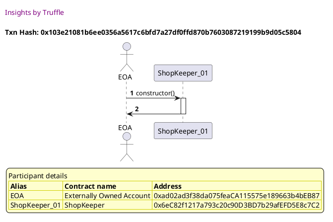
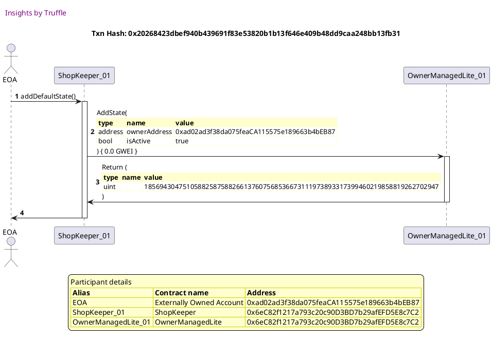
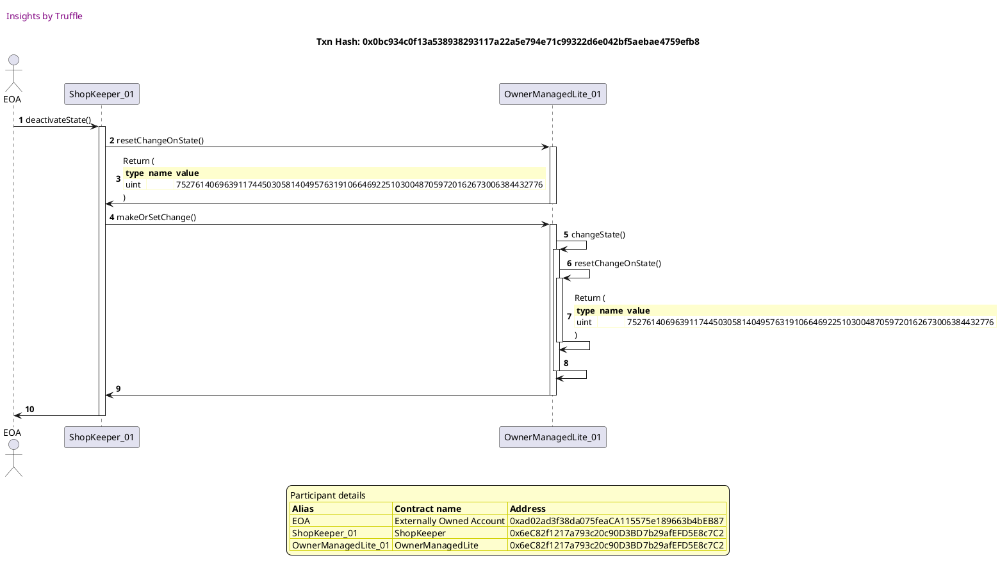
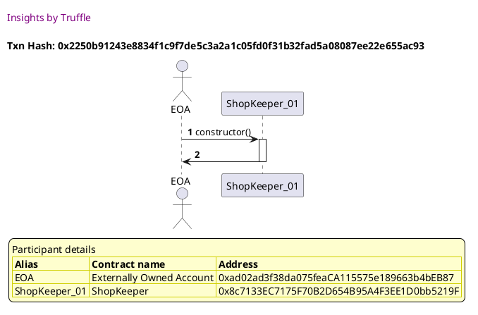
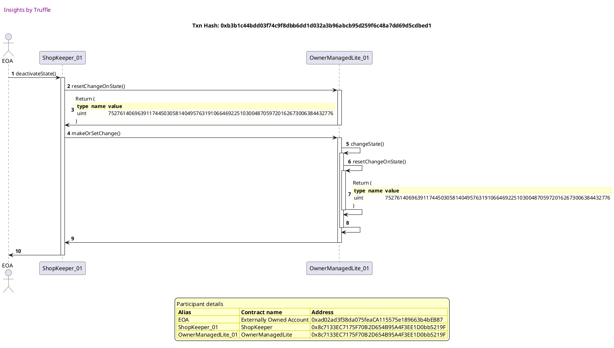
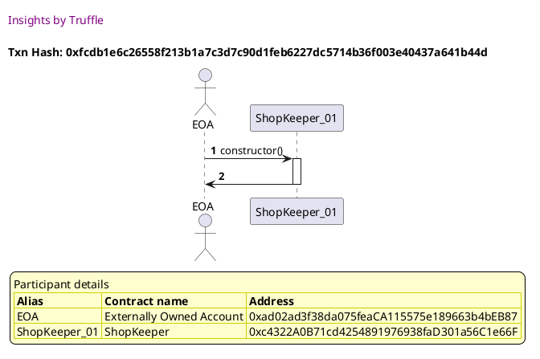
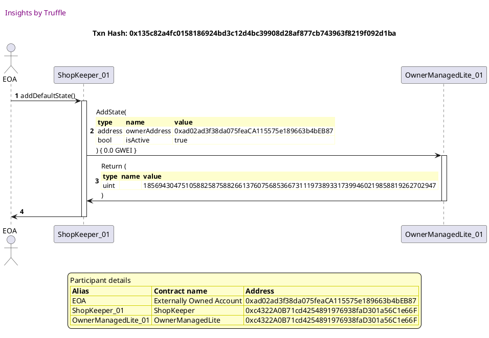
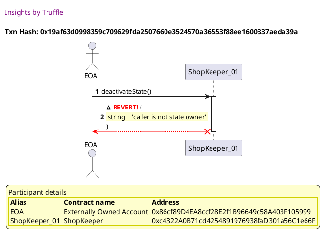

Test date: 2021 Mar 02

## Can set shopkeeper as inactive
[link to test...](http://github.com/thedarkjester/ConsensysAssignment/blob/4fdae3d04e4addcce97e88f438735f476fc16bb5/test/Shop/test_shopkeeper_add_shop.js#L14)

##### d1, tx: 0x103e21081b6ee0356a5617c6bfd7a27df0ffd870b7603087219199b9d05c5804

[SVG :telescope:](https://www.planttext.com/api/plantuml/svg/NL9DRzim3BthLn3fPKDNJB9Zomwoe8dZeCCEBT3U1rcY4gEARCWobdJTVv_Y645J7VJ1HpwIZoBallF2-Nvl216zRso_hz2HxhMshN1Y3mQtQDLAoDUjQtghYiOq3cusvQOiIaBcdJyQN10OrWw5GWT_noV0G-FgjyPwOPQctjezMXyOjRyuR09ufcnxrngy0fxhDmGslTYUX5ArtGAZe-dVSCw_ZqMGCVzFszNRdU-WEiABwxKElCJNtY2y72myY6ut0tfWDCQ8qOnLAIADarGaAUCohRJY8k9AKwrLncd5KnhJZ4SiPtbUvOecCideb0J9f0-bbuzB41rCmZaXGJPVoxeLeTNdNTF-GcpH_QPiSBcoJ0WPOk1kyHc1sziPoCPstlMd75--aiyUfw1pzDqC23aFYZnzIA_GYzfqP3wEwzlDcguffOlt7n3c4Ue9bo88xK8VOCKUJuQbKWwxW5tY5kz3Ys4_U7HM67E4npyM5Iob39_21uWUXAAHKB6ECoKeJpIAOibOal04MPQdQLnDgtALyMlYQua-lWVI58iiqYnYNF0ybX6LELt7gpMlebpeShDEoapo8WgaeVjH0t8Vzl2b_mC0)

##### d2, tx: 0x20268423dbef940b439691f83e53820b1b13f646e409b48dd9caa248bb13fb31

[SVG :telescope:](https://www.planttext.com/api/plantuml/svg/dLHRJzim57xthpXYBqECpPV4iH6hABqCj4sWWRGNfCc9dJOYTIh7OIrq_trk25NB-iAYACS-FkSx_iub29tLNZdVp4g4LEChsynIur1zNzYvSce6fPaOgyzLTZznLMFre2eh1-_6e_5eC4BejFRBqlGGjC_KA6qSF7LRW8lA5O-LzQhibyN4pepr0J7t6uDnE7o6d3TkNfgTWvlYqG29DhfhfNLX9q1mf_hJojDFtILG5__IriLawcj8bt3hcZmFkCWNlZHmkx1meUhf2U05nPIBY3ATcbn6E8sOv9BaWfcO2OfJaXAMyuYR2Ciq4bhBJ2aQYNIjJnb18MMP3rSVNVL1rN0Gv04AQVD5LinLe7ephUPVZPaRzmkJrcH7isjyzTiQzrrPDJ7wM-7DYyiU_G52RJ0uxhs6XAEZ4mXv6ffSDQM_ySgRzuVejTNQSHzmwzxN-jdlpjwXqwxM7phPMtq6lvmR2DAgMIiVLDc4nTfyjGxkJ5t32gfrWFvcYnTAOweqovdG2YTnRjIWJqWS9x4XGdBEqYWTdOla1IgjgZ8u5dK_yyL3Y03UlGGwX2V07p5y-Jcw38smdysU_1mVdy0FunjduV_uDKKerWh2IqJCPSHmbCG4nqBGM2HhmJbX2Gy4kOWPvmaZXCY42SaOIPYK4SUKI15CYQIS9fZAgEEylrBFjGuNH-Xv7j7rLkDeurLHrbjCXdY8CLup2MCNUYWi1c6UN6ZN3QTDNJP-lLNRoU6xyCPPLPRBjYarzBCipBv_OmstWNSdONlVWd8p43Gdb2GgaIoZE9DuoCw7IKgboaVZOJmIMJAWkw3x9kPVxLi3XFHsIKPduHj-ZNy1)

##### d3, tx: 0x0bc934c0f13a538938293117a22a5e794e71c99322d6e042bf5aebae4759efb8

[SVG :telescope:](https://www.planttext.com/api/plantuml/svg/pLLRRzCm57xthx36on1C-9B4yJIgTRre250dkiT9o4bEscYfKpdEQ4VvxvocNRME0gh40r7aOv_BP-SxFYU4NDRUED_CIa9CuolRp19mfBulxDmuCwCbJC1cLoQzdxYgiLclAYj7Nmq7mq5lGCX5xPSbT0XjdocO31pzlbrIUbsvuh6otfJTifZO6LYFYBdVEGpHk86SDsvUmfvXN3m2vS5ETsEohB0JojbMzQEL5--sXo3R_J_OkfXCVKsJ9RrrJPuZBl65Bu7UBYozDlNqdB85Ir8jWvJbN9fGnbh6GalEbH72XA1q08gdMaiXiWXO898yD90O25Ie8KzYWfIb7ey-67MfgUa9oXE2jFaYBUO6FtKyhUOV0URWlZBUkknfzfr7tooupyQQ2MIV2WzF8GVq9uIqcz6ppaj8-kRDESq03rOy60zZZyFfQ_BIQnru2BWDTr23xqsDdS38xX0EkXyumDdPEVq2ld6MdjxPEtAnlInljxApUa_zSWuKfJMpLZwOii79sdr5cmBPM55yLIXKn0CMwKXgp4mGX4ooC4PLe4CLIQuvYw8WqaA474qiY1KBjHACHo9Ig8Xa70HIA1Lju8-aOcRkOUJ6JtJyaOVVWgHjxD-9_5S9EMputzDo_ESSToSF9dvJHMihsNGwSlEi93FmfYZhPrprMPynjkOA6nfM9qvwsAaSrjkEjMwMOSBGjelhhDeUWUF2WxEcB9TjkMUqcwROLTUyieN9c32Pp6MS6QR274olotaOgX1uhAD89a4ok8hLFl1-Ztc-Ra4ZwCKYvmBRcj8o5IpLh2-l-YeHskI3OJySnAdgYNtGGxteL-sn6o2zMvB99Oxuq_a9)

## Can set shopkeeper as active
[link to test...](http://github.com/thedarkjester/ConsensysAssignment/blob/4fdae3d04e4addcce97e88f438735f476fc16bb5/test/Shop/test_shopkeeper_add_shop.js#L20)

##### d1, tx: 0x2250b91243e8834f1c9f7de5c3a2a1c05fd0f31b32fad5a08087ee22e655ac93

[SVG :telescope:](https://www.planttext.com/api/plantuml/svg/NL9DRzim3BthLn3fPKDNJBAis0woe4xYeCCEBT3U1zgY4wEERCWobdJTVv_Y645J7VJ1HpwIZsBildDeNR-l6SFUDQRVvsHPzrgP5YtkeQOj6Rt4udLhczxeLLCt5cussIPRPOpDEtUiQS5WM3j2JHR-Za-0XyPMRurnMATrjJLxCiupbkxYiF7WcRBjRLlJ5V1SlH68y69xGgqhimN1HzE_uPn_7ujWO_wVfgksEzT1VeGNsvUbvsMkSZN1oy700tQx6V1342YU9o889SMn34jH96MaIHKI0nG5LwNcfHIv34hK2ddCuuWe26Yg51Q9P5womldIiySKi8E9FoVCo-QgechHj_gyQzfVH2tPtrmCBbUM2MD33DmjFYDmUpk3eZ6Ti_qfnvUlxBF7AUWSVJS3niw3OayVqcjoMDKTcu_Z-dQpvclE-UBz1_Xv-7hyPUM5jhuFCBYdao7LsbBdiKlSudreqUy7HzPWNH_XyOyX3MbH-4_XFCGFg7c0MfOoriWZLHAkKY6KYXI9E9bEPHxcsJAEhecl9Vhu7aZZ8X9IPgj8H6eJyMMmdgfmcQWqtCWi4skUvoeGoSQJ-kv73TYzt_sN_Wy0)

##### d2, tx: 0x9edce6d2ccb61ab8665e4e9f5e4dd396bf5c49f7ccc964ae2e683276044f3a72

[SVG :telescope:](https://www.planttext.com/api/plantuml/svg/dLHRJzim57xthx3Oon1Zi-FOJX2hw2KTQ9j00salI9CJEsr4wbIEmrhe_ljEqr2rh2yiYdpYutE-p-SMX2vghvnlPYL2gl6LRMQfSQX-AEnSEJN3fPaOgmSgUvYugh5wM9MLm-_6oJWP9WYTrtvPcXx2xJCrIXk7dxijnfULAvugwrNPBuk9dHdh0J7tMuCn76uWvusRbsRluBPuCfY6MzsDqhgm4qn9f_hJolDFtILGntzbws8ozJLEb_ZEDNaEkCWNlZJuRc7nfQgdPvWiOgCp8tIGPQcWAes4u2OqSGwhrYmMQSwpCCvbbcMn29K9Z8XO80K9mvmf6I18MURXwibr7wiQ7u4yGf0sNsJ5N46ejzDg_jMOkN6_26rDzZJxnjU_hN7VbLKJexyLthou7D0V8TIIuTFUQqXySdA68KyZawkczBTUUVF-6BssMZiU0cxT-rfl_ExjFJhlQlsXaxtLP-oNSuD1MZLhvQCg6_XOcw_MvCxKDLxXQatGtsx9GcaIACro5cb59C-D6lOfvLnoGwDO29Q6QJA8v0jKMbKbE1PrF_F58p1Wxrw8Zl4p9Xy9_l8pkO96E1pDWVoSdfxX7yOtpkB_Ywyfe5Wh32-Dk8X3HaB9AU5H5F18heKGb46RI2uYpeIGZ58QInR5Z579uZWK9A1n1AOq3aGWIH27NSo7AxMfDLmSeSqyefkTnj76gwAiTo8PaH4XP1q9Z1tq47mCOPuSjEisfcrTjdwzLTl9i2wySLQLvR9jIetxMGQpxzzOmrtW_KdOtRUWKIOfOybGKid7aWo2aU3X8ERzSCoIX8v8cd98sNWVzD34_AjzAm6ajqioke0LVer_0G00)

##### d3, tx: 0xb3b1c44bdd03f74c9f8dbb6dd1d032a3b96abcb95d259f6c48a7dd69d5cdbed1

[SVG :telescope:](https://www.planttext.com/api/plantuml/svg/pLLRRzCm57xthx36on1Cs8aloJIgjLsg8K2Tw1ud8JjsscYfMpdEQ4VvxvocNRME0gh40r7aOv_BP-SxFYS8NTP1-T1CAuHK4sQkcMhhKNrVkhdoQeehExREz5H-F_Qpnfd-h9fv_6gG3R9-Xj157PQLxI3SFXEhZFNu-tQ9yVNCbuyp5rJLhSgncreN0B48EuS163UGyyRFAxjd69MF5bEsqzqeOqetnfHiLJzQUV5kUmYqtV-3gyln9DHOB_6jRue2S54eGsNnxSBXQrLFpZ5Pw5ZJd35j38aBoVAqI8pMmXWAYaZ5EXLAvphb9k9f8NAMA6cCI0tFZRQ68g0i3t3qRDZ5giOd84yGq1RAl9mh-DJHP3R_QEtS-g-4jYvxcdtduJTd_MVbrDYQJsMmJo47z2S8jPlXiyvBIFpcpJas5WvMFgXWHm66qzVefTSwy11m6-vjRKD_ejpO3jqEuQ3xWGESdPtZBpOqtk7JEtU7BhQNvUrMTbRlSLZEBGRfrBIL3wfgOB9sN-6c13PM65x98oae8o8LSKgfP8oJcF04L2pbKiGqfKG89j8euXHCX2MIy5H6X8f8I528E64iZgGK6_WZgPYgUplqeoSw_iZ3Rq7oDlRlHFwhX1ms_EzfEVvpZhkJ1nE_gQAr5Mqw7RfvLfB61bLMzJEkhiWL8MJD5JGqg4wOzA5JUQYt7MjTOo1XODl5TLPjZu1n4QntgggMRRaRtCrpwAfhNib26H8f4nTnOXIHlB2gtwMKSyajJL8XOirqralaFl1-Ztc-Ra6JND8uplgIIZwGf1TT2SvwAU-oGPnbz8fepIEQ3lP13_MYNxN7RW3qRab6bp32J-Sd)

##### d4, tx: 0x21eea832d1be3c90b624a3f821b7c96b9133460135114e49bd3ea1edda47f7bf

[SVG :telescope:](https://www.planttext.com/api/plantuml/svg/pLLRRzCm57xthx36on1CsF4jcKQrjair1AWJtUCavCGdRRJKhHndjAFyTzoqgzPHG9Lu88fyx7Fvx7p7vmIXozfhvvjfXP1k_CmsqmmSgkzBEzTEJt45Ox2cf_FxiPirrlHdrSpXLuDqaFPJX2vglwoWWt3xJ40RSFZxTednzSoLZpFhTTMjoh6TWlK1iV0xXq4mRY3dZPjNi6SObO-0AT_fRhGnfHrZIhQg7wsyUBSz1Dhk_y7MvNZYQvmjyQrhYYBW8b_w2l3jmk9hNK_ECLb45437B38q0vOd99CHrwo88vgfF95PGXdZab0cAEN0aymmq1ICqLmLAYjGe2ptuUZfi8jrZK-2F461Db_cvLo7JnrDPlEF07DmNmbjNVOq-yx3RnRSPstr6CodqiDJo07z2KBjPlYiyn8IltbpZiEnoWVjOUJ3SFeQlVHPXns2ROCTrE3x4st7CBGxX8Fk1xO_Epl7Ny0tpkBJEtk7BhPNvUrMTbRliL_E0GTfzRIL3xfgmcJjli9D6RXOuV0g4Ib9EP69P0cbYdD1615nKF54ACbeGecKN2PH96Wm4Huh8X8L4IeZgO92ifXp5YabD_17KZ7Lzp1qeoSw_iZ3Rq7oDlRlHFwhX1ms_EzfEVvpZhkJ1nE_gQ6r5Mtw7BfvLf06l2wh-XbNL-IA4BBcAhIpK9jXqWzzoeLwsx7MDIOaBDXsSPrLso72kF3WhAwgPLli1dVpFFJKDQzaeGs9j645YuqcIXIW-rrAXL02Q9n8oJAUfRrOxGFlTvZdwnOqpbLeOcbVKIK6YlIYAobuBn5TFc1fIgz8bec89eDzq4ETw5VjiHi4UhSaeyimXb_EJm00)

## Cannot set shop as active
[link to test...](http://github.com/thedarkjester/ConsensysAssignment/blob/4fdae3d04e4addcce97e88f438735f476fc16bb5/test/Shop/test_shopkeeper_add_shop.js#L30)

##### d1, tx: 0xfcdb1e6c26558f213b1a7c3d7c90d1feb6227dc5714b36f003e40437a641b44d

[SVG :telescope:](https://www.planttext.com/api/plantuml/svg/NL9DRzim3BthLn3fPKDNJBBaZmHPK2Tnq6675cZlWopHYL55DcGPIxhklqznZA2f3lhW8n_9Hn5ottdfVBytXCZUDxRVb-X8zrhRLZgv1uDRj7efrUlMDRtLgyOq3cusnQPO5OJCEtyqk20mh1rAZGx-Za-0XyRLRutrqkIctjezMXyOAtzns0JmJDdshZLu1JpNRmXCN6nFKklQRe7HqVHlEEVVnoB8cF-dxUhjpdTG7k75zLKLU8cllK5uELXuaDrk1lHGALqoJ5IKn75MHOoNJAQAwrHDgMOLbaaKfLh5AHCbJofAEGegU2eJmKeXD0cIAHzABnvpa1rCmZaXGJPVgxgLeTNdNTF-GcpH_QPiSBcoJ0WPOk1kyHc1sziPgCPstlMd75--aiyUfw1pzDqC23aFYZnzIA_HozfqP3wEwzlDcguffOlt7n3c4Ue9brKGseK-mCezdWovrWwxW5tY5kz3Ys4_U7HM6dE4npyMDUHAXK_X0qGFKjD8QbxnJ4kQnXNALSvO7ASnicoQ9BmKPR7CqclYQua-lWTI9NWKvNIPCgL558jiogPfCkLP9TUSCXadgp32P1D8G_UZ1kG-xE5B_mS0)

##### d2, tx: 0x135c82a4fc0158186924bd3c12d4bc39908d28af877cb743963f8219f092d1ba

[SVG :telescope:](https://www.planttext.com/api/plantuml/svg/dLHHJzim47xthpYnbo76PiU9uo1MKKexq3Q11j9Ua2OdTjg8rAaSXxNG_VTTqr2rh2yiYdBs-Uuxtzrt8UIizihvPbeIeXfVsMQQ6aVgXyBEb5DJACtOM7skieUngngh1rLPENWt6ew6Wo4XfxLVbAP7e7qcHcdZuBdR0bnMhdYgh5Tblop6TcgiHyJSRmn6UBY6d3LkLfgTWzlYoG0BDxeRfNLXny1ef_hJojDFtIL85__AriLuucj85t3dcZn7NE8BNngucrkuLFNa1EYSyIYJWGhpZB98CYcI84mrprYWmpJZIKAb3gJAPHndQHpoHF1S1Yp9QH9ebYg29SiyNdrutGTLmm7A0u9byqLMp1IcUZkfPb-DcHdtYxBMP4UpQtpzsnhtNLarDlfRuSsBonxz0I5jC3ZklOQ4ewCJm3fTc5mrfR_rofltX-IrrSfn7t3htjTwxNTlxybfr-iFdUmjFuDVp0oWj6hQoaTLDhXOcIzNmPsfQrX2jGhGtspfN6aQACrpBhMYSPGRDUWp5aLnP9XCXE1fc0xFPVm2bLPLYOv5tSzyyOWHmBkNG8Vm3FGZXIy_XrT8XFtPxAdFyV49_32-SHR-Bx-cm6Oj0Lyc8v64d8Pnn6WaPH39U2M4O3mMcA2G4HSYveon9EOouPp5oAjGKAIHH5EM12A8QP24NSxxExNkDLwSaFKyafijucZZLL7MMvbSq0jAwIeJ73la42u6E4yEwRh9QTENZLzlsJ8PltDld5LbkMX9gQ6VPJZx_eqzt0RUdOJjVGkQXJm8-lGyPfaEWoYK2HPC95pcwe9JfY8nO4Q8qIxeledvL_lM05ZUhiZa3B_uQ_mB)

##### d3, tx: 0x19af63d0998359c709629fda2507660e3524570a36553f88ee1600337aeda39a

[SVG :telescope:](https://www.planttext.com/api/plantuml/svg/PLDjJzim4FxkNt43QK0PmdbpOzH5X3OLqpw00EtBc2PZNzg8rAaSTnJM_VTTsuXH5aNd-Exy-BddBeoTjruvlvZLZAc5R-nYze2EjO-LdIkdPb3Z1AsvKFfnufg5DSEcRXpiZujnCImO6xJ-kSQCmUQPeZBeu7Ut1RXiNFNIMA_glAucTeRM4sBfNnF65Dn2pXTkNkDEuBPwGGZYLz-rCgQo4mXuv_gpMGUd7GdMtV_5jjLawbjuU8OxjoXBmcM-yZN2tTB2fMgdPy2NWLIbY0oNCeqIgVjSYb2MHeK9xml1CKh2EEbp5OaaYSeqHGm4vr7KLsXK91KZoRGdwiLL3gg5FLht6CdcArtD5PLwEstcNn7dw7xoO9EouzbZR7C6JhBt4JW-FWE3X5_zKXvlFPd38_O-QtdoVT-X-R46s2ATdC7WuvDobeJAOA2txQAShDUxARuLDtSVUht1wSQVmU6zlMU3hfkVkZLRGUlTMkWLq7kWLLsJgbKBjl4K8YhGF5bq1x1QdpzY_uZ-N-5sWDZr6raCUbNLxPkBHtp4ESzMdu7cX7IYZo4DW2DOi6g6QqTkZCEMOg_dYEXQUh9BZyuIpMUu8c86SgrfM3s5-38LkapbA2xoLEioJ8km32wa4B7KIPh7F1e7F95IxWBljkxjVWEguoWCStxH3xI9moHEPI3xGaPfgKOH3rGYXW4ACIPGghxJW9sJfL_jBm00)

