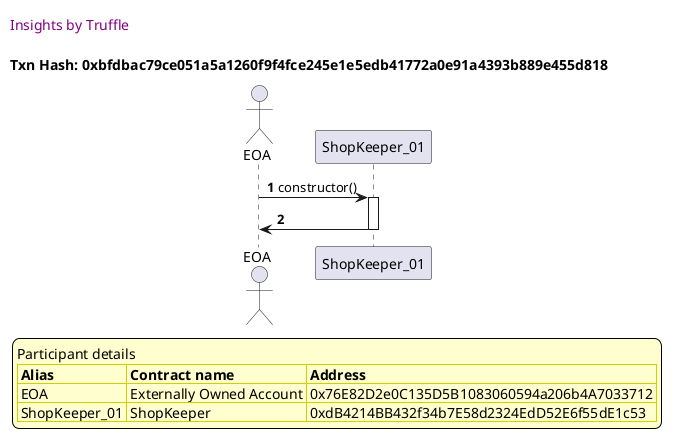
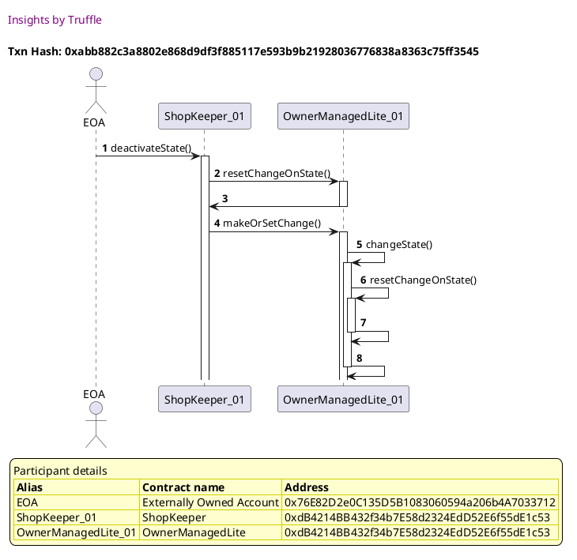
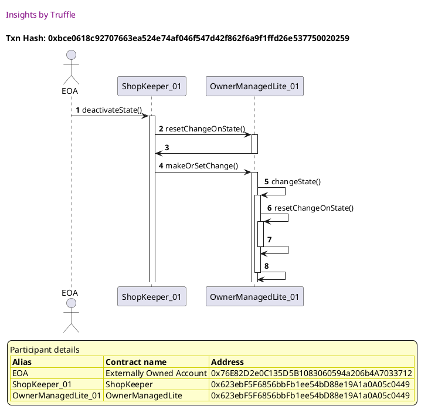
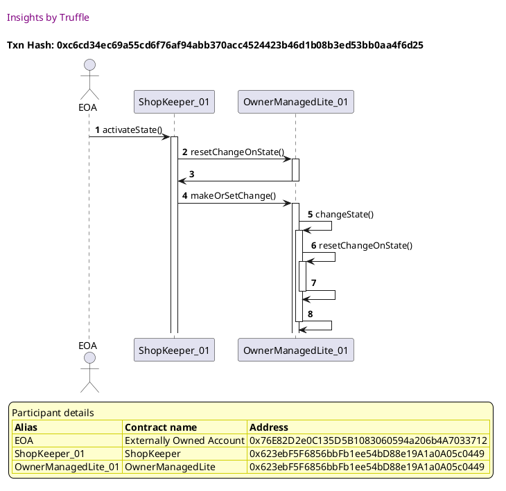
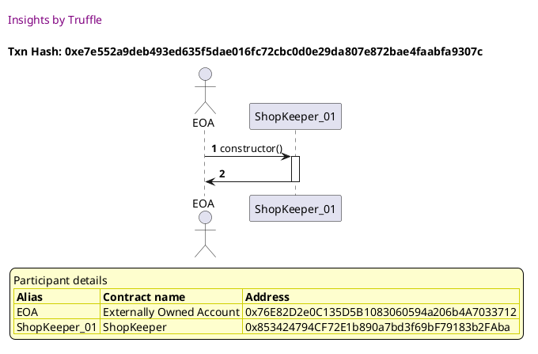
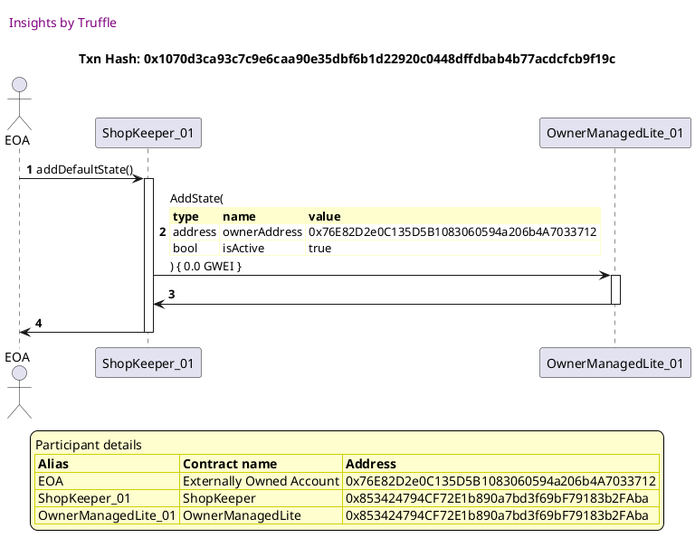
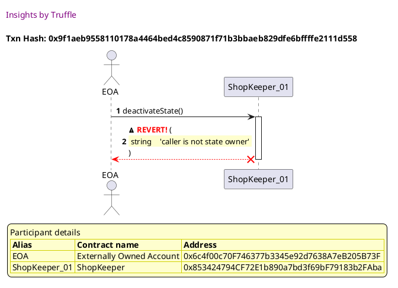

Test date: 2021 Mar 11

## Can set shopkeeper as inactive
[link to test...](http://github.com/thedarkjester/ConsensysAssignment/blob/7c5b2f21f354ab6c2adcbc9e6ca114bc570081db/test/Shop/test_shopkeeper_add_shop.js#L14)

##### d1, tx: 0xbfdbac79ce051a5a1260f9f4fce245e1e5edb41772a0e91a4393b889e455d818

[SVG :telescope:](https://www.planttext.com/api/plantuml/svg/NL9DRzim3BthLn3fPKDNJ9Abs0woeFbmq6675cZlWspHZb55DcGPIxhklqznZA2f3lhW8n_9Hn5ottdbVBytXAZUDxRVv-X8zrhRLZcr1uCLMhrInMlbcjxgTMCQ1pVRR9kjCqBcdJyQN10OrWwLHWT_noV0G-FgjyPwPPQchkmUhG-CfRyuR0Dufcnxrngy0fxhDmGcBhOdfNLjAs1qDFqRpldtiGWovlzfkxhQ-Gxo8xoulYm3B_6rDmWl1miFgjlDW1xoKkUgYDC2gMHAAiQdj4nBKHR8XKI64dKkM1npHJ5bIaHfb2T9Ya9AdR241CaA7qhF7fUWEfY4SqA2RBukwbQ5LfztJViBiKNtcxB1vSeo8MI8WRl5PmHkRsTGDBRphZ_b-FALVFOu1PsZxsP0o7bGvEb3UerUrQOZyt5StsusT4CfNRp_W32FK4-uh8FGBlG1LktnP5XgxR0Bs2LkyJwq6FQ3HsULCKTu_6DHmx8emgVm0QA7U9ebVCEHhbaaDtB5Q1BHAPMfK9nESx6CQHJ5Z5yJNqlqyJsGwfNWJAnM8k9b9F8uaudc4HUPtaYUJSimYOmLCWgaeVjH0t8Vzl2b_mC0)

##### d2, tx: 0x29c9384fe713e175dbe6c874fae5244049d9ebcca665a15273a7a68e58bc6cd9

[SVG :telescope:](https://www.planttext.com/api/plantuml/svg/bLJVJzim47xtNt5YBqECpVcT8bQHjc6WRG89fBqWJOvzQIrS9t8SraBtlyzDGzMolf07dts--yx-xdC8kMWiCxQTAq9OQolTpWiqf7cKkcQ6pK7X5BKOCVuuDLMhnRXIbO4Fb_bbFiu9EM_iKk6GGFVDa0aqyD8l0Qug8vyhRPdAb9pgEMhh44kx3RXqcnl8kZMrmhsDE_cCu8LRtoqJGkefUBHt_Uti-PV-4AIlVwqREPtP1eebt9ksB1qkiT8gXFk5XYlMpCw0Blm17mHfM6BY1UWbaIWmvcaIbWmZFmnfE103B3XdSHmnB_AJW2KiJZ5A2nvpCI2ECcxTqVER35W3HyuU4KURbLpMp5trRbRLtn5hDB-fruNiUVQ3R_veD3-PPbCKFwJ5rvG3_YD2kc9mEdmB2ISdP-1ucc39McNlBBFuyPYyZLed7WBkqZCXDdaF-e6Szxt-rDlXwYlOPOtWh6RppZunrRh9EdorBcwmQM05rRf0jbtIHHBdgJ_naOwz89f48u-c0OrfD0YPJ-CYp18Q18ddlq8LLQLSecmoRkMJgm3Ml1OwXXUWdoby-vLVEo4Sliq1VavFp-0W7Hj2rxja8tfokzCTWPP9rUpGCQ4JIkcQ3gTjroWt6JlH6gU9BJ7Ros_pXgjEBcvSM3IQARNiEYyWuzmzCFjEedQ1z-Msk-v0nIZqlN0q2WE_3C8YoQDK-84Vvc8I-NbSHf78FHu5-w27PFc_zxq57BqzoUJ2ZUx_ymy0)

##### d3, tx: 0xabb882c3a8802e868d9df3f885117e593b9b21928036776838a8363c75ff3545

[SVG :telescope:](https://www.planttext.com/api/plantuml/svg/hLHjRvim4FxkNs6bNpPrqOoDmOcog7cXwhHDgPH-dmm-20gOo3XRqdR_VIwbKUdOfaxZmndVo_FS7NSWT55RQUo-B12IUrlfVHc3GVKsrpjfP8aBo42hkKoscQdsMYsgeZBux3AwZ1OHGfFQ7WkO8jmy6v0A3BvhhnXVLIQ_hRILnQp8Crs2jWunjIU7IsTyXDpjpQw0Zc6TtmBs_9FkMYgLwmnxf5NzQCx9-pO9rF9_r7MURMoDuoE-CViqTRZ8vhO0V7FG-4hMcp4c1nd7Gj24II481H48DL8fIuNWdXS27x5u55DlH0LXGHW6WWafMC2IaASfupv7hcM9TQb7gncMDHwuSu1SssoUv3lfIbrlgjqdW1sOhyHhN3gQhlFgkmRpHMgPWVgSMtWAwT4F46h8y73w4XAVdu-n0fTO_arQM5idthn5BxqU0lk0ct03DTZ5HkeCLlg4qElUay1mECQluolb5bPc_SJvHxBVWYHDxD-p_LzLznkQslyX1Ztk6Rf-DX0AhCoB6atQRNjtjYHBGiZq_WDsw-Hcmxqit9uOzxMnbYKyA6PAkKgSxHGtlMycrCc31QDbKHoROLDubYHkfwqpaKCOH88kAP25n_YIppqY60a87_cIaY3sPo5XBFHe5xWxuS_l3QYQ-zJpvtEVqPJvSHXneIYZVgIMd4P1ohcAl8IpBcZV9logVIs1Qs_RP7JXfFlb_GG0)

## Can set shopkeeper as active
[link to test...](http://github.com/thedarkjester/ConsensysAssignment/blob/7c5b2f21f354ab6c2adcbc9e6ca114bc570081db/test/Shop/test_shopkeeper_add_shop.js#L20)

##### d1, tx: 0xe490fa911ce74482a1e6e690e2c5e8e0d00e4b4a0812f6b164b54b3319a596a4

[SVG :telescope:](https://www.planttext.com/api/plantuml/svg/NL9DRzim3BthLn3fPKDNZB9bnGwoe6uIeyCEBT3U1ybc4gEARCWobdRTVv_Y645J7VJ1HpwIZsBijlFA-Nvl65EzRso_r-HOzrBRLZcr1qDRijMTAb-shkbjjMnCu-2gM1VhvPgnUUTV3IqO36j7gY87VySdm7tZwhV6UcLoKs_jdgmFZ1j_TYW2UA9iUzSQkW2UwZS2BiwsHrLLjTq2nz7qRpZdtySYs9Z_f-tgxSvte5_XsVMRJU1bllQ6uFbWuLvrkndWWKI66vLnNj9KY3HId2J932ag4qe9AqGIMYXCURIHcakX4w7Zc6SgoQGIB4XM-b3w-Y47rS4ad1CMPFDrMRSgjFgqQzfVH2svtyW7bmlBXB4X1cuMdn6ulfv1sTZEk_wOuyjNzjdZ67IAlfa1OwT1iSSFwIlogZOTcu_Z-dQrmXKYBjv_G9X7g2TSba5e5_e0g_PqDEHLvQWBs3bkyJwq6FQ39sULCQ_myCTI1NbPXa_X0uI7gLodqIeYNF8uMILt7DCO9IQPK15ABV8fnl6KHvV4bn9zV0-aCef95qaXqqHgNMXE56QmIbFYMSuLvfYKA4GMI4FtemRiDkpXI_y7)

##### d2, tx: 0xe7c0c0af9d5e0db81011dfa6d994be19e478b7fb5929ab0aa9dc0db474cedd5e

[SVG :telescope:](https://www.planttext.com/api/plantuml/svg/bLJVJzim47xtNt5YBqECpMdp4x6Aq1y3RHD88Eq5QRBZInlXEf7Zi1Qw_ttND5GjwmjvyDddk-_ixpw7iOlQ2UkQkMPCDAuqpLoYPVLZOIfXnHmqJj6eIv4zJctP63KiTMdXmsGy6G_7Z9tNRgbnmA3zPYWKMdZfbW1NfIsUI-E4JdKnDNCqZX1pjmsOqEO6icfifN5luwvuHl3yhUzMA5MOANYyS_rjxVcNxX2igtzjwc8wSpN89TpR9iy9bxd2QOJxXO4hKS_EW2ymodZ6HPwe0BcIiSSzJ-KYL4dYI_GIzADOHhaCabuY91SYKHd5-P6VeQ8SHfHbZeu-lab1r714zeWHRQx8YahGLUzcPVKTiKBxctjjo9vdF_ZcZq7xKnWnHVMZSFYQSi1_n5XR34u7Ro7XvEGCYASHvgBHxiu9Xn-FsTkeTU8Xu3OzLMgJzs0Us7dNwq-T7Qo-WbjM26IDcBVsIUY69klmrRgunRg65PJh0kbsoHTHE8vxenxoeTSFHi6bn-C-3tcG-AB7G-cd4U_t8w_t2YNBKbDYKQUPAvwe0ZZxMkWONe1_vl3jr_YQX73uDWVuEJqzWuDqR0XTxxADwDdjJdSKEb7eUeUE4HznpjTqaBQfKJGPacWjQM9BpFRosxp1gfKBZGk7rWYjbstd5QHPHW_ClPEeNU1zkUskMz2mrqSv2IPX78HIJgI76FXo5CUazTGJFEL1ndq_sGSz9Cl_lUyjGFHs9BCB6kd_ymy0)

##### d3, tx: 0xbce0618c92707663ea524e74af046f547d42f862f6a9f1ffd26e537750020259

[SVG :telescope:](https://www.planttext.com/api/plantuml/svg/hLHjRvim4FxkNs6bNpPrqSoB3KHPL9e4TTgcL4g_JmOV10KCCcPBskw_pwKqAXtRr6byEEDxUPwxumw4BXhDbMxB0Y7UwagsPGmADVjSrbpn4XUGWHINFDbdgcgbM5P5fV1Pj8xMopL2yqOV2rWWt3qxu08Klkkl65zLAh-jfEP5MEIPB45gWvZgaqDaZ8-GTQlg0WQ6RNuBs79FkcikH2upR95UzQCxv-_x953F_r4sURRJ3OwF-4QrQMfmaSvr0VZc8F4LRtOpJ0vn0eHPVXBO7l4OSu1JsmNFvIbnMKfTJxXswZCxPJn8hJGLDWFgU1ubn2Os3P1fMQ9DwkjDY7c39-QS8DCsdITvpKsfsrrLVmAeGNqbLkSoq0oTDzybg2zSyWp4vrp3KyY8Ve9GHuQdYvUG-FnyXWMOnF9lNCDM6_7cBNhfzH0u1jo5AsX0BtTSPh2H9uHHzv44fjCPVXrVoVUmKTidpZ-I_HOawMB_dkt_gdhSqDN-3p7eSS_GzRE14A1vNZHetc_RkxCLMH525lSVi5adCnlcPMdsH9clZIKluK4H2c4gCRPJtEA-cr0Z3ngKv4Lnx8PDu319p4vhOo87ZwrzUsK3MLeENT5BY_WEOOG6BhS9YztG8uxZMVOGU3ZXp-yTABCTY2CQCP-oE8vY2u2wyShtmGf2YvEGq8IuRZ047Tk4NxMl9J3jxPkCBemqlxoV)

##### d4, tx: 0xc6cd34ec69a55cd6f76af94abb370acc4524423b46d1b08b3ed53bb0aa4f6d25

[SVG :telescope:](https://www.planttext.com/api/plantuml/svg/hLHjRzCm4FxkNs5rNq2ZmdbjMfLgMTje250dTT_HsRwaKHEdSXnej_7VyRAkMaO03P4Fv_XUdkVkSXT2Bce3sZHbGGWqfb9DoL6JUfkh7MWeQO4PAda9Oflfgb5oNXMLfcV9CbdEbuHCQtCeS4Pe-smG96fwTxnIUbNf_BPI1eguo3DLeZ8MCJKdXyGQ7o5tZTuLs36iyrkaZd_INOEKkSgemuwg7-qvVNzCWXpvFwewppQcfln0RtIJfXQNcDmKI6_sYbv1lPbGjXUXa9wF8Xn340WPfgCGqh4Fd7iZ1aBuWUlxhiVzK3gSHTn36NYSCm0_3QKR4DioOMpgorLCeQO3Umw8RPl9HRu3M-fwK-q-8UvGVsLEwzBHT9rNtnNgBw0WG_avD_WKqgCV4DAIqU7i9IGzFvzGcrR-3GokZHLltfANFWzXVR1jiCOQpNm3AiELEY7qklVG3uSJ-Zg-4hQuqkidpZ-I_HP4jB5_p_P_LTrlQ6l_XnZok6Na-jauI3IG5pMP7dVjtTc2BHXZi_iFr2wJdGpxChTRektNfWfAV534KjfAhEqKDxjlvzFAlK6je2WExQX96WjXDzfO4zkFmcNaBbnaSySB5i6bmoAFXIomw-2oaFlnY7dUo76xmDtvVdvlGKFNGvu4IHW58US9Tn03do-Y29rnx02BMI2Oxu-xe7rxyAlsjGIslSScamihxG_l9m00)

## Cannot set shop as active
[link to test...](http://github.com/thedarkjester/ConsensysAssignment/blob/7c5b2f21f354ab6c2adcbc9e6ca114bc570081db/test/Shop/test_add_shop.js#L21)

##### d1, tx: 0xe7e552a9deb493ed635f5dae016fc72cbc0d0e29da807e872bae4faabfa9307c

[SVG :telescope:](https://www.planttext.com/api/plantuml/svg/NL9DRzim3BthLn3fPKDRJFwK7MH1tSH6XnrQeBqNb4KdHXtPa6KiwRh_FiKnWgOww8EFV2GVnTXTRz7OOTSmXeDjzR2JP5Z_LkiE3UwWeGrfTO_bsyQqWrQhjcaDN1LvaQzonXQzFJIqP32kBQ4Y0t-d9y13Q-htLbjiigRUw1rfwnWhUtOe77YYx0RJDNG1FDVl15vujZsXKhNUWCSdqx_nNFoOYc1J_b-whpTRsuCym8iPgihnCblRXk1bh-41--qS-9u4HP6FgI8PfW6fE8YgI25nBwvAuPUov8gJdofCkA14-18fh11bXMd0HScSPALrfUUF6M0FCtVEc9FDrcNTeMlrUTjsluawCg_S6rqkB3F6nXYuNNv5uFfw3cMhUsk6OuvltzbNZsFGAVfs3eoT1iMUFgLNPB5kUhQOndLpjUPhpldouoUuURXwt6NbX3Qk3z2uewCXKyfGxx1ptF9ZRD7jUqj6OzCSuF6F9WLPMRfFOHt4zoBE4t_j4rzvGRIExZsU13pcKHgYpsCPPe87WV3yI-9BYJw_Hz8a2a8_56cuAeIVUp99EGgfWYfEPI5IBmcaNsGI7QdhVjA0tRdTVUd_)

##### d2, tx: 0x1070d3ca93c7c9e6caa90e35dbf6b1d22920c0448dffdbab4b77acdcfcb9f19c

[SVG :telescope:](https://www.planttext.com/api/plantuml/svg/bLJVJzim47xtNt5YBqECpVdHfa6i8hJfGDi44aXxGPhEFz9Qk4xaEAo5xd-VcuQgPNqX3pxxVFUT_Ttd479HExIkcMj2i76bQUPCMb8_AbEXnJbeEPL6N29_dDgoCM9KwjB2Xqa-oKSv8UUrMsev9D1-Cub2MdZfbW1NfLNFfN6eCwscPYwDyuY5smPC_EO6icfifUNUnfrwbX34Mzyj2g7C50BQkVwszlnBTmZIrRysjPhEN0ri2VUsAGgFIvnoMiBzmi0LrhCpe8k09bH47DE89poLVOwOKXdr12lwB11Xc8QKqpWUYA8G35dCaWIvu0LdQH6ad7ZAkFD7psyom1gEl3qYdZQdkAhGN_LkLbRVfQoa_Ks3DcJFinzyyyT8-nCDJgNuePnyJJdWFoAaBGQdmxUGS79o1fwdiIomqUxEePCVZydRg7NY8U0sFHDYa_TW7iXvr-jFdHskle9RLXAyDJXlxHFgna_MuQjrSIlh6bPGhWjasoLT9Fry48v3IKT1r1ltBWCwY6YVzj8OGzfdSPRGA4g2y1MAbQNsYQhEk5DFlW8u-rhe65w0VgRmxLT-xOLm-3O7-3azFOE3T6m8NU-IZUZ9xKvtX7IeTBr3nvYEAQLhEhosVQFyPEH5QxqcjiHiBx_D6wvQkVXnuQGrgFMoxRo0Z7F_mDmxYTe5tfVRxhe57VIYE8oJD1vDaZ0Fs22bc30H5VsKJP8q64Gid6GCzq4FoV9_xtiBU7exaic57_t_vny0)

##### d3, tx: 0x9f1aeb9558110178a4464bed4c8590871f71b3bbaeb829dfe6bffffe2111d558

[SVG :telescope:](https://www.planttext.com/api/plantuml/svg/PLDTJzim57tthxW3QK0PmaxIEa5TH2c9cFO00hINCKrsVDD6f4xbkAEmxh_ljeqOPLPan_VZ-FZSQyREMw-SNyngnjJ2DtOnq-XO-rZPkN9g1ZLEq9eBLJnENBEmPjpKZOFzFCkpSSROiFNFDQOCDcEAog23tzqMuAfnrKjZlQf7TJMnCxIU44l_6f2JSmivNxXvZJkEk-e5GKIljXjbJ6Kd87Xd-hDPXwST2TQT_yMsrMJgMz3FSEyMPKcup5U-HhXVMhXIxVGC-38fXKATzFkn45p8M4NH8D9eeYBk9poMefH2XrfJK1mafiI1BcbW88GmbCL8ii8JzUnw1Ag5FLht6CdcgwAQAxhgtRIPVqMSe_l9nIPanxB7s2O7JjBt7ZW-FWE3X5_zKXxlF4s7H-nzrFBa-xv3ysCDi4KwEOFXnoVbB0cLmh3ObejYqbxlDlkMtTv_wFM6fnjx2eSFze4Dksf-wjPq1QrtQw5NGDz1eUgQLArQi8qd5r61vicYEu3LEl-8_IFw_mst3SHktiXYqAkgRjySVCalEUVfwZDGdv1Ez3Ec1d042rRDS6qO6UEm9Tzh7X5TIq_pqgEpHFCPhecOWL5HKBDwSl7be8XApWl9SnaDGYbr64PzJ08Z1s4yadWHyFw53FDTuDtIlTrlGED-60MHJA9nBeDCw3ZXIceJbeD4vp8HSQY3VAGLWTBjEmtOEStqrFu2)

